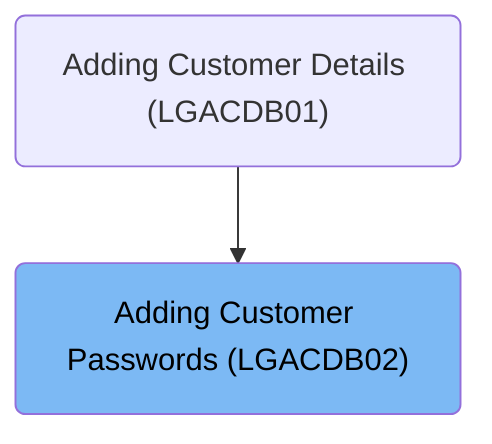
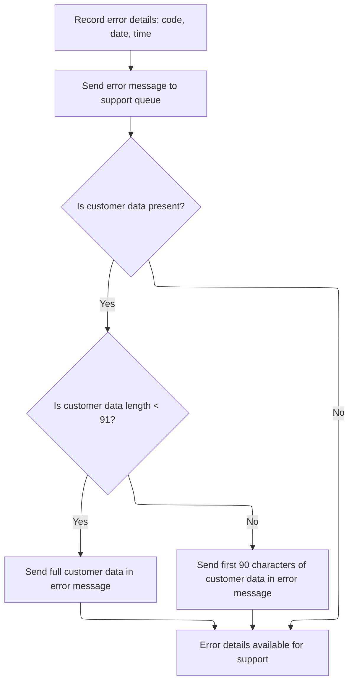

# Overview

This document explains the flow of adding customer passwords to the secure database table. The process ensures that each password is associated with a valid customer, includes necessary metadata, and logs errors for traceability and support.

## Dependencies

### Programs

- <SwmToken path="base/src/lgacdb02.cbl" pos="13:6:6" line-data="       PROGRAM-ID. LGACDB02.">`LGACDB02`</SwmToken> (<SwmPath>[base/src/lgacdb02.cbl](base/src/lgacdb02.cbl)</SwmPath>)
- LGSTSQ (<SwmPath>[base/src/lgstsq.cbl](base/src/lgstsq.cbl)</SwmPath>)

### Copybooks

- LGPOLICY (<SwmPath>[base/src/lgpolicy.cpy](base/src/lgpolicy.cpy)</SwmPath>)
- SQLCA

# Where is this program used?

This program is used once, as represented in the following diagram:



## Input and Output Tables/Files used in the Program

| Table / File Name                                                                                                                      | Type                                                                                                                                              | Description                                             | Usage Mode | Key Fields / Layout Highlights                                                                                                                                                                                                                                                                                                                                                                                                                                                                                                                          |
| -------------------------------------------------------------------------------------------------------------------------------------- | ------------------------------------------------------------------------------------------------------------------------------------------------- | ------------------------------------------------------- | ---------- | ------------------------------------------------------------------------------------------------------------------------------------------------------------------------------------------------------------------------------------------------------------------------------------------------------------------------------------------------------------------------------------------------------------------------------------------------------------------------------------------------------------------------------------------------------- |
| <SwmToken path="base/src/lgacdb02.cbl" pos="167:5:5" line-data="             INSERT INTO CUSTOMER_SECURE">`CUSTOMER_SECURE`</SwmToken> | <SwmToken path="base/src/lgacdb02.cbl" pos="146:11:11" line-data="               Move D2-CUSTOMER-NUM    To DB2-CUSTOMERNUM-INT">`DB2`</SwmToken> | Customer password, state, and change count for security | Output     | <SwmToken path="base/src/lgacdb02.cbl" pos="168:3:3" line-data="                       ( customerNumber,">`customerNumber`</SwmToken>, <SwmToken path="base/src/lgacdb02.cbl" pos="169:1:1" line-data="                         customerPass,">`customerPass`</SwmToken>, <SwmToken path="base/src/lgacdb02.cbl" pos="170:1:1" line-data="                         state_indicator,">`state_indicator`</SwmToken>, <SwmToken path="base/src/lgacdb02.cbl" pos="171:1:1" line-data="                         pass_changes   )">`pass_changes`</SwmToken> |

&nbsp;

## Detailed View of the Program's Functionality

## Initializing Transaction Context

At the start of the main processing section, the program prepares the environment for the transaction:

- It clears and initializes a set of working storage fields that will hold transaction metadata.
- It retrieves the current transaction ID, terminal ID, and task number from the CICS environment and stores them for later use. These identifiers are essential for tracking the transaction, especially for error logging and debugging.

Next, the program checks if any input data (commarea) was provided with the transaction:

- If no commarea is present, it prepares an error message indicating the absence of input.
- It then calls a routine to log this error.
- Finally, it forces the transaction to abend (terminate abnormally) with a specific code, ensuring that processing stops and no further actions are taken with missing or invalid input.

If input is present, the program:

- Sets a default return code indicating success.
- Records the length of the input data and the address of the commarea for later use.

## Formatting and Logging Error Details

When an error occurs, the program needs to record detailed information for support and troubleshooting. This is handled in a dedicated error-logging routine:

- The SQL return code from the most recent database operation is saved into the error message structure.
- The current date and time are retrieved from CICS and formatted into human-readable strings, which are also placed into the error message.
- The error message, now containing the date, time, program name, customer number, SQL request type, and SQL return code, is sent to a logging program (LGSTSQ) using a CICS LINK command. This passes the message for storage in system queues.

After logging the main error details, the program checks if there was any input data (commarea):

- If there is input data, it determines how much is available (up to 90 bytes).
- It copies either the full commarea (if less than 91 bytes) or the first 90 bytes (if longer) into a secondary error message structure.
- This secondary message is also sent to the logging program, ensuring that support staff have access to the actual input data that caused the error.

## Logging Program (LGSTSQ) Actions

The logging program (LGSTSQ) receives error messages and processes them as follows:

- It clears its working storage for the new message.
- It retrieves the system ID and the name of the program that invoked it.
- If it was called directly by another program (not from a terminal), it marks the message as coming from a program and copies the input data into the message buffer.
- If it was invoked from a terminal, it receives the message from the terminal, marks it accordingly, and adjusts the message length.
- The program sets the default queue name for error messages. If the message starts with a special prefix (indicating a different queue), it extracts the queue extension and adjusts the message and its length accordingly.
- The message length is finalized.

The program then writes the message to two places:

1. The CICS system transient data queue (CSMT), which is typically used for system logs.
2. A general application-specific temporary storage queue (default name GENAERRS, or a custom name if specified).

If the message was received from a terminal, it sends a minimal response back to the terminal to acknowledge receipt.

Finally, the logging program returns control to the caller.

## Processing Customer Security Requests

Back in the main program, after error handling, the program determines what type of request was received:

- If the request is to add a new customer, it prepares the necessary fields for the database operation (customer number and password change count).
- It then calls a routine to insert the new customer's password into the secure database table.
- For any other request type, it sets an error return code and exits, indicating that the request was not recognized or supported.

## Storing Customer Passwords in Database

When adding a new customer, the program performs the following steps:

- It sets a description of the SQL request for logging purposes.
- It executes an SQL INSERT statement to add a new row to the customer security table, including the customer number, password, state indicator, and password change count.
- If the database operation fails (indicated by a non-zero SQL return code), it sets a failure code, logs the error (including all relevant details as described above), and returns control to the caller.
- If the operation succeeds, it simply exits the routine, allowing the main program to return to the caller with a success code.

---

This flow ensures that every transaction is properly identified, errors are thoroughly logged with all relevant context and input data, and customer security information is safely stored in the database, with robust error handling at each step.

# Data Definitions

| Table / Record Name                                                                                                                    | Type                                                                                                                                              | Short Description                                       | Usage Mode      |
| -------------------------------------------------------------------------------------------------------------------------------------- | ------------------------------------------------------------------------------------------------------------------------------------------------- | ------------------------------------------------------- | --------------- |
| <SwmToken path="base/src/lgacdb02.cbl" pos="167:5:5" line-data="             INSERT INTO CUSTOMER_SECURE">`CUSTOMER_SECURE`</SwmToken> | <SwmToken path="base/src/lgacdb02.cbl" pos="146:11:11" line-data="               Move D2-CUSTOMER-NUM    To DB2-CUSTOMERNUM-INT">`DB2`</SwmToken> | Customer password, state, and change count for security | Output (INSERT) |

&nbsp;

# Rule Definition

| Paragraph Name                                                                                                                               | Rule ID | Category          | Description                                                                                                                                                                                                                                                                                                                              | Conditions                            | Remarks                                                                           |
| -------------------------------------------------------------------------------------------------------------------------------------------- | ------- | ----------------- | ---------------------------------------------------------------------------------------------------------------------------------------------------------------------------------------------------------------------------------------------------------------------------------------------------------------------------------------- | ------------------------------------- | --------------------------------------------------------------------------------- |
| MAINLINE SECTION                                                                                                                             | RL-001  | Data Assignment   | At the beginning of each transaction, the program must set up the transaction context by initializing the working storage header and retrieving the transaction ID, terminal ID, and task ID from the transaction server.                                                                                                                | Always at the start of a transaction. | Transaction ID (4 characters), Terminal ID (4 characters), Task ID (7 digits).    |
| MAINLINE SECTION                                                                                                                             | RL-002  | Conditional Logic | The program must check if input customer data is present in the commarea. If not, it must record the error and terminate the transaction.                                                                                                                                                                                                | If commarea length is zero.           | Error message must be recorded and transaction terminated with abend code 'LGCA'. |
| <SwmToken path="base/src/lgacdb02.cbl" pos="133:3:7" line-data="               PERFORM WRITE-ERROR-MESSAGE">`WRITE-ERROR-MESSAGE`</SwmToken> | RL-003  | Computation       | When an error occurs, the program must format an error message containing the current date (MMDDYYYY), current time (HHMMSS), program name (9 characters), literal ' CNUM=', customer number (10 characters), SQL request description (16 characters), literal ' SQLCODE=', and SQL return code (6 characters, signed, right-justified). | Whenever an error is detected.        | Error message format:                                                             |

- Date: 8 characters (MMDDYYYY)
- Time: 6 characters (HHMMSS)
- Program name: 9 characters, left-aligned
- Literal ' CNUM=': 6 characters
- Customer number: 10 characters, right-aligned, padded with spaces
- SQL request description: 16 characters
- Literal ' SQLCODE=': 9 characters
- SQL return code: 6 characters, signed, right-justified | | <SwmToken path="base/src/lgacdb02.cbl" pos="133:3:7" line-data="               PERFORM WRITE-ERROR-MESSAGE">`WRITE-ERROR-MESSAGE`</SwmToken> | RL-004 | Conditional Logic | The program must send the formatted error message to the support logging program (LGSTSQ) using a transaction server linkage, passing the error message structure. | Whenever an error message is formatted. | Error message structure as described above. Sent via transaction server linkage to LGSTSQ. | | <SwmToken path="base/src/lgacdb02.cbl" pos="133:3:7" line-data="               PERFORM WRITE-ERROR-MESSAGE">`WRITE-ERROR-MESSAGE`</SwmToken> | RL-005 | Conditional Logic | If customer data is present in the commarea, the program must send up to the first 90 bytes of the commarea to the logging program for error tracking. If the commarea is less than 91 bytes, the entire commarea is sent; otherwise, only the first 90 bytes are sent. | If commarea length is greater than zero. | Commarea data sent as a 90-character string. If commarea length < 91, send all bytes; else, send first 90 bytes. | | MAINLINE SECTION (LGSTSQ) | RL-006 | Conditional Logic | The logging program must determine the source of the message (calling program or terminal), handle message prefixes (e.g., 'Q=' for queue extension), and write the message to both the system transient data queue ('CSMT') and the application temporary storage queue (default 'GENAERRS' or overridden by prefix). | Whenever a message is received for logging. | Default queue name is 'GENAERRS'. If message starts with 'Q=', queue name is 'GENA' + extension. System queue is always 'CSMT'. | | MAINLINE SECTION, <SwmToken path="base/src/lgacdb02.cbl" pos="148:3:7" line-data="               Perform INSERT-CUSTOMER-PASSWORD">`INSERT-CUSTOMER-PASSWORD`</SwmToken> | RL-007 | Conditional Logic | If the request type in the commarea indicates a new customer add, the program must prepare the database fields and insert the customer password into the <SwmToken path="base/src/lgacdb02.cbl" pos="167:5:5" line-data="             INSERT INTO CUSTOMER_SECURE">`CUSTOMER_SECURE`</SwmToken> table, including customer number, password, state indicator, and password change count. | If request type is <SwmToken path="base/src/lgacdb02.cbl" pos="145:4:4" line-data="             When &#39;02ACUS&#39;">`02ACUS`</SwmToken>. | Database fields: customer number (integer), password (string, 32 characters), state indicator (string, 1 character), password change count (integer). | | <SwmToken path="base/src/lgacdb02.cbl" pos="148:3:7" line-data="               Perform INSERT-CUSTOMER-PASSWORD">`INSERT-CUSTOMER-PASSWORD`</SwmToken>, <SwmToken path="base/src/lgacdb02.cbl" pos="133:3:7" line-data="               PERFORM WRITE-ERROR-MESSAGE">`WRITE-ERROR-MESSAGE`</SwmToken> | RL-008 | Conditional Logic | If the database insert fails, the program must set the return code to '98' and log the database error using the error message structure and logging program. | If database insert operation returns a non-zero SQLCODE. | Return code set to '98'. Error message logged as per error message format. | | MAINLINE SECTION | RL-009 | Conditional Logic | For request types other than new customer add, the program must set the appropriate return code and exit without performing a database insert. | If request type is not <SwmToken path="base/src/lgacdb02.cbl" pos="145:4:4" line-data="             When &#39;02ACUS&#39;">`02ACUS`</SwmToken>. | Return code set to '99'. No database insert performed. |

# User Stories

## User Story 1: Transaction Initialization and Input Validation

---

### Story Description:

As a transaction system, I want to initialize the transaction context and validate the presence of customer data at the start of each transaction so that transactions are processed reliably and errors are detected early.

---

### Business Rule Mapping:

| Rule ID | Paragraph Name   | Rule Description                                                                                                                                                                                                          |
| ------- | ---------------- | ------------------------------------------------------------------------------------------------------------------------------------------------------------------------------------------------------------------------- |
| RL-001  | MAINLINE SECTION | At the beginning of each transaction, the program must set up the transaction context by initializing the working storage header and retrieving the transaction ID, terminal ID, and task ID from the transaction server. |
| RL-002  | MAINLINE SECTION | The program must check if input customer data is present in the commarea. If not, it must record the error and terminate the transaction.                                                                                 |

---

### Relevant Functionality:

- **MAINLINE SECTION**
  1. **RL-001:**
     - Initialize working storage header
     - Retrieve transaction ID from transaction server
     - Retrieve terminal ID from transaction server
     - Retrieve task ID from transaction server
     - Store these values in the working storage header
  2. **RL-002:**
     - If commarea length is zero:
       - Set error message variable to 'NO COMMAREA RECEIVED'
       - Perform error message writing procedure
       - Terminate transaction with abend code 'LGCA'

## User Story 2: Comprehensive Error Handling and Logging

---

### Story Description:

As a support system, I want to format detailed error messages, send them to the logging program, and ensure that relevant customer data is tracked so that errors can be diagnosed and resolved efficiently.

---

### Business Rule Mapping:

| Rule ID | Paragraph Name                                                                                                                               | Rule Description                                                                                                                                                                                                                                                                                                                         |
| ------- | -------------------------------------------------------------------------------------------------------------------------------------------- | ---------------------------------------------------------------------------------------------------------------------------------------------------------------------------------------------------------------------------------------------------------------------------------------------------------------------------------------- |
| RL-003  | <SwmToken path="base/src/lgacdb02.cbl" pos="133:3:7" line-data="               PERFORM WRITE-ERROR-MESSAGE">`WRITE-ERROR-MESSAGE`</SwmToken> | When an error occurs, the program must format an error message containing the current date (MMDDYYYY), current time (HHMMSS), program name (9 characters), literal ' CNUM=', customer number (10 characters), SQL request description (16 characters), literal ' SQLCODE=', and SQL return code (6 characters, signed, right-justified). |
| RL-004  | <SwmToken path="base/src/lgacdb02.cbl" pos="133:3:7" line-data="               PERFORM WRITE-ERROR-MESSAGE">`WRITE-ERROR-MESSAGE`</SwmToken> | The program must send the formatted error message to the support logging program (LGSTSQ) using a transaction server linkage, passing the error message structure.                                                                                                                                                                       |
| RL-005  | <SwmToken path="base/src/lgacdb02.cbl" pos="133:3:7" line-data="               PERFORM WRITE-ERROR-MESSAGE">`WRITE-ERROR-MESSAGE`</SwmToken> | If customer data is present in the commarea, the program must send up to the first 90 bytes of the commarea to the logging program for error tracking. If the commarea is less than 91 bytes, the entire commarea is sent; otherwise, only the first 90 bytes are sent.                                                                  |
| RL-006  | MAINLINE SECTION (LGSTSQ)                                                                                                                    | The logging program must determine the source of the message (calling program or terminal), handle message prefixes (e.g., 'Q=' for queue extension), and write the message to both the system transient data queue ('CSMT') and the application temporary storage queue (default 'GENAERRS' or overridden by prefix).                   |

---

### Relevant Functionality:

- <SwmToken path="base/src/lgacdb02.cbl" pos="133:3:7" line-data="               PERFORM WRITE-ERROR-MESSAGE">`WRITE-ERROR-MESSAGE`</SwmToken>
  1. **RL-003:**
     - Obtain current date and time from transaction server
     - Format error message fields as specified
     - Populate error message structure with formatted fields
  2. **RL-004:**
     - Link to support logging program (LGSTSQ)
     - Pass formatted error message structure as commarea
     - Specify length of error message structure
  3. **RL-005:**
     - If commarea length > 0:
       - If commarea length < 91:
         - Move all commarea bytes to error tracking structure
         - Link to logging program with error tracking structure
       - Else:
         - Move first 90 bytes of commarea to error tracking structure
         - Link to logging program with error tracking structure
- **MAINLINE SECTION (LGSTSQ)**
  1. **RL-006:**
     - Check if message was received from a calling program or terminal
     - If message starts with 'Q=', extract extension and set queue name to 'GENA' + extension
     - Write message to system transient data queue 'CSMT'
     - Write message to application temporary storage queue (default 'GENAERRS' or overridden by prefix)

## User Story 3: Comprehensive Request Handling (Customer Add and Other Types)

---

### Story Description:

As a transaction system, I want to process new customer add requests by inserting customer password data into the secure database, handle any database errors appropriately, and for other request types, set the appropriate return code and exit without performing a database insert so that all request types are handled according to business rules and errors are logged.

---

### Business Rule Mapping:

| Rule ID | Paragraph Name                                                                                                                                                                                                                                                                                       | Rule Description                                                                                                                                                                                                                                                                                                                                                                        |
| ------- | ---------------------------------------------------------------------------------------------------------------------------------------------------------------------------------------------------------------------------------------------------------------------------------------------------- | --------------------------------------------------------------------------------------------------------------------------------------------------------------------------------------------------------------------------------------------------------------------------------------------------------------------------------------------------------------------------------------- |
| RL-008  | <SwmToken path="base/src/lgacdb02.cbl" pos="148:3:7" line-data="               Perform INSERT-CUSTOMER-PASSWORD">`INSERT-CUSTOMER-PASSWORD`</SwmToken>, <SwmToken path="base/src/lgacdb02.cbl" pos="133:3:7" line-data="               PERFORM WRITE-ERROR-MESSAGE">`WRITE-ERROR-MESSAGE`</SwmToken> | If the database insert fails, the program must set the return code to '98' and log the database error using the error message structure and logging program.                                                                                                                                                                                                                            |
| RL-007  | MAINLINE SECTION, <SwmToken path="base/src/lgacdb02.cbl" pos="148:3:7" line-data="               Perform INSERT-CUSTOMER-PASSWORD">`INSERT-CUSTOMER-PASSWORD`</SwmToken>                                                                                                                             | If the request type in the commarea indicates a new customer add, the program must prepare the database fields and insert the customer password into the <SwmToken path="base/src/lgacdb02.cbl" pos="167:5:5" line-data="             INSERT INTO CUSTOMER_SECURE">`CUSTOMER_SECURE`</SwmToken> table, including customer number, password, state indicator, and password change count. |
| RL-009  | MAINLINE SECTION                                                                                                                                                                                                                                                                                     | For request types other than new customer add, the program must set the appropriate return code and exit without performing a database insert.                                                                                                                                                                                                                                          |

---

### Relevant Functionality:

- <SwmToken path="base/src/lgacdb02.cbl" pos="148:3:7" line-data="               Perform INSERT-CUSTOMER-PASSWORD">`INSERT-CUSTOMER-PASSWORD`</SwmToken>
  1. **RL-008:**
     - If database insert fails (SQLCODE not zero):
       - Set return code to '98'
       - Perform error message writing procedure
       - Return to caller
- **MAINLINE SECTION**
  1. **RL-007:**
     - If request type is <SwmToken path="base/src/lgacdb02.cbl" pos="145:4:4" line-data="             When &#39;02ACUS&#39;">`02ACUS`</SwmToken>:
       - Prepare database fields from commarea
       - Insert customer password and related fields into <SwmToken path="base/src/lgacdb02.cbl" pos="167:5:5" line-data="             INSERT INTO CUSTOMER_SECURE">`CUSTOMER_SECURE`</SwmToken> table
  2. **RL-009:**
     - If request type is not <SwmToken path="base/src/lgacdb02.cbl" pos="145:4:4" line-data="             When &#39;02ACUS&#39;">`02ACUS`</SwmToken>:
       - Set return code to '99'
       - Return to caller

# Workflow

# Initializing Transaction Context

This section ensures that every transaction begins with a complete and accurate context, enabling reliable error tracking and logging. It also enforces data integrity by preventing transactions with missing input from proceeding.

| Category        | Rule Name                         | Description                                                                                                                                                                |
| --------------- | --------------------------------- | -------------------------------------------------------------------------------------------------------------------------------------------------------------------------- |
| Data validation | Input data validation             | If no input data (COMMAREA) is received at transaction start, an error message must be logged and the transaction must be halted to prevent processing of incomplete data. |
| Business logic  | Transaction traceability          | Every transaction must have a unique transaction ID, terminal ID, and task number captured at initialization for traceability and error tracking.                          |
| Business logic  | Transaction integrity enforcement | Transactions with missing or invalid input data must not proceed to downstream business logic or database operations.                                                      |

<SwmSnippet path="/base/src/lgacdb02.cbl" line="115">

---

In MAINLINE, we kick off the flow by setting up the transaction context: initializing the working storage header and grabbing the transaction, terminal, and task IDs from CICS. This sets up all the identifiers needed for error tracking and downstream logging.

```cobol
       MAINLINE SECTION.

      *----------------------------------------------------------------*
      * Common code                                                    *
      *----------------------------------------------------------------*
      * initialize working storage variables
           INITIALIZE WS-HEADER.
      * set up general variable
           MOVE EIBTRNID TO WS-TRANSID.
           MOVE EIBTRMID TO WS-TERMID.
           MOVE EIBTASKN TO WS-TASKNUM.
```

---

</SwmSnippet>

<SwmSnippet path="/base/src/lgacdb02.cbl" line="131">

---

The code checks for missing input, logs the error, and stops the transaction to prevent bad data from going further.

```cobol
           IF EIBCALEN IS EQUAL TO ZERO
               MOVE ' NO COMMAREA RECEIVED' TO EM-VARIABLE
               PERFORM WRITE-ERROR-MESSAGE
               EXEC CICS ABEND ABCODE('LGCA') NODUMP END-EXEC
           END-IF
```

---

</SwmSnippet>

## Formatting and Logging Error Details



This section ensures that all relevant error details are captured and logged in a consistent format, enabling support teams to efficiently diagnose and resolve issues. It also ensures sensitive customer data is handled according to defined length constraints.

| Category       | Rule Name                        | Description                                                                                                                                                                               |
| -------------- | -------------------------------- | ----------------------------------------------------------------------------------------------------------------------------------------------------------------------------------------- |
| Business logic | Complete error context           | Every error message must include the SQL error code, the current date, and the current time to provide full context for support analysis.                                                 |
| Business logic | Customer data inclusion limit    | If customer data is present, include up to 90 bytes of it in the error message; if the data is shorter than 91 bytes, include it in full, otherwise only the first 90 bytes are included. |
| Business logic | Log errors without customer data | If no customer data is present, the error message is still logged with all other available details for support review.                                                                    |
| Business logic | Dual queue logging               | All error messages must be sent to both the system queue and the application queue to ensure availability for both operational monitoring and business support teams.                     |

<SwmSnippet path="/base/src/lgacdb02.cbl" line="192">

---

In <SwmToken path="base/src/lgacdb02.cbl" pos="192:1:5" line-data="       WRITE-ERROR-MESSAGE.">`WRITE-ERROR-MESSAGE`</SwmToken>, we prep the error message by saving the SQLCODE, grabbing the current date and time, and formatting them into the <SwmToken path="base/src/lgacdb02.cbl" pos="206:3:5" line-data="                     COMMAREA(ERROR-MSG)">`ERROR-MSG`</SwmToken> structure. This sets up all the info needed for the logging program.

```cobol
       WRITE-ERROR-MESSAGE.
      * Save SQLCODE in message
           MOVE SQLCODE TO EM-SQLRC
      * Obtain and format current time and date
           EXEC CICS ASKTIME ABSTIME(WS-ABSTIME)
           END-EXEC
           EXEC CICS FORMATTIME ABSTIME(WS-ABSTIME)
                     MMDDYYYY(WS-DATE)
                     TIME(WS-TIME)
           END-EXEC
```

---

</SwmSnippet>

<SwmSnippet path="/base/src/lgacdb02.cbl" line="202">

---

After prepping the error message, we call LGSTSQ using CICS LINK, passing the formatted <SwmToken path="base/src/lgacdb02.cbl" pos="206:3:5" line-data="                     COMMAREA(ERROR-MSG)">`ERROR-MSG`</SwmToken>. This hands off the error details to the logging program for storage in the system queues.

```cobol
           MOVE WS-DATE TO EM-DATE
           MOVE WS-TIME TO EM-TIME
      * Write output message to TDQ
           EXEC CICS LINK PROGRAM('LGSTSQ')
                     COMMAREA(ERROR-MSG)
                     LENGTH(LENGTH OF ERROR-MSG)
           END-EXEC.
```

---

</SwmSnippet>

<SwmSnippet path="/base/src/lgstsq.cbl" line="55">

---

LGSTSQ figures out where the message came from (calling program or terminal), handles special message prefixes, and writes the processed message to both system and application queues. If the message was received, it sends a quick response back to the terminal before returning control.

```cobol
       MAINLINE SECTION.

           MOVE SPACES TO WRITE-MSG.
           MOVE SPACES TO WS-RECV.

           EXEC CICS ASSIGN SYSID(WRITE-MSG-SYSID)
                RESP(WS-RESP)
           END-EXEC.

           EXEC CICS ASSIGN INVOKINGPROG(WS-INVOKEPROG)
                RESP(WS-RESP)
           END-EXEC.
           
           IF WS-INVOKEPROG NOT = SPACES
              MOVE 'C' To WS-FLAG
              MOVE COMMA-DATA  TO WRITE-MSG-MSG
              MOVE EIBCALEN    TO WS-RECV-LEN
           ELSE
              EXEC CICS RECEIVE INTO(WS-RECV)
                  LENGTH(WS-RECV-LEN)
                  RESP(WS-RESP)
              END-EXEC
              MOVE 'R' To WS-FLAG
              MOVE WS-RECV-DATA  TO WRITE-MSG-MSG
              SUBTRACT 5 FROM WS-RECV-LEN
           END-IF.

           MOVE 'GENAERRS' TO STSQ-NAME.
           IF WRITE-MSG-MSG(1:2) = 'Q=' THEN
              MOVE WRITE-MSG-MSG(3:4) TO STSQ-EXT
              MOVE WRITE-MSG-REST TO TEMPO
              MOVE TEMPO          TO WRITE-MSG-MSG
              SUBTRACT 7 FROM WS-RECV-LEN
           END-IF.

           ADD 5 TO WS-RECV-LEN.

      * Write output message to TDQ CSMT
      *
           EXEC CICS WRITEQ TD QUEUE(STDQ-NAME)
                     FROM(WRITE-MSG)
                     RESP(WS-RESP)
                     LENGTH(WS-RECV-LEN)

           END-EXEC.

      * Write output message to Genapp TSQ
      * If no space is available then the task will not wait for
      *  storage to become available but will ignore the request...
      *
           EXEC CICS WRITEQ TS QUEUE(STSQ-NAME)
                     FROM(WRITE-MSG)
                     RESP(WS-RESP)
                     NOSUSPEND
                     LENGTH(WS-RECV-LEN)

           END-EXEC.

           If WS-FLAG = 'R' Then
             EXEC CICS SEND TEXT FROM(FILLER-X)
              WAIT
              ERASE
              LENGTH(1)
              FREEKB
             END-EXEC.

           EXEC CICS RETURN
           END-EXEC.
```

---

</SwmSnippet>

<SwmSnippet path="/base/src/lgacdb02.cbl" line="210">

---

After returning from LGSTSQ, <SwmToken path="base/src/lgacdb02.cbl" pos="133:3:7" line-data="               PERFORM WRITE-ERROR-MESSAGE">`WRITE-ERROR-MESSAGE`</SwmToken> checks if there's commarea data. If so, it sends up to 90 bytes of it to LGSTSQ for logging, making sure not to exceed the expected size. This keeps the log format consistent.

```cobol
           IF EIBCALEN > 0 THEN
             IF EIBCALEN < 91 THEN
               MOVE DFHCOMMAREA(1:EIBCALEN) TO CA-DATA
               EXEC CICS LINK PROGRAM('LGSTSQ')
                         COMMAREA(CA-ERROR-MSG)
                         LENGTH(LENGTH OF CA-ERROR-MSG)
               END-EXEC
             ELSE
               MOVE DFHCOMMAREA(1:90) TO CA-DATA
               EXEC CICS LINK PROGRAM('LGSTSQ')
                         COMMAREA(CA-ERROR-MSG)
                         LENGTH(LENGTH OF CA-ERROR-MSG)
               END-EXEC
             END-IF
           END-IF.
           EXIT.
```

---

</SwmSnippet>

## Processing Customer Security Requests

<SwmSnippet path="/base/src/lgacdb02.cbl" line="138">

---

Back in MAINLINE, after error handling, we check the request type. If it's a new customer add, we prep the <SwmToken path="base/src/lgacdb02.cbl" pos="146:11:11" line-data="               Move D2-CUSTOMER-NUM    To DB2-CUSTOMERNUM-INT">`DB2`</SwmToken> fields and call <SwmToken path="base/src/lgacdb02.cbl" pos="148:3:7" line-data="               Perform INSERT-CUSTOMER-PASSWORD">`INSERT-CUSTOMER-PASSWORD`</SwmToken> to store the password. Other requests get a return code and exit.

```cobol
           MOVE '00' TO D2-RETURN-CODE
           MOVE EIBCALEN TO WS-CALEN.
           SET WS-ADDR-DFHCOMMAREA TO ADDRESS OF DFHCOMMAREA.

      * Different types of security add
           Evaluate D2-REQUEST-ID
      *      New Customer add
             When '02ACUS'
               Move D2-CUSTOMER-NUM    To DB2-CUSTOMERNUM-INT
               Move D2-CUSTSECR-COUNT  To DB2-CUSTOMERCNT-INT
               Perform INSERT-CUSTOMER-PASSWORD
             When Other
               Move '99' To D2-RETURN-CODE
               Exec CICS Return End-EXEC
           End-Evaluate

      *    Return to caller
           EXEC CICS RETURN END-EXEC.
```

---

</SwmSnippet>

# Storing Customer Passwords in Database

This section governs the business rules for storing customer passwords and related metadata in the secure database table, ensuring data integrity, error handling, and compliance with security requirements.

| Category        | Rule Name                     | Description                                                                                                                        |
| --------------- | ----------------------------- | ---------------------------------------------------------------------------------------------------------------------------------- |
| Data validation | Customer number association   | A customer password must be associated with a valid customer number before it can be stored in the database.                       |
| Data validation | Password presence requirement | The password field must not be empty when storing a new customer password record.                                                  |
| Business logic  | Password state indicator      | Each password record must include a state indicator to reflect the current status of the password (e.g., active, expired, locked). |
| Business logic  | Password change tracking      | The password change count must be recorded and incremented each time a password is updated for a customer.                         |

<SwmSnippet path="/base/src/lgacdb02.cbl" line="161">

---

In <SwmToken path="base/src/lgacdb02.cbl" pos="161:1:5" line-data="       INSERT-CUSTOMER-PASSWORD.">`INSERT-CUSTOMER-PASSWORD`</SwmToken>, we set up the SQL request type and insert the customer number, password, state, and change count into the <SwmToken path="base/src/lgacdb02.cbl" pos="167:5:5" line-data="             INSERT INTO CUSTOMER_SECURE">`CUSTOMER_SECURE`</SwmToken> table.

```cobol
       INSERT-CUSTOMER-PASSWORD.
      *================================================================*
      * Insert row into Customer Secure Table                          *
      *================================================================*
           MOVE ' INSERT SECURITY' TO EM-SQLREQ
           EXEC SQL
             INSERT INTO CUSTOMER_SECURE
                       ( customerNumber,
                         customerPass,
                         state_indicator,
                         pass_changes   )
                VALUES ( :DB2-CUSTOMERNUM-INT,
                         :D2-CUSTSECR-PASS,
                         :D2-CUSTSECR-STATE,
                         :DB2-CUSTOMERCNT-INT)
           END-EXEC
```

---

</SwmSnippet>

<SwmSnippet path="/base/src/lgacdb02.cbl" line="178">

---

If the insert fails, we set a failure code and call <SwmToken path="base/src/lgacdb02.cbl" pos="180:3:7" line-data="             PERFORM WRITE-ERROR-MESSAGE">`WRITE-ERROR-MESSAGE`</SwmToken> to log the <SwmToken path="base/src/lgacdb02.cbl" pos="146:11:11" line-data="               Move D2-CUSTOMER-NUM    To DB2-CUSTOMERNUM-INT">`DB2`</SwmToken> error before returning control.

```cobol
           IF SQLCODE NOT EQUAL 0
             MOVE '98' TO D2-RETURN-CODE
             PERFORM WRITE-ERROR-MESSAGE
             EXEC CICS RETURN END-EXEC
           END-IF

           EXIT.
```

---

</SwmSnippet>

&nbsp;

*This is an auto-generated document by Swimm 🌊 and has not yet been verified by a human*

<SwmMeta version="3.0.0" repo-id="Z2l0aHViJTNBJTNBY2ljcy1nZW5hcHAtZGVtbyUzQSUzQXN3aW1taW8=" repo-name="cics-genapp-demo"><sup>Powered by [Swimm](https://app.swimm.io/)</sup></SwmMeta>
