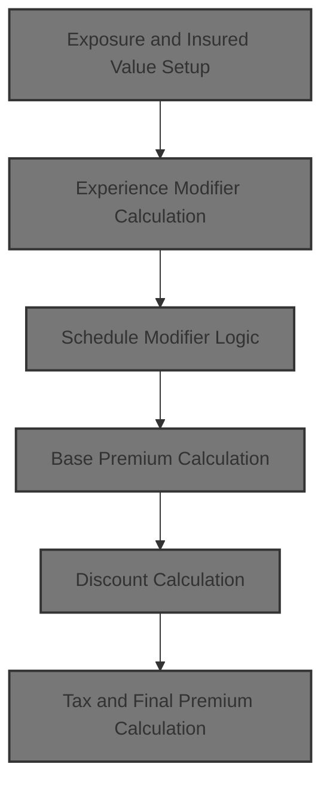
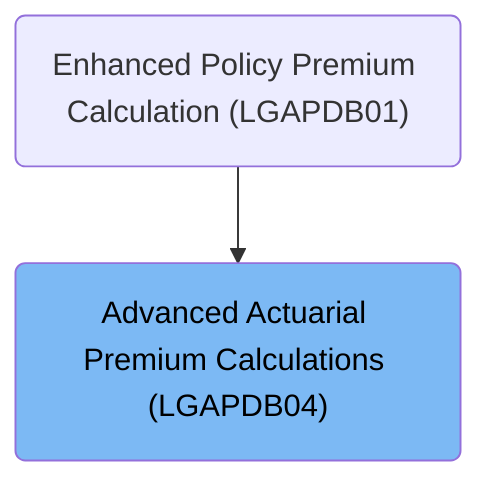

# Overview

This document describes how insurance policy premiums are calculated by adjusting exposures, applying risk and schedule modifiers, summing peril premiums, applying discounts, and finalizing the premium with taxes and regulatory caps.

## Dependencies

### Program

- LGAPDB04 (<SwmPath>[base/src/LGAPDB04.cbl](base/src/LGAPDB04.cbl)</SwmPath>)

### Copybook

- SQLCA

# Where is this program used?

This program is used once, as represented in the following diagram:

&nbsp;

*This is an auto-generated document by Swimm 🌊 and has not yet been verified by a human*

<SwmMeta version="3.0.0" repo-id="Z2l0aHViJTNBJTNBY2ljcy1nZW5hcHAtZGVtbyUzQSUzQXN3aW1taW8=" repo-name="cics-genapp-demo">Powered by [Swimm](https://app.swimm.io/)</SwmMeta>
