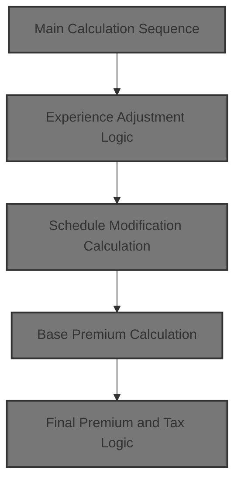
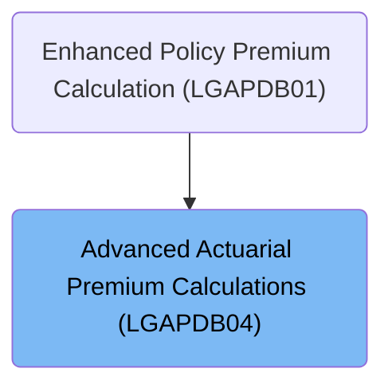
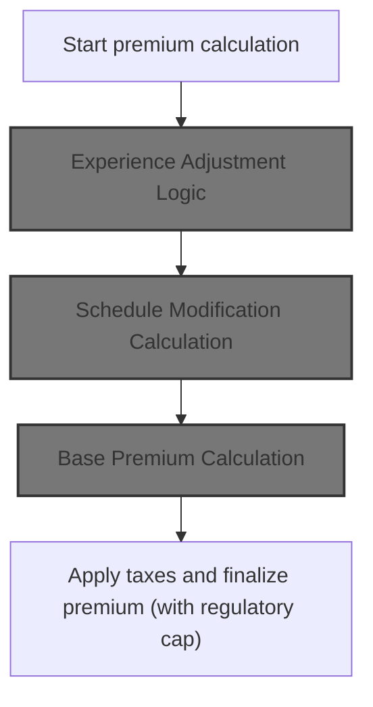
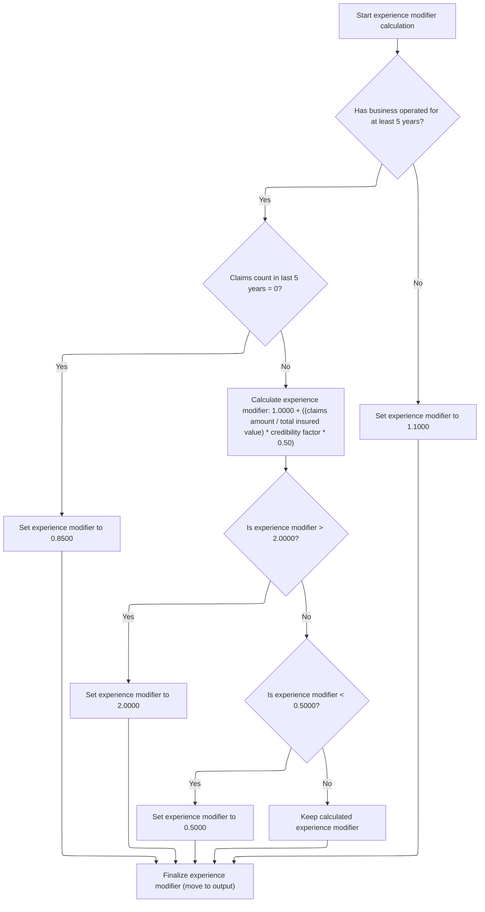
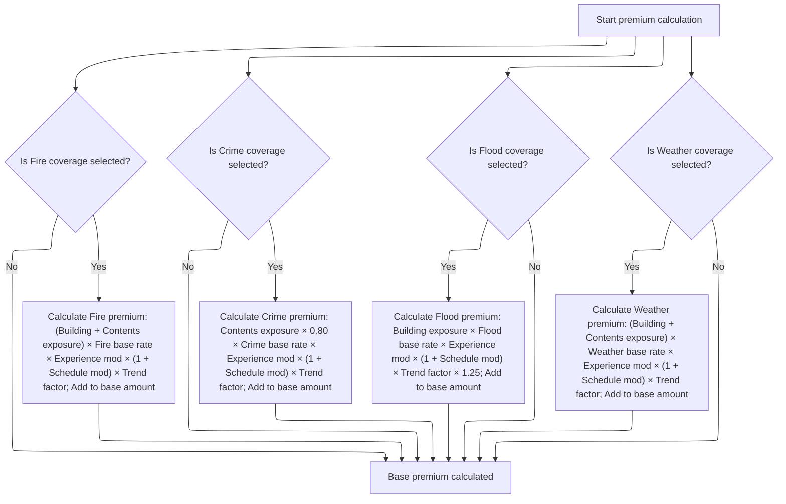
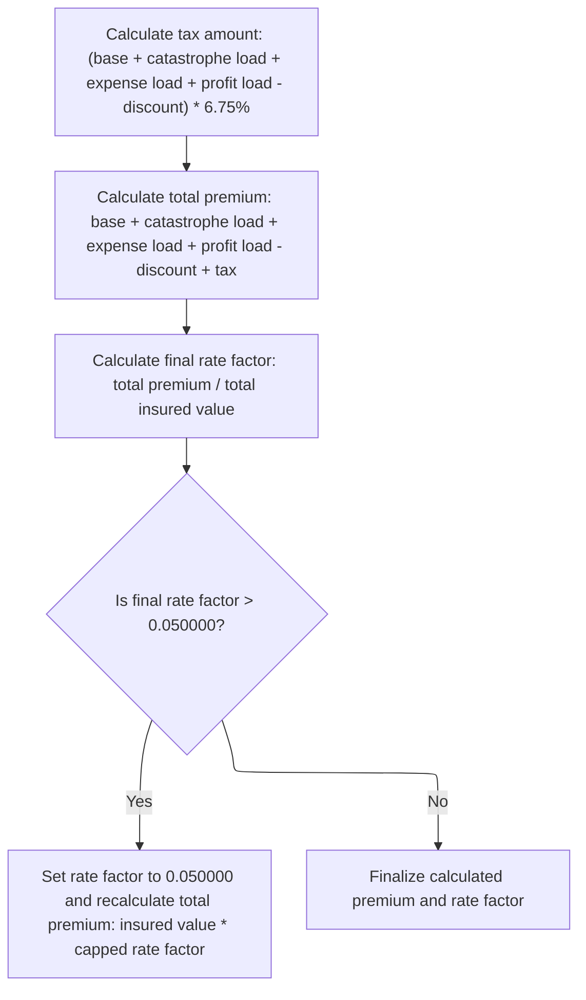

# Overview

This document describes the flow for calculating insurance policy premiums. Policy data is processed through actuarial adjustments, risk evaluations, and regulatory checks to determine the final premium amount.



## Dependencies

### Program

- <SwmToken path="base/src/LGAPDB04.cbl" pos="2:6:6" line-data="       PROGRAM-ID. LGAPDB04.">`LGAPDB04`</SwmToken> (<SwmPath>[base/src/LGAPDB04.cbl](base/src/LGAPDB04.cbl)</SwmPath>)

### Copybook

- SQLCA

# Where is this program used?

This program is used once, as represented in the following diagram:



## Input and Output Tables/Files used in the Program

| Table / File Name                                                                                                         | Type | Description                                              | Usage Mode | Key Fields / Layout Highlights                                                                                                                                                                                                                                                                                                                                                                                                                                                                                                                                                                                                                                                                                                                   |
| ------------------------------------------------------------------------------------------------------------------------- | ---- | -------------------------------------------------------- | ---------- | ------------------------------------------------------------------------------------------------------------------------------------------------------------------------------------------------------------------------------------------------------------------------------------------------------------------------------------------------------------------------------------------------------------------------------------------------------------------------------------------------------------------------------------------------------------------------------------------------------------------------------------------------------------------------------------------------------------------------------------------------ |
| <SwmToken path="base/src/LGAPDB04.cbl" pos="183:3:3" line-data="               FROM RATE_MASTER">`RATE_MASTER`</SwmToken> | DB2  | Insurance rate parameters by peril, territory, and dates | Input      | <SwmToken path="base/src/LGAPDB04.cbl" pos="181:3:3" line-data="               SELECT BASE_RATE, MIN_PREMIUM, MAX_PREMIUM">`BASE_RATE`</SwmToken>, <SwmToken path="base/src/LGAPDB04.cbl" pos="181:6:6" line-data="               SELECT BASE_RATE, MIN_PREMIUM, MAX_PREMIUM">`MIN_PREMIUM`</SwmToken>, <SwmToken path="base/src/LGAPDB04.cbl" pos="325:1:5" line-data="                   WS-BASE-RATE (1, 1, 1, 1) * ">`WS-BASE-RATE`</SwmToken>, <SwmToken path="base/src/LGAPDB04.cbl" pos="51:3:7" line-data="                       25 WS-MIN-PREM   PIC 9(5)V99.">`WS-MIN-PREM`</SwmToken>, <SwmToken path="base/src/LGAPDB04.cbl" pos="52:3:7" line-data="                       25 WS-MAX-PREM   PIC 9(7)V99.">`WS-MAX-PREM`</SwmToken> |

&nbsp;

## Detailed View of the Program's Functionality

# Main Calculation Sequence

The program begins by executing a series of steps to calculate an insurance premium. The main sequence is as follows:

 1. **Initialization and Exposure Calculation**: The program initializes all calculation areas and loads base rate tables. It then calculates the exposures for building, contents, and business interruption by adjusting the coverage limits according to the risk score. The total insured value is computed as the sum of these exposures. Exposure density is calculated by dividing the total insured value by the square footage, or set to a default if square footage is zero.

 2. **Base Rate Loading**: The program attempts to load base rates for each peril (fire, crime, flood, weather) from a database. If the database lookup fails, default rates are used.

 3. **Experience Adjustment**: The experience modifier is calculated based on the number of years the business has operated and its claims history. This modifier adjusts the premium for risk based on past experience.

 4. **Schedule Modification**: The schedule modifier is calculated using building age, protection class, occupancy code, and exposure density. This modifier reflects risk factors specific to the property and its use.

 5. **Base Premium Calculation**: For each selected peril, the program calculates the premium using exposures, base rates, experience modifier, schedule modifier, and a trend factor. Special multipliers are applied for certain perils (e.g., crime and flood). The premiums for all selected perils are summed to get the base premium.

 6. **Catastrophe Load Calculation**: Additional premium is calculated for catastrophe risks (hurricane, earthquake, tornado, flood) based on the relevant peril premiums and fixed factors.

 7. **Expense and Profit Loading**: The program calculates expense and profit loads as percentages of the base premium and catastrophe load.

 8. **Discount Calculation**: Discounts are applied for multi-peril coverage, claims-free history, and high deductibles. The total discount is capped at a maximum value.

 9. **Tax Calculation**: Taxes are calculated as a fixed percentage of the sum of all premium components minus the discount.

10. **Final Premium Calculation**: The total premium is calculated by summing all components and the tax, then subtracting the discount. The final rate factor is computed as the ratio of total premium to total insured value, and capped if it exceeds a regulatory maximum.

# Experience Adjustment Logic

1. **Default Modifier**: The experience modifier starts at a default value.

2. **Business Age Check**: If the business has operated for at least five years:

   - If there have been no claims in the last five years, the modifier is set to a favorable value (lower premium).
   - If there have been claims, the modifier is calculated using the claims amount, total insured value, a credibility factor, and a multiplier. The result is then clamped to a minimum and maximum value to prevent excessive adjustment.

3. **Young Business**: If the business is younger than five years, the modifier is set to a slightly higher value (higher premium).

4. **Finalization**: The calculated modifier is stored for use in subsequent premium calculations.

# Schedule Modification Calculation

1. **Initialization**: The schedule modifier starts at zero.

2. **Building Age Adjustment**: The modifier is adjusted based on the year the building was constructed:

   - Newer buildings receive a reduction.
   - Older buildings receive an increase, with the amount depending on the age bracket.

3. **Protection Class Adjustment**: The modifier is further adjusted based on the protection class code:

   - Better protection classes receive a reduction.
   - Poorer classes receive an increase.

4. **Occupancy Code Adjustment**: The modifier is adjusted based on the occupancy code:

   - Office, manufacturing, and warehouse codes each have specific adjustments.

5. **Exposure Density Adjustment**: If the exposure density is very high, the modifier is increased; if very low, it is decreased.

6. **Capping**: The modifier is capped at a maximum and minimum value to ensure it stays within regulatory limits.

7. **Finalization**: The calculated modifier is stored for use in premium calculations.

# Base Premium Calculation

1. **Initialization**: The base premium amount is set to zero.

2. **Peril Premiums**:

   - **Fire**: If fire coverage is selected, the premium is calculated using building and contents exposures, the fire base rate, experience modifier, schedule modifier, and trend factor.
   - **Crime**: If crime coverage is selected, the premium is calculated using contents exposure (with a multiplier), the crime base rate, experience modifier, schedule modifier, and trend factor.
   - **Flood**: If flood coverage is selected, the premium is calculated using building exposure, the flood base rate, experience modifier, schedule modifier, trend factor, and an additional multiplier.
   - **Weather**: If weather coverage is selected, the premium is calculated using building and contents exposures, the weather base rate, experience modifier, schedule modifier, and trend factor.

3. **Aggregation**: Each calculated peril premium is added to the base premium amount.

# Final Premium and Tax Logic

1. **Tax Calculation**: The tax amount is calculated as a fixed percentage of the sum of the base premium, catastrophe load, expense load, and profit load, minus the discount.

2. **Total Premium Calculation**: The total premium is calculated by summing the base premium, catastrophe load, expense load, profit load, and tax, then subtracting the discount.

3. **Final Rate Factor Calculation**: The final rate factor is calculated as the ratio of the total premium to the total insured value.

4. **Regulatory Cap**: If the final rate factor exceeds the regulatory maximum, it is capped, and the total premium is recalculated using the capped rate factor.

5. **Finalization**: The calculated premium and rate factor are finalized and stored for output.

# Data Definitions

| Table / Record Name                                                                                                       | Type | Short Description                                        | Usage Mode     |
| ------------------------------------------------------------------------------------------------------------------------- | ---- | -------------------------------------------------------- | -------------- |
| <SwmToken path="base/src/LGAPDB04.cbl" pos="183:3:3" line-data="               FROM RATE_MASTER">`RATE_MASTER`</SwmToken> | DB2  | Insurance rate parameters by peril, territory, and dates | Input (SELECT) |

&nbsp;

# Rule Definition

| Paragraph Name                                                                                                                 | Rule ID | Category          | Description                                                                                                                                                                                                                                                                 | Conditions                                                                                                                                                                                                                                                                                                                                                                                                                                                                                                                                                                                                              | Remarks                                                                                                                                                                                                                                                                                                                                                                                                                                                                                                                                                       |
| ------------------------------------------------------------------------------------------------------------------------------ | ------- | ----------------- | --------------------------------------------------------------------------------------------------------------------------------------------------------------------------------------------------------------------------------------------------------------------------- | ----------------------------------------------------------------------------------------------------------------------------------------------------------------------------------------------------------------------------------------------------------------------------------------------------------------------------------------------------------------------------------------------------------------------------------------------------------------------------------------------------------------------------------------------------------------------------------------------------------------------- | ------------------------------------------------------------------------------------------------------------------------------------------------------------------------------------------------------------------------------------------------------------------------------------------------------------------------------------------------------------------------------------------------------------------------------------------------------------------------------------------------------------------------------------------------------------- |
| <SwmToken path="base/src/LGAPDB04.cbl" pos="138:1:3" line-data="       P100-MAIN.">`P100-MAIN`</SwmToken>                      | RL-001  | Data Assignment   | The system must accept input data for business, property, coverage, deductibles, and peril selections as described in the input structures.                                                                                                                                 | Program is invoked with <SwmToken path="base/src/LGAPDB04.cbl" pos="86:3:7" line-data="       01  LK-INPUT-DATA.">`LK-INPUT-DATA`</SwmToken> and <SwmToken path="base/src/LGAPDB04.cbl" pos="100:3:7" line-data="       01  LK-COVERAGE-DATA.">`LK-COVERAGE-DATA`</SwmToken> structures.                                                                                                                                                                                                                                                                                                                                | Input fields include alphanumeric and numeric types, with specified sizes (e.g., customer number: string of 10, risk score: number of 3 digits, year built: number of 4 digits, peril selections: number of 4 digits each).                                                                                                                                                                                                                                                                                                                                   |
| <SwmToken path="base/src/LGAPDB04.cbl" pos="139:3:5" line-data="           PERFORM P200-INIT">`P200-INIT`</SwmToken>           | RL-002  | Computation       | Calculate total insured value as the sum of building, contents, and business interruption limits, each adjusted by risk score.                                                                                                                                              | <SwmToken path="base/src/LGAPDB04.cbl" pos="102:3:7" line-data="              10 LK-BUILDING-LIMIT     PIC 9(9)V99.">`LK-BUILDING-LIMIT`</SwmToken>, <SwmToken path="base/src/LGAPDB04.cbl" pos="103:3:7" line-data="              10 LK-CONTENTS-LIMIT     PIC 9(9)V99.">`LK-CONTENTS-LIMIT`</SwmToken>, <SwmToken path="base/src/LGAPDB04.cbl" pos="104:3:7" line-data="              10 LK-BI-LIMIT           PIC 9(9)V99.">`LK-BI-LIMIT`</SwmToken> provided; <SwmToken path="base/src/LGAPDB04.cbl" pos="88:3:7" line-data="           05 LK-RISK-SCORE            PIC 999.">`LK-RISK-SCORE`</SwmToken> available. | Each exposure is calculated as coverage limit × (1 + (risk score - 100) / 1000). Total insured value is the sum of building, contents, and BI exposures. Output as number with up to 11 digits and 2 decimals.                                                                                                                                                                                                                                                                                                                                                |
| <SwmToken path="base/src/LGAPDB04.cbl" pos="139:3:5" line-data="           PERFORM P200-INIT">`P200-INIT`</SwmToken>           | RL-003  | Computation       | Calculate exposure density as total insured value divided by square footage. If square footage is zero, set exposure density to <SwmToken path="base/src/LGAPDB04.cbl" pos="173:3:5" line-data="               MOVE 100.00 TO WS-EXPOSURE-DENSITY">`100.00`</SwmToken>.     | Total insured value and square footage available.                                                                                                                                                                                                                                                                                                                                                                                                                                                                                                                                                                       | Exposure density is a number with 4 decimal places. If square footage is zero, exposure density is set to <SwmToken path="base/src/LGAPDB04.cbl" pos="173:3:5" line-data="               MOVE 100.00 TO WS-EXPOSURE-DENSITY">`100.00`</SwmToken>.                                                                                                                                                                                                                                                                                                             |
| <SwmToken path="base/src/LGAPDB04.cbl" pos="142:3:7" line-data="           PERFORM P400-EXP-MOD">`P400-EXP-MOD`</SwmToken>     | RL-004  | Conditional Logic | Determine experience modifier based on years in business and claims history.                                                                                                                                                                                                | Years in business and claims count/amount available.                                                                                                                                                                                                                                                                                                                                                                                                                                                                                                                                                                    | Experience modifier is a number with 4 decimal places. Constants: credibility factor = <SwmToken path="base/src/LGAPDB04.cbl" pos="27:15:17" line-data="           05 WS-CREDIBILITY-FACTOR    PIC V999 VALUE 0.750.">`0.750`</SwmToken>. Modifier clamped between <SwmToken path="base/src/LGAPDB04.cbl" pos="250:11:13" line-data="                   IF WS-EXPERIENCE-MOD &lt; 0.5000">`0.5000`</SwmToken> and <SwmToken path="base/src/LGAPDB04.cbl" pos="246:11:13" line-data="                   IF WS-EXPERIENCE-MOD &gt; 2.0000">`2.0000`</SwmToken>. |
| <SwmToken path="base/src/LGAPDB04.cbl" pos="143:3:7" line-data="           PERFORM P500-SCHED-MOD">`P500-SCHED-MOD`</SwmToken> | RL-005  | Conditional Logic | Determine schedule modifier based on year built, protection class, occupancy code, and exposure density, with adjustments and caps.                                                                                                                                         | Year built, protection class, occupancy code, and exposure density available.                                                                                                                                                                                                                                                                                                                                                                                                                                                                                                                                           | Schedule modifier is a signed number with 3 decimal places. Capped between <SwmToken path="base/src/LGAPDB04.cbl" pos="312:11:14" line-data="           IF WS-SCHEDULE-MOD &lt; -0.200">`-0.200`</SwmToken> and +<SwmToken path="base/src/LGAPDB04.cbl" pos="308:12:14" line-data="           IF WS-SCHEDULE-MOD &gt; +0.400">`0.400`</SwmToken>.                                                                                                                                                                                                             |
| <SwmToken path="base/src/LGAPDB04.cbl" pos="144:3:7" line-data="           PERFORM P600-BASE-PREM">`P600-BASE-PREM`</SwmToken> | RL-006  | Computation       | Calculate base premium as the sum of premiums for each selected peril using respective formulas.                                                                                                                                                                            | Peril selections and exposures available.                                                                                                                                                                                                                                                                                                                                                                                                                                                                                                                                                                               | Premiums are numbers with up to 8 digits and 2 decimals. Trend factor = <SwmToken path="base/src/LGAPDB04.cbl" pos="26:15:17" line-data="           05 WS-TREND-FACTOR          PIC V9999 VALUE 1.0350.">`1.0350`</SwmToken>. Fire, crime, flood, and weather base rates are loaded or defaulted. Flood premium includes an extra multiplier of <SwmToken path="base/src/LGAPDB04.cbl" pos="352:9:11" line-data="                   WS-TREND-FACTOR * 1.25">`1.25`</SwmToken>.                                                                                |
| <SwmToken path="base/src/LGAPDB04.cbl" pos="148:3:5" line-data="           PERFORM P950-TAXES">`P950-TAXES`</SwmToken>         | RL-007  | Computation       | Sum base amount, catastrophe load, expense load, and profit load, then subtract discount amount to get subtotal for tax calculation.                                                                                                                                        | All premium components calculated.                                                                                                                                                                                                                                                                                                                                                                                                                                                                                                                                                                                      | Subtotal is a number with up to 10 digits and 2 decimals.                                                                                                                                                                                                                                                                                                                                                                                                                                                                                                     |
| <SwmToken path="base/src/LGAPDB04.cbl" pos="148:3:5" line-data="           PERFORM P950-TAXES">`P950-TAXES`</SwmToken>         | RL-008  | Computation       | Calculate tax amount as 6.75% of the subtotal.                                                                                                                                                                                                                              | Subtotal available.                                                                                                                                                                                                                                                                                                                                                                                                                                                                                                                                                                                                     | Tax rate is <SwmToken path="base/src/LGAPDB04.cbl" pos="460:10:12" line-data="                LK-DISCOUNT-AMT) * 0.0675">`0.0675`</SwmToken>. Tax amount is a number with up to 6 digits and 2 decimals.                                                                                                                                                                                                                                                                                                                                                      |
| <SwmToken path="base/src/LGAPDB04.cbl" pos="149:3:5" line-data="           PERFORM P999-FINAL">`P999-FINAL`</SwmToken>         | RL-009  | Computation       | Calculate total premium as subtotal plus tax amount.                                                                                                                                                                                                                        | Subtotal and tax amount available.                                                                                                                                                                                                                                                                                                                                                                                                                                                                                                                                                                                      | Total premium is a number with up to 9 digits and 2 decimals.                                                                                                                                                                                                                                                                                                                                                                                                                                                                                                 |
| <SwmToken path="base/src/LGAPDB04.cbl" pos="149:3:5" line-data="           PERFORM P999-FINAL">`P999-FINAL`</SwmToken>         | RL-010  | Computation       | Calculate final rate factor as total premium divided by total insured value. If it exceeds <SwmToken path="base/src/LGAPDB04.cbl" pos="473:13:15" line-data="           IF LK-FINAL-RATE-FACTOR &gt; 0.050000">`0.050000`</SwmToken>, cap it and recalculate total premium. | Total premium and total insured value available.                                                                                                                                                                                                                                                                                                                                                                                                                                                                                                                                                                        | Rate factor is a number with 5 decimal places, capped at <SwmToken path="base/src/LGAPDB04.cbl" pos="473:13:15" line-data="           IF LK-FINAL-RATE-FACTOR &gt; 0.050000">`0.050000`</SwmToken>.                                                                                                                                                                                                                                                                                                                                                           |
| <SwmToken path="base/src/LGAPDB04.cbl" pos="149:3:5" line-data="           PERFORM P999-FINAL">`P999-FINAL`</SwmToken>         | RL-011  | Data Assignment   | Round all monetary values to 2 decimal places, and all modifiers and rate factors to their specified decimal precision. Output all calculated premium components and modifiers in the output structure.                                                                     | All calculations complete.                                                                                                                                                                                                                                                                                                                                                                                                                                                                                                                                                                                              | Monetary values: 2 decimals. Experience modifier: 4 decimals. Schedule modifier: 3 decimals. Rate factor: 5 decimals. Output in <SwmToken path="base/src/LGAPDB04.cbl" pos="116:3:7" line-data="       01  LK-OUTPUT-RESULTS.">`LK-OUTPUT-RESULTS`</SwmToken> structure with specified field sizes and types.                                                                                                                                                                                                                                                 |

# User Stories

## User Story 1: Input and Exposure Calculation

---

### Story Description:

As an insurance applicant, I want to provide my business, property, coverage, deductible, and peril selection information so that the system can calculate my total insured value and exposure density for an accurate insurance quote.

---

### Business Rule Mapping:

| Rule ID | Paragraph Name                                                                                                       | Rule Description                                                                                                                                                                                                                                                        |
| ------- | -------------------------------------------------------------------------------------------------------------------- | ----------------------------------------------------------------------------------------------------------------------------------------------------------------------------------------------------------------------------------------------------------------------- |
| RL-001  | <SwmToken path="base/src/LGAPDB04.cbl" pos="138:1:3" line-data="       P100-MAIN.">`P100-MAIN`</SwmToken>            | The system must accept input data for business, property, coverage, deductibles, and peril selections as described in the input structures.                                                                                                                             |
| RL-002  | <SwmToken path="base/src/LGAPDB04.cbl" pos="139:3:5" line-data="           PERFORM P200-INIT">`P200-INIT`</SwmToken> | Calculate total insured value as the sum of building, contents, and business interruption limits, each adjusted by risk score.                                                                                                                                          |
| RL-003  | <SwmToken path="base/src/LGAPDB04.cbl" pos="139:3:5" line-data="           PERFORM P200-INIT">`P200-INIT`</SwmToken> | Calculate exposure density as total insured value divided by square footage. If square footage is zero, set exposure density to <SwmToken path="base/src/LGAPDB04.cbl" pos="173:3:5" line-data="               MOVE 100.00 TO WS-EXPOSURE-DENSITY">`100.00`</SwmToken>. |

---

### Relevant Functionality:

- <SwmToken path="base/src/LGAPDB04.cbl" pos="138:1:3" line-data="       P100-MAIN.">`P100-MAIN`</SwmToken>
  1. **RL-001:**
     - On program start, receive input structures for business, property, coverage, deductibles, and peril selections.
     - Assign input values to working storage for use in subsequent calculations.
- <SwmToken path="base/src/LGAPDB04.cbl" pos="139:3:5" line-data="           PERFORM P200-INIT">`P200-INIT`</SwmToken>
  1. **RL-002:**
     - Calculate building exposure: building limit × (1 + (risk score - 100) / 1000).
     - Calculate contents exposure: contents limit × (1 + (risk score - 100) / 1000).
     - Calculate BI exposure: BI limit × (1 + (risk score - 100) / 1000).
     - Sum exposures for total insured value.
  2. **RL-003:**
     - If square footage > 0, exposure density = total insured value / square footage.
     - Else, set exposure density to <SwmToken path="base/src/LGAPDB04.cbl" pos="173:3:5" line-data="               MOVE 100.00 TO WS-EXPOSURE-DENSITY">`100.00`</SwmToken>.

## User Story 2: Modifier Calculation

---

### Story Description:

As an insurance system, I want to determine the experience and schedule modifiers based on business history, claims, property characteristics, and exposure density so that premiums are adjusted fairly according to risk and property features.

---

### Business Rule Mapping:

| Rule ID | Paragraph Name                                                                                                                 | Rule Description                                                                                                                    |
| ------- | ------------------------------------------------------------------------------------------------------------------------------ | ----------------------------------------------------------------------------------------------------------------------------------- |
| RL-004  | <SwmToken path="base/src/LGAPDB04.cbl" pos="142:3:7" line-data="           PERFORM P400-EXP-MOD">`P400-EXP-MOD`</SwmToken>     | Determine experience modifier based on years in business and claims history.                                                        |
| RL-005  | <SwmToken path="base/src/LGAPDB04.cbl" pos="143:3:7" line-data="           PERFORM P500-SCHED-MOD">`P500-SCHED-MOD`</SwmToken> | Determine schedule modifier based on year built, protection class, occupancy code, and exposure density, with adjustments and caps. |

---

### Relevant Functionality:

- <SwmToken path="base/src/LGAPDB04.cbl" pos="142:3:7" line-data="           PERFORM P400-EXP-MOD">`P400-EXP-MOD`</SwmToken>
  1. **RL-004:**
     - If years in business < 5, set experience modifier to <SwmToken path="base/src/LGAPDB04.cbl" pos="255:3:5" line-data="               MOVE 1.1000 TO WS-EXPERIENCE-MOD">`1.1000`</SwmToken>.
     - If years in business >= 5 and claims count = 0, set modifier to <SwmToken path="base/src/LGAPDB04.cbl" pos="239:3:5" line-data="                   MOVE 0.8500 TO WS-EXPERIENCE-MOD">`0.8500`</SwmToken>.
     - If years in business >= 5 and claims count > 0:
       - Calculate modifier: <SwmToken path="base/src/LGAPDB04.cbl" pos="235:3:5" line-data="           MOVE 1.0000 TO WS-EXPERIENCE-MOD">`1.0000`</SwmToken> + ((claims amount / total insured value) × credibility factor × <SwmToken path="base/src/LGAPDB04.cbl" pos="244:9:11" line-data="                        WS-CREDIBILITY-FACTOR * 0.50)">`0.50`</SwmToken>).
       - Clamp modifier to \[<SwmToken path="base/src/LGAPDB04.cbl" pos="250:11:13" line-data="                   IF WS-EXPERIENCE-MOD &lt; 0.5000">`0.5000`</SwmToken>, <SwmToken path="base/src/LGAPDB04.cbl" pos="246:11:13" line-data="                   IF WS-EXPERIENCE-MOD &gt; 2.0000">`2.0000`</SwmToken>\].
- <SwmToken path="base/src/LGAPDB04.cbl" pos="143:3:7" line-data="           PERFORM P500-SCHED-MOD">`P500-SCHED-MOD`</SwmToken>
  1. **RL-005:**
     - Start at <SwmToken path="base/src/LGAPDB04.cbl" pos="261:4:6" line-data="           MOVE +0.000 TO WS-SCHEDULE-MOD">`0.000`</SwmToken>.
     - Adjust for year built:
       - If >= 2010, subtract <SwmToken path="base/src/LGAPDB04.cbl" pos="266:3:5" line-data="                   SUBTRACT 0.050 FROM WS-SCHEDULE-MOD">`0.050`</SwmToken>.
       - If >= 1990, no change.
       - If >= 1970, add <SwmToken path="base/src/LGAPDB04.cbl" pos="270:3:5" line-data="                   ADD 0.100 TO WS-SCHEDULE-MOD">`0.100`</SwmToken>.
       - Else, add <SwmToken path="base/src/LGAPDB04.cbl" pos="272:3:5" line-data="                   ADD 0.200 TO WS-SCHEDULE-MOD">`0.200`</SwmToken>.
     - Adjust for protection class:
       - '01'-'03': subtract <SwmToken path="base/src/LGAPDB04.cbl" pos="270:3:5" line-data="                   ADD 0.100 TO WS-SCHEDULE-MOD">`0.100`</SwmToken>.
       - '04'-'06': subtract <SwmToken path="base/src/LGAPDB04.cbl" pos="266:3:5" line-data="                   SUBTRACT 0.050 FROM WS-SCHEDULE-MOD">`0.050`</SwmToken>.
       - '07'-'09': no change.
       - Other: add <SwmToken path="base/src/LGAPDB04.cbl" pos="284:3:5" line-data="                   ADD 0.150 TO WS-SCHEDULE-MOD">`0.150`</SwmToken>.
     - Adjust for occupancy code:
       - <SwmToken path="base/src/LGAPDB04.cbl" pos="289:4:4" line-data="               WHEN &#39;OFF01&#39; THRU &#39;OFF05&#39;">`OFF01`</SwmToken>-<SwmToken path="base/src/LGAPDB04.cbl" pos="289:10:10" line-data="               WHEN &#39;OFF01&#39; THRU &#39;OFF05&#39;">`OFF05`</SwmToken>: subtract <SwmToken path="base/src/LGAPDB04.cbl" pos="290:3:5" line-data="                   SUBTRACT 0.025 FROM WS-SCHEDULE-MOD">`0.025`</SwmToken>.
       - <SwmToken path="base/src/LGAPDB04.cbl" pos="291:4:4" line-data="               WHEN &#39;MFG01&#39; THRU &#39;MFG10&#39;">`MFG01`</SwmToken>-<SwmToken path="base/src/LGAPDB04.cbl" pos="291:10:10" line-data="               WHEN &#39;MFG01&#39; THRU &#39;MFG10&#39;">`MFG10`</SwmToken>: add <SwmToken path="base/src/LGAPDB04.cbl" pos="292:3:5" line-data="                   ADD 0.075 TO WS-SCHEDULE-MOD">`0.075`</SwmToken>.
       - <SwmToken path="base/src/LGAPDB04.cbl" pos="293:4:4" line-data="               WHEN &#39;WHS01&#39; THRU &#39;WHS05&#39;">`WHS01`</SwmToken>-<SwmToken path="base/src/LGAPDB04.cbl" pos="293:10:10" line-data="               WHEN &#39;WHS01&#39; THRU &#39;WHS05&#39;">`WHS05`</SwmToken>: add <SwmToken path="base/src/LGAPDB04.cbl" pos="294:3:5" line-data="                   ADD 0.125 TO WS-SCHEDULE-MOD">`0.125`</SwmToken>.
       - Other: no change.
     - Adjust for exposure density:
       - If > <SwmToken path="base/src/LGAPDB04.cbl" pos="300:11:13" line-data="           IF WS-EXPOSURE-DENSITY &gt; 500.00">`500.00`</SwmToken>, add <SwmToken path="base/src/LGAPDB04.cbl" pos="270:3:5" line-data="                   ADD 0.100 TO WS-SCHEDULE-MOD">`0.100`</SwmToken>.
       - If < <SwmToken path="base/src/LGAPDB04.cbl" pos="303:11:13" line-data="               IF WS-EXPOSURE-DENSITY &lt; 50.00">`50.00`</SwmToken>, subtract <SwmToken path="base/src/LGAPDB04.cbl" pos="266:3:5" line-data="                   SUBTRACT 0.050 FROM WS-SCHEDULE-MOD">`0.050`</SwmToken>.
     - Cap modifier to \[<SwmToken path="base/src/LGAPDB04.cbl" pos="312:11:14" line-data="           IF WS-SCHEDULE-MOD &lt; -0.200">`-0.200`</SwmToken>, +<SwmToken path="base/src/LGAPDB04.cbl" pos="308:12:14" line-data="           IF WS-SCHEDULE-MOD &gt; +0.400">`0.400`</SwmToken>\].

## User Story 3: Premium Calculation, Tax, and Output Formatting

---

### Story Description:

As an insurance applicant, I want the system to calculate my base premium for each selected peril, sum all premium components, apply taxes, round all values to the correct precision, and output the results in a clear, structured format so that I receive a complete and understandable insurance quote.

---

### Business Rule Mapping:

| Rule ID | Paragraph Name                                                                                                                 | Rule Description                                                                                                                                                                                                                                                            |
| ------- | ------------------------------------------------------------------------------------------------------------------------------ | --------------------------------------------------------------------------------------------------------------------------------------------------------------------------------------------------------------------------------------------------------------------------- |
| RL-006  | <SwmToken path="base/src/LGAPDB04.cbl" pos="144:3:7" line-data="           PERFORM P600-BASE-PREM">`P600-BASE-PREM`</SwmToken> | Calculate base premium as the sum of premiums for each selected peril using respective formulas.                                                                                                                                                                            |
| RL-007  | <SwmToken path="base/src/LGAPDB04.cbl" pos="148:3:5" line-data="           PERFORM P950-TAXES">`P950-TAXES`</SwmToken>         | Sum base amount, catastrophe load, expense load, and profit load, then subtract discount amount to get subtotal for tax calculation.                                                                                                                                        |
| RL-008  | <SwmToken path="base/src/LGAPDB04.cbl" pos="148:3:5" line-data="           PERFORM P950-TAXES">`P950-TAXES`</SwmToken>         | Calculate tax amount as 6.75% of the subtotal.                                                                                                                                                                                                                              |
| RL-009  | <SwmToken path="base/src/LGAPDB04.cbl" pos="149:3:5" line-data="           PERFORM P999-FINAL">`P999-FINAL`</SwmToken>         | Calculate total premium as subtotal plus tax amount.                                                                                                                                                                                                                        |
| RL-010  | <SwmToken path="base/src/LGAPDB04.cbl" pos="149:3:5" line-data="           PERFORM P999-FINAL">`P999-FINAL`</SwmToken>         | Calculate final rate factor as total premium divided by total insured value. If it exceeds <SwmToken path="base/src/LGAPDB04.cbl" pos="473:13:15" line-data="           IF LK-FINAL-RATE-FACTOR &gt; 0.050000">`0.050000`</SwmToken>, cap it and recalculate total premium. |
| RL-011  | <SwmToken path="base/src/LGAPDB04.cbl" pos="149:3:5" line-data="           PERFORM P999-FINAL">`P999-FINAL`</SwmToken>         | Round all monetary values to 2 decimal places, and all modifiers and rate factors to their specified decimal precision. Output all calculated premium components and modifiers in the output structure.                                                                     |

---

### Relevant Functionality:

- <SwmToken path="base/src/LGAPDB04.cbl" pos="144:3:7" line-data="           PERFORM P600-BASE-PREM">`P600-BASE-PREM`</SwmToken>
  1. **RL-006:**
     - For each peril (fire, crime, flood, weather):
       - If selected, calculate premium using respective formula:
         - Fire: (building exposure + contents exposure) × fire base rate × experience modifier × (1 + schedule modifier) × trend factor.
         - Crime: contents exposure × <SwmToken path="base/src/LGAPDB04.cbl" pos="336:10:12" line-data="                   (WS-CONTENTS-EXPOSURE * 0.80) *">`0.80`</SwmToken> × crime base rate × experience modifier × (1 + schedule modifier) × trend factor.
         - Flood: building exposure × flood base rate × experience modifier × (1 + schedule modifier) × trend factor × <SwmToken path="base/src/LGAPDB04.cbl" pos="352:9:11" line-data="                   WS-TREND-FACTOR * 1.25">`1.25`</SwmToken>.
         - Weather: (building exposure + contents exposure) × weather base rate × experience modifier × (1 + schedule modifier) × trend factor.
       - Add each peril's premium to base amount and output in respective field.
- <SwmToken path="base/src/LGAPDB04.cbl" pos="148:3:5" line-data="           PERFORM P950-TAXES">`P950-TAXES`</SwmToken>
  1. **RL-007:**
     - Subtotal = base amount + catastrophe load + expense load + profit load - discount amount.
  2. **RL-008:**
     - Tax amount = subtotal × <SwmToken path="base/src/LGAPDB04.cbl" pos="460:10:12" line-data="                LK-DISCOUNT-AMT) * 0.0675">`0.0675`</SwmToken>.
- <SwmToken path="base/src/LGAPDB04.cbl" pos="149:3:5" line-data="           PERFORM P999-FINAL">`P999-FINAL`</SwmToken>
  1. **RL-009:**
     - Total premium = subtotal + tax amount.
  2. **RL-010:**
     - Final rate factor = total premium / total insured value.
     - If rate factor > <SwmToken path="base/src/LGAPDB04.cbl" pos="473:13:15" line-data="           IF LK-FINAL-RATE-FACTOR &gt; 0.050000">`0.050000`</SwmToken>:
       - Set rate factor to <SwmToken path="base/src/LGAPDB04.cbl" pos="473:13:15" line-data="           IF LK-FINAL-RATE-FACTOR &gt; 0.050000">`0.050000`</SwmToken>.
       - Recalculate total premium = total insured value × capped rate factor.
  3. **RL-011:**
     - Round monetary values to 2 decimals.
     - Round modifiers and rate factors to specified precision.
     - Assign all calculated values to output structure fields.

# Workflow

# Main Calculation Sequence



The Main Calculation Sequence section governs the step-by-step process for calculating an insurance policy premium. It ensures that all required actuarial adjustments, risk factors, and regulatory requirements are applied in the correct order to produce a compliant and accurate premium for each policy.

| Category        | Rule Name                          | Description                                                                                                                                                                                                                  |
| --------------- | ---------------------------------- | ---------------------------------------------------------------------------------------------------------------------------------------------------------------------------------------------------------------------------- |
| Data validation | Premium Calculation Initialization | The premium calculation must begin with the initialization of all relevant policy data and rating variables before any actuarial or risk adjustments are applied.                                                            |
| Data validation | Tax Application and Regulatory Cap | Taxes must be applied to the calculated premium, and the final premium must not exceed any regulatory cap imposed by law or business policy.                                                                                 |
| Business logic  | Experience Adjustment Requirement  | An experience adjustment factor must be calculated for each policy, based on the number of years the business has operated and its claims history, and this factor must be applied before any further premium modifications. |
| Business logic  | Schedule Modification Limits       | A schedule modification factor must be determined for each policy, using property age, protection class, occupancy type, and exposure density, and the resulting factor must be constrained within defined business limits.  |
| Business logic  | Base Premium Aggregation           | The base premium must be calculated by aggregating the premiums for all covered perils (fire, crime, flood, weather), using the policy's coverage data, risk scores, and rating factors.                                     |

<SwmSnippet path="/base/src/LGAPDB04.cbl" line="138">

---

<SwmToken path="base/src/LGAPDB04.cbl" pos="138:1:3" line-data="       P100-MAIN.">`P100-MAIN`</SwmToken> kicks off the entire premium calculation, running each major actuarial step in sequence. Right after initializing and calculating base exposures and rates, it calls <SwmToken path="base/src/LGAPDB04.cbl" pos="142:3:7" line-data="           PERFORM P400-EXP-MOD">`P400-EXP-MOD`</SwmToken> to get the experience adjustment factor, which is needed before further premium modifications and calculations. Without this, later steps wouldn't have the right risk adjustment.

```cobol
       P100-MAIN.
           PERFORM P200-INIT
           PERFORM P300-RATES
           PERFORM P350-EXPOSURE
           PERFORM P400-EXP-MOD
           PERFORM P500-SCHED-MOD
           PERFORM P600-BASE-PREM
           PERFORM P700-CAT-LOAD
           PERFORM P800-EXPENSE
           PERFORM P900-DISC
           PERFORM P950-TAXES
           PERFORM P999-FINAL
           GOBACK.
```

---

</SwmSnippet>

## Experience Adjustment Logic



This section determines the experience modifier for an insurance policy, which adjusts the premium based on the business's claims history and years in operation. The modifier is calculated using a set of business rules that ensure fair and consistent premium adjustments.

| Category        | Rule Name                                                                                                                       | Description                                                                                                                                                                                                                                                                                                                                                                                                                                                                                                                |
| --------------- | ------------------------------------------------------------------------------------------------------------------------------- | -------------------------------------------------------------------------------------------------------------------------------------------------------------------------------------------------------------------------------------------------------------------------------------------------------------------------------------------------------------------------------------------------------------------------------------------------------------------------------------------------------------------------- |
| Data validation | Maximum modifier cap                                                                                                            | If the calculated experience modifier exceeds <SwmToken path="base/src/LGAPDB04.cbl" pos="246:11:13" line-data="                   IF WS-EXPERIENCE-MOD &gt; 2.0000">`2.0000`</SwmToken>, it is capped at <SwmToken path="base/src/LGAPDB04.cbl" pos="246:11:13" line-data="                   IF WS-EXPERIENCE-MOD &gt; 2.0000">`2.0000`</SwmToken>.                                                                                                                                                                      |
| Data validation | Minimum modifier floor                                                                                                          | If the calculated experience modifier is less than <SwmToken path="base/src/LGAPDB04.cbl" pos="250:11:13" line-data="                   IF WS-EXPERIENCE-MOD &lt; 0.5000">`0.5000`</SwmToken>, it is set to <SwmToken path="base/src/LGAPDB04.cbl" pos="250:11:13" line-data="                   IF WS-EXPERIENCE-MOD &lt; 0.5000">`0.5000`</SwmToken>.                                                                                                                                                                    |
| Business logic  | <SwmToken path="base/src/LGAPDB04.cbl" pos="425:3:5" line-data="      * Claims-free discount  ">`Claims-free`</SwmToken> reward | If the business has operated for at least 5 years and has had zero claims in the last 5 years, the experience modifier is set to <SwmToken path="base/src/LGAPDB04.cbl" pos="239:3:5" line-data="                   MOVE 0.8500 TO WS-EXPERIENCE-MOD">`0.8500`</SwmToken>.                                                                                                                                                                                                                                                 |
| Business logic  | Claims-based adjustment                                                                                                         | If the business has operated for at least 5 years and has had one or more claims in the last 5 years, the experience modifier is calculated as <SwmToken path="base/src/LGAPDB04.cbl" pos="235:3:5" line-data="           MOVE 1.0000 TO WS-EXPERIENCE-MOD">`1.0000`</SwmToken> plus half the product of the claims-to-insured-value ratio and the credibility factor (<SwmToken path="base/src/LGAPDB04.cbl" pos="27:15:17" line-data="           05 WS-CREDIBILITY-FACTOR    PIC V999 VALUE 0.750.">`0.750`</SwmToken>). |
| Business logic  | New business adjustment                                                                                                         | If the business has operated for less than 5 years, the experience modifier is set to <SwmToken path="base/src/LGAPDB04.cbl" pos="255:3:5" line-data="               MOVE 1.1000 TO WS-EXPERIENCE-MOD">`1.1000`</SwmToken>.                                                                                                                                                                                                                                                                                                |

<SwmSnippet path="/base/src/LGAPDB04.cbl" line="234">

---

In <SwmToken path="base/src/LGAPDB04.cbl" pos="234:1:5" line-data="       P400-EXP-MOD.">`P400-EXP-MOD`</SwmToken>, we start by setting the default experience mod, then branch based on years in business and claims history. Constants like <SwmToken path="base/src/LGAPDB04.cbl" pos="239:3:5" line-data="                   MOVE 0.8500 TO WS-EXPERIENCE-MOD">`0.8500`</SwmToken> and <SwmToken path="base/src/LGAPDB04.cbl" pos="255:3:5" line-data="               MOVE 1.1000 TO WS-EXPERIENCE-MOD">`1.1000`</SwmToken> are used as fixed adjustment values depending on the scenario, directly affecting the mod factor that will be used in premium calculations.

```cobol
       P400-EXP-MOD.
           MOVE 1.0000 TO WS-EXPERIENCE-MOD
           
           IF LK-YEARS-IN-BUSINESS >= 5
               IF LK-CLAIMS-COUNT-5YR = ZERO
                   MOVE 0.8500 TO WS-EXPERIENCE-MOD
```

---

</SwmSnippet>

<SwmSnippet path="/base/src/LGAPDB04.cbl" line="240">

---

Next, if there are claims in the last 5 years, we calculate the experience mod using the claims amount, total insured value, credibility factor, and a <SwmToken path="base/src/LGAPDB04.cbl" pos="244:9:11" line-data="                        WS-CREDIBILITY-FACTOR * 0.50)">`0.50`</SwmToken> multiplier. The result is then clamped in the following steps. Inputs are assumed valid and nonzero, but that's not enforced here.

```cobol
               ELSE
                   COMPUTE WS-EXPERIENCE-MOD = 
                       1.0000 + 
                       ((LK-CLAIMS-AMOUNT-5YR / WS-TOTAL-INSURED-VAL) * 
                        WS-CREDIBILITY-FACTOR * 0.50)
                   
                   IF WS-EXPERIENCE-MOD > 2.0000
                       MOVE 2.0000 TO WS-EXPERIENCE-MOD
                   END-IF
```

---

</SwmSnippet>

<SwmSnippet path="/base/src/LGAPDB04.cbl" line="250">

---

After the upper bound is checked, we clamp the experience mod to a minimum of <SwmToken path="base/src/LGAPDB04.cbl" pos="250:11:13" line-data="                   IF WS-EXPERIENCE-MOD &lt; 0.5000">`0.5000`</SwmToken> if it drops too low, making sure the adjustment doesn't go below this threshold.

```cobol
                   IF WS-EXPERIENCE-MOD < 0.5000
                       MOVE 0.5000 TO WS-EXPERIENCE-MOD
                   END-IF
```

---

</SwmSnippet>

<SwmSnippet path="/base/src/LGAPDB04.cbl" line="254">

---

Finally, if the business is younger than 5 years, we set the mod to <SwmToken path="base/src/LGAPDB04.cbl" pos="255:3:5" line-data="               MOVE 1.1000 TO WS-EXPERIENCE-MOD">`1.1000`</SwmToken>. The result is then stored for use in downstream premium calculations.

```cobol
           ELSE
               MOVE 1.1000 TO WS-EXPERIENCE-MOD
           END-IF
           
           MOVE WS-EXPERIENCE-MOD TO LK-EXPERIENCE-MOD.
```

---

</SwmSnippet>

## Schedule Modification Calculation

```mermaid
%%{init: {"flowchart": {"defaultRenderer": "elk"}} }%%
flowchart TD
  node1["Start schedule modification calculation"]
  click node1 openCode "base/src/LGAPDB04.cbl:260:261"
  node1 --> node2{"Building age?"}
  click node2 openCode "base/src/LGAPDB04.cbl:263:273"
  node2 -->|"#gt;=2010"| node3["Subtract 0.050"]
  node2 -->|"#gt;=1990"| node4["No change"]
  node2 -->|"#gt;=1970"| node5["Add 0.100"]
  node2 -->|"Other"| node6["Add 0.200"]
  node3 --> node7{"Protection class?"}
  node4 --> node7
  node5 --> node7
  node6 --> node7
  click node7 openCode "base/src/LGAPDB04.cbl:276:285"
  node7 -->|"'01'-'03'"| node8["Subtract 0.100"]
  node7 -->|"'04'-'06'"| node9["Subtract 0.050"]
  node7 -->|"'07'-'09'"| node10["No change"]
  node7 -->|"Other"| node11["Add 0.150"]
  node8 --> node12{"Occupancy code?"}
  node9 --> node12
  node10 --> node12
  node11 --> node12
  click node12 openCode "base/src/LGAPDB04.cbl:288:297"
  node12 -->|"OFF01-OFF05"| node13["Subtract 0.025"]
  node12 -->|"MFG01-MFG10"| node14["Add 0.075"]
  node12 -->|"WHS01-WHS05"| node15["Add 0.125"]
  node12 -->|"Other"| node16["No change"]
  node13 --> node17{"Exposure density?"}
  node14 --> node17
  node15 --> node17
  node16 --> node17
  click node17 openCode "base/src/LGAPDB04.cbl:300:305"
  node17 -->|"#gt;500.00"| node18["Add 0.100"]
  node17 -->|"#lt;50.00"| node19["Subtract 0.050"]
  node17 -->|"Else"| node20["No change"]
  node18 --> node21{"Cap schedule mod"}
  node19 --> node21
  node20 --> node21
  click node21 openCode "base/src/LGAPDB04.cbl:308:314"
  node21 -->|"#gt;0.400"| node22["Set to 0.400"]
  node21 -->|"#lt;-0.200"| node23["Set to -0.200"]
  node21 -->|"Else"| node24["Keep value"]
  node22 --> node25["Store result in output"]
  node23 --> node25
  node24 --> node25
  click node25 openCode "base/src/LGAPDB04.cbl:316:316"
classDef HeadingStyle fill:#777777,stroke:#333,stroke-width:2px;

%% Swimm:
%% %%{init: {"flowchart": {"defaultRenderer": "elk"}} }%%
%% flowchart TD
%%   node1["Start schedule modification calculation"]
%%   click node1 openCode "<SwmPath>[base/src/LGAPDB04.cbl](base/src/LGAPDB04.cbl)</SwmPath>:260:261"
%%   node1 --> node2{"Building age?"}
%%   click node2 openCode "<SwmPath>[base/src/LGAPDB04.cbl](base/src/LGAPDB04.cbl)</SwmPath>:263:273"
%%   node2 -->|"#gt;=2010"| node3["Subtract <SwmToken path="base/src/LGAPDB04.cbl" pos="266:3:5" line-data="                   SUBTRACT 0.050 FROM WS-SCHEDULE-MOD">`0.050`</SwmToken>"]
%%   node2 -->|"#gt;=1990"| node4["No change"]
%%   node2 -->|"#gt;=1970"| node5["Add <SwmToken path="base/src/LGAPDB04.cbl" pos="270:3:5" line-data="                   ADD 0.100 TO WS-SCHEDULE-MOD">`0.100`</SwmToken>"]
%%   node2 -->|"Other"| node6["Add <SwmToken path="base/src/LGAPDB04.cbl" pos="272:3:5" line-data="                   ADD 0.200 TO WS-SCHEDULE-MOD">`0.200`</SwmToken>"]
%%   node3 --> node7{"Protection class?"}
%%   node4 --> node7
%%   node5 --> node7
%%   node6 --> node7
%%   click node7 openCode "<SwmPath>[base/src/LGAPDB04.cbl](base/src/LGAPDB04.cbl)</SwmPath>:276:285"
%%   node7 -->|"'01'-'03'"| node8["Subtract <SwmToken path="base/src/LGAPDB04.cbl" pos="270:3:5" line-data="                   ADD 0.100 TO WS-SCHEDULE-MOD">`0.100`</SwmToken>"]
%%   node7 -->|"'04'-'06'"| node9["Subtract <SwmToken path="base/src/LGAPDB04.cbl" pos="266:3:5" line-data="                   SUBTRACT 0.050 FROM WS-SCHEDULE-MOD">`0.050`</SwmToken>"]
%%   node7 -->|"'07'-'09'"| node10["No change"]
%%   node7 -->|"Other"| node11["Add <SwmToken path="base/src/LGAPDB04.cbl" pos="284:3:5" line-data="                   ADD 0.150 TO WS-SCHEDULE-MOD">`0.150`</SwmToken>"]
%%   node8 --> node12{"Occupancy code?"}
%%   node9 --> node12
%%   node10 --> node12
%%   node11 --> node12
%%   click node12 openCode "<SwmPath>[base/src/LGAPDB04.cbl](base/src/LGAPDB04.cbl)</SwmPath>:288:297"
%%   node12 -->|"<SwmToken path="base/src/LGAPDB04.cbl" pos="289:4:4" line-data="               WHEN &#39;OFF01&#39; THRU &#39;OFF05&#39;">`OFF01`</SwmToken>-<SwmToken path="base/src/LGAPDB04.cbl" pos="289:10:10" line-data="               WHEN &#39;OFF01&#39; THRU &#39;OFF05&#39;">`OFF05`</SwmToken>"| node13["Subtract <SwmToken path="base/src/LGAPDB04.cbl" pos="290:3:5" line-data="                   SUBTRACT 0.025 FROM WS-SCHEDULE-MOD">`0.025`</SwmToken>"]
%%   node12 -->|"<SwmToken path="base/src/LGAPDB04.cbl" pos="291:4:4" line-data="               WHEN &#39;MFG01&#39; THRU &#39;MFG10&#39;">`MFG01`</SwmToken>-<SwmToken path="base/src/LGAPDB04.cbl" pos="291:10:10" line-data="               WHEN &#39;MFG01&#39; THRU &#39;MFG10&#39;">`MFG10`</SwmToken>"| node14["Add <SwmToken path="base/src/LGAPDB04.cbl" pos="292:3:5" line-data="                   ADD 0.075 TO WS-SCHEDULE-MOD">`0.075`</SwmToken>"]
%%   node12 -->|"<SwmToken path="base/src/LGAPDB04.cbl" pos="293:4:4" line-data="               WHEN &#39;WHS01&#39; THRU &#39;WHS05&#39;">`WHS01`</SwmToken>-<SwmToken path="base/src/LGAPDB04.cbl" pos="293:10:10" line-data="               WHEN &#39;WHS01&#39; THRU &#39;WHS05&#39;">`WHS05`</SwmToken>"| node15["Add <SwmToken path="base/src/LGAPDB04.cbl" pos="294:3:5" line-data="                   ADD 0.125 TO WS-SCHEDULE-MOD">`0.125`</SwmToken>"]
%%   node12 -->|"Other"| node16["No change"]
%%   node13 --> node17{"Exposure density?"}
%%   node14 --> node17
%%   node15 --> node17
%%   node16 --> node17
%%   click node17 openCode "<SwmPath>[base/src/LGAPDB04.cbl](base/src/LGAPDB04.cbl)</SwmPath>:300:305"
%%   node17 -->|"#gt;<SwmToken path="base/src/LGAPDB04.cbl" pos="300:11:13" line-data="           IF WS-EXPOSURE-DENSITY &gt; 500.00">`500.00`</SwmToken>"| node18["Add <SwmToken path="base/src/LGAPDB04.cbl" pos="270:3:5" line-data="                   ADD 0.100 TO WS-SCHEDULE-MOD">`0.100`</SwmToken>"]
%%   node17 -->|"#lt;<SwmToken path="base/src/LGAPDB04.cbl" pos="303:11:13" line-data="               IF WS-EXPOSURE-DENSITY &lt; 50.00">`50.00`</SwmToken>"| node19["Subtract <SwmToken path="base/src/LGAPDB04.cbl" pos="266:3:5" line-data="                   SUBTRACT 0.050 FROM WS-SCHEDULE-MOD">`0.050`</SwmToken>"]
%%   node17 -->|"Else"| node20["No change"]
%%   node18 --> node21{"Cap schedule mod"}
%%   node19 --> node21
%%   node20 --> node21
%%   click node21 openCode "<SwmPath>[base/src/LGAPDB04.cbl](base/src/LGAPDB04.cbl)</SwmPath>:308:314"
%%   node21 -->|"#gt;<SwmToken path="base/src/LGAPDB04.cbl" pos="308:12:14" line-data="           IF WS-SCHEDULE-MOD &gt; +0.400">`0.400`</SwmToken>"| node22["Set to <SwmToken path="base/src/LGAPDB04.cbl" pos="308:12:14" line-data="           IF WS-SCHEDULE-MOD &gt; +0.400">`0.400`</SwmToken>"]
%%   node21 -->|"#lt;<SwmToken path="base/src/LGAPDB04.cbl" pos="312:11:14" line-data="           IF WS-SCHEDULE-MOD &lt; -0.200">`-0.200`</SwmToken>"| node23["Set to <SwmToken path="base/src/LGAPDB04.cbl" pos="312:11:14" line-data="           IF WS-SCHEDULE-MOD &lt; -0.200">`-0.200`</SwmToken>"]
%%   node21 -->|"Else"| node24["Keep value"]
%%   node22 --> node25["Store result in output"]
%%   node23 --> node25
%%   node24 --> node25
%%   click node25 openCode "<SwmPath>[base/src/LGAPDB04.cbl](base/src/LGAPDB04.cbl)</SwmPath>:316:316"
%% classDef HeadingStyle fill:#777777,stroke:#333,stroke-width:2px;
```



This section determines the schedule modification factor for an insurance policy. The factor is calculated by applying a series of business rules to the input data, reflecting risk characteristics such as building age, protection class, occupancy code, and exposure density. The resulting factor is used to adjust the insurance premium.

| Category        | Rule Name                         | Description                                                                                                                                                                                                                                                                                                                                                                                                                                                                                                              |
| --------------- | --------------------------------- | ------------------------------------------------------------------------------------------------------------------------------------------------------------------------------------------------------------------------------------------------------------------------------------------------------------------------------------------------------------------------------------------------------------------------------------------------------------------------------------------------------------------------ |
| Data validation | Maximum schedule mod cap          | If the calculated schedule modification factor exceeds <SwmToken path="base/src/LGAPDB04.cbl" pos="308:12:14" line-data="           IF WS-SCHEDULE-MOD &gt; +0.400">`0.400`</SwmToken>, set it to <SwmToken path="base/src/LGAPDB04.cbl" pos="308:12:14" line-data="           IF WS-SCHEDULE-MOD &gt; +0.400">`0.400`</SwmToken>.                                                                                                                                                                                       |
| Data validation | Minimum schedule mod floor        | If the calculated schedule modification factor is less than <SwmToken path="base/src/LGAPDB04.cbl" pos="312:11:14" line-data="           IF WS-SCHEDULE-MOD &lt; -0.200">`-0.200`</SwmToken>, set it to <SwmToken path="base/src/LGAPDB04.cbl" pos="312:11:14" line-data="           IF WS-SCHEDULE-MOD &lt; -0.200">`-0.200`</SwmToken>.                                                                                                                                                                                |
| Business logic  | Modern building discount          | If the building was constructed in 2010 or later, subtract <SwmToken path="base/src/LGAPDB04.cbl" pos="266:3:5" line-data="                   SUBTRACT 0.050 FROM WS-SCHEDULE-MOD">`0.050`</SwmToken> from the schedule modification factor.                                                                                                                                                                                                                                                                             |
| Business logic  | Recent building neutral           | If the building was constructed between 1990 and 2009, no adjustment is made to the schedule modification factor.                                                                                                                                                                                                                                                                                                                                                                                                        |
| Business logic  | Older building surcharge          | If the building was constructed between 1970 and 1989, add <SwmToken path="base/src/LGAPDB04.cbl" pos="270:3:5" line-data="                   ADD 0.100 TO WS-SCHEDULE-MOD">`0.100`</SwmToken> to the schedule modification factor.                                                                                                                                                                                                                                                                                      |
| Business logic  | Vintage building surcharge        | If the building was constructed before 1970, add <SwmToken path="base/src/LGAPDB04.cbl" pos="272:3:5" line-data="                   ADD 0.200 TO WS-SCHEDULE-MOD">`0.200`</SwmToken> to the schedule modification factor.                                                                                                                                                                                                                                                                                                |
| Business logic  | High protection discount          | If the protection class code is '01' through '03', subtract <SwmToken path="base/src/LGAPDB04.cbl" pos="270:3:5" line-data="                   ADD 0.100 TO WS-SCHEDULE-MOD">`0.100`</SwmToken> from the schedule modification factor.                                                                                                                                                                                                                                                                                   |
| Business logic  | Moderate protection discount      | If the protection class code is '04' through '06', subtract <SwmToken path="base/src/LGAPDB04.cbl" pos="266:3:5" line-data="                   SUBTRACT 0.050 FROM WS-SCHEDULE-MOD">`0.050`</SwmToken> from the schedule modification factor.                                                                                                                                                                                                                                                                            |
| Business logic  | Standard protection neutral       | If the protection class code is '07' through '09', no adjustment is made to the schedule modification factor.                                                                                                                                                                                                                                                                                                                                                                                                            |
| Business logic  | Low protection surcharge          | If the protection class code is outside '01' through '09', add <SwmToken path="base/src/LGAPDB04.cbl" pos="284:3:5" line-data="                   ADD 0.150 TO WS-SCHEDULE-MOD">`0.150`</SwmToken> to the schedule modification factor.                                                                                                                                                                                                                                                                                  |
| Business logic  | Office occupancy discount         | If the occupancy code is <SwmToken path="base/src/LGAPDB04.cbl" pos="289:4:4" line-data="               WHEN &#39;OFF01&#39; THRU &#39;OFF05&#39;">`OFF01`</SwmToken> through <SwmToken path="base/src/LGAPDB04.cbl" pos="289:10:10" line-data="               WHEN &#39;OFF01&#39; THRU &#39;OFF05&#39;">`OFF05`</SwmToken>, subtract <SwmToken path="base/src/LGAPDB04.cbl" pos="290:3:5" line-data="                   SUBTRACT 0.025 FROM WS-SCHEDULE-MOD">`0.025`</SwmToken> from the schedule modification factor. |
| Business logic  | Manufacturing occupancy surcharge | If the occupancy code is <SwmToken path="base/src/LGAPDB04.cbl" pos="291:4:4" line-data="               WHEN &#39;MFG01&#39; THRU &#39;MFG10&#39;">`MFG01`</SwmToken> through <SwmToken path="base/src/LGAPDB04.cbl" pos="291:10:10" line-data="               WHEN &#39;MFG01&#39; THRU &#39;MFG10&#39;">`MFG10`</SwmToken>, add <SwmToken path="base/src/LGAPDB04.cbl" pos="292:3:5" line-data="                   ADD 0.075 TO WS-SCHEDULE-MOD">`0.075`</SwmToken> to the schedule modification factor.               |
| Business logic  | Warehouse occupancy surcharge     | If the occupancy code is <SwmToken path="base/src/LGAPDB04.cbl" pos="293:4:4" line-data="               WHEN &#39;WHS01&#39; THRU &#39;WHS05&#39;">`WHS01`</SwmToken> through <SwmToken path="base/src/LGAPDB04.cbl" pos="293:10:10" line-data="               WHEN &#39;WHS01&#39; THRU &#39;WHS05&#39;">`WHS05`</SwmToken>, add <SwmToken path="base/src/LGAPDB04.cbl" pos="294:3:5" line-data="                   ADD 0.125 TO WS-SCHEDULE-MOD">`0.125`</SwmToken> to the schedule modification factor.               |
| Business logic  | Other occupancy neutral           | If the occupancy code is outside the specified ranges, no adjustment is made to the schedule modification factor.                                                                                                                                                                                                                                                                                                                                                                                                        |
| Business logic  | High exposure density surcharge   | If the exposure density is greater than <SwmToken path="base/src/LGAPDB04.cbl" pos="300:11:13" line-data="           IF WS-EXPOSURE-DENSITY &gt; 500.00">`500.00`</SwmToken>, add <SwmToken path="base/src/LGAPDB04.cbl" pos="270:3:5" line-data="                   ADD 0.100 TO WS-SCHEDULE-MOD">`0.100`</SwmToken> to the schedule modification factor.                                                                                                                                                               |
| Business logic  | Low exposure density discount     | If the exposure density is less than <SwmToken path="base/src/LGAPDB04.cbl" pos="303:11:13" line-data="               IF WS-EXPOSURE-DENSITY &lt; 50.00">`50.00`</SwmToken>, subtract <SwmToken path="base/src/LGAPDB04.cbl" pos="266:3:5" line-data="                   SUBTRACT 0.050 FROM WS-SCHEDULE-MOD">`0.050`</SwmToken> from the schedule modification factor.                                                                                                                                                  |
| Business logic  | Standard exposure density neutral | If the exposure density is between <SwmToken path="base/src/LGAPDB04.cbl" pos="303:11:13" line-data="               IF WS-EXPOSURE-DENSITY &lt; 50.00">`50.00`</SwmToken> and <SwmToken path="base/src/LGAPDB04.cbl" pos="300:11:13" line-data="           IF WS-EXPOSURE-DENSITY &gt; 500.00">`500.00`</SwmToken>, no adjustment is made to the schedule modification factor.                                                                                                                                           |

<SwmSnippet path="/base/src/LGAPDB04.cbl" line="260">

---

In <SwmToken path="base/src/LGAPDB04.cbl" pos="260:1:5" line-data="       P500-SCHED-MOD.">`P500-SCHED-MOD`</SwmToken>, we start by zeroing the schedule mod, then adjust it based on building year using fixed increments or decrements. Each range applies a different adjustment, all based on business logic.

```cobol
       P500-SCHED-MOD.
           MOVE +0.000 TO WS-SCHEDULE-MOD
           
      *    Building age factor
           EVALUATE TRUE
               WHEN LK-YEAR-BUILT >= 2010
                   SUBTRACT 0.050 FROM WS-SCHEDULE-MOD
               WHEN LK-YEAR-BUILT >= 1990
                   CONTINUE
               WHEN LK-YEAR-BUILT >= 1970
                   ADD 0.100 TO WS-SCHEDULE-MOD
               WHEN OTHER
                   ADD 0.200 TO WS-SCHEDULE-MOD
           END-EVALUATE
```

---

</SwmSnippet>

<SwmSnippet path="/base/src/LGAPDB04.cbl" line="276">

---

Next, we adjust the schedule mod based on protection class codes, with each range mapped to a specific adjustment. Codes outside the main ranges get a higher loading.

```cobol
           EVALUATE LK-PROTECTION-CLASS
               WHEN '01' THRU '03'
                   SUBTRACT 0.100 FROM WS-SCHEDULE-MOD
               WHEN '04' THRU '06'
                   SUBTRACT 0.050 FROM WS-SCHEDULE-MOD
               WHEN '07' THRU '09'
                   CONTINUE
               WHEN OTHER
                   ADD 0.150 TO WS-SCHEDULE-MOD
           END-EVALUATE
```

---

</SwmSnippet>

<SwmSnippet path="/base/src/LGAPDB04.cbl" line="288">

---

Then we adjust the schedule mod again, this time based on occupancy code. Each code range gets a different adjustment, with office, manufacturing, and warehouse codes handled separately.

```cobol
           EVALUATE LK-OCCUPANCY-CODE
               WHEN 'OFF01' THRU 'OFF05'
                   SUBTRACT 0.025 FROM WS-SCHEDULE-MOD
               WHEN 'MFG01' THRU 'MFG10'
                   ADD 0.075 TO WS-SCHEDULE-MOD
               WHEN 'WHS01' THRU 'WHS05'
                   ADD 0.125 TO WS-SCHEDULE-MOD
               WHEN OTHER
                   CONTINUE
           END-EVALUATE
```

---

</SwmSnippet>

<SwmSnippet path="/base/src/LGAPDB04.cbl" line="300">

---

After occupancy, we check exposure density and adjust the schedule mod up or down if it crosses certain thresholds, reflecting risk concentration.

```cobol
           IF WS-EXPOSURE-DENSITY > 500.00
               ADD 0.100 TO WS-SCHEDULE-MOD
           ELSE
               IF WS-EXPOSURE-DENSITY < 50.00
                   SUBTRACT 0.050 FROM WS-SCHEDULE-MOD
               END-IF
```

---

</SwmSnippet>

<SwmSnippet path="/base/src/LGAPDB04.cbl" line="306">

---

Before finishing, we cap the schedule mod at a maximum of <SwmToken path="base/src/LGAPDB04.cbl" pos="308:12:14" line-data="           IF WS-SCHEDULE-MOD &gt; +0.400">`0.400`</SwmToken> to keep the adjustment within allowed limits.

```cobol
           END-IF
           
           IF WS-SCHEDULE-MOD > +0.400
               MOVE +0.400 TO WS-SCHEDULE-MOD
           END-IF
```

---

</SwmSnippet>

<SwmSnippet path="/base/src/LGAPDB04.cbl" line="312">

---

Finally, we clamp the schedule mod to a minimum of <SwmToken path="base/src/LGAPDB04.cbl" pos="312:11:14" line-data="           IF WS-SCHEDULE-MOD &lt; -0.200">`-0.200`</SwmToken>, then store the result for use in the premium calculation.

```cobol
           IF WS-SCHEDULE-MOD < -0.200
               MOVE -0.200 TO WS-SCHEDULE-MOD
           END-IF
           
           MOVE WS-SCHEDULE-MOD TO LK-SCHEDULE-MOD.
```

---

</SwmSnippet>

## Base Premium Calculation



This section determines the base premium for an insurance policy by evaluating which perils are selected and calculating the premium for each using coverage limits, risk score, rating modifiers, and peril-specific constants. The base premium is the aggregate of all selected peril premiums.

| Category       | Rule Name                            | Description                                                                                                                                                                                                                                                                                                                                                      |
| -------------- | ------------------------------------ | ---------------------------------------------------------------------------------------------------------------------------------------------------------------------------------------------------------------------------------------------------------------------------------------------------------------------------------------------------------------- |
| Business logic | Fire coverage premium calculation    | If fire coverage is selected, the fire premium is calculated as: (Building exposure + Contents exposure) × Fire base rate × Experience modifier × (1 + Schedule modifier) × Trend factor. The result is added to the base premium amount.                                                                                                                        |
| Business logic | Crime coverage premium calculation   | If crime coverage is selected, the crime premium is calculated as: Contents exposure × <SwmToken path="base/src/LGAPDB04.cbl" pos="336:10:12" line-data="                   (WS-CONTENTS-EXPOSURE * 0.80) *">`0.80`</SwmToken> × Crime base rate × Experience modifier × (1 + Schedule modifier) × Trend factor. The result is added to the base premium amount. |
| Business logic | Flood coverage premium calculation   | If flood coverage is selected, the flood premium is calculated as: Building exposure × Flood base rate × Experience modifier × (1 + Schedule modifier) × Trend factor × <SwmToken path="base/src/LGAPDB04.cbl" pos="352:9:11" line-data="                   WS-TREND-FACTOR * 1.25">`1.25`</SwmToken>. The result is added to the base premium amount.           |
| Business logic | Weather coverage premium calculation | If weather coverage is selected, the weather premium is calculated as: (Building exposure + Contents exposure) × Weather base rate × Experience modifier × (1 + Schedule modifier) × Trend factor. The result is added to the base premium amount.                                                                                                               |
| Business logic | Aggregate base premium               | The base premium amount is the sum of all selected peril premiums (fire, crime, flood, weather) calculated according to their respective formulas.                                                                                                                                                                                                               |
| Business logic | Trend factor application             | The trend factor used in all peril premium calculations is a constant value of <SwmToken path="base/src/LGAPDB04.cbl" pos="26:15:17" line-data="           05 WS-TREND-FACTOR          PIC V9999 VALUE 1.0350.">`1.0350`</SwmToken>, reflecting actuarial adjustments for inflation or market trends.                                                            |
| Business logic | Risk score adjustment                | Premium calculations for each peril use exposures that are adjusted by the risk score: Exposure = Coverage limit × (1 + (Risk score - 100) / 1000).                                                                                                                                                                                                              |

<SwmSnippet path="/base/src/LGAPDB04.cbl" line="318">

---

In <SwmToken path="base/src/LGAPDB04.cbl" pos="318:1:5" line-data="       P600-BASE-PREM.">`P600-BASE-PREM`</SwmToken>, we start by zeroing out the base amount, then for each peril (starting with fire), we check if it's selected and calculate the premium using exposures, a rate lookup, and all the rating modifiers. Each calculated premium is added to the running total.

```cobol
       P600-BASE-PREM.
           MOVE ZERO TO LK-BASE-AMOUNT
           
      * FIRE PREMIUM
           IF LK-FIRE-PERIL > ZERO
               COMPUTE LK-FIRE-PREMIUM = 
                   (WS-BUILDING-EXPOSURE + WS-CONTENTS-EXPOSURE) *
                   WS-BASE-RATE (1, 1, 1, 1) * 
                   WS-EXPERIENCE-MOD *
                   (1 + WS-SCHEDULE-MOD) *
                   WS-TREND-FACTOR
                   
               ADD LK-FIRE-PREMIUM TO LK-BASE-AMOUNT
           END-IF
```

---

</SwmSnippet>

<SwmSnippet path="/base/src/LGAPDB04.cbl" line="334">

---

Next, for crime and flood perils, we use specific constants (<SwmToken path="base/src/LGAPDB04.cbl" pos="336:10:12" line-data="                   (WS-CONTENTS-EXPOSURE * 0.80) *">`0.80`</SwmToken> for crime, <SwmToken path="base/src/LGAPDB04.cbl" pos="352:9:11" line-data="                   WS-TREND-FACTOR * 1.25">`1.25`</SwmToken> for flood) to adjust the exposures or premium, reflecting domain-specific risk adjustments before adding to the base amount.

```cobol
           IF LK-CRIME-PERIL > ZERO
               COMPUTE LK-CRIME-PREMIUM = 
                   (WS-CONTENTS-EXPOSURE * 0.80) *
                   WS-BASE-RATE (2, 1, 1, 1) * 
                   WS-EXPERIENCE-MOD *
                   (1 + WS-SCHEDULE-MOD) *
                   WS-TREND-FACTOR
                   
               ADD LK-CRIME-PREMIUM TO LK-BASE-AMOUNT
           END-IF
```

---

</SwmSnippet>

<SwmSnippet path="/base/src/LGAPDB04.cbl" line="346">

---

For flood, we calculate the premium using building exposure and add a <SwmToken path="base/src/LGAPDB04.cbl" pos="352:9:11" line-data="                   WS-TREND-FACTOR * 1.25">`1.25`</SwmToken> multiplier, then add the result to the base amount. This step is specific to flood risk handling.

```cobol
           IF LK-FLOOD-PERIL > ZERO
               COMPUTE LK-FLOOD-PREMIUM = 
                   WS-BUILDING-EXPOSURE *
                   WS-BASE-RATE (3, 1, 1, 1) * 
                   WS-EXPERIENCE-MOD *
                   (1 + WS-SCHEDULE-MOD) *
                   WS-TREND-FACTOR * 1.25
                   
               ADD LK-FLOOD-PREMIUM TO LK-BASE-AMOUNT
           END-IF
```

---

</SwmSnippet>

<SwmSnippet path="/base/src/LGAPDB04.cbl" line="358">

---

Finally, we check for weather peril and calculate its premium if selected, then add it to the base amount. The total base amount is now ready for use in the next premium steps.

```cobol
           IF LK-WEATHER-PERIL > ZERO
               COMPUTE LK-WEATHER-PREMIUM = 
                   (WS-BUILDING-EXPOSURE + WS-CONTENTS-EXPOSURE) *
                   WS-BASE-RATE (4, 1, 1, 1) * 
                   WS-EXPERIENCE-MOD *
                   (1 + WS-SCHEDULE-MOD) *
                   WS-TREND-FACTOR
                   
               ADD LK-WEATHER-PREMIUM TO LK-BASE-AMOUNT
           END-IF.
```

---

</SwmSnippet>

## Final Premium and Tax Logic



<SwmSnippet path="/base/src/LGAPDB04.cbl" line="456">

---

<SwmToken path="base/src/LGAPDB04.cbl" pos="456:1:3" line-data="       P950-TAXES.">`P950-TAXES`</SwmToken> calculates the tax by summing all the premium components, subtracting the discount, and multiplying by a fixed tax rate (<SwmToken path="base/src/LGAPDB04.cbl" pos="460:10:12" line-data="                LK-DISCOUNT-AMT) * 0.0675">`0.0675`</SwmToken>). The result is stored for use in the final premium calculation.

```cobol
       P950-TAXES.
           COMPUTE WS-TAX-AMOUNT = 
               (LK-BASE-AMOUNT + LK-CAT-LOAD-AMT + 
                LK-EXPENSE-LOAD-AMT + LK-PROFIT-LOAD-AMT - 
                LK-DISCOUNT-AMT) * 0.0675
                
           MOVE WS-TAX-AMOUNT TO LK-TAX-AMT.
```

---

</SwmSnippet>

<SwmSnippet path="/base/src/LGAPDB04.cbl" line="464">

---

<SwmToken path="base/src/LGAPDB04.cbl" pos="464:1:3" line-data="       P999-FINAL.">`P999-FINAL`</SwmToken> sums up all the premium components, subtracts the discount, and adds the tax to get the total premium. It then calculates the final rate factor as a ratio to the insured value, capping it at <SwmToken path="base/src/LGAPDB04.cbl" pos="473:13:15" line-data="           IF LK-FINAL-RATE-FACTOR &gt; 0.050000">`0.050000`</SwmToken> if needed and recalculating the premium if the cap is hit.

```cobol
       P999-FINAL.
           COMPUTE LK-TOTAL-PREMIUM = 
               LK-BASE-AMOUNT + LK-CAT-LOAD-AMT + 
               LK-EXPENSE-LOAD-AMT + LK-PROFIT-LOAD-AMT -
               LK-DISCOUNT-AMT + LK-TAX-AMT
               
           COMPUTE LK-FINAL-RATE-FACTOR = 
               LK-TOTAL-PREMIUM / WS-TOTAL-INSURED-VAL
               
           IF LK-FINAL-RATE-FACTOR > 0.050000
               MOVE 0.050000 TO LK-FINAL-RATE-FACTOR
               COMPUTE LK-TOTAL-PREMIUM = 
                   WS-TOTAL-INSURED-VAL * LK-FINAL-RATE-FACTOR
           END-IF.
```

---

</SwmSnippet>

&nbsp;

*This is an auto-generated document by Swimm 🌊 and has not yet been verified by a human*

<SwmMeta version="3.0.0" repo-id="Z2l0aHViJTNBJTNBY2ljcy1nZW5hcHAtZGVtbyUzQSUzQXN3aW1taW8=" repo-name="cics-genapp-demo"><sup>Powered by [Swimm](https://app.swimm.io/)</sup></SwmMeta>
