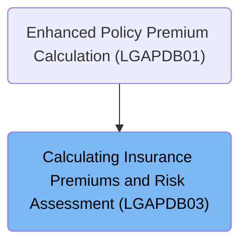

# Overview

This document describes the flow for processing insurance policy applications, covering risk assessment, eligibility determination, and premium calculation. The process ensures risk factors are available and applies business rules to produce a policy verdict and premium.

## Dependencies

### Program

- LGAPDB03 (<SwmPath>[base/src/LGAPDB03.cbl](base/src/LGAPDB03.cbl)</SwmPath>)

### Copybook

- SQLCA

# Where is this program used?

This program is used once, as represented in the following diagram:

&nbsp;

*This is an auto-generated document by Swimm 🌊 and has not yet been verified by a human*

<SwmMeta version="3.0.0" repo-id="Z2l0aHViJTNBJTNBY2ljcy1nZW5hcHAtZGVtbyUzQSUzQXN3aW1taW8=" repo-name="cics-genapp-demo">Powered by [Swimm](https://app.swimm.io/)</SwmMeta>
