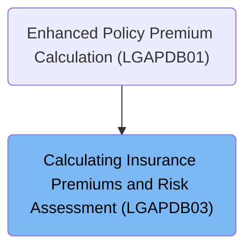
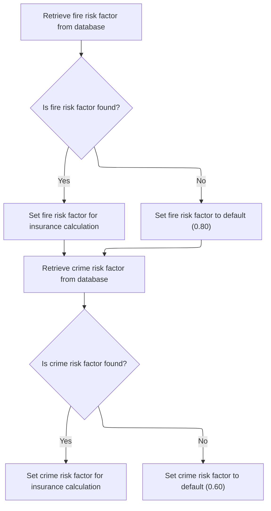
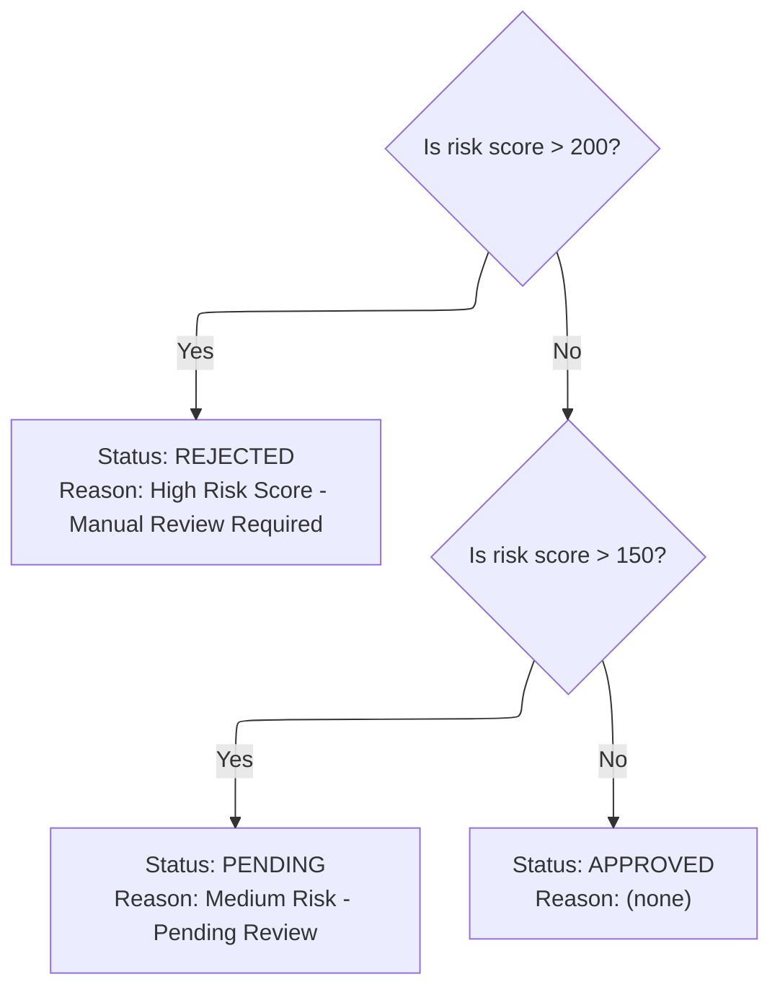

# Overview

This document describes the flow for calculating insurance premiums and determining application verdicts. Risk factor values for fire and crime are retrieved or defaulted, and the risk score is evaluated to set the application status. The calculated premiums and verdict guide insurance policy decisions.

## Dependencies

### Program

- <SwmToken path="base/src/LGAPDB03.cbl" pos="2:6:6" line-data="       PROGRAM-ID. LGAPDB03.">`LGAPDB03`</SwmToken> (<SwmPath>[base/src/LGAPDB03.cbl](base/src/LGAPDB03.cbl)</SwmPath>)

### Copybook

- SQLCA

# Where is this program used?

This program is used once, as represented in the following diagram:



## Input and Output Tables/Files used in the Program

| Table / File Name                                                                                                          | Type | Description                                                    | Usage Mode | Key Fields / Layout Highlights                                                                                                                                                                                                                                                                               |
| -------------------------------------------------------------------------------------------------------------------------- | ---- | -------------------------------------------------------------- | ---------- | ------------------------------------------------------------------------------------------------------------------------------------------------------------------------------------------------------------------------------------------------------------------------------------------------------------ |
| <SwmToken path="base/src/LGAPDB03.cbl" pos="51:3:3" line-data="               FROM RISK_FACTORS">`RISK_FACTORS`</SwmToken> | DB2  | Peril-specific risk adjustment factors for premium calculation | Input      | <SwmToken path="base/src/LGAPDB03.cbl" pos="50:8:12" line-data="               SELECT FACTOR_VALUE INTO :WS-FIRE-FACTOR">`WS-FIRE-FACTOR`</SwmToken>, <SwmToken path="base/src/LGAPDB03.cbl" pos="62:8:12" line-data="               SELECT FACTOR_VALUE INTO :WS-CRIME-FACTOR">`WS-CRIME-FACTOR`</SwmToken> |

&nbsp;

## Detailed View of the Program's Functionality

# Main Flow Execution

The program begins its main logic by executing three key steps in sequence:

1. It first retrieves risk factor values from the database (or uses default values if the database does not provide them).
2. Next, it evaluates the risk score to determine the application verdict (approved, pending, or rejected).
3. Finally, it calculates insurance premiums for various perils and the total premium.

Once these steps are completed, the program ends its execution.

# Fetching and Defaulting Risk Factors

The first step is to obtain risk factors for 'FIRE' and 'CRIME' perils:

- The program attempts to retrieve the fire risk factor from a database table dedicated to risk factors. If the database returns a value, that value is used for subsequent calculations. If the database does not return a value (for example, if the entry is missing), a default value of <SwmToken path="base/src/LGAPDB03.cbl" pos="58:3:5" line-data="               MOVE 0.80 TO WS-FIRE-FACTOR">`0.80`</SwmToken> is assigned for the fire risk factor.
- The same process is repeated for the crime risk factor. The program queries the database for the crime risk factor. If found, it is used; if not, a default value of <SwmToken path="base/src/LGAPDB03.cbl" pos="70:3:5" line-data="               MOVE 0.60 TO WS-CRIME-FACTOR">`0.60`</SwmToken> is assigned.

At the end of this step, both fire and crime risk factors are guaranteed to have valid values, either from the database or from the defaults. Flood and weather risk factors are not fetched from the database; they use predefined values.

# Evaluating Application Verdict

The program then determines the status of the insurance application based on the risk score:

- If the risk score is greater than 200, the application is marked as 'REJECTED'. The status description is set to 'REJECTED', and the rejection reason is set to 'High Risk Score - Manual Review Required'.
- If the risk score is not above 200 but is greater than 150, the application is marked as 'PENDING'. The status description is set to 'PENDING', and the rejection reason is set to 'Medium Risk - Pending Review'.
- If the risk score is 150 or below, the application is marked as 'APPROVED'. The status description is set to 'APPROVED', and the rejection reason is cleared.

This verdict determines how the application will be processed further.

# Calculating Premiums

The final step is to calculate the insurance premiums for each peril and the total premium:

- The program starts by setting a discount factor to <SwmToken path="base/src/LGAPDB03.cbl" pos="93:3:5" line-data="           MOVE 1.00 TO LK-DISC-FACT">`1.00`</SwmToken>.
- If all peril values (fire, crime, flood, weather) are greater than zero, the discount factor is reduced to <SwmToken path="base/src/LGAPDB03.cbl" pos="17:15:17" line-data="       01  WS-WEATHER-FACTOR           PIC V99 VALUE 0.90.">`0.90`</SwmToken>, applying a discount for comprehensive coverage.
- The premium for each peril (fire, crime, flood, weather) is calculated by multiplying the risk score, the corresponding risk factor, the peril value, and the discount factor.
- The total premium is then computed by summing the premiums for all four perils.

At the end of this step, the calculated premiums and total premium are ready for further use or display.

# Data Definitions

| Table / Record Name                                                                                                        | Type | Short Description                                              | Usage Mode     |
| -------------------------------------------------------------------------------------------------------------------------- | ---- | -------------------------------------------------------------- | -------------- |
| <SwmToken path="base/src/LGAPDB03.cbl" pos="51:3:3" line-data="               FROM RISK_FACTORS">`RISK_FACTORS`</SwmToken> | DB2  | Peril-specific risk adjustment factors for premium calculation | Input (SELECT) |

&nbsp;

# Rule Definition

| Paragraph Name                                                                                                                      | Rule ID | Category          | Description                                                                                                                                                                                                                                                                                                                                                                                             | Conditions                                                                                                                                                                                                                      | Remarks                                                                                                                                                                                                                                                                                                                              |
| ----------------------------------------------------------------------------------------------------------------------------------- | ------- | ----------------- | ------------------------------------------------------------------------------------------------------------------------------------------------------------------------------------------------------------------------------------------------------------------------------------------------------------------------------------------------------------------------------------------------------- | ------------------------------------------------------------------------------------------------------------------------------------------------------------------------------------------------------------------------------- | ------------------------------------------------------------------------------------------------------------------------------------------------------------------------------------------------------------------------------------------------------------------------------------------------------------------------------------ |
| <SwmToken path="base/src/LGAPDB03.cbl" pos="43:3:7" line-data="           PERFORM GET-RISK-FACTORS">`GET-RISK-FACTORS`</SwmToken>   | RL-001  | Conditional Logic | The system must retrieve the fire risk factor from the <SwmToken path="base/src/LGAPDB03.cbl" pos="51:3:3" line-data="               FROM RISK_FACTORS">`RISK_FACTORS`</SwmToken> table using the key 'FIRE'. If the fire risk factor is not found, it must be set to <SwmToken path="base/src/LGAPDB03.cbl" pos="58:3:5" line-data="               MOVE 0.80 TO WS-FIRE-FACTOR">`0.80`</SwmToken>.     | Attempt to retrieve fire risk factor from <SwmToken path="base/src/LGAPDB03.cbl" pos="51:3:3" line-data="               FROM RISK_FACTORS">`RISK_FACTORS`</SwmToken> table. If retrieval fails (not found), use default value.  | Default fire risk factor is <SwmToken path="base/src/LGAPDB03.cbl" pos="58:3:5" line-data="               MOVE 0.80 TO WS-FIRE-FACTOR">`0.80`</SwmToken>. The risk factor is a number with up to two decimal places.                                                                                                                 |
| <SwmToken path="base/src/LGAPDB03.cbl" pos="43:3:7" line-data="           PERFORM GET-RISK-FACTORS">`GET-RISK-FACTORS`</SwmToken>   | RL-002  | Conditional Logic | The system must retrieve the crime risk factor from the <SwmToken path="base/src/LGAPDB03.cbl" pos="51:3:3" line-data="               FROM RISK_FACTORS">`RISK_FACTORS`</SwmToken> table using the key 'CRIME'. If the crime risk factor is not found, it must be set to <SwmToken path="base/src/LGAPDB03.cbl" pos="70:3:5" line-data="               MOVE 0.60 TO WS-CRIME-FACTOR">`0.60`</SwmToken>. | Attempt to retrieve crime risk factor from <SwmToken path="base/src/LGAPDB03.cbl" pos="51:3:3" line-data="               FROM RISK_FACTORS">`RISK_FACTORS`</SwmToken> table. If retrieval fails (not found), use default value. | Default crime risk factor is <SwmToken path="base/src/LGAPDB03.cbl" pos="70:3:5" line-data="               MOVE 0.60 TO WS-CRIME-FACTOR">`0.60`</SwmToken>. The risk factor is a number with up to two decimal places.                                                                                                               |
| <SwmToken path="base/src/LGAPDB03.cbl" pos="43:3:7" line-data="           PERFORM GET-RISK-FACTORS">`GET-RISK-FACTORS`</SwmToken>   | RL-003  | Data Assignment   | The fire and crime risk factors must be made available for subsequent insurance calculations.                                                                                                                                                                                                                                                                                                           | After retrieval or defaulting, the risk factors are stored for use in calculations.                                                                                                                                             | Risk factors are numbers with up to two decimal places, available in the application context for calculations.                                                                                                                                                                                                                       |
| <SwmToken path="base/src/LGAPDB03.cbl" pos="44:3:5" line-data="           PERFORM CALCULATE-VERDICT">`CALCULATE-VERDICT`</SwmToken> | RL-004  | Conditional Logic | The system must evaluate the application verdict based on the risk score provided as input. The status, description, and rejection reason are set according to the risk score thresholds.                                                                                                                                                                                                               | Risk score is provided as input.                                                                                                                                                                                                | Status values: 2 (REJECTED), 1 (PENDING), 0 (APPROVED). Status description: 'REJECTED', 'PENDING', 'APPROVED'. Rejection reason: 'High Risk Score - Manual Review Required', 'Medium Risk - Pending Review', blank. Status is a number (0-2), description is a string (20 characters), rejection reason is a string (50 characters). |
| <SwmToken path="base/src/LGAPDB03.cbl" pos="44:3:5" line-data="           PERFORM CALCULATE-VERDICT">`CALCULATE-VERDICT`</SwmToken> | RL-005  | Data Assignment   | The outputs of the verdict evaluation (status, description, rejection reason) must be made available in the context or data structure representing the application.                                                                                                                                                                                                                                     | After verdict evaluation, outputs are assigned to the application context.                                                                                                                                                      | Status is a number (0-2), description is a string (20 characters, left-aligned, padded with spaces if shorter), rejection reason is a string (50 characters, left-aligned, padded with spaces if shorter).                                                                                                                           |

# User Stories

## User Story 1: Retrieve and provide risk factors for insurance calculations

---

### Story Description:

As an insurance application system, I want to retrieve fire and crime risk factors from the <SwmToken path="base/src/LGAPDB03.cbl" pos="51:3:3" line-data="               FROM RISK_FACTORS">`RISK_FACTORS`</SwmToken> table (or use default values if not found) so that these factors are available for subsequent insurance calculations.

---

### Business Rule Mapping:

| Rule ID | Paragraph Name                                                                                                                    | Rule Description                                                                                                                                                                                                                                                                                                                                                                                        |
| ------- | --------------------------------------------------------------------------------------------------------------------------------- | ------------------------------------------------------------------------------------------------------------------------------------------------------------------------------------------------------------------------------------------------------------------------------------------------------------------------------------------------------------------------------------------------------- |
| RL-001  | <SwmToken path="base/src/LGAPDB03.cbl" pos="43:3:7" line-data="           PERFORM GET-RISK-FACTORS">`GET-RISK-FACTORS`</SwmToken> | The system must retrieve the fire risk factor from the <SwmToken path="base/src/LGAPDB03.cbl" pos="51:3:3" line-data="               FROM RISK_FACTORS">`RISK_FACTORS`</SwmToken> table using the key 'FIRE'. If the fire risk factor is not found, it must be set to <SwmToken path="base/src/LGAPDB03.cbl" pos="58:3:5" line-data="               MOVE 0.80 TO WS-FIRE-FACTOR">`0.80`</SwmToken>.     |
| RL-002  | <SwmToken path="base/src/LGAPDB03.cbl" pos="43:3:7" line-data="           PERFORM GET-RISK-FACTORS">`GET-RISK-FACTORS`</SwmToken> | The system must retrieve the crime risk factor from the <SwmToken path="base/src/LGAPDB03.cbl" pos="51:3:3" line-data="               FROM RISK_FACTORS">`RISK_FACTORS`</SwmToken> table using the key 'CRIME'. If the crime risk factor is not found, it must be set to <SwmToken path="base/src/LGAPDB03.cbl" pos="70:3:5" line-data="               MOVE 0.60 TO WS-CRIME-FACTOR">`0.60`</SwmToken>. |
| RL-003  | <SwmToken path="base/src/LGAPDB03.cbl" pos="43:3:7" line-data="           PERFORM GET-RISK-FACTORS">`GET-RISK-FACTORS`</SwmToken> | The fire and crime risk factors must be made available for subsequent insurance calculations.                                                                                                                                                                                                                                                                                                           |

---

### Relevant Functionality:

- <SwmToken path="base/src/LGAPDB03.cbl" pos="43:3:7" line-data="           PERFORM GET-RISK-FACTORS">`GET-RISK-FACTORS`</SwmToken>
  1. **RL-001:**
     - Query the <SwmToken path="base/src/LGAPDB03.cbl" pos="51:3:3" line-data="               FROM RISK_FACTORS">`RISK_FACTORS`</SwmToken> table for the 'FIRE' risk factor.
     - If found, use the retrieved value.
     - If not found, set fire risk factor to <SwmToken path="base/src/LGAPDB03.cbl" pos="58:3:5" line-data="               MOVE 0.80 TO WS-FIRE-FACTOR">`0.80`</SwmToken>.
  2. **RL-002:**
     - Query the <SwmToken path="base/src/LGAPDB03.cbl" pos="51:3:3" line-data="               FROM RISK_FACTORS">`RISK_FACTORS`</SwmToken> table for the 'CRIME' risk factor.
     - If found, use the retrieved value.
     - If not found, set crime risk factor to <SwmToken path="base/src/LGAPDB03.cbl" pos="70:3:5" line-data="               MOVE 0.60 TO WS-CRIME-FACTOR">`0.60`</SwmToken>.
  3. **RL-003:**
     - Store the fire and crime risk factors in the application context after retrieval or defaulting.
     - Ensure these values are accessible for premium calculations.

## User Story 2: Evaluate application verdict based on risk score

---

### Story Description:

As an insurance application system, I want to evaluate the application verdict based on the provided risk score and assign the appropriate status, description, and rejection reason so that the outputs are available in the application context for further processing.

---

### Business Rule Mapping:

| Rule ID | Paragraph Name                                                                                                                      | Rule Description                                                                                                                                                                          |
| ------- | ----------------------------------------------------------------------------------------------------------------------------------- | ----------------------------------------------------------------------------------------------------------------------------------------------------------------------------------------- |
| RL-004  | <SwmToken path="base/src/LGAPDB03.cbl" pos="44:3:5" line-data="           PERFORM CALCULATE-VERDICT">`CALCULATE-VERDICT`</SwmToken> | The system must evaluate the application verdict based on the risk score provided as input. The status, description, and rejection reason are set according to the risk score thresholds. |
| RL-005  | <SwmToken path="base/src/LGAPDB03.cbl" pos="44:3:5" line-data="           PERFORM CALCULATE-VERDICT">`CALCULATE-VERDICT`</SwmToken> | The outputs of the verdict evaluation (status, description, rejection reason) must be made available in the context or data structure representing the application.                       |

---

### Relevant Functionality:

- <SwmToken path="base/src/LGAPDB03.cbl" pos="44:3:5" line-data="           PERFORM CALCULATE-VERDICT">`CALCULATE-VERDICT`</SwmToken>
  1. **RL-004:**
     - If risk score > 200:
       - Set status to 2
       - Set description to 'REJECTED'
       - Set rejection reason to 'High Risk Score - Manual Review Required'
     - Else if risk score > 150:
       - Set status to 1
       - Set description to 'PENDING'
       - Set rejection reason to 'Medium Risk - Pending Review'
     - Else:
       - Set status to 0
       - Set description to 'APPROVED'
       - Set rejection reason to blank
  2. **RL-005:**
     - Assign the status, description, and rejection reason to the application context after evaluation.
     - Ensure these outputs are accessible for subsequent processing or display.

# Workflow

# Driving the Risk and Premium Calculation

This section ensures that all necessary risk factor values are available before proceeding with insurance policy verdict and premium calculations. It guarantees that the business logic has the required data to make accurate and fair decisions.

| Category        | Rule Name                       | Description                                                                                                                                |
| --------------- | ------------------------------- | ------------------------------------------------------------------------------------------------------------------------------------------ |
| Data validation | Mandatory risk factor retrieval | Risk factor values for both fire and crime must be retrieved before any verdict or premium calculation is performed.                       |
| Business logic  | Default risk factors            | If risk factor values for fire and crime are not found in the database, default values must be used to ensure the calculation can proceed. |

<SwmSnippet path="/base/src/LGAPDB03.cbl" line="42">

---

<SwmToken path="base/src/LGAPDB03.cbl" pos="42:1:3" line-data="       MAIN-LOGIC.">`MAIN-LOGIC`</SwmToken> kicks off the flow by calling <SwmToken path="base/src/LGAPDB03.cbl" pos="43:3:7" line-data="           PERFORM GET-RISK-FACTORS">`GET-RISK-FACTORS`</SwmToken> to fetch the risk factor values from the database (or use defaults if missing). These values are needed for the subsequent verdict and premium calculations, so we get them up front before moving on to the rest of the logic.

```cobol
       MAIN-LOGIC.
           PERFORM GET-RISK-FACTORS
           PERFORM CALCULATE-VERDICT
           PERFORM CALCULATE-PREMIUMS
           GOBACK.
```

---

</SwmSnippet>

## Fetching and Defaulting Risk Factors



This section ensures that the insurance calculation process always has valid risk factor values for both 'FIRE' and 'CRIME' perils, either by retrieving them from the database or by applying predefined defaults if the data is missing.

| Category       | Rule Name                  | Description                                                                                                                                                                                                                                       |
| -------------- | -------------------------- | ------------------------------------------------------------------------------------------------------------------------------------------------------------------------------------------------------------------------------------------------- |
| Business logic | Default fire risk factor   | If a risk factor for 'FIRE' is not found in the database, the fire risk factor must be set to a default value of <SwmToken path="base/src/LGAPDB03.cbl" pos="58:3:5" line-data="               MOVE 0.80 TO WS-FIRE-FACTOR">`0.80`</SwmToken>.    |
| Business logic | Default crime risk factor  | If a risk factor for 'CRIME' is not found in the database, the crime risk factor must be set to a default value of <SwmToken path="base/src/LGAPDB03.cbl" pos="70:3:5" line-data="               MOVE 0.60 TO WS-CRIME-FACTOR">`0.60`</SwmToken>. |
| Business logic | Retrieve fire risk factor  | The risk factor for 'FIRE' must be retrieved from the database if available, and used for insurance calculations.                                                                                                                                 |
| Business logic | Retrieve crime risk factor | The risk factor for 'CRIME' must be retrieved from the database if available, and used for insurance calculations.                                                                                                                                |

<SwmSnippet path="/base/src/LGAPDB03.cbl" line="48">

---

In <SwmToken path="base/src/LGAPDB03.cbl" pos="48:1:5" line-data="       GET-RISK-FACTORS.">`GET-RISK-FACTORS`</SwmToken>, we start by trying to fetch the 'FIRE' risk factor from the <SwmToken path="base/src/LGAPDB03.cbl" pos="51:3:3" line-data="               FROM RISK_FACTORS">`RISK_FACTORS`</SwmToken> table using SQL. If the value is found, we use it; otherwise, we'll handle the fallback in the next step.

```cobol
       GET-RISK-FACTORS.
           EXEC SQL
               SELECT FACTOR_VALUE INTO :WS-FIRE-FACTOR
               FROM RISK_FACTORS
               WHERE PERIL_TYPE = 'FIRE'
           END-EXEC.
```

---

</SwmSnippet>

<SwmSnippet path="/base/src/LGAPDB03.cbl" line="55">

---

If the SQL query for 'FIRE' fails, we just assign <SwmToken path="base/src/LGAPDB03.cbl" pos="58:3:5" line-data="               MOVE 0.80 TO WS-FIRE-FACTOR">`0.80`</SwmToken> as the default risk factor, so the rest of the flow isn't blocked by missing data.

```cobol
           IF SQLCODE = 0
               CONTINUE
           ELSE
               MOVE 0.80 TO WS-FIRE-FACTOR
           END-IF.
```

---

</SwmSnippet>

<SwmSnippet path="/base/src/LGAPDB03.cbl" line="61">

---

After handling 'FIRE', we do the same thing for 'CRIME'—try to fetch its risk factor from the database, setting up for the next fallback if needed.

```cobol
           EXEC SQL
               SELECT FACTOR_VALUE INTO :WS-CRIME-FACTOR
               FROM RISK_FACTORS
               WHERE PERIL_TYPE = 'CRIME'
           END-EXEC.
```

---

</SwmSnippet>

<SwmSnippet path="/base/src/LGAPDB03.cbl" line="67">

---

After both queries, we make sure the 'CRIME' risk factor is set—using <SwmToken path="base/src/LGAPDB03.cbl" pos="70:3:5" line-data="               MOVE 0.60 TO WS-CRIME-FACTOR">`0.60`</SwmToken> if the database didn't return a value. At this point, both risk factors are ready for the rest of the flow.

```cobol
           IF SQLCODE = 0
               CONTINUE
           ELSE
               MOVE 0.60 TO WS-CRIME-FACTOR
           END-IF.
```

---

</SwmSnippet>

## Evaluating Application Verdict



<SwmSnippet path="/base/src/LGAPDB03.cbl" line="73">

---

<SwmToken path="base/src/LGAPDB03.cbl" pos="73:1:3" line-data="       CALCULATE-VERDICT.">`CALCULATE-VERDICT`</SwmToken> checks the risk score against two hardcoded thresholds (200 and 150) to set the application status, description, and rejection reason. This splits applications into 'REJECTED', 'PENDING', or 'APPROVED' categories, which drive the rest of the process.

```cobol
       CALCULATE-VERDICT.
           IF LK-RISK-SCORE > 200
             MOVE 2 TO LK-STAT
             MOVE 'REJECTED' TO LK-STAT-DESC
             MOVE 'High Risk Score - Manual Review Required' 
               TO LK-REJ-RSN
           ELSE
             IF LK-RISK-SCORE > 150
               MOVE 1 TO LK-STAT
               MOVE 'PENDING' TO LK-STAT-DESC
               MOVE 'Medium Risk - Pending Review'
                 TO LK-REJ-RSN
             ELSE
               MOVE 0 TO LK-STAT
               MOVE 'APPROVED' TO LK-STAT-DESC
               MOVE SPACES TO LK-REJ-RSN
             END-IF
           END-IF.
```

---

</SwmSnippet>

&nbsp;

*This is an auto-generated document by Swimm 🌊 and has not yet been verified by a human*

<SwmMeta version="3.0.0" repo-id="Z2l0aHViJTNBJTNBY2ljcy1nZW5hcHAtZGVtbyUzQSUzQXN3aW1taW8=" repo-name="cics-genapp-demo"><sup>Powered by [Swimm](https://app.swimm.io/)</sup></SwmMeta>
