# Program Overview

This document describes the flow for calculating risk scores for insurance policies (LGARSK01). The program processes each policy record, validates the data, applies business rules to determine risk based on property type, claim count, and peril percentages, and writes the calculated score to output. For example, a warehouse property with multiple claims and high flood peril will receive a higher risk score.

Main steps:

- Process each insurance policy record
- Validate record data
- Calculate risk score using business rules
- Write risk score to output


## Input and Output Tables/Files used in the Program

| Table / File Name                                                                                                                       | Type | Description                                              | Usage Mode | Key Fields / Layout Highlights |
| --------------------------------------------------------------------------------------------------------------------------------------- | ---- | -------------------------------------------------------- | ---------- | ------------------------------ |
| <SwmToken path="base/src/lgarsk01.cbl" pos="12:3:5" line-data="           SELECT ERROR-FILE ASSIGN TO ERRFILE">`ERROR-FILE`</SwmToken>  | File | Records of policies with validation or processing errors | Output     | File resource                  |
| <SwmToken path="base/src/lgarsk01.cbl" pos="45:3:5" line-data="       01  ERROR-RECORD.">`ERROR-RECORD`</SwmToken>                      | File | Single error entry: policy number and error message      | Output     | File resource                  |
| <SwmToken path="base/src/lgarsk01.cbl" pos="6:3:5" line-data="           SELECT INPUT-FILE ASSIGN TO INFILE">`INPUT-FILE`</SwmToken>    | File | Insurance policy input records for risk analysis         | Input      | File resource                  |
| <SwmToken path="base/src/lgarsk01.cbl" pos="9:3:5" line-data="           SELECT OUTPUT-FILE ASSIGN TO OUTFILE">`OUTPUT-FILE`</SwmToken> | File | Risk assessment results for each insurance policy        | Output     | File resource                  |
| <SwmToken path="base/src/lgarsk01.cbl" pos="36:3:5" line-data="       01  OUTPUT-RECORD.">`OUTPUT-RECORD`</SwmToken>                    | File | Single output entry: policy number, risk score, category | Output     | File resource                  |

&nbsp;

# Program Workflow

# Main Loop and File Handling


<SwmSnippet path="/base/src/lgarsk01.cbl" line="64">

---

<SwmToken path="base/src/lgarsk01.cbl" pos="64:1:3" line-data="       0000-MAIN.">`0000-MAIN`</SwmToken> kicks off the flow by initializing file access, then loops through <SwmToken path="base/src/lgarsk01.cbl" pos="66:3:5" line-data="           PERFORM 2000-PROCESS UNTIL WS-EOF = &#39;Y&#39;">`2000-PROCESS`</SwmToken> for each policy record until <SwmToken path="base/src/lgarsk01.cbl" pos="66:9:11" line-data="           PERFORM 2000-PROCESS UNTIL WS-EOF = &#39;Y&#39;">`WS-EOF`</SwmToken> signals no more data. After all records are handled, it closes the files. Calling <SwmToken path="base/src/lgarsk01.cbl" pos="66:3:5" line-data="           PERFORM 2000-PROCESS UNTIL WS-EOF = &#39;Y&#39;">`2000-PROCESS`</SwmToken> here lets us process each policy sequentially, validating, calculating risk, and writing output for each one.

```cobol
       0000-MAIN.
           PERFORM 1000-INIT
           PERFORM 2000-PROCESS UNTIL WS-EOF = 'Y'
           PERFORM 3000-CLOSE
           GOBACK.
```

---

</SwmSnippet>

# Policy Record Processing

<SwmSnippet path="/base/src/lgarsk01.cbl" line="92">

---

<SwmToken path="base/src/lgarsk01.cbl" pos="66:3:5" line-data="           PERFORM 2000-PROCESS UNTIL WS-EOF = &#39;Y&#39;">`2000-PROCESS`</SwmToken> validates the record, calculates risk if valid, and writes the result.

```cobol
           PERFORM 2100-VALIDATE-DATA
           PERFORM 2200-CALCULATE-RISK
           PERFORM 2300-WRITE-OUTPUT
```

---

</SwmSnippet>

# Risk Score Calculation

```mermaid
%%{init: {"flowchart": {"defaultRenderer": "elk"}} }%%
flowchart TD
    node1{"What is the property type?"}
    click node1 openCode "base/src/lgarsk01.cbl:108:119"
    node1 -->|"OFFICE"| node2["Set base risk score to 1.00"]
    click node2 openCode "base/src/lgarsk01.cbl:109:110"
    node1 -->|"RETAIL"| node3["Set base risk score to 1.25"]
    click node3 openCode "base/src/lgarsk01.cbl:111:112"
    node1 -->|"WAREHOUSE"| node4["Set base risk score to 1.50"]
    click node4 openCode "base/src/lgarsk01.cbl:113:114"
    node1 -->|"INDUSTRIAL"| node5["Set base risk score to 2.00"]
    click node5 openCode "base/src/lgarsk01.cbl:115:116"
    node1 -->|"OTHER"| node6["Set base risk score to 1.75"]
    click node6 openCode "base/src/lgarsk01.cbl:117:118"
    node2 --> node7{"How many claims?"}
    node3 --> node7
    node4 --> node7
    node5 --> node7
    node6 --> node7
    click node7 openCode "base/src/lgarsk01.cbl:121:127"
    node7 -->|"0"| node8["Set claim factor to 0.80"]
    click node8 openCode "base/src/lgarsk01.cbl:122:122"
    node7 -->|"1-2"| node9["Set claim factor to 1.30"]
    click node9 openCode "base/src/lgarsk01.cbl:123:124"
    node7 -->|"#gt;2"| node10["Set claim factor to 1.50"]
    click node10 openCode "base/src/lgarsk01.cbl:125:126"
    node8 --> node11["Calculate location factor using fire, crime, flood, and weather peril scores"]
    node9 --> node11
    node10 --> node11
    click node11 openCode "base/src/lgarsk01.cbl:129:133"
    node11 --> node12["Compute risk factor = base risk score × claim factor × location factor"]
    click node12 openCode "base/src/lgarsk01.cbl:135:136"
    node12 --> node13{"Is risk factor > 9.99?"}
    click node13 openCode "base/src/lgarsk01.cbl:138:140"
    node13 -->|"Yes"| node14["Set risk factor to 9.99"]
    click node14 openCode "base/src/lgarsk01.cbl:139:139"
    node13 -->|"No"| node15["Keep calculated risk factor"]
    click node15 openCode "base/src/lgarsk01.cbl:135:136"
    node14 --> node16["Final risk factor determined"]
    node15 --> node16
    click node16 openCode "base/src/lgarsk01.cbl:135:140"

%% Swimm:
%% %%{init: {"flowchart": {"defaultRenderer": "elk"}} }%%
%% flowchart TD
%%     node1{"What is the property type?"}
%%     click node1 openCode "<SwmPath>[base/src/lgarsk01.cbl](base/src/lgarsk01.cbl)</SwmPath>:108:119"
%%     node1 -->|"OFFICE"| node2["Set base risk score to <SwmToken path="base/src/lgarsk01.cbl" pos="110:3:5" line-data="                   MOVE 1.00 TO WS-BS-RS">`1.00`</SwmToken>"]
%%     click node2 openCode "<SwmPath>[base/src/lgarsk01.cbl](base/src/lgarsk01.cbl)</SwmPath>:109:110"
%%     node1 -->|"RETAIL"| node3["Set base risk score to <SwmToken path="base/src/lgarsk01.cbl" pos="112:3:5" line-data="                   MOVE 1.25 TO WS-BS-RS">`1.25`</SwmToken>"]
%%     click node3 openCode "<SwmPath>[base/src/lgarsk01.cbl](base/src/lgarsk01.cbl)</SwmPath>:111:112"
%%     node1 -->|"WAREHOUSE"| node4["Set base risk score to <SwmToken path="base/src/lgarsk01.cbl" pos="114:3:5" line-data="                   MOVE 1.50 TO WS-BS-RS">`1.50`</SwmToken>"]
%%     click node4 openCode "<SwmPath>[base/src/lgarsk01.cbl](base/src/lgarsk01.cbl)</SwmPath>:113:114"
%%     node1 -->|"INDUSTRIAL"| node5["Set base risk score to <SwmToken path="base/src/lgarsk01.cbl" pos="116:3:5" line-data="                   MOVE 2.00 TO WS-BS-RS">`2.00`</SwmToken>"]
%%     click node5 openCode "<SwmPath>[base/src/lgarsk01.cbl](base/src/lgarsk01.cbl)</SwmPath>:115:116"
%%     node1 -->|"OTHER"| node6["Set base risk score to <SwmToken path="base/src/lgarsk01.cbl" pos="118:3:5" line-data="                   MOVE 1.75 TO WS-BS-RS">`1.75`</SwmToken>"]
%%     click node6 openCode "<SwmPath>[base/src/lgarsk01.cbl](base/src/lgarsk01.cbl)</SwmPath>:117:118"
%%     node2 --> node7{"How many claims?"}
%%     node3 --> node7
%%     node4 --> node7
%%     node5 --> node7
%%     node6 --> node7
%%     click node7 openCode "<SwmPath>[base/src/lgarsk01.cbl](base/src/lgarsk01.cbl)</SwmPath>:121:127"
%%     node7 -->|"0"| node8["Set claim factor to <SwmToken path="base/src/lgarsk01.cbl" pos="122:3:5" line-data="               MOVE 0.80 TO WS-CL-F">`0.80`</SwmToken>"]
%%     click node8 openCode "<SwmPath>[base/src/lgarsk01.cbl](base/src/lgarsk01.cbl)</SwmPath>:122:122"
%%     node7 -->|"1-2"| node9["Set claim factor to <SwmToken path="base/src/lgarsk01.cbl" pos="124:3:5" line-data="               MOVE 1.30 TO WS-CL-F">`1.30`</SwmToken>"]
%%     click node9 openCode "<SwmPath>[base/src/lgarsk01.cbl](base/src/lgarsk01.cbl)</SwmPath>:123:124"
%%     node7 -->|"#gt;2"| node10["Set claim factor to <SwmToken path="base/src/lgarsk01.cbl" pos="114:3:5" line-data="                   MOVE 1.50 TO WS-BS-RS">`1.50`</SwmToken>"]
%%     click node10 openCode "<SwmPath>[base/src/lgarsk01.cbl](base/src/lgarsk01.cbl)</SwmPath>:125:126"
%%     node8 --> node11["Calculate location factor using fire, crime, flood, and weather peril scores"]
%%     node9 --> node11
%%     node10 --> node11
%%     click node11 openCode "<SwmPath>[base/src/lgarsk01.cbl](base/src/lgarsk01.cbl)</SwmPath>:129:133"
%%     node11 --> node12["Compute risk factor = base risk score × claim factor × location factor"]
%%     click node12 openCode "<SwmPath>[base/src/lgarsk01.cbl](base/src/lgarsk01.cbl)</SwmPath>:135:136"
%%     node12 --> node13{"Is risk factor > <SwmToken path="base/src/lgarsk01.cbl" pos="138:11:13" line-data="           IF WS-F-RSK &gt; 9.99">`9.99`</SwmToken>?"}
%%     click node13 openCode "<SwmPath>[base/src/lgarsk01.cbl](base/src/lgarsk01.cbl)</SwmPath>:138:140"
%%     node13 -->|"Yes"| node14["Set risk factor to <SwmToken path="base/src/lgarsk01.cbl" pos="138:11:13" line-data="           IF WS-F-RSK &gt; 9.99">`9.99`</SwmToken>"]
%%     click node14 openCode "<SwmPath>[base/src/lgarsk01.cbl](base/src/lgarsk01.cbl)</SwmPath>:139:139"
%%     node13 -->|"No"| node15["Keep calculated risk factor"]
%%     click node15 openCode "<SwmPath>[base/src/lgarsk01.cbl](base/src/lgarsk01.cbl)</SwmPath>:135:136"
%%     node14 --> node16["Final risk factor determined"]
%%     node15 --> node16
%%     click node16 openCode "<SwmPath>[base/src/lgarsk01.cbl](base/src/lgarsk01.cbl)</SwmPath>:135:140"
```



<SwmSnippet path="/base/src/lgarsk01.cbl" line="107">

---

In <SwmToken path="base/src/lgarsk01.cbl" pos="107:1:5" line-data="       2200-CALCULATE-RISK.">`2200-CALCULATE-RISK`</SwmToken>, we set the base risk multiplier (<SwmToken path="base/src/lgarsk01.cbl" pos="110:9:13" line-data="                   MOVE 1.00 TO WS-BS-RS">`WS-BS-RS`</SwmToken>) according to the property type. These values are hardcoded and reflect how each property type affects risk, defaulting to <SwmToken path="base/src/lgarsk01.cbl" pos="118:3:5" line-data="                   MOVE 1.75 TO WS-BS-RS">`1.75`</SwmToken> if the type isn't recognized.

```cobol
       2200-CALCULATE-RISK.
           EVALUATE IN-PROPERTY-TYPE
               WHEN 'OFFICE'
                   MOVE 1.00 TO WS-BS-RS
               WHEN 'RETAIL'
                   MOVE 1.25 TO WS-BS-RS
               WHEN 'WAREHOUSE'
                   MOVE 1.50 TO WS-BS-RS
               WHEN 'INDUSTRIAL'
                   MOVE 2.00 TO WS-BS-RS
               WHEN OTHER
                   MOVE 1.75 TO WS-BS-RS
           END-EVALUATE
```

---

</SwmSnippet>

<SwmSnippet path="/base/src/lgarsk01.cbl" line="121">

---

After setting the property type multiplier, we adjust the claim factor (<SwmToken path="base/src/lgarsk01.cbl" pos="122:9:13" line-data="               MOVE 0.80 TO WS-CL-F">`WS-CL-F`</SwmToken>) based on how many claims the policy has. The constants used here bump up the risk for more claims, following insurance logic.

```cobol
           IF IN-CLAIM-COUNT = 0
               MOVE 0.80 TO WS-CL-F
           ELSE IF IN-CLAIM-COUNT <= 2
               MOVE 1.30 TO WS-CL-F
           ELSE
               MOVE 1.50 TO WS-CL-F
           END-IF
```

---

</SwmSnippet>

<SwmSnippet path="/base/src/lgarsk01.cbl" line="129">

---

Next we calculate the location factor by combining weighted peril percentages, then multiply all the factors to get the final risk score. The formula and weights are domain-specific, and the score is capped to avoid extreme values.

```cobol
           COMPUTE WS-LOC-F = 1 +
               (IN-FR-PR * 0.2) +
               (IN-CR-PR * 0.2) +
               (IN-FL-PR * 0.3) +
               (IN-WE-PR * 0.2)

           COMPUTE WS-F-RSK ROUNDED =
               WS-BS-RS * WS-CL-F * WS-LOC-F
```

---

</SwmSnippet>

<SwmSnippet path="/base/src/lgarsk01.cbl" line="138">

---

We cap the risk score at <SwmToken path="base/src/lgarsk01.cbl" pos="138:11:13" line-data="           IF WS-F-RSK &gt; 9.99">`9.99`</SwmToken> if it goes over, then return it.

```cobol
           IF WS-F-RSK > 9.99
               MOVE 9.99 TO WS-F-RSK
           END-IF.
```

---

</SwmSnippet>

&nbsp;

*This is an auto-generated document by Swimm 🌊 and has not yet been verified by a human*

<SwmMeta version="3.0.0" repo-id="Z2l0aHViJTNBJTNBY2ljcy1nZW5hcHAtZGVtbyUzQSUzQXN3aW1taW8=" repo-name="cics-genapp-demo"><sup>Powered by [Swimm](https://app.swimm.io/)</sup></SwmMeta>
