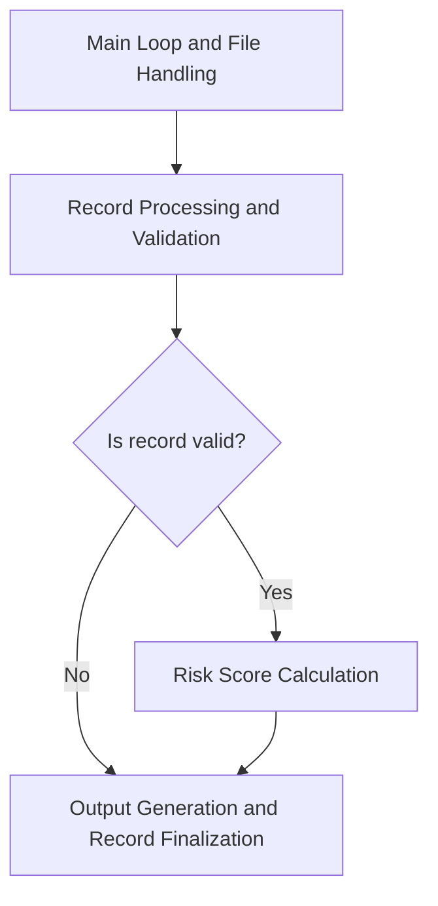

# Program Overview

This document describes the flow for processing insurance policy records (LGARSK01). The program reads, validates, and scores each policy, assigning a risk category and producing output for further insurance processing.

&nbsp;

*This is an auto-generated document by Swimm 🌊 and has not yet been verified by a human*

<SwmMeta version="3.0.0" repo-id="Z2l0aHViJTNBJTNBY2ljcy1nZW5hcHAtZGVtbyUzQSUzQXN3aW1taW8=" repo-name="cics-genapp-demo">Powered by [Swimm](https://app.swimm.io/)</SwmMeta>
