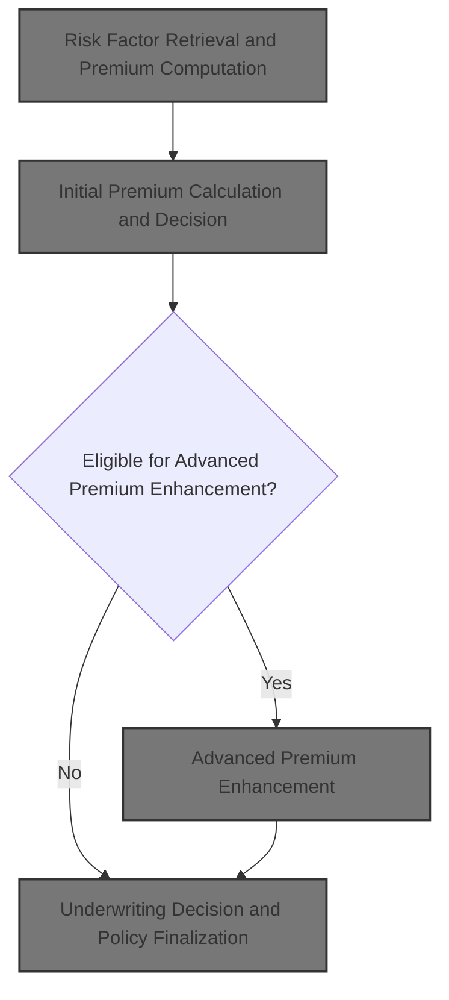
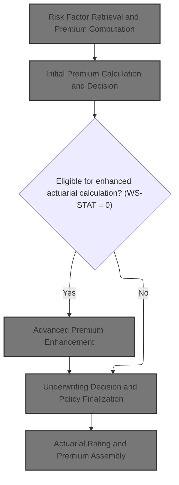
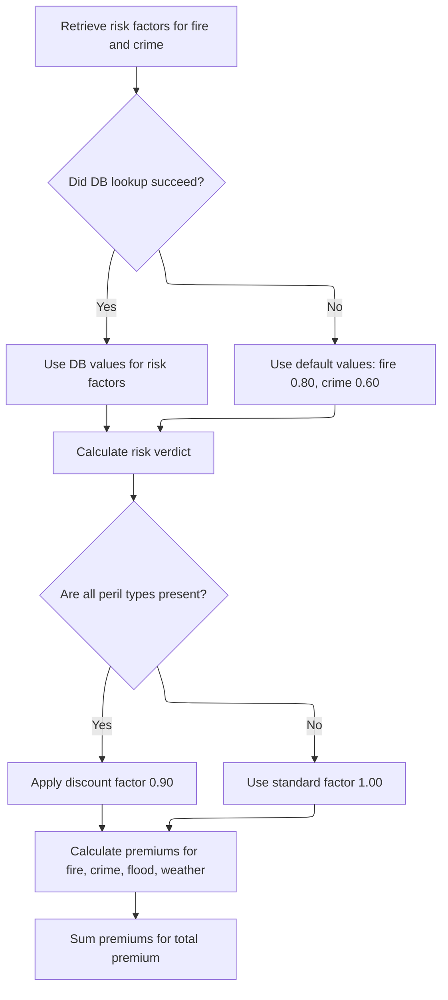
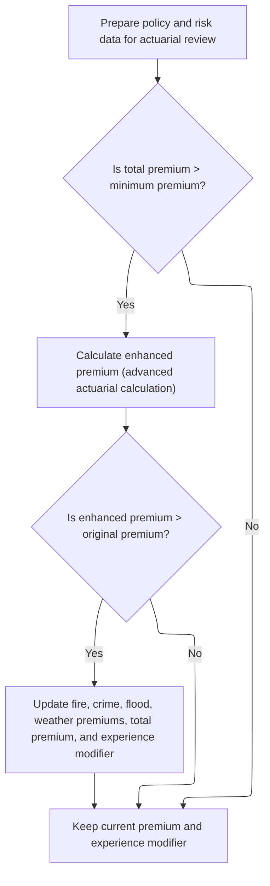
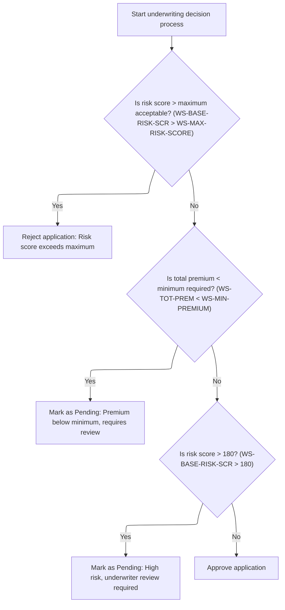

This document outlines the flow for processing commercial insurance policy applications. Policy data is used to assess risk, calculate premiums, and determine underwriting status. The process includes risk factor retrieval, initial and advanced premium calculations, application of business rules, and assembly of premium components, resulting in a finalized policy record.



# Spec

## Detailed View of the Program's Functionality

# Commercial Policy Processing Sequence

## 1\. Risk Factor Retrieval and Premium Computation

This process starts when a commercial policy record is identified and validated. The main program calls a subroutine responsible for calculating the risk score based on property and customer data. Once the risk score is available, the program hands off the risk score and peril selections (fire, crime, flood, weather) to a dedicated rating module.

Within the rating module:

- The system attempts to retrieve risk factors for fire and crime perils from a database. If the database lookup fails, default values are used (fire: 0.80, crime: 0.60).
- The risk score and peril data are used to determine an underwriting verdict:
  - If the risk score is above 200, the application is marked as "Rejected".
  - If the risk score is above 150 but not over 200, it is marked as "Pending".
  - Otherwise, it is "Approved".
- Premiums for each peril are calculated using the risk score, peril factor, peril value, and a discount factor:
  - If all four perils are present, a 10% discount is applied.
  - Otherwise, no discount is applied.
- Individual premiums for fire, crime, flood, and weather are calculated and summed to produce the total premium.

## 2\. Initial Premium Calculation and Decision

After the basic premium and underwriting verdict are calculated, the main program checks the underwriting status:

- If the status is "Approved", the process may proceed to an advanced actuarial calculation.
- If not, the process moves directly to business rule application and policy finalization.

The separation of basic premium calculation and decision logic into a dedicated module keeps the main flow clean and allows for modular updates to rating and verdict logic.

## 3\. Advanced Premium Enhancement

If the initial underwriting status is "Approved" and the total premium exceeds the minimum required premium:

- The program prepares a detailed input structure containing all relevant policy, risk, and coverage data.
- This structure is passed to an advanced actuarial calculation module.
- The actuarial module performs a series of calculations:
  - It determines exposure values, loads base rates from a database or uses defaults, calculates experience and schedule modifiers, computes base premiums for each peril, applies catastrophe loadings, expense and profit loadings, discounts, and taxes.
  - The final premium and rate factor are calculated, with caps applied if necessary.
- If the enhanced premium is greater than the original, the policy data is updated with the new premium values and experience modifier.

If the enhanced premium does not exceed the original, or the total premium is not above the minimum, the original premium and experience modifier are retained.

## 4\. Actuarial Rating and Premium Assembly

The advanced actuarial module executes a detailed rating and premium assembly process:

- It calculates exposure values based on coverage limits and risk score.
- Base rates for each peril are loaded from a database or set to defaults.
- Experience modifier is determined by years in business and claims history:
  - If the business has operated for at least 5 years and has no claims in the last 5 years, a favorable modifier is applied.
  - Otherwise, the modifier is calculated based on claims amount and credibility, and capped within a range.
- Schedule modifier is built by adjusting for building age, protection class, occupancy code, and exposure density, with caps applied.
- Premiums for each peril are calculated using exposure, base rate, experience and schedule modifiers, and trend factor. Crime and flood premiums receive additional multipliers.
- Catastrophe loadings are added for hurricane, earthquake, tornado, and flood risks.
- Expense and profit loadings are calculated and added.
- Discounts are determined based on peril combinations, claims-free status, and deductible amounts. The total discount is capped at 25%.
- Taxes are calculated and added.
- The final premium is assembled by summing all components, subtracting discounts, and adding taxes.
- The final rate factor is calculated and capped if necessary, with the premium recalculated if the cap is hit.

## 5\. Underwriting Decision and Policy Finalization

After all premium calculations are complete, business rules are applied to finalize the underwriting decision:

- If the risk score exceeds the maximum acceptable value from configuration, the application is rejected.
- If the total premium is below the minimum required, the application is marked as pending and flagged for review.
- If the risk score is above a hardcoded threshold (180), the application is marked as pending for underwriter review.
- Otherwise, the application is approved.

The final decision, premium breakdown, and any rejection reason are written to the output record. Statistics are updated to track counts of approved, pending, rejected, and high-risk policies, as well as total premium and average risk score.

## 6\. Output and Summary Generation

After all records are processed:

- Output records are written for each policy, including customer, property, risk score, premiums, status, and rejection reason.
- A summary file is generated, reporting totals for processed, approved, pending, rejected, error, and high-risk records, as well as total premium and average risk score.
- Processing statistics are displayed to the user.

---

This sequence ensures that each commercial policy is evaluated for risk, rated for premium, potentially enhanced by actuarial logic, and finalized according to business rules, with all results and statistics recorded for review and analysis.

# Rule Definition

| Paragraph Name                                                     | Rule ID | Category          | Description                                                                                                                                                                                                                             | Conditions                                                                                                                                                                                                                                   | Remarks                                                                                                                                                                                                                                                                                                                                                                                                                                    |
| ------------------------------------------------------------------ | ------- | ----------------- | --------------------------------------------------------------------------------------------------------------------------------------------------------------------------------------------------------------------------------------- | -------------------------------------------------------------------------------------------------------------------------------------------------------------------------------------------------------------------------------------------- | ------------------------------------------------------------------------------------------------------------------------------------------------------------------------------------------------------------------------------------------------------------------------------------------------------------------------------------------------------------------------------------------------------------------------------------------ |
| GET-RISK-FACTORS (LGAPDB03)                                        | RL-001  | Data Assignment   | The system must retrieve risk factors for fire and crime perils from the database. If the database does not provide a value, default values are used: fire = 0.80, crime = 0.60.                                                        | When calculating premiums for a commercial policy, attempt to retrieve risk factors for fire and crime perils from the RISK_FACTORS table. If SQLCODE is not 0 (no value found), use the default values.                                     | Default values: fire = 0.80, crime = 0.60. Factors are numeric values used in premium calculations.                                                                                                                                                                                                                                                                                                                                        |
| CALCULATE-VERDICT (LGAPDB03)                                       | RL-002  | Conditional Logic | The system determines the risk verdict (approved, pending, rejected) based on the risk score.                                                                                                                                           | If risk score > 200, verdict is rejected. If risk score > 150, verdict is pending. Otherwise, verdict is approved.                                                                                                                           | Verdict status: 0 = approved, 1 = pending, 2 = rejected. Status description: up to 20 characters. Rejection reason: up to 50 characters.                                                                                                                                                                                                                                                                                                   |
| CALCULATE-PREMIUMS (LGAPDB03), P900-DISC (LGAPDB04)                | RL-003  | Conditional Logic | A discount factor of 0.90 is applied if all peril types (fire, crime, flood, weather) are present; otherwise, a standard factor of 1.00 is used.                                                                                        | If fire, crime, flood, and weather peril values are all greater than zero, apply discount factor 0.90. Otherwise, use 1.00.                                                                                                                  | Discount factor: numeric, 0.90 or 1.00. Used in premium calculations.                                                                                                                                                                                                                                                                                                                                                                      |
| CALCULATE-PREMIUMS (LGAPDB03), P600-BASE-PREM (LGAPDB04)           | RL-004  | Computation       | Premiums for fire, crime, flood, and weather perils are calculated using the risk score, peril factor, peril value, and applicable discount factor.                                                                                     | For each peril with value > 0, calculate premium using the formula: (risk score \* peril factor) \* peril value \* discount factor (basic); advanced logic uses exposures, base rates, experience and schedule modifiers, and trend factors. | Premiums: numeric, up to 8 digits plus 2 decimals. Factors and values are numeric. Output format: right-aligned, zero-padded if necessary.                                                                                                                                                                                                                                                                                                 |
| CALCULATE-PREMIUMS (LGAPDB03), P999-FINAL (LGAPDB04)               | RL-005  | Computation       | The total premium is the sum of the individual premiums for fire, crime, flood, and weather perils.                                                                                                                                     | After calculating individual premiums, sum them to get the total premium.                                                                                                                                                                    | Total premium: numeric, up to 9 digits plus 2 decimals. Output format: right-aligned, zero-padded if necessary.                                                                                                                                                                                                                                                                                                                            |
| P011B-BASIC-PREMIUM-CALC, P011C-ENHANCED-ACTUARIAL-CALC (LGAPDB01) | RL-006  | Conditional Logic | Enhanced actuarial calculation is performed only if the status value is 0 (approved).                                                                                                                                                   | If status value is 0 after basic premium calculation, perform enhanced actuarial calculation.                                                                                                                                                | Status value: 0 = eligible for enhanced calculation.                                                                                                                                                                                                                                                                                                                                                                                       |
| P011C-ENHANCED-ACTUARIAL-CALC (LGAPDB01)                           | RL-007  | Data Assignment   | If eligible for enhanced calculation, prepare all relevant data for actuarial review, including customer number, property details, peril selections, deductibles, claims history, and limits.                                           | Eligibility determined by status value = 0.                                                                                                                                                                                                  | Data fields: customer number (10 chars), property type (15 chars), peril selections (4 digits each), deductibles (up to 6 digits plus 2 decimals), claims history (counts and amounts), limits (up to 9 digits plus 2 decimals).                                                                                                                                                                                                           |
| P011C-ENHANCED-ACTUARIAL-CALC (LGAPDB01)                           | RL-008  | Conditional Logic | If the total premium is not greater than the minimum premium, retain the current premium and experience modifier.                                                                                                                       | If total premium <= minimum premium after enhanced calculation.                                                                                                                                                                              | Minimum premium: 500.00 (default, configurable).                                                                                                                                                                                                                                                                                                                                                                                           |
| P011C-ENHANCED-ACTUARIAL-CALC (LGAPDB01), LGAPDB04 main logic      | RL-009  | Computation       | If the total premium is greater than the minimum, calculate an enhanced premium using advanced actuarial logic, including experience and schedule modifiers, base premium, catastrophe, expense, profit loadings, discounts, and taxes. | If total premium > minimum premium.                                                                                                                                                                                                          | Premium components: base, catastrophe, expense, profit, discount, tax. Numeric formats as per output record definitions.                                                                                                                                                                                                                                                                                                                   |
| P011C-ENHANCED-ACTUARIAL-CALC (LGAPDB01)                           | RL-010  | Conditional Logic | If the enhanced premium is greater than the original premium, update the individual peril premiums, total premium, and experience modifier with the enhanced values.                                                                    | If enhanced premium > original premium after actuarial calculation.                                                                                                                                                                          | Premiums and experience modifier: numeric, formats as per output record.                                                                                                                                                                                                                                                                                                                                                                   |
| P011D-APPLY-BUSINESS-RULES (LGAPDB01)                              | RL-011  | Conditional Logic | Underwriting decision is made by comparing the risk score to the maximum acceptable risk score and the total premium to the minimum required premium.                                                                                   | If risk score > max risk score, reject. If total premium < minimum, mark as pending. If risk score > 180 but not above max, mark as pending for underwriter review. Otherwise, approve.                                                      | Max risk score: 250 (default, configurable). Minimum premium: 500.00 (default, configurable).                                                                                                                                                                                                                                                                                                                                              |
| P011E-WRITE-OUTPUT-RECORD (LGAPDB01), LGAPDB04 output structure    | RL-012  | Data Assignment   | The system outputs the final status, status description, rejection reason (if any), individual peril premiums, total premium, premium components, and rating factors.                                                                   | After all calculations and decisions are complete.                                                                                                                                                                                           | Output record fields: customer number (10 chars), property type (15 chars), postcode (variable), risk score (3 digits), premiums (up to 8 digits plus 2 decimals), status (up to 20 chars), rejection reason (up to 50 chars), premium components (base, catastrophe, expense, profit, discount, tax: numeric), rating factors (experience, schedule, final rate factor: numeric). All fields are right-aligned, zero-padded if necessary. |

# User Stories

## User Story 1: Risk Factor Retrieval, Premium Calculation, and Underwriting Decision

---

### Story Description:

As a policy rating system, I want to retrieve risk factors, calculate individual and total premiums (including discount logic), and make underwriting decisions based on risk score and premium thresholds so that I can accurately assess, rate, and determine the eligibility of commercial insurance policies.

---

### Business Rule Mapping:

| Rule ID | Paragraph Name                                           | Rule Description                                                                                                                                                                 |
| ------- | -------------------------------------------------------- | -------------------------------------------------------------------------------------------------------------------------------------------------------------------------------- |
| RL-001  | GET-RISK-FACTORS (LGAPDB03)                              | The system must retrieve risk factors for fire and crime perils from the database. If the database does not provide a value, default values are used: fire = 0.80, crime = 0.60. |
| RL-002  | CALCULATE-VERDICT (LGAPDB03)                             | The system determines the risk verdict (approved, pending, rejected) based on the risk score.                                                                                    |
| RL-003  | CALCULATE-PREMIUMS (LGAPDB03), P900-DISC (LGAPDB04)      | A discount factor of 0.90 is applied if all peril types (fire, crime, flood, weather) are present; otherwise, a standard factor of 1.00 is used.                                 |
| RL-004  | CALCULATE-PREMIUMS (LGAPDB03), P600-BASE-PREM (LGAPDB04) | Premiums for fire, crime, flood, and weather perils are calculated using the risk score, peril factor, peril value, and applicable discount factor.                              |
| RL-005  | CALCULATE-PREMIUMS (LGAPDB03), P999-FINAL (LGAPDB04)     | The total premium is the sum of the individual premiums for fire, crime, flood, and weather perils.                                                                              |
| RL-011  | P011D-APPLY-BUSINESS-RULES (LGAPDB01)                    | Underwriting decision is made by comparing the risk score to the maximum acceptable risk score and the total premium to the minimum required premium.                            |

---

### Relevant Functionality:

- **GET-RISK-FACTORS (LGAPDB03)**
  1. **RL-001:**
     - Query database for fire risk factor
     - If found, use database value
     - Else, use default value 0.80
     - Query database for crime risk factor
     - If found, use database value
     - Else, use default value 0.60
- **CALCULATE-VERDICT (LGAPDB03)**
  1. **RL-002:**
     - If risk score > 200:
       - Set status to rejected
       - Set description and rejection reason
     - Else if risk score > 150:
       - Set status to pending
       - Set description and rejection reason
     - Else:
       - Set status to approved
       - Clear rejection reason
- **CALCULATE-PREMIUMS (LGAPDB03)**
  1. **RL-003:**
     - Set discount factor to 1.00
     - If all peril values > 0:
       - Set discount factor to 0.90
  2. **RL-004:**
     - For each peril:
       - If peril value > 0:
         - Compute premium using risk score, peril factor, peril value, discount factor
         - For advanced calculation, use exposures, base rates, modifiers, and trend factor
  3. **RL-005:**
     - Total premium = fire premium + crime premium + flood premium + weather premium
- **P011D-APPLY-BUSINESS-RULES (LGAPDB01)**
  1. **RL-011:**
     - If risk score > max risk score:
       - Reject application
     - Else if total premium < minimum premium:
       - Mark as pending
     - Else if risk score > 180:
       - Mark as pending for underwriter review
     - Else:
       - Approve application

## User Story 2: Enhanced Actuarial Processing and Output Generation

---

### Story Description:

As a policy rating system, I want to perform enhanced actuarial calculations for eligible policies, prepare all relevant data for actuarial review, update premiums and experience modifiers when appropriate, and output all final results including status, premiums, premium components, and rating factors so that policies are rated using advanced actuarial logic and all relevant results are available for downstream processing and reporting.

---

### Business Rule Mapping:

| Rule ID | Paragraph Name                                                     | Rule Description                                                                                                                                                                                                                        |
| ------- | ------------------------------------------------------------------ | --------------------------------------------------------------------------------------------------------------------------------------------------------------------------------------------------------------------------------------- |
| RL-006  | P011B-BASIC-PREMIUM-CALC, P011C-ENHANCED-ACTUARIAL-CALC (LGAPDB01) | Enhanced actuarial calculation is performed only if the status value is 0 (approved).                                                                                                                                                   |
| RL-007  | P011C-ENHANCED-ACTUARIAL-CALC (LGAPDB01)                           | If eligible for enhanced calculation, prepare all relevant data for actuarial review, including customer number, property details, peril selections, deductibles, claims history, and limits.                                           |
| RL-008  | P011C-ENHANCED-ACTUARIAL-CALC (LGAPDB01)                           | If the total premium is not greater than the minimum premium, retain the current premium and experience modifier.                                                                                                                       |
| RL-009  | P011C-ENHANCED-ACTUARIAL-CALC (LGAPDB01), LGAPDB04 main logic      | If the total premium is greater than the minimum, calculate an enhanced premium using advanced actuarial logic, including experience and schedule modifiers, base premium, catastrophe, expense, profit loadings, discounts, and taxes. |
| RL-010  | P011C-ENHANCED-ACTUARIAL-CALC (LGAPDB01)                           | If the enhanced premium is greater than the original premium, update the individual peril premiums, total premium, and experience modifier with the enhanced values.                                                                    |
| RL-012  | P011E-WRITE-OUTPUT-RECORD (LGAPDB01), LGAPDB04 output structure    | The system outputs the final status, status description, rejection reason (if any), individual peril premiums, total premium, premium components, and rating factors.                                                                   |

---

### Relevant Functionality:

- **P011B-BASIC-PREMIUM-CALC**
  1. **RL-006:**
     - If status value = 0:
       - Prepare data for actuarial review
       - Call advanced actuarial calculation
- **P011C-ENHANCED-ACTUARIAL-CALC (LGAPDB01)**
  1. **RL-007:**
     - If eligible:
       - Move all relevant input data to actuarial interface structure
  2. **RL-008:**
     - If total premium <= minimum premium:
       - Retain current premium and experience modifier
  3. **RL-009:**
     - If total premium > minimum premium:
       - Call advanced actuarial calculation
       - Calculate all premium components
       - Sum components to produce enhanced premium
  4. **RL-010:**
     - If enhanced premium > original premium:
       - Update fire, crime, flood, weather premiums
       - Update total premium
       - Update experience modifier
- **P011E-WRITE-OUTPUT-RECORD (LGAPDB01)**
  1. **RL-012:**
     - Move all calculated and decision data to output record
     - Write output record with all required fields

# Code Walkthrough

## Commercial Policy Processing Sequence



<SwmSnippet path="/base/src/LGAPDB01.cbl" line="258">

---

P011-PROCESS-COMMERCIAL kicks off the commercial policy flow by calculating risk score, then calling P011B-BASIC-PREMIUM-CALC to get initial premium values and underwriting decision. This step is needed because the premium and decision status determine if we should run the enhanced actuarial calculation or just apply business rules and finish. The output from P011B sets up the rest of the flow.

```cobol
       P011-PROCESS-COMMERCIAL.
           PERFORM P011A-CALCULATE-RISK-SCORE
           PERFORM P011B-BASIC-PREMIUM-CALC
           IF WS-STAT = 0
               PERFORM P011C-ENHANCED-ACTUARIAL-CALC
           END-IF
           PERFORM P011D-APPLY-BUSINESS-RULES
           PERFORM P011E-WRITE-OUTPUT-RECORD
           PERFORM P011F-UPDATE-STATISTICS.
```

---

</SwmSnippet>

### Initial Premium Calculation and Decision

<SwmSnippet path="/base/src/LGAPDB01.cbl" line="275">

---

P011B-BASIC-PREMIUM-CALC hands off risk scores and peril data to LGAPDB03 via a CALL, letting that program handle the actual premium and decision logic. This separation keeps the main flow clean and lets LGAPDB03 focus on rating and verdict calculation.

```cobol
       P011B-BASIC-PREMIUM-CALC.
           CALL 'LGAPDB03' USING WS-BASE-RISK-SCR, IN-FIRE-PERIL, 
                                IN-CRIME-PERIL, IN-FLOOD-PERIL, 
                                IN-WEATHER-PERIL, WS-STAT,
                                WS-STAT-DESC, WS-REJ-RSN, WS-FR-PREM,
                                WS-CR-PREM, WS-FL-PREM, WS-WE-PREM,
                                WS-TOT-PREM, WS-DISC-FACT.
```

---

</SwmSnippet>

### Risk Factor Retrieval and Premium Computation



<SwmSnippet path="/base/src/LGAPDB03.cbl" line="42">

---

MAIN-LOGIC gets risk factors, sets the verdict, and computes premiums, making sure all calculations use current or default risk data.

```cobol
       MAIN-LOGIC.
           PERFORM GET-RISK-FACTORS
           PERFORM CALCULATE-VERDICT
           PERFORM CALCULATE-PREMIUMS
           GOBACK.
```

---

</SwmSnippet>

<SwmSnippet path="/base/src/LGAPDB03.cbl" line="48">

---

GET-RISK-FACTORS tries to fetch fire and crime risk factors from the database, but if the query fails, it just sets them to 0.80 and 0.60. These constants are baked into the repo and will affect premiums whenever the DB doesn't have values.

```cobol
       GET-RISK-FACTORS.
           EXEC SQL
               SELECT FACTOR_VALUE INTO :WS-FIRE-FACTOR
               FROM RISK_FACTORS
               WHERE PERIL_TYPE = 'FIRE'
           END-EXEC.
           
           IF SQLCODE = 0
               CONTINUE
           ELSE
               MOVE 0.80 TO WS-FIRE-FACTOR
           END-IF.
           
           EXEC SQL
               SELECT FACTOR_VALUE INTO :WS-CRIME-FACTOR
               FROM RISK_FACTORS
               WHERE PERIL_TYPE = 'CRIME'
           END-EXEC.
           
           IF SQLCODE = 0
               CONTINUE
           ELSE
               MOVE 0.60 TO WS-CRIME-FACTOR
           END-IF.
```

---

</SwmSnippet>

<SwmSnippet path="/base/src/LGAPDB03.cbl" line="92">

---

CALCULATE-PREMIUMS sets up the discount factor, then calculates premiums for each peril using risk score, peril factor, peril value, and the discount. If all perils are covered, it applies a 10% discount. The total premium is just the sum of all individual premiums.

```cobol
       CALCULATE-PREMIUMS.
           MOVE 1.00 TO LK-DISC-FACT
           
           IF LK-FIRE-PERIL > 0 AND
              LK-CRIME-PERIL > 0 AND
              LK-FLOOD-PERIL > 0 AND
              LK-WEATHER-PERIL > 0
             MOVE 0.90 TO LK-DISC-FACT
           END-IF

           COMPUTE LK-FIRE-PREMIUM =
             ((LK-RISK-SCORE * WS-FIRE-FACTOR) * LK-FIRE-PERIL *
               LK-DISC-FACT)
           
           COMPUTE LK-CRIME-PREMIUM =
             ((LK-RISK-SCORE * WS-CRIME-FACTOR) * LK-CRIME-PERIL *
               LK-DISC-FACT)
           
           COMPUTE LK-FLOOD-PREMIUM =
             ((LK-RISK-SCORE * WS-FLOOD-FACTOR) * LK-FLOOD-PERIL *
               LK-DISC-FACT)
           
           COMPUTE LK-WEATHER-PREMIUM =
             ((LK-RISK-SCORE * WS-WEATHER-FACTOR) * LK-WEATHER-PERIL *
               LK-DISC-FACT)

           COMPUTE LK-TOTAL-PREMIUM = 
             LK-FIRE-PREMIUM + LK-CRIME-PREMIUM + 
             LK-FLOOD-PREMIUM + LK-WEATHER-PREMIUM. 
```

---

</SwmSnippet>

### Advanced Premium Enhancement



<SwmSnippet path="/base/src/LGAPDB01.cbl" line="283">

---

P011C-ENHANCED-ACTUARIAL-CALC sets up all the detailed input and coverage data, then calls LGAPDB04 to run the advanced actuarial premium logic, but only if the initial premium is above the minimum. If the enhanced premium is better, it updates the policy data.

```cobol
       P011C-ENHANCED-ACTUARIAL-CALC.
      *    Prepare input structure for actuarial calculation
           MOVE IN-CUSTOMER-NUM TO LK-CUSTOMER-NUM
           MOVE WS-BASE-RISK-SCR TO LK-RISK-SCORE
           MOVE IN-PROPERTY-TYPE TO LK-PROPERTY-TYPE
           MOVE IN-TERRITORY-CODE TO LK-TERRITORY
           MOVE IN-CONSTRUCTION-TYPE TO LK-CONSTRUCTION-TYPE
           MOVE IN-OCCUPANCY-CODE TO LK-OCCUPANCY-CODE
           MOVE IN-SPRINKLER-IND TO LK-PROTECTION-CLASS
           MOVE IN-YEAR-BUILT TO LK-YEAR-BUILT
           MOVE IN-SQUARE-FOOTAGE TO LK-SQUARE-FOOTAGE
           MOVE IN-YEARS-IN-BUSINESS TO LK-YEARS-IN-BUSINESS
           MOVE IN-CLAIMS-COUNT-3YR TO LK-CLAIMS-COUNT-5YR
           MOVE IN-CLAIMS-AMOUNT-3YR TO LK-CLAIMS-AMOUNT-5YR
           
      *    Set coverage data
           MOVE IN-BUILDING-LIMIT TO LK-BUILDING-LIMIT
           MOVE IN-CONTENTS-LIMIT TO LK-CONTENTS-LIMIT
           MOVE IN-BI-LIMIT TO LK-BI-LIMIT
           MOVE IN-FIRE-DEDUCTIBLE TO LK-FIRE-DEDUCTIBLE
           MOVE IN-WIND-DEDUCTIBLE TO LK-WIND-DEDUCTIBLE
           MOVE IN-FLOOD-DEDUCTIBLE TO LK-FLOOD-DEDUCTIBLE
           MOVE IN-OTHER-DEDUCTIBLE TO LK-OTHER-DEDUCTIBLE
           MOVE IN-FIRE-PERIL TO LK-FIRE-PERIL
           MOVE IN-CRIME-PERIL TO LK-CRIME-PERIL
           MOVE IN-FLOOD-PERIL TO LK-FLOOD-PERIL
           MOVE IN-WEATHER-PERIL TO LK-WEATHER-PERIL
           
      *    Call advanced actuarial calculation program (only for approved cases)
           IF WS-TOT-PREM > WS-MIN-PREMIUM
               CALL 'LGAPDB04' USING LK-INPUT-DATA, LK-COVERAGE-DATA, 
                                    LK-OUTPUT-RESULTS
               
      *        Update with enhanced calculations if successful
               IF LK-TOTAL-PREMIUM > WS-TOT-PREM
                   MOVE LK-FIRE-PREMIUM TO WS-FR-PREM
                   MOVE LK-CRIME-PREMIUM TO WS-CR-PREM
                   MOVE LK-FLOOD-PREMIUM TO WS-FL-PREM
                   MOVE LK-WEATHER-PREMIUM TO WS-WE-PREM
                   MOVE LK-TOTAL-PREMIUM TO WS-TOT-PREM
                   MOVE LK-EXPERIENCE-MOD TO WS-EXPERIENCE-MOD
               END-IF
           END-IF.
```

---

</SwmSnippet>

### Actuarial Rating and Premium Assembly

```mermaid
%%{init: {"flowchart": {"defaultRenderer": "elk"}} }%%
flowchart TD
    node1["Start premium calculation"] --> node2{"Years in business >= 5?"}
    click node1 openCode "base/src/LGAPDB04.cbl:138:150"
    node2 -->|"Yes"| node3{"Claims count in last 5 years = 0?"}
    click node2 openCode "base/src/LGAPDB04.cbl:234:257"
    node2 -->|"No"| node4["Set experience mod to 1.1000"]
    click node4 openCode "base/src/LGAPDB04.cbl:234:257"
    node3 -->|"Yes"| node5["Set experience mod to 0.8500"]
    click node5 openCode "base/src/LGAPDB04.cbl:234:257"
    node3 -->|"No"| node6["Calculate experience mod based on claims amount and credibility"]
    click node6 openCode "base/src/LGAPDB04.cbl:234:257"
    node5 --> node7[subgraph schedmod["Schedule modification"]
        node7a{"Building year?"}
        node7a -->|"#gt;= 2010"| node7b["Subtract 0.050"]
        click node7b openCode "base/src/LGAPDB04.cbl:260:316"
        node7a -->|"#gt;= 1990"| node7c["No change"]
        click node7c openCode "base/src/LGAPDB04.cbl:260:316"
        node7a -->|"#gt;= 1970"| node7d["Add 0.100"]
        click node7d openCode "base/src/LGAPDB04.cbl:260:316"
        node7a -->|"Other"| node7e["Add 0.200"]
        click node7e openCode "base/src/LGAPDB04.cbl:260:316"
        node7f{"Protection class?"}
        node7f -->|"'01'-'03'"| node7g["Subtract 0.100"]
        click node7g openCode "base/src/LGAPDB04.cbl:260:316"
        node7f -->|"'04'-'06'"| node7h["Subtract 0.050"]
        click node7h openCode "base/src/LGAPDB04.cbl:260:316"
        node7f -->|"'07'-'09'"| node7i["No change"]
        click node7i openCode "base/src/LGAPDB04.cbl:260:316"
        node7f -->|"Other"| node7j["Add 0.150"]
        click node7j openCode "base/src/LGAPDB04.cbl:260:316"
        node7k{"Occupancy code?"}
        node7k -->|"'OFF01'-'OFF05'"| node7l["Subtract 0.025"]
        click node7l openCode "base/src/LGAPDB04.cbl:260:316"
        node7k -->|"'MFG01'-'MFG10'"| node7m["Add 0.075"]
        click node7m openCode "base/src/LGAPDB04.cbl:260:316"
        node7k -->|"'WHS01'-'WHS05'"| node7n["Add 0.125"]
        click node7n openCode "base/src/LGAPDB04.cbl:260:316"
        node7k -->|"Other"| node7o["No change"]
        click node7o openCode "base/src/LGAPDB04.cbl:260:316"
        node7p{"Exposure density?"}
        node7p -->|"#gt; 500"| node7q["Add 0.100"]
        click node7q openCode "base/src/LGAPDB04.cbl:260:316"
        node7p -->|"#lt; 50"| node7r["Subtract 0.050"]
        click node7r openCode "base/src/LGAPDB04.cbl:260:316"
        node7p -->|"Other"| node7s["No change"]
        click node7s openCode "base/src/LGAPDB04.cbl:260:316"
    end]
    node6 --> node7
    node4 --> node7
    node7 --> node8{subgraph perils["Calculate base premium"]
        node8a{"Fire peril covered?"}
        node8a -->|"Yes"| node8b["Calculate fire premium"]
        click node8b openCode "base/src/LGAPDB04.cbl:318:367"
        node8a -->|"No"| node8c["Skip fire premium"]
        click node8c openCode "base/src/LGAPDB04.cbl:318:367"
        node8d{"Crime peril covered?"}
        node8d -->|"Yes"| node8e["Calculate crime premium"]
        click node8e openCode "base/src/LGAPDB04.cbl:318:367"
        node8d -->|"No"| node8f["Skip crime premium"]
        click node8f openCode "base/src/LGAPDB04.cbl:318:367"
        node8g{"Flood peril covered?"}
        node8g -->|"Yes"| node8h["Calculate flood premium"]
        click node8h openCode "base/src/LGAPDB04.cbl:318:367"
        node8g -->|"No"| node8i["Skip flood premium"]
        click node8i openCode "base/src/LGAPDB04.cbl:318:367"
        node8j{"Weather peril covered?"}
        node8j -->|"Yes"| node8k["Calculate weather premium"]
        click node8k openCode "base/src/LGAPDB04.cbl:318:367"
        node8j -->|"No"| node8l["Skip weather premium"]
        click node8l openCode "base/src/LGAPDB04.cbl:318:367"
    end}
    node7 --> node8
    node8 --> node9{subgraph discounts["Apply discounts"]
        node9a{"All perils covered?"}
        node9a -->|"Yes"| node9b["Apply 10% multi-peril discount"]
        click node9b openCode "base/src/LGAPDB04.cbl:407:454"
        node9a -->|"No"| node9c{"Fire & weather covered, plus crime or flood?"}
        node9c -->|"Yes"| node9d["Apply 5% multi-peril discount"]
        click node9d openCode "base/src/LGAPDB04.cbl:407:454"
        node9c -->|"No"| node9e["No multi-peril discount"]
        click node9e openCode "base/src/LGAPDB04.cbl:407:454"
        node9f{"Claims-free 5 years and >= 5 years in business?"}
        node9f -->|"Yes"| node9g["Apply 7.5% claims-free discount"]
        click node9g openCode "base/src/LGAPDB04.cbl:407:454"
        node9f -->|"No"| node9h["No claims-free discount"]
        click node9h openCode "base/src/LGAPDB04.cbl:407:454"
        node9i{"Deductibles: fire >= $10k, wind >= $25k, flood >= $50k?"}
        node9i -->|"Yes"| node9j["Apply deductible credits"]
        click node9j openCode "base/src/LGAPDB04.cbl:407:454"
        node9i -->|"No"| node9k["No deductible credits"]
        click node9k openCode "base/src/LGAPDB04.cbl:407:454"
        node9l{"Is total discount > 0.25?"}
        node9l -->|"Yes"| node9m["Cap discount at 0.25"]
        click node9m openCode "base/src/LGAPDB04.cbl:407:454"
        node9l -->|"No"| node9n["Use calculated discount"]
        click node9n openCode "base/src/LGAPDB04.cbl:407:454"
    end}
    node8 --> node9
    node9 --> node10["Calculate final premium and rate factor"]
    click node10 openCode "base/src/LGAPDB04.cbl:464:477"
    node10 --> node11{"Is rate factor > 0.050000?"}
    node11 -->|"Yes"| node12["Cap rate factor and recalculate premium"]
    click node12 openCode "base/src/LGAPDB04.cbl:464:477"
    node11 -->|"No"| node13["Return final premium"]
    click node13 openCode "base/src/LGAPDB04.cbl:464:477"

classDef HeadingStyle fill:#777777,stroke:#333,stroke-width:2px;
```

<SwmSnippet path="/base/src/LGAPDB04.cbl" line="138">

---

P100-MAIN runs through all the actuarial steps: exposure, rates, experience mod, schedule mod, base premium, catastrophe loading, expense and profit loadings, discounts, taxes, and finally the total premium and rate factor. Each step builds on the previous to assemble the full premium.

```cobol
       P100-MAIN.
           PERFORM P200-INIT
           PERFORM P300-RATES
           PERFORM P350-EXPOSURE
           PERFORM P400-EXP-MOD
           PERFORM P500-SCHED-MOD
           PERFORM P600-BASE-PREM
           PERFORM P700-CAT-LOAD
           PERFORM P800-EXPENSE
           PERFORM P900-DISC
           PERFORM P950-TAXES
           PERFORM P999-FINAL
           GOBACK.
```

---

</SwmSnippet>

<SwmSnippet path="/base/src/LGAPDB04.cbl" line="234">

---

P400-EXP-MOD figures out the experience modifier using years in business and claims history. It uses domain-specific constants to set the modifier, caps it between 0.5 and 2.0, and floors it if needed. The result is pushed to the output for later premium steps.

```cobol
       P400-EXP-MOD.
           MOVE 1.0000 TO WS-EXPERIENCE-MOD
           
           IF LK-YEARS-IN-BUSINESS >= 5
               IF LK-CLAIMS-COUNT-5YR = ZERO
                   MOVE 0.8500 TO WS-EXPERIENCE-MOD
               ELSE
                   COMPUTE WS-EXPERIENCE-MOD = 
                       1.0000 + 
                       ((LK-CLAIMS-AMOUNT-5YR / WS-TOTAL-INSURED-VAL) * 
                        WS-CREDIBILITY-FACTOR * 0.50)
                   
                   IF WS-EXPERIENCE-MOD > 2.0000
                       MOVE 2.0000 TO WS-EXPERIENCE-MOD
                   END-IF
                   
                   IF WS-EXPERIENCE-MOD < 0.5000
                       MOVE 0.5000 TO WS-EXPERIENCE-MOD
                   END-IF
               END-IF
           ELSE
               MOVE 1.1000 TO WS-EXPERIENCE-MOD
           END-IF
           
           MOVE WS-EXPERIENCE-MOD TO LK-EXPERIENCE-MOD.
```

---

</SwmSnippet>

<SwmSnippet path="/base/src/LGAPDB04.cbl" line="260">

---

P500-SCHED-MOD builds the schedule modifier by adjusting for building age, protection class, occupancy code, and exposure density. It uses a bunch of domain-specific constants and string ranges, then caps the result between -0.2 and +0.4 before storing it.

```cobol
       P500-SCHED-MOD.
           MOVE +0.000 TO WS-SCHEDULE-MOD
           
      *    Building age factor
           EVALUATE TRUE
               WHEN LK-YEAR-BUILT >= 2010
                   SUBTRACT 0.050 FROM WS-SCHEDULE-MOD
               WHEN LK-YEAR-BUILT >= 1990
                   CONTINUE
               WHEN LK-YEAR-BUILT >= 1970
                   ADD 0.100 TO WS-SCHEDULE-MOD
               WHEN OTHER
                   ADD 0.200 TO WS-SCHEDULE-MOD
           END-EVALUATE
           
      *    Protection class factor
           EVALUATE LK-PROTECTION-CLASS
               WHEN '01' THRU '03'
                   SUBTRACT 0.100 FROM WS-SCHEDULE-MOD
               WHEN '04' THRU '06'
                   SUBTRACT 0.050 FROM WS-SCHEDULE-MOD
               WHEN '07' THRU '09'
                   CONTINUE
               WHEN OTHER
                   ADD 0.150 TO WS-SCHEDULE-MOD
           END-EVALUATE
           
      *    Occupancy hazard factor
           EVALUATE LK-OCCUPANCY-CODE
               WHEN 'OFF01' THRU 'OFF05'
                   SUBTRACT 0.025 FROM WS-SCHEDULE-MOD
               WHEN 'MFG01' THRU 'MFG10'
                   ADD 0.075 TO WS-SCHEDULE-MOD
               WHEN 'WHS01' THRU 'WHS05'
                   ADD 0.125 TO WS-SCHEDULE-MOD
               WHEN OTHER
                   CONTINUE
           END-EVALUATE
           
      *    Exposure density factor
           IF WS-EXPOSURE-DENSITY > 500.00
               ADD 0.100 TO WS-SCHEDULE-MOD
           ELSE
               IF WS-EXPOSURE-DENSITY < 50.00
                   SUBTRACT 0.050 FROM WS-SCHEDULE-MOD
               END-IF
           END-IF
           
           IF WS-SCHEDULE-MOD > +0.400
               MOVE +0.400 TO WS-SCHEDULE-MOD
           END-IF
           
           IF WS-SCHEDULE-MOD < -0.200
               MOVE -0.200 TO WS-SCHEDULE-MOD
           END-IF
           
           MOVE WS-SCHEDULE-MOD TO LK-SCHEDULE-MOD.
```

---

</SwmSnippet>

<SwmSnippet path="/base/src/LGAPDB04.cbl" line="318">

---

P600-BASE-PREM checks which perils are active, then calculates each premium using exposure, base rate (from a multi-index table), experience and schedule mods, and trend factor. Crime and flood get extra multipliers (0.80 and 1.25). All premiums are summed into the base amount.

```cobol
       P600-BASE-PREM.
           MOVE ZERO TO LK-BASE-AMOUNT
           
      * FIRE PREMIUM
           IF LK-FIRE-PERIL > ZERO
               COMPUTE LK-FIRE-PREMIUM = 
                   (WS-BUILDING-EXPOSURE + WS-CONTENTS-EXPOSURE) *
                   WS-BASE-RATE (1, 1, 1, 1) * 
                   WS-EXPERIENCE-MOD *
                   (1 + WS-SCHEDULE-MOD) *
                   WS-TREND-FACTOR
                   
               ADD LK-FIRE-PREMIUM TO LK-BASE-AMOUNT
           END-IF
           
      * CRIME PREMIUM
           IF LK-CRIME-PERIL > ZERO
               COMPUTE LK-CRIME-PREMIUM = 
                   (WS-CONTENTS-EXPOSURE * 0.80) *
                   WS-BASE-RATE (2, 1, 1, 1) * 
                   WS-EXPERIENCE-MOD *
                   (1 + WS-SCHEDULE-MOD) *
                   WS-TREND-FACTOR
                   
               ADD LK-CRIME-PREMIUM TO LK-BASE-AMOUNT
           END-IF
           
      * FLOOD PREMIUM
           IF LK-FLOOD-PERIL > ZERO
               COMPUTE LK-FLOOD-PREMIUM = 
                   WS-BUILDING-EXPOSURE *
                   WS-BASE-RATE (3, 1, 1, 1) * 
                   WS-EXPERIENCE-MOD *
                   (1 + WS-SCHEDULE-MOD) *
                   WS-TREND-FACTOR * 1.25
                   
               ADD LK-FLOOD-PREMIUM TO LK-BASE-AMOUNT
           END-IF
           
      * WEATHER PREMIUM
           IF LK-WEATHER-PERIL > ZERO
               COMPUTE LK-WEATHER-PREMIUM = 
                   (WS-BUILDING-EXPOSURE + WS-CONTENTS-EXPOSURE) *
                   WS-BASE-RATE (4, 1, 1, 1) * 
                   WS-EXPERIENCE-MOD *
                   (1 + WS-SCHEDULE-MOD) *
                   WS-TREND-FACTOR
                   
               ADD LK-WEATHER-PREMIUM TO LK-BASE-AMOUNT
           END-IF.
```

---

</SwmSnippet>

<SwmSnippet path="/base/src/LGAPDB04.cbl" line="407">

---

P900-DISC figures out the total discount by checking peril combinations for multi-peril discount, claims-free status, and deductible amounts. It sums these, caps the total at 25%, and applies it to the premium components to get the final discount amount.

```cobol
       P900-DISC.
           MOVE ZERO TO WS-TOTAL-DISCOUNT
           
      * Multi-peril discount
           MOVE ZERO TO WS-MULTI-PERIL-DISC
           IF LK-FIRE-PERIL > ZERO AND
              LK-CRIME-PERIL > ZERO AND
              LK-FLOOD-PERIL > ZERO AND
              LK-WEATHER-PERIL > ZERO
               MOVE 0.100 TO WS-MULTI-PERIL-DISC
           ELSE
               IF LK-FIRE-PERIL > ZERO AND
                  LK-WEATHER-PERIL > ZERO AND
                  (LK-CRIME-PERIL > ZERO OR LK-FLOOD-PERIL > ZERO)
                   MOVE 0.050 TO WS-MULTI-PERIL-DISC
               END-IF
           END-IF
           
      * Claims-free discount  
           MOVE ZERO TO WS-CLAIMS-FREE-DISC
           IF LK-CLAIMS-COUNT-5YR = ZERO AND LK-YEARS-IN-BUSINESS >= 5
               MOVE 0.075 TO WS-CLAIMS-FREE-DISC
           END-IF
           
      * Deductible credit
           MOVE ZERO TO WS-DEDUCTIBLE-CREDIT
           IF LK-FIRE-DEDUCTIBLE >= 10000
               ADD 0.025 TO WS-DEDUCTIBLE-CREDIT
           END-IF
           IF LK-WIND-DEDUCTIBLE >= 25000  
               ADD 0.035 TO WS-DEDUCTIBLE-CREDIT
           END-IF
           IF LK-FLOOD-DEDUCTIBLE >= 50000
               ADD 0.045 TO WS-DEDUCTIBLE-CREDIT
           END-IF
           
           COMPUTE WS-TOTAL-DISCOUNT = 
               WS-MULTI-PERIL-DISC + WS-CLAIMS-FREE-DISC + 
               WS-DEDUCTIBLE-CREDIT
               
           IF WS-TOTAL-DISCOUNT > 0.250
               MOVE 0.250 TO WS-TOTAL-DISCOUNT
           END-IF
           
           COMPUTE LK-DISCOUNT-AMT = 
               (LK-BASE-AMOUNT + LK-CAT-LOAD-AMT + 
                LK-EXPENSE-LOAD-AMT + LK-PROFIT-LOAD-AMT) *
               WS-TOTAL-DISCOUNT.
```

---

</SwmSnippet>

<SwmSnippet path="/base/src/LGAPDB04.cbl" line="464">

---

P999-FINAL adds up all premium components, subtracts the discount, and adds taxes to get the total premium. Then it calculates the final rate factor as total premium divided by insured value, caps it at 0.050000 if needed, and recalculates the premium if the cap is hit.

```cobol
       P999-FINAL.
           COMPUTE LK-TOTAL-PREMIUM = 
               LK-BASE-AMOUNT + LK-CAT-LOAD-AMT + 
               LK-EXPENSE-LOAD-AMT + LK-PROFIT-LOAD-AMT -
               LK-DISCOUNT-AMT + LK-TAX-AMT
               
           COMPUTE LK-FINAL-RATE-FACTOR = 
               LK-TOTAL-PREMIUM / WS-TOTAL-INSURED-VAL
               
           IF LK-FINAL-RATE-FACTOR > 0.050000
               MOVE 0.050000 TO LK-FINAL-RATE-FACTOR
               COMPUTE LK-TOTAL-PREMIUM = 
                   WS-TOTAL-INSURED-VAL * LK-FINAL-RATE-FACTOR
           END-IF.
```

---

</SwmSnippet>

### Underwriting Decision and Policy Finalization



<SwmSnippet path="/base/src/LGAPDB01.cbl" line="327">

---

P011D-APPLY-BUSINESS-RULES checks risk score and premium against config thresholds and a hardcoded value (180) to set the underwriting status, description, and rejection reason. This maps the numeric results to business decisions for the policy.

```cobol
       P011D-APPLY-BUSINESS-RULES.
      *    Determine underwriting decision based on enhanced criteria
           EVALUATE TRUE
               WHEN WS-BASE-RISK-SCR > WS-MAX-RISK-SCORE
                   MOVE 2 TO WS-STAT
                   MOVE 'REJECTED' TO WS-STAT-DESC
                   MOVE 'Risk score exceeds maximum acceptable level' 
                        TO WS-REJ-RSN
               WHEN WS-TOT-PREM < WS-MIN-PREMIUM
                   MOVE 1 TO WS-STAT
                   MOVE 'PENDING' TO WS-STAT-DESC
                   MOVE 'Premium below minimum - requires review'
                        TO WS-REJ-RSN
               WHEN WS-BASE-RISK-SCR > 180
                   MOVE 1 TO WS-STAT
                   MOVE 'PENDING' TO WS-STAT-DESC
                   MOVE 'High risk - underwriter review required'
                        TO WS-REJ-RSN
               WHEN OTHER
                   MOVE 0 TO WS-STAT
                   MOVE 'APPROVED' TO WS-STAT-DESC
                   MOVE SPACES TO WS-REJ-RSN
           END-EVALUATE.
```

---

</SwmSnippet>

&nbsp;

*This is an auto-generated document by Swimm 🌊 and has not yet been verified by a human*

<SwmMeta version="3.0.0" repo-id="Z2l0aHViJTNBJTNBY2ljcy1nZW5hcHAtZGVtbyUzQSUzQXN3aW1taW8=" repo-name="cics-genapp-demo"><sup>Powered by [Swimm](https://app.swimm.io/)</sup></SwmMeta>
