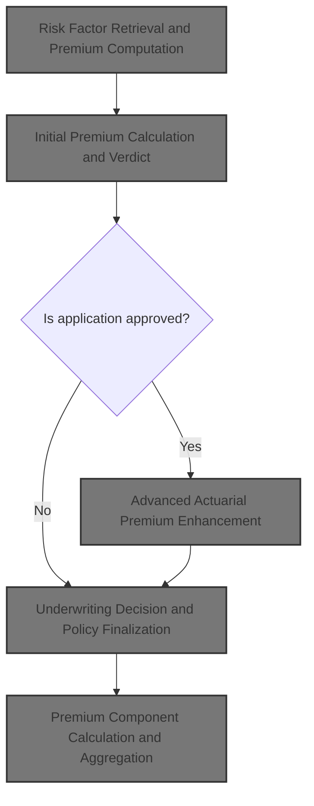
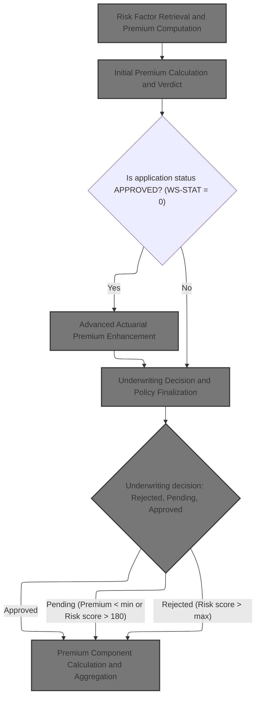
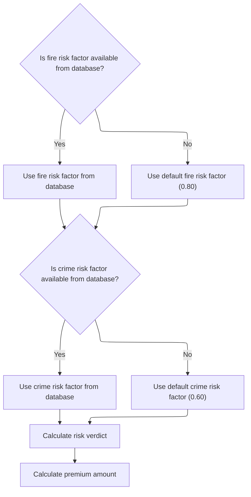
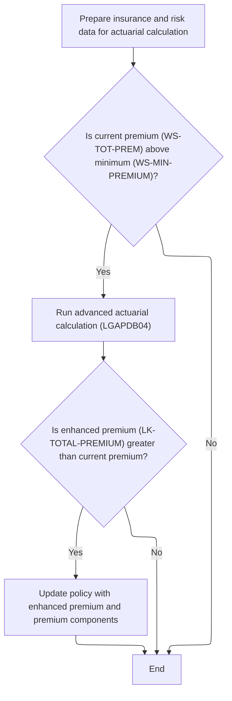
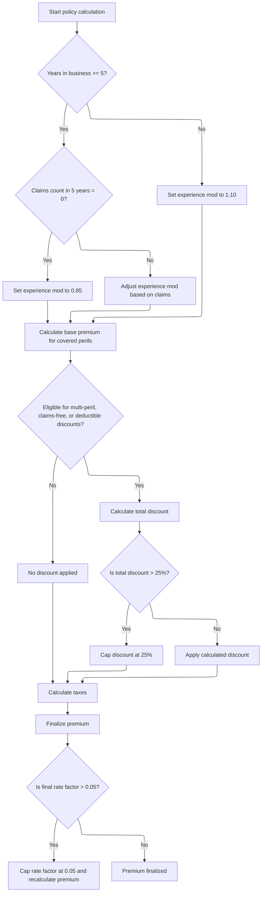
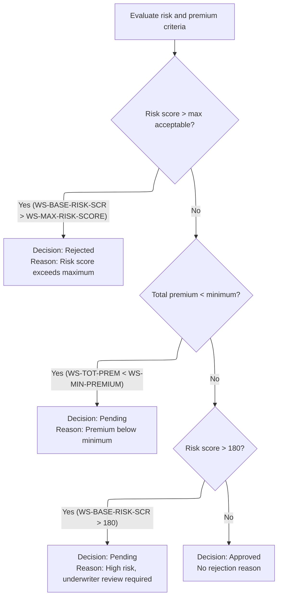

This document outlines the sequence for processing a commercial insurance policy application. The flow receives policy and risk data, calculates premiums, applies underwriting decisions, and aggregates premium components, discounts, and taxes to produce a finalized policy decision.



# Spec

## Detailed View of the Program's Functionality

### 1\. Risk Factor Retrieval and Premium Computation

**Actions Performed:**

- The process begins by retrieving risk factors for fire and crime perils from the database. If the database lookup fails for either peril, default values are used (0.80 for fire, 0.60 for crime).
- These risk factors are essential for subsequent calculations, as they directly influence both the risk verdict and premium amounts.
- After obtaining the risk factors, the code evaluates the risk score to determine the underwriting verdict (approved, pending, or rejected) based on predefined thresholds.
- Premiums for each peril (fire, crime, flood, weather) are then calculated using the risk score, the retrieved or default risk factors, and the peril selections. If all perils are selected, a discount factor is applied to the premium calculations.
- The total premium is computed by summing the individual peril premiums.

**Order of Operations:**

1. Retrieve fire risk factor from the database; use default if not found.
2. Retrieve crime risk factor from the database; use default if not found.
3. Evaluate risk score to set underwriting status and rejection reason.
4. Calculate discount factor based on peril selections.
5. Compute premiums for each peril using risk score, risk factors, peril selections, and discount factor.
6. Sum all peril premiums to get the total premium.

---

### 2\. Initial Premium Calculation and Verdict

**Actions Performed:**

- The initial premium calculation is performed by calling an external program, which receives all relevant risk and peril information.
- This external program computes the premium for each peril and the total premium, and sets the underwriting verdict (approved, pending, rejected) and any rejection reason.
- The results of this calculation are used to determine whether advanced actuarial calculations should be performed in the next step.

**Order of Operations:**

1. Pass risk score and peril selections to the external premium calculation program.
2. Receive calculated premiums, total premium, underwriting status, and rejection reason.
3. Use the underwriting status to decide if advanced actuarial calculations are needed.

---

### 3\. Advanced Actuarial Premium Enhancement

**Actions Performed:**

- If the initial premium is above the minimum threshold and the application is approved, advanced actuarial calculations are performed.
- The code prepares detailed insurance and risk data, including customer, property, coverage, and claims information.
- This data is passed to an advanced actuarial calculation program, which uses more sophisticated logic and additional factors to compute enhanced premiums and premium components.
- If the enhanced premium is greater than the initial premium, the policy is updated with the improved values for each peril and the total premium.

**Order of Operations:**

1. Check if the initial premium exceeds the minimum threshold.
2. Prepare all necessary input and coverage data for actuarial calculations.
3. Call the advanced actuarial calculation program.
4. If the enhanced premium is greater than the initial premium, update the policy with the enhanced values.

---

### 4\. Premium Component Calculation and Aggregation

**Actions Performed:**

- The advanced actuarial calculation program runs through a series of steps to compute the final premium:
  - Initializes calculation areas and loads base rates from the database or defaults.
  - Calculates exposures for building, contents, and business interruption, adjusting for risk score.
  - Sets the experience modifier based on years in business and claims history, applying discounts or penalties as appropriate.
  - Applies schedule modifiers based on building age, protection class, occupancy, and exposure density.
  - Calculates base premiums for each peril, applying experience and schedule modifiers, trend factors, and peril-specific adjustments.
  - Adds catastrophe loadings for hurricane, earthquake, tornado, and flood, based on peril selections.
  - Calculates expense and profit loadings using fixed ratios.
  - Determines total discounts by evaluating multi-peril coverage, claims-free status, and deductible sizes, capping the total discount at 25%.
  - Calculates taxes using a fixed rate applied to the sum of premium components minus discounts.
  - Aggregates all components to finalize the total premium and calculates the rate factor, capping it if necessary.

**Order of Operations:**

 1. Initialize calculation areas and load base rates.
 2. Calculate exposures and exposure density.
 3. Set experience modifier based on business history and claims.
 4. Apply schedule modifiers for building, protection, occupancy, and exposure density.
 5. Calculate base premiums for each peril.
 6. Add catastrophe loadings for applicable perils.
 7. Calculate expense and profit loadings.
 8. Determine and apply total discounts.
 9. Calculate taxes.
10. Aggregate all components to finalize the premium and rate factor, capping if needed.

---

### 5\. Underwriting Decision and Policy Finalization

**Actions Performed:**

- After all premium calculations are complete, business rules are applied to determine the final underwriting decision.
- The decision is based on risk score and premium thresholds:
  - If the risk score exceeds the maximum acceptable value, the policy is rejected.
  - If the total premium is below the minimum, the policy is marked as pending for review.
  - If the risk score is above a secondary threshold, the policy is also marked as pending for underwriter review.
  - Otherwise, the policy is approved.
- The status, description, and rejection reason are set accordingly.

**Order of Operations:**

1. Evaluate if risk score exceeds the maximum; if so, reject the policy.
2. If not rejected, check if total premium is below the minimum; if so, mark as pending.
3. If not pending, check if risk score exceeds the secondary threshold; if so, mark as pending for review.
4. If none of the above, approve the policy.
5. Set status, description, and rejection reason based on the decision.

---

### 6\. Output and Statistics Update

**Actions Performed:**

- The final results for each policy (customer info, risk score, premiums, status, rejection reason) are written to the output file.
- Statistics are updated to track totals for premiums, risk scores, approved, pending, rejected, and high-risk policies.
- At the end of processing, a summary file is generated with aggregate statistics, and key metrics are displayed.

**Order of Operations:**

1. Write the finalized policy record to the output file.
2. Update statistics for total premiums, risk scores, and decision counts.
3. Generate a summary file with aggregate statistics.
4. Display key metrics and statistics for the processing run.

# Rule Definition

| Paragraph Name                                       | Rule ID | Category          | Description                                                                                                                                                         | Conditions                                                                                                                                                                               | Remarks                                                                                                                                                                                                                                                                                 |
| ---------------------------------------------------- | ------- | ----------------- | ------------------------------------------------------------------------------------------------------------------------------------------------------------------- | ---------------------------------------------------------------------------------------------------------------------------------------------------------------------------------------- | --------------------------------------------------------------------------------------------------------------------------------------------------------------------------------------------------------------------------------------------------------------------------------------- |
| P008-VALIDATE-INPUT-RECORD                           | RL-001  | Conditional Logic | Only commercial policies with valid customer numbers and at least one coverage limit are processed. Policies exceeding the maximum total insured value are flagged. | Policy type must be commercial; customer number must not be blank; at least one coverage limit (building, contents, or BI) must be non-zero; total coverage must not exceed maximum TIV. | Maximum total insured value (TIV) is 50,000,000.00. Output fields for rejected records are set to zero, status is 'ERROR', and the first error message is output as rejection reason. Customer number is a string (10 chars), coverage limits are numbers (up to 9 digits, 2 decimals). |
| GET-RISK-FACTORS, LOAD-RATE-TABLES, P310-PERIL-RATES | RL-002  | Data Assignment   | Risk factors and base rates for each peril are retrieved from the database. If retrieval fails or value is missing, hardcoded defaults are used.                    | Database lookup for risk factor or base rate returns no result or error.                                                                                                                 | Default fire risk factor: 0.80; crime risk factor: 0.60; flood factor: 1.20; weather factor: 0.90. Default base rates: fire 0.008500, crime 0.006200, flood 0.012800, weather 0.009600. All rates are numbers with up to 6 decimals.                                                    |
| CALCULATE-PREMIUMS                                   | RL-003  | Computation       | Premiums for fire, crime, flood, and weather perils are calculated using risk score, peril selection, risk factors, and discount factor.                            | Peril selection field for each peril is greater than zero.                                                                                                                               | Formulas:                                                                                                                                                                                                                                                                               |

- Fire Premium = (RiskScore \* FireFactor) \* FirePeril \* DiscountFactor
- Crime Premium = (RiskScore \* CrimeFactor) \* CrimePeril \* DiscountFactor
- Flood Premium = (RiskScore \* FloodFactor) \* FloodPeril \* DiscountFactor
- Weather Premium = (RiskScore \* WeatherFactor) \* WeatherPeril \* DiscountFactor FloodFactor: 1.20, WeatherFactor: 0.90. DiscountFactor: 1.00 or 0.90 if all perils selected. Premiums are numbers (up to 8 digits, 2 decimals). | | CALCULATE-VERDICT, P011D-APPLY-BUSINESS-RULES | RL-004 | Conditional Logic | Underwriting status is determined by risk score and premium thresholds, with specific reject or pending reasons. | Risk score and total premium compared to thresholds. | MaxRiskScore: 250; MinPremium: 500.00. Status values: 0=APPROVED, 1=PENDING, 2=REJECTED. Rejection reasons are strings (up to 50 chars). | | P011C-ENHANCED-ACTUARIAL-CALC, P100-MAIN | RL-005 | Conditional Logic | Advanced actuarial calculation is performed only if the basic calculation results in status APPROVED and total premium exceeds the minimum. | Status is APPROVED (0) and TotalPremium > MinPremium. | MinPremium: 500.00. Advanced calculation updates premium breakdowns and modifiers in output structure. | | P200-INIT | RL-006 | Computation | Exposures for building, contents, and business interruption are calculated using coverage limits and risk score. | Advanced actuarial calculation is triggered. | Formulas:
- BuildingExposure = BuildingLimit \* (1 + (RiskScore - 100) / 1000)
- ContentsExposure = ContentsLimit \* (1 + (RiskScore - 100) / 1000)
- BIExposure = BILimit \* (1 + (RiskScore - 100) / 1000)
- TotalInsuredValue = sum of above. All exposures are numbers (up to 10 digits, 2 decimals). | | P400-EXP-MOD | RL-007 | Computation | Experience modifier is determined by years in business and claims history, with clamping between 0.5 and 2.0. | Advanced actuarial calculation is triggered. | If YearsInBusiness >= 5 and ClaimsCount5Yr = 0: 0.85. If YearsInBusiness >= 5 and ClaimsCount5Yr > 0: 1.00 + ((ClaimsAmount5Yr / TotalInsuredValue) \* CredibilityFactor \* 0.50), clamped between 0.5 and 2.0. If YearsInBusiness < 5: 1.10. CredibilityFactor: 0.75. | | P500-SCHED-MOD | RL-008 | Computation | Schedule modifier is calculated based on building age, protection class, occupancy code, and exposure density, capped between -0.200 and +0.400. | Advanced actuarial calculation is triggered. | Building age: year >= 2010 (-0.05), year < 1970 (+0.20), year >= 1970 (+0.10). Protection class: <= '03' (-0.10), '04'-'06' (-0.05), other (+0.15). Occupancy: Office ('OFF01'-'OFF05') (-0.025), Manufacturing ('MFG01'-'MFG10') (+0.075), Warehouse ('WHS01'-'WHS05') (+0.125). Exposure density > 500 (+0.10), < 50 (-0.05). Modifier capped between -0.200 and +0.400. | | P600-BASE-PREM | RL-009 | Computation | Premiums for each peril are calculated using exposures, base rates, experience and schedule modifiers, and trend factor. | Advanced actuarial calculation is triggered and peril selection > 0. | Formulas:
- Fire: (BuildingExposure + ContentsExposure) \* FireBaseRate \* ExperienceMod \* (1 + ScheduleMod) \* TrendFactor
- Crime: (ContentsExposure \* 0.80) \* CrimeBaseRate \* ExperienceMod \* (1 + ScheduleMod) \* TrendFactor
- Flood: BuildingExposure \* FloodBaseRate \* ExperienceMod \* (1 + ScheduleMod) \* TrendFactor \* 1.25
- Weather: (BuildingExposure + ContentsExposure) \* WeatherBaseRate \* ExperienceMod \* (1 + ScheduleMod) \* TrendFactor TrendFactor: 1.0350. Premiums are numbers (up to 8 digits, 2 decimals). | | P700-CAT-LOAD | RL-010 | Computation | Catastrophe load is calculated for hurricane, earthquake, tornado, and flood perils, and summed. | Advanced actuarial calculation is triggered. | Formulas:
- Hurricane: WeatherPremium \* 0.0125
- Earthquake: BaseAmount \* 0.0080
- Tornado: WeatherPremium \* 0.0045
- Flood: FloodPremium \* 0.0090 CatLoadAmount is sum of all. Factors: Hurricane 0.0125, Earthquake 0.0080, Tornado 0.0045, Flood 0.0090. | | P800-EXPENSE | RL-011 | Computation | Expense load is 35% of base amount plus catastrophe load; profit load is 15% of base plus catastrophe plus expense. | Advanced actuarial calculation is triggered. | Expense ratio: 0.350; profit margin: 0.150. ExpenseLoad = (BaseAmount + CatLoadAmount) \* 0.350. ProfitLoad = (BaseAmount + CatLoadAmount + ExpenseLoad) \* 0.150. | | P900-DISC | RL-012 | Computation | Discounts are calculated for multi-peril, claims-free, and deductible credits, summed and capped at 0.25. | Advanced actuarial calculation is triggered. | Multi-peril: 0.10 if all perils, 0.05 if most perils. Claims-free: 0.075 if claims-free and >= 5 years in business. Deductible credit: FireDeductible >= 10,000 (+0.025), WindDeductible >= 25,000 (+0.035), FloodDeductible >= 50,000 (+0.045). Total discount capped at 0.25. DiscountAmount = (BaseAmount + CatLoadAmount + ExpenseLoadAmount + ProfitLoadAmount) \* TotalDiscount. | | P950-TAXES | RL-013 | Computation | Tax is calculated as 6.75% of the sum of all premium components minus discount. | Advanced actuarial calculation is triggered. | Tax rate: 0.0675. Tax = (BaseAmount + CatLoadAmount + ExpenseLoadAmount + ProfitLoadAmount - DiscountAmount) \* 0.0675. | | P999-FINAL | RL-014 | Computation | Final premium is the sum of all components minus discount plus tax. Rate factor is capped at 0.05 if exceeded, and premium is recalculated. | Advanced actuarial calculation is triggered. | FinalPremium = BaseAmount + CatLoadAmount + ExpenseLoadAmount + ProfitLoadAmount - DiscountAmount + TaxAmount. RateFactor = TotalPremium / TotalInsuredValue; if > 0.05, cap at 0.05 and set premium to TotalInsuredValue \* 0.05. | | P011E-WRITE-OUTPUT-RECORD, LK-OUTPUT-RESULTS structure | RL-015 | Data Assignment | All calculated fields, including premium breakdowns and modifiers, are output according to the output structure. | After all calculations are complete. | Output fields include customer number (string, 10 chars), property type (string, 15 chars), postcode (string, 8 chars), risk score (number, 3 digits), premiums (numbers, up to 8 digits, 2 decimals), status (string, up to 20 chars), rejection reason (string, up to 50 chars), and all advanced premium components and modifiers. |

# User Stories

## User Story 1: Calculate basic premiums and underwriting decision

---

### Story Description:

As an insurance system, I want to retrieve risk factors and base rates, calculate basic peril premiums, and determine the underwriting decision so that each policy receives an accurate premium and status based on risk and business rules.

---

### Business Rule Mapping:

| Rule ID | Paragraph Name                                       | Rule Description                                                                                                                                 |
| ------- | ---------------------------------------------------- | ------------------------------------------------------------------------------------------------------------------------------------------------ |
| RL-002  | GET-RISK-FACTORS, LOAD-RATE-TABLES, P310-PERIL-RATES | Risk factors and base rates for each peril are retrieved from the database. If retrieval fails or value is missing, hardcoded defaults are used. |
| RL-003  | CALCULATE-PREMIUMS                                   | Premiums for fire, crime, flood, and weather perils are calculated using risk score, peril selection, risk factors, and discount factor.         |
| RL-004  | CALCULATE-VERDICT, P011D-APPLY-BUSINESS-RULES        | Underwriting status is determined by risk score and premium thresholds, with specific reject or pending reasons.                                 |

---

### Relevant Functionality:

- **GET-RISK-FACTORS**
  1. **RL-002:**
     - Attempt to retrieve risk factor/base rate from database for each peril.
     - If SQLCODE is not zero or value is missing, assign default value for that peril.
     - Use assigned factor/rate in subsequent premium calculations.
- **CALCULATE-PREMIUMS**
  1. **RL-003:**
     - Set DiscountFactor to 1.00.
     - If all peril selections > 0, set DiscountFactor to 0.90.
     - For each peril, if selected, compute premium using formula.
     - Sum all peril premiums for total premium.
- **CALCULATE-VERDICT**
  1. **RL-004:**
     - If RiskScore > MaxRiskScore, set status to REJECTED and reason to 'Risk score exceeds maximum acceptable level'.
     - Else if TotalPremium < MinPremium, set status to PENDING and reason to 'Premium below minimum - requires review'.
     - Else if RiskScore > 180, set status to PENDING and reason to 'High risk, underwriter review required'.
     - Else if RiskScore > 200, set status to REJECTED and reason to 'Risk score exceeds maximum acceptable level'.
     - Else, set status to APPROVED and reason blank.

## User Story 2: Perform advanced actuarial calculations for approved policies

---

### Story Description:

As an insurance system, I want to perform advanced actuarial calculations—including exposures, experience and schedule modifiers, advanced peril premiums, catastrophe and expense loads, discounts, taxes, and final premium calculation—so that approved policies with sufficient premium receive a detailed and accurate premium breakdown.

---

### Business Rule Mapping:

| Rule ID | Paragraph Name                           | Rule Description                                                                                                                                 |
| ------- | ---------------------------------------- | ------------------------------------------------------------------------------------------------------------------------------------------------ |
| RL-005  | P011C-ENHANCED-ACTUARIAL-CALC, P100-MAIN | Advanced actuarial calculation is performed only if the basic calculation results in status APPROVED and total premium exceeds the minimum.      |
| RL-007  | P400-EXP-MOD                             | Experience modifier is determined by years in business and claims history, with clamping between 0.5 and 2.0.                                    |
| RL-009  | P600-BASE-PREM                           | Premiums for each peril are calculated using exposures, base rates, experience and schedule modifiers, and trend factor.                         |
| RL-012  | P900-DISC                                | Discounts are calculated for multi-peril, claims-free, and deductible credits, summed and capped at 0.25.                                        |
| RL-013  | P950-TAXES                               | Tax is calculated as 6.75% of the sum of all premium components minus discount.                                                                  |
| RL-014  | P999-FINAL                               | Final premium is the sum of all components minus discount plus tax. Rate factor is capped at 0.05 if exceeded, and premium is recalculated.      |
| RL-006  | P200-INIT                                | Exposures for building, contents, and business interruption are calculated using coverage limits and risk score.                                 |
| RL-008  | P500-SCHED-MOD                           | Schedule modifier is calculated based on building age, protection class, occupancy code, and exposure density, capped between -0.200 and +0.400. |
| RL-010  | P700-CAT-LOAD                            | Catastrophe load is calculated for hurricane, earthquake, tornado, and flood perils, and summed.                                                 |
| RL-011  | P800-EXPENSE                             | Expense load is 35% of base amount plus catastrophe load; profit load is 15% of base plus catastrophe plus expense.                              |

---

### Relevant Functionality:

- **P011C-ENHANCED-ACTUARIAL-CALC**
  1. **RL-005:**
     - If status is APPROVED and TotalPremium > MinPremium, call advanced actuarial calculation program.
     - Pass all required input and coverage data.
     - Update output fields with results from advanced calculation if total premium increases.
- **P400-EXP-MOD**
  1. **RL-007:**
     - If YearsInBusiness >= 5 and ClaimsCount5Yr = 0, set ExperienceMod to 0.85.
     - Else if YearsInBusiness >= 5 and ClaimsCount5Yr > 0, compute ExperienceMod using formula and clamp between 0.5 and 2.0.
     - Else, set ExperienceMod to 1.10.
- **P600-BASE-PREM**
  1. **RL-009:**
     - For each peril, if selected, compute premium using advanced formula.
     - Add each peril premium to base amount.
- **P900-DISC**
  1. **RL-012:**
     - Calculate multi-peril, claims-free, and deductible discounts.
     - Sum all discounts.
     - Cap total discount at 0.25.
     - Compute discount amount as percentage of sum of premium components.
- **P950-TAXES**
  1. **RL-013:**
     - Compute tax as 6.75% of (sum of premium components minus discount).
- **P999-FINAL**
  1. **RL-014:**
     - Compute final premium as sum of all components minus discount plus tax.
     - Compute rate factor as TotalPremium / TotalInsuredValue.
     - If rate factor > 0.05, cap at 0.05 and set premium to TotalInsuredValue \* 0.05.
- **P200-INIT**
  1. **RL-006:**
     - For each coverage limit, compute exposure using formula.
     - Sum exposures for total insured value.
     - Compute exposure density as TotalInsuredValue / SquareFootage.
- **P500-SCHED-MOD**
  1. **RL-008:**
     - Adjust schedule modifier based on building year, protection class, occupancy code, and exposure density.
     - Sum all adjustments.
     - Cap modifier between -0.200 and +0.400.
- **P700-CAT-LOAD**
  1. **RL-010:**
     - If weather peril selected, add hurricane and tornado loads.
     - Always add earthquake load.
     - If flood peril selected, add flood load.
     - Sum all catastrophe loads.
- **P800-EXPENSE**
  1. **RL-011:**
     - Compute expense load as 35% of (base amount + catastrophe load).
     - Compute profit load as 15% of (base amount + catastrophe load + expense load).

## User Story 3: Validate input and output results for commercial policy processing

---

### Story Description:

As an insurance system, I want to validate commercial policy input records for required fields and eligibility, and output all calculated fields and errors according to the required structure, so that only valid policies are processed and results are clearly communicated to downstream systems and users.

---

### Business Rule Mapping:

| Rule ID | Paragraph Name                                         | Rule Description                                                                                                                                                    |
| ------- | ------------------------------------------------------ | ------------------------------------------------------------------------------------------------------------------------------------------------------------------- |
| RL-001  | P008-VALIDATE-INPUT-RECORD                             | Only commercial policies with valid customer numbers and at least one coverage limit are processed. Policies exceeding the maximum total insured value are flagged. |
| RL-015  | P011E-WRITE-OUTPUT-RECORD, LK-OUTPUT-RESULTS structure | All calculated fields, including premium breakdowns and modifiers, are output according to the output structure.                                                    |

---

### Relevant Functionality:

- **P008-VALIDATE-INPUT-RECORD**
  1. **RL-001:**
     - If policy type is not commercial, log error and set output status to 'ERROR'.
     - If customer number is blank, log error and set output status to 'ERROR'.
     - If all coverage limits are zero, log error and set output status to 'ERROR'.
     - If total coverage exceeds max TIV, log warning but continue.
     - For error records, set all premium outputs to zero and write error message.
- **P011E-WRITE-OUTPUT-RECORD**
  1. **RL-015:**
     - Move all calculated values to output fields as per output structure.
     - Write output record to file.

# Code Walkthrough

## Commercial Policy Processing Sequence



<SwmSnippet path="/base/src/LGAPDB01.cbl" line="258">

---

P011-PROCESS-COMMERCIAL kicks off the commercial policy flow: it calculates the risk score, then calls P011B-BASIC-PREMIUM-CALC to get the initial premium and decision. This step is needed before any enhanced actuarial calculation, since we only run the advanced logic if the basic premium is high enough. The flow then applies business rules, writes the output, and updates stats.

```cobol
       P011-PROCESS-COMMERCIAL.
           PERFORM P011A-CALCULATE-RISK-SCORE
           PERFORM P011B-BASIC-PREMIUM-CALC
           IF WS-STAT = 0
               PERFORM P011C-ENHANCED-ACTUARIAL-CALC
           END-IF
           PERFORM P011D-APPLY-BUSINESS-RULES
           PERFORM P011E-WRITE-OUTPUT-RECORD
           PERFORM P011F-UPDATE-STATISTICS.
```

---

</SwmSnippet>

### Initial Premium Calculation and Verdict

<SwmSnippet path="/base/src/LGAPDB01.cbl" line="275">

---

P011B-BASIC-PREMIUM-CALC calls LGAPDB03, passing all the risk and peril info. This external program crunches the numbers, figures out the premium, and sets the underwriting verdict, which is needed for the next steps in the flow.

```cobol
       P011B-BASIC-PREMIUM-CALC.
           CALL 'LGAPDB03' USING WS-BASE-RISK-SCR, IN-FIRE-PERIL, 
                                IN-CRIME-PERIL, IN-FLOOD-PERIL, 
                                IN-WEATHER-PERIL, WS-STAT,
                                WS-STAT-DESC, WS-REJ-RSN, WS-FR-PREM,
                                WS-CR-PREM, WS-FL-PREM, WS-WE-PREM,
                                WS-TOT-PREM, WS-DISC-FACT.
```

---

</SwmSnippet>

### Risk Factor Retrieval and Premium Computation



<SwmSnippet path="/base/src/LGAPDB03.cbl" line="42">

---

MAIN-LOGIC runs the risk factor retrieval, then calculates the verdict and premiums. The risk factors are needed up front because they feed into both the decision and premium calculations. If the database doesn't have values, the code falls back to defaults, which can change the outcome.

```cobol
       MAIN-LOGIC.
           PERFORM GET-RISK-FACTORS
           PERFORM CALCULATE-VERDICT
           PERFORM CALCULATE-PREMIUMS
           GOBACK.
```

---

</SwmSnippet>

<SwmSnippet path="/base/src/LGAPDB03.cbl" line="48">

---

GET-RISK-FACTORS pulls risk factors for FIRE and CRIME from the database. If the lookup fails, it uses hardcoded defaults (0.80 for FIRE, 0.60 for CRIME), so missing data doesn't break the flow but does change the premium outcome.

```cobol
       GET-RISK-FACTORS.
           EXEC SQL
               SELECT FACTOR_VALUE INTO :WS-FIRE-FACTOR
               FROM RISK_FACTORS
               WHERE PERIL_TYPE = 'FIRE'
           END-EXEC.
           
           IF SQLCODE = 0
               CONTINUE
           ELSE
               MOVE 0.80 TO WS-FIRE-FACTOR
           END-IF.
           
           EXEC SQL
               SELECT FACTOR_VALUE INTO :WS-CRIME-FACTOR
               FROM RISK_FACTORS
               WHERE PERIL_TYPE = 'CRIME'
           END-EXEC.
           
           IF SQLCODE = 0
               CONTINUE
           ELSE
               MOVE 0.60 TO WS-CRIME-FACTOR
           END-IF.
```

---

</SwmSnippet>

### Advanced Actuarial Premium Enhancement



<SwmSnippet path="/base/src/LGAPDB01.cbl" line="283">

---

P011C-ENHANCED-ACTUARIAL-CALC sets up all the input and coverage data, then calls LGAPDB04 for advanced actuarial calculations if the initial premium is high enough. If the new premium is better, it updates the policy with the improved values.

```cobol
       P011C-ENHANCED-ACTUARIAL-CALC.
      *    Prepare input structure for actuarial calculation
           MOVE IN-CUSTOMER-NUM TO LK-CUSTOMER-NUM
           MOVE WS-BASE-RISK-SCR TO LK-RISK-SCORE
           MOVE IN-PROPERTY-TYPE TO LK-PROPERTY-TYPE
           MOVE IN-TERRITORY-CODE TO LK-TERRITORY
           MOVE IN-CONSTRUCTION-TYPE TO LK-CONSTRUCTION-TYPE
           MOVE IN-OCCUPANCY-CODE TO LK-OCCUPANCY-CODE
           MOVE IN-SPRINKLER-IND TO LK-PROTECTION-CLASS
           MOVE IN-YEAR-BUILT TO LK-YEAR-BUILT
           MOVE IN-SQUARE-FOOTAGE TO LK-SQUARE-FOOTAGE
           MOVE IN-YEARS-IN-BUSINESS TO LK-YEARS-IN-BUSINESS
           MOVE IN-CLAIMS-COUNT-3YR TO LK-CLAIMS-COUNT-5YR
           MOVE IN-CLAIMS-AMOUNT-3YR TO LK-CLAIMS-AMOUNT-5YR
           
      *    Set coverage data
           MOVE IN-BUILDING-LIMIT TO LK-BUILDING-LIMIT
           MOVE IN-CONTENTS-LIMIT TO LK-CONTENTS-LIMIT
           MOVE IN-BI-LIMIT TO LK-BI-LIMIT
           MOVE IN-FIRE-DEDUCTIBLE TO LK-FIRE-DEDUCTIBLE
           MOVE IN-WIND-DEDUCTIBLE TO LK-WIND-DEDUCTIBLE
           MOVE IN-FLOOD-DEDUCTIBLE TO LK-FLOOD-DEDUCTIBLE
           MOVE IN-OTHER-DEDUCTIBLE TO LK-OTHER-DEDUCTIBLE
           MOVE IN-FIRE-PERIL TO LK-FIRE-PERIL
           MOVE IN-CRIME-PERIL TO LK-CRIME-PERIL
           MOVE IN-FLOOD-PERIL TO LK-FLOOD-PERIL
           MOVE IN-WEATHER-PERIL TO LK-WEATHER-PERIL
           
      *    Call advanced actuarial calculation program (only for approved cases)
           IF WS-TOT-PREM > WS-MIN-PREMIUM
               CALL 'LGAPDB04' USING LK-INPUT-DATA, LK-COVERAGE-DATA, 
                                    LK-OUTPUT-RESULTS
               
      *        Update with enhanced calculations if successful
               IF LK-TOTAL-PREMIUM > WS-TOT-PREM
                   MOVE LK-FIRE-PREMIUM TO WS-FR-PREM
                   MOVE LK-CRIME-PREMIUM TO WS-CR-PREM
                   MOVE LK-FLOOD-PREMIUM TO WS-FL-PREM
                   MOVE LK-WEATHER-PREMIUM TO WS-WE-PREM
                   MOVE LK-TOTAL-PREMIUM TO WS-TOT-PREM
                   MOVE LK-EXPERIENCE-MOD TO WS-EXPERIENCE-MOD
               END-IF
           END-IF.
```

---

</SwmSnippet>

### Premium Component Calculation and Aggregation



<SwmSnippet path="/base/src/LGAPDB04.cbl" line="138">

---

P100-MAIN runs through all the premium calculation steps: exposure, rates, experience and schedule mods, base premium, catastrophe loading, expense and profit loads, discounts, taxes, and finally totals everything up. Each step builds on the previous to get the final premium.

```cobol
       P100-MAIN.
           PERFORM P200-INIT
           PERFORM P300-RATES
           PERFORM P350-EXPOSURE
           PERFORM P400-EXP-MOD
           PERFORM P500-SCHED-MOD
           PERFORM P600-BASE-PREM
           PERFORM P700-CAT-LOAD
           PERFORM P800-EXPENSE
           PERFORM P900-DISC
           PERFORM P950-TAXES
           PERFORM P999-FINAL
           GOBACK.
```

---

</SwmSnippet>

<SwmSnippet path="/base/src/LGAPDB04.cbl" line="234">

---

P400-EXP-MOD sets the experience modifier based on years in business and claims history. No claims in 5 years means a discount; otherwise, it calculates the modifier from claims amount and insured value, clamped between 0.5 and 2.0. Less than 5 years in business gets a flat penalty.

```cobol
       P400-EXP-MOD.
           MOVE 1.0000 TO WS-EXPERIENCE-MOD
           
           IF LK-YEARS-IN-BUSINESS >= 5
               IF LK-CLAIMS-COUNT-5YR = ZERO
                   MOVE 0.8500 TO WS-EXPERIENCE-MOD
               ELSE
                   COMPUTE WS-EXPERIENCE-MOD = 
                       1.0000 + 
                       ((LK-CLAIMS-AMOUNT-5YR / WS-TOTAL-INSURED-VAL) * 
                        WS-CREDIBILITY-FACTOR * 0.50)
                   
                   IF WS-EXPERIENCE-MOD > 2.0000
                       MOVE 2.0000 TO WS-EXPERIENCE-MOD
                   END-IF
                   
                   IF WS-EXPERIENCE-MOD < 0.5000
                       MOVE 0.5000 TO WS-EXPERIENCE-MOD
                   END-IF
               END-IF
           ELSE
               MOVE 1.1000 TO WS-EXPERIENCE-MOD
           END-IF
           
           MOVE WS-EXPERIENCE-MOD TO LK-EXPERIENCE-MOD.
```

---

</SwmSnippet>

<SwmSnippet path="/base/src/LGAPDB04.cbl" line="318">

---

P600-BASE-PREM calculates premiums for each peril using exposures, base rates (multi-dimensional), experience and schedule modifiers, and trend factors. Crime and flood get extra adjustments (0.80 and 1.25). Only applicable perils are included, and everything is summed for the base premium.

```cobol
       P600-BASE-PREM.
           MOVE ZERO TO LK-BASE-AMOUNT
           
      * FIRE PREMIUM
           IF LK-FIRE-PERIL > ZERO
               COMPUTE LK-FIRE-PREMIUM = 
                   (WS-BUILDING-EXPOSURE + WS-CONTENTS-EXPOSURE) *
                   WS-BASE-RATE (1, 1, 1, 1) * 
                   WS-EXPERIENCE-MOD *
                   (1 + WS-SCHEDULE-MOD) *
                   WS-TREND-FACTOR
                   
               ADD LK-FIRE-PREMIUM TO LK-BASE-AMOUNT
           END-IF
           
      * CRIME PREMIUM
           IF LK-CRIME-PERIL > ZERO
               COMPUTE LK-CRIME-PREMIUM = 
                   (WS-CONTENTS-EXPOSURE * 0.80) *
                   WS-BASE-RATE (2, 1, 1, 1) * 
                   WS-EXPERIENCE-MOD *
                   (1 + WS-SCHEDULE-MOD) *
                   WS-TREND-FACTOR
                   
               ADD LK-CRIME-PREMIUM TO LK-BASE-AMOUNT
           END-IF
           
      * FLOOD PREMIUM
           IF LK-FLOOD-PERIL > ZERO
               COMPUTE LK-FLOOD-PREMIUM = 
                   WS-BUILDING-EXPOSURE *
                   WS-BASE-RATE (3, 1, 1, 1) * 
                   WS-EXPERIENCE-MOD *
                   (1 + WS-SCHEDULE-MOD) *
                   WS-TREND-FACTOR * 1.25
                   
               ADD LK-FLOOD-PREMIUM TO LK-BASE-AMOUNT
           END-IF
           
      * WEATHER PREMIUM
           IF LK-WEATHER-PERIL > ZERO
               COMPUTE LK-WEATHER-PREMIUM = 
                   (WS-BUILDING-EXPOSURE + WS-CONTENTS-EXPOSURE) *
                   WS-BASE-RATE (4, 1, 1, 1) * 
                   WS-EXPERIENCE-MOD *
                   (1 + WS-SCHEDULE-MOD) *
                   WS-TREND-FACTOR
                   
               ADD LK-WEATHER-PREMIUM TO LK-BASE-AMOUNT
           END-IF.
```

---

</SwmSnippet>

<SwmSnippet path="/base/src/LGAPDB04.cbl" line="407">

---

P900-DISC figures out the total discount by checking which perils are covered, claims history, and deductible sizes. It adds up multi-peril, claims-free, and deductible credits, caps the total at 25%, and applies it to the premium components to get the discount amount.

```cobol
       P900-DISC.
           MOVE ZERO TO WS-TOTAL-DISCOUNT
           
      * Multi-peril discount
           MOVE ZERO TO WS-MULTI-PERIL-DISC
           IF LK-FIRE-PERIL > ZERO AND
              LK-CRIME-PERIL > ZERO AND
              LK-FLOOD-PERIL > ZERO AND
              LK-WEATHER-PERIL > ZERO
               MOVE 0.100 TO WS-MULTI-PERIL-DISC
           ELSE
               IF LK-FIRE-PERIL > ZERO AND
                  LK-WEATHER-PERIL > ZERO AND
                  (LK-CRIME-PERIL > ZERO OR LK-FLOOD-PERIL > ZERO)
                   MOVE 0.050 TO WS-MULTI-PERIL-DISC
               END-IF
           END-IF
           
      * Claims-free discount  
           MOVE ZERO TO WS-CLAIMS-FREE-DISC
           IF LK-CLAIMS-COUNT-5YR = ZERO AND LK-YEARS-IN-BUSINESS >= 5
               MOVE 0.075 TO WS-CLAIMS-FREE-DISC
           END-IF
           
      * Deductible credit
           MOVE ZERO TO WS-DEDUCTIBLE-CREDIT
           IF LK-FIRE-DEDUCTIBLE >= 10000
               ADD 0.025 TO WS-DEDUCTIBLE-CREDIT
           END-IF
           IF LK-WIND-DEDUCTIBLE >= 25000  
               ADD 0.035 TO WS-DEDUCTIBLE-CREDIT
           END-IF
           IF LK-FLOOD-DEDUCTIBLE >= 50000
               ADD 0.045 TO WS-DEDUCTIBLE-CREDIT
           END-IF
           
           COMPUTE WS-TOTAL-DISCOUNT = 
               WS-MULTI-PERIL-DISC + WS-CLAIMS-FREE-DISC + 
               WS-DEDUCTIBLE-CREDIT
               
           IF WS-TOTAL-DISCOUNT > 0.250
               MOVE 0.250 TO WS-TOTAL-DISCOUNT
           END-IF
           
           COMPUTE LK-DISCOUNT-AMT = 
               (LK-BASE-AMOUNT + LK-CAT-LOAD-AMT + 
                LK-EXPENSE-LOAD-AMT + LK-PROFIT-LOAD-AMT) *
               WS-TOTAL-DISCOUNT.
```

---

</SwmSnippet>

<SwmSnippet path="/base/src/LGAPDB04.cbl" line="456">

---

P950-TAXES calculates the tax by applying a fixed rate (0.0675) to the sum of premium components minus discounts. The rate is hardcoded, so any changes need code updates.

```cobol
       P950-TAXES.
           COMPUTE WS-TAX-AMOUNT = 
               (LK-BASE-AMOUNT + LK-CAT-LOAD-AMT + 
                LK-EXPENSE-LOAD-AMT + LK-PROFIT-LOAD-AMT - 
                LK-DISCOUNT-AMT) * 0.0675
                
           MOVE WS-TAX-AMOUNT TO LK-TAX-AMT.
```

---

</SwmSnippet>

<SwmSnippet path="/base/src/LGAPDB04.cbl" line="464">

---

P999-FINAL sums up all premium components, subtracts discounts, adds tax, then calculates the rate factor as total premium over insured value. If the rate factor is too high, it gets capped and the premium is recalculated to match.

```cobol
       P999-FINAL.
           COMPUTE LK-TOTAL-PREMIUM = 
               LK-BASE-AMOUNT + LK-CAT-LOAD-AMT + 
               LK-EXPENSE-LOAD-AMT + LK-PROFIT-LOAD-AMT -
               LK-DISCOUNT-AMT + LK-TAX-AMT
               
           COMPUTE LK-FINAL-RATE-FACTOR = 
               LK-TOTAL-PREMIUM / WS-TOTAL-INSURED-VAL
               
           IF LK-FINAL-RATE-FACTOR > 0.050000
               MOVE 0.050000 TO LK-FINAL-RATE-FACTOR
               COMPUTE LK-TOTAL-PREMIUM = 
                   WS-TOTAL-INSURED-VAL * LK-FINAL-RATE-FACTOR
           END-IF.
```

---

</SwmSnippet>

### Underwriting Decision and Policy Finalization



<SwmSnippet path="/base/src/LGAPDB01.cbl" line="327">

---

P011D-APPLY-BUSINESS-RULES sets the underwriting decision using risk score and premium thresholds. It uses domain-specific status codes and descriptions, with clear rules for rejection, pending, or approval.

```cobol
       P011D-APPLY-BUSINESS-RULES.
      *    Determine underwriting decision based on enhanced criteria
           EVALUATE TRUE
               WHEN WS-BASE-RISK-SCR > WS-MAX-RISK-SCORE
                   MOVE 2 TO WS-STAT
                   MOVE 'REJECTED' TO WS-STAT-DESC
                   MOVE 'Risk score exceeds maximum acceptable level' 
                        TO WS-REJ-RSN
               WHEN WS-TOT-PREM < WS-MIN-PREMIUM
                   MOVE 1 TO WS-STAT
                   MOVE 'PENDING' TO WS-STAT-DESC
                   MOVE 'Premium below minimum - requires review'
                        TO WS-REJ-RSN
               WHEN WS-BASE-RISK-SCR > 180
                   MOVE 1 TO WS-STAT
                   MOVE 'PENDING' TO WS-STAT-DESC
                   MOVE 'High risk - underwriter review required'
                        TO WS-REJ-RSN
               WHEN OTHER
                   MOVE 0 TO WS-STAT
                   MOVE 'APPROVED' TO WS-STAT-DESC
                   MOVE SPACES TO WS-REJ-RSN
           END-EVALUATE.
```

---

</SwmSnippet>

&nbsp;

*This is an auto-generated document by Swimm 🌊 and has not yet been verified by a human*

<SwmMeta version="3.0.0" repo-id="Z2l0aHViJTNBJTNBY2ljcy1nZW5hcHAtZGVtbyUzQSUzQXN3aW1taW8=" repo-name="cics-genapp-demo"><sup>Powered by [Swimm](https://app.swimm.io/)</sup></SwmMeta>
