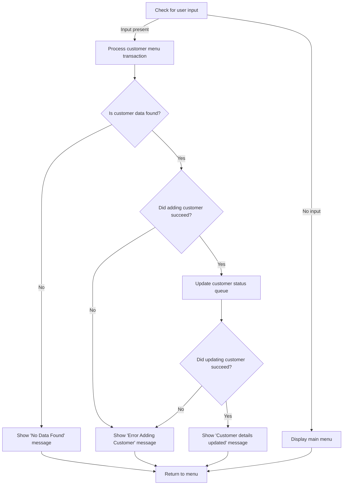
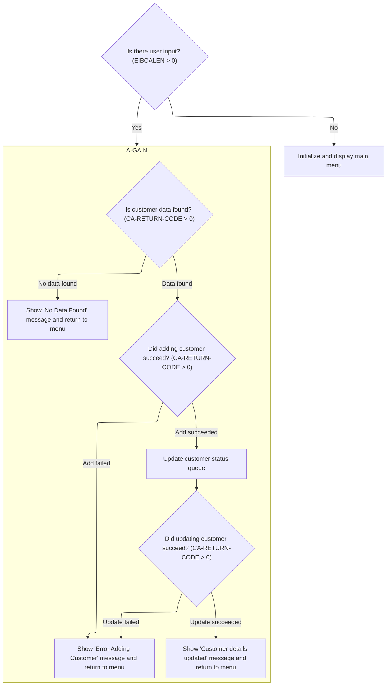
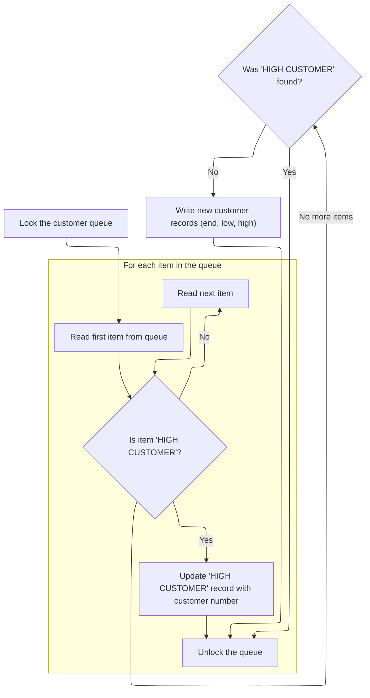

# Program Overview

This document describes the flow for managing customer transactions using the <SwmToken path="base/src/lgtestc1.cbl" pos="11:6:6" line-data="       PROGRAM-ID. LGTESTC1.">`LGTESTC1`</SwmToken> program. Users interact with a menu-driven interface to search, add, or update customer records. The system processes these actions, updates the customer status queue for tracking, and provides feedback through confirmation or error messages. For example, when a user adds a new customer, the program updates the queue and displays a success or error message depending on the result.

Main steps:

- Check for user input and route to customer menu or display main menu
- Handle customer menu transactions: search, add, update
- Display confirmation or error messages
- Update customer status queue
- Return user to main menu



## Dependencies

### Programs

- <SwmToken path="base/src/lgtestc1.cbl" pos="89:10:10" line-data="                 EXEC CICS LINK PROGRAM(&#39;LGICUS01&#39;)">`LGICUS01`</SwmToken> (<SwmPath>[base/src/lgicus01.cbl](base/src/lgicus01.cbl)</SwmPath>)
- LGICDB01 (<SwmPath>[base/src/lgicdb01.cbl](base/src/lgicdb01.cbl)</SwmPath>)
- LGSTSQ (<SwmPath>[base/src/lgstsq.cbl](base/src/lgstsq.cbl)</SwmPath>)
- <SwmToken path="base/src/lgtestc1.cbl" pos="128:10:10" line-data="                 EXEC CICS LINK PROGRAM(&#39;LGACUS01&#39;)">`LGACUS01`</SwmToken> (<SwmPath>[base/src/lgacus01.cbl](base/src/lgacus01.cbl)</SwmPath>)
- LGACDB01 (<SwmPath>[base/src/lgacdb01.cbl](base/src/lgacdb01.cbl)</SwmPath>)
- LGACVS01 (<SwmPath>[base/src/lgacvs01.cbl](base/src/lgacvs01.cbl)</SwmPath>)
- LGACDB02 (<SwmPath>[base/src/lgacdb02.cbl](base/src/lgacdb02.cbl)</SwmPath>)
- <SwmToken path="base/src/lgtestc1.cbl" pos="190:10:10" line-data="                 EXEC CICS LINK PROGRAM(&#39;LGUCUS01&#39;)">`LGUCUS01`</SwmToken> (<SwmPath>[base/src/lgucus01.cbl](base/src/lgucus01.cbl)</SwmPath>)
- LGUCDB01 (<SwmPath>[base/src/lgucdb01.cbl](base/src/lgucdb01.cbl)</SwmPath>)
- LGUCVS01 (<SwmPath>[base/src/lgucvs01.cbl](base/src/lgucvs01.cbl)</SwmPath>)

### Copybooks

- SQLCA
- LGCMAREA (<SwmPath>[base/src/lgcmarea.cpy](base/src/lgcmarea.cpy)</SwmPath>)
- LGPOLICY (<SwmPath>[base/src/lgpolicy.cpy](base/src/lgpolicy.cpy)</SwmPath>)
- SSMAP

# Program Workflow

# Initial Request Handling



## Customer Menu Processing

```mermaid
%%{init: {"flowchart": {"defaultRenderer": "elk"}} }%%
flowchart TD
    node1{"Is customer data found? (CA-RETURN-CODE > 0)"}
    click node1 openCode "base/src/lgtestc1.cbl:94:96"
    node1 -->|"No data found"| node2["Show 'No Data Found' message and return to menu"]
    click node2 openCode "base/src/lgtestc1.cbl:267:270"
    node1 -->|"Data found"| node4{"Did adding customer succeed? (CA-RETURN-CODE > 0)"}
    click node4 openCode "base/src/lgtestc1.cbl:132:135"
    node4 -->|"Add failed"| node3["Show 'Error Adding Customer' message and return to menu"]
    click node3 openCode "base/src/lgtestc1.cbl:271:274"
    node4 -->|"Add succeeded"| node5["Update customer status queue"]
    click node5 openCode "base/src/lgtestc1.cbl:283:285"
    node5 --> node6{"Did updating customer succeed? (CA-RETURN-CODE > 0)"}
    click node6 openCode "base/src/lgtestc1.cbl:195:197"
    node6 -->|"Update failed"| node3
    node6 -->|"Update succeeded"| node6a["Show 'Customer details updated' message and return to menu"]
    click node6a openCode "base/src/lgtestc1.cbl:199:207"


subgraph node2 [NO-DATA]
  sgmain_1_node1{"Is data available for request?"}
  click sgmain_1_node1 openCode "base/src/lgtestc1.cbl:267:269"
  sgmain_1_node1 -->|"No"| sgmain_1_node2["Inform user: 'No data was returned.'"]
  click sgmain_1_node2 openCode "base/src/lgtestc1.cbl:268:268"
  sgmain_1_node2 --> sgmain_1_node3["Go to error handling"]
  click sgmain_1_node3 openCode "base/src/lgtestc1.cbl:269:269"
end

subgraph node3 [ERROR-OUT]
  sgmain_2_node1["Show error screen to user"]
  click sgmain_2_node1 openCode "base/src/lgtestc1.cbl:271:275"
  sgmain_2_node1 --> sgmain_2_node2["Reset input and output fields"]
  click sgmain_2_node2 openCode "base/src/lgtestc1.cbl:277:279"
  sgmain_2_node2 --> sgmain_2_node3["Continue to next application step"]
  click sgmain_2_node3 openCode "base/src/lgtestc1.cbl:281:281"
end

%% Swimm:
%% %%{init: {"flowchart": {"defaultRenderer": "elk"}} }%%
%% flowchart TD
%%     node1{"Is customer data found? (<SwmToken path="base/src/lgtestc1.cbl" pos="94:3:7" line-data="                 IF CA-RETURN-CODE &gt; 0">`CA-RETURN-CODE`</SwmToken> > 0)"}
%%     click node1 openCode "<SwmPath>[base/src/lgtestc1.cbl](base/src/lgtestc1.cbl)</SwmPath>:94:96"
%%     node1 -->|"No data found"| node2["Show 'No Data Found' message and return to menu"]
%%     click node2 openCode "<SwmPath>[base/src/lgtestc1.cbl](base/src/lgtestc1.cbl)</SwmPath>:267:270"
%%     node1 -->|"Data found"| node4{"Did adding customer succeed? (<SwmToken path="base/src/lgtestc1.cbl" pos="94:3:7" line-data="                 IF CA-RETURN-CODE &gt; 0">`CA-RETURN-CODE`</SwmToken> > 0)"}
%%     click node4 openCode "<SwmPath>[base/src/lgtestc1.cbl](base/src/lgtestc1.cbl)</SwmPath>:132:135"
%%     node4 -->|"Add failed"| node3["Show 'Error Adding Customer' message and return to menu"]
%%     click node3 openCode "<SwmPath>[base/src/lgtestc1.cbl](base/src/lgtestc1.cbl)</SwmPath>:271:274"
%%     node4 -->|"Add succeeded"| node5["Update customer status queue"]
%%     click node5 openCode "<SwmPath>[base/src/lgtestc1.cbl](base/src/lgtestc1.cbl)</SwmPath>:283:285"
%%     node5 --> node6{"Did updating customer succeed? (<SwmToken path="base/src/lgtestc1.cbl" pos="94:3:7" line-data="                 IF CA-RETURN-CODE &gt; 0">`CA-RETURN-CODE`</SwmToken> > 0)"}
%%     click node6 openCode "<SwmPath>[base/src/lgtestc1.cbl](base/src/lgtestc1.cbl)</SwmPath>:195:197"
%%     node6 -->|"Update failed"| node3
%%     node6 -->|"Update succeeded"| node6a["Show 'Customer details updated' message and return to menu"]
%%     click node6a openCode "<SwmPath>[base/src/lgtestc1.cbl](base/src/lgtestc1.cbl)</SwmPath>:199:207"
%% 
%% 
%% subgraph node2 [<SwmToken path="base/src/lgtestc1.cbl" pos="95:5:7" line-data="                   GO TO NO-DATA">`NO-DATA`</SwmToken>]
%%   sgmain_1_node1{"Is data available for request?"}
%%   click sgmain_1_node1 openCode "<SwmPath>[base/src/lgtestc1.cbl](base/src/lgtestc1.cbl)</SwmPath>:267:269"
%%   sgmain_1_node1 -->|"No"| sgmain_1_node2["Inform user: 'No data was returned.'"]
%%   click sgmain_1_node2 openCode "<SwmPath>[base/src/lgtestc1.cbl](base/src/lgtestc1.cbl)</SwmPath>:268:268"
%%   sgmain_1_node2 --> sgmain_1_node3["Go to error handling"]
%%   click sgmain_1_node3 openCode "<SwmPath>[base/src/lgtestc1.cbl](base/src/lgtestc1.cbl)</SwmPath>:269:269"
%% end
%% 
%% subgraph node3 [<SwmToken path="base/src/lgtestc1.cbl" pos="261:5:7" line-data="           Go To ERROR-OUT.">`ERROR-OUT`</SwmToken>]
%%   sgmain_2_node1["Show error screen to user"]
%%   click sgmain_2_node1 openCode "<SwmPath>[base/src/lgtestc1.cbl](base/src/lgtestc1.cbl)</SwmPath>:271:275"
%%   sgmain_2_node1 --> sgmain_2_node2["Reset input and output fields"]
%%   click sgmain_2_node2 openCode "<SwmPath>[base/src/lgtestc1.cbl](base/src/lgtestc1.cbl)</SwmPath>:277:279"
%%   sgmain_2_node2 --> sgmain_2_node3["Continue to next application step"]
%%   click sgmain_2_node3 openCode "<SwmPath>[base/src/lgtestc1.cbl](base/src/lgtestc1.cbl)</SwmPath>:281:281"
%% end
```



<SwmSnippet path="/base/src/lgtestc1.cbl" line="94">

---

In <SwmToken path="base/src/lgtestc1.cbl" pos="56:5:7" line-data="              GO TO A-GAIN.">`A-GAIN`</SwmToken>, we check if <SwmToken path="base/src/lgtestc1.cbl" pos="94:3:7" line-data="                 IF CA-RETURN-CODE &gt; 0">`CA-RETURN-CODE`</SwmToken> is positive right at the start. If it is, we call <SwmToken path="base/src/lgtestc1.cbl" pos="95:5:7" line-data="                   GO TO NO-DATA">`NO-DATA`</SwmToken> to handle the case where no customer data was found, which means the user gets an error message and is sent back to the menu.

```cobol
                 IF CA-RETURN-CODE > 0
                   GO TO NO-DATA
                 END-IF
```

---

</SwmSnippet>

### No Data Error Handling

<SwmSnippet path="/base/src/lgtestc1.cbl" line="267">

---

<SwmToken path="base/src/lgtestc1.cbl" pos="267:1:3" line-data="       NO-DATA.">`NO-DATA`</SwmToken> sets the error message for the user and immediately calls <SwmToken path="base/src/lgtestc1.cbl" pos="269:5:7" line-data="           Go To ERROR-OUT.">`ERROR-OUT`</SwmToken> to display it and reset the UI, so the user sees what went wrong and gets sent back to the menu.

```cobol
       NO-DATA.
           Move 'No data was returned.'            To  ERRFLDO.
           Go To ERROR-OUT.
```

---

</SwmSnippet>

### Error Screen Display

<SwmSnippet path="/base/src/lgtestc1.cbl" line="271">

---

In <SwmToken path="base/src/lgtestc1.cbl" pos="271:1:3" line-data="       ERROR-OUT.">`ERROR-OUT`</SwmToken>, we use EXEC CICS SEND MAP to show the error screen (<SwmToken path="base/src/lgtestc1.cbl" pos="272:11:11" line-data="           EXEC CICS SEND MAP (&#39;SSMAPC1&#39;)">`SSMAPC1`</SwmToken> from SSMAP) to the user, making sure the error message is displayed in the expected format.

```cobol
       ERROR-OUT.
           EXEC CICS SEND MAP ('SSMAPC1')
                     FROM(SSMAPC1O)
                     MAPSET ('SSMAP')
           END-EXEC.
```

---

</SwmSnippet>

<SwmSnippet path="/base/src/lgtestc1.cbl" line="277">

---

After showing the error screen, we reset the map and communication area buffers, then jump to <SwmToken path="base/src/lgtestc1.cbl" pos="281:5:7" line-data="           GO TO ENDIT-STARTIT.">`ENDIT-STARTIT`</SwmToken> to send the user back to the main menu with everything ready for the next action.

```cobol
           Initialize SSMAPC1I.
           Initialize SSMAPC1O.
           Initialize COMM-AREA.

           GO TO ENDIT-STARTIT.
```

---

</SwmSnippet>

### Add Customer Error Handling

<SwmSnippet path="/base/src/lgtestc1.cbl" line="132">

---

Back in <SwmToken path="base/src/lgtestc1.cbl" pos="56:5:7" line-data="              GO TO A-GAIN.">`A-GAIN`</SwmToken> after <SwmToken path="base/src/lgtestc1.cbl" pos="95:5:7" line-data="                   GO TO NO-DATA">`NO-DATA`</SwmToken>, if adding a customer fails, we rollback the transaction and call <SwmToken path="base/src/lgtestc1.cbl" pos="134:5:7" line-data="                   GO TO NO-ADD">`NO-ADD`</SwmToken> to show the error and reset the state.

```cobol
                 IF CA-RETURN-CODE > 0
                   Exec CICS Syncpoint Rollback End-Exec
                   GO TO NO-ADD
                 END-IF
```

---

</SwmSnippet>

<SwmSnippet path="/base/src/lgtestc1.cbl" line="263">

---

<SwmToken path="base/src/lgtestc1.cbl" pos="263:1:3" line-data="       NO-ADD.">`NO-ADD`</SwmToken> sets up the error message for add failures and jumps to <SwmToken path="base/src/lgtestc1.cbl" pos="265:5:7" line-data="           Go To ERROR-OUT.">`ERROR-OUT`</SwmToken> to show it and reset the UI.

```cobol
       NO-ADD.
           Move 'Error Adding Customer'            To  ERRFLDO.
           Go To ERROR-OUT.
```

---

</SwmSnippet>

<SwmSnippet path="/base/src/lgtestc1.cbl" line="137">

---

After <SwmToken path="base/src/lgtestc1.cbl" pos="134:5:7" line-data="                   GO TO NO-ADD">`NO-ADD`</SwmToken> in <SwmToken path="base/src/lgtestc1.cbl" pos="56:5:7" line-data="              GO TO A-GAIN.">`A-GAIN`</SwmToken>, we update the customer status queue with <SwmToken path="base/src/lgtestc1.cbl" pos="137:3:5" line-data="                 Perform WRITE-GENACNTL">`WRITE-GENACNTL`</SwmToken>.

```cobol
                 Perform WRITE-GENACNTL
```

---

</SwmSnippet>

### Customer Status Queue Update



<SwmSnippet path="/base/src/lgtestc1.cbl" line="283">

---

In <SwmToken path="base/src/lgtestc1.cbl" pos="283:1:3" line-data="       WRITE-GENACNTL.">`WRITE-GENACNTL`</SwmToken>, we start by locking the queue resource to make sure only one transaction updates the queue at a time. This prevents data corruption when handling customer status messages.

```cobol
       WRITE-GENACNTL.

           EXEC CICS ENQ Resource(STSQ-NAME)
                         Length(Length Of STSQ-NAME)
           END-EXEC.
```

---

</SwmSnippet>

<SwmSnippet path="/base/src/lgtestc1.cbl" line="288">

---

We prep the flag and counter, then read the first queue message to kick off the message handling logic.

```cobol
           Move 'Y' To WS-FLAG-TSQH
           Move 1   To WS-Item-Count
           Exec CICS ReadQ TS Queue(STSQ-NAME)
                     Into(READ-MSG)
                     Resp(WS-RESP)
                     Item(1)
           End-Exec.
```

---

</SwmSnippet>

<SwmSnippet path="/base/src/lgtestc1.cbl" line="295">

---

After reading the first message, we loop through the queue, looking for any message starting with 'HIGH CUSTOMER'. If we find one, we update it with the current customer number and rewrite it in place.

```cobol
           If WS-RESP = DFHRESP(NORMAL)
              Perform With Test after Until WS-RESP > 0
                 Exec CICS ReadQ TS Queue(STSQ-NAME)
                     Into(READ-MSG)
                     Resp(WS-RESP)
                     Next
                 End-Exec
```

---

</SwmSnippet>

<SwmSnippet path="/base/src/lgtestc1.cbl" line="302">

---

We update the queue message and exit the loop once we've handled the 'HIGH CUSTOMER' case.

```cobol
                 Add 1 To WS-Item-Count
                 If WS-RESP = DFHRESP(NORMAL) And
                      Read-Msg-Msg(1:13) = 'HIGH CUSTOMER'
                      Move CA-Customer-Num To Write-Msg-High
                      Move Space to WS-FLAG-TSQH
                      Exec CICS WriteQ TS Queue(STSQ-NAME)
                          From(Write-Msg-H)
                          Length(F24)
                          Resp(WS-RESP)
                          ReWrite
                          Item(WS-Item-Count)
                      End-Exec
                      MOVE 99 To WS-RESP
                 End-If
```

---

</SwmSnippet>

<SwmSnippet path="/base/src/lgtestc1.cbl" line="316">

---

If we didn't find a 'HIGH CUSTOMER' message, we write new status messages to the queue for the customer, making sure the queue reflects the latest state.

```cobol
              End-Perform
           End-If.
      *
      *
           If WS-FLAG-TSQH = 'Y'
             EXEC CICS WRITEQ TS QUEUE(STSQ-NAME)
                       FROM(WRITE-MSG-E)
                       RESP(WS-RESP)
                       NOSUSPEND
                       LENGTH(20)
             END-EXEC
```

---

</SwmSnippet>

<SwmSnippet path="/base/src/lgtestc1.cbl" line="327">

---

We move the customer number into different message buffers and write each one to the queue, so we can track the customer under multiple status categories.

```cobol
             Move CA-Customer-Num To Write-Msg-Low
             Move CA-Customer-Num To Write-Msg-High
             EXEC CICS WRITEQ TS QUEUE(STSQ-NAME)
                       FROM(WRITE-MSG-L)
                       RESP(WS-RESP)
                       NOSUSPEND
                       LENGTH(23)
             END-EXEC
             EXEC CICS WRITEQ TS QUEUE(STSQ-NAME)
                       FROM(WRITE-MSG-H)
                       RESP(WS-RESP)
                       NOSUSPEND
                       LENGTH(24)
             END-EXEC
```

---

</SwmSnippet>

<SwmSnippet path="/base/src/lgtestc1.cbl" line="341">

---

After all queue updates, we release the resource lock so other transactions can access the queue, then exit the function.

```cobol
           End-If.

           EXEC CICS DEQ Resource(STSQ-NAME)
                         Length(Length Of STSQ-NAME)
           END-EXEC.

           EXIT.
```

---

</SwmSnippet>

<SwmSnippet path="/base/src/lgtestc1.cbl" line="343">

---

After all queue updates, we release the resource lock so other transactions can access the queue, then exit the function.

```cobol
           EXEC CICS DEQ Resource(STSQ-NAME)
                         Length(Length Of STSQ-NAME)
           END-EXEC.

           EXIT.
```

---

</SwmSnippet>

<SwmSnippet path="/base/src/lgtestc1.cbl" line="320">

---

If no status update happened, we write an error message to the queue so the customer status is always tracked, even if something went wrong.

```cobol
           If WS-FLAG-TSQH = 'Y'
             EXEC CICS WRITEQ TS QUEUE(STSQ-NAME)
                       FROM(WRITE-MSG-E)
                       RESP(WS-RESP)
                       NOSUSPEND
                       LENGTH(20)
             END-EXEC
```

---

</SwmSnippet>

<SwmSnippet path="/base/src/lgtestc1.cbl" line="327">

---

We write several status messages for the customer to the queue, so all relevant categories are covered for reporting and tracking.

```cobol
             Move CA-Customer-Num To Write-Msg-Low
             Move CA-Customer-Num To Write-Msg-High
             EXEC CICS WRITEQ TS QUEUE(STSQ-NAME)
                       FROM(WRITE-MSG-L)
                       RESP(WS-RESP)
                       NOSUSPEND
                       LENGTH(23)
             END-EXEC
             EXEC CICS WRITEQ TS QUEUE(STSQ-NAME)
                       FROM(WRITE-MSG-H)
                       RESP(WS-RESP)
                       NOSUSPEND
                       LENGTH(24)
             END-EXEC
```

---

</SwmSnippet>

<SwmSnippet path="/base/src/lgtestc1.cbl" line="341">

---

After all queue updates, we release the resource lock so other transactions can access the queue, then exit the function.

```cobol
           End-If.

           EXEC CICS DEQ Resource(STSQ-NAME)
                         Length(Length Of STSQ-NAME)
           END-EXEC.

           EXIT.
```

---

</SwmSnippet>

<SwmSnippet path="/base/src/lgtestc1.cbl" line="343">

---

After all queue updates, we release the resource lock so other transactions can access the queue, then exit the function.

```cobol
           EXEC CICS DEQ Resource(STSQ-NAME)
                         Length(Length Of STSQ-NAME)
           END-EXEC.

           EXIT.
```

---

</SwmSnippet>

### Customer Update Error Handling

<SwmSnippet path="/base/src/lgtestc1.cbl" line="195">

---

After updating the status queue in <SwmToken path="base/src/lgtestc1.cbl" pos="56:5:7" line-data="              GO TO A-GAIN.">`A-GAIN`</SwmToken>, we check for update errors and jump to <SwmToken path="base/src/lgtestc1.cbl" pos="196:5:7" line-data="                   GO TO NO-UPD">`NO-UPD`</SwmToken> if something went wrong, so the user gets an error and the UI resets.

```cobol
                 IF CA-RETURN-CODE > 0
                   GO TO NO-UPD
                 END-IF
```

---

</SwmSnippet>

<SwmSnippet path="/base/src/lgtestc1.cbl" line="259">

---

<SwmToken path="base/src/lgtestc1.cbl" pos="259:1:3" line-data="       NO-UPD.">`NO-UPD`</SwmToken> sets up the error message for update failures and jumps to <SwmToken path="base/src/lgtestc1.cbl" pos="261:5:7" line-data="           Go To ERROR-OUT.">`ERROR-OUT`</SwmToken> to show it and reset the UI.

```cobol
       NO-UPD.
           Move 'Error Updating Customer'          To  ERRFLDO.
           Go To ERROR-OUT.
```

---

</SwmSnippet>

<SwmSnippet path="/base/src/lgtestc1.cbl" line="199">

---

After handling update errors in <SwmToken path="base/src/lgtestc1.cbl" pos="56:5:7" line-data="              GO TO A-GAIN.">`A-GAIN`</SwmToken>, if the update was successful, we set up the confirmation message, send the updated screen to the user, and jump to the main menu.

```cobol
                 Move CA-CUSTOMER-NUM To ENT1CNOI
                 Move ' '             To ENT1OPTI
                 Move 'Customer details updated'
                   To  ERRFLDO
                 EXEC CICS SEND MAP ('SSMAPC1')
                           FROM(SSMAPC1O)
                           MAPSET ('SSMAP')
                 END-EXEC
                 GO TO ENDIT-STARTIT
```

---

</SwmSnippet>

<SwmSnippet path="/base/src/lgtestc1.cbl" line="209">

---

If the user's input doesn't match any expected case, we prompt for a valid option and reset the screen with the cursor ready for new input, then return to the main menu.

```cobol
             WHEN OTHER

                 Move 'Please enter a valid option'
                   To  ERRFLDO
                 Move -1 To ENT1OPTL

                 EXEC CICS SEND MAP ('SSMAPC1')
                           FROM(SSMAPC1O)
                           MAPSET ('SSMAP')
                           CURSOR
                 END-EXEC
                 GO TO ENDIT-STARTIT

           END-EVALUATE.


      *    Send message to terminal and return

           EXEC CICS RETURN
           END-EXEC.
```

---

</SwmSnippet>

## Main Transaction Entry

<SwmSnippet path="/base/src/lgtestc1.cbl" line="53">

---

MAINLINE checks for input and routes to customer menu if data is present.

```cobol
       MAINLINE SECTION.

           IF EIBCALEN > 0
              GO TO A-GAIN.
```

---

</SwmSnippet>

<SwmSnippet path="/base/src/lgtestc1.cbl" line="58">

---

If there's no input data, we reset all buffers and send the main menu screen to the user, clearing any previous content.

```cobol
           Initialize SSMAPC1I.
           Initialize SSMAPC1O.
           Initialize COMM-AREA.
           MOVE '0000000000'   To ENT1CNOO

      * Display Main Menu
           EXEC CICS SEND MAP ('SSMAPC1')
                     FROM(SSMAPC1O)
                     MAPSET ('SSMAP')
                     ERASE
                     END-EXEC.
```

---

</SwmSnippet>

&nbsp;

*This is an auto-generated document by Swimm 🌊 and has not yet been verified by a human*

<SwmMeta version="3.0.0" repo-id="Z2l0aHViJTNBJTNBY2ljcy1nZW5hcHAtZGVtbyUzQSUzQXN3aW1taW8=" repo-name="cics-genapp-demo"><sup>Powered by [Swimm](https://app.swimm.io/)</sup></SwmMeta>
