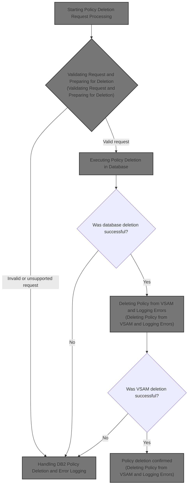
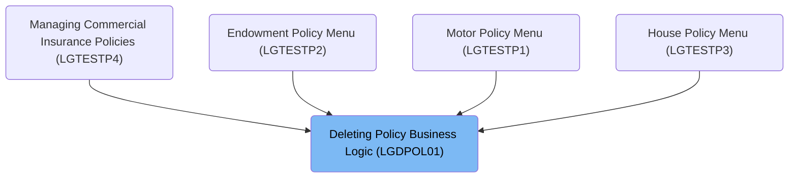
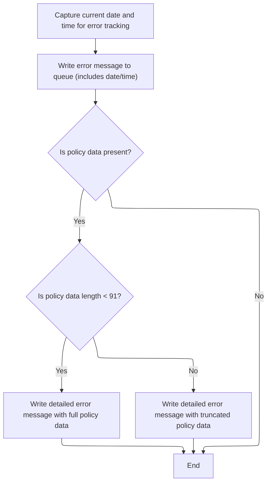
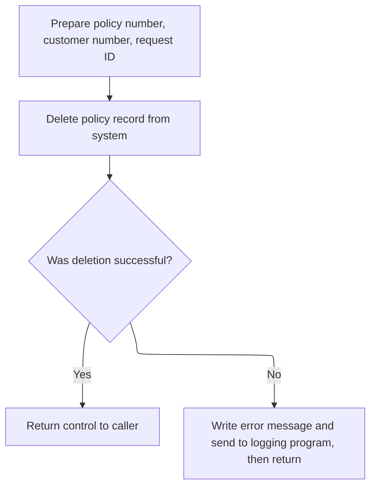

# Overview

This document explains the flow of deleting insurance policies. The process validates incoming deletion requests, ensures only supported and sufficiently detailed requests are processed, and coordinates the removal of policy data from both the database and VSAM file. Comprehensive error logging is performed at each stage.



## Dependencies

### Programs

- <SwmToken path="base/src/lgdpol01.cbl" pos="11:6:6" line-data="       PROGRAM-ID. LGDPOL01.">`LGDPOL01`</SwmToken> (<SwmPath>[base/src/lgdpol01.cbl](base/src/lgdpol01.cbl)</SwmPath>)
- <SwmToken path="base/src/lgdpol01.cbl" pos="141:9:9" line-data="           EXEC CICS LINK PROGRAM(LGDPDB01)">`LGDPDB01`</SwmToken> (<SwmPath>[base/src/lgdpdb01.cbl](base/src/lgdpdb01.cbl)</SwmPath>)
- <SwmToken path="base/src/lgdpdb01.cbl" pos="168:9:9" line-data="               EXEC CICS LINK PROGRAM(LGDPVS01)">`LGDPVS01`</SwmToken> (<SwmPath>[base/src/lgdpvs01.cbl](base/src/lgdpvs01.cbl)</SwmPath>)
- LGSTSQ (<SwmPath>[base/src/lgstsq.cbl](base/src/lgstsq.cbl)</SwmPath>)

### Copybooks

- LGCMAREA (<SwmPath>[base/src/lgcmarea.cpy](base/src/lgcmarea.cpy)</SwmPath>)
- SQLCA

# Where is this program used?

This program is used multiple times in the codebase as represented in the following diagram:



## Detailed View of the Program's Functionality

a. Starting Policy Deletion Request Processing

The main entry point for deleting a policy begins by preparing the context for the transaction. It initializes internal variables that track transaction ID, terminal ID, and task number for debugging and tracing purposes. Immediately after setup, the code checks if a communication area (commarea) has been provided with the request. The commarea is essential because it contains the details of the policy deletion request.

- If the commarea is missing, the program constructs an error message indicating this problem, logs the error for traceability, and then forcibly ends the transaction with a specific abend code. This ensures that requests without the necessary data are not processed further and that the failure is recorded for later analysis.

b. Capturing and Formatting Error Details

When an error is detected (such as a missing commarea), the program enters an error logging routine. This routine performs several actions to ensure that the error is well-documented:

- It retrieves the current date and time from the system and formats them for inclusion in the error log.
- The error message is then written to both a transient data queue (TDQ) and a temporary storage queue (TSQ) by calling a dedicated logging program. This dual logging ensures that errors are available for both real-time monitoring and later review.
- If the commarea is present, up to 90 bytes of its content are also logged, providing a snapshot of the input data that caused the error. This is especially useful for troubleshooting.

The logging program (LGSTSQ) handles message routing. If the message starts with a special prefix indicating a specific queue, it adjusts the queue name accordingly. The message is then written to both the system queue and the application-specific queue. If the message was received (rather than linked), a minimal response is sent back to the terminal.

c. Validating Request and Preparing for Deletion

After error handling, the main program sets a default return code indicating success and prepares pointers to the commarea. It then checks if the commarea is large enough to contain the required header information. If not, it sets a specific return code indicating the request is too small and returns immediately.

Next, the program normalizes the request type by converting it to uppercase. It then checks if the request type matches one of the supported policy deletion types (endowment, motor, house, or commercial). If the request type is not recognized, a return code indicating an unsupported request is set, and the program returns. If the request type is valid, the program proceeds to delete the policy information by invoking a dedicated routine.

d. Executing Policy Deletion in Database

The actual deletion of the policy from the database is handled by a separate program. The main program links to this database handler, passing along the commarea so that all necessary request details are available. This separation keeps the database logic isolated from the main business logic.

e. Handling <SwmToken path="base/src/lgdpol01.cbl" pos="126:7:7" line-data="               PERFORM DELETE-POLICY-DB2-INFO">`DB2`</SwmToken> Policy Deletion and Error Logging

The database handler program (<SwmToken path="base/src/lgdpol01.cbl" pos="141:9:9" line-data="           EXEC CICS LINK PROGRAM(LGDPDB01)">`LGDPDB01`</SwmToken>) starts by initializing its own context and variables, including those needed for <SwmToken path="base/src/lgdpol01.cbl" pos="126:7:7" line-data="               PERFORM DELETE-POLICY-DB2-INFO">`DB2`</SwmToken> operations. It checks for the presence and size of the commarea, and if either check fails, it logs an error and returns with an appropriate error code.

If the commarea is valid, the program converts the customer and policy numbers from the commarea into the integer format required by <SwmToken path="base/src/lgdpol01.cbl" pos="126:7:7" line-data="               PERFORM DELETE-POLICY-DB2-INFO">`DB2`</SwmToken>. It also saves these values in the error message structure in case an error needs to be logged later.

The program then checks if the request type is supported. If not, it sets an error code and returns. If the request type is valid, it attempts to delete the policy record from the <SwmToken path="base/src/lgdpol01.cbl" pos="126:7:7" line-data="               PERFORM DELETE-POLICY-DB2-INFO">`DB2`</SwmToken> database. After the deletion, it links to another program responsible for further cleanup (such as deleting from VSAM).

If the <SwmToken path="base/src/lgdpol01.cbl" pos="126:7:7" line-data="               PERFORM DELETE-POLICY-DB2-INFO">`DB2`</SwmToken> deletion fails (i.e., the SQL return code is not 0 or 100), the program logs the error with all relevant details (including SQLCODE, date, time, and IDs) and returns with an error code.

f. Deleting Policy from VSAM and Logging Errors

The cleanup program (<SwmToken path="base/src/lgdpdb01.cbl" pos="168:9:9" line-data="               EXEC CICS LINK PROGRAM(LGDPVS01)">`LGDPVS01`</SwmToken>) is responsible for deleting the policy record from a VSAM file. It prepares the necessary keys from the commarea and attempts the deletion. If the deletion is unsuccessful, it logs the error with all relevant details, including response codes and IDs, and returns with a specific error code. As with previous error logging routines, up to 90 bytes of the commarea are also logged for troubleshooting.

If the deletion is successful, control is simply returned to the caller.

g. Summary of Error Logging Mechanism

Throughout the entire flow, error logging is handled in a consistent and detailed manner:

- Each error log includes a timestamp, program name, relevant IDs, and error codes.
- Error messages are written to both system and application-specific queues.
- A snapshot of the commarea is included in the logs to aid in troubleshooting.
- The logging program is flexible, allowing for dynamic queue naming based on message content.

This robust error handling and logging infrastructure ensures that any issues encountered during policy deletion are thoroughly documented, making it easier for developers and support staff to diagnose and resolve problems.

# Rule Definition

| Paragraph Name                                                                                                                                                                                                                                                                                                                                                                                                                                                                                                                                                          | Rule ID | Category          | Description                                                                                                                                                                                                                                                                                                                                                                                                                                                                                                                                                                                                                                                                                                                                 | Conditions                                                                                                                                                                                                              | Remarks                                                                                                                                                                                                                                                                                                                                                                                                                                                                                                                                                                                                                                                                                                                                                                                                                                                                                                                                 |
| ----------------------------------------------------------------------------------------------------------------------------------------------------------------------------------------------------------------------------------------------------------------------------------------------------------------------------------------------------------------------------------------------------------------------------------------------------------------------------------------------------------------------------------------------------------------------- | ------- | ----------------- | ------------------------------------------------------------------------------------------------------------------------------------------------------------------------------------------------------------------------------------------------------------------------------------------------------------------------------------------------------------------------------------------------------------------------------------------------------------------------------------------------------------------------------------------------------------------------------------------------------------------------------------------------------------------------------------------------------------------------------------------- | ----------------------------------------------------------------------------------------------------------------------------------------------------------------------------------------------------------------------- | --------------------------------------------------------------------------------------------------------------------------------------------------------------------------------------------------------------------------------------------------------------------------------------------------------------------------------------------------------------------------------------------------------------------------------------------------------------------------------------------------------------------------------------------------------------------------------------------------------------------------------------------------------------------------------------------------------------------------------------------------------------------------------------------------------------------------------------------------------------------------------------------------------------------------------------- |
| MAINLINE SECTION (<SwmToken path="base/src/lgdpol01.cbl" pos="11:6:6" line-data="       PROGRAM-ID. LGDPOL01.">`LGDPOL01`</SwmToken>, <SwmToken path="base/src/lgdpol01.cbl" pos="141:9:9" line-data="           EXEC CICS LINK PROGRAM(LGDPDB01)">`LGDPDB01`</SwmToken>), MAINLINE SECTION (LGSTSQ), MAINLINE SECTION (<SwmToken path="base/src/lgdpdb01.cbl" pos="168:9:9" line-data="               EXEC CICS LINK PROGRAM(LGDPVS01)">`LGDPVS01`</SwmToken>)                                                                                                         | RL-001  | Conditional Logic | The program must check if the commarea is present and has a length of at least 28 bytes before proceeding with any processing.                                                                                                                                                                                                                                                                                                                                                                                                                                                                                                                                                                                                              | Commarea is missing (length is zero) or commarea length is less than 28 bytes.                                                                                                                                          | <SwmToken path="base/src/lgdpol01.cbl" pos="102:9:13" line-data="           MOVE &#39;00&#39; TO CA-RETURN-CODE">`CA-RETURN-CODE`</SwmToken> is set to '98' if the commarea is too short. The minimum length required is 28 bytes. The commarea includes at least <SwmToken path="base/src/lgdpol01.cbl" pos="117:9:13" line-data="           MOVE FUNCTION UPPER-CASE(CA-REQUEST-ID) TO CA-REQUEST-ID">`CA-REQUEST-ID`</SwmToken> (6 bytes), <SwmToken path="base/src/lgdpdb01.cbl" pos="149:3:7" line-data="           MOVE CA-CUSTOMER-NUM TO DB2-CUSTOMERNUM-INT">`CA-CUSTOMER-NUM`</SwmToken> (10 bytes), <SwmToken path="base/src/lgdpdb01.cbl" pos="150:3:7" line-data="           MOVE CA-POLICY-NUM   TO DB2-POLICYNUM-INT">`CA-POLICY-NUM`</SwmToken> (10 bytes), and <SwmToken path="base/src/lgdpol01.cbl" pos="102:9:13" line-data="           MOVE &#39;00&#39; TO CA-RETURN-CODE">`CA-RETURN-CODE`</SwmToken> (2 bytes). |
| MAINLINE SECTION (<SwmToken path="base/src/lgdpol01.cbl" pos="11:6:6" line-data="       PROGRAM-ID. LGDPOL01.">`LGDPOL01`</SwmToken>, <SwmToken path="base/src/lgdpol01.cbl" pos="141:9:9" line-data="           EXEC CICS LINK PROGRAM(LGDPDB01)">`LGDPDB01`</SwmToken>)                                                                                                                                                                                                                                                                                               | RL-002  | Conditional Logic | The program must normalize the request type to uppercase and verify it matches one of the supported types: <SwmToken path="base/src/lgdpol01.cbl" pos="119:18:18" line-data="           IF ( CA-REQUEST-ID NOT EQUAL TO &#39;01DEND&#39; AND">`01DEND`</SwmToken>, <SwmToken path="base/src/lgdpol01.cbl" pos="120:14:14" line-data="                CA-REQUEST-ID NOT EQUAL TO &#39;01DMOT&#39; AND">`01DMOT`</SwmToken>, <SwmToken path="base/src/lgdpol01.cbl" pos="121:14:14" line-data="                CA-REQUEST-ID NOT EQUAL TO &#39;01DHOU&#39; AND">`01DHOU`</SwmToken>, or <SwmToken path="base/src/lgdpol01.cbl" pos="122:14:14" line-data="                CA-REQUEST-ID NOT EQUAL TO &#39;01DCOM&#39; )">`01DCOM`</SwmToken>. | <SwmToken path="base/src/lgdpol01.cbl" pos="117:9:13" line-data="           MOVE FUNCTION UPPER-CASE(CA-REQUEST-ID) TO CA-REQUEST-ID">`CA-REQUEST-ID`</SwmToken> is not one of the supported types after normalization. | <SwmToken path="base/src/lgdpol01.cbl" pos="102:9:13" line-data="           MOVE &#39;00&#39; TO CA-RETURN-CODE">`CA-RETURN-CODE`</SwmToken> is set to '99' for unsupported request types. Supported types are <SwmToken path="base/src/lgdpol01.cbl" pos="119:18:18" line-data="           IF ( CA-REQUEST-ID NOT EQUAL TO &#39;01DEND&#39; AND">`01DEND`</SwmToken>, <SwmToken path="base/src/lgdpol01.cbl" pos="120:14:14" line-data="                CA-REQUEST-ID NOT EQUAL TO &#39;01DMOT&#39; AND">`01DMOT`</SwmToken>, <SwmToken path="base/src/lgdpol01.cbl" pos="121:14:14" line-data="                CA-REQUEST-ID NOT EQUAL TO &#39;01DHOU&#39; AND">`01DHOU`</SwmToken>, <SwmToken path="base/src/lgdpol01.cbl" pos="122:14:14" line-data="                CA-REQUEST-ID NOT EQUAL TO &#39;01DCOM&#39; )">`01DCOM`</SwmToken>.                                                                                            |
| <SwmToken path="base/src/lgdpol01.cbl" pos="126:3:9" line-data="               PERFORM DELETE-POLICY-DB2-INFO">`DELETE-POLICY-DB2-INFO`</SwmToken> (<SwmToken path="base/src/lgdpol01.cbl" pos="141:9:9" line-data="           EXEC CICS LINK PROGRAM(LGDPDB01)">`LGDPDB01`</SwmToken>), MAINLINE SECTION (<SwmToken path="base/src/lgdpol01.cbl" pos="11:6:6" line-data="       PROGRAM-ID. LGDPOL01.">`LGDPOL01`</SwmToken>)                                                                                                                                          | RL-003  | Computation       | If the request type is valid, the program attempts to delete the policy record from the Db2 POLICY table using the customer and policy numbers as keys. If the deletion fails with a SQLCODE other than 0 or 100, an error is logged and a specific return code is set.                                                                                                                                                                                                                                                                                                                                                                                                                                                                     | Request type is valid; Db2 deletion fails with SQLCODE not equal to 0 or 100.                                                                                                                                           | <SwmToken path="base/src/lgdpol01.cbl" pos="102:9:13" line-data="           MOVE &#39;00&#39; TO CA-RETURN-CODE">`CA-RETURN-CODE`</SwmToken> is set to '90' for Db2 errors. Error message includes date, time, program name, customer number, policy number, and SQLCODE. SQLCODE 0 and 100 are considered successful (record deleted or not found).                                                                                                                                                                                                                                                                                                                                                                                                                                                                                                                                                                                    |
| MAINLINE SECTION (<SwmToken path="base/src/lgdpol01.cbl" pos="141:9:9" line-data="           EXEC CICS LINK PROGRAM(LGDPDB01)">`LGDPDB01`</SwmToken>), MAINLINE SECTION (<SwmToken path="base/src/lgdpdb01.cbl" pos="168:9:9" line-data="               EXEC CICS LINK PROGRAM(LGDPVS01)">`LGDPVS01`</SwmToken>)                                                                                                                                                                                                                                                        | RL-004  | Computation       | After successful Db2 deletion, the program attempts to delete the corresponding record from the VSAM file using the same keys. If the VSAM deletion fails, an error is logged and a specific return code is set.                                                                                                                                                                                                                                                                                                                                                                                                                                                                                                                            | Db2 deletion was successful; VSAM deletion fails (non-normal response).                                                                                                                                                 | <SwmToken path="base/src/lgdpol01.cbl" pos="102:9:13" line-data="           MOVE &#39;00&#39; TO CA-RETURN-CODE">`CA-RETURN-CODE`</SwmToken> is set to '81' for VSAM errors. Error message includes date, time, program name, customer number, policy number, and VSAM response codes.                                                                                                                                                                                                                                                                                                                                                                                                                                                                                                                                                                                                                                                  |
| <SwmToken path="base/src/lgdpol01.cbl" pos="97:3:7" line-data="               PERFORM WRITE-ERROR-MESSAGE">`WRITE-ERROR-MESSAGE`</SwmToken> (<SwmToken path="base/src/lgdpol01.cbl" pos="11:6:6" line-data="       PROGRAM-ID. LGDPOL01.">`LGDPOL01`</SwmToken>, <SwmToken path="base/src/lgdpol01.cbl" pos="141:9:9" line-data="           EXEC CICS LINK PROGRAM(LGDPDB01)">`LGDPDB01`</SwmToken>, <SwmToken path="base/src/lgdpdb01.cbl" pos="168:9:9" line-data="               EXEC CICS LINK PROGRAM(LGDPVS01)">`LGDPVS01`</SwmToken>), MAINLINE SECTION (LGSTSQ) | RL-005  | Data Assignment   | All error messages must be written to both the TDQ (CSMT) and TSQ (GENAERRS or GENAxxxx) destinations, formatted as text records including date, time, program name, error description, customer number, policy number, and relevant codes.                                                                                                                                                                                                                                                                                                                                                                                                                                                                                                 | Any error condition is encountered during processing.                                                                                                                                                                   | TDQ name is 'CSMT'. TSQ name is 'GENAERRS' by default, or 'GENAxxxx' if a queue extension is specified. Error message format: date (8 chars), time (6 chars), program name (8+1 chars), error description, customer number (10 chars), policy number (10 chars), and relevant codes (SQLCODE or VSAM response codes). If commarea data is present, up to 90 bytes are logged, prefixed with 'COMMAREA='.                                                                                                                                                                                                                                                                                                                                                                                                                                                                                                                                |
| MAINLINE SECTION (<SwmToken path="base/src/lgdpol01.cbl" pos="11:6:6" line-data="       PROGRAM-ID. LGDPOL01.">`LGDPOL01`</SwmToken>, <SwmToken path="base/src/lgdpol01.cbl" pos="141:9:9" line-data="           EXEC CICS LINK PROGRAM(LGDPDB01)">`LGDPDB01`</SwmToken>, <SwmToken path="base/src/lgdpdb01.cbl" pos="168:9:9" line-data="               EXEC CICS LINK PROGRAM(LGDPVS01)">`LGDPVS01`</SwmToken>)                                                                                                                                                       | RL-006  | Data Assignment   | On successful completion of all deletions, the program must set the return code to indicate success.                                                                                                                                                                                                                                                                                                                                                                                                                                                                                                                                                                                                                                        | All validation and deletion steps complete without error.                                                                                                                                                               | <SwmToken path="base/src/lgdpol01.cbl" pos="102:9:13" line-data="           MOVE &#39;00&#39; TO CA-RETURN-CODE">`CA-RETURN-CODE`</SwmToken> is set to '00' for success.                                                                                                                                                                                                                                                                                                                                                                                                                                                                                                                                                                                                                                                                                                                                                                |

# User Stories

## User Story 1: Validate and interpret policy deletion request

---

### Story Description:

As a system, I want to validate the incoming policy deletion request for required fields and supported request types so that only properly formatted and authorized requests are processed.

---

### Business Rule Mapping:

| Rule ID | Paragraph Name                                                                                                                                                                                                                                                                                                                                                                                                                                                  | Rule Description                                                                                                                                                                                                                                                                                                                                                                                                                                                                                                                                                                                                                                                                                                                            |
| ------- | --------------------------------------------------------------------------------------------------------------------------------------------------------------------------------------------------------------------------------------------------------------------------------------------------------------------------------------------------------------------------------------------------------------------------------------------------------------- | ------------------------------------------------------------------------------------------------------------------------------------------------------------------------------------------------------------------------------------------------------------------------------------------------------------------------------------------------------------------------------------------------------------------------------------------------------------------------------------------------------------------------------------------------------------------------------------------------------------------------------------------------------------------------------------------------------------------------------------------- |
| RL-001  | MAINLINE SECTION (<SwmToken path="base/src/lgdpol01.cbl" pos="11:6:6" line-data="       PROGRAM-ID. LGDPOL01.">`LGDPOL01`</SwmToken>, <SwmToken path="base/src/lgdpol01.cbl" pos="141:9:9" line-data="           EXEC CICS LINK PROGRAM(LGDPDB01)">`LGDPDB01`</SwmToken>), MAINLINE SECTION (LGSTSQ), MAINLINE SECTION (<SwmToken path="base/src/lgdpdb01.cbl" pos="168:9:9" line-data="               EXEC CICS LINK PROGRAM(LGDPVS01)">`LGDPVS01`</SwmToken>) | The program must check if the commarea is present and has a length of at least 28 bytes before proceeding with any processing.                                                                                                                                                                                                                                                                                                                                                                                                                                                                                                                                                                                                              |
| RL-002  | MAINLINE SECTION (<SwmToken path="base/src/lgdpol01.cbl" pos="11:6:6" line-data="       PROGRAM-ID. LGDPOL01.">`LGDPOL01`</SwmToken>, <SwmToken path="base/src/lgdpol01.cbl" pos="141:9:9" line-data="           EXEC CICS LINK PROGRAM(LGDPDB01)">`LGDPDB01`</SwmToken>)                                                                                                                                                                                       | The program must normalize the request type to uppercase and verify it matches one of the supported types: <SwmToken path="base/src/lgdpol01.cbl" pos="119:18:18" line-data="           IF ( CA-REQUEST-ID NOT EQUAL TO &#39;01DEND&#39; AND">`01DEND`</SwmToken>, <SwmToken path="base/src/lgdpol01.cbl" pos="120:14:14" line-data="                CA-REQUEST-ID NOT EQUAL TO &#39;01DMOT&#39; AND">`01DMOT`</SwmToken>, <SwmToken path="base/src/lgdpol01.cbl" pos="121:14:14" line-data="                CA-REQUEST-ID NOT EQUAL TO &#39;01DHOU&#39; AND">`01DHOU`</SwmToken>, or <SwmToken path="base/src/lgdpol01.cbl" pos="122:14:14" line-data="                CA-REQUEST-ID NOT EQUAL TO &#39;01DCOM&#39; )">`01DCOM`</SwmToken>. |

---

### Relevant Functionality:

- **MAINLINE SECTION (**<SwmToken path="base/src/lgdpol01.cbl" pos="11:6:6" line-data="       PROGRAM-ID. LGDPOL01.">`LGDPOL01`</SwmToken>
  1. **RL-001:**
     - If commarea is missing (length zero):
       - Log error message
       - Terminate with abend (LGCA)
     - If commarea length < 28 bytes:
       - Set return code to '98'
       - Terminate processing
  2. **RL-002:**
     - Normalize request ID to uppercase
     - If request ID is not in supported list:
       - Set return code to '99'
       - Terminate processing

## User Story 2: Process policy deletion and handle errors

---

### Story Description:

As a system, I want to delete the requested policy from both the Db2 POLICY table and the VSAM file, log any errors to TDQ and TSQ with detailed information, and set appropriate return codes so that users are informed of the outcome and errors are traceable.

---

### Business Rule Mapping:

| Rule ID | Paragraph Name                                                                                                                                                                                                                                                                                                                                                                                                                                                                                                                                                          | Rule Description                                                                                                                                                                                                                                                        |
| ------- | ----------------------------------------------------------------------------------------------------------------------------------------------------------------------------------------------------------------------------------------------------------------------------------------------------------------------------------------------------------------------------------------------------------------------------------------------------------------------------------------------------------------------------------------------------------------------- | ----------------------------------------------------------------------------------------------------------------------------------------------------------------------------------------------------------------------------------------------------------------------- |
| RL-003  | <SwmToken path="base/src/lgdpol01.cbl" pos="126:3:9" line-data="               PERFORM DELETE-POLICY-DB2-INFO">`DELETE-POLICY-DB2-INFO`</SwmToken> (<SwmToken path="base/src/lgdpol01.cbl" pos="141:9:9" line-data="           EXEC CICS LINK PROGRAM(LGDPDB01)">`LGDPDB01`</SwmToken>), MAINLINE SECTION (<SwmToken path="base/src/lgdpol01.cbl" pos="11:6:6" line-data="       PROGRAM-ID. LGDPOL01.">`LGDPOL01`</SwmToken>)                                                                                                                                          | If the request type is valid, the program attempts to delete the policy record from the Db2 POLICY table using the customer and policy numbers as keys. If the deletion fails with a SQLCODE other than 0 or 100, an error is logged and a specific return code is set. |
| RL-004  | MAINLINE SECTION (<SwmToken path="base/src/lgdpol01.cbl" pos="141:9:9" line-data="           EXEC CICS LINK PROGRAM(LGDPDB01)">`LGDPDB01`</SwmToken>), MAINLINE SECTION (<SwmToken path="base/src/lgdpdb01.cbl" pos="168:9:9" line-data="               EXEC CICS LINK PROGRAM(LGDPVS01)">`LGDPVS01`</SwmToken>)                                                                                                                                                                                                                                                        | After successful Db2 deletion, the program attempts to delete the corresponding record from the VSAM file using the same keys. If the VSAM deletion fails, an error is logged and a specific return code is set.                                                        |
| RL-005  | <SwmToken path="base/src/lgdpol01.cbl" pos="97:3:7" line-data="               PERFORM WRITE-ERROR-MESSAGE">`WRITE-ERROR-MESSAGE`</SwmToken> (<SwmToken path="base/src/lgdpol01.cbl" pos="11:6:6" line-data="       PROGRAM-ID. LGDPOL01.">`LGDPOL01`</SwmToken>, <SwmToken path="base/src/lgdpol01.cbl" pos="141:9:9" line-data="           EXEC CICS LINK PROGRAM(LGDPDB01)">`LGDPDB01`</SwmToken>, <SwmToken path="base/src/lgdpdb01.cbl" pos="168:9:9" line-data="               EXEC CICS LINK PROGRAM(LGDPVS01)">`LGDPVS01`</SwmToken>), MAINLINE SECTION (LGSTSQ) | All error messages must be written to both the TDQ (CSMT) and TSQ (GENAERRS or GENAxxxx) destinations, formatted as text records including date, time, program name, error description, customer number, policy number, and relevant codes.                             |
| RL-006  | MAINLINE SECTION (<SwmToken path="base/src/lgdpol01.cbl" pos="11:6:6" line-data="       PROGRAM-ID. LGDPOL01.">`LGDPOL01`</SwmToken>, <SwmToken path="base/src/lgdpol01.cbl" pos="141:9:9" line-data="           EXEC CICS LINK PROGRAM(LGDPDB01)">`LGDPDB01`</SwmToken>, <SwmToken path="base/src/lgdpdb01.cbl" pos="168:9:9" line-data="               EXEC CICS LINK PROGRAM(LGDPVS01)">`LGDPVS01`</SwmToken>)                                                                                                                                                       | On successful completion of all deletions, the program must set the return code to indicate success.                                                                                                                                                                    |

---

### Relevant Functionality:

- <SwmToken path="base/src/lgdpol01.cbl" pos="126:3:9" line-data="               PERFORM DELETE-POLICY-DB2-INFO">`DELETE-POLICY-DB2-INFO`</SwmToken> **(**<SwmToken path="base/src/lgdpol01.cbl" pos="141:9:9" line-data="           EXEC CICS LINK PROGRAM(LGDPDB01)">`LGDPDB01`</SwmToken>**)**
  1. **RL-003:**
     - Attempt to delete policy from Db2 POLICY table
     - If SQLCODE is not 0 or 100:
       - Set return code to '90'
       - Log error message (date, time, program, customer number, policy number, SQLCODE)
       - Terminate processing
- **MAINLINE SECTION (**<SwmToken path="base/src/lgdpol01.cbl" pos="141:9:9" line-data="           EXEC CICS LINK PROGRAM(LGDPDB01)">`LGDPDB01`</SwmToken>**)**
  1. **RL-004:**
     - Attempt to delete policy from VSAM file
     - If VSAM deletion fails (response not normal):
       - Set return code to '81'
       - Log error message (date, time, program, customer number, policy number, VSAM response codes)
       - Terminate processing
- <SwmToken path="base/src/lgdpol01.cbl" pos="97:3:7" line-data="               PERFORM WRITE-ERROR-MESSAGE">`WRITE-ERROR-MESSAGE`</SwmToken> **(**<SwmToken path="base/src/lgdpol01.cbl" pos="11:6:6" line-data="       PROGRAM-ID. LGDPOL01.">`LGDPOL01`</SwmToken>
  1. **RL-005:**
     - Format error message with required fields
     - Write message to TDQ (CSMT)
     - Write message to TSQ (GENAERRS or GENAxxxx)
     - If commarea data is present:
       - Log up to 90 bytes, prefixed with 'COMMAREA='
- **MAINLINE SECTION (**<SwmToken path="base/src/lgdpol01.cbl" pos="11:6:6" line-data="       PROGRAM-ID. LGDPOL01.">`LGDPOL01`</SwmToken>
  1. **RL-006:**
     - If all checks and deletions succeed:
       - Set return code to '00'

# Workflow

# Starting Policy Deletion Request Processing

This section governs the initial validation and error handling for incoming policy deletion requests, ensuring that only requests with valid context data are processed and that missing or invalid requests are logged and terminated appropriately.

<SwmSnippet path="/base/src/lgdpol01.cbl" line="78">

---

MAINLINE starts by prepping context and immediately checks for a commarea. If it's missing, we log and abend, since there's no request to process.

```cobol
       MAINLINE SECTION.

      *----------------------------------------------------------------*
      * Common code                                                    *
      *----------------------------------------------------------------*
      * initialize working storage variables
           INITIALIZE WS-HEADER.
      * set up general variable
           MOVE EIBTRNID TO WS-TRANSID.
           MOVE EIBTRMID TO WS-TERMID.
           MOVE EIBTASKN TO WS-TASKNUM.
```

---

</SwmSnippet>

<SwmSnippet path="/base/src/lgdpol01.cbl" line="95">

---

If there's no commarea, we move an error message into the error structure and call <SwmToken path="base/src/lgdpol01.cbl" pos="97:3:7" line-data="               PERFORM WRITE-ERROR-MESSAGE">`WRITE-ERROR-MESSAGE`</SwmToken> to log it. This gives us a trace of what failed before we abend with a specific code.

```cobol
           IF EIBCALEN IS EQUAL TO ZERO
               MOVE ' NO COMMAREA RECEIVED' TO EM-VARIABLE
               PERFORM WRITE-ERROR-MESSAGE
               EXEC CICS ABEND ABCODE('LGCA') NODUMP END-EXEC
           END-IF
```

---

</SwmSnippet>

## Capturing and Formatting Error Details



This section ensures that all error events are captured with sufficient context, including timestamps and policy data, and that these details are reliably logged for both immediate and future analysis.

| Category       | Rule Name               | Description                                                                                                                                                                                               |
| -------------- | ----------------------- | --------------------------------------------------------------------------------------------------------------------------------------------------------------------------------------------------------- |
| Business logic | Timestamp inclusion     | Every error message must include the current date and time to provide accurate context for when the error occurred.                                                                                       |
| Business logic | Dual error logging      | Error messages must be written to both the transient data queue (TDQ) and the temporary storage queue (TSQ) to ensure that errors are available for both real-time monitoring and later review.           |
| Business logic | Policy data snapshot    | If policy data is present in the communication area, up to 90 bytes of this data must be included in the detailed error message to aid in troubleshooting.                                                |
| Business logic | Policy data truncation  | If the policy data length is less than 91 bytes, the entire policy data must be included in the error message; if it is 91 bytes or more, only the first 90 bytes are included and the data is truncated. |
| Business logic | No policy data fallback | If no policy data is present in the communication area, only the basic error message (without policy data) is logged.                                                                                     |

<SwmSnippet path="/base/src/lgdpol01.cbl" line="154">

---

In <SwmToken path="base/src/lgdpol01.cbl" pos="154:1:5" line-data="       WRITE-ERROR-MESSAGE.">`WRITE-ERROR-MESSAGE`</SwmToken>, we grab the current time and date, format them, and save the SQLCODE. This sets up the error message with all the context needed for troubleshooting.

```cobol
       WRITE-ERROR-MESSAGE.
      * Save SQLCODE in message
      * Obtain and format current time and date
           EXEC CICS ASKTIME ABSTIME(WS-ABSTIME)
           END-EXEC
           EXEC CICS FORMATTIME ABSTIME(Ws-ABSTIME)
                     MMDDYYYY(WS-DATE)
                     TIME(WS-TIME)
           END-EXEC
```

---

</SwmSnippet>

<SwmSnippet path="/base/src/lgdpol01.cbl" line="163">

---

After formatting the error message, we call LGSTSQ to write it to both TDQ and TSQ. This makes sure the error is logged for both real-time and later review.

```cobol
           MOVE WS-DATE TO EM-DATE
           MOVE WS-TIME TO EM-TIME
      * Write output message to TDQ
           EXEC CICS LINK PROGRAM('LGSTSQ')
                     COMMAREA(ERROR-MSG)
                     LENGTH(LENGTH OF ERROR-MSG)
           END-EXEC.
```

---

</SwmSnippet>

<SwmSnippet path="/base/src/lgstsq.cbl" line="55">

---

LGSTSQ handles message routing by checking for a 'Q=' prefix, extracting any extension, and adjusting the message length. It writes the message to both the system and app queues, and if the message was received (not linked), it sends a quick text response.

```cobol
       MAINLINE SECTION.

           MOVE SPACES TO WRITE-MSG.
           MOVE SPACES TO WS-RECV.

           EXEC CICS ASSIGN SYSID(WRITE-MSG-SYSID)
                RESP(WS-RESP)
           END-EXEC.

           EXEC CICS ASSIGN INVOKINGPROG(WS-INVOKEPROG)
                RESP(WS-RESP)
           END-EXEC.
           
           IF WS-INVOKEPROG NOT = SPACES
              MOVE 'C' To WS-FLAG
              MOVE COMMA-DATA  TO WRITE-MSG-MSG
              MOVE EIBCALEN    TO WS-RECV-LEN
           ELSE
              EXEC CICS RECEIVE INTO(WS-RECV)
                  LENGTH(WS-RECV-LEN)
                  RESP(WS-RESP)
              END-EXEC
              MOVE 'R' To WS-FLAG
              MOVE WS-RECV-DATA  TO WRITE-MSG-MSG
              SUBTRACT 5 FROM WS-RECV-LEN
           END-IF.

           MOVE 'GENAERRS' TO STSQ-NAME.
           IF WRITE-MSG-MSG(1:2) = 'Q=' THEN
              MOVE WRITE-MSG-MSG(3:4) TO STSQ-EXT
              MOVE WRITE-MSG-REST TO TEMPO
              MOVE TEMPO          TO WRITE-MSG-MSG
              SUBTRACT 7 FROM WS-RECV-LEN
           END-IF.

           ADD 5 TO WS-RECV-LEN.

      * Write output message to TDQ CSMT
      *
           EXEC CICS WRITEQ TD QUEUE(STDQ-NAME)
                     FROM(WRITE-MSG)
                     RESP(WS-RESP)
                     LENGTH(WS-RECV-LEN)

           END-EXEC.

      * Write output message to Genapp TSQ
      * If no space is available then the task will not wait for
      *  storage to become available but will ignore the request...
      *
           EXEC CICS WRITEQ TS QUEUE(STSQ-NAME)
                     FROM(WRITE-MSG)
                     RESP(WS-RESP)
                     NOSUSPEND
                     LENGTH(WS-RECV-LEN)

           END-EXEC.

           If WS-FLAG = 'R' Then
             EXEC CICS SEND TEXT FROM(FILLER-X)
              WAIT
              ERASE
              LENGTH(1)
              FREEKB
             END-EXEC.

           EXEC CICS RETURN
           END-EXEC.
```

---

</SwmSnippet>

<SwmSnippet path="/base/src/lgdpol01.cbl" line="171">

---

After returning from LGSTSQ, <SwmToken path="base/src/lgdpol01.cbl" pos="97:3:7" line-data="               PERFORM WRITE-ERROR-MESSAGE">`WRITE-ERROR-MESSAGE`</SwmToken> checks if there's commarea data and logs up to 90 bytes of it by linking to LGSTSQ again. This gives us a snapshot of the input for troubleshooting.

```cobol
           IF EIBCALEN > 0 THEN
             IF EIBCALEN < 91 THEN
               MOVE DFHCOMMAREA(1:EIBCALEN) TO CA-DATA
               EXEC CICS LINK PROGRAM('LGSTSQ')
                         COMMAREA(CA-ERROR-MSG)
                         LENGTH(LENGTH OF CA-ERROR-MSG)
               END-EXEC
             ELSE
               MOVE DFHCOMMAREA(1:90) TO CA-DATA
               EXEC CICS LINK PROGRAM('LGSTSQ')
                         COMMAREA(CA-ERROR-MSG)
                         LENGTH(LENGTH OF CA-ERROR-MSG)
               END-EXEC
             END-IF
           END-IF.
           EXIT.
```

---

</SwmSnippet>

## Validating Request and Preparing for Deletion

```mermaid
%%{init: {"flowchart": {"defaultRenderer": "elk"}} }%%
flowchart TD
    node1["Start: Receive insurance policy request"] --> node2{"Is request large enough?"}
    click node1 openCode "base/src/lgdpol01.cbl:102:106"
    node2 -->|"No"| node3["Return code '98': Request too small"]
    click node2 openCode "base/src/lgdpol01.cbl:107:110"
    node2 -->|"Yes"| node4["Normalize request type to uppercase"]
    click node3 openCode "base/src/lgdpol01.cbl:108:110"
    click node4 openCode "base/src/lgdpol01.cbl:117:117"
    node4 --> node5{"Is request type supported? (01DEND, 01DMOT, 01DHOU, 01DCOM)"}
    click node5 openCode "base/src/lgdpol01.cbl:119:122"
    node5 -->|"No"| node6["Return code '99': Unsupported request type"]
    click node6 openCode "base/src/lgdpol01.cbl:124:125"
    node5 -->|"Yes"| node7["Delete policy information"]
    click node7 openCode "base/src/lgdpol01.cbl:126:127"
    node7 --> node8["Return to caller"]
    click node8 openCode "base/src/lgdpol01.cbl:128:133"
    node6 --> node8
    node3 --> node8
classDef HeadingStyle fill:#777777,stroke:#333,stroke-width:2px;

%% Swimm:
%% %%{init: {"flowchart": {"defaultRenderer": "elk"}} }%%
%% flowchart TD
%%     node1["Start: Receive insurance policy request"] --> node2{"Is request large enough?"}
%%     click node1 openCode "<SwmPath>[base/src/lgdpol01.cbl](base/src/lgdpol01.cbl)</SwmPath>:102:106"
%%     node2 -->|"No"| node3["Return code '98': Request too small"]
%%     click node2 openCode "<SwmPath>[base/src/lgdpol01.cbl](base/src/lgdpol01.cbl)</SwmPath>:107:110"
%%     node2 -->|"Yes"| node4["Normalize request type to uppercase"]
%%     click node3 openCode "<SwmPath>[base/src/lgdpol01.cbl](base/src/lgdpol01.cbl)</SwmPath>:108:110"
%%     click node4 openCode "<SwmPath>[base/src/lgdpol01.cbl](base/src/lgdpol01.cbl)</SwmPath>:117:117"
%%     node4 --> node5{"Is request type supported? (<SwmToken path="base/src/lgdpol01.cbl" pos="119:18:18" line-data="           IF ( CA-REQUEST-ID NOT EQUAL TO &#39;01DEND&#39; AND">`01DEND`</SwmToken>, <SwmToken path="base/src/lgdpol01.cbl" pos="120:14:14" line-data="                CA-REQUEST-ID NOT EQUAL TO &#39;01DMOT&#39; AND">`01DMOT`</SwmToken>, <SwmToken path="base/src/lgdpol01.cbl" pos="121:14:14" line-data="                CA-REQUEST-ID NOT EQUAL TO &#39;01DHOU&#39; AND">`01DHOU`</SwmToken>, <SwmToken path="base/src/lgdpol01.cbl" pos="122:14:14" line-data="                CA-REQUEST-ID NOT EQUAL TO &#39;01DCOM&#39; )">`01DCOM`</SwmToken>)"}
%%     click node5 openCode "<SwmPath>[base/src/lgdpol01.cbl](base/src/lgdpol01.cbl)</SwmPath>:119:122"
%%     node5 -->|"No"| node6["Return code '99': Unsupported request type"]
%%     click node6 openCode "<SwmPath>[base/src/lgdpol01.cbl](base/src/lgdpol01.cbl)</SwmPath>:124:125"
%%     node5 -->|"Yes"| node7["Delete policy information"]
%%     click node7 openCode "<SwmPath>[base/src/lgdpol01.cbl](base/src/lgdpol01.cbl)</SwmPath>:126:127"
%%     node7 --> node8["Return to caller"]
%%     click node8 openCode "<SwmPath>[base/src/lgdpol01.cbl](base/src/lgdpol01.cbl)</SwmPath>:128:133"
%%     node6 --> node8
%%     node3 --> node8
%% classDef HeadingStyle fill:#777777,stroke:#333,stroke-width:2px;
```



<SwmSnippet path="/base/src/lgdpol01.cbl" line="102">

---

Back in MAINLINE after <SwmToken path="base/src/lgdpol01.cbl" pos="97:3:7" line-data="               PERFORM WRITE-ERROR-MESSAGE">`WRITE-ERROR-MESSAGE`</SwmToken>, we set the default return code to '00', prep the commarea pointer and length, and check if the commarea is big enough. If not, we set '98' and return immediately.

```cobol
           MOVE '00' TO CA-RETURN-CODE
           MOVE EIBCALEN TO WS-CALEN.
           SET WS-ADDR-DFHCOMMAREA TO ADDRESS OF DFHCOMMAREA.

      * Check commarea is large enough
           IF EIBCALEN IS LESS THAN WS-CA-HEADER-LEN
             MOVE '98' TO CA-RETURN-CODE
             EXEC CICS RETURN END-EXEC
           END-IF
```

---

</SwmSnippet>

<SwmSnippet path="/base/src/lgdpol01.cbl" line="117">

---

MAINLINE uppercases the request ID and checks if it's one of the supported delete types. If not, we set '99' and skip the delete. If it matches, we call <SwmToken path="base/src/lgdpol01.cbl" pos="126:3:9" line-data="               PERFORM DELETE-POLICY-DB2-INFO">`DELETE-POLICY-DB2-INFO`</SwmToken> to actually remove the policy record.

```cobol
           MOVE FUNCTION UPPER-CASE(CA-REQUEST-ID) TO CA-REQUEST-ID

           IF ( CA-REQUEST-ID NOT EQUAL TO '01DEND' AND
                CA-REQUEST-ID NOT EQUAL TO '01DMOT' AND
                CA-REQUEST-ID NOT EQUAL TO '01DHOU' AND
                CA-REQUEST-ID NOT EQUAL TO '01DCOM' )
      *        Request is not recognised or supported
               MOVE '99' TO CA-RETURN-CODE
           ELSE
               PERFORM DELETE-POLICY-DB2-INFO
               If CA-RETURN-CODE > 0
                 EXEC CICS RETURN END-EXEC
               End-if
           END-IF

      * Return to caller
           EXEC CICS RETURN END-EXEC.
```

---

</SwmSnippet>

# Executing Policy Deletion in Database

This section governs the business rules for deleting an insurance policy from the database, ensuring that only valid and authorized deletion requests result in the removal of policy data.

| Category        | Rule Name                        | Description                                                                                                                              |
| --------------- | -------------------------------- | ---------------------------------------------------------------------------------------------------------------------------------------- |
| Data validation | Valid Policy Identifier Required | A policy can only be deleted if a valid policy identifier is provided in the request.                                                    |
| Business logic  | Policy Status Restriction        | A policy cannot be deleted if it is currently marked as active or in-force; only lapsed or cancelled policies are eligible for deletion. |
| Business logic  | Deletion Audit Logging           | All deletion requests must be logged with the policy identifier and timestamp for audit and compliance purposes.                         |

<SwmSnippet path="/base/src/lgdpol01.cbl" line="139">

---

<SwmToken path="base/src/lgdpol01.cbl" pos="139:1:7" line-data="       DELETE-POLICY-DB2-INFO.">`DELETE-POLICY-DB2-INFO`</SwmToken> links to <SwmToken path="base/src/lgdpol01.cbl" pos="141:9:9" line-data="           EXEC CICS LINK PROGRAM(LGDPDB01)">`LGDPDB01`</SwmToken>, passing the commarea so the <SwmToken path="base/src/lgdpol01.cbl" pos="139:5:5" line-data="       DELETE-POLICY-DB2-INFO.">`DB2`</SwmToken> program can handle the actual policy deletion. This keeps <SwmToken path="base/src/lgdpol01.cbl" pos="139:5:5" line-data="       DELETE-POLICY-DB2-INFO.">`DB2`</SwmToken> logic out of the main business flow.

```cobol
       DELETE-POLICY-DB2-INFO.

           EXEC CICS LINK PROGRAM(LGDPDB01)
                Commarea(DFHCOMMAREA)
                LENGTH(32500)
           END-EXEC.

           EXIT.
```

---

</SwmSnippet>

# Handling <SwmToken path="base/src/lgdpol01.cbl" pos="126:7:7" line-data="               PERFORM DELETE-POLICY-DB2-INFO">`DB2`</SwmToken> Policy Deletion and Error Logging



```mermaid
%%{init: {"flowchart": {"defaultRenderer": "elk"}} }%%
flowchart TD
    node1["Start: Receive insurance policy request"] --> node2{"Was commarea received?"}
    click node1 openCode "base/src/lgdpdb01.cbl:111:131"
    node2 -->|"No"| node3["Record error: No commarea"]
    click node2 openCode "base/src/lgdpdb01.cbl:131:135"
    click node3 openCode "base/src/lgdpdb01.cbl:132:133"
    node3 --> node4["Return with error code '99'"]
    click node4 openCode "base/src/lgdpdb01.cbl:134:135"
    node2 -->|"Yes"| node5{"Is commarea large enough?"}
    click node5 openCode "base/src/lgdpdb01.cbl:143:146"
    node5 -->|"No"| node6["Return with error code '98'"]
    click node6 openCode "base/src/lgdpdb01.cbl:144:145"
    node5 -->|"Yes"| node7{"Is request type supported? (01DEND, 01DHOU, 01DCOM, 01DMOT)"}
    click node7 openCode "base/src/lgdpdb01.cbl:160:163"
    node7 -->|"No"| node8["Return with error code '99'"]
    click node8 openCode "base/src/lgdpdb01.cbl:165:166"
    node7 -->|"Yes"| node9["Delete policy from database"]
    click node9 openCode "base/src/lgdpdb01.cbl:167:171"
    node9 --> node14["Link to next program (LGDPVS01)"]
    click node14 openCode "base/src/lgdpdb01.cbl:168:171"
    node14 --> node10{"Was deletion successful?"}
    click node10 openCode "base/src/lgdpdb01.cbl:198:202"
    node10 -->|"No"| node11["Record error: Deletion failed"]
    click node11 openCode "base/src/lgdpdb01.cbl:199:201"
    node11 --> node12["Return with error code '90'"]
    click node12 openCode "base/src/lgdpdb01.cbl:201:202"
    node10 -->|"Yes"| node13["Return to caller"]
    click node13 openCode "base/src/lgdpdb01.cbl:175:175"

classDef HeadingStyle fill:#777777,stroke:#333,stroke-width:2px;

%% Swimm:
%% %%{init: {"flowchart": {"defaultRenderer": "elk"}} }%%
%% flowchart TD
%%     node1["Start: Receive insurance policy request"] --> node2{"Was commarea received?"}
%%     click node1 openCode "<SwmPath>[base/src/lgdpdb01.cbl](base/src/lgdpdb01.cbl)</SwmPath>:111:131"
%%     node2 -->|"No"| node3["Record error: No commarea"]
%%     click node2 openCode "<SwmPath>[base/src/lgdpdb01.cbl](base/src/lgdpdb01.cbl)</SwmPath>:131:135"
%%     click node3 openCode "<SwmPath>[base/src/lgdpdb01.cbl](base/src/lgdpdb01.cbl)</SwmPath>:132:133"
%%     node3 --> node4["Return with error code '99'"]
%%     click node4 openCode "<SwmPath>[base/src/lgdpdb01.cbl](base/src/lgdpdb01.cbl)</SwmPath>:134:135"
%%     node2 -->|"Yes"| node5{"Is commarea large enough?"}
%%     click node5 openCode "<SwmPath>[base/src/lgdpdb01.cbl](base/src/lgdpdb01.cbl)</SwmPath>:143:146"
%%     node5 -->|"No"| node6["Return with error code '98'"]
%%     click node6 openCode "<SwmPath>[base/src/lgdpdb01.cbl](base/src/lgdpdb01.cbl)</SwmPath>:144:145"
%%     node5 -->|"Yes"| node7{"Is request type supported? (<SwmToken path="base/src/lgdpol01.cbl" pos="119:18:18" line-data="           IF ( CA-REQUEST-ID NOT EQUAL TO &#39;01DEND&#39; AND">`01DEND`</SwmToken>, <SwmToken path="base/src/lgdpol01.cbl" pos="121:14:14" line-data="                CA-REQUEST-ID NOT EQUAL TO &#39;01DHOU&#39; AND">`01DHOU`</SwmToken>, <SwmToken path="base/src/lgdpol01.cbl" pos="122:14:14" line-data="                CA-REQUEST-ID NOT EQUAL TO &#39;01DCOM&#39; )">`01DCOM`</SwmToken>, <SwmToken path="base/src/lgdpol01.cbl" pos="120:14:14" line-data="                CA-REQUEST-ID NOT EQUAL TO &#39;01DMOT&#39; AND">`01DMOT`</SwmToken>)"}
%%     click node7 openCode "<SwmPath>[base/src/lgdpdb01.cbl](base/src/lgdpdb01.cbl)</SwmPath>:160:163"
%%     node7 -->|"No"| node8["Return with error code '99'"]
%%     click node8 openCode "<SwmPath>[base/src/lgdpdb01.cbl](base/src/lgdpdb01.cbl)</SwmPath>:165:166"
%%     node7 -->|"Yes"| node9["Delete policy from database"]
%%     click node9 openCode "<SwmPath>[base/src/lgdpdb01.cbl](base/src/lgdpdb01.cbl)</SwmPath>:167:171"
%%     node9 --> node14["Link to next program (<SwmToken path="base/src/lgdpdb01.cbl" pos="168:9:9" line-data="               EXEC CICS LINK PROGRAM(LGDPVS01)">`LGDPVS01`</SwmToken>)"]
%%     click node14 openCode "<SwmPath>[base/src/lgdpdb01.cbl](base/src/lgdpdb01.cbl)</SwmPath>:168:171"
%%     node14 --> node10{"Was deletion successful?"}
%%     click node10 openCode "<SwmPath>[base/src/lgdpdb01.cbl](base/src/lgdpdb01.cbl)</SwmPath>:198:202"
%%     node10 -->|"No"| node11["Record error: Deletion failed"]
%%     click node11 openCode "<SwmPath>[base/src/lgdpdb01.cbl](base/src/lgdpdb01.cbl)</SwmPath>:199:201"
%%     node11 --> node12["Return with error code '90'"]
%%     click node12 openCode "<SwmPath>[base/src/lgdpdb01.cbl](base/src/lgdpdb01.cbl)</SwmPath>:201:202"
%%     node10 -->|"Yes"| node13["Return to caller"]
%%     click node13 openCode "<SwmPath>[base/src/lgdpdb01.cbl](base/src/lgdpdb01.cbl)</SwmPath>:175:175"
%% 
%% classDef HeadingStyle fill:#777777,stroke:#333,stroke-width:2px;
```

This section governs the business process for deleting an insurance policy from the system, ensuring only valid and supported requests are processed, and that all errors are logged with sufficient detail for audit and troubleshooting purposes.

| Category        | Rule Name                           | Description                                                                                                                                                                                                                                                                                                                                                                                                                                                                                                                                                                                                                                                                                                                                                   |
| --------------- | ----------------------------------- | ------------------------------------------------------------------------------------------------------------------------------------------------------------------------------------------------------------------------------------------------------------------------------------------------------------------------------------------------------------------------------------------------------------------------------------------------------------------------------------------------------------------------------------------------------------------------------------------------------------------------------------------------------------------------------------------------------------------------------------------------------------- |
| Data validation | Missing commarea validation         | If no commarea is received with the request, the process must terminate immediately and log an error indicating the absence of required data.                                                                                                                                                                                                                                                                                                                                                                                                                                                                                                                                                                                                                 |
| Data validation | Minimum commarea length enforcement | If the commarea received is less than 28 bytes in length, the process must terminate and return an error code '98', indicating the request is too short to be valid.                                                                                                                                                                                                                                                                                                                                                                                                                                                                                                                                                                                          |
| Data validation | Supported request type enforcement  | Only requests with a request ID of <SwmToken path="base/src/lgdpol01.cbl" pos="119:18:18" line-data="           IF ( CA-REQUEST-ID NOT EQUAL TO &#39;01DEND&#39; AND">`01DEND`</SwmToken>, <SwmToken path="base/src/lgdpol01.cbl" pos="121:14:14" line-data="                CA-REQUEST-ID NOT EQUAL TO &#39;01DHOU&#39; AND">`01DHOU`</SwmToken>, <SwmToken path="base/src/lgdpol01.cbl" pos="122:14:14" line-data="                CA-REQUEST-ID NOT EQUAL TO &#39;01DCOM&#39; )">`01DCOM`</SwmToken>, or <SwmToken path="base/src/lgdpol01.cbl" pos="120:14:14" line-data="                CA-REQUEST-ID NOT EQUAL TO &#39;01DMOT&#39; AND">`01DMOT`</SwmToken> are supported for policy deletion. Any other request ID must result in an error code '99'. |
| Business logic  | Successful deletion handling        | If the policy deletion is successful or the record does not exist (SQLCODE 0 or 100), the process must proceed to further cleanup and return to the caller without error.                                                                                                                                                                                                                                                                                                                                                                                                                                                                                                                                                                                     |

<SwmSnippet path="/base/src/lgdpdb01.cbl" line="111">

---

<SwmToken path="base/src/lgdpol01.cbl" pos="141:9:9" line-data="           EXEC CICS LINK PROGRAM(LGDPDB01)">`LGDPDB01`</SwmToken> sets up <SwmToken path="base/src/lgdpdb01.cbl" pos="124:5:5" line-data="      * initialize DB2 host variables">`DB2`</SwmToken> variables, checks commarea validity, converts customer and policy numbers to <SwmToken path="base/src/lgdpdb01.cbl" pos="124:5:5" line-data="      * initialize DB2 host variables">`DB2`</SwmToken> integer format, and only proceeds if the request ID matches a supported type. If valid, it deletes the policy and links to <SwmToken path="base/src/lgdpdb01.cbl" pos="168:9:9" line-data="               EXEC CICS LINK PROGRAM(LGDPVS01)">`LGDPVS01`</SwmToken> for further cleanup. Errors get logged before returning.

```cobol
       MAINLINE SECTION.

      *----------------------------------------------------------------*
      * Common code                                                    *
      *----------------------------------------------------------------*
      * initialize working storage variables
           INITIALIZE WS-HEADER.
      * set up general variable
           MOVE EIBTRNID TO WS-TRANSID.
           MOVE EIBTRMID TO WS-TERMID.
           MOVE EIBTASKN TO WS-TASKNUM.
      *----------------------------------------------------------------*

      * initialize DB2 host variables
           INITIALIZE DB2-IN-INTEGERS.

      *----------------------------------------------------------------*
      * Check commarea and obtain required details                     *
      *----------------------------------------------------------------*
      * If NO commarea received issue an ABEND
           IF EIBCALEN IS EQUAL TO ZERO
               MOVE ' NO COMMAREA RECEIVED' TO EM-VARIABLE
               PERFORM WRITE-ERROR-MESSAGE
               EXEC CICS ABEND ABCODE('LGCA') NODUMP END-EXEC
           END-IF

      * initialize commarea return code to zero
           MOVE '00' TO CA-RETURN-CODE
           MOVE EIBCALEN TO WS-CALEN.
           SET WS-ADDR-DFHCOMMAREA TO ADDRESS OF DFHCOMMAREA.

      * Check commarea is large enough
           IF EIBCALEN IS LESS THAN WS-CA-HEADER-LEN
             MOVE '98' TO CA-RETURN-CODE
             EXEC CICS RETURN END-EXEC
           END-IF

      * Convert commarea customer & policy nums to DB2 integer format
           MOVE CA-CUSTOMER-NUM TO DB2-CUSTOMERNUM-INT
           MOVE CA-POLICY-NUM   TO DB2-POLICYNUM-INT
      * and save in error msg field incase required
           MOVE CA-CUSTOMER-NUM TO EM-CUSNUM
           MOVE CA-POLICY-NUM   TO EM-POLNUM

      *----------------------------------------------------------------*
      * Check request-id in commarea and if recognised ...             *
      * Call routine to delete row from policy table                   *
      *----------------------------------------------------------------*

           IF ( CA-REQUEST-ID NOT EQUAL TO '01DEND' AND
                CA-REQUEST-ID NOT EQUAL TO '01DHOU' AND
                CA-REQUEST-ID NOT EQUAL TO '01DCOM' AND
                CA-REQUEST-ID NOT EQUAL TO '01DMOT' ) Then
      *        Request is not recognised or supported
               MOVE '99' TO CA-RETURN-CODE
           ELSE
               PERFORM DELETE-POLICY-DB2-INFO
               EXEC CICS LINK PROGRAM(LGDPVS01)
                    Commarea(DFHCOMMAREA)
                    LENGTH(32500)
               END-EXEC
           END-IF.

      * Return to caller
           EXEC CICS RETURN END-EXEC.
```

---

</SwmSnippet>

<SwmSnippet path="/base/src/lgdpdb01.cbl" line="212">

---

<SwmToken path="base/src/lgdpdb01.cbl" pos="212:1:5" line-data="       WRITE-ERROR-MESSAGE.">`WRITE-ERROR-MESSAGE`</SwmToken> in <SwmToken path="base/src/lgdpol01.cbl" pos="141:9:9" line-data="           EXEC CICS LINK PROGRAM(LGDPDB01)">`LGDPDB01`</SwmToken> logs the error details and then, if there's commarea data, logs up to 90 bytes of it by linking to LGSTSQ. This keeps error logs concise and focused.

```cobol
       WRITE-ERROR-MESSAGE.
      * Save SQLCODE in message
           MOVE SQLCODE TO EM-SQLRC
      * Obtain and format current time and date
           EXEC CICS ASKTIME ABSTIME(WS-ABSTIME)
           END-EXEC
           EXEC CICS FORMATTIME ABSTIME(Ws-ABSTIME)
                     MMDDYYYY(WS-DATE)
                     TIME(WS-TIME)
           END-EXEC
           MOVE WS-DATE TO EM-DATE
           MOVE WS-TIME TO EM-TIME
      * Write output message to TDQ
           EXEC CICS LINK PROGRAM('LGSTSQ')
                     COMMAREA(ERROR-MSG)
                     LENGTH(LENGTH OF ERROR-MSG)
           END-EXEC.
      * Write 90 bytes or as much as we have of commarea to TDQ
           IF EIBCALEN > 0 THEN
             IF EIBCALEN < 91 THEN
               MOVE DFHCOMMAREA(1:EIBCALEN) TO CA-DATA
               EXEC CICS LINK PROGRAM('LGSTSQ')
                         COMMAREA(CA-ERROR-MSG)
                         LENGTH(LENGTH OF CA-ERROR-MSG)
               END-EXEC
             ELSE
               MOVE DFHCOMMAREA(1:90) TO CA-DATA
               EXEC CICS LINK PROGRAM('LGSTSQ')
                         COMMAREA(CA-ERROR-MSG)
                         LENGTH(LENGTH OF CA-ERROR-MSG)
               END-EXEC
             END-IF
           END-IF.
           EXIT.
```

---

</SwmSnippet>

<SwmSnippet path="/base/src/lgdpdb01.cbl" line="186">

---

<SwmToken path="base/src/lgdpdb01.cbl" pos="186:1:7" line-data="       DELETE-POLICY-DB2-INFO.">`DELETE-POLICY-DB2-INFO`</SwmToken> runs the <SwmToken path="base/src/lgdpdb01.cbl" pos="186:5:5" line-data="       DELETE-POLICY-DB2-INFO.">`DB2`</SwmToken> delete. If SQLCODE isn't 0 or 100, we log the error and return early. Otherwise, we exit cleanly.

```cobol
       DELETE-POLICY-DB2-INFO.

           MOVE ' DELETE POLICY  ' TO EM-SQLREQ
           EXEC SQL
             DELETE
               FROM POLICY
               WHERE ( CUSTOMERNUMBER = :DB2-CUSTOMERNUM-INT AND
                       POLICYNUMBER  = :DB2-POLICYNUM-INT      )
           END-EXEC

      *    Treat SQLCODE 0 and SQLCODE 100 (record not found) as
      *    successful - end result is record does not exist
           IF SQLCODE NOT EQUAL 0 Then
               MOVE '90' TO CA-RETURN-CODE
               PERFORM WRITE-ERROR-MESSAGE
               EXEC CICS RETURN END-EXEC
           END-IF.

           EXIT.
```

---

</SwmSnippet>

# Deleting Policy from VSAM and Logging Errors



This section governs the business process for deleting an insurance policy from the system and ensures that any failure to delete is logged with sufficient detail for audit and troubleshooting purposes.

| Category        | Rule Name                   | Description                                                                                                                                                                           |
| --------------- | --------------------------- | ------------------------------------------------------------------------------------------------------------------------------------------------------------------------------------- |
| Data validation | Valid identifiers required  | A policy can only be deleted if a valid policy number and customer number are provided.                                                                                               |
| Business logic  | Comprehensive error logging | If the policy deletion fails, an error log must be created containing the timestamp, policy number, customer number, request ID, response codes, and up to 90 bytes of commarea data. |
| Business logic  | Failure notification code   | When a deletion fails, the caller must be notified with a specific return code ('81') indicating the failure.                                                                         |
| Business logic  | Partial commarea logging    | If the commarea data length is greater than zero, up to 90 bytes of the commarea must be included in the error log entry.                                                             |

<SwmSnippet path="/base/src/lgdpvs01.cbl" line="72">

---

<SwmToken path="base/src/lgdpdb01.cbl" pos="168:9:9" line-data="               EXEC CICS LINK PROGRAM(LGDPVS01)">`LGDPVS01`</SwmToken> grabs the relevant IDs and tries to delete the policy from the VSAM file. If the delete fails, it logs the error and returns with a specific code.

```cobol
       MAINLINE SECTION.
      *
      *---------------------------------------------------------------*
           Move EIBCALEN To WS-Commarea-Len.
      *---------------------------------------------------------------*
           Move CA-Request-ID(4:1) To WF-Request-ID
           Move CA-Policy-Num      To WF-Policy-Num
           Move CA-Customer-Num    To WF-Customer-Num
      *---------------------------------------------------------------*
           Exec CICS Delete File('KSDSPOLY')
                     Ridfld(WF-Policy-Key)
                     KeyLength(21)
                     RESP(WS-RESP)
           End-Exec.
           If WS-RESP Not = DFHRESP(NORMAL)
             Move EIBRESP2 To WS-RESP2
             MOVE '81' TO CA-RETURN-CODE
             PERFORM WRITE-ERROR-MESSAGE
             EXEC CICS RETURN END-EXEC
           End-If.
```

---

</SwmSnippet>

<SwmSnippet path="/base/src/lgdpvs01.cbl" line="99">

---

<SwmToken path="base/src/lgdpvs01.cbl" pos="99:1:5" line-data="       WRITE-ERROR-MESSAGE.">`WRITE-ERROR-MESSAGE`</SwmToken> in <SwmToken path="base/src/lgdpdb01.cbl" pos="168:9:9" line-data="               EXEC CICS LINK PROGRAM(LGDPVS01)">`LGDPVS01`</SwmToken> logs the error with timestamp, IDs, and response codes, then logs up to 90 bytes of commarea data by linking to LGSTSQ. This keeps error logs consistent and detailed.

```cobol
       WRITE-ERROR-MESSAGE.
           EXEC CICS ASKTIME ABSTIME(WS-ABSTIME)
           END-EXEC
           EXEC CICS FORMATTIME ABSTIME(WS-ABSTIME)
                     MMDDYYYY(WS-DATE)
                     TIME(WS-TIME)
           END-EXEC
      *
           MOVE WS-DATE TO EM-DATE
           MOVE WS-TIME TO EM-TIME
           Move CA-Customer-Num To EM-CUSNUM 
           Move CA-POLICY-NUM To EM-POLNUM 
           Move WS-RESP         To EM-RespRC
           Move WS-RESP2        To EM-Resp2RC
           EXEC CICS LINK PROGRAM('LGSTSQ')
                     COMMAREA(ERROR-MSG)
                     LENGTH(LENGTH OF ERROR-MSG)
           END-EXEC.
           IF EIBCALEN > 0 THEN
             IF EIBCALEN < 91 THEN
               MOVE DFHCOMMAREA(1:EIBCALEN) TO CA-DATA
               EXEC CICS LINK PROGRAM('LGSTSQ')
                         COMMAREA(CA-ERROR-MSG)
                         LENGTH(Length Of CA-ERROR-MSG)
               END-EXEC
             ELSE
               MOVE DFHCOMMAREA(1:90) TO CA-DATA
               EXEC CICS LINK PROGRAM('LGSTSQ')
                         COMMAREA(CA-ERROR-MSG)
                         LENGTH(Length Of CA-ERROR-MSG)
               END-EXEC
             END-IF
           END-IF.
           EXIT.
```

---

</SwmSnippet>

&nbsp;

*This is an auto-generated document by Swimm 🌊 and has not yet been verified by a human*

<SwmMeta version="3.0.0" repo-id="Z2l0aHViJTNBJTNBY2ljcy1nZW5hcHAtZGVtbyUzQSUzQXN3aW1taW8=" repo-name="cics-genapp-demo"><sup>Powered by [Swimm](https://app.swimm.io/)</sup></SwmMeta>
