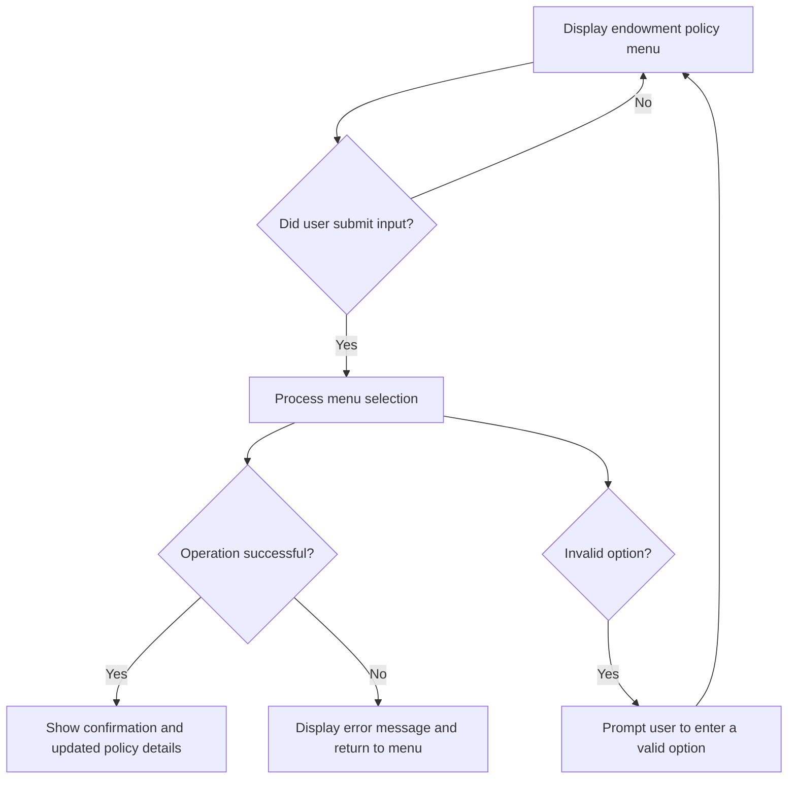
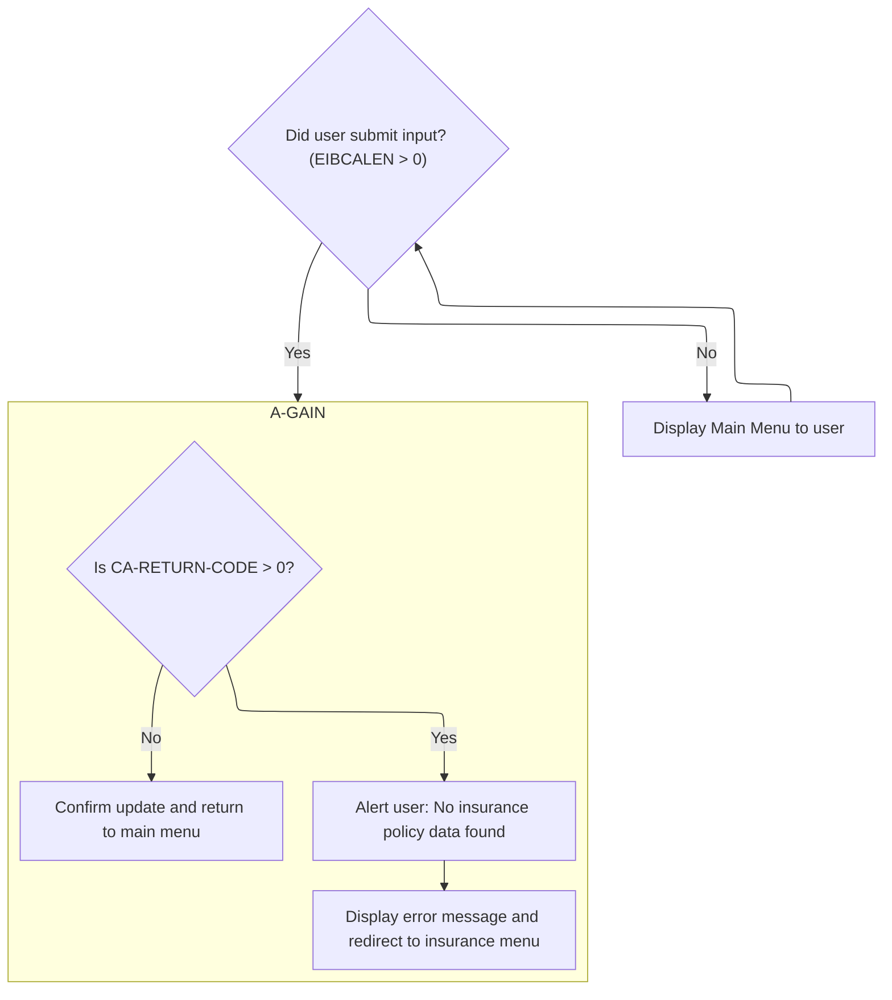
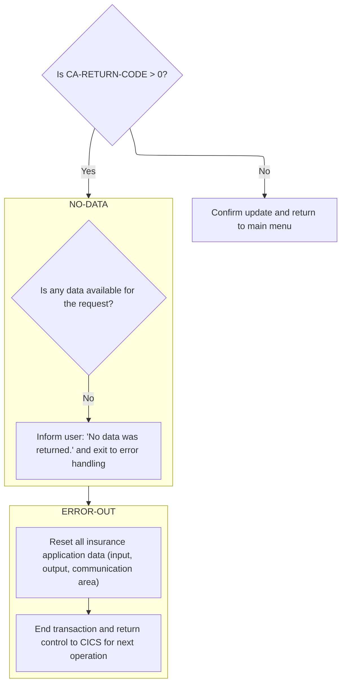
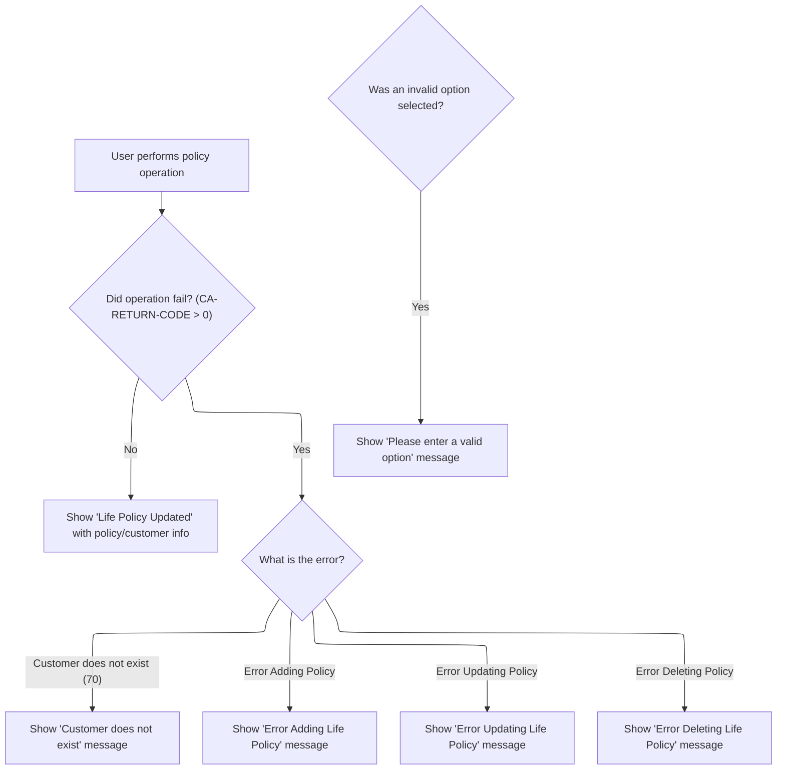

# Program Overview

The <SwmToken path="base/src/lgtestp2.cbl" pos="11:6:6" line-data="       PROGRAM-ID. LGTESTP2.">`LGTESTP2`</SwmToken> program provides an interactive menu for managing endowment insurance policies. Users can add, update, delete, or view policy information, and receive immediate feedback through confirmation or error messages. This flow forms a key part of the application's user interface for endowment policy management.

The main steps are:

- Display the endowment policy menu
- Process user input to select a policy operation
- Perform the requested operation on policy data
- Show confirmation or error messages
- Handle invalid menu selections



## Dependencies

### Programs

- <SwmToken path="base/src/lgtestp2.cbl" pos="67:10:10" line-data="                 EXEC CICS LINK PROGRAM(&#39;LGIPOL01&#39;)">`LGIPOL01`</SwmToken> (<SwmPath>[base/src/lgipol01.cbl](base/src/lgipol01.cbl)</SwmPath>)
- LGIPDB01 (<SwmPath>[base/src/lgipdb01.cbl](base/src/lgipdb01.cbl)</SwmPath>)
- LGSTSQ (<SwmPath>[base/src/lgstsq.cbl](base/src/lgstsq.cbl)</SwmPath>)
- <SwmToken path="base/src/lgtestp2.cbl" pos="105:10:10" line-data="                 EXEC CICS LINK PROGRAM(&#39;LGAPOL01&#39;)">`LGAPOL01`</SwmToken> (<SwmPath>[base/src/lgapol01.cbl](base/src/lgapol01.cbl)</SwmPath>)
- LGAPDB01 (<SwmPath>[base/src/LGAPDB01.cbl](base/src/LGAPDB01.cbl)</SwmPath>)
- LGAPDB02
- LGAPDB03 (<SwmPath>[base/src/LGAPDB03.cbl](base/src/LGAPDB03.cbl)</SwmPath>)
- LGAPDB04 (<SwmPath>[base/src/LGAPDB04.cbl](base/src/LGAPDB04.cbl)</SwmPath>)
- <SwmToken path="base/src/lgtestp2.cbl" pos="129:10:10" line-data="                 EXEC CICS LINK PROGRAM(&#39;LGDPOL01&#39;)">`LGDPOL01`</SwmToken> (<SwmPath>[base/src/lgdpol01.cbl](base/src/lgdpol01.cbl)</SwmPath>)
- LGDPDB01 (<SwmPath>[base/src/lgdpdb01.cbl](base/src/lgdpdb01.cbl)</SwmPath>)
- LGDPVS01 (<SwmPath>[base/src/lgdpvs01.cbl](base/src/lgdpvs01.cbl)</SwmPath>)
- <SwmToken path="base/src/lgtestp2.cbl" pos="198:10:10" line-data="                 EXEC CICS LINK PROGRAM(&#39;LGUPOL01&#39;)">`LGUPOL01`</SwmToken> (<SwmPath>[base/src/lgupol01.cbl](base/src/lgupol01.cbl)</SwmPath>)
- LGUPDB01 (<SwmPath>[base/src/lgupdb01.cbl](base/src/lgupdb01.cbl)</SwmPath>)
- LGUPVS01 (<SwmPath>[base/src/lgupvs01.cbl](base/src/lgupvs01.cbl)</SwmPath>)

### Copybooks

- SQLCA
- LGPOLICY (<SwmPath>[base/src/lgpolicy.cpy](base/src/lgpolicy.cpy)</SwmPath>)
- LGCMAREA (<SwmPath>[base/src/lgcmarea.cpy](base/src/lgcmarea.cpy)</SwmPath>)
- INPUTREC2 (<SwmPath>[base/src/INPUTREC2.cpy](base/src/INPUTREC2.cpy)</SwmPath>)
- OUTPUTREC (<SwmPath>[base/src/OUTPUTREC.cpy](base/src/OUTPUTREC.cpy)</SwmPath>)
- WORKSTOR (<SwmPath>[base/src/WORKSTOR.cpy](base/src/WORKSTOR.cpy)</SwmPath>)
- LGAPACT (<SwmPath>[base/src/LGAPACT.cpy](base/src/LGAPACT.cpy)</SwmPath>)
- SSMAP

# Program Workflow

# Checking for Input Data



## Handling Policy Menu Operations



<SwmSnippet path="/base/src/lgtestp2.cbl" line="71">

---

In <SwmToken path="base/src/lgtestp2.cbl" pos="33:5:7" line-data="              GO TO A-GAIN.">`A-GAIN`</SwmToken>, we check if <SwmToken path="base/src/lgtestp2.cbl" pos="71:3:7" line-data="                 IF CA-RETURN-CODE &gt; 0">`CA-RETURN-CODE`</SwmToken> is greater than zero to see if the previous operation didn't return any policy data. If that's the case, we immediately call <SwmToken path="base/src/lgtestp2.cbl" pos="72:5:7" line-data="                   GO TO NO-DATA">`NO-DATA`</SwmToken> to alert the user and route them to the error handler for the policy menu.

```cobol
                 IF CA-RETURN-CODE > 0
                   GO TO NO-DATA
                 END-IF
```

---

</SwmSnippet>

### Handling Missing Policy Data

<SwmSnippet path="/base/src/lgtestp2.cbl" line="286">

---

<SwmToken path="base/src/lgtestp2.cbl" pos="286:1:3" line-data="       NO-DATA.">`NO-DATA`</SwmToken> sets the error message for the user and immediately calls <SwmToken path="base/src/lgtestp2.cbl" pos="288:5:7" line-data="           Go To ERROR-OUT.">`ERROR-OUT`</SwmToken> to display it and reset the policy menu for the next interaction.

```cobol
       NO-DATA.
           Move 'No data was returned.'            To  ERP2FLDO
           Go To ERROR-OUT.
```

---

</SwmSnippet>

### Displaying Error and Returning to Menu

<SwmSnippet path="/base/src/lgtestp2.cbl" line="296">

---

<SwmToken path="base/src/lgtestp2.cbl" pos="272:5:7" line-data="               Go To ERROR-OUT">`ERROR-OUT`</SwmToken> resets the input/output and commarea fields, then calls <SwmToken path="base/src/lgtestp2.cbl" pos="300:5:7" line-data="           GO TO ENDIT-STARTIT.">`ENDIT-STARTIT`</SwmToken> to send the user back to the main menu for further policy actions.

```cobol
           Initialize SSMAPP2I.
           Initialize SSMAPP2O.
           Initialize COMM-AREA.

           GO TO ENDIT-STARTIT.
```

---

</SwmSnippet>

<SwmSnippet path="/base/src/lgtestp2.cbl" line="239">

---

<SwmToken path="base/src/lgtestp2.cbl" pos="239:1:3" line-data="       ENDIT-STARTIT.">`ENDIT-STARTIT`</SwmToken> returns control to the transaction menu using <SwmToken path="base/src/lgtestp2.cbl" pos="241:4:4" line-data="                TRANSID(&#39;SSP2&#39;)">`SSP2`</SwmToken> and passes the commarea for the next step.

```cobol
       ENDIT-STARTIT.
           EXEC CICS RETURN
                TRANSID('SSP2')
                COMMAREA(COMM-AREA)
                END-EXEC.
```

---

</SwmSnippet>

### Sending Results and Returning to Menu



<SwmSnippet path="/base/src/lgtestp2.cbl" line="84">

---

Back in <SwmToken path="base/src/lgtestp2.cbl" pos="33:5:7" line-data="              GO TO A-GAIN.">`A-GAIN`</SwmToken> after <SwmToken path="base/src/lgtestp2.cbl" pos="72:5:7" line-data="                   GO TO NO-DATA">`NO-DATA`</SwmToken>, we send the updated map to the user and call <SwmToken path="base/src/lgtestp2.cbl" pos="88:5:7" line-data="                 GO TO ENDIT-STARTIT">`ENDIT-STARTIT`</SwmToken> to bring them back to the main transaction menu.

```cobol
                 EXEC CICS SEND MAP ('SSMAPP2')
                           FROM(SSMAPP2O)
                           MAPSET ('SSMAP')
                 END-EXEC
                 GO TO ENDIT-STARTIT
```

---

</SwmSnippet>

<SwmSnippet path="/base/src/lgtestp2.cbl" line="109">

---

Back in <SwmToken path="base/src/lgtestp2.cbl" pos="33:5:7" line-data="              GO TO A-GAIN.">`A-GAIN`</SwmToken> after <SwmToken path="base/src/lgtestp2.cbl" pos="88:5:7" line-data="                 GO TO ENDIT-STARTIT">`ENDIT-STARTIT`</SwmToken>, we check if the add operation failed, roll back any changes, and call <SwmToken path="base/src/lgtestp2.cbl" pos="111:5:7" line-data="                   GO TO NO-ADD">`NO-ADD`</SwmToken> to handle the error and show the user what went wrong.

```cobol
                 IF CA-RETURN-CODE > 0
                   Exec CICS Syncpoint Rollback End-Exec
                   GO TO NO-ADD
                 END-IF
```

---

</SwmSnippet>

<SwmSnippet path="/base/src/lgtestp2.cbl" line="268">

---

<SwmToken path="base/src/lgtestp2.cbl" pos="268:1:3" line-data="       NO-ADD.">`NO-ADD`</SwmToken> checks the error code to set the right message (customer missing or generic add error), then calls <SwmToken path="base/src/lgtestp2.cbl" pos="272:5:7" line-data="               Go To ERROR-OUT">`ERROR-OUT`</SwmToken> to display it and reset the menu.

```cobol
       NO-ADD.
           Evaluate CA-RETURN-CODE
             When 70
               Move 'Customer does not exist'          To  ERP1FLDO
               Go To ERROR-OUT
             When Other
               Move 'Error Adding Life Policy'        To  ERP1FLDO
               Go To ERROR-OUT
           End-Evaluate.
```

---

</SwmSnippet>

<SwmSnippet path="/base/src/lgtestp2.cbl" line="133">

---

Back in <SwmToken path="base/src/lgtestp2.cbl" pos="33:5:7" line-data="              GO TO A-GAIN.">`A-GAIN`</SwmToken> after <SwmToken path="base/src/lgtestp2.cbl" pos="111:5:7" line-data="                   GO TO NO-ADD">`NO-ADD`</SwmToken>, we check if the delete operation failed, roll back any changes, and call <SwmToken path="base/src/lgtestp2.cbl" pos="135:5:7" line-data="                   GO TO NO-DELETE">`NO-DELETE`</SwmToken> to handle the error and show the user what went wrong.

```cobol
                 IF CA-RETURN-CODE > 0
                   Exec CICS Syncpoint Rollback End-Exec
                   GO TO NO-DELETE
                 END-IF
```

---

</SwmSnippet>

<SwmSnippet path="/base/src/lgtestp2.cbl" line="282">

---

<SwmToken path="base/src/lgtestp2.cbl" pos="282:1:3" line-data="       NO-DELETE.">`NO-DELETE`</SwmToken> sets the error message for a failed delete and calls <SwmToken path="base/src/lgtestp2.cbl" pos="284:5:7" line-data="           Go To ERROR-OUT.">`ERROR-OUT`</SwmToken> to show it and reset the menu.

```cobol
       NO-DELETE.
           Move 'Error Deleting Life Policy'       To  ERP2FLDO
           Go To ERROR-OUT.
```

---

</SwmSnippet>

<SwmSnippet path="/base/src/lgtestp2.cbl" line="202">

---

Back in <SwmToken path="base/src/lgtestp2.cbl" pos="33:5:7" line-data="              GO TO A-GAIN.">`A-GAIN`</SwmToken> after <SwmToken path="base/src/lgtestp2.cbl" pos="135:5:7" line-data="                   GO TO NO-DELETE">`NO-DELETE`</SwmToken>, we check if the update operation failed and jump to <SwmToken path="base/src/lgtestp2.cbl" pos="203:5:7" line-data="                   GO TO NO-UPD">`NO-UPD`</SwmToken> to handle the error and show the user what went wrong.

```cobol
                 IF CA-RETURN-CODE > 0
                   GO TO NO-UPD
                 END-IF
```

---

</SwmSnippet>

<SwmSnippet path="/base/src/lgtestp2.cbl" line="278">

---

<SwmToken path="base/src/lgtestp2.cbl" pos="278:1:3" line-data="       NO-UPD.">`NO-UPD`</SwmToken> sets the error message for a failed update and calls <SwmToken path="base/src/lgtestp2.cbl" pos="280:5:7" line-data="           Go To ERROR-OUT.">`ERROR-OUT`</SwmToken> to show it and reset the menu.

```cobol
       NO-UPD.
           Move 'Error Updating Life Policy'       To  ERP2FLDO
           Go To ERROR-OUT.
```

---

</SwmSnippet>

<SwmSnippet path="/base/src/lgtestp2.cbl" line="206">

---

Back in <SwmToken path="base/src/lgtestp2.cbl" pos="33:5:7" line-data="              GO TO A-GAIN.">`A-GAIN`</SwmToken> after <SwmToken path="base/src/lgtestp2.cbl" pos="203:5:7" line-data="                   GO TO NO-UPD">`NO-UPD`</SwmToken>, we update the screen fields with the new policy info and send a confirmation message to the user, then call <SwmToken path="base/src/lgtestp2.cbl" pos="216:5:7" line-data="                 GO TO ENDIT-STARTIT">`ENDIT-STARTIT`</SwmToken> to return to the menu.

```cobol
                 Move CA-CUSTOMER-NUM To ENP2CNOI
                 Move CA-POLICY-NUM   To ENP2PNOI
                 Move ' '             To ENP2OPTI
                 Move 'Life Policy Updated'
                   To  ERP2FLDO
                 EXEC CICS SEND MAP ('SSMAPP2')
                           FROM(SSMAPP2O)
                           MAPSET ('SSMAP')
                 END-EXEC

                 GO TO ENDIT-STARTIT
```

---

</SwmSnippet>

<SwmSnippet path="/base/src/lgtestp2.cbl" line="218">

---

<SwmToken path="base/src/lgtestp2.cbl" pos="33:5:7" line-data="              GO TO A-GAIN.">`A-GAIN`</SwmToken> uses hardcoded request IDs and user messages to drive the menu logic. The EVALUATE statement branches on the user's option, calls the right backend program, and sends the results or error messages back to the user. Invalid options get a specific error message and the user is returned to the menu.

```cobol
             WHEN OTHER

                 Move 'Please enter a valid option'
                   To  ERP2FLDO
                 Move -1 To ENP2OPTL

                 EXEC CICS SEND MAP ('SSMAPP2')
                           FROM(SSMAPP2O)
                           MAPSET ('SSMAP')
                           CURSOR
                 END-EXEC
                 GO TO ENDIT-STARTIT

           END-EVALUATE.


      *    Send message to terminal and return

           EXEC CICS RETURN
           END-EXEC.
```

---

</SwmSnippet>

## Starting the Policy Menu

<SwmSnippet path="/base/src/lgtestp2.cbl" line="30">

---

In <SwmToken path="base/src/lgtestp2.cbl" pos="30:1:1" line-data="       MAINLINE SECTION.">`MAINLINE`</SwmToken>, we check if there's input data (EIBCALEN > 0). If so, we jump to <SwmToken path="base/src/lgtestp2.cbl" pos="33:5:7" line-data="              GO TO A-GAIN.">`A-GAIN`</SwmToken> to handle menu operations; otherwise, we set up the main menu for a new session.

```cobol
       MAINLINE SECTION.

           IF EIBCALEN > 0
              GO TO A-GAIN.
```

---

</SwmSnippet>

<SwmSnippet path="/base/src/lgtestp2.cbl" line="35">

---

<SwmToken path="base/src/lgtestp2.cbl" pos="30:1:1" line-data="       MAINLINE SECTION.">`MAINLINE`</SwmToken> initializes the screen and commarea fields, then sends the main menu map to the user to start their session.

```cobol
           Initialize SSMAPP2I.
           Initialize SSMAPP2O.
           Initialize COMM-AREA.
           MOVE '0000000000'   To ENP2CNOO.
           MOVE '0000000000'   To ENP2PNOO.

      * Display Main Menu
           EXEC CICS SEND MAP ('SSMAPP2')
                     MAPSET ('SSMAP')
                     ERASE
                     END-EXEC.
```

---

</SwmSnippet>

&nbsp;

*This is an auto-generated document by Swimm 🌊 and has not yet been verified by a human*

<SwmMeta version="3.0.0" repo-id="Z2l0aHViJTNBJTNBY2ljcy1nZW5hcHAtZGVtbyUzQSUzQXN3aW1taW8=" repo-name="cics-genapp-demo"><sup>Powered by [Swimm](https://app.swimm.io/)</sup></SwmMeta>
