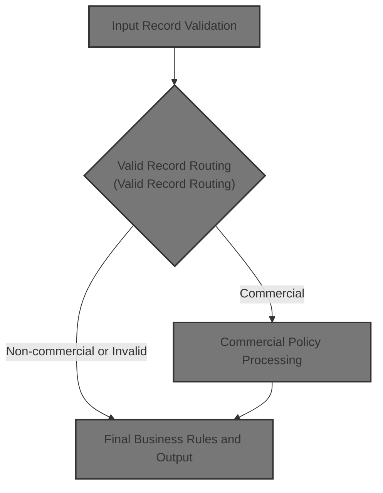
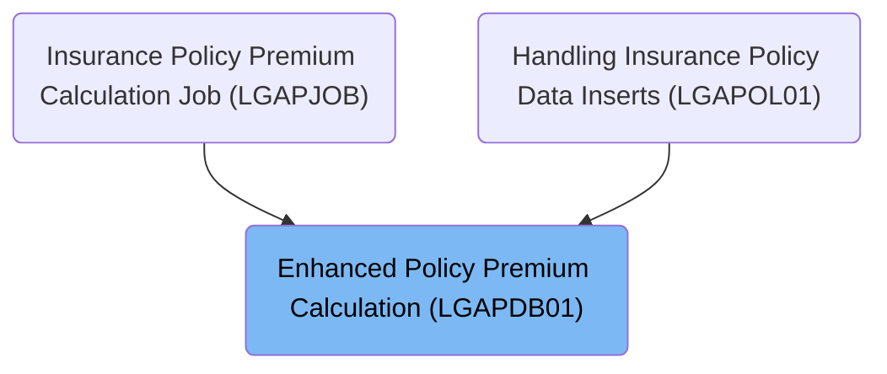
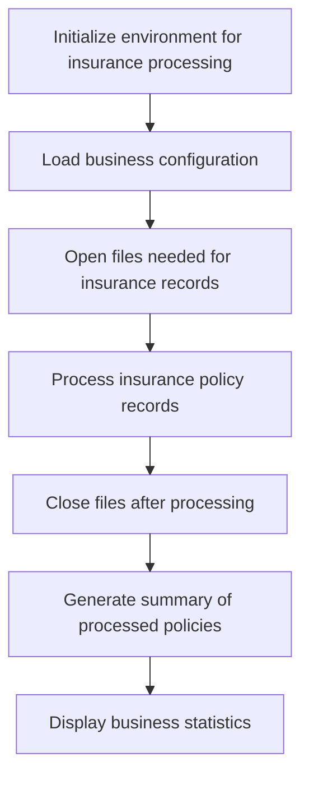
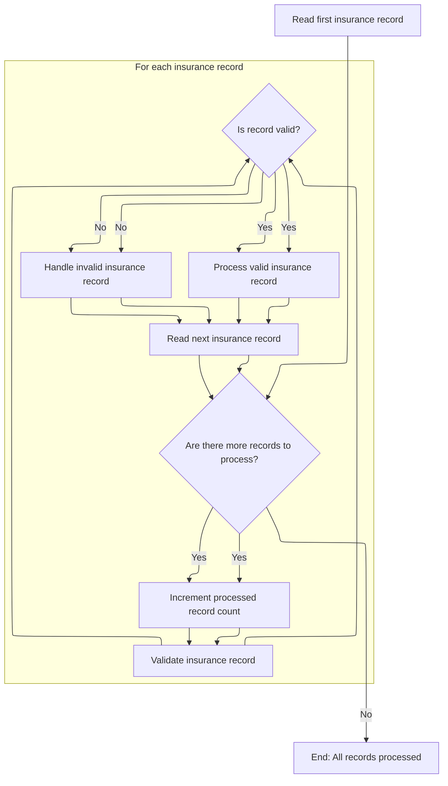
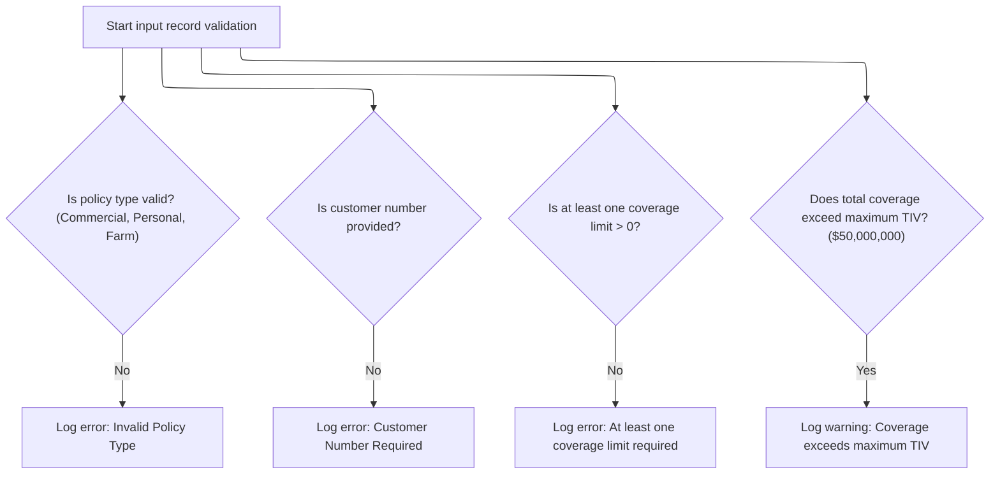
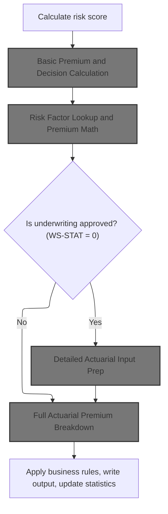
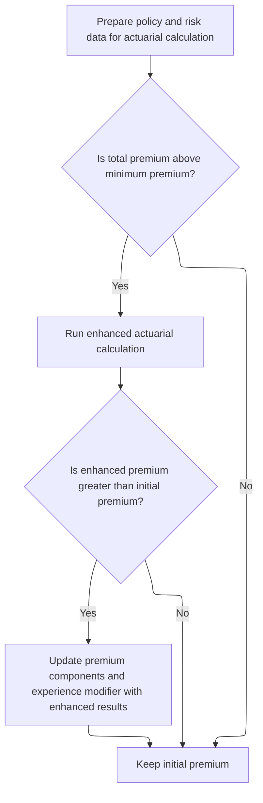

# Overview

This document explains the flow of processing insurance policy records, including validation, routing, premium calculation, and summary generation. Commercial policies receive detailed risk assessment and actuarial premium breakdowns if approved.



## Dependencies

### Programs

- <SwmToken path="base/src/LGAPDB01.cbl" pos="2:6:6" line-data="       PROGRAM-ID. LGAPDB01.">`LGAPDB01`</SwmToken> (<SwmPath>[base/src/LGAPDB01.cbl](base/src/LGAPDB01.cbl)</SwmPath>)
- <SwmToken path="base/src/LGAPDB01.cbl" pos="269:4:4" line-data="           CALL &#39;LGAPDB02&#39; USING IN-PROPERTY-TYPE, IN-POSTCODE, ">`LGAPDB02`</SwmToken>
- <SwmToken path="base/src/LGAPDB01.cbl" pos="276:4:4" line-data="           CALL &#39;LGAPDB03&#39; USING WS-BASE-RISK-SCR, IN-FIRE-PERIL, ">`LGAPDB03`</SwmToken> (<SwmPath>[base/src/LGAPDB03.cbl](base/src/LGAPDB03.cbl)</SwmPath>)
- <SwmToken path="base/src/LGAPDB01.cbl" pos="313:4:4" line-data="               CALL &#39;LGAPDB04&#39; USING LK-INPUT-DATA, LK-COVERAGE-DATA, ">`LGAPDB04`</SwmToken> (<SwmPath>[base/src/LGAPDB04.cbl](base/src/LGAPDB04.cbl)</SwmPath>)

### Copybooks

- SQLCA
- <SwmToken path="base/src/LGAPDB01.cbl" pos="35:3:3" line-data="           COPY INPUTREC2.">`INPUTREC2`</SwmToken> (<SwmPath>[base/src/INPUTREC2.cpy](base/src/INPUTREC2.cpy)</SwmPath>)
- OUTPUTREC (<SwmPath>[base/src/OUTPUTREC.cpy](base/src/OUTPUTREC.cpy)</SwmPath>)
- WORKSTOR (<SwmPath>[base/src/WORKSTOR.cpy](base/src/WORKSTOR.cpy)</SwmPath>)
- LGAPACT (<SwmPath>[base/src/LGAPACT.cpy](base/src/LGAPACT.cpy)</SwmPath>)

# Where is this program used?

This program is used multiple times in the codebase as represented in the following diagram:



## Input and Output Tables/Files used in the Program

| Table / File Name                                                                                                                                        | Type | Description                                  | Usage Mode | Key Fields / Layout Highlights           |
| -------------------------------------------------------------------------------------------------------------------------------------------------------- | ---- | -------------------------------------------- | ---------- | ---------------------------------------- |
| <SwmToken path="base/src/LGAPDB01.cbl" pos="17:3:5" line-data="           SELECT CONFIG-FILE ASSIGN TO &#39;CONFIG.DAT&#39;">`CONFIG-FILE`</SwmToken>    | DB2  | System config parameters and thresholds      | Input      | Database table with relational structure |
| <SwmToken path="base/src/LGAPDB01.cbl" pos="9:3:5" line-data="           SELECT INPUT-FILE ASSIGN TO &#39;INPUT.DAT&#39;">`INPUT-FILE`</SwmToken>        | DB2  | Insurance policy application input data      | Input      | Database table with relational structure |
| <SwmToken path="base/src/LGAPDB01.cbl" pos="13:3:5" line-data="           SELECT OUTPUT-FILE ASSIGN TO &#39;OUTPUT.DAT&#39;">`OUTPUT-FILE`</SwmToken>    | DB2  | Calculated premium results per policy        | Output     | Database table with relational structure |
| <SwmToken path="base/src/LGAPDB01.cbl" pos="265:7:9" line-data="           PERFORM P011E-WRITE-OUTPUT-RECORD">`OUTPUT-RECORD`</SwmToken>                 | DB2  | Single policy premium calculation output     | Output     | Database table with relational structure |
| <SwmToken path="base/src/LGAPDB01.cbl" pos="27:3:5" line-data="           SELECT SUMMARY-FILE ASSIGN TO &#39;SUMMARY.DAT&#39;">`SUMMARY-FILE`</SwmToken> | DB2  | Summary statistics for policy processing run | Output     | Database table with relational structure |
| <SwmToken path="base/src/LGAPDB01.cbl" pos="64:3:5" line-data="       01  SUMMARY-RECORD             PIC X(132).">`SUMMARY-RECORD`</SwmToken>            | DB2  | Summary line for processing statistics       | Output     | Database table with relational structure |

&nbsp;

## Detailed View of the Program's Functionality

# Startup and Main Processing Loop

At startup, the application prepares its environment for processing insurance policies. It first initializes all counters, working data, and structures needed for the run. Next, it loads business configuration values, either from a configuration file or by falling back to defaults if the file is missing. After configuration, it opens all necessary files for input, output, summary, and rates. Once setup is complete, the main processing loop begins, which reads and processes each insurance policy record. After all records are processed, the application closes the files, generates a summary report of the run, and displays business statistics such as counts of approved, pending, and rejected policies, total premium generated, and average risk score.

# Input Record Handling Loop

The main loop reads the first insurance record from the input file. For each record, it checks if there are more records to process. If so, it increments the processed record count and validates the record. If the record passes validation, it is processed as a valid insurance record; otherwise, it is handled as an error record. After processing, the next record is read, and the loop continues until all records are processed.

# Input Record Validation

Each input record undergoes a series of validation checks:

- The policy type is checked to ensure it matches one of the allowed types (Commercial, Personal, Farm). If not, an error is logged.
- The customer number is checked to ensure it is provided; if missing, an error is logged.
- Coverage limits are checked to ensure at least one (building or contents) is greater than zero; if not, an error is logged.
- The total coverage is checked against the maximum allowed insured value. If it exceeds the maximum, a warning is logged, but the record is still processed.

If any of these checks fail, the record is marked as invalid and handled accordingly.

# Valid Record Routing

For records that pass validation, the application determines if the policy is commercial. If it is, the commercial policy processing logic is invoked, which includes risk scoring and premium calculations. If the policy is not commercial, it is routed to a handler that marks it as unsupported and logs the appropriate rejection reason.

# Commercial Policy Processing

Commercial policies undergo a multi-step process:

1. **Risk Score Calculation**: The risk score for the policy is calculated using property and customer data.
2. **Basic Premium and Decision Calculation**: The initial premium and underwriting decision are calculated using risk factors and peril selections. This involves retrieving risk factors from the database (with fallback to defaults if unavailable), assessing the risk score to determine the verdict (approved, pending, rejected), and calculating premiums for each peril (fire, crime, flood, weather) using the risk score, risk factor, peril coverage, and any applicable discount.
3. **Enhanced Actuarial Calculation Trigger**: If the policy is approved and the initial premium exceeds the minimum threshold, a more detailed actuarial calculation is performed to potentially improve the premium breakdown.
4. **Detailed Actuarial Input Prep**: All relevant policy, property, and coverage data are prepared and passed to the advanced actuarial calculation module.
5. **Full Actuarial Premium Breakdown**: The actuarial module performs a comprehensive calculation, considering experience modifiers (based on years in business and claims history), schedule modifiers (building age, protection class, occupancy, exposure density), base premium for each peril, catastrophe loadings (hurricane, earthquake, tornado, flood), expense and profit loadings, discounts (multi-peril, claims-free, deductible), taxes, and final premium and rate factor. Caps are applied to discounts and rate factors to ensure business rules are followed.
6. **Final Business Rules and Output**: After all calculations, business rules are applied to determine the final underwriting decision. The output record is written, and statistics are updated.

# Risk Factor Lookup and Premium Math (<SwmToken path="base/src/LGAPDB01.cbl" pos="276:4:4" line-data="           CALL &#39;LGAPDB03&#39; USING WS-BASE-RISK-SCR, IN-FIRE-PERIL, ">`LGAPDB03`</SwmToken>)

For each commercial policy, risk factors for fire and crime perils are retrieved from the database. If the lookup fails, default values are used. The risk score is then assessed to determine the underwriting verdict:

- If the risk score is above 200, the policy is rejected.
- If the risk score is between 151 and 200, the policy is marked as pending.
- If the risk score is 150 or below, the policy is approved.

If all perils are covered, a discount factor is applied. Premiums for each peril are calculated using the risk score, risk factor, peril coverage, and discount. The total premium is the sum of all peril premiums.

# Full Actuarial Premium Breakdown (<SwmToken path="base/src/LGAPDB01.cbl" pos="313:4:4" line-data="               CALL &#39;LGAPDB04&#39; USING LK-INPUT-DATA, LK-COVERAGE-DATA, ">`LGAPDB04`</SwmToken>)

The advanced actuarial calculation module performs the following steps:

 1. **Initialization**: Calculation areas and rate tables are initialized. Exposures for building, contents, and business interruption are calculated based on coverage limits and risk score. Total insured value and exposure density are computed.
 2. **Rate Table Loading**: Base rates for each peril are loaded from the database. If unavailable, default rates are used.
 3. **Experience Modifier Calculation**: The experience modifier is set based on years in business and claims history. No claims in five years results in a discount; otherwise, the modifier is adjusted based on claims ratio, with caps applied.
 4. **Schedule Modifier Calculation**: The schedule modifier is adjusted based on building age, protection class, occupancy code, and exposure density. The result is capped within business rule limits.
 5. **Base Premium Calculation**: For each selected peril, the base premium is calculated using exposures, base rates, experience and schedule modifiers, and trend factor. The sum of all peril premiums forms the base amount.
 6. **Catastrophe Loading**: Catastrophe loadings for hurricane, earthquake, tornado, and flood are calculated and added to the total.
 7. **Expense and Profit Loading**: Expense and profit loadings are calculated as percentages of the base and catastrophe amounts.
 8. **Discount Calculation**: Discounts are calculated for multi-peril coverage, claims-free history, and high deductibles. The total discount is capped at 25% and applied to the sum of all premium components.
 9. **Tax Calculation**: Taxes are calculated as a percentage of the premium after discounts.
10. **Final Premium and Rate Factor Calculation**: The final premium is the sum of all components minus discounts plus taxes. The rate factor is calculated and capped at 0.05 if necessary, with the premium recalculated to match.

# Final Business Rules and Output

After all calculations, business rules are applied to determine the final underwriting decision (approved, pending, rejected) based on risk score and premium thresholds. The output record is written with all relevant data, and statistics are updated to reflect the results of the run.

# Data Definitions

| Table / Record Name                                                                                                                                      | Type | Short Description                            | Usage Mode |
| -------------------------------------------------------------------------------------------------------------------------------------------------------- | ---- | -------------------------------------------- | ---------- |
| <SwmToken path="base/src/LGAPDB01.cbl" pos="17:3:5" line-data="           SELECT CONFIG-FILE ASSIGN TO &#39;CONFIG.DAT&#39;">`CONFIG-FILE`</SwmToken>    | DB2  | System config parameters and thresholds      | Input      |
| <SwmToken path="base/src/LGAPDB01.cbl" pos="9:3:5" line-data="           SELECT INPUT-FILE ASSIGN TO &#39;INPUT.DAT&#39;">`INPUT-FILE`</SwmToken>        | DB2  | Insurance policy application input data      | Input      |
| <SwmToken path="base/src/LGAPDB01.cbl" pos="13:3:5" line-data="           SELECT OUTPUT-FILE ASSIGN TO &#39;OUTPUT.DAT&#39;">`OUTPUT-FILE`</SwmToken>    | DB2  | Calculated premium results per policy        | Output     |
| <SwmToken path="base/src/LGAPDB01.cbl" pos="265:7:9" line-data="           PERFORM P011E-WRITE-OUTPUT-RECORD">`OUTPUT-RECORD`</SwmToken>                 | DB2  | Single policy premium calculation output     | Output     |
| <SwmToken path="base/src/LGAPDB01.cbl" pos="27:3:5" line-data="           SELECT SUMMARY-FILE ASSIGN TO &#39;SUMMARY.DAT&#39;">`SUMMARY-FILE`</SwmToken> | DB2  | Summary statistics for policy processing run | Output     |
| <SwmToken path="base/src/LGAPDB01.cbl" pos="64:3:5" line-data="       01  SUMMARY-RECORD             PIC X(132).">`SUMMARY-RECORD`</SwmToken>            | DB2  | Summary line for processing statistics       | Output     |

&nbsp;

# Rule Definition

| Paragraph Name                                                                                                                                                                                                                                                                                                                                                                                                                                                                                                                                                                                                                                                                                                                                                        | Rule ID | Category          | Description                                                                                                                                                                                                                                                                           | Conditions                                                                                                                                                                          | Remarks                                                                                                                                                                                                                                                                                                                                                                                                                                                                                                                                         |
| --------------------------------------------------------------------------------------------------------------------------------------------------------------------------------------------------------------------------------------------------------------------------------------------------------------------------------------------------------------------------------------------------------------------------------------------------------------------------------------------------------------------------------------------------------------------------------------------------------------------------------------------------------------------------------------------------------------------------------------------------------------------- | ------- | ----------------- | ------------------------------------------------------------------------------------------------------------------------------------------------------------------------------------------------------------------------------------------------------------------------------------- | ----------------------------------------------------------------------------------------------------------------------------------------------------------------------------------- | ----------------------------------------------------------------------------------------------------------------------------------------------------------------------------------------------------------------------------------------------------------------------------------------------------------------------------------------------------------------------------------------------------------------------------------------------------------------------------------------------------------------------------------------------- |
| <SwmToken path="base/src/LGAPDB01.cbl" pos="91:3:5" line-data="           PERFORM P002-INITIALIZE">`P002-INITIALIZE`</SwmToken>, <SwmToken path="base/src/LGAPDB01.cbl" pos="92:3:7" line-data="           PERFORM P003-LOAD-CONFIG">`P003-LOAD-CONFIG`</SwmToken>, <SwmToken path="base/src/LGAPDB01.cbl" pos="93:3:7" line-data="           PERFORM P005-OPEN-FILES">`P005-OPEN-FILES`</SwmToken>                                                                                                                                                                                                                                                                                                                                                                   | RL-001  | Data Assignment   | Before processing any insurance records, the system must initialize all counters, load business configuration (from file or defaults), and open all required files for input, output, configuration, rates, and summary.                                                              | System startup; before any record processing.                                                                                                                                       | Default values: <SwmToken path="base/src/LGAPDB01.cbl" pos="126:4:4" line-data="           MOVE &#39;MAX_RISK_SCORE&#39; TO CONFIG-KEY">`MAX_RISK_SCORE`</SwmToken>=250, <SwmToken path="base/src/LGAPDB01.cbl" pos="132:4:4" line-data="           MOVE &#39;MIN_PREMIUM&#39; TO CONFIG-KEY">`MIN_PREMIUM`</SwmToken>=<SwmToken path="base/src/LGAPDB04.cbl" pos="300:11:13" line-data="           IF WS-EXPOSURE-DENSITY &gt; 500.00">`500.00`</SwmToken>, MAX_TIV=50,000,000.00. All files must be opened successfully or the process halts. |
| <SwmToken path="base/src/LGAPDB01.cbl" pos="182:3:9" line-data="               PERFORM P008-VALIDATE-INPUT-RECORD">`P008-VALIDATE-INPUT-RECORD`</SwmToken>                                                                                                                                                                                                                                                                                                                                                                                                                                                                                                                                                                                                            | RL-002  | Conditional Logic | Each input insurance policy record is validated for policy type, customer number, coverage limits, and total insured value. Errors result in rejection; warnings (TIV exceeded) allow processing to continue.                                                                         | For each input record read from <SwmToken path="base/src/LGAPDB01.cbl" pos="9:12:14" line-data="           SELECT INPUT-FILE ASSIGN TO &#39;INPUT.DAT&#39;">`INPUT.DAT`</SwmToken>. | Policy types allowed: 'C', 'P', 'F'. Customer number must be non-empty. At least one coverage limit > 0. Total insured value (building_limit + contents_limit + bi_limit) must not exceed 50,000,000.00 (MAX_TIV).                                                                                                                                                                                                                                                                                                                              |
| <SwmToken path="base/src/LGAPDB01.cbl" pos="184:3:9" line-data="                   PERFORM P009-PROCESS-VALID-RECORD">`P009-PROCESS-VALID-RECORD`</SwmToken>, <SwmToken path="base/src/LGAPDB01.cbl" pos="239:3:9" line-data="               PERFORM P012-PROCESS-NON-COMMERCIAL">`P012-PROCESS-NON-COMMERCIAL`</SwmToken>                                                                                                                                                                                                                                                                                                                                                                                                                                            | RL-003  | Conditional Logic | If the policy type is not 'C' (Commercial), the record is output with status 'UNSUPPORTED' and a rejection reason indicating only commercial policies are supported.                                                                                                                  | Input record is valid but policy type is not 'C'.                                                                                                                                   | Output fields: customer_num, property_type, postcode, risk_score=0, all premiums=0, status='UNSUPPORTED', rejection_reason='Only Commercial policies supported in this version'.                                                                                                                                                                                                                                                                                                                                                                |
| <SwmToken path="base/src/LGAPDB01.cbl" pos="259:3:9" line-data="           PERFORM P011A-CALCULATE-RISK-SCORE">`P011A-CALCULATE-RISK-SCORE`</SwmToken>                                                                                                                                                                                                                                                                                                                                                                                                                                                                                                                                                                                                                | RL-004  | Computation       | For commercial policies, calculate a risk score using business rules and risk factors, potentially invoking an external program.                                                                                                                                                      | Policy type is 'C' and input record is valid.                                                                                                                                       | Risk score is a number (integer, 3 digits).                                                                                                                                                                                                                                                                                                                                                                                                                                                                                                     |
| <SwmToken path="base/src/LGAPDB01.cbl" pos="260:3:9" line-data="           PERFORM P011B-BASIC-PREMIUM-CALC">`P011B-BASIC-PREMIUM-CALC`</SwmToken>, <SwmToken path="base/src/LGAPDB03.cbl" pos="45:3:5" line-data="           PERFORM CALCULATE-PREMIUMS">`CALCULATE-PREMIUMS`</SwmToken> (<SwmToken path="base/src/LGAPDB01.cbl" pos="276:4:4" line-data="           CALL &#39;LGAPDB03&#39; USING WS-BASE-RISK-SCR, IN-FIRE-PERIL, ">`LGAPDB03`</SwmToken>), <SwmToken path="base/src/LGAPDB04.cbl" pos="144:3:7" line-data="           PERFORM P600-BASE-PREM">`P600-BASE-PREM`</SwmToken> (<SwmToken path="base/src/LGAPDB01.cbl" pos="313:4:4" line-data="               CALL &#39;LGAPDB04&#39; USING LK-INPUT-DATA, LK-COVERAGE-DATA, ">`LGAPDB04`</SwmToken>) | RL-005  | Computation       | Calculate the premium for each peril using the formula: peril_premium = base_rate \* risk_factor \* peril_coverage \* discount_factor. The total premium is the sum of all peril premiums after discounts and taxes.                                                                  | Policy type is 'C', risk score calculated, peril selected.                                                                                                                          | Peril premiums and total premium are numbers (up to 8-9 digits, 2 decimals). Discount factor is <SwmToken path="base/src/LGAPDB03.cbl" pos="99:3:5" line-data="             MOVE 0.90 TO LK-DISC-FACT">`0.90`</SwmToken> for all perils selected, 0.95 for some combinations, else <SwmToken path="base/src/LGAPDB03.cbl" pos="93:3:5" line-data="           MOVE 1.00 TO LK-DISC-FACT">`1.00`</SwmToken>. Tax rate is 6.75%.                                                                                                                   |
| <SwmToken path="base/src/LGAPDB04.cbl" pos="147:3:5" line-data="           PERFORM P900-DISC">`P900-DISC`</SwmToken> (<SwmToken path="base/src/LGAPDB01.cbl" pos="313:4:4" line-data="               CALL &#39;LGAPDB04&#39; USING LK-INPUT-DATA, LK-COVERAGE-DATA, ">`LGAPDB04`</SwmToken>), <SwmToken path="base/src/LGAPDB03.cbl" pos="45:3:5" line-data="           PERFORM CALCULATE-PREMIUMS">`CALCULATE-PREMIUMS`</SwmToken> (<SwmToken path="base/src/LGAPDB01.cbl" pos="276:4:4" line-data="           CALL &#39;LGAPDB03&#39; USING WS-BASE-RISK-SCR, IN-FIRE-PERIL, ">`LGAPDB03`</SwmToken>)                                                                                                                                                               | RL-006  | Computation       | Apply discounts for multi-peril selection, claims-free history, and deductible credits. The total discount applied to the premium must not exceed 25%.                                                                                                                                | Commercial policy, peril premiums calculated.                                                                                                                                       | <SwmToken path="base/src/LGAPDB04.cbl" pos="410:3:5" line-data="      * Multi-peril discount">`Multi-peril`</SwmToken> discount: 10% if all perils selected, 5% for some combinations. <SwmToken path="base/src/LGAPDB04.cbl" pos="425:3:5" line-data="      * Claims-free discount  ">`Claims-free`</SwmToken>: 7.5% if no claims in 5 years. Deductible credits: 2.5% for fire, 3.5% for wind, 4.5% for flood if deductibles above thresholds. Maximum total discount: 25%.                                                                   |
| <SwmToken path="base/src/LGAPDB04.cbl" pos="142:3:7" line-data="           PERFORM P400-EXP-MOD">`P400-EXP-MOD`</SwmToken>, <SwmToken path="base/src/LGAPDB04.cbl" pos="149:3:5" line-data="           PERFORM P999-FINAL">`P999-FINAL`</SwmToken> (<SwmToken path="base/src/LGAPDB01.cbl" pos="313:4:4" line-data="               CALL &#39;LGAPDB04&#39; USING LK-INPUT-DATA, LK-COVERAGE-DATA, ">`LGAPDB04`</SwmToken>)                                                                                                                                                                                                                                                                                                                                            | RL-007  | Computation       | The experience modifier must be capped between 0.5 and 2.0. The final rate factor must not exceed 0.05; if it does, cap it and recalculate the premium.                                                                                                                               | Commercial policy, premium calculation complete.                                                                                                                                    | Experience modifier: min 0.5, max 2.0. Final rate factor: max 0.05.                                                                                                                                                                                                                                                                                                                                                                                                                                                                             |
| <SwmToken path="base/src/LGAPDB01.cbl" pos="262:3:9" line-data="               PERFORM P011C-ENHANCED-ACTUARIAL-CALC">`P011C-ENHANCED-ACTUARIAL-CALC`</SwmToken> (<SwmToken path="base/src/LGAPDB01.cbl" pos="2:6:6" line-data="       PROGRAM-ID. LGAPDB01.">`LGAPDB01`</SwmToken>), <SwmToken path="base/src/LGAPDB01.cbl" pos="313:4:4" line-data="               CALL &#39;LGAPDB04&#39; USING LK-INPUT-DATA, LK-COVERAGE-DATA, ">`LGAPDB04`</SwmToken>                                                                                                                                                                                                                                                                                                           | RL-008  | Computation       | If the policy is approved and the total premium exceeds the minimum premium, perform an enhanced actuarial calculation using additional business and claims data. If the enhanced premium is greater than the initial premium, update the premium components and experience modifier. | Policy approved, total premium > minimum premium.                                                                                                                                   | Minimum premium: <SwmToken path="base/src/LGAPDB04.cbl" pos="300:11:13" line-data="           IF WS-EXPOSURE-DENSITY &gt; 500.00">`500.00`</SwmToken>. Enhanced calculation uses additional fields and may update premium components.                                                                                                                                                                                                                                                                                                           |
| <SwmToken path="base/src/LGAPDB01.cbl" pos="265:3:9" line-data="           PERFORM P011E-WRITE-OUTPUT-RECORD">`P011E-WRITE-OUTPUT-RECORD`</SwmToken>, <SwmToken path="base/src/LGAPDB01.cbl" pos="239:3:9" line-data="               PERFORM P012-PROCESS-NON-COMMERCIAL">`P012-PROCESS-NON-COMMERCIAL`</SwmToken>, <SwmToken path="base/src/LGAPDB01.cbl" pos="186:3:9" line-data="                   PERFORM P010-PROCESS-ERROR-RECORD">`P010-PROCESS-ERROR-RECORD`</SwmToken>                                                                                                                                                                                                                                                                                      | RL-009  | Data Assignment   | For each processed record, output the following fields: customer_num, property_type, postcode, risk_score, fire_premium, crime_premium, flood_premium, weather_premium, total_premium, status, rejection_reason.                                                                      | After processing each input record.                                                                                                                                                 | Output fields: customer_num (string, 10), property_type (string, 15), postcode (string), risk_score (number, 3 digits), fire_premium, crime_premium, flood_premium, weather_premium (number, 8 digits, 2 decimals), total_premium (number, 9 digits, 2 decimals), status (string), rejection_reason (string, up to 50 chars). Fields are left-aligned, padded as needed.                                                                                                                                                                        |
| <SwmToken path="base/src/LGAPDB01.cbl" pos="96:3:7" line-data="           PERFORM P015-GENERATE-SUMMARY">`P015-GENERATE-SUMMARY`</SwmToken>                                                                                                                                                                                                                                                                                                                                                                                                                                                                                                                                                                                                                           | RL-010  | Computation       | After all records are processed, generate a summary output containing: processing_date, total_records, approved_count, pending_count, rejected_count, total_premium, average_risk_score, high_risk_count (risk_score > 200).                                                          | After all input records processed.                                                                                                                                                  | Summary fields: processing_date (YYYYMMDD), total_records (number), approved_count (number), pending_count (number), rejected_count (number), total_premium (number, 12 digits, 2 decimals), average_risk_score (number, 3 digits, 2 decimals), high_risk_count (number). Output is a multi-line string, each field labeled.                                                                                                                                                                                                                    |

# User Stories

## User Story 1: Processing and Rating Commercial Policies

---

### Story Description:

As a user submitting commercial insurance policies, I want the system to calculate risk scores, compute premiums, apply discounts, cap modifiers, perform enhanced actuarial calculations when needed, and output all required fields so that I receive accurate policy ratings and premium calculations according to business rules.

---

### Business Rule Mapping:

| Rule ID | Paragraph Name                                                                                                                                                                                                                                                                                                                                                                                                                                                                                                                                                                                                                                                                                                                                                        | Rule Description                                                                                                                                                                                                                                                                      |
| ------- | --------------------------------------------------------------------------------------------------------------------------------------------------------------------------------------------------------------------------------------------------------------------------------------------------------------------------------------------------------------------------------------------------------------------------------------------------------------------------------------------------------------------------------------------------------------------------------------------------------------------------------------------------------------------------------------------------------------------------------------------------------------------- | ------------------------------------------------------------------------------------------------------------------------------------------------------------------------------------------------------------------------------------------------------------------------------------- |
| RL-005  | <SwmToken path="base/src/LGAPDB01.cbl" pos="260:3:9" line-data="           PERFORM P011B-BASIC-PREMIUM-CALC">`P011B-BASIC-PREMIUM-CALC`</SwmToken>, <SwmToken path="base/src/LGAPDB03.cbl" pos="45:3:5" line-data="           PERFORM CALCULATE-PREMIUMS">`CALCULATE-PREMIUMS`</SwmToken> (<SwmToken path="base/src/LGAPDB01.cbl" pos="276:4:4" line-data="           CALL &#39;LGAPDB03&#39; USING WS-BASE-RISK-SCR, IN-FIRE-PERIL, ">`LGAPDB03`</SwmToken>), <SwmToken path="base/src/LGAPDB04.cbl" pos="144:3:7" line-data="           PERFORM P600-BASE-PREM">`P600-BASE-PREM`</SwmToken> (<SwmToken path="base/src/LGAPDB01.cbl" pos="313:4:4" line-data="               CALL &#39;LGAPDB04&#39; USING LK-INPUT-DATA, LK-COVERAGE-DATA, ">`LGAPDB04`</SwmToken>) | Calculate the premium for each peril using the formula: peril_premium = base_rate \* risk_factor \* peril_coverage \* discount_factor. The total premium is the sum of all peril premiums after discounts and taxes.                                                                  |
| RL-007  | <SwmToken path="base/src/LGAPDB04.cbl" pos="142:3:7" line-data="           PERFORM P400-EXP-MOD">`P400-EXP-MOD`</SwmToken>, <SwmToken path="base/src/LGAPDB04.cbl" pos="149:3:5" line-data="           PERFORM P999-FINAL">`P999-FINAL`</SwmToken> (<SwmToken path="base/src/LGAPDB01.cbl" pos="313:4:4" line-data="               CALL &#39;LGAPDB04&#39; USING LK-INPUT-DATA, LK-COVERAGE-DATA, ">`LGAPDB04`</SwmToken>)                                                                                                                                                                                                                                                                                                                                            | The experience modifier must be capped between 0.5 and 2.0. The final rate factor must not exceed 0.05; if it does, cap it and recalculate the premium.                                                                                                                               |
| RL-004  | <SwmToken path="base/src/LGAPDB01.cbl" pos="259:3:9" line-data="           PERFORM P011A-CALCULATE-RISK-SCORE">`P011A-CALCULATE-RISK-SCORE`</SwmToken>                                                                                                                                                                                                                                                                                                                                                                                                                                                                                                                                                                                                                | For commercial policies, calculate a risk score using business rules and risk factors, potentially invoking an external program.                                                                                                                                                      |
| RL-006  | <SwmToken path="base/src/LGAPDB04.cbl" pos="147:3:5" line-data="           PERFORM P900-DISC">`P900-DISC`</SwmToken> (<SwmToken path="base/src/LGAPDB01.cbl" pos="313:4:4" line-data="               CALL &#39;LGAPDB04&#39; USING LK-INPUT-DATA, LK-COVERAGE-DATA, ">`LGAPDB04`</SwmToken>), <SwmToken path="base/src/LGAPDB03.cbl" pos="45:3:5" line-data="           PERFORM CALCULATE-PREMIUMS">`CALCULATE-PREMIUMS`</SwmToken> (<SwmToken path="base/src/LGAPDB01.cbl" pos="276:4:4" line-data="           CALL &#39;LGAPDB03&#39; USING WS-BASE-RISK-SCR, IN-FIRE-PERIL, ">`LGAPDB03`</SwmToken>)                                                                                                                                                               | Apply discounts for multi-peril selection, claims-free history, and deductible credits. The total discount applied to the premium must not exceed 25%.                                                                                                                                |
| RL-008  | <SwmToken path="base/src/LGAPDB01.cbl" pos="262:3:9" line-data="               PERFORM P011C-ENHANCED-ACTUARIAL-CALC">`P011C-ENHANCED-ACTUARIAL-CALC`</SwmToken> (<SwmToken path="base/src/LGAPDB01.cbl" pos="2:6:6" line-data="       PROGRAM-ID. LGAPDB01.">`LGAPDB01`</SwmToken>), <SwmToken path="base/src/LGAPDB01.cbl" pos="313:4:4" line-data="               CALL &#39;LGAPDB04&#39; USING LK-INPUT-DATA, LK-COVERAGE-DATA, ">`LGAPDB04`</SwmToken>                                                                                                                                                                                                                                                                                                           | If the policy is approved and the total premium exceeds the minimum premium, perform an enhanced actuarial calculation using additional business and claims data. If the enhanced premium is greater than the initial premium, update the premium components and experience modifier. |

---

### Relevant Functionality:

- <SwmToken path="base/src/LGAPDB01.cbl" pos="260:3:9" line-data="           PERFORM P011B-BASIC-PREMIUM-CALC">`P011B-BASIC-PREMIUM-CALC`</SwmToken>
  1. **RL-005:**
     - For each peril selected:
       - Retrieve base rate and risk factor (from DB or defaults)
       - Apply discount factor based on peril selection
       - Calculate peril premium
     - Sum all peril premiums
     - Apply discounts and taxes to compute total premium
- <SwmToken path="base/src/LGAPDB04.cbl" pos="142:3:7" line-data="           PERFORM P400-EXP-MOD">`P400-EXP-MOD`</SwmToken>
  1. **RL-007:**
     - After calculating experience modifier, if >2.0 set to 2.0, if <0.5 set to 0.5
     - After calculating final rate factor, if >0.05 set to 0.05 and recalculate premium
- <SwmToken path="base/src/LGAPDB01.cbl" pos="259:3:9" line-data="           PERFORM P011A-CALCULATE-RISK-SCORE">`P011A-CALCULATE-RISK-SCORE`</SwmToken>
  1. **RL-004:**
     - Call risk score calculation logic/program with relevant input data
     - Store calculated risk score for further processing
- <SwmToken path="base/src/LGAPDB04.cbl" pos="147:3:5" line-data="           PERFORM P900-DISC">`P900-DISC`</SwmToken> **(**<SwmToken path="base/src/LGAPDB01.cbl" pos="313:4:4" line-data="               CALL &#39;LGAPDB04&#39; USING LK-INPUT-DATA, LK-COVERAGE-DATA, ">`LGAPDB04`</SwmToken>**)**
  1. **RL-006:**
     - Calculate each applicable discount
     - Sum discounts
     - If total discount > 0.25, cap at 0.25
     - Apply total discount to premium
- <SwmToken path="base/src/LGAPDB01.cbl" pos="262:3:9" line-data="               PERFORM P011C-ENHANCED-ACTUARIAL-CALC">`P011C-ENHANCED-ACTUARIAL-CALC`</SwmToken> **(**<SwmToken path="base/src/LGAPDB01.cbl" pos="2:6:6" line-data="       PROGRAM-ID. LGAPDB01.">`LGAPDB01`</SwmToken>**)**
  1. **RL-008:**
     - If total premium > minimum premium and policy approved:
       - Call enhanced actuarial calculation logic/program
       - If enhanced premium > initial premium, update premium fields and experience modifier

## User Story 2: System Initialization, Configuration, and Input Validation

---

### Story Description:

As an insurance processing system, I want to initialize counters, load business configuration, open all required files, validate each input record for policy type, customer number, and coverage limits, and identify non-commercial policies as unsupported so that the application is ready to process insurance data reliably and only valid commercial records are processed.

---

### Business Rule Mapping:

| Rule ID | Paragraph Name                                                                                                                                                                                                                                                                                                                                                                                      | Rule Description                                                                                                                                                                                                         |
| ------- | --------------------------------------------------------------------------------------------------------------------------------------------------------------------------------------------------------------------------------------------------------------------------------------------------------------------------------------------------------------------------------------------------- | ------------------------------------------------------------------------------------------------------------------------------------------------------------------------------------------------------------------------ |
| RL-002  | <SwmToken path="base/src/LGAPDB01.cbl" pos="182:3:9" line-data="               PERFORM P008-VALIDATE-INPUT-RECORD">`P008-VALIDATE-INPUT-RECORD`</SwmToken>                                                                                                                                                                                                                                          | Each input insurance policy record is validated for policy type, customer number, coverage limits, and total insured value. Errors result in rejection; warnings (TIV exceeded) allow processing to continue.            |
| RL-003  | <SwmToken path="base/src/LGAPDB01.cbl" pos="184:3:9" line-data="                   PERFORM P009-PROCESS-VALID-RECORD">`P009-PROCESS-VALID-RECORD`</SwmToken>, <SwmToken path="base/src/LGAPDB01.cbl" pos="239:3:9" line-data="               PERFORM P012-PROCESS-NON-COMMERCIAL">`P012-PROCESS-NON-COMMERCIAL`</SwmToken>                                                                          | If the policy type is not 'C' (Commercial), the record is output with status 'UNSUPPORTED' and a rejection reason indicating only commercial policies are supported.                                                     |
| RL-001  | <SwmToken path="base/src/LGAPDB01.cbl" pos="91:3:5" line-data="           PERFORM P002-INITIALIZE">`P002-INITIALIZE`</SwmToken>, <SwmToken path="base/src/LGAPDB01.cbl" pos="92:3:7" line-data="           PERFORM P003-LOAD-CONFIG">`P003-LOAD-CONFIG`</SwmToken>, <SwmToken path="base/src/LGAPDB01.cbl" pos="93:3:7" line-data="           PERFORM P005-OPEN-FILES">`P005-OPEN-FILES`</SwmToken> | Before processing any insurance records, the system must initialize all counters, load business configuration (from file or defaults), and open all required files for input, output, configuration, rates, and summary. |

---

### Relevant Functionality:

- <SwmToken path="base/src/LGAPDB01.cbl" pos="182:3:9" line-data="               PERFORM P008-VALIDATE-INPUT-RECORD">`P008-VALIDATE-INPUT-RECORD`</SwmToken>
  1. **RL-002:**
     - Check policy type is one of allowed values
     - Check customer number is present
     - Check at least one coverage limit > 0
     - If total insured value > MAX_TIV, log warning but continue
     - If any other validation fails, log error and set status to ERROR
- <SwmToken path="base/src/LGAPDB01.cbl" pos="184:3:9" line-data="                   PERFORM P009-PROCESS-VALID-RECORD">`P009-PROCESS-VALID-RECORD`</SwmToken>
  1. **RL-003:**
     - If policy type is not 'C', set output status to UNSUPPORTED
     - Set all premium fields to zero
     - Write output record with rejection reason
- <SwmToken path="base/src/LGAPDB01.cbl" pos="91:3:5" line-data="           PERFORM P002-INITIALIZE">`P002-INITIALIZE`</SwmToken>
  1. **RL-001:**
     - Initialize all counters and working storage areas
     - Load configuration from <SwmToken path="base/src/LGAPDB01.cbl" pos="17:12:14" line-data="           SELECT CONFIG-FILE ASSIGN TO &#39;CONFIG.DAT&#39;">`CONFIG.DAT`</SwmToken> if available, else use defaults
     - Open <SwmToken path="base/src/LGAPDB01.cbl" pos="9:12:14" line-data="           SELECT INPUT-FILE ASSIGN TO &#39;INPUT.DAT&#39;">`INPUT.DAT`</SwmToken>, <SwmToken path="base/src/LGAPDB01.cbl" pos="13:12:14" line-data="           SELECT OUTPUT-FILE ASSIGN TO &#39;OUTPUT.DAT&#39;">`OUTPUT.DAT`</SwmToken>, <SwmToken path="base/src/LGAPDB01.cbl" pos="23:12:14" line-data="           SELECT RATE-FILE ASSIGN TO &#39;RATES.DAT&#39;">`RATES.DAT`</SwmToken>, <SwmToken path="base/src/LGAPDB01.cbl" pos="27:12:14" line-data="           SELECT SUMMARY-FILE ASSIGN TO &#39;SUMMARY.DAT&#39;">`SUMMARY.DAT`</SwmToken>
     - Write output headers to <SwmToken path="base/src/LGAPDB01.cbl" pos="13:12:14" line-data="           SELECT OUTPUT-FILE ASSIGN TO &#39;OUTPUT.DAT&#39;">`OUTPUT.DAT`</SwmToken>

## User Story 3: Record Output and Summary Reporting

---

### Story Description:

As a business analyst, I want the system to output all processed records in a standard format and generate a summary report after all records are processed so that I can review key metrics such as total records, approval rates, total premium, and risk statistics.

---

### Business Rule Mapping:

| Rule ID | Paragraph Name                                                                                                                                                                                                                                                                                                                                                                                                                                                                   | Rule Description                                                                                                                                                                                                             |
| ------- | -------------------------------------------------------------------------------------------------------------------------------------------------------------------------------------------------------------------------------------------------------------------------------------------------------------------------------------------------------------------------------------------------------------------------------------------------------------------------------- | ---------------------------------------------------------------------------------------------------------------------------------------------------------------------------------------------------------------------------- |
| RL-009  | <SwmToken path="base/src/LGAPDB01.cbl" pos="265:3:9" line-data="           PERFORM P011E-WRITE-OUTPUT-RECORD">`P011E-WRITE-OUTPUT-RECORD`</SwmToken>, <SwmToken path="base/src/LGAPDB01.cbl" pos="239:3:9" line-data="               PERFORM P012-PROCESS-NON-COMMERCIAL">`P012-PROCESS-NON-COMMERCIAL`</SwmToken>, <SwmToken path="base/src/LGAPDB01.cbl" pos="186:3:9" line-data="                   PERFORM P010-PROCESS-ERROR-RECORD">`P010-PROCESS-ERROR-RECORD`</SwmToken> | For each processed record, output the following fields: customer_num, property_type, postcode, risk_score, fire_premium, crime_premium, flood_premium, weather_premium, total_premium, status, rejection_reason.             |
| RL-010  | <SwmToken path="base/src/LGAPDB01.cbl" pos="96:3:7" line-data="           PERFORM P015-GENERATE-SUMMARY">`P015-GENERATE-SUMMARY`</SwmToken>                                                                                                                                                                                                                                                                                                                                      | After all records are processed, generate a summary output containing: processing_date, total_records, approved_count, pending_count, rejected_count, total_premium, average_risk_score, high_risk_count (risk_score > 200). |

---

### Relevant Functionality:

- <SwmToken path="base/src/LGAPDB01.cbl" pos="265:3:9" line-data="           PERFORM P011E-WRITE-OUTPUT-RECORD">`P011E-WRITE-OUTPUT-RECORD`</SwmToken>
  1. **RL-009:**
     - Populate output fields with processed data
     - Write output record to <SwmToken path="base/src/LGAPDB01.cbl" pos="13:12:14" line-data="           SELECT OUTPUT-FILE ASSIGN TO &#39;OUTPUT.DAT&#39;">`OUTPUT.DAT`</SwmToken>
- <SwmToken path="base/src/LGAPDB01.cbl" pos="96:3:7" line-data="           PERFORM P015-GENERATE-SUMMARY">`P015-GENERATE-SUMMARY`</SwmToken>
  1. **RL-010:**
     - Calculate summary statistics from counters
     - Format summary output as labeled lines
     - Write summary to <SwmToken path="base/src/LGAPDB01.cbl" pos="27:12:14" line-data="           SELECT SUMMARY-FILE ASSIGN TO &#39;SUMMARY.DAT&#39;">`SUMMARY.DAT`</SwmToken>

# Workflow

# Startup and Main Processing Loop



This section governs the startup and main processing loop for the insurance application, ensuring that all necessary setup steps are completed before policy records are processed and business results are generated.

| Category        | Rule Name                  | Description                                                                                                                      |
| --------------- | -------------------------- | -------------------------------------------------------------------------------------------------------------------------------- |
| Data validation | Mandatory initialization   | All insurance policy processing must begin only after the environment is fully initialized and business configuration is loaded. |
| Data validation | File readiness requirement | Insurance policy records must not be processed unless all required files are successfully opened.                                |
| Business logic  | Config-driven processing   | Each insurance policy record must be processed according to the loaded business configuration settings.                          |
| Business logic  | Summary generation         | A summary of all processed insurance policies must be generated after processing is complete.                                    |
| Business logic  | Statistics display         | Business statistics must be displayed to users after all processing and summary generation steps are complete.                   |

<SwmSnippet path="/base/src/LGAPDB01.cbl" line="90">

---

<SwmToken path="base/src/LGAPDB01.cbl" pos="90:1:1" line-data="       P001.">`P001`</SwmToken> kicks off the whole process: it initializes counters and data, loads config, opens files, then hands off to <SwmToken path="base/src/LGAPDB01.cbl" pos="94:3:7" line-data="           PERFORM P006-PROCESS-RECORDS">`P006-PROCESS-RECORDS`</SwmToken> to actually process each policy record. We need to call <SwmToken path="base/src/LGAPDB01.cbl" pos="94:3:7" line-data="           PERFORM P006-PROCESS-RECORDS">`P006-PROCESS-RECORDS`</SwmToken> next because that's where the input records are read, validated, and processed—none of that can happen until setup is done.

```cobol
       P001.
           PERFORM P002-INITIALIZE
           PERFORM P003-LOAD-CONFIG
           PERFORM P005-OPEN-FILES
           PERFORM P006-PROCESS-RECORDS
           PERFORM P014-CLOSE-FILES
           PERFORM P015-GENERATE-SUMMARY
           PERFORM P016-DISPLAY-STATS
           STOP RUN.
```

---

</SwmSnippet>

# Input Record Handling Loop



This section governs the handling of insurance policy records in a loop, ensuring each record is validated and either processed or logged as an error, with counters maintained for processed and error records.

| Category        | Rule Name                     | Description                                                                                                                                          |
| --------------- | ----------------------------- | ---------------------------------------------------------------------------------------------------------------------------------------------------- |
| Data validation | Record validation requirement | Each insurance policy record must be validated before it is processed. Only records that pass validation are considered valid and processed further. |
| Business logic  | Processed record counting     | The total count of processed records must be incremented for each insurance record read, regardless of whether the record is valid or invalid.       |
| Business logic  | Complete record processing    | Processing must continue until all insurance records have been read and handled, as indicated by the end-of-file condition.                          |
| Technical step  | Error array limit             | A maximum of 20 error records can be tracked in the error array for each processing run.                                                             |

<SwmSnippet path="/base/src/LGAPDB01.cbl" line="178">

---

In <SwmToken path="base/src/LGAPDB01.cbl" pos="178:1:5" line-data="       P006-PROCESS-RECORDS.">`P006-PROCESS-RECORDS`</SwmToken>, we kick off by reading the first policy record from input.

```cobol
       P006-PROCESS-RECORDS.
           PERFORM P007-READ-INPUT
```

---

</SwmSnippet>

<SwmSnippet path="/base/src/LGAPDB01.cbl" line="180">

---

After reading, we validate each record before deciding if it gets processed as valid or logged as an error.

```cobol
           PERFORM UNTIL INPUT-EOF
               ADD 1 TO WS-REC-CNT
               PERFORM P008-VALIDATE-INPUT-RECORD
               IF WS-ERROR-COUNT = ZERO
                   PERFORM P009-PROCESS-VALID-RECORD
               ELSE
                   PERFORM P010-PROCESS-ERROR-RECORD
               END-IF
               PERFORM P007-READ-INPUT
           END-PERFORM.
```

---

</SwmSnippet>

# Input Record Validation



This section ensures that all incoming insurance policy records meet the minimum business requirements before they are processed. It enforces mandatory fields, valid values, and coverage constraints to maintain data integrity and compliance.

| Category        | Rule Name                 | Description                                                                                                                                                                                                |
| --------------- | ------------------------- | ---------------------------------------------------------------------------------------------------------------------------------------------------------------------------------------------------------- |
| Data validation | Allowed policy types      | Only policies with a type of Commercial ('C'), Personal ('P'), or Farm ('F') are accepted. Any other policy type is considered invalid and must be flagged with an error.                                  |
| Data validation | Customer number required  | A customer number must be provided for every policy record. If the customer number is missing or blank, the record is flagged with an error and cannot be processed.                                       |
| Data validation | Minimum coverage required | At least one coverage limit (building or contents) must be greater than zero. If both are zero, the record is flagged with an error and cannot be processed.                                               |
| Business logic  | Maximum TIV warning       | If the total coverage (building limit + contents limit + business interruption limit) exceeds the maximum Total Insured Value (TIV) of $50,000,000, a warning is logged but the record is still processed. |

<SwmSnippet path="/base/src/LGAPDB01.cbl" line="195">

---

We check the policy type against the allowed set and log an error if it doesn't match.

```cobol
       P008-VALIDATE-INPUT-RECORD.
           INITIALIZE WS-ERROR-HANDLING
           
           IF NOT COMMERCIAL-POLICY AND 
              NOT PERSONAL-POLICY AND 
              NOT FARM-POLICY
               PERFORM P008A-LOG-ERROR WITH 
                   'POL001' 'F' 'IN-POLICY-TYPE' 
                   'Invalid Policy Type'
           END-IF
```

---

</SwmSnippet>

<SwmSnippet path="/base/src/LGAPDB01.cbl" line="206">

---

After checking policy type, we make sure the customer number isn't empty. If it is, we log a <SwmToken path="base/src/LGAPDB01.cbl" pos="208:2:2" line-data="                   &#39;CUS001&#39; &#39;F&#39; &#39;IN-CUSTOMER-NUM&#39; ">`CUS001`</SwmToken> error—no customer number means we can't process the record.

```cobol
           IF IN-CUSTOMER-NUM = SPACES
               PERFORM P008A-LOG-ERROR WITH 
                   'CUS001' 'F' 'IN-CUSTOMER-NUM' 
                   'Customer Number Required'
           END-IF
```

---

</SwmSnippet>

<SwmSnippet path="/base/src/LGAPDB01.cbl" line="212">

---

Next we check that at least one coverage limit (building or contents) is set. If both are zero, we log a <SwmToken path="base/src/LGAPDB01.cbl" pos="215:2:2" line-data="                   &#39;COV001&#39; &#39;F&#39; &#39;COVERAGE-LIMITS&#39; ">`COV001`</SwmToken> error—no coverage means the policy is invalid.

```cobol
           IF IN-BUILDING-LIMIT = ZERO AND 
              IN-CONTENTS-LIMIT = ZERO
               PERFORM P008A-LOG-ERROR WITH 
                   'COV001' 'F' 'COVERAGE-LIMITS' 
                   'At least one coverage limit required'
           END-IF
```

---

</SwmSnippet>

<SwmSnippet path="/base/src/LGAPDB01.cbl" line="219">

---

We warn if total coverage is over the max, but still process the record.

```cobol
           IF IN-BUILDING-LIMIT + IN-CONTENTS-LIMIT + 
              IN-BI-LIMIT > WS-MAX-TIV
               PERFORM P008A-LOG-ERROR WITH 
                   'COV002' 'W' 'COVERAGE-LIMITS' 
                   'Total coverage exceeds maximum TIV'
           END-IF.
```

---

</SwmSnippet>

# Valid Record Routing



```mermaid
%%{init: {"flowchart": {"defaultRenderer": "elk"}} }%%
flowchart TD
    node1{"Is COMMERCIAL-POLICY (IN-POLICY-TYPE = 'C')?"}
    click node1 openCode "base/src/LGAPDB01.cbl:235:241"
    node1 -->|"Yes"| node2["Process commercial policy"]
    click node2 openCode "base/src/LGAPDB01.cbl:236:237"
    node2 --> node3["Increment WS-PROC-CNT (commercial processed count)"]
    click node3 openCode "base/src/LGAPDB01.cbl:237:237"
    node1 -->|"No"| node4["Process non-commercial policy"]
    click node4 openCode "base/src/LGAPDB01.cbl:239:240"
    node4 --> node5["Increment WS-ERR-CNT (non-commercial processed count)"]
    click node5 openCode "base/src/LGAPDB01.cbl:240:240"

classDef HeadingStyle fill:#777777,stroke:#333,stroke-width:2px;

%% Swimm:
%% %%{init: {"flowchart": {"defaultRenderer": "elk"}} }%%
%% flowchart TD
%%     node1{"Is <SwmToken path="base/src/LGAPDB01.cbl" pos="198:5:7" line-data="           IF NOT COMMERCIAL-POLICY AND ">`COMMERCIAL-POLICY`</SwmToken> (<SwmToken path="base/src/LGAPDB01.cbl" pos="202:10:14" line-data="                   &#39;POL001&#39; &#39;F&#39; &#39;IN-POLICY-TYPE&#39; ">`IN-POLICY-TYPE`</SwmToken> = 'C')?"}
%%     click node1 openCode "<SwmPath>[base/src/LGAPDB01.cbl](base/src/LGAPDB01.cbl)</SwmPath>:235:241"
%%     node1 -->|"Yes"| node2["Process commercial policy"]
%%     click node2 openCode "<SwmPath>[base/src/LGAPDB01.cbl](base/src/LGAPDB01.cbl)</SwmPath>:236:237"
%%     node2 --> node3["Increment <SwmToken path="base/src/LGAPDB01.cbl" pos="237:7:11" line-data="               ADD 1 TO WS-PROC-CNT">`WS-PROC-CNT`</SwmToken> (commercial processed count)"]
%%     click node3 openCode "<SwmPath>[base/src/LGAPDB01.cbl](base/src/LGAPDB01.cbl)</SwmPath>:237:237"
%%     node1 -->|"No"| node4["Process non-commercial policy"]
%%     click node4 openCode "<SwmPath>[base/src/LGAPDB01.cbl](base/src/LGAPDB01.cbl)</SwmPath>:239:240"
%%     node4 --> node5["Increment <SwmToken path="base/src/LGAPDB01.cbl" pos="240:7:11" line-data="               ADD 1 TO WS-ERR-CNT">`WS-ERR-CNT`</SwmToken> (non-commercial processed count)"]
%%     click node5 openCode "<SwmPath>[base/src/LGAPDB01.cbl](base/src/LGAPDB01.cbl)</SwmPath>:240:240"
%% 
%% classDef HeadingStyle fill:#777777,stroke:#333,stroke-width:2px;
```

This section governs the routing and counting of valid insurance policy records based on their type, ensuring that commercial policies are processed for business logic and non-commercial policies are tracked as errors.

| Category       | Rule Name                       | Description                                                                                                                                                                                                                                                                         |
| -------------- | ------------------------------- | ----------------------------------------------------------------------------------------------------------------------------------------------------------------------------------------------------------------------------------------------------------------------------------- |
| Business logic | Commercial policy routing       | If the policy type is commercial (<SwmToken path="base/src/LGAPDB01.cbl" pos="202:10:14" line-data="                   &#39;POL001&#39; &#39;F&#39; &#39;IN-POLICY-TYPE&#39; ">`IN-POLICY-TYPE`</SwmToken> = 'C'), the record must be routed for full quote and premium processing. |
| Business logic | Non-commercial policy rejection | If the policy type is not commercial, the record must be routed to a rejection handler and not processed for quoting or premium calculation.                                                                                                                                        |
| Business logic | Commercial processed count      | Each time a commercial policy is processed, increment the commercial processed count (<SwmToken path="base/src/LGAPDB01.cbl" pos="237:7:11" line-data="               ADD 1 TO WS-PROC-CNT">`WS-PROC-CNT`</SwmToken>) by 1.                                                         |
| Business logic | Non-commercial error count      | Each time a non-commercial policy is routed to the rejection handler, increment the error count (<SwmToken path="base/src/LGAPDB01.cbl" pos="240:7:11" line-data="               ADD 1 TO WS-ERR-CNT">`WS-ERR-CNT`</SwmToken>) by 1.                                                |

<SwmSnippet path="/base/src/LGAPDB01.cbl" line="234">

---

<SwmToken path="base/src/LGAPDB01.cbl" pos="234:1:7" line-data="       P009-PROCESS-VALID-RECORD.">`P009-PROCESS-VALID-RECORD`</SwmToken> checks if the policy is commercial. If so, it calls <SwmToken path="base/src/LGAPDB01.cbl" pos="236:3:7" line-data="               PERFORM P011-PROCESS-COMMERCIAL">`P011-PROCESS-COMMERCIAL`</SwmToken> to run the full quote and premium logic. Non-commercial policies are routed to a rejection handler instead.

```cobol
       P009-PROCESS-VALID-RECORD.
           IF COMMERCIAL-POLICY
               PERFORM P011-PROCESS-COMMERCIAL
               ADD 1 TO WS-PROC-CNT
           ELSE
               PERFORM P012-PROCESS-NON-COMMERCIAL
               ADD 1 TO WS-ERR-CNT
           END-IF.
```

---

</SwmSnippet>

# Commercial Policy Processing



This section governs the end-to-end processing of commercial insurance policy applications, including risk assessment, premium calculation, underwriting decision, and application of business rules for discounts and actuarial breakdowns.

| Category        | Rule Name                                     | Description                                                                                                                                                                                                                                                              |
| --------------- | --------------------------------------------- | ------------------------------------------------------------------------------------------------------------------------------------------------------------------------------------------------------------------------------------------------------------------------ |
| Data validation | Mandatory risk scoring                        | A risk score must be calculated for every commercial policy application before any premium or decision is determined.                                                                                                                                                    |
| Data validation | Comprehensive output and statistics update    | The final output must include the underwriting decision, premium amount, any discounts applied, and, if approved, a detailed premium breakdown. Policy statistics must be updated accordingly.                                                                           |
| Business logic  | Premium and decision dependency on risk score | The basic premium and underwriting decision must be determined based on the calculated risk score and policy details.                                                                                                                                                    |
| Business logic  | Actuarial breakdown on approval               | If the underwriting decision is 'approved' (<SwmToken path="base/src/LGAPDB01.cbl" pos="261:3:5" line-data="           IF WS-STAT = 0">`WS-STAT`</SwmToken> = 0), a detailed actuarial premium breakdown must be generated for the policy.                               |
| Business logic  | Bypass actuarial for non-approved             | If the underwriting decision is not 'approved' (<SwmToken path="base/src/LGAPDB01.cbl" pos="261:3:5" line-data="           IF WS-STAT = 0">`WS-STAT`</SwmToken> ≠ 0), the process skips the detailed actuarial calculation and proceeds to output and statistics update. |
| Business logic  | Discount eligibility application              | Discount eligibility for multi-policy, claims-free, and safety program participation must be evaluated and applied to the premium if criteria are met.                                                                                                                   |

<SwmSnippet path="/base/src/LGAPDB01.cbl" line="258">

---

In <SwmToken path="base/src/LGAPDB01.cbl" pos="258:1:5" line-data="       P011-PROCESS-COMMERCIAL.">`P011-PROCESS-COMMERCIAL`</SwmToken>, we first calculate the risk score, then call <SwmToken path="base/src/LGAPDB01.cbl" pos="260:3:9" line-data="           PERFORM P011B-BASIC-PREMIUM-CALC">`P011B-BASIC-PREMIUM-CALC`</SwmToken> to compute the initial premium and decision. The premium logic depends on the risk score we just set.

```cobol
       P011-PROCESS-COMMERCIAL.
           PERFORM P011A-CALCULATE-RISK-SCORE
           PERFORM P011B-BASIC-PREMIUM-CALC
```

---

</SwmSnippet>

## Basic Premium and Decision Calculation

This section determines the insurance policy's basic premium and underwriting decision by evaluating risk factors, applying discounts or loadings, and calculating the final premium for each peril (fire, crime, flood, weather). It also sets the underwriting status and eligibility for discounts based on policy and customer data.

| Category        | Rule Name                               | Description                                                                                                                                                                                          |
| --------------- | --------------------------------------- | ---------------------------------------------------------------------------------------------------------------------------------------------------------------------------------------------------- |
| Data validation | Input data validation                   | If any required input data (such as property type, risk zone, or policy type) is missing or invalid, the calculation must not proceed and an error status must be set.                               |
| Business logic  | Peril-specific base premium calculation | The base premium for each peril (fire, crime, flood, weather) must be calculated using the risk score, property characteristics, and geographical risk multipliers relevant to the insured property. |
| Business logic  | Discount eligibility and application    | A discount factor must be applied to the total premium if the policyholder qualifies for multi-policy, claims-free, or safety program discounts, as indicated by eligibility flags.                  |
| Business logic  | Underwriting decision assignment        | The underwriting decision (approved, pending, rejected, referred) must be set based on the calculated risk score and other policy criteria, with a clear status and reason provided if not approved. |
| Business logic  | Total premium calculation and reporting | The total premium must be the sum of all peril premiums after applying any eligible discounts, and must be clearly reported as the final amount due.                                                 |

<SwmSnippet path="/base/src/LGAPDB01.cbl" line="275">

---

<SwmToken path="base/src/LGAPDB01.cbl" pos="275:1:7" line-data="       P011B-BASIC-PREMIUM-CALC.">`P011B-BASIC-PREMIUM-CALC`</SwmToken> calls <SwmToken path="base/src/LGAPDB01.cbl" pos="276:4:4" line-data="           CALL &#39;LGAPDB03&#39; USING WS-BASE-RISK-SCR, IN-FIRE-PERIL, ">`LGAPDB03`</SwmToken> to handle the actual risk factor retrieval, verdict, and premium math. This keeps the main code clean and lets the premium logic live in its own module.

```cobol
       P011B-BASIC-PREMIUM-CALC.
           CALL 'LGAPDB03' USING WS-BASE-RISK-SCR, IN-FIRE-PERIL, 
                                IN-CRIME-PERIL, IN-FLOOD-PERIL, 
                                IN-WEATHER-PERIL, WS-STAT,
                                WS-STAT-DESC, WS-REJ-RSN, WS-FR-PREM,
                                WS-CR-PREM, WS-FL-PREM, WS-WE-PREM,
                                WS-TOT-PREM, WS-DISC-FACT.
```

---

</SwmSnippet>

## Risk Factor Lookup and Premium Math

```mermaid
%%{init: {"flowchart": {"defaultRenderer": "elk"}} }%%
flowchart TD
    node1["For each peril (Fire, Crime, Flood, Weather), retrieve risk factor from DB or use default"] 
    click node1 openCode "base/src/LGAPDB03.cbl:48:71"
    node1 --> node2["Assess risk score"]
    click node2 openCode "base/src/LGAPDB03.cbl:73:90"
    node2 --> node3{"Risk score > 200?"}
    node3 -->|"Yes"| node4["Verdict: Rejected"]
    click node4 openCode "base/src/LGAPDB03.cbl:74:79"
    node3 -->|"No"| node5{"Risk score > 150?"}
    node5 -->|"Yes"| node6["Verdict: Pending"]
    click node6 openCode "base/src/LGAPDB03.cbl:80:85"
    node5 -->|"No"| node7["Verdict: Approved"]
    click node7 openCode "base/src/LGAPDB03.cbl:86:89"
    node4 --> node8{"All perils covered (>0)?"}
    node6 --> node8
    node7 --> node8
    click node8 openCode "base/src/LGAPDB03.cbl:95:100"
    node8 -->|"Yes"| node9["Apply discount factor (0.90)"]
    click node9 openCode "base/src/LGAPDB03.cbl:99:100"
    node8 -->|"No"| node10["No discount (1.00)"]
    click node10 openCode "base/src/LGAPDB03.cbl:93:94"
    node9 --> node11["Calculate premiums for each peril using: risk score, risk factor, peril coverage, discount"]
    click node11 openCode "base/src/LGAPDB03.cbl:102:116"
    node10 --> node11
    node11 --> node12["Sum premiums for total premium"]
    click node12 openCode "base/src/LGAPDB03.cbl:118:120"

classDef HeadingStyle fill:#777777,stroke:#333,stroke-width:2px;

%% Swimm:
%% %%{init: {"flowchart": {"defaultRenderer": "elk"}} }%%
%% flowchart TD
%%     node1["For each peril (Fire, Crime, Flood, Weather), retrieve risk factor from DB or use default"] 
%%     click node1 openCode "<SwmPath>[base/src/LGAPDB03.cbl](base/src/LGAPDB03.cbl)</SwmPath>:48:71"
%%     node1 --> node2["Assess risk score"]
%%     click node2 openCode "<SwmPath>[base/src/LGAPDB03.cbl](base/src/LGAPDB03.cbl)</SwmPath>:73:90"
%%     node2 --> node3{"Risk score > 200?"}
%%     node3 -->|"Yes"| node4["Verdict: Rejected"]
%%     click node4 openCode "<SwmPath>[base/src/LGAPDB03.cbl](base/src/LGAPDB03.cbl)</SwmPath>:74:79"
%%     node3 -->|"No"| node5{"Risk score > 150?"}
%%     node5 -->|"Yes"| node6["Verdict: Pending"]
%%     click node6 openCode "<SwmPath>[base/src/LGAPDB03.cbl](base/src/LGAPDB03.cbl)</SwmPath>:80:85"
%%     node5 -->|"No"| node7["Verdict: Approved"]
%%     click node7 openCode "<SwmPath>[base/src/LGAPDB03.cbl](base/src/LGAPDB03.cbl)</SwmPath>:86:89"
%%     node4 --> node8{"All perils covered (>0)?"}
%%     node6 --> node8
%%     node7 --> node8
%%     click node8 openCode "<SwmPath>[base/src/LGAPDB03.cbl](base/src/LGAPDB03.cbl)</SwmPath>:95:100"
%%     node8 -->|"Yes"| node9["Apply discount factor (<SwmToken path="base/src/LGAPDB03.cbl" pos="99:3:5" line-data="             MOVE 0.90 TO LK-DISC-FACT">`0.90`</SwmToken>)"]
%%     click node9 openCode "<SwmPath>[base/src/LGAPDB03.cbl](base/src/LGAPDB03.cbl)</SwmPath>:99:100"
%%     node8 -->|"No"| node10["No discount (<SwmToken path="base/src/LGAPDB03.cbl" pos="93:3:5" line-data="           MOVE 1.00 TO LK-DISC-FACT">`1.00`</SwmToken>)"]
%%     click node10 openCode "<SwmPath>[base/src/LGAPDB03.cbl](base/src/LGAPDB03.cbl)</SwmPath>:93:94"
%%     node9 --> node11["Calculate premiums for each peril using: risk score, risk factor, peril coverage, discount"]
%%     click node11 openCode "<SwmPath>[base/src/LGAPDB03.cbl](base/src/LGAPDB03.cbl)</SwmPath>:102:116"
%%     node10 --> node11
%%     node11 --> node12["Sum premiums for total premium"]
%%     click node12 openCode "<SwmPath>[base/src/LGAPDB03.cbl](base/src/LGAPDB03.cbl)</SwmPath>:118:120"
%% 
%% classDef HeadingStyle fill:#777777,stroke:#333,stroke-width:2px;
```



This section determines the insurance policy's risk verdict and calculates the premium based on risk factors, risk score, peril coverage, and applicable discounts. It ensures that business rules for risk assessment and premium calculation are consistently applied.

| Category       | Rule Name                        | Description                                                                                                                                                                                                                                                                                                                                                                                                                     |
| -------------- | -------------------------------- | ------------------------------------------------------------------------------------------------------------------------------------------------------------------------------------------------------------------------------------------------------------------------------------------------------------------------------------------------------------------------------------------------------------------------------- |
| Business logic | Default risk factor fallback     | If the risk factor for Fire or Crime cannot be retrieved from the database, use a default value of <SwmToken path="base/src/LGAPDB03.cbl" pos="58:3:5" line-data="               MOVE 0.80 TO WS-FIRE-FACTOR">`0.80`</SwmToken> for Fire and <SwmToken path="base/src/LGAPDB03.cbl" pos="70:3:5" line-data="               MOVE 0.60 TO WS-CRIME-FACTOR">`0.60`</SwmToken> for Crime to ensure premium calculation can proceed. |
| Business logic | High risk rejection              | If the risk score is greater than 200, the policy is rejected and the rejection reason is set to 'High Risk Score - Manual Review Required'.                                                                                                                                                                                                                                                                                    |
| Business logic | Medium risk pending              | If the risk score is between 151 and 200 inclusive, the policy is set to pending and the rejection reason is set to 'Medium Risk - Pending Review'.                                                                                                                                                                                                                                                                             |
| Business logic | Low risk approval                | If the risk score is 150 or less, the policy is approved and no rejection reason is set.                                                                                                                                                                                                                                                                                                                                        |
| Business logic | Full coverage discount           | If all perils (Fire, Crime, Flood, Weather) are covered (coverage amount greater than zero for each), apply a discount factor of <SwmToken path="base/src/LGAPDB03.cbl" pos="99:3:5" line-data="             MOVE 0.90 TO LK-DISC-FACT">`0.90`</SwmToken> to the premium calculation.                                                                                                                                           |
| Business logic | No discount for partial coverage | If any peril is not covered (coverage amount is zero for any peril), no discount is applied and the discount factor remains <SwmToken path="base/src/LGAPDB03.cbl" pos="93:3:5" line-data="           MOVE 1.00 TO LK-DISC-FACT">`1.00`</SwmToken>.                                                                                                                                                                             |
| Business logic | Peril premium calculation        | Premium for each peril is calculated as: (risk score × peril risk factor × peril coverage × discount factor).                                                                                                                                                                                                                                                                                                                   |
| Business logic | Total premium calculation        | The total premium is the sum of the premiums for all perils (Fire, Crime, Flood, Weather).                                                                                                                                                                                                                                                                                                                                      |

<SwmSnippet path="/base/src/LGAPDB03.cbl" line="42">

---

<SwmToken path="base/src/LGAPDB03.cbl" pos="42:1:3" line-data="       MAIN-LOGIC.">`MAIN-LOGIC`</SwmToken> in <SwmToken path="base/src/LGAPDB01.cbl" pos="276:4:4" line-data="           CALL &#39;LGAPDB03&#39; USING WS-BASE-RISK-SCR, IN-FIRE-PERIL, ">`LGAPDB03`</SwmToken> runs the sequence: get risk factors from the DB, decide the verdict based on risk score, then calculate the premiums. Each step builds on the previous, and the DB lookup keeps risk factors up to date.

```cobol
       MAIN-LOGIC.
           PERFORM GET-RISK-FACTORS
           PERFORM CALCULATE-VERDICT
           PERFORM CALCULATE-PREMIUMS
           GOBACK.
```

---

</SwmSnippet>

<SwmSnippet path="/base/src/LGAPDB03.cbl" line="48">

---

<SwmToken path="base/src/LGAPDB03.cbl" pos="48:1:5" line-data="       GET-RISK-FACTORS.">`GET-RISK-FACTORS`</SwmToken> grabs fire and crime risk factors from the DB. If the lookup fails, it falls back to hardcoded defaults (<SwmToken path="base/src/LGAPDB03.cbl" pos="58:3:5" line-data="               MOVE 0.80 TO WS-FIRE-FACTOR">`0.80`</SwmToken> for fire, <SwmToken path="base/src/LGAPDB03.cbl" pos="70:3:5" line-data="               MOVE 0.60 TO WS-CRIME-FACTOR">`0.60`</SwmToken> for crime) so the rest of the premium logic can keep going.

```cobol
       GET-RISK-FACTORS.
           EXEC SQL
               SELECT FACTOR_VALUE INTO :WS-FIRE-FACTOR
               FROM RISK_FACTORS
               WHERE PERIL_TYPE = 'FIRE'
           END-EXEC.
           
           IF SQLCODE = 0
               CONTINUE
           ELSE
               MOVE 0.80 TO WS-FIRE-FACTOR
           END-IF.
           
           EXEC SQL
               SELECT FACTOR_VALUE INTO :WS-CRIME-FACTOR
               FROM RISK_FACTORS
               WHERE PERIL_TYPE = 'CRIME'
           END-EXEC.
           
           IF SQLCODE = 0
               CONTINUE
           ELSE
               MOVE 0.60 TO WS-CRIME-FACTOR
           END-IF.
```

---

</SwmSnippet>

<SwmSnippet path="/base/src/LGAPDB03.cbl" line="73">

---

<SwmToken path="base/src/LGAPDB03.cbl" pos="73:1:3" line-data="       CALCULATE-VERDICT.">`CALCULATE-VERDICT`</SwmToken> checks the risk score and sets the policy status: over 200 is rejected, 151-200 is pending, 150 or less is approved. It also sets the status description and rejection reason accordingly.

```cobol
       CALCULATE-VERDICT.
           IF LK-RISK-SCORE > 200
             MOVE 2 TO LK-STAT
             MOVE 'REJECTED' TO LK-STAT-DESC
             MOVE 'High Risk Score - Manual Review Required' 
               TO LK-REJ-RSN
           ELSE
             IF LK-RISK-SCORE > 150
               MOVE 1 TO LK-STAT
               MOVE 'PENDING' TO LK-STAT-DESC
               MOVE 'Medium Risk - Pending Review'
                 TO LK-REJ-RSN
             ELSE
               MOVE 0 TO LK-STAT
               MOVE 'APPROVED' TO LK-STAT-DESC
               MOVE SPACES TO LK-REJ-RSN
             END-IF
           END-IF.
```

---

</SwmSnippet>

<SwmSnippet path="/base/src/LGAPDB03.cbl" line="92">

---

<SwmToken path="base/src/LGAPDB03.cbl" pos="92:1:3" line-data="       CALCULATE-PREMIUMS.">`CALCULATE-PREMIUMS`</SwmToken> sets a discount if all perils are selected, then calculates each peril's premium using the risk score and peril-specific factors. The total premium is just the sum of these.

```cobol
       CALCULATE-PREMIUMS.
           MOVE 1.00 TO LK-DISC-FACT
           
           IF LK-FIRE-PERIL > 0 AND
              LK-CRIME-PERIL > 0 AND
              LK-FLOOD-PERIL > 0 AND
              LK-WEATHER-PERIL > 0
             MOVE 0.90 TO LK-DISC-FACT
           END-IF

           COMPUTE LK-FIRE-PREMIUM =
             ((LK-RISK-SCORE * WS-FIRE-FACTOR) * LK-FIRE-PERIL *
               LK-DISC-FACT)
           
           COMPUTE LK-CRIME-PREMIUM =
             ((LK-RISK-SCORE * WS-CRIME-FACTOR) * LK-CRIME-PERIL *
               LK-DISC-FACT)
           
           COMPUTE LK-FLOOD-PREMIUM =
             ((LK-RISK-SCORE * WS-FLOOD-FACTOR) * LK-FLOOD-PERIL *
               LK-DISC-FACT)
           
           COMPUTE LK-WEATHER-PREMIUM =
             ((LK-RISK-SCORE * WS-WEATHER-FACTOR) * LK-WEATHER-PERIL *
               LK-DISC-FACT)

           COMPUTE LK-TOTAL-PREMIUM = 
             LK-FIRE-PREMIUM + LK-CRIME-PREMIUM + 
             LK-FLOOD-PREMIUM + LK-WEATHER-PREMIUM. 
```

---

</SwmSnippet>

## Enhanced Actuarial Calculation Trigger

<SwmSnippet path="/base/src/LGAPDB01.cbl" line="261">

---

Back in <SwmToken path="base/src/LGAPDB01.cbl" pos="236:3:7" line-data="               PERFORM P011-PROCESS-COMMERCIAL">`P011-PROCESS-COMMERCIAL`</SwmToken>, after the basic premium calc, we check if the policy is approved. If so, we call <SwmToken path="base/src/LGAPDB01.cbl" pos="262:3:9" line-data="               PERFORM P011C-ENHANCED-ACTUARIAL-CALC">`P011C-ENHANCED-ACTUARIAL-CALC`</SwmToken> to see if a more detailed actuarial calculation can improve the premium breakdown.

```cobol
           IF WS-STAT = 0
               PERFORM P011C-ENHANCED-ACTUARIAL-CALC
           END-IF
```

---

</SwmSnippet>

## Detailed Actuarial Input Prep



The main product role of this section is to ensure that all necessary policy and risk data are accurately prepared and validated for advanced actuarial calculations, and to determine whether the enhanced premium calculation should be applied to update the policy.

| Category        | Rule Name                      | Description                                                                                                                                                                                     |
| --------------- | ------------------------------ | ----------------------------------------------------------------------------------------------------------------------------------------------------------------------------------------------- |
| Data validation | Minimum premium threshold      | If the total premium for a policy is less than or equal to the minimum premium (currently $500.00), the enhanced actuarial calculation is not performed and the initial premium is retained.    |
| Data validation | Comprehensive data preparation | All relevant customer, property, and coverage data fields must be included in the actuarial input structure before any calculation is performed.                                                |
| Business logic  | Enhanced premium adoption      | If the enhanced actuarial calculation produces a total premium greater than the initial premium, the policy's premium components and experience modifier are updated with the enhanced results. |
| Business logic  | Initial premium retention      | If the enhanced actuarial calculation does not produce a total premium greater than the initial premium, the initial premium and its components are retained.                                   |

<SwmSnippet path="/base/src/LGAPDB01.cbl" line="283">

---

In <SwmToken path="base/src/LGAPDB01.cbl" pos="283:1:7" line-data="       P011C-ENHANCED-ACTUARIAL-CALC.">`P011C-ENHANCED-ACTUARIAL-CALC`</SwmToken>, we prep all the customer, property, and coverage fields into the linkage structure so the advanced actuarial program can use them for its calculations.

```cobol
       P011C-ENHANCED-ACTUARIAL-CALC.
      *    Prepare input structure for actuarial calculation
           MOVE IN-CUSTOMER-NUM TO LK-CUSTOMER-NUM
           MOVE WS-BASE-RISK-SCR TO LK-RISK-SCORE
           MOVE IN-PROPERTY-TYPE TO LK-PROPERTY-TYPE
           MOVE IN-TERRITORY-CODE TO LK-TERRITORY
           MOVE IN-CONSTRUCTION-TYPE TO LK-CONSTRUCTION-TYPE
           MOVE IN-OCCUPANCY-CODE TO LK-OCCUPANCY-CODE
           MOVE IN-SPRINKLER-IND TO LK-PROTECTION-CLASS
           MOVE IN-YEAR-BUILT TO LK-YEAR-BUILT
           MOVE IN-SQUARE-FOOTAGE TO LK-SQUARE-FOOTAGE
           MOVE IN-YEARS-IN-BUSINESS TO LK-YEARS-IN-BUSINESS
           MOVE IN-CLAIMS-COUNT-3YR TO LK-CLAIMS-COUNT-5YR
           MOVE IN-CLAIMS-AMOUNT-3YR TO LK-CLAIMS-AMOUNT-5YR
           
      *    Set coverage data
           MOVE IN-BUILDING-LIMIT TO LK-BUILDING-LIMIT
           MOVE IN-CONTENTS-LIMIT TO LK-CONTENTS-LIMIT
           MOVE IN-BI-LIMIT TO LK-BI-LIMIT
           MOVE IN-FIRE-DEDUCTIBLE TO LK-FIRE-DEDUCTIBLE
           MOVE IN-WIND-DEDUCTIBLE TO LK-WIND-DEDUCTIBLE
           MOVE IN-FLOOD-DEDUCTIBLE TO LK-FLOOD-DEDUCTIBLE
           MOVE IN-OTHER-DEDUCTIBLE TO LK-OTHER-DEDUCTIBLE
           MOVE IN-FIRE-PERIL TO LK-FIRE-PERIL
           MOVE IN-CRIME-PERIL TO LK-CRIME-PERIL
           MOVE IN-FLOOD-PERIL TO LK-FLOOD-PERIL
           MOVE IN-WEATHER-PERIL TO LK-WEATHER-PERIL
```

---

</SwmSnippet>

<SwmSnippet path="/base/src/LGAPDB01.cbl" line="312">

---

After prepping the data, we call <SwmToken path="base/src/LGAPDB01.cbl" pos="313:4:4" line-data="               CALL &#39;LGAPDB04&#39; USING LK-INPUT-DATA, LK-COVERAGE-DATA, ">`LGAPDB04`</SwmToken> if the initial premium is above the minimum. If the enhanced calculation gives a better premium, we update the policy data with those results.

```cobol
           IF WS-TOT-PREM > WS-MIN-PREMIUM
               CALL 'LGAPDB04' USING LK-INPUT-DATA, LK-COVERAGE-DATA, 
                                    LK-OUTPUT-RESULTS
               
      *        Update with enhanced calculations if successful
               IF LK-TOTAL-PREMIUM > WS-TOT-PREM
                   MOVE LK-FIRE-PREMIUM TO WS-FR-PREM
                   MOVE LK-CRIME-PREMIUM TO WS-CR-PREM
                   MOVE LK-FLOOD-PREMIUM TO WS-FL-PREM
                   MOVE LK-WEATHER-PREMIUM TO WS-WE-PREM
                   MOVE LK-TOTAL-PREMIUM TO WS-TOT-PREM
                   MOVE LK-EXPERIENCE-MOD TO WS-EXPERIENCE-MOD
               END-IF
           END-IF.
```

---

</SwmSnippet>

## Full Actuarial Premium Breakdown

```mermaid
%%{init: {"flowchart": {"defaultRenderer": "elk"}} }%%
flowchart TD
    node1["Start premium calculation"] --> node2{"Is business established (>=5 years)?"}
    click node1 openCode "base/src/LGAPDB04.cbl:138:150"
    node2 -->|"Yes"| node3{"Claims-free for 5 years?"}
    node2 -->|"No"| node4["Apply higher experience modifier"]
    click node2 openCode "base/src/LGAPDB04.cbl:234:258"
    node3 -->|"Yes"| node5["Apply lower experience modifier"]
    node3 -->|"No"| node6["Calculate experience modifier based on claims"]
    click node3 openCode "base/src/LGAPDB04.cbl:234:258"
    node4 --> node7["Assess schedule modifier (building age, protection, occupancy, exposure)"]
    node5 --> node7
    node6 --> node7
    click node4 openCode "base/src/LGAPDB04.cbl:234:258"
    click node5 openCode "base/src/LGAPDB04.cbl:234:258"
    click node6 openCode "base/src/LGAPDB04.cbl:234:258"
    node7 --> node8{"Which perils are covered?"}
    click node7 openCode "base/src/LGAPDB04.cbl:260:316"
    node8 -->|"Fire"| node9["Calculate fire premium"]
    node8 -->|"Crime"| node10["Calculate crime premium"]
    node8 -->|"Flood"| node11["Calculate flood premium"]
    node8 -->|"Weather"| node12["Calculate weather premium"]
    node9 --> node13["Apply catastrophe loading (hurricane, earthquake, tornado, flood)"]
    node10 --> node13
    node11 --> node13
    node12 --> node13
    click node9 openCode "base/src/LGAPDB04.cbl:318:367"
    click node10 openCode "base/src/LGAPDB04.cbl:318:367"
    click node11 openCode "base/src/LGAPDB04.cbl:318:367"
    click node12 openCode "base/src/LGAPDB04.cbl:318:367"
    click node13 openCode "base/src/LGAPDB04.cbl:369:394"
    node13 --> node14["Apply discounts (multi-peril, claims-free, deductible)"]
    click node14 openCode "base/src/LGAPDB04.cbl:407:454"
    node14 --> node15{"Is total discount > 25%?"}
    node15 -->|"Yes"| node16["Cap discount at 25%"]
    node15 -->|"No"| node17["Use calculated discount"]
    click node15 openCode "base/src/LGAPDB04.cbl:407:454"
    click node16 openCode "base/src/LGAPDB04.cbl:407:454"
    click node17 openCode "base/src/LGAPDB04.cbl:407:454"
    node16 --> node18["Calculate final premium and rate factor"]
    node17 --> node18
    click node18 openCode "base/src/LGAPDB04.cbl:464:477"
    node18 --> node19{"Is final rate factor > 0.05?"}
    node19 -->|"Yes"| node20["Cap rate factor at 0.05 and recalculate premium"]
    node19 -->|"No"| node21["Use calculated rate factor"]
    click node19 openCode "base/src/LGAPDB04.cbl:464:477"
    click node20 openCode "base/src/LGAPDB04.cbl:464:477"
    click node21 openCode "base/src/LGAPDB04.cbl:464:477"

classDef HeadingStyle fill:#777777,stroke:#333,stroke-width:2px;

%% Swimm:
%% %%{init: {"flowchart": {"defaultRenderer": "elk"}} }%%
%% flowchart TD
%%     node1["Start premium calculation"] --> node2{"Is business established (>=5 years)?"}
%%     click node1 openCode "<SwmPath>[base/src/LGAPDB04.cbl](base/src/LGAPDB04.cbl)</SwmPath>:138:150"
%%     node2 -->|"Yes"| node3{"<SwmToken path="base/src/LGAPDB04.cbl" pos="425:3:5" line-data="      * Claims-free discount  ">`Claims-free`</SwmToken> for 5 years?"}
%%     node2 -->|"No"| node4["Apply higher experience modifier"]
%%     click node2 openCode "<SwmPath>[base/src/LGAPDB04.cbl](base/src/LGAPDB04.cbl)</SwmPath>:234:258"
%%     node3 -->|"Yes"| node5["Apply lower experience modifier"]
%%     node3 -->|"No"| node6["Calculate experience modifier based on claims"]
%%     click node3 openCode "<SwmPath>[base/src/LGAPDB04.cbl](base/src/LGAPDB04.cbl)</SwmPath>:234:258"
%%     node4 --> node7["Assess schedule modifier (building age, protection, occupancy, exposure)"]
%%     node5 --> node7
%%     node6 --> node7
%%     click node4 openCode "<SwmPath>[base/src/LGAPDB04.cbl](base/src/LGAPDB04.cbl)</SwmPath>:234:258"
%%     click node5 openCode "<SwmPath>[base/src/LGAPDB04.cbl](base/src/LGAPDB04.cbl)</SwmPath>:234:258"
%%     click node6 openCode "<SwmPath>[base/src/LGAPDB04.cbl](base/src/LGAPDB04.cbl)</SwmPath>:234:258"
%%     node7 --> node8{"Which perils are covered?"}
%%     click node7 openCode "<SwmPath>[base/src/LGAPDB04.cbl](base/src/LGAPDB04.cbl)</SwmPath>:260:316"
%%     node8 -->|"Fire"| node9["Calculate fire premium"]
%%     node8 -->|"Crime"| node10["Calculate crime premium"]
%%     node8 -->|"Flood"| node11["Calculate flood premium"]
%%     node8 -->|"Weather"| node12["Calculate weather premium"]
%%     node9 --> node13["Apply catastrophe loading (hurricane, earthquake, tornado, flood)"]
%%     node10 --> node13
%%     node11 --> node13
%%     node12 --> node13
%%     click node9 openCode "<SwmPath>[base/src/LGAPDB04.cbl](base/src/LGAPDB04.cbl)</SwmPath>:318:367"
%%     click node10 openCode "<SwmPath>[base/src/LGAPDB04.cbl](base/src/LGAPDB04.cbl)</SwmPath>:318:367"
%%     click node11 openCode "<SwmPath>[base/src/LGAPDB04.cbl](base/src/LGAPDB04.cbl)</SwmPath>:318:367"
%%     click node12 openCode "<SwmPath>[base/src/LGAPDB04.cbl](base/src/LGAPDB04.cbl)</SwmPath>:318:367"
%%     click node13 openCode "<SwmPath>[base/src/LGAPDB04.cbl](base/src/LGAPDB04.cbl)</SwmPath>:369:394"
%%     node13 --> node14["Apply discounts (multi-peril, claims-free, deductible)"]
%%     click node14 openCode "<SwmPath>[base/src/LGAPDB04.cbl](base/src/LGAPDB04.cbl)</SwmPath>:407:454"
%%     node14 --> node15{"Is total discount > 25%?"}
%%     node15 -->|"Yes"| node16["Cap discount at 25%"]
%%     node15 -->|"No"| node17["Use calculated discount"]
%%     click node15 openCode "<SwmPath>[base/src/LGAPDB04.cbl](base/src/LGAPDB04.cbl)</SwmPath>:407:454"
%%     click node16 openCode "<SwmPath>[base/src/LGAPDB04.cbl](base/src/LGAPDB04.cbl)</SwmPath>:407:454"
%%     click node17 openCode "<SwmPath>[base/src/LGAPDB04.cbl](base/src/LGAPDB04.cbl)</SwmPath>:407:454"
%%     node16 --> node18["Calculate final premium and rate factor"]
%%     node17 --> node18
%%     click node18 openCode "<SwmPath>[base/src/LGAPDB04.cbl](base/src/LGAPDB04.cbl)</SwmPath>:464:477"
%%     node18 --> node19{"Is final rate factor > 0.05?"}
%%     node19 -->|"Yes"| node20["Cap rate factor at 0.05 and recalculate premium"]
%%     node19 -->|"No"| node21["Use calculated rate factor"]
%%     click node19 openCode "<SwmPath>[base/src/LGAPDB04.cbl](base/src/LGAPDB04.cbl)</SwmPath>:464:477"
%%     click node20 openCode "<SwmPath>[base/src/LGAPDB04.cbl](base/src/LGAPDB04.cbl)</SwmPath>:464:477"
%%     click node21 openCode "<SwmPath>[base/src/LGAPDB04.cbl](base/src/LGAPDB04.cbl)</SwmPath>:464:477"
%% 
%% classDef HeadingStyle fill:#777777,stroke:#333,stroke-width:2px;
```



This section provides a comprehensive actuarial premium calculation for a general insurance policy, breaking down each component that contributes to the final premium. The calculation applies business rules for experience, schedule, peril selection, catastrophe loading, discounts, and caps to ensure premiums are fair and consistent.

| Category       | Rule Name                                                                                                                                     | Description                                                                                                                                                                                                                                                                                                                                                              |
| -------------- | --------------------------------------------------------------------------------------------------------------------------------------------- | ------------------------------------------------------------------------------------------------------------------------------------------------------------------------------------------------------------------------------------------------------------------------------------------------------------------------------------------------------------------------ |
| Business logic | Experience modifier eligibility                                                                                                               | If the business has been established for 5 years or more and has had no claims in the past 5 years, apply an experience modifier of 0.85 to the premium. Otherwise, calculate the experience modifier based on the claims ratio, but ensure it stays within the range of 0.5 to 2.0. For businesses established less than 5 years, apply an experience modifier of 1.10. |
| Business logic | Schedule modifier limits                                                                                                                      | Adjust the schedule modifier based on building age, protection class, occupancy hazard, and exposure density. Building age, protection class, and occupancy each have defined ranges for discounts or surcharges. The total schedule modifier must be capped between -0.20 and +0.40.                                                                                    |
| Business logic | Peril selection inclusion                                                                                                                     | Only include premiums for perils that are selected by the policyholder (fire, crime, flood, weather). Each peril uses its own base rate and multipliers, and flood premiums receive an additional 25% loading.                                                                                                                                                           |
| Business logic | Catastrophe loading application                                                                                                               | Apply catastrophe loadings for hurricane, earthquake, tornado, and flood only if the corresponding peril is covered. Each loading uses peril-specific factors and is added to the total premium.                                                                                                                                                                         |
| Business logic | Discount cap                                                                                                                                  | Calculate total discounts by adding multi-peril, claims-free, and deductible credits. Cap the total discount at 25% of the sum of premium components.                                                                                                                                                                                                                    |
| Business logic | Rate factor cap                                                                                                                               | If the final rate factor exceeds 0.05, cap it at 0.05 and recalculate the premium to match the capped rate.                                                                                                                                                                                                                                                              |
| Business logic | <SwmToken path="base/src/LGAPDB04.cbl" pos="410:3:5" line-data="      * Multi-peril discount">`Multi-peril`</SwmToken> discount eligibility   | <SwmToken path="base/src/LGAPDB04.cbl" pos="410:3:5" line-data="      * Multi-peril discount">`Multi-peril`</SwmToken> discount is 10% if all four perils (fire, crime, flood, weather) are covered, or 5% if fire and weather are covered plus either crime or flood.                                                                                                   |
| Business logic | <SwmToken path="base/src/LGAPDB04.cbl" pos="425:3:5" line-data="      * Claims-free discount  ">`Claims-free`</SwmToken> discount eligibility | <SwmToken path="base/src/LGAPDB04.cbl" pos="425:3:5" line-data="      * Claims-free discount  ">`Claims-free`</SwmToken> discount of 7.5% is applied if there have been no claims in the past 5 years and the business has been established for at least 5 years.                                                                                                        |
| Business logic | Deductible credit eligibility                                                                                                                 | Deductible credits are applied as follows: $10,000 or more fire deductible earns 2.5%, $25,000 or more wind deductible earns 3.5%, and $50,000 or more flood deductible earns 4.5%.                                                                                                                                                                                      |

<SwmSnippet path="/base/src/LGAPDB04.cbl" line="138">

---

<SwmToken path="base/src/LGAPDB04.cbl" pos="138:1:3" line-data="       P100-MAIN.">`P100-MAIN`</SwmToken> runs the full actuarial premium calculation: exposures, rates, modifiers, base premium, catastrophe load, expenses, discounts, taxes, and final premium. Each step refines the premium calculation.

```cobol
       P100-MAIN.
           PERFORM P200-INIT
           PERFORM P300-RATES
           PERFORM P350-EXPOSURE
           PERFORM P400-EXP-MOD
           PERFORM P500-SCHED-MOD
           PERFORM P600-BASE-PREM
           PERFORM P700-CAT-LOAD
           PERFORM P800-EXPENSE
           PERFORM P900-DISC
           PERFORM P950-TAXES
           PERFORM P999-FINAL
           GOBACK.
```

---

</SwmSnippet>

<SwmSnippet path="/base/src/LGAPDB04.cbl" line="234">

---

<SwmToken path="base/src/LGAPDB04.cbl" pos="234:1:5" line-data="       P400-EXP-MOD.">`P400-EXP-MOD`</SwmToken> sets the experience mod based on years in business and claims history. No claims in 5 years gets a discount, otherwise it's adjusted up or down based on claims ratio, with caps to keep it in range.

```cobol
       P400-EXP-MOD.
           MOVE 1.0000 TO WS-EXPERIENCE-MOD
           
           IF LK-YEARS-IN-BUSINESS >= 5
               IF LK-CLAIMS-COUNT-5YR = ZERO
                   MOVE 0.8500 TO WS-EXPERIENCE-MOD
               ELSE
                   COMPUTE WS-EXPERIENCE-MOD = 
                       1.0000 + 
                       ((LK-CLAIMS-AMOUNT-5YR / WS-TOTAL-INSURED-VAL) * 
                        WS-CREDIBILITY-FACTOR * 0.50)
                   
                   IF WS-EXPERIENCE-MOD > 2.0000
                       MOVE 2.0000 TO WS-EXPERIENCE-MOD
                   END-IF
                   
                   IF WS-EXPERIENCE-MOD < 0.5000
                       MOVE 0.5000 TO WS-EXPERIENCE-MOD
                   END-IF
               END-IF
           ELSE
               MOVE 1.1000 TO WS-EXPERIENCE-MOD
           END-IF
           
           MOVE WS-EXPERIENCE-MOD TO LK-EXPERIENCE-MOD.
```

---

</SwmSnippet>

<SwmSnippet path="/base/src/LGAPDB04.cbl" line="260">

---

<SwmToken path="base/src/LGAPDB04.cbl" pos="260:1:5" line-data="       P500-SCHED-MOD.">`P500-SCHED-MOD`</SwmToken> adjusts the schedule mod based on building age, protection class, occupancy, and exposure density. Discounts or surcharges are applied per business rules, and the result is capped to stay within set limits.

```cobol
       P500-SCHED-MOD.
           MOVE +0.000 TO WS-SCHEDULE-MOD
           
      *    Building age factor
           EVALUATE TRUE
               WHEN LK-YEAR-BUILT >= 2010
                   SUBTRACT 0.050 FROM WS-SCHEDULE-MOD
               WHEN LK-YEAR-BUILT >= 1990
                   CONTINUE
               WHEN LK-YEAR-BUILT >= 1970
                   ADD 0.100 TO WS-SCHEDULE-MOD
               WHEN OTHER
                   ADD 0.200 TO WS-SCHEDULE-MOD
           END-EVALUATE
           
      *    Protection class factor
           EVALUATE LK-PROTECTION-CLASS
               WHEN '01' THRU '03'
                   SUBTRACT 0.100 FROM WS-SCHEDULE-MOD
               WHEN '04' THRU '06'
                   SUBTRACT 0.050 FROM WS-SCHEDULE-MOD
               WHEN '07' THRU '09'
                   CONTINUE
               WHEN OTHER
                   ADD 0.150 TO WS-SCHEDULE-MOD
           END-EVALUATE
           
      *    Occupancy hazard factor
           EVALUATE LK-OCCUPANCY-CODE
               WHEN 'OFF01' THRU 'OFF05'
                   SUBTRACT 0.025 FROM WS-SCHEDULE-MOD
               WHEN 'MFG01' THRU 'MFG10'
                   ADD 0.075 TO WS-SCHEDULE-MOD
               WHEN 'WHS01' THRU 'WHS05'
                   ADD 0.125 TO WS-SCHEDULE-MOD
               WHEN OTHER
                   CONTINUE
           END-EVALUATE
           
      *    Exposure density factor
           IF WS-EXPOSURE-DENSITY > 500.00
               ADD 0.100 TO WS-SCHEDULE-MOD
           ELSE
               IF WS-EXPOSURE-DENSITY < 50.00
                   SUBTRACT 0.050 FROM WS-SCHEDULE-MOD
               END-IF
           END-IF
           
           IF WS-SCHEDULE-MOD > +0.400
               MOVE +0.400 TO WS-SCHEDULE-MOD
           END-IF
           
           IF WS-SCHEDULE-MOD < -0.200
               MOVE -0.200 TO WS-SCHEDULE-MOD
           END-IF
           
           MOVE WS-SCHEDULE-MOD TO LK-SCHEDULE-MOD.
```

---

</SwmSnippet>

<SwmSnippet path="/base/src/LGAPDB04.cbl" line="318">

---

<SwmToken path="base/src/LGAPDB04.cbl" pos="318:1:5" line-data="       P600-BASE-PREM.">`P600-BASE-PREM`</SwmToken> calculates the base premium by looping through each peril, applying the right multipliers, base rates, and modifiers. Only selected perils are included, and the math uses domain-specific constants and arrays.

```cobol
       P600-BASE-PREM.
           MOVE ZERO TO LK-BASE-AMOUNT
           
      * FIRE PREMIUM
           IF LK-FIRE-PERIL > ZERO
               COMPUTE LK-FIRE-PREMIUM = 
                   (WS-BUILDING-EXPOSURE + WS-CONTENTS-EXPOSURE) *
                   WS-BASE-RATE (1, 1, 1, 1) * 
                   WS-EXPERIENCE-MOD *
                   (1 + WS-SCHEDULE-MOD) *
                   WS-TREND-FACTOR
                   
               ADD LK-FIRE-PREMIUM TO LK-BASE-AMOUNT
           END-IF
           
      * CRIME PREMIUM
           IF LK-CRIME-PERIL > ZERO
               COMPUTE LK-CRIME-PREMIUM = 
                   (WS-CONTENTS-EXPOSURE * 0.80) *
                   WS-BASE-RATE (2, 1, 1, 1) * 
                   WS-EXPERIENCE-MOD *
                   (1 + WS-SCHEDULE-MOD) *
                   WS-TREND-FACTOR
                   
               ADD LK-CRIME-PREMIUM TO LK-BASE-AMOUNT
           END-IF
           
      * FLOOD PREMIUM
           IF LK-FLOOD-PERIL > ZERO
               COMPUTE LK-FLOOD-PREMIUM = 
                   WS-BUILDING-EXPOSURE *
                   WS-BASE-RATE (3, 1, 1, 1) * 
                   WS-EXPERIENCE-MOD *
                   (1 + WS-SCHEDULE-MOD) *
                   WS-TREND-FACTOR * 1.25
                   
               ADD LK-FLOOD-PREMIUM TO LK-BASE-AMOUNT
           END-IF
           
      * WEATHER PREMIUM
           IF LK-WEATHER-PERIL > ZERO
               COMPUTE LK-WEATHER-PREMIUM = 
                   (WS-BUILDING-EXPOSURE + WS-CONTENTS-EXPOSURE) *
                   WS-BASE-RATE (4, 1, 1, 1) * 
                   WS-EXPERIENCE-MOD *
                   (1 + WS-SCHEDULE-MOD) *
                   WS-TREND-FACTOR
                   
               ADD LK-WEATHER-PREMIUM TO LK-BASE-AMOUNT
           END-IF.
```

---

</SwmSnippet>

<SwmSnippet path="/base/src/LGAPDB04.cbl" line="369">

---

<SwmToken path="base/src/LGAPDB04.cbl" pos="369:1:5" line-data="       P700-CAT-LOAD.">`P700-CAT-LOAD`</SwmToken> adds up catastrophe loadings for hurricane, earthquake, tornado, and flood, using peril-specific factors and only including perils that are selected. The total is stored for use in the final premium.

```cobol
       P700-CAT-LOAD.
           MOVE ZERO TO WS-CAT-LOADING
           
      * Hurricane loading (wind/weather peril)
           IF LK-WEATHER-PERIL > ZERO
               COMPUTE WS-CAT-LOADING = WS-CAT-LOADING +
                   (LK-WEATHER-PREMIUM * WS-HURRICANE-FACTOR)
           END-IF
           
      * Earthquake loading (affects all perils)  
           COMPUTE WS-CAT-LOADING = WS-CAT-LOADING +
               (LK-BASE-AMOUNT * WS-EARTHQUAKE-FACTOR)
           
      * Tornado loading (weather peril primarily)
           IF LK-WEATHER-PERIL > ZERO
               COMPUTE WS-CAT-LOADING = WS-CAT-LOADING +
                   (LK-WEATHER-PREMIUM * WS-TORNADO-FACTOR)
           END-IF
           
      * Flood cat loading (if flood coverage selected)
           IF LK-FLOOD-PERIL > ZERO
               COMPUTE WS-CAT-LOADING = WS-CAT-LOADING +
                   (LK-FLOOD-PREMIUM * WS-FLOOD-FACTOR)
           END-IF
           
           MOVE WS-CAT-LOADING TO LK-CAT-LOAD-AMT.
```

---

</SwmSnippet>

<SwmSnippet path="/base/src/LGAPDB04.cbl" line="407">

---

<SwmToken path="base/src/LGAPDB04.cbl" pos="407:1:3" line-data="       P900-DISC.">`P900-DISC`</SwmToken> calculates total discounts by adding up multi-peril, claims-free, and deductible credits, then caps the total at 25%. The discount is applied to the sum of all premium components.

```cobol
       P900-DISC.
           MOVE ZERO TO WS-TOTAL-DISCOUNT
           
      * Multi-peril discount
           MOVE ZERO TO WS-MULTI-PERIL-DISC
           IF LK-FIRE-PERIL > ZERO AND
              LK-CRIME-PERIL > ZERO AND
              LK-FLOOD-PERIL > ZERO AND
              LK-WEATHER-PERIL > ZERO
               MOVE 0.100 TO WS-MULTI-PERIL-DISC
           ELSE
               IF LK-FIRE-PERIL > ZERO AND
                  LK-WEATHER-PERIL > ZERO AND
                  (LK-CRIME-PERIL > ZERO OR LK-FLOOD-PERIL > ZERO)
                   MOVE 0.050 TO WS-MULTI-PERIL-DISC
               END-IF
           END-IF
           
      * Claims-free discount  
           MOVE ZERO TO WS-CLAIMS-FREE-DISC
           IF LK-CLAIMS-COUNT-5YR = ZERO AND LK-YEARS-IN-BUSINESS >= 5
               MOVE 0.075 TO WS-CLAIMS-FREE-DISC
           END-IF
           
      * Deductible credit
           MOVE ZERO TO WS-DEDUCTIBLE-CREDIT
           IF LK-FIRE-DEDUCTIBLE >= 10000
               ADD 0.025 TO WS-DEDUCTIBLE-CREDIT
           END-IF
           IF LK-WIND-DEDUCTIBLE >= 25000  
               ADD 0.035 TO WS-DEDUCTIBLE-CREDIT
           END-IF
           IF LK-FLOOD-DEDUCTIBLE >= 50000
               ADD 0.045 TO WS-DEDUCTIBLE-CREDIT
           END-IF
           
           COMPUTE WS-TOTAL-DISCOUNT = 
               WS-MULTI-PERIL-DISC + WS-CLAIMS-FREE-DISC + 
               WS-DEDUCTIBLE-CREDIT
               
           IF WS-TOTAL-DISCOUNT > 0.250
               MOVE 0.250 TO WS-TOTAL-DISCOUNT
           END-IF
           
           COMPUTE LK-DISCOUNT-AMT = 
               (LK-BASE-AMOUNT + LK-CAT-LOAD-AMT + 
                LK-EXPENSE-LOAD-AMT + LK-PROFIT-LOAD-AMT) *
               WS-TOTAL-DISCOUNT.
```

---

</SwmSnippet>

<SwmSnippet path="/base/src/LGAPDB04.cbl" line="464">

---

<SwmToken path="base/src/LGAPDB04.cbl" pos="464:1:3" line-data="       P999-FINAL.">`P999-FINAL`</SwmToken> sums up all premium components, subtracts discounts, then calculates the rate factor. If the rate is over 0.05, it's capped and the premium is recalculated to match.

```cobol
       P999-FINAL.
           COMPUTE LK-TOTAL-PREMIUM = 
               LK-BASE-AMOUNT + LK-CAT-LOAD-AMT + 
               LK-EXPENSE-LOAD-AMT + LK-PROFIT-LOAD-AMT -
               LK-DISCOUNT-AMT + LK-TAX-AMT
               
           COMPUTE LK-FINAL-RATE-FACTOR = 
               LK-TOTAL-PREMIUM / WS-TOTAL-INSURED-VAL
               
           IF LK-FINAL-RATE-FACTOR > 0.050000
               MOVE 0.050000 TO LK-FINAL-RATE-FACTOR
               COMPUTE LK-TOTAL-PREMIUM = 
                   WS-TOTAL-INSURED-VAL * LK-FINAL-RATE-FACTOR
           END-IF.
```

---

</SwmSnippet>

## Final Business Rules and Output

<SwmSnippet path="/base/src/LGAPDB01.cbl" line="264">

---

After all calcs, we apply business rules, write output, and update stats.

```cobol
           PERFORM P011D-APPLY-BUSINESS-RULES
           PERFORM P011E-WRITE-OUTPUT-RECORD
           PERFORM P011F-UPDATE-STATISTICS.
```

---

</SwmSnippet>

&nbsp;

*This is an auto-generated document by Swimm 🌊 and has not yet been verified by a human*

<SwmMeta version="3.0.0" repo-id="Z2l0aHViJTNBJTNBY2ljcy1nZW5hcHAtZGVtbyUzQSUzQXN3aW1taW8=" repo-name="cics-genapp-demo"><sup>Powered by [Swimm](https://app.swimm.io/)</sup></SwmMeta>
