# Overview

This document describes the flow for processing insurance policy transactions. Incoming policy data is validated, processed according to business rules and configuration settings, and output with calculated premiums, risk scores, and underwriting decisions. Invalid records are logged and output as error records.

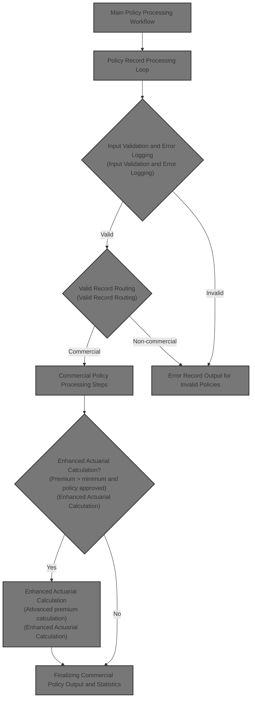

## Dependencies

### Programs

- <SwmToken path="base/src/lgapol01.cbl" pos="2:6:6" line-data="       PROGRAM-ID. LGAPOL01.">`LGAPOL01`</SwmToken> (<SwmPath>[base/src/lgapol01.cbl](base/src/lgapol01.cbl)</SwmPath>)
- <SwmToken path="base/src/lgapol01.cbl" pos="103:9:9" line-data="           EXEC CICS Link Program(LGAPDB01)">`LGAPDB01`</SwmToken> (<SwmPath>[base/src/LGAPDB01.cbl](base/src/LGAPDB01.cbl)</SwmPath>)
- <SwmToken path="base/src/LGAPDB01.cbl" pos="269:4:4" line-data="           CALL &#39;LGAPDB02&#39; USING IN-PROPERTY-TYPE, IN-POSTCODE, ">`LGAPDB02`</SwmToken>
- <SwmToken path="base/src/LGAPDB01.cbl" pos="276:4:4" line-data="           CALL &#39;LGAPDB03&#39; USING WS-BASE-RISK-SCR, IN-FIRE-PERIL, ">`LGAPDB03`</SwmToken> (<SwmPath>[base/src/LGAPDB03.cbl](base/src/LGAPDB03.cbl)</SwmPath>)
- <SwmToken path="base/src/LGAPDB01.cbl" pos="313:4:4" line-data="               CALL &#39;LGAPDB04&#39; USING LK-INPUT-DATA, LK-COVERAGE-DATA, ">`LGAPDB04`</SwmToken> (<SwmPath>[base/src/LGAPDB04.cbl](base/src/LGAPDB04.cbl)</SwmPath>)
- LGSTSQ (<SwmPath>[base/src/lgstsq.cbl](base/src/lgstsq.cbl)</SwmPath>)

### Copybooks

- SQLCA
- <SwmToken path="base/src/LGAPDB01.cbl" pos="35:3:3" line-data="           COPY INPUTREC2.">`INPUTREC2`</SwmToken> (<SwmPath>[base/src/INPUTREC2.cpy](base/src/INPUTREC2.cpy)</SwmPath>)
- OUTPUTREC (<SwmPath>[base/src/OUTPUTREC.cpy](base/src/OUTPUTREC.cpy)</SwmPath>)
- WORKSTOR (<SwmPath>[base/src/WORKSTOR.cpy](base/src/WORKSTOR.cpy)</SwmPath>)
- LGAPACT (<SwmPath>[base/src/LGAPACT.cpy](base/src/LGAPACT.cpy)</SwmPath>)
- LGCMAREA (<SwmPath>[base/src/lgcmarea.cpy](base/src/lgcmarea.cpy)</SwmPath>)

# Where is this program used?

This program is used multiple times in the codebase as represented in the following diagram:

```mermaid
graph TD
  gzt5y("Managing Commercial Insurance Policies (LGTESTP4)") --> ocmhc("Handling Insurance Policy Data Inserts (LGAPOL01)"):::currentEntity
click gzt5y openCode "base/src/lgtestp4.cbl:1"
zz6zy("Endowment Policy Menu (LGTESTP2)") --> ocmhc("Handling Insurance Policy Data Inserts (LGAPOL01)"):::currentEntity
click zz6zy openCode "base/src/lgtestp2.cbl:1"
4ii8i("Motor Policy Menu (LGTESTP1)") --> ocmhc("Handling Insurance Policy Data Inserts (LGAPOL01)"):::currentEntity
click 4ii8i openCode "base/src/lgtestp1.cbl:1"
k19lv("House Policy Menu (LGTESTP3)") --> ocmhc("Handling Insurance Policy Data Inserts (LGAPOL01)"):::currentEntity
click k19lv openCode "base/src/lgtestp3.cbl:1"
  
  
click ocmhc openCode "base/src/lgapol01.cbl:1"
    classDef currentEntity color:#000000,fill:#7CB9F4

%% Swimm:
%% graph TD
%%   gzt5y("Managing Commercial Insurance Policies (LGTESTP4)") --> ocmhc("Handling Insurance Policy Data Inserts (<SwmToken path="base/src/lgapol01.cbl" pos="2:6:6" line-data="       PROGRAM-ID. LGAPOL01.">`LGAPOL01`</SwmToken>)"):::currentEntity
%% click gzt5y openCode "<SwmPath>[base/src/lgtestp4.cbl](base/src/lgtestp4.cbl)</SwmPath>:1"
%% zz6zy("Endowment Policy Menu (LGTESTP2)") --> ocmhc("Handling Insurance Policy Data Inserts (<SwmToken path="base/src/lgapol01.cbl" pos="2:6:6" line-data="       PROGRAM-ID. LGAPOL01.">`LGAPOL01`</SwmToken>)"):::currentEntity
%% click zz6zy openCode "<SwmPath>[base/src/lgtestp2.cbl](base/src/lgtestp2.cbl)</SwmPath>:1"
%% 4ii8i("Motor Policy Menu (LGTESTP1)") --> ocmhc("Handling Insurance Policy Data Inserts (<SwmToken path="base/src/lgapol01.cbl" pos="2:6:6" line-data="       PROGRAM-ID. LGAPOL01.">`LGAPOL01`</SwmToken>)"):::currentEntity
%% click 4ii8i openCode "<SwmPath>[base/src/lgtestp1.cbl](base/src/lgtestp1.cbl)</SwmPath>:1"
%% k19lv("House Policy Menu (LGTESTP3)") --> ocmhc("Handling Insurance Policy Data Inserts (<SwmToken path="base/src/lgapol01.cbl" pos="2:6:6" line-data="       PROGRAM-ID. LGAPOL01.">`LGAPOL01`</SwmToken>)"):::currentEntity
%% click k19lv openCode "<SwmPath>[base/src/lgtestp3.cbl](base/src/lgtestp3.cbl)</SwmPath>:1"
%%   
%%   
%% click ocmhc openCode "<SwmPath>[base/src/lgapol01.cbl](base/src/lgapol01.cbl)</SwmPath>:1"
%%     classDef currentEntity color:#000000,fill:#7CB9F4
```

## Detailed View of the Program's Functionality

a. Startup and Input Validation

The application begins by establishing the CICS transaction context, capturing key identifiers such as transaction ID, terminal ID, task number, and the length of the communication area (commarea). This context is stored for use throughout the transaction. The code then checks if any input data (commarea) was provided. If not, it logs an error message with a timestamp and abends (terminates abnormally) the transaction, ensuring that missing input is always recorded for audit and debugging purposes.

If input data is present, the code initializes the return code to indicate success and sets up a pointer to the commarea. It then checks if the input data is at least as long as required for processing. If the input is too short, it sets an error code and returns immediately, preventing further processing of incomplete or malformed data.

b. Error Logging and Message Routing

When an error is detected, the application constructs a detailed error message that includes the current date and time (retrieved and formatted from CICS), the program name, and a description of the error. This message is then sent to a logging routine, which writes it to both a transient data queue (for operational logs) and a temporary storage queue (for application-specific logs).

If the error is related to input data, the application also logs up to 90 bytes of the commarea for additional context. The logging routine determines whether the message originated from a program call or a CICS RECEIVE command, adjusts the message format if necessary, and ensures that the message is routed to the correct queues. If the message was received interactively, it sends a dummy response and frees the keyboard.

c. Main Policy Processing Workflow

After input validation, the application links to the main policy processing module. This module performs several sequential steps:

1. Initializes the processing environment, counters, and working storage.
2. Loads business configuration settings, either from a configuration file or by falling back to defaults if the file is missing.
3. Opens all necessary files for input, output, configuration, rates, and summary data.
4. Processes each insurance policy record in a loop, reading one record at a time, validating it, and routing it to the appropriate processing path (valid or error).
5. Closes all files after processing is complete.
6. Generates a summary report of the processing run, including totals and statistics.
7. Displays business statistics to the operator or log.

d. Configuration Loading and Defaults

During configuration loading, the application attempts to open and read a configuration file. If the file is not available, it logs a warning and uses hardcoded default values for key parameters such as maximum risk score and minimum premium. If the file is present, it reads specific configuration values, checks that they are numeric, and updates the in-memory settings accordingly. This allows for business rules to be changed without modifying the code.

e. Policy Record Processing Loop

For each input policy record, the application performs the following steps:

1. Reads the next record from the input file.
2. Validates the record by checking policy type, customer number, and coverage limits. It logs errors for invalid policy types, missing customer numbers, or missing coverage limits. If the total coverage exceeds a maximum threshold, it logs a warning.
3. If the record passes validation, it is routed to the appropriate processing routine (commercial or non-commercial). Only commercial policies are fully processed; others are marked as unsupported.
4. If the record fails validation, an error record is written to the output, with all premium and risk fields set to zero and the first error message included as the rejection reason.

f. Commercial Policy Processing Steps

For valid commercial policies, the application performs a series of calculations:

1. Calculates a base risk score using a dedicated risk scoring module.
2. Performs a basic premium calculation by calling a separate module that retrieves risk factors (from the database or defaults) and computes premiums for each peril (fire, crime, flood, weather) based on the risk score and peril selections.
3. Determines the underwriting verdict (approved, pending, or rejected) based on the risk score, setting status and rejection reasons accordingly.
4. If the policy is approved and the total premium exceeds the minimum, it performs an enhanced actuarial calculation using a more sophisticated module. This module considers additional factors such as years in business, claims history, building characteristics, and applies advanced modifiers and loadings.
5. If the enhanced premium is greater than the original, the policy is updated with the enhanced premium components and experience modifier.
6. Applies business rules to finalize the underwriting decision, potentially overriding the previous verdict based on updated risk score or premium.
7. Writes the processed policy to the output file and updates running statistics, including totals for premiums, risk scores, and counts of approved, pending, rejected, and high-risk policies.

g. Actuarial Premium Calculation Steps

The enhanced actuarial calculation module performs the following:

 1. Initializes all calculation work areas and loads base rates from the database or defaults.
 2. Calculates exposures for building, contents, and business interruption, adjusting for risk score.
 3. Computes the experience modifier based on years in business and claims history, clamping the result within a specified range.
 4. Calculates a schedule modifier based on building age, protection class, occupancy, and exposure density, also clamped within limits.
 5. Computes base premiums for each selected peril using multi-dimensional rate tables and business-specific multipliers.
 6. Adds catastrophe loadings for hurricane, earthquake, tornado, and flood, depending on peril selections.
 7. Calculates expense and profit loadings.
 8. Applies discounts for multi-peril coverage, claims-free history, and high deductibles, capping the total discount.
 9. Calculates taxes on the premium.
10. Sums all components to produce the final premium, calculates the rate factor, and caps it if necessary, recalculating the premium if the cap is applied.

h. Finalizing Output and Statistics

After processing each policy, the application writes the results to the output file, including all calculated premiums, risk scores, status, and rejection reasons. It updates running totals and counters for reporting. At the end of processing, it generates a summary file and displays key statistics, such as the number of records processed, approved, pending, rejected, error records, high-risk count, total premium generated, and average risk score.

i. Error Record Output for Invalid Policies

For records that fail validation, the application writes an error record to the output file. This record includes the key input fields, sets all premium and risk fields to zero, marks the status as "ERROR," and includes the first error message as the rejection reason. The error count is incremented for reporting purposes.

# Rule Definition

| Paragraph Name                                                                                                                                                                                                                                                                                                                                                                                                                                                                                                                                                                                                                                                                                                                                                                                                                                                                                                                                                                                                                                                                                                                   | Rule ID | Category          | Description                                                                                                                                                                                                                                                                                                                | Conditions                                                                         | Remarks                                                                                                                                                                                                                                                                                                                                                                                                                                                                                                                                                                                                                                                                                                                                                                 |
| -------------------------------------------------------------------------------------------------------------------------------------------------------------------------------------------------------------------------------------------------------------------------------------------------------------------------------------------------------------------------------------------------------------------------------------------------------------------------------------------------------------------------------------------------------------------------------------------------------------------------------------------------------------------------------------------------------------------------------------------------------------------------------------------------------------------------------------------------------------------------------------------------------------------------------------------------------------------------------------------------------------------------------------------------------------------------------------------------------------------------------- | ------- | ----------------- | -------------------------------------------------------------------------------------------------------------------------------------------------------------------------------------------------------------------------------------------------------------------------------------------------------------------------- | ---------------------------------------------------------------------------------- | ----------------------------------------------------------------------------------------------------------------------------------------------------------------------------------------------------------------------------------------------------------------------------------------------------------------------------------------------------------------------------------------------------------------------------------------------------------------------------------------------------------------------------------------------------------------------------------------------------------------------------------------------------------------------------------------------------------------------------------------------------------------------- |
| <SwmToken path="base/src/LGAPDB01.cbl" pos="182:3:9" line-data="               PERFORM P008-VALIDATE-INPUT-RECORD">`P008-VALIDATE-INPUT-RECORD`</SwmToken>                                                                                                                                                                                                                                                                                                                                                                                                                                                                                                                                                                                                                                                                                                                                                                                                                                                                                                                                                                       | RL-001  | Conditional Logic | Policy type must be one of COMMERCIAL, PERSONAL, or FARM. If not, log an error.                                                                                                                                                                                                                                            | Input record's policy type field must match one of the allowed values.             | Allowed values: 'COMMERCIAL', 'PERSONAL', 'FARM'. Error message includes code <SwmToken path="base/src/LGAPDB01.cbl" pos="202:2:2" line-data="                   &#39;POL001&#39; &#39;F&#39; &#39;IN-POLICY-TYPE&#39; ">`POL001`</SwmToken>, severity 'F', field name, and message 'Invalid Policy Type'.                                                                                                                                                                                                                                                                                                                                                                                                                                                              |
| <SwmToken path="base/src/LGAPDB01.cbl" pos="182:3:9" line-data="               PERFORM P008-VALIDATE-INPUT-RECORD">`P008-VALIDATE-INPUT-RECORD`</SwmToken>                                                                                                                                                                                                                                                                                                                                                                                                                                                                                                                                                                                                                                                                                                                                                                                                                                                                                                                                                                       | RL-002  | Conditional Logic | Customer number must be present in the input record.                                                                                                                                                                                                                                                                       | Customer number field must not be blank.                                           | Error message includes code <SwmToken path="base/src/LGAPDB01.cbl" pos="208:2:2" line-data="                   &#39;CUS001&#39; &#39;F&#39; &#39;IN-CUSTOMER-NUM&#39; ">`CUS001`</SwmToken>, severity 'F', field name, and message 'Customer Number Required'.                                                                                                                                                                                                                                                                                                                                                                                                                                                                                                          |
| <SwmToken path="base/src/LGAPDB01.cbl" pos="182:3:9" line-data="               PERFORM P008-VALIDATE-INPUT-RECORD">`P008-VALIDATE-INPUT-RECORD`</SwmToken>                                                                                                                                                                                                                                                                                                                                                                                                                                                                                                                                                                                                                                                                                                                                                                                                                                                                                                                                                                       | RL-003  | Conditional Logic | At least one coverage limit (Building, Contents, BI) must be specified and non-zero.                                                                                                                                                                                                                                       | Building, Contents, or BI limit must be greater than zero.                         | Error message includes code <SwmToken path="base/src/LGAPDB01.cbl" pos="215:2:2" line-data="                   &#39;COV001&#39; &#39;F&#39; &#39;COVERAGE-LIMITS&#39; ">`COV001`</SwmToken>, severity 'F', field name, and message 'At least one coverage limit required'.                                                                                                                                                                                                                                                                                                                                                                                                                                                                                              |
| <SwmToken path="base/src/LGAPDB01.cbl" pos="182:3:9" line-data="               PERFORM P008-VALIDATE-INPUT-RECORD">`P008-VALIDATE-INPUT-RECORD`</SwmToken>                                                                                                                                                                                                                                                                                                                                                                                                                                                                                                                                                                                                                                                                                                                                                                                                                                                                                                                                                                       | RL-004  | Conditional Logic | The sum of all coverage limits must not exceed $50,000,000.                                                                                                                                                                                                                                                                | Sum of Building, Contents, and BI limits must be less than or equal to 50,000,000. | Maximum TIV constant: 50,000,000. Error message includes code <SwmToken path="base/src/LGAPDB01.cbl" pos="222:2:2" line-data="                   &#39;COV002&#39; &#39;W&#39; &#39;COVERAGE-LIMITS&#39; ">`COV002`</SwmToken>, severity 'W', field name, and message 'Total coverage exceeds maximum TIV'.                                                                                                                                                                                                                                                                                                                                                                                                                                                              |
| <SwmToken path="base/src/LGAPDB01.cbl" pos="201:3:7" line-data="               PERFORM P008A-LOG-ERROR WITH ">`P008A-LOG-ERROR`</SwmToken>, <SwmToken path="base/src/lgapol01.cbl" pos="85:3:5" line-data="               PERFORM P999-ERROR">`P999-ERROR`</SwmToken> (<SwmPath>[base/src/lgapol01.cbl](base/src/lgapol01.cbl)</SwmPath>), MAINLINE SECTION (<SwmPath>[base/src/lgstsq.cbl](base/src/lgstsq.cbl)</SwmPath>)                                                                                                                                                                                                                                                                                                                                                                                                                                                                                                                                                                                                                                                                                                      | RL-005  | Data Assignment   | For invalid records, log an error message including date, time, program name, error detail, and up to 90 bytes of the input record.                                                                                                                                                                                        | Triggered when any validation fails.                                               | Error log format: date (8 chars), time (6 chars), program name (9 chars), error detail (21 chars), up to 90 bytes of input record. Output to error log file or queue.                                                                                                                                                                                                                                                                                                                                                                                                                                                                                                                                                                                                   |
| <SwmToken path="base/src/LGAPDB01.cbl" pos="259:3:9" line-data="           PERFORM P011A-CALCULATE-RISK-SCORE">`P011A-CALCULATE-RISK-SCORE`</SwmToken>, <SwmToken path="base/src/LGAPDB03.cbl" pos="43:3:7" line-data="           PERFORM GET-RISK-FACTORS">`GET-RISK-FACTORS`</SwmToken> (<SwmPath>[base/src/LGAPDB03.cbl](base/src/LGAPDB03.cbl)</SwmPath>)                                                                                                                                                                                                                                                                                                                                                                                                                                                                                                                                                                                                                                                                                                                                                                    | RL-006  | Computation       | Calculate risk score using risk factors for FIRE and CRIME perils, retrieved from database or file. Use defaults if not found.                                                                                                                                                                                             | Policy type is COMMERCIAL and record is valid.                                     | Default fire factor: <SwmToken path="base/src/LGAPDB03.cbl" pos="58:3:5" line-data="               MOVE 0.80 TO WS-FIRE-FACTOR">`0.80`</SwmToken>, crime factor: <SwmToken path="base/src/LGAPDB03.cbl" pos="70:3:5" line-data="               MOVE 0.60 TO WS-CRIME-FACTOR">`0.60`</SwmToken>. Factors retrieved from database or <SwmToken path="base/src/LGAPDB01.cbl" pos="23:12:14" line-data="           SELECT RATE-FILE ASSIGN TO &#39;RATES.DAT&#39;">`RATES.DAT`</SwmToken>.                                                                                                                                                                                                                                                                                  |
| <SwmToken path="base/src/LGAPDB03.cbl" pos="44:3:5" line-data="           PERFORM CALCULATE-VERDICT">`CALCULATE-VERDICT`</SwmToken> (<SwmPath>[base/src/LGAPDB03.cbl](base/src/LGAPDB03.cbl)</SwmPath>), <SwmToken path="base/src/LGAPDB01.cbl" pos="264:3:9" line-data="           PERFORM P011D-APPLY-BUSINESS-RULES">`P011D-APPLY-BUSINESS-RULES`</SwmToken>                                                                                                                                                                                                                                                                                                                                                                                                                                                                                                                                                                                                                                                                                                                                                                  | RL-007  | Conditional Logic | Classify risk score: >200=REJECTED, 151-200=PENDING, <=150=APPROVED.                                                                                                                                                                                                                                                       | Risk score is calculated for a commercial policy.                                  | Status values: 2=REJECTED, 1=PENDING, 0=APPROVED. Reasons: 'High Risk Score - Manual Review Required', 'Medium Risk - Pending Review', blank for approved.                                                                                                                                                                                                                                                                                                                                                                                                                                                                                                                                                                                                              |
| <SwmToken path="base/src/LGAPDB03.cbl" pos="45:3:5" line-data="           PERFORM CALCULATE-PREMIUMS">`CALCULATE-PREMIUMS`</SwmToken> (<SwmPath>[base/src/LGAPDB03.cbl](base/src/LGAPDB03.cbl)</SwmPath>), <SwmToken path="base/src/LGAPDB01.cbl" pos="260:3:9" line-data="           PERFORM P011B-BASIC-PREMIUM-CALC">`P011B-BASIC-PREMIUM-CALC`</SwmToken>, <SwmToken path="base/src/LGAPDB04.cbl" pos="144:3:7" line-data="           PERFORM P600-BASE-PREM">`P600-BASE-PREM`</SwmToken> (<SwmPath>[base/src/LGAPDB04.cbl](base/src/LGAPDB04.cbl)</SwmPath>)                                                                                                                                                                                                                                                                                                                                                                                                                                                                                                                                                                | RL-008  | Computation       | Calculate basic premiums for Fire, Crime, Flood, Weather perils using rate tables and business multipliers.                                                                                                                                                                                                                | Policy is commercial and valid.                                                    | Premiums calculated using risk score, peril factors, rate tables, and multipliers. Output fields: Fire Premium, Crime Premium, Flood Premium, Weather Premium, Total Premium.                                                                                                                                                                                                                                                                                                                                                                                                                                                                                                                                                                                           |
| <SwmToken path="base/src/LGAPDB01.cbl" pos="262:3:9" line-data="               PERFORM P011C-ENHANCED-ACTUARIAL-CALC">`P011C-ENHANCED-ACTUARIAL-CALC`</SwmToken>, <SwmToken path="base/src/LGAPDB04.cbl" pos="142:3:7" line-data="           PERFORM P400-EXP-MOD">`P400-EXP-MOD`</SwmToken>, <SwmToken path="base/src/LGAPDB04.cbl" pos="143:3:7" line-data="           PERFORM P500-SCHED-MOD">`P500-SCHED-MOD`</SwmToken>, <SwmToken path="base/src/LGAPDB04.cbl" pos="145:3:7" line-data="           PERFORM P700-CAT-LOAD">`P700-CAT-LOAD`</SwmToken>, <SwmToken path="base/src/LGAPDB04.cbl" pos="146:3:5" line-data="           PERFORM P800-EXPENSE">`P800-EXPENSE`</SwmToken>, <SwmToken path="base/src/LGAPDB04.cbl" pos="147:3:5" line-data="           PERFORM P900-DISC">`P900-DISC`</SwmToken>, <SwmToken path="base/src/LGAPDB04.cbl" pos="148:3:5" line-data="           PERFORM P950-TAXES">`P950-TAXES`</SwmToken>, <SwmToken path="base/src/LGAPDB04.cbl" pos="149:3:5" line-data="           PERFORM P999-FINAL">`P999-FINAL`</SwmToken> (<SwmPath>[base/src/LGAPDB04.cbl](base/src/LGAPDB04.cbl)</SwmPath>) | RL-009  | Computation       | If policy is approved and total premium exceeds minimum, perform enhanced actuarial premium calculation using experience modifier, schedule modifier, catastrophe loadings, and discounts.                                                                                                                                 | Policy is approved and total premium > minimum premium.                            | Minimum premium from config or default (<SwmToken path="base/src/LGAPDB04.cbl" pos="300:11:13" line-data="           IF WS-EXPOSURE-DENSITY &gt; 500.00">`500.00`</SwmToken>). Experience modifier: 0.85 (>=5 years, 0 claims), 1.10 (<5 years), else calculated and clamped 0.5-2.0. Schedule modifier clamped -0.2 to +0.4. Exposure density adjustment: >500 add 0.10, <50 subtract 0.05. Catastrophe loadings added for selected perils. Final rate factor capped at 0.05. Premium recalculated if capped.                                                                                                                                                                                                                                                          |
| <SwmToken path="base/src/LGAPDB01.cbl" pos="265:3:9" line-data="           PERFORM P011E-WRITE-OUTPUT-RECORD">`P011E-WRITE-OUTPUT-RECORD`</SwmToken>                                                                                                                                                                                                                                                                                                                                                                                                                                                                                                                                                                                                                                                                                                                                                                                                                                                                                                                                                                             | RL-010  | Data Assignment   | Write output record to <SwmToken path="base/src/LGAPDB01.cbl" pos="13:12:14" line-data="           SELECT OUTPUT-FILE ASSIGN TO &#39;OUTPUT.DAT&#39;">`OUTPUT.DAT`</SwmToken> with specified fields for each processed record.                                                                                             | Policy record is processed (valid or error).                                       | Fields: Customer Number (string, 10 chars), Property Type (string, 15 chars), Postcode (string, 8 chars), Risk Score (number, 3 digits), Fire Premium (number, 10 digits, 2 decimals), Crime Premium (same), Flood Premium (same), Weather Premium (same), Total Premium (number, 11 digits, 2 decimals), Status (string, 10 chars), Rejection Reason (string, 50 chars). Field order and types must match spec.                                                                                                                                                                                                                                                                                                                                                        |
| <SwmToken path="base/src/LGAPDB01.cbl" pos="186:3:9" line-data="                   PERFORM P010-PROCESS-ERROR-RECORD">`P010-PROCESS-ERROR-RECORD`</SwmToken>                                                                                                                                                                                                                                                                                                                                                                                                                                                                                                                                                                                                                                                                                                                                                                                                                                                                                                                                                                     | RL-011  | Data Assignment   | For error records, output key input fields, zeroed premium and risk fields, status 'ERROR', and first error message as rejection reason.                                                                                                                                                                                   | Record failed validation.                                                          | Fields: Customer Number, Property Type, Postcode, Risk Score=0, all premiums=0, Status='ERROR', Rejection Reason=first error message. Field order and types as above.                                                                                                                                                                                                                                                                                                                                                                                                                                                                                                                                                                                                   |
| <SwmToken path="base/src/LGAPDB01.cbl" pos="92:3:7" line-data="           PERFORM P003-LOAD-CONFIG">`P003-LOAD-CONFIG`</SwmToken>, <SwmToken path="base/src/LGAPDB01.cbl" pos="116:3:7" line-data="               PERFORM P004-SET-DEFAULTS">`P004-SET-DEFAULTS`</SwmToken>, <SwmToken path="base/src/LGAPDB01.cbl" pos="118:3:9" line-data="               PERFORM P004-READ-CONFIG-VALUES">`P004-READ-CONFIG-VALUES`</SwmToken>                                                                                                                                                                                                                                                                                                                                                                                                                                                                                                                                                                                                                                                                                                | RL-012  | Conditional Logic | Read configuration values from <SwmToken path="base/src/LGAPDB01.cbl" pos="17:12:14" line-data="           SELECT CONFIG-FILE ASSIGN TO &#39;CONFIG.DAT&#39;">`CONFIG.DAT`</SwmToken>. If missing or not numeric, use default values.                                                                                      | On program initialization.                                                         | Config keys: <SwmToken path="base/src/LGAPDB01.cbl" pos="126:4:4" line-data="           MOVE &#39;MAX_RISK_SCORE&#39; TO CONFIG-KEY">`MAX_RISK_SCORE`</SwmToken>, <SwmToken path="base/src/LGAPDB01.cbl" pos="132:4:4" line-data="           MOVE &#39;MIN_PREMIUM&#39; TO CONFIG-KEY">`MIN_PREMIUM`</SwmToken>. Defaults: <SwmToken path="base/src/LGAPDB01.cbl" pos="126:4:4" line-data="           MOVE &#39;MAX_RISK_SCORE&#39; TO CONFIG-KEY">`MAX_RISK_SCORE`</SwmToken>=250, <SwmToken path="base/src/LGAPDB01.cbl" pos="132:4:4" line-data="           MOVE &#39;MIN_PREMIUM&#39; TO CONFIG-KEY">`MIN_PREMIUM`</SwmToken>=<SwmToken path="base/src/LGAPDB04.cbl" pos="300:11:13" line-data="           IF WS-EXPOSURE-DENSITY &gt; 500.00">`500.00`</SwmToken>. |
| <SwmToken path="base/src/LGAPDB04.cbl" pos="179:1:5" line-data="       LOAD-RATE-TABLES.">`LOAD-RATE-TABLES`</SwmToken>, <SwmToken path="base/src/LGAPDB04.cbl" pos="200:3:7" line-data="           PERFORM P310-PERIL-RATES VARYING RATE-IDX FROM 2 BY 1 ">`P310-PERIL-RATES`</SwmToken> (<SwmPath>[base/src/LGAPDB04.cbl](base/src/LGAPDB04.cbl)</SwmPath>)                                                                                                                                                                                                                                                                                                                                                                                                                                                                                                                                                                                                                                                                                                                                                                    | RL-013  | Data Assignment   | Read rate tables from <SwmToken path="base/src/LGAPDB01.cbl" pos="23:12:14" line-data="           SELECT RATE-FILE ASSIGN TO &#39;RATES.DAT&#39;">`RATES.DAT`</SwmToken> or database, with records containing Territory, Construction, Occupancy, Peril, Base Rate, Min Premium, Max Premium, Effective Date, Expiry Date. | On premium calculation for each peril.                                             | Fields: Territory (string, 5 chars), Construction (string, 3 chars), Occupancy (string, 5 chars), Peril (string, 2 chars), Base Rate (number, 7 digits, 6 decimals), Min Premium (number, 8 digits, 2 decimals), Max Premium (number, 9 digits, 2 decimals), Effective Date (date, 8 digits), Expiry Date (date, 8 digits).                                                                                                                                                                                                                                                                                                                                                                                                                                             |
| <SwmToken path="base/src/LGAPDB01.cbl" pos="96:3:7" line-data="           PERFORM P015-GENERATE-SUMMARY">`P015-GENERATE-SUMMARY`</SwmToken>                                                                                                                                                                                                                                                                                                                                                                                                                                                                                                                                                                                                                                                                                                                                                                                                                                                                                                                                                                                      | RL-014  | Data Assignment   | Generate <SwmToken path="base/src/LGAPDB01.cbl" pos="27:12:14" line-data="           SELECT SUMMARY-FILE ASSIGN TO &#39;SUMMARY.DAT&#39;">`SUMMARY.DAT`</SwmToken> with processing date, total records processed, policies approved, pending, rejected, total premium amount, and average risk score.                      | At end of processing.                                                              | Fields: Processing Date (8 digits), Total Records Processed (number), Policies Approved (number), Policies Pending (number), Policies Rejected (number), Total Premium Amount (number, 14 digits, 2 decimals), Average Risk Score (number, 5 digits, 2 decimals).                                                                                                                                                                                                                                                                                                                                                                                                                                                                                                       |

# User Stories

## User Story 1: Validate input records and handle errors

---

### Story Description:

As an insurance system, I want to validate each input policy record and log detailed errors for invalid records so that only correct data is processed and issues can be tracked and resolved.

---

### Business Rule Mapping:

| Rule ID | Paragraph Name                                                                                                                                                                                                                                                                                                                                                                                                              | Rule Description                                                                                                                    |
| ------- | --------------------------------------------------------------------------------------------------------------------------------------------------------------------------------------------------------------------------------------------------------------------------------------------------------------------------------------------------------------------------------------------------------------------------- | ----------------------------------------------------------------------------------------------------------------------------------- |
| RL-001  | <SwmToken path="base/src/LGAPDB01.cbl" pos="182:3:9" line-data="               PERFORM P008-VALIDATE-INPUT-RECORD">`P008-VALIDATE-INPUT-RECORD`</SwmToken>                                                                                                                                                                                                                                                                  | Policy type must be one of COMMERCIAL, PERSONAL, or FARM. If not, log an error.                                                     |
| RL-002  | <SwmToken path="base/src/LGAPDB01.cbl" pos="182:3:9" line-data="               PERFORM P008-VALIDATE-INPUT-RECORD">`P008-VALIDATE-INPUT-RECORD`</SwmToken>                                                                                                                                                                                                                                                                  | Customer number must be present in the input record.                                                                                |
| RL-003  | <SwmToken path="base/src/LGAPDB01.cbl" pos="182:3:9" line-data="               PERFORM P008-VALIDATE-INPUT-RECORD">`P008-VALIDATE-INPUT-RECORD`</SwmToken>                                                                                                                                                                                                                                                                  | At least one coverage limit (Building, Contents, BI) must be specified and non-zero.                                                |
| RL-004  | <SwmToken path="base/src/LGAPDB01.cbl" pos="182:3:9" line-data="               PERFORM P008-VALIDATE-INPUT-RECORD">`P008-VALIDATE-INPUT-RECORD`</SwmToken>                                                                                                                                                                                                                                                                  | The sum of all coverage limits must not exceed $50,000,000.                                                                         |
| RL-005  | <SwmToken path="base/src/LGAPDB01.cbl" pos="201:3:7" line-data="               PERFORM P008A-LOG-ERROR WITH ">`P008A-LOG-ERROR`</SwmToken>, <SwmToken path="base/src/lgapol01.cbl" pos="85:3:5" line-data="               PERFORM P999-ERROR">`P999-ERROR`</SwmToken> (<SwmPath>[base/src/lgapol01.cbl](base/src/lgapol01.cbl)</SwmPath>), MAINLINE SECTION (<SwmPath>[base/src/lgstsq.cbl](base/src/lgstsq.cbl)</SwmPath>) | For invalid records, log an error message including date, time, program name, error detail, and up to 90 bytes of the input record. |

---

### Relevant Functionality:

- <SwmToken path="base/src/LGAPDB01.cbl" pos="182:3:9" line-data="               PERFORM P008-VALIDATE-INPUT-RECORD">`P008-VALIDATE-INPUT-RECORD`</SwmToken>
  1. **RL-001:**
     - If policy type is not COMMERCIAL, PERSONAL, or FARM:
       - Log error with code, severity, field, and message.
  2. **RL-002:**
     - If customer number is blank:
       - Log error with code, severity, field, and message.
  3. **RL-003:**
     - If all coverage limits are zero:
       - Log error with code, severity, field, and message.
  4. **RL-004:**
     - If sum of coverage limits > 50,000,000:
       - Log error with code, severity, field, and message.
- <SwmToken path="base/src/LGAPDB01.cbl" pos="201:3:7" line-data="               PERFORM P008A-LOG-ERROR WITH ">`P008A-LOG-ERROR`</SwmToken>
  1. **RL-005:**
     - On error:
       - Format message with date, time, program name, error detail.
       - Include up to 90 bytes of input record.
       - Write to error log file or queue.

## User Story 2: Process commercial policies and calculate premiums

---

### Story Description:

As an insurance system, I want to process valid commercial policy records by calculating risk scores, classifying risk, and determining basic and enhanced premiums so that accurate underwriting decisions and premium amounts are produced.

---

### Business Rule Mapping:

| Rule ID | Paragraph Name                                                                                                                                                                                                                                                                                                                                                                                                                                                                                                                                                                                                                                                                                                                                                                                                                                                                                                                                                                                                                                                                                                                   | Rule Description                                                                                                                                                                           |
| ------- | -------------------------------------------------------------------------------------------------------------------------------------------------------------------------------------------------------------------------------------------------------------------------------------------------------------------------------------------------------------------------------------------------------------------------------------------------------------------------------------------------------------------------------------------------------------------------------------------------------------------------------------------------------------------------------------------------------------------------------------------------------------------------------------------------------------------------------------------------------------------------------------------------------------------------------------------------------------------------------------------------------------------------------------------------------------------------------------------------------------------------------- | ------------------------------------------------------------------------------------------------------------------------------------------------------------------------------------------ |
| RL-009  | <SwmToken path="base/src/LGAPDB01.cbl" pos="262:3:9" line-data="               PERFORM P011C-ENHANCED-ACTUARIAL-CALC">`P011C-ENHANCED-ACTUARIAL-CALC`</SwmToken>, <SwmToken path="base/src/LGAPDB04.cbl" pos="142:3:7" line-data="           PERFORM P400-EXP-MOD">`P400-EXP-MOD`</SwmToken>, <SwmToken path="base/src/LGAPDB04.cbl" pos="143:3:7" line-data="           PERFORM P500-SCHED-MOD">`P500-SCHED-MOD`</SwmToken>, <SwmToken path="base/src/LGAPDB04.cbl" pos="145:3:7" line-data="           PERFORM P700-CAT-LOAD">`P700-CAT-LOAD`</SwmToken>, <SwmToken path="base/src/LGAPDB04.cbl" pos="146:3:5" line-data="           PERFORM P800-EXPENSE">`P800-EXPENSE`</SwmToken>, <SwmToken path="base/src/LGAPDB04.cbl" pos="147:3:5" line-data="           PERFORM P900-DISC">`P900-DISC`</SwmToken>, <SwmToken path="base/src/LGAPDB04.cbl" pos="148:3:5" line-data="           PERFORM P950-TAXES">`P950-TAXES`</SwmToken>, <SwmToken path="base/src/LGAPDB04.cbl" pos="149:3:5" line-data="           PERFORM P999-FINAL">`P999-FINAL`</SwmToken> (<SwmPath>[base/src/LGAPDB04.cbl](base/src/LGAPDB04.cbl)</SwmPath>) | If policy is approved and total premium exceeds minimum, perform enhanced actuarial premium calculation using experience modifier, schedule modifier, catastrophe loadings, and discounts. |
| RL-006  | <SwmToken path="base/src/LGAPDB01.cbl" pos="259:3:9" line-data="           PERFORM P011A-CALCULATE-RISK-SCORE">`P011A-CALCULATE-RISK-SCORE`</SwmToken>, <SwmToken path="base/src/LGAPDB03.cbl" pos="43:3:7" line-data="           PERFORM GET-RISK-FACTORS">`GET-RISK-FACTORS`</SwmToken> (<SwmPath>[base/src/LGAPDB03.cbl](base/src/LGAPDB03.cbl)</SwmPath>)                                                                                                                                                                                                                                                                                                                                                                                                                                                                                                                                                                                                                                                                                                                                                                    | Calculate risk score using risk factors for FIRE and CRIME perils, retrieved from database or file. Use defaults if not found.                                                             |
| RL-007  | <SwmToken path="base/src/LGAPDB03.cbl" pos="44:3:5" line-data="           PERFORM CALCULATE-VERDICT">`CALCULATE-VERDICT`</SwmToken> (<SwmPath>[base/src/LGAPDB03.cbl](base/src/LGAPDB03.cbl)</SwmPath>), <SwmToken path="base/src/LGAPDB01.cbl" pos="264:3:9" line-data="           PERFORM P011D-APPLY-BUSINESS-RULES">`P011D-APPLY-BUSINESS-RULES`</SwmToken>                                                                                                                                                                                                                                                                                                                                                                                                                                                                                                                                                                                                                                                                                                                                                                  | Classify risk score: >200=REJECTED, 151-200=PENDING, <=150=APPROVED.                                                                                                                       |
| RL-008  | <SwmToken path="base/src/LGAPDB03.cbl" pos="45:3:5" line-data="           PERFORM CALCULATE-PREMIUMS">`CALCULATE-PREMIUMS`</SwmToken> (<SwmPath>[base/src/LGAPDB03.cbl](base/src/LGAPDB03.cbl)</SwmPath>), <SwmToken path="base/src/LGAPDB01.cbl" pos="260:3:9" line-data="           PERFORM P011B-BASIC-PREMIUM-CALC">`P011B-BASIC-PREMIUM-CALC`</SwmToken>, <SwmToken path="base/src/LGAPDB04.cbl" pos="144:3:7" line-data="           PERFORM P600-BASE-PREM">`P600-BASE-PREM`</SwmToken> (<SwmPath>[base/src/LGAPDB04.cbl](base/src/LGAPDB04.cbl)</SwmPath>)                                                                                                                                                                                                                                                                                                                                                                                                                                                                                                                                                                | Calculate basic premiums for Fire, Crime, Flood, Weather perils using rate tables and business multipliers.                                                                                |

---

### Relevant Functionality:

- <SwmToken path="base/src/LGAPDB01.cbl" pos="262:3:9" line-data="               PERFORM P011C-ENHANCED-ACTUARIAL-CALC">`P011C-ENHANCED-ACTUARIAL-CALC`</SwmToken>
  1. **RL-009:**
     - If total premium > minimum:
       - Calculate experience modifier:
         - If years in business >=5 and claims=0: 0.85
         - If years in business <5: 1.10
         - Else: calculate, clamp 0.5-2.0
       - Calculate schedule modifier:
         - Adjust for building age, protection class, occupancy, exposure density
         - Clamp -0.2 to +0.4
         - Exposure density: >500 add 0.10, <50 subtract 0.05
       - Add catastrophe loadings for selected perils
       - Cap final rate factor at 0.05, recalculate premium if needed
       - If enhanced premium > original, update premium fields and experience modifier.
- <SwmToken path="base/src/LGAPDB01.cbl" pos="259:3:9" line-data="           PERFORM P011A-CALCULATE-RISK-SCORE">`P011A-CALCULATE-RISK-SCORE`</SwmToken>
  1. **RL-006:**
     - Retrieve fire and crime factors from database or file.
     - If not found, use defaults.
     - Calculate risk score using these factors.
- <SwmToken path="base/src/LGAPDB03.cbl" pos="44:3:5" line-data="           PERFORM CALCULATE-VERDICT">`CALCULATE-VERDICT`</SwmToken> **(**<SwmPath>[base/src/LGAPDB03.cbl](base/src/LGAPDB03.cbl)</SwmPath>**)**
  1. **RL-007:**
     - If risk score > 200:
       - Status=REJECTED, Reason='High Risk Score - Manual Review Required'.
     - Else if risk score > 150:
       - Status=PENDING, Reason='Medium Risk - Pending Review'.
     - Else:
       - Status=APPROVED.
- <SwmToken path="base/src/LGAPDB03.cbl" pos="45:3:5" line-data="           PERFORM CALCULATE-PREMIUMS">`CALCULATE-PREMIUMS`</SwmToken> **(**<SwmPath>[base/src/LGAPDB03.cbl](base/src/LGAPDB03.cbl)</SwmPath>**)**
  1. **RL-008:**
     - For each peril:
       - Compute premium using risk score, peril factor, rate table, and multiplier.
     - Sum premiums for total premium.

## User Story 3: Generate output records and summary for processed and error policies

---

### Story Description:

As an insurance system, I want to write output records for both successfully processed and error policy records, and generate a summary file with key processing statistics so that downstream systems and users receive complete results and can review overall performance.

---

### Business Rule Mapping:

| Rule ID | Paragraph Name                                                                                                                                               | Rule Description                                                                                                                                                                                                                                                                                      |
| ------- | ------------------------------------------------------------------------------------------------------------------------------------------------------------ | ----------------------------------------------------------------------------------------------------------------------------------------------------------------------------------------------------------------------------------------------------------------------------------------------------- |
| RL-011  | <SwmToken path="base/src/LGAPDB01.cbl" pos="186:3:9" line-data="                   PERFORM P010-PROCESS-ERROR-RECORD">`P010-PROCESS-ERROR-RECORD`</SwmToken> | For error records, output key input fields, zeroed premium and risk fields, status 'ERROR', and first error message as rejection reason.                                                                                                                                                              |
| RL-010  | <SwmToken path="base/src/LGAPDB01.cbl" pos="265:3:9" line-data="           PERFORM P011E-WRITE-OUTPUT-RECORD">`P011E-WRITE-OUTPUT-RECORD`</SwmToken>         | Write output record to <SwmToken path="base/src/LGAPDB01.cbl" pos="13:12:14" line-data="           SELECT OUTPUT-FILE ASSIGN TO &#39;OUTPUT.DAT&#39;">`OUTPUT.DAT`</SwmToken> with specified fields for each processed record.                                                                        |
| RL-014  | <SwmToken path="base/src/LGAPDB01.cbl" pos="96:3:7" line-data="           PERFORM P015-GENERATE-SUMMARY">`P015-GENERATE-SUMMARY`</SwmToken>                  | Generate <SwmToken path="base/src/LGAPDB01.cbl" pos="27:12:14" line-data="           SELECT SUMMARY-FILE ASSIGN TO &#39;SUMMARY.DAT&#39;">`SUMMARY.DAT`</SwmToken> with processing date, total records processed, policies approved, pending, rejected, total premium amount, and average risk score. |

---

### Relevant Functionality:

- <SwmToken path="base/src/LGAPDB01.cbl" pos="186:3:9" line-data="                   PERFORM P010-PROCESS-ERROR-RECORD">`P010-PROCESS-ERROR-RECORD`</SwmToken>
  1. **RL-011:**
     - For error record:
       - Write output record with key fields, zeroed premiums/risk, status 'ERROR', first error message.
- <SwmToken path="base/src/LGAPDB01.cbl" pos="265:3:9" line-data="           PERFORM P011E-WRITE-OUTPUT-RECORD">`P011E-WRITE-OUTPUT-RECORD`</SwmToken>
  1. **RL-010:**
     - For each processed record:
       - Write output record with specified fields and formats.
- <SwmToken path="base/src/LGAPDB01.cbl" pos="96:3:7" line-data="           PERFORM P015-GENERATE-SUMMARY">`P015-GENERATE-SUMMARY`</SwmToken>
  1. **RL-014:**
     - At end:
       - Write summary record with specified fields and formats.

## User Story 4: Initialize system configuration and load rate tables

---

### Story Description:

As an insurance system, I want to read configuration values and rate tables from files or databases, using defaults when necessary, so that policy processing uses up-to-date and reliable parameters.

---

### Business Rule Mapping:

| Rule ID | Paragraph Name                                                                                                                                                                                                                                                                                                                                                                                                                    | Rule Description                                                                                                                                                                                                                                                                                                           |
| ------- | --------------------------------------------------------------------------------------------------------------------------------------------------------------------------------------------------------------------------------------------------------------------------------------------------------------------------------------------------------------------------------------------------------------------------------- | -------------------------------------------------------------------------------------------------------------------------------------------------------------------------------------------------------------------------------------------------------------------------------------------------------------------------- |
| RL-012  | <SwmToken path="base/src/LGAPDB01.cbl" pos="92:3:7" line-data="           PERFORM P003-LOAD-CONFIG">`P003-LOAD-CONFIG`</SwmToken>, <SwmToken path="base/src/LGAPDB01.cbl" pos="116:3:7" line-data="               PERFORM P004-SET-DEFAULTS">`P004-SET-DEFAULTS`</SwmToken>, <SwmToken path="base/src/LGAPDB01.cbl" pos="118:3:9" line-data="               PERFORM P004-READ-CONFIG-VALUES">`P004-READ-CONFIG-VALUES`</SwmToken> | Read configuration values from <SwmToken path="base/src/LGAPDB01.cbl" pos="17:12:14" line-data="           SELECT CONFIG-FILE ASSIGN TO &#39;CONFIG.DAT&#39;">`CONFIG.DAT`</SwmToken>. If missing or not numeric, use default values.                                                                                      |
| RL-013  | <SwmToken path="base/src/LGAPDB04.cbl" pos="179:1:5" line-data="       LOAD-RATE-TABLES.">`LOAD-RATE-TABLES`</SwmToken>, <SwmToken path="base/src/LGAPDB04.cbl" pos="200:3:7" line-data="           PERFORM P310-PERIL-RATES VARYING RATE-IDX FROM 2 BY 1 ">`P310-PERIL-RATES`</SwmToken> (<SwmPath>[base/src/LGAPDB04.cbl](base/src/LGAPDB04.cbl)</SwmPath>)                                                                     | Read rate tables from <SwmToken path="base/src/LGAPDB01.cbl" pos="23:12:14" line-data="           SELECT RATE-FILE ASSIGN TO &#39;RATES.DAT&#39;">`RATES.DAT`</SwmToken> or database, with records containing Territory, Construction, Occupancy, Peril, Base Rate, Min Premium, Max Premium, Effective Date, Expiry Date. |

---

### Relevant Functionality:

- <SwmToken path="base/src/LGAPDB01.cbl" pos="92:3:7" line-data="           PERFORM P003-LOAD-CONFIG">`P003-LOAD-CONFIG`</SwmToken>
  1. **RL-012:**
     - Open config file.
     - If not available, set defaults.
     - For each config key:
       - If present and numeric, use value.
       - Else, use default.
- <SwmToken path="base/src/LGAPDB04.cbl" pos="179:1:5" line-data="       LOAD-RATE-TABLES.">`LOAD-RATE-TABLES`</SwmToken>
  1. **RL-013:**
     - For each peril:
       - Read rate record matching territory, construction, occupancy, peril, and date range.
       - If not found, use default rate.

# Workflow

# Startup and Input Validation

This section ensures that every transaction begins with a valid context and input data, preventing downstream errors and supporting auditability by logging missing or invalid input.

<SwmSnippet path="/base/src/lgapol01.cbl" line="68">

---

This is the entry point where we grab the CICS transaction context and store it for use in the rest of the flow.

```cobol
       P100-MAIN SECTION.

      *----------------------------------------------------------------*
      * Common code                                                    *
      *----------------------------------------------------------------*
           INITIALIZE W1-CONTROL.
           MOVE EIBTRNID TO W1-TID.
           MOVE EIBTRMID TO W1-TRM.
           MOVE EIBTASKN TO W1-TSK.
           MOVE EIBCALEN TO W1-LEN.
```

---

</SwmSnippet>

<SwmSnippet path="/base/src/lgapol01.cbl" line="83">

---

If there's no input data, we log the error and abend, so missing commareas are always tracked.

```cobol
           IF EIBCALEN IS EQUAL TO ZERO
               MOVE ' NO COMMAREA RECEIVED' TO W3-DETAIL
               PERFORM P999-ERROR
               EXEC CICS ABEND ABCODE('LGCA') NODUMP END-EXEC
           END-IF
```

---

</SwmSnippet>

## Error Logging and Message Routing

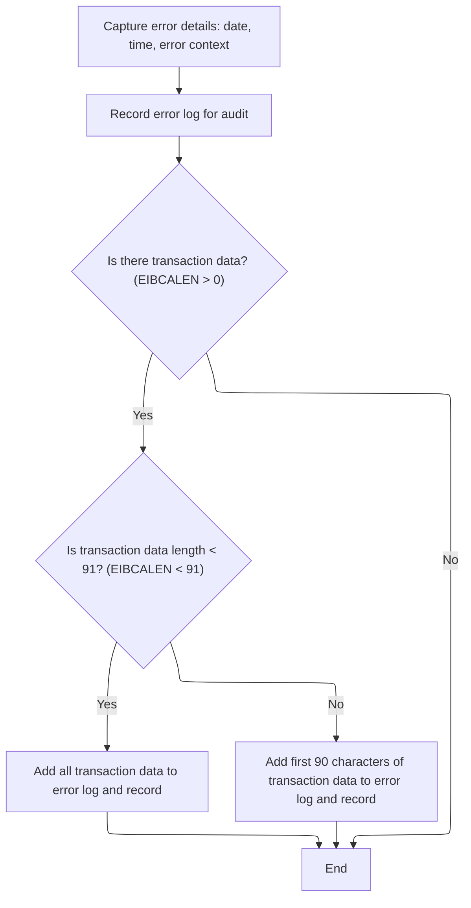

This section governs how errors are captured, formatted, and routed for audit and operational purposes. It ensures that all relevant error context, including timestamps and transaction data, is logged and made available for review and debugging.

| Category       | Rule Name                              | Description                                                                                                                                                                                                              |
| -------------- | -------------------------------------- | ------------------------------------------------------------------------------------------------------------------------------------------------------------------------------------------------------------------------ |
| Business logic | Timestamped error logging              | Every error log entry must include the exact date and time of occurrence, formatted as MMDDYYYY and HHMMSS, to ensure traceability.                                                                                      |
| Business logic | Dual queue routing                     | Error messages must be routed to both a transient data queue and a temporary storage queue to guarantee operational availability and audit persistence.                                                                  |
| Business logic | Transaction data inclusion             | If transaction data is present, up to 90 characters of it must be included in the error log for additional context; if less than 91 characters, all data is included, otherwise only the first 90 characters are logged. |
| Business logic | Error logging without transaction data | Error logs must be recorded even if no transaction data is present, ensuring that all errors are captured regardless of context.                                                                                         |
| Business logic | Queue extension handling               | If the error message begins with 'Q=', the routing logic must extract the queue extension and adjust the message content accordingly before logging.                                                                     |

<SwmSnippet path="/base/src/lgapol01.cbl" line="119">

---

In <SwmToken path="base/src/lgapol01.cbl" pos="119:1:3" line-data="       P999-ERROR.">`P999-ERROR`</SwmToken>, we grab the current time and date from CICS and format them. This timestamp gets attached to the error message for logging, so we know exactly when the error occurred.

```cobol
       P999-ERROR.
      * Save SQLCODE in message
      * Obtain and format current time and date
           EXEC CICS ASKTIME ABSTIME(W2-TIME)
           END-EXEC
           EXEC CICS FORMATTIME ABSTIME(W2-TIME)
                     MMDDYYYY(W2-DATE1)
                     TIME(W2-DATE2)
           END-EXEC
```

---

</SwmSnippet>

<SwmSnippet path="/base/src/lgapol01.cbl" line="128">

---

After formatting the error message, we call LGSTSQ to write it to the system queues. This is how the error actually gets logged for later review.

```cobol
           MOVE W2-DATE1 TO W3-DATE
           MOVE W2-DATE2 TO W3-TIME
      * Write output message to TDQ
           EXEC CICS LINK PROGRAM('LGSTSQ')
                     COMMAREA(W3-MESSAGE)
                     LENGTH(LENGTH OF W3-MESSAGE)
           END-EXEC.
```

---

</SwmSnippet>

<SwmSnippet path="/base/src/lgstsq.cbl" line="55">

---

<SwmToken path="base/src/lgstsq.cbl" pos="55:1:1" line-data="       MAINLINE SECTION.">`MAINLINE`</SwmToken> in LGSTSQ handles message routing. It figures out if the message came from a calling program or a CICS RECEIVE, tweaks the message if it starts with 'Q=', and writes it to both a transient data queue and a temporary storage queue. If the message was received (not called), it also sends a dummy text and frees the keyboard. This covers both logging and operational queueing.

```cobol
       MAINLINE SECTION.

           MOVE SPACES TO WRITE-MSG.
           MOVE SPACES TO WS-RECV.

           EXEC CICS ASSIGN SYSID(WRITE-MSG-SYSID)
                RESP(WS-RESP)
           END-EXEC.

           EXEC CICS ASSIGN INVOKINGPROG(WS-INVOKEPROG)
                RESP(WS-RESP)
           END-EXEC.
           
           IF WS-INVOKEPROG NOT = SPACES
              MOVE 'C' To WS-FLAG
              MOVE COMMA-DATA  TO WRITE-MSG-MSG
              MOVE EIBCALEN    TO WS-RECV-LEN
           ELSE
              EXEC CICS RECEIVE INTO(WS-RECV)
                  LENGTH(WS-RECV-LEN)
                  RESP(WS-RESP)
              END-EXEC
              MOVE 'R' To WS-FLAG
              MOVE WS-RECV-DATA  TO WRITE-MSG-MSG
              SUBTRACT 5 FROM WS-RECV-LEN
           END-IF.

           MOVE 'GENAERRS' TO STSQ-NAME.
           IF WRITE-MSG-MSG(1:2) = 'Q=' THEN
              MOVE WRITE-MSG-MSG(3:4) TO STSQ-EXT
              MOVE WRITE-MSG-REST TO TEMPO
              MOVE TEMPO          TO WRITE-MSG-MSG
              SUBTRACT 7 FROM WS-RECV-LEN
           END-IF.

           ADD 5 TO WS-RECV-LEN.

      * Write output message to TDQ CSMT
      *
           EXEC CICS WRITEQ TD QUEUE(STDQ-NAME)
                     FROM(WRITE-MSG)
                     RESP(WS-RESP)
                     LENGTH(WS-RECV-LEN)

           END-EXEC.

      * Write output message to Genapp TSQ
      * If no space is available then the task will not wait for
      *  storage to become available but will ignore the request...
      *
           EXEC CICS WRITEQ TS QUEUE(STSQ-NAME)
                     FROM(WRITE-MSG)
                     RESP(WS-RESP)
                     NOSUSPEND
                     LENGTH(WS-RECV-LEN)

           END-EXEC.

           If WS-FLAG = 'R' Then
             EXEC CICS SEND TEXT FROM(FILLER-X)
              WAIT
              ERASE
              LENGTH(1)
              FREEKB
             END-EXEC.

           EXEC CICS RETURN
           END-EXEC.
```

---

</SwmSnippet>

<SwmSnippet path="/base/src/lgapol01.cbl" line="136">

---

Back in <SwmToken path="base/src/lgapol01.cbl" pos="85:3:5" line-data="               PERFORM P999-ERROR">`P999-ERROR`</SwmToken>, after returning from LGSTSQ, we check if there's commarea data and, if so, log up to 90 bytes of it by calling LGSTSQ again. This gives us extra context for debugging errors.

```cobol
           IF EIBCALEN > 0 THEN
             IF EIBCALEN < 91 THEN
               MOVE DFHCOMMAREA(1:EIBCALEN) TO CA-DATA
               EXEC CICS LINK PROGRAM('LGSTSQ')
                         COMMAREA(CA-ERROR-MSG)
                         LENGTH(LENGTH OF CA-ERROR-MSG)
               END-EXEC
             ELSE
               MOVE DFHCOMMAREA(1:90) TO CA-DATA
               EXEC CICS LINK PROGRAM('LGSTSQ')
                         COMMAREA(CA-ERROR-MSG)
                         LENGTH(LENGTH OF CA-ERROR-MSG)
               END-EXEC
             END-IF
           END-IF.
           EXIT.
```

---

</SwmSnippet>

## Input Length and Early Return Checks

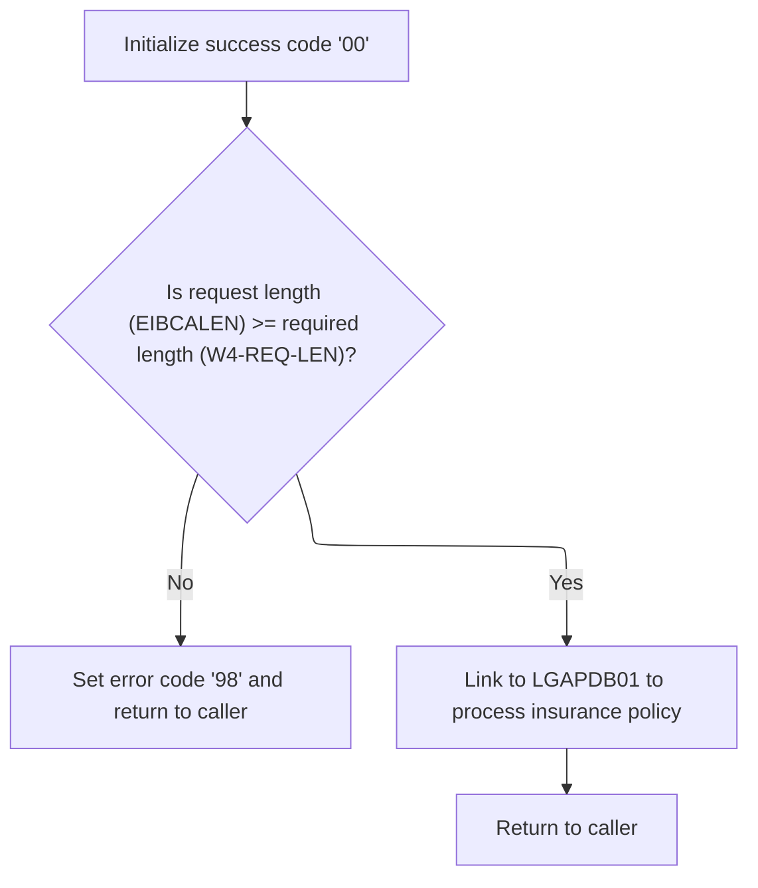

<SwmSnippet path="/base/src/lgapol01.cbl" line="89">

---

Back in <SwmToken path="base/src/lgapol01.cbl" pos="68:1:3" line-data="       P100-MAIN SECTION.">`P100-MAIN`</SwmToken> after <SwmToken path="base/src/lgapol01.cbl" pos="85:3:5" line-data="               PERFORM P999-ERROR">`P999-ERROR`</SwmToken>, we reset the return code, set up the commarea pointer, and check if the input is long enough. If not, we set an error and return early to avoid bad data.

```cobol
           MOVE '00' TO CA-RETURN-CODE
           SET W1-PTR TO ADDRESS OF DFHCOMMAREA.

           ADD W4-HDR-LEN TO W4-REQ-LEN


           IF EIBCALEN IS LESS THAN W4-REQ-LEN
             MOVE '98' TO CA-RETURN-CODE
             EXEC CICS RETURN END-EXEC
           END-IF
```

---

</SwmSnippet>

<SwmSnippet path="/base/src/lgapol01.cbl" line="103">

---

We hand off to <SwmToken path="base/src/lgapol01.cbl" pos="103:9:9" line-data="           EXEC CICS Link Program(LGAPDB01)">`LGAPDB01`</SwmToken> to do the actual policy processing.

```cobol
           EXEC CICS Link Program(LGAPDB01)
                Commarea(DFHCOMMAREA)
                LENGTH(32500)
           END-EXEC.

           EXEC CICS RETURN END-EXEC.
```

---

</SwmSnippet>

# Main Policy Processing Workflow

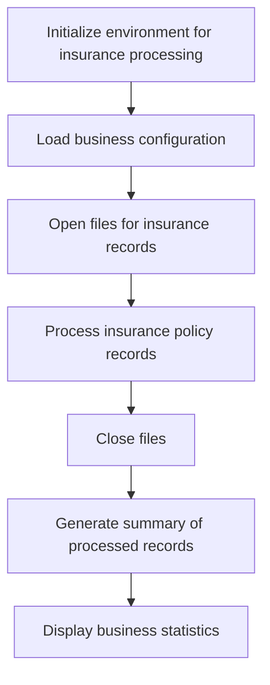

This section governs the end-to-end workflow for processing insurance policy records, ensuring that all necessary setup, processing, and reporting steps are executed in the correct order to maintain data integrity and provide business insights.

| Category        | Rule Name                               | Description                                                                                                                                                                       |
| --------------- | --------------------------------------- | --------------------------------------------------------------------------------------------------------------------------------------------------------------------------------- |
| Data validation | Environment Initialization Prerequisite | The environment must be fully initialized before any insurance policy processing can begin.                                                                                       |
| Data validation | Configuration Validation                | Business configuration settings must be loaded and validated before processing any insurance policy records.                                                                      |
| Data validation | File Availability Requirement           | All required files for insurance policy records must be available and successfully opened before processing begins.                                                               |
| Data validation | File Closure Requirement                | All files opened for processing must be properly closed after processing is complete to ensure data integrity and prevent resource leaks.                                         |
| Business logic  | Consistent Policy Processing            | Each insurance policy record must be processed according to the loaded business configuration, ensuring that all business rules are applied consistently.                         |
| Business logic  | Processing Summary Generation           | A summary of all processed insurance policy records must be generated at the end of processing, including key metrics such as total records processed and any errors encountered. |
| Business logic  | Statistics Display Requirement          | Business statistics, such as total policies processed and error counts, must be displayed to the user after processing is complete.                                               |

<SwmSnippet path="/base/src/LGAPDB01.cbl" line="90">

---

This is the main workflow: setup, process, summarize, and finish.

```cobol
       P001.
           PERFORM P002-INITIALIZE
           PERFORM P003-LOAD-CONFIG
           PERFORM P005-OPEN-FILES
           PERFORM P006-PROCESS-RECORDS
           PERFORM P014-CLOSE-FILES
           PERFORM P015-GENERATE-SUMMARY
           PERFORM P016-DISPLAY-STATS
           STOP RUN.
```

---

</SwmSnippet>

# Configuration Loading and Defaults

This section governs how the application loads its configuration settings, allowing for external overrides of key parameters while ensuring safe defaults are always available.

| Category        | Rule Name                     | Description                                                                                                                                                                                                                                                                                                                                                                                                                |
| --------------- | ----------------------------- | -------------------------------------------------------------------------------------------------------------------------------------------------------------------------------------------------------------------------------------------------------------------------------------------------------------------------------------------------------------------------------------------------------------------------- |
| Data validation | Ignore Invalid Numeric Config | If a configuration value is present in the file but is not numeric where a number is required, the application must ignore the invalid value and retain the existing or default setting.                                                                                                                                                                                                                                   |
| Business logic  | Default on Missing Config     | If the configuration file is not available, the application must use predefined default values for all configuration parameters.                                                                                                                                                                                                                                                                                           |
| Business logic  | Configurable Risk and Premium | Configuration values for <SwmToken path="base/src/LGAPDB01.cbl" pos="126:4:4" line-data="           MOVE &#39;MAX_RISK_SCORE&#39; TO CONFIG-KEY">`MAX_RISK_SCORE`</SwmToken> and <SwmToken path="base/src/LGAPDB01.cbl" pos="132:4:4" line-data="           MOVE &#39;MIN_PREMIUM&#39; TO CONFIG-KEY">`MIN_PREMIUM`</SwmToken> must be loaded from the configuration file if available and valid, overriding the defaults. |

<SwmSnippet path="/base/src/LGAPDB01.cbl" line="112">

---

<SwmToken path="base/src/LGAPDB01.cbl" pos="112:1:5" line-data="       P003-LOAD-CONFIG.">`P003-LOAD-CONFIG`</SwmToken> tries to open the config file. If it's missing, we log a warning and use defaults; if it's there, we read the config values and close the file. This lets us override settings without code changes.

```cobol
       P003-LOAD-CONFIG.
           OPEN INPUT CONFIG-FILE
           IF NOT CONFIG-OK
               DISPLAY 'Warning: Config file not available - using defaults'
               PERFORM P004-SET-DEFAULTS
           ELSE
               PERFORM P004-READ-CONFIG-VALUES
               CLOSE CONFIG-FILE
           END-IF.
```

---

</SwmSnippet>

<SwmSnippet path="/base/src/LGAPDB01.cbl" line="125">

---

<SwmToken path="base/src/LGAPDB01.cbl" pos="125:1:7" line-data="       P004-READ-CONFIG-VALUES.">`P004-READ-CONFIG-VALUES`</SwmToken> reads <SwmToken path="base/src/LGAPDB01.cbl" pos="126:4:4" line-data="           MOVE &#39;MAX_RISK_SCORE&#39; TO CONFIG-KEY">`MAX_RISK_SCORE`</SwmToken> and <SwmToken path="base/src/LGAPDB01.cbl" pos="132:4:4" line-data="           MOVE &#39;MIN_PREMIUM&#39; TO CONFIG-KEY">`MIN_PREMIUM`</SwmToken> from the config file, checks they're numeric, and converts them to numbers for use in calculations. If the value isn't numeric or the read fails, we skip updating that setting.

```cobol
       P004-READ-CONFIG-VALUES.
           MOVE 'MAX_RISK_SCORE' TO CONFIG-KEY
           READ CONFIG-FILE
           IF CONFIG-OK AND NUMERIC-CONFIG
               MOVE FUNCTION NUMVAL(CONFIG-VALUE) TO WS-MAX-RISK-SCORE
           END-IF
           
           MOVE 'MIN_PREMIUM' TO CONFIG-KEY
           READ CONFIG-FILE
           IF CONFIG-OK AND NUMERIC-CONFIG
               MOVE FUNCTION NUMVAL(CONFIG-VALUE) TO WS-MIN-PREMIUM
           END-IF.
```

---

</SwmSnippet>

# Policy Record Processing Loop

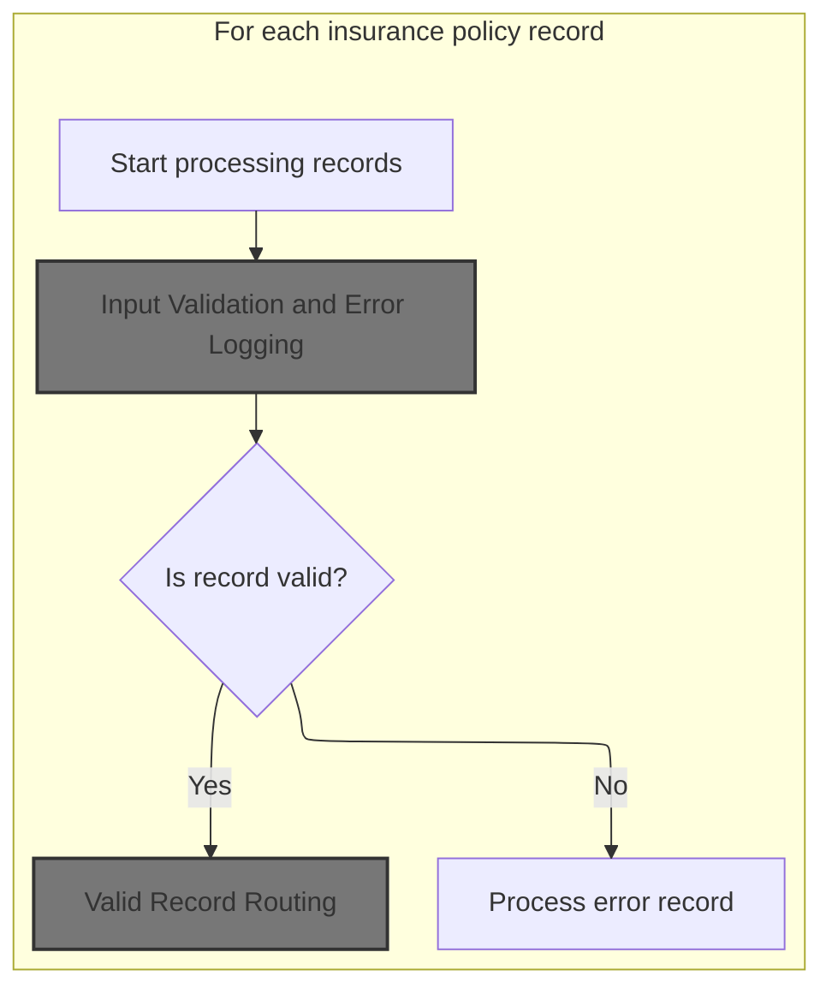

This section governs the main loop for processing insurance policy records, ensuring that each record is validated and routed appropriately, with business rules determining how errors and valid records are handled.

| Category        | Rule Name                      | Description                                                                                                                                                                                                    |
| --------------- | ------------------------------ | -------------------------------------------------------------------------------------------------------------------------------------------------------------------------------------------------------------- |
| Data validation | Policy record validation       | Each insurance policy record must have a valid policy type, a customer number, and coverage limits within acceptable ranges. If any of these fields are missing or invalid, the record is considered an error. |
| Business logic  | Commercial policy routing      | Valid commercial policy records are routed for specialized processing, including risk assessment and premium calculation, and are counted as successfully processed.                                           |
| Business logic  | Non-commercial policy handling | Non-commercial policy records, even if valid, are not processed as commercial policies and are instead counted as errors or handled separately according to business requirements.                             |
| Business logic  | Complete input processing      | The processing loop continues until all input records have been read and processed, as indicated by reaching the end-of-file condition.                                                                        |

<SwmSnippet path="/base/src/LGAPDB01.cbl" line="178">

---

<SwmToken path="base/src/LGAPDB01.cbl" pos="178:1:5" line-data="       P006-PROCESS-RECORDS.">`P006-PROCESS-RECORDS`</SwmToken> loops through all input records, validates each one, and either processes it as valid or logs it as an error. This keeps going until we hit end-of-file.

```cobol
       P006-PROCESS-RECORDS.
           PERFORM P007-READ-INPUT
           PERFORM UNTIL INPUT-EOF
               ADD 1 TO WS-REC-CNT
               PERFORM P008-VALIDATE-INPUT-RECORD
               IF WS-ERROR-COUNT = ZERO
                   PERFORM P009-PROCESS-VALID-RECORD
               ELSE
                   PERFORM P010-PROCESS-ERROR-RECORD
               END-IF
               PERFORM P007-READ-INPUT
           END-PERFORM.
```

---

</SwmSnippet>

## Input Validation and Error Logging

```mermaid
%%{init: {"flowchart": {"defaultRenderer": "elk"}} }%%
flowchart TD
    node1["Start input record validation"]
    click node1 openCode "base/src/LGAPDB01.cbl:195:196"
    node1 --> node2{"Is policy type Commercial, Personal, or Farm?"}
    click node2 openCode "base/src/LGAPDB01.cbl:198:204"
    node2 -->|"No"| node3["Log error: Invalid Policy Type"]
    click node3 openCode "base/src/LGAPDB01.cbl:201:203"
    node2 -->|"Yes"| node4
    node3 --> node4
    node4 --> node5{"Is customer number provided?"}
    click node5 openCode "base/src/LGAPDB01.cbl:206:210"
    node5 -->|"No"| node6["Log error: Customer Number Required"]
    click node6 openCode "base/src/LGAPDB01.cbl:207:209"
    node5 -->|"Yes"| node7
    node6 --> node7
    node7 --> node8{"Is at least one coverage limit specified?"}
    click node8 openCode "base/src/LGAPDB01.cbl:212:217"
    node8 -->|"No"| node9["Log error: At least one coverage limit required"]
    click node9 openCode "base/src/LGAPDB01.cbl:214:216"
    node8 -->|"Yes"| node10
    node9 --> node10
    node10 --> node11{"Does total coverage exceed $50,000,000?"}
    click node11 openCode "base/src/LGAPDB01.cbl:219:224"
    node11 -->|"Yes"| node12["Log warning: Coverage exceeds maximum TIV"]
    click node12 openCode "base/src/LGAPDB01.cbl:221:223"
    node11 -->|"No"| node13["Validation complete"]
    click node13 openCode "base/src/LGAPDB01.cbl:224:224"
    node12 --> node13

classDef HeadingStyle fill:#777777,stroke:#333,stroke-width:2px;

%% Swimm:
%% %%{init: {"flowchart": {"defaultRenderer": "elk"}} }%%
%% flowchart TD
%%     node1["Start input record validation"]
%%     click node1 openCode "<SwmPath>[base/src/LGAPDB01.cbl](base/src/LGAPDB01.cbl)</SwmPath>:195:196"
%%     node1 --> node2{"Is policy type Commercial, Personal, or Farm?"}
%%     click node2 openCode "<SwmPath>[base/src/LGAPDB01.cbl](base/src/LGAPDB01.cbl)</SwmPath>:198:204"
%%     node2 -->|"No"| node3["Log error: Invalid Policy Type"]
%%     click node3 openCode "<SwmPath>[base/src/LGAPDB01.cbl](base/src/LGAPDB01.cbl)</SwmPath>:201:203"
%%     node2 -->|"Yes"| node4
%%     node3 --> node4
%%     node4 --> node5{"Is customer number provided?"}
%%     click node5 openCode "<SwmPath>[base/src/LGAPDB01.cbl](base/src/LGAPDB01.cbl)</SwmPath>:206:210"
%%     node5 -->|"No"| node6["Log error: Customer Number Required"]
%%     click node6 openCode "<SwmPath>[base/src/LGAPDB01.cbl](base/src/LGAPDB01.cbl)</SwmPath>:207:209"
%%     node5 -->|"Yes"| node7
%%     node6 --> node7
%%     node7 --> node8{"Is at least one coverage limit specified?"}
%%     click node8 openCode "<SwmPath>[base/src/LGAPDB01.cbl](base/src/LGAPDB01.cbl)</SwmPath>:212:217"
%%     node8 -->|"No"| node9["Log error: At least one coverage limit required"]
%%     click node9 openCode "<SwmPath>[base/src/LGAPDB01.cbl](base/src/LGAPDB01.cbl)</SwmPath>:214:216"
%%     node8 -->|"Yes"| node10
%%     node9 --> node10
%%     node10 --> node11{"Does total coverage exceed $50,000,000?"}
%%     click node11 openCode "<SwmPath>[base/src/LGAPDB01.cbl](base/src/LGAPDB01.cbl)</SwmPath>:219:224"
%%     node11 -->|"Yes"| node12["Log warning: Coverage exceeds maximum TIV"]
%%     click node12 openCode "<SwmPath>[base/src/LGAPDB01.cbl](base/src/LGAPDB01.cbl)</SwmPath>:221:223"
%%     node11 -->|"No"| node13["Validation complete"]
%%     click node13 openCode "<SwmPath>[base/src/LGAPDB01.cbl](base/src/LGAPDB01.cbl)</SwmPath>:224:224"
%%     node12 --> node13
%% 
%% classDef HeadingStyle fill:#777777,stroke:#333,stroke-width:2px;
```

This section ensures that insurance policy input records meet required business criteria before further processing. It validates the presence and correctness of key fields and logs any issues for review.

| Category        | Rule Name                | Description                                                                                                                                                                                       |
| --------------- | ------------------------ | ------------------------------------------------------------------------------------------------------------------------------------------------------------------------------------------------- |
| Data validation | Accepted policy types    | Only policy types 'Commercial', 'Personal', or 'Farm' are accepted. Any other policy type is considered invalid and must be logged as an error.                                                   |
| Data validation | Customer number required | A customer number must be provided for every policy record. If missing, this must be logged as an error.                                                                                          |
| Data validation | Coverage limit required  | At least one coverage limit (building, contents, or business interruption) must be specified for a policy. If all are zero, this must be logged as an error.                                      |
| Business logic  | Maximum coverage warning | If the total coverage (building, contents, and business interruption limits) exceeds $50,000,000, a warning must be logged indicating the coverage exceeds the maximum Total Insured Value (TIV). |

<SwmSnippet path="/base/src/LGAPDB01.cbl" line="195">

---

We validate policy type, customer, and coverage, logging issues as errors or warnings.

```cobol
       P008-VALIDATE-INPUT-RECORD.
           INITIALIZE WS-ERROR-HANDLING
           
           IF NOT COMMERCIAL-POLICY AND 
              NOT PERSONAL-POLICY AND 
              NOT FARM-POLICY
               PERFORM P008A-LOG-ERROR WITH 
                   'POL001' 'F' 'IN-POLICY-TYPE' 
                   'Invalid Policy Type'
           END-IF
           
           IF IN-CUSTOMER-NUM = SPACES
               PERFORM P008A-LOG-ERROR WITH 
                   'CUS001' 'F' 'IN-CUSTOMER-NUM' 
                   'Customer Number Required'
           END-IF
           
           IF IN-BUILDING-LIMIT = ZERO AND 
              IN-CONTENTS-LIMIT = ZERO
               PERFORM P008A-LOG-ERROR WITH 
                   'COV001' 'F' 'COVERAGE-LIMITS' 
                   'At least one coverage limit required'
           END-IF
           
           IF IN-BUILDING-LIMIT + IN-CONTENTS-LIMIT + 
              IN-BI-LIMIT > WS-MAX-TIV
               PERFORM P008A-LOG-ERROR WITH 
                   'COV002' 'W' 'COVERAGE-LIMITS' 
                   'Total coverage exceeds maximum TIV'
           END-IF.
```

---

</SwmSnippet>

<SwmSnippet path="/base/src/LGAPDB01.cbl" line="226">

---

<SwmToken path="base/src/LGAPDB01.cbl" pos="226:1:5" line-data="       P008A-LOG-ERROR.">`P008A-LOG-ERROR`</SwmToken> bumps the error count and stores the error details in indexed arrays. It assumes we won't hit more than 20 errors per record.

```cobol
       P008A-LOG-ERROR.
           ADD 1 TO WS-ERROR-COUNT
           SET ERR-IDX TO WS-ERROR-COUNT
           MOVE WS-ERROR-CODE TO WS-ERROR-CODE (ERR-IDX)
           MOVE WS-ERROR-SEVERITY TO WS-ERROR-SEVERITY (ERR-IDX)
           MOVE WS-ERROR-FIELD TO WS-ERROR-FIELD (ERR-IDX)
           MOVE WS-ERROR-MESSAGE TO WS-ERROR-MESSAGE (ERR-IDX).
```

---

</SwmSnippet>

## Valid Record Routing

This section governs the routing of valid insurance policy records based on their type, ensuring that commercial policies are processed accordingly and non-commercial policies are flagged for error handling.

| Category       | Rule Name                       | Description                                                                                                                                    |
| -------------- | ------------------------------- | ---------------------------------------------------------------------------------------------------------------------------------------------- |
| Business logic | Commercial policy routing       | If the policy type is commercial ('C'), the record must be routed for commercial processing and the processed record count incremented by one. |
| Business logic | Non-commercial policy rejection | If the policy type is not commercial ('C'), the record must be routed for non-commercial processing and the error count incremented by one.    |

<SwmSnippet path="/base/src/LGAPDB01.cbl" line="234">

---

We branch to commercial processing or reject non-commercial records.

```cobol
       P009-PROCESS-VALID-RECORD.
           IF COMMERCIAL-POLICY
               PERFORM P011-PROCESS-COMMERCIAL
               ADD 1 TO WS-PROC-CNT
           ELSE
               PERFORM P012-PROCESS-NON-COMMERCIAL
               ADD 1 TO WS-ERR-CNT
           END-IF.
```

---

</SwmSnippet>

## Commercial Policy Processing Steps

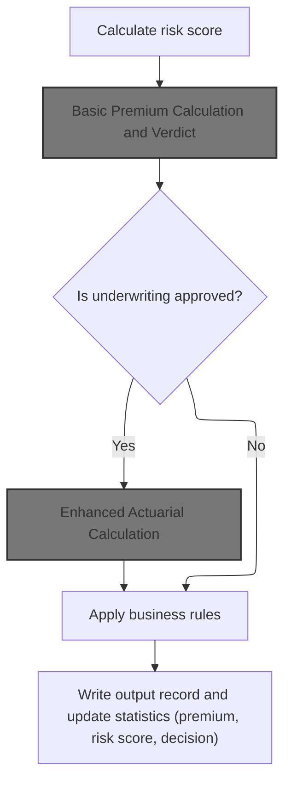

The Commercial Policy Processing Steps section governs how commercial insurance applications are evaluated, scored, and priced, ensuring that each policy is processed according to underwriting decisions and business rules before finalizing outputs and statistics.

| Category        | Rule Name                       | Description                                                                                                                                                                                                                                                                                                                       |
| --------------- | ------------------------------- | --------------------------------------------------------------------------------------------------------------------------------------------------------------------------------------------------------------------------------------------------------------------------------------------------------------------------------- |
| Data validation | Mandatory risk scoring          | A risk score must be calculated for every commercial policy application before any premium calculation or underwriting decision is made.                                                                                                                                                                                          |
| Data validation | Comprehensive output record     | The output record must include the final premium, risk score, underwriting decision, rejection reason (if any), and all relevant statistics for reporting.                                                                                                                                                                        |
| Business logic  | Enhanced actuarial for approved | If the underwriting decision is approved (<SwmToken path="base/src/LGAPDB01.cbl" pos="261:3:5" line-data="           IF WS-STAT = 0">`WS-STAT`</SwmToken> = 0), an enhanced actuarial calculation must be performed to generate a more detailed premium quote.                                                                    |
| Business logic  | Business rules for non-approved | If the underwriting decision is not approved (<SwmToken path="base/src/LGAPDB01.cbl" pos="261:3:5" line-data="           IF WS-STAT = 0">`WS-STAT`</SwmToken> ≠ 0), business rules must be applied to determine the appropriate rejection reason, referral, or pending status, and adjust the premium or eligibility accordingly. |
| Business logic  | Discount eligibility evaluation | Discount eligibility must be evaluated for multi-policy, claims-free, and safety program participation, and the total discount factor must be applied to the premium if eligible.                                                                                                                                                 |
| Business logic  | Statistics update requirement   | Statistics for premium totals, risk scores, and underwriting decisions must be updated after each policy is processed to ensure accurate reporting and analytics.                                                                                                                                                                 |

<SwmSnippet path="/base/src/LGAPDB01.cbl" line="258">

---

In <SwmToken path="base/src/LGAPDB01.cbl" pos="258:1:5" line-data="       P011-PROCESS-COMMERCIAL.">`P011-PROCESS-COMMERCIAL`</SwmToken>, we run through risk scoring, basic and enhanced premium calculations, apply business rules, write the output, and update stats. Each step depends on the previous one.

```cobol
       P011-PROCESS-COMMERCIAL.
           PERFORM P011A-CALCULATE-RISK-SCORE
           PERFORM P011B-BASIC-PREMIUM-CALC
           IF WS-STAT = 0
               PERFORM P011C-ENHANCED-ACTUARIAL-CALC
           END-IF
           PERFORM P011D-APPLY-BUSINESS-RULES
           PERFORM P011E-WRITE-OUTPUT-RECORD
           PERFORM P011F-UPDATE-STATISTICS.
```

---

</SwmSnippet>

### Basic Premium Calculation and Verdict

This section governs the calculation of the basic insurance premium and the underwriting verdict for a policy application. It determines the premium breakdown for various perils (fire, crime, flood, weather) and issues an underwriting decision (approve, pending, reject, refer) based on risk analysis and eligibility criteria.

| Category        | Rule Name                               | Description                                                                                                                                                                             |
| --------------- | --------------------------------------- | --------------------------------------------------------------------------------------------------------------------------------------------------------------------------------------- |
| Data validation | Rejection reason requirement            | If the underwriting decision is 'rejected', a rejection reason must be provided in the output.                                                                                          |
| Business logic  | Peril-specific base premium calculation | The base premium for each peril (fire, crime, flood, weather) must be calculated using the risk profile of the property, including structural, geographical, and customer risk factors. |
| Business logic  | High flood risk loading                 | If the property is located in a high flood risk zone, the flood peril premium must be increased by a defined risk loading factor.                                                       |
| Business logic  | Discount eligibility application        | A discount factor must be applied to the total premium if the customer is eligible for multi-policy, claims-free, or safety program discounts.                                          |
| Business logic  | Underwriting decision assignment        | The underwriting decision must be set to 'approved', 'pending', 'rejected', or 'referred' based on the calculated risk score and predefined business thresholds.                        |
| Business logic  | Taxes and fees inclusion                | Premiums must include applicable taxes and fees (state tax, county tax, policy fee, inspection fee) as defined by the policy's location and regulatory requirements.                    |

<SwmSnippet path="/base/src/LGAPDB01.cbl" line="275">

---

<SwmToken path="base/src/LGAPDB01.cbl" pos="275:1:7" line-data="       P011B-BASIC-PREMIUM-CALC.">`P011B-BASIC-PREMIUM-CALC`</SwmToken> calls <SwmToken path="base/src/LGAPDB01.cbl" pos="276:4:4" line-data="           CALL &#39;LGAPDB03&#39; USING WS-BASE-RISK-SCR, IN-FIRE-PERIL, ">`LGAPDB03`</SwmToken> with all the risk and peril data. That program does the heavy lifting for risk and premium calculations.

```cobol
       P011B-BASIC-PREMIUM-CALC.
           CALL 'LGAPDB03' USING WS-BASE-RISK-SCR, IN-FIRE-PERIL, 
                                IN-CRIME-PERIL, IN-FLOOD-PERIL, 
                                IN-WEATHER-PERIL, WS-STAT,
                                WS-STAT-DESC, WS-REJ-RSN, WS-FR-PREM,
                                WS-CR-PREM, WS-FL-PREM, WS-WE-PREM,
                                WS-TOT-PREM, WS-DISC-FACT.
```

---

</SwmSnippet>

### Risk Factor Lookup and Application Verdict

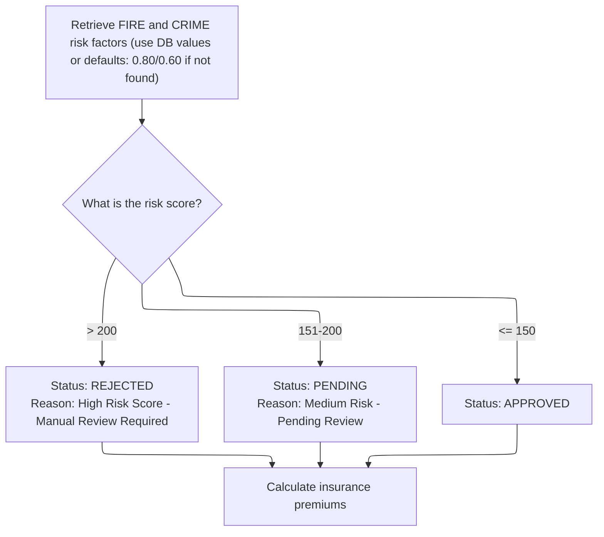

This section governs how risk factors are sourced and how the insurance application verdict is determined based on the risk score. It ensures that every application receives a clear status and reason, supporting consistent and auditable decision-making.

| Category       | Rule Name                 | Description                                                                                                                                                                                                           |
| -------------- | ------------------------- | --------------------------------------------------------------------------------------------------------------------------------------------------------------------------------------------------------------------- |
| Business logic | Default fire risk factor  | If the fire risk factor is not found in the database, a default value of <SwmToken path="base/src/LGAPDB03.cbl" pos="58:3:5" line-data="               MOVE 0.80 TO WS-FIRE-FACTOR">`0.80`</SwmToken> must be used.   |
| Business logic | Default crime risk factor | If the crime risk factor is not found in the database, a default value of <SwmToken path="base/src/LGAPDB03.cbl" pos="70:3:5" line-data="               MOVE 0.60 TO WS-CRIME-FACTOR">`0.60`</SwmToken> must be used. |
| Business logic | High risk rejection       | If the calculated risk score is greater than 200, the application status must be set to REJECTED and the rejection reason must be 'High Risk Score - Manual Review Required'.                                         |
| Business logic | Medium risk pending       | If the calculated risk score is between 151 and 200 inclusive, the application status must be set to PENDING and the rejection reason must be 'Medium Risk - Pending Review'.                                         |
| Business logic | Low risk approval         | If the calculated risk score is 150 or less, the application status must be set to APPROVED and no rejection reason is required.                                                                                      |

<SwmSnippet path="/base/src/LGAPDB03.cbl" line="42">

---

<SwmToken path="base/src/LGAPDB03.cbl" pos="42:1:3" line-data="       MAIN-LOGIC.">`MAIN-LOGIC`</SwmToken> in <SwmToken path="base/src/LGAPDB01.cbl" pos="276:4:4" line-data="           CALL &#39;LGAPDB03&#39; USING WS-BASE-RISK-SCR, IN-FIRE-PERIL, ">`LGAPDB03`</SwmToken> fetches fire and crime risk factors from the DB, falls back to defaults if needed, then calculates the verdict and premiums. This sets up all the core risk and pricing data.

```cobol
       MAIN-LOGIC.
           PERFORM GET-RISK-FACTORS
           PERFORM CALCULATE-VERDICT
           PERFORM CALCULATE-PREMIUMS
           GOBACK.
```

---

</SwmSnippet>

<SwmSnippet path="/base/src/LGAPDB03.cbl" line="48">

---

<SwmToken path="base/src/LGAPDB03.cbl" pos="48:1:5" line-data="       GET-RISK-FACTORS.">`GET-RISK-FACTORS`</SwmToken> tries to fetch fire and crime risk factors from the DB. If the query fails, it uses hardcoded defaults (<SwmToken path="base/src/LGAPDB03.cbl" pos="58:3:5" line-data="               MOVE 0.80 TO WS-FIRE-FACTOR">`0.80`</SwmToken> for fire, <SwmToken path="base/src/LGAPDB03.cbl" pos="70:3:5" line-data="               MOVE 0.60 TO WS-CRIME-FACTOR">`0.60`</SwmToken> for crime).

```cobol
       GET-RISK-FACTORS.
           EXEC SQL
               SELECT FACTOR_VALUE INTO :WS-FIRE-FACTOR
               FROM RISK_FACTORS
               WHERE PERIL_TYPE = 'FIRE'
           END-EXEC.
           
           IF SQLCODE = 0
               CONTINUE
           ELSE
               MOVE 0.80 TO WS-FIRE-FACTOR
           END-IF.
           
           EXEC SQL
               SELECT FACTOR_VALUE INTO :WS-CRIME-FACTOR
               FROM RISK_FACTORS
               WHERE PERIL_TYPE = 'CRIME'
           END-EXEC.
           
           IF SQLCODE = 0
               CONTINUE
           ELSE
               MOVE 0.60 TO WS-CRIME-FACTOR
           END-IF.
```

---

</SwmSnippet>

<SwmSnippet path="/base/src/LGAPDB03.cbl" line="73">

---

<SwmToken path="base/src/LGAPDB03.cbl" pos="73:1:3" line-data="       CALCULATE-VERDICT.">`CALCULATE-VERDICT`</SwmToken> classifies the risk score into approved, pending, or rejected using hardcoded thresholds (200, 150). It sets the status and rejection reason accordingly.

```cobol
       CALCULATE-VERDICT.
           IF LK-RISK-SCORE > 200
             MOVE 2 TO LK-STAT
             MOVE 'REJECTED' TO LK-STAT-DESC
             MOVE 'High Risk Score - Manual Review Required' 
               TO LK-REJ-RSN
           ELSE
             IF LK-RISK-SCORE > 150
               MOVE 1 TO LK-STAT
               MOVE 'PENDING' TO LK-STAT-DESC
               MOVE 'Medium Risk - Pending Review'
                 TO LK-REJ-RSN
             ELSE
               MOVE 0 TO LK-STAT
               MOVE 'APPROVED' TO LK-STAT-DESC
               MOVE SPACES TO LK-REJ-RSN
             END-IF
           END-IF.
```

---

</SwmSnippet>

### Enhanced Actuarial Calculation

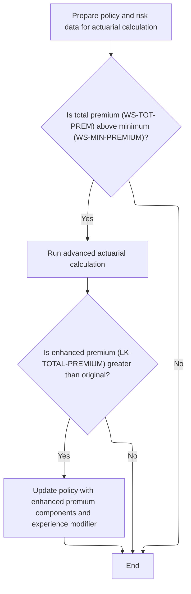

The Enhanced Actuarial Calculation section determines whether a policy qualifies for advanced actuarial premium calculation based on its initial premium amount. If eligible, it calculates an enhanced premium and updates the policy only if the new premium is greater than the original.

| Category        | Rule Name                   | Description                                                                                                                                                                                                                                                                                                                                                                                                                                                                                                            |
| --------------- | --------------------------- | ---------------------------------------------------------------------------------------------------------------------------------------------------------------------------------------------------------------------------------------------------------------------------------------------------------------------------------------------------------------------------------------------------------------------------------------------------------------------------------------------------------------------- |
| Data validation | Minimum premium eligibility | Advanced actuarial calculation is only performed if the initial total premium (<SwmToken path="base/src/LGAPDB01.cbl" pos="281:1:5" line-data="                                WS-TOT-PREM, WS-DISC-FACT.">`WS-TOT-PREM`</SwmToken>) exceeds the minimum premium threshold (<SwmToken path="base/src/LGAPDB01.cbl" pos="135:14:18" line-data="               MOVE FUNCTION NUMVAL(CONFIG-VALUE) TO WS-MIN-PREMIUM">`WS-MIN-PREMIUM`</SwmToken>), which is set to $500.00.                                              |
| Business logic  | Enhanced premium update     | If the enhanced total premium (<SwmToken path="base/src/LGAPDB01.cbl" pos="317:3:7" line-data="               IF LK-TOTAL-PREMIUM &gt; WS-TOT-PREM">`LK-TOTAL-PREMIUM`</SwmToken>) calculated by the advanced actuarial process is greater than the original total premium (<SwmToken path="base/src/LGAPDB01.cbl" pos="281:1:5" line-data="                                WS-TOT-PREM, WS-DISC-FACT.">`WS-TOT-PREM`</SwmToken>), the policy is updated with the enhanced premium components and experience modifier. |
| Business logic  | No change for lower premium | If the enhanced total premium is not greater than the original, no changes are made to the policy premium or its components.                                                                                                                                                                                                                                                                                                                                                                                           |

<SwmSnippet path="/base/src/LGAPDB01.cbl" line="283">

---

<SwmToken path="base/src/LGAPDB01.cbl" pos="283:1:7" line-data="       P011C-ENHANCED-ACTUARIAL-CALC.">`P011C-ENHANCED-ACTUARIAL-CALC`</SwmToken> preps all the input data and calls <SwmToken path="base/src/LGAPDB01.cbl" pos="313:4:4" line-data="               CALL &#39;LGAPDB04&#39; USING LK-INPUT-DATA, LK-COVERAGE-DATA, ">`LGAPDB04`</SwmToken> for advanced premium calculation, but only if the initial premium is above the minimum. If the enhanced result is better, we update the premium fields.

```cobol
       P011C-ENHANCED-ACTUARIAL-CALC.
      *    Prepare input structure for actuarial calculation
           MOVE IN-CUSTOMER-NUM TO LK-CUSTOMER-NUM
           MOVE WS-BASE-RISK-SCR TO LK-RISK-SCORE
           MOVE IN-PROPERTY-TYPE TO LK-PROPERTY-TYPE
           MOVE IN-TERRITORY-CODE TO LK-TERRITORY
           MOVE IN-CONSTRUCTION-TYPE TO LK-CONSTRUCTION-TYPE
           MOVE IN-OCCUPANCY-CODE TO LK-OCCUPANCY-CODE
           MOVE IN-SPRINKLER-IND TO LK-PROTECTION-CLASS
           MOVE IN-YEAR-BUILT TO LK-YEAR-BUILT
           MOVE IN-SQUARE-FOOTAGE TO LK-SQUARE-FOOTAGE
           MOVE IN-YEARS-IN-BUSINESS TO LK-YEARS-IN-BUSINESS
           MOVE IN-CLAIMS-COUNT-3YR TO LK-CLAIMS-COUNT-5YR
           MOVE IN-CLAIMS-AMOUNT-3YR TO LK-CLAIMS-AMOUNT-5YR
           
      *    Set coverage data
           MOVE IN-BUILDING-LIMIT TO LK-BUILDING-LIMIT
           MOVE IN-CONTENTS-LIMIT TO LK-CONTENTS-LIMIT
           MOVE IN-BI-LIMIT TO LK-BI-LIMIT
           MOVE IN-FIRE-DEDUCTIBLE TO LK-FIRE-DEDUCTIBLE
           MOVE IN-WIND-DEDUCTIBLE TO LK-WIND-DEDUCTIBLE
           MOVE IN-FLOOD-DEDUCTIBLE TO LK-FLOOD-DEDUCTIBLE
           MOVE IN-OTHER-DEDUCTIBLE TO LK-OTHER-DEDUCTIBLE
           MOVE IN-FIRE-PERIL TO LK-FIRE-PERIL
           MOVE IN-CRIME-PERIL TO LK-CRIME-PERIL
           MOVE IN-FLOOD-PERIL TO LK-FLOOD-PERIL
           MOVE IN-WEATHER-PERIL TO LK-WEATHER-PERIL
           
      *    Call advanced actuarial calculation program (only for approved cases)
           IF WS-TOT-PREM > WS-MIN-PREMIUM
               CALL 'LGAPDB04' USING LK-INPUT-DATA, LK-COVERAGE-DATA, 
                                    LK-OUTPUT-RESULTS
               
      *        Update with enhanced calculations if successful
               IF LK-TOTAL-PREMIUM > WS-TOT-PREM
                   MOVE LK-FIRE-PREMIUM TO WS-FR-PREM
                   MOVE LK-CRIME-PREMIUM TO WS-CR-PREM
                   MOVE LK-FLOOD-PREMIUM TO WS-FL-PREM
                   MOVE LK-WEATHER-PREMIUM TO WS-WE-PREM
                   MOVE LK-TOTAL-PREMIUM TO WS-TOT-PREM
                   MOVE LK-EXPERIENCE-MOD TO WS-EXPERIENCE-MOD
               END-IF
           END-IF.
```

---

</SwmSnippet>

### Actuarial Premium Calculation Steps

```mermaid
%%{init: {"flowchart": {"defaultRenderer": "elk"}} }%%
flowchart TD
    node1["Start premium calculation"]
    click node1 openCode "base/src/LGAPDB04.cbl:138:150"
    node1 --> node2{"Years in business >= 5?"}
    click node2 openCode "base/src/LGAPDB04.cbl:234:257"
    node2 -->|"Yes"| node3{"Claims in last 5 years = 0?"}
    node2 -->|"No"| node4["Set experience modifier to 1.10"]
    click node4 openCode "base/src/LGAPDB04.cbl:255:256"
    node3 -->|"Yes"| node5["Set experience modifier to 0.85"]
    click node5 openCode "base/src/LGAPDB04.cbl:239:240"
    node3 -->|"No"| node6["Calculate experience modifier based on claims"]
    click node6 openCode "base/src/LGAPDB04.cbl:241:252"
    node5 --> node7["Apply schedule modifier"]
    node6 --> node7
    node4 --> node7
    click node7 openCode "base/src/LGAPDB04.cbl:260:316"
    node7 --> node8{"Adjust for exposure density"}
    click node8 openCode "base/src/LGAPDB04.cbl:299:306"
    node8 -->|"#gt;500"| node9["Add 0.10 to schedule modifier"]
    click node9 openCode "base/src/LGAPDB04.cbl:301:301"
    node8 -->|"#lt;50"| node10["Subtract 0.05 from schedule modifier"]
    click node10 openCode "base/src/LGAPDB04.cbl:304:304"
    node8 -->|"Else"| node11["Continue"]
    click node11 openCode "base/src/LGAPDB04.cbl:306:306"
    node9 --> node12["Calculate base premium for each selected coverage"]
    node10 --> node12
    node11 --> node12
    click node12 openCode "base/src/LGAPDB04.cbl:318:367"
    subgraph coverageLoop["For each coverage type"]
        node12 --> node13{"Is coverage selected?"}
        click node13 openCode "base/src/LGAPDB04.cbl:322:367"
        node13 -->|"Yes"| node14["Calculate premium for coverage"]
        click node14 openCode "base/src/LGAPDB04.cbl:323:366"
        node13 -->|"No"| node15["Skip coverage"]
        click node15 openCode "base/src/LGAPDB04.cbl:367:367"
        node14 --> node16["Add premium to base amount"]
        click node16 openCode "base/src/LGAPDB04.cbl:330:366"
        node15 --> node16
        node16 --> node13
    end
    node16 --> node17["Add catastrophe loadings"]
    click node17 openCode "base/src/LGAPDB04.cbl:369:394"
    node17 --> node18["Finalize premium"]
    click node18 openCode "base/src/LGAPDB04.cbl:464:477"
    node18 --> node19{"Is final rate factor > 0.050000?"}
    click node19 openCode "base/src/LGAPDB04.cbl:473:477"
    node19 -->|"Yes"| node20["Cap rate factor and recalculate premium"]
    click node20 openCode "base/src/LGAPDB04.cbl:474:476"
    node19 -->|"No"| node21["Return total premium"]
    click node21 openCode "base/src/LGAPDB04.cbl:477:477"
    node20 --> node21

classDef HeadingStyle fill:#777777,stroke:#333,stroke-width:2px;

%% Swimm:
%% %%{init: {"flowchart": {"defaultRenderer": "elk"}} }%%
%% flowchart TD
%%     node1["Start premium calculation"]
%%     click node1 openCode "<SwmPath>[base/src/LGAPDB04.cbl](base/src/LGAPDB04.cbl)</SwmPath>:138:150"
%%     node1 --> node2{"Years in business >= 5?"}
%%     click node2 openCode "<SwmPath>[base/src/LGAPDB04.cbl](base/src/LGAPDB04.cbl)</SwmPath>:234:257"
%%     node2 -->|"Yes"| node3{"Claims in last 5 years = 0?"}
%%     node2 -->|"No"| node4["Set experience modifier to 1.10"]
%%     click node4 openCode "<SwmPath>[base/src/LGAPDB04.cbl](base/src/LGAPDB04.cbl)</SwmPath>:255:256"
%%     node3 -->|"Yes"| node5["Set experience modifier to 0.85"]
%%     click node5 openCode "<SwmPath>[base/src/LGAPDB04.cbl](base/src/LGAPDB04.cbl)</SwmPath>:239:240"
%%     node3 -->|"No"| node6["Calculate experience modifier based on claims"]
%%     click node6 openCode "<SwmPath>[base/src/LGAPDB04.cbl](base/src/LGAPDB04.cbl)</SwmPath>:241:252"
%%     node5 --> node7["Apply schedule modifier"]
%%     node6 --> node7
%%     node4 --> node7
%%     click node7 openCode "<SwmPath>[base/src/LGAPDB04.cbl](base/src/LGAPDB04.cbl)</SwmPath>:260:316"
%%     node7 --> node8{"Adjust for exposure density"}
%%     click node8 openCode "<SwmPath>[base/src/LGAPDB04.cbl](base/src/LGAPDB04.cbl)</SwmPath>:299:306"
%%     node8 -->|"#gt;500"| node9["Add 0.10 to schedule modifier"]
%%     click node9 openCode "<SwmPath>[base/src/LGAPDB04.cbl](base/src/LGAPDB04.cbl)</SwmPath>:301:301"
%%     node8 -->|"#lt;50"| node10["Subtract 0.05 from schedule modifier"]
%%     click node10 openCode "<SwmPath>[base/src/LGAPDB04.cbl](base/src/LGAPDB04.cbl)</SwmPath>:304:304"
%%     node8 -->|"Else"| node11["Continue"]
%%     click node11 openCode "<SwmPath>[base/src/LGAPDB04.cbl](base/src/LGAPDB04.cbl)</SwmPath>:306:306"
%%     node9 --> node12["Calculate base premium for each selected coverage"]
%%     node10 --> node12
%%     node11 --> node12
%%     click node12 openCode "<SwmPath>[base/src/LGAPDB04.cbl](base/src/LGAPDB04.cbl)</SwmPath>:318:367"
%%     subgraph coverageLoop["For each coverage type"]
%%         node12 --> node13{"Is coverage selected?"}
%%         click node13 openCode "<SwmPath>[base/src/LGAPDB04.cbl](base/src/LGAPDB04.cbl)</SwmPath>:322:367"
%%         node13 -->|"Yes"| node14["Calculate premium for coverage"]
%%         click node14 openCode "<SwmPath>[base/src/LGAPDB04.cbl](base/src/LGAPDB04.cbl)</SwmPath>:323:366"
%%         node13 -->|"No"| node15["Skip coverage"]
%%         click node15 openCode "<SwmPath>[base/src/LGAPDB04.cbl](base/src/LGAPDB04.cbl)</SwmPath>:367:367"
%%         node14 --> node16["Add premium to base amount"]
%%         click node16 openCode "<SwmPath>[base/src/LGAPDB04.cbl](base/src/LGAPDB04.cbl)</SwmPath>:330:366"
%%         node15 --> node16
%%         node16 --> node13
%%     end
%%     node16 --> node17["Add catastrophe loadings"]
%%     click node17 openCode "<SwmPath>[base/src/LGAPDB04.cbl](base/src/LGAPDB04.cbl)</SwmPath>:369:394"
%%     node17 --> node18["Finalize premium"]
%%     click node18 openCode "<SwmPath>[base/src/LGAPDB04.cbl](base/src/LGAPDB04.cbl)</SwmPath>:464:477"
%%     node18 --> node19{"Is final rate factor > <SwmToken path="base/src/LGAPDB04.cbl" pos="473:13:15" line-data="           IF LK-FINAL-RATE-FACTOR &gt; 0.050000">`0.050000`</SwmToken>?"}
%%     click node19 openCode "<SwmPath>[base/src/LGAPDB04.cbl](base/src/LGAPDB04.cbl)</SwmPath>:473:477"
%%     node19 -->|"Yes"| node20["Cap rate factor and recalculate premium"]
%%     click node20 openCode "<SwmPath>[base/src/LGAPDB04.cbl](base/src/LGAPDB04.cbl)</SwmPath>:474:476"
%%     node19 -->|"No"| node21["Return total premium"]
%%     click node21 openCode "<SwmPath>[base/src/LGAPDB04.cbl](base/src/LGAPDB04.cbl)</SwmPath>:477:477"
%%     node20 --> node21
%% 
%% classDef HeadingStyle fill:#777777,stroke:#333,stroke-width:2px;
```

This section describes the business rules for calculating the actuarial premium for an insurance policy. The calculation process determines the final premium amount by applying a series of modifiers, loadings, and caps based on the insured's risk profile, coverage selections, and business history. Each rule ensures that the premium reflects both the risk and the business objectives of the insurer.

| Category        | Rule Name                        | Description                                                                                                                                                                                                                                                                                                                                                                                                                                         |
| --------------- | -------------------------------- | --------------------------------------------------------------------------------------------------------------------------------------------------------------------------------------------------------------------------------------------------------------------------------------------------------------------------------------------------------------------------------------------------------------------------------------------------- |
| Data validation | Coverage selection filter        | Premiums are only calculated for coverage types that are selected by the policyholder. Unselected coverages are skipped in the calculation.                                                                                                                                                                                                                                                                                                         |
| Data validation | Final rate cap                   | The final rate factor (total premium divided by total insured value) is capped at 0.05. If the calculated rate factor exceeds this cap, the total premium is recalculated to match the maximum allowed rate.                                                                                                                                                                                                                                        |
| Business logic  | New business experience modifier | If the insured business has been operating for less than 5 years, an experience modifier of 1.10 is applied to the premium calculation.                                                                                                                                                                                                                                                                                                             |
| Business logic  | No claims discount               | If the insured business has been operating for at least 5 years and has had zero claims in the last 5 years, an experience modifier of 0.85 is applied, providing a discount for good claims history.                                                                                                                                                                                                                                               |
| Business logic  | Claims-based experience modifier | If the insured business has been operating for at least 5 years and has had claims in the last 5 years, the experience modifier is calculated based on the ratio of claims amount to total insured value, credibility factor, and a scaling constant (<SwmToken path="base/src/LGAPDB04.cbl" pos="244:9:11" line-data="                        WS-CREDIBILITY-FACTOR * 0.50)">`0.50`</SwmToken>). The modifier is then clamped between 0.5 and 2.0. |
| Business logic  | Schedule modifier adjustment     | The schedule modifier is adjusted based on building age, protection class, occupancy hazard, and exposure density. Each factor can increase or decrease the modifier by specific amounts, and the final value is clamped between -0.2 and +0.4.                                                                                                                                                                                                     |
| Business logic  | Exposure density adjustment      | If exposure density is greater than 500, 0.10 is added to the schedule modifier. If exposure density is less than 50, 0.05 is subtracted. Otherwise, no adjustment is made.                                                                                                                                                                                                                                                                         |
| Business logic  | Catastrophe loading application  | Catastrophe loadings for hurricane, tornado, and flood are only applied if the corresponding peril is selected. Earthquake loading is always applied to the base premium.                                                                                                                                                                                                                                                                           |

<SwmSnippet path="/base/src/LGAPDB04.cbl" line="138">

---

<SwmToken path="base/src/LGAPDB04.cbl" pos="138:1:3" line-data="       P100-MAIN.">`P100-MAIN`</SwmToken> in <SwmToken path="base/src/LGAPDB01.cbl" pos="313:4:4" line-data="               CALL &#39;LGAPDB04&#39; USING LK-INPUT-DATA, LK-COVERAGE-DATA, ">`LGAPDB04`</SwmToken> runs all the actuarial steps: exposure, rates, modifiers, base premium, catastrophe loading, expenses, discounts, taxes, and final premium. Each step builds on the last.

```cobol
       P100-MAIN.
           PERFORM P200-INIT
           PERFORM P300-RATES
           PERFORM P350-EXPOSURE
           PERFORM P400-EXP-MOD
           PERFORM P500-SCHED-MOD
           PERFORM P600-BASE-PREM
           PERFORM P700-CAT-LOAD
           PERFORM P800-EXPENSE
           PERFORM P900-DISC
           PERFORM P950-TAXES
           PERFORM P999-FINAL
           GOBACK.
```

---

</SwmSnippet>

<SwmSnippet path="/base/src/LGAPDB04.cbl" line="234">

---

<SwmToken path="base/src/LGAPDB04.cbl" pos="234:1:5" line-data="       P400-EXP-MOD.">`P400-EXP-MOD`</SwmToken> calculates the experience modifier for the premium. No claims in 5 years gets a discount, lots of claims or little experience bumps the modifier up. The result is clamped between 0.5 and 2.0.

```cobol
       P400-EXP-MOD.
           MOVE 1.0000 TO WS-EXPERIENCE-MOD
           
           IF LK-YEARS-IN-BUSINESS >= 5
               IF LK-CLAIMS-COUNT-5YR = ZERO
                   MOVE 0.8500 TO WS-EXPERIENCE-MOD
               ELSE
                   COMPUTE WS-EXPERIENCE-MOD = 
                       1.0000 + 
                       ((LK-CLAIMS-AMOUNT-5YR / WS-TOTAL-INSURED-VAL) * 
                        WS-CREDIBILITY-FACTOR * 0.50)
                   
                   IF WS-EXPERIENCE-MOD > 2.0000
                       MOVE 2.0000 TO WS-EXPERIENCE-MOD
                   END-IF
                   
                   IF WS-EXPERIENCE-MOD < 0.5000
                       MOVE 0.5000 TO WS-EXPERIENCE-MOD
                   END-IF
               END-IF
           ELSE
               MOVE 1.1000 TO WS-EXPERIENCE-MOD
           END-IF
           
           MOVE WS-EXPERIENCE-MOD TO LK-EXPERIENCE-MOD.
```

---

</SwmSnippet>

<SwmSnippet path="/base/src/LGAPDB04.cbl" line="260">

---

<SwmToken path="base/src/LGAPDB04.cbl" pos="260:1:5" line-data="       P500-SCHED-MOD.">`P500-SCHED-MOD`</SwmToken> adjusts the schedule modifier based on building age, protection class, occupancy, and exposure density. Each factor tweaks the modifier up or down, and the final value is clamped between -0.2 and +0.4.

```cobol
       P500-SCHED-MOD.
           MOVE +0.000 TO WS-SCHEDULE-MOD
           
      *    Building age factor
           EVALUATE TRUE
               WHEN LK-YEAR-BUILT >= 2010
                   SUBTRACT 0.050 FROM WS-SCHEDULE-MOD
               WHEN LK-YEAR-BUILT >= 1990
                   CONTINUE
               WHEN LK-YEAR-BUILT >= 1970
                   ADD 0.100 TO WS-SCHEDULE-MOD
               WHEN OTHER
                   ADD 0.200 TO WS-SCHEDULE-MOD
           END-EVALUATE
           
      *    Protection class factor
           EVALUATE LK-PROTECTION-CLASS
               WHEN '01' THRU '03'
                   SUBTRACT 0.100 FROM WS-SCHEDULE-MOD
               WHEN '04' THRU '06'
                   SUBTRACT 0.050 FROM WS-SCHEDULE-MOD
               WHEN '07' THRU '09'
                   CONTINUE
               WHEN OTHER
                   ADD 0.150 TO WS-SCHEDULE-MOD
           END-EVALUATE
           
      *    Occupancy hazard factor
           EVALUATE LK-OCCUPANCY-CODE
               WHEN 'OFF01' THRU 'OFF05'
                   SUBTRACT 0.025 FROM WS-SCHEDULE-MOD
               WHEN 'MFG01' THRU 'MFG10'
                   ADD 0.075 TO WS-SCHEDULE-MOD
               WHEN 'WHS01' THRU 'WHS05'
                   ADD 0.125 TO WS-SCHEDULE-MOD
               WHEN OTHER
                   CONTINUE
           END-EVALUATE
           
      *    Exposure density factor
           IF WS-EXPOSURE-DENSITY > 500.00
               ADD 0.100 TO WS-SCHEDULE-MOD
           ELSE
               IF WS-EXPOSURE-DENSITY < 50.00
                   SUBTRACT 0.050 FROM WS-SCHEDULE-MOD
               END-IF
           END-IF
           
           IF WS-SCHEDULE-MOD > +0.400
               MOVE +0.400 TO WS-SCHEDULE-MOD
           END-IF
           
           IF WS-SCHEDULE-MOD < -0.200
               MOVE -0.200 TO WS-SCHEDULE-MOD
           END-IF
           
           MOVE WS-SCHEDULE-MOD TO LK-SCHEDULE-MOD.
```

---

</SwmSnippet>

<SwmSnippet path="/base/src/LGAPDB04.cbl" line="318">

---

<SwmToken path="base/src/LGAPDB04.cbl" pos="318:1:5" line-data="       P600-BASE-PREM.">`P600-BASE-PREM`</SwmToken> calculates individual premiums for each peril using multi-dimensional rate tables and business-specific multipliers. Only perils with coverage selected get a premium calculated.

```cobol
       P600-BASE-PREM.
           MOVE ZERO TO LK-BASE-AMOUNT
           
      * FIRE PREMIUM
           IF LK-FIRE-PERIL > ZERO
               COMPUTE LK-FIRE-PREMIUM = 
                   (WS-BUILDING-EXPOSURE + WS-CONTENTS-EXPOSURE) *
                   WS-BASE-RATE (1, 1, 1, 1) * 
                   WS-EXPERIENCE-MOD *
                   (1 + WS-SCHEDULE-MOD) *
                   WS-TREND-FACTOR
                   
               ADD LK-FIRE-PREMIUM TO LK-BASE-AMOUNT
           END-IF
           
      * CRIME PREMIUM
           IF LK-CRIME-PERIL > ZERO
               COMPUTE LK-CRIME-PREMIUM = 
                   (WS-CONTENTS-EXPOSURE * 0.80) *
                   WS-BASE-RATE (2, 1, 1, 1) * 
                   WS-EXPERIENCE-MOD *
                   (1 + WS-SCHEDULE-MOD) *
                   WS-TREND-FACTOR
                   
               ADD LK-CRIME-PREMIUM TO LK-BASE-AMOUNT
           END-IF
           
      * FLOOD PREMIUM
           IF LK-FLOOD-PERIL > ZERO
               COMPUTE LK-FLOOD-PREMIUM = 
                   WS-BUILDING-EXPOSURE *
                   WS-BASE-RATE (3, 1, 1, 1) * 
                   WS-EXPERIENCE-MOD *
                   (1 + WS-SCHEDULE-MOD) *
                   WS-TREND-FACTOR * 1.25
                   
               ADD LK-FLOOD-PREMIUM TO LK-BASE-AMOUNT
           END-IF
           
      * WEATHER PREMIUM
           IF LK-WEATHER-PERIL > ZERO
               COMPUTE LK-WEATHER-PREMIUM = 
                   (WS-BUILDING-EXPOSURE + WS-CONTENTS-EXPOSURE) *
                   WS-BASE-RATE (4, 1, 1, 1) * 
                   WS-EXPERIENCE-MOD *
                   (1 + WS-SCHEDULE-MOD) *
                   WS-TREND-FACTOR
                   
               ADD LK-WEATHER-PREMIUM TO LK-BASE-AMOUNT
           END-IF.
```

---

</SwmSnippet>

<SwmSnippet path="/base/src/LGAPDB04.cbl" line="369">

---

<SwmToken path="base/src/LGAPDB04.cbl" pos="369:1:5" line-data="       P700-CAT-LOAD.">`P700-CAT-LOAD`</SwmToken> adds catastrophe loadings for hurricane, tornado, flood, and always earthquake, using business-defined factors. Only selected perils get their loadings applied.

```cobol
       P700-CAT-LOAD.
           MOVE ZERO TO WS-CAT-LOADING
           
      * Hurricane loading (wind/weather peril)
           IF LK-WEATHER-PERIL > ZERO
               COMPUTE WS-CAT-LOADING = WS-CAT-LOADING +
                   (LK-WEATHER-PREMIUM * WS-HURRICANE-FACTOR)
           END-IF
           
      * Earthquake loading (affects all perils)  
           COMPUTE WS-CAT-LOADING = WS-CAT-LOADING +
               (LK-BASE-AMOUNT * WS-EARTHQUAKE-FACTOR)
           
      * Tornado loading (weather peril primarily)
           IF LK-WEATHER-PERIL > ZERO
               COMPUTE WS-CAT-LOADING = WS-CAT-LOADING +
                   (LK-WEATHER-PREMIUM * WS-TORNADO-FACTOR)
           END-IF
           
      * Flood cat loading (if flood coverage selected)
           IF LK-FLOOD-PERIL > ZERO
               COMPUTE WS-CAT-LOADING = WS-CAT-LOADING +
                   (LK-FLOOD-PREMIUM * WS-FLOOD-FACTOR)
           END-IF
           
           MOVE WS-CAT-LOADING TO LK-CAT-LOAD-AMT.
```

---

</SwmSnippet>

<SwmSnippet path="/base/src/LGAPDB04.cbl" line="464">

---

<SwmToken path="base/src/LGAPDB04.cbl" pos="464:1:3" line-data="       P999-FINAL.">`P999-FINAL`</SwmToken> sums up all premium components, calculates the rate factor, and caps it at 0.05 if needed. If capped, it recalculates the total premium to match the max allowed rate.

```cobol
       P999-FINAL.
           COMPUTE LK-TOTAL-PREMIUM = 
               LK-BASE-AMOUNT + LK-CAT-LOAD-AMT + 
               LK-EXPENSE-LOAD-AMT + LK-PROFIT-LOAD-AMT -
               LK-DISCOUNT-AMT + LK-TAX-AMT
               
           COMPUTE LK-FINAL-RATE-FACTOR = 
               LK-TOTAL-PREMIUM / WS-TOTAL-INSURED-VAL
               
           IF LK-FINAL-RATE-FACTOR > 0.050000
               MOVE 0.050000 TO LK-FINAL-RATE-FACTOR
               COMPUTE LK-TOTAL-PREMIUM = 
                   WS-TOTAL-INSURED-VAL * LK-FINAL-RATE-FACTOR
           END-IF.
```

---

</SwmSnippet>

### Finalizing Commercial Policy Output and Statistics

```mermaid
%%{init: {"flowchart": {"defaultRenderer": "elk"}} }%%
flowchart TD
    node1["Calculate risk score"]
    click node1 openCode "base/src/LGAPDB01.cbl:259:259"
    node1 --> node2["Calculate basic premium"]
    click node2 openCode "base/src/LGAPDB01.cbl:260:260"
    node2 --> node3{"Is policy approved?"}
    click node3 openCode "base/src/LGAPDB01.cbl:261:263"
    node3 -->|"Yes"| node4["Enhanced actuarial calculation"]
    click node4 openCode "base/src/LGAPDB01.cbl:262:262"
    node3 -->|"No"| node5["Apply business rules"]
    click node5 openCode "base/src/LGAPDB01.cbl:264:264"
    node4 --> node5
    node5 --> node6["Write output record"]
    click node6 openCode "base/src/LGAPDB01.cbl:265:265"
    node6 --> node7["Update statistics"]
    click node7 openCode "base/src/LGAPDB01.cbl:366:373"
    node7 --> node8{"Is risk score high?"}
    click node8 openCode "base/src/LGAPDB01.cbl:375:377"
    node8 -->|"Yes"| node9["Increment high-risk policy count"]
    click node9 openCode "base/src/LGAPDB01.cbl:376:376"
    node8 -->|"No"| node10["End"]
    node9 --> node10
classDef HeadingStyle fill:#777777,stroke:#333,stroke-width:2px;

%% Swimm:
%% %%{init: {"flowchart": {"defaultRenderer": "elk"}} }%%
%% flowchart TD
%%     node1["Calculate risk score"]
%%     click node1 openCode "<SwmPath>[base/src/LGAPDB01.cbl](base/src/LGAPDB01.cbl)</SwmPath>:259:259"
%%     node1 --> node2["Calculate basic premium"]
%%     click node2 openCode "<SwmPath>[base/src/LGAPDB01.cbl](base/src/LGAPDB01.cbl)</SwmPath>:260:260"
%%     node2 --> node3{"Is policy approved?"}
%%     click node3 openCode "<SwmPath>[base/src/LGAPDB01.cbl](base/src/LGAPDB01.cbl)</SwmPath>:261:263"
%%     node3 -->|"Yes"| node4["Enhanced actuarial calculation"]
%%     click node4 openCode "<SwmPath>[base/src/LGAPDB01.cbl](base/src/LGAPDB01.cbl)</SwmPath>:262:262"
%%     node3 -->|"No"| node5["Apply business rules"]
%%     click node5 openCode "<SwmPath>[base/src/LGAPDB01.cbl](base/src/LGAPDB01.cbl)</SwmPath>:264:264"
%%     node4 --> node5
%%     node5 --> node6["Write output record"]
%%     click node6 openCode "<SwmPath>[base/src/LGAPDB01.cbl](base/src/LGAPDB01.cbl)</SwmPath>:265:265"
%%     node6 --> node7["Update statistics"]
%%     click node7 openCode "<SwmPath>[base/src/LGAPDB01.cbl](base/src/LGAPDB01.cbl)</SwmPath>:366:373"
%%     node7 --> node8{"Is risk score high?"}
%%     click node8 openCode "<SwmPath>[base/src/LGAPDB01.cbl](base/src/LGAPDB01.cbl)</SwmPath>:375:377"
%%     node8 -->|"Yes"| node9["Increment high-risk policy count"]
%%     click node9 openCode "<SwmPath>[base/src/LGAPDB01.cbl](base/src/LGAPDB01.cbl)</SwmPath>:376:376"
%%     node8 -->|"No"| node10["End"]
%%     node9 --> node10
%% classDef HeadingStyle fill:#777777,stroke:#333,stroke-width:2px;
```

<SwmSnippet path="/base/src/LGAPDB01.cbl" line="258">

---

After returning from <SwmToken path="base/src/LGAPDB01.cbl" pos="262:3:9" line-data="               PERFORM P011C-ENHANCED-ACTUARIAL-CALC">`P011C-ENHANCED-ACTUARIAL-CALC`</SwmToken>, we run through <SwmToken path="base/src/LGAPDB01.cbl" pos="264:3:9" line-data="           PERFORM P011D-APPLY-BUSINESS-RULES">`P011D-APPLY-BUSINESS-RULES`</SwmToken>, <SwmToken path="base/src/LGAPDB01.cbl" pos="265:3:9" line-data="           PERFORM P011E-WRITE-OUTPUT-RECORD">`P011E-WRITE-OUTPUT-RECORD`</SwmToken>, and finally <SwmToken path="base/src/LGAPDB01.cbl" pos="266:3:7" line-data="           PERFORM P011F-UPDATE-STATISTICS.">`P011F-UPDATE-STATISTICS`</SwmToken>. <SwmToken path="base/src/LGAPDB01.cbl" pos="266:3:7" line-data="           PERFORM P011F-UPDATE-STATISTICS.">`P011F-UPDATE-STATISTICS`</SwmToken> adds the current policy's premium and risk score to the running totals, increments the approved, pending, or rejected counter based on <SwmToken path="base/src/LGAPDB01.cbl" pos="261:3:5" line-data="           IF WS-STAT = 0">`WS-STAT`</SwmToken>, and bumps the high-risk counter if the risk score is over 200. This wraps up all the per-policy tracking before moving to the next record.

```cobol
       P011-PROCESS-COMMERCIAL.
           PERFORM P011A-CALCULATE-RISK-SCORE
           PERFORM P011B-BASIC-PREMIUM-CALC
           IF WS-STAT = 0
               PERFORM P011C-ENHANCED-ACTUARIAL-CALC
           END-IF
           PERFORM P011D-APPLY-BUSINESS-RULES
           PERFORM P011E-WRITE-OUTPUT-RECORD
           PERFORM P011F-UPDATE-STATISTICS.
```

---

</SwmSnippet>

<SwmSnippet path="/base/src/LGAPDB01.cbl" line="365">

---

<SwmToken path="base/src/LGAPDB01.cbl" pos="365:1:5" line-data="       P011F-UPDATE-STATISTICS.">`P011F-UPDATE-STATISTICS`</SwmToken> adds the current policy's premium and risk score to the running totals, then uses <SwmToken path="base/src/LGAPDB01.cbl" pos="369:3:5" line-data="           EVALUATE WS-STAT">`WS-STAT`</SwmToken> to decide which counter (approved, pending, rejected) to increment. If the risk score is over 200, it bumps the high-risk counter. The 200 threshold is hardcoded, so changing what counts as high risk means editing the code.

```cobol
       P011F-UPDATE-STATISTICS.
           ADD WS-TOT-PREM TO WS-TOTAL-PREMIUM-AMT
           ADD WS-BASE-RISK-SCR TO WS-CONTROL-TOTALS
           
           EVALUATE WS-STAT
               WHEN 0 ADD 1 TO WS-APPROVED-CNT
               WHEN 1 ADD 1 TO WS-PENDING-CNT
               WHEN 2 ADD 1 TO WS-REJECTED-CNT
           END-EVALUATE
           
           IF WS-BASE-RISK-SCR > 200
               ADD 1 TO WS-HIGH-RISK-CNT
           END-IF.
```

---

</SwmSnippet>

## Error Record Output for Invalid Policies

<SwmSnippet path="/base/src/LGAPDB01.cbl" line="243">

---

<SwmToken path="base/src/LGAPDB01.cbl" pos="243:1:7" line-data="       P010-PROCESS-ERROR-RECORD.">`P010-PROCESS-ERROR-RECORD`</SwmToken> copies the key input fields to the output, zeroes out all premium and risk fields, sets the status to 'ERROR', and moves the first error message to the reject reason. Then it writes the error record and increments the error count. The way it grabs only the first error message is a hidden detail from the data structure.

```cobol
       P010-PROCESS-ERROR-RECORD.
           MOVE IN-CUSTOMER-NUM TO OUT-CUSTOMER-NUM
           MOVE IN-PROPERTY-TYPE TO OUT-PROPERTY-TYPE
           MOVE IN-POSTCODE TO OUT-POSTCODE
           MOVE ZERO TO OUT-RISK-SCORE
           MOVE ZERO TO OUT-FIRE-PREMIUM
           MOVE ZERO TO OUT-CRIME-PREMIUM
           MOVE ZERO TO OUT-FLOOD-PREMIUM
           MOVE ZERO TO OUT-WEATHER-PREMIUM
           MOVE ZERO TO OUT-TOTAL-PREMIUM
           MOVE 'ERROR' TO OUT-STATUS
           MOVE WS-ERROR-MESSAGE (1) TO OUT-REJECT-REASON
           WRITE OUTPUT-RECORD
           ADD 1 TO WS-ERR-CNT.
```

---

</SwmSnippet>

&nbsp;

*This is an auto-generated document by Swimm 🌊 and has not yet been verified by a human*

<SwmMeta version="3.0.0" repo-id="Z2l0aHViJTNBJTNBY2ljcy1nZW5hcHAtZGVtbyUzQSUzQXN3aW1taW8=" repo-name="cics-genapp-demo"><sup>Powered by [Swimm](https://app.swimm.io/)</sup></SwmMeta>
