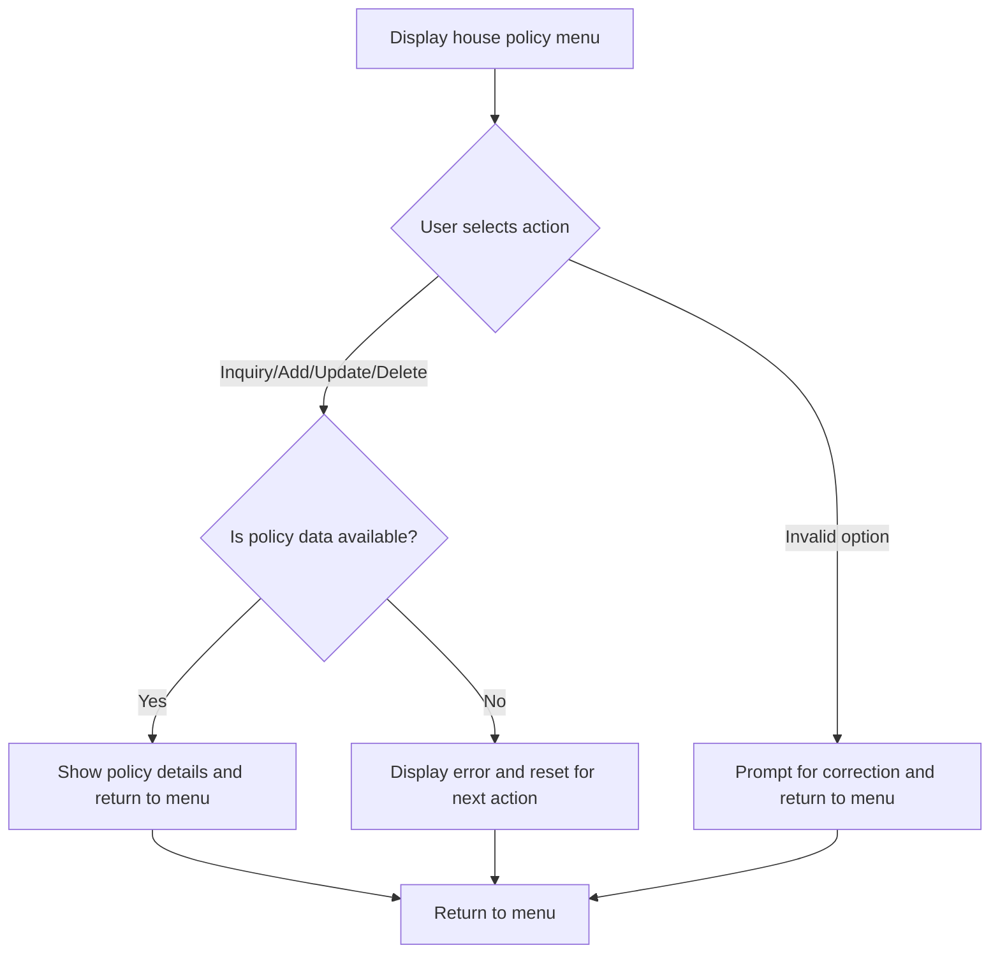
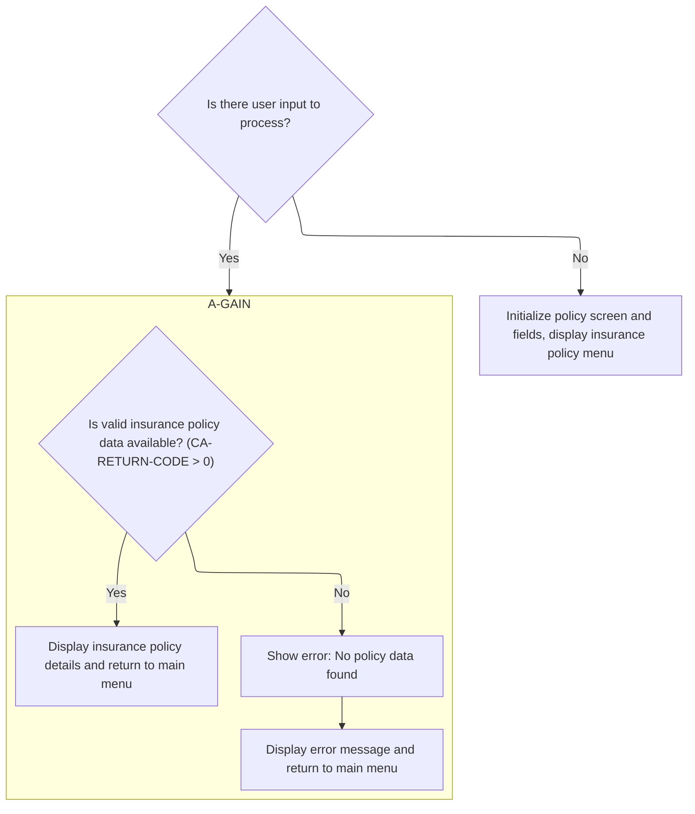
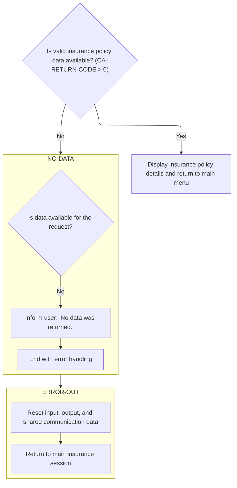
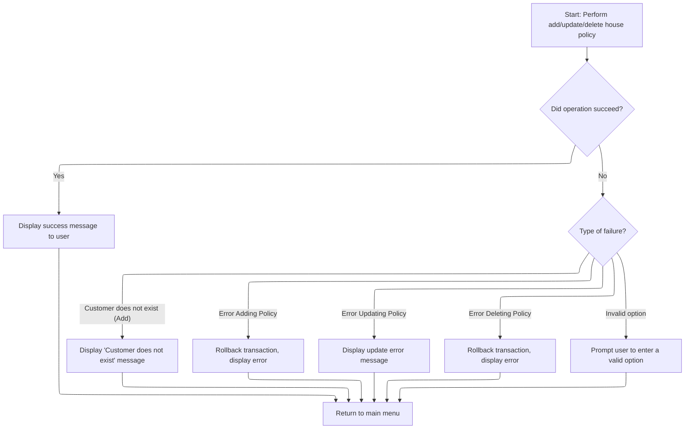

# Program Overview

This document describes the flow for managing house insurance policy transactions (<SwmToken path="base/src/lgtestp3.cbl" pos="11:6:6" line-data="       PROGRAM-ID. LGTESTP3.">`LGTESTP3`</SwmToken>). Users interact with a menu to inquire about, add, update, or delete house policies. The system processes these actions, displaying policy details, confirmation messages, or error notifications as appropriate. For example, if a user attempts to add a policy and the customer does not exist, an error message is shown and the menu is reset for the next action.

Main steps:

- Display the house policy menu
- Process user selection for inquiry, add, update, or delete
- Show policy details or error messages
- Confirm successful operations
- Prompt for correction on invalid input



## Dependencies

### Programs

- <SwmToken path="base/src/lgtestp3.cbl" pos="70:10:10" line-data="                 EXEC CICS LINK PROGRAM(&#39;LGIPOL01&#39;)">`LGIPOL01`</SwmToken> (<SwmPath>[base/src/lgipol01.cbl](base/src/lgipol01.cbl)</SwmPath>)
- LGIPDB01 (<SwmPath>[base/src/lgipdb01.cbl](base/src/lgipdb01.cbl)</SwmPath>)
- LGSTSQ (<SwmPath>[base/src/lgstsq.cbl](base/src/lgstsq.cbl)</SwmPath>)
- <SwmToken path="base/src/lgtestp3.cbl" pos="106:10:10" line-data="                 EXEC CICS LINK PROGRAM(&#39;LGAPOL01&#39;)">`LGAPOL01`</SwmToken> (<SwmPath>[base/src/lgapol01.cbl](base/src/lgapol01.cbl)</SwmPath>)
- LGAPDB01 (<SwmPath>[base/src/LGAPDB01.cbl](base/src/LGAPDB01.cbl)</SwmPath>)
- LGAPDB02
- LGAPDB03 (<SwmPath>[base/src/LGAPDB03.cbl](base/src/LGAPDB03.cbl)</SwmPath>)
- LGAPDB04 (<SwmPath>[base/src/LGAPDB04.cbl](base/src/LGAPDB04.cbl)</SwmPath>)
- <SwmToken path="base/src/lgtestp3.cbl" pos="129:10:10" line-data="                 EXEC CICS LINK PROGRAM(&#39;LGDPOL01&#39;)">`LGDPOL01`</SwmToken> (<SwmPath>[base/src/lgdpol01.cbl](base/src/lgdpol01.cbl)</SwmPath>)
- LGDPDB01 (<SwmPath>[base/src/lgdpdb01.cbl](base/src/lgdpdb01.cbl)</SwmPath>)
- LGDPVS01 (<SwmPath>[base/src/lgdpvs01.cbl](base/src/lgdpvs01.cbl)</SwmPath>)
- <SwmToken path="base/src/lgtestp3.cbl" pos="196:10:10" line-data="                 EXEC CICS LINK PROGRAM(&#39;LGUPOL01&#39;)">`LGUPOL01`</SwmToken> (<SwmPath>[base/src/lgupol01.cbl](base/src/lgupol01.cbl)</SwmPath>)
- LGUPDB01 (<SwmPath>[base/src/lgupdb01.cbl](base/src/lgupdb01.cbl)</SwmPath>)
- LGUPVS01 (<SwmPath>[base/src/lgupvs01.cbl](base/src/lgupvs01.cbl)</SwmPath>)

### Copybooks

- SQLCA
- LGPOLICY (<SwmPath>[base/src/lgpolicy.cpy](base/src/lgpolicy.cpy)</SwmPath>)
- LGCMAREA (<SwmPath>[base/src/lgcmarea.cpy](base/src/lgcmarea.cpy)</SwmPath>)
- INPUTREC2 (<SwmPath>[base/src/INPUTREC2.cpy](base/src/INPUTREC2.cpy)</SwmPath>)
- OUTPUTREC (<SwmPath>[base/src/OUTPUTREC.cpy](base/src/OUTPUTREC.cpy)</SwmPath>)
- WORKSTOR (<SwmPath>[base/src/WORKSTOR.cpy](base/src/WORKSTOR.cpy)</SwmPath>)
- LGAPACT (<SwmPath>[base/src/LGAPACT.cpy](base/src/LGAPACT.cpy)</SwmPath>)
- SSMAP

# Program Workflow

# Entry Point and Initial Request Handling



## Processing User Actions in the Policy Menu



<SwmSnippet path="/base/src/lgtestp3.cbl" line="74">

---

In <SwmToken path="base/src/lgtestp3.cbl" pos="33:5:7" line-data="              GO TO A-GAIN.">`A-GAIN`</SwmToken>, if no data is found, we jump to <SwmToken path="base/src/lgtestp3.cbl" pos="75:5:7" line-data="                   GO TO NO-DATA">`NO-DATA`</SwmToken> to handle the error and reset the menu.

```cobol
                 IF CA-RETURN-CODE > 0
                   GO TO NO-DATA
                 END-IF
```

---

</SwmSnippet>

### Handling Missing Policy Data

<SwmSnippet path="/base/src/lgtestp3.cbl" line="285">

---

<SwmToken path="base/src/lgtestp3.cbl" pos="285:1:3" line-data="       NO-DATA.">`NO-DATA`</SwmToken> sets the error message for missing policy data and then calls <SwmToken path="base/src/lgtestp3.cbl" pos="287:5:7" line-data="           Go To ERROR-OUT.">`ERROR-OUT`</SwmToken> to actually display it and reset the system for the next user action.

```cobol
       NO-DATA.
           Move 'No data was returned.'            To  ERP3FLDO
           Go To ERROR-OUT.
```

---

</SwmSnippet>

### Displaying Errors and Resetting State

<SwmSnippet path="/base/src/lgtestp3.cbl" line="295">

---

<SwmToken path="base/src/lgtestp3.cbl" pos="271:5:7" line-data="               Go To ERROR-OUT">`ERROR-OUT`</SwmToken> resets all the relevant data areas and then calls <SwmToken path="base/src/lgtestp3.cbl" pos="299:5:7" line-data="           GO TO ENDIT-STARTIT.">`ENDIT-STARTIT`</SwmToken> to return control to CICS and pass the menu data for the next transaction.

```cobol
           Initialize SSMAPP3I.
           Initialize SSMAPP3O.
           Initialize COMM-AREA.

           GO TO ENDIT-STARTIT.
```

---

</SwmSnippet>

<SwmSnippet path="/base/src/lgtestp3.cbl" line="238">

---

<SwmToken path="base/src/lgtestp3.cbl" pos="238:1:3" line-data="       ENDIT-STARTIT.">`ENDIT-STARTIT`</SwmToken> does a CICS RETURN to transaction <SwmToken path="base/src/lgtestp3.cbl" pos="240:4:4" line-data="                TRANSID(&#39;SSP3&#39;)">`SSP3`</SwmToken>, passing <SwmToken path="base/src/lgtestp3.cbl" pos="241:3:5" line-data="                COMMAREA(COMM-AREA)">`COMM-AREA`</SwmToken>. This hands off control and data to the next menu transaction, assuming <SwmToken path="base/src/lgtestp3.cbl" pos="241:3:5" line-data="                COMMAREA(COMM-AREA)">`COMM-AREA`</SwmToken> is set up as expected.

```cobol
       ENDIT-STARTIT.
           EXEC CICS RETURN
                TRANSID('SSP3')
                COMMAREA(COMM-AREA)
                END-EXEC.
```

---

</SwmSnippet>

### Populating and Displaying Policy Data



<SwmSnippet path="/base/src/lgtestp3.cbl" line="78">

---

Back in <SwmToken path="base/src/lgtestp3.cbl" pos="33:5:7" line-data="              GO TO A-GAIN.">`A-GAIN`</SwmToken>, after handling <SwmToken path="base/src/lgtestp3.cbl" pos="75:5:7" line-data="                   GO TO NO-DATA">`NO-DATA`</SwmToken>, we move policy data into output fields and send the map to the user. Then we call <SwmToken path="base/src/lgtestp3.cbl" pos="90:5:7" line-data="                 GO TO ENDIT-STARTIT">`ENDIT-STARTIT`</SwmToken> to return control to the menu transaction.

```cobol
                 Move CA-ISSUE-DATE      To  ENP3IDAI
                 Move CA-EXPIRY-DATE     To  ENP3EDAI
                 Move CA-H-PROPERTY-TYPE To  ENP3TYPI
                 Move CA-H-BEDROOMS      To  ENP3BEDI
                 Move CA-H-VALUE         To  ENP3VALI
                 Move CA-H-HOUSE-NAME    To  ENP3HNMI
                 Move CA-H-HOUSE-NUMBER  To  ENP3HNOI
                 Move CA-H-POSTCODE      To  ENP3HPCI
                 EXEC CICS SEND MAP ('SSMAPP3')
                           FROM(SSMAPP3O)
                           MAPSET ('SSMAP')
                 END-EXEC
                 GO TO ENDIT-STARTIT
```

---

</SwmSnippet>

<SwmSnippet path="/base/src/lgtestp3.cbl" line="110">

---

In <SwmToken path="base/src/lgtestp3.cbl" pos="33:5:7" line-data="              GO TO A-GAIN.">`A-GAIN`</SwmToken>, after returning from <SwmToken path="base/src/lgtestp3.cbl" pos="90:5:7" line-data="                 GO TO ENDIT-STARTIT">`ENDIT-STARTIT`</SwmToken>, if there's an error, we rollback the transaction and call <SwmToken path="base/src/lgtestp3.cbl" pos="112:5:7" line-data="                   GO TO NO-ADD">`NO-ADD`</SwmToken> to show the error and reset for the next action.

```cobol
                 IF CA-RETURN-CODE > 0
                   Exec CICS Syncpoint Rollback End-Exec
                   GO TO NO-ADD
                 END-IF
```

---

</SwmSnippet>

<SwmSnippet path="/base/src/lgtestp3.cbl" line="267">

---

<SwmToken path="base/src/lgtestp3.cbl" pos="267:1:3" line-data="       NO-ADD.">`NO-ADD`</SwmToken> sets the error message based on the return code (customer missing or add failed) and then calls <SwmToken path="base/src/lgtestp3.cbl" pos="271:5:7" line-data="               Go To ERROR-OUT">`ERROR-OUT`</SwmToken> to display it and reset the system.

```cobol
       NO-ADD.
           Evaluate CA-RETURN-CODE
             When 70
               Move 'Customer does not exist'          To  ERP1FLDO
               Go To ERROR-OUT
             When Other
               Move 'Error Adding House Policy'        To  ERP1FLDO
               Go To ERROR-OUT
           End-Evaluate.
```

---

</SwmSnippet>

<SwmSnippet path="/base/src/lgtestp3.cbl" line="133">

---

In <SwmToken path="base/src/lgtestp3.cbl" pos="33:5:7" line-data="              GO TO A-GAIN.">`A-GAIN`</SwmToken>, after <SwmToken path="base/src/lgtestp3.cbl" pos="112:5:7" line-data="                   GO TO NO-ADD">`NO-ADD`</SwmToken>, if a delete fails, we rollback and jump to <SwmToken path="base/src/lgtestp3.cbl" pos="135:5:7" line-data="                   GO TO NO-DELETE">`NO-DELETE`</SwmToken> to set the error and reset for the next action.

```cobol
                 IF CA-RETURN-CODE > 0
                   Exec CICS Syncpoint Rollback End-Exec
                   GO TO NO-DELETE
                 END-IF
```

---

</SwmSnippet>

<SwmSnippet path="/base/src/lgtestp3.cbl" line="281">

---

<SwmToken path="base/src/lgtestp3.cbl" pos="281:1:3" line-data="       NO-DELETE.">`NO-DELETE`</SwmToken> sets the error message for a failed delete and then calls <SwmToken path="base/src/lgtestp3.cbl" pos="283:5:7" line-data="           Go To ERROR-OUT.">`ERROR-OUT`</SwmToken> to show it and reset the system.

```cobol
       NO-DELETE.
           Move 'Error Deleting House Policy'      To  ERP3FLDO
           Go To ERROR-OUT.
```

---

</SwmSnippet>

<SwmSnippet path="/base/src/lgtestp3.cbl" line="200">

---

In <SwmToken path="base/src/lgtestp3.cbl" pos="33:5:7" line-data="              GO TO A-GAIN.">`A-GAIN`</SwmToken>, after <SwmToken path="base/src/lgtestp3.cbl" pos="135:5:7" line-data="                   GO TO NO-DELETE">`NO-DELETE`</SwmToken>, if updating fails, we jump to <SwmToken path="base/src/lgtestp3.cbl" pos="201:5:7" line-data="                   GO TO NO-UPD">`NO-UPD`</SwmToken> to set the error and reset for the next action.

```cobol
                 IF CA-RETURN-CODE > 0
                   GO TO NO-UPD
                 END-IF
```

---

</SwmSnippet>

<SwmSnippet path="/base/src/lgtestp3.cbl" line="277">

---

<SwmToken path="base/src/lgtestp3.cbl" pos="277:1:3" line-data="       NO-UPD.">`NO-UPD`</SwmToken> sets the error message for a failed update and then calls <SwmToken path="base/src/lgtestp3.cbl" pos="279:5:7" line-data="           Go To ERROR-OUT.">`ERROR-OUT`</SwmToken> to show it and reset the system.

```cobol
       NO-UPD.
           Move 'Error Updating House Policy'      To  ERP3FLDO
           Go To ERROR-OUT.
```

---

</SwmSnippet>

<SwmSnippet path="/base/src/lgtestp3.cbl" line="204">

---

In <SwmToken path="base/src/lgtestp3.cbl" pos="33:5:7" line-data="              GO TO A-GAIN.">`A-GAIN`</SwmToken>, after <SwmToken path="base/src/lgtestp3.cbl" pos="201:5:7" line-data="                   GO TO NO-UPD">`NO-UPD`</SwmToken>, we move updated policy data into output fields, set a confirmation message, send the map to the user, and call <SwmToken path="base/src/lgtestp3.cbl" pos="214:5:7" line-data="                 GO TO ENDIT-STARTIT">`ENDIT-STARTIT`</SwmToken> to return to the menu.

```cobol
                 Move CA-CUSTOMER-NUM To ENP3CNOI
                 Move CA-POLICY-NUM   To ENP3PNOI
                 Move ' '             To ENP3OPTI
                 Move 'House Policy Updated'
                   To  ERP3FLDO
                 EXEC CICS SEND MAP ('SSMAPP3')
                           FROM(SSMAPP3O)
                           MAPSET ('SSMAP')
                 END-EXEC

                 GO TO ENDIT-STARTIT
```

---

</SwmSnippet>

<SwmSnippet path="/base/src/lgtestp3.cbl" line="217">

---

If the user enters an invalid option in <SwmToken path="base/src/lgtestp3.cbl" pos="33:5:7" line-data="              GO TO A-GAIN.">`A-GAIN`</SwmToken>, we set an error message, position the cursor, send the map, and call <SwmToken path="base/src/lgtestp3.cbl" pos="228:5:7" line-data="                 GO TO ENDIT-STARTIT">`ENDIT-STARTIT`</SwmToken> to return to the menu for correction.

```cobol
             WHEN OTHER

                 Move 'Please enter a valid option'
                   To  ERP3FLDO
                 Move -1 To ENP3OPTL

                 EXEC CICS SEND MAP ('SSMAPP3')
                           FROM(SSMAPP3O)
                           MAPSET ('SSMAP')
                           CURSOR
                 END-EXEC
                 GO TO ENDIT-STARTIT

           END-EVALUATE.


      *    Send message to terminal and return

           EXEC CICS RETURN
           END-EXEC.
```

---

</SwmSnippet>

## Initial Menu Setup and User Entry

<SwmSnippet path="/base/src/lgtestp3.cbl" line="30">

---

In <SwmToken path="base/src/lgtestp3.cbl" pos="30:1:1" line-data="       MAINLINE SECTION.">`MAINLINE`</SwmToken>, if there's input, we jump to <SwmToken path="base/src/lgtestp3.cbl" pos="33:5:7" line-data="              GO TO A-GAIN.">`A-GAIN`</SwmToken> to handle it.

```cobol
       MAINLINE SECTION.

           IF EIBCALEN > 0
              GO TO A-GAIN.
```

---

</SwmSnippet>

<SwmSnippet path="/base/src/lgtestp3.cbl" line="35">

---

After checking for input, we initialize all menu and communication data to default values so the user starts with a clean slate before the menu is shown.

```cobol
           Initialize SSMAPP3I.
           Initialize SSMAPP3O.
           Initialize COMM-AREA.
           MOVE '0000000000'   To ENP3CNOO.
           MOVE '0000000000'   To ENP3PNOO.
           MOVE '00000000'     To ENP3VALO.
           MOVE '000'          To ENP3BEDO.
```

---

</SwmSnippet>

<SwmSnippet path="/base/src/lgtestp3.cbl" line="45">

---

MAINLINE sends the menu map to the user and erases the screen so they always get a fresh view to start their interaction.

```cobol
           EXEC CICS SEND MAP ('SSMAPP3')
                     MAPSET ('SSMAP')
                     ERASE
                     END-EXEC.
```

---

</SwmSnippet>

&nbsp;

*This is an auto-generated document by Swimm 🌊 and has not yet been verified by a human*

<SwmMeta version="3.0.0" repo-id="Z2l0aHViJTNBJTNBY2ljcy1nZW5hcHAtZGVtbyUzQSUzQXN3aW1taW8=" repo-name="cics-genapp-demo"><sup>Powered by [Swimm](https://app.swimm.io/)</sup></SwmMeta>
