# Overview

This document explains the flow for managing house insurance policies through a menu-driven interface. Users can select actions to view, add, delete, or update policies, with each action validated and processed by backend systems, and results displayed to the user.

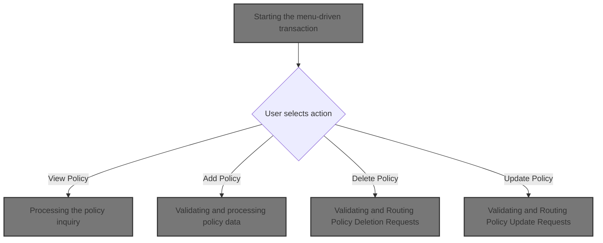
```mermaid
flowchart TD
    node1["Starting the menu-driven transaction"]:::HeadingStyle --> node2{"User selects action"}
    click node1 goToHeading "Starting the menu-driven transaction"
    node2 -->|"View Policy"| node3["Processing the policy inquiry"]:::HeadingStyle
    click node3 goToHeading "Processing the policy inquiry"
    node2 -->|"Add Policy"| node4["Validating and processing policy data"]:::HeadingStyle
    click node4 goToHeading "Validating and processing policy data"
    node2 -->|"Delete Policy"| node5["Validating and Routing Policy Deletion Requests"]:::HeadingStyle
    click node5 goToHeading "Validating and Routing Policy Deletion Requests"
    node2 -->|"Update Policy"| node6["Validating and Routing Policy Update Requests"]:::HeadingStyle
    click node6 goToHeading "Validating and Routing Policy Update Requests"
classDef HeadingStyle fill:#777777,stroke:#333,stroke-width:2px;
```

# Technical Overview


```mermaid
sequenceDiagram
    participant MENU as LGTESTP3.cbl<br/>*(Menu-driven house policy transaction controller)*
    participant INQUIRY as LGIPOL01.cbl<br/>*(Policy inquiry coordinator)*
    participant INQDB as LGIPDB01.cbl<br/>*(Policy data retriever)*
    participant ADD as LGAPOL01.cbl<br/>*(Policy addition coordinator)*
    participant ADDDB as base/src/LGAPDB01.cbl<br/>*(Policy addition processor)*
    participant DELETE as LGDPOL01.cbl<br/>*(Policy deletion coordinator)*
    participant DELDB as LGDPDB01.cbl<br/>*(Policy deletion processor)*
    participant DELVSAM as LGDPVS01.cbl<br/>*(VSAM policy record deleter)*
    participant UPDATE as LGUPOL01.cbl<br/>*(Policy update coordinator)*
    participant UPDB as LGUPDB01.cbl<br/>*(Policy update processor)*
    participant UPVSAM as LGUPVS01.cbl<br/>*(VSAM policy record updater)*
    participant LOGGER as LGSTSQS.cbl<br/>*(Error and audit logger)*

    MENU->>INQUIRY: Initiate policy inquiry
    INQUIRY->>INQDB: Retrieve policy data
    INQUIRY->>LOGGER: Log errors for inquiries

    MENU->>ADD: Initiate policy addition
    ADD->>ADDDB: Process policy addition
    ADD->>LOGGER: Log errors for additions

    MENU->>DELETE: Initiate policy deletion
    DELETE->>DELDB: Process policy deletion
    DELETE->>LOGGER: Log errors for deletions
    DELDB->>DELVSAM: Delete VSAM policy record

    MENU->>UPDATE: Initiate policy update
    UPDATE->>UPDB: Process policy update
    UPDATE->>LOGGER: Log errors for updates
    UPDB->>UPVSAM: Update VSAM policy record

%% Swimm:
%% sequenceDiagram
%%     participant MENU as LGTESTP3.cbl<br/>*(Menu-driven house policy transaction controller)*
%%     participant INQUIRY as LGIPOL01.cbl<br/>*(Policy inquiry coordinator)*
%%     participant INQDB as LGIPDB01.cbl<br/>*(Policy data retriever)*
%%     participant ADD as LGAPOL01.cbl<br/>*(Policy addition coordinator)*
%%     participant ADDDB as <SwmPath>[base/src/LGAPDB01.cbl](base/src/LGAPDB01.cbl)</SwmPath><br/>*(Policy addition processor)*
%%     participant DELETE as LGDPOL01.cbl<br/>*(Policy deletion coordinator)*
%%     participant DELDB as LGDPDB01.cbl<br/>*(Policy deletion processor)*
%%     participant DELVSAM as LGDPVS01.cbl<br/>*(VSAM policy record deleter)*
%%     participant UPDATE as LGUPOL01.cbl<br/>*(Policy update coordinator)*
%%     participant UPDB as LGUPDB01.cbl<br/>*(Policy update processor)*
%%     participant UPVSAM as LGUPVS01.cbl<br/>*(VSAM policy record updater)*
%%     participant LOGGER as LGSTSQS.cbl<br/>*(Error and audit logger)*
%% 
%%     MENU->>INQUIRY: Initiate policy inquiry
%%     INQUIRY->>INQDB: Retrieve policy data
%%     INQUIRY->>LOGGER: Log errors for inquiries
%% 
%%     MENU->>ADD: Initiate policy addition
%%     ADD->>ADDDB: Process policy addition
%%     ADD->>LOGGER: Log errors for additions
%% 
%%     MENU->>DELETE: Initiate policy deletion
%%     DELETE->>DELDB: Process policy deletion
%%     DELETE->>LOGGER: Log errors for deletions
%%     DELDB->>DELVSAM: Delete VSAM policy record
%% 
%%     MENU->>UPDATE: Initiate policy update
%%     UPDATE->>UPDB: Process policy update
%%     UPDATE->>LOGGER: Log errors for updates
%%     UPDB->>UPVSAM: Update VSAM policy record
```

## Dependencies

### Programs

- <SwmToken path="base/src/lgtestp3.cbl" pos="70:10:10" line-data="                 EXEC CICS LINK PROGRAM(&#39;LGIPOL01&#39;)">`LGIPOL01`</SwmToken> (<SwmPath>[base/src/lgipol01.cbl](base/src/lgipol01.cbl)</SwmPath>)
- <SwmToken path="base/src/lgipol01.cbl" pos="91:9:9" line-data="           EXEC CICS LINK Program(LGIPDB01)">`LGIPDB01`</SwmToken> (<SwmPath>[base/src/lgipdb01.cbl](base/src/lgipdb01.cbl)</SwmPath>)
- LGSTSQ (<SwmPath>[base/src/lgstsq.cbl](base/src/lgstsq.cbl)</SwmPath>)
- <SwmToken path="base/src/lgtestp3.cbl" pos="106:10:10" line-data="                 EXEC CICS LINK PROGRAM(&#39;LGAPOL01&#39;)">`LGAPOL01`</SwmToken> (<SwmPath>[base/src/lgapol01.cbl](base/src/lgapol01.cbl)</SwmPath>)
- <SwmToken path="base/src/lgapol01.cbl" pos="103:9:9" line-data="           EXEC CICS Link Program(LGAPDB01)">`LGAPDB01`</SwmToken> (<SwmPath>[base/src/LGAPDB01.cbl](base/src/LGAPDB01.cbl)</SwmPath>)
- <SwmToken path="base/src/LGAPDB01.cbl" pos="269:4:4" line-data="           CALL &#39;LGAPDB02&#39; USING IN-PROPERTY-TYPE, IN-POSTCODE, ">`LGAPDB02`</SwmToken>
- <SwmToken path="base/src/LGAPDB01.cbl" pos="276:4:4" line-data="           CALL &#39;LGAPDB03&#39; USING WS-BASE-RISK-SCR, IN-FIRE-PERIL, ">`LGAPDB03`</SwmToken> (<SwmPath>[base/src/LGAPDB03.cbl](base/src/LGAPDB03.cbl)</SwmPath>)
- <SwmToken path="base/src/LGAPDB01.cbl" pos="313:4:4" line-data="               CALL &#39;LGAPDB04&#39; USING LK-INPUT-DATA, LK-COVERAGE-DATA, ">`LGAPDB04`</SwmToken> (<SwmPath>[base/src/LGAPDB04.cbl](base/src/LGAPDB04.cbl)</SwmPath>)
- <SwmToken path="base/src/lgtestp3.cbl" pos="129:10:10" line-data="                 EXEC CICS LINK PROGRAM(&#39;LGDPOL01&#39;)">`LGDPOL01`</SwmToken> (<SwmPath>[base/src/lgdpol01.cbl](base/src/lgdpol01.cbl)</SwmPath>)
- <SwmToken path="base/src/lgdpol01.cbl" pos="141:9:9" line-data="           EXEC CICS LINK PROGRAM(LGDPDB01)">`LGDPDB01`</SwmToken> (<SwmPath>[base/src/lgdpdb01.cbl](base/src/lgdpdb01.cbl)</SwmPath>)
- <SwmToken path="base/src/lgdpdb01.cbl" pos="168:9:9" line-data="               EXEC CICS LINK PROGRAM(LGDPVS01)">`LGDPVS01`</SwmToken> (<SwmPath>[base/src/lgdpvs01.cbl](base/src/lgdpvs01.cbl)</SwmPath>)
- <SwmToken path="base/src/lgtestp3.cbl" pos="196:10:10" line-data="                 EXEC CICS LINK PROGRAM(&#39;LGUPOL01&#39;)">`LGUPOL01`</SwmToken> (<SwmPath>[base/src/lgupol01.cbl](base/src/lgupol01.cbl)</SwmPath>)
- <SwmToken path="base/src/lgupol01.cbl" pos="157:9:9" line-data="           EXEC CICS LINK Program(LGUPDB01)">`LGUPDB01`</SwmToken> (<SwmPath>[base/src/lgupdb01.cbl](base/src/lgupdb01.cbl)</SwmPath>)
- <SwmToken path="base/src/lgupdb01.cbl" pos="209:9:9" line-data="           EXEC CICS LINK Program(LGUPVS01)">`LGUPVS01`</SwmToken> (<SwmPath>[base/src/lgupvs01.cbl](base/src/lgupvs01.cbl)</SwmPath>)

### Copybooks

- SQLCA
- LGPOLICY (<SwmPath>[base/src/lgpolicy.cpy](base/src/lgpolicy.cpy)</SwmPath>)
- LGCMAREA (<SwmPath>[base/src/lgcmarea.cpy](base/src/lgcmarea.cpy)</SwmPath>)
- <SwmToken path="base/src/LGAPDB01.cbl" pos="35:3:3" line-data="           COPY INPUTREC2.">`INPUTREC2`</SwmToken> (<SwmPath>[base/src/INPUTREC2.cpy](base/src/INPUTREC2.cpy)</SwmPath>)
- OUTPUTREC (<SwmPath>[base/src/OUTPUTREC.cpy](base/src/OUTPUTREC.cpy)</SwmPath>)
- WORKSTOR (<SwmPath>[base/src/WORKSTOR.cpy](base/src/WORKSTOR.cpy)</SwmPath>)
- LGAPACT (<SwmPath>[base/src/LGAPACT.cpy](base/src/LGAPACT.cpy)</SwmPath>)
- SSMAP

## Detailed View of the Program's Functionality

a. Overview and Initialization

The program in question is responsible for updating policy details in the insurance application. It is invoked as part of the backend workflow when a user requests to update a policy (such as a house, endowment, or motor policy) from the menu-driven interface. The program begins by initializing its working storage, which includes setting up fields for transaction and terminal identification, task number, and pointers for the communication area (commarea). It also prepares variables for date and time, error message formatting, and policy data lengths for different policy types.

b. Input Validation and Preparation

Upon entry, the program checks if any request data (commarea) has been received. If no data is present, it logs an error message, writes it to the error queue, and abends (terminates abnormally) with a specific code. If data is present, it sets the return code to indicate success and records the length and address of the commarea for further processing.

The program then determines which type of policy update is being requested by examining a specific field in the commarea. It calculates the minimum required length for the commarea based on the policy type (endowment, house, or motor). If the commarea is too short for the requested operation, it sets an error code and returns immediately, ensuring that only complete and valid requests are processed.

c. Delegating the Update Operation

Once the input is validated and the commarea is confirmed to be of sufficient length, the program delegates the actual update operation to another backend program responsible for interacting with the database (<SwmToken path="base/src/lgipdb01.cbl" pos="242:5:5" line-data="      * initialize DB2 host variables">`DB2`</SwmToken>). This is done via a CICS LINK command, which passes the commarea and its length to the database update program. This separation of concerns allows the current program to focus on validation and orchestration, while the database program handles the specifics of updating policy records in <SwmToken path="base/src/lgipdb01.cbl" pos="242:5:5" line-data="      * initialize DB2 host variables">`DB2`</SwmToken>.

d. Error Handling and Logging

Throughout the process, the program is equipped with robust error handling. If any error occurs (such as missing or insufficient commarea, or a failure in the update process), the program constructs a detailed error message. This message includes the date, time, program name, and a description of the error. The error message is then sent to a logging program, which writes it to both a transient data queue (TDQ) and a temporary storage queue (TSQ) for auditing and troubleshooting purposes.

Additionally, if there is any commarea data available, up to 90 bytes of this data are also logged alongside the error message. This provides valuable context for debugging, as it allows support personnel to see the raw data that caused the error.

e. Program Termination

After completing the update operation or handling any errors, the program returns control to the calling process. If the update was successful, the return code in the commarea indicates success; if there was an error, the return code reflects the specific issue encountered. The program ensures that all resources are properly released and that the calling process receives a clear indication of the outcome.

In summary, this program acts as a gatekeeper for policy update requests, ensuring that only valid and complete requests are processed, delegating the actual update to a specialized backend program, and providing comprehensive error logging for any issues that arise during processing.

# Rule Definition

| Paragraph Name                                                                                                                                                                                                                                                                                                                                                                                                                                                                                                                                                                                                                                                | Rule ID | Category          | Description                                                                                                                                                                                                                                                                                                                                                                                                                | Conditions                                                        | Remarks                                                                                                                                                                                                                                                                                                                                                                                                                                                                                                                                                                                                                                                                                                                                                                                                                                                                                                                                                                                                                                                                                            |
| ------------------------------------------------------------------------------------------------------------------------------------------------------------------------------------------------------------------------------------------------------------------------------------------------------------------------------------------------------------------------------------------------------------------------------------------------------------------------------------------------------------------------------------------------------------------------------------------------------------------------------------------------------------- | ------- | ----------------- | -------------------------------------------------------------------------------------------------------------------------------------------------------------------------------------------------------------------------------------------------------------------------------------------------------------------------------------------------------------------------------------------------------------------------- | ----------------------------------------------------------------- | -------------------------------------------------------------------------------------------------------------------------------------------------------------------------------------------------------------------------------------------------------------------------------------------------------------------------------------------------------------------------------------------------------------------------------------------------------------------------------------------------------------------------------------------------------------------------------------------------------------------------------------------------------------------------------------------------------------------------------------------------------------------------------------------------------------------------------------------------------------------------------------------------------------------------------------------------------------------------------------------------------------------------------------------------------------------------------------------------- |
| MAINLINE SECTION (<SwmToken path="base/src/lgtestp3.cbl" pos="11:6:6" line-data="       PROGRAM-ID. LGTESTP3.">`LGTESTP3`</SwmToken>), EVALUATE <SwmToken path="base/src/lgtestp3.cbl" pos="64:3:3" line-data="           EVALUATE ENP3OPTO">`ENP3OPTO`</SwmToken>                                                                                                                                                                                                                                                                                                                                                                                            | RL-001  | Conditional Logic | The program must present a main menu with options to view, add, delete, or update an insurance policy. The user is prompted to select an option by entering a single character ('1', '2', '3', or '4').                                                                                                                                                                                                                    | User is at the main menu screen.                                  | Valid options are '1', '2', '3', '4'. Input is a single character, left-aligned, space-padded if necessary.                                                                                                                                                                                                                                                                                                                                                                                                                                                                                                                                                                                                                                                                                                                                                                                                                                                                                                                                                                                        |
| MAINLINE SECTION (<SwmToken path="base/src/lgtestp3.cbl" pos="11:6:6" line-data="       PROGRAM-ID. LGTESTP3.">`LGTESTP3`</SwmToken>), CLEARIT, <SwmToken path="base/src/lgtestp3.cbl" pos="271:5:7" line-data="               Go To ERROR-OUT">`ERROR-OUT`</SwmToken>                                                                                                                                                                                                                                                                                                                                                                                        | RL-002  | Data Assignment   | Before processing any new request, all previous session data and relevant input/output fields must be cleared and reset to their default (padded) values.                                                                                                                                                                                                                                                                  | Before any operation, after an error, or when CLEAR is pressed.   | Fields are reset to spaces for strings, zeros for numbers. All fields are fixed-length and padded.                                                                                                                                                                                                                                                                                                                                                                                                                                                                                                                                                                                                                                                                                                                                                                                                                                                                                                                                                                                                 |
| MAINLINE SECTION (<SwmToken path="base/src/lgtestp3.cbl" pos="11:6:6" line-data="       PROGRAM-ID. LGTESTP3.">`LGTESTP3`</SwmToken>), throughout all CRUD operations                                                                                                                                                                                                                                                                                                                                                                                                                                                                                         | RL-003  | Data Assignment   | All fields in input, output, logs, and commarea data must be strictly fixed-length, padded with spaces for strings and zeros for numbers.                                                                                                                                                                                                                                                                                  | Any time data is displayed, logged, or sent between programs.     | No delimiters; all fields are fixed-position and fixed-length. Example: customer number is 10 digits, left-padded with zeros; property type is 15 characters, left-aligned, space-padded.                                                                                                                                                                                                                                                                                                                                                                                                                                                                                                                                                                                                                                                                                                                                                                                                                                                                                                          |
| EVALUATE <SwmToken path="base/src/lgtestp3.cbl" pos="64:3:3" line-data="           EVALUATE ENP3OPTO">`ENP3OPTO`</SwmToken> WHEN '1' (<SwmToken path="base/src/lgtestp3.cbl" pos="11:6:6" line-data="       PROGRAM-ID. LGTESTP3.">`LGTESTP3`</SwmToken>), <SwmToken path="base/src/lgtestp3.cbl" pos="70:10:10" line-data="                 EXEC CICS LINK PROGRAM(&#39;LGIPOL01&#39;)">`LGIPOL01`</SwmToken>, <SwmToken path="base/src/lgipol01.cbl" pos="91:9:9" line-data="           EXEC CICS LINK Program(LGIPDB01)">`LGIPDB01`</SwmToken>                                                                                                             | RL-004  | Conditional Logic | When 'View Policy' is selected, prompt for customer and policy numbers, construct commarea with inquiry code (e.g., <SwmToken path="base/src/lgtestp3.cbl" pos="67:4:4" line-data="                 Move &#39;01IHOU&#39;   To CA-REQUEST-ID">`01IHOU`</SwmToken>), retrieve policy details, and display them in fixed-length, padded fields. If not found, display error message and return to menu.                      | User selects option '1' and provides customer and policy numbers. | <SwmToken path="base/src/lgtestp3.cbl" pos="67:9:13" line-data="                 Move &#39;01IHOU&#39;   To CA-REQUEST-ID">`CA-REQUEST-ID`</SwmToken> for house inquiry is <SwmToken path="base/src/lgtestp3.cbl" pos="67:4:4" line-data="                 Move &#39;01IHOU&#39;   To CA-REQUEST-ID">`01IHOU`</SwmToken>. Output fields are fixed-length, padded. Error message shown in dedicated message field.                                                                                                                                                                                                                                                                                                                                                                                                                                                                                                                                                                                                                                                                                  |
| EVALUATE <SwmToken path="base/src/lgtestp3.cbl" pos="64:3:3" line-data="           EVALUATE ENP3OPTO">`ENP3OPTO`</SwmToken> WHEN '2' (<SwmToken path="base/src/lgtestp3.cbl" pos="11:6:6" line-data="       PROGRAM-ID. LGTESTP3.">`LGTESTP3`</SwmToken>), <SwmToken path="base/src/lgtestp3.cbl" pos="106:10:10" line-data="                 EXEC CICS LINK PROGRAM(&#39;LGAPOL01&#39;)">`LGAPOL01`</SwmToken>, <SwmToken path="base/src/lgapol01.cbl" pos="103:9:9" line-data="           EXEC CICS Link Program(LGAPDB01)">`LGAPDB01`</SwmToken>                                                                                                           | RL-005  | Conditional Logic | When 'Add Policy' is selected, prompt for all required fields, construct commarea with add code (e.g., <SwmToken path="base/src/lgtestp3.cbl" pos="93:4:4" line-data="                 Move &#39;01AHOU&#39;          To CA-REQUEST-ID">`01AHOU`</SwmToken>), validate input, and attempt to add policy. If customer does not exist, display error. If successful, show confirmation with new policy and customer numbers. | User selects option '2' and provides all required fields.         | <SwmToken path="base/src/lgtestp3.cbl" pos="67:9:13" line-data="                 Move &#39;01IHOU&#39;   To CA-REQUEST-ID">`CA-REQUEST-ID`</SwmToken> for house add is <SwmToken path="base/src/lgtestp3.cbl" pos="93:4:4" line-data="                 Move &#39;01AHOU&#39;          To CA-REQUEST-ID">`01AHOU`</SwmToken>. Confirmation message includes new policy and customer numbers, both fixed-length and padded.                                                                                                                                                                                                                                                                                                                                                                                                                                                                                                                                                                                                                                                                          |
| EVALUATE <SwmToken path="base/src/lgtestp3.cbl" pos="64:3:3" line-data="           EVALUATE ENP3OPTO">`ENP3OPTO`</SwmToken> WHEN '3' (<SwmToken path="base/src/lgtestp3.cbl" pos="11:6:6" line-data="       PROGRAM-ID. LGTESTP3.">`LGTESTP3`</SwmToken>), <SwmToken path="base/src/lgtestp3.cbl" pos="129:10:10" line-data="                 EXEC CICS LINK PROGRAM(&#39;LGDPOL01&#39;)">`LGDPOL01`</SwmToken>, <SwmToken path="base/src/lgdpol01.cbl" pos="141:9:9" line-data="           EXEC CICS LINK PROGRAM(LGDPDB01)">`LGDPDB01`</SwmToken>                                                                                                           | RL-006  | Conditional Logic | When 'Delete Policy' is selected, prompt for customer and policy numbers, construct commarea with delete code (e.g., <SwmToken path="base/src/lgtestp3.cbl" pos="126:4:4" line-data="                 Move &#39;01DHOU&#39;   To CA-REQUEST-ID">`01DHOU`</SwmToken>), and attempt to delete policy. If successful, display confirmation. If not found or error, display error message.                                     | User selects option '3' and provides customer and policy numbers. | <SwmToken path="base/src/lgtestp3.cbl" pos="67:9:13" line-data="                 Move &#39;01IHOU&#39;   To CA-REQUEST-ID">`CA-REQUEST-ID`</SwmToken> for house delete is <SwmToken path="base/src/lgtestp3.cbl" pos="126:4:4" line-data="                 Move &#39;01DHOU&#39;   To CA-REQUEST-ID">`01DHOU`</SwmToken>. Confirmation and error messages are fixed-length, padded.                                                                                                                                                                                                                                                                                                                                                                                                                                                                                                                                                                                                                                                                                                                |
| EVALUATE <SwmToken path="base/src/lgtestp3.cbl" pos="64:3:3" line-data="           EVALUATE ENP3OPTO">`ENP3OPTO`</SwmToken> WHEN '4' (<SwmToken path="base/src/lgtestp3.cbl" pos="11:6:6" line-data="       PROGRAM-ID. LGTESTP3.">`LGTESTP3`</SwmToken>), <SwmToken path="base/src/lgtestp3.cbl" pos="196:10:10" line-data="                 EXEC CICS LINK PROGRAM(&#39;LGUPOL01&#39;)">`LGUPOL01`</SwmToken>, <SwmToken path="base/src/lgupol01.cbl" pos="157:9:9" line-data="           EXEC CICS LINK Program(LGUPDB01)">`LGUPDB01`</SwmToken>                                                                                                           | RL-007  | Conditional Logic | When 'Update Policy' is selected, prompt for all required fields, construct commarea with update code (e.g., <SwmToken path="base/src/lgtestp3.cbl" pos="183:4:4" line-data="                 Move &#39;01UHOU&#39;          To CA-REQUEST-ID">`01UHOU`</SwmToken>), validate input, and attempt to update policy. If successful, display confirmation. If not found, timestamp mismatch, or error, display error message. | User selects option '4' and provides all required fields.         | <SwmToken path="base/src/lgtestp3.cbl" pos="67:9:13" line-data="                 Move &#39;01IHOU&#39;   To CA-REQUEST-ID">`CA-REQUEST-ID`</SwmToken> for house update is <SwmToken path="base/src/lgtestp3.cbl" pos="183:4:4" line-data="                 Move &#39;01UHOU&#39;          To CA-REQUEST-ID">`01UHOU`</SwmToken>. Confirmation and error messages are fixed-length, padded. Timestamp mismatch returns code '02'.                                                                                                                                                                                                                                                                                                                                                                                                                                                                                                                                                                                                                                                                   |
| <SwmToken path="base/src/lgtestp3.cbl" pos="271:5:7" line-data="               Go To ERROR-OUT">`ERROR-OUT`</SwmToken> (<SwmToken path="base/src/lgtestp3.cbl" pos="11:6:6" line-data="       PROGRAM-ID. LGTESTP3.">`LGTESTP3`</SwmToken>), <SwmToken path="base/src/lgipol01.cbl" pos="81:3:7" line-data="               PERFORM WRITE-ERROR-MESSAGE">`WRITE-ERROR-MESSAGE`</SwmToken> in all logic programs                                                                                                                                                                                                                                                | RL-008  | Conditional Logic | All error messages must be displayed to the user in a dedicated message field on the terminal screen. After an error, the session resets to the main menu.                                                                                                                                                                                                                                                                 | Any error occurs during an operation.                             | Message field is fixed-length, left-aligned, space-padded. Session resets to main menu after error.                                                                                                                                                                                                                                                                                                                                                                                                                                                                                                                                                                                                                                                                                                                                                                                                                                                                                                                                                                                                |
| <SwmToken path="base/src/lgipol01.cbl" pos="81:3:7" line-data="               PERFORM WRITE-ERROR-MESSAGE">`WRITE-ERROR-MESSAGE`</SwmToken> in all logic programs, LGSTSQ                                                                                                                                                                                                                                                                                                                                                                                                                                                                                     | RL-009  | Data Assignment   | All error events must be logged to the console with a fixed-format string including current date, time, program/module name, error message, and up to 90 bytes of commarea data, prefixed with 'COMMAREA='.                                                                                                                                                                                                                | Any error event occurs.                                           | Log format: \[date: 8 bytes\]\[space\]\[time: 6 bytes\]\[space\]\[program name: 9 bytes\]\[error message: 21 bytes\]\[COMMAREA=\]\[commarea data: up to 90 bytes\]. All fields are fixed-length, padded.                                                                                                                                                                                                                                                                                                                                                                                                                                                                                                                                                                                                                                                                                                                                                                                                                                                                                           |
| Throughout all CRUD operations, LGSTSQ, <SwmToken path="base/src/lgtestp3.cbl" pos="70:10:10" line-data="                 EXEC CICS LINK PROGRAM(&#39;LGIPOL01&#39;)">`LGIPOL01`</SwmToken>, <SwmToken path="base/src/lgtestp3.cbl" pos="106:10:10" line-data="                 EXEC CICS LINK PROGRAM(&#39;LGAPOL01&#39;)">`LGAPOL01`</SwmToken>, <SwmToken path="base/src/lgtestp3.cbl" pos="129:10:10" line-data="                 EXEC CICS LINK PROGRAM(&#39;LGDPOL01&#39;)">`LGDPOL01`</SwmToken>, <SwmToken path="base/src/lgtestp3.cbl" pos="196:10:10" line-data="                 EXEC CICS LINK PROGRAM(&#39;LGUPOL01&#39;)">`LGUPOL01`</SwmToken> | RL-010  | Data Assignment   | Input and output fields must not use delimiters; all fields are fixed-position and fixed-length.                                                                                                                                                                                                                                                                                                                           | Any time data is input or output.                                 | No delimiters; fields are fixed-position and fixed-length. Example: customer number is 10 digits, property type is 15 characters.                                                                                                                                                                                                                                                                                                                                                                                                                                                                                                                                                                                                                                                                                                                                                                                                                                                                                                                                                                  |
| <SwmToken path="base/src/lgtestp3.cbl" pos="228:5:7" line-data="                 GO TO ENDIT-STARTIT">`ENDIT-STARTIT`</SwmToken> (<SwmToken path="base/src/lgtestp3.cbl" pos="11:6:6" line-data="       PROGRAM-ID. LGTESTP3.">`LGTESTP3`</SwmToken>), session loop                                                                                                                                                                                                                                                                                                                                                                                           | RL-011  | Conditional Logic | The user may perform multiple operations in a session, returning to the main menu after each operation or error.                                                                                                                                                                                                                                                                                                           | After any operation or error.                                     | Session returns to main menu after each operation or error.                                                                                                                                                                                                                                                                                                                                                                                                                                                                                                                                                                                                                                                                                                                                                                                                                                                                                                                                                                                                                                        |
| EVALUATE <SwmToken path="base/src/lgtestp3.cbl" pos="64:3:3" line-data="           EVALUATE ENP3OPTO">`ENP3OPTO`</SwmToken> WHEN OTHER (<SwmToken path="base/src/lgtestp3.cbl" pos="11:6:6" line-data="       PROGRAM-ID. LGTESTP3.">`LGTESTP3`</SwmToken>)                                                                                                                                                                                                                                                                                                                                                                                                   | RL-012  | Conditional Logic | If the user enters an invalid menu option, display a specific error message and prompt the user to re-enter a valid option, positioning the cursor on the option field.                                                                                                                                                                                                                                                    | User input is not '1', '2', '3', or '4'.                          | Error message: 'Please enter a valid option'. Cursor is positioned on the option field.                                                                                                                                                                                                                                                                                                                                                                                                                                                                                                                                                                                                                                                                                                                                                                                                                                                                                                                                                                                                            |
| All CRUD operations, <SwmToken path="base/src/lgtestp3.cbl" pos="70:10:10" line-data="                 EXEC CICS LINK PROGRAM(&#39;LGIPOL01&#39;)">`LGIPOL01`</SwmToken>, <SwmToken path="base/src/lgtestp3.cbl" pos="106:10:10" line-data="                 EXEC CICS LINK PROGRAM(&#39;LGAPOL01&#39;)">`LGAPOL01`</SwmToken>, <SwmToken path="base/src/lgtestp3.cbl" pos="129:10:10" line-data="                 EXEC CICS LINK PROGRAM(&#39;LGDPOL01&#39;)">`LGDPOL01`</SwmToken>, <SwmToken path="base/src/lgtestp3.cbl" pos="196:10:10" line-data="                 EXEC CICS LINK PROGRAM(&#39;LGUPOL01&#39;)">`LGUPOL01`</SwmToken>                    | RL-013  | Conditional Logic | The program must handle all valid <SwmToken path="base/src/lgtestp3.cbl" pos="67:9:13" line-data="                 Move &#39;01IHOU&#39;   To CA-REQUEST-ID">`CA-REQUEST-ID`</SwmToken> and <SwmToken path="base/src/lgtestp3.cbl" pos="74:3:7" line-data="                 IF CA-RETURN-CODE &gt; 0">`CA-RETURN-CODE`</SwmToken> values, mapping them to the correct user messages and behaviors.                         | Any CRUD operation is performed.                                  | <SwmToken path="base/src/lgtestp3.cbl" pos="67:9:13" line-data="                 Move &#39;01IHOU&#39;   To CA-REQUEST-ID">`CA-REQUEST-ID`</SwmToken> values: <SwmToken path="base/src/lgtestp3.cbl" pos="67:4:4" line-data="                 Move &#39;01IHOU&#39;   To CA-REQUEST-ID">`01IHOU`</SwmToken>, <SwmToken path="base/src/lgtestp3.cbl" pos="93:4:4" line-data="                 Move &#39;01AHOU&#39;          To CA-REQUEST-ID">`01AHOU`</SwmToken>, <SwmToken path="base/src/lgtestp3.cbl" pos="126:4:4" line-data="                 Move &#39;01DHOU&#39;   To CA-REQUEST-ID">`01DHOU`</SwmToken>, <SwmToken path="base/src/lgtestp3.cbl" pos="183:4:4" line-data="                 Move &#39;01UHOU&#39;          To CA-REQUEST-ID">`01UHOU`</SwmToken>, etc. <SwmToken path="base/src/lgtestp3.cbl" pos="74:3:7" line-data="                 IF CA-RETURN-CODE &gt; 0">`CA-RETURN-CODE`</SwmToken> values: '00' (success), '01' (not found), '02' (timestamp mismatch), '70' (customer does not exist), '98' (commarea too short), '99' (invalid request), '90' (general error). |

# User Stories

## User Story 1: Menu-driven policy management and session flow

---

### Story Description:

As a policyholder using the terminal, I want to navigate a main menu to view, add, delete, or update my insurance policy, with all previous session data and input/output fields cleared and reset before each operation or after an error, so that I can manage my policies efficiently and always start with a clean slate.

---

### Business Rule Mapping:

| Rule ID | Paragraph Name                                                                                                                                                                                                                                                         | Rule Description                                                                                                                                                                                        |
| ------- | ---------------------------------------------------------------------------------------------------------------------------------------------------------------------------------------------------------------------------------------------------------------------- | ------------------------------------------------------------------------------------------------------------------------------------------------------------------------------------------------------- |
| RL-001  | MAINLINE SECTION (<SwmToken path="base/src/lgtestp3.cbl" pos="11:6:6" line-data="       PROGRAM-ID. LGTESTP3.">`LGTESTP3`</SwmToken>), EVALUATE <SwmToken path="base/src/lgtestp3.cbl" pos="64:3:3" line-data="           EVALUATE ENP3OPTO">`ENP3OPTO`</SwmToken>     | The program must present a main menu with options to view, add, delete, or update an insurance policy. The user is prompted to select an option by entering a single character ('1', '2', '3', or '4'). |
| RL-002  | MAINLINE SECTION (<SwmToken path="base/src/lgtestp3.cbl" pos="11:6:6" line-data="       PROGRAM-ID. LGTESTP3.">`LGTESTP3`</SwmToken>), CLEARIT, <SwmToken path="base/src/lgtestp3.cbl" pos="271:5:7" line-data="               Go To ERROR-OUT">`ERROR-OUT`</SwmToken> | Before processing any new request, all previous session data and relevant input/output fields must be cleared and reset to their default (padded) values.                                               |
| RL-011  | <SwmToken path="base/src/lgtestp3.cbl" pos="228:5:7" line-data="                 GO TO ENDIT-STARTIT">`ENDIT-STARTIT`</SwmToken> (<SwmToken path="base/src/lgtestp3.cbl" pos="11:6:6" line-data="       PROGRAM-ID. LGTESTP3.">`LGTESTP3`</SwmToken>), session loop    | The user may perform multiple operations in a session, returning to the main menu after each operation or error.                                                                                        |
| RL-012  | EVALUATE <SwmToken path="base/src/lgtestp3.cbl" pos="64:3:3" line-data="           EVALUATE ENP3OPTO">`ENP3OPTO`</SwmToken> WHEN OTHER (<SwmToken path="base/src/lgtestp3.cbl" pos="11:6:6" line-data="       PROGRAM-ID. LGTESTP3.">`LGTESTP3`</SwmToken>)            | If the user enters an invalid menu option, display a specific error message and prompt the user to re-enter a valid option, positioning the cursor on the option field.                                 |

---

### Relevant Functionality:

- **MAINLINE SECTION (**<SwmToken path="base/src/lgtestp3.cbl" pos="11:6:6" line-data="       PROGRAM-ID. LGTESTP3.">`LGTESTP3`</SwmToken>**)**
  1. **RL-001:**
     - Display main menu with four options
     - Wait for user input
     - If input is not one of '1', '2', '3', '4', display error message and prompt again
     - On valid input, proceed to corresponding operation
  2. **RL-002:**
     - On session start or after error, set all input/output fields to default values
     - For each field: if string, set to spaces; if number, set to zeros
     - Re-initialize commarea structure
- <SwmToken path="base/src/lgtestp3.cbl" pos="228:5:7" line-data="                 GO TO ENDIT-STARTIT">`ENDIT-STARTIT`</SwmToken> **(**<SwmToken path="base/src/lgtestp3.cbl" pos="11:6:6" line-data="       PROGRAM-ID. LGTESTP3.">`LGTESTP3`</SwmToken>**)**
  1. **RL-011:**
     - After completing an operation or handling an error:
       - Re-display main menu
       - Wait for next user input
- **EVALUATE** <SwmToken path="base/src/lgtestp3.cbl" pos="64:3:3" line-data="           EVALUATE ENP3OPTO">`ENP3OPTO`</SwmToken> **WHEN OTHER (**<SwmToken path="base/src/lgtestp3.cbl" pos="11:6:6" line-data="       PROGRAM-ID. LGTESTP3.">`LGTESTP3`</SwmToken>**)**
  1. **RL-012:**
     - If input is invalid:
       - Set message field to error text
       - Position cursor on option field
       - Prompt user for valid input

## User Story 2: Strict field formatting and data handling

---

### Story Description:

As a user, I want all input, output, and logged data to use fixed-length, padded fields without delimiters so that data is consistently formatted and easy to read and process.

---

### Business Rule Mapping:

| Rule ID | Paragraph Name                                                                                                                                                                                                                                                                                                                                                                                                                                                                                                                                                                                                                                                | Rule Description                                                                                                                          |
| ------- | ------------------------------------------------------------------------------------------------------------------------------------------------------------------------------------------------------------------------------------------------------------------------------------------------------------------------------------------------------------------------------------------------------------------------------------------------------------------------------------------------------------------------------------------------------------------------------------------------------------------------------------------------------------- | ----------------------------------------------------------------------------------------------------------------------------------------- |
| RL-003  | MAINLINE SECTION (<SwmToken path="base/src/lgtestp3.cbl" pos="11:6:6" line-data="       PROGRAM-ID. LGTESTP3.">`LGTESTP3`</SwmToken>), throughout all CRUD operations                                                                                                                                                                                                                                                                                                                                                                                                                                                                                         | All fields in input, output, logs, and commarea data must be strictly fixed-length, padded with spaces for strings and zeros for numbers. |
| RL-010  | Throughout all CRUD operations, LGSTSQ, <SwmToken path="base/src/lgtestp3.cbl" pos="70:10:10" line-data="                 EXEC CICS LINK PROGRAM(&#39;LGIPOL01&#39;)">`LGIPOL01`</SwmToken>, <SwmToken path="base/src/lgtestp3.cbl" pos="106:10:10" line-data="                 EXEC CICS LINK PROGRAM(&#39;LGAPOL01&#39;)">`LGAPOL01`</SwmToken>, <SwmToken path="base/src/lgtestp3.cbl" pos="129:10:10" line-data="                 EXEC CICS LINK PROGRAM(&#39;LGDPOL01&#39;)">`LGDPOL01`</SwmToken>, <SwmToken path="base/src/lgtestp3.cbl" pos="196:10:10" line-data="                 EXEC CICS LINK PROGRAM(&#39;LGUPOL01&#39;)">`LGUPOL01`</SwmToken> | Input and output fields must not use delimiters; all fields are fixed-position and fixed-length.                                          |

---

### Relevant Functionality:

- **MAINLINE SECTION (**<SwmToken path="base/src/lgtestp3.cbl" pos="11:6:6" line-data="       PROGRAM-ID. LGTESTP3.">`LGTESTP3`</SwmToken>**)**
  1. **RL-003:**
     - When preparing data for output or commarea:
       - For each string field, pad with spaces to required length
       - For each numeric field, pad with zeros to required length
     - When displaying, ensure fields are aligned and padded
- **Throughout all CRUD operations**
  1. **RL-010:**
     - When preparing input/output, ensure no delimiters
     - Place each field at its fixed position and length

## User Story 3: View Policy operation

---

### Story Description:

As a policyholder, I want to view my insurance policy details by entering my customer and policy numbers so that I can verify my coverage and information, with clear error messages if the policy is not found.

---

### Business Rule Mapping:

| Rule ID | Paragraph Name                                                                                                                                                                                                                                                                                                                                                                                                                                                                                                                                                                                                                             | Rule Description                                                                                                                                                                                                                                                                                                                                                                                      |
| ------- | ------------------------------------------------------------------------------------------------------------------------------------------------------------------------------------------------------------------------------------------------------------------------------------------------------------------------------------------------------------------------------------------------------------------------------------------------------------------------------------------------------------------------------------------------------------------------------------------------------------------------------------------ | ----------------------------------------------------------------------------------------------------------------------------------------------------------------------------------------------------------------------------------------------------------------------------------------------------------------------------------------------------------------------------------------------------- |
| RL-004  | EVALUATE <SwmToken path="base/src/lgtestp3.cbl" pos="64:3:3" line-data="           EVALUATE ENP3OPTO">`ENP3OPTO`</SwmToken> WHEN '1' (<SwmToken path="base/src/lgtestp3.cbl" pos="11:6:6" line-data="       PROGRAM-ID. LGTESTP3.">`LGTESTP3`</SwmToken>), <SwmToken path="base/src/lgtestp3.cbl" pos="70:10:10" line-data="                 EXEC CICS LINK PROGRAM(&#39;LGIPOL01&#39;)">`LGIPOL01`</SwmToken>, <SwmToken path="base/src/lgipol01.cbl" pos="91:9:9" line-data="           EXEC CICS LINK Program(LGIPDB01)">`LGIPDB01`</SwmToken>                                                                                          | When 'View Policy' is selected, prompt for customer and policy numbers, construct commarea with inquiry code (e.g., <SwmToken path="base/src/lgtestp3.cbl" pos="67:4:4" line-data="                 Move &#39;01IHOU&#39;   To CA-REQUEST-ID">`01IHOU`</SwmToken>), retrieve policy details, and display them in fixed-length, padded fields. If not found, display error message and return to menu. |
| RL-013  | All CRUD operations, <SwmToken path="base/src/lgtestp3.cbl" pos="70:10:10" line-data="                 EXEC CICS LINK PROGRAM(&#39;LGIPOL01&#39;)">`LGIPOL01`</SwmToken>, <SwmToken path="base/src/lgtestp3.cbl" pos="106:10:10" line-data="                 EXEC CICS LINK PROGRAM(&#39;LGAPOL01&#39;)">`LGAPOL01`</SwmToken>, <SwmToken path="base/src/lgtestp3.cbl" pos="129:10:10" line-data="                 EXEC CICS LINK PROGRAM(&#39;LGDPOL01&#39;)">`LGDPOL01`</SwmToken>, <SwmToken path="base/src/lgtestp3.cbl" pos="196:10:10" line-data="                 EXEC CICS LINK PROGRAM(&#39;LGUPOL01&#39;)">`LGUPOL01`</SwmToken> | The program must handle all valid <SwmToken path="base/src/lgtestp3.cbl" pos="67:9:13" line-data="                 Move &#39;01IHOU&#39;   To CA-REQUEST-ID">`CA-REQUEST-ID`</SwmToken> and <SwmToken path="base/src/lgtestp3.cbl" pos="74:3:7" line-data="                 IF CA-RETURN-CODE &gt; 0">`CA-RETURN-CODE`</SwmToken> values, mapping them to the correct user messages and behaviors.    |

---

### Relevant Functionality:

- **EVALUATE** <SwmToken path="base/src/lgtestp3.cbl" pos="64:3:3" line-data="           EVALUATE ENP3OPTO">`ENP3OPTO`</SwmToken> **WHEN '1' (**<SwmToken path="base/src/lgtestp3.cbl" pos="11:6:6" line-data="       PROGRAM-ID. LGTESTP3.">`LGTESTP3`</SwmToken>**)**
  1. **RL-004:**
     - Prompt user for customer and policy numbers
     - Construct commarea with <SwmToken path="base/src/lgtestp3.cbl" pos="67:9:13" line-data="                 Move &#39;01IHOU&#39;   To CA-REQUEST-ID">`CA-REQUEST-ID`</SwmToken> set to inquiry code
     - Call inquiry logic (<SwmToken path="base/src/lgtestp3.cbl" pos="70:10:10" line-data="                 EXEC CICS LINK PROGRAM(&#39;LGIPOL01&#39;)">`LGIPOL01`</SwmToken> -> <SwmToken path="base/src/lgipol01.cbl" pos="91:9:9" line-data="           EXEC CICS LINK Program(LGIPDB01)">`LGIPDB01`</SwmToken>)
     - If policy found, display all details in padded fields
     - If not found, set error message and return to menu
- **All CRUD operations**
  1. **RL-013:**
     - On operation completion:
       - Check <SwmToken path="base/src/lgtestp3.cbl" pos="74:3:7" line-data="                 IF CA-RETURN-CODE &gt; 0">`CA-RETURN-CODE`</SwmToken>
       - If '00', display confirmation
       - If error code, display mapped error message
       - If '02', display timestamp mismatch message
       - If '70', display customer not found message

## User Story 4: Add Policy operation

---

### Story Description:

As a prospective policyholder, I want to add a new insurance policy by providing all required information so that I can obtain coverage, with confirmation or error messages based on the outcome.

---

### Business Rule Mapping:

| Rule ID | Paragraph Name                                                                                                                                                                                                                                                                                                                                                                                                                                                                                                                                                                                                                             | Rule Description                                                                                                                                                                                                                                                                                                                                                                                                           |
| ------- | ------------------------------------------------------------------------------------------------------------------------------------------------------------------------------------------------------------------------------------------------------------------------------------------------------------------------------------------------------------------------------------------------------------------------------------------------------------------------------------------------------------------------------------------------------------------------------------------------------------------------------------------ | -------------------------------------------------------------------------------------------------------------------------------------------------------------------------------------------------------------------------------------------------------------------------------------------------------------------------------------------------------------------------------------------------------------------------- |
| RL-005  | EVALUATE <SwmToken path="base/src/lgtestp3.cbl" pos="64:3:3" line-data="           EVALUATE ENP3OPTO">`ENP3OPTO`</SwmToken> WHEN '2' (<SwmToken path="base/src/lgtestp3.cbl" pos="11:6:6" line-data="       PROGRAM-ID. LGTESTP3.">`LGTESTP3`</SwmToken>), <SwmToken path="base/src/lgtestp3.cbl" pos="106:10:10" line-data="                 EXEC CICS LINK PROGRAM(&#39;LGAPOL01&#39;)">`LGAPOL01`</SwmToken>, <SwmToken path="base/src/lgapol01.cbl" pos="103:9:9" line-data="           EXEC CICS Link Program(LGAPDB01)">`LGAPDB01`</SwmToken>                                                                                        | When 'Add Policy' is selected, prompt for all required fields, construct commarea with add code (e.g., <SwmToken path="base/src/lgtestp3.cbl" pos="93:4:4" line-data="                 Move &#39;01AHOU&#39;          To CA-REQUEST-ID">`01AHOU`</SwmToken>), validate input, and attempt to add policy. If customer does not exist, display error. If successful, show confirmation with new policy and customer numbers. |
| RL-013  | All CRUD operations, <SwmToken path="base/src/lgtestp3.cbl" pos="70:10:10" line-data="                 EXEC CICS LINK PROGRAM(&#39;LGIPOL01&#39;)">`LGIPOL01`</SwmToken>, <SwmToken path="base/src/lgtestp3.cbl" pos="106:10:10" line-data="                 EXEC CICS LINK PROGRAM(&#39;LGAPOL01&#39;)">`LGAPOL01`</SwmToken>, <SwmToken path="base/src/lgtestp3.cbl" pos="129:10:10" line-data="                 EXEC CICS LINK PROGRAM(&#39;LGDPOL01&#39;)">`LGDPOL01`</SwmToken>, <SwmToken path="base/src/lgtestp3.cbl" pos="196:10:10" line-data="                 EXEC CICS LINK PROGRAM(&#39;LGUPOL01&#39;)">`LGUPOL01`</SwmToken> | The program must handle all valid <SwmToken path="base/src/lgtestp3.cbl" pos="67:9:13" line-data="                 Move &#39;01IHOU&#39;   To CA-REQUEST-ID">`CA-REQUEST-ID`</SwmToken> and <SwmToken path="base/src/lgtestp3.cbl" pos="74:3:7" line-data="                 IF CA-RETURN-CODE &gt; 0">`CA-RETURN-CODE`</SwmToken> values, mapping them to the correct user messages and behaviors.                         |

---

### Relevant Functionality:

- **EVALUATE** <SwmToken path="base/src/lgtestp3.cbl" pos="64:3:3" line-data="           EVALUATE ENP3OPTO">`ENP3OPTO`</SwmToken> **WHEN '2' (**<SwmToken path="base/src/lgtestp3.cbl" pos="11:6:6" line-data="       PROGRAM-ID. LGTESTP3.">`LGTESTP3`</SwmToken>**)**
  1. **RL-005:**
     - Prompt user for all required policy/customer fields
     - Construct commarea with <SwmToken path="base/src/lgtestp3.cbl" pos="67:9:13" line-data="                 Move &#39;01IHOU&#39;   To CA-REQUEST-ID">`CA-REQUEST-ID`</SwmToken> set to add code
     - Call add logic (<SwmToken path="base/src/lgtestp3.cbl" pos="106:10:10" line-data="                 EXEC CICS LINK PROGRAM(&#39;LGAPOL01&#39;)">`LGAPOL01`</SwmToken> -> <SwmToken path="base/src/lgapol01.cbl" pos="103:9:9" line-data="           EXEC CICS Link Program(LGAPDB01)">`LGAPDB01`</SwmToken>)
     - Validate input
     - If customer does not exist, display error
     - If add successful, display confirmation with new numbers
- **All CRUD operations**
  1. **RL-013:**
     - On operation completion:
       - Check <SwmToken path="base/src/lgtestp3.cbl" pos="74:3:7" line-data="                 IF CA-RETURN-CODE &gt; 0">`CA-RETURN-CODE`</SwmToken>
       - If '00', display confirmation
       - If error code, display mapped error message
       - If '02', display timestamp mismatch message
       - If '70', display customer not found message

## User Story 5: Delete Policy operation

---

### Story Description:

As a policyholder, I want to delete an existing insurance policy by providing my customer and policy numbers so that I can remove unwanted coverage, with confirmation or error messages as appropriate.

---

### Business Rule Mapping:

| Rule ID | Paragraph Name                                                                                                                                                                                                                                                                                                                                                                                                                                                                                                                                                                                                                             | Rule Description                                                                                                                                                                                                                                                                                                                                                                                   |
| ------- | ------------------------------------------------------------------------------------------------------------------------------------------------------------------------------------------------------------------------------------------------------------------------------------------------------------------------------------------------------------------------------------------------------------------------------------------------------------------------------------------------------------------------------------------------------------------------------------------------------------------------------------------ | -------------------------------------------------------------------------------------------------------------------------------------------------------------------------------------------------------------------------------------------------------------------------------------------------------------------------------------------------------------------------------------------------- |
| RL-006  | EVALUATE <SwmToken path="base/src/lgtestp3.cbl" pos="64:3:3" line-data="           EVALUATE ENP3OPTO">`ENP3OPTO`</SwmToken> WHEN '3' (<SwmToken path="base/src/lgtestp3.cbl" pos="11:6:6" line-data="       PROGRAM-ID. LGTESTP3.">`LGTESTP3`</SwmToken>), <SwmToken path="base/src/lgtestp3.cbl" pos="129:10:10" line-data="                 EXEC CICS LINK PROGRAM(&#39;LGDPOL01&#39;)">`LGDPOL01`</SwmToken>, <SwmToken path="base/src/lgdpol01.cbl" pos="141:9:9" line-data="           EXEC CICS LINK PROGRAM(LGDPDB01)">`LGDPDB01`</SwmToken>                                                                                        | When 'Delete Policy' is selected, prompt for customer and policy numbers, construct commarea with delete code (e.g., <SwmToken path="base/src/lgtestp3.cbl" pos="126:4:4" line-data="                 Move &#39;01DHOU&#39;   To CA-REQUEST-ID">`01DHOU`</SwmToken>), and attempt to delete policy. If successful, display confirmation. If not found or error, display error message.             |
| RL-013  | All CRUD operations, <SwmToken path="base/src/lgtestp3.cbl" pos="70:10:10" line-data="                 EXEC CICS LINK PROGRAM(&#39;LGIPOL01&#39;)">`LGIPOL01`</SwmToken>, <SwmToken path="base/src/lgtestp3.cbl" pos="106:10:10" line-data="                 EXEC CICS LINK PROGRAM(&#39;LGAPOL01&#39;)">`LGAPOL01`</SwmToken>, <SwmToken path="base/src/lgtestp3.cbl" pos="129:10:10" line-data="                 EXEC CICS LINK PROGRAM(&#39;LGDPOL01&#39;)">`LGDPOL01`</SwmToken>, <SwmToken path="base/src/lgtestp3.cbl" pos="196:10:10" line-data="                 EXEC CICS LINK PROGRAM(&#39;LGUPOL01&#39;)">`LGUPOL01`</SwmToken> | The program must handle all valid <SwmToken path="base/src/lgtestp3.cbl" pos="67:9:13" line-data="                 Move &#39;01IHOU&#39;   To CA-REQUEST-ID">`CA-REQUEST-ID`</SwmToken> and <SwmToken path="base/src/lgtestp3.cbl" pos="74:3:7" line-data="                 IF CA-RETURN-CODE &gt; 0">`CA-RETURN-CODE`</SwmToken> values, mapping them to the correct user messages and behaviors. |

---

### Relevant Functionality:

- **EVALUATE** <SwmToken path="base/src/lgtestp3.cbl" pos="64:3:3" line-data="           EVALUATE ENP3OPTO">`ENP3OPTO`</SwmToken> **WHEN '3' (**<SwmToken path="base/src/lgtestp3.cbl" pos="11:6:6" line-data="       PROGRAM-ID. LGTESTP3.">`LGTESTP3`</SwmToken>**)**
  1. **RL-006:**
     - Prompt user for customer and policy numbers
     - Construct commarea with <SwmToken path="base/src/lgtestp3.cbl" pos="67:9:13" line-data="                 Move &#39;01IHOU&#39;   To CA-REQUEST-ID">`CA-REQUEST-ID`</SwmToken> set to delete code
     - Call delete logic (<SwmToken path="base/src/lgtestp3.cbl" pos="129:10:10" line-data="                 EXEC CICS LINK PROGRAM(&#39;LGDPOL01&#39;)">`LGDPOL01`</SwmToken> -> <SwmToken path="base/src/lgdpol01.cbl" pos="141:9:9" line-data="           EXEC CICS LINK PROGRAM(LGDPDB01)">`LGDPDB01`</SwmToken>)
     - If delete successful, display confirmation
     - If not found or error, display error message
- **All CRUD operations**
  1. **RL-013:**
     - On operation completion:
       - Check <SwmToken path="base/src/lgtestp3.cbl" pos="74:3:7" line-data="                 IF CA-RETURN-CODE &gt; 0">`CA-RETURN-CODE`</SwmToken>
       - If '00', display confirmation
       - If error code, display mapped error message
       - If '02', display timestamp mismatch message
       - If '70', display customer not found message

## User Story 6: Update Policy operation

---

### Story Description:

As a policyholder, I want to update my insurance policy details by providing all required information so that I can keep my coverage up to date, with confirmation or error messages for success, not found, or timestamp mismatch.

---

### Business Rule Mapping:

| Rule ID | Paragraph Name                                                                                                                                                                                                                                                                                                                                                                                                                                                                                                                                                                                                                             | Rule Description                                                                                                                                                                                                                                                                                                                                                                                                           |
| ------- | ------------------------------------------------------------------------------------------------------------------------------------------------------------------------------------------------------------------------------------------------------------------------------------------------------------------------------------------------------------------------------------------------------------------------------------------------------------------------------------------------------------------------------------------------------------------------------------------------------------------------------------------ | -------------------------------------------------------------------------------------------------------------------------------------------------------------------------------------------------------------------------------------------------------------------------------------------------------------------------------------------------------------------------------------------------------------------------- |
| RL-007  | EVALUATE <SwmToken path="base/src/lgtestp3.cbl" pos="64:3:3" line-data="           EVALUATE ENP3OPTO">`ENP3OPTO`</SwmToken> WHEN '4' (<SwmToken path="base/src/lgtestp3.cbl" pos="11:6:6" line-data="       PROGRAM-ID. LGTESTP3.">`LGTESTP3`</SwmToken>), <SwmToken path="base/src/lgtestp3.cbl" pos="196:10:10" line-data="                 EXEC CICS LINK PROGRAM(&#39;LGUPOL01&#39;)">`LGUPOL01`</SwmToken>, <SwmToken path="base/src/lgupol01.cbl" pos="157:9:9" line-data="           EXEC CICS LINK Program(LGUPDB01)">`LGUPDB01`</SwmToken>                                                                                        | When 'Update Policy' is selected, prompt for all required fields, construct commarea with update code (e.g., <SwmToken path="base/src/lgtestp3.cbl" pos="183:4:4" line-data="                 Move &#39;01UHOU&#39;          To CA-REQUEST-ID">`01UHOU`</SwmToken>), validate input, and attempt to update policy. If successful, display confirmation. If not found, timestamp mismatch, or error, display error message. |
| RL-013  | All CRUD operations, <SwmToken path="base/src/lgtestp3.cbl" pos="70:10:10" line-data="                 EXEC CICS LINK PROGRAM(&#39;LGIPOL01&#39;)">`LGIPOL01`</SwmToken>, <SwmToken path="base/src/lgtestp3.cbl" pos="106:10:10" line-data="                 EXEC CICS LINK PROGRAM(&#39;LGAPOL01&#39;)">`LGAPOL01`</SwmToken>, <SwmToken path="base/src/lgtestp3.cbl" pos="129:10:10" line-data="                 EXEC CICS LINK PROGRAM(&#39;LGDPOL01&#39;)">`LGDPOL01`</SwmToken>, <SwmToken path="base/src/lgtestp3.cbl" pos="196:10:10" line-data="                 EXEC CICS LINK PROGRAM(&#39;LGUPOL01&#39;)">`LGUPOL01`</SwmToken> | The program must handle all valid <SwmToken path="base/src/lgtestp3.cbl" pos="67:9:13" line-data="                 Move &#39;01IHOU&#39;   To CA-REQUEST-ID">`CA-REQUEST-ID`</SwmToken> and <SwmToken path="base/src/lgtestp3.cbl" pos="74:3:7" line-data="                 IF CA-RETURN-CODE &gt; 0">`CA-RETURN-CODE`</SwmToken> values, mapping them to the correct user messages and behaviors.                         |

---

### Relevant Functionality:

- **EVALUATE** <SwmToken path="base/src/lgtestp3.cbl" pos="64:3:3" line-data="           EVALUATE ENP3OPTO">`ENP3OPTO`</SwmToken> **WHEN '4' (**<SwmToken path="base/src/lgtestp3.cbl" pos="11:6:6" line-data="       PROGRAM-ID. LGTESTP3.">`LGTESTP3`</SwmToken>**)**
  1. **RL-007:**
     - Prompt user for all required policy/customer fields
     - Construct commarea with <SwmToken path="base/src/lgtestp3.cbl" pos="67:9:13" line-data="                 Move &#39;01IHOU&#39;   To CA-REQUEST-ID">`CA-REQUEST-ID`</SwmToken> set to update code
     - Call update logic (<SwmToken path="base/src/lgtestp3.cbl" pos="196:10:10" line-data="                 EXEC CICS LINK PROGRAM(&#39;LGUPOL01&#39;)">`LGUPOL01`</SwmToken> -> <SwmToken path="base/src/lgupol01.cbl" pos="157:9:9" line-data="           EXEC CICS LINK Program(LGUPDB01)">`LGUPDB01`</SwmToken>)
     - Validate input and check timestamp
     - If update successful, display confirmation
     - If not found, timestamp mismatch, or error, display error message
- **All CRUD operations**
  1. **RL-013:**
     - On operation completion:
       - Check <SwmToken path="base/src/lgtestp3.cbl" pos="74:3:7" line-data="                 IF CA-RETURN-CODE &gt; 0">`CA-RETURN-CODE`</SwmToken>
       - If '00', display confirmation
       - If error code, display mapped error message
       - If '02', display timestamp mismatch message
       - If '70', display customer not found message

## User Story 7: Comprehensive error handling and recovery

---

### Story Description:

As a user or system administrator, I want all error messages to be shown in a dedicated message field, the session to reset to the main menu after an error, and all error events to be logged to the console with a fixed-format string including date, time, program name, error message, and commarea data, so that I am clearly informed of issues and can audit and troubleshoot problems effectively.

---

### Business Rule Mapping:

| Rule ID | Paragraph Name                                                                                                                                                                                                                                                                                                                                                                                                 | Rule Description                                                                                                                                                                                            |
| ------- | -------------------------------------------------------------------------------------------------------------------------------------------------------------------------------------------------------------------------------------------------------------------------------------------------------------------------------------------------------------------------------------------------------------- | ----------------------------------------------------------------------------------------------------------------------------------------------------------------------------------------------------------- |
| RL-008  | <SwmToken path="base/src/lgtestp3.cbl" pos="271:5:7" line-data="               Go To ERROR-OUT">`ERROR-OUT`</SwmToken> (<SwmToken path="base/src/lgtestp3.cbl" pos="11:6:6" line-data="       PROGRAM-ID. LGTESTP3.">`LGTESTP3`</SwmToken>), <SwmToken path="base/src/lgipol01.cbl" pos="81:3:7" line-data="               PERFORM WRITE-ERROR-MESSAGE">`WRITE-ERROR-MESSAGE`</SwmToken> in all logic programs | All error messages must be displayed to the user in a dedicated message field on the terminal screen. After an error, the session resets to the main menu.                                                  |
| RL-009  | <SwmToken path="base/src/lgipol01.cbl" pos="81:3:7" line-data="               PERFORM WRITE-ERROR-MESSAGE">`WRITE-ERROR-MESSAGE`</SwmToken> in all logic programs, LGSTSQ                                                                                                                                                                                                                                      | All error events must be logged to the console with a fixed-format string including current date, time, program/module name, error message, and up to 90 bytes of commarea data, prefixed with 'COMMAREA='. |

---

### Relevant Functionality:

- <SwmToken path="base/src/lgtestp3.cbl" pos="271:5:7" line-data="               Go To ERROR-OUT">`ERROR-OUT`</SwmToken> **(**<SwmToken path="base/src/lgtestp3.cbl" pos="11:6:6" line-data="       PROGRAM-ID. LGTESTP3.">`LGTESTP3`</SwmToken>**)**
  1. **RL-008:**
     - On error, set message field to error text
     - Display message field on terminal
     - Re-initialize session and return to main menu
- <SwmToken path="base/src/lgipol01.cbl" pos="81:3:7" line-data="               PERFORM WRITE-ERROR-MESSAGE">`WRITE-ERROR-MESSAGE`</SwmToken> **in all logic programs**
  1. **RL-009:**
     - On error event:
       - Format log string with date, time, program name, error message
       - Append 'COMMAREA=' and up to 90 bytes of commarea data
       - Write to console/log queue

# Workflow

# Starting the menu-driven transaction

This section governs the start of a menu-driven transaction for the insurance policy application, ensuring that the user is presented with a fresh interface and that any previous session data is cleared before new input is accepted.

| Category       | Rule Name                        | Description                                                                                                                            |
| -------------- | -------------------------------- | -------------------------------------------------------------------------------------------------------------------------------------- |
| Business logic | Immediate user action processing | If there is incoming transaction data, the system must immediately proceed to process user actions without resetting the session.      |
| Business logic | Session data reset               | All input, output, and communication area fields must be reset to their default values before presenting the menu to the user.         |
| Business logic | Clean menu presentation          | The initial menu screen must be sent to the user with all previous content erased, ensuring a clear and ready interface for new input. |

<SwmSnippet path="/base/src/lgtestp3.cbl" line="30">

---

In MAINLINE, the flow starts by checking if there's any incoming data (EIBCALEN > 0). If so, it jumps straight to <SwmToken path="base/src/lgtestp3.cbl" pos="33:5:7" line-data="              GO TO A-GAIN.">`A-GAIN`</SwmToken> to process user actions. This is the entry point for handling menu-driven insurance policy operations.

```cobol
       MAINLINE SECTION.

           IF EIBCALEN > 0
              GO TO A-GAIN.
```

---

</SwmSnippet>

<SwmSnippet path="/base/src/lgtestp3.cbl" line="35">

---

After the initial check, MAINLINE resets all relevant input/output and commarea fields to default values. This clears out any previous session data before presenting the menu to the user.

```cobol
           Initialize SSMAPP3I.
           Initialize SSMAPP3O.
           Initialize COMM-AREA.
           MOVE '0000000000'   To ENP3CNOO.
           MOVE '0000000000'   To ENP3PNOO.
           MOVE '00000000'     To ENP3VALO.
           MOVE '000'          To ENP3BEDO.
```

---

</SwmSnippet>

<SwmSnippet path="/base/src/lgtestp3.cbl" line="45">

---

MAINLINE sends the initial menu screen to the user, erasing any previous content so the interface is clean and ready for new input.

```cobol
           EXEC CICS SEND MAP ('SSMAPP3')
                     MAPSET ('SSMAP')
                     ERASE
                     END-EXEC.
```

---

</SwmSnippet>

# Handling user menu actions


```mermaid
%%{init: {"flowchart": {"defaultRenderer": "elk"}} }%%
flowchart TD
    node1["Receive user request"] --> node2{"Which action?"}
    click node1 openCode "base/src/lgtestp3.cbl:50:61"
    node2 -->|"View Policy ('1')"| node3["Processing the policy inquiry"]
    click node2 openCode "base/src/lgtestp3.cbl:66:73"
    node3 --> node4["Retrieving and formatting policy data"]
    
    node4 --> node5{"CA-RETURN-CODE > 0?"}
    
    node5 -->|"Yes"| node6["Displaying no-data error"]
    click node5 openCode "base/src/lgtestp3.cbl:74:76"
    node6 --> node7["Resetting session after error"]
    
    node7 --> node8["Return to menu"]
    
    node5 -->|"No"| node9["Show policy details"]
    click node9 openCode "base/src/lgtestp3.cbl:78:89"
    node9 --> node8
    node2 -->|"Add Policy ('2')"| node10["Validating and processing policy data"]
    
    node10 --> node11["Running the policy processing workflow"]
    
    node11 --> node12["Loading configuration for policy calculations"]
    
    node12 --> node13["Processing input policy records"]
    
    node13 --> node14["Validating and Logging Policy Input Errors"]
    
    node14 --> node15["Processing Validated Policy Records"]
    
    node15 --> node16["Call Add DB2 P009-PROCESS-VALID-RECORD"]
    click node16 openCode "base/src/LGAPDB01.cbl:234:P009-PROCESS-VALID-RECORD"
    node16 --> node17{"CA-RETURN-CODE > 0?"}
    click node16 openCode "base/src/lgtestp3.cbl:110:113"
    node17 -->|"Yes"| node18["Show add error message"]
    click node18 openCode "base/src/lgtestp3.cbl:267:275"
    node18 --> node7
    node17 -->|"No"| node19["Validating and Routing Policy Deletion Requests"]
    
    node19 --> node8
    node2 -->|"Delete Policy ('3')"| node20["Call Delete MAINLINE"]
    click node20 openCode "base/src/lgtestp3.cbl:125:132"
    node20 --> node21["Delegating Policy Deletion to Backend"]
    
    node21 --> node22["Validating and Executing DB2 Policy Deletion"]
    
    node22 --> node23["Deleting Policy Records from VSAM"]
    
    node23 --> node24["Call Delete DB2 MAINLINE"]
    click node24 openCode "base/src/lgdpvs01.cbl:72:MAINLINE"
    node24 --> node25{"CA-RETURN-CODE > 0?"}
    click node24 openCode "base/src/lgtestp3.cbl:133:136"
    node25 -->|"Yes"| node26["Show delete error message"]
    click node26 openCode "base/src/lgtestp3.cbl:281:283"
    node26 --> node7
    node25 -->|"No"| node27["Show delete success message"]
    click node27 openCode "base/src/lgtestp3.cbl:138:148"
    node27 --> node8
    node2 -->|"Update Policy ('4')"| node28["Call Update MAINLINE"]
    click node28 openCode "base/src/lgtestp3.cbl:155:162"
    node28 --> node29{"CA-RETURN-CODE > 0?"}
    click node29 openCode "base/src/lgtestp3.cbl:163:165"
    node29 -->|"Yes"| node6
    node29 -->|"No"| node30["Show policy details"]
    click node30 openCode "base/src/lgtestp3.cbl:167:178"
    node30 --> node31["Validating and Routing Policy Update Requests"]
    
    node31 --> node32["Updating policy details in the database"]
    
    node32 --> node33["Validating and executing the policy update"]
    
    node33 --> node34["Running the DB2 update for each policy type"]
    
    node34 --> node35["Updating the VSAM policy record"]
    
    node35 --> node36{"CA-RETURN-CODE > 0?"}
    click node36 openCode "base/src/lgtestp3.cbl:200:202"
    node36 -->|"Yes"| node37["Show update error message"]
    click node37 openCode "base/src/lgtestp3.cbl:277:279"
    node37 --> node7
    node36 -->|"No"| node38["Show update success message"]
    click node38 openCode "base/src/lgtestp3.cbl:204:212"
    node38 --> node8
    node2 -->|"Other"| node39["Prompt for valid option"]
    click node39 openCode "base/src/lgtestp3.cbl:217:229"
    node39 --> node8
    node8 --> node40["Return to menu"]
    click node40 openCode "base/src/lgtestp3.cbl:235:236"
classDef HeadingStyle fill:#777777,stroke:#333,stroke-width:2px;
click node3 goToHeading "Processing the policy inquiry"
node3:::HeadingStyle
click node4 goToHeading "Retrieving and formatting policy data"
node4:::HeadingStyle
click node6 goToHeading "Displaying no-data error"
node6:::HeadingStyle
click node7 goToHeading "Resetting session after error"
node7:::HeadingStyle
click node10 goToHeading "Validating and processing policy data"
node10:::HeadingStyle
click node11 goToHeading "Running the policy processing workflow"
node11:::HeadingStyle
click node12 goToHeading "Loading configuration for policy calculations"
node12:::HeadingStyle
click node13 goToHeading "Processing input policy records"
node13:::HeadingStyle
click node14 goToHeading "Validating and Logging Policy Input Errors"
node14:::HeadingStyle
click node15 goToHeading "Processing Validated Policy Records"
node15:::HeadingStyle
click node19 goToHeading "Validating and Routing Policy Deletion Requests"
node19:::HeadingStyle
click node21 goToHeading "Delegating Policy Deletion to Backend"
node21:::HeadingStyle
click node22 goToHeading "Validating and Executing DB2 Policy Deletion"
node22:::HeadingStyle
click node23 goToHeading "Deleting Policy Records from VSAM"
node23:::HeadingStyle
click node31 goToHeading "Validating and Routing Policy Update Requests"
node31:::HeadingStyle
click node32 goToHeading "Updating policy details in the database"
node32:::HeadingStyle
click node33 goToHeading "Validating and executing the policy update"
node33:::HeadingStyle
click node34 goToHeading "Running the DB2 update for each policy type"
node34:::HeadingStyle
click node35 goToHeading "Updating the VSAM policy record"
node35:::HeadingStyle

%% Swimm:
%% %%{init: {"flowchart": {"defaultRenderer": "elk"}} }%%
%% flowchart TD
%%     node1["Receive user request"] --> node2{"Which action?"}
%%     click node1 openCode "<SwmPath>[base/src/lgtestp3.cbl](base/src/lgtestp3.cbl)</SwmPath>:50:61"
%%     node2 -->|"View Policy ('1')"| node3["Processing the policy inquiry"]
%%     click node2 openCode "<SwmPath>[base/src/lgtestp3.cbl](base/src/lgtestp3.cbl)</SwmPath>:66:73"
%%     node3 --> node4["Retrieving and formatting policy data"]
%%     
%%     node4 --> node5{"<SwmToken path="base/src/lgtestp3.cbl" pos="74:3:7" line-data="                 IF CA-RETURN-CODE &gt; 0">`CA-RETURN-CODE`</SwmToken> > 0?"}
%%     
%%     node5 -->|"Yes"| node6["Displaying no-data error"]
%%     click node5 openCode "<SwmPath>[base/src/lgtestp3.cbl](base/src/lgtestp3.cbl)</SwmPath>:74:76"
%%     node6 --> node7["Resetting session after error"]
%%     
%%     node7 --> node8["Return to menu"]
%%     
%%     node5 -->|"No"| node9["Show policy details"]
%%     click node9 openCode "<SwmPath>[base/src/lgtestp3.cbl](base/src/lgtestp3.cbl)</SwmPath>:78:89"
%%     node9 --> node8
%%     node2 -->|"Add Policy ('2')"| node10["Validating and processing policy data"]
%%     
%%     node10 --> node11["Running the policy processing workflow"]
%%     
%%     node11 --> node12["Loading configuration for policy calculations"]
%%     
%%     node12 --> node13["Processing input policy records"]
%%     
%%     node13 --> node14["Validating and Logging Policy Input Errors"]
%%     
%%     node14 --> node15["Processing Validated Policy Records"]
%%     
%%     node15 --> node16["Call Add <SwmToken path="base/src/lgipdb01.cbl" pos="242:5:5" line-data="      * initialize DB2 host variables">`DB2`</SwmToken> <SwmToken path="base/src/LGAPDB01.cbl" pos="184:3:9" line-data="                   PERFORM P009-PROCESS-VALID-RECORD">`P009-PROCESS-VALID-RECORD`</SwmToken>"]
%%     click node16 openCode "<SwmPath>[base/src/LGAPDB01.cbl](base/src/LGAPDB01.cbl)</SwmPath>:234:<SwmToken path="base/src/LGAPDB01.cbl" pos="184:3:9" line-data="                   PERFORM P009-PROCESS-VALID-RECORD">`P009-PROCESS-VALID-RECORD`</SwmToken>"
%%     node16 --> node17{"<SwmToken path="base/src/lgtestp3.cbl" pos="74:3:7" line-data="                 IF CA-RETURN-CODE &gt; 0">`CA-RETURN-CODE`</SwmToken> > 0?"}
%%     click node16 openCode "<SwmPath>[base/src/lgtestp3.cbl](base/src/lgtestp3.cbl)</SwmPath>:110:113"
%%     node17 -->|"Yes"| node18["Show add error message"]
%%     click node18 openCode "<SwmPath>[base/src/lgtestp3.cbl](base/src/lgtestp3.cbl)</SwmPath>:267:275"
%%     node18 --> node7
%%     node17 -->|"No"| node19["Validating and Routing Policy Deletion Requests"]
%%     
%%     node19 --> node8
%%     node2 -->|"Delete Policy ('3')"| node20["Call Delete MAINLINE"]
%%     click node20 openCode "<SwmPath>[base/src/lgtestp3.cbl](base/src/lgtestp3.cbl)</SwmPath>:125:132"
%%     node20 --> node21["Delegating Policy Deletion to Backend"]
%%     
%%     node21 --> node22["Validating and Executing <SwmToken path="base/src/lgipdb01.cbl" pos="242:5:5" line-data="      * initialize DB2 host variables">`DB2`</SwmToken> Policy Deletion"]
%%     
%%     node22 --> node23["Deleting Policy Records from VSAM"]
%%     
%%     node23 --> node24["Call Delete <SwmToken path="base/src/lgipdb01.cbl" pos="242:5:5" line-data="      * initialize DB2 host variables">`DB2`</SwmToken> MAINLINE"]
%%     click node24 openCode "<SwmPath>[base/src/lgdpvs01.cbl](base/src/lgdpvs01.cbl)</SwmPath>:72:MAINLINE"
%%     node24 --> node25{"<SwmToken path="base/src/lgtestp3.cbl" pos="74:3:7" line-data="                 IF CA-RETURN-CODE &gt; 0">`CA-RETURN-CODE`</SwmToken> > 0?"}
%%     click node24 openCode "<SwmPath>[base/src/lgtestp3.cbl](base/src/lgtestp3.cbl)</SwmPath>:133:136"
%%     node25 -->|"Yes"| node26["Show delete error message"]
%%     click node26 openCode "<SwmPath>[base/src/lgtestp3.cbl](base/src/lgtestp3.cbl)</SwmPath>:281:283"
%%     node26 --> node7
%%     node25 -->|"No"| node27["Show delete success message"]
%%     click node27 openCode "<SwmPath>[base/src/lgtestp3.cbl](base/src/lgtestp3.cbl)</SwmPath>:138:148"
%%     node27 --> node8
%%     node2 -->|"Update Policy ('4')"| node28["Call Update MAINLINE"]
%%     click node28 openCode "<SwmPath>[base/src/lgtestp3.cbl](base/src/lgtestp3.cbl)</SwmPath>:155:162"
%%     node28 --> node29{"<SwmToken path="base/src/lgtestp3.cbl" pos="74:3:7" line-data="                 IF CA-RETURN-CODE &gt; 0">`CA-RETURN-CODE`</SwmToken> > 0?"}
%%     click node29 openCode "<SwmPath>[base/src/lgtestp3.cbl](base/src/lgtestp3.cbl)</SwmPath>:163:165"
%%     node29 -->|"Yes"| node6
%%     node29 -->|"No"| node30["Show policy details"]
%%     click node30 openCode "<SwmPath>[base/src/lgtestp3.cbl](base/src/lgtestp3.cbl)</SwmPath>:167:178"
%%     node30 --> node31["Validating and Routing Policy Update Requests"]
%%     
%%     node31 --> node32["Updating policy details in the database"]
%%     
%%     node32 --> node33["Validating and executing the policy update"]
%%     
%%     node33 --> node34["Running the <SwmToken path="base/src/lgipdb01.cbl" pos="242:5:5" line-data="      * initialize DB2 host variables">`DB2`</SwmToken> update for each policy type"]
%%     
%%     node34 --> node35["Updating the VSAM policy record"]
%%     
%%     node35 --> node36{"<SwmToken path="base/src/lgtestp3.cbl" pos="74:3:7" line-data="                 IF CA-RETURN-CODE &gt; 0">`CA-RETURN-CODE`</SwmToken> > 0?"}
%%     click node36 openCode "<SwmPath>[base/src/lgtestp3.cbl](base/src/lgtestp3.cbl)</SwmPath>:200:202"
%%     node36 -->|"Yes"| node37["Show update error message"]
%%     click node37 openCode "<SwmPath>[base/src/lgtestp3.cbl](base/src/lgtestp3.cbl)</SwmPath>:277:279"
%%     node37 --> node7
%%     node36 -->|"No"| node38["Show update success message"]
%%     click node38 openCode "<SwmPath>[base/src/lgtestp3.cbl](base/src/lgtestp3.cbl)</SwmPath>:204:212"
%%     node38 --> node8
%%     node2 -->|"Other"| node39["Prompt for valid option"]
%%     click node39 openCode "<SwmPath>[base/src/lgtestp3.cbl](base/src/lgtestp3.cbl)</SwmPath>:217:229"
%%     node39 --> node8
%%     node8 --> node40["Return to menu"]
%%     click node40 openCode "<SwmPath>[base/src/lgtestp3.cbl](base/src/lgtestp3.cbl)</SwmPath>:235:236"
%% classDef HeadingStyle fill:#777777,stroke:#333,stroke-width:2px;
%% click node3 goToHeading "Processing the policy inquiry"
%% node3:::HeadingStyle
%% click node4 goToHeading "Retrieving and formatting policy data"
%% node4:::HeadingStyle
%% click node6 goToHeading "Displaying no-data error"
%% node6:::HeadingStyle
%% click node7 goToHeading "Resetting session after error"
%% node7:::HeadingStyle
%% click node10 goToHeading "Validating and processing policy data"
%% node10:::HeadingStyle
%% click node11 goToHeading "Running the policy processing workflow"
%% node11:::HeadingStyle
%% click node12 goToHeading "Loading configuration for policy calculations"
%% node12:::HeadingStyle
%% click node13 goToHeading "Processing input policy records"
%% node13:::HeadingStyle
%% click node14 goToHeading "Validating and Logging Policy Input Errors"
%% node14:::HeadingStyle
%% click node15 goToHeading "Processing Validated Policy Records"
%% node15:::HeadingStyle
%% click node19 goToHeading "Validating and Routing Policy Deletion Requests"
%% node19:::HeadingStyle
%% click node21 goToHeading "Delegating Policy Deletion to Backend"
%% node21:::HeadingStyle
%% click node22 goToHeading "Validating and Executing <SwmToken path="base/src/lgipdb01.cbl" pos="242:5:5" line-data="      * initialize DB2 host variables">`DB2`</SwmToken> Policy Deletion"
%% node22:::HeadingStyle
%% click node23 goToHeading "Deleting Policy Records from VSAM"
%% node23:::HeadingStyle
%% click node31 goToHeading "Validating and Routing Policy Update Requests"
%% node31:::HeadingStyle
%% click node32 goToHeading "Updating policy details in the database"
%% node32:::HeadingStyle
%% click node33 goToHeading "Validating and executing the policy update"
%% node33:::HeadingStyle
%% click node34 goToHeading "Running the <SwmToken path="base/src/lgipdb01.cbl" pos="242:5:5" line-data="      * initialize DB2 host variables">`DB2`</SwmToken> update for each policy type"
%% node34:::HeadingStyle
%% click node35 goToHeading "Updating the VSAM policy record"
%% node35:::HeadingStyle
```

This section governs how user menu actions are handled in the general insurance application. Based on the user's menu selection, the system processes requests to view, add, delete, or update insurance policies, ensuring that each action follows the business requirements for data validation, error handling, and user feedback.

| Category        | Rule Name                    | Description                                                                                                                                                                                                                                    |
| --------------- | ---------------------------- | ---------------------------------------------------------------------------------------------------------------------------------------------------------------------------------------------------------------------------------------------- |
| Data validation | Policy Addition Validation   | When a user selects 'Add Policy', the system must validate all required policy data before processing. Only validated policy records are added to the database; invalid records must be logged and not processed further.                      |
| Data validation | Policy Deletion Verification | When a user selects 'Delete Policy', the system must verify the existence of the policy before deletion. If the policy exists, it is deleted from all relevant databases; if not, an error message is shown to the user.                       |
| Data validation | Policy Update Validation     | When a user selects 'Update Policy', the system must validate the update request and ensure the policy exists before applying changes. If the update is successful, a confirmation message is shown; otherwise, an error message is displayed. |
| Business logic  | Policy Inquiry Display       | When a user selects 'View Policy', the system must retrieve and display the policy details for the specified customer and policy number. If no matching policy is found, a 'no data' message must be shown to the user and the session reset.  |

<SwmSnippet path="/base/src/lgtestp3.cbl" line="50">

---

<SwmToken path="base/src/lgtestp3.cbl" pos="50:1:3" line-data="       A-GAIN.">`A-GAIN`</SwmToken> configures error and action handlers, then grabs the user's menu input.

```cobol
       A-GAIN.

           EXEC CICS HANDLE AID
                     CLEAR(CLEARIT)
                     PF3(ENDIT) END-EXEC.
           EXEC CICS HANDLE CONDITION
                     MAPFAIL(ENDIT)
                     END-EXEC.

           EXEC CICS RECEIVE MAP('SSMAPP3')
                     INTO(SSMAPP3I)
                     MAPSET('SSMAP') END-EXEC.
```

---

</SwmSnippet>

<SwmSnippet path="/base/src/lgtestp3.cbl" line="66">

---

When the user picks option '1', <SwmToken path="base/src/lgtestp3.cbl" pos="33:5:7" line-data="              GO TO A-GAIN.">`A-GAIN`</SwmToken> sets up the request for a house policy inquiry and calls <SwmToken path="base/src/lgtestp3.cbl" pos="70:10:10" line-data="                 EXEC CICS LINK PROGRAM(&#39;LGIPOL01&#39;)">`LGIPOL01`</SwmToken> to fetch the policy details from the backend.

```cobol
             WHEN '1'
                 Move '01IHOU'   To CA-REQUEST-ID
                 Move ENP3CNOO   To CA-CUSTOMER-NUM
                 Move ENP3PNOO   To CA-POLICY-NUM
                 EXEC CICS LINK PROGRAM('LGIPOL01')
                           COMMAREA(COMM-AREA)
                           LENGTH(32500)
                 END-EXEC
```

---

</SwmSnippet>

## Processing the policy inquiry

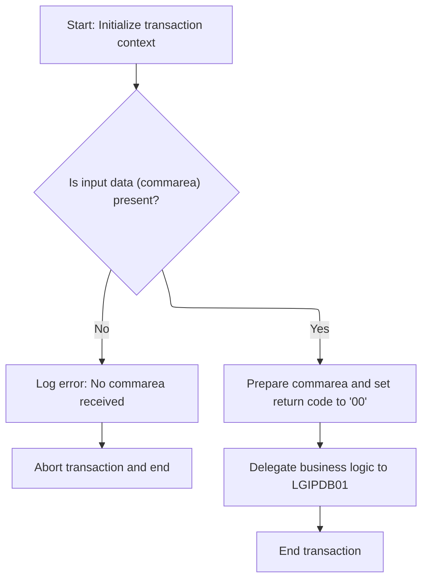
```mermaid
%%{init: {"flowchart": {"defaultRenderer": "elk"}} }%%
flowchart TD
    node1["Start: Initialize transaction context"] --> node2{"Is input data (commarea) present?"}
    click node1 openCode "base/src/lgipol01.cbl:72:76"
    node2 -->|"No"| node3["Log error: No commarea received"]
    click node2 openCode "base/src/lgipol01.cbl:79:83"
    click node3 openCode "base/src/lgipol01.cbl:80:81"
    node3 --> node4["Abort transaction and end"]
    click node4 openCode "base/src/lgipol01.cbl:82:82"
    node2 -->|"Yes"| node5["Prepare commarea and set return code to '00'"]
    click node5 openCode "base/src/lgipol01.cbl:86:88"
    node5 --> node6["Delegate business logic to LGIPDB01"]
    click node6 openCode "base/src/lgipol01.cbl:91:94"
    node6 --> node7["End transaction"]
    click node7 openCode "base/src/lgipol01.cbl:96:96"
classDef HeadingStyle fill:#777777,stroke:#333,stroke-width:2px;

%% Swimm:
%% %%{init: {"flowchart": {"defaultRenderer": "elk"}} }%%
%% flowchart TD
%%     node1["Start: Initialize transaction context"] --> node2{"Is input data (commarea) present?"}
%%     click node1 openCode "<SwmPath>[base/src/lgipol01.cbl](base/src/lgipol01.cbl)</SwmPath>:72:76"
%%     node2 -->|"No"| node3["Log error: No commarea received"]
%%     click node2 openCode "<SwmPath>[base/src/lgipol01.cbl](base/src/lgipol01.cbl)</SwmPath>:79:83"
%%     click node3 openCode "<SwmPath>[base/src/lgipol01.cbl](base/src/lgipol01.cbl)</SwmPath>:80:81"
%%     node3 --> node4["Abort transaction and end"]
%%     click node4 openCode "<SwmPath>[base/src/lgipol01.cbl](base/src/lgipol01.cbl)</SwmPath>:82:82"
%%     node2 -->|"Yes"| node5["Prepare commarea and set return code to '00'"]
%%     click node5 openCode "<SwmPath>[base/src/lgipol01.cbl](base/src/lgipol01.cbl)</SwmPath>:86:88"
%%     node5 --> node6["Delegate business logic to <SwmToken path="base/src/lgipol01.cbl" pos="91:9:9" line-data="           EXEC CICS LINK Program(LGIPDB01)">`LGIPDB01`</SwmToken>"]
%%     click node6 openCode "<SwmPath>[base/src/lgipol01.cbl](base/src/lgipol01.cbl)</SwmPath>:91:94"
%%     node6 --> node7["End transaction"]
%%     click node7 openCode "<SwmPath>[base/src/lgipol01.cbl](base/src/lgipol01.cbl)</SwmPath>:96:96"
%% classDef HeadingStyle fill:#777777,stroke:#333,stroke-width:2px;
```

This section governs how policy inquiry requests are validated and routed within the insurance application, ensuring only valid requests are processed and errors are handled appropriately.

| Category        | Rule Name                  | Description                                                                                                                                                                                               |
| --------------- | -------------------------- | --------------------------------------------------------------------------------------------------------------------------------------------------------------------------------------------------------- |
| Data validation | Mandatory input validation | If no input data (commarea) is received with the transaction, the system must log an error message indicating the absence of commarea and abort the transaction without further processing.               |
| Business logic  | Success return code        | For every valid policy inquiry request, the system must set the commarea return code to '00' to indicate successful receipt and initial validation of the request.                                        |
| Business logic  | Business logic delegation  | Upon successful validation of input, the system must delegate the business logic for policy retrieval to the designated business logic component, ensuring separation of concerns and modular processing. |

<SwmSnippet path="/base/src/lgipol01.cbl" line="70">

---

MAINLINE in <SwmToken path="base/src/lgtestp3.cbl" pos="70:10:10" line-data="                 EXEC CICS LINK PROGRAM(&#39;LGIPOL01&#39;)">`LGIPOL01`</SwmToken> checks for valid input, sets up transaction context, and calls <SwmToken path="base/src/lgipol01.cbl" pos="91:9:9" line-data="           EXEC CICS LINK Program(LGIPDB01)">`LGIPDB01`</SwmToken> to fetch the requested policy details. If the input is missing, it logs an error and aborts.

```cobol
       MAINLINE SECTION.
      *
           INITIALIZE WS-HEADER.
      *
           MOVE EIBTRNID TO WS-TRANSID.
           MOVE EIBTRMID TO WS-TERMID.
           MOVE EIBTASKN TO WS-TASKNUM.
      *
      * If NO commarea received issue an ABEND
           IF EIBCALEN IS EQUAL TO ZERO
               MOVE ' NO COMMAREA RECEIVED' TO EM-VARIABLE
               PERFORM WRITE-ERROR-MESSAGE
               EXEC CICS ABEND ABCODE('LGCA') NODUMP END-EXEC
           END-IF

      * initialize commarea return code to zero
           MOVE '00' TO CA-RETURN-CODE
           MOVE EIBCALEN TO WS-CALEN.
           SET WS-ADDR-DFHCOMMAREA TO ADDRESS OF DFHCOMMAREA.
      *

           EXEC CICS LINK Program(LGIPDB01)
               Commarea(DFHCOMMAREA)
               Length(32500)
           END-EXEC.

           EXEC CICS RETURN END-EXEC.
```

---

</SwmSnippet>

## Logging errors for policy inquiries

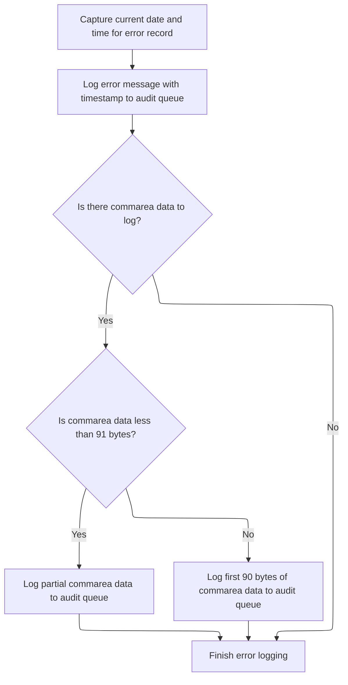
```mermaid
%%{init: {"flowchart": {"defaultRenderer": "elk"}} }%%
flowchart TD
    node1["Capture current date and time for error record"]
    click node1 openCode "base/src/lgipol01.cbl:110:117"
    node1 --> node2["Log error message with timestamp to audit queue"]
    click node2 openCode "base/src/lgipol01.cbl:119:122"
    node2 --> node3{"Is there commarea data to log?"}
    click node3 openCode "base/src/lgipol01.cbl:124:138"
    node3 -->|"No"| node6["Finish error logging"]
    click node6 openCode "base/src/lgipol01.cbl:139:139"
    node3 -->|"Yes"| node4{"Is commarea data less than 91 bytes?"}
    click node4 openCode "base/src/lgipol01.cbl:125:131"
    node4 -->|"Yes"| node5["Log partial commarea data to audit queue"]
    click node5 openCode "base/src/lgipol01.cbl:126:130"
    node4 -->|"No"| node7["Log first 90 bytes of commarea data to audit queue"]
    click node7 openCode "base/src/lgipol01.cbl:132:136"
    node5 --> node6
    node7 --> node6
classDef HeadingStyle fill:#777777,stroke:#333,stroke-width:2px;

%% Swimm:
%% %%{init: {"flowchart": {"defaultRenderer": "elk"}} }%%
%% flowchart TD
%%     node1["Capture current date and time for error record"]
%%     click node1 openCode "<SwmPath>[base/src/lgipol01.cbl](base/src/lgipol01.cbl)</SwmPath>:110:117"
%%     node1 --> node2["Log error message with timestamp to audit queue"]
%%     click node2 openCode "<SwmPath>[base/src/lgipol01.cbl](base/src/lgipol01.cbl)</SwmPath>:119:122"
%%     node2 --> node3{"Is there commarea data to log?"}
%%     click node3 openCode "<SwmPath>[base/src/lgipol01.cbl](base/src/lgipol01.cbl)</SwmPath>:124:138"
%%     node3 -->|"No"| node6["Finish error logging"]
%%     click node6 openCode "<SwmPath>[base/src/lgipol01.cbl](base/src/lgipol01.cbl)</SwmPath>:139:139"
%%     node3 -->|"Yes"| node4{"Is commarea data less than 91 bytes?"}
%%     click node4 openCode "<SwmPath>[base/src/lgipol01.cbl](base/src/lgipol01.cbl)</SwmPath>:125:131"
%%     node4 -->|"Yes"| node5["Log partial commarea data to audit queue"]
%%     click node5 openCode "<SwmPath>[base/src/lgipol01.cbl](base/src/lgipol01.cbl)</SwmPath>:126:130"
%%     node4 -->|"No"| node7["Log first 90 bytes of commarea data to audit queue"]
%%     click node7 openCode "<SwmPath>[base/src/lgipol01.cbl](base/src/lgipol01.cbl)</SwmPath>:132:136"
%%     node5 --> node6
%%     node7 --> node6
%% classDef HeadingStyle fill:#777777,stroke:#333,stroke-width:2px;
```

This section ensures that all errors encountered during policy inquiries are logged with sufficient detail for audit and troubleshooting purposes. It captures both the error context and relevant transaction data, supporting compliance and operational transparency.

| Category       | Rule Name                 | Description                                                                                                                                                                    |
| -------------- | ------------------------- | ------------------------------------------------------------------------------------------------------------------------------------------------------------------------------ |
| Business logic | Timestamped error logging | Every error encountered during a policy inquiry must be logged with the current date and time included in the error record.                                                    |
| Business logic | Context data capture      | If additional context data (commarea) is present during an error, up to 90 bytes of this data must be logged as part of the audit record, prefixed with 'COMMAREA='.           |
| Business logic | Commarea data truncation  | If the commarea data is less than 91 bytes, the entire commarea must be logged; otherwise, only the first 90 bytes are logged.                                                 |
| Business logic | Dual-queue audit logging  | All error messages and associated context data must be written to both the transient data queue (TDQ) and the temporary storage queue (TSQ) for redundancy and audit purposes. |

<SwmSnippet path="/base/src/lgipol01.cbl" line="107">

---

<SwmToken path="base/src/lgipol01.cbl" pos="107:1:5" line-data="       WRITE-ERROR-MESSAGE.">`WRITE-ERROR-MESSAGE`</SwmToken> formats the error with a timestamp, then calls LGSTSQ to log it. If there's commarea data, it logs up to 90 bytes of that too, using LGSTSQ for both messages.

```cobol
       WRITE-ERROR-MESSAGE.
      * Save SQLCODE in message
      * Obtain and format current time and date
           EXEC CICS ASKTIME ABSTIME(ABS-TIME)
           END-EXEC
           EXEC CICS FORMATTIME ABSTIME(ABS-TIME)
                     MMDDYYYY(DATE1)
                     TIME(TIME1)
           END-EXEC
           MOVE DATE1 TO EM-DATE
           MOVE TIME1 TO EM-TIME
      * Write output message to TDQ
           EXEC CICS LINK PROGRAM('LGSTSQ')
                     COMMAREA(ERROR-MSG)
                     LENGTH(LENGTH OF ERROR-MSG)
           END-EXEC.
      * Write 90 bytes or as much as we have of commarea to TDQ
           IF EIBCALEN > 0 THEN
             IF EIBCALEN < 91 THEN
               MOVE DFHCOMMAREA(1:EIBCALEN) TO CA-DATA
               EXEC CICS LINK PROGRAM('LGSTSQ')
                         COMMAREA(CA-ERROR-MSG)
                         LENGTH(LENGTH OF CA-ERROR-MSG)
               END-EXEC
             ELSE
               MOVE DFHCOMMAREA(1:90) TO CA-DATA
               EXEC CICS LINK PROGRAM('LGSTSQ')
                         COMMAREA(CA-ERROR-MSG)
                         LENGTH(LENGTH OF CA-ERROR-MSG)
               END-EXEC
             END-IF
           END-IF.
           EXIT.
```

---

</SwmSnippet>

<SwmSnippet path="/base/src/lgstsq.cbl" line="55">

---

MAINLINE in LGSTSQ decides whether to use commarea or receive a message, formats it (handling 'Q=' prefix if present), then writes the message to both TDQ and TSQ for logging. If it's a received message, it sends a one-char response and frees up resources.

```cobol
       MAINLINE SECTION.

           MOVE SPACES TO WRITE-MSG.
           MOVE SPACES TO WS-RECV.

           EXEC CICS ASSIGN SYSID(WRITE-MSG-SYSID)
                RESP(WS-RESP)
           END-EXEC.

           EXEC CICS ASSIGN INVOKINGPROG(WS-INVOKEPROG)
                RESP(WS-RESP)
           END-EXEC.
           
           IF WS-INVOKEPROG NOT = SPACES
              MOVE 'C' To WS-FLAG
              MOVE COMMA-DATA  TO WRITE-MSG-MSG
              MOVE EIBCALEN    TO WS-RECV-LEN
           ELSE
              EXEC CICS RECEIVE INTO(WS-RECV)
                  LENGTH(WS-RECV-LEN)
                  RESP(WS-RESP)
              END-EXEC
              MOVE 'R' To WS-FLAG
              MOVE WS-RECV-DATA  TO WRITE-MSG-MSG
              SUBTRACT 5 FROM WS-RECV-LEN
           END-IF.

           MOVE 'GENAERRS' TO STSQ-NAME.
           IF WRITE-MSG-MSG(1:2) = 'Q=' THEN
              MOVE WRITE-MSG-MSG(3:4) TO STSQ-EXT
              MOVE WRITE-MSG-REST TO TEMPO
              MOVE TEMPO          TO WRITE-MSG-MSG
              SUBTRACT 7 FROM WS-RECV-LEN
           END-IF.

           ADD 5 TO WS-RECV-LEN.

      * Write output message to TDQ CSMT
      *
           EXEC CICS WRITEQ TD QUEUE(STDQ-NAME)
                     FROM(WRITE-MSG)
                     RESP(WS-RESP)
                     LENGTH(WS-RECV-LEN)

           END-EXEC.

      * Write output message to Genapp TSQ
      * If no space is available then the task will not wait for
      *  storage to become available but will ignore the request...
      *
           EXEC CICS WRITEQ TS QUEUE(STSQ-NAME)
                     FROM(WRITE-MSG)
                     RESP(WS-RESP)
                     NOSUSPEND
                     LENGTH(WS-RECV-LEN)

           END-EXEC.

           If WS-FLAG = 'R' Then
             EXEC CICS SEND TEXT FROM(FILLER-X)
              WAIT
              ERASE
              LENGTH(1)
              FREEKB
             END-EXEC.

           EXEC CICS RETURN
           END-EXEC.
```

---

</SwmSnippet>

## Retrieving and formatting policy data


```mermaid
%%{init: {"flowchart": {"defaultRenderer": "elk"}} }%%
flowchart TD
    node1["Start: Receive insurance request"] --> node2{"Was commarea received?"}
    click node1 openCode "base/src/lgipdb01.cbl:230:236"
    node2 -->|"No"| node3["Record error: No commarea"]
    click node2 openCode "base/src/lgipdb01.cbl:251:255"
    node3 --> node4["End: Error response"]
    click node3 openCode "base/src/lgipdb01.cbl:252:254"
    node2 -->|"Yes"| node5{"What policy type is requested?"}
    click node5 openCode "base/src/lgipdb01.cbl:277:310"
    node5 -->|"Endowment (01IEND)"| node6["Retrieve endowment policy data"]
    click node6 openCode "base/src/lgipdb01.cbl:327:432"
    node5 -->|"House (01IHOU)"| node7["Retrieve house policy data"]
    click node7 openCode "base/src/lgipdb01.cbl:441:523"
    node5 -->|"Motor (01IMOT)"| node8["Retrieve motor policy data"]
    click node8 openCode "base/src/lgipdb01.cbl:529:621"
    node5 -->|"Commercial (01ICOM)"| node9["Retrieve commercial policy data (type 1)"]
    click node9 openCode "base/src/lgipdb01.cbl:292:294"
    node5 -->|"Commercial (02ICOM)"| node10["Retrieve commercial policy data (type 2)"]
    click node10 openCode "base/src/lgipdb01.cbl:296:298"
    node5 -->|"Commercial (03ICOM)"| node11["Retrieve commercial policy data (type 3)"]
    click node11 openCode "base/src/lgipdb01.cbl:300:302"
    node5 -->|"Commercial (05ICOM)"| node12["Retrieve commercial policy data (type 5)"]
    click node12 openCode "base/src/lgipdb01.cbl:304:306"
    node5 -->|"Other"| node13["Set error code: Invalid request"]
    click node13 openCode "base/src/lgipdb01.cbl:308:309"
    node6 --> node14{"Was retrieval successful?"}
    node7 --> node14
    node8 --> node14
    node9 --> node14
    node10 --> node14
    node11 --> node14
    node12 --> node14
    click node14 openCode "base/src/lgipdb01.cbl:370:430"
    node14 -->|"Yes"| node15["Prepare response with policy data"]
    click node15 openCode "base/src/lgipdb01.cbl:394:418"
    node14 -->|"No"| node16["Set error code: Not found or DB error"]
    click node16 openCode "base/src/lgipdb01.cbl:421:429"
    node16 --> node17["Record error"]
    click node17 openCode "base/src/lgipdb01.cbl:428:429"
    node15 --> node18["End: Success response"]
    click node18 openCode "base/src/lgipdb01.cbl:418:418"
    node13 --> node18
    node17 --> node18

classDef HeadingStyle fill:#777777,stroke:#333,stroke-width:2px;

%% Swimm:
%% %%{init: {"flowchart": {"defaultRenderer": "elk"}} }%%
%% flowchart TD
%%     node1["Start: Receive insurance request"] --> node2{"Was commarea received?"}
%%     click node1 openCode "<SwmPath>[base/src/lgipdb01.cbl](base/src/lgipdb01.cbl)</SwmPath>:230:236"
%%     node2 -->|"No"| node3["Record error: No commarea"]
%%     click node2 openCode "<SwmPath>[base/src/lgipdb01.cbl](base/src/lgipdb01.cbl)</SwmPath>:251:255"
%%     node3 --> node4["End: Error response"]
%%     click node3 openCode "<SwmPath>[base/src/lgipdb01.cbl](base/src/lgipdb01.cbl)</SwmPath>:252:254"
%%     node2 -->|"Yes"| node5{"What policy type is requested?"}
%%     click node5 openCode "<SwmPath>[base/src/lgipdb01.cbl](base/src/lgipdb01.cbl)</SwmPath>:277:310"
%%     node5 -->|"Endowment (<SwmToken path="base/src/lgipdb01.cbl" pos="279:4:4" line-data="             WHEN &#39;01IEND&#39;">`01IEND`</SwmToken>)"| node6["Retrieve endowment policy data"]
%%     click node6 openCode "<SwmPath>[base/src/lgipdb01.cbl](base/src/lgipdb01.cbl)</SwmPath>:327:432"
%%     node5 -->|"House (<SwmToken path="base/src/lgtestp3.cbl" pos="67:4:4" line-data="                 Move &#39;01IHOU&#39;   To CA-REQUEST-ID">`01IHOU`</SwmToken>)"| node7["Retrieve house policy data"]
%%     click node7 openCode "<SwmPath>[base/src/lgipdb01.cbl](base/src/lgipdb01.cbl)</SwmPath>:441:523"
%%     node5 -->|"Motor (<SwmToken path="base/src/lgipdb01.cbl" pos="287:4:4" line-data="             WHEN &#39;01IMOT&#39;">`01IMOT`</SwmToken>)"| node8["Retrieve motor policy data"]
%%     click node8 openCode "<SwmPath>[base/src/lgipdb01.cbl](base/src/lgipdb01.cbl)</SwmPath>:529:621"
%%     node5 -->|"Commercial (<SwmToken path="base/src/lgipdb01.cbl" pos="291:4:4" line-data="             WHEN &#39;01ICOM&#39;">`01ICOM`</SwmToken>)"| node9["Retrieve commercial policy data (type 1)"]
%%     click node9 openCode "<SwmPath>[base/src/lgipdb01.cbl](base/src/lgipdb01.cbl)</SwmPath>:292:294"
%%     node5 -->|"Commercial (<SwmToken path="base/src/lgipdb01.cbl" pos="295:4:4" line-data="             WHEN &#39;02ICOM&#39;">`02ICOM`</SwmToken>)"| node10["Retrieve commercial policy data (type 2)"]
%%     click node10 openCode "<SwmPath>[base/src/lgipdb01.cbl](base/src/lgipdb01.cbl)</SwmPath>:296:298"
%%     node5 -->|"Commercial (<SwmToken path="base/src/lgipdb01.cbl" pos="299:4:4" line-data="             WHEN &#39;03ICOM&#39;">`03ICOM`</SwmToken>)"| node11["Retrieve commercial policy data (type 3)"]
%%     click node11 openCode "<SwmPath>[base/src/lgipdb01.cbl](base/src/lgipdb01.cbl)</SwmPath>:300:302"
%%     node5 -->|"Commercial (<SwmToken path="base/src/lgipdb01.cbl" pos="303:4:4" line-data="             WHEN &#39;05ICOM&#39;">`05ICOM`</SwmToken>)"| node12["Retrieve commercial policy data (type 5)"]
%%     click node12 openCode "<SwmPath>[base/src/lgipdb01.cbl](base/src/lgipdb01.cbl)</SwmPath>:304:306"
%%     node5 -->|"Other"| node13["Set error code: Invalid request"]
%%     click node13 openCode "<SwmPath>[base/src/lgipdb01.cbl](base/src/lgipdb01.cbl)</SwmPath>:308:309"
%%     node6 --> node14{"Was retrieval successful?"}
%%     node7 --> node14
%%     node8 --> node14
%%     node9 --> node14
%%     node10 --> node14
%%     node11 --> node14
%%     node12 --> node14
%%     click node14 openCode "<SwmPath>[base/src/lgipdb01.cbl](base/src/lgipdb01.cbl)</SwmPath>:370:430"
%%     node14 -->|"Yes"| node15["Prepare response with policy data"]
%%     click node15 openCode "<SwmPath>[base/src/lgipdb01.cbl](base/src/lgipdb01.cbl)</SwmPath>:394:418"
%%     node14 -->|"No"| node16["Set error code: Not found or DB error"]
%%     click node16 openCode "<SwmPath>[base/src/lgipdb01.cbl](base/src/lgipdb01.cbl)</SwmPath>:421:429"
%%     node16 --> node17["Record error"]
%%     click node17 openCode "<SwmPath>[base/src/lgipdb01.cbl](base/src/lgipdb01.cbl)</SwmPath>:428:429"
%%     node15 --> node18["End: Success response"]
%%     click node18 openCode "<SwmPath>[base/src/lgipdb01.cbl](base/src/lgipdb01.cbl)</SwmPath>:418:418"
%%     node13 --> node18
%%     node17 --> node18
%% 
%% classDef HeadingStyle fill:#777777,stroke:#333,stroke-width:2px;
```

This section governs how insurance policy data is retrieved and formatted in response to a request. It determines which policy type is being requested, validates the input, retrieves the appropriate data from the database, and formats the output or error response accordingly. The section ensures that only valid requests are processed and that responses are consistent and informative for both successful and error scenarios.

| Category        | Rule Name                         | Description                                                                                                                                                                                                                                                                                                                                                                                                                                                                                                                                                                                                                                                                                                                                                                                                                                                                                                                                                                                                                                                                                                                     |
| --------------- | --------------------------------- | ------------------------------------------------------------------------------------------------------------------------------------------------------------------------------------------------------------------------------------------------------------------------------------------------------------------------------------------------------------------------------------------------------------------------------------------------------------------------------------------------------------------------------------------------------------------------------------------------------------------------------------------------------------------------------------------------------------------------------------------------------------------------------------------------------------------------------------------------------------------------------------------------------------------------------------------------------------------------------------------------------------------------------------------------------------------------------------------------------------------------------- |
| Data validation | Missing commarea validation       | If no commarea is received with the request, the process must terminate immediately and return an error indicating that the request is invalid.                                                                                                                                                                                                                                                                                                                                                                                                                                                                                                                                                                                                                                                                                                                                                                                                                                                                                                                                                                                 |
| Data validation | Supported policy type enforcement | The policy type requested must match one of the supported types: Endowment (<SwmToken path="base/src/lgipdb01.cbl" pos="279:4:4" line-data="             WHEN &#39;01IEND&#39;">`01IEND`</SwmToken>), House (<SwmToken path="base/src/lgtestp3.cbl" pos="67:4:4" line-data="                 Move &#39;01IHOU&#39;   To CA-REQUEST-ID">`01IHOU`</SwmToken>), Motor (<SwmToken path="base/src/lgipdb01.cbl" pos="287:4:4" line-data="             WHEN &#39;01IMOT&#39;">`01IMOT`</SwmToken>), or Commercial (<SwmToken path="base/src/lgipdb01.cbl" pos="291:4:4" line-data="             WHEN &#39;01ICOM&#39;">`01ICOM`</SwmToken>, <SwmToken path="base/src/lgipdb01.cbl" pos="295:4:4" line-data="             WHEN &#39;02ICOM&#39;">`02ICOM`</SwmToken>, <SwmToken path="base/src/lgipdb01.cbl" pos="299:4:4" line-data="             WHEN &#39;03ICOM&#39;">`03ICOM`</SwmToken>, <SwmToken path="base/src/lgipdb01.cbl" pos="303:4:4" line-data="             WHEN &#39;05ICOM&#39;">`05ICOM`</SwmToken>). Any other value is considered invalid and must result in an error response with a specific error code ('99'). |
| Data validation | Buffer size validation            | If the buffer (commarea) provided by the requester is not large enough to hold the policy data, the response must indicate this with a specific error code ('98').                                                                                                                                                                                                                                                                                                                                                                                                                                                                                                                                                                                                                                                                                                                                                                                                                                                                                                                                                              |
| Business logic  | Policy existence check            | For each valid policy type, the system must retrieve the corresponding policy data from the database using the provided customer and policy numbers. If the data is not found, the response must indicate this with a specific error code ('01').                                                                                                                                                                                                                                                                                                                                                                                                                                                                                                                                                                                                                                                                                                                                                                                                                                                                               |
| Business logic  | Complete policy data formatting   | For each successful policy data retrieval, the response must include all relevant policy fields, and the end of the data must be clearly marked with the string 'FINAL'.                                                                                                                                                                                                                                                                                                                                                                                                                                                                                                                                                                                                                                                                                                                                                                                                                                                                                                                                                        |

<SwmSnippet path="/base/src/lgipdb01.cbl" line="230">

---

MAINLINE in <SwmToken path="base/src/lgipol01.cbl" pos="91:9:9" line-data="           EXEC CICS LINK Program(LGIPDB01)">`LGIPDB01`</SwmToken> checks for valid input, sets up <SwmToken path="base/src/lgipdb01.cbl" pos="242:5:5" line-data="      * initialize DB2 host variables">`DB2`</SwmToken> variables, and branches to the right policy retrieval routine based on the request ID. It logs errors and aborts if the commarea is missing or too short.

```cobol
       MAINLINE SECTION.

      *----------------------------------------------------------------*
      * Common code                                                    *
      *----------------------------------------------------------------*
      * initialize working storage variables
           INITIALIZE WS-HEADER.
      * set up general variable
           MOVE EIBTRNID TO WS-TRANSID.
           MOVE EIBTRMID TO WS-TERMID.
           MOVE EIBTASKN TO WS-TASKNUM.
      *----------------------------------------------------------------*
      * initialize DB2 host variables
           INITIALIZE DB2-IN-INTEGERS.
           INITIALIZE DB2-OUT-INTEGERS.
           INITIALIZE DB2-POLICY.

      *---------------------------------------------------------------*
      * Check commarea and obtain required details                    *
      *---------------------------------------------------------------*
      * If NO commarea received issue an ABEND
           IF EIBCALEN IS EQUAL TO ZERO
             MOVE ' NO COMMAREA RECEIVED' TO EM-VARIABLE
             PERFORM WRITE-ERROR-MESSAGE
             EXEC CICS ABEND ABCODE('LGCA') NODUMP END-EXEC
           END-IF

      * initialize commarea return code to zero
           MOVE '00' TO CA-RETURN-CODE
           MOVE EIBCALEN TO WS-CALEN
           SET WS-ADDR-DFHCOMMAREA TO ADDRESS OF DFHCOMMAREA

      * Convert commarea customer & policy nums to DB2 integer format
           MOVE CA-CUSTOMER-NUM TO DB2-CUSTOMERNUM-INT
           MOVE CA-POLICY-NUM   TO DB2-POLICYNUM-INT
      * and save in error msg field incase required
           MOVE CA-CUSTOMER-NUM TO EM-CUSNUM
           MOVE CA-POLICY-NUM   TO EM-POLNUM

      *----------------------------------------------------------------*
      * Check which policy type is being requested                     *
      * This is not actually required whilst only endowment policy     *
      * inquires are supported, but will make future expansion simpler *
      *----------------------------------------------------------------*
      * Upper case value passed in Request Id field                    *
           MOVE FUNCTION UPPER-CASE(CA-REQUEST-ID) TO WS-REQUEST-ID

           EVALUATE WS-REQUEST-ID

             WHEN '01IEND'
               INITIALIZE DB2-ENDOWMENT
               PERFORM GET-ENDOW-DB2-INFO

             WHEN '01IHOU'
               INITIALIZE DB2-HOUSE
               PERFORM GET-HOUSE-DB2-INFO

             WHEN '01IMOT'
               INITIALIZE DB2-MOTOR
               PERFORM GET-MOTOR-DB2-INFO

             WHEN '01ICOM'
               INITIALIZE DB2-COMMERCIAL
               PERFORM GET-COMMERCIAL-DB2-INFO-1

             WHEN '02ICOM'
               INITIALIZE DB2-COMMERCIAL
               PERFORM GET-COMMERCIAL-DB2-INFO-2

             WHEN '03ICOM'
               INITIALIZE DB2-COMMERCIAL
               PERFORM GET-COMMERCIAL-DB2-INFO-3

             WHEN '05ICOM'
               INITIALIZE DB2-COMMERCIAL
               PERFORM GET-COMMERCIAL-DB2-INFO-5

             WHEN OTHER
               MOVE '99' TO CA-RETURN-CODE

           END-EVALUATE.
```

---

</SwmSnippet>

<SwmSnippet path="/base/src/lgipdb01.cbl" line="997">

---

<SwmToken path="base/src/lgipdb01.cbl" pos="997:1:5" line-data="       WRITE-ERROR-MESSAGE.">`WRITE-ERROR-MESSAGE`</SwmToken> in <SwmToken path="base/src/lgipol01.cbl" pos="91:9:9" line-data="           EXEC CICS LINK Program(LGIPDB01)">`LGIPDB01`</SwmToken> grabs the current <SwmToken path="base/src/lgipol01.cbl" pos="35:7:9" line-data="      * Variables for time/date processing">`time/date`</SwmToken>, formats the error, and calls LGSTSQ to log it. If there's commarea data, it logs up to 90 bytes of that too, using LGSTSQ for both messages.

```cobol
       WRITE-ERROR-MESSAGE.
      * Save SQLCODE in message
           MOVE SQLCODE TO EM-SQLRC
      * Obtain and format current time and date
           EXEC CICS ASKTIME ABSTIME(ABS-TIME)
           END-EXEC
           EXEC CICS FORMATTIME ABSTIME(ABS-TIME)
                     MMDDYYYY(DATE1)
                     TIME(TIME1)
           END-EXEC
           MOVE DATE1 TO EM-DATE
           MOVE TIME1 TO EM-TIME
      * Write output message to TDQ
           EXEC CICS LINK PROGRAM('LGSTSQ')
                     COMMAREA(ERROR-MSG)
                     LENGTH(LENGTH OF ERROR-MSG)
           END-EXEC.
      * Write 90 bytes or as much as we have of commarea to TDQ
           IF EIBCALEN > 0 THEN
             IF EIBCALEN < 91 THEN
               MOVE DFHCOMMAREA(1:EIBCALEN) TO CA-DATA
               EXEC CICS LINK PROGRAM('LGSTSQ')
                         COMMAREA(CA-ERROR-MSG)
                         LENGTH(LENGTH OF CA-ERROR-MSG)
               END-EXEC
             ELSE
               MOVE DFHCOMMAREA(1:90) TO CA-DATA
               EXEC CICS LINK PROGRAM('LGSTSQ')
                         COMMAREA(CA-ERROR-MSG)
                         LENGTH(LENGTH OF CA-ERROR-MSG)
               END-EXEC
             END-IF
           END-IF.
           EXIT.
```

---

</SwmSnippet>

<SwmSnippet path="/base/src/lgipdb01.cbl" line="327">

---

<SwmToken path="base/src/lgipdb01.cbl" pos="327:1:7" line-data="       GET-ENDOW-DB2-INFO.">`GET-ENDOW-DB2-INFO`</SwmToken> calculates the buffer size needed for all endowment policy data, including any variable-length fields. It checks for nulls, moves data if present, and marks the end with 'FINAL'. If the buffer's too small, it returns an error code.

```cobol
       GET-ENDOW-DB2-INFO.

           MOVE ' SELECT ENDOW ' TO EM-SQLREQ
           EXEC SQL
             SELECT  ISSUEDATE,
                     EXPIRYDATE,
                     LASTCHANGED,
                     BROKERID,
                     BROKERSREFERENCE,
                     PAYMENT,
                     WITHPROFITS,
                     EQUITIES,
                     MANAGEDFUND,
                     FUNDNAME,
                     TERM,
                     SUMASSURED,
                     LIFEASSURED,
                     PADDINGDATA,
                     LENGTH(PADDINGDATA)
             INTO  :DB2-ISSUEDATE,
                   :DB2-EXPIRYDATE,
                   :DB2-LASTCHANGED,
                   :DB2-BROKERID-INT INDICATOR :IND-BROKERID,
                   :DB2-BROKERSREF INDICATOR :IND-BROKERSREF,
                   :DB2-PAYMENT-INT INDICATOR :IND-PAYMENT,
                   :DB2-E-WITHPROFITS,
                   :DB2-E-EQUITIES,
                   :DB2-E-MANAGEDFUND,
                   :DB2-E-FUNDNAME,
                   :DB2-E-TERM-SINT,
                   :DB2-E-SUMASSURED-INT,
                   :DB2-E-LIFEASSURED,
                   :DB2-E-PADDINGDATA INDICATOR :IND-E-PADDINGDATA,
                   :DB2-E-PADDING-LEN INDICATOR :IND-E-PADDINGDATAL
             FROM  POLICY,ENDOWMENT
             WHERE ( POLICY.POLICYNUMBER =
                        ENDOWMENT.POLICYNUMBER   AND
                     POLICY.CUSTOMERNUMBER =
                        :DB2-CUSTOMERNUM-INT             AND
                     POLICY.POLICYNUMBER =
                        :DB2-POLICYNUM-INT               )
           END-EXEC

           IF SQLCODE = 0
      *      Select was successful

      *      Calculate size of commarea required to return all data
             ADD WS-CA-HEADERTRAILER-LEN TO WS-REQUIRED-CA-LEN
             ADD WS-FULL-ENDOW-LEN       TO WS-REQUIRED-CA-LEN

      *----------------------------------------------------------------*
      *      Specific code to allow for length of VACHAR data
      *      check whether PADDINGDATA field is non-null
      *        and calculate length of endowment policy
      *        and position of free space in commarea after policy data
      *----------------------------------------------------------------*
             IF IND-E-PADDINGDATAL NOT EQUAL MINUS-ONE
               ADD DB2-E-PADDING-LEN TO WS-REQUIRED-CA-LEN
               ADD DB2-E-PADDING-LEN TO END-POLICY-POS
             END-IF

      *      if commarea received is not large enough ...
      *        set error return code and return to caller
             IF EIBCALEN IS LESS THAN WS-REQUIRED-CA-LEN
               MOVE '98' TO CA-RETURN-CODE
               EXEC CICS RETURN END-EXEC
             ELSE
      *        Length is sufficent so move data to commarea
      *        Move Integer fields to required length numerics
      *        Don't move null fields
               IF IND-BROKERID NOT EQUAL MINUS-ONE
                 MOVE DB2-BROKERID-INT    TO DB2-BROKERID
               END-IF
               IF IND-PAYMENT NOT EQUAL MINUS-ONE
                 MOVE DB2-PAYMENT-INT TO DB2-PAYMENT
               END-IF
      *----------------------------------------------------------------*
               MOVE DB2-E-TERM-SINT       TO DB2-E-TERM
               MOVE DB2-E-SUMASSURED-INT  TO DB2-E-SUMASSURED

               MOVE DB2-POLICY-COMMON     TO CA-POLICY-COMMON
               MOVE DB2-ENDOW-FIXED
                   TO CA-ENDOWMENT(1:WS-ENDOW-LEN)
               IF IND-E-PADDINGDATA NOT EQUAL MINUS-ONE
                 MOVE DB2-E-PADDINGDATA TO
                     CA-E-PADDING-DATA(1:DB2-E-PADDING-LEN)
               END-IF
             END-IF

      *      Mark the end of the policy data
             MOVE 'FINAL' TO CA-E-PADDING-DATA(END-POLICY-POS:5)

           ELSE
      *      Non-zero SQLCODE from first SQL FETCH statement
             IF SQLCODE EQUAL 100
      *        No rows found - invalid customer / policy number
               MOVE '01' TO CA-RETURN-CODE
             ELSE
      *        something has gone wrong
               MOVE '90' TO CA-RETURN-CODE
      *        Write error message to TD QUEUE(CSMT)
               PERFORM WRITE-ERROR-MESSAGE
             END-IF

           END-IF.
           EXIT.
```

---

</SwmSnippet>

<SwmSnippet path="/base/src/lgipdb01.cbl" line="441">

---

<SwmToken path="base/src/lgipdb01.cbl" pos="441:1:7" line-data="       GET-HOUSE-DB2-INFO.">`GET-HOUSE-DB2-INFO`</SwmToken> checks the buffer size, moves house policy data if there's enough space, handles nulls, and marks the end with 'FINAL'. If the buffer's too small, it returns an error code.

```cobol
       GET-HOUSE-DB2-INFO.

           MOVE ' SELECT HOUSE ' TO EM-SQLREQ
           EXEC SQL
             SELECT  ISSUEDATE,
                     EXPIRYDATE,
                     LASTCHANGED,
                     BROKERID,
                     BROKERSREFERENCE,
                     PAYMENT,
                     PROPERTYTYPE,
                     BEDROOMS,
                     VALUE,
                     HOUSENAME,
                     HOUSENUMBER,
                     POSTCODE
             INTO  :DB2-ISSUEDATE,
                   :DB2-EXPIRYDATE,
                   :DB2-LASTCHANGED,
                   :DB2-BROKERID-INT INDICATOR :IND-BROKERID,
                   :DB2-BROKERSREF INDICATOR :IND-BROKERSREF,
                   :DB2-PAYMENT-INT INDICATOR :IND-PAYMENT,
                   :DB2-H-PROPERTYTYPE,
                   :DB2-H-BEDROOMS-SINT,
                   :DB2-H-VALUE-INT,
                   :DB2-H-HOUSENAME,
                   :DB2-H-HOUSENUMBER,
                   :DB2-H-POSTCODE
             FROM  POLICY,HOUSE
             WHERE ( POLICY.POLICYNUMBER =
                        HOUSE.POLICYNUMBER   AND
                     POLICY.CUSTOMERNUMBER =
                        :DB2-CUSTOMERNUM-INT             AND
                     POLICY.POLICYNUMBER =
                        :DB2-POLICYNUM-INT               )
           END-EXEC

           IF SQLCODE = 0
      *      Select was successful

      *      Calculate size of commarea required to return all data
             ADD WS-CA-HEADERTRAILER-LEN TO WS-REQUIRED-CA-LEN
             ADD WS-FULL-HOUSE-LEN       TO WS-REQUIRED-CA-LEN

      *      if commarea received is not large enough ...
      *        set error return code and return to caller
             IF EIBCALEN IS LESS THAN WS-REQUIRED-CA-LEN
               MOVE '98' TO CA-RETURN-CODE
               EXEC CICS RETURN END-EXEC
             ELSE
      *        Length is sufficent so move data to commarea
      *        Move Integer fields to required length numerics
      *        Don't move null fields
               IF IND-BROKERID NOT EQUAL MINUS-ONE
                 MOVE DB2-BROKERID-INT  TO DB2-BROKERID
               END-IF
               IF IND-PAYMENT NOT EQUAL MINUS-ONE
                 MOVE DB2-PAYMENT-INT TO DB2-PAYMENT
               END-IF
               MOVE DB2-H-BEDROOMS-SINT TO DB2-H-BEDROOMS
               MOVE DB2-H-VALUE-INT     TO DB2-H-VALUE

               MOVE DB2-POLICY-COMMON   TO CA-POLICY-COMMON
               MOVE DB2-HOUSE           TO CA-HOUSE(1:WS-HOUSE-LEN)
             END-IF

      *      Mark the end of the policy data
             MOVE 'FINAL' TO CA-H-FILLER(1:5)

           ELSE
      *      Non-zero SQLCODE from first SQL FETCH statement
             IF SQLCODE EQUAL 100
      *        No rows found - invalid customer / policy number
               MOVE '01' TO CA-RETURN-CODE
             ELSE
      *        something has gone wrong
               MOVE '90' TO CA-RETURN-CODE
      *        Write error message to TD QUEUE(CSMT)
               PERFORM WRITE-ERROR-MESSAGE
             END-IF

           END-IF.
           EXIT.
```

---

</SwmSnippet>

<SwmSnippet path="/base/src/lgipdb01.cbl" line="529">

---

<SwmToken path="base/src/lgipdb01.cbl" pos="529:1:7" line-data="       GET-MOTOR-DB2-INFO.">`GET-MOTOR-DB2-INFO`</SwmToken> checks the buffer size, moves motor policy data if there's enough space, handles nulls, and marks the end with 'FINAL'. If the buffer's too small, it returns an error code.

```cobol
       GET-MOTOR-DB2-INFO.

           MOVE ' SELECT MOTOR ' TO EM-SQLREQ
           EXEC SQL
             SELECT  ISSUEDATE,
                     EXPIRYDATE,
                     LASTCHANGED,
                     BROKERID,
                     BROKERSREFERENCE,
                     PAYMENT,
                     MAKE,
                     MODEL,
                     VALUE,
                     REGNUMBER,
                     COLOUR,
                     CC,
                     YEAROFMANUFACTURE,
                     PREMIUM,
                     ACCIDENTS
             INTO  :DB2-ISSUEDATE,
                   :DB2-EXPIRYDATE,
                   :DB2-LASTCHANGED,
                   :DB2-BROKERID-INT INDICATOR :IND-BROKERID,
                   :DB2-BROKERSREF INDICATOR :IND-BROKERSREF,
                   :DB2-PAYMENT-INT INDICATOR :IND-PAYMENT,
                   :DB2-M-MAKE,
                   :DB2-M-MODEL,
                   :DB2-M-VALUE-INT,
                   :DB2-M-REGNUMBER,
                   :DB2-M-COLOUR,
                   :DB2-M-CC-SINT,
                   :DB2-M-MANUFACTURED,
                   :DB2-M-PREMIUM-INT,
                   :DB2-M-ACCIDENTS-INT
             FROM  POLICY,MOTOR
             WHERE ( POLICY.POLICYNUMBER =
                        MOTOR.POLICYNUMBER   AND
                     POLICY.CUSTOMERNUMBER =
                        :DB2-CUSTOMERNUM-INT             AND
                     POLICY.POLICYNUMBER =
                        :DB2-POLICYNUM-INT               )
           END-EXEC

           IF SQLCODE = 0
      *      Select was successful

      *      Calculate size of commarea required to return all data
             ADD WS-CA-HEADERTRAILER-LEN TO WS-REQUIRED-CA-LEN
             ADD WS-FULL-MOTOR-LEN       TO WS-REQUIRED-CA-LEN

      *      if commarea received is not large enough ...
      *        set error return code and return to caller
             IF EIBCALEN IS LESS THAN WS-REQUIRED-CA-LEN
               MOVE '98' TO CA-RETURN-CODE
               EXEC CICS RETURN END-EXEC
             ELSE
      *        Length is sufficent so move data to commarea
      *        Move Integer fields to required length numerics
      *        Don't move null fields
               IF IND-BROKERID NOT EQUAL MINUS-ONE
                 MOVE DB2-BROKERID-INT TO DB2-BROKERID
               END-IF
               IF IND-PAYMENT NOT EQUAL MINUS-ONE
                 MOVE DB2-PAYMENT-INT    TO DB2-PAYMENT
               END-IF
               MOVE DB2-M-CC-SINT      TO DB2-M-CC
               MOVE DB2-M-VALUE-INT    TO DB2-M-VALUE
               MOVE DB2-M-PREMIUM-INT  TO DB2-M-PREMIUM
               MOVE DB2-M-ACCIDENTS-INT TO DB2-M-ACCIDENTS
               MOVE DB2-M-PREMIUM-INT  TO CA-M-PREMIUM
               MOVE DB2-M-ACCIDENTS-INT TO CA-M-ACCIDENTS

               MOVE DB2-POLICY-COMMON  TO CA-POLICY-COMMON
               MOVE DB2-MOTOR          TO CA-MOTOR(1:WS-MOTOR-LEN)
             END-IF

      *      Mark the end of the policy data
             MOVE 'FINAL' TO CA-M-FILLER(1:5)

           ELSE
      *      Non-zero SQLCODE from first SQL FETCH statement
             IF SQLCODE EQUAL 100
      *        No rows found - invalid customer / policy number
               MOVE '01' TO CA-RETURN-CODE
             ELSE
      *        something has gone wrong
               MOVE '90' TO CA-RETURN-CODE
      *        Write error message to TD QUEUE(CSMT)
               PERFORM WRITE-ERROR-MESSAGE
             END-IF

           END-IF.
           EXIT.
```

---

</SwmSnippet>

## Handling missing policy data

<SwmSnippet path="/base/src/lgtestp3.cbl" line="74">

---

After returning from <SwmToken path="base/src/lgtestp3.cbl" pos="70:10:10" line-data="                 EXEC CICS LINK PROGRAM(&#39;LGIPOL01&#39;)">`LGIPOL01`</SwmToken>, <SwmToken path="base/src/lgtestp3.cbl" pos="33:5:7" line-data="              GO TO A-GAIN.">`A-GAIN`</SwmToken> checks if the policy inquiry failed (<SwmToken path="base/src/lgtestp3.cbl" pos="74:3:7" line-data="                 IF CA-RETURN-CODE &gt; 0">`CA-RETURN-CODE`</SwmToken> > 0) and jumps to <SwmToken path="base/src/lgtestp3.cbl" pos="75:5:7" line-data="                   GO TO NO-DATA">`NO-DATA`</SwmToken> to show an error message.

```cobol
                 IF CA-RETURN-CODE > 0
                   GO TO NO-DATA
                 END-IF
```

---

</SwmSnippet>

## Displaying no-data error

This section ensures that users are informed when their request does not yield any insurance policy data, providing clear feedback and resetting the session for further actions.

<SwmSnippet path="/base/src/lgtestp3.cbl" line="285">

---

<SwmToken path="base/src/lgtestp3.cbl" pos="285:1:3" line-data="       NO-DATA.">`NO-DATA`</SwmToken> sets the error message for no returned data and jumps to <SwmToken path="base/src/lgtestp3.cbl" pos="287:5:7" line-data="           Go To ERROR-OUT.">`ERROR-OUT`</SwmToken> to display it and reset the session.

```cobol
       NO-DATA.
           Move 'No data was returned.'            To  ERP3FLDO
           Go To ERROR-OUT.
```

---

</SwmSnippet>

## Resetting session after error

This section ensures that when an error occurs, the user is informed of the issue and the session is reset so the user can begin a new transaction without residual data from the previous session.

| Category       | Rule Name                  | Description                                                                                                                                        |
| -------------- | -------------------------- | -------------------------------------------------------------------------------------------------------------------------------------------------- |
| Business logic | Error message display      | Whenever an error occurs, the user must be presented with a clear error message indicating what went wrong.                                        |
| Business logic | Session reset after error  | After an error, all session fields must be reset to their initial state to prevent data from the failed session affecting subsequent transactions. |
| Business logic | Return to menu after error | Control must be returned to the main menu transaction after an error, allowing the user to start a new session without manual intervention.        |

<SwmSnippet path="/base/src/lgtestp3.cbl" line="289">

---

<SwmToken path="base/src/lgtestp3.cbl" pos="289:1:3" line-data="       ERROR-OUT.">`ERROR-OUT`</SwmToken> sends the error message screen to the user so they know what went wrong and can start over.

```cobol
       ERROR-OUT.
           EXEC CICS SEND MAP ('SSMAPP3')
                     FROM(SSMAPP3O)
                     MAPSET ('SSMAP')
           END-EXEC.
```

---

</SwmSnippet>

<SwmSnippet path="/base/src/lgtestp3.cbl" line="295">

---

<SwmToken path="base/src/lgtestp3.cbl" pos="271:5:7" line-data="               Go To ERROR-OUT">`ERROR-OUT`</SwmToken> resets all session fields and jumps to <SwmToken path="base/src/lgtestp3.cbl" pos="299:5:7" line-data="           GO TO ENDIT-STARTIT.">`ENDIT-STARTIT`</SwmToken> to prep for another menu session.

```cobol
           Initialize SSMAPP3I.
           Initialize SSMAPP3O.
           Initialize COMM-AREA.

           GO TO ENDIT-STARTIT.
```

---

</SwmSnippet>

<SwmSnippet path="/base/src/lgtestp3.cbl" line="238">

---

<SwmToken path="base/src/lgtestp3.cbl" pos="238:1:3" line-data="       ENDIT-STARTIT.">`ENDIT-STARTIT`</SwmToken> returns control to CICS, passing the commarea and setting up for the next menu transaction using the <SwmToken path="base/src/lgtestp3.cbl" pos="240:4:4" line-data="                TRANSID(&#39;SSP3&#39;)">`SSP3`</SwmToken> transaction ID.

```cobol
       ENDIT-STARTIT.
           EXEC CICS RETURN
                TRANSID('SSP3')
                COMMAREA(COMM-AREA)
                END-EXEC.
```

---

</SwmSnippet>

## Displaying retrieved policy data

<SwmSnippet path="/base/src/lgtestp3.cbl" line="78">

---

After returning from <SwmToken path="base/src/lgtestp3.cbl" pos="75:5:7" line-data="                   GO TO NO-DATA">`NO-DATA`</SwmToken>, <SwmToken path="base/src/lgtestp3.cbl" pos="33:5:7" line-data="              GO TO A-GAIN.">`A-GAIN`</SwmToken> copies the policy data into output fields and sends the map to show the results to the user.

```cobol
                 Move CA-ISSUE-DATE      To  ENP3IDAI
                 Move CA-EXPIRY-DATE     To  ENP3EDAI
                 Move CA-H-PROPERTY-TYPE To  ENP3TYPI
                 Move CA-H-BEDROOMS      To  ENP3BEDI
                 Move CA-H-VALUE         To  ENP3VALI
                 Move CA-H-HOUSE-NAME    To  ENP3HNMI
                 Move CA-H-HOUSE-NUMBER  To  ENP3HNOI
                 Move CA-H-POSTCODE      To  ENP3HPCI
                 EXEC CICS SEND MAP ('SSMAPP3')
                           FROM(SSMAPP3O)
                           MAPSET ('SSMAP')
                 END-EXEC
```

---

</SwmSnippet>

<SwmSnippet path="/base/src/lgtestp3.cbl" line="92">

---

After returning from <SwmToken path="base/src/lgtestp3.cbl" pos="228:5:7" line-data="                 GO TO ENDIT-STARTIT">`ENDIT-STARTIT`</SwmToken>, <SwmToken path="base/src/lgtestp3.cbl" pos="33:5:7" line-data="              GO TO A-GAIN.">`A-GAIN`</SwmToken> sets up all the commarea fields with the latest policy data for the next backend operation.

```cobol
             WHEN '2'
                 Move '01AHOU'          To CA-REQUEST-ID
                 Move ENP3CNOI          To CA-CUSTOMER-NUM
                 Move 0                 To CA-PAYMENT
                 Move 0                 To CA-BROKERID
                 Move '        '        To CA-BROKERSREF
                 Move ENP3IDAI          To CA-ISSUE-DATE
                 Move ENP3EDAI          To CA-EXPIRY-DATE
                 Move ENP3TYPI          To CA-H-PROPERTY-TYPE
                 Move ENP3BEDI          To CA-H-BEDROOMS
                 Move ENP3VALI          To CA-H-VALUE
                 Move ENP3HNMI          To CA-H-HOUSE-NAME
                 Move ENP3HNOI          To CA-H-HOUSE-NUMBER
                 Move ENP3HPCI          To CA-H-POSTCODE
```

---

</SwmSnippet>

<SwmSnippet path="/base/src/lgtestp3.cbl" line="106">

---

<SwmToken path="base/src/lgtestp3.cbl" pos="33:5:7" line-data="              GO TO A-GAIN.">`A-GAIN`</SwmToken> calls <SwmToken path="base/src/lgtestp3.cbl" pos="106:10:10" line-data="                 EXEC CICS LINK PROGRAM(&#39;LGAPOL01&#39;)">`LGAPOL01`</SwmToken> to handle the backend insert/update for the policy, passing all the prepared data in the commarea.

```cobol
                 EXEC CICS LINK PROGRAM('LGAPOL01')
                           COMMAREA(COMM-AREA)
                           LENGTH(32500)
                 END-EXEC
```

---

</SwmSnippet>

## Validating and processing policy data

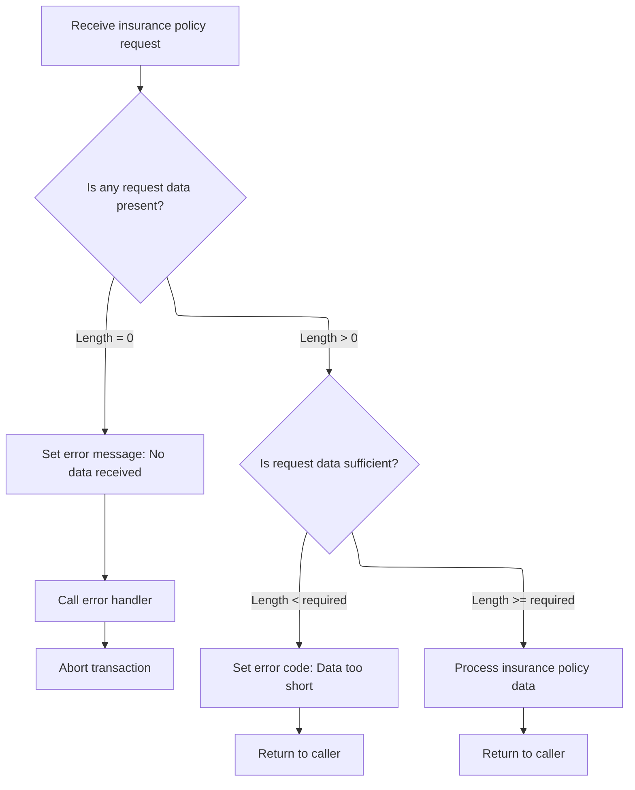
```mermaid
%%{init: {"flowchart": {"defaultRenderer": "elk"}} }%%
flowchart TD
    node1["Receive insurance policy request"] --> node2{"Is any request data present?"}
    click node1 openCode "base/src/lgapol01.cbl:68:73"
    node2 -->|"Length = 0"| node3["Set error message: No data received"]
    click node2 openCode "base/src/lgapol01.cbl:83:84"
    node3 --> node4["Call error handler"]
    click node4 openCode "base/src/lgapol01.cbl:85:86"
    node4 --> node5["Abort transaction"]
    click node5 openCode "base/src/lgapol01.cbl:86:87"
    node2 -->|"Length > 0"| node6{"Is request data sufficient?"}
    click node6 openCode "base/src/lgapol01.cbl:95:98"
    node6 -->|"Length < required"| node7["Set error code: Data too short"]
    click node7 openCode "base/src/lgapol01.cbl:96:97"
    node7 --> node8["Return to caller"]
    click node8 openCode "base/src/lgapol01.cbl:97:98"
    node6 -->|"Length >= required"| node9["Process insurance policy data"]
    click node9 openCode "base/src/lgapol01.cbl:103:106"
    node9 --> node10["Return to caller"]
    click node10 openCode "base/src/lgapol01.cbl:108:108"

classDef HeadingStyle fill:#777777,stroke:#333,stroke-width:2px;

%% Swimm:
%% %%{init: {"flowchart": {"defaultRenderer": "elk"}} }%%
%% flowchart TD
%%     node1["Receive insurance policy request"] --> node2{"Is any request data present?"}
%%     click node1 openCode "<SwmPath>[base/src/lgapol01.cbl](base/src/lgapol01.cbl)</SwmPath>:68:73"
%%     node2 -->|"Length = 0"| node3["Set error message: No data received"]
%%     click node2 openCode "<SwmPath>[base/src/lgapol01.cbl](base/src/lgapol01.cbl)</SwmPath>:83:84"
%%     node3 --> node4["Call error handler"]
%%     click node4 openCode "<SwmPath>[base/src/lgapol01.cbl](base/src/lgapol01.cbl)</SwmPath>:85:86"
%%     node4 --> node5["Abort transaction"]
%%     click node5 openCode "<SwmPath>[base/src/lgapol01.cbl](base/src/lgapol01.cbl)</SwmPath>:86:87"
%%     node2 -->|"Length > 0"| node6{"Is request data sufficient?"}
%%     click node6 openCode "<SwmPath>[base/src/lgapol01.cbl](base/src/lgapol01.cbl)</SwmPath>:95:98"
%%     node6 -->|"Length < required"| node7["Set error code: Data too short"]
%%     click node7 openCode "<SwmPath>[base/src/lgapol01.cbl](base/src/lgapol01.cbl)</SwmPath>:96:97"
%%     node7 --> node8["Return to caller"]
%%     click node8 openCode "<SwmPath>[base/src/lgapol01.cbl](base/src/lgapol01.cbl)</SwmPath>:97:98"
%%     node6 -->|"Length >= required"| node9["Process insurance policy data"]
%%     click node9 openCode "<SwmPath>[base/src/lgapol01.cbl](base/src/lgapol01.cbl)</SwmPath>:103:106"
%%     node9 --> node10["Return to caller"]
%%     click node10 openCode "<SwmPath>[base/src/lgapol01.cbl](base/src/lgapol01.cbl)</SwmPath>:108:108"
%% 
%% classDef HeadingStyle fill:#777777,stroke:#333,stroke-width:2px;
```

This section governs the validation and initial processing of insurance policy requests, ensuring that only requests with complete and sufficient data are processed, and that errors are handled and logged appropriately.

| Category        | Rule Name                 | Description                                                                                                                                                                                                                 |
| --------------- | ------------------------- | --------------------------------------------------------------------------------------------------------------------------------------------------------------------------------------------------------------------------- |
| Data validation | Missing request data      | If no request data is present, the system must set an error message indicating that no data was received, log the error, and abort the transaction.                                                                         |
| Data validation | Insufficient request data | If the request data is present but shorter than the required length (header length + required length), the system must set an error code indicating that the data is too short and return to the caller without processing. |
| Business logic  | Valid policy request      | If the request data is present and meets or exceeds the required length, the system must process the insurance policy data and return to the caller.                                                                        |

<SwmSnippet path="/base/src/lgapol01.cbl" line="68">

---

<SwmToken path="base/src/lgapol01.cbl" pos="68:1:3" line-data="       P100-MAIN SECTION.">`P100-MAIN`</SwmToken> validates input and calls <SwmToken path="base/src/lgapol01.cbl" pos="103:9:9" line-data="           EXEC CICS Link Program(LGAPDB01)">`LGAPDB01`</SwmToken> for policy processing.

```cobol
       P100-MAIN SECTION.

      *----------------------------------------------------------------*
      * Common code                                                    *
      *----------------------------------------------------------------*
           INITIALIZE W1-CONTROL.
           MOVE EIBTRNID TO W1-TID.
           MOVE EIBTRMID TO W1-TRM.
           MOVE EIBTASKN TO W1-TSK.
           MOVE EIBCALEN TO W1-LEN.
      *----------------------------------------------------------------*

      *----------------------------------------------------------------*
      * Check commarea and obtain required details                     *
      *----------------------------------------------------------------*
           IF EIBCALEN IS EQUAL TO ZERO
               MOVE ' NO COMMAREA RECEIVED' TO W3-DETAIL
               PERFORM P999-ERROR
               EXEC CICS ABEND ABCODE('LGCA') NODUMP END-EXEC
           END-IF

           MOVE '00' TO CA-RETURN-CODE
           SET W1-PTR TO ADDRESS OF DFHCOMMAREA.

           ADD W4-HDR-LEN TO W4-REQ-LEN


           IF EIBCALEN IS LESS THAN W4-REQ-LEN
             MOVE '98' TO CA-RETURN-CODE
             EXEC CICS RETURN END-EXEC
           END-IF

      *----------------------------------------------------------------*
      *    Perform the data Inserts                                    *
      *----------------------------------------------------------------*
           EXEC CICS Link Program(LGAPDB01)
                Commarea(DFHCOMMAREA)
                LENGTH(32500)
           END-EXEC.

           EXEC CICS RETURN END-EXEC.
```

---

</SwmSnippet>

<SwmSnippet path="/base/src/lgapol01.cbl" line="119">

---

<SwmToken path="base/src/lgapol01.cbl" pos="119:1:3" line-data="       P999-ERROR.">`P999-ERROR`</SwmToken> formats the error message, logs it with LGSTSQ, and sends up to 90 bytes of commarea data for context. This keeps error logs within the TDQ size limit.

```cobol
       P999-ERROR.
      * Save SQLCODE in message
      * Obtain and format current time and date
           EXEC CICS ASKTIME ABSTIME(W2-TIME)
           END-EXEC
           EXEC CICS FORMATTIME ABSTIME(W2-TIME)
                     MMDDYYYY(W2-DATE1)
                     TIME(W2-DATE2)
           END-EXEC
           MOVE W2-DATE1 TO W3-DATE
           MOVE W2-DATE2 TO W3-TIME
      * Write output message to TDQ
           EXEC CICS LINK PROGRAM('LGSTSQ')
                     COMMAREA(W3-MESSAGE)
                     LENGTH(LENGTH OF W3-MESSAGE)
           END-EXEC.
      * Write 90 bytes or as much as we have of commarea to TDQ
           IF EIBCALEN > 0 THEN
             IF EIBCALEN < 91 THEN
               MOVE DFHCOMMAREA(1:EIBCALEN) TO CA-DATA
               EXEC CICS LINK PROGRAM('LGSTSQ')
                         COMMAREA(CA-ERROR-MSG)
                         LENGTH(LENGTH OF CA-ERROR-MSG)
               END-EXEC
             ELSE
               MOVE DFHCOMMAREA(1:90) TO CA-DATA
               EXEC CICS LINK PROGRAM('LGSTSQ')
                         COMMAREA(CA-ERROR-MSG)
                         LENGTH(LENGTH OF CA-ERROR-MSG)
               END-EXEC
             END-IF
           END-IF.
           EXIT.
```

---

</SwmSnippet>

## Running the policy processing workflow

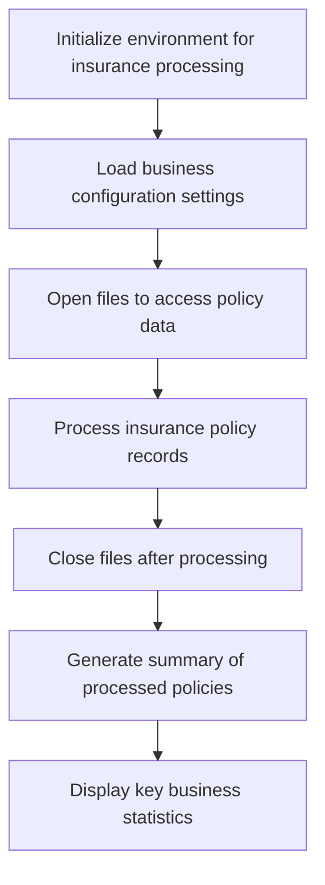
```mermaid
%%{init: {"flowchart": {"defaultRenderer": "elk"}} }%%
flowchart TD
    node1["Initialize environment for insurance processing"]
    click node1 openCode "base/src/LGAPDB01.cbl:91:91"
    node1 --> node2["Load business configuration settings"]
    click node2 openCode "base/src/LGAPDB01.cbl:92:92"
    node2 --> node3["Open files to access policy data"]
    click node3 openCode "base/src/LGAPDB01.cbl:93:93"
    node3 --> node4["Process insurance policy records"]
    click node4 openCode "base/src/LGAPDB01.cbl:94:94"
    node4 --> node5["Close files after processing"]
    click node5 openCode "base/src/LGAPDB01.cbl:95:95"
    node5 --> node6["Generate summary of processed policies"]
    click node6 openCode "base/src/LGAPDB01.cbl:96:96"
    node6 --> node7["Display key business statistics"]
    click node7 openCode "base/src/LGAPDB01.cbl:97:97"

classDef HeadingStyle fill:#777777,stroke:#333,stroke-width:2px;

%% Swimm:
%% %%{init: {"flowchart": {"defaultRenderer": "elk"}} }%%
%% flowchart TD
%%     node1["Initialize environment for insurance processing"]
%%     click node1 openCode "<SwmPath>[base/src/LGAPDB01.cbl](base/src/LGAPDB01.cbl)</SwmPath>:91:91"
%%     node1 --> node2["Load business configuration settings"]
%%     click node2 openCode "<SwmPath>[base/src/LGAPDB01.cbl](base/src/LGAPDB01.cbl)</SwmPath>:92:92"
%%     node2 --> node3["Open files to access policy data"]
%%     click node3 openCode "<SwmPath>[base/src/LGAPDB01.cbl](base/src/LGAPDB01.cbl)</SwmPath>:93:93"
%%     node3 --> node4["Process insurance policy records"]
%%     click node4 openCode "<SwmPath>[base/src/LGAPDB01.cbl](base/src/LGAPDB01.cbl)</SwmPath>:94:94"
%%     node4 --> node5["Close files after processing"]
%%     click node5 openCode "<SwmPath>[base/src/LGAPDB01.cbl](base/src/LGAPDB01.cbl)</SwmPath>:95:95"
%%     node5 --> node6["Generate summary of processed policies"]
%%     click node6 openCode "<SwmPath>[base/src/LGAPDB01.cbl](base/src/LGAPDB01.cbl)</SwmPath>:96:96"
%%     node6 --> node7["Display key business statistics"]
%%     click node7 openCode "<SwmPath>[base/src/LGAPDB01.cbl](base/src/LGAPDB01.cbl)</SwmPath>:97:97"
%% 
%% classDef HeadingStyle fill:#777777,stroke:#333,stroke-width:2px;
```

This section governs the end-to-end business process for handling insurance policy records, ensuring that all relevant data is processed, summarized, and reported according to business requirements.

| Category        | Rule Name                    | Description                                                                                                                                                                 |
| --------------- | ---------------------------- | --------------------------------------------------------------------------------------------------------------------------------------------------------------------------- |
| Data validation | Configuration precedence     | Business configuration settings must be loaded before any policy data is accessed or processed, to ensure that all calculations and validations use current business rules. |
| Data validation | Data integrity enforcement   | All files containing policy data must be closed after processing to ensure data integrity and prevent unauthorized access.                                                  |
| Business logic  | Sequential policy processing | All insurance policy records must be processed in the order they are received, ensuring no record is skipped or duplicated.                                                 |
| Business logic  | Summary reporting            | A summary report must be generated after all policies are processed, including total number of policies, total premium value, and any exceptions encountered.               |
| Business logic  | Statistics display           | Key business statistics, such as number of processed policies and aggregate premium, must be displayed to the user at the end of the workflow.                              |

<SwmSnippet path="/base/src/LGAPDB01.cbl" line="90">

---

<SwmToken path="base/src/LGAPDB01.cbl" pos="90:1:1" line-data="       P001.">`P001`</SwmToken> runs the whole policy processing workflow step by step.

```cobol
       P001.
           PERFORM P002-INITIALIZE
           PERFORM P003-LOAD-CONFIG
           PERFORM P005-OPEN-FILES
           PERFORM P006-PROCESS-RECORDS
           PERFORM P014-CLOSE-FILES
           PERFORM P015-GENERATE-SUMMARY
           PERFORM P016-DISPLAY-STATS
           STOP RUN.
```

---

</SwmSnippet>

## Loading configuration for policy calculations

This section ensures that the application has the necessary configuration values for calculating insurance policy premiums, either by loading them from a configuration file or by setting predefined defaults if the file is unavailable.

| Category        | Rule Name                                | Description                                                                                                                                                                                                                                                                                           |
| --------------- | ---------------------------------------- | ----------------------------------------------------------------------------------------------------------------------------------------------------------------------------------------------------------------------------------------------------------------------------------------------------- |
| Data validation | Non-numeric configuration value handling | If a configuration value is present in the file but is not numeric, the system must ignore it and retain the previous or default value for that parameter.                                                                                                                                            |
| Business logic  | Maximum risk score configuration         | The system must load the <SwmToken path="base/src/LGAPDB01.cbl" pos="126:4:4" line-data="           MOVE &#39;MAX_RISK_SCORE&#39; TO CONFIG-KEY">`MAX_RISK_SCORE`</SwmToken> value from the configuration file and use it in risk assessment calculations, provided the value is present and numeric. |
| Business logic  | Minimum premium configuration            | The system must load the <SwmToken path="base/src/LGAPDB01.cbl" pos="132:4:4" line-data="           MOVE &#39;MIN_PREMIUM&#39; TO CONFIG-KEY">`MIN_PREMIUM`</SwmToken> value from the configuration file and use it as the minimum allowable premium, provided the value is present and numeric.      |

<SwmSnippet path="/base/src/LGAPDB01.cbl" line="112">

---

<SwmToken path="base/src/LGAPDB01.cbl" pos="112:1:5" line-data="       P003-LOAD-CONFIG.">`P003-LOAD-CONFIG`</SwmToken> loads config values or sets defaults if the file's missing.

```cobol
       P003-LOAD-CONFIG.
           OPEN INPUT CONFIG-FILE
           IF NOT CONFIG-OK
               DISPLAY 'Warning: Config file not available - using defaults'
               PERFORM P004-SET-DEFAULTS
           ELSE
               PERFORM P004-READ-CONFIG-VALUES
               CLOSE CONFIG-FILE
           END-IF.
```

---

</SwmSnippet>

<SwmSnippet path="/base/src/LGAPDB01.cbl" line="125">

---

<SwmToken path="base/src/LGAPDB01.cbl" pos="125:1:7" line-data="       P004-READ-CONFIG-VALUES.">`P004-READ-CONFIG-VALUES`</SwmToken> reads <SwmToken path="base/src/LGAPDB01.cbl" pos="126:4:4" line-data="           MOVE &#39;MAX_RISK_SCORE&#39; TO CONFIG-KEY">`MAX_RISK_SCORE`</SwmToken> and <SwmToken path="base/src/LGAPDB01.cbl" pos="132:4:4" line-data="           MOVE &#39;MIN_PREMIUM&#39; TO CONFIG-KEY">`MIN_PREMIUM`</SwmToken> from the config file, converting them to numeric values for use in premium calculations.

```cobol
       P004-READ-CONFIG-VALUES.
           MOVE 'MAX_RISK_SCORE' TO CONFIG-KEY
           READ CONFIG-FILE
           IF CONFIG-OK AND NUMERIC-CONFIG
               MOVE FUNCTION NUMVAL(CONFIG-VALUE) TO WS-MAX-RISK-SCORE
           END-IF
           
           MOVE 'MIN_PREMIUM' TO CONFIG-KEY
           READ CONFIG-FILE
           IF CONFIG-OK AND NUMERIC-CONFIG
               MOVE FUNCTION NUMVAL(CONFIG-VALUE) TO WS-MIN-PREMIUM
           END-IF.
```

---

</SwmSnippet>

## Processing input policy records

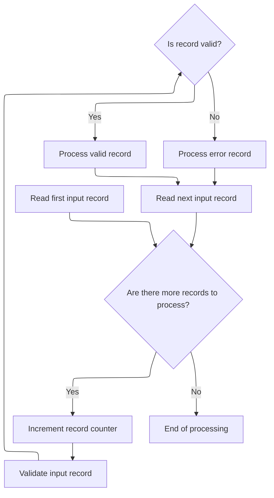
```mermaid
%%{init: {"flowchart": {"defaultRenderer": "elk"}} }%%
flowchart TD
    node1["Read first input record"]
    click node1 openCode "base/src/LGAPDB01.cbl:179:180"
    node1 --> node2{"Are there more records to process?"}
    click node2 openCode "base/src/LGAPDB01.cbl:180:189"
    node2 -->|"Yes"| node3["Increment record counter"]
    click node3 openCode "base/src/LGAPDB01.cbl:181:181"
    node3 --> node4["Validate input record"]
    click node4 openCode "base/src/LGAPDB01.cbl:182:182"
    node4 --> node5{"Is record valid?"}
    click node5 openCode "base/src/LGAPDB01.cbl:183:187"
    node5 -->|"Yes"| node6["Process valid record"]
    click node6 openCode "base/src/LGAPDB01.cbl:184:184"
    node5 -->|"No"| node7["Process error record"]
    click node7 openCode "base/src/LGAPDB01.cbl:186:186"
    node6 --> node8["Read next input record"]
    click node8 openCode "base/src/LGAPDB01.cbl:188:188"
    node7 --> node8
    node8 --> node2
    node2 -->|"No"| node9["End of processing"]
    click node9 openCode "base/src/LGAPDB01.cbl:189:189"

classDef HeadingStyle fill:#777777,stroke:#333,stroke-width:2px;

%% Swimm:
%% %%{init: {"flowchart": {"defaultRenderer": "elk"}} }%%
%% flowchart TD
%%     node1["Read first input record"]
%%     click node1 openCode "<SwmPath>[base/src/LGAPDB01.cbl](base/src/LGAPDB01.cbl)</SwmPath>:179:180"
%%     node1 --> node2{"Are there more records to process?"}
%%     click node2 openCode "<SwmPath>[base/src/LGAPDB01.cbl](base/src/LGAPDB01.cbl)</SwmPath>:180:189"
%%     node2 -->|"Yes"| node3["Increment record counter"]
%%     click node3 openCode "<SwmPath>[base/src/LGAPDB01.cbl](base/src/LGAPDB01.cbl)</SwmPath>:181:181"
%%     node3 --> node4["Validate input record"]
%%     click node4 openCode "<SwmPath>[base/src/LGAPDB01.cbl](base/src/LGAPDB01.cbl)</SwmPath>:182:182"
%%     node4 --> node5{"Is record valid?"}
%%     click node5 openCode "<SwmPath>[base/src/LGAPDB01.cbl](base/src/LGAPDB01.cbl)</SwmPath>:183:187"
%%     node5 -->|"Yes"| node6["Process valid record"]
%%     click node6 openCode "<SwmPath>[base/src/LGAPDB01.cbl](base/src/LGAPDB01.cbl)</SwmPath>:184:184"
%%     node5 -->|"No"| node7["Process error record"]
%%     click node7 openCode "<SwmPath>[base/src/LGAPDB01.cbl](base/src/LGAPDB01.cbl)</SwmPath>:186:186"
%%     node6 --> node8["Read next input record"]
%%     click node8 openCode "<SwmPath>[base/src/LGAPDB01.cbl](base/src/LGAPDB01.cbl)</SwmPath>:188:188"
%%     node7 --> node8
%%     node8 --> node2
%%     node2 -->|"No"| node9["End of processing"]
%%     click node9 openCode "<SwmPath>[base/src/LGAPDB01.cbl](base/src/LGAPDB01.cbl)</SwmPath>:189:189"
%% 
%% classDef HeadingStyle fill:#777777,stroke:#333,stroke-width:2px;
```

This section is responsible for iterating through all input insurance policy records, validating each record, processing valid records, and logging errors for invalid records. It ensures that every record in the input dataset is accounted for and categorized as either successfully processed or errored.

| Category        | Rule Name                 | Description                                                                                                                                                                  |
| --------------- | ------------------------- | ---------------------------------------------------------------------------------------------------------------------------------------------------------------------------- |
| Data validation | Policy record validation  | Each input policy record must be validated against business criteria before it is processed. Only records that pass all validation checks are considered valid.              |
| Business logic  | Processing valid records  | Each valid policy record must be processed according to business logic, which may include updating counters, storing results, or triggering downstream actions.              |
| Business logic  | Record counting           | The section must maintain a running count of all records processed, valid records, and error records. These counters must be updated in real time as each record is handled. |
| Business logic  | Complete dataset coverage | Processing must continue until all input records have been read and handled, ensuring no record is skipped or left unprocessed.                                              |

<SwmSnippet path="/base/src/LGAPDB01.cbl" line="178">

---

<SwmToken path="base/src/LGAPDB01.cbl" pos="178:1:5" line-data="       P006-PROCESS-RECORDS.">`P006-PROCESS-RECORDS`</SwmToken> loops through all input records, validates each, processes valid ones, and logs errors for invalid ones. This covers the full input dataset.

```cobol
       P006-PROCESS-RECORDS.
           PERFORM P007-READ-INPUT
           PERFORM UNTIL INPUT-EOF
               ADD 1 TO WS-REC-CNT
               PERFORM P008-VALIDATE-INPUT-RECORD
               IF WS-ERROR-COUNT = ZERO
                   PERFORM P009-PROCESS-VALID-RECORD
               ELSE
                   PERFORM P010-PROCESS-ERROR-RECORD
               END-IF
               PERFORM P007-READ-INPUT
           END-PERFORM.
```

---

</SwmSnippet>

## Validating and Logging Policy Input Errors

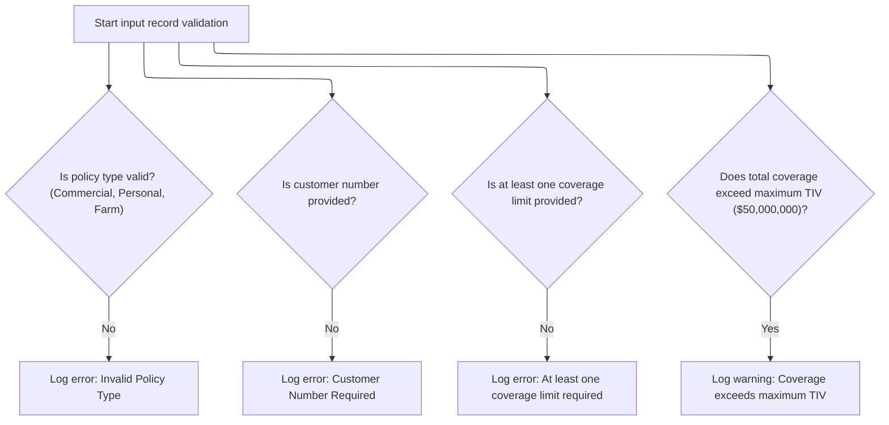
```mermaid
%%{init: {"flowchart": {"defaultRenderer": "elk"}} }%%
flowchart TD
  node1["Start input record validation"]
  click node1 openCode "base/src/LGAPDB01.cbl:195:224"
  node1 --> node2{"Is policy type valid? (Commercial, Personal, Farm)"}
  click node2 openCode "base/src/LGAPDB01.cbl:198:204"
  node1 --> node4{"Is customer number provided?"}
  click node4 openCode "base/src/LGAPDB01.cbl:206:210"
  node1 --> node6{"Is at least one coverage limit provided?"}
  click node6 openCode "base/src/LGAPDB01.cbl:212:217"
  node1 --> node8{"Does total coverage exceed maximum TIV ($50,000,000)?"}
  click node8 openCode "base/src/LGAPDB01.cbl:219:224"
  node2 -->|"No"| node3["Log error: Invalid Policy Type"]
  click node3 openCode "base/src/LGAPDB01.cbl:201:204"
  node4 -->|"No"| node5["Log error: Customer Number Required"]
  click node5 openCode "base/src/LGAPDB01.cbl:207:210"
  node6 -->|"No"| node7["Log error: At least one coverage limit required"]
  click node7 openCode "base/src/LGAPDB01.cbl:214:217"
  node8 -->|"Yes"| node9["Log warning: Coverage exceeds maximum TIV"]
  click node9 openCode "base/src/LGAPDB01.cbl:221:224"

classDef HeadingStyle fill:#777777,stroke:#333,stroke-width:2px;

%% Swimm:
%% %%{init: {"flowchart": {"defaultRenderer": "elk"}} }%%
%% flowchart TD
%%   node1["Start input record validation"]
%%   click node1 openCode "<SwmPath>[base/src/LGAPDB01.cbl](base/src/LGAPDB01.cbl)</SwmPath>:195:224"
%%   node1 --> node2{"Is policy type valid? (Commercial, Personal, Farm)"}
%%   click node2 openCode "<SwmPath>[base/src/LGAPDB01.cbl](base/src/LGAPDB01.cbl)</SwmPath>:198:204"
%%   node1 --> node4{"Is customer number provided?"}
%%   click node4 openCode "<SwmPath>[base/src/LGAPDB01.cbl](base/src/LGAPDB01.cbl)</SwmPath>:206:210"
%%   node1 --> node6{"Is at least one coverage limit provided?"}
%%   click node6 openCode "<SwmPath>[base/src/LGAPDB01.cbl](base/src/LGAPDB01.cbl)</SwmPath>:212:217"
%%   node1 --> node8{"Does total coverage exceed maximum TIV ($50,000,000)?"}
%%   click node8 openCode "<SwmPath>[base/src/LGAPDB01.cbl](base/src/LGAPDB01.cbl)</SwmPath>:219:224"
%%   node2 -->|"No"| node3["Log error: Invalid Policy Type"]
%%   click node3 openCode "<SwmPath>[base/src/LGAPDB01.cbl](base/src/LGAPDB01.cbl)</SwmPath>:201:204"
%%   node4 -->|"No"| node5["Log error: Customer Number Required"]
%%   click node5 openCode "<SwmPath>[base/src/LGAPDB01.cbl](base/src/LGAPDB01.cbl)</SwmPath>:207:210"
%%   node6 -->|"No"| node7["Log error: At least one coverage limit required"]
%%   click node7 openCode "<SwmPath>[base/src/LGAPDB01.cbl](base/src/LGAPDB01.cbl)</SwmPath>:214:217"
%%   node8 -->|"Yes"| node9["Log warning: Coverage exceeds maximum TIV"]
%%   click node9 openCode "<SwmPath>[base/src/LGAPDB01.cbl](base/src/LGAPDB01.cbl)</SwmPath>:221:224"
%% 
%% classDef HeadingStyle fill:#777777,stroke:#333,stroke-width:2px;
```

This section ensures that insurance policy input records meet required business criteria before further processing. It validates key fields and logs any issues, enabling downstream processes to handle records with full visibility of validation errors.

| Category        | Rule Name                | Description                                                                                                                                                                 |
| --------------- | ------------------------ | --------------------------------------------------------------------------------------------------------------------------------------------------------------------------- |
| Data validation | Valid policy type        | Only policy types 'C' (Commercial), 'P' (Personal), or 'F' (Farm) are considered valid. Any other value for policy type is invalid and must be logged as an error.          |
| Data validation | Customer number required | A customer number must be provided for every policy input record. If the customer number is missing, this must be logged as an error.                                       |
| Data validation | Coverage limit required  | At least one coverage limit (building, contents, or business interruption) must be provided for a policy. If all coverage limits are zero, this must be logged as an error. |
| Business logic  | Maximum TIV warning      | If the sum of all coverage limits (building, contents, and business interruption) exceeds the maximum Total Insured Value (TIV) of $50,000,000, a warning must be logged.   |

<SwmSnippet path="/base/src/LGAPDB01.cbl" line="195">

---

<SwmToken path="base/src/LGAPDB01.cbl" pos="195:1:7" line-data="       P008-VALIDATE-INPUT-RECORD.">`P008-VALIDATE-INPUT-RECORD`</SwmToken> checks the input record for missing or invalid fields (policy type, customer number, coverage limits, total coverage), and logs each error by calling <SwmToken path="base/src/LGAPDB01.cbl" pos="201:3:7" line-data="               PERFORM P008A-LOG-ERROR WITH ">`P008A-LOG-ERROR`</SwmToken>. This lets us collect all validation issues for a record before deciding how to process it next.

```cobol
       P008-VALIDATE-INPUT-RECORD.
           INITIALIZE WS-ERROR-HANDLING
           
           IF NOT COMMERCIAL-POLICY AND 
              NOT PERSONAL-POLICY AND 
              NOT FARM-POLICY
               PERFORM P008A-LOG-ERROR WITH 
                   'POL001' 'F' 'IN-POLICY-TYPE' 
                   'Invalid Policy Type'
           END-IF
           
           IF IN-CUSTOMER-NUM = SPACES
               PERFORM P008A-LOG-ERROR WITH 
                   'CUS001' 'F' 'IN-CUSTOMER-NUM' 
                   'Customer Number Required'
           END-IF
           
           IF IN-BUILDING-LIMIT = ZERO AND 
              IN-CONTENTS-LIMIT = ZERO
               PERFORM P008A-LOG-ERROR WITH 
                   'COV001' 'F' 'COVERAGE-LIMITS' 
                   'At least one coverage limit required'
           END-IF
           
           IF IN-BUILDING-LIMIT + IN-CONTENTS-LIMIT + 
              IN-BI-LIMIT > WS-MAX-TIV
               PERFORM P008A-LOG-ERROR WITH 
                   'COV002' 'W' 'COVERAGE-LIMITS' 
                   'Total coverage exceeds maximum TIV'
           END-IF.
```

---

</SwmSnippet>

<SwmSnippet path="/base/src/LGAPDB01.cbl" line="226">

---

<SwmToken path="base/src/LGAPDB01.cbl" pos="226:1:5" line-data="       P008A-LOG-ERROR.">`P008A-LOG-ERROR`</SwmToken> bumps the error count and copies the current error details from workspace variables into the next slot in the error arrays. It expects those variables to be set up before the call, and assumes the arrays are big enough for all errors in a batch.

```cobol
       P008A-LOG-ERROR.
           ADD 1 TO WS-ERROR-COUNT
           SET ERR-IDX TO WS-ERROR-COUNT
           MOVE WS-ERROR-CODE TO WS-ERROR-CODE (ERR-IDX)
           MOVE WS-ERROR-SEVERITY TO WS-ERROR-SEVERITY (ERR-IDX)
           MOVE WS-ERROR-FIELD TO WS-ERROR-FIELD (ERR-IDX)
           MOVE WS-ERROR-MESSAGE TO WS-ERROR-MESSAGE (ERR-IDX).
```

---

</SwmSnippet>

## Processing Validated Policy Records

This section determines whether a validated policy record is a commercial policy. If so, it processes the policy for quoting and underwriting; if not, it rejects the record and updates error statistics. The section ensures that only commercial policies proceed to full processing, while maintaining accurate counts of processed and rejected records.

| Category        | Rule Name                       | Description                                                                                                                |
| --------------- | ------------------------------- | -------------------------------------------------------------------------------------------------------------------------- |
| Data validation | Commercial policy eligibility   | Only policies with a policy type of 'C' (commercial) are eligible for full processing and quote generation.                |
| Data validation | Non-commercial policy rejection | All non-commercial policies (policy type not equal to 'C') must be rejected and not processed for quoting or underwriting. |
| Business logic  | Processed policy counting       | For each commercial policy processed, increment the processed policy counter by one to maintain accurate statistics.       |
| Business logic  | Rejected policy counting        | For each non-commercial policy rejected, increment the error counter by one to maintain accurate statistics.               |

<SwmSnippet path="/base/src/LGAPDB01.cbl" line="234">

---

<SwmToken path="base/src/LGAPDB01.cbl" pos="234:1:7" line-data="       P009-PROCESS-VALID-RECORD.">`P009-PROCESS-VALID-RECORD`</SwmToken> routes commercial policies for full processing, and rejects non-commercial ones, updating the right counters for stats.

```cobol
       P009-PROCESS-VALID-RECORD.
           IF COMMERCIAL-POLICY
               PERFORM P011-PROCESS-COMMERCIAL
               ADD 1 TO WS-PROC-CNT
           ELSE
               PERFORM P012-PROCESS-NON-COMMERCIAL
               ADD 1 TO WS-ERR-CNT
           END-IF.
```

---

</SwmSnippet>

### Generating Commercial Policy Quotes

This section is responsible for calculating and generating commercial insurance policy quotes based on underwriting decisions and discount eligibility criteria.

| Category        | Rule Name                         | Description                                                                                                                                                                                 |
| --------------- | --------------------------------- | ------------------------------------------------------------------------------------------------------------------------------------------------------------------------------------------- |
| Data validation | Underwriting approval requirement | A policy quote can only be generated if the underwriting decision status is 'approved'. If the status is 'pending', 'rejected', or 'referred', the quote must not be finalized.             |
| Data validation | Rejection reason requirement      | If the underwriting decision is 'rejected', the quote output must include a rejection reason and description.                                                                               |
| Data validation | Referral notes requirement        | If the underwriting decision is 'referred', the quote must include notes explaining the referral and cannot be finalized until further review.                                              |
| Business logic  | Discount eligibility application  | If the applicant is eligible for multiple policy discounts, claims-free discounts, or safety program discounts, the corresponding discount factor must be applied to the quote calculation. |
| Business logic  | Maximum discount cap              | The total discount factor applied to the quote must not exceed 1.00 (i.e., no more than 100% discount can be applied).                                                                      |

See <SwmLink doc-title="Processing Commercial Insurance Policies">[Processing Commercial Insurance Policies](.swm%5Cprocessing-commercial-insurance-policies.ba20d2og.sw.md)</SwmLink>

### Rejecting Unsupported Policy Types

<SwmSnippet path="/base/src/LGAPDB01.cbl" line="379">

---

<SwmToken path="base/src/LGAPDB01.cbl" pos="379:1:7" line-data="       P012-PROCESS-NON-COMMERCIAL.">`P012-PROCESS-NON-COMMERCIAL`</SwmToken> copies basic input fields to the output, sets all premium fields to zero, marks the record as 'UNSUPPORTED', and adds a fixed rejection reason. Then it writes the record out, making it clear this policy type isn't handled.

```cobol
       P012-PROCESS-NON-COMMERCIAL.
           MOVE IN-CUSTOMER-NUM TO OUT-CUSTOMER-NUM
           MOVE IN-PROPERTY-TYPE TO OUT-PROPERTY-TYPE
           MOVE IN-POSTCODE TO OUT-POSTCODE
           MOVE ZERO TO OUT-RISK-SCORE
           MOVE ZERO TO OUT-FIRE-PREMIUM
           MOVE ZERO TO OUT-CRIME-PREMIUM
           MOVE ZERO TO OUT-FLOOD-PREMIUM
           MOVE ZERO TO OUT-WEATHER-PREMIUM
           MOVE ZERO TO OUT-TOTAL-PREMIUM
           MOVE 'UNSUPPORTED' TO OUT-STATUS
           MOVE 'Only Commercial policies supported in this version' 
                TO OUT-REJECT-REASON
           WRITE OUTPUT-RECORD.
```

---

</SwmSnippet>

## Handling Policy Addition Failures

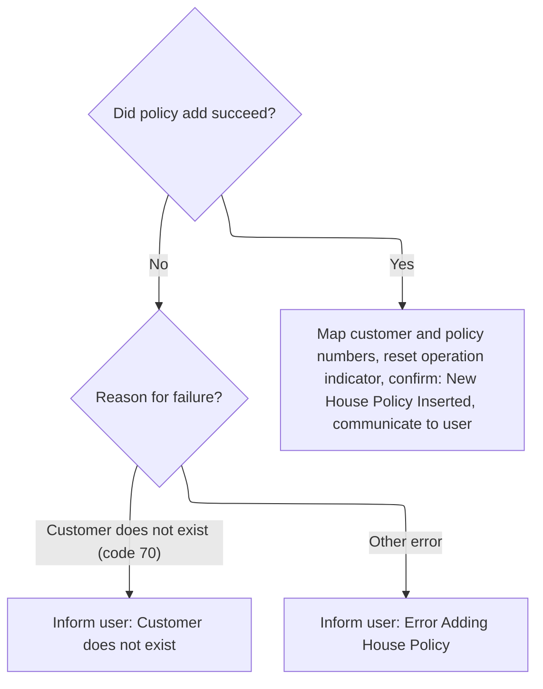
```mermaid
%%{init: {"flowchart": {"defaultRenderer": "elk"}} }%%
flowchart TD
  node1{"Did policy add succeed?"}
  click node1 openCode "base/src/lgtestp3.cbl:110:113"
  node1 -->|"No"| node2{"Reason for failure?"}
  click node2 openCode "base/src/lgtestp3.cbl:267:275"
  node2 -->|"Customer does not exist (code 70)"| node3["Inform user: Customer does not exist"]
  click node3 openCode "base/src/lgtestp3.cbl:270:271"
  node2 -->|"Other error"| node4["Inform user: Error Adding House Policy"]
  click node4 openCode "base/src/lgtestp3.cbl:273:274"
  node1 -->|"Yes"| node5["Map customer and policy numbers, reset operation indicator, confirm: New House Policy Inserted, communicate to user"]
  click node5 openCode "base/src/lgtestp3.cbl:114:122"

classDef HeadingStyle fill:#777777,stroke:#333,stroke-width:2px;

%% Swimm:
%% %%{init: {"flowchart": {"defaultRenderer": "elk"}} }%%
%% flowchart TD
%%   node1{"Did policy add succeed?"}
%%   click node1 openCode "<SwmPath>[base/src/lgtestp3.cbl](base/src/lgtestp3.cbl)</SwmPath>:110:113"
%%   node1 -->|"No"| node2{"Reason for failure?"}
%%   click node2 openCode "<SwmPath>[base/src/lgtestp3.cbl](base/src/lgtestp3.cbl)</SwmPath>:267:275"
%%   node2 -->|"Customer does not exist (code 70)"| node3["Inform user: Customer does not exist"]
%%   click node3 openCode "<SwmPath>[base/src/lgtestp3.cbl](base/src/lgtestp3.cbl)</SwmPath>:270:271"
%%   node2 -->|"Other error"| node4["Inform user: Error Adding House Policy"]
%%   click node4 openCode "<SwmPath>[base/src/lgtestp3.cbl](base/src/lgtestp3.cbl)</SwmPath>:273:274"
%%   node1 -->|"Yes"| node5["Map customer and policy numbers, reset operation indicator, confirm: New House Policy Inserted, communicate to user"]
%%   click node5 openCode "<SwmPath>[base/src/lgtestp3.cbl](base/src/lgtestp3.cbl)</SwmPath>:114:122"
%% 
%% classDef HeadingStyle fill:#777777,stroke:#333,stroke-width:2px;
```

<SwmSnippet path="/base/src/lgtestp3.cbl" line="110">

---

After coming back from <SwmToken path="base/src/lgtestp3.cbl" pos="106:10:10" line-data="                 EXEC CICS LINK PROGRAM(&#39;LGAPOL01&#39;)">`LGAPOL01`</SwmToken> in <SwmToken path="base/src/lgtestp3.cbl" pos="33:5:7" line-data="              GO TO A-GAIN.">`A-GAIN`</SwmToken>, if the return code signals failure, we trigger a CICS rollback and jump to <SwmToken path="base/src/lgtestp3.cbl" pos="112:5:7" line-data="                   GO TO NO-ADD">`NO-ADD`</SwmToken> to show the user an error message and reset for another attempt.

```cobol
                 IF CA-RETURN-CODE > 0
                   Exec CICS Syncpoint Rollback End-Exec
                   GO TO NO-ADD
                 END-IF
```

---

</SwmSnippet>

<SwmSnippet path="/base/src/lgtestp3.cbl" line="267">

---

<SwmToken path="base/src/lgtestp3.cbl" pos="267:1:3" line-data="       NO-ADD.">`NO-ADD`</SwmToken> picks the right error message based on the return code, then jumps to <SwmToken path="base/src/lgtestp3.cbl" pos="271:5:7" line-data="               Go To ERROR-OUT">`ERROR-OUT`</SwmToken> to display it and reset the session for the next user action.

```cobol
       NO-ADD.
           Evaluate CA-RETURN-CODE
             When 70
               Move 'Customer does not exist'          To  ERP1FLDO
               Go To ERROR-OUT
             When Other
               Move 'Error Adding House Policy'        To  ERP1FLDO
               Go To ERROR-OUT
           End-Evaluate.
```

---

</SwmSnippet>

<SwmSnippet path="/base/src/lgtestp3.cbl" line="114">

---

After <SwmToken path="base/src/lgtestp3.cbl" pos="112:5:7" line-data="                   GO TO NO-ADD">`NO-ADD`</SwmToken>, <SwmToken path="base/src/lgtestp3.cbl" pos="33:5:7" line-data="              GO TO A-GAIN.">`A-GAIN`</SwmToken> resets all output fields and sends a message to the user, making sure the UI is clean and ready for the next action.

```cobol
                 Move CA-CUSTOMER-NUM To ENP3CNOI
                 Move CA-POLICY-NUM   To ENP3PNOI
                 Move ' '             To ENP3OPTI
                 Move 'New House Policy Inserted'
                   To  ERP3FLDO
                 EXEC CICS SEND MAP ('SSMAPP3')
                           FROM(SSMAPP3O)
                           MAPSET ('SSMAP')
                 END-EXEC
```

---

</SwmSnippet>

<SwmSnippet path="/base/src/lgtestp3.cbl" line="125">

---

When the user picks delete, <SwmToken path="base/src/lgtestp3.cbl" pos="33:5:7" line-data="              GO TO A-GAIN.">`A-GAIN`</SwmToken> sets up the request ID and policy/customer numbers, then calls <SwmToken path="base/src/lgtestp3.cbl" pos="129:10:10" line-data="                 EXEC CICS LINK PROGRAM(&#39;LGDPOL01&#39;)">`LGDPOL01`</SwmToken> to handle the actual deletion in the backend.

```cobol
             WHEN '3'
                 Move '01DHOU'   To CA-REQUEST-ID
                 Move ENP3CNOO   To CA-CUSTOMER-NUM
                 Move ENP3PNOO   To CA-POLICY-NUM
                 EXEC CICS LINK PROGRAM('LGDPOL01')
                           COMMAREA(COMM-AREA)
                           LENGTH(32500)
                 END-EXEC
```

---

</SwmSnippet>

## Validating and Routing Policy Deletion Requests

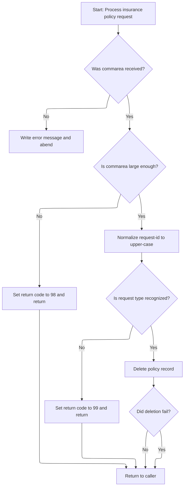
```mermaid
%%{init: {"flowchart": {"defaultRenderer": "elk"}} }%%
flowchart TD
    node1["Start: Process insurance policy request"] --> node2{"Was commarea received?"}
    click node1 openCode "base/src/lgdpol01.cbl:78:84"
    node2 -->|"No"| node3["Write error message and abend"]
    click node2 openCode "base/src/lgdpol01.cbl:95:99"
    click node3 openCode "base/src/lgdpol01.cbl:96:98"
    node2 -->|"Yes"| node4{"Is commarea large enough?"}
    click node4 openCode "base/src/lgdpol01.cbl:107:110"
    node4 -->|"No"| node5["Set return code to 98 and return"]
    click node5 openCode "base/src/lgdpol01.cbl:108:109"
    node5 --> node13["Return to caller"]
    click node13 openCode "base/src/lgdpol01.cbl:109:109"
    node4 -->|"Yes"| node6["Normalize request-id to upper-case"]
    click node6 openCode "base/src/lgdpol01.cbl:117:117"
    node6 --> node7{"Is request type recognized?"}
    click node7 openCode "base/src/lgdpol01.cbl:119:122"
    node7 -->|"No"| node8["Set return code to 99 and return"]
    click node8 openCode "base/src/lgdpol01.cbl:124:124"
    node8 --> node13
    node7 -->|"Yes"| node9["Delete policy record"]
    click node9 openCode "base/src/lgdpol01.cbl:126:126"
    node9 --> node10{"Did deletion fail?"}
    click node10 openCode "base/src/lgdpol01.cbl:127:129"
    node10 -->|"Yes"| node13
    node10 -->|"No"| node13

classDef HeadingStyle fill:#777777,stroke:#333,stroke-width:2px;

%% Swimm:
%% %%{init: {"flowchart": {"defaultRenderer": "elk"}} }%%
%% flowchart TD
%%     node1["Start: Process insurance policy request"] --> node2{"Was commarea received?"}
%%     click node1 openCode "<SwmPath>[base/src/lgdpol01.cbl](base/src/lgdpol01.cbl)</SwmPath>:78:84"
%%     node2 -->|"No"| node3["Write error message and abend"]
%%     click node2 openCode "<SwmPath>[base/src/lgdpol01.cbl](base/src/lgdpol01.cbl)</SwmPath>:95:99"
%%     click node3 openCode "<SwmPath>[base/src/lgdpol01.cbl](base/src/lgdpol01.cbl)</SwmPath>:96:98"
%%     node2 -->|"Yes"| node4{"Is commarea large enough?"}
%%     click node4 openCode "<SwmPath>[base/src/lgdpol01.cbl](base/src/lgdpol01.cbl)</SwmPath>:107:110"
%%     node4 -->|"No"| node5["Set return code to 98 and return"]
%%     click node5 openCode "<SwmPath>[base/src/lgdpol01.cbl](base/src/lgdpol01.cbl)</SwmPath>:108:109"
%%     node5 --> node13["Return to caller"]
%%     click node13 openCode "<SwmPath>[base/src/lgdpol01.cbl](base/src/lgdpol01.cbl)</SwmPath>:109:109"
%%     node4 -->|"Yes"| node6["Normalize <SwmToken path="base/src/lgdpol01.cbl" pos="113:5:7" line-data="      * Check request-id in commarea and if recognised ...             *">`request-id`</SwmToken> to upper-case"]
%%     click node6 openCode "<SwmPath>[base/src/lgdpol01.cbl](base/src/lgdpol01.cbl)</SwmPath>:117:117"
%%     node6 --> node7{"Is request type recognized?"}
%%     click node7 openCode "<SwmPath>[base/src/lgdpol01.cbl](base/src/lgdpol01.cbl)</SwmPath>:119:122"
%%     node7 -->|"No"| node8["Set return code to 99 and return"]
%%     click node8 openCode "<SwmPath>[base/src/lgdpol01.cbl](base/src/lgdpol01.cbl)</SwmPath>:124:124"
%%     node8 --> node13
%%     node7 -->|"Yes"| node9["Delete policy record"]
%%     click node9 openCode "<SwmPath>[base/src/lgdpol01.cbl](base/src/lgdpol01.cbl)</SwmPath>:126:126"
%%     node9 --> node10{"Did deletion fail?"}
%%     click node10 openCode "<SwmPath>[base/src/lgdpol01.cbl](base/src/lgdpol01.cbl)</SwmPath>:127:129"
%%     node10 -->|"Yes"| node13
%%     node10 -->|"No"| node13
%% 
%% classDef HeadingStyle fill:#777777,stroke:#333,stroke-width:2px;
```

This section governs the validation and routing of insurance policy deletion requests. It ensures only valid, recognized requests with sufficient data are processed, and provides clear error handling and logging for invalid or incomplete requests.

| Category        | Rule Name                           | Description                                                                                                                                                                                                                                                                                                                                                                                                                                                                                                                                                                                                                                                                                                                                                                            |
| --------------- | ----------------------------------- | -------------------------------------------------------------------------------------------------------------------------------------------------------------------------------------------------------------------------------------------------------------------------------------------------------------------------------------------------------------------------------------------------------------------------------------------------------------------------------------------------------------------------------------------------------------------------------------------------------------------------------------------------------------------------------------------------------------------------------------------------------------------------------------- |
| Data validation | Missing commarea rejection          | If no commarea is received with the request, the system must reject the request, log an error message with details and timestamp, and terminate the transaction with an error code.                                                                                                                                                                                                                                                                                                                                                                                                                                                                                                                                                                                                    |
| Data validation | Minimum commarea length enforcement | If the commarea received is less than 28 bytes in length, the system must reject the request, set the return code to 98, and return to the caller without processing the deletion.                                                                                                                                                                                                                                                                                                                                                                                                                                                                                                                                                                                                     |
| Data validation | Supported request types enforcement | Only requests with recognized request IDs (<SwmToken path="base/src/lgdpol01.cbl" pos="119:18:18" line-data="           IF ( CA-REQUEST-ID NOT EQUAL TO &#39;01DEND&#39; AND">`01DEND`</SwmToken>, <SwmToken path="base/src/lgdpol01.cbl" pos="120:14:14" line-data="                CA-REQUEST-ID NOT EQUAL TO &#39;01DMOT&#39; AND">`01DMOT`</SwmToken>, <SwmToken path="base/src/lgtestp3.cbl" pos="126:4:4" line-data="                 Move &#39;01DHOU&#39;   To CA-REQUEST-ID">`01DHOU`</SwmToken>, <SwmToken path="base/src/lgdpol01.cbl" pos="122:14:14" line-data="                CA-REQUEST-ID NOT EQUAL TO &#39;01DCOM&#39; )">`01DCOM`</SwmToken>) are eligible for policy deletion. Unrecognized request IDs must result in a return code of 99 and no deletion action. |
| Business logic  | Request ID normalization            | The request ID in the commarea must be normalized to upper-case before validation, ensuring consistent recognition of supported request types.                                                                                                                                                                                                                                                                                                                                                                                                                                                                                                                                                                                                                                         |

<SwmSnippet path="/base/src/lgdpol01.cbl" line="78">

---

MAINLINE in <SwmToken path="base/src/lgtestp3.cbl" pos="129:10:10" line-data="                 EXEC CICS LINK PROGRAM(&#39;LGDPOL01&#39;)">`LGDPOL01`</SwmToken> checks the commarea for length and valid request ID, sets up transaction context, and either calls the deletion routine or returns an error code. Only recognized request IDs get processed.

```cobol
       MAINLINE SECTION.

      *----------------------------------------------------------------*
      * Common code                                                    *
      *----------------------------------------------------------------*
      * initialize working storage variables
           INITIALIZE WS-HEADER.
      * set up general variable
           MOVE EIBTRNID TO WS-TRANSID.
           MOVE EIBTRMID TO WS-TERMID.
           MOVE EIBTASKN TO WS-TASKNUM.
      *----------------------------------------------------------------*

      *----------------------------------------------------------------*
      * Check commarea and obtain required details                     *
      *----------------------------------------------------------------*
      * If NO commarea received issue an ABEND
           IF EIBCALEN IS EQUAL TO ZERO
               MOVE ' NO COMMAREA RECEIVED' TO EM-VARIABLE
               PERFORM WRITE-ERROR-MESSAGE
               EXEC CICS ABEND ABCODE('LGCA') NODUMP END-EXEC
           END-IF

      * initialize commarea return code to zero
           MOVE '00' TO CA-RETURN-CODE
           MOVE EIBCALEN TO WS-CALEN.
           SET WS-ADDR-DFHCOMMAREA TO ADDRESS OF DFHCOMMAREA.

      * Check commarea is large enough
           IF EIBCALEN IS LESS THAN WS-CA-HEADER-LEN
             MOVE '98' TO CA-RETURN-CODE
             EXEC CICS RETURN END-EXEC
           END-IF

      *----------------------------------------------------------------*
      * Check request-id in commarea and if recognised ...             *
      * Call routine to delete row from policy table                   *
      *----------------------------------------------------------------*
      * Upper case value passed in Request Id field                    *
           MOVE FUNCTION UPPER-CASE(CA-REQUEST-ID) TO CA-REQUEST-ID

           IF ( CA-REQUEST-ID NOT EQUAL TO '01DEND' AND
                CA-REQUEST-ID NOT EQUAL TO '01DMOT' AND
                CA-REQUEST-ID NOT EQUAL TO '01DHOU' AND
                CA-REQUEST-ID NOT EQUAL TO '01DCOM' )
      *        Request is not recognised or supported
               MOVE '99' TO CA-RETURN-CODE
           ELSE
               PERFORM DELETE-POLICY-DB2-INFO
               If CA-RETURN-CODE > 0
                 EXEC CICS RETURN END-EXEC
               End-if
           END-IF

      * Return to caller
           EXEC CICS RETURN END-EXEC.
```

---

</SwmSnippet>

<SwmSnippet path="/base/src/lgdpol01.cbl" line="154">

---

<SwmToken path="base/src/lgdpol01.cbl" pos="154:1:5" line-data="       WRITE-ERROR-MESSAGE.">`WRITE-ERROR-MESSAGE`</SwmToken> in <SwmToken path="base/src/lgtestp3.cbl" pos="129:10:10" line-data="                 EXEC CICS LINK PROGRAM(&#39;LGDPOL01&#39;)">`LGDPOL01`</SwmToken> formats the error with timestamp and details, then calls LGSTSQ to log it. If there's commarea data, it logs up to 90 bytes for extra context.

```cobol
       WRITE-ERROR-MESSAGE.
      * Save SQLCODE in message
      * Obtain and format current time and date
           EXEC CICS ASKTIME ABSTIME(WS-ABSTIME)
           END-EXEC
           EXEC CICS FORMATTIME ABSTIME(Ws-ABSTIME)
                     MMDDYYYY(WS-DATE)
                     TIME(WS-TIME)
           END-EXEC
           MOVE WS-DATE TO EM-DATE
           MOVE WS-TIME TO EM-TIME
      * Write output message to TDQ
           EXEC CICS LINK PROGRAM('LGSTSQ')
                     COMMAREA(ERROR-MSG)
                     LENGTH(LENGTH OF ERROR-MSG)
           END-EXEC.
      * Write 90 bytes or as much as we have of commarea to TDQ
           IF EIBCALEN > 0 THEN
             IF EIBCALEN < 91 THEN
               MOVE DFHCOMMAREA(1:EIBCALEN) TO CA-DATA
               EXEC CICS LINK PROGRAM('LGSTSQ')
                         COMMAREA(CA-ERROR-MSG)
                         LENGTH(LENGTH OF CA-ERROR-MSG)
               END-EXEC
             ELSE
               MOVE DFHCOMMAREA(1:90) TO CA-DATA
               EXEC CICS LINK PROGRAM('LGSTSQ')
                         COMMAREA(CA-ERROR-MSG)
                         LENGTH(LENGTH OF CA-ERROR-MSG)
               END-EXEC
             END-IF
           END-IF.
           EXIT.
```

---

</SwmSnippet>

## Delegating Policy Deletion to Backend

This section is responsible for delegating the deletion of an insurance policy to a backend process, ensuring that all business rules and cascading deletions are handled centrally and consistently.

| Category        | Rule Name                               | Description                                                                                                                                            |
| --------------- | --------------------------------------- | ------------------------------------------------------------------------------------------------------------------------------------------------------ |
| Data validation | Policy identification validation        | A policy deletion request must include valid policy identification information before it can be processed.                                             |
| Business logic  | Cascading deletion of dependent records | When a policy is deleted, all dependent records (such as claims or endorsements linked to the policy) must also be deleted to maintain data integrity. |

<SwmSnippet path="/base/src/lgdpol01.cbl" line="139">

---

<SwmToken path="base/src/lgdpol01.cbl" pos="139:1:7" line-data="       DELETE-POLICY-DB2-INFO.">`DELETE-POLICY-DB2-INFO`</SwmToken> in <SwmToken path="base/src/lgtestp3.cbl" pos="129:10:10" line-data="                 EXEC CICS LINK PROGRAM(&#39;LGDPOL01&#39;)">`LGDPOL01`</SwmToken> calls <SwmToken path="base/src/lgdpol01.cbl" pos="141:9:9" line-data="           EXEC CICS LINK PROGRAM(LGDPDB01)">`LGDPDB01`</SwmToken> via CICS LINK, passing the commarea so the backend can handle the actual <SwmToken path="base/src/lgdpol01.cbl" pos="139:5:5" line-data="       DELETE-POLICY-DB2-INFO.">`DB2`</SwmToken> deletion and any cascading logic.

```cobol
       DELETE-POLICY-DB2-INFO.

           EXEC CICS LINK PROGRAM(LGDPDB01)
                Commarea(DFHCOMMAREA)
                LENGTH(32500)
           END-EXEC.

           EXIT.
```

---

</SwmSnippet>

## Validating and Executing <SwmToken path="base/src/lgipdb01.cbl" pos="242:5:5" line-data="      * initialize DB2 host variables">`DB2`</SwmToken> Policy Deletion


```mermaid
%%{init: {"flowchart": {"defaultRenderer": "elk"}} }%%
flowchart TD
    node2{"Was request data received?"}
    click node2 openCode "base/src/lgdpdb01.cbl:131:135"
    node2 -->|"No"| node3["Record error: No request data"]
    click node3 openCode "base/src/lgdpdb01.cbl:132:133"
    node3 --> node4["Return to caller"]
    click node4 openCode "base/src/lgdpdb01.cbl:134:135"
    node2 -->|"Yes"| node5{"Is request data large enough?"}
    click node5 openCode "base/src/lgdpdb01.cbl:143:146"
    node5 -->|"No"| node6["Set result code: Data too short"]
    click node6 openCode "base/src/lgdpdb01.cbl:144:145"
    node6 --> node4
    node5 -->|"Yes"| node7{"Is request type supported? (01DEND, 01DHOU, 01DCOM, 01DMOT)"}
    click node7 openCode "base/src/lgdpdb01.cbl:160:163"
    node7 -->|"No"| node8["Set result code: Unsupported request"]
    click node8 openCode "base/src/lgdpdb01.cbl:165:165"
    node8 --> node9["Return to caller"]
    click node9 openCode "base/src/lgdpdb01.cbl:175:175"
    node7 -->|"Yes"| node10["Delete policy from database"]
    click node10 openCode "base/src/lgdpdb01.cbl:167:167"
    node10 --> node9
classDef HeadingStyle fill:#777777,stroke:#333,stroke-width:2px;

%% Swimm:
%% %%{init: {"flowchart": {"defaultRenderer": "elk"}} }%%
%% flowchart TD
%%     node2{"Was request data received?"}
%%     click node2 openCode "<SwmPath>[base/src/lgdpdb01.cbl](base/src/lgdpdb01.cbl)</SwmPath>:131:135"
%%     node2 -->|"No"| node3["Record error: No request data"]
%%     click node3 openCode "<SwmPath>[base/src/lgdpdb01.cbl](base/src/lgdpdb01.cbl)</SwmPath>:132:133"
%%     node3 --> node4["Return to caller"]
%%     click node4 openCode "<SwmPath>[base/src/lgdpdb01.cbl](base/src/lgdpdb01.cbl)</SwmPath>:134:135"
%%     node2 -->|"Yes"| node5{"Is request data large enough?"}
%%     click node5 openCode "<SwmPath>[base/src/lgdpdb01.cbl](base/src/lgdpdb01.cbl)</SwmPath>:143:146"
%%     node5 -->|"No"| node6["Set result code: Data too short"]
%%     click node6 openCode "<SwmPath>[base/src/lgdpdb01.cbl](base/src/lgdpdb01.cbl)</SwmPath>:144:145"
%%     node6 --> node4
%%     node5 -->|"Yes"| node7{"Is request type supported? (<SwmToken path="base/src/lgdpol01.cbl" pos="119:18:18" line-data="           IF ( CA-REQUEST-ID NOT EQUAL TO &#39;01DEND&#39; AND">`01DEND`</SwmToken>, <SwmToken path="base/src/lgtestp3.cbl" pos="126:4:4" line-data="                 Move &#39;01DHOU&#39;   To CA-REQUEST-ID">`01DHOU`</SwmToken>, <SwmToken path="base/src/lgdpol01.cbl" pos="122:14:14" line-data="                CA-REQUEST-ID NOT EQUAL TO &#39;01DCOM&#39; )">`01DCOM`</SwmToken>, <SwmToken path="base/src/lgdpol01.cbl" pos="120:14:14" line-data="                CA-REQUEST-ID NOT EQUAL TO &#39;01DMOT&#39; AND">`01DMOT`</SwmToken>)"}
%%     click node7 openCode "<SwmPath>[base/src/lgdpdb01.cbl](base/src/lgdpdb01.cbl)</SwmPath>:160:163"
%%     node7 -->|"No"| node8["Set result code: Unsupported request"]
%%     click node8 openCode "<SwmPath>[base/src/lgdpdb01.cbl](base/src/lgdpdb01.cbl)</SwmPath>:165:165"
%%     node8 --> node9["Return to caller"]
%%     click node9 openCode "<SwmPath>[base/src/lgdpdb01.cbl](base/src/lgdpdb01.cbl)</SwmPath>:175:175"
%%     node7 -->|"Yes"| node10["Delete policy from database"]
%%     click node10 openCode "<SwmPath>[base/src/lgdpdb01.cbl](base/src/lgdpdb01.cbl)</SwmPath>:167:167"
%%     node10 --> node9
%% classDef HeadingStyle fill:#777777,stroke:#333,stroke-width:2px;
```

This section governs the validation and execution of insurance policy deletion requests, ensuring only valid, supported, and complete requests are processed, and that appropriate error handling and logging occurs for invalid or failed operations.

| Category        | Rule Name                        | Description                                                                                                                                                                                                                                                                                                                                                                                                                                                                                                                                                                                                                                                                                                                                                                    |
| --------------- | -------------------------------- | ------------------------------------------------------------------------------------------------------------------------------------------------------------------------------------------------------------------------------------------------------------------------------------------------------------------------------------------------------------------------------------------------------------------------------------------------------------------------------------------------------------------------------------------------------------------------------------------------------------------------------------------------------------------------------------------------------------------------------------------------------------------------------ |
| Data validation | Missing request data             | If no request data is received, the operation must be aborted and an error must be recorded indicating that no request data was provided.                                                                                                                                                                                                                                                                                                                                                                                                                                                                                                                                                                                                                                      |
| Data validation | Minimum request length           | If the request data is shorter than the required minimum length (28 bytes), the operation must be aborted and a result code indicating 'data too short' must be set.                                                                                                                                                                                                                                                                                                                                                                                                                                                                                                                                                                                                           |
| Data validation | Supported request types          | Only requests with a supported request type (<SwmToken path="base/src/lgdpol01.cbl" pos="119:18:18" line-data="           IF ( CA-REQUEST-ID NOT EQUAL TO &#39;01DEND&#39; AND">`01DEND`</SwmToken>, <SwmToken path="base/src/lgtestp3.cbl" pos="126:4:4" line-data="                 Move &#39;01DHOU&#39;   To CA-REQUEST-ID">`01DHOU`</SwmToken>, <SwmToken path="base/src/lgdpol01.cbl" pos="122:14:14" line-data="                CA-REQUEST-ID NOT EQUAL TO &#39;01DCOM&#39; )">`01DCOM`</SwmToken>, <SwmToken path="base/src/lgdpol01.cbl" pos="120:14:14" line-data="                CA-REQUEST-ID NOT EQUAL TO &#39;01DMOT&#39; AND">`01DMOT`</SwmToken>) are allowed to proceed; all other request types must be rejected with an 'unsupported request' result code. |
| Business logic  | Successful or not found deletion | If the policy deletion is successful or the policy does not exist (record not found), the operation is considered successful and no error is returned.                                                                                                                                                                                                                                                                                                                                                                                                                                                                                                                                                                                                                         |

<SwmSnippet path="/base/src/lgdpdb01.cbl" line="111">

---

MAINLINE in <SwmToken path="base/src/lgdpol01.cbl" pos="141:9:9" line-data="           EXEC CICS LINK PROGRAM(LGDPDB01)">`LGDPDB01`</SwmToken> validates the commarea, converts customer and policy numbers for <SwmToken path="base/src/lgdpdb01.cbl" pos="124:5:5" line-data="      * initialize DB2 host variables">`DB2`</SwmToken>, checks the request ID, and either runs the <SwmToken path="base/src/lgdpdb01.cbl" pos="124:5:5" line-data="      * initialize DB2 host variables">`DB2`</SwmToken> delete and VSAM delete or returns an error code.

```cobol
       MAINLINE SECTION.

      *----------------------------------------------------------------*
      * Common code                                                    *
      *----------------------------------------------------------------*
      * initialize working storage variables
           INITIALIZE WS-HEADER.
      * set up general variable
           MOVE EIBTRNID TO WS-TRANSID.
           MOVE EIBTRMID TO WS-TERMID.
           MOVE EIBTASKN TO WS-TASKNUM.
      *----------------------------------------------------------------*

      * initialize DB2 host variables
           INITIALIZE DB2-IN-INTEGERS.

      *----------------------------------------------------------------*
      * Check commarea and obtain required details                     *
      *----------------------------------------------------------------*
      * If NO commarea received issue an ABEND
           IF EIBCALEN IS EQUAL TO ZERO
               MOVE ' NO COMMAREA RECEIVED' TO EM-VARIABLE
               PERFORM WRITE-ERROR-MESSAGE
               EXEC CICS ABEND ABCODE('LGCA') NODUMP END-EXEC
           END-IF

      * initialize commarea return code to zero
           MOVE '00' TO CA-RETURN-CODE
           MOVE EIBCALEN TO WS-CALEN.
           SET WS-ADDR-DFHCOMMAREA TO ADDRESS OF DFHCOMMAREA.

      * Check commarea is large enough
           IF EIBCALEN IS LESS THAN WS-CA-HEADER-LEN
             MOVE '98' TO CA-RETURN-CODE
             EXEC CICS RETURN END-EXEC
           END-IF

      * Convert commarea customer & policy nums to DB2 integer format
           MOVE CA-CUSTOMER-NUM TO DB2-CUSTOMERNUM-INT
           MOVE CA-POLICY-NUM   TO DB2-POLICYNUM-INT
      * and save in error msg field incase required
           MOVE CA-CUSTOMER-NUM TO EM-CUSNUM
           MOVE CA-POLICY-NUM   TO EM-POLNUM

      *----------------------------------------------------------------*
      * Check request-id in commarea and if recognised ...             *
      * Call routine to delete row from policy table                   *
      *----------------------------------------------------------------*

           IF ( CA-REQUEST-ID NOT EQUAL TO '01DEND' AND
                CA-REQUEST-ID NOT EQUAL TO '01DHOU' AND
                CA-REQUEST-ID NOT EQUAL TO '01DCOM' AND
                CA-REQUEST-ID NOT EQUAL TO '01DMOT' ) Then
      *        Request is not recognised or supported
               MOVE '99' TO CA-RETURN-CODE
           ELSE
               PERFORM DELETE-POLICY-DB2-INFO
               EXEC CICS LINK PROGRAM(LGDPVS01)
                    Commarea(DFHCOMMAREA)
                    LENGTH(32500)
               END-EXEC
           END-IF.

      * Return to caller
           EXEC CICS RETURN END-EXEC.
```

---

</SwmSnippet>

<SwmSnippet path="/base/src/lgdpdb01.cbl" line="212">

---

<SwmToken path="base/src/lgdpdb01.cbl" pos="212:1:5" line-data="       WRITE-ERROR-MESSAGE.">`WRITE-ERROR-MESSAGE`</SwmToken> in <SwmToken path="base/src/lgdpol01.cbl" pos="141:9:9" line-data="           EXEC CICS LINK PROGRAM(LGDPDB01)">`LGDPDB01`</SwmToken> logs the SQLCODE, timestamp, and transaction details, then calls LGSTSQ to queue the error. It also logs up to 90 bytes of commarea data for extra context.

```cobol
       WRITE-ERROR-MESSAGE.
      * Save SQLCODE in message
           MOVE SQLCODE TO EM-SQLRC
      * Obtain and format current time and date
           EXEC CICS ASKTIME ABSTIME(WS-ABSTIME)
           END-EXEC
           EXEC CICS FORMATTIME ABSTIME(Ws-ABSTIME)
                     MMDDYYYY(WS-DATE)
                     TIME(WS-TIME)
           END-EXEC
           MOVE WS-DATE TO EM-DATE
           MOVE WS-TIME TO EM-TIME
      * Write output message to TDQ
           EXEC CICS LINK PROGRAM('LGSTSQ')
                     COMMAREA(ERROR-MSG)
                     LENGTH(LENGTH OF ERROR-MSG)
           END-EXEC.
      * Write 90 bytes or as much as we have of commarea to TDQ
           IF EIBCALEN > 0 THEN
             IF EIBCALEN < 91 THEN
               MOVE DFHCOMMAREA(1:EIBCALEN) TO CA-DATA
               EXEC CICS LINK PROGRAM('LGSTSQ')
                         COMMAREA(CA-ERROR-MSG)
                         LENGTH(LENGTH OF CA-ERROR-MSG)
               END-EXEC
             ELSE
               MOVE DFHCOMMAREA(1:90) TO CA-DATA
               EXEC CICS LINK PROGRAM('LGSTSQ')
                         COMMAREA(CA-ERROR-MSG)
                         LENGTH(LENGTH OF CA-ERROR-MSG)
               END-EXEC
             END-IF
           END-IF.
           EXIT.
```

---

</SwmSnippet>

<SwmSnippet path="/base/src/lgdpdb01.cbl" line="186">

---

<SwmToken path="base/src/lgdpdb01.cbl" pos="186:1:7" line-data="       DELETE-POLICY-DB2-INFO.">`DELETE-POLICY-DB2-INFO`</SwmToken> in <SwmToken path="base/src/lgdpol01.cbl" pos="141:9:9" line-data="           EXEC CICS LINK PROGRAM(LGDPDB01)">`LGDPDB01`</SwmToken> runs the SQL DELETE for the policy, checks the SQLCODE, and logs an error if it fails. If successful or not found, it just exits.

```cobol
       DELETE-POLICY-DB2-INFO.

           MOVE ' DELETE POLICY  ' TO EM-SQLREQ
           EXEC SQL
             DELETE
               FROM POLICY
               WHERE ( CUSTOMERNUMBER = :DB2-CUSTOMERNUM-INT AND
                       POLICYNUMBER  = :DB2-POLICYNUM-INT      )
           END-EXEC

      *    Treat SQLCODE 0 and SQLCODE 100 (record not found) as
      *    successful - end result is record does not exist
           IF SQLCODE NOT EQUAL 0 Then
               MOVE '90' TO CA-RETURN-CODE
               PERFORM WRITE-ERROR-MESSAGE
               EXEC CICS RETURN END-EXEC
           END-IF.

           EXIT.
```

---

</SwmSnippet>

## Deleting Policy Records from VSAM

This section governs the business rules for deleting insurance policy records from the VSAM file, ensuring data consistency and proper error handling when a deletion fails.

| Category        | Rule Name                            | Description                                                                                                                                                                                                          |
| --------------- | ------------------------------------ | -------------------------------------------------------------------------------------------------------------------------------------------------------------------------------------------------------------------- |
| Data validation | Valid policy identification required | A policy record may only be deleted if a valid policy number and customer number are provided.                                                                                                                       |
| Business logic  | Data consistency across systems      | Policy and customer data must remain consistent between VSAM and <SwmToken path="base/src/lgipdb01.cbl" pos="242:5:5" line-data="      * initialize DB2 host variables">`DB2`</SwmToken> after a deletion operation. |

<SwmSnippet path="/base/src/lgdpvs01.cbl" line="72">

---

MAINLINE in <SwmToken path="base/src/lgdpdb01.cbl" pos="168:9:9" line-data="               EXEC CICS LINK PROGRAM(LGDPVS01)">`LGDPVS01`</SwmToken> grabs the policy and customer info, runs the CICS file delete for VSAM, and logs an error if the response isn't normal. This keeps both <SwmToken path="base/src/lgipdb01.cbl" pos="242:5:5" line-data="      * initialize DB2 host variables">`DB2`</SwmToken> and VSAM in sync.

```cobol
       MAINLINE SECTION.
      *
      *---------------------------------------------------------------*
           Move EIBCALEN To WS-Commarea-Len.
      *---------------------------------------------------------------*
           Move CA-Request-ID(4:1) To WF-Request-ID
           Move CA-Policy-Num      To WF-Policy-Num
           Move CA-Customer-Num    To WF-Customer-Num
      *---------------------------------------------------------------*
           Exec CICS Delete File('KSDSPOLY')
                     Ridfld(WF-Policy-Key)
                     KeyLength(21)
                     RESP(WS-RESP)
           End-Exec.
           If WS-RESP Not = DFHRESP(NORMAL)
             Move EIBRESP2 To WS-RESP2
             MOVE '81' TO CA-RETURN-CODE
             PERFORM WRITE-ERROR-MESSAGE
             EXEC CICS RETURN END-EXEC
           End-If.
```

---

</SwmSnippet>

<SwmSnippet path="/base/src/lgdpvs01.cbl" line="99">

---

<SwmToken path="base/src/lgdpvs01.cbl" pos="99:1:5" line-data="       WRITE-ERROR-MESSAGE.">`WRITE-ERROR-MESSAGE`</SwmToken> in <SwmToken path="base/src/lgdpdb01.cbl" pos="168:9:9" line-data="               EXEC CICS LINK PROGRAM(LGDPVS01)">`LGDPVS01`</SwmToken> logs the timestamp, policy/customer info, and both response codes, then calls LGSTSQ to queue the error. It also logs up to 90 bytes of commarea data for extra context.

```cobol
       WRITE-ERROR-MESSAGE.
           EXEC CICS ASKTIME ABSTIME(WS-ABSTIME)
           END-EXEC
           EXEC CICS FORMATTIME ABSTIME(WS-ABSTIME)
                     MMDDYYYY(WS-DATE)
                     TIME(WS-TIME)
           END-EXEC
      *
           MOVE WS-DATE TO EM-DATE
           MOVE WS-TIME TO EM-TIME
           Move CA-Customer-Num To EM-CUSNUM 
           Move CA-POLICY-NUM To EM-POLNUM 
           Move WS-RESP         To EM-RespRC
           Move WS-RESP2        To EM-Resp2RC
           EXEC CICS LINK PROGRAM('LGSTSQ')
                     COMMAREA(ERROR-MSG)
                     LENGTH(LENGTH OF ERROR-MSG)
           END-EXEC.
           IF EIBCALEN > 0 THEN
             IF EIBCALEN < 91 THEN
               MOVE DFHCOMMAREA(1:EIBCALEN) TO CA-DATA
               EXEC CICS LINK PROGRAM('LGSTSQ')
                         COMMAREA(CA-ERROR-MSG)
                         LENGTH(Length Of CA-ERROR-MSG)
               END-EXEC
             ELSE
               MOVE DFHCOMMAREA(1:90) TO CA-DATA
               EXEC CICS LINK PROGRAM('LGSTSQ')
                         COMMAREA(CA-ERROR-MSG)
                         LENGTH(Length Of CA-ERROR-MSG)
               END-EXEC
             END-IF
           END-IF.
           EXIT.
```

---

</SwmSnippet>

## Handling Policy Deletion Failures


```mermaid
%%{init: {"flowchart": {"defaultRenderer": "elk"}} }%%
flowchart TD
    node1{"Was policy deletion successful? (CA-RETURN-CODE > 0)"}
    click node1 openCode "base/src/lgtestp3.cbl:133:136"
    node1 -->|"No"| node2["Clear policy details"]
    click node2 openCode "base/src/lgtestp3.cbl:138:148"
    node2 --> node3["Show 'House Policy Deleted' message to user"]
    click node3 openCode "base/src/lgtestp3.cbl:149:152"
    node3 --> node4["Send confirmation to user"]
    click node4 openCode "base/src/lgtestp3.cbl:149:152"
    node1 -->|"Yes"| node5["Show error message 'Error Deleting House Policy'"]
    click node5 openCode "base/src/lgtestp3.cbl:281:283"
    node5 --> node6["End"]
    node4 --> node7{"Is there valid policy data after retrieval? (CA-RETURN-CODE > 0 after LGIPOL01)"}
    click node7 openCode "base/src/lgtestp3.cbl:163:165"
    node7 -->|"No"| node8["Show error message 'No Data'"]
    click node8 openCode "base/src/lgtestp3.cbl:281:283"
    node7 -->|"Yes"| node9["Update policy details"]
    click node9 openCode "base/src/lgtestp3.cbl:167:175"
    node9 --> node10["Send updated policy details to user"]
    click node10 openCode "base/src/lgtestp3.cbl:175:178"
    node10 --> node11["Receive user confirmation"]
    click node11 openCode "base/src/lgtestp3.cbl:179:181"

classDef HeadingStyle fill:#777777,stroke:#333,stroke-width:2px;

%% Swimm:
%% %%{init: {"flowchart": {"defaultRenderer": "elk"}} }%%
%% flowchart TD
%%     node1{"Was policy deletion successful? (<SwmToken path="base/src/lgtestp3.cbl" pos="74:3:7" line-data="                 IF CA-RETURN-CODE &gt; 0">`CA-RETURN-CODE`</SwmToken> > 0)"}
%%     click node1 openCode "<SwmPath>[base/src/lgtestp3.cbl](base/src/lgtestp3.cbl)</SwmPath>:133:136"
%%     node1 -->|"No"| node2["Clear policy details"]
%%     click node2 openCode "<SwmPath>[base/src/lgtestp3.cbl](base/src/lgtestp3.cbl)</SwmPath>:138:148"
%%     node2 --> node3["Show 'House Policy Deleted' message to user"]
%%     click node3 openCode "<SwmPath>[base/src/lgtestp3.cbl](base/src/lgtestp3.cbl)</SwmPath>:149:152"
%%     node3 --> node4["Send confirmation to user"]
%%     click node4 openCode "<SwmPath>[base/src/lgtestp3.cbl](base/src/lgtestp3.cbl)</SwmPath>:149:152"
%%     node1 -->|"Yes"| node5["Show error message 'Error Deleting House Policy'"]
%%     click node5 openCode "<SwmPath>[base/src/lgtestp3.cbl](base/src/lgtestp3.cbl)</SwmPath>:281:283"
%%     node5 --> node6["End"]
%%     node4 --> node7{"Is there valid policy data after retrieval? (<SwmToken path="base/src/lgtestp3.cbl" pos="74:3:7" line-data="                 IF CA-RETURN-CODE &gt; 0">`CA-RETURN-CODE`</SwmToken> > 0 after <SwmToken path="base/src/lgtestp3.cbl" pos="70:10:10" line-data="                 EXEC CICS LINK PROGRAM(&#39;LGIPOL01&#39;)">`LGIPOL01`</SwmToken>)"}
%%     click node7 openCode "<SwmPath>[base/src/lgtestp3.cbl](base/src/lgtestp3.cbl)</SwmPath>:163:165"
%%     node7 -->|"No"| node8["Show error message 'No Data'"]
%%     click node8 openCode "<SwmPath>[base/src/lgtestp3.cbl](base/src/lgtestp3.cbl)</SwmPath>:281:283"
%%     node7 -->|"Yes"| node9["Update policy details"]
%%     click node9 openCode "<SwmPath>[base/src/lgtestp3.cbl](base/src/lgtestp3.cbl)</SwmPath>:167:175"
%%     node9 --> node10["Send updated policy details to user"]
%%     click node10 openCode "<SwmPath>[base/src/lgtestp3.cbl](base/src/lgtestp3.cbl)</SwmPath>:175:178"
%%     node10 --> node11["Receive user confirmation"]
%%     click node11 openCode "<SwmPath>[base/src/lgtestp3.cbl](base/src/lgtestp3.cbl)</SwmPath>:179:181"
%% 
%% classDef HeadingStyle fill:#777777,stroke:#333,stroke-width:2px;
```

<SwmSnippet path="/base/src/lgtestp3.cbl" line="133">

---

After coming back from <SwmToken path="base/src/lgtestp3.cbl" pos="129:10:10" line-data="                 EXEC CICS LINK PROGRAM(&#39;LGDPOL01&#39;)">`LGDPOL01`</SwmToken> in <SwmToken path="base/src/lgtestp3.cbl" pos="33:5:7" line-data="              GO TO A-GAIN.">`A-GAIN`</SwmToken>, if the return code signals failure, we trigger a CICS rollback and jump to <SwmToken path="base/src/lgtestp3.cbl" pos="135:5:7" line-data="                   GO TO NO-DELETE">`NO-DELETE`</SwmToken> to show the user an error message and reset for another attempt.

```cobol
                 IF CA-RETURN-CODE > 0
                   Exec CICS Syncpoint Rollback End-Exec
                   GO TO NO-DELETE
                 END-IF
```

---

</SwmSnippet>

<SwmSnippet path="/base/src/lgtestp3.cbl" line="281">

---

<SwmToken path="base/src/lgtestp3.cbl" pos="281:1:3" line-data="       NO-DELETE.">`NO-DELETE`</SwmToken> sets a fixed error message for failed deletes and jumps to <SwmToken path="base/src/lgtestp3.cbl" pos="283:5:7" line-data="           Go To ERROR-OUT.">`ERROR-OUT`</SwmToken> to show it and reset the session.

```cobol
       NO-DELETE.
           Move 'Error Deleting House Policy'      To  ERP3FLDO
           Go To ERROR-OUT.
```

---

</SwmSnippet>

<SwmSnippet path="/base/src/lgtestp3.cbl" line="138">

---

After <SwmToken path="base/src/lgtestp3.cbl" pos="135:5:7" line-data="                   GO TO NO-DELETE">`NO-DELETE`</SwmToken>, <SwmToken path="base/src/lgtestp3.cbl" pos="33:5:7" line-data="              GO TO A-GAIN.">`A-GAIN`</SwmToken> resets all output fields and sends a message to the user, making sure the UI is clean and ready for the next action.

```cobol
                 Move Spaces             To  ENP3IDAI
                 Move Spaces             To  ENP3EDAI
                 Move Spaces             To  ENP3TYPI
                 Move Spaces             To  ENP3BEDI
                 Move Spaces             To  ENP3VALI
                 Move Spaces             To  ENP3HNMI
                 Move Spaces             To  ENP3HNOI
                 Move Spaces             To  ENP3HPCI
                 Move ' '             To ENP3OPTI
                 Move 'House Policy Deleted'
                   To  ERP3FLDO
```

---

</SwmSnippet>

<SwmSnippet path="/base/src/lgtestp3.cbl" line="149">

---

After clearing the fields, <SwmToken path="base/src/lgtestp3.cbl" pos="33:5:7" line-data="              GO TO A-GAIN.">`A-GAIN`</SwmToken> sends the updated map to the user, prepping the UI for the next menu action.

```cobol
                 EXEC CICS SEND MAP ('SSMAPP3')
                           FROM(SSMAPP3O)
                           MAPSET ('SSMAP')
                 END-EXEC
```

---

</SwmSnippet>

<SwmSnippet path="/base/src/lgtestp3.cbl" line="155">

---

When the user picks inquiry, <SwmToken path="base/src/lgtestp3.cbl" pos="33:5:7" line-data="              GO TO A-GAIN.">`A-GAIN`</SwmToken> sets up the request and calls <SwmToken path="base/src/lgtestp3.cbl" pos="159:10:10" line-data="                 EXEC CICS LINK PROGRAM(&#39;LGIPOL01&#39;)">`LGIPOL01`</SwmToken> to get the policy details from the backend.

```cobol
             WHEN '4'
                 Move '01IHOU'   To CA-REQUEST-ID
                 Move ENP3CNOO   To CA-CUSTOMER-NUM
                 Move ENP3PNOO   To CA-POLICY-NUM
                 EXEC CICS LINK PROGRAM('LGIPOL01')
                           COMMAREA(COMM-AREA)
                           LENGTH(32500)
                 END-EXEC
```

---

</SwmSnippet>

<SwmSnippet path="/base/src/lgtestp3.cbl" line="163">

---

After the inquiry call, <SwmToken path="base/src/lgtestp3.cbl" pos="33:5:7" line-data="              GO TO A-GAIN.">`A-GAIN`</SwmToken> checks the return code and jumps to <SwmToken path="base/src/lgtestp3.cbl" pos="164:5:7" line-data="                   GO TO NO-DATA">`NO-DATA`</SwmToken> if there's a failure, so the user gets an error message.

```cobol
                 IF CA-RETURN-CODE > 0
                   GO TO NO-DATA
                 END-IF
```

---

</SwmSnippet>

<SwmSnippet path="/base/src/lgtestp3.cbl" line="167">

---

After a successful inquiry, <SwmToken path="base/src/lgtestp3.cbl" pos="33:5:7" line-data="              GO TO A-GAIN.">`A-GAIN`</SwmToken> copies the policy data from the backend into the output fields and sends the map to show the results to the user.

```cobol
                 Move CA-ISSUE-DATE      To  ENP3IDAI
                 Move CA-EXPIRY-DATE     To  ENP3EDAI
                 Move CA-H-PROPERTY-TYPE To  ENP3TYPI
                 Move CA-H-BEDROOMS      To  ENP3BEDI
                 Move CA-H-VALUE         To  ENP3VALI
                 Move CA-H-HOUSE-NAME    To  ENP3HNMI
                 Move CA-H-HOUSE-NUMBER  To  ENP3HNOI
                 Move CA-H-POSTCODE      To  ENP3HPCI
                 EXEC CICS SEND MAP ('SSMAPP3')
                           FROM(SSMAPP3O)
                           MAPSET ('SSMAP')
                 END-EXEC
                 EXEC CICS RECEIVE MAP('SSMAPP3')
                           INTO(SSMAPP3I)
                           MAPSET('SSMAP') END-EXEC
```

---

</SwmSnippet>

<SwmSnippet path="/base/src/lgtestp3.cbl" line="183">

---

Before calling the update, <SwmToken path="base/src/lgtestp3.cbl" pos="33:5:7" line-data="              GO TO A-GAIN.">`A-GAIN`</SwmToken> fills the commarea with all the latest policy and customer data so the backend can process the update correctly.

```cobol
                 Move '01UHOU'          To CA-REQUEST-ID
                 Move ENP3CNOI          To CA-CUSTOMER-NUM
                 Move 0                 To CA-PAYMENT
                 Move 0                 To CA-BROKERID
                 Move '        '        To CA-BROKERSREF
                 Move ENP3IDAI          To CA-ISSUE-DATE
                 Move ENP3EDAI          To CA-EXPIRY-DATE
                 Move ENP3TYPI          To CA-H-PROPERTY-TYPE
                 Move ENP3BEDI          To CA-H-BEDROOMS
                 Move ENP3VALI          To CA-H-VALUE
                 Move ENP3HNMI          To CA-H-HOUSE-NAME
                 Move ENP3HNOI          To CA-H-HOUSE-NUMBER
                 Move ENP3HPCI          To CA-H-POSTCODE
```

---

</SwmSnippet>

<SwmSnippet path="/base/src/lgtestp3.cbl" line="196">

---

Once all the update fields are set, <SwmToken path="base/src/lgtestp3.cbl" pos="33:5:7" line-data="              GO TO A-GAIN.">`A-GAIN`</SwmToken> calls <SwmToken path="base/src/lgtestp3.cbl" pos="196:10:10" line-data="                 EXEC CICS LINK PROGRAM(&#39;LGUPOL01&#39;)">`LGUPOL01`</SwmToken> to run the backend update and save the new policy details.

```cobol
                 EXEC CICS LINK PROGRAM('LGUPOL01')
                           COMMAREA(COMM-AREA)
                           LENGTH(32500)
                 END-EXEC
```

---

</SwmSnippet>

## Validating and Routing Policy Update Requests

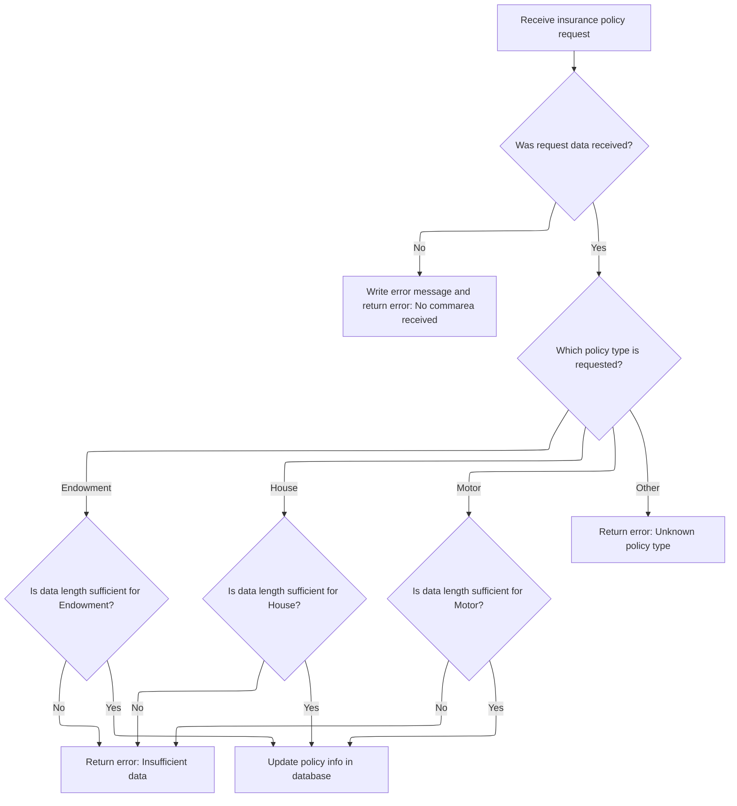
```mermaid
%%{init: {"flowchart": {"defaultRenderer": "elk"}} }%%
flowchart TD
    node1["Receive insurance policy request"] --> node2{"Was request data received?"}
    click node1 openCode "base/src/lgupol01.cbl:83:98"
    node2 -->|"No"| node3["Write error message and return error: No commarea received"]
    click node2 openCode "base/src/lgupol01.cbl:99:103"
    click node3 openCode "base/src/lgupol01.cbl:100:102"
    node2 -->|"Yes"| node4{"Which policy type is requested?"}
    click node4 openCode "base/src/lgupol01.cbl:113:141"
    node4 -->|"Endowment"| node5{"Is data length sufficient for Endowment?"}
    click node5 openCode "base/src/lgupol01.cbl:115:121"
    node4 -->|"House"| node6{"Is data length sufficient for House?"}
    click node6 openCode "base/src/lgupol01.cbl:123:129"
    node4 -->|"Motor"| node7{"Is data length sufficient for Motor?"}
    click node7 openCode "base/src/lgupol01.cbl:131:137"
    node4 -->|"Other"| node8["Return error: Unknown policy type"]
    click node8 openCode "base/src/lgupol01.cbl:139:140"
    node5 -->|"No"| node9["Return error: Insufficient data"]
    click node9 openCode "base/src/lgupol01.cbl:119:120"
    node5 -->|"Yes"| node10["Update policy info in database"]
    click node10 openCode "base/src/lgupol01.cbl:143:143"
    node6 -->|"No"| node9
    node6 -->|"Yes"| node10
    node7 -->|"No"| node9
    node7 -->|"Yes"| node10

classDef HeadingStyle fill:#777777,stroke:#333,stroke-width:2px;

%% Swimm:
%% %%{init: {"flowchart": {"defaultRenderer": "elk"}} }%%
%% flowchart TD
%%     node1["Receive insurance policy request"] --> node2{"Was request data received?"}
%%     click node1 openCode "<SwmPath>[base/src/lgupol01.cbl](base/src/lgupol01.cbl)</SwmPath>:83:98"
%%     node2 -->|"No"| node3["Write error message and return error: No commarea received"]
%%     click node2 openCode "<SwmPath>[base/src/lgupol01.cbl](base/src/lgupol01.cbl)</SwmPath>:99:103"
%%     click node3 openCode "<SwmPath>[base/src/lgupol01.cbl](base/src/lgupol01.cbl)</SwmPath>:100:102"
%%     node2 -->|"Yes"| node4{"Which policy type is requested?"}
%%     click node4 openCode "<SwmPath>[base/src/lgupol01.cbl](base/src/lgupol01.cbl)</SwmPath>:113:141"
%%     node4 -->|"Endowment"| node5{"Is data length sufficient for Endowment?"}
%%     click node5 openCode "<SwmPath>[base/src/lgupol01.cbl](base/src/lgupol01.cbl)</SwmPath>:115:121"
%%     node4 -->|"House"| node6{"Is data length sufficient for House?"}
%%     click node6 openCode "<SwmPath>[base/src/lgupol01.cbl](base/src/lgupol01.cbl)</SwmPath>:123:129"
%%     node4 -->|"Motor"| node7{"Is data length sufficient for Motor?"}
%%     click node7 openCode "<SwmPath>[base/src/lgupol01.cbl](base/src/lgupol01.cbl)</SwmPath>:131:137"
%%     node4 -->|"Other"| node8["Return error: Unknown policy type"]
%%     click node8 openCode "<SwmPath>[base/src/lgupol01.cbl](base/src/lgupol01.cbl)</SwmPath>:139:140"
%%     node5 -->|"No"| node9["Return error: Insufficient data"]
%%     click node9 openCode "<SwmPath>[base/src/lgupol01.cbl](base/src/lgupol01.cbl)</SwmPath>:119:120"
%%     node5 -->|"Yes"| node10["Update policy info in database"]
%%     click node10 openCode "<SwmPath>[base/src/lgupol01.cbl](base/src/lgupol01.cbl)</SwmPath>:143:143"
%%     node6 -->|"No"| node9
%%     node6 -->|"Yes"| node10
%%     node7 -->|"No"| node9
%%     node7 -->|"Yes"| node10
%% 
%% classDef HeadingStyle fill:#777777,stroke:#333,stroke-width:2px;
```

This section governs the validation and routing of insurance policy update requests, ensuring only complete and valid requests are processed, and errors are handled with appropriate codes and logging.

| Category        | Rule Name                       | Description                                                                                                                                                                                                                                                                                                    |
| --------------- | ------------------------------- | -------------------------------------------------------------------------------------------------------------------------------------------------------------------------------------------------------------------------------------------------------------------------------------------------------------- |
| Data validation | Missing commarea rejection      | If no commarea data is received with the request, the system must reject the request, return an error code, and log an error message indicating 'NO COMMAREA RECEIVED'.                                                                                                                                        |
| Data validation | Unknown policy type rejection   | The system must validate the requested policy type. If the policy type is not recognized (not Endowment, House, or Motor), the request must be rejected with an error code indicating 'Unknown policy type'.                                                                                                   |
| Data validation | Minimum data length enforcement | For each recognized policy type, the system must verify that the commarea length meets the minimum required size: Endowment (+152 bytes), House (+158 bytes), Motor (+165 bytes), including header. Requests with insufficient data length must be rejected with an error code indicating 'Insufficient data'. |
| Business logic  | Valid request routing           | Valid requests (recognized policy type and sufficient data length) must be routed to the backend update routine for processing in the database.                                                                                                                                                                |

<SwmSnippet path="/base/src/lgupol01.cbl" line="83">

---

In MAINLINE of <SwmToken path="base/src/lgtestp3.cbl" pos="196:10:10" line-data="                 EXEC CICS LINK PROGRAM(&#39;LGUPOL01&#39;)">`LGUPOL01`</SwmToken>, we validate the commarea length for the requested policy type, set error codes for invalid or short requests, and only continue if the input is complete. Then we call the backend update routine.

```cobol
       MAINLINE SECTION.

      *----------------------------------------------------------------*
      * Common code                                                    *
      *----------------------------------------------------------------*
      * initialize working storage variables
           INITIALIZE WS-HEADER.
      * set up general variable
           MOVE EIBTRNID TO WS-TRANSID.
           MOVE EIBTRMID TO WS-TERMID.
           MOVE EIBTASKN TO WS-TASKNUM.

      *----------------------------------------------------------------*
      * Check commarea and obtain required details                     *
      *----------------------------------------------------------------*
      * If NO commarea received issue an ABEND
           IF EIBCALEN IS EQUAL TO ZERO
               MOVE ' NO COMMAREA RECEIVED' TO EM-VARIABLE
               PERFORM WRITE-ERROR-MESSAGE
               EXEC CICS ABEND ABCODE('LGCA') NODUMP END-EXEC
           END-IF
      * initialize commarea return code to zero
           MOVE '00' TO CA-RETURN-CODE
           MOVE EIBCALEN TO WS-CALEN.
           SET WS-ADDR-DFHCOMMAREA TO ADDRESS OF DFHCOMMAREA.

      *----------------------------------------------------------------*
      * Check which policy type is being requested                     *
      *   and chec commarea length                                     *
      *----------------------------------------------------------------*
           EVALUATE CA-REQUEST-ID

             WHEN '01UEND'
               ADD WS-CA-HEADER-LEN  TO WS-REQUIRED-CA-LEN
               ADD WS-FULL-ENDOW-LEN TO WS-REQUIRED-CA-LEN
               IF EIBCALEN IS LESS THAN WS-REQUIRED-CA-LEN
                 MOVE '98' TO CA-RETURN-CODE
                 EXEC CICS RETURN END-EXEC
               END-IF

             WHEN '01UHOU'
               ADD WS-CA-HEADER-LEN  TO WS-REQUIRED-CA-LEN
               ADD WS-FULL-HOUSE-LEN TO WS-REQUIRED-CA-LEN
               IF EIBCALEN IS LESS THAN WS-REQUIRED-CA-LEN
                 MOVE '98' TO CA-RETURN-CODE
                 EXEC CICS RETURN END-EXEC
               END-IF

             WHEN '01UMOT'
               ADD WS-CA-HEADER-LEN  TO WS-REQUIRED-CA-LEN
               ADD WS-FULL-MOTOR-LEN TO WS-REQUIRED-CA-LEN
               IF EIBCALEN IS LESS THAN WS-REQUIRED-CA-LEN
                 MOVE '98' TO CA-RETURN-CODE
                 EXEC CICS RETURN END-EXEC
               END-IF

             WHEN OTHER
               MOVE '99' TO CA-RETURN-CODE
           END-EVALUATE

           PERFORM UPDATE-POLICY-DB2-INFO.
```

---

</SwmSnippet>

<SwmSnippet path="/base/src/lgupol01.cbl" line="169">

---

<SwmToken path="base/src/lgupol01.cbl" pos="169:1:5" line-data="       WRITE-ERROR-MESSAGE.">`WRITE-ERROR-MESSAGE`</SwmToken> in <SwmToken path="base/src/lgtestp3.cbl" pos="196:10:10" line-data="                 EXEC CICS LINK PROGRAM(&#39;LGUPOL01&#39;)">`LGUPOL01`</SwmToken> formats the error with timestamp and details, then calls LGSTSQ to log it. If there's commarea data, it logs up to 90 bytes for extra context.

```cobol
       WRITE-ERROR-MESSAGE.
      * Save SQLCODE in message
      * Obtain and format current time and date
           EXEC CICS ASKTIME ABSTIME(WS-ABSTIME)
           END-EXEC
           EXEC CICS FORMATTIME ABSTIME(WS-ABSTIME)
                     MMDDYYYY(WS-DATE)
                     TIME(WS-TIME)
           END-EXEC
           MOVE WS-DATE TO EM-DATE
           MOVE WS-TIME TO EM-TIME
      * Write output message to TDQ
           EXEC CICS LINK PROGRAM('LGSTSQ')
                     COMMAREA(ERROR-MSG)
                     LENGTH(LENGTH OF ERROR-MSG)
           END-EXEC.
      * Write 90 bytes or as much as we have of commarea to TDQ
           IF EIBCALEN > 0 THEN
             IF EIBCALEN < 91 THEN
               MOVE DFHCOMMAREA(1:EIBCALEN) TO CA-DATA
               EXEC CICS LINK PROGRAM('LGSTSQ')
                         COMMAREA(CA-ERROR-MSG)
                         LENGTH(LENGTH OF CA-ERROR-MSG)
               END-EXEC
             ELSE
               MOVE DFHCOMMAREA(1:90) TO CA-DATA
               EXEC CICS LINK PROGRAM('LGSTSQ')
                         COMMAREA(CA-ERROR-MSG)
                         LENGTH(LENGTH OF CA-ERROR-MSG)
               END-EXEC
             END-IF
           END-IF.
           EXIT.
```

---

</SwmSnippet>

<SwmSnippet path="/base/src/lgupol01.cbl" line="83">

---

After returning from <SwmToken path="base/src/lgtestp3.cbl" pos="196:10:10" line-data="                 EXEC CICS LINK PROGRAM(&#39;LGUPOL01&#39;)">`LGUPOL01`</SwmToken>, the final logic checks the commarea size for the requested policy type and only continues if everything's valid. This keeps the backend update safe and predictable.

```cobol
       MAINLINE SECTION.

      *----------------------------------------------------------------*
      * Common code                                                    *
      *----------------------------------------------------------------*
      * initialize working storage variables
           INITIALIZE WS-HEADER.
      * set up general variable
           MOVE EIBTRNID TO WS-TRANSID.
           MOVE EIBTRMID TO WS-TERMID.
           MOVE EIBTASKN TO WS-TASKNUM.

      *----------------------------------------------------------------*
      * Check commarea and obtain required details                     *
      *----------------------------------------------------------------*
      * If NO commarea received issue an ABEND
           IF EIBCALEN IS EQUAL TO ZERO
               MOVE ' NO COMMAREA RECEIVED' TO EM-VARIABLE
               PERFORM WRITE-ERROR-MESSAGE
               EXEC CICS ABEND ABCODE('LGCA') NODUMP END-EXEC
           END-IF
      * initialize commarea return code to zero
           MOVE '00' TO CA-RETURN-CODE
           MOVE EIBCALEN TO WS-CALEN.
           SET WS-ADDR-DFHCOMMAREA TO ADDRESS OF DFHCOMMAREA.

      *----------------------------------------------------------------*
      * Check which policy type is being requested                     *
      *   and chec commarea length                                     *
      *----------------------------------------------------------------*
           EVALUATE CA-REQUEST-ID

             WHEN '01UEND'
               ADD WS-CA-HEADER-LEN  TO WS-REQUIRED-CA-LEN
               ADD WS-FULL-ENDOW-LEN TO WS-REQUIRED-CA-LEN
               IF EIBCALEN IS LESS THAN WS-REQUIRED-CA-LEN
                 MOVE '98' TO CA-RETURN-CODE
                 EXEC CICS RETURN END-EXEC
               END-IF

             WHEN '01UHOU'
               ADD WS-CA-HEADER-LEN  TO WS-REQUIRED-CA-LEN
               ADD WS-FULL-HOUSE-LEN TO WS-REQUIRED-CA-LEN
               IF EIBCALEN IS LESS THAN WS-REQUIRED-CA-LEN
                 MOVE '98' TO CA-RETURN-CODE
                 EXEC CICS RETURN END-EXEC
               END-IF

             WHEN '01UMOT'
               ADD WS-CA-HEADER-LEN  TO WS-REQUIRED-CA-LEN
               ADD WS-FULL-MOTOR-LEN TO WS-REQUIRED-CA-LEN
               IF EIBCALEN IS LESS THAN WS-REQUIRED-CA-LEN
                 MOVE '98' TO CA-RETURN-CODE
                 EXEC CICS RETURN END-EXEC
               END-IF

             WHEN OTHER
               MOVE '99' TO CA-RETURN-CODE
           END-EVALUATE

           PERFORM UPDATE-POLICY-DB2-INFO.
```

---

</SwmSnippet>

## Updating policy details in the database

This section governs the business rules for updating insurance policy details in the database, ensuring data integrity and proper error reporting for failed updates.

| Category        | Rule Name                  | Description                                                                                                                                                  |
| --------------- | -------------------------- | ------------------------------------------------------------------------------------------------------------------------------------------------------------ |
| Data validation | Existing policy validation | Policy updates must only be performed for existing policies. If the policy does not exist, the update must not proceed and an error code must be returned.   |
| Data validation | Mandatory field validation | All mandatory policy fields must be present and valid before an update is accepted. Missing or invalid data must result in an error code.                    |
| Business logic  | Customer data integrity    | Policy updates must preserve the integrity of related customer data; changes to policy details must not result in orphaned or inconsistent customer records. |
| Business logic  | Audit trail requirement    | All updates must be auditable, with changes to policy details recorded for compliance and traceability.                                                      |

<SwmSnippet path="/base/src/lgupol01.cbl" line="155">

---

<SwmToken path="base/src/lgupol01.cbl" pos="155:1:7" line-data="       UPDATE-POLICY-DB2-INFO.">`UPDATE-POLICY-DB2-INFO`</SwmToken> in <SwmToken path="base/src/lgtestp3.cbl" pos="196:10:10" line-data="                 EXEC CICS LINK PROGRAM(&#39;LGUPOL01&#39;)">`LGUPOL01`</SwmToken> just delegates the actual <SwmToken path="base/src/lgupol01.cbl" pos="155:5:5" line-data="       UPDATE-POLICY-DB2-INFO.">`DB2`</SwmToken> update to <SwmToken path="base/src/lgupol01.cbl" pos="157:9:9" line-data="           EXEC CICS LINK Program(LGUPDB01)">`LGUPDB01`</SwmToken> using CICS LINK, passing the commarea with all the policy and customer data. This keeps the update logic out of the UI/control program and lets <SwmToken path="base/src/lgupol01.cbl" pos="157:9:9" line-data="           EXEC CICS LINK Program(LGUPDB01)">`LGUPDB01`</SwmToken> handle all the DB2-specific work. If <SwmToken path="base/src/lgupol01.cbl" pos="157:9:9" line-data="           EXEC CICS LINK Program(LGUPDB01)">`LGUPDB01`</SwmToken> fails, the error code comes back in the commarea and the flow can handle it upstream.

```cobol
       UPDATE-POLICY-DB2-INFO.

           EXEC CICS LINK Program(LGUPDB01)
                Commarea(DFHCOMMAREA)
                LENGTH(32500)
           END-EXEC.

           EXIT.
```

---

</SwmSnippet>

## Validating and executing the policy update

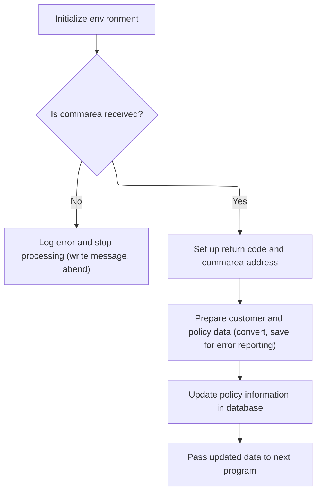
```mermaid
%%{init: {"flowchart": {"defaultRenderer": "elk"}} }%%
flowchart TD
    node1["Initialize environment"] --> node2{"Is commarea received?"}
    click node1 openCode "base/src/lgupdb01.cbl:168:178"
    node2 -->|"No"| node3["Log error and stop processing (write message, abend)"]
    click node2 openCode "base/src/lgupdb01.cbl:183:187"
    click node3 openCode "base/src/lgupdb01.cbl:184:186"
    node2 -->|"Yes"| node4["Set up return code and commarea address"]
    click node4 openCode "base/src/lgupdb01.cbl:190:192"
    node4 --> node5["Prepare customer and policy data (convert, save for error reporting)"]
    click node5 openCode "base/src/lgupdb01.cbl:195:199"
    node5 --> node6["Update policy information in database"]
    click node6 openCode "base/src/lgupdb01.cbl:207:207"
    node6 --> node7["Pass updated data to next program"]
    click node7 openCode "base/src/lgupdb01.cbl:209:212"

classDef HeadingStyle fill:#777777,stroke:#333,stroke-width:2px;

%% Swimm:
%% %%{init: {"flowchart": {"defaultRenderer": "elk"}} }%%
%% flowchart TD
%%     node1["Initialize environment"] --> node2{"Is commarea received?"}
%%     click node1 openCode "<SwmPath>[base/src/lgupdb01.cbl](base/src/lgupdb01.cbl)</SwmPath>:168:178"
%%     node2 -->|"No"| node3["Log error and stop processing (write message, abend)"]
%%     click node2 openCode "<SwmPath>[base/src/lgupdb01.cbl](base/src/lgupdb01.cbl)</SwmPath>:183:187"
%%     click node3 openCode "<SwmPath>[base/src/lgupdb01.cbl](base/src/lgupdb01.cbl)</SwmPath>:184:186"
%%     node2 -->|"Yes"| node4["Set up return code and commarea address"]
%%     click node4 openCode "<SwmPath>[base/src/lgupdb01.cbl](base/src/lgupdb01.cbl)</SwmPath>:190:192"
%%     node4 --> node5["Prepare customer and policy data (convert, save for error reporting)"]
%%     click node5 openCode "<SwmPath>[base/src/lgupdb01.cbl](base/src/lgupdb01.cbl)</SwmPath>:195:199"
%%     node5 --> node6["Update policy information in database"]
%%     click node6 openCode "<SwmPath>[base/src/lgupdb01.cbl](base/src/lgupdb01.cbl)</SwmPath>:207:207"
%%     node6 --> node7["Pass updated data to next program"]
%%     click node7 openCode "<SwmPath>[base/src/lgupdb01.cbl](base/src/lgupdb01.cbl)</SwmPath>:209:212"
%% 
%% classDef HeadingStyle fill:#777777,stroke:#333,stroke-width:2px;
```

This section governs the validation and execution of insurance policy updates, ensuring that only valid requests are processed, that both <SwmToken path="base/src/lgipdb01.cbl" pos="242:5:5" line-data="      * initialize DB2 host variables">`DB2`</SwmToken> and VSAM records are kept consistent, and that errors are logged with sufficient detail for business and technical review.

| Category       | Rule Name                    | Description                                                                                                                                                                                                                                                            |
| -------------- | ---------------------------- | ---------------------------------------------------------------------------------------------------------------------------------------------------------------------------------------------------------------------------------------------------------------------- |
| Business logic | Data consistency enforcement | All policy updates must ensure that both the <SwmToken path="base/src/lgipdb01.cbl" pos="242:5:5" line-data="      * initialize DB2 host variables">`DB2`</SwmToken> database and the VSAM file are updated with the same data to maintain consistency across systems. |

<SwmSnippet path="/base/src/lgupdb01.cbl" line="162">

---

MAINLINE in <SwmToken path="base/src/lgupol01.cbl" pos="157:9:9" line-data="           EXEC CICS LINK Program(LGUPDB01)">`LGUPDB01`</SwmToken> checks the commarea, sets up transaction context, and figures out which policy type to update. If the commarea is missing, it logs the error and abends. After updating <SwmToken path="base/src/lgupdb01.cbl" pos="175:5:5" line-data="      * initialize DB2 host variables">`DB2`</SwmToken>, it links to <SwmToken path="base/src/lgupdb01.cbl" pos="209:9:9" line-data="           EXEC CICS LINK Program(LGUPVS01)">`LGUPVS01`</SwmToken> to update the VSAM file for the same policy, making sure both <SwmToken path="base/src/lgupdb01.cbl" pos="175:5:5" line-data="      * initialize DB2 host variables">`DB2`</SwmToken> and VSAM are consistent.

```cobol
       MAINLINE SECTION.

      *----------------------------------------------------------------*
      * Common code                                                    *
      *----------------------------------------------------------------*
      * initialize working storage variables
           INITIALIZE WS-HEADER.
      * set up general variable
           MOVE EIBTRNID TO WS-TRANSID.
           MOVE EIBTRMID TO WS-TERMID.
           MOVE EIBTASKN TO WS-TASKNUM.
           MOVE SPACES   TO WS-RETRY.
      *----------------------------------------------------------------*
      * initialize DB2 host variables
           INITIALIZE DB2-POLICY.
           INITIALIZE DB2-IN-INTEGERS.

      *----------------------------------------------------------------*
      * Check commarea and obtain required details                     *
      *----------------------------------------------------------------*
      * If NO commarea received issue an ABEND
           IF EIBCALEN IS EQUAL TO ZERO
               MOVE ' NO COMMAREA RECEIVED' TO EM-VARIABLE
               PERFORM WRITE-ERROR-MESSAGE
               EXEC CICS ABEND ABCODE('LGCA') NODUMP END-EXEC
           END-IF

      * initialize commarea return code to zero
           MOVE '00' TO CA-RETURN-CODE
           MOVE EIBCALEN TO WS-CALEN.
           SET WS-ADDR-DFHCOMMAREA TO ADDRESS OF DFHCOMMAREA.

      * Convert commarea customer & policy nums to DB2 integer format
           MOVE CA-CUSTOMER-NUM TO DB2-CUSTOMERNUM-INT
           MOVE CA-POLICY-NUM   TO DB2-POLICYNUM-INT
      * and save in error msg field incase required
           MOVE CA-CUSTOMER-NUM TO EM-CUSNUM
           MOVE CA-POLICY-NUM   TO EM-POLNUM

      *----------------------------------------------------------------*
      * Check which policy type is being requested                     *
      *   and check commarea length                                    *
      *----------------------------------------------------------------*

      *    Call procedure to update required tables
           PERFORM UPDATE-POLICY-DB2-INFO.

           EXEC CICS LINK Program(LGUPVS01)
                Commarea(DFHCOMMAREA)
                LENGTH(225)
           END-EXEC.
```

---

</SwmSnippet>

<SwmSnippet path="/base/src/lgupdb01.cbl" line="502">

---

<SwmToken path="base/src/lgupdb01.cbl" pos="502:1:5" line-data="       WRITE-ERROR-MESSAGE.">`WRITE-ERROR-MESSAGE`</SwmToken> in <SwmToken path="base/src/lgupol01.cbl" pos="157:9:9" line-data="           EXEC CICS LINK Program(LGUPDB01)">`LGUPDB01`</SwmToken> formats the error with SQLCODE, timestamp, and transaction details, then calls LGSTSQ to log it. It also sends up to 90 bytes of commarea data to LGSTSQ for extra context, so both the error and the raw data are logged for troubleshooting.

```cobol
       WRITE-ERROR-MESSAGE.
      * Save SQLCODE in message
           MOVE SQLCODE TO EM-SQLRC
      * Obtain and format current time and date
           EXEC CICS ASKTIME ABSTIME(WS-ABSTIME)
           END-EXEC
           EXEC CICS FORMATTIME ABSTIME(WS-ABSTIME)
                     MMDDYYYY(WS-DATE)
                     TIME(WS-TIME)
           END-EXEC
           MOVE WS-DATE TO EM-DATE
           MOVE WS-TIME TO EM-TIME
      * Write output message to TDQ
           EXEC CICS LINK PROGRAM('LGSTSQ')
                     COMMAREA(ERROR-MSG)
                     LENGTH(LENGTH OF ERROR-MSG)
           END-EXEC.
      * Write 90 bytes or as much as we have of commarea to TDQ
           IF EIBCALEN > 0 THEN
             IF EIBCALEN < 91 THEN
               MOVE DFHCOMMAREA(1:EIBCALEN) TO CA-DATA
               EXEC CICS LINK PROGRAM('LGSTSQ')
                         COMMAREA(CA-ERROR-MSG)
                         LENGTH(LENGTH OF CA-ERROR-MSG)
               END-EXEC
             ELSE
               MOVE DFHCOMMAREA(1:90) TO CA-DATA
               EXEC CICS LINK PROGRAM('LGSTSQ')
                         COMMAREA(CA-ERROR-MSG)
                         LENGTH(LENGTH OF CA-ERROR-MSG)
               END-EXEC
             END-IF
           END-IF.
           EXIT.
```

---

</SwmSnippet>

## Running the <SwmToken path="base/src/lgipdb01.cbl" pos="242:5:5" line-data="      * initialize DB2 host variables">`DB2`</SwmToken> update for each policy type


```mermaid
%%{init: {"flowchart": {"defaultRenderer": "elk"}} }%%
flowchart TD
    node1["Start: Request to update policy"] --> node2["Open cursor for policy"]
    click node1 openCode "base/src/lgupdb01.cbl:251:253"
    click node2 openCode "base/src/lgupdb01.cbl:254:257"
    node2 --> node3{"Was cursor opened?"}
    click node3 openCode "base/src/lgupdb01.cbl:259:270"
    node3 -->|"Yes"| node4["Fetch policy row"]
    click node4 openCode "base/src/lgupdb01.cbl:273:273"
    node3 -->|"No"| node8["Return error and close cursor"]
    click node8 openCode "base/src/lgupdb01.cbl:263:265"
    node4 --> node5{"Was fetch successful?"}
    click node5 openCode "base/src/lgupdb01.cbl:275:278"
    node5 -->|"Yes"| node6{"Do timestamps match?"}
    click node6 openCode "base/src/lgupdb01.cbl:278:278"
    node5 -->|"No"| node9["Return not found or error and close cursor"]
    click node9 openCode "base/src/lgupdb01.cbl:351:357"
    node6 -->|"Yes"| node7{"Which policy type?"}
    click node7 openCode "base/src/lgupdb01.cbl:283:300"
    node6 -->|"No"| node10["Return timestamp mismatch and close cursor"]
    click node10 openCode "base/src/lgupdb01.cbl:346:347"
    node7 -->|"Endowment"| node11["Update endowment table"]
    click node11 openCode "base/src/lgupdb01.cbl:387:418"
    node7 -->|"House"| node12["Update house table"]
    click node12 openCode "base/src/lgupdb01.cbl:424:454"
    node7 -->|"Motor"| node13["Update motor table"]
    click node13 openCode "base/src/lgupdb01.cbl:460:495"
    node11 --> node14{"Did update succeed?"}
    click node14 openCode "base/src/lgupdb01.cbl:408:417"
    node12 --> node14
    node13 --> node14
    node14 -->|"Yes"| node15["Update main policy table"]
    click node15 openCode "base/src/lgupdb01.cbl:317:326"
    node14 -->|"No"| node16["Return error and close cursor"]
    click node16 openCode "base/src/lgupdb01.cbl:341:342"
    node15 --> node17{"Did update succeed?"}
    click node17 openCode "base/src/lgupdb01.cbl:336:342"
    node17 -->|"Yes"| node18["Close cursor and finish"]
    click node18 openCode "base/src/lgupdb01.cbl:360:360"
    node17 -->|"No"| node16
    node8 --> node20["Close cursor"]
    click node20 openCode "base/src/lgupdb01.cbl:362:381"
    node9 --> node20
    node10 --> node20
    node16 --> node20
    node18 --> node21["Return success"]
    click node21 openCode "base/src/lgupdb01.cbl:371:372"
    node20 --> node21

classDef HeadingStyle fill:#777777,stroke:#333,stroke-width:2px;

%% Swimm:
%% %%{init: {"flowchart": {"defaultRenderer": "elk"}} }%%
%% flowchart TD
%%     node1["Start: Request to update policy"] --> node2["Open cursor for policy"]
%%     click node1 openCode "<SwmPath>[base/src/lgupdb01.cbl](base/src/lgupdb01.cbl)</SwmPath>:251:253"
%%     click node2 openCode "<SwmPath>[base/src/lgupdb01.cbl](base/src/lgupdb01.cbl)</SwmPath>:254:257"
%%     node2 --> node3{"Was cursor opened?"}
%%     click node3 openCode "<SwmPath>[base/src/lgupdb01.cbl](base/src/lgupdb01.cbl)</SwmPath>:259:270"
%%     node3 -->|"Yes"| node4["Fetch policy row"]
%%     click node4 openCode "<SwmPath>[base/src/lgupdb01.cbl](base/src/lgupdb01.cbl)</SwmPath>:273:273"
%%     node3 -->|"No"| node8["Return error and close cursor"]
%%     click node8 openCode "<SwmPath>[base/src/lgupdb01.cbl](base/src/lgupdb01.cbl)</SwmPath>:263:265"
%%     node4 --> node5{"Was fetch successful?"}
%%     click node5 openCode "<SwmPath>[base/src/lgupdb01.cbl](base/src/lgupdb01.cbl)</SwmPath>:275:278"
%%     node5 -->|"Yes"| node6{"Do timestamps match?"}
%%     click node6 openCode "<SwmPath>[base/src/lgupdb01.cbl](base/src/lgupdb01.cbl)</SwmPath>:278:278"
%%     node5 -->|"No"| node9["Return not found or error and close cursor"]
%%     click node9 openCode "<SwmPath>[base/src/lgupdb01.cbl](base/src/lgupdb01.cbl)</SwmPath>:351:357"
%%     node6 -->|"Yes"| node7{"Which policy type?"}
%%     click node7 openCode "<SwmPath>[base/src/lgupdb01.cbl](base/src/lgupdb01.cbl)</SwmPath>:283:300"
%%     node6 -->|"No"| node10["Return timestamp mismatch and close cursor"]
%%     click node10 openCode "<SwmPath>[base/src/lgupdb01.cbl](base/src/lgupdb01.cbl)</SwmPath>:346:347"
%%     node7 -->|"Endowment"| node11["Update endowment table"]
%%     click node11 openCode "<SwmPath>[base/src/lgupdb01.cbl](base/src/lgupdb01.cbl)</SwmPath>:387:418"
%%     node7 -->|"House"| node12["Update house table"]
%%     click node12 openCode "<SwmPath>[base/src/lgupdb01.cbl](base/src/lgupdb01.cbl)</SwmPath>:424:454"
%%     node7 -->|"Motor"| node13["Update motor table"]
%%     click node13 openCode "<SwmPath>[base/src/lgupdb01.cbl](base/src/lgupdb01.cbl)</SwmPath>:460:495"
%%     node11 --> node14{"Did update succeed?"}
%%     click node14 openCode "<SwmPath>[base/src/lgupdb01.cbl](base/src/lgupdb01.cbl)</SwmPath>:408:417"
%%     node12 --> node14
%%     node13 --> node14
%%     node14 -->|"Yes"| node15["Update main policy table"]
%%     click node15 openCode "<SwmPath>[base/src/lgupdb01.cbl](base/src/lgupdb01.cbl)</SwmPath>:317:326"
%%     node14 -->|"No"| node16["Return error and close cursor"]
%%     click node16 openCode "<SwmPath>[base/src/lgupdb01.cbl](base/src/lgupdb01.cbl)</SwmPath>:341:342"
%%     node15 --> node17{"Did update succeed?"}
%%     click node17 openCode "<SwmPath>[base/src/lgupdb01.cbl](base/src/lgupdb01.cbl)</SwmPath>:336:342"
%%     node17 -->|"Yes"| node18["Close cursor and finish"]
%%     click node18 openCode "<SwmPath>[base/src/lgupdb01.cbl](base/src/lgupdb01.cbl)</SwmPath>:360:360"
%%     node17 -->|"No"| node16
%%     node8 --> node20["Close cursor"]
%%     click node20 openCode "<SwmPath>[base/src/lgupdb01.cbl](base/src/lgupdb01.cbl)</SwmPath>:362:381"
%%     node9 --> node20
%%     node10 --> node20
%%     node16 --> node20
%%     node18 --> node21["Return success"]
%%     click node21 openCode "<SwmPath>[base/src/lgupdb01.cbl](base/src/lgupdb01.cbl)</SwmPath>:371:372"
%%     node20 --> node21
%% 
%% classDef HeadingStyle fill:#777777,stroke:#333,stroke-width:2px;
```

This section governs the business logic for updating insurance policy records in the <SwmToken path="base/src/lgipdb01.cbl" pos="242:5:5" line-data="      * initialize DB2 host variables">`DB2`</SwmToken> database, ensuring that updates are performed only when concurrency checks pass and that the correct tables are updated based on policy type. It also manages error handling and return codes for various failure scenarios.

| Category        | Rule Name                  | Description                                                                                                                                                                                                                                                              |
| --------------- | -------------------------- | ------------------------------------------------------------------------------------------------------------------------------------------------------------------------------------------------------------------------------------------------------------------------ |
| Data validation | Valid policy type required | A policy update request must specify a valid policy type: Endowment, House, or Motor. The system will only process updates for these types.                                                                                                                              |
| Data validation | Concurrency control        | Policy updates are only allowed if the timestamp in the request matches the timestamp in the database, ensuring no concurrent modifications have occurred.                                                                                                               |
| Data validation | Numeric field conversion   | All updates must convert numeric fields from the commarea to <SwmToken path="base/src/lgipdb01.cbl" pos="242:5:5" line-data="      * initialize DB2 host variables">`DB2`</SwmToken> integer types before updating the database, to ensure data compatibility.           |
| Business logic  | Main policy table update   | Upon successful update of a policy type-specific table, the main policy table must also be updated with the latest details and a new timestamp.                                                                                                                          |
| Technical step  | Cursor closure requirement | The system must always close the <SwmToken path="base/src/lgipdb01.cbl" pos="242:5:5" line-data="      * initialize DB2 host variables">`DB2`</SwmToken> cursor at the end of the update process, regardless of success or failure, and set the appropriate return code. |

<SwmSnippet path="/base/src/lgupdb01.cbl" line="251">

---

<SwmToken path="base/src/lgupdb01.cbl" pos="251:1:7" line-data="       UPDATE-POLICY-DB2-INFO.">`UPDATE-POLICY-DB2-INFO`</SwmToken> runs the full <SwmToken path="base/src/lgupdb01.cbl" pos="251:5:5" line-data="       UPDATE-POLICY-DB2-INFO.">`DB2`</SwmToken> update algorithm: opens a cursor, fetches the policy row, checks timestamps for concurrency, then picks the right update routine based on <SwmToken path="base/src/lgupdb01.cbl" pos="283:3:7" line-data="             EVALUATE CA-REQUEST-ID">`CA-REQUEST-ID`</SwmToken> (<SwmToken path="base/src/lgupdb01.cbl" pos="286:4:4" line-data="               WHEN &#39;01UEND&#39;">`01UEND`</SwmToken>, <SwmToken path="base/src/lgupdb01.cbl" pos="291:4:4" line-data="               WHEN &#39;01UHOU&#39;">`01UHOU`</SwmToken>, <SwmToken path="base/src/lgupdb01.cbl" pos="296:4:4" line-data="               WHEN &#39;01UMOT&#39;">`01UMOT`</SwmToken>). If the update works, it updates the main policy table and sets a new timestamp. If anything fails, it sets a repo-specific return code and logs the error. The cursor is closed at the end.

```cobol
       UPDATE-POLICY-DB2-INFO.

      *    Open the cursor.
           MOVE ' OPEN   PCURSOR ' TO EM-SQLREQ
           EXEC SQL
             OPEN POLICY_CURSOR
           END-EXEC

           Evaluate SQLCODE
             When 0
               MOVE '00' TO CA-RETURN-CODE
             When -913
               MOVE '90' TO CA-RETURN-CODE
               PERFORM WRITE-ERROR-MESSAGE
               EXEC CICS RETURN END-EXEC
             When Other
               MOVE '90' TO CA-RETURN-CODE
               PERFORM WRITE-ERROR-MESSAGE
               EXEC CICS RETURN END-EXEC
           END-Evaluate.

      *    Fetch the first row (we only expect one matching row)
           PERFORM FETCH-DB2-POLICY-ROW

           IF SQLCODE = 0
      *      Fetch was successful
      *      Compare timestamp in commarea with that in DB2
             IF CA-LASTCHANGED EQUAL TO DB2-LASTCHANGED

      *----------------------------------------------------------------*
      *      Select for Update and Update specific policy type table   *
      *----------------------------------------------------------------*
             EVALUATE CA-REQUEST-ID

      *** Endowment ***
               WHEN '01UEND'
      *          Call routine to update Endowment table
                 PERFORM UPDATE-ENDOW-DB2-INFO

      *** House ***
               WHEN '01UHOU'
      *          Call routine to update Housetable
                 PERFORM UPDATE-HOUSE-DB2-INFO

      *** Motor ***
               WHEN '01UMOT'
      *          Call routine to update Motor table
                 PERFORM UPDATE-MOTOR-DB2-INFO

             END-EVALUATE
      *----------------------------------------------------------------*
              IF CA-RETURN-CODE NOT EQUAL '00'
      *         Update policy type specific table has failed
      *         So close cursor and return
                PERFORM CLOSE-PCURSOR
                EXEC CICS RETURN END-EXEC
              END-IF

      *----------------------------------------------------------------*
      *        Now update Policy table and set new timestamp           *
      *----------------------------------------------------------------*
      *        Move numeric commarea fields to integer format
               MOVE CA-BROKERID      TO DB2-BROKERID-INT
               MOVE CA-PAYMENT       TO DB2-PAYMENT-INT

      *        Update policy table details
               MOVE ' UPDATE POLICY  ' TO EM-SQLREQ
               EXEC SQL
                 UPDATE POLICY
                   SET ISSUEDATE        = :CA-ISSUE-DATE,
                       EXPIRYDATE       = :CA-EXPIRY-DATE,
                       LASTCHANGED      = CURRENT TIMESTAMP ,
                       BROKERID         = :DB2-BROKERID-INT,
                       BROKERSREFERENCE = :CA-BROKERSREF
                   WHERE CURRENT OF POLICY_CURSOR
               END-EXEC

      *        get value of assigned Timestamp for return in commarea
               EXEC SQL
                 SELECT LASTCHANGED
                   INTO :CA-LASTCHANGED
                   FROM POLICY
                   WHERE POLICYNUMBER = :DB2-POLICYNUM-INT
               END-EXEC

               IF SQLCODE NOT EQUAL 0
      *          Non-zero SQLCODE from Update of policy table
                   EXEC CICS SYNCPOINT ROLLBACK END-EXEC
                   MOVE '90' TO CA-RETURN-CODE
      *            Write error message to TD QUEUE(CSMT)
                   PERFORM WRITE-ERROR-MESSAGE
               END-IF

             ELSE
      *        Timestamps do not match (policy table v commarea)
               MOVE '02' TO CA-RETURN-CODE
             END-IF

           ELSE
      *      Non-zero SQLCODE from first SQL FETCH statement
             IF SQLCODE EQUAL 100
               MOVE '01' TO CA-RETURN-CODE
             ELSE
               MOVE '90' TO CA-RETURN-CODE
      *        Write error message to TD QUEUE(CSMT)
               PERFORM WRITE-ERROR-MESSAGE
             END-IF
           END-IF.
      *    Now close the Cursor and we're done!
           PERFORM CLOSE-PCURSOR.
```

---

</SwmSnippet>

<SwmSnippet path="/base/src/lgupdb01.cbl" line="387">

---

<SwmToken path="base/src/lgupdb01.cbl" pos="387:1:7" line-data="       UPDATE-ENDOW-DB2-INFO.">`UPDATE-ENDOW-DB2-INFO`</SwmToken> moves numeric fields from the commarea to <SwmToken path="base/src/lgupdb01.cbl" pos="387:5:5" line-data="       UPDATE-ENDOW-DB2-INFO.">`DB2`</SwmToken> integer variables, then runs the SQL UPDATE for the endowment table. If the update fails, it sets a repo-specific error code and logs the error. This step is needed because COBOL and <SwmToken path="base/src/lgupdb01.cbl" pos="387:5:5" line-data="       UPDATE-ENDOW-DB2-INFO.">`DB2`</SwmToken> use different types for numeric fields.

```cobol
       UPDATE-ENDOW-DB2-INFO.

      *    Move numeric commarea fields to DB2 Integer formats
           MOVE CA-E-TERM        TO DB2-E-TERM-SINT
           MOVE CA-E-SUM-ASSURED TO DB2-E-SUMASSURED-INT

           MOVE ' UPDATE ENDOW ' TO EM-SQLREQ
           EXEC SQL
             UPDATE ENDOWMENT
               SET
                 WITHPROFITS   = :CA-E-WITH-PROFITS,
                   EQUITIES    = :CA-E-EQUITIES,
                   MANAGEDFUND = :CA-E-MANAGED-FUND,
                   FUNDNAME    = :CA-E-FUND-NAME,
                   TERM        = :DB2-E-TERM-SINT,
                   SUMASSURED  = :DB2-E-SUMASSURED-INT,
                   LIFEASSURED = :CA-E-LIFE-ASSURED
               WHERE
                   POLICYNUMBER = :DB2-POLICYNUM-INT
           END-EXEC

           IF SQLCODE NOT EQUAL 0
      *      Non-zero SQLCODE from UPDATE statement
             IF SQLCODE EQUAL 100
               MOVE '01' TO CA-RETURN-CODE
             ELSE
               MOVE '90' TO CA-RETURN-CODE
      *        Write error message to TD QUEUE(CSMT)
               PERFORM WRITE-ERROR-MESSAGE
             END-IF
           END-IF.
           EXIT.
```

---

</SwmSnippet>

<SwmSnippet path="/base/src/lgupdb01.cbl" line="424">

---

<SwmToken path="base/src/lgupdb01.cbl" pos="424:1:7" line-data="       UPDATE-HOUSE-DB2-INFO.">`UPDATE-HOUSE-DB2-INFO`</SwmToken> converts numeric commarea fields to <SwmToken path="base/src/lgupdb01.cbl" pos="424:5:5" line-data="       UPDATE-HOUSE-DB2-INFO.">`DB2`</SwmToken> integer types, then updates the house table for the given policy number. If the update fails, it sets a repo-specific error code and logs the error. This conversion is needed for <SwmToken path="base/src/lgupdb01.cbl" pos="424:5:5" line-data="       UPDATE-HOUSE-DB2-INFO.">`DB2`</SwmToken> compatibility.

```cobol
       UPDATE-HOUSE-DB2-INFO.

      *    Move numeric commarea fields to DB2 Integer formats
           MOVE CA-H-BEDROOMS    TO DB2-H-BEDROOMS-SINT
           MOVE CA-H-VALUE       TO DB2-H-VALUE-INT

           MOVE ' UPDATE HOUSE ' TO EM-SQLREQ
           EXEC SQL
             UPDATE HOUSE
               SET
                    PROPERTYTYPE = :CA-H-PROPERTY-TYPE,
                    BEDROOMS     = :DB2-H-BEDROOMS-SINT,
                    VALUE        = :DB2-H-VALUE-INT,
                    HOUSENAME    = :CA-H-HOUSE-NAME,
                    HOUSENUMBER  = :CA-H-HOUSE-NUMBER,
                    POSTCODE     = :CA-H-POSTCODE
               WHERE
                    POLICYNUMBER = :DB2-POLICYNUM-INT
           END-EXEC

           IF SQLCODE NOT EQUAL 0
      *      Non-zero SQLCODE from UPDATE statement
             IF SQLCODE = 100
               MOVE '01' TO CA-RETURN-CODE
             ELSE
               MOVE '90' TO CA-RETURN-CODE
      *        Write error message to TD QUEUE(CSMT)
               PERFORM WRITE-ERROR-MESSAGE
             END-IF
           END-IF.
           EXIT.
```

---

</SwmSnippet>

<SwmSnippet path="/base/src/lgupdb01.cbl" line="460">

---

<SwmToken path="base/src/lgupdb01.cbl" pos="460:1:7" line-data="       UPDATE-MOTOR-DB2-INFO.">`UPDATE-MOTOR-DB2-INFO`</SwmToken> converts numeric commarea fields to <SwmToken path="base/src/lgupdb01.cbl" pos="460:5:5" line-data="       UPDATE-MOTOR-DB2-INFO.">`DB2`</SwmToken> integer types, then updates the motor table for the given policy number. If the update fails or no rows are updated, it sets a repo-specific error code and logs the error. This conversion is needed for <SwmToken path="base/src/lgupdb01.cbl" pos="460:5:5" line-data="       UPDATE-MOTOR-DB2-INFO.">`DB2`</SwmToken> compatibility and assumes the commarea fields are valid.

```cobol
       UPDATE-MOTOR-DB2-INFO.

      *    Move numeric commarea fields to DB2 Integer formats
           MOVE CA-M-CC          TO DB2-M-CC-SINT
           MOVE CA-M-VALUE       TO DB2-M-VALUE-INT
           MOVE CA-M-PREMIUM     TO DB2-M-PREMIUM-INT
           MOVE CA-M-ACCIDENTS   TO DB2-M-ACCIDENTS-INT

           MOVE ' UPDATE MOTOR ' TO EM-SQLREQ
           EXEC SQL
             UPDATE MOTOR
               SET
                    MAKE              = :CA-M-MAKE,
                    MODEL             = :CA-M-MODEL,
                    VALUE             = :DB2-M-VALUE-INT,
                    REGNUMBER         = :CA-M-REGNUMBER,
                    COLOUR            = :CA-M-COLOUR,
                    CC                = :DB2-M-CC-SINT,
                    YEAROFMANUFACTURE = :CA-M-MANUFACTURED,
                    PREMIUM           = :DB2-M-PREMIUM-INT,
                    ACCIDENTS         = :DB2-M-ACCIDENTS-INT
               WHERE
                    POLICYNUMBER      = :DB2-POLICYNUM-INT
           END-EXEC

           IF SQLCODE NOT EQUAL 0
      *      Non-zero SQLCODE from UPDATE statement
             IF SQLCODE EQUAL 100
               MOVE '01' TO CA-RETURN-CODE
             ELSE
               MOVE '90' TO CA-RETURN-CODE
      *        Write error message to TD QUEUE(CSMT)
               PERFORM WRITE-ERROR-MESSAGE
             END-IF
           END-IF.
           EXIT.
```

---

</SwmSnippet>

<SwmSnippet path="/base/src/lgupdb01.cbl" line="362">

---

<SwmToken path="base/src/lgupdb01.cbl" pos="362:1:3" line-data="       CLOSE-PCURSOR.">`CLOSE-PCURSOR`</SwmToken> closes the <SwmToken path="base/src/lgipdb01.cbl" pos="242:5:5" line-data="      * initialize DB2 host variables">`DB2`</SwmToken> policy cursor and sets the return code based on SQLCODE. If the cursor was already closed (-501), it logs that and returns '00'. For other errors, it logs the error and returns '90'.

```cobol
       CLOSE-PCURSOR.
      *    Now close the Cursor and we're done!
           MOVE ' CLOSE  PCURSOR' TO EM-SQLREQ
           EXEC SQL
             CLOSE POLICY_CURSOR
           END-EXEC.

           Evaluate SQLCODE
             When 0
               MOVE '00' TO CA-RETURN-CODE
             When -501
               MOVE '00' TO CA-RETURN-CODE
               MOVE '-501 detected c' TO EM-SQLREQ
               EXEC CICS RETURN END-EXEC
             When Other
               MOVE '90' TO CA-RETURN-CODE
               PERFORM WRITE-ERROR-MESSAGE
               EXEC CICS RETURN END-EXEC
           END-Evaluate.
           EXIT.
```

---

</SwmSnippet>

## Updating the VSAM policy record

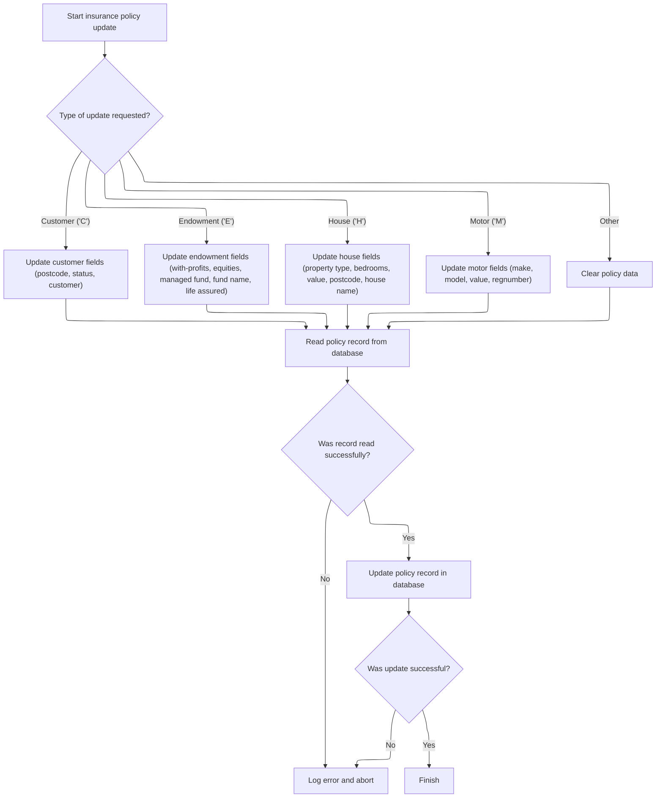
```mermaid
%%{init: {"flowchart": {"defaultRenderer": "elk"}} }%%
flowchart TD
    node1["Start insurance policy update"] --> node2{"Type of update requested?"}
    click node1 openCode "base/src/lgupvs01.cbl:97:106"
    node2 -->|"Customer ('C')"| node3["Update customer fields (postcode, status, customer)"]
    click node2 openCode "base/src/lgupvs01.cbl:106:113"
    click node3 openCode "base/src/lgupvs01.cbl:109:111"
    node2 -->|"Endowment ('E')"| node4["Update endowment fields (with-profits, equities, managed fund, fund name, life assured)"]
    click node4 openCode "base/src/lgupvs01.cbl:114:118"
    node2 -->|"House ('H')"| node5["Update house fields (property type, bedrooms, value, postcode, house name)"]
    click node5 openCode "base/src/lgupvs01.cbl:121:125"
    node2 -->|"Motor ('M')"| node6["Update motor fields (make, model, value, regnumber)"]
    click node6 openCode "base/src/lgupvs01.cbl:128:131"
    node2 -->|"Other"| node7["Clear policy data"]
    click node7 openCode "base/src/lgupvs01.cbl:134:134"
    node3 --> node8["Read policy record from database"]
    node4 --> node8
    node5 --> node8
    node6 --> node8
    node7 --> node8
    click node8 openCode "base/src/lgupvs01.cbl:139:146"
    node8 --> node9{"Was record read successfully?"}
    click node9 openCode "base/src/lgupvs01.cbl:147:153"
    node9 -->|"Yes"| node10["Update policy record in database"]
    click node10 openCode "base/src/lgupvs01.cbl:155:159"
    node9 -->|"No"| node11["Log error and abort"]
    click node11 openCode "base/src/lgupvs01.cbl:174:206"
    node10 --> node12{"Was update successful?"}
    click node12 openCode "base/src/lgupvs01.cbl:160:166"
    node12 -->|"Yes"| node13["Finish"]
    click node13 openCode "base/src/lgupvs01.cbl:166:166"
    node12 -->|"No"| node11
classDef HeadingStyle fill:#777777,stroke:#333,stroke-width:2px;

%% Swimm:
%% %%{init: {"flowchart": {"defaultRenderer": "elk"}} }%%
%% flowchart TD
%%     node1["Start insurance policy update"] --> node2{"Type of update requested?"}
%%     click node1 openCode "<SwmPath>[base/src/lgupvs01.cbl](base/src/lgupvs01.cbl)</SwmPath>:97:106"
%%     node2 -->|"Customer ('C')"| node3["Update customer fields (postcode, status, customer)"]
%%     click node2 openCode "<SwmPath>[base/src/lgupvs01.cbl](base/src/lgupvs01.cbl)</SwmPath>:106:113"
%%     click node3 openCode "<SwmPath>[base/src/lgupvs01.cbl](base/src/lgupvs01.cbl)</SwmPath>:109:111"
%%     node2 -->|"Endowment ('E')"| node4["Update endowment fields (with-profits, equities, managed fund, fund name, life assured)"]
%%     click node4 openCode "<SwmPath>[base/src/lgupvs01.cbl](base/src/lgupvs01.cbl)</SwmPath>:114:118"
%%     node2 -->|"House ('H')"| node5["Update house fields (property type, bedrooms, value, postcode, house name)"]
%%     click node5 openCode "<SwmPath>[base/src/lgupvs01.cbl](base/src/lgupvs01.cbl)</SwmPath>:121:125"
%%     node2 -->|"Motor ('M')"| node6["Update motor fields (make, model, value, regnumber)"]
%%     click node6 openCode "<SwmPath>[base/src/lgupvs01.cbl](base/src/lgupvs01.cbl)</SwmPath>:128:131"
%%     node2 -->|"Other"| node7["Clear policy data"]
%%     click node7 openCode "<SwmPath>[base/src/lgupvs01.cbl](base/src/lgupvs01.cbl)</SwmPath>:134:134"
%%     node3 --> node8["Read policy record from database"]
%%     node4 --> node8
%%     node5 --> node8
%%     node6 --> node8
%%     node7 --> node8
%%     click node8 openCode "<SwmPath>[base/src/lgupvs01.cbl](base/src/lgupvs01.cbl)</SwmPath>:139:146"
%%     node8 --> node9{"Was record read successfully?"}
%%     click node9 openCode "<SwmPath>[base/src/lgupvs01.cbl](base/src/lgupvs01.cbl)</SwmPath>:147:153"
%%     node9 -->|"Yes"| node10["Update policy record in database"]
%%     click node10 openCode "<SwmPath>[base/src/lgupvs01.cbl](base/src/lgupvs01.cbl)</SwmPath>:155:159"
%%     node9 -->|"No"| node11["Log error and abort"]
%%     click node11 openCode "<SwmPath>[base/src/lgupvs01.cbl](base/src/lgupvs01.cbl)</SwmPath>:174:206"
%%     node10 --> node12{"Was update successful?"}
%%     click node12 openCode "<SwmPath>[base/src/lgupvs01.cbl](base/src/lgupvs01.cbl)</SwmPath>:160:166"
%%     node12 -->|"Yes"| node13["Finish"]
%%     click node13 openCode "<SwmPath>[base/src/lgupvs01.cbl](base/src/lgupvs01.cbl)</SwmPath>:166:166"
%%     node12 -->|"No"| node11
%% classDef HeadingStyle fill:#777777,stroke:#333,stroke-width:2px;
```

This section governs the business logic for updating insurance policy records in the VSAM database. It ensures that only the relevant fields for the specified policy type are updated, validates the success of database operations, and handles errors by logging them and aborting the transaction if necessary.

| Category        | Rule Name                     | Description                                                                                                                                                                   |
| --------------- | ----------------------------- | ----------------------------------------------------------------------------------------------------------------------------------------------------------------------------- |
| Data validation | Read-before-update validation | A policy record must be successfully read from the database before any update is attempted. If the record cannot be read, the update is aborted and an error is logged.       |
| Business logic  | Policy type field selection   | Only the fields relevant to the requested policy type (Customer, Endowment, House, Motor) are eligible for update. Any other policy type results in clearing all policy data. |
| Business logic  | Unknown policy type handling  | If the requested policy type is not Customer, Endowment, House, or Motor, all policy data fields are cleared before update.                                                   |

<SwmSnippet path="/base/src/lgupvs01.cbl" line="97">

---

MAINLINE in <SwmToken path="base/src/lgupdb01.cbl" pos="209:9:9" line-data="           EXEC CICS LINK Program(LGUPVS01)">`LGUPVS01`</SwmToken> figures out which policy data fields to move by checking the 4th character of <SwmToken path="base/src/lgupvs01.cbl" pos="102:3:7" line-data="           Move CA-Request-ID(4:1) To WF-Request-ID">`CA-Request-ID`</SwmToken>, then copies the right fields from the commarea to the working fields. It reads the VSAM record, updates it, and rewrites it. If the file read or rewrite fails, it sets a repo-specific return code and abends with a custom code.

```cobol
       MAINLINE SECTION.
      *
      *---------------------------------------------------------------*
           Move EIBCALEN To WS-Commarea-Len.
      *---------------------------------------------------------------*
           Move CA-Request-ID(4:1) To WF-Request-ID
           Move CA-Policy-Num      To WF-Policy-Num
           Move CA-Customer-Num    To WF-Customer-Num

           Evaluate WF-Request-ID

             When 'C'
               Move CA-B-Postcode  To WF-B-Postcode
               Move CA-B-Status    To WF-B-Status
               Move CA-B-Customer  To WF-B-Customer

             When 'E'
               Move CA-E-WITH-PROFITS To  WF-E-WITH-PROFITS
               Move CA-E-EQUITIES     To  WF-E-EQUITIES
               Move CA-E-MANAGED-FUND To  WF-E-MANAGED-FUND
               Move CA-E-FUND-NAME    To  WF-E-FUND-NAME
               Move CA-E-LIFE-ASSURED To  WF-E-LIFE-ASSURED

             When 'H'
               Move CA-H-PROPERTY-TYPE To  WF-H-PROPERTY-TYPE
               Move CA-H-BEDROOMS      To  WF-H-BEDROOMS
               Move CA-H-VALUE         To  WF-H-VALUE
               Move CA-H-POSTCODE      To  WF-H-POSTCODE
               Move CA-H-HOUSE-NAME    To  WF-H-HOUSE-NAME

             When 'M'
               Move CA-M-MAKE          To  WF-M-MAKE
               Move CA-M-MODEL         To  WF-M-MODEL
               Move CA-M-VALUE         To  WF-M-VALUE
               Move CA-M-REGNUMBER     To  WF-M-REGNUMBER

             When Other
               Move Spaces To WF-Policy-Data
           End-Evaluate

           Move CA-Policy-Num      To WF-Policy-Num
      *---------------------------------------------------------------*
           Exec CICS Read File('KSDSPOLY')
                     Into(WS-FileIn)
                     Length(WS-Commarea-Len)
                     Ridfld(WF-Policy-Key)
                     KeyLength(21)
                     RESP(WS-RESP)
                     Update
           End-Exec.
           If WS-RESP Not = DFHRESP(NORMAL)
             Move EIBRESP2 To WS-RESP2
             MOVE '81' TO CA-RETURN-CODE
             PERFORM WRITE-ERROR-MESSAGE
             EXEC CICS ABEND ABCODE('LGV3') NODUMP END-EXEC
             EXEC CICS RETURN END-EXEC
           End-If.
      *---------------------------------------------------------------*
           Exec CICS ReWrite File('KSDSPOLY')
                     From(WF-Policy-Info)
                     Length(WS-Commarea-LenF)
                     RESP(WS-RESP)
           End-Exec.
           If WS-RESP Not = DFHRESP(NORMAL)
             Move EIBRESP2 To WS-RESP2
             MOVE '82' TO CA-RETURN-CODE
             PERFORM WRITE-ERROR-MESSAGE
             EXEC CICS ABEND ABCODE('LGV4') NODUMP END-EXEC
             EXEC CICS RETURN END-EXEC
           End-If.
```

---

</SwmSnippet>

<SwmSnippet path="/base/src/lgupvs01.cbl" line="174">

---

<SwmToken path="base/src/lgupvs01.cbl" pos="174:1:5" line-data="       WRITE-ERROR-MESSAGE.">`WRITE-ERROR-MESSAGE`</SwmToken> in <SwmToken path="base/src/lgupdb01.cbl" pos="209:9:9" line-data="           EXEC CICS LINK Program(LGUPVS01)">`LGUPVS01`</SwmToken> grabs the current time, formats the error message, and links to LGSTSQ to log it. Then it sends up to 90 bytes of commarea data to LGSTSQ for extra context, so both the error and the raw data are logged for troubleshooting. The 90-byte limit is arbitrary and not explained in the code.

```cobol
       WRITE-ERROR-MESSAGE.
           EXEC CICS ASKTIME ABSTIME(WS-ABSTIME)
           END-EXEC
           EXEC CICS FORMATTIME ABSTIME(WS-ABSTIME)
                     MMDDYYYY(WS-DATE)
                     TIME(WS-TIME)
           END-EXEC
      *
           MOVE WS-DATE TO EM-DATE
           MOVE WS-TIME TO EM-TIME
           Move CA-Customer-Num To EM-Cusnum
           Move WS-RESP         To EM-RespRC
           Move WS-RESP2        To EM-Resp2RC
           EXEC CICS LINK PROGRAM('LGSTSQ')
                     COMMAREA(ERROR-MSG)
                     LENGTH(LENGTH OF ERROR-MSG)
           END-EXEC.
           IF EIBCALEN > 0 THEN
             IF EIBCALEN < 91 THEN
               MOVE DFHCOMMAREA(1:EIBCALEN) TO CA-DATA
               EXEC CICS LINK PROGRAM('LGSTSQ')
                         COMMAREA(CA-ERROR-MSG)
                         LENGTH(Length Of CA-ERROR-MSG)
               END-EXEC
             ELSE
               MOVE DFHCOMMAREA(1:90) TO CA-DATA
               EXEC CICS LINK PROGRAM('LGSTSQ')
                         COMMAREA(CA-ERROR-MSG)
                         LENGTH(Length Of CA-ERROR-MSG)
               END-EXEC
             END-IF
           END-IF.
           EXIT.
```

---

</SwmSnippet>

## Handling update errors in the menu flow

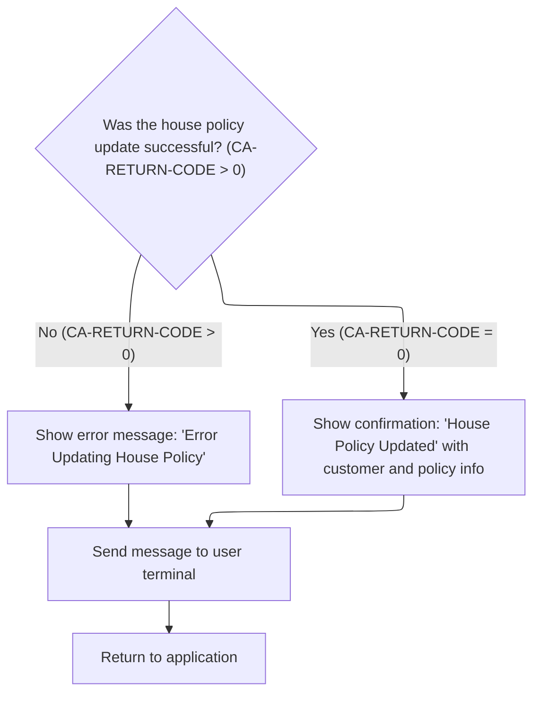
```mermaid
%%{init: {"flowchart": {"defaultRenderer": "elk"}} }%%
flowchart TD
    node1{"Was the house policy update successful? (CA-RETURN-CODE > 0)"}
    click node1 openCode "base/src/lgtestp3.cbl:200:202"
    node1 -->|"No (CA-RETURN-CODE > 0)"| node2["Show error message: 'Error Updating House Policy'"]
    click node2 openCode "base/src/lgtestp3.cbl:277:279"
    node2 --> node4["Send message to user terminal"]
    click node4 openCode "base/src/lgtestp3.cbl:279:279"
    node4 --> node5["Return to application"]
    click node5 openCode "base/src/lgtestp3.cbl:235:236"
    node1 -->|"Yes (CA-RETURN-CODE = 0)"| node3["Show confirmation: 'House Policy Updated' with customer and policy info"]
    click node3 openCode "base/src/lgtestp3.cbl:204:212"
    node3 --> node4
classDef HeadingStyle fill:#777777,stroke:#333,stroke-width:2px;

%% Swimm:
%% %%{init: {"flowchart": {"defaultRenderer": "elk"}} }%%
%% flowchart TD
%%     node1{"Was the house policy update successful? (<SwmToken path="base/src/lgtestp3.cbl" pos="74:3:7" line-data="                 IF CA-RETURN-CODE &gt; 0">`CA-RETURN-CODE`</SwmToken> > 0)"}
%%     click node1 openCode "<SwmPath>[base/src/lgtestp3.cbl](base/src/lgtestp3.cbl)</SwmPath>:200:202"
%%     node1 -->|"No (<SwmToken path="base/src/lgtestp3.cbl" pos="74:3:7" line-data="                 IF CA-RETURN-CODE &gt; 0">`CA-RETURN-CODE`</SwmToken> > 0)"| node2["Show error message: 'Error Updating House Policy'"]
%%     click node2 openCode "<SwmPath>[base/src/lgtestp3.cbl](base/src/lgtestp3.cbl)</SwmPath>:277:279"
%%     node2 --> node4["Send message to user terminal"]
%%     click node4 openCode "<SwmPath>[base/src/lgtestp3.cbl](base/src/lgtestp3.cbl)</SwmPath>:279:279"
%%     node4 --> node5["Return to application"]
%%     click node5 openCode "<SwmPath>[base/src/lgtestp3.cbl](base/src/lgtestp3.cbl)</SwmPath>:235:236"
%%     node1 -->|"Yes (<SwmToken path="base/src/lgtestp3.cbl" pos="74:3:7" line-data="                 IF CA-RETURN-CODE &gt; 0">`CA-RETURN-CODE`</SwmToken> = 0)"| node3["Show confirmation: 'House Policy Updated' with customer and policy info"]
%%     click node3 openCode "<SwmPath>[base/src/lgtestp3.cbl](base/src/lgtestp3.cbl)</SwmPath>:204:212"
%%     node3 --> node4
%% classDef HeadingStyle fill:#777777,stroke:#333,stroke-width:2px;
```

<SwmSnippet path="/base/src/lgtestp3.cbl" line="200">

---

After returning from <SwmToken path="base/src/lgtestp3.cbl" pos="196:10:10" line-data="                 EXEC CICS LINK PROGRAM(&#39;LGUPOL01&#39;)">`LGUPOL01`</SwmToken>, <SwmToken path="base/src/lgtestp3.cbl" pos="33:5:7" line-data="              GO TO A-GAIN.">`A-GAIN`</SwmToken> checks <SwmToken path="base/src/lgtestp3.cbl" pos="200:3:7" line-data="                 IF CA-RETURN-CODE &gt; 0">`CA-RETURN-CODE`</SwmToken>. If it's greater than zero, it jumps to <SwmToken path="base/src/lgtestp3.cbl" pos="201:5:7" line-data="                   GO TO NO-UPD">`NO-UPD`</SwmToken> to show the user an error message and reset the session for another attempt.

```cobol
                 IF CA-RETURN-CODE > 0
                   GO TO NO-UPD
                 END-IF
```

---

</SwmSnippet>

<SwmSnippet path="/base/src/lgtestp3.cbl" line="277">

---

<SwmToken path="base/src/lgtestp3.cbl" pos="277:1:3" line-data="       NO-UPD.">`NO-UPD`</SwmToken> sets the error message for a failed house policy update and jumps right to <SwmToken path="base/src/lgtestp3.cbl" pos="279:5:7" line-data="           Go To ERROR-OUT.">`ERROR-OUT`</SwmToken>, which handles showing the message and resetting the session.

```cobol
       NO-UPD.
           Move 'Error Updating House Policy'      To  ERP3FLDO
           Go To ERROR-OUT.
```

---

</SwmSnippet>

<SwmSnippet path="/base/src/lgtestp3.cbl" line="204">

---

After coming back from <SwmToken path="base/src/lgtestp3.cbl" pos="201:5:7" line-data="                   GO TO NO-UPD">`NO-UPD`</SwmToken>, <SwmToken path="base/src/lgtestp3.cbl" pos="33:5:7" line-data="              GO TO A-GAIN.">`A-GAIN`</SwmToken> copies the customer and policy numbers into the output fields, clears the option field, sets the 'House Policy Updated' message, and sends the updated map to the user.

```cobol
                 Move CA-CUSTOMER-NUM To ENP3CNOI
                 Move CA-POLICY-NUM   To ENP3PNOI
                 Move ' '             To ENP3OPTI
                 Move 'House Policy Updated'
                   To  ERP3FLDO
                 EXEC CICS SEND MAP ('SSMAPP3')
                           FROM(SSMAPP3O)
                           MAPSET ('SSMAP')
                 END-EXEC
```

---

</SwmSnippet>

<SwmSnippet path="/base/src/lgtestp3.cbl" line="217">

---

If the user picks an invalid option, <SwmToken path="base/src/lgtestp3.cbl" pos="33:5:7" line-data="              GO TO A-GAIN.">`A-GAIN`</SwmToken> sets the error message, moves the cursor to the option field, sends the map to the user, and then returns control to CICS for another menu session.

```cobol
             WHEN OTHER

                 Move 'Please enter a valid option'
                   To  ERP3FLDO
                 Move -1 To ENP3OPTL

                 EXEC CICS SEND MAP ('SSMAPP3')
                           FROM(SSMAPP3O)
                           MAPSET ('SSMAP')
                           CURSOR
                 END-EXEC
                 GO TO ENDIT-STARTIT

           END-EVALUATE.


      *    Send message to terminal and return

           EXEC CICS RETURN
           END-EXEC.
```

---

</SwmSnippet>

&nbsp;

*This is an auto-generated document by Swimm 🌊 and has not yet been verified by a human*

<SwmMeta version="3.0.0" repo-id="Z2l0aHViJTNBJTNBY2ljcy1nZW5hcHAtZGVtbyUzQSUzQXN3aW1taW8=" repo-name="cics-genapp-demo"><sup>Powered by [Swimm](https://app.swimm.io/)</sup></SwmMeta>
