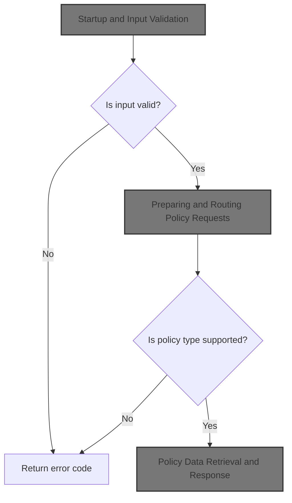
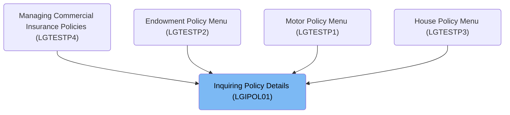
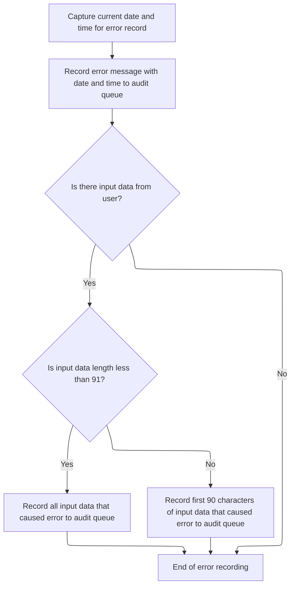

# Overview

This document describes the flow for inquiring about insurance policies. Users submit a request with customer and policy identifiers, and the system validates the input, logs errors for audit, and retrieves detailed policy information or returns an error code.



## Dependencies

### Programs

- <SwmToken path="base/src/lgipol01.cbl" pos="13:6:6" line-data="       PROGRAM-ID. LGIPOL01.">`LGIPOL01`</SwmToken> (<SwmPath>[base/src/lgipol01.cbl](base/src/lgipol01.cbl)</SwmPath>)
- <SwmToken path="base/src/lgipol01.cbl" pos="91:9:9" line-data="           EXEC CICS LINK Program(LGIPDB01)">`LGIPDB01`</SwmToken> (<SwmPath>[base/src/lgipdb01.cbl](base/src/lgipdb01.cbl)</SwmPath>)
- LGSTSQ (<SwmPath>[base/src/lgstsq.cbl](base/src/lgstsq.cbl)</SwmPath>)

### Copybooks

- SQLCA
- LGPOLICY (<SwmPath>[base/src/lgpolicy.cpy](base/src/lgpolicy.cpy)</SwmPath>)
- LGCMAREA (<SwmPath>[base/src/lgcmarea.cpy](base/src/lgcmarea.cpy)</SwmPath>)

# Where is this program used?

This program is used multiple times in the codebase as represented in the following diagram:



## Detailed View of the Program's Functionality

# Startup and Input Validation

When the application starts, the main entry point prepares its internal context by initializing a structure that holds runtime information such as transaction ID, terminal ID, and task number. These values are fetched from the CICS environment to help with diagnostics and tracking.

The first critical check is whether any input data (commarea) has been provided. The commarea is a block of memory used to pass data between CICS programs. If no commarea is present, the application immediately logs an error message and forcibly ends the transaction with a specific error code. This prevents further processing without the required input.

If the commarea is present, the application resets the return code in the commarea to indicate success, records the length of the commarea, and sets up a pointer to it for later use. The application then hands off control to a secondary program responsible for retrieving policy data from the database, passing the commarea along for further processing.

# Error Logging and Diagnostics

Whenever an error condition is detected (such as missing input data or a database failure), the application invokes a dedicated error logging routine. This routine performs several steps:

1. It captures the current date and time from the system, formats them, and stores them in the error message structure. This ensures that every error record is timestamped for audit and troubleshooting purposes.

2. The error message, which includes program name, customer and policy numbers (if available), and the SQL return code (for database errors), is sent to an audit queue using a CICS service. This queue acts as a central repository for error records.

3. If there is input data (commarea) available, the routine also logs up to 90 bytes of this data to the audit queue. If the commarea is shorter than 91 bytes, the entire commarea is logged; otherwise, only the first 90 bytes are recorded. This provides a snapshot of the input that caused the error, aiding in root cause analysis.

# Preparing and Routing Policy Requests

After handling any initial errors, the main program resets the commarea return code to indicate success and prepares pointers and length information for the commarea. It then calls the database access program, passing the commarea and specifying a maximum length for the data exchange.

The database access program initializes its own working storage and diagnostic structures, sets up <SwmToken path="base/src/lgipdb01.cbl" pos="242:5:5" line-data="      * initialize DB2 host variables">`DB2`</SwmToken> host variables for database operations, and prepares error message fields for use if needed.

It then checks the commarea for validity, logging and abending if it is missing. Assuming the commarea is valid, it converts customer and policy numbers from the commarea into the format required by <SwmToken path="base/src/lgipdb01.cbl" pos="242:5:5" line-data="      * initialize DB2 host variables">`DB2`</SwmToken> and stores them for both database operations and error reporting.

The program then examines the request type specified in the commarea to determine which kind of policy data is being requested (endowment, house, motor, or commercial). It branches to the appropriate logic for each policy type, ensuring that future expansion to new policy types will be straightforward.

# Policy Data Retrieval and Response

For each policy type, the database access program performs the following steps:

1. It runs a <SwmToken path="base/src/lgipdb01.cbl" pos="242:5:5" line-data="      * initialize DB2 host variables">`DB2`</SwmToken> SELECT statement to retrieve all relevant details for the requested policy, joining the main policy table with the specific policy type table (endowment, house, motor, or commercial).

2. If the SELECT is successful, the program calculates how much space is needed in the commarea to return all the data, including any variable-length fields. If the commarea provided by the caller is too small, it sets an error code indicating insufficient space and returns immediately.

3. If the commarea is large enough, the program copies the retrieved data into the commarea, converting integer fields as needed and skipping any fields that are null (using indicator variables to check for nulls). For variable-length fields, it calculates the required space and copies only the valid data.

4. The program marks the end of the returned policy data with a special string ("FINAL") to indicate to the caller where the data ends.

5. If the SELECT fails because no matching policy is found, the program sets an error code indicating that the policy or customer number is invalid. If the SELECT fails for any other reason, it sets a generic error code and logs a detailed error message to the audit queue, including the SQL return code and input data.

6. The program then returns control to the caller, with the commarea containing either the requested policy data or an error code indicating what went wrong.

# Commercial Policy Retrieval (Advanced)

For commercial policies, the program supports several request types, including retrieving by customer and policy number, by policy number only, and by postcode. For requests that may return multiple records (such as by postcode), the program uses a database cursor to fetch records one at a time, copying each record into the commarea and counting how many records have been returned. If more than a set limit (e.g., 20 records) are found, it stops fetching further records.

Each commercial policy record is copied into the commarea, with integer fields converted and nulls skipped as before. The end of each record is marked, and the program ensures that the commarea is not overrun by checking available space before copying data.

# Error Logging in Database Access

Whenever a database error occurs, the error logging routine in the database access program is invoked. This routine:

- Records the SQL return code in the error message.
- Captures and formats the current date and time.
- Sends the error message to the audit queue.
- Logs up to 90 bytes of the commarea data that caused the error, following the same logic as in the main program.

This ensures that all database errors are fully documented, with both context and input data available for analysis.

# Summary

The application is structured to robustly handle input validation, error logging, and policy data retrieval. It ensures that all errors are logged with full context, that only valid requests are processed, and that policy data is returned in a format suitable for further processing or display. The use of commarea for data exchange, indicator variables for null handling, and careful calculation of required space ensures reliability and maintainability in a mainframe environment.

# Rule Definition

| Paragraph Name                                                                                                                                                                                                                                                                                                                                                                                                                                                                                                                                                                                                                                                                      | Rule ID | Category          | Description                                                                                                                                                                                                                                                                                                                            | Conditions                                                                                                                                | Remarks                                                                                                                                                                                                                                                                                                                                                                             |
| ----------------------------------------------------------------------------------------------------------------------------------------------------------------------------------------------------------------------------------------------------------------------------------------------------------------------------------------------------------------------------------------------------------------------------------------------------------------------------------------------------------------------------------------------------------------------------------------------------------------------------------------------------------------------------------- | ------- | ----------------- | -------------------------------------------------------------------------------------------------------------------------------------------------------------------------------------------------------------------------------------------------------------------------------------------------------------------------------------- | ----------------------------------------------------------------------------------------------------------------------------------------- | ----------------------------------------------------------------------------------------------------------------------------------------------------------------------------------------------------------------------------------------------------------------------------------------------------------------------------------------------------------------------------------- |
| MAINLINE SECTION (<SwmPath>[base/src/lgipol01.cbl](base/src/lgipol01.cbl)</SwmPath>), MAINLINE SECTION (<SwmPath>[base/src/lgipdb01.cbl](base/src/lgipdb01.cbl)</SwmPath>)                                                                                                                                                                                                                                                                                                                                                                                                                                                                                                          | RL-001  | Conditional Logic | The program must check if the commarea input is present. If it is missing, it must log an error message with the current date, time, program name, and a variable message indicating the missing commarea, then terminate processing.                                                                                                  | EIBCALEN is equal to zero (no commarea received)                                                                                          | Error message format: date (8 chars), time (6 chars), program name (9 chars), variable message (21 chars). Program name is <SwmToken path="base/src/lgipol01.cbl" pos="13:6:6" line-data="       PROGRAM-ID. LGIPOL01.">`LGIPOL01`</SwmToken> or <SwmToken path="base/src/lgipol01.cbl" pos="91:9:9" line-data="           EXEC CICS LINK Program(LGIPDB01)">`LGIPDB01`</SwmToken>. |
| <SwmToken path="base/src/lgipol01.cbl" pos="81:3:7" line-data="               PERFORM WRITE-ERROR-MESSAGE">`WRITE-ERROR-MESSAGE`</SwmToken> (<SwmPath>[base/src/lgipol01.cbl](base/src/lgipol01.cbl)</SwmPath>), <SwmToken path="base/src/lgipol01.cbl" pos="81:3:7" line-data="               PERFORM WRITE-ERROR-MESSAGE">`WRITE-ERROR-MESSAGE`</SwmToken> (<SwmPath>[base/src/lgipdb01.cbl](base/src/lgipdb01.cbl)</SwmPath>)                                                                                                                                                                                                                                                    | RL-002  | Data Assignment   | All error messages must be written to an audit queue, including the date, time, program name, and a variable message with context such as customer number, policy number, SQL request, and SQLCODE for <SwmToken path="base/src/lgipdb01.cbl" pos="242:5:5" line-data="      * initialize DB2 host variables">`DB2`</SwmToken> errors. | Any error condition encountered during processing                                                                                         | Audit queue message format: date (8 chars), time (6 chars), program name (9 chars), variable message (21 chars, may include customer/policy number, SQL request, SQLCODE).                                                                                                                                                                                                          |
| <SwmToken path="base/src/lgipol01.cbl" pos="81:3:7" line-data="               PERFORM WRITE-ERROR-MESSAGE">`WRITE-ERROR-MESSAGE`</SwmToken> (<SwmPath>[base/src/lgipol01.cbl](base/src/lgipol01.cbl)</SwmPath>), <SwmToken path="base/src/lgipol01.cbl" pos="81:3:7" line-data="               PERFORM WRITE-ERROR-MESSAGE">`WRITE-ERROR-MESSAGE`</SwmToken> (<SwmPath>[base/src/lgipdb01.cbl](base/src/lgipdb01.cbl)</SwmPath>)                                                                                                                                                                                                                                                    | RL-003  | Data Assignment   | If commarea input is present, record a snapshot of the input data to the audit queue. If input length is less than 91 bytes, record the entire input; if 91 bytes or longer, record only the first 90 bytes.                                                                                                                           | EIBCALEN > 0 (commarea present)                                                                                                           | Snapshot format: 'COMMAREA=' (9 chars) followed by up to 90 bytes of input data.                                                                                                                                                                                                                                                                                                    |
| <SwmToken path="base/src/lgipdb01.cbl" pos="281:3:9" line-data="               PERFORM GET-ENDOW-DB2-INFO">`GET-ENDOW-DB2-INFO`</SwmToken>, <SwmToken path="base/src/lgipdb01.cbl" pos="285:3:9" line-data="               PERFORM GET-HOUSE-DB2-INFO">`GET-HOUSE-DB2-INFO`</SwmToken>, <SwmToken path="base/src/lgipdb01.cbl" pos="289:3:9" line-data="               PERFORM GET-MOTOR-DB2-INFO">`GET-MOTOR-DB2-INFO`</SwmToken>, <SwmToken path="base/src/lgipdb01.cbl" pos="293:3:9" line-data="               PERFORM GET-COMMERCIAL-DB2-INFO-1">`GET-COMMERCIAL-DB2-INFO`</SwmToken>-\* (<SwmPath>[base/src/lgipdb01.cbl](base/src/lgipdb01.cbl)</SwmPath>)                   | RL-004  | Computation       | For each policy type, retrieve policy data from the database. Use indicator variables to avoid copying null values into the output.                                                                                                                                                                                                    | Policy inquiry request is routed to a handler and SQL SELECT is executed                                                                  | Indicator variables are checked for each nullable field; only <SwmToken path="base/src/lgipdb01.cbl" pos="379:13:15" line-data="      *      check whether PADDINGDATA field is non-null">`non-null`</SwmToken> values are copied to output.                                                                                                                                        |
| <SwmToken path="base/src/lgipdb01.cbl" pos="281:3:9" line-data="               PERFORM GET-ENDOW-DB2-INFO">`GET-ENDOW-DB2-INFO`</SwmToken>, <SwmToken path="base/src/lgipdb01.cbl" pos="285:3:9" line-data="               PERFORM GET-HOUSE-DB2-INFO">`GET-HOUSE-DB2-INFO`</SwmToken>, <SwmToken path="base/src/lgipdb01.cbl" pos="289:3:9" line-data="               PERFORM GET-MOTOR-DB2-INFO">`GET-MOTOR-DB2-INFO`</SwmToken>, <SwmToken path="base/src/lgipdb01.cbl" pos="293:3:9" line-data="               PERFORM GET-COMMERCIAL-DB2-INFO-1">`GET-COMMERCIAL-DB2-INFO`</SwmToken>-\* (<SwmPath>[base/src/lgipdb01.cbl](base/src/lgipdb01.cbl)</SwmPath>)                   | RL-005  | Computation       | Calculate the required commarea size for the response, including variable-length fields. Only copy data if the commarea is large enough; otherwise, set the return code to '98'.                                                                                                                                                       | After successful SQL SELECT and before copying output data                                                                                | Required size is sum of header/trailer length and policy-specific length, plus any variable-length field sizes.                                                                                                                                                                                                                                                                     |
| MAINLINE SECTION, <SwmToken path="base/src/lgipdb01.cbl" pos="281:3:9" line-data="               PERFORM GET-ENDOW-DB2-INFO">`GET-ENDOW-DB2-INFO`</SwmToken>, <SwmToken path="base/src/lgipdb01.cbl" pos="285:3:9" line-data="               PERFORM GET-HOUSE-DB2-INFO">`GET-HOUSE-DB2-INFO`</SwmToken>, <SwmToken path="base/src/lgipdb01.cbl" pos="289:3:9" line-data="               PERFORM GET-MOTOR-DB2-INFO">`GET-MOTOR-DB2-INFO`</SwmToken>, <SwmToken path="base/src/lgipdb01.cbl" pos="293:3:9" line-data="               PERFORM GET-COMMERCIAL-DB2-INFO-1">`GET-COMMERCIAL-DB2-INFO`</SwmToken>-\* (<SwmPath>[base/src/lgipdb01.cbl](base/src/lgipdb01.cbl)</SwmPath>) | RL-006  | Data Assignment   | Set the <SwmToken path="base/src/lgipol01.cbl" pos="86:9:13" line-data="           MOVE &#39;00&#39; TO CA-RETURN-CODE">`CA-RETURN-CODE`</SwmToken> field in the commarea according to the outcome, using defined codes for success, errors, and special conditions.                                                                   | After processing each request and determining outcome                                                                                     | Return codes: '00' (success), '01' (no rows found), '90' (<SwmToken path="base/src/lgipdb01.cbl" pos="242:5:5" line-data="      * initialize DB2 host variables">`DB2`</SwmToken> error), '98' (commarea too small), '99' (unsupported request), '88' (cursor close error), '89' (cursor open error), '17' (more than 20 records found).                                            |
| <SwmToken path="base/src/lgipdb01.cbl" pos="281:3:9" line-data="               PERFORM GET-ENDOW-DB2-INFO">`GET-ENDOW-DB2-INFO`</SwmToken>, <SwmToken path="base/src/lgipdb01.cbl" pos="285:3:9" line-data="               PERFORM GET-HOUSE-DB2-INFO">`GET-HOUSE-DB2-INFO`</SwmToken>, <SwmToken path="base/src/lgipdb01.cbl" pos="289:3:9" line-data="               PERFORM GET-MOTOR-DB2-INFO">`GET-MOTOR-DB2-INFO`</SwmToken>, <SwmToken path="base/src/lgipdb01.cbl" pos="293:3:9" line-data="               PERFORM GET-COMMERCIAL-DB2-INFO-1">`GET-COMMERCIAL-DB2-INFO`</SwmToken>-\* (<SwmPath>[base/src/lgipdb01.cbl](base/src/lgipdb01.cbl)</SwmPath>)                   | RL-007  | Data Assignment   | For successful requests, populate the commarea output fields with the appropriate policy data, including common fields and policy-type-specific fields, and mark the end of the data with the string 'FINAL'.                                                                                                                          | SQL SELECT successful and commarea is large enough                                                                                        | Output includes common fields and policy-specific fields. 'FINAL' marker is a 5-character string placed at the end of the policy data.                                                                                                                                                                                                                                              |
| <SwmToken path="base/src/lgipdb01.cbl" pos="281:3:9" line-data="               PERFORM GET-ENDOW-DB2-INFO">`GET-ENDOW-DB2-INFO`</SwmToken>, <SwmToken path="base/src/lgipdb01.cbl" pos="285:3:9" line-data="               PERFORM GET-HOUSE-DB2-INFO">`GET-HOUSE-DB2-INFO`</SwmToken>, <SwmToken path="base/src/lgipdb01.cbl" pos="289:3:9" line-data="               PERFORM GET-MOTOR-DB2-INFO">`GET-MOTOR-DB2-INFO`</SwmToken>, <SwmToken path="base/src/lgipdb01.cbl" pos="293:3:9" line-data="               PERFORM GET-COMMERCIAL-DB2-INFO-1">`GET-COMMERCIAL-DB2-INFO`</SwmToken>-\* (<SwmPath>[base/src/lgipdb01.cbl](base/src/lgipdb01.cbl)</SwmPath>)                   | RL-008  | Conditional Logic | Output data must not include any null or uninitialized fields.                                                                                                                                                                                                                                                                         | When copying data to output commarea                                                                                                      | Indicator variables are used to check for nulls; only <SwmToken path="base/src/lgipdb01.cbl" pos="379:13:15" line-data="      *      check whether PADDINGDATA field is non-null">`non-null`</SwmToken> fields are copied.                                                                                                                                                          |
| MAINLINE SECTION (database handler program)                                                                                                                                                                                                                                                                                                                                                                                                                                                                                                                                                                                                                                         | RL-009  | Conditional Logic | When a policy inquiry request is received, determine the policy type from the request type identifier field in the input data and route processing to the appropriate handler for endowment, house, motor, or commercial policy.                                                                                                       | Request type identifier field in input data matches a known code for a supported policy type (e.g., endowment, house, motor, commercial). | The request type identifier is converted to uppercase and compared to known codes. If no match is found, the return code is set to '99' to indicate unsupported or invalid request type.                                                                                                                                                                                            |

# User Stories

## User Story 1: Error Handling and Audit Logging

---

### Story Description:

As a system, I want to validate the presence of commarea input and log detailed error messages to an audit queue so that all processing errors and missing input scenarios are traceable and can be investigated.

---

### Business Rule Mapping:

| Rule ID | Paragraph Name                                                                                                                                                                                                                                                                                                                                                                                                                   | Rule Description                                                                                                                                                                                                                                                                                                                       |
| ------- | -------------------------------------------------------------------------------------------------------------------------------------------------------------------------------------------------------------------------------------------------------------------------------------------------------------------------------------------------------------------------------------------------------------------------------- | -------------------------------------------------------------------------------------------------------------------------------------------------------------------------------------------------------------------------------------------------------------------------------------------------------------------------------------- |
| RL-001  | MAINLINE SECTION (<SwmPath>[base/src/lgipol01.cbl](base/src/lgipol01.cbl)</SwmPath>), MAINLINE SECTION (<SwmPath>[base/src/lgipdb01.cbl](base/src/lgipdb01.cbl)</SwmPath>)                                                                                                                                                                                                                                                       | The program must check if the commarea input is present. If it is missing, it must log an error message with the current date, time, program name, and a variable message indicating the missing commarea, then terminate processing.                                                                                                  |
| RL-002  | <SwmToken path="base/src/lgipol01.cbl" pos="81:3:7" line-data="               PERFORM WRITE-ERROR-MESSAGE">`WRITE-ERROR-MESSAGE`</SwmToken> (<SwmPath>[base/src/lgipol01.cbl](base/src/lgipol01.cbl)</SwmPath>), <SwmToken path="base/src/lgipol01.cbl" pos="81:3:7" line-data="               PERFORM WRITE-ERROR-MESSAGE">`WRITE-ERROR-MESSAGE`</SwmToken> (<SwmPath>[base/src/lgipdb01.cbl](base/src/lgipdb01.cbl)</SwmPath>) | All error messages must be written to an audit queue, including the date, time, program name, and a variable message with context such as customer number, policy number, SQL request, and SQLCODE for <SwmToken path="base/src/lgipdb01.cbl" pos="242:5:5" line-data="      * initialize DB2 host variables">`DB2`</SwmToken> errors. |
| RL-003  | <SwmToken path="base/src/lgipol01.cbl" pos="81:3:7" line-data="               PERFORM WRITE-ERROR-MESSAGE">`WRITE-ERROR-MESSAGE`</SwmToken> (<SwmPath>[base/src/lgipol01.cbl](base/src/lgipol01.cbl)</SwmPath>), <SwmToken path="base/src/lgipol01.cbl" pos="81:3:7" line-data="               PERFORM WRITE-ERROR-MESSAGE">`WRITE-ERROR-MESSAGE`</SwmToken> (<SwmPath>[base/src/lgipdb01.cbl](base/src/lgipdb01.cbl)</SwmPath>) | If commarea input is present, record a snapshot of the input data to the audit queue. If input length is less than 91 bytes, record the entire input; if 91 bytes or longer, record only the first 90 bytes.                                                                                                                           |

---

### Relevant Functionality:

- **MAINLINE SECTION (**<SwmPath>[base/src/lgipol01.cbl](base/src/lgipol01.cbl)</SwmPath>**)**
  1. **RL-001:**
     - If input length is zero:
       - Set error message variable to 'NO COMMAREA RECEIVED'
       - Call error message writer (<SwmToken path="base/src/lgipol01.cbl" pos="81:3:7" line-data="               PERFORM WRITE-ERROR-MESSAGE">`WRITE-ERROR-MESSAGE`</SwmToken>)
       - Terminate with ABEND code 'LGCA'
- <SwmToken path="base/src/lgipol01.cbl" pos="81:3:7" line-data="               PERFORM WRITE-ERROR-MESSAGE">`WRITE-ERROR-MESSAGE`</SwmToken> **(**<SwmPath>[base/src/lgipol01.cbl](base/src/lgipol01.cbl)</SwmPath>**)**
  1. **RL-002:**
     - On error:
       - Obtain current date and time
       - Populate error message fields with context
       - Write error message to audit queue via CICS LINK to LGSTSQ
  2. **RL-003:**
     - If input length > 0:
       - If input length < 91:
         - Copy all input bytes to snapshot
       - Else:
         - Copy first 90 bytes to snapshot
       - Write snapshot to audit queue via CICS LINK to LGSTSQ

## User Story 2: Policy Inquiry Routing and Return Code Management

---

### Story Description:

As a system, I want to determine the policy type from incoming requests and route them to the appropriate handler, setting the correct return code for each outcome so that users receive accurate feedback and processing is handled according to policy type.

---

### Business Rule Mapping:

| Rule ID | Paragraph Name                                                                                                                                                                                                                                                                                                                                                                                                                                                                                                                                                                                                                                                                      | Rule Description                                                                                                                                                                                                                                                     |
| ------- | ----------------------------------------------------------------------------------------------------------------------------------------------------------------------------------------------------------------------------------------------------------------------------------------------------------------------------------------------------------------------------------------------------------------------------------------------------------------------------------------------------------------------------------------------------------------------------------------------------------------------------------------------------------------------------------- | -------------------------------------------------------------------------------------------------------------------------------------------------------------------------------------------------------------------------------------------------------------------- |
| RL-006  | MAINLINE SECTION, <SwmToken path="base/src/lgipdb01.cbl" pos="281:3:9" line-data="               PERFORM GET-ENDOW-DB2-INFO">`GET-ENDOW-DB2-INFO`</SwmToken>, <SwmToken path="base/src/lgipdb01.cbl" pos="285:3:9" line-data="               PERFORM GET-HOUSE-DB2-INFO">`GET-HOUSE-DB2-INFO`</SwmToken>, <SwmToken path="base/src/lgipdb01.cbl" pos="289:3:9" line-data="               PERFORM GET-MOTOR-DB2-INFO">`GET-MOTOR-DB2-INFO`</SwmToken>, <SwmToken path="base/src/lgipdb01.cbl" pos="293:3:9" line-data="               PERFORM GET-COMMERCIAL-DB2-INFO-1">`GET-COMMERCIAL-DB2-INFO`</SwmToken>-\* (<SwmPath>[base/src/lgipdb01.cbl](base/src/lgipdb01.cbl)</SwmPath>) | Set the <SwmToken path="base/src/lgipol01.cbl" pos="86:9:13" line-data="           MOVE &#39;00&#39; TO CA-RETURN-CODE">`CA-RETURN-CODE`</SwmToken> field in the commarea according to the outcome, using defined codes for success, errors, and special conditions. |
| RL-009  | MAINLINE SECTION (database handler program)                                                                                                                                                                                                                                                                                                                                                                                                                                                                                                                                                                                                                                         | When a policy inquiry request is received, determine the policy type from the request type identifier field in the input data and route processing to the appropriate handler for endowment, house, motor, or commercial policy.                                     |

---

### Relevant Functionality:

- **MAINLINE SECTION**
  1. **RL-006:**
     - On success, set return code to '00'
     - On no rows found, set to '01'
     - On <SwmToken path="base/src/lgipdb01.cbl" pos="242:5:5" line-data="      * initialize DB2 host variables">`DB2`</SwmToken> error, set to '90'
     - On commarea too small, set to '98'
     - On unsupported request, set to '99'
     - On cursor close error, set to '88'
     - On cursor open error, set to '89'
     - On >20 records found, set to '17'
- **MAINLINE SECTION (database handler program)**
  1. **RL-009:**
     - Convert the request type identifier field in input data to uppercase
     - Compare the identifier to known codes:
       - If matches endowment code, route to endowment handler
       - If matches house code, route to house handler
       - If matches motor code, route to motor handler
       - If matches commercial code, route to commercial handler
       - If no match, set return code to '99'

## User Story 3: Policy Data Retrieval and Response Formatting

---

### Story Description:

As a user, I want to receive policy data in response to my inquiry, with only valid, <SwmToken path="base/src/lgipdb01.cbl" pos="379:13:15" line-data="      *      check whether PADDINGDATA field is non-null">`non-null`</SwmToken> fields included, and the output formatted correctly with a 'FINAL' marker, so that I get complete and accurate policy information.

---

### Business Rule Mapping:

| Rule ID | Paragraph Name                                                                                                                                                                                                                                                                                                                                                                                                                                                                                                                                                                                                                                                    | Rule Description                                                                                                                                                                                              |
| ------- | ----------------------------------------------------------------------------------------------------------------------------------------------------------------------------------------------------------------------------------------------------------------------------------------------------------------------------------------------------------------------------------------------------------------------------------------------------------------------------------------------------------------------------------------------------------------------------------------------------------------------------------------------------------------- | ------------------------------------------------------------------------------------------------------------------------------------------------------------------------------------------------------------- |
| RL-004  | <SwmToken path="base/src/lgipdb01.cbl" pos="281:3:9" line-data="               PERFORM GET-ENDOW-DB2-INFO">`GET-ENDOW-DB2-INFO`</SwmToken>, <SwmToken path="base/src/lgipdb01.cbl" pos="285:3:9" line-data="               PERFORM GET-HOUSE-DB2-INFO">`GET-HOUSE-DB2-INFO`</SwmToken>, <SwmToken path="base/src/lgipdb01.cbl" pos="289:3:9" line-data="               PERFORM GET-MOTOR-DB2-INFO">`GET-MOTOR-DB2-INFO`</SwmToken>, <SwmToken path="base/src/lgipdb01.cbl" pos="293:3:9" line-data="               PERFORM GET-COMMERCIAL-DB2-INFO-1">`GET-COMMERCIAL-DB2-INFO`</SwmToken>-\* (<SwmPath>[base/src/lgipdb01.cbl](base/src/lgipdb01.cbl)</SwmPath>) | For each policy type, retrieve policy data from the database. Use indicator variables to avoid copying null values into the output.                                                                           |
| RL-005  | <SwmToken path="base/src/lgipdb01.cbl" pos="281:3:9" line-data="               PERFORM GET-ENDOW-DB2-INFO">`GET-ENDOW-DB2-INFO`</SwmToken>, <SwmToken path="base/src/lgipdb01.cbl" pos="285:3:9" line-data="               PERFORM GET-HOUSE-DB2-INFO">`GET-HOUSE-DB2-INFO`</SwmToken>, <SwmToken path="base/src/lgipdb01.cbl" pos="289:3:9" line-data="               PERFORM GET-MOTOR-DB2-INFO">`GET-MOTOR-DB2-INFO`</SwmToken>, <SwmToken path="base/src/lgipdb01.cbl" pos="293:3:9" line-data="               PERFORM GET-COMMERCIAL-DB2-INFO-1">`GET-COMMERCIAL-DB2-INFO`</SwmToken>-\* (<SwmPath>[base/src/lgipdb01.cbl](base/src/lgipdb01.cbl)</SwmPath>) | Calculate the required commarea size for the response, including variable-length fields. Only copy data if the commarea is large enough; otherwise, set the return code to '98'.                              |
| RL-007  | <SwmToken path="base/src/lgipdb01.cbl" pos="281:3:9" line-data="               PERFORM GET-ENDOW-DB2-INFO">`GET-ENDOW-DB2-INFO`</SwmToken>, <SwmToken path="base/src/lgipdb01.cbl" pos="285:3:9" line-data="               PERFORM GET-HOUSE-DB2-INFO">`GET-HOUSE-DB2-INFO`</SwmToken>, <SwmToken path="base/src/lgipdb01.cbl" pos="289:3:9" line-data="               PERFORM GET-MOTOR-DB2-INFO">`GET-MOTOR-DB2-INFO`</SwmToken>, <SwmToken path="base/src/lgipdb01.cbl" pos="293:3:9" line-data="               PERFORM GET-COMMERCIAL-DB2-INFO-1">`GET-COMMERCIAL-DB2-INFO`</SwmToken>-\* (<SwmPath>[base/src/lgipdb01.cbl](base/src/lgipdb01.cbl)</SwmPath>) | For successful requests, populate the commarea output fields with the appropriate policy data, including common fields and policy-type-specific fields, and mark the end of the data with the string 'FINAL'. |
| RL-008  | <SwmToken path="base/src/lgipdb01.cbl" pos="281:3:9" line-data="               PERFORM GET-ENDOW-DB2-INFO">`GET-ENDOW-DB2-INFO`</SwmToken>, <SwmToken path="base/src/lgipdb01.cbl" pos="285:3:9" line-data="               PERFORM GET-HOUSE-DB2-INFO">`GET-HOUSE-DB2-INFO`</SwmToken>, <SwmToken path="base/src/lgipdb01.cbl" pos="289:3:9" line-data="               PERFORM GET-MOTOR-DB2-INFO">`GET-MOTOR-DB2-INFO`</SwmToken>, <SwmToken path="base/src/lgipdb01.cbl" pos="293:3:9" line-data="               PERFORM GET-COMMERCIAL-DB2-INFO-1">`GET-COMMERCIAL-DB2-INFO`</SwmToken>-\* (<SwmPath>[base/src/lgipdb01.cbl](base/src/lgipdb01.cbl)</SwmPath>) | Output data must not include any null or uninitialized fields.                                                                                                                                                |

---

### Relevant Functionality:

- <SwmToken path="base/src/lgipdb01.cbl" pos="281:3:9" line-data="               PERFORM GET-ENDOW-DB2-INFO">`GET-ENDOW-DB2-INFO`</SwmToken>
  1. **RL-004:**
     - Execute SQL SELECT for policy type
     - For each field with indicator variable:
       - If indicator not equal to -1 (<SwmToken path="base/src/lgipdb01.cbl" pos="383:13:15" line-data="             IF IND-E-PADDINGDATAL NOT EQUAL MINUS-ONE">`MINUS-ONE`</SwmToken>), copy value to output
     - Do not copy null fields
  2. **RL-005:**
     - Add header/trailer length to required size
     - Add policy-specific length
     - If variable-length field present, add its length
     - If input length < required size:
       - Set return code to '98'
       - Return without copying data
     - Else, proceed to copy data
  3. **RL-007:**
     - Copy common policy fields to output
     - Copy policy-type-specific fields to output
     - Place 'FINAL' string at end of policy data
  4. **RL-008:**
     - For each output field:
       - If corresponding indicator variable does not indicate null, copy value
       - Otherwise, skip field

# Workflow

# Startup and Input Validation

The main product role of this section is to ensure that every transaction begins with the necessary input data and context, and to prevent further processing if critical input is missing, thereby maintaining data integrity and system reliability.

| Category        | Rule Name                   | Description                                                                                                                                                                       |
| --------------- | --------------------------- | --------------------------------------------------------------------------------------------------------------------------------------------------------------------------------- |
| Data validation | Mandatory input enforcement | If the commarea is not present at transaction startup, the transaction must be immediately terminated and an error message must be logged for audit and troubleshooting purposes. |
| Business logic  | Error traceability          | The error message for missing commarea must include a timestamp and transaction identification details to support traceability and audit requirements.                            |

<SwmSnippet path="/base/src/lgipol01.cbl" line="70">

---

<SwmToken path="base/src/lgipol01.cbl" pos="70:1:1" line-data="       MAINLINE SECTION.">`MAINLINE`</SwmToken> kicks off by prepping context and checking for a missing commarea. If it's missing, it logs the error and abends right away.

```cobol
       MAINLINE SECTION.
      *
           INITIALIZE WS-HEADER.
      *
           MOVE EIBTRNID TO WS-TRANSID.
           MOVE EIBTRMID TO WS-TERMID.
           MOVE EIBTASKN TO WS-TASKNUM.
      *
      * If NO commarea received issue an ABEND
           IF EIBCALEN IS EQUAL TO ZERO
               MOVE ' NO COMMAREA RECEIVED' TO EM-VARIABLE
               PERFORM WRITE-ERROR-MESSAGE
               EXEC CICS ABEND ABCODE('LGCA') NODUMP END-EXEC
           END-IF
```

---

</SwmSnippet>

## Error Logging and Diagnostics



This section governs how errors are logged and diagnosed in the insurance application. It ensures that every error is recorded with sufficient context for audit and troubleshooting purposes, including time, date, and relevant input data.

| Category       | Rule Name                 | Description                                                                                                                                                                      |
| -------------- | ------------------------- | -------------------------------------------------------------------------------------------------------------------------------------------------------------------------------- |
| Business logic | Timestamped error logging | Every error event must be recorded with the current date and time to provide an accurate audit trail.                                                                            |
| Business logic | Input data inclusion      | If user input data is present at the time of error, it must be included in the error record to aid in diagnostics.                                                               |
| Business logic | Input data truncation     | If the input data is less than 91 characters, the entire input must be recorded in the error log; if it is 91 characters or more, only the first 90 characters must be recorded. |
| Business logic | No input data fallback    | If no user input data is present, only the error message with date and time is recorded.                                                                                         |

<SwmSnippet path="/base/src/lgipol01.cbl" line="107">

---

In <SwmToken path="base/src/lgipol01.cbl" pos="107:1:5" line-data="       WRITE-ERROR-MESSAGE.">`WRITE-ERROR-MESSAGE`</SwmToken>, the code grabs the current time and date, formats them, and stores them in the error message structure. This sets up the error context before sending it off for logging.

```cobol
       WRITE-ERROR-MESSAGE.
      * Save SQLCODE in message
      * Obtain and format current time and date
           EXEC CICS ASKTIME ABSTIME(ABS-TIME)
           END-EXEC
           EXEC CICS FORMATTIME ABSTIME(ABS-TIME)
                     MMDDYYYY(DATE1)
                     TIME(TIME1)
           END-EXEC
```

---

</SwmSnippet>

<SwmSnippet path="/base/src/lgipol01.cbl" line="116">

---

After prepping the error message, the code calls LGSTSQ to log it. This is the main error record, and it happens before any commarea data is considered for logging.

```cobol
           MOVE DATE1 TO EM-DATE
           MOVE TIME1 TO EM-TIME
      * Write output message to TDQ
           EXEC CICS LINK PROGRAM('LGSTSQ')
                     COMMAREA(ERROR-MSG)
                     LENGTH(LENGTH OF ERROR-MSG)
           END-EXEC.
```

---

</SwmSnippet>

<SwmSnippet path="/base/src/lgipol01.cbl" line="124">

---

After logging the main error, if there's commarea data, up to 90 bytes of it gets copied and logged via another call to LGSTSQ. This gives a snapshot of the input data at failure, but only up to the fixed limit.

```cobol
           IF EIBCALEN > 0 THEN
             IF EIBCALEN < 91 THEN
               MOVE DFHCOMMAREA(1:EIBCALEN) TO CA-DATA
               EXEC CICS LINK PROGRAM('LGSTSQ')
                         COMMAREA(CA-ERROR-MSG)
                         LENGTH(LENGTH OF CA-ERROR-MSG)
               END-EXEC
             ELSE
               MOVE DFHCOMMAREA(1:90) TO CA-DATA
               EXEC CICS LINK PROGRAM('LGSTSQ')
                         COMMAREA(CA-ERROR-MSG)
                         LENGTH(LENGTH OF CA-ERROR-MSG)
               END-EXEC
             END-IF
           END-IF.
           EXIT.
```

---

</SwmSnippet>

## Preparing and Routing Policy Requests

<SwmSnippet path="/base/src/lgipol01.cbl" line="86">

---

Back in MAINLINE, after error handling, the code resets the return code, sets up commarea pointers, and then calls <SwmToken path="base/src/lgipol01.cbl" pos="91:9:9" line-data="           EXEC CICS LINK Program(LGIPDB01)">`LGIPDB01`</SwmToken>. This hands off the request to the <SwmToken path="base/src/lgipdb01.cbl" pos="242:5:5" line-data="      * initialize DB2 host variables">`DB2`</SwmToken> access program to fetch policy info.

```cobol
           MOVE '00' TO CA-RETURN-CODE
           MOVE EIBCALEN TO WS-CALEN.
           SET WS-ADDR-DFHCOMMAREA TO ADDRESS OF DFHCOMMAREA.
      *

           EXEC CICS LINK Program(LGIPDB01)
               Commarea(DFHCOMMAREA)
               Length(32500)
           END-EXEC.

           EXEC CICS RETURN END-EXEC.
```

---

</SwmSnippet>

# Policy Data Retrieval and Response



```mermaid
%%{init: {"flowchart": {"defaultRenderer": "elk"}} }%%
flowchart TD
    node1["Start: Receive insurance policy request"] --> node2{"Is request present?"}
    click node1 openCode "base/src/lgipdb01.cbl:230:255"
    node2 -->|"No"| node3["Set outcome: Error (No request received, code 99)"]
    click node2 openCode "base/src/lgipdb01.cbl:251:255"
    click node3 openCode "base/src/lgipdb01.cbl:252:254"
    node2 -->|"Yes"| node4{"Which policy type is requested?"}
    click node4 openCode "base/src/lgipdb01.cbl:277:310"
    node4 -->|"Endowment"| node5["Retrieve endowment policy details"]
    click node5 openCode "base/src/lgipdb01.cbl:327:432"
    node4 -->|"House"| node6["Retrieve house policy details"]
    click node6 openCode "base/src/lgipdb01.cbl:441:523"
    node4 -->|"Motor"| node7["Retrieve motor policy details"]
    click node7 openCode "base/src/lgipdb01.cbl:529:621"
    node4 -->|"Commercial (01ICOM, 02ICOM, etc.)"| node8["Retrieve commercial policy details"]
    click node8 openCode "base/src/lgipdb01.cbl:292:306"
    node4 -->|"Other"| node9["Set outcome: Error (Unsupported policy type, code 99)"]
    click node9 openCode "base/src/lgipdb01.cbl:308:309"
    node5 --> node10{"Was retrieval successful?"}
    node6 --> node10
    node7 --> node10
    node8 --> node10
    click node10 openCode "base/src/lgipdb01.cbl:370:430"
    node10 -->|"Yes"| node13{"Is commarea large enough for data?"}
    click node13 openCode "base/src/lgipdb01.cbl:390:394"
    node13 -->|"No"| node14["Set outcome: Error (Insufficient data space, code 98)"]
    click node14 openCode "base/src/lgipdb01.cbl:391:392"
    node13 -->|"Yes"| node11["Prepare and return policy data"]
    click node11 openCode "base/src/lgipdb01.cbl:395:417"
    node10 -->|"No"| node12["Set outcome: Error (Not found or DB error, code 01/90)"]
    click node12 openCode "base/src/lgipdb01.cbl:423:429"
    node12 --> node15["Write error message"]
    click node15 openCode "base/src/lgipdb01.cbl:997:1030"
    node14 --> node15
    node3 --> node15
classDef HeadingStyle fill:#777777,stroke:#333,stroke-width:2px;

%% Swimm:
%% %%{init: {"flowchart": {"defaultRenderer": "elk"}} }%%
%% flowchart TD
%%     node1["Start: Receive insurance policy request"] --> node2{"Is request present?"}
%%     click node1 openCode "<SwmPath>[base/src/lgipdb01.cbl](base/src/lgipdb01.cbl)</SwmPath>:230:255"
%%     node2 -->|"No"| node3["Set outcome: Error (No request received, code 99)"]
%%     click node2 openCode "<SwmPath>[base/src/lgipdb01.cbl](base/src/lgipdb01.cbl)</SwmPath>:251:255"
%%     click node3 openCode "<SwmPath>[base/src/lgipdb01.cbl](base/src/lgipdb01.cbl)</SwmPath>:252:254"
%%     node2 -->|"Yes"| node4{"Which policy type is requested?"}
%%     click node4 openCode "<SwmPath>[base/src/lgipdb01.cbl](base/src/lgipdb01.cbl)</SwmPath>:277:310"
%%     node4 -->|"Endowment"| node5["Retrieve endowment policy details"]
%%     click node5 openCode "<SwmPath>[base/src/lgipdb01.cbl](base/src/lgipdb01.cbl)</SwmPath>:327:432"
%%     node4 -->|"House"| node6["Retrieve house policy details"]
%%     click node6 openCode "<SwmPath>[base/src/lgipdb01.cbl](base/src/lgipdb01.cbl)</SwmPath>:441:523"
%%     node4 -->|"Motor"| node7["Retrieve motor policy details"]
%%     click node7 openCode "<SwmPath>[base/src/lgipdb01.cbl](base/src/lgipdb01.cbl)</SwmPath>:529:621"
%%     node4 -->|"Commercial (<SwmToken path="base/src/lgipdb01.cbl" pos="291:4:4" line-data="             WHEN &#39;01ICOM&#39;">`01ICOM`</SwmToken>, <SwmToken path="base/src/lgipdb01.cbl" pos="295:4:4" line-data="             WHEN &#39;02ICOM&#39;">`02ICOM`</SwmToken>, etc.)"| node8["Retrieve commercial policy details"]
%%     click node8 openCode "<SwmPath>[base/src/lgipdb01.cbl](base/src/lgipdb01.cbl)</SwmPath>:292:306"
%%     node4 -->|"Other"| node9["Set outcome: Error (Unsupported policy type, code 99)"]
%%     click node9 openCode "<SwmPath>[base/src/lgipdb01.cbl](base/src/lgipdb01.cbl)</SwmPath>:308:309"
%%     node5 --> node10{"Was retrieval successful?"}
%%     node6 --> node10
%%     node7 --> node10
%%     node8 --> node10
%%     click node10 openCode "<SwmPath>[base/src/lgipdb01.cbl](base/src/lgipdb01.cbl)</SwmPath>:370:430"
%%     node10 -->|"Yes"| node13{"Is commarea large enough for data?"}
%%     click node13 openCode "<SwmPath>[base/src/lgipdb01.cbl](base/src/lgipdb01.cbl)</SwmPath>:390:394"
%%     node13 -->|"No"| node14["Set outcome: Error (Insufficient data space, code 98)"]
%%     click node14 openCode "<SwmPath>[base/src/lgipdb01.cbl](base/src/lgipdb01.cbl)</SwmPath>:391:392"
%%     node13 -->|"Yes"| node11["Prepare and return policy data"]
%%     click node11 openCode "<SwmPath>[base/src/lgipdb01.cbl](base/src/lgipdb01.cbl)</SwmPath>:395:417"
%%     node10 -->|"No"| node12["Set outcome: Error (Not found or DB error, code 01/90)"]
%%     click node12 openCode "<SwmPath>[base/src/lgipdb01.cbl](base/src/lgipdb01.cbl)</SwmPath>:423:429"
%%     node12 --> node15["Write error message"]
%%     click node15 openCode "<SwmPath>[base/src/lgipdb01.cbl](base/src/lgipdb01.cbl)</SwmPath>:997:1030"
%%     node14 --> node15
%%     node3 --> node15
%% classDef HeadingStyle fill:#777777,stroke:#333,stroke-width:2px;
```

This section governs the retrieval of insurance policy data based on incoming requests, ensuring that only valid, supported requests are processed and that appropriate error handling is performed for all failure scenarios.

| Category        | Rule Name                        | Description                                                                                                                                       |
| --------------- | -------------------------------- | ------------------------------------------------------------------------------------------------------------------------------------------------- |
| Data validation | Supported policy type validation | Only supported policy types (Endowment, House, Motor, Commercial) may be processed; any other policy type must result in an error with code '99'. |
| Business logic  | Successful policy data response  | When policy data is successfully retrieved and the commarea is sufficient, all relevant fields must be returned, with null fields omitted.        |
| Business logic  | Policy data completion marker    | For each policy type, the returned data must be marked as complete by including a 'FINAL' marker at the end of the policy data.                   |

<SwmSnippet path="/base/src/lgipdb01.cbl" line="230">

---

<SwmToken path="base/src/lgipdb01.cbl" pos="230:1:1" line-data="       MAINLINE SECTION.">`MAINLINE`</SwmToken> in <SwmToken path="base/src/lgipol01.cbl" pos="91:9:9" line-data="           EXEC CICS LINK Program(LGIPDB01)">`LGIPDB01`</SwmToken> sets up working storage, checks for a valid commarea, and then branches based on the request ID to fetch the right policy type. It also preps <SwmToken path="base/src/lgipdb01.cbl" pos="242:5:5" line-data="      * initialize DB2 host variables">`DB2`</SwmToken> variables and error message fields for later use.

```cobol
       MAINLINE SECTION.

      *----------------------------------------------------------------*
      * Common code                                                    *
      *----------------------------------------------------------------*
      * initialize working storage variables
           INITIALIZE WS-HEADER.
      * set up general variable
           MOVE EIBTRNID TO WS-TRANSID.
           MOVE EIBTRMID TO WS-TERMID.
           MOVE EIBTASKN TO WS-TASKNUM.
      *----------------------------------------------------------------*
      * initialize DB2 host variables
           INITIALIZE DB2-IN-INTEGERS.
           INITIALIZE DB2-OUT-INTEGERS.
           INITIALIZE DB2-POLICY.

      *---------------------------------------------------------------*
      * Check commarea and obtain required details                    *
      *---------------------------------------------------------------*
      * If NO commarea received issue an ABEND
           IF EIBCALEN IS EQUAL TO ZERO
             MOVE ' NO COMMAREA RECEIVED' TO EM-VARIABLE
             PERFORM WRITE-ERROR-MESSAGE
             EXEC CICS ABEND ABCODE('LGCA') NODUMP END-EXEC
           END-IF

      * initialize commarea return code to zero
           MOVE '00' TO CA-RETURN-CODE
           MOVE EIBCALEN TO WS-CALEN
           SET WS-ADDR-DFHCOMMAREA TO ADDRESS OF DFHCOMMAREA

      * Convert commarea customer & policy nums to DB2 integer format
           MOVE CA-CUSTOMER-NUM TO DB2-CUSTOMERNUM-INT
           MOVE CA-POLICY-NUM   TO DB2-POLICYNUM-INT
      * and save in error msg field incase required
           MOVE CA-CUSTOMER-NUM TO EM-CUSNUM
           MOVE CA-POLICY-NUM   TO EM-POLNUM

      *----------------------------------------------------------------*
      * Check which policy type is being requested                     *
      * This is not actually required whilst only endowment policy     *
      * inquires are supported, but will make future expansion simpler *
      *----------------------------------------------------------------*
      * Upper case value passed in Request Id field                    *
           MOVE FUNCTION UPPER-CASE(CA-REQUEST-ID) TO WS-REQUEST-ID

           EVALUATE WS-REQUEST-ID

             WHEN '01IEND'
               INITIALIZE DB2-ENDOWMENT
               PERFORM GET-ENDOW-DB2-INFO

             WHEN '01IHOU'
               INITIALIZE DB2-HOUSE
               PERFORM GET-HOUSE-DB2-INFO

             WHEN '01IMOT'
               INITIALIZE DB2-MOTOR
               PERFORM GET-MOTOR-DB2-INFO

             WHEN '01ICOM'
               INITIALIZE DB2-COMMERCIAL
               PERFORM GET-COMMERCIAL-DB2-INFO-1

             WHEN '02ICOM'
               INITIALIZE DB2-COMMERCIAL
               PERFORM GET-COMMERCIAL-DB2-INFO-2

             WHEN '03ICOM'
               INITIALIZE DB2-COMMERCIAL
               PERFORM GET-COMMERCIAL-DB2-INFO-3

             WHEN '05ICOM'
               INITIALIZE DB2-COMMERCIAL
               PERFORM GET-COMMERCIAL-DB2-INFO-5

             WHEN OTHER
               MOVE '99' TO CA-RETURN-CODE

           END-EVALUATE.
```

---

</SwmSnippet>

<SwmSnippet path="/base/src/lgipdb01.cbl" line="997">

---

<SwmToken path="base/src/lgipdb01.cbl" pos="997:1:5" line-data="       WRITE-ERROR-MESSAGE.">`WRITE-ERROR-MESSAGE`</SwmToken> in <SwmToken path="base/src/lgipol01.cbl" pos="91:9:9" line-data="           EXEC CICS LINK Program(LGIPDB01)">`LGIPDB01`</SwmToken> logs the SQLCODE, timestamps, and then calls LGSTSQ to write the error. If there's commarea data, up to 90 bytes gets logged too. This mirrors the earlier error logging logic, just with more <SwmToken path="base/src/lgipdb01.cbl" pos="242:5:5" line-data="      * initialize DB2 host variables">`DB2`</SwmToken> context.

```cobol
       WRITE-ERROR-MESSAGE.
      * Save SQLCODE in message
           MOVE SQLCODE TO EM-SQLRC
      * Obtain and format current time and date
           EXEC CICS ASKTIME ABSTIME(ABS-TIME)
           END-EXEC
           EXEC CICS FORMATTIME ABSTIME(ABS-TIME)
                     MMDDYYYY(DATE1)
                     TIME(TIME1)
           END-EXEC
           MOVE DATE1 TO EM-DATE
           MOVE TIME1 TO EM-TIME
      * Write output message to TDQ
           EXEC CICS LINK PROGRAM('LGSTSQ')
                     COMMAREA(ERROR-MSG)
                     LENGTH(LENGTH OF ERROR-MSG)
           END-EXEC.
      * Write 90 bytes or as much as we have of commarea to TDQ
           IF EIBCALEN > 0 THEN
             IF EIBCALEN < 91 THEN
               MOVE DFHCOMMAREA(1:EIBCALEN) TO CA-DATA
               EXEC CICS LINK PROGRAM('LGSTSQ')
                         COMMAREA(CA-ERROR-MSG)
                         LENGTH(LENGTH OF CA-ERROR-MSG)
               END-EXEC
             ELSE
               MOVE DFHCOMMAREA(1:90) TO CA-DATA
               EXEC CICS LINK PROGRAM('LGSTSQ')
                         COMMAREA(CA-ERROR-MSG)
                         LENGTH(LENGTH OF CA-ERROR-MSG)
               END-EXEC
             END-IF
           END-IF.
           EXIT.
```

---

</SwmSnippet>

<SwmSnippet path="/base/src/lgipdb01.cbl" line="327">

---

<SwmToken path="base/src/lgipdb01.cbl" pos="327:1:7" line-data="       GET-ENDOW-DB2-INFO.">`GET-ENDOW-DB2-INFO`</SwmToken> runs a <SwmToken path="base/src/lgipdb01.cbl" pos="327:5:5" line-data="       GET-ENDOW-DB2-INFO.">`DB2`</SwmToken> SELECT for endowment policy data, figures out how much space is needed (including any variable-length fields), and only copies data if the commarea is big enough. It uses indicator variables to avoid copying nulls and sets return codes for errors or missing data.

```cobol
       GET-ENDOW-DB2-INFO.

           MOVE ' SELECT ENDOW ' TO EM-SQLREQ
           EXEC SQL
             SELECT  ISSUEDATE,
                     EXPIRYDATE,
                     LASTCHANGED,
                     BROKERID,
                     BROKERSREFERENCE,
                     PAYMENT,
                     WITHPROFITS,
                     EQUITIES,
                     MANAGEDFUND,
                     FUNDNAME,
                     TERM,
                     SUMASSURED,
                     LIFEASSURED,
                     PADDINGDATA,
                     LENGTH(PADDINGDATA)
             INTO  :DB2-ISSUEDATE,
                   :DB2-EXPIRYDATE,
                   :DB2-LASTCHANGED,
                   :DB2-BROKERID-INT INDICATOR :IND-BROKERID,
                   :DB2-BROKERSREF INDICATOR :IND-BROKERSREF,
                   :DB2-PAYMENT-INT INDICATOR :IND-PAYMENT,
                   :DB2-E-WITHPROFITS,
                   :DB2-E-EQUITIES,
                   :DB2-E-MANAGEDFUND,
                   :DB2-E-FUNDNAME,
                   :DB2-E-TERM-SINT,
                   :DB2-E-SUMASSURED-INT,
                   :DB2-E-LIFEASSURED,
                   :DB2-E-PADDINGDATA INDICATOR :IND-E-PADDINGDATA,
                   :DB2-E-PADDING-LEN INDICATOR :IND-E-PADDINGDATAL
             FROM  POLICY,ENDOWMENT
             WHERE ( POLICY.POLICYNUMBER =
                        ENDOWMENT.POLICYNUMBER   AND
                     POLICY.CUSTOMERNUMBER =
                        :DB2-CUSTOMERNUM-INT             AND
                     POLICY.POLICYNUMBER =
                        :DB2-POLICYNUM-INT               )
           END-EXEC

           IF SQLCODE = 0
      *      Select was successful

      *      Calculate size of commarea required to return all data
             ADD WS-CA-HEADERTRAILER-LEN TO WS-REQUIRED-CA-LEN
             ADD WS-FULL-ENDOW-LEN       TO WS-REQUIRED-CA-LEN

      *----------------------------------------------------------------*
      *      Specific code to allow for length of VACHAR data
      *      check whether PADDINGDATA field is non-null
      *        and calculate length of endowment policy
      *        and position of free space in commarea after policy data
      *----------------------------------------------------------------*
             IF IND-E-PADDINGDATAL NOT EQUAL MINUS-ONE
               ADD DB2-E-PADDING-LEN TO WS-REQUIRED-CA-LEN
               ADD DB2-E-PADDING-LEN TO END-POLICY-POS
             END-IF

      *      if commarea received is not large enough ...
      *        set error return code and return to caller
             IF EIBCALEN IS LESS THAN WS-REQUIRED-CA-LEN
               MOVE '98' TO CA-RETURN-CODE
               EXEC CICS RETURN END-EXEC
             ELSE
      *        Length is sufficent so move data to commarea
      *        Move Integer fields to required length numerics
      *        Don't move null fields
               IF IND-BROKERID NOT EQUAL MINUS-ONE
                 MOVE DB2-BROKERID-INT    TO DB2-BROKERID
               END-IF
               IF IND-PAYMENT NOT EQUAL MINUS-ONE
                 MOVE DB2-PAYMENT-INT TO DB2-PAYMENT
               END-IF
      *----------------------------------------------------------------*
               MOVE DB2-E-TERM-SINT       TO DB2-E-TERM
               MOVE DB2-E-SUMASSURED-INT  TO DB2-E-SUMASSURED

               MOVE DB2-POLICY-COMMON     TO CA-POLICY-COMMON
               MOVE DB2-ENDOW-FIXED
                   TO CA-ENDOWMENT(1:WS-ENDOW-LEN)
               IF IND-E-PADDINGDATA NOT EQUAL MINUS-ONE
                 MOVE DB2-E-PADDINGDATA TO
                     CA-E-PADDING-DATA(1:DB2-E-PADDING-LEN)
               END-IF
             END-IF

      *      Mark the end of the policy data
             MOVE 'FINAL' TO CA-E-PADDING-DATA(END-POLICY-POS:5)

           ELSE
      *      Non-zero SQLCODE from first SQL FETCH statement
             IF SQLCODE EQUAL 100
      *        No rows found - invalid customer / policy number
               MOVE '01' TO CA-RETURN-CODE
             ELSE
      *        something has gone wrong
               MOVE '90' TO CA-RETURN-CODE
      *        Write error message to TD QUEUE(CSMT)
               PERFORM WRITE-ERROR-MESSAGE
             END-IF

           END-IF.
           EXIT.
```

---

</SwmSnippet>

<SwmSnippet path="/base/src/lgipdb01.cbl" line="441">

---

<SwmToken path="base/src/lgipdb01.cbl" pos="441:1:7" line-data="       GET-HOUSE-DB2-INFO.">`GET-HOUSE-DB2-INFO`</SwmToken> fetches house policy data, checks commarea size, and copies fields over, using indicators to skip nulls. It sets return codes for errors or missing data, just like the endowment logic.

```cobol
       GET-HOUSE-DB2-INFO.

           MOVE ' SELECT HOUSE ' TO EM-SQLREQ
           EXEC SQL
             SELECT  ISSUEDATE,
                     EXPIRYDATE,
                     LASTCHANGED,
                     BROKERID,
                     BROKERSREFERENCE,
                     PAYMENT,
                     PROPERTYTYPE,
                     BEDROOMS,
                     VALUE,
                     HOUSENAME,
                     HOUSENUMBER,
                     POSTCODE
             INTO  :DB2-ISSUEDATE,
                   :DB2-EXPIRYDATE,
                   :DB2-LASTCHANGED,
                   :DB2-BROKERID-INT INDICATOR :IND-BROKERID,
                   :DB2-BROKERSREF INDICATOR :IND-BROKERSREF,
                   :DB2-PAYMENT-INT INDICATOR :IND-PAYMENT,
                   :DB2-H-PROPERTYTYPE,
                   :DB2-H-BEDROOMS-SINT,
                   :DB2-H-VALUE-INT,
                   :DB2-H-HOUSENAME,
                   :DB2-H-HOUSENUMBER,
                   :DB2-H-POSTCODE
             FROM  POLICY,HOUSE
             WHERE ( POLICY.POLICYNUMBER =
                        HOUSE.POLICYNUMBER   AND
                     POLICY.CUSTOMERNUMBER =
                        :DB2-CUSTOMERNUM-INT             AND
                     POLICY.POLICYNUMBER =
                        :DB2-POLICYNUM-INT               )
           END-EXEC

           IF SQLCODE = 0
      *      Select was successful

      *      Calculate size of commarea required to return all data
             ADD WS-CA-HEADERTRAILER-LEN TO WS-REQUIRED-CA-LEN
             ADD WS-FULL-HOUSE-LEN       TO WS-REQUIRED-CA-LEN

      *      if commarea received is not large enough ...
      *        set error return code and return to caller
             IF EIBCALEN IS LESS THAN WS-REQUIRED-CA-LEN
               MOVE '98' TO CA-RETURN-CODE
               EXEC CICS RETURN END-EXEC
             ELSE
      *        Length is sufficent so move data to commarea
      *        Move Integer fields to required length numerics
      *        Don't move null fields
               IF IND-BROKERID NOT EQUAL MINUS-ONE
                 MOVE DB2-BROKERID-INT  TO DB2-BROKERID
               END-IF
               IF IND-PAYMENT NOT EQUAL MINUS-ONE
                 MOVE DB2-PAYMENT-INT TO DB2-PAYMENT
               END-IF
               MOVE DB2-H-BEDROOMS-SINT TO DB2-H-BEDROOMS
               MOVE DB2-H-VALUE-INT     TO DB2-H-VALUE

               MOVE DB2-POLICY-COMMON   TO CA-POLICY-COMMON
               MOVE DB2-HOUSE           TO CA-HOUSE(1:WS-HOUSE-LEN)
             END-IF

      *      Mark the end of the policy data
             MOVE 'FINAL' TO CA-H-FILLER(1:5)

           ELSE
      *      Non-zero SQLCODE from first SQL FETCH statement
             IF SQLCODE EQUAL 100
      *        No rows found - invalid customer / policy number
               MOVE '01' TO CA-RETURN-CODE
             ELSE
      *        something has gone wrong
               MOVE '90' TO CA-RETURN-CODE
      *        Write error message to TD QUEUE(CSMT)
               PERFORM WRITE-ERROR-MESSAGE
             END-IF

           END-IF.
           EXIT.
```

---

</SwmSnippet>

<SwmSnippet path="/base/src/lgipdb01.cbl" line="529">

---

<SwmToken path="base/src/lgipdb01.cbl" pos="529:1:7" line-data="       GET-MOTOR-DB2-INFO.">`GET-MOTOR-DB2-INFO`</SwmToken> does the same pattern: fetches motor policy data, checks if the commarea is big enough, copies fields (skipping nulls), and sets return codes for errors or missing data. It also marks the end of the data with a 'FINAL' string.

```cobol
       GET-MOTOR-DB2-INFO.

           MOVE ' SELECT MOTOR ' TO EM-SQLREQ
           EXEC SQL
             SELECT  ISSUEDATE,
                     EXPIRYDATE,
                     LASTCHANGED,
                     BROKERID,
                     BROKERSREFERENCE,
                     PAYMENT,
                     MAKE,
                     MODEL,
                     VALUE,
                     REGNUMBER,
                     COLOUR,
                     CC,
                     YEAROFMANUFACTURE,
                     PREMIUM,
                     ACCIDENTS
             INTO  :DB2-ISSUEDATE,
                   :DB2-EXPIRYDATE,
                   :DB2-LASTCHANGED,
                   :DB2-BROKERID-INT INDICATOR :IND-BROKERID,
                   :DB2-BROKERSREF INDICATOR :IND-BROKERSREF,
                   :DB2-PAYMENT-INT INDICATOR :IND-PAYMENT,
                   :DB2-M-MAKE,
                   :DB2-M-MODEL,
                   :DB2-M-VALUE-INT,
                   :DB2-M-REGNUMBER,
                   :DB2-M-COLOUR,
                   :DB2-M-CC-SINT,
                   :DB2-M-MANUFACTURED,
                   :DB2-M-PREMIUM-INT,
                   :DB2-M-ACCIDENTS-INT
             FROM  POLICY,MOTOR
             WHERE ( POLICY.POLICYNUMBER =
                        MOTOR.POLICYNUMBER   AND
                     POLICY.CUSTOMERNUMBER =
                        :DB2-CUSTOMERNUM-INT             AND
                     POLICY.POLICYNUMBER =
                        :DB2-POLICYNUM-INT               )
           END-EXEC

           IF SQLCODE = 0
      *      Select was successful

      *      Calculate size of commarea required to return all data
             ADD WS-CA-HEADERTRAILER-LEN TO WS-REQUIRED-CA-LEN
             ADD WS-FULL-MOTOR-LEN       TO WS-REQUIRED-CA-LEN

      *      if commarea received is not large enough ...
      *        set error return code and return to caller
             IF EIBCALEN IS LESS THAN WS-REQUIRED-CA-LEN
               MOVE '98' TO CA-RETURN-CODE
               EXEC CICS RETURN END-EXEC
             ELSE
      *        Length is sufficent so move data to commarea
      *        Move Integer fields to required length numerics
      *        Don't move null fields
               IF IND-BROKERID NOT EQUAL MINUS-ONE
                 MOVE DB2-BROKERID-INT TO DB2-BROKERID
               END-IF
               IF IND-PAYMENT NOT EQUAL MINUS-ONE
                 MOVE DB2-PAYMENT-INT    TO DB2-PAYMENT
               END-IF
               MOVE DB2-M-CC-SINT      TO DB2-M-CC
               MOVE DB2-M-VALUE-INT    TO DB2-M-VALUE
               MOVE DB2-M-PREMIUM-INT  TO DB2-M-PREMIUM
               MOVE DB2-M-ACCIDENTS-INT TO DB2-M-ACCIDENTS
               MOVE DB2-M-PREMIUM-INT  TO CA-M-PREMIUM
               MOVE DB2-M-ACCIDENTS-INT TO CA-M-ACCIDENTS

               MOVE DB2-POLICY-COMMON  TO CA-POLICY-COMMON
               MOVE DB2-MOTOR          TO CA-MOTOR(1:WS-MOTOR-LEN)
             END-IF

      *      Mark the end of the policy data
             MOVE 'FINAL' TO CA-M-FILLER(1:5)

           ELSE
      *      Non-zero SQLCODE from first SQL FETCH statement
             IF SQLCODE EQUAL 100
      *        No rows found - invalid customer / policy number
               MOVE '01' TO CA-RETURN-CODE
             ELSE
      *        something has gone wrong
               MOVE '90' TO CA-RETURN-CODE
      *        Write error message to TD QUEUE(CSMT)
               PERFORM WRITE-ERROR-MESSAGE
             END-IF

           END-IF.
           EXIT.
```

---

</SwmSnippet>

&nbsp;

*This is an auto-generated document by Swimm 🌊 and has not yet been verified by a human*

<SwmMeta version="3.0.0" repo-id="Z2l0aHViJTNBJTNBY2ljcy1nZW5hcHAtZGVtbyUzQSUzQXN3aW1taW8=" repo-name="cics-genapp-demo"><sup>Powered by [Swimm](https://app.swimm.io/)</sup></SwmMeta>
