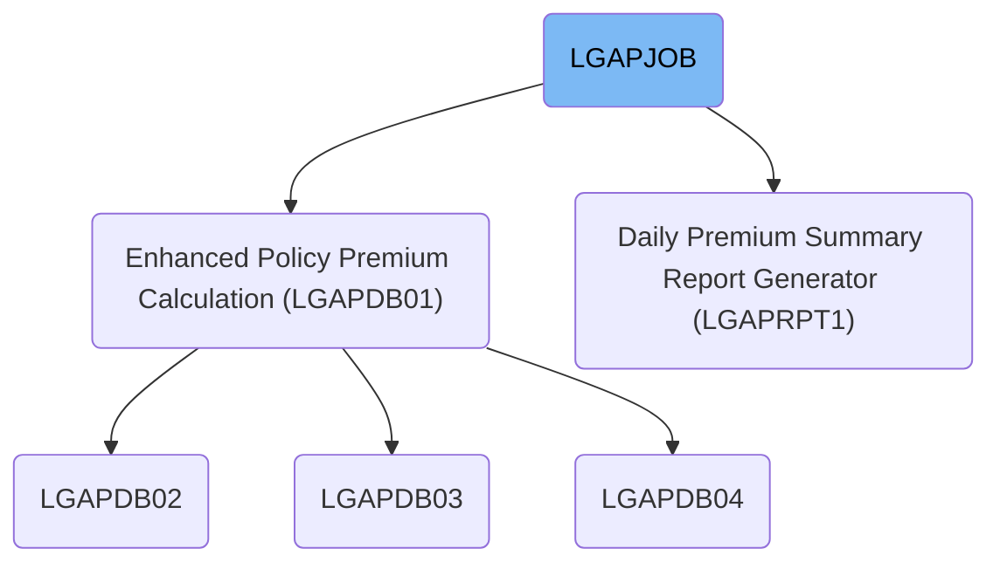
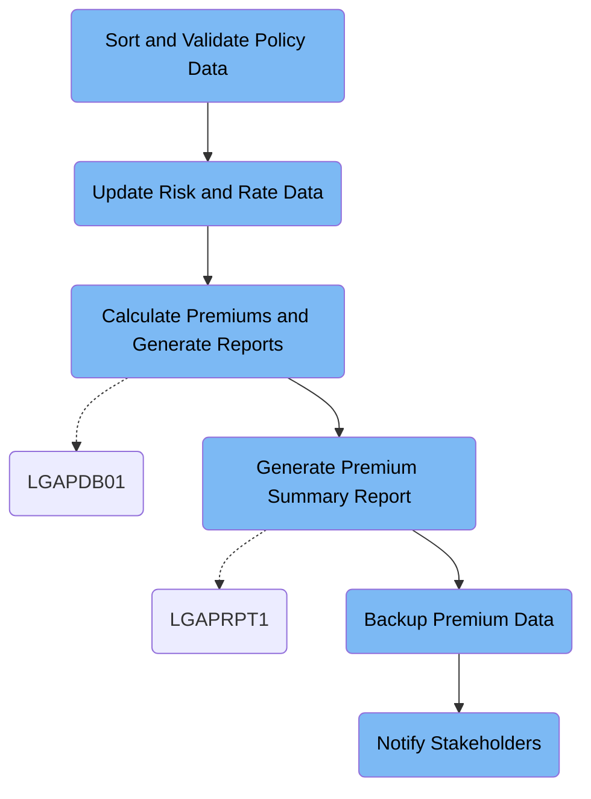

This document details the LGAPJOB batch job, which processes insurance policy applications by validating data, updating rates, calculating premiums, generating reports, backing up results, and notifying stakeholders. For example, raw policy records are converted into calculated premiums, summary reports, and backup files, with notifications sent after successful processing.

# Dependencies



Here is a high level diagram of the file:



## Sort and Validate Policy Data

Step in this section: `STEP01`.

This section organizes and validates the raw insurance policy application data, ensuring that all records are consistently ordered and ready for reliable premium calculations later in the process.

The input dataset of raw insurance policy application records is processed in the following steps:

- The step uses a sorting utility to order records based on policy number and type, providing consistent organization needed for further processing.
- The utility also rewrites records to ensure a standardized 300-character length, formatting data uniformly.
- The result is a new dataset with insurance policy data organized and validated for reliability, which is passed to the next job steps for database preparation and premium calculation.

### Input

**LGAP.INPUT.RAW.DATA (Raw Insurance Policy Data)**

Raw incoming insurance policy application records requiring organization and validation before premium calculation.

### Output

**LGAP.INPUT.SORTED (Sorted Insurance Policy Data)**

Sorted and validated insurance policy application records ready for database and premium processing steps.

## Update Risk and Rate Data

Step in this section: `STEP02`.

This section maintains accurate risk and rate data by removing outdated risk cache records and activating only those rate records currently in effect.

## Calculate Premiums and Generate Reports

Step in this section: `STEP03`.

This section applies business rules and rate table information to each insurance policy record to determine premium values, separates rejected policies, and produces summary and statistical reports for downstream analysis.

- The system reads each sorted insurance policy record from LGAP.INPUT.SORTED, interpreting policy details and coverage data.
- Configuration parameters from LGAP.CONFIG.MASTER and rates from LGAP.RATE.TABLES are loaded to apply the right business rules for each policy.
- Each policy record is validated; policies with missing or invalid data are routed to LGAP.OUTPUT.REJECTED.DATA along with an error reason.
- Valid policies are processed by applying business rules and matching the correct rates, calculating the premium amount for each policy.
- Calculated premium details for each approved policy are written to LGAP.OUTPUT.PREMIUM.DATA, while summary statistics (such as counts and totals) are compiled and sent to LGAP.OUTPUT.SUMMARY.RPT as an aggregated textual report.

### Input

**LGAP.INPUT.SORTED**

Sorted and validated insurance policy data records ready for premium calculation.

Sample:

| Column Name     | Sample     |
| --------------- | ---------- |
| POLICY_NUMBER   | 10000123   |
| POLICY_TYPE     | AUTO       |
| INSURED_NAME    | JOHN DOE   |
| COVERAGE_AMOUNT | 50000      |
| EFFECTIVE_DATE  | 2024-05-01 |

**LGAP.CONFIG.MASTER**

Configuration settings containing application rules and parameters.

**LGAP.RATE.TABLES**

Insurance rate tables used for calculating premiums on each policy.

### Output

**LGAP.OUTPUT.PREMIUM.DATA**

Calculated insurance policy premium data for each policy record.

Sample:

| Column Name     | Sample   |
| --------------- | -------- |
| POLICY_NUMBER   | 10000123 |
| PREMIUM_AMOUNT  | 462.50   |
| POLICY_TYPE     | AUTO     |
| COVERAGE_AMOUNT | 50000    |
| STATUS          | APPROVED |

**LGAP.OUTPUT.REJECTED.DATA**

Records for insurance policies that failed validation or calculation.

Sample:

| Column Name   | Sample                  |
| ------------- | ----------------------- |
| POLICY_NUMBER | 10000666                |
| ERROR_REASON  | Missing Coverage Amount |

**LGAP.OUTPUT.SUMMARY.RPT**

Processing summary report providing aggregates and statistics of premium calculation outcomes.

Sample:

```
Premium Calculation Summary
--------------------------
Total Policies Processed: 2000
Total Premiums Approved: $950,000.00
Total Policies Rejected: 22
Most Common Error: Missing Coverage Amount
```

## Generate Premium Summary Report

Step in this section: `STEP04`.

This section generates a comprehensive summary report for management, detailing key statistics and breakdowns of processed insurance premiums based on finalized policy data.

- The program reads each premium record from LGAP.OUTPUT.PREMIUM.DATA, extracting key details such as policy type, premium amount, and status.
- It categorizes the data by policy type (e.g., AUTO, HOME, LIFE) and status (e.g., APPROVED, REJECTED), accumulating totals and counts for each category.
- The program identifies highlights such as the most valuable policy and calculates overall statistics like total premiums and total count of processed policies.
- These aggregated statistics and breakdowns are formatted into a readable management report, which is then written to LGAP.REPORTS.DAILY.SUMMARY for daily review.

### Input

**LGAP.OUTPUT.PREMIUM.DATA (Finalized Insurance Premium Data)**

Contains insurance policy premium records that have been validated and calculated, including policy details and premium amounts.

Sample:

| Column Name     | Sample   |
| --------------- | -------- |
| POLICY_NUMBER   | 10000123 |
| PREMIUM_AMOUNT  | 462.50   |
| POLICY_TYPE     | AUTO     |
| COVERAGE_AMOUNT | 50000    |
| STATUS          | APPROVED |

### Output

**LGAP.REPORTS.DAILY.SUMMARY (Daily Premium Summary Report)**

Structured management report summarizing premiums processed, with totals and breakdowns by categories such as type and status.

Sample:

```
Premium Summary Report
--------------------------
Auto Policies: 1200 policies, $650,000.00
Home Policies: 500 policies, $300,000.00
Life Policies: 300 policies, $200,000.00
Total Premiums: $1,150,000.00
Most Valuable Policy: 10000555 ($10,000.00)
Approved: 1950   Rejected: 50
```

## Backup Premium Data

Step in this section: `STEP05`.

This section ensures the preservation of calculated insurance premium records by copying the finalized data to a dedicated backup dataset.

- The section reads all finalized insurance premium records from the input dataset (LGAP.OUTPUT.PREMIUM.DATA).
- Using a data copy utility, every record (e.g., policy number, premium amount, policy type, coverage amount, status) is transferred without modification.
- The exact data contents are written to the backup dataset (LGAP.BACKUP.PREMIUM.G0001V00) located on tape, ensuring a safeguarded, restorable copy.
- The backup is a bit-for-bit replica meant for secure storage and retrieval in the event of data loss or for archival needs.

### Input

**LGAP.OUTPUT.PREMIUM.DATA (Finalized Insurance Premium Data)**

File containing records of insurance policy premiums that have been validated and calculated, ready for reporting or archiving.

Sample:

| Column Name     | Sample   |
| --------------- | -------- |
| POLICY_NUMBER   | 10000123 |
| PREMIUM_AMOUNT  | 462.50   |
| POLICY_TYPE     | AUTO     |
| COVERAGE_AMOUNT | 50000    |
| STATUS          | APPROVED |

### Output

**LGAP.BACKUP.PREMIUM.G0001V00 (Backup of Insurance Premium Data)**

Tape-based backup file containing a complete copy of the finalized insurance premium data for retention and recovery.

Sample:

| Column Name     | Sample   |
| --------------- | -------- |
| POLICY_NUMBER   | 10000123 |
| PREMIUM_AMOUNT  | 462.50   |
| POLICY_TYPE     | AUTO     |
| COVERAGE_AMOUNT | 50000    |
| STATUS          | APPROVED |

## Notify Stakeholders

Step in this section: `NOTIFY`.

This section provides notification to stakeholders that insurance data processing, summary reporting, and premium data backup have been successfully completed, enabling them to take any required follow-up actions or reviews.

- The section reads the notification message from the input (SYSUT1).
- The exact contents of the input message, which detail successful job completion, report availability, and backup confirmation, are delivered line-for-line to the system's internal reader (SYSUT2).
- This process allows all designated stakeholders to receive immediate, clear notification that the insurance policy job has finalized, summary reporting is accessible, and backup for premium data has been safely created.

### Input

**SYSUT1**

Contains the notification message text to be delivered to stakeholders, describing job success, summary report location, and backup status.

Sample:

```
JOB LGAPJOB COMPLETED SUCCESSFULLY
PROCESSING SUMMARY AVAILABLE IN LGAP.OUTPUT.SUMMARY.RPT
BACKUP CREATED: LGAP.BACKUP.PREMIUM.G0001V00
```

### Output

**SYSUT2**

The output is a rendered notification message sent to the system's internal reader for stakeholder awareness.

Sample:

```
JOB LGAPJOB COMPLETED SUCCESSFULLY
PROCESSING SUMMARY AVAILABLE IN LGAP.OUTPUT.SUMMARY.RPT
BACKUP CREATED: LGAP.BACKUP.PREMIUM.G0001V00
```

&nbsp;

*This is an auto-generated document by Swimm 🌊 and has not yet been verified by a human*

<SwmMeta version="3.0.0" repo-id="Z2l0aHViJTNBJTNBY2ljcy1nZW5hcHAtZGVtbyUzQSUzQXN3aW1taW8=" repo-name="cics-genapp-demo"><sup>Powered by [Swimm](https://app.swimm.io/)</sup></SwmMeta>
