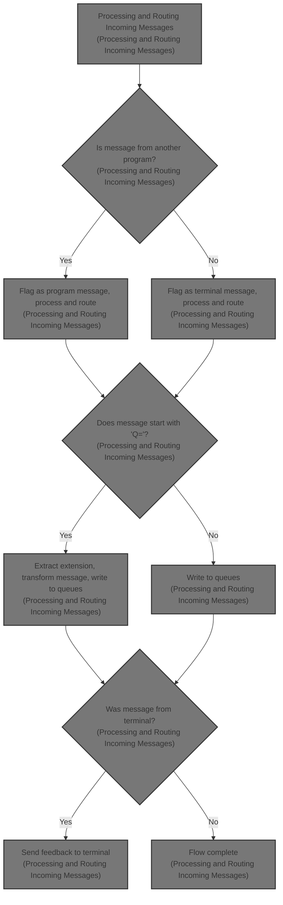

# Overview

This document describes the flow for processing and routing incoming insurance policy messages. Messages are flagged by source, transformed if needed, and routed to storage queues, with feedback sent to terminals when applicable.

## Dependencies

### Program

- LGSTSQ (<SwmPath>[base/src/lgstsq.cbl](base/src/lgstsq.cbl)</SwmPath>)

# Where is this program used?

This program is used multiple times in the codebase as represented in the following diagram:

```mermaid
graph TD
  dbl6o("Adding Customer Records (LGACVS01)") --> dhn3n("Logging to Storage Queues (LGSTSQ)"):::currentEntity
click dbl6o openCode "base/src/lgacvs01.cbl:1"
0qgqi("Adding Customer Passwords (LGACDB02)") --> dhn3n("Logging to Storage Queues (LGSTSQ)"):::currentEntity
click 0qgqi openCode "base/src/lgacdb02.cbl:1"
6ewb0("Deleting Policy Business Logic (LGDPOL01)") --> dhn3n("Logging to Storage Queues (LGSTSQ)"):::currentEntity
click 6ewb0 openCode "base/src/lgdpol01.cbl:1"
vw1w1("Deleting Policy Records (LGDPDB01)") --> dhn3n("Logging to Storage Queues (LGSTSQ)"):::currentEntity
click vw1w1 openCode "base/src/lgdpdb01.cbl:1"
xr5j9("Deleting Policy Records (LGDPVS01)") --> dhn3n("Logging to Storage Queues (LGSTSQ)"):::currentEntity
click xr5j9 openCode "base/src/lgdpvs01.cbl:1"
e8m5z("Adding Customer Business Logic (LGACUS01)") --> dhn3n("Logging to Storage Queues (LGSTSQ)"):::currentEntity
click e8m5z openCode "base/src/lgacus01.cbl:1"
phxgu("Inserting Insurance Policy Data (LGAPDB09)") --> dhn3n("Logging to Storage Queues (LGSTSQ)"):::currentEntity
click phxgu openCode "base/src/lgapdb09.cbl:1"
pp6lb("Adding Customer Details (LGACDB01)") --> dhn3n("Logging to Storage Queues (LGSTSQ)"):::currentEntity
click pp6lb openCode "base/src/lgacdb01.cbl:1"
rk39x("Inquiring Insurance Policy Details (LGIPDB01)") --> dhn3n("Logging to Storage Queues (LGSTSQ)"):::currentEntity
click rk39x openCode "base/src/lgipdb01.cbl:1"
w6dpo("Inquiring Customer Details (LGICUS01)") --> dhn3n("Logging to Storage Queues (LGSTSQ)"):::currentEntity
click w6dpo openCode "base/src/lgicus01.cbl:1"
00bfg("Inquiring Policy Details (LGIPOL01)") --> dhn3n("Logging to Storage Queues (LGSTSQ)"):::currentEntity
click 00bfg openCode "base/src/lgipol01.cbl:1"
irpqk("Inquiring Customer Details (LGICDB01)") --> dhn3n("Logging to Storage Queues (LGSTSQ)"):::currentEntity
click irpqk openCode "base/src/lgicdb01.cbl:1"
q4lq2("Updating Policy Records (LGUPVS01)") --> dhn3n("Logging to Storage Queues (LGSTSQ)"):::currentEntity
click q4lq2 openCode "base/src/lgupvs01.cbl:1"
w4d2x("Updating Policy details (LGUPOL01)") --> dhn3n("Logging to Storage Queues (LGSTSQ)"):::currentEntity
click w4d2x openCode "base/src/lgupol01.cbl:1"
qhoub("Updating Customer records (LGUCVS01)") --> dhn3n("Logging to Storage Queues (LGSTSQ)"):::currentEntity
click qhoub openCode "base/src/lgucvs01.cbl:1"
1asuu("Updating Customer Details (LGUCUS01)") --> dhn3n("Logging to Storage Queues (LGSTSQ)"):::currentEntity
click 1asuu openCode "base/src/lgucus01.cbl:1"
kqzkk("Updating Policy Details (LGUPDB01)") --> dhn3n("Logging to Storage Queues (LGSTSQ)"):::currentEntity
click kqzkk openCode "base/src/lgupdb01.cbl:1"
2ds5e("Updating Customer Details (LGUCDB01)") --> dhn3n("Logging to Storage Queues (LGSTSQ)"):::currentEntity
click 2ds5e openCode "base/src/lgucdb01.cbl:1"
3f45y("Writing Insurance Policy Records (LGAPVS01)") --> dhn3n("Logging to Storage Queues (LGSTSQ)"):::currentEntity
click 3f45y openCode "base/src/lgapvs01.cbl:1"
p6msm("Handling Insurance Policy Data Inserts (LGAPOL01)") --> dhn3n("Logging to Storage Queues (LGSTSQ)"):::currentEntity
click p6msm openCode "base/src/lgapol01.cbl:1"
  
  
click dhn3n openCode "base/src/lgstsq.cbl:1"
    classDef currentEntity color:#000000,fill:#7CB9F4

%% Swimm:
%% graph TD
%%   dbl6o("Adding Customer Records (LGACVS01)") --> dhn3n("Logging to Storage Queues (LGSTSQ)"):::currentEntity
%% click dbl6o openCode "<SwmPath>[base/src/lgacvs01.cbl](base/src/lgacvs01.cbl)</SwmPath>:1"
%% 0qgqi("Adding Customer Passwords (LGACDB02)") --> dhn3n("Logging to Storage Queues (LGSTSQ)"):::currentEntity
%% click 0qgqi openCode "<SwmPath>[base/src/lgacdb02.cbl](base/src/lgacdb02.cbl)</SwmPath>:1"
%% 6ewb0("Deleting Policy Business Logic (LGDPOL01)") --> dhn3n("Logging to Storage Queues (LGSTSQ)"):::currentEntity
%% click 6ewb0 openCode "<SwmPath>[base/src/lgdpol01.cbl](base/src/lgdpol01.cbl)</SwmPath>:1"
%% vw1w1("Deleting Policy Records (LGDPDB01)") --> dhn3n("Logging to Storage Queues (LGSTSQ)"):::currentEntity
%% click vw1w1 openCode "<SwmPath>[base/src/lgdpdb01.cbl](base/src/lgdpdb01.cbl)</SwmPath>:1"
%% xr5j9("Deleting Policy Records (LGDPVS01)") --> dhn3n("Logging to Storage Queues (LGSTSQ)"):::currentEntity
%% click xr5j9 openCode "<SwmPath>[base/src/lgdpvs01.cbl](base/src/lgdpvs01.cbl)</SwmPath>:1"
%% e8m5z("Adding Customer Business Logic (LGACUS01)") --> dhn3n("Logging to Storage Queues (LGSTSQ)"):::currentEntity
%% click e8m5z openCode "<SwmPath>[base/src/lgacus01.cbl](base/src/lgacus01.cbl)</SwmPath>:1"
%% phxgu("Inserting Insurance Policy Data (LGAPDB09)") --> dhn3n("Logging to Storage Queues (LGSTSQ)"):::currentEntity
%% click phxgu openCode "<SwmPath>[base/src/lgapdb09.cbl](base/src/lgapdb09.cbl)</SwmPath>:1"
%% pp6lb("Adding Customer Details (LGACDB01)") --> dhn3n("Logging to Storage Queues (LGSTSQ)"):::currentEntity
%% click pp6lb openCode "<SwmPath>[base/src/lgacdb01.cbl](base/src/lgacdb01.cbl)</SwmPath>:1"
%% rk39x("Inquiring Insurance Policy Details (LGIPDB01)") --> dhn3n("Logging to Storage Queues (LGSTSQ)"):::currentEntity
%% click rk39x openCode "<SwmPath>[base/src/lgipdb01.cbl](base/src/lgipdb01.cbl)</SwmPath>:1"
%% w6dpo("Inquiring Customer Details (LGICUS01)") --> dhn3n("Logging to Storage Queues (LGSTSQ)"):::currentEntity
%% click w6dpo openCode "<SwmPath>[base/src/lgicus01.cbl](base/src/lgicus01.cbl)</SwmPath>:1"
%% 00bfg("Inquiring Policy Details (LGIPOL01)") --> dhn3n("Logging to Storage Queues (LGSTSQ)"):::currentEntity
%% click 00bfg openCode "<SwmPath>[base/src/lgipol01.cbl](base/src/lgipol01.cbl)</SwmPath>:1"
%% irpqk("Inquiring Customer Details (LGICDB01)") --> dhn3n("Logging to Storage Queues (LGSTSQ)"):::currentEntity
%% click irpqk openCode "<SwmPath>[base/src/lgicdb01.cbl](base/src/lgicdb01.cbl)</SwmPath>:1"
%% q4lq2("Updating Policy Records (LGUPVS01)") --> dhn3n("Logging to Storage Queues (LGSTSQ)"):::currentEntity
%% click q4lq2 openCode "<SwmPath>[base/src/lgupvs01.cbl](base/src/lgupvs01.cbl)</SwmPath>:1"
%% w4d2x("Updating Policy details (LGUPOL01)") --> dhn3n("Logging to Storage Queues (LGSTSQ)"):::currentEntity
%% click w4d2x openCode "<SwmPath>[base/src/lgupol01.cbl](base/src/lgupol01.cbl)</SwmPath>:1"
%% qhoub("Updating Customer records (LGUCVS01)") --> dhn3n("Logging to Storage Queues (LGSTSQ)"):::currentEntity
%% click qhoub openCode "<SwmPath>[base/src/lgucvs01.cbl](base/src/lgucvs01.cbl)</SwmPath>:1"
%% 1asuu("Updating Customer Details (LGUCUS01)") --> dhn3n("Logging to Storage Queues (LGSTSQ)"):::currentEntity
%% click 1asuu openCode "<SwmPath>[base/src/lgucus01.cbl](base/src/lgucus01.cbl)</SwmPath>:1"
%% kqzkk("Updating Policy Details (LGUPDB01)") --> dhn3n("Logging to Storage Queues (LGSTSQ)"):::currentEntity
%% click kqzkk openCode "<SwmPath>[base/src/lgupdb01.cbl](base/src/lgupdb01.cbl)</SwmPath>:1"
%% 2ds5e("Updating Customer Details (LGUCDB01)") --> dhn3n("Logging to Storage Queues (LGSTSQ)"):::currentEntity
%% click 2ds5e openCode "<SwmPath>[base/src/lgucdb01.cbl](base/src/lgucdb01.cbl)</SwmPath>:1"
%% 3f45y("Writing Insurance Policy Records (LGAPVS01)") --> dhn3n("Logging to Storage Queues (LGSTSQ)"):::currentEntity
%% click 3f45y openCode "<SwmPath>[base/src/lgapvs01.cbl](base/src/lgapvs01.cbl)</SwmPath>:1"
%% p6msm("Handling Insurance Policy Data Inserts (LGAPOL01)") --> dhn3n("Logging to Storage Queues (LGSTSQ)"):::currentEntity
%% click p6msm openCode "<SwmPath>[base/src/lgapol01.cbl](base/src/lgapol01.cbl)</SwmPath>:1"
%%   
%%   
%% click dhn3n openCode "<SwmPath>[base/src/lgstsq.cbl](base/src/lgstsq.cbl)</SwmPath>:1"
%%     classDef currentEntity color:#000000,fill:#7CB9F4
```

&nbsp;

*This is an auto-generated document by Swimm 🌊 and has not yet been verified by a human*

<SwmMeta version="3.0.0" repo-id="Z2l0aHViJTNBJTNBY2ljcy1nZW5hcHAtZGVtbyUzQSUzQXN3aW1taW8=" repo-name="cics-genapp-demo">Powered by [Swimm](https://app.swimm.io/)</SwmMeta>
