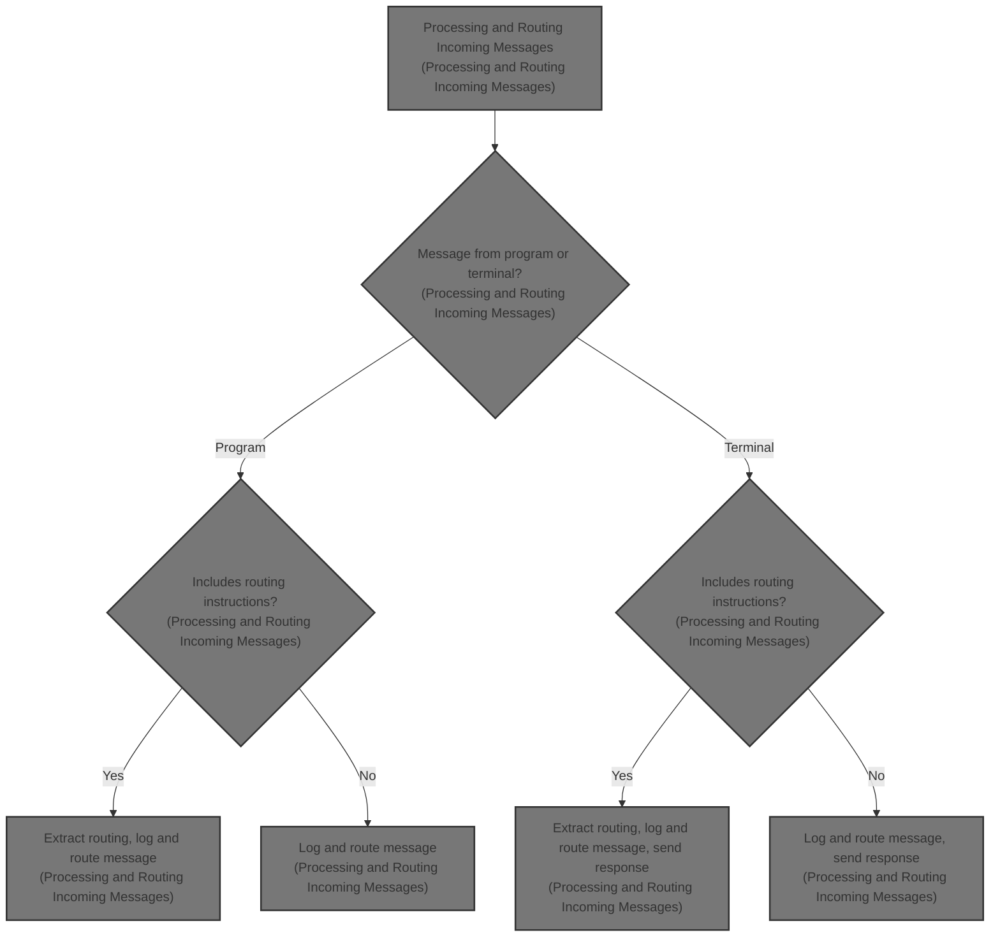

# Overview

This document describes the flow for processing and routing incoming messages. Messages from user terminals or other programs are identified, formatted, logged for audit and monitoring, and routed to the appropriate storage queue. Terminal-originated messages receive a response.



## Dependencies

### Program

- LGSTSQ (<SwmPath>[base/src/lgstsq.cbl](base/src/lgstsq.cbl)</SwmPath>)

# Where is this program used?

This program is used multiple times in the codebase as represented in the following diagram:

```mermaid
graph TD
  fmm4m("Adding Customer Records (LGACVS01)") --> 84494("Logging to Storage Queues (LGSTSQ)"):::currentEntity
click fmm4m openCode "base/src/lgacvs01.cbl:1"
bh33b("Adding Customer Passwords (LGACDB02)") --> 84494("Logging to Storage Queues (LGSTSQ)"):::currentEntity
click bh33b openCode "base/src/lgacdb02.cbl:1"
79f8c("Deleting Policy Business Logic (LGDPOL01)") --> 84494("Logging to Storage Queues (LGSTSQ)"):::currentEntity
click 79f8c openCode "base/src/lgdpol01.cbl:1"
bkmvg("Deleting Policy Records (LGDPDB01)") --> 84494("Logging to Storage Queues (LGSTSQ)"):::currentEntity
click bkmvg openCode "base/src/lgdpdb01.cbl:1"
60xrs("Deleting Policy Records (LGDPVS01)") --> 84494("Logging to Storage Queues (LGSTSQ)"):::currentEntity
click 60xrs openCode "base/src/lgdpvs01.cbl:1"
9mjgz("Adding Customer Business Logic (LGACUS01)") --> 84494("Logging to Storage Queues (LGSTSQ)"):::currentEntity
click 9mjgz openCode "base/src/lgacus01.cbl:1"
4e255("Inserting Insurance Policy Data (LGAPDB09)") --> 84494("Logging to Storage Queues (LGSTSQ)"):::currentEntity
click 4e255 openCode "base/src/lgapdb09.cbl:1"
znks4("Adding Customer Details (LGACDB01)") --> 84494("Logging to Storage Queues (LGSTSQ)"):::currentEntity
click znks4 openCode "base/src/lgacdb01.cbl:1"
u0g3i("Inquiring Insurance Policy Details (LGIPDB01)") --> 84494("Logging to Storage Queues (LGSTSQ)"):::currentEntity
click u0g3i openCode "base/src/lgipdb01.cbl:1"
ghp3l("Inquiring Customer Details (LGICUS01)") --> 84494("Logging to Storage Queues (LGSTSQ)"):::currentEntity
click ghp3l openCode "base/src/lgicus01.cbl:1"
wp220("Inquiring Policy Details (LGIPOL01)") --> 84494("Logging to Storage Queues (LGSTSQ)"):::currentEntity
click wp220 openCode "base/src/lgipol01.cbl:1"
ouvzs("Inquiring Customer Details (LGICDB01)") --> 84494("Logging to Storage Queues (LGSTSQ)"):::currentEntity
click ouvzs openCode "base/src/lgicdb01.cbl:1"
zpex8("Updating Policy Records (LGUPVS01)") --> 84494("Logging to Storage Queues (LGSTSQ)"):::currentEntity
click zpex8 openCode "base/src/lgupvs01.cbl:1"
w1be4("Updating Policy details (LGUPOL01)") --> 84494("Logging to Storage Queues (LGSTSQ)"):::currentEntity
click w1be4 openCode "base/src/lgupol01.cbl:1"
oeul3("Updating Customer records (LGUCVS01)") --> 84494("Logging to Storage Queues (LGSTSQ)"):::currentEntity
click oeul3 openCode "base/src/lgucvs01.cbl:1"
o7ysu("Updating Customer Details (LGUCUS01)") --> 84494("Logging to Storage Queues (LGSTSQ)"):::currentEntity
click o7ysu openCode "base/src/lgucus01.cbl:1"
f8p16("Updating Policy Details (LGUPDB01)") --> 84494("Logging to Storage Queues (LGSTSQ)"):::currentEntity
click f8p16 openCode "base/src/lgupdb01.cbl:1"
tr2uy("Updating Customer Details (LGUCDB01)") --> 84494("Logging to Storage Queues (LGSTSQ)"):::currentEntity
click tr2uy openCode "base/src/lgucdb01.cbl:1"
pl11f("Writing Insurance Policy Records (LGAPVS01)") --> 84494("Logging to Storage Queues (LGSTSQ)"):::currentEntity
click pl11f openCode "base/src/lgapvs01.cbl:1"
17t2s("Handling Insurance Policy Data Inserts (LGAPOL01)") --> 84494("Logging to Storage Queues (LGSTSQ)"):::currentEntity
click 17t2s openCode "base/src/lgapol01.cbl:1"
  
  
click 84494 openCode "base/src/lgstsq.cbl:1"
    classDef currentEntity color:#000000,fill:#7CB9F4

%% Swimm:
%% graph TD
%%   fmm4m("Adding Customer Records (LGACVS01)") --> 84494("Logging to Storage Queues (LGSTSQ)"):::currentEntity
%% click fmm4m openCode "<SwmPath>[base/src/lgacvs01.cbl](base/src/lgacvs01.cbl)</SwmPath>:1"
%% bh33b("Adding Customer Passwords (LGACDB02)") --> 84494("Logging to Storage Queues (LGSTSQ)"):::currentEntity
%% click bh33b openCode "<SwmPath>[base/src/lgacdb02.cbl](base/src/lgacdb02.cbl)</SwmPath>:1"
%% 79f8c("Deleting Policy Business Logic (LGDPOL01)") --> 84494("Logging to Storage Queues (LGSTSQ)"):::currentEntity
%% click 79f8c openCode "<SwmPath>[base/src/lgdpol01.cbl](base/src/lgdpol01.cbl)</SwmPath>:1"
%% bkmvg("Deleting Policy Records (LGDPDB01)") --> 84494("Logging to Storage Queues (LGSTSQ)"):::currentEntity
%% click bkmvg openCode "<SwmPath>[base/src/lgdpdb01.cbl](base/src/lgdpdb01.cbl)</SwmPath>:1"
%% 60xrs("Deleting Policy Records (LGDPVS01)") --> 84494("Logging to Storage Queues (LGSTSQ)"):::currentEntity
%% click 60xrs openCode "<SwmPath>[base/src/lgdpvs01.cbl](base/src/lgdpvs01.cbl)</SwmPath>:1"
%% 9mjgz("Adding Customer Business Logic (LGACUS01)") --> 84494("Logging to Storage Queues (LGSTSQ)"):::currentEntity
%% click 9mjgz openCode "<SwmPath>[base/src/lgacus01.cbl](base/src/lgacus01.cbl)</SwmPath>:1"
%% 4e255("Inserting Insurance Policy Data (LGAPDB09)") --> 84494("Logging to Storage Queues (LGSTSQ)"):::currentEntity
%% click 4e255 openCode "<SwmPath>[base/src/lgapdb09.cbl](base/src/lgapdb09.cbl)</SwmPath>:1"
%% znks4("Adding Customer Details (LGACDB01)") --> 84494("Logging to Storage Queues (LGSTSQ)"):::currentEntity
%% click znks4 openCode "<SwmPath>[base/src/lgacdb01.cbl](base/src/lgacdb01.cbl)</SwmPath>:1"
%% u0g3i("Inquiring Insurance Policy Details (LGIPDB01)") --> 84494("Logging to Storage Queues (LGSTSQ)"):::currentEntity
%% click u0g3i openCode "<SwmPath>[base/src/lgipdb01.cbl](base/src/lgipdb01.cbl)</SwmPath>:1"
%% ghp3l("Inquiring Customer Details (LGICUS01)") --> 84494("Logging to Storage Queues (LGSTSQ)"):::currentEntity
%% click ghp3l openCode "<SwmPath>[base/src/lgicus01.cbl](base/src/lgicus01.cbl)</SwmPath>:1"
%% wp220("Inquiring Policy Details (LGIPOL01)") --> 84494("Logging to Storage Queues (LGSTSQ)"):::currentEntity
%% click wp220 openCode "<SwmPath>[base/src/lgipol01.cbl](base/src/lgipol01.cbl)</SwmPath>:1"
%% ouvzs("Inquiring Customer Details (LGICDB01)") --> 84494("Logging to Storage Queues (LGSTSQ)"):::currentEntity
%% click ouvzs openCode "<SwmPath>[base/src/lgicdb01.cbl](base/src/lgicdb01.cbl)</SwmPath>:1"
%% zpex8("Updating Policy Records (LGUPVS01)") --> 84494("Logging to Storage Queues (LGSTSQ)"):::currentEntity
%% click zpex8 openCode "<SwmPath>[base/src/lgupvs01.cbl](base/src/lgupvs01.cbl)</SwmPath>:1"
%% w1be4("Updating Policy details (LGUPOL01)") --> 84494("Logging to Storage Queues (LGSTSQ)"):::currentEntity
%% click w1be4 openCode "<SwmPath>[base/src/lgupol01.cbl](base/src/lgupol01.cbl)</SwmPath>:1"
%% oeul3("Updating Customer records (LGUCVS01)") --> 84494("Logging to Storage Queues (LGSTSQ)"):::currentEntity
%% click oeul3 openCode "<SwmPath>[base/src/lgucvs01.cbl](base/src/lgucvs01.cbl)</SwmPath>:1"
%% o7ysu("Updating Customer Details (LGUCUS01)") --> 84494("Logging to Storage Queues (LGSTSQ)"):::currentEntity
%% click o7ysu openCode "<SwmPath>[base/src/lgucus01.cbl](base/src/lgucus01.cbl)</SwmPath>:1"
%% f8p16("Updating Policy Details (LGUPDB01)") --> 84494("Logging to Storage Queues (LGSTSQ)"):::currentEntity
%% click f8p16 openCode "<SwmPath>[base/src/lgupdb01.cbl](base/src/lgupdb01.cbl)</SwmPath>:1"
%% tr2uy("Updating Customer Details (LGUCDB01)") --> 84494("Logging to Storage Queues (LGSTSQ)"):::currentEntity
%% click tr2uy openCode "<SwmPath>[base/src/lgucdb01.cbl](base/src/lgucdb01.cbl)</SwmPath>:1"
%% pl11f("Writing Insurance Policy Records (LGAPVS01)") --> 84494("Logging to Storage Queues (LGSTSQ)"):::currentEntity
%% click pl11f openCode "<SwmPath>[base/src/lgapvs01.cbl](base/src/lgapvs01.cbl)</SwmPath>:1"
%% 17t2s("Handling Insurance Policy Data Inserts (LGAPOL01)") --> 84494("Logging to Storage Queues (LGSTSQ)"):::currentEntity
%% click 17t2s openCode "<SwmPath>[base/src/lgapol01.cbl](base/src/lgapol01.cbl)</SwmPath>:1"
%%   
%%   
%% click 84494 openCode "<SwmPath>[base/src/lgstsq.cbl](base/src/lgstsq.cbl)</SwmPath>:1"
%%     classDef currentEntity color:#000000,fill:#7CB9F4
```



## Detailed View of the Program's Functionality

a. Initialization and Context Setup

The program begins by clearing out the message and receive buffers to ensure no leftover data from previous operations. It then retrieves the system identifier and the name of the program that invoked this routine. This setup is crucial for determining how the incoming message should be processed—whether it was triggered by another program or by direct user input from a terminal.

b. Determining Message Source

Next, the program checks if it was invoked by another program or by a user at a terminal. If it was invoked by another program, it sets an internal flag to indicate this, copies the incoming data from the communication area into the message buffer, and records the length of the data received. If it was not invoked by another program (i.e., it was invoked from a terminal), it receives the message from the terminal, sets a different flag to indicate this, copies the received data into the message buffer, and adjusts the recorded length to account for the structure of the received data.

c. Queue Name Assignment and Message Routing

The program sets a default queue name for message storage. It then checks if the message begins with a specific prefix ("Q="). If this prefix is present, it extracts the next four characters as an extension for the queue name, removes the prefix and extension from the message, and adjusts the message length accordingly. This allows for dynamic routing of messages to different queues based on the content of the message.

d. Logging the Message

The program increases the message length to account for additional data, then writes the message to a system-defined queue for logging purposes. This step ensures that all messages are recorded for auditing or monitoring, regardless of their source or content.

e. Storing the Message in Temporary Storage

After logging, the program attempts to write the message to a temporary storage queue, which is used for further processing or retrieval. If there is no space available in the queue, the program does not wait for space to become available; instead, it skips the storage step to maintain performance and avoid delays.

f. Responding to the Terminal (if applicable)

If the message was received from a terminal, the program sends a minimal response back to the terminal, erases the screen, and frees the keyboard for further input. This provides immediate feedback to the user and prepares the terminal for the next operation.

g. Program Termination

Finally, the program returns control to the caller, completing the processing of the message. If the message was received from another program, no response is sent; if it was from a terminal, the response has already been handled in the previous step. The program then exits cleanly.

# Rule Definition

| Paragraph Name   | Rule ID | Category          | Description                                                                                                                                                                                                                             | Conditions                                                                                                      | Remarks                                                                                                                                                                                                               |
| ---------------- | ------- | ----------------- | --------------------------------------------------------------------------------------------------------------------------------------------------------------------------------------------------------------------------------------- | --------------------------------------------------------------------------------------------------------------- | --------------------------------------------------------------------------------------------------------------------------------------------------------------------------------------------------------------------- |
| MAINLINE SECTION | RL-001  | Data Assignment   | Before processing any message, the system clears the message and receive buffers to ensure no residual data affects the current operation.                                                                                              | Always applies at the start of message processing.                                                              | Buffers are set to all spaces. The message buffer is 95 bytes (system ID + space + message payload), the receive buffer is 79 bytes (transaction ID + data).                                                          |
| MAINLINE SECTION | RL-002  | Conditional Logic | The system checks if the invoking program name is blank to determine if the message is from a terminal or another program, and sets a flag accordingly.                                                                                 | If invoking program name is not blank, message is from another program; otherwise, from terminal.               | Flag is set to 'C' for program, 'R' for terminal. Invoking program name is 8 characters, blank means terminal.                                                                                                        |
| MAINLINE SECTION | RL-003  | Conditional Logic | The system assigns the default queue name for message storage, and if the message payload starts with 'Q=', extracts the extension and modifies the queue name accordingly.                                                             | Always assign default queue name; if message payload starts with 'Q=', extract extension and adjust queue name. | Default queue name is 'GENAERRS' (8 characters). If 'Q=' is present, next 4 characters are used as extension, resulting in queue name 'GENAxxxx'. The 'Q=' and extension (7 characters) are removed from the payload. |
| MAINLINE SECTION | RL-004  | Computation       | The message length is increased by 5 before writing to any queue to account for additional data.                                                                                                                                        | Always applies before writing to queues.                                                                        | Message length is increased by 5 bytes. This applies regardless of source or queue name.                                                                                                                              |
| MAINLINE SECTION | RL-005  | Conditional Logic | The system writes the message (including system ID and payload) to both a transient data queue for logging and a temporary storage queue for storage. If the storage queue is full, the message is not stored but processing continues. | Always applies after message preparation and length adjustment.                                                 | Logging queue name is 'CSMT' (4 characters). Storage queue name is determined as above. Message includes system ID (4 bytes), a space (1 byte), and payload (up to 90 bytes).                                         |
| MAINLINE SECTION | RL-006  | Conditional Logic | If the message was received from a terminal, the system sends a single blank character as output to the terminal, with options to erase the screen and free the keyboard.                                                               | Flag is 'R' (message from terminal).                                                                            | Output is a single blank character (1 byte), with options to erase screen and free keyboard.                                                                                                                          |
| MAINLINE SECTION | RL-007  | Conditional Logic | If the message was invoked by another program, no output is sent to the terminal.                                                                                                                                                       | Flag is 'C' (message from another program).                                                                     | No output is sent to terminal.                                                                                                                                                                                        |

# User Stories

## User Story 1: Message Reception and Preparation

---

### Story Description:

As a system, I want to clear buffers, determine the message source, set the appropriate flag, and prepare the message and receive buffers so that each incoming message is processed accurately and without residual data.

---

### Business Rule Mapping:

| Rule ID | Paragraph Name   | Rule Description                                                                                                                                        |
| ------- | ---------------- | ------------------------------------------------------------------------------------------------------------------------------------------------------- |
| RL-001  | MAINLINE SECTION | Before processing any message, the system clears the message and receive buffers to ensure no residual data affects the current operation.              |
| RL-002  | MAINLINE SECTION | The system checks if the invoking program name is blank to determine if the message is from a terminal or another program, and sets a flag accordingly. |

---

### Relevant Functionality:

- **MAINLINE SECTION**
  1. **RL-001:**
     - Set message buffer to all spaces
     - Set receive buffer to all spaces
  2. **RL-002:**
     - If invoking program name is not blank:
       - Set flag to 'C'
       - Use commarea data as message payload
       - Set message length to commarea length
     - Else:
       - Set flag to 'R'
       - Receive message into buffer
       - Move data portion (excluding transaction ID) into message buffer
       - Set message length to received length minus 5

## User Story 2: Message Routing, Adjustment, and Storage

---

### Story Description:

As a system, I want to assign the correct queue name for message storage, extract any queue extension from the payload, remove routing information from the payload, adjust the message length, and write the processed message to both a logging queue and a storage queue (handling full queues gracefully), so that messages are routed, logged, and stored correctly and reliably.

---

### Business Rule Mapping:

| Rule ID | Paragraph Name   | Rule Description                                                                                                                                                                                                                        |
| ------- | ---------------- | --------------------------------------------------------------------------------------------------------------------------------------------------------------------------------------------------------------------------------------- |
| RL-003  | MAINLINE SECTION | The system assigns the default queue name for message storage, and if the message payload starts with 'Q=', extracts the extension and modifies the queue name accordingly.                                                             |
| RL-004  | MAINLINE SECTION | The message length is increased by 5 before writing to any queue to account for additional data.                                                                                                                                        |
| RL-005  | MAINLINE SECTION | The system writes the message (including system ID and payload) to both a transient data queue for logging and a temporary storage queue for storage. If the storage queue is full, the message is not stored but processing continues. |

---

### Relevant Functionality:

- **MAINLINE SECTION**
  1. **RL-003:**
     - Set queue name to 'GENAERRS'
     - If message payload starts with 'Q=':
       - Extract next 4 characters as extension
       - Set queue name to 'GENA' + extension
       - Remove 'Q=' and extension from payload
       - Subtract 7 from message length
  2. **RL-004:**
     - Add 5 to message length
  3. **RL-005:**
     - Write message to transient data queue 'CSMT' for logging
     - Write message to temporary storage queue with determined name
       - If queue is full, do not store message, continue processing

## User Story 3: Output Handling Based on Message Source

---

### Story Description:

As a user interacting with the system, I want to receive appropriate output (a blank character with screen erase and keyboard free options if from a terminal, or no output if invoked by another program) so that the system responds correctly based on how the message was received.

---

### Business Rule Mapping:

| Rule ID | Paragraph Name   | Rule Description                                                                                                                                                          |
| ------- | ---------------- | ------------------------------------------------------------------------------------------------------------------------------------------------------------------------- |
| RL-006  | MAINLINE SECTION | If the message was received from a terminal, the system sends a single blank character as output to the terminal, with options to erase the screen and free the keyboard. |
| RL-007  | MAINLINE SECTION | If the message was invoked by another program, no output is sent to the terminal.                                                                                         |

---

### Relevant Functionality:

- **MAINLINE SECTION**
  1. **RL-006:**
     - If flag is 'R':
       - Send single blank character to terminal
       - Set options to erase screen and free keyboard
  2. **RL-007:**
     - If flag is 'C':
       - Do not send any output to terminal

# Workflow

# Processing and Routing Incoming Messages

```mermaid
%%{init: {"flowchart": {"defaultRenderer": "elk"}} }%%
flowchart TD
  node1["Start: Prepare message and get system info"] --> node2{"Was message invoked by another program?"}
  click node1 openCode "base/src/lgstsq.cbl:55:66"
  node2 -->|"Yes"| node3["Set flag 'C', use program data as message"]
  click node2 openCode "base/src/lgstsq.cbl:68:72"
  node2 -->|"No"| node4["Set flag 'R', receive message from terminal"]
  click node3 openCode "base/src/lgstsq.cbl:68:72"
  click node4 openCode "base/src/lgstsq.cbl:73:80"
  node3 --> node5["Set queue name to 'GENAERRS'"]
  node4 --> node5
  click node5 openCode "base/src/lgstsq.cbl:82:82"
  node5 --> node6{"Does message start with 'Q='?"}
  click node6 openCode "base/src/lgstsq.cbl:83:88"
  node6 -->|"Yes"| node7["Extract extension, transform message, adjust length"]
  click node7 openCode "base/src/lgstsq.cbl:84:88"
  node6 -->|"No"| node8["Continue with message, adjust length"]
  click node8 openCode "base/src/lgstsq.cbl:90:99"
  node7 --> node9["Write message to TDQ (logging) and TSQ (storage)"]
  node8 --> node9
  click node9 openCode "base/src/lgstsq.cbl:90:111"
  node9 --> node10{"Was message received from terminal?"}
  click node10 openCode "base/src/lgstsq.cbl:113:113"
  node10 -->|"Yes"| node11["Send output to terminal"]
  click node11 openCode "base/src/lgstsq.cbl:114:119"
  node10 -->|"No"| node12["End"]
  node11 --> node12
  click node12 openCode "base/src/lgstsq.cbl:121:122"
classDef HeadingStyle fill:#777777,stroke:#333,stroke-width:2px;

%% Swimm:
%% %%{init: {"flowchart": {"defaultRenderer": "elk"}} }%%
%% flowchart TD
%%   node1["Start: Prepare message and get system info"] --> node2{"Was message invoked by another program?"}
%%   click node1 openCode "<SwmPath>[base/src/lgstsq.cbl](base/src/lgstsq.cbl)</SwmPath>:55:66"
%%   node2 -->|"Yes"| node3["Set flag 'C', use program data as message"]
%%   click node2 openCode "<SwmPath>[base/src/lgstsq.cbl](base/src/lgstsq.cbl)</SwmPath>:68:72"
%%   node2 -->|"No"| node4["Set flag 'R', receive message from terminal"]
%%   click node3 openCode "<SwmPath>[base/src/lgstsq.cbl](base/src/lgstsq.cbl)</SwmPath>:68:72"
%%   click node4 openCode "<SwmPath>[base/src/lgstsq.cbl](base/src/lgstsq.cbl)</SwmPath>:73:80"
%%   node3 --> node5["Set queue name to 'GENAERRS'"]
%%   node4 --> node5
%%   click node5 openCode "<SwmPath>[base/src/lgstsq.cbl](base/src/lgstsq.cbl)</SwmPath>:82:82"
%%   node5 --> node6{"Does message start with 'Q='?"}
%%   click node6 openCode "<SwmPath>[base/src/lgstsq.cbl](base/src/lgstsq.cbl)</SwmPath>:83:88"
%%   node6 -->|"Yes"| node7["Extract extension, transform message, adjust length"]
%%   click node7 openCode "<SwmPath>[base/src/lgstsq.cbl](base/src/lgstsq.cbl)</SwmPath>:84:88"
%%   node6 -->|"No"| node8["Continue with message, adjust length"]
%%   click node8 openCode "<SwmPath>[base/src/lgstsq.cbl](base/src/lgstsq.cbl)</SwmPath>:90:99"
%%   node7 --> node9["Write message to TDQ (logging) and TSQ (storage)"]
%%   node8 --> node9
%%   click node9 openCode "<SwmPath>[base/src/lgstsq.cbl](base/src/lgstsq.cbl)</SwmPath>:90:111"
%%   node9 --> node10{"Was message received from terminal?"}
%%   click node10 openCode "<SwmPath>[base/src/lgstsq.cbl](base/src/lgstsq.cbl)</SwmPath>:113:113"
%%   node10 -->|"Yes"| node11["Send output to terminal"]
%%   click node11 openCode "<SwmPath>[base/src/lgstsq.cbl](base/src/lgstsq.cbl)</SwmPath>:114:119"
%%   node10 -->|"No"| node12["End"]
%%   node11 --> node12
%%   click node12 openCode "<SwmPath>[base/src/lgstsq.cbl](base/src/lgstsq.cbl)</SwmPath>:121:122"
%% classDef HeadingStyle fill:#777777,stroke:#333,stroke-width:2px;
```



This section governs how incoming messages are processed and routed within the insurance application. It ensures messages are correctly identified, formatted, logged, and routed based on their origin and content, supporting both programmatic and user-driven workflows.

| Category       | Rule Name                    | Description                                                                                                                                                        |
| -------------- | ---------------------------- | ------------------------------------------------------------------------------------------------------------------------------------------------------------------ |
| Business logic | Program invocation flagging  | If the message originates from another program, it is flagged as a 'C' type message and the program data is used as the message content.                           |
| Business logic | Terminal input flagging      | If the message originates from a user terminal, it is flagged as an 'R' type message and the received terminal data is used as the message content.                |
| Business logic | Queue assignment             | All messages are assigned to the queue named 'GENAERRS' for temporary storage and routing.                                                                         |
| Business logic | Routing extension extraction | If the message starts with 'Q=', the next four characters are extracted as a routing extension, and the message length is adjusted to exclude routing information. |
| Business logic | Message logging              | All processed messages are logged to a system queue for audit and monitoring purposes.                                                                             |
| Business logic | Terminal response handling   | If the message was received from a terminal, a short response is sent back to the user; otherwise, no response is sent.                                            |

<SwmSnippet path="/base/src/lgstsq.cbl" line="55">

---

In MAINLINE, we start by clearing out the message and receive buffers, then grab the system ID and the name of the invoking program. This sets up the context for how the rest of the message will be processed, depending on whether we're being called directly or not.

```cobol
       MAINLINE SECTION.

           MOVE SPACES TO WRITE-MSG.
           MOVE SPACES TO WS-RECV.

           EXEC CICS ASSIGN SYSID(WRITE-MSG-SYSID)
                RESP(WS-RESP)
           END-EXEC.

           EXEC CICS ASSIGN INVOKINGPROG(WS-INVOKEPROG)
                RESP(WS-RESP)
           END-EXEC.
```

---

</SwmSnippet>

<SwmSnippet path="/base/src/lgstsq.cbl" line="68">

---

We decide if the message comes from another program or from user input, and set flags so later steps know how to handle it.

```cobol
           IF WS-INVOKEPROG NOT = SPACES
              MOVE 'C' To WS-FLAG
              MOVE COMMA-DATA  TO WRITE-MSG-MSG
              MOVE EIBCALEN    TO WS-RECV-LEN
           ELSE
              EXEC CICS RECEIVE INTO(WS-RECV)
                  LENGTH(WS-RECV-LEN)
                  RESP(WS-RESP)
              END-EXEC
              MOVE 'R' To WS-FLAG
              MOVE WS-RECV-DATA  TO WRITE-MSG-MSG
              SUBTRACT 5 FROM WS-RECV-LEN
           END-IF.
```

---

</SwmSnippet>

<SwmSnippet path="/base/src/lgstsq.cbl" line="82">

---

If the message starts with 'Q=', we grab the next four characters for routing (<SwmToken path="base/src/lgstsq.cbl" pos="84:16:18" line-data="              MOVE WRITE-MSG-MSG(3:4) TO STSQ-EXT">`STSQ-EXT`</SwmToken>), strip them out, and shorten the message length. This makes sure only the actual payload gets processed and routed correctly.

```cobol
           MOVE 'GENAERRS' TO STSQ-NAME.
           IF WRITE-MSG-MSG(1:2) = 'Q=' THEN
              MOVE WRITE-MSG-MSG(3:4) TO STSQ-EXT
              MOVE WRITE-MSG-REST TO TEMPO
              MOVE TEMPO          TO WRITE-MSG-MSG
              SUBTRACT 7 FROM WS-RECV-LEN
           END-IF.
```

---

</SwmSnippet>

<SwmSnippet path="/base/src/lgstsq.cbl" line="90">

---

We log the message to a system queue so it's available for audit or monitoring.

```cobol
           ADD 5 TO WS-RECV-LEN.

      * Write output message to TDQ CSMT
      *
           EXEC CICS WRITEQ TD QUEUE(STDQ-NAME)
                     FROM(WRITE-MSG)
                     RESP(WS-RESP)
                     LENGTH(WS-RECV-LEN)

           END-EXEC.
```

---

</SwmSnippet>

<SwmSnippet path="/base/src/lgstsq.cbl" line="105">

---

Next we write the message to a temporary storage queue, but if there's no space, we skip it instead of waiting. This keeps things moving fast, but means some messages might not get stored if the queue is full.

```cobol
           EXEC CICS WRITEQ TS QUEUE(STSQ-NAME)
                     FROM(WRITE-MSG)
                     RESP(WS-RESP)
                     NOSUSPEND
                     LENGTH(WS-RECV-LEN)

           END-EXEC.
```

---

</SwmSnippet>

<SwmSnippet path="/base/src/lgstsq.cbl" line="113">

---

Finally, if the message was received from a terminal, we send a short response and free up some memory. If it was called by another program, we just return without sending anything.

```cobol
           If WS-FLAG = 'R' Then
             EXEC CICS SEND TEXT FROM(FILLER-X)
              WAIT
              ERASE
              LENGTH(1)
              FREEKB
             END-EXEC.

           EXEC CICS RETURN
           END-EXEC.
```

---

</SwmSnippet>

&nbsp;

*This is an auto-generated document by Swimm 🌊 and has not yet been verified by a human*

<SwmMeta version="3.0.0" repo-id="Z2l0aHViJTNBJTNBY2ljcy1nZW5hcHAtZGVtbyUzQSUzQXN3aW1taW8=" repo-name="cics-genapp-demo"><sup>Powered by [Swimm](https://app.swimm.io/)</sup></SwmMeta>
