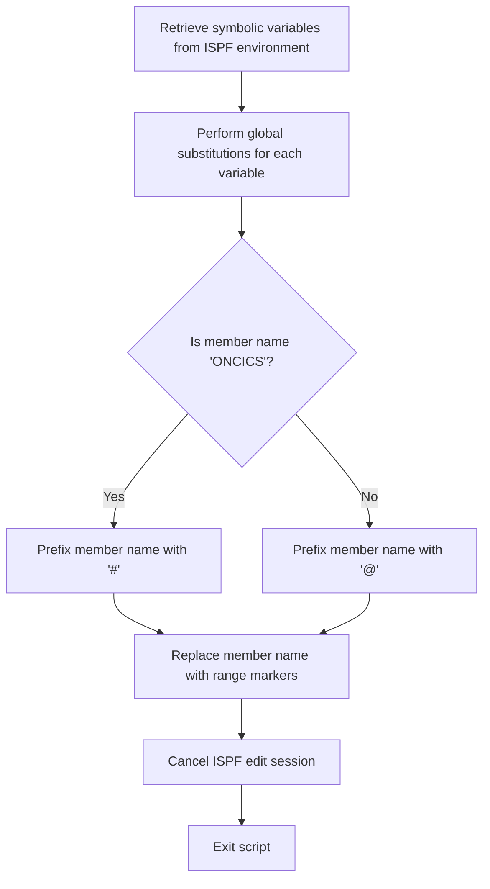

# What the script does

The mac1 Rexx script is designed to perform a series of text substitutions within an ISPF editor session. It retrieves a set of predefined symbolic variables from the environment and then systematically replaces placeholder tokens in the current member being edited with their corresponding values. This process effectively customizes or configures the source code or text by replacing generic placeholders with actual dataset names, system IDs, and other environment-specific values. For example, if the source contains the placeholder <CICSHLQ>, the script replaces it with the actual high-level qualifier value for the CICS environment.

# Script Flow

The script flow can be broken down into the following main steps:

- Retrieve multiple symbolic variables from the ISPF environment using ISPEXEC VGET commands.
- For each symbolic variable, perform a global search and replace in the current ISPF editor member, substituting the placeholder token with the actual variable value.
- Adjust the member name prefix conditionally if it matches a specific value.
- Replace occurrences of the member name with a range of markers to facilitate further processing.
- Finally, cancel the ISPF edit session and exit the script.



<SwmSnippet path="/base/exec/mac1.rexx" line="6">

---

First, the script sets the address environment to ISPEXEC to enable ISPF command execution and issues a trace command for debugging purposes.

```rexx
Address Ispexec
"Isredit Macro (TRACE)"

```

---

</SwmSnippet>

<SwmSnippet path="/base/exec/mac1.rexx" line="9">

---

Next, the script retrieves a comprehensive list of symbolic variables from the ISPF environment using multiple ISPEXEC VGET commands. These variables include dataset high-level qualifiers, system IDs, DB2 environment details, and various application-specific identifiers.

```rexx
"ISPEXEC VGET (CICSHLQ CPSMHLQ CICSLIC USRHLQ COBOLHLQ DB2HLQ CEEHLQ)"
"ISPEXEC VGET (CSDNAME DB2RUN SQLID DB2SSID DB2DBID DB2CCSID DB2PLAN)"
"ISPEXEC VGET (TORAPPL AORAPPL DORAPPL TORSYSID AORSYSID DORSYSID)"
"ISPEXEC VGET (CMASAPPL CMASYSID WUIAPPL WUISYSID WSIMHLQ)"
"ISPEXEC VGET (PDSDBRM PDSMACP PDSLOAD PDSMSGS WSIMLOG WSIMSTL)"
"ISPEXEC VGET (KSDSCUS KSDSPOL SOURCEX LOADX MAPCOPX DBRMLIX)"
"ISPEXEC VGET (WSIMLGX WSIMWSX WSIMMSX ZFSHOME)"
```

---

</SwmSnippet>

<SwmSnippet path="/base/exec/mac1.rexx" line="16">

---

Then, the script performs a series of global search-and-replace operations within the current ISPF editor member. For each symbolic variable retrieved, it replaces all occurrences of the corresponding placeholder token (e.g., <CICSHLQ>) with the actual value of that variable. This is done using the ISREDIT CHANGE command with the 'All' option to affect the entire member.

```rexx
"Isredit Change '<CICSHLQ>' '"CICSHLQ"' All"
"Isredit Change '<CPSMHLQ>' '"CPSMHLQ"' All"
"Isredit Change '<CICSLIC>' '"CICSLIC"' All"
"Isredit Change '<USRHLQ>' '"USRHLQ"' All"
"Isredit Change '<COBOLHLQ>' '"COBOLHLQ"' All"
"Isredit Change '<DB2HLQ>' '"DB2HLQ"' All"
"Isredit Change '<CEEHLQ>' '"CEEHLQ"' All"
"Isredit Change '<CSDNAME>' '"CSDNAME"' All"
"Isredit Change '<DB2RUN>' '"DB2RUN"' All"
"Isredit Change '<SQLID>' '"SQLID"' All"
"Isredit Change '<DB2SSID>' '"DB2SSID"' All"
"Isredit Change '<DB2DBID>' '"DB2DBID"' All"
"Isredit Change '<DB2CCSID>' '"DB2CCSID"' All"
"Isredit Change '<DB2PLAN>' '"DB2PLAN"' All"
"Isredit Change '<TORAPPL>' '"TORAPPL"' All"
"Isredit Change '<AORAPPL>' '"AORAPPL"' All"
"Isredit Change '<DORAPPL>' '"DORAPPL"' All"
"Isredit Change '<TORSYSID>' '"TORSYSID"' All"
"Isredit Change '<AORSYSID>' '"AORSYSID"' All"
"Isredit Change '<DORSYSID>' '"DORSYSID"' All"
"Isredit Change '<CMASAPPL>' '"CMASAPPL"' All"
"Isredit Change '<CMASYSID>' '"CMASYSID"' All"
"Isredit Change '<WUIAPPL>' '"WUIAPPL"' All"
"Isredit Change '<WUISYSID>' '"WUISYSID"' All"
"Isredit Change '<WSIMHLQ>' '"WSIMHLQ"' All"
"Isredit Change '<PDSDBRM>' '"WSIMHLQ"' All"
"Isredit Change '<PDSMACP>' '"WSIMHLQ"' All"
"Isredit Change '<PDSLOAD>' '"WSIMHLQ"' All"
"Isredit Change '<PDSMSGS>' '"WSIMHLQ"' All"
"Isredit Change '<WSIMLOG>' '"WSIMHLQ"' All"
"Isredit Change '<WSIMSTL>' '"WSIMHLQ"' All"
"Isredit Change '<KSDSPOL>' '"KSDSPOL"' All"
"Isredit Change '<KSDSCUS>' '"KSDSCUS"' All"
"Isredit Change '<SOURCEX>' '"SOURCEX"' All"
"Isredit Change '<LOADX>' '"LOADX"' All"
"Isredit Change '<MAPCOPX>' '"MAPCOPX"' All"
"Isredit Change '<DBRMLIX>' '"DBRMLIX"' All"
"Isredit Change '<WSIMWSX>' '"WSIMWSX"' All"
"Isredit Change '<WSIMMSX>' '"WSIMMSX"' All"
"Isredit Change '<WSIMLGX>' '"WSIMLGX"' All"
"Isredit Change '<ZFSHOME>' '"ZFSHOME"' All"
```

---

</SwmSnippet>

<SwmSnippet path="/base/exec/mac1.rexx" line="58">

---

After the substitutions, the script retrieves the current member name and conditionally prefixes it. If the member name is 'ONCICS', it prefixes it with a '#' character; otherwise, it prefixes it with '@'. This step likely serves to mark or categorize the member for subsequent processing.

```rexx
"Isredit (memnme) = MEMBER"
If memnme = 'ONCICS' Then memnme = '#' || memnme
                     Else memnme = '@' || memnme
```

---

</SwmSnippet>

<SwmSnippet path="/base/exec/mac1.rexx" line="61">

---

Next, the script replaces all occurrences of the prefixed member name in the editor with a range of markers '.zfirst .zlast'. This could be used to define a range or highlight the member in the editor for further operations.

```rexx
"Isredit Replace" memnme ".zfirst .zlast"
```

---

</SwmSnippet>

<SwmSnippet path="/base/exec/mac1.rexx" line="62">

---

Finally, the script cancels the ISPF edit session to end the editing operation and exits cleanly with a return code of 0.

```rexx
"Isredit CANCEL"

Exit 0
```

---

</SwmSnippet>

&nbsp;

*This is an auto-generated document by Swimm 🌊 and has not yet been verified by a human*

<SwmMeta version="3.0.0" repo-id="Z2l0aHViJTNBJTNBY2ljcy1nZW5hcHAtZGVtbyUzQSUzQXN3aW1taW8=" repo-name="cics-genapp-demo"><sup>Powered by [Swimm](https://app.swimm.io/)</sup></SwmMeta>
