# Overview

This document describes how users can inquire about, add, or delete insurance policies through a terminal interface. The system validates each request, processes it according to business rules, and provides clear feedback to the user.

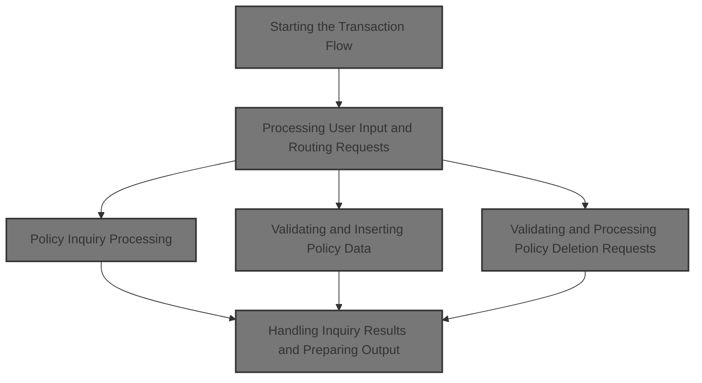
```mermaid
flowchart TD
    node1["Starting the Transaction Flow"]:::HeadingStyle
    click node1 goToHeading "Starting the Transaction Flow"
    node1 --> node2["Processing User Input and Routing Requests"]:::HeadingStyle
    click node2 goToHeading "Processing User Input and Routing Requests"
    node2 --> node3["Policy Inquiry Processing"]:::HeadingStyle
    click node3 goToHeading "Policy Inquiry Processing"
    node3 --> node4["Handling Inquiry Results and Preparing Output"]:::HeadingStyle
    click node4 goToHeading "Handling Inquiry Results and Preparing Output"
    node2 --> node5["Validating and Inserting Policy Data"]:::HeadingStyle
    click node5 goToHeading "Validating and Inserting Policy Data"
    node5 --> node4
    node2 --> node6["Validating and Processing Policy Deletion Requests"]:::HeadingStyle
    click node6 goToHeading "Validating and Processing Policy Deletion Requests"
    node6 --> node4
classDef HeadingStyle fill:#777777,stroke:#333,stroke-width:2px;
```

## Dependencies

### Programs

- <SwmToken path="base/src/lgtestp4.cbl" pos="2:6:6" line-data="       PROGRAM-ID. LGTESTP4.">`LGTESTP4`</SwmToken> (<SwmPath>[base/src/lgtestp4.cbl](base/src/lgtestp4.cbl)</SwmPath>)
- <SwmToken path="base/src/lgtestp4.cbl" pos="112:10:10" line-data="                 EXEC CICS LINK PROGRAM(&#39;LGIPOL01&#39;)">`LGIPOL01`</SwmToken> (<SwmPath>[base/src/lgipol01.cbl](base/src/lgipol01.cbl)</SwmPath>)
- <SwmToken path="base/src/lgipol01.cbl" pos="91:9:9" line-data="           EXEC CICS LINK Program(LGIPDB01)">`LGIPDB01`</SwmToken> (<SwmPath>[base/src/lgipdb01.cbl](base/src/lgipdb01.cbl)</SwmPath>)
- LGSTSQ (<SwmPath>[base/src/lgstsq.cbl](base/src/lgstsq.cbl)</SwmPath>)
- <SwmToken path="base/src/lgtestp4.cbl" pos="168:10:10" line-data="                 EXEC CICS LINK PROGRAM(&#39;LGAPOL01&#39;)">`LGAPOL01`</SwmToken> (<SwmPath>[base/src/lgapol01.cbl](base/src/lgapol01.cbl)</SwmPath>)
- <SwmToken path="base/src/lgapol01.cbl" pos="103:9:9" line-data="           EXEC CICS Link Program(LGAPDB01)">`LGAPDB01`</SwmToken> (<SwmPath>[base/src/LGAPDB01.cbl](base/src/LGAPDB01.cbl)</SwmPath>)
- <SwmToken path="base/src/LGAPDB01.cbl" pos="269:4:4" line-data="           CALL &#39;LGAPDB02&#39; USING IN-PROPERTY-TYPE, IN-POSTCODE, ">`LGAPDB02`</SwmToken>
- <SwmToken path="base/src/LGAPDB01.cbl" pos="276:4:4" line-data="           CALL &#39;LGAPDB03&#39; USING WS-BASE-RISK-SCR, IN-FIRE-PERIL, ">`LGAPDB03`</SwmToken> (<SwmPath>[base/src/LGAPDB03.cbl](base/src/LGAPDB03.cbl)</SwmPath>)
- <SwmToken path="base/src/LGAPDB01.cbl" pos="313:4:4" line-data="               CALL &#39;LGAPDB04&#39; USING LK-INPUT-DATA, LK-COVERAGE-DATA, ">`LGAPDB04`</SwmToken> (<SwmPath>[base/src/LGAPDB04.cbl](base/src/LGAPDB04.cbl)</SwmPath>)
- <SwmToken path="base/src/lgtestp4.cbl" pos="191:10:10" line-data="                 EXEC CICS LINK PROGRAM(&#39;LGDPOL01&#39;)">`LGDPOL01`</SwmToken> (<SwmPath>[base/src/lgdpol01.cbl](base/src/lgdpol01.cbl)</SwmPath>)
- <SwmToken path="base/src/lgdpol01.cbl" pos="141:9:9" line-data="           EXEC CICS LINK PROGRAM(LGDPDB01)">`LGDPDB01`</SwmToken> (<SwmPath>[base/src/lgdpdb01.cbl](base/src/lgdpdb01.cbl)</SwmPath>)
- <SwmToken path="base/src/lgdpdb01.cbl" pos="168:9:9" line-data="               EXEC CICS LINK PROGRAM(LGDPVS01)">`LGDPVS01`</SwmToken> (<SwmPath>[base/src/lgdpvs01.cbl](base/src/lgdpvs01.cbl)</SwmPath>)

### Copybooks

- SQLCA
- LGPOLICY (<SwmPath>[base/src/lgpolicy.cpy](base/src/lgpolicy.cpy)</SwmPath>)
- LGCMAREA (<SwmPath>[base/src/lgcmarea.cpy](base/src/lgcmarea.cpy)</SwmPath>)
- <SwmToken path="base/src/LGAPDB01.cbl" pos="35:3:3" line-data="           COPY INPUTREC2.">`INPUTREC2`</SwmToken> (<SwmPath>[base/src/INPUTREC2.cpy](base/src/INPUTREC2.cpy)</SwmPath>)
- OUTPUTREC (<SwmPath>[base/src/OUTPUTREC.cpy](base/src/OUTPUTREC.cpy)</SwmPath>)
- WORKSTOR (<SwmPath>[base/src/WORKSTOR.cpy](base/src/WORKSTOR.cpy)</SwmPath>)
- LGAPACT (<SwmPath>[base/src/LGAPACT.cpy](base/src/LGAPACT.cpy)</SwmPath>)
- XMAP

## Detailed View of the Program's Functionality

# Transaction Start and Initial Screen Handling

When the transaction begins, the code first checks if there is any incoming data (commarea). If there is, it proceeds to process the request; if not, it prepares a blank screen for the user. This involves resetting all fields related to the input and output maps, as well as the commarea, to their default values (blanks or zeros). This ensures that no residual data from previous transactions is displayed. After initialization, a blank screen is sent to the user's terminal, ready for new input.

# User Input Processing and Request Routing

Once the user submits a request (such as an inquiry, add, or delete operation), the code sets up handlers for special keys (like CLEAR or <SwmToken path="base/src/lgtestp4.cbl" pos="51:1:1" line-data="                     PF3(D-END) END-EXEC.">`PF3`</SwmToken>) and input errors. It then receives the user's input from the screen into the input map structure.

The code examines the user's selected option:

- For an inquiry, it checks if both customer and policy numbers are present and valid. If so, it prepares a request for a full policy inquiry. If only one of these is valid, it prepares a request for a partial inquiry (by customer or policy number). If a postcode is provided, it prepares a request to search by postcode.
- For an add operation, it collects all relevant policy details from the user's input and prepares them for insertion.
- For a delete operation, it collects the customer and policy numbers to identify the policy to be deleted.
- If the input is invalid, it prepares an error message and prompts the user to correct their input.

# Policy Inquiry Processing

For inquiry requests, the code links to a dedicated program that handles policy lookups. This program:

- Validates the presence of input data.
- Initializes tracking and status fields.
- Calls another program responsible for fetching policy details from the database.
- If no input data is present, it logs an error and abends the transaction.

# Error Logging and Message Routing

Whenever an error occurs (such as missing input data, database errors, or invalid requests), the code:

- Captures the current date and time.
- Formats an error message with relevant details (such as program name, customer and policy numbers, and error codes).
- Writes the error message to both a transient data queue (TDQ) and a temporary storage queue (TSQ) for audit and troubleshooting.
- If there is commarea data, it logs up to 90 bytes of it for further analysis.

# Fetching Policy Data from Database

The database handler program:

- Validates the commarea and converts customer and policy numbers to the appropriate format for database queries.
- Determines the type of policy requested (endowment, house, motor, commercial) based on the request ID.
- Executes the appropriate SQL SELECT statement to fetch policy details.
- Checks if the commarea buffer is large enough to hold the returned data; if not, it sets an error code.
- Copies the fetched data into the commarea, handling any NULL fields appropriately.
- Marks the end of the policy data with a special indicator.
- If no data is found or an error occurs, it sets an error code and logs the error.

# Handling Inquiry Results and Preparing Output

After the database lookup, the code checks the return code:

- If there was an error or no data was found, it displays an appropriate error message to the user.
- If the inquiry was successful, it copies the policy details from the commarea into the output map fields and sends them to the terminal for display.

# Validating and Inserting Policy Data

For add operations, the code:

- Validates the length and presence of the commarea.
- If valid, links to a program that handles the actual database insert.
- If the insert fails, it logs the error and abends the transaction.
- If successful, it displays a confirmation message to the user.

# Main Policy Processing Workflow (Batch/Backend)

The main workflow for batch processing:

- Initializes the environment and counters.
- Loads business configuration (such as risk score and premium thresholds).
- Opens all necessary files (input, output, summary, config, rates).
- Processes each insurance policy record in the input file.
- Closes all files after processing.
- Generates a summary of processed records.
- Displays business statistics.

# Processing Each Policy Record

For each input record:

- The code increments the processed record count.
- Validates the record (checking policy type, customer number, coverage limits, etc.).
- If valid, processes the record according to its type (commercial or non-commercial).
- If invalid, logs the error and writes an error record to the output.

# Handling Valid Policy Records

If the policy is commercial:

- The code processes it for quoting and statistics.
- Increments the commercial processed counter. If not commercial:
- The code rejects it and increments the error counter.

# Calculating Commercial Policy Quotes

For commercial policies:

- The code calculates the risk score and basic premium.
- If the application is initially approved, it performs enhanced actuarial calculations.
- Applies business rules to determine the underwriting outcome (approved, pending, rejected).
- Writes the output record and updates statistics.

# Calculating Basic Premiums for Commercial Policies

The basic premium calculation:

- Looks up risk factors for fire and crime perils from the database, using defaults if not found.
- Calculates the verdict (approved, pending, rejected) based on the risk score.
- Computes premiums for each peril and sums them for the total premium.

# Running Risk Assessment and Premium Calculation Logic

The risk and premium calculation logic:

- Fetches risk factors for fire and crime.
- Sets the verdict based on risk score thresholds.
- Calculates individual peril premiums and the total premium.

# Running Enhanced Actuarial Calculations

If the initial premium is above the minimum threshold:

- The code prepares all input data for the actuarial calculation.
- Calls the advanced actuarial calculation program.
- If the enhanced premium is greater than the original, it updates the results.

# Calculating Detailed Premium Components

The advanced actuarial calculation:

- Computes exposures and total insured value.
- Sets the experience modifier based on years in business and claims history.
- Calculates schedule modification based on building age, protection class, occupancy, and exposure density.
- Calculates premiums for each peril if coverage is present.
- Applies discounts (multi-peril, claims-free, deductible credit), capped at 25%.
- Calculates taxes and caps the final rate factor if necessary.
- Returns the final premium and rate factor.

# Applying Business Rules and Writing Results

Business rules are applied to determine the underwriting decision:

- If the risk score exceeds the maximum, the policy is rejected.
- If the premium is below the minimum, or the risk score is high, the policy is marked as pending.
- Otherwise, the policy is approved.
- The output record is written and statistics are updated.

# Handling Policy Deletion Results in <SwmToken path="base/src/lgtestp4.cbl" pos="24:5:7" line-data="              GO TO B-PROC.">`B-PROC`</SwmToken>

For delete operations:

- If the delete fails, the transaction is rolled back and an error message is displayed.
- If successful, all map fields are cleared, a confirmation message is set, and the updated map is sent to the terminal.

# Validating and Processing Policy Deletion Requests

The delete handler:

- Validates the commarea and request ID.
- If valid, calls the database delete logic.
- If the commarea is missing or too short, logs an error and exits.

# Deleting Policy Records from the Database

The database delete logic:

- Executes a SQL DELETE for the policy.
- If the delete fails, sets an error code and logs the error.
- If successful, links to a program that deletes the policy from VSAM storage.

# Validating and Executing <SwmToken path="base/src/lgipdb01.cbl" pos="242:5:5" line-data="      * initialize DB2 host variables">`DB2`</SwmToken> Policy Deletes

The <SwmToken path="base/src/lgipdb01.cbl" pos="242:5:5" line-data="      * initialize DB2 host variables">`DB2`</SwmToken> delete handler:

- Validates the commarea and request ID.
- Converts customer and policy numbers for the database.
- Executes the delete and, if successful, calls the VSAM delete handler.
- Logs errors as needed.

# Deleting Policy Records from VSAM

The VSAM delete handler:

- Sets up the VSAM key using the request ID, customer, and policy numbers.
- Executes the CICS Delete File operation.
- If the delete fails, sets an error code and logs the error.

# Handling VSAM Policy Deletion Results in <SwmToken path="base/src/lgtestp4.cbl" pos="24:5:7" line-data="              GO TO B-PROC.">`B-PROC`</SwmToken>

After a successful VSAM delete:

- All output map fields are cleared.
- A confirmation message is set.
- The cleared map is sent to the terminal for user feedback.

If the user enters an invalid option:

- An error message is set.
- The cursor is positioned for correction.
- The map is sent to the terminal.
- The transaction ends and waits for the next user action.

# Rule Definition

| Paragraph Name                                                                                                                                                                                                                                                                                                                                                                                                                                                                                                                                                                                                                | Rule ID | Category          | Description                                                                                                                                                                                                                                                                                                                                                                                                                                                                                                                                                                                                                                                                                                                                                                                                                                                                                                                                                                                                                                                                         | Conditions                                                                | Remarks                                                                                                                                                                                                                                                                                                                                                                                                                                                                                                                                                                                                                                                                                                                                                                                                                                                                                                                                                                                     |
| ----------------------------------------------------------------------------------------------------------------------------------------------------------------------------------------------------------------------------------------------------------------------------------------------------------------------------------------------------------------------------------------------------------------------------------------------------------------------------------------------------------------------------------------------------------------------------------------------------------------------------- | ------- | ----------------- | ----------------------------------------------------------------------------------------------------------------------------------------------------------------------------------------------------------------------------------------------------------------------------------------------------------------------------------------------------------------------------------------------------------------------------------------------------------------------------------------------------------------------------------------------------------------------------------------------------------------------------------------------------------------------------------------------------------------------------------------------------------------------------------------------------------------------------------------------------------------------------------------------------------------------------------------------------------------------------------------------------------------------------------------------------------------------------------- | ------------------------------------------------------------------------- | ------------------------------------------------------------------------------------------------------------------------------------------------------------------------------------------------------------------------------------------------------------------------------------------------------------------------------------------------------------------------------------------------------------------------------------------------------------------------------------------------------------------------------------------------------------------------------------------------------------------------------------------------------------------------------------------------------------------------------------------------------------------------------------------------------------------------------------------------------------------------------------------------------------------------------------------------------------------------------------------- |
| MAINLINE SECTION (<SwmPath>[base/src/lgtestp4.cbl](base/src/lgtestp4.cbl)</SwmPath>), MAINLINE SECTION (<SwmPath>[base/src/lgipol01.cbl](base/src/lgipol01.cbl)</SwmPath>), MAINLINE SECTION (<SwmPath>[base/src/lgdpol01.cbl](base/src/lgdpol01.cbl)</SwmPath>), MAINLINE SECTION (<SwmPath>[base/src/lgdpdb01.cbl](base/src/lgdpdb01.cbl)</SwmPath>)                                                                                                                                                                                                                                                                        | RL-001  | Conditional Logic | Customer and policy numbers must be exactly 10-digit numeric strings, not blank, not all zeros, and must exist in the database for inquiries and deletes.                                                                                                                                                                                                                                                                                                                                                                                                                                                                                                                                                                                                                                                                                                                                                                                                                                                                                                                           | Operation is inquiry or delete; customer and policy numbers are provided. | Customer number: 10 characters, numeric string, zero-padded if needed. Policy number: 10 characters, numeric string, zero-padded if needed.                                                                                                                                                                                                                                                                                                                                                                                                                                                                                                                                                                                                                                                                                                                                                                                                                                                 |
| MAINLINE SECTION (<SwmPath>[base/src/lgtestp4.cbl](base/src/lgtestp4.cbl)</SwmPath>), <SwmToken path="base/src/LGAPDB01.cbl" pos="182:3:9" line-data="               PERFORM P008-VALIDATE-INPUT-RECORD">`P008-VALIDATE-INPUT-RECORD`</SwmToken> (<SwmPath>[base/src/LGAPDB01.cbl](base/src/LGAPDB01.cbl)</SwmPath>)                                                                                                                                                                                                                                                                                                          | RL-002  | Conditional Logic | For add operations, the policy number must be unique and not already present in the database.                                                                                                                                                                                                                                                                                                                                                                                                                                                                                                                                                                                                                                                                                                                                                                                                                                                                                                                                                                                       | Operation is add; policy number is provided.                              | Policy number: 10 characters, numeric string.                                                                                                                                                                                                                                                                                                                                                                                                                                                                                                                                                                                                                                                                                                                                                                                                                                                                                                                                               |
| MAINLINE SECTION (<SwmPath>[base/src/lgtestp4.cbl](base/src/lgtestp4.cbl)</SwmPath>), <SwmToken path="base/src/LGAPDB01.cbl" pos="182:3:9" line-data="               PERFORM P008-VALIDATE-INPUT-RECORD">`P008-VALIDATE-INPUT-RECORD`</SwmToken> (<SwmPath>[base/src/LGAPDB01.cbl](base/src/LGAPDB01.cbl)</SwmPath>), <SwmToken path="base/src/LGAPDB03.cbl" pos="45:3:5" line-data="           PERFORM CALCULATE-PREMIUMS">`CALCULATE-PREMIUMS`</SwmToken> (<SwmPath>[base/src/LGAPDB03.cbl](base/src/LGAPDB03.cbl)</SwmPath>)                                                                                               | RL-003  | Conditional Logic | Peril fields must be integers (4 digits), premium fields must be decimals (8 digits + 2 decimals). Peril coverages > 0 indicate coverage.                                                                                                                                                                                                                                                                                                                                                                                                                                                                                                                                                                                                                                                                                                                                                                                                                                                                                                                                           | Peril and premium fields are provided.                                    | Peril: 4 digits, integer. Premium: 10 characters, 8 digits + 2 decimals, zero-padded if needed.                                                                                                                                                                                                                                                                                                                                                                                                                                                                                                                                                                                                                                                                                                                                                                                                                                                                                             |
| MAINLINE SECTION (<SwmPath>[base/src/lgtestp4.cbl](base/src/lgtestp4.cbl)</SwmPath>), MAINLINE SECTION (<SwmPath>[base/src/lgipol01.cbl](base/src/lgipol01.cbl)</SwmPath>), MAINLINE SECTION (<SwmPath>[base/src/lgdpol01.cbl](base/src/lgdpol01.cbl)</SwmPath>), MAINLINE SECTION (<SwmPath>[base/src/lgdpdb01.cbl](base/src/lgdpdb01.cbl)</SwmPath>)                                                                                                                                                                                                                                                                        | RL-004  | Conditional Logic | Only specific request IDs are allowed for commercial policies: <SwmToken path="base/src/lgtestp4.cbl" pos="77:4:4" line-data="                        Move &#39;01ICOM&#39;   To CA-REQUEST-ID">`01ICOM`</SwmToken>, <SwmToken path="base/src/lgtestp4.cbl" pos="87:4:4" line-data="                        Move &#39;02ICOM&#39;   To CA-REQUEST-ID">`02ICOM`</SwmToken>, <SwmToken path="base/src/lgtestp4.cbl" pos="96:4:4" line-data="                        Move &#39;03ICOM&#39;   To CA-REQUEST-ID">`03ICOM`</SwmToken>, <SwmToken path="base/src/lgtestp4.cbl" pos="105:4:4" line-data="                        Move &#39;05ICOM&#39;   To CA-REQUEST-ID">`05ICOM`</SwmToken> (inquiry), <SwmToken path="base/src/lgtestp4.cbl" pos="147:4:4" line-data="                 Move &#39;01ACOM&#39;             To  CA-REQUEST-ID">`01ACOM`</SwmToken> (add), <SwmToken path="base/src/lgtestp4.cbl" pos="188:4:4" line-data="                 Move &#39;01DCOM&#39;   To CA-REQUEST-ID">`01DCOM`</SwmToken> (delete). Any other value must be rejected with return code '99'. | Request ID is provided for commercial policy operation.                   | Allowed request IDs: <SwmToken path="base/src/lgtestp4.cbl" pos="77:4:4" line-data="                        Move &#39;01ICOM&#39;   To CA-REQUEST-ID">`01ICOM`</SwmToken>, <SwmToken path="base/src/lgtestp4.cbl" pos="87:4:4" line-data="                        Move &#39;02ICOM&#39;   To CA-REQUEST-ID">`02ICOM`</SwmToken>, <SwmToken path="base/src/lgtestp4.cbl" pos="96:4:4" line-data="                        Move &#39;03ICOM&#39;   To CA-REQUEST-ID">`03ICOM`</SwmToken>, <SwmToken path="base/src/lgtestp4.cbl" pos="105:4:4" line-data="                        Move &#39;05ICOM&#39;   To CA-REQUEST-ID">`05ICOM`</SwmToken>, <SwmToken path="base/src/lgtestp4.cbl" pos="147:4:4" line-data="                 Move &#39;01ACOM&#39;             To  CA-REQUEST-ID">`01ACOM`</SwmToken>, <SwmToken path="base/src/lgtestp4.cbl" pos="188:4:4" line-data="                 Move &#39;01DCOM&#39;   To CA-REQUEST-ID">`01DCOM`</SwmToken>. Return code for unsupported: '99'. |
| <SwmToken path="base/src/LGAPDB03.cbl" pos="45:3:5" line-data="           PERFORM CALCULATE-PREMIUMS">`CALCULATE-PREMIUMS`</SwmToken> (<SwmPath>[base/src/LGAPDB03.cbl](base/src/LGAPDB03.cbl)</SwmPath>), <SwmToken path="base/src/LGAPDB01.cbl" pos="260:3:9" line-data="           PERFORM P011B-BASIC-PREMIUM-CALC">`P011B-BASIC-PREMIUM-CALC`</SwmToken> (<SwmPath>[base/src/LGAPDB01.cbl](base/src/LGAPDB01.cbl)</SwmPath>)                                                                                                                                                                                             | RL-005  | Computation       | Premium for each peril is calculated as: Premium = (Risk Score \* Peril Factor) \* Peril Amount \* Discount Factor. Peril factors are fetched from the database or defaulted (Fire: <SwmToken path="base/src/LGAPDB03.cbl" pos="58:3:5" line-data="               MOVE 0.80 TO WS-FIRE-FACTOR">`0.80`</SwmToken>, Crime: <SwmToken path="base/src/LGAPDB03.cbl" pos="70:3:5" line-data="               MOVE 0.60 TO WS-CRIME-FACTOR">`0.60`</SwmToken>).                                                                                                                                                                                                                                                                                                                                                                                                                                                                                                                                                                                                                            | Risk score, peril amount, and peril factor are available.                 | Fire factor: <SwmToken path="base/src/LGAPDB03.cbl" pos="58:3:5" line-data="               MOVE 0.80 TO WS-FIRE-FACTOR">`0.80`</SwmToken> (default), Crime factor: <SwmToken path="base/src/LGAPDB03.cbl" pos="70:3:5" line-data="               MOVE 0.60 TO WS-CRIME-FACTOR">`0.60`</SwmToken> (default). Premium: 10 characters, 8 digits + 2 decimals, zero-padded if needed.                                                                                                                                                                                                                                                                                                                                                                                                                                                                                                                                                                                                           |
| <SwmToken path="base/src/LGAPDB01.cbl" pos="262:3:9" line-data="               PERFORM P011C-ENHANCED-ACTUARIAL-CALC">`P011C-ENHANCED-ACTUARIAL-CALC`</SwmToken> (<SwmPath>[base/src/LGAPDB01.cbl](base/src/LGAPDB01.cbl)</SwmPath>), <SwmToken path="base/src/LGAPDB04.cbl" pos="149:3:5" line-data="           PERFORM P999-FINAL">`P999-FINAL`</SwmToken> (<SwmPath>[base/src/LGAPDB04.cbl](base/src/LGAPDB04.cbl)</SwmPath>)                                                                                                                                                                                              | RL-006  | Computation       | Total premium is the sum of all peril premiums, adjusted by discounts (multi-peril, claims-free, deductible credits, capped at 25%), loadings, and taxes. If the final rate factor exceeds 0.05, it is capped and the premium recalculated.                                                                                                                                                                                                                                                                                                                                                                                                                                                                                                                                                                                                                                                                                                                                                                                                                                         | All peril premiums, discounts, loadings, and taxes are available.         | Discount cap: 0.25. Final rate factor cap: 0.05. Premium: 10 characters, 8 digits + 2 decimals.                                                                                                                                                                                                                                                                                                                                                                                                                                                                                                                                                                                                                                                                                                                                                                                                                                                                                             |
| <SwmToken path="base/src/LGAPDB01.cbl" pos="259:3:9" line-data="           PERFORM P011A-CALCULATE-RISK-SCORE">`P011A-CALCULATE-RISK-SCORE`</SwmToken> (<SwmPath>[base/src/LGAPDB01.cbl](base/src/LGAPDB01.cbl)</SwmPath>), <SwmToken path="base/src/LGAPDB03.cbl" pos="44:3:5" line-data="           PERFORM CALCULATE-VERDICT">`CALCULATE-VERDICT`</SwmToken> (<SwmPath>[base/src/LGAPDB03.cbl](base/src/LGAPDB03.cbl)</SwmPath>)                                                                                                                                                                                           | RL-007  | Computation       | Risk score is calculated using property type, postcode, latitude/longitude, coverage limits, and customer history, following the same logic as the original application.                                                                                                                                                                                                                                                                                                                                                                                                                                                                                                                                                                                                                                                                                                                                                                                                                                                                                                            | Property, location, coverage, and history data are available.             | Risk score: 3 digits, integer.                                                                                                                                                                                                                                                                                                                                                                                                                                                                                                                                                                                                                                                                                                                                                                                                                                                                                                                                                              |
| <SwmToken path="base/src/LGAPDB01.cbl" pos="264:3:9" line-data="           PERFORM P011D-APPLY-BUSINESS-RULES">`P011D-APPLY-BUSINESS-RULES`</SwmToken> (<SwmPath>[base/src/LGAPDB01.cbl](base/src/LGAPDB01.cbl)</SwmPath>), <SwmToken path="base/src/LGAPDB03.cbl" pos="44:3:5" line-data="           PERFORM CALCULATE-VERDICT">`CALCULATE-VERDICT`</SwmToken> (<SwmPath>[base/src/LGAPDB03.cbl](base/src/LGAPDB03.cbl)</SwmPath>)                                                                                                                                                                                           | RL-008  | Data Assignment   | Status field supports numeric codes (0=Approved, 1=Pending, 2=Rejected) and text descriptions ('APPROVED', 'PENDING', 'REJECTED', 'ERROR', 'UNSUPPORTED'). Reject reason field supports up to 50 characters and includes standard reasons and validation errors.                                                                                                                                                                                                                                                                                                                                                                                                                                                                                                                                                                                                                                                                                                                                                                                                                    | Business outcome determined after validation and computation.             | Status: 4 chars, numeric code and text. Reject reason: 50 chars, left-aligned, space-padded.                                                                                                                                                                                                                                                                                                                                                                                                                                                                                                                                                                                                                                                                                                                                                                                                                                                                                                |
| <SwmToken path="base/src/lgipol01.cbl" pos="81:3:7" line-data="               PERFORM WRITE-ERROR-MESSAGE">`WRITE-ERROR-MESSAGE`</SwmToken> (<SwmPath>[base/src/lgipol01.cbl](base/src/lgipol01.cbl)</SwmPath>, <SwmPath>[base/src/lgipdb01.cbl](base/src/lgipdb01.cbl)</SwmPath>, <SwmPath>[base/src/lgapol01.cbl](base/src/lgapol01.cbl)</SwmPath>, <SwmPath>[base/src/lgdpol01.cbl](base/src/lgdpol01.cbl)</SwmPath>, <SwmPath>[base/src/lgdpdb01.cbl](base/src/lgdpdb01.cbl)</SwmPath>, <SwmPath>[base/src/lgdpvs01.cbl](base/src/lgdpvs01.cbl)</SwmPath>, <SwmPath>[base/src/lgstsq.cbl](base/src/lgstsq.cbl)</SwmPath>) | RL-009  | Data Assignment   | Errors must be logged with date (8 chars, MMDDYYYY), time (6 chars, HHMMSS), program name (9 chars), error description (21 chars), customer number (10 chars), policy number (10 chars), SQLCODE (6 chars), and up to 90 bytes of commarea or error message data.                                                                                                                                                                                                                                                                                                                                                                                                                                                                                                                                                                                                                                                                                                                                                                                                                   | Error occurs during processing.                                           | Date: 8 chars, MMDDYYYY. Time: 6 chars, HHMMSS. Program name: 9 chars. Error description: 21 chars. Customer/policy number: 10 chars each. SQLCODE: 6 chars. Commarea: first 90 bytes only.                                                                                                                                                                                                                                                                                                                                                                                                                                                                                                                                                                                                                                                                                                                                                                                                 |
| MAINLINE SECTION (<SwmPath>[base/src/lgtestp4.cbl](base/src/lgtestp4.cbl)</SwmPath>), all field assignment sections in business logic programs                                                                                                                                                                                                                                                                                                                                                                                                                                                                                | RL-010  | Data Assignment   | All commarea and map fields must be fixed length, zero- or space-padded as appropriate, with no variable-length fields for commercial policies.                                                                                                                                                                                                                                                                                                                                                                                                                                                                                                                                                                                                                                                                                                                                                                                                                                                                                                                                     | Any field assignment or output.                                           | Field sizes: request ID (6), customer/policy number (10), dates (10), address (40), postcode (8), lat/lon (10), name (40), property type (15), peril (4), premium (10), status (4), reject reason (50). Padding: zero for numeric, space for text.                                                                                                                                                                                                                                                                                                                                                                                                                                                                                                                                                                                                                                                                                                                                          |
| MAINLINE SECTION (<SwmPath>[base/src/lgtestp4.cbl](base/src/lgtestp4.cbl)</SwmPath>), <SwmToken path="base/src/lgtestp4.cbl" pos="279:5:7" line-data="               Go To F-ERR">`F-ERR`</SwmToken> (<SwmPath>[base/src/lgtestp4.cbl](base/src/lgtestp4.cbl)</SwmPath>)                                                                                                                                                                                                                                                                                                                                                      | RL-011  | Data Assignment   | System must display error or confirmation messages to the user in a 90-character field on the output map.                                                                                                                                                                                                                                                                                                                                                                                                                                                                                                                                                                                                                                                                                                                                                                                                                                                                                                                                                                           | Error or confirmation message needs to be displayed.                      | Output message field: 90 characters, left-aligned, space-padded.                                                                                                                                                                                                                                                                                                                                                                                                                                                                                                                                                                                                                                                                                                                                                                                                                                                                                                                            |

# User Stories

## User Story 1: Submit and validate commercial insurance policy operations

---

### Story Description:

As a commercial insurance customer, I want to submit policy inquiries, additions, and deletions so that my insurance policies are accurately processed and validated according to business rules.

---

### Business Rule Mapping:

| Rule ID | Paragraph Name                                                                                                                                                                                                                                                                                                                                                                                                                                                                                                                  | Rule Description                                                                                                                                                                                                                                                                                                                                                                                                                                                                                                                                                                                                                                                                                                                                                                                                                                                                                                                                                                                                                                                                    |
| ------- | ------------------------------------------------------------------------------------------------------------------------------------------------------------------------------------------------------------------------------------------------------------------------------------------------------------------------------------------------------------------------------------------------------------------------------------------------------------------------------------------------------------------------------- | ----------------------------------------------------------------------------------------------------------------------------------------------------------------------------------------------------------------------------------------------------------------------------------------------------------------------------------------------------------------------------------------------------------------------------------------------------------------------------------------------------------------------------------------------------------------------------------------------------------------------------------------------------------------------------------------------------------------------------------------------------------------------------------------------------------------------------------------------------------------------------------------------------------------------------------------------------------------------------------------------------------------------------------------------------------------------------------- |
| RL-001  | MAINLINE SECTION (<SwmPath>[base/src/lgtestp4.cbl](base/src/lgtestp4.cbl)</SwmPath>), MAINLINE SECTION (<SwmPath>[base/src/lgipol01.cbl](base/src/lgipol01.cbl)</SwmPath>), MAINLINE SECTION (<SwmPath>[base/src/lgdpol01.cbl](base/src/lgdpol01.cbl)</SwmPath>), MAINLINE SECTION (<SwmPath>[base/src/lgdpdb01.cbl](base/src/lgdpdb01.cbl)</SwmPath>)                                                                                                                                                                          | Customer and policy numbers must be exactly 10-digit numeric strings, not blank, not all zeros, and must exist in the database for inquiries and deletes.                                                                                                                                                                                                                                                                                                                                                                                                                                                                                                                                                                                                                                                                                                                                                                                                                                                                                                                           |
| RL-002  | MAINLINE SECTION (<SwmPath>[base/src/lgtestp4.cbl](base/src/lgtestp4.cbl)</SwmPath>), <SwmToken path="base/src/LGAPDB01.cbl" pos="182:3:9" line-data="               PERFORM P008-VALIDATE-INPUT-RECORD">`P008-VALIDATE-INPUT-RECORD`</SwmToken> (<SwmPath>[base/src/LGAPDB01.cbl](base/src/LGAPDB01.cbl)</SwmPath>)                                                                                                                                                                                                            | For add operations, the policy number must be unique and not already present in the database.                                                                                                                                                                                                                                                                                                                                                                                                                                                                                                                                                                                                                                                                                                                                                                                                                                                                                                                                                                                       |
| RL-003  | MAINLINE SECTION (<SwmPath>[base/src/lgtestp4.cbl](base/src/lgtestp4.cbl)</SwmPath>), <SwmToken path="base/src/LGAPDB01.cbl" pos="182:3:9" line-data="               PERFORM P008-VALIDATE-INPUT-RECORD">`P008-VALIDATE-INPUT-RECORD`</SwmToken> (<SwmPath>[base/src/LGAPDB01.cbl](base/src/LGAPDB01.cbl)</SwmPath>), <SwmToken path="base/src/LGAPDB03.cbl" pos="45:3:5" line-data="           PERFORM CALCULATE-PREMIUMS">`CALCULATE-PREMIUMS`</SwmToken> (<SwmPath>[base/src/LGAPDB03.cbl](base/src/LGAPDB03.cbl)</SwmPath>) | Peril fields must be integers (4 digits), premium fields must be decimals (8 digits + 2 decimals). Peril coverages > 0 indicate coverage.                                                                                                                                                                                                                                                                                                                                                                                                                                                                                                                                                                                                                                                                                                                                                                                                                                                                                                                                           |
| RL-004  | MAINLINE SECTION (<SwmPath>[base/src/lgtestp4.cbl](base/src/lgtestp4.cbl)</SwmPath>), MAINLINE SECTION (<SwmPath>[base/src/lgipol01.cbl](base/src/lgipol01.cbl)</SwmPath>), MAINLINE SECTION (<SwmPath>[base/src/lgdpol01.cbl](base/src/lgdpol01.cbl)</SwmPath>), MAINLINE SECTION (<SwmPath>[base/src/lgdpdb01.cbl](base/src/lgdpdb01.cbl)</SwmPath>)                                                                                                                                                                          | Only specific request IDs are allowed for commercial policies: <SwmToken path="base/src/lgtestp4.cbl" pos="77:4:4" line-data="                        Move &#39;01ICOM&#39;   To CA-REQUEST-ID">`01ICOM`</SwmToken>, <SwmToken path="base/src/lgtestp4.cbl" pos="87:4:4" line-data="                        Move &#39;02ICOM&#39;   To CA-REQUEST-ID">`02ICOM`</SwmToken>, <SwmToken path="base/src/lgtestp4.cbl" pos="96:4:4" line-data="                        Move &#39;03ICOM&#39;   To CA-REQUEST-ID">`03ICOM`</SwmToken>, <SwmToken path="base/src/lgtestp4.cbl" pos="105:4:4" line-data="                        Move &#39;05ICOM&#39;   To CA-REQUEST-ID">`05ICOM`</SwmToken> (inquiry), <SwmToken path="base/src/lgtestp4.cbl" pos="147:4:4" line-data="                 Move &#39;01ACOM&#39;             To  CA-REQUEST-ID">`01ACOM`</SwmToken> (add), <SwmToken path="base/src/lgtestp4.cbl" pos="188:4:4" line-data="                 Move &#39;01DCOM&#39;   To CA-REQUEST-ID">`01DCOM`</SwmToken> (delete). Any other value must be rejected with return code '99'. |

---

### Relevant Functionality:

- **MAINLINE SECTION (**<SwmPath>[base/src/lgtestp4.cbl](base/src/lgtestp4.cbl)</SwmPath>**)**
  1. **RL-001:**
     - On inquiry/delete request:
       - Check if customer and policy numbers are not blank, not all zeros, and are 10 digits.
       - Query database to confirm existence.
       - If not valid, set return code and reject reason.
  2. **RL-002:**
     - On add request:
       - Check if policy number is not blank, not all zeros, and is 10 digits.
       - Query database to confirm it does not exist.
       - If not unique, set return code and reject reason.
  3. **RL-003:**
     - For each peril and premium field:
       - Check format and length.
       - If peril coverage > 0, mark as covered.
       - If invalid, set error and reject reason.
  4. **RL-004:**
     - On operation:
       - Check if request ID matches allowed values.
       - If not, set return code to '99' and reject reason.

## User Story 2: Calculate premiums and risk scores for policies

---

### Story Description:

As a commercial insurance system, I want to calculate peril premiums, total premium, and risk scores for each policy so that policy pricing reflects risk and business factors.

---

### Business Rule Mapping:

| Rule ID | Paragraph Name                                                                                                                                                                                                                                                                                                                                                                                                                      | Rule Description                                                                                                                                                                                                                                                                                                                                                                                                                                         |
| ------- | ----------------------------------------------------------------------------------------------------------------------------------------------------------------------------------------------------------------------------------------------------------------------------------------------------------------------------------------------------------------------------------------------------------------------------------- | -------------------------------------------------------------------------------------------------------------------------------------------------------------------------------------------------------------------------------------------------------------------------------------------------------------------------------------------------------------------------------------------------------------------------------------------------------- |
| RL-005  | <SwmToken path="base/src/LGAPDB03.cbl" pos="45:3:5" line-data="           PERFORM CALCULATE-PREMIUMS">`CALCULATE-PREMIUMS`</SwmToken> (<SwmPath>[base/src/LGAPDB03.cbl](base/src/LGAPDB03.cbl)</SwmPath>), <SwmToken path="base/src/LGAPDB01.cbl" pos="260:3:9" line-data="           PERFORM P011B-BASIC-PREMIUM-CALC">`P011B-BASIC-PREMIUM-CALC`</SwmToken> (<SwmPath>[base/src/LGAPDB01.cbl](base/src/LGAPDB01.cbl)</SwmPath>)   | Premium for each peril is calculated as: Premium = (Risk Score \* Peril Factor) \* Peril Amount \* Discount Factor. Peril factors are fetched from the database or defaulted (Fire: <SwmToken path="base/src/LGAPDB03.cbl" pos="58:3:5" line-data="               MOVE 0.80 TO WS-FIRE-FACTOR">`0.80`</SwmToken>, Crime: <SwmToken path="base/src/LGAPDB03.cbl" pos="70:3:5" line-data="               MOVE 0.60 TO WS-CRIME-FACTOR">`0.60`</SwmToken>). |
| RL-006  | <SwmToken path="base/src/LGAPDB01.cbl" pos="262:3:9" line-data="               PERFORM P011C-ENHANCED-ACTUARIAL-CALC">`P011C-ENHANCED-ACTUARIAL-CALC`</SwmToken> (<SwmPath>[base/src/LGAPDB01.cbl](base/src/LGAPDB01.cbl)</SwmPath>), <SwmToken path="base/src/LGAPDB04.cbl" pos="149:3:5" line-data="           PERFORM P999-FINAL">`P999-FINAL`</SwmToken> (<SwmPath>[base/src/LGAPDB04.cbl](base/src/LGAPDB04.cbl)</SwmPath>)    | Total premium is the sum of all peril premiums, adjusted by discounts (multi-peril, claims-free, deductible credits, capped at 25%), loadings, and taxes. If the final rate factor exceeds 0.05, it is capped and the premium recalculated.                                                                                                                                                                                                              |
| RL-007  | <SwmToken path="base/src/LGAPDB01.cbl" pos="259:3:9" line-data="           PERFORM P011A-CALCULATE-RISK-SCORE">`P011A-CALCULATE-RISK-SCORE`</SwmToken> (<SwmPath>[base/src/LGAPDB01.cbl](base/src/LGAPDB01.cbl)</SwmPath>), <SwmToken path="base/src/LGAPDB03.cbl" pos="44:3:5" line-data="           PERFORM CALCULATE-VERDICT">`CALCULATE-VERDICT`</SwmToken> (<SwmPath>[base/src/LGAPDB03.cbl](base/src/LGAPDB03.cbl)</SwmPath>) | Risk score is calculated using property type, postcode, latitude/longitude, coverage limits, and customer history, following the same logic as the original application.                                                                                                                                                                                                                                                                                 |

---

### Relevant Functionality:

- <SwmToken path="base/src/LGAPDB03.cbl" pos="45:3:5" line-data="           PERFORM CALCULATE-PREMIUMS">`CALCULATE-PREMIUMS`</SwmToken> **(**<SwmPath>[base/src/LGAPDB03.cbl](base/src/LGAPDB03.cbl)</SwmPath>**)**
  1. **RL-005:**
     - For each peril:
       - Fetch peril factor from DB or use default.
       - Compute premium: (risk score \* peril factor) \* peril amount \* discount factor.
       - Store as number for calculation, convert to string for output.
- <SwmToken path="base/src/LGAPDB01.cbl" pos="262:3:9" line-data="               PERFORM P011C-ENHANCED-ACTUARIAL-CALC">`P011C-ENHANCED-ACTUARIAL-CALC`</SwmToken> **(**<SwmPath>[base/src/LGAPDB01.cbl](base/src/LGAPDB01.cbl)</SwmPath>**)**
  1. **RL-006:**
     - Sum all peril premiums.
       - Apply discounts (multi-peril, claims-free, deductible credits), cap at 25%.
       - Add loadings and taxes.
       - Compute final rate factor; if > 0.05, cap and recalculate premium.
- <SwmToken path="base/src/LGAPDB01.cbl" pos="259:3:9" line-data="           PERFORM P011A-CALCULATE-RISK-SCORE">`P011A-CALCULATE-RISK-SCORE`</SwmToken> **(**<SwmPath>[base/src/LGAPDB01.cbl](base/src/LGAPDB01.cbl)</SwmPath>**)**
  1. **RL-007:**
     - Gather property type, postcode, lat/lon, coverage limits, customer history.
       - Call risk score calculation logic/program.
       - Store result for premium calculation and status decision.

## User Story 3: Communicate operation outcomes and errors to users

---

### Story Description:

As a commercial insurance customer, I want to receive clear status codes, reject reasons, and error or confirmation messages so that I understand the result of my policy operation and any issues encountered.

---

### Business Rule Mapping:

| Rule ID | Paragraph Name                                                                                                                                                                                                                                                                                                                                                                                                                      | Rule Description                                                                                                                                                                                                                                                 |
| ------- | ----------------------------------------------------------------------------------------------------------------------------------------------------------------------------------------------------------------------------------------------------------------------------------------------------------------------------------------------------------------------------------------------------------------------------------- | ---------------------------------------------------------------------------------------------------------------------------------------------------------------------------------------------------------------------------------------------------------------- |
| RL-008  | <SwmToken path="base/src/LGAPDB01.cbl" pos="264:3:9" line-data="           PERFORM P011D-APPLY-BUSINESS-RULES">`P011D-APPLY-BUSINESS-RULES`</SwmToken> (<SwmPath>[base/src/LGAPDB01.cbl](base/src/LGAPDB01.cbl)</SwmPath>), <SwmToken path="base/src/LGAPDB03.cbl" pos="44:3:5" line-data="           PERFORM CALCULATE-VERDICT">`CALCULATE-VERDICT`</SwmToken> (<SwmPath>[base/src/LGAPDB03.cbl](base/src/LGAPDB03.cbl)</SwmPath>) | Status field supports numeric codes (0=Approved, 1=Pending, 2=Rejected) and text descriptions ('APPROVED', 'PENDING', 'REJECTED', 'ERROR', 'UNSUPPORTED'). Reject reason field supports up to 50 characters and includes standard reasons and validation errors. |
| RL-011  | MAINLINE SECTION (<SwmPath>[base/src/lgtestp4.cbl](base/src/lgtestp4.cbl)</SwmPath>), <SwmToken path="base/src/lgtestp4.cbl" pos="279:5:7" line-data="               Go To F-ERR">`F-ERR`</SwmToken> (<SwmPath>[base/src/lgtestp4.cbl](base/src/lgtestp4.cbl)</SwmPath>)                                                                                                                                                            | System must display error or confirmation messages to the user in a 90-character field on the output map.                                                                                                                                                        |

---

### Relevant Functionality:

- <SwmToken path="base/src/LGAPDB01.cbl" pos="264:3:9" line-data="           PERFORM P011D-APPLY-BUSINESS-RULES">`P011D-APPLY-BUSINESS-RULES`</SwmToken> **(**<SwmPath>[base/src/LGAPDB01.cbl](base/src/LGAPDB01.cbl)</SwmPath>**)**
  1. **RL-008:**
     - Based on risk score and premium:
       - If risk score > max, status = 2, reason = 'Risk score exceeds...'.
       - If premium < min, status = 1, reason = 'Premium below minimum...'.
       - If risk score > 180, status = 1, reason = 'High risk...'.
       - Else, status = 0, reason blank.
- **MAINLINE SECTION (**<SwmPath>[base/src/lgtestp4.cbl](base/src/lgtestp4.cbl)</SwmPath>**)**
  1. **RL-011:**
     - On error or confirmation:
       - Format message to 90 characters.
       - Assign to output map field.
       - Display to user.

## User Story 4: Ensure data integrity and log errors for troubleshooting

---

### Story Description:

As a commercial insurance system, I want to format and pad all data fields correctly and log errors with detailed information so that data integrity is maintained and issues can be tracked and resolved efficiently.

---

### Business Rule Mapping:

| Rule ID | Paragraph Name                                                                                                                                                                                                                                                                                                                                                                                                                                                                                                                                                                                                                | Rule Description                                                                                                                                                                                                                                                  |
| ------- | ----------------------------------------------------------------------------------------------------------------------------------------------------------------------------------------------------------------------------------------------------------------------------------------------------------------------------------------------------------------------------------------------------------------------------------------------------------------------------------------------------------------------------------------------------------------------------------------------------------------------------- | ----------------------------------------------------------------------------------------------------------------------------------------------------------------------------------------------------------------------------------------------------------------- |
| RL-009  | <SwmToken path="base/src/lgipol01.cbl" pos="81:3:7" line-data="               PERFORM WRITE-ERROR-MESSAGE">`WRITE-ERROR-MESSAGE`</SwmToken> (<SwmPath>[base/src/lgipol01.cbl](base/src/lgipol01.cbl)</SwmPath>, <SwmPath>[base/src/lgipdb01.cbl](base/src/lgipdb01.cbl)</SwmPath>, <SwmPath>[base/src/lgapol01.cbl](base/src/lgapol01.cbl)</SwmPath>, <SwmPath>[base/src/lgdpol01.cbl](base/src/lgdpol01.cbl)</SwmPath>, <SwmPath>[base/src/lgdpdb01.cbl](base/src/lgdpdb01.cbl)</SwmPath>, <SwmPath>[base/src/lgdpvs01.cbl](base/src/lgdpvs01.cbl)</SwmPath>, <SwmPath>[base/src/lgstsq.cbl](base/src/lgstsq.cbl)</SwmPath>) | Errors must be logged with date (8 chars, MMDDYYYY), time (6 chars, HHMMSS), program name (9 chars), error description (21 chars), customer number (10 chars), policy number (10 chars), SQLCODE (6 chars), and up to 90 bytes of commarea or error message data. |
| RL-010  | MAINLINE SECTION (<SwmPath>[base/src/lgtestp4.cbl](base/src/lgtestp4.cbl)</SwmPath>), all field assignment sections in business logic programs                                                                                                                                                                                                                                                                                                                                                                                                                                                                                | All commarea and map fields must be fixed length, zero- or space-padded as appropriate, with no variable-length fields for commercial policies.                                                                                                                   |

---

### Relevant Functionality:

- <SwmToken path="base/src/lgipol01.cbl" pos="81:3:7" line-data="               PERFORM WRITE-ERROR-MESSAGE">`WRITE-ERROR-MESSAGE`</SwmToken> **(**<SwmPath>[base/src/lgipol01.cbl](base/src/lgipol01.cbl)</SwmPath>
  1. **RL-009:**
     - On error:
       - Gather required fields.
       - Format error log record.
       - Include first 90 bytes of commarea.
       - Write to queue via <SwmPath>[base/src/lgstsq.cbl](base/src/lgstsq.cbl)</SwmPath>.
- **MAINLINE SECTION (**<SwmPath>[base/src/lgtestp4.cbl](base/src/lgtestp4.cbl)</SwmPath>**)**
  1. **RL-010:**
     - When assigning or outputting fields:
       - Ensure field is fixed length.
       - Pad with zeros (numeric) or spaces (text) as needed.
       - Truncate or pad to exact size.

# Workflow

# Starting the Transaction Flow

This section governs the initial transaction flow, determining whether to continue processing based on the presence of commarea data, and ensuring the user interface is reset for new transactions.

| Category        | Rule Name                                | Description                                                                                                                           |
| --------------- | ---------------------------------------- | ------------------------------------------------------------------------------------------------------------------------------------- |
| Data validation | Commarea data required for processing    | If commarea data is present at transaction start, the transaction flow must continue to the next processing step.                     |
| Business logic  | Clear fields for new transaction         | If no commarea data is present, all screen and transaction fields must be cleared to prepare for a new transaction.                   |
| Business logic  | Present blank screen for new transaction | When starting a new transaction (no commarea data), a blank screen must be presented to the user to indicate readiness for new input. |

<SwmSnippet path="/base/src/lgtestp4.cbl" line="21">

---

<SwmToken path="base/src/lgtestp4.cbl" pos="21:1:1" line-data="       MAINLINE SECTION.">`MAINLINE`</SwmToken> only continues to <SwmToken path="base/src/lgtestp4.cbl" pos="24:5:7" line-data="              GO TO B-PROC.">`B-PROC`</SwmToken> if there's commarea data, otherwise it does nothing.

```cobol
       MAINLINE SECTION.

           IF EIBCALEN > 0
              GO TO B-PROC.
```

---

</SwmSnippet>

<SwmSnippet path="/base/src/lgtestp4.cbl" line="26">

---

After the initial check, the code resets all map and commarea fields to blanks or zeros. This clears out any old data before starting a new transaction or screen.

```cobol
           Initialize XMAPP4I.
           Initialize XMAPP4O.
           Initialize COMM-AREA.
           MOVE '0000000000'   To ENP4CNOO.
           MOVE '0000000000'   To ENP4PNOO.
           MOVE LOW-VALUES     To ENP4FPEO.
           MOVE LOW-VALUES     To ENP4FPRO.
           MOVE LOW-VALUES     To ENP4CPEO.
           MOVE LOW-VALUES     To ENP4CPRO.
           MOVE LOW-VALUES     To ENP4XPEO.
           MOVE LOW-VALUES     To ENP4XPRO.
           MOVE LOW-VALUES     To ENP4WPEO.
           MOVE LOW-VALUES     To ENP4WPRO.
           MOVE LOW-VALUES     To ENP4STAO.
```

---

</SwmSnippet>

<SwmSnippet path="/base/src/lgtestp4.cbl" line="42">

---

Finally, if MAINLINE didn't jump to <SwmToken path="base/src/lgtestp4.cbl" pos="24:5:7" line-data="              GO TO B-PROC.">`B-PROC`</SwmToken>, it sends a blank map to the terminal, clearing the screen for the user.

```cobol
           EXEC CICS SEND MAP ('XMAPP4')
                     MAPSET ('XMAP')
                     ERASE
                     END-EXEC.
```

---

</SwmSnippet>

# Processing User Input and Routing Requests

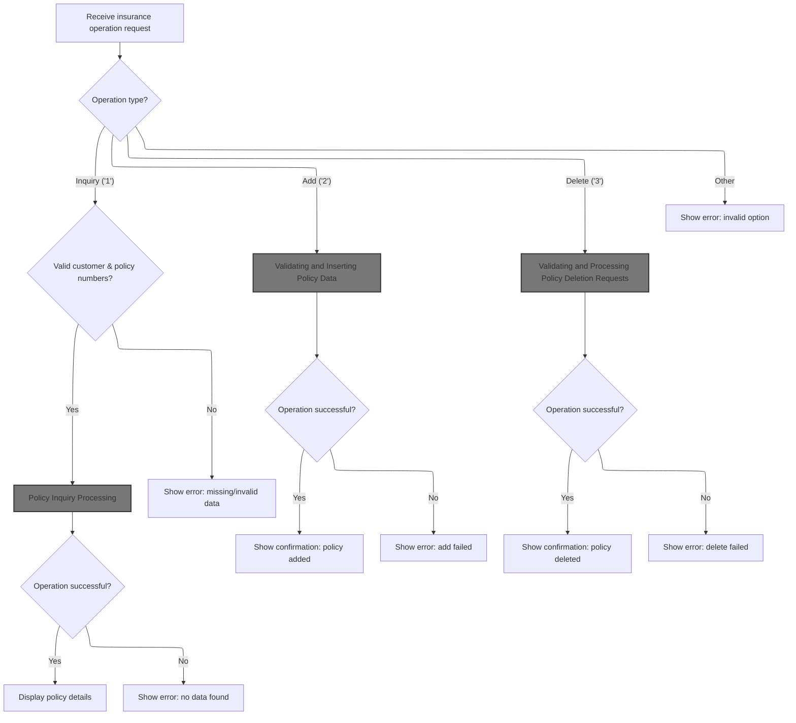
```mermaid
%%{init: {"flowchart": {"defaultRenderer": "elk"}} }%%
flowchart TD
  node1["Receive insurance operation request"]
  click node1 openCode "base/src/lgtestp4.cbl:47:58"
  node1 --> node2{"Operation type?"}
  click node2 openCode "base/src/lgtestp4.cbl:63:146"
  node2 -->|"Inquiry ('1')"| node3{"Valid customer & policy numbers?"}
  click node3 openCode "base/src/lgtestp4.cbl:64:110"
  node3 -->|"Yes"| node4["Policy Inquiry Processing"]
  
  node3 -->|"No"| node5["Show error: missing/invalid data"]
  click node5 openCode "base/src/lgtestp4.cbl:110:115"
  node4 --> node6{"Operation successful?"}
  click node6 openCode "base/src/lgtestp4.cbl:116:118"
  node6 -->|"Yes"| node7["Display policy details"]
  click node7 openCode "base/src/lgtestp4.cbl:120:143"
  node6 -->|"No"| node8["Show error: no data found"]
  click node8 openCode "base/src/lgtestp4.cbl:117:117"
  node2 -->|"Add ('2')"| node9["Validating and Inserting Policy Data"]
  
  node9 --> node10{"Operation successful?"}
  click node10 openCode "base/src/lgtestp4.cbl:172:175"
  node10 -->|"Yes"| node11["Show confirmation: policy added"]
  click node11 openCode "base/src/lgtestp4.cbl:176:184"
  node10 -->|"No"| node12["Show error: add failed"]
  click node12 openCode "base/src/lgtestp4.cbl:173:174"
  node2 -->|"Delete ('3')"| node13["Validating and Processing Policy Deletion Requests"]
  
  node13 --> node14{"Operation successful?"}
  click node14 openCode "base/src/lgtestp4.cbl:195:198"
  node14 -->|"Yes"| node15["Show confirmation: policy deleted"]
  click node15 openCode "base/src/lgtestp4.cbl:200:223"
  node14 -->|"No"| node16["Show error: delete failed"]
  click node16 openCode "base/src/lgtestp4.cbl:196:197"
  node2 -->|"Other"| node17["Show error: invalid option"]
  click node17 openCode "base/src/lgtestp4.cbl:226:237"
classDef HeadingStyle fill:#777777,stroke:#333,stroke-width:2px;
click node4 goToHeading "Policy Inquiry Processing"
node4:::HeadingStyle
click node9 goToHeading "Validating and Inserting Policy Data"
node9:::HeadingStyle
click node13 goToHeading "Validating and Processing Policy Deletion Requests"
node13:::HeadingStyle

%% Swimm:
%% %%{init: {"flowchart": {"defaultRenderer": "elk"}} }%%
%% flowchart TD
%%   node1["Receive insurance operation request"]
%%   click node1 openCode "<SwmPath>[base/src/lgtestp4.cbl](base/src/lgtestp4.cbl)</SwmPath>:47:58"
%%   node1 --> node2{"Operation type?"}
%%   click node2 openCode "<SwmPath>[base/src/lgtestp4.cbl](base/src/lgtestp4.cbl)</SwmPath>:63:146"
%%   node2 -->|"Inquiry ('1')"| node3{"Valid customer & policy numbers?"}
%%   click node3 openCode "<SwmPath>[base/src/lgtestp4.cbl](base/src/lgtestp4.cbl)</SwmPath>:64:110"
%%   node3 -->|"Yes"| node4["Policy Inquiry Processing"]
%%   
%%   node3 -->|"No"| node5["Show error: missing/invalid data"]
%%   click node5 openCode "<SwmPath>[base/src/lgtestp4.cbl](base/src/lgtestp4.cbl)</SwmPath>:110:115"
%%   node4 --> node6{"Operation successful?"}
%%   click node6 openCode "<SwmPath>[base/src/lgtestp4.cbl](base/src/lgtestp4.cbl)</SwmPath>:116:118"
%%   node6 -->|"Yes"| node7["Display policy details"]
%%   click node7 openCode "<SwmPath>[base/src/lgtestp4.cbl](base/src/lgtestp4.cbl)</SwmPath>:120:143"
%%   node6 -->|"No"| node8["Show error: no data found"]
%%   click node8 openCode "<SwmPath>[base/src/lgtestp4.cbl](base/src/lgtestp4.cbl)</SwmPath>:117:117"
%%   node2 -->|"Add ('2')"| node9["Validating and Inserting Policy Data"]
%%   
%%   node9 --> node10{"Operation successful?"}
%%   click node10 openCode "<SwmPath>[base/src/lgtestp4.cbl](base/src/lgtestp4.cbl)</SwmPath>:172:175"
%%   node10 -->|"Yes"| node11["Show confirmation: policy added"]
%%   click node11 openCode "<SwmPath>[base/src/lgtestp4.cbl](base/src/lgtestp4.cbl)</SwmPath>:176:184"
%%   node10 -->|"No"| node12["Show error: add failed"]
%%   click node12 openCode "<SwmPath>[base/src/lgtestp4.cbl](base/src/lgtestp4.cbl)</SwmPath>:173:174"
%%   node2 -->|"Delete ('3')"| node13["Validating and Processing Policy Deletion Requests"]
%%   
%%   node13 --> node14{"Operation successful?"}
%%   click node14 openCode "<SwmPath>[base/src/lgtestp4.cbl](base/src/lgtestp4.cbl)</SwmPath>:195:198"
%%   node14 -->|"Yes"| node15["Show confirmation: policy deleted"]
%%   click node15 openCode "<SwmPath>[base/src/lgtestp4.cbl](base/src/lgtestp4.cbl)</SwmPath>:200:223"
%%   node14 -->|"No"| node16["Show error: delete failed"]
%%   click node16 openCode "<SwmPath>[base/src/lgtestp4.cbl](base/src/lgtestp4.cbl)</SwmPath>:196:197"
%%   node2 -->|"Other"| node17["Show error: invalid option"]
%%   click node17 openCode "<SwmPath>[base/src/lgtestp4.cbl](base/src/lgtestp4.cbl)</SwmPath>:226:237"
%% classDef HeadingStyle fill:#777777,stroke:#333,stroke-width:2px;
%% click node4 goToHeading "Policy Inquiry Processing"
%% node4:::HeadingStyle
%% click node9 goToHeading "Validating and Inserting Policy Data"
%% node9:::HeadingStyle
%% click node13 goToHeading "Validating and Processing Policy Deletion Requests"
%% node13:::HeadingStyle
```

This section governs how user input for insurance operations is processed, validated, and routed to the appropriate business logic, ensuring that only valid and supported requests are processed and that users receive clear feedback on the outcome of their actions.

| Category        | Rule Name                      | Description                                                                                                                                                                                        |
| --------------- | ------------------------------ | -------------------------------------------------------------------------------------------------------------------------------------------------------------------------------------------------- |
| Data validation | Full Policy Inquiry Validation | If the user selects the 'Inquiry' operation, both customer and policy numbers must be present and valid (not blank, not zero, not low-values, and not all zeros) to perform a full policy inquiry. |
| Data validation | Add/Delete Input Validation    | For 'Add' and 'Delete' operations, the system validates the required fields and only proceeds if the input is valid; otherwise, it displays an error message.                                      |
| Business logic  | Policy-Only Inquiry            | If only the policy number is valid, the system performs a policy-only inquiry, ignoring the customer number.                                                                                       |
| Business logic  | Customer-Only Inquiry          | If only the customer number is valid, the system performs a customer-only inquiry, ignoring the policy number.                                                                                     |
| Business logic  | Postcode-Based Inquiry         | If only the postcode field is valid, the system performs a postcode-based inquiry, allowing users to search by location.                                                                           |
| Business logic  | Operation Outcome Messaging    | After processing an operation, the system displays a confirmation message if the operation was successful, or an error message if it failed (e.g., no data found, add/delete failed).              |

<SwmSnippet path="/base/src/lgtestp4.cbl" line="47">

---

In <SwmToken path="base/src/lgtestp4.cbl" pos="47:1:3" line-data="       B-PROC.">`B-PROC`</SwmToken>, the flow sets up handlers for user actions (like CLEAR or <SwmToken path="base/src/lgtestp4.cbl" pos="51:1:1" line-data="                     PF3(D-END) END-EXEC.">`PF3`</SwmToken>) and map input errors, then receives the user input from the screen into the input map structure.

```cobol
       B-PROC.

           EXEC CICS HANDLE AID
                     CLEAR(C-CLR)
                     PF3(D-END) END-EXEC.
           EXEC CICS HANDLE CONDITION
                     MAPFAIL(D-END)
                     END-EXEC.

           EXEC CICS RECEIVE MAP('XMAPP4')
                     INTO(XMAPP4I)
                     MAPSET('XMAP') END-EXEC.
```

---

</SwmSnippet>

<SwmSnippet path="/base/src/lgtestp4.cbl" line="63">

---

When the user selects option '1', the code checks if both customer and policy numbers are present and valid. If so, it sets up the request ID and copies the numbers into the commarea for the next step.

```cobol
             WHEN '1'
                 If (
                     ENP4CNOO Not = Spaces      AND
                     ENP4CNOO Not = Low-Values  AND
                     ENP4CNOO Not = 0           AND
                     ENP4CNOO Not = 0000000000
                                                   )
                                                    AND
                    (
                     ENP4PNOO Not = Spaces      AND
                     ENP4PNOO Not = Low-Values  AND
                     ENP4PNOO Not = 0           AND
                     ENP4PNOO Not = 0000000000
                                                   )
                        Move '01ICOM'   To CA-REQUEST-ID
                        Move ENP4CNOO   To CA-CUSTOMER-NUM
                        Move ENP4PNOO   To CA-POLICY-NUM
```

---

</SwmSnippet>

<SwmSnippet path="/base/src/lgtestp4.cbl" line="80">

---

If only the policy number is valid (and not the customer number), the code sets up a different request type and copies just the policy number into the commarea.

```cobol
                 Else
                 If (
                     ENP4PNOO Not = Spaces      AND
                     ENP4PNOO Not = Low-Values  AND
                     ENP4PNOO Not = 0           AND
                     ENP4PNOO Not = 0000000000
                                                   )
                        Move '02ICOM'   To CA-REQUEST-ID
                        Move ENP4PNOO   To CA-POLICY-NUM
```

---

</SwmSnippet>

<SwmSnippet path="/base/src/lgtestp4.cbl" line="89">

---

If only the customer number is valid, the code sets up another request type and copies just the customer number into the commarea.

```cobol
                 Else
                 If (
                     ENP4CNOO Not = Spaces      AND
                     ENP4CNOO Not = Low-Values  AND
                     ENP4CNOO Not = 0           AND
                     ENP4CNOO Not = 0000000000
                                                   )
                        Move '03ICOM'   To CA-REQUEST-ID
                        Move ENP4CNOO   To CA-CUSTOMER-NUM
```

---

</SwmSnippet>

<SwmSnippet path="/base/src/lgtestp4.cbl" line="98">

---

If <SwmToken path="base/src/lgtestp4.cbl" pos="100:1:1" line-data="                     ENP4HPCO NOT = Spaces      AND">`ENP4HPCO`</SwmToken> (probably a postcode or similar field) is valid, the code sets up a special request and copies it into the commarea.

```cobol
                 Else
                 If (
                     ENP4HPCO NOT = Spaces      AND
                     ENP4HPCO NOT = Low-Values  AND
                     ENP4HPCO Not = 0           AND
                     ENP4HPCO NOT = 00000000
                                                   )
                        Move '05ICOM'   To CA-REQUEST-ID
                        Move ENP4HPCO   To CA-B-PST
                 End-If
```

---

</SwmSnippet>

<SwmSnippet path="/base/src/lgtestp4.cbl" line="108">

---

After setting up the request, the code calls <SwmToken path="base/src/lgtestp4.cbl" pos="112:10:10" line-data="                 EXEC CICS LINK PROGRAM(&#39;LGIPOL01&#39;)">`LGIPOL01`</SwmToken>, passing the commarea. <SwmToken path="base/src/lgtestp4.cbl" pos="112:10:10" line-data="                 EXEC CICS LINK PROGRAM(&#39;LGIPOL01&#39;)">`LGIPOL01`</SwmToken> handles the actual policy lookup and returns the results.

```cobol
                 End-If
                 End-If
                 End-If

                 EXEC CICS LINK PROGRAM('LGIPOL01')
                           COMMAREA(COMM-AREA)
                           LENGTH(32500)
                 END-EXEC
```

---

</SwmSnippet>

## Policy Inquiry Processing

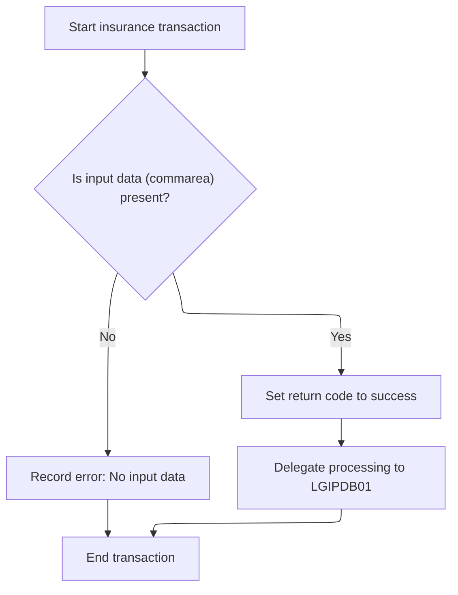
```mermaid
%%{init: {"flowchart": {"defaultRenderer": "elk"}} }%%
flowchart TD
    node1["Start insurance transaction"] --> node2{"Is input data (commarea) present?"}
    click node1 openCode "base/src/lgipol01.cbl:70:74"
    node2 -->|"No"| node3["Record error: No input data"]
    click node2 openCode "base/src/lgipol01.cbl:79:83"
    node3 --> node6["End transaction"]
    click node3 openCode "base/src/lgipol01.cbl:80:83"
    node2 -->|"Yes"| node4["Set return code to success"]
    click node4 openCode "base/src/lgipol01.cbl:86:88"
    node4 --> node5["Delegate processing to LGIPDB01"]
    click node5 openCode "base/src/lgipol01.cbl:91:94"
    node5 --> node6["End transaction"]
    click node6 openCode "base/src/lgipol01.cbl:96:96"

classDef HeadingStyle fill:#777777,stroke:#333,stroke-width:2px;

%% Swimm:
%% %%{init: {"flowchart": {"defaultRenderer": "elk"}} }%%
%% flowchart TD
%%     node1["Start insurance transaction"] --> node2{"Is input data (commarea) present?"}
%%     click node1 openCode "<SwmPath>[base/src/lgipol01.cbl](base/src/lgipol01.cbl)</SwmPath>:70:74"
%%     node2 -->|"No"| node3["Record error: No input data"]
%%     click node2 openCode "<SwmPath>[base/src/lgipol01.cbl](base/src/lgipol01.cbl)</SwmPath>:79:83"
%%     node3 --> node6["End transaction"]
%%     click node3 openCode "<SwmPath>[base/src/lgipol01.cbl](base/src/lgipol01.cbl)</SwmPath>:80:83"
%%     node2 -->|"Yes"| node4["Set return code to success"]
%%     click node4 openCode "<SwmPath>[base/src/lgipol01.cbl](base/src/lgipol01.cbl)</SwmPath>:86:88"
%%     node4 --> node5["Delegate processing to <SwmToken path="base/src/lgipol01.cbl" pos="91:9:9" line-data="           EXEC CICS LINK Program(LGIPDB01)">`LGIPDB01`</SwmToken>"]
%%     click node5 openCode "<SwmPath>[base/src/lgipol01.cbl](base/src/lgipol01.cbl)</SwmPath>:91:94"
%%     node5 --> node6["End transaction"]
%%     click node6 openCode "<SwmPath>[base/src/lgipol01.cbl](base/src/lgipol01.cbl)</SwmPath>:96:96"
%% 
%% classDef HeadingStyle fill:#777777,stroke:#333,stroke-width:2px;
```

This section governs the initial validation and delegation of insurance policy inquiry requests. It ensures that only requests with valid input data are processed, and errors are logged for missing input.

| Category        | Rule Name                   | Description                                                                                                                                                                                 |
| --------------- | --------------------------- | ------------------------------------------------------------------------------------------------------------------------------------------------------------------------------------------- |
| Data validation | Missing input data error    | If no input data (commarea) is present in the transaction request, the system must record an error message stating 'NO COMMAREA RECEIVED' and terminate the transaction with an error code. |
| Business logic  | Successful input validation | For every valid policy inquiry request, the system must set the return code to '00' to indicate successful receipt and validation of input data.                                            |
| Business logic  | Policy inquiry delegation   | All valid policy inquiry requests must be delegated to the policy database processing component for retrieval of policy details.                                                            |

<SwmSnippet path="/base/src/lgipol01.cbl" line="70">

---

<SwmToken path="base/src/lgipol01.cbl" pos="70:1:1" line-data="       MAINLINE SECTION.">`MAINLINE`</SwmToken> in <SwmToken path="base/src/lgtestp4.cbl" pos="112:10:10" line-data="                 EXEC CICS LINK PROGRAM(&#39;LGIPOL01&#39;)">`LGIPOL01`</SwmToken> checks for a valid commarea, sets up tracking info, and then calls <SwmToken path="base/src/lgipol01.cbl" pos="91:9:9" line-data="           EXEC CICS LINK Program(LGIPDB01)">`LGIPDB01`</SwmToken> to fetch the requested policy details from the database. If no commarea is present, it logs an error and abends.

```cobol
       MAINLINE SECTION.
      *
           INITIALIZE WS-HEADER.
      *
           MOVE EIBTRNID TO WS-TRANSID.
           MOVE EIBTRMID TO WS-TERMID.
           MOVE EIBTASKN TO WS-TASKNUM.
      *
      * If NO commarea received issue an ABEND
           IF EIBCALEN IS EQUAL TO ZERO
               MOVE ' NO COMMAREA RECEIVED' TO EM-VARIABLE
               PERFORM WRITE-ERROR-MESSAGE
               EXEC CICS ABEND ABCODE('LGCA') NODUMP END-EXEC
           END-IF

      * initialize commarea return code to zero
           MOVE '00' TO CA-RETURN-CODE
           MOVE EIBCALEN TO WS-CALEN.
           SET WS-ADDR-DFHCOMMAREA TO ADDRESS OF DFHCOMMAREA.
      *

           EXEC CICS LINK Program(LGIPDB01)
               Commarea(DFHCOMMAREA)
               Length(32500)
           END-EXEC.

           EXEC CICS RETURN END-EXEC.
```

---

</SwmSnippet>

## Error Logging and Message Routing

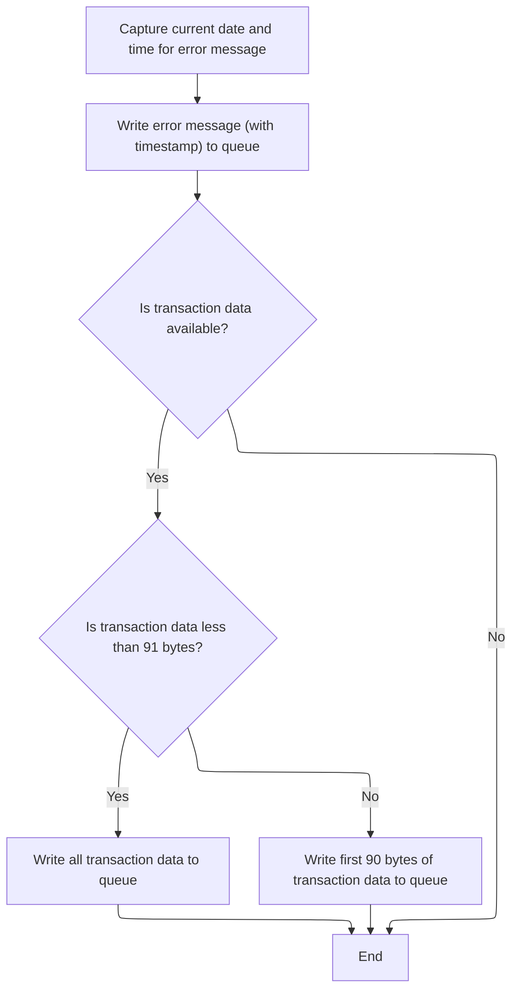
```mermaid
%%{init: {"flowchart": {"defaultRenderer": "elk"}} }%%
flowchart TD
  node1["Capture current date and time for error message"]
  click node1 openCode "base/src/lgipol01.cbl:110:117"
  node1 --> node2["Write error message (with timestamp) to queue"]
  click node2 openCode "base/src/lgipol01.cbl:119:122"
  node2 --> node3{"Is transaction data available?"}
  click node3 openCode "base/src/lgipol01.cbl:124:138"
  node3 -->|"No"| node6["End"]
  node3 -->|"Yes"| node4{"Is transaction data less than 91 bytes?"}
  click node4 openCode "base/src/lgipol01.cbl:125:137"
  node4 -->|"Yes"| node5["Write all transaction data to queue"]
  click node5 openCode "base/src/lgipol01.cbl:126:130"
  node4 -->|"No"| node7["Write first 90 bytes of transaction data to queue"]
  click node7 openCode "base/src/lgipol01.cbl:132:136"
  node5 --> node6["End"]
  node7 --> node6["End"]
  click node6 openCode "base/src/lgipol01.cbl:139:139"
classDef HeadingStyle fill:#777777,stroke:#333,stroke-width:2px;

%% Swimm:
%% %%{init: {"flowchart": {"defaultRenderer": "elk"}} }%%
%% flowchart TD
%%   node1["Capture current date and time for error message"]
%%   click node1 openCode "<SwmPath>[base/src/lgipol01.cbl](base/src/lgipol01.cbl)</SwmPath>:110:117"
%%   node1 --> node2["Write error message (with timestamp) to queue"]
%%   click node2 openCode "<SwmPath>[base/src/lgipol01.cbl](base/src/lgipol01.cbl)</SwmPath>:119:122"
%%   node2 --> node3{"Is transaction data available?"}
%%   click node3 openCode "<SwmPath>[base/src/lgipol01.cbl](base/src/lgipol01.cbl)</SwmPath>:124:138"
%%   node3 -->|"No"| node6["End"]
%%   node3 -->|"Yes"| node4{"Is transaction data less than 91 bytes?"}
%%   click node4 openCode "<SwmPath>[base/src/lgipol01.cbl](base/src/lgipol01.cbl)</SwmPath>:125:137"
%%   node4 -->|"Yes"| node5["Write all transaction data to queue"]
%%   click node5 openCode "<SwmPath>[base/src/lgipol01.cbl](base/src/lgipol01.cbl)</SwmPath>:126:130"
%%   node4 -->|"No"| node7["Write first 90 bytes of transaction data to queue"]
%%   click node7 openCode "<SwmPath>[base/src/lgipol01.cbl](base/src/lgipol01.cbl)</SwmPath>:132:136"
%%   node5 --> node6["End"]
%%   node7 --> node6["End"]
%%   click node6 openCode "<SwmPath>[base/src/lgipol01.cbl](base/src/lgipol01.cbl)</SwmPath>:139:139"
%% classDef HeadingStyle fill:#777777,stroke:#333,stroke-width:2px;
```

This section ensures that all error events are logged with precise timestamps and relevant transaction data, enabling effective troubleshooting and auditability. It also routes error messages to appropriate queues for further processing or review.

| Category       | Rule Name                  | Description                                                                                                                                                                                                                                      |
| -------------- | -------------------------- | ------------------------------------------------------------------------------------------------------------------------------------------------------------------------------------------------------------------------------------------------ |
| Business logic | Timestamped error logging  | Every error message must include the current date and time to ensure accurate tracking and auditability of error events.                                                                                                                         |
| Business logic | Transaction data inclusion | If transaction data (commarea) is present, up to 90 bytes of it must be included in the error log to aid in troubleshooting. If less than 91 bytes are available, all available bytes are logged; otherwise, only the first 90 bytes are logged. |
| Business logic | Dual queue logging         | All error messages must be written to both a transient data queue (TDQ) and a temporary storage queue (TSQ) named 'GENAERRS' to ensure redundancy and availability for downstream processing.                                                    |
| Business logic | Dynamic queue naming       | If the error message begins with 'Q=', the queue name must be adjusted by extracting the extension from the message and updating the queue name accordingly.                                                                                     |
| Business logic | Response on receive        | If the error message originated from a CICS RECEIVE operation, a response must be sent back to the requester to confirm receipt and handling of the error message.                                                                               |

<SwmSnippet path="/base/src/lgipol01.cbl" line="107">

---

<SwmToken path="base/src/lgipol01.cbl" pos="107:1:5" line-data="       WRITE-ERROR-MESSAGE.">`WRITE-ERROR-MESSAGE`</SwmToken> formats the error info with a timestamp, then calls LGSTSQ to log the error message. If there's commarea data, it also logs up to 90 bytes of that for troubleshooting.

```cobol
       WRITE-ERROR-MESSAGE.
      * Save SQLCODE in message
      * Obtain and format current time and date
           EXEC CICS ASKTIME ABSTIME(ABS-TIME)
           END-EXEC
           EXEC CICS FORMATTIME ABSTIME(ABS-TIME)
                     MMDDYYYY(DATE1)
                     TIME(TIME1)
           END-EXEC
           MOVE DATE1 TO EM-DATE
           MOVE TIME1 TO EM-TIME
      * Write output message to TDQ
           EXEC CICS LINK PROGRAM('LGSTSQ')
                     COMMAREA(ERROR-MSG)
                     LENGTH(LENGTH OF ERROR-MSG)
           END-EXEC.
      * Write 90 bytes or as much as we have of commarea to TDQ
           IF EIBCALEN > 0 THEN
             IF EIBCALEN < 91 THEN
               MOVE DFHCOMMAREA(1:EIBCALEN) TO CA-DATA
               EXEC CICS LINK PROGRAM('LGSTSQ')
                         COMMAREA(CA-ERROR-MSG)
                         LENGTH(LENGTH OF CA-ERROR-MSG)
               END-EXEC
             ELSE
               MOVE DFHCOMMAREA(1:90) TO CA-DATA
               EXEC CICS LINK PROGRAM('LGSTSQ')
                         COMMAREA(CA-ERROR-MSG)
                         LENGTH(LENGTH OF CA-ERROR-MSG)
               END-EXEC
             END-IF
           END-IF.
           EXIT.
```

---

</SwmSnippet>

<SwmSnippet path="/base/src/lgstsq.cbl" line="55">

---

<SwmToken path="base/src/lgstsq.cbl" pos="55:1:1" line-data="       MAINLINE SECTION.">`MAINLINE`</SwmToken> in LGSTSQ figures out if the message is from a program or a CICS RECEIVE, adjusts the message and length if it starts with 'Q=', writes it to both a TDQ and a TSQ (using 'GENAERRS' as the base name), and sends a response if needed. The TSQ write is non-blocking.

```cobol
       MAINLINE SECTION.

           MOVE SPACES TO WRITE-MSG.
           MOVE SPACES TO WS-RECV.

           EXEC CICS ASSIGN SYSID(WRITE-MSG-SYSID)
                RESP(WS-RESP)
           END-EXEC.

           EXEC CICS ASSIGN INVOKINGPROG(WS-INVOKEPROG)
                RESP(WS-RESP)
           END-EXEC.
           
           IF WS-INVOKEPROG NOT = SPACES
              MOVE 'C' To WS-FLAG
              MOVE COMMA-DATA  TO WRITE-MSG-MSG
              MOVE EIBCALEN    TO WS-RECV-LEN
           ELSE
              EXEC CICS RECEIVE INTO(WS-RECV)
                  LENGTH(WS-RECV-LEN)
                  RESP(WS-RESP)
              END-EXEC
              MOVE 'R' To WS-FLAG
              MOVE WS-RECV-DATA  TO WRITE-MSG-MSG
              SUBTRACT 5 FROM WS-RECV-LEN
           END-IF.

           MOVE 'GENAERRS' TO STSQ-NAME.
           IF WRITE-MSG-MSG(1:2) = 'Q=' THEN
              MOVE WRITE-MSG-MSG(3:4) TO STSQ-EXT
              MOVE WRITE-MSG-REST TO TEMPO
              MOVE TEMPO          TO WRITE-MSG-MSG
              SUBTRACT 7 FROM WS-RECV-LEN
           END-IF.

           ADD 5 TO WS-RECV-LEN.

      * Write output message to TDQ CSMT
      *
           EXEC CICS WRITEQ TD QUEUE(STDQ-NAME)
                     FROM(WRITE-MSG)
                     RESP(WS-RESP)
                     LENGTH(WS-RECV-LEN)

           END-EXEC.

      * Write output message to Genapp TSQ
      * If no space is available then the task will not wait for
      *  storage to become available but will ignore the request...
      *
           EXEC CICS WRITEQ TS QUEUE(STSQ-NAME)
                     FROM(WRITE-MSG)
                     RESP(WS-RESP)
                     NOSUSPEND
                     LENGTH(WS-RECV-LEN)

           END-EXEC.

           If WS-FLAG = 'R' Then
             EXEC CICS SEND TEXT FROM(FILLER-X)
              WAIT
              ERASE
              LENGTH(1)
              FREEKB
             END-EXEC.

           EXEC CICS RETURN
           END-EXEC.
```

---

</SwmSnippet>

## Fetching Policy Data from Database


```mermaid
%%{init: {"flowchart": {"defaultRenderer": "elk"}} }%%
flowchart TD
    node1["Start: Receive insurance policy request"]
    click node1 openCode "base/src/lgipdb01.cbl:230:231"
    node1 --> node2{"Is request commarea present?"}
    click node2 openCode "base/src/lgipdb01.cbl:251:255"
    node2 -->|"No"| node3["Return error: No commarea received (code 99)"]
    click node3 openCode "base/src/lgipdb01.cbl:252:254"
    node2 -->|"Yes"| node4{"Which policy type is requested?"}
    click node4 openCode "base/src/lgipdb01.cbl:277:310"
    node4 -->|"Endowment"| node5{"Was policy found?"}
    node4 -->|"House"| node6{"Was policy found?"}
    node4 -->|"Motor"| node7{"Was policy found?"}
    node4 -->|"Commercial 1"| node8{"Was policy found?"}
    node4 -->|"Commercial 2"| node19{"Was policy found?"}
    node4 -->|"Commercial 3"| node20{"Was policy found?"}
    node4 -->|"Commercial 5"| node21{"Was policy found?"}
    node4 -->|"Other"| node9["Return error: Unknown policy type (code 99)"]
    click node9 openCode "base/src/lgipdb01.cbl:308:309"
    node5 -->|"Yes"| node10["Return endowment policy details"]
    click node10 openCode "base/src/lgipdb01.cbl:327:432"
    node5 -->|"No"| node11["Return error: Invalid customer/policy (code 01/90) and write error message"]
    click node11 openCode "base/src/lgipdb01.cbl:421:429"
    node6 -->|"Yes"| node12["Return house policy details"]
    click node12 openCode "base/src/lgipdb01.cbl:441:523"
    node6 -->|"No"| node13["Return error: Invalid customer/policy (code 01/90) and write error message"]
    click node13 openCode "base/src/lgipdb01.cbl:512:519"
    node7 -->|"Yes"| node14["Return motor policy details"]
    click node14 openCode "base/src/lgipdb01.cbl:529:621"
    node7 -->|"No"| node15["Return error: Invalid customer/policy (code 01/90) and write error message"]
    click node15 openCode "base/src/lgipdb01.cbl:610:617"
    node8 -->|"Yes"| node16["Return commercial policy details (type 1)"]
    click node16 openCode "base/src/lgipdb01.cbl:291:294"
    node8 -->|"No"| node17["Return error: Invalid customer/policy (code 01/90) and write error message"]
    click node17 openCode "base/src/lgipdb01.cbl:519:519"
    node19 -->|"Yes"| node22["Return commercial policy details (type 2)"]
    click node22 openCode "base/src/lgipdb01.cbl:295:298"
    node19 -->|"No"| node23["Return error: Invalid customer/policy (code 01/90) and write error message"]
    click node23 openCode "base/src/lgipdb01.cbl:519:519"
    node20 -->|"Yes"| node24["Return commercial policy details (type 3)"]
    click node24 openCode "base/src/lgipdb01.cbl:299:302"
    node20 -->|"No"| node25["Return error: Invalid customer/policy (code 01/90) and write error message"]
    click node25 openCode "base/src/lgipdb01.cbl:519:519"
    node21 -->|"Yes"| node26["Return commercial policy details (type 5)"]
    click node26 openCode "base/src/lgipdb01.cbl:303:306"
    node21 -->|"No"| node27["Return error: Invalid customer/policy (code 01/90) and write error message"]
    click node27 openCode "base/src/lgipdb01.cbl:519:519"
    node10 --> node18["End"]
    node12 --> node18
    node14 --> node18
    node16 --> node18
    node22 --> node18
    node24 --> node18
    node26 --> node18
    node9 --> node18
    node11 --> node18
    node13 --> node18
    node15 --> node18
    node17 --> node18
    node23 --> node18
    node25 --> node18
    node27 --> node18
    click node18 openCode "base/src/lgipdb01.cbl:310:310"
classDef HeadingStyle fill:#777777,stroke:#333,stroke-width:2px;

%% Swimm:
%% %%{init: {"flowchart": {"defaultRenderer": "elk"}} }%%
%% flowchart TD
%%     node1["Start: Receive insurance policy request"]
%%     click node1 openCode "<SwmPath>[base/src/lgipdb01.cbl](base/src/lgipdb01.cbl)</SwmPath>:230:231"
%%     node1 --> node2{"Is request commarea present?"}
%%     click node2 openCode "<SwmPath>[base/src/lgipdb01.cbl](base/src/lgipdb01.cbl)</SwmPath>:251:255"
%%     node2 -->|"No"| node3["Return error: No commarea received (code 99)"]
%%     click node3 openCode "<SwmPath>[base/src/lgipdb01.cbl](base/src/lgipdb01.cbl)</SwmPath>:252:254"
%%     node2 -->|"Yes"| node4{"Which policy type is requested?"}
%%     click node4 openCode "<SwmPath>[base/src/lgipdb01.cbl](base/src/lgipdb01.cbl)</SwmPath>:277:310"
%%     node4 -->|"Endowment"| node5{"Was policy found?"}
%%     node4 -->|"House"| node6{"Was policy found?"}
%%     node4 -->|"Motor"| node7{"Was policy found?"}
%%     node4 -->|"Commercial 1"| node8{"Was policy found?"}
%%     node4 -->|"Commercial 2"| node19{"Was policy found?"}
%%     node4 -->|"Commercial 3"| node20{"Was policy found?"}
%%     node4 -->|"Commercial 5"| node21{"Was policy found?"}
%%     node4 -->|"Other"| node9["Return error: Unknown policy type (code 99)"]
%%     click node9 openCode "<SwmPath>[base/src/lgipdb01.cbl](base/src/lgipdb01.cbl)</SwmPath>:308:309"
%%     node5 -->|"Yes"| node10["Return endowment policy details"]
%%     click node10 openCode "<SwmPath>[base/src/lgipdb01.cbl](base/src/lgipdb01.cbl)</SwmPath>:327:432"
%%     node5 -->|"No"| node11["Return error: Invalid customer/policy (code 01/90) and write error message"]
%%     click node11 openCode "<SwmPath>[base/src/lgipdb01.cbl](base/src/lgipdb01.cbl)</SwmPath>:421:429"
%%     node6 -->|"Yes"| node12["Return house policy details"]
%%     click node12 openCode "<SwmPath>[base/src/lgipdb01.cbl](base/src/lgipdb01.cbl)</SwmPath>:441:523"
%%     node6 -->|"No"| node13["Return error: Invalid customer/policy (code 01/90) and write error message"]
%%     click node13 openCode "<SwmPath>[base/src/lgipdb01.cbl](base/src/lgipdb01.cbl)</SwmPath>:512:519"
%%     node7 -->|"Yes"| node14["Return motor policy details"]
%%     click node14 openCode "<SwmPath>[base/src/lgipdb01.cbl](base/src/lgipdb01.cbl)</SwmPath>:529:621"
%%     node7 -->|"No"| node15["Return error: Invalid customer/policy (code 01/90) and write error message"]
%%     click node15 openCode "<SwmPath>[base/src/lgipdb01.cbl](base/src/lgipdb01.cbl)</SwmPath>:610:617"
%%     node8 -->|"Yes"| node16["Return commercial policy details (type 1)"]
%%     click node16 openCode "<SwmPath>[base/src/lgipdb01.cbl](base/src/lgipdb01.cbl)</SwmPath>:291:294"
%%     node8 -->|"No"| node17["Return error: Invalid customer/policy (code 01/90) and write error message"]
%%     click node17 openCode "<SwmPath>[base/src/lgipdb01.cbl](base/src/lgipdb01.cbl)</SwmPath>:519:519"
%%     node19 -->|"Yes"| node22["Return commercial policy details (type 2)"]
%%     click node22 openCode "<SwmPath>[base/src/lgipdb01.cbl](base/src/lgipdb01.cbl)</SwmPath>:295:298"
%%     node19 -->|"No"| node23["Return error: Invalid customer/policy (code 01/90) and write error message"]
%%     click node23 openCode "<SwmPath>[base/src/lgipdb01.cbl](base/src/lgipdb01.cbl)</SwmPath>:519:519"
%%     node20 -->|"Yes"| node24["Return commercial policy details (type 3)"]
%%     click node24 openCode "<SwmPath>[base/src/lgipdb01.cbl](base/src/lgipdb01.cbl)</SwmPath>:299:302"
%%     node20 -->|"No"| node25["Return error: Invalid customer/policy (code 01/90) and write error message"]
%%     click node25 openCode "<SwmPath>[base/src/lgipdb01.cbl](base/src/lgipdb01.cbl)</SwmPath>:519:519"
%%     node21 -->|"Yes"| node26["Return commercial policy details (type 5)"]
%%     click node26 openCode "<SwmPath>[base/src/lgipdb01.cbl](base/src/lgipdb01.cbl)</SwmPath>:303:306"
%%     node21 -->|"No"| node27["Return error: Invalid customer/policy (code 01/90) and write error message"]
%%     click node27 openCode "<SwmPath>[base/src/lgipdb01.cbl](base/src/lgipdb01.cbl)</SwmPath>:519:519"
%%     node10 --> node18["End"]
%%     node12 --> node18
%%     node14 --> node18
%%     node16 --> node18
%%     node22 --> node18
%%     node24 --> node18
%%     node26 --> node18
%%     node9 --> node18
%%     node11 --> node18
%%     node13 --> node18
%%     node15 --> node18
%%     node17 --> node18
%%     node23 --> node18
%%     node25 --> node18
%%     node27 --> node18
%%     click node18 openCode "<SwmPath>[base/src/lgipdb01.cbl](base/src/lgipdb01.cbl)</SwmPath>:310:310"
%% classDef HeadingStyle fill:#777777,stroke:#333,stroke-width:2px;
```

This section governs the business logic for fetching insurance policy data from the database based on a user request. It ensures that only valid requests are processed, the correct policy type is identified, and the appropriate data is returned or errors are handled according to business rules.

| Category        | Rule Name                   | Description                                                                                                                                                                                                      |
| --------------- | --------------------------- | ---------------------------------------------------------------------------------------------------------------------------------------------------------------------------------------------------------------- |
| Data validation | Policy type validation      | If the policy type specified in the request is not recognized (i.e., not one of the supported types: endowment, house, motor, commercial 1/2/3/5), the system must return error code 99 for unknown policy type. |
| Business logic  | Policy existence check      | If the requested policy is not found in the database for the given customer and policy number, the system must return error code 01 for invalid customer/policy and log the error message.                       |
| Business logic  | Complete policy data return | When policy data is successfully retrieved, all relevant fields must be populated in the response, including handling of variable-length fields and marking the end of data with the constant 'FINAL'.           |

<SwmSnippet path="/base/src/lgipdb01.cbl" line="230">

---

<SwmToken path="base/src/lgipdb01.cbl" pos="230:1:1" line-data="       MAINLINE SECTION.">`MAINLINE`</SwmToken> in <SwmToken path="base/src/lgipol01.cbl" pos="91:9:9" line-data="           EXEC CICS LINK Program(LGIPDB01)">`LGIPDB01`</SwmToken> checks the commarea, sets up <SwmToken path="base/src/lgipdb01.cbl" pos="242:5:5" line-data="      * initialize DB2 host variables">`DB2`</SwmToken> input variables, and then uses the request ID to decide which policy handler to call (endowment, house, motor, or commercial). Each handler fetches the right data from the database.

```cobol
       MAINLINE SECTION.

      *----------------------------------------------------------------*
      * Common code                                                    *
      *----------------------------------------------------------------*
      * initialize working storage variables
           INITIALIZE WS-HEADER.
      * set up general variable
           MOVE EIBTRNID TO WS-TRANSID.
           MOVE EIBTRMID TO WS-TERMID.
           MOVE EIBTASKN TO WS-TASKNUM.
      *----------------------------------------------------------------*
      * initialize DB2 host variables
           INITIALIZE DB2-IN-INTEGERS.
           INITIALIZE DB2-OUT-INTEGERS.
           INITIALIZE DB2-POLICY.

      *---------------------------------------------------------------*
      * Check commarea and obtain required details                    *
      *---------------------------------------------------------------*
      * If NO commarea received issue an ABEND
           IF EIBCALEN IS EQUAL TO ZERO
             MOVE ' NO COMMAREA RECEIVED' TO EM-VARIABLE
             PERFORM WRITE-ERROR-MESSAGE
             EXEC CICS ABEND ABCODE('LGCA') NODUMP END-EXEC
           END-IF

      * initialize commarea return code to zero
           MOVE '00' TO CA-RETURN-CODE
           MOVE EIBCALEN TO WS-CALEN
           SET WS-ADDR-DFHCOMMAREA TO ADDRESS OF DFHCOMMAREA

      * Convert commarea customer & policy nums to DB2 integer format
           MOVE CA-CUSTOMER-NUM TO DB2-CUSTOMERNUM-INT
           MOVE CA-POLICY-NUM   TO DB2-POLICYNUM-INT
      * and save in error msg field incase required
           MOVE CA-CUSTOMER-NUM TO EM-CUSNUM
           MOVE CA-POLICY-NUM   TO EM-POLNUM

      *----------------------------------------------------------------*
      * Check which policy type is being requested                     *
      * This is not actually required whilst only endowment policy     *
      * inquires are supported, but will make future expansion simpler *
      *----------------------------------------------------------------*
      * Upper case value passed in Request Id field                    *
           MOVE FUNCTION UPPER-CASE(CA-REQUEST-ID) TO WS-REQUEST-ID

           EVALUATE WS-REQUEST-ID

             WHEN '01IEND'
               INITIALIZE DB2-ENDOWMENT
               PERFORM GET-ENDOW-DB2-INFO

             WHEN '01IHOU'
               INITIALIZE DB2-HOUSE
               PERFORM GET-HOUSE-DB2-INFO

             WHEN '01IMOT'
               INITIALIZE DB2-MOTOR
               PERFORM GET-MOTOR-DB2-INFO

             WHEN '01ICOM'
               INITIALIZE DB2-COMMERCIAL
               PERFORM GET-COMMERCIAL-DB2-INFO-1

             WHEN '02ICOM'
               INITIALIZE DB2-COMMERCIAL
               PERFORM GET-COMMERCIAL-DB2-INFO-2

             WHEN '03ICOM'
               INITIALIZE DB2-COMMERCIAL
               PERFORM GET-COMMERCIAL-DB2-INFO-3

             WHEN '05ICOM'
               INITIALIZE DB2-COMMERCIAL
               PERFORM GET-COMMERCIAL-DB2-INFO-5

             WHEN OTHER
               MOVE '99' TO CA-RETURN-CODE

           END-EVALUATE.
```

---

</SwmSnippet>

<SwmSnippet path="/base/src/lgipdb01.cbl" line="997">

---

<SwmToken path="base/src/lgipdb01.cbl" pos="997:1:5" line-data="       WRITE-ERROR-MESSAGE.">`WRITE-ERROR-MESSAGE`</SwmToken> in <SwmToken path="base/src/lgipol01.cbl" pos="91:9:9" line-data="           EXEC CICS LINK Program(LGIPDB01)">`LGIPDB01`</SwmToken> logs the error details (including SQLCODE, date, and time) by calling LGSTSQ, then logs up to 90 bytes of the commarea for debugging. The 90-byte limit is a hardcoded cutoff for log message size.

```cobol
       WRITE-ERROR-MESSAGE.
      * Save SQLCODE in message
           MOVE SQLCODE TO EM-SQLRC
      * Obtain and format current time and date
           EXEC CICS ASKTIME ABSTIME(ABS-TIME)
           END-EXEC
           EXEC CICS FORMATTIME ABSTIME(ABS-TIME)
                     MMDDYYYY(DATE1)
                     TIME(TIME1)
           END-EXEC
           MOVE DATE1 TO EM-DATE
           MOVE TIME1 TO EM-TIME
      * Write output message to TDQ
           EXEC CICS LINK PROGRAM('LGSTSQ')
                     COMMAREA(ERROR-MSG)
                     LENGTH(LENGTH OF ERROR-MSG)
           END-EXEC.
      * Write 90 bytes or as much as we have of commarea to TDQ
           IF EIBCALEN > 0 THEN
             IF EIBCALEN < 91 THEN
               MOVE DFHCOMMAREA(1:EIBCALEN) TO CA-DATA
               EXEC CICS LINK PROGRAM('LGSTSQ')
                         COMMAREA(CA-ERROR-MSG)
                         LENGTH(LENGTH OF CA-ERROR-MSG)
               END-EXEC
             ELSE
               MOVE DFHCOMMAREA(1:90) TO CA-DATA
               EXEC CICS LINK PROGRAM('LGSTSQ')
                         COMMAREA(CA-ERROR-MSG)
                         LENGTH(LENGTH OF CA-ERROR-MSG)
               END-EXEC
             END-IF
           END-IF.
           EXIT.
```

---

</SwmSnippet>

<SwmSnippet path="/base/src/lgipdb01.cbl" line="327">

---

<SwmToken path="base/src/lgipdb01.cbl" pos="327:1:7" line-data="       GET-ENDOW-DB2-INFO.">`GET-ENDOW-DB2-INFO`</SwmToken> fetches endowment policy data, calculates how much space is needed in the commarea (including any variable-length fields), and only copies data if the buffer is big enough. It uses 'FINAL' as an end marker and sets error codes if things go wrong.

```cobol
       GET-ENDOW-DB2-INFO.

           MOVE ' SELECT ENDOW ' TO EM-SQLREQ
           EXEC SQL
             SELECT  ISSUEDATE,
                     EXPIRYDATE,
                     LASTCHANGED,
                     BROKERID,
                     BROKERSREFERENCE,
                     PAYMENT,
                     WITHPROFITS,
                     EQUITIES,
                     MANAGEDFUND,
                     FUNDNAME,
                     TERM,
                     SUMASSURED,
                     LIFEASSURED,
                     PADDINGDATA,
                     LENGTH(PADDINGDATA)
             INTO  :DB2-ISSUEDATE,
                   :DB2-EXPIRYDATE,
                   :DB2-LASTCHANGED,
                   :DB2-BROKERID-INT INDICATOR :IND-BROKERID,
                   :DB2-BROKERSREF INDICATOR :IND-BROKERSREF,
                   :DB2-PAYMENT-INT INDICATOR :IND-PAYMENT,
                   :DB2-E-WITHPROFITS,
                   :DB2-E-EQUITIES,
                   :DB2-E-MANAGEDFUND,
                   :DB2-E-FUNDNAME,
                   :DB2-E-TERM-SINT,
                   :DB2-E-SUMASSURED-INT,
                   :DB2-E-LIFEASSURED,
                   :DB2-E-PADDINGDATA INDICATOR :IND-E-PADDINGDATA,
                   :DB2-E-PADDING-LEN INDICATOR :IND-E-PADDINGDATAL
             FROM  POLICY,ENDOWMENT
             WHERE ( POLICY.POLICYNUMBER =
                        ENDOWMENT.POLICYNUMBER   AND
                     POLICY.CUSTOMERNUMBER =
                        :DB2-CUSTOMERNUM-INT             AND
                     POLICY.POLICYNUMBER =
                        :DB2-POLICYNUM-INT               )
           END-EXEC

           IF SQLCODE = 0
      *      Select was successful

      *      Calculate size of commarea required to return all data
             ADD WS-CA-HEADERTRAILER-LEN TO WS-REQUIRED-CA-LEN
             ADD WS-FULL-ENDOW-LEN       TO WS-REQUIRED-CA-LEN

      *----------------------------------------------------------------*
      *      Specific code to allow for length of VACHAR data
      *      check whether PADDINGDATA field is non-null
      *        and calculate length of endowment policy
      *        and position of free space in commarea after policy data
      *----------------------------------------------------------------*
             IF IND-E-PADDINGDATAL NOT EQUAL MINUS-ONE
               ADD DB2-E-PADDING-LEN TO WS-REQUIRED-CA-LEN
               ADD DB2-E-PADDING-LEN TO END-POLICY-POS
             END-IF

      *      if commarea received is not large enough ...
      *        set error return code and return to caller
             IF EIBCALEN IS LESS THAN WS-REQUIRED-CA-LEN
               MOVE '98' TO CA-RETURN-CODE
               EXEC CICS RETURN END-EXEC
             ELSE
      *        Length is sufficent so move data to commarea
      *        Move Integer fields to required length numerics
      *        Don't move null fields
               IF IND-BROKERID NOT EQUAL MINUS-ONE
                 MOVE DB2-BROKERID-INT    TO DB2-BROKERID
               END-IF
               IF IND-PAYMENT NOT EQUAL MINUS-ONE
                 MOVE DB2-PAYMENT-INT TO DB2-PAYMENT
               END-IF
      *----------------------------------------------------------------*
               MOVE DB2-E-TERM-SINT       TO DB2-E-TERM
               MOVE DB2-E-SUMASSURED-INT  TO DB2-E-SUMASSURED

               MOVE DB2-POLICY-COMMON     TO CA-POLICY-COMMON
               MOVE DB2-ENDOW-FIXED
                   TO CA-ENDOWMENT(1:WS-ENDOW-LEN)
               IF IND-E-PADDINGDATA NOT EQUAL MINUS-ONE
                 MOVE DB2-E-PADDINGDATA TO
                     CA-E-PADDING-DATA(1:DB2-E-PADDING-LEN)
               END-IF
             END-IF

      *      Mark the end of the policy data
             MOVE 'FINAL' TO CA-E-PADDING-DATA(END-POLICY-POS:5)

           ELSE
      *      Non-zero SQLCODE from first SQL FETCH statement
             IF SQLCODE EQUAL 100
      *        No rows found - invalid customer / policy number
               MOVE '01' TO CA-RETURN-CODE
             ELSE
      *        something has gone wrong
               MOVE '90' TO CA-RETURN-CODE
      *        Write error message to TD QUEUE(CSMT)
               PERFORM WRITE-ERROR-MESSAGE
             END-IF

           END-IF.
           EXIT.
```

---

</SwmSnippet>

<SwmSnippet path="/base/src/lgipdb01.cbl" line="441">

---

<SwmToken path="base/src/lgipdb01.cbl" pos="441:1:7" line-data="       GET-HOUSE-DB2-INFO.">`GET-HOUSE-DB2-INFO`</SwmToken> fetches house policy data, checks if the commarea is big enough, moves <SwmToken path="base/src/lgipdb01.cbl" pos="441:5:5" line-data="       GET-HOUSE-DB2-INFO.">`DB2`</SwmToken> fields (handling NULLs), and marks the end of the data with 'FINAL'. Error codes like '98', '01', and '90' signal different problems to the caller.

```cobol
       GET-HOUSE-DB2-INFO.

           MOVE ' SELECT HOUSE ' TO EM-SQLREQ
           EXEC SQL
             SELECT  ISSUEDATE,
                     EXPIRYDATE,
                     LASTCHANGED,
                     BROKERID,
                     BROKERSREFERENCE,
                     PAYMENT,
                     PROPERTYTYPE,
                     BEDROOMS,
                     VALUE,
                     HOUSENAME,
                     HOUSENUMBER,
                     POSTCODE
             INTO  :DB2-ISSUEDATE,
                   :DB2-EXPIRYDATE,
                   :DB2-LASTCHANGED,
                   :DB2-BROKERID-INT INDICATOR :IND-BROKERID,
                   :DB2-BROKERSREF INDICATOR :IND-BROKERSREF,
                   :DB2-PAYMENT-INT INDICATOR :IND-PAYMENT,
                   :DB2-H-PROPERTYTYPE,
                   :DB2-H-BEDROOMS-SINT,
                   :DB2-H-VALUE-INT,
                   :DB2-H-HOUSENAME,
                   :DB2-H-HOUSENUMBER,
                   :DB2-H-POSTCODE
             FROM  POLICY,HOUSE
             WHERE ( POLICY.POLICYNUMBER =
                        HOUSE.POLICYNUMBER   AND
                     POLICY.CUSTOMERNUMBER =
                        :DB2-CUSTOMERNUM-INT             AND
                     POLICY.POLICYNUMBER =
                        :DB2-POLICYNUM-INT               )
           END-EXEC

           IF SQLCODE = 0
      *      Select was successful

      *      Calculate size of commarea required to return all data
             ADD WS-CA-HEADERTRAILER-LEN TO WS-REQUIRED-CA-LEN
             ADD WS-FULL-HOUSE-LEN       TO WS-REQUIRED-CA-LEN

      *      if commarea received is not large enough ...
      *        set error return code and return to caller
             IF EIBCALEN IS LESS THAN WS-REQUIRED-CA-LEN
               MOVE '98' TO CA-RETURN-CODE
               EXEC CICS RETURN END-EXEC
             ELSE
      *        Length is sufficent so move data to commarea
      *        Move Integer fields to required length numerics
      *        Don't move null fields
               IF IND-BROKERID NOT EQUAL MINUS-ONE
                 MOVE DB2-BROKERID-INT  TO DB2-BROKERID
               END-IF
               IF IND-PAYMENT NOT EQUAL MINUS-ONE
                 MOVE DB2-PAYMENT-INT TO DB2-PAYMENT
               END-IF
               MOVE DB2-H-BEDROOMS-SINT TO DB2-H-BEDROOMS
               MOVE DB2-H-VALUE-INT     TO DB2-H-VALUE

               MOVE DB2-POLICY-COMMON   TO CA-POLICY-COMMON
               MOVE DB2-HOUSE           TO CA-HOUSE(1:WS-HOUSE-LEN)
             END-IF

      *      Mark the end of the policy data
             MOVE 'FINAL' TO CA-H-FILLER(1:5)

           ELSE
      *      Non-zero SQLCODE from first SQL FETCH statement
             IF SQLCODE EQUAL 100
      *        No rows found - invalid customer / policy number
               MOVE '01' TO CA-RETURN-CODE
             ELSE
      *        something has gone wrong
               MOVE '90' TO CA-RETURN-CODE
      *        Write error message to TD QUEUE(CSMT)
               PERFORM WRITE-ERROR-MESSAGE
             END-IF

           END-IF.
           EXIT.
```

---

</SwmSnippet>

<SwmSnippet path="/base/src/lgipdb01.cbl" line="529">

---

<SwmToken path="base/src/lgipdb01.cbl" pos="529:1:7" line-data="       GET-MOTOR-DB2-INFO.">`GET-MOTOR-DB2-INFO`</SwmToken> fetches motor policy data, checks buffer size, moves <SwmToken path="base/src/lgipdb01.cbl" pos="529:5:5" line-data="       GET-MOTOR-DB2-INFO.">`DB2`</SwmToken> fields (handling NULLs and type conversions), and marks the end with 'FINAL'. Error codes like '98', '01', and '90' are used for different error conditions.

```cobol
       GET-MOTOR-DB2-INFO.

           MOVE ' SELECT MOTOR ' TO EM-SQLREQ
           EXEC SQL
             SELECT  ISSUEDATE,
                     EXPIRYDATE,
                     LASTCHANGED,
                     BROKERID,
                     BROKERSREFERENCE,
                     PAYMENT,
                     MAKE,
                     MODEL,
                     VALUE,
                     REGNUMBER,
                     COLOUR,
                     CC,
                     YEAROFMANUFACTURE,
                     PREMIUM,
                     ACCIDENTS
             INTO  :DB2-ISSUEDATE,
                   :DB2-EXPIRYDATE,
                   :DB2-LASTCHANGED,
                   :DB2-BROKERID-INT INDICATOR :IND-BROKERID,
                   :DB2-BROKERSREF INDICATOR :IND-BROKERSREF,
                   :DB2-PAYMENT-INT INDICATOR :IND-PAYMENT,
                   :DB2-M-MAKE,
                   :DB2-M-MODEL,
                   :DB2-M-VALUE-INT,
                   :DB2-M-REGNUMBER,
                   :DB2-M-COLOUR,
                   :DB2-M-CC-SINT,
                   :DB2-M-MANUFACTURED,
                   :DB2-M-PREMIUM-INT,
                   :DB2-M-ACCIDENTS-INT
             FROM  POLICY,MOTOR
             WHERE ( POLICY.POLICYNUMBER =
                        MOTOR.POLICYNUMBER   AND
                     POLICY.CUSTOMERNUMBER =
                        :DB2-CUSTOMERNUM-INT             AND
                     POLICY.POLICYNUMBER =
                        :DB2-POLICYNUM-INT               )
           END-EXEC

           IF SQLCODE = 0
      *      Select was successful

      *      Calculate size of commarea required to return all data
             ADD WS-CA-HEADERTRAILER-LEN TO WS-REQUIRED-CA-LEN
             ADD WS-FULL-MOTOR-LEN       TO WS-REQUIRED-CA-LEN

      *      if commarea received is not large enough ...
      *        set error return code and return to caller
             IF EIBCALEN IS LESS THAN WS-REQUIRED-CA-LEN
               MOVE '98' TO CA-RETURN-CODE
               EXEC CICS RETURN END-EXEC
             ELSE
      *        Length is sufficent so move data to commarea
      *        Move Integer fields to required length numerics
      *        Don't move null fields
               IF IND-BROKERID NOT EQUAL MINUS-ONE
                 MOVE DB2-BROKERID-INT TO DB2-BROKERID
               END-IF
               IF IND-PAYMENT NOT EQUAL MINUS-ONE
                 MOVE DB2-PAYMENT-INT    TO DB2-PAYMENT
               END-IF
               MOVE DB2-M-CC-SINT      TO DB2-M-CC
               MOVE DB2-M-VALUE-INT    TO DB2-M-VALUE
               MOVE DB2-M-PREMIUM-INT  TO DB2-M-PREMIUM
               MOVE DB2-M-ACCIDENTS-INT TO DB2-M-ACCIDENTS
               MOVE DB2-M-PREMIUM-INT  TO CA-M-PREMIUM
               MOVE DB2-M-ACCIDENTS-INT TO CA-M-ACCIDENTS

               MOVE DB2-POLICY-COMMON  TO CA-POLICY-COMMON
               MOVE DB2-MOTOR          TO CA-MOTOR(1:WS-MOTOR-LEN)
             END-IF

      *      Mark the end of the policy data
             MOVE 'FINAL' TO CA-M-FILLER(1:5)

           ELSE
      *      Non-zero SQLCODE from first SQL FETCH statement
             IF SQLCODE EQUAL 100
      *        No rows found - invalid customer / policy number
               MOVE '01' TO CA-RETURN-CODE
             ELSE
      *        something has gone wrong
               MOVE '90' TO CA-RETURN-CODE
      *        Write error message to TD QUEUE(CSMT)
               PERFORM WRITE-ERROR-MESSAGE
             END-IF

           END-IF.
           EXIT.
```

---

</SwmSnippet>

## Handling Inquiry Results and Preparing Output

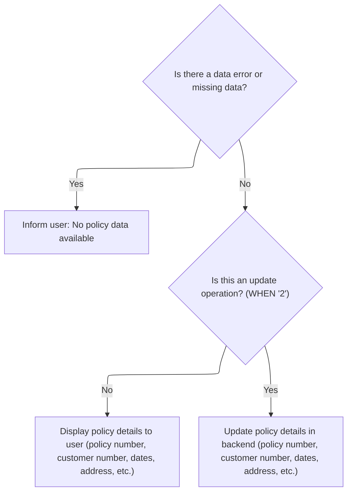
```mermaid
%%{init: {"flowchart": {"defaultRenderer": "elk"}} }%%
flowchart TD
  node1{"Is there a data error or missing data?"}
  node1 -->|"Yes"| node2["Inform user: No policy data available"]
  click node1 openCode "base/src/lgtestp4.cbl:116:118"
  click node2 openCode "base/src/lgtestp4.cbl:117:118"
  node1 -->|"No"| node3{"Is this an update operation? (WHEN '2')"}
  click node3 openCode "base/src/lgtestp4.cbl:146:146"
  node3 -->|"No"| node4["Display policy details to user (policy number, customer number, dates, address, etc.)"]
  click node4 openCode "base/src/lgtestp4.cbl:120:143"
  node3 -->|"Yes"| node5["Update policy details in backend (policy number, customer number, dates, address, etc.)"]
  click node5 openCode "base/src/lgtestp4.cbl:147:171"

classDef HeadingStyle fill:#777777,stroke:#333,stroke-width:2px;

%% Swimm:
%% %%{init: {"flowchart": {"defaultRenderer": "elk"}} }%%
%% flowchart TD
%%   node1{"Is there a data error or missing data?"}
%%   node1 -->|"Yes"| node2["Inform user: No policy data available"]
%%   click node1 openCode "<SwmPath>[base/src/lgtestp4.cbl](base/src/lgtestp4.cbl)</SwmPath>:116:118"
%%   click node2 openCode "<SwmPath>[base/src/lgtestp4.cbl](base/src/lgtestp4.cbl)</SwmPath>:117:118"
%%   node1 -->|"No"| node3{"Is this an update operation? (WHEN '2')"}
%%   click node3 openCode "<SwmPath>[base/src/lgtestp4.cbl](base/src/lgtestp4.cbl)</SwmPath>:146:146"
%%   node3 -->|"No"| node4["Display policy details to user (policy number, customer number, dates, address, etc.)"]
%%   click node4 openCode "<SwmPath>[base/src/lgtestp4.cbl](base/src/lgtestp4.cbl)</SwmPath>:120:143"
%%   node3 -->|"Yes"| node5["Update policy details in backend (policy number, customer number, dates, address, etc.)"]
%%   click node5 openCode "<SwmPath>[base/src/lgtestp4.cbl](base/src/lgtestp4.cbl)</SwmPath>:147:171"
%% 
%% classDef HeadingStyle fill:#777777,stroke:#333,stroke-width:2px;
```

<SwmSnippet path="/base/src/lgtestp4.cbl" line="116">

---

Back in <SwmToken path="base/src/lgtestp4.cbl" pos="24:5:7" line-data="              GO TO B-PROC.">`B-PROC`</SwmToken>, after returning from <SwmToken path="base/src/lgtestp4.cbl" pos="112:10:10" line-data="                 EXEC CICS LINK PROGRAM(&#39;LGIPOL01&#39;)">`LGIPOL01`</SwmToken>, the code checks if <SwmToken path="base/src/lgtestp4.cbl" pos="116:3:7" line-data="                 IF CA-RETURN-CODE &gt; 0">`CA-RETURN-CODE`</SwmToken> is set (meaning an error or no data). If so, it jumps to error handling to show the user an error message.

```cobol
                 IF CA-RETURN-CODE > 0
                   GO TO E-NODAT
                 END-IF
```

---

</SwmSnippet>

<SwmSnippet path="/base/src/lgtestp4.cbl" line="120">

---

If the inquiry succeeded, the code copies policy details from the commarea into the output map fields, prepping them for display to the user.

```cobol
                 Move CA-POLICY-NUM        To  ENP4PNOI
                 Move CA-CUSTOMER-NUM      To  ENP4CNOI
                 Move CA-ISSUE-DATE        To  ENP4IDAI
                 Move CA-EXPIRY-DATE       To  ENP4EDAI
                 Move CA-B-Address         To  ENP4ADDI
                 Move CA-B-PST        To  ENP4HPCI
                 Move CA-B-Latitude        To  ENP4LATI
                 Move CA-B-Longitude       To  ENP4LONI
                 Move CA-B-Customer        To  ENP4CUSI
                 Move CA-B-PropType        To  ENP4PTYI
                 Move CA-B-FP       To  ENP4FPEI
                 Move CA-B-CA-B-FPR     To  ENP4FPRI
                 Move CA-B-CP      To  ENP4CPEI
                 Move CA-B-CPR    To  ENP4CPRI
                 Move CA-B-FLP      To  ENP4XPEI
                 Move CA-B-FLPR    To  ENP4XPRI
                 Move CA-B-WP    To  ENP4WPEI
                 Move CA-B-WPR  To  ENP4WPRI
                 Move CA-B-ST          To  ENP4STAI
                 Move CA-B-RejectReason    To  ENP4REJI
```

---

</SwmSnippet>

<SwmSnippet path="/base/src/lgtestp4.cbl" line="140">

---

After copying the data, the code sends the output map to the terminal so the user sees the policy details.

```cobol
                 EXEC CICS SEND MAP ('XMAPP4')
                           FROM(XMAPP4O)
                           MAPSET ('XMAP')
                 END-EXEC
```

---

</SwmSnippet>

<SwmSnippet path="/base/src/lgtestp4.cbl" line="146">

---

For option '2', the code moves user input fields into the commarea, setting up the data needed to add a new policy.

```cobol
             WHEN '2'
                 Move '01ACOM'             To  CA-REQUEST-ID
                 Move ENP4CNOO             To  CA-CUSTOMER-NUM
                 Move ENP4IDAO             To  CA-ISSUE-DATE
                 Move ENP4EDAO             To  CA-EXPIRY-DATE
                 Move ENP4ADDO             To  CA-B-Address
                 Move ENP4HPCO             To  CA-B-PST
                 Move ENP4LATO             To  CA-B-Latitude
                 Move ENP4LONO             To  CA-B-Longitude
                 Move ENP4CUSO             To  CA-B-Customer
                 Move ENP4PTYO             To  CA-B-PropType
                 Move ENP4FPEO             To  CA-B-FP
                 Move ENP4FPRO             To  CA-B-CA-B-FPR
                 Move ENP4CPEO             To  CA-B-CP
                 Move ENP4CPRO             To  CA-B-CPR
                 Move ENP4XPEO             To  CA-B-FLP
                 Move ENP4XPRO             To  CA-B-FLPR
                 Move ENP4WPEO             To  CA-B-WP
                 Move ENP4WPRO             To  CA-B-WPR
                 Move ENP4STAO             To  CA-B-ST
                 Move ENP4REJO             To  CA-B-RejectReason
```

---

</SwmSnippet>

<SwmSnippet path="/base/src/lgtestp4.cbl" line="168">

---

After prepping the commarea, the code calls <SwmToken path="base/src/lgtestp4.cbl" pos="168:10:10" line-data="                 EXEC CICS LINK PROGRAM(&#39;LGAPOL01&#39;)">`LGAPOL01`</SwmToken> to handle the add policy operation. <SwmToken path="base/src/lgtestp4.cbl" pos="168:10:10" line-data="                 EXEC CICS LINK PROGRAM(&#39;LGAPOL01&#39;)">`LGAPOL01`</SwmToken> will insert the new policy into the database and return the result.

```cobol
                 EXEC CICS LINK PROGRAM('LGAPOL01')
                           COMMAREA(COMM-AREA)
                           LENGTH(32500)
                 END-EXEC
```

---

</SwmSnippet>

## Validating and Inserting Policy Data

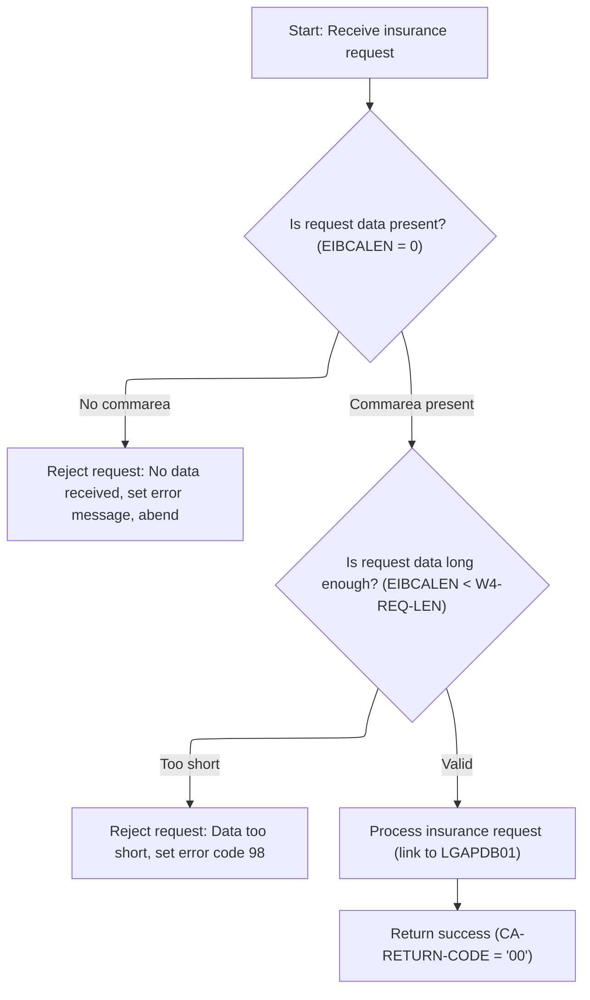
```mermaid
%%{init: {"flowchart": {"defaultRenderer": "elk"}} }%%
flowchart TD
  node1["Start: Receive insurance request"] --> node2{"Is request data present? (EIBCALEN = 0)"}
  click node1 openCode "base/src/lgapol01.cbl:68:83"
  node2 -->|"No commarea"| node3["Reject request: No data received, set error message, abend"]
  click node2 openCode "base/src/lgapol01.cbl:83:87"
  click node3 openCode "base/src/lgapol01.cbl:84:86"
  node2 -->|"Commarea present"| node4{"Is request data long enough? (EIBCALEN < W4-REQ-LEN)"}
  click node4 openCode "base/src/lgapol01.cbl:95:98"
  node4 -->|"Too short"| node5["Reject request: Data too short, set error code 98"]
  click node5 openCode "base/src/lgapol01.cbl:96:97"
  node4 -->|"Valid"| node6["Process insurance request (link to LGAPDB01)"]
  click node6 openCode "base/src/lgapol01.cbl:103:106"
  node6 --> node7["Return success (CA-RETURN-CODE = '00')"]
  click node7 openCode "base/src/lgapol01.cbl:108:108"

classDef HeadingStyle fill:#777777,stroke:#333,stroke-width:2px;

%% Swimm:
%% %%{init: {"flowchart": {"defaultRenderer": "elk"}} }%%
%% flowchart TD
%%   node1["Start: Receive insurance request"] --> node2{"Is request data present? (EIBCALEN = 0)"}
%%   click node1 openCode "<SwmPath>[base/src/lgapol01.cbl](base/src/lgapol01.cbl)</SwmPath>:68:83"
%%   node2 -->|"No commarea"| node3["Reject request: No data received, set error message, abend"]
%%   click node2 openCode "<SwmPath>[base/src/lgapol01.cbl](base/src/lgapol01.cbl)</SwmPath>:83:87"
%%   click node3 openCode "<SwmPath>[base/src/lgapol01.cbl](base/src/lgapol01.cbl)</SwmPath>:84:86"
%%   node2 -->|"Commarea present"| node4{"Is request data long enough? (EIBCALEN < <SwmToken path="base/src/lgapol01.cbl" pos="92:11:15" line-data="           ADD W4-HDR-LEN TO W4-REQ-LEN">`W4-REQ-LEN`</SwmToken>)"}
%%   click node4 openCode "<SwmPath>[base/src/lgapol01.cbl](base/src/lgapol01.cbl)</SwmPath>:95:98"
%%   node4 -->|"Too short"| node5["Reject request: Data too short, set error code 98"]
%%   click node5 openCode "<SwmPath>[base/src/lgapol01.cbl](base/src/lgapol01.cbl)</SwmPath>:96:97"
%%   node4 -->|"Valid"| node6["Process insurance request (link to <SwmToken path="base/src/lgapol01.cbl" pos="103:9:9" line-data="           EXEC CICS Link Program(LGAPDB01)">`LGAPDB01`</SwmToken>)"]
%%   click node6 openCode "<SwmPath>[base/src/lgapol01.cbl](base/src/lgapol01.cbl)</SwmPath>:103:106"
%%   node6 --> node7["Return success (<SwmToken path="base/src/lgtestp4.cbl" pos="116:3:7" line-data="                 IF CA-RETURN-CODE &gt; 0">`CA-RETURN-CODE`</SwmToken> = '00')"]
%%   click node7 openCode "<SwmPath>[base/src/lgapol01.cbl](base/src/lgapol01.cbl)</SwmPath>:108:108"
%% 
%% classDef HeadingStyle fill:#777777,stroke:#333,stroke-width:2px;
```

This section governs the validation and insertion of insurance policy data, ensuring that only complete and valid requests are processed, and that errors are properly logged and communicated to the caller.

| Category        | Rule Name                   | Description                                                                                                                                                         |
| --------------- | --------------------------- | ------------------------------------------------------------------------------------------------------------------------------------------------------------------- |
| Data validation | Missing request data        | If no request data is received, the request must be rejected, an error message must be set, and the error must be logged for auditing purposes.                     |
| Data validation | Minimum request length      | If the request data is present but shorter than the required minimum length, the request must be rejected and an error code of '98' must be returned to the caller. |
| Business logic  | Successful policy insertion | If the request data passes all validations, the insurance policy data must be inserted into the database and a success code of '00' must be returned to the caller. |

<SwmSnippet path="/base/src/lgapol01.cbl" line="68">

---

<SwmToken path="base/src/lgapol01.cbl" pos="68:1:3" line-data="       P100-MAIN SECTION.">`P100-MAIN`</SwmToken> checks the commarea length, logs an error and abends if it's missing or too short, then calls <SwmToken path="base/src/lgapol01.cbl" pos="103:9:9" line-data="           EXEC CICS Link Program(LGAPDB01)">`LGAPDB01`</SwmToken> to handle the actual database insert. If all is good, it returns to the caller.

```cobol
       P100-MAIN SECTION.

      *----------------------------------------------------------------*
      * Common code                                                    *
      *----------------------------------------------------------------*
           INITIALIZE W1-CONTROL.
           MOVE EIBTRNID TO W1-TID.
           MOVE EIBTRMID TO W1-TRM.
           MOVE EIBTASKN TO W1-TSK.
           MOVE EIBCALEN TO W1-LEN.
      *----------------------------------------------------------------*

      *----------------------------------------------------------------*
      * Check commarea and obtain required details                     *
      *----------------------------------------------------------------*
           IF EIBCALEN IS EQUAL TO ZERO
               MOVE ' NO COMMAREA RECEIVED' TO W3-DETAIL
               PERFORM P999-ERROR
               EXEC CICS ABEND ABCODE('LGCA') NODUMP END-EXEC
           END-IF

           MOVE '00' TO CA-RETURN-CODE
           SET W1-PTR TO ADDRESS OF DFHCOMMAREA.

           ADD W4-HDR-LEN TO W4-REQ-LEN


           IF EIBCALEN IS LESS THAN W4-REQ-LEN
             MOVE '98' TO CA-RETURN-CODE
             EXEC CICS RETURN END-EXEC
           END-IF

      *----------------------------------------------------------------*
      *    Perform the data Inserts                                    *
      *----------------------------------------------------------------*
           EXEC CICS Link Program(LGAPDB01)
                Commarea(DFHCOMMAREA)
                LENGTH(32500)
           END-EXEC.

           EXEC CICS RETURN END-EXEC.
```

---

</SwmSnippet>

<SwmSnippet path="/base/src/lgapol01.cbl" line="119">

---

<SwmToken path="base/src/lgapol01.cbl" pos="119:1:3" line-data="       P999-ERROR.">`P999-ERROR`</SwmToken> formats the error info with a timestamp, then calls LGSTSQ to log the error message. If there's commarea data, it also logs up to 90 bytes of that for troubleshooting.

```cobol
       P999-ERROR.
      * Save SQLCODE in message
      * Obtain and format current time and date
           EXEC CICS ASKTIME ABSTIME(W2-TIME)
           END-EXEC
           EXEC CICS FORMATTIME ABSTIME(W2-TIME)
                     MMDDYYYY(W2-DATE1)
                     TIME(W2-DATE2)
           END-EXEC
           MOVE W2-DATE1 TO W3-DATE
           MOVE W2-DATE2 TO W3-TIME
      * Write output message to TDQ
           EXEC CICS LINK PROGRAM('LGSTSQ')
                     COMMAREA(W3-MESSAGE)
                     LENGTH(LENGTH OF W3-MESSAGE)
           END-EXEC.
      * Write 90 bytes or as much as we have of commarea to TDQ
           IF EIBCALEN > 0 THEN
             IF EIBCALEN < 91 THEN
               MOVE DFHCOMMAREA(1:EIBCALEN) TO CA-DATA
               EXEC CICS LINK PROGRAM('LGSTSQ')
                         COMMAREA(CA-ERROR-MSG)
                         LENGTH(LENGTH OF CA-ERROR-MSG)
               END-EXEC
             ELSE
               MOVE DFHCOMMAREA(1:90) TO CA-DATA
               EXEC CICS LINK PROGRAM('LGSTSQ')
                         COMMAREA(CA-ERROR-MSG)
                         LENGTH(LENGTH OF CA-ERROR-MSG)
               END-EXEC
             END-IF
           END-IF.
           EXIT.
```

---

</SwmSnippet>

## Main Policy Processing Workflow

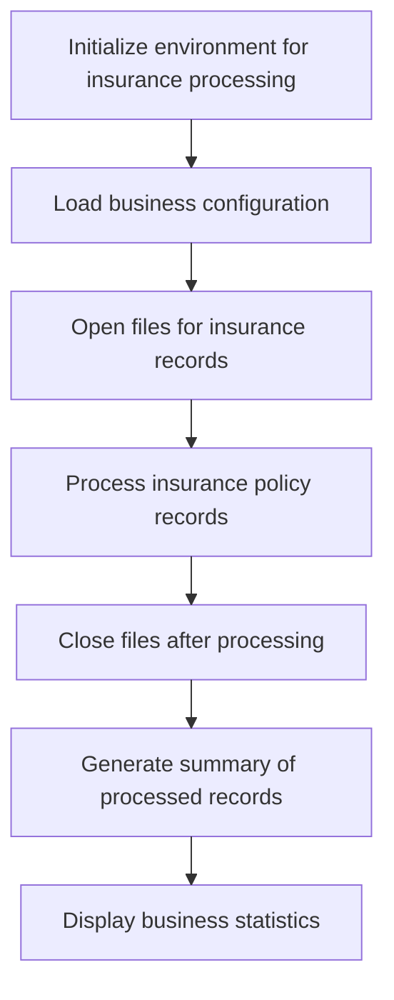
```mermaid
%%{init: {"flowchart": {"defaultRenderer": "elk"}} }%%
flowchart TD
    node1["Initialize environment for insurance processing"]
    click node1 openCode "base/src/LGAPDB01.cbl:91:91"
    node1 --> node2["Load business configuration"]
    click node2 openCode "base/src/LGAPDB01.cbl:92:92"
    node2 --> node3["Open files for insurance records"]
    click node3 openCode "base/src/LGAPDB01.cbl:93:93"
    node3 --> node4["Process insurance policy records"]
    click node4 openCode "base/src/LGAPDB01.cbl:94:94"
    node4 --> node5["Close files after processing"]
    click node5 openCode "base/src/LGAPDB01.cbl:95:95"
    node5 --> node6["Generate summary of processed records"]
    click node6 openCode "base/src/LGAPDB01.cbl:96:96"
    node6 --> node7["Display business statistics"]
    click node7 openCode "base/src/LGAPDB01.cbl:97:97"

classDef HeadingStyle fill:#777777,stroke:#333,stroke-width:2px;

%% Swimm:
%% %%{init: {"flowchart": {"defaultRenderer": "elk"}} }%%
%% flowchart TD
%%     node1["Initialize environment for insurance processing"]
%%     click node1 openCode "<SwmPath>[base/src/LGAPDB01.cbl](base/src/LGAPDB01.cbl)</SwmPath>:91:91"
%%     node1 --> node2["Load business configuration"]
%%     click node2 openCode "<SwmPath>[base/src/LGAPDB01.cbl](base/src/LGAPDB01.cbl)</SwmPath>:92:92"
%%     node2 --> node3["Open files for insurance records"]
%%     click node3 openCode "<SwmPath>[base/src/LGAPDB01.cbl](base/src/LGAPDB01.cbl)</SwmPath>:93:93"
%%     node3 --> node4["Process insurance policy records"]
%%     click node4 openCode "<SwmPath>[base/src/LGAPDB01.cbl](base/src/LGAPDB01.cbl)</SwmPath>:94:94"
%%     node4 --> node5["Close files after processing"]
%%     click node5 openCode "<SwmPath>[base/src/LGAPDB01.cbl](base/src/LGAPDB01.cbl)</SwmPath>:95:95"
%%     node5 --> node6["Generate summary of processed records"]
%%     click node6 openCode "<SwmPath>[base/src/LGAPDB01.cbl](base/src/LGAPDB01.cbl)</SwmPath>:96:96"
%%     node6 --> node7["Display business statistics"]
%%     click node7 openCode "<SwmPath>[base/src/LGAPDB01.cbl](base/src/LGAPDB01.cbl)</SwmPath>:97:97"
%% 
%% classDef HeadingStyle fill:#777777,stroke:#333,stroke-width:2px;
```

This section governs the main workflow for processing insurance policies, ensuring that all records are handled according to business requirements and that summary and statistics are generated for business review.

| Category        | Rule Name                  | Description                                                                                                              |
| --------------- | -------------------------- | ------------------------------------------------------------------------------------------------------------------------ |
| Data validation | Configuration precedence   | Business configuration must be loaded before any policy record is processed to ensure correct business logic is applied. |
| Data validation | File closure integrity     | Files containing insurance policy records must be closed after processing to ensure data integrity and compliance.       |
| Business logic  | Complete record processing | All insurance policy records must be processed in a single workflow run, ensuring no records are skipped.                |
| Business logic  | Summary generation         | A summary of all processed insurance policy records must be generated at the end of the workflow for business review.    |
| Business logic  | Statistics display         | Business statistics must be displayed after processing to provide insights into policy data and operational performance. |

<SwmSnippet path="/base/src/LGAPDB01.cbl" line="90">

---

<SwmToken path="base/src/LGAPDB01.cbl" pos="90:1:1" line-data="       P001.">`P001`</SwmToken> runs the main workflow: initializes data, loads config, opens files, processes all records, closes files, generates a summary, and displays stats. Each step is handled by a separate PERFORM.

```cobol
       P001.
           PERFORM P002-INITIALIZE
           PERFORM P003-LOAD-CONFIG
           PERFORM P005-OPEN-FILES
           PERFORM P006-PROCESS-RECORDS
           PERFORM P014-CLOSE-FILES
           PERFORM P015-GENERATE-SUMMARY
           PERFORM P016-DISPLAY-STATS
           STOP RUN.
```

---

</SwmSnippet>

## Processing Each Policy Record

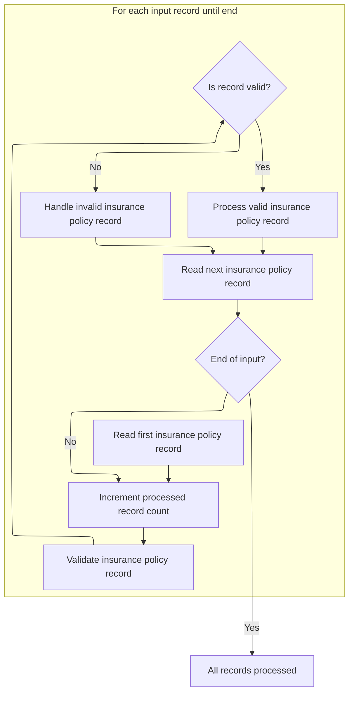
```mermaid
%%{init: {"flowchart": {"defaultRenderer": "elk"}} }%%
flowchart TD
    node1["Read first insurance policy record"]
    click node1 openCode "base/src/LGAPDB01.cbl:179:179"
    subgraph loop1["For each input record until end"]
        node1 --> node2["Increment processed record count"]
        click node2 openCode "base/src/LGAPDB01.cbl:181:181"
        node2 --> node3["Validate insurance policy record"]
        click node3 openCode "base/src/LGAPDB01.cbl:182:182"
        node3 --> node4{"Is record valid?"}
        click node4 openCode "base/src/LGAPDB01.cbl:183:187"
        node4 -->|"Yes"| node5["Process valid insurance policy record"]
        click node5 openCode "base/src/LGAPDB01.cbl:184:184"
        node4 -->|"No"| node6["Handle invalid insurance policy record"]
        click node6 openCode "base/src/LGAPDB01.cbl:186:186"
        node5 --> node7["Read next insurance policy record"]
        node6 --> node7
        click node7 openCode "base/src/LGAPDB01.cbl:188:188"
        node7 --> node8{"End of input?"}
        click node8 openCode "base/src/LGAPDB01.cbl:180:189"
        node8 -->|"No"| node2
    end
    node8 -->|"Yes"| node9["All records processed"]
    click node9 openCode "base/src/LGAPDB01.cbl:189:189"

classDef HeadingStyle fill:#777777,stroke:#333,stroke-width:2px;

%% Swimm:
%% %%{init: {"flowchart": {"defaultRenderer": "elk"}} }%%
%% flowchart TD
%%     node1["Read first insurance policy record"]
%%     click node1 openCode "<SwmPath>[base/src/LGAPDB01.cbl](base/src/LGAPDB01.cbl)</SwmPath>:179:179"
%%     subgraph loop1["For each input record until end"]
%%         node1 --> node2["Increment processed record count"]
%%         click node2 openCode "<SwmPath>[base/src/LGAPDB01.cbl](base/src/LGAPDB01.cbl)</SwmPath>:181:181"
%%         node2 --> node3["Validate insurance policy record"]
%%         click node3 openCode "<SwmPath>[base/src/LGAPDB01.cbl](base/src/LGAPDB01.cbl)</SwmPath>:182:182"
%%         node3 --> node4{"Is record valid?"}
%%         click node4 openCode "<SwmPath>[base/src/LGAPDB01.cbl](base/src/LGAPDB01.cbl)</SwmPath>:183:187"
%%         node4 -->|"Yes"| node5["Process valid insurance policy record"]
%%         click node5 openCode "<SwmPath>[base/src/LGAPDB01.cbl](base/src/LGAPDB01.cbl)</SwmPath>:184:184"
%%         node4 -->|"No"| node6["Handle invalid insurance policy record"]
%%         click node6 openCode "<SwmPath>[base/src/LGAPDB01.cbl](base/src/LGAPDB01.cbl)</SwmPath>:186:186"
%%         node5 --> node7["Read next insurance policy record"]
%%         node6 --> node7
%%         click node7 openCode "<SwmPath>[base/src/LGAPDB01.cbl](base/src/LGAPDB01.cbl)</SwmPath>:188:188"
%%         node7 --> node8{"End of input?"}
%%         click node8 openCode "<SwmPath>[base/src/LGAPDB01.cbl](base/src/LGAPDB01.cbl)</SwmPath>:180:189"
%%         node8 -->|"No"| node2
%%     end
%%     node8 -->|"Yes"| node9["All records processed"]
%%     click node9 openCode "<SwmPath>[base/src/LGAPDB01.cbl](base/src/LGAPDB01.cbl)</SwmPath>:189:189"
%% 
%% classDef HeadingStyle fill:#777777,stroke:#333,stroke-width:2px;
```

This section is responsible for iterating through all insurance policy records, validating each one, and ensuring that valid and invalid records are handled according to business requirements. It keeps track of processing statistics and error details for reporting and audit purposes.

| Category        | Rule Name                           | Description                                                                                                                                                       |
| --------------- | ----------------------------------- | ----------------------------------------------------------------------------------------------------------------------------------------------------------------- |
| Data validation | Mandatory record validation         | Each insurance policy record must be validated before any business processing occurs. Records failing validation are not processed as valid policies.             |
| Business logic  | Valid/invalid record classification | A record is considered valid only if no errors are detected during validation. If any error is found, the record is classified as invalid and handled separately. |
| Business logic  | Processed record counting           | For each processed record, the processed record count is incremented by one. This count is used for reporting and audit purposes.                                 |
| Business logic  | Complete input processing           | Processing continues until the end-of-file condition is reached, ensuring all input records are considered.                                                       |
| Business logic  | Error and warning counting          | Error and warning counts must be maintained and updated for each record, supporting reporting and compliance requirements.                                        |

<SwmSnippet path="/base/src/LGAPDB01.cbl" line="178">

---

<SwmToken path="base/src/LGAPDB01.cbl" pos="178:1:5" line-data="       P006-PROCESS-RECORDS.">`P006-PROCESS-RECORDS`</SwmToken> loops over all input records, validates each one, and either processes it as valid or handles it as an error. This keeps good and bad data separate.

```cobol
       P006-PROCESS-RECORDS.
           PERFORM P007-READ-INPUT
           PERFORM UNTIL INPUT-EOF
               ADD 1 TO WS-REC-CNT
               PERFORM P008-VALIDATE-INPUT-RECORD
               IF WS-ERROR-COUNT = ZERO
                   PERFORM P009-PROCESS-VALID-RECORD
               ELSE
                   PERFORM P010-PROCESS-ERROR-RECORD
               END-IF
               PERFORM P007-READ-INPUT
           END-PERFORM.
```

---

</SwmSnippet>

## Handling Valid Policy Records

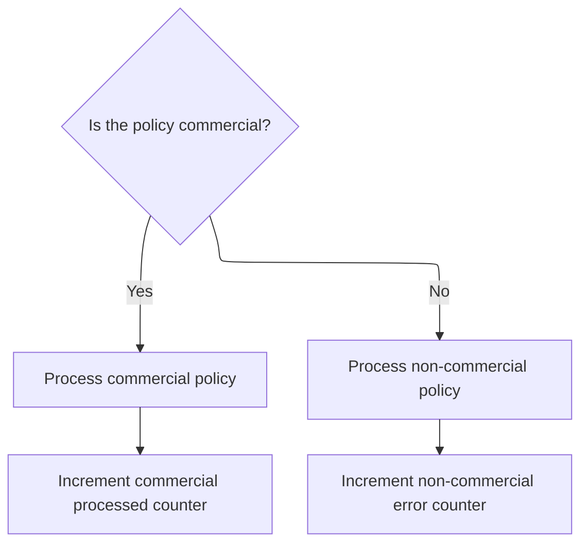
```mermaid
%%{init: {"flowchart": {"defaultRenderer": "elk"}} }%%
flowchart TD
    node1{"Is the policy commercial?"}
    click node1 openCode "base/src/LGAPDB01.cbl:235:241"
    node1 -->|"Yes"| node2["Process commercial policy"]
    click node2 openCode "base/src/LGAPDB01.cbl:236:237"
    node2 --> node4["Increment commercial processed counter"]
    click node4 openCode "base/src/LGAPDB01.cbl:237:237"
    node1 -->|"No"| node3["Process non-commercial policy"]
    click node3 openCode "base/src/LGAPDB01.cbl:239:240"
    node3 --> node5["Increment non-commercial error counter"]
    click node5 openCode "base/src/LGAPDB01.cbl:240:240"

classDef HeadingStyle fill:#777777,stroke:#333,stroke-width:2px;

%% Swimm:
%% %%{init: {"flowchart": {"defaultRenderer": "elk"}} }%%
%% flowchart TD
%%     node1{"Is the policy commercial?"}
%%     click node1 openCode "<SwmPath>[base/src/LGAPDB01.cbl](base/src/LGAPDB01.cbl)</SwmPath>:235:241"
%%     node1 -->|"Yes"| node2["Process commercial policy"]
%%     click node2 openCode "<SwmPath>[base/src/LGAPDB01.cbl](base/src/LGAPDB01.cbl)</SwmPath>:236:237"
%%     node2 --> node4["Increment commercial processed counter"]
%%     click node4 openCode "<SwmPath>[base/src/LGAPDB01.cbl](base/src/LGAPDB01.cbl)</SwmPath>:237:237"
%%     node1 -->|"No"| node3["Process non-commercial policy"]
%%     click node3 openCode "<SwmPath>[base/src/LGAPDB01.cbl](base/src/LGAPDB01.cbl)</SwmPath>:239:240"
%%     node3 --> node5["Increment non-commercial error counter"]
%%     click node5 openCode "<SwmPath>[base/src/LGAPDB01.cbl](base/src/LGAPDB01.cbl)</SwmPath>:240:240"
%% 
%% classDef HeadingStyle fill:#777777,stroke:#333,stroke-width:2px;
```

This section determines whether a valid insurance policy record is commercial or non-commercial. Commercial policies are processed for quoting and statistics, while non-commercial policies are rejected and counted as errors.

| Category       | Rule Name                       | Description                                                                                                                                 |
| -------------- | ------------------------------- | ------------------------------------------------------------------------------------------------------------------------------------------- |
| Business logic | Commercial policy processing    | If a valid policy record is identified as a commercial policy (policy type 'C'), it must be processed for quoting and statistical purposes. |
| Business logic | Commercial processed counter    | Each commercial policy processed must increment the commercial processed counter by one.                                                    |
| Business logic | Non-commercial policy rejection | If a valid policy record is not a commercial policy (policy type not 'C'), it must be rejected and counted as an error.                     |
| Business logic | Non-commercial error counter    | Each non-commercial policy rejected must increment the non-commercial error counter by one.                                                 |

<SwmSnippet path="/base/src/LGAPDB01.cbl" line="234">

---

<SwmToken path="base/src/LGAPDB01.cbl" pos="234:1:7" line-data="       P009-PROCESS-VALID-RECORD.">`P009-PROCESS-VALID-RECORD`</SwmToken> checks if the policy is commercial. If so, it processes it for quoting and stats; otherwise, it rejects it and counts it as an error.

```cobol
       P009-PROCESS-VALID-RECORD.
           IF COMMERCIAL-POLICY
               PERFORM P011-PROCESS-COMMERCIAL
               ADD 1 TO WS-PROC-CNT
           ELSE
               PERFORM P012-PROCESS-NON-COMMERCIAL
               ADD 1 TO WS-ERR-CNT
           END-IF.
```

---

</SwmSnippet>

## Calculating Commercial Policy Quotes

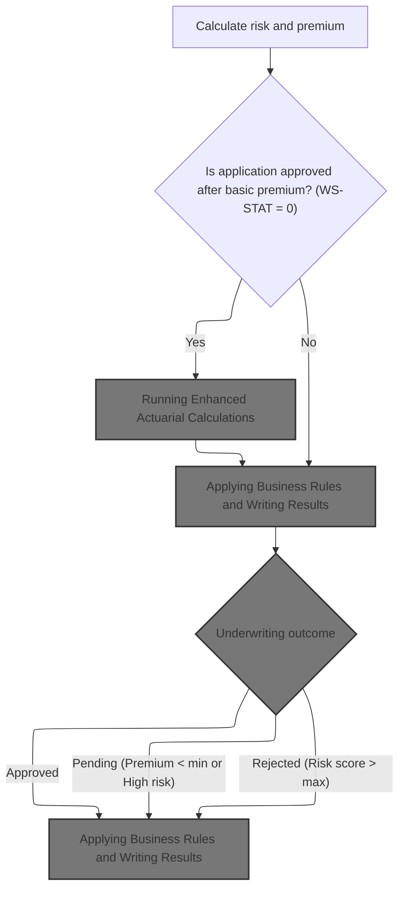
```mermaid
%%{init: {"flowchart": {"defaultRenderer": "elk"}} }%%
flowchart TD
  node1["Calculate risk and premium"] --> node2{"Is application approved after basic premium? (WS-STAT = 0)"}
  click node1 openCode "base/src/LGAPDB01.cbl:258:266"
  node2 -->|"Yes"| node3["Running Enhanced Actuarial Calculations"]
  click node2 openCode "base/src/LGAPDB01.cbl:261:263"
  node2 -->|"No"| node4["Applying Business Rules and Writing Results"]
  
  node3 --> node4
  node4 --> node5{"Underwriting outcome"}
  
  node5 -->|"Rejected (Risk score > max)"| node6["Applying Business Rules and Writing Results"]
  node5 -->|"Pending (Premium < min or High risk)"| node6
  node5 -->|"Approved"| node6
  
  
classDef HeadingStyle fill:#777777,stroke:#333,stroke-width:2px;
click node3 goToHeading "Running Enhanced Actuarial Calculations"
node3:::HeadingStyle
click node4 goToHeading "Applying Business Rules and Writing Results"
node4:::HeadingStyle
click node5 goToHeading "Applying Business Rules and Writing Results"
node5:::HeadingStyle
click node6 goToHeading "Applying Business Rules and Writing Results"
node6:::HeadingStyle

%% Swimm:
%% %%{init: {"flowchart": {"defaultRenderer": "elk"}} }%%
%% flowchart TD
%%   node1["Calculate risk and premium"] --> node2{"Is application approved after basic premium? (<SwmToken path="base/src/LGAPDB01.cbl" pos="261:3:5" line-data="           IF WS-STAT = 0">`WS-STAT`</SwmToken> = 0)"}
%%   click node1 openCode "<SwmPath>[base/src/LGAPDB01.cbl](base/src/LGAPDB01.cbl)</SwmPath>:258:266"
%%   node2 -->|"Yes"| node3["Running Enhanced Actuarial Calculations"]
%%   click node2 openCode "<SwmPath>[base/src/LGAPDB01.cbl](base/src/LGAPDB01.cbl)</SwmPath>:261:263"
%%   node2 -->|"No"| node4["Applying Business Rules and Writing Results"]
%%   
%%   node3 --> node4
%%   node4 --> node5{"Underwriting outcome"}
%%   
%%   node5 -->|"Rejected (Risk score > max)"| node6["Applying Business Rules and Writing Results"]
%%   node5 -->|"Pending (Premium < min or High risk)"| node6
%%   node5 -->|"Approved"| node6
%%   
%%   
%% classDef HeadingStyle fill:#777777,stroke:#333,stroke-width:2px;
%% click node3 goToHeading "Running Enhanced Actuarial Calculations"
%% node3:::HeadingStyle
%% click node4 goToHeading "Applying Business Rules and Writing Results"
%% node4:::HeadingStyle
%% click node5 goToHeading "Applying Business Rules and Writing Results"
%% node5:::HeadingStyle
%% click node6 goToHeading "Applying Business Rules and Writing Results"
%% node6:::HeadingStyle
```

This section governs how commercial insurance policy quotes are calculated, including risk assessment, premium calculation, application of business rules, and determination of the underwriting outcome. It ensures that each policy application is evaluated consistently and that the correct decision and premium are produced based on business criteria.

| Category        | Rule Name                             | Description                                                                                                                                                                          |
| --------------- | ------------------------------------- | ------------------------------------------------------------------------------------------------------------------------------------------------------------------------------------ |
| Data validation | Underwriting decision recording       | The underwriting decision must be clearly recorded as one of: approved, pending, rejected, or referred, with an appropriate description and, if rejected, a reason provided.         |
| Data validation | Output and statistics update          | All calculated premiums, discounts, and underwriting decisions must be written to the output record and statistics updated for reporting and audit purposes.                         |
| Business logic  | Enhanced actuarial eligibility        | A policy application is only eligible for enhanced actuarial calculations if it is initially approved after the basic premium calculation (i.e., underwriting status is 'approved'). |
| Business logic  | Maximum risk rejection                | If the risk score for a policy application exceeds the maximum allowable threshold, the application must be rejected and the rejection reason recorded.                              |
| Business logic  | Minimum premium and high risk pending | If the calculated premium is below the minimum required premium or the risk is considered high, the application status must be set to 'pending' for further review.                  |
| Business logic  | Discount eligibility                  | Discounts may only be applied if the applicant meets specific eligibility criteria, such as multi-policy, claims-free, or safety program participation.                              |

<SwmSnippet path="/base/src/LGAPDB01.cbl" line="258">

---

In <SwmToken path="base/src/LGAPDB01.cbl" pos="258:1:5" line-data="       P011-PROCESS-COMMERCIAL.">`P011-PROCESS-COMMERCIAL`</SwmToken>, the code runs through risk scoring, basic and enhanced premium calculations, applies business rules, writes the output, and updates stats. Each step is a separate PERFORM for clarity and modularity.

```cobol
       P011-PROCESS-COMMERCIAL.
           PERFORM P011A-CALCULATE-RISK-SCORE
           PERFORM P011B-BASIC-PREMIUM-CALC
           IF WS-STAT = 0
               PERFORM P011C-ENHANCED-ACTUARIAL-CALC
           END-IF
           PERFORM P011D-APPLY-BUSINESS-RULES
           PERFORM P011E-WRITE-OUTPUT-RECORD
           PERFORM P011F-UPDATE-STATISTICS.
```

---

</SwmSnippet>

### Calculating Basic Premiums for Commercial Policies

This section governs the calculation of basic premiums for commercial insurance policies, ensuring that risk factors, discounts, and loadings are applied according to business rules to produce an accurate premium breakdown and underwriting decision.

| Category       | Rule Name                       | Description                                                                                                                                                                                                    |
| -------------- | ------------------------------- | -------------------------------------------------------------------------------------------------------------------------------------------------------------------------------------------------------------- |
| Business logic | Peril-based premium calculation | Commercial policies must have their premiums calculated for each covered peril: fire, crime, flood, and weather. Each peril's premium is determined based on the associated risk factors and property details. |
| Business logic | Discount eligibility adjustment | Premiums must be adjusted based on eligibility for multi-policy, claims-free, and safety program discounts, as indicated by the discount eligibility flags.                                                    |
| Business logic | Underwriting decision status    | The underwriting decision must be set to 'approved', 'pending', 'rejected', or 'referred' based on the calculated risk and premium outcome.                                                                    |
| Business logic | Flood zone risk classification  | Flood zone risk must be classified as high, medium, or low based on the property’s flood zone code, and premiums must reflect this classification.                                                             |
| Business logic | Taxes and fees inclusion        | Premiums must include applicable state and county taxes, as well as policy and inspection fees, in the final total premium.                                                                                    |

<SwmSnippet path="/base/src/LGAPDB01.cbl" line="275">

---

<SwmToken path="base/src/LGAPDB01.cbl" pos="275:1:7" line-data="       P011B-BASIC-PREMIUM-CALC.">`P011B-BASIC-PREMIUM-CALC`</SwmToken> calls <SwmToken path="base/src/LGAPDB01.cbl" pos="276:4:4" line-data="           CALL &#39;LGAPDB03&#39; USING WS-BASE-RISK-SCR, IN-FIRE-PERIL, ">`LGAPDB03`</SwmToken> to do the heavy lifting for risk factor lookup, verdict calculation, and premium math. This keeps the premium calculation logic separate and focused.

```cobol
       P011B-BASIC-PREMIUM-CALC.
           CALL 'LGAPDB03' USING WS-BASE-RISK-SCR, IN-FIRE-PERIL, 
                                IN-CRIME-PERIL, IN-FLOOD-PERIL, 
                                IN-WEATHER-PERIL, WS-STAT,
                                WS-STAT-DESC, WS-REJ-RSN, WS-FR-PREM,
                                WS-CR-PREM, WS-FL-PREM, WS-WE-PREM,
                                WS-TOT-PREM, WS-DISC-FACT.
```

---

</SwmSnippet>

### Running Risk Assessment and Premium Calculation Logic

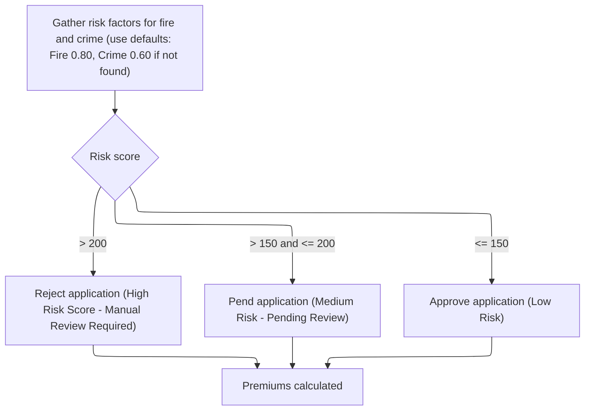
```mermaid
%%{init: {"flowchart": {"defaultRenderer": "elk"}} }%%
flowchart TD
    node1["Gather risk factors for fire and crime (use defaults: Fire 0.80, Crime 0.60 if not found)"] --> node2{"Risk score"}
    click node1 openCode "base/src/LGAPDB03.cbl:48:71"
    node2 -->|"#gt; 200"| node3["Reject application (High Risk Score - Manual Review Required)"]
    click node2 openCode "base/src/LGAPDB03.cbl:73:90"
    node2 -->|"#gt; 150 and <= 200"| node4["Pend application (Medium Risk - Pending Review)"]
    node2 -->|"#lt;= 150"| node5["Approve application (Low Risk)"]
    node3 --> node6["Calculate premiums"]
    click node3 openCode "base/src/LGAPDB03.cbl:74:78"
    node4 --> node6
    click node4 openCode "base/src/LGAPDB03.cbl:80:84"
    node5 --> node6
    click node5 openCode "base/src/LGAPDB03.cbl:86:88"
    node6["Premiums calculated"]
    click node6 openCode "base/src/LGAPDB03.cbl:45:45"
classDef HeadingStyle fill:#777777,stroke:#333,stroke-width:2px;

%% Swimm:
%% %%{init: {"flowchart": {"defaultRenderer": "elk"}} }%%
%% flowchart TD
%%     node1["Gather risk factors for fire and crime (use defaults: Fire <SwmToken path="base/src/LGAPDB03.cbl" pos="58:3:5" line-data="               MOVE 0.80 TO WS-FIRE-FACTOR">`0.80`</SwmToken>, Crime <SwmToken path="base/src/LGAPDB03.cbl" pos="70:3:5" line-data="               MOVE 0.60 TO WS-CRIME-FACTOR">`0.60`</SwmToken> if not found)"] --> node2{"Risk score"}
%%     click node1 openCode "<SwmPath>[base/src/LGAPDB03.cbl](base/src/LGAPDB03.cbl)</SwmPath>:48:71"
%%     node2 -->|"#gt; 200"| node3["Reject application (High Risk Score - Manual Review Required)"]
%%     click node2 openCode "<SwmPath>[base/src/LGAPDB03.cbl](base/src/LGAPDB03.cbl)</SwmPath>:73:90"
%%     node2 -->|"#gt; 150 and <= 200"| node4["Pend application (Medium Risk - Pending Review)"]
%%     node2 -->|"#lt;= 150"| node5["Approve application (Low Risk)"]
%%     node3 --> node6["Calculate premiums"]
%%     click node3 openCode "<SwmPath>[base/src/LGAPDB03.cbl](base/src/LGAPDB03.cbl)</SwmPath>:74:78"
%%     node4 --> node6
%%     click node4 openCode "<SwmPath>[base/src/LGAPDB03.cbl](base/src/LGAPDB03.cbl)</SwmPath>:80:84"
%%     node5 --> node6
%%     click node5 openCode "<SwmPath>[base/src/LGAPDB03.cbl](base/src/LGAPDB03.cbl)</SwmPath>:86:88"
%%     node6["Premiums calculated"]
%%     click node6 openCode "<SwmPath>[base/src/LGAPDB03.cbl](base/src/LGAPDB03.cbl)</SwmPath>:45:45"
%% classDef HeadingStyle fill:#777777,stroke:#333,stroke-width:2px;
```

This section governs the business logic for risk assessment and premium calculation for insurance applications. It determines the application status (approved, pending, rejected) based on risk score thresholds and ensures premiums are calculated using the correct risk factors.

| Category       | Rule Name                                 | Description                                                                                                                                                                                                                                                                                                                                                      |
| -------------- | ----------------------------------------- | ---------------------------------------------------------------------------------------------------------------------------------------------------------------------------------------------------------------------------------------------------------------------------------------------------------------------------------------------------------------- |
| Business logic | Default risk factor fallback              | If risk factor data for fire or crime is not available, use default values of <SwmToken path="base/src/LGAPDB03.cbl" pos="58:3:5" line-data="               MOVE 0.80 TO WS-FIRE-FACTOR">`0.80`</SwmToken> for fire and <SwmToken path="base/src/LGAPDB03.cbl" pos="70:3:5" line-data="               MOVE 0.60 TO WS-CRIME-FACTOR">`0.60`</SwmToken> for crime. |
| Business logic | High risk rejection                       | If the calculated risk score is greater than 200, the application must be rejected and flagged for manual review with the reason 'High Risk Score - Manual Review Required'.                                                                                                                                                                                     |
| Business logic | Medium risk pending                       | If the risk score is greater than 150 but less than or equal to 200, the application must be pended for further review with the reason 'Medium Risk - Pending Review'.                                                                                                                                                                                           |
| Business logic | Low risk approval                         | If the risk score is 150 or less, the application must be approved and no rejection reason is set.                                                                                                                                                                                                                                                               |
| Business logic | Premium calculation based on risk factors | Premiums must be calculated using the risk factors for fire and crime, whether retrieved from the database or defaulted.                                                                                                                                                                                                                                         |

<SwmSnippet path="/base/src/LGAPDB03.cbl" line="42">

---

<SwmToken path="base/src/LGAPDB03.cbl" pos="42:1:3" line-data="       MAIN-LOGIC.">`MAIN-LOGIC`</SwmToken> in <SwmPath>[base/src/LGAPDB03.cbl](base/src/LGAPDB03.cbl)</SwmPath> runs the risk factor lookup, verdict decision, and premium calculation steps in order. This keeps the risk and premium logic isolated from the main workflow.

```cobol
       MAIN-LOGIC.
           PERFORM GET-RISK-FACTORS
           PERFORM CALCULATE-VERDICT
           PERFORM CALCULATE-PREMIUMS
           GOBACK.
```

---

</SwmSnippet>

<SwmSnippet path="/base/src/LGAPDB03.cbl" line="48">

---

<SwmToken path="base/src/LGAPDB03.cbl" pos="48:1:5" line-data="       GET-RISK-FACTORS.">`GET-RISK-FACTORS`</SwmToken> grabs risk factor values for FIRE and CRIME from the database. If the lookup fails, it falls back to hardcoded defaults (<SwmToken path="base/src/LGAPDB03.cbl" pos="58:3:5" line-data="               MOVE 0.80 TO WS-FIRE-FACTOR">`0.80`</SwmToken> and <SwmToken path="base/src/LGAPDB03.cbl" pos="70:3:5" line-data="               MOVE 0.60 TO WS-CRIME-FACTOR">`0.60`</SwmToken>), which directly impact the premium math.

```cobol
       GET-RISK-FACTORS.
           EXEC SQL
               SELECT FACTOR_VALUE INTO :WS-FIRE-FACTOR
               FROM RISK_FACTORS
               WHERE PERIL_TYPE = 'FIRE'
           END-EXEC.
           
           IF SQLCODE = 0
               CONTINUE
           ELSE
               MOVE 0.80 TO WS-FIRE-FACTOR
           END-IF.
           
           EXEC SQL
               SELECT FACTOR_VALUE INTO :WS-CRIME-FACTOR
               FROM RISK_FACTORS
               WHERE PERIL_TYPE = 'CRIME'
           END-EXEC.
           
           IF SQLCODE = 0
               CONTINUE
           ELSE
               MOVE 0.60 TO WS-CRIME-FACTOR
           END-IF.
```

---

</SwmSnippet>

<SwmSnippet path="/base/src/LGAPDB03.cbl" line="73">

---

<SwmToken path="base/src/LGAPDB03.cbl" pos="73:1:3" line-data="       CALCULATE-VERDICT.">`CALCULATE-VERDICT`</SwmToken> checks the risk score against 200 and 150, then sets the status code and description. These cutoffs decide if the policy is approved, pending, or rejected, and the rejection reason is set accordingly.

```cobol
       CALCULATE-VERDICT.
           IF LK-RISK-SCORE > 200
             MOVE 2 TO LK-STAT
             MOVE 'REJECTED' TO LK-STAT-DESC
             MOVE 'High Risk Score - Manual Review Required' 
               TO LK-REJ-RSN
           ELSE
             IF LK-RISK-SCORE > 150
               MOVE 1 TO LK-STAT
               MOVE 'PENDING' TO LK-STAT-DESC
               MOVE 'Medium Risk - Pending Review'
                 TO LK-REJ-RSN
             ELSE
               MOVE 0 TO LK-STAT
               MOVE 'APPROVED' TO LK-STAT-DESC
               MOVE SPACES TO LK-REJ-RSN
             END-IF
           END-IF.
```

---

</SwmSnippet>

### Running Enhanced Actuarial Calculations


```mermaid
%%{init: {"flowchart": {"defaultRenderer": "elk"}} }%%
flowchart TD
    node1["Prepare policy and risk data for actuarial calculation"]
    click node1 openCode "base/src/LGAPDB01.cbl:283:311"
    node1 --> node2{"Is total premium (WS-TOT-PREM) > minimum premium (WS-MIN-PREMIUM)?"}
    click node2 openCode "base/src/LGAPDB01.cbl:312:312"
    node2 -->|"Yes"| node3["Run advanced actuarial calculation (LGAPDB04)"]
    click node3 openCode "base/src/LGAPDB01.cbl:313:315"
    node2 -->|"No"| node6["Return policy results (no change)"]
    click node6 openCode "base/src/LGAPDB01.cbl:325:325"
    node3 --> node4{"Is enhanced total premium (LK-TOTAL-PREMIUM) > original (WS-TOT-PREM)?"}
    click node4 openCode "base/src/LGAPDB01.cbl:317:317"
    node4 -->|"Yes"| node5["Update policy: enhanced premium components and experience modifier"]
    click node5 openCode "base/src/LGAPDB01.cbl:318:324"
    node4 -->|"No"| node6
    node5 --> node6
classDef HeadingStyle fill:#777777,stroke:#333,stroke-width:2px;

%% Swimm:
%% %%{init: {"flowchart": {"defaultRenderer": "elk"}} }%%
%% flowchart TD
%%     node1["Prepare policy and risk data for actuarial calculation"]
%%     click node1 openCode "<SwmPath>[base/src/LGAPDB01.cbl](base/src/LGAPDB01.cbl)</SwmPath>:283:311"
%%     node1 --> node2{"Is total premium (<SwmToken path="base/src/LGAPDB01.cbl" pos="281:1:5" line-data="                                WS-TOT-PREM, WS-DISC-FACT.">`WS-TOT-PREM`</SwmToken>) > minimum premium (<SwmToken path="base/src/LGAPDB01.cbl" pos="312:11:15" line-data="           IF WS-TOT-PREM &gt; WS-MIN-PREMIUM">`WS-MIN-PREMIUM`</SwmToken>)?"}
%%     click node2 openCode "<SwmPath>[base/src/LGAPDB01.cbl](base/src/LGAPDB01.cbl)</SwmPath>:312:312"
%%     node2 -->|"Yes"| node3["Run advanced actuarial calculation (<SwmToken path="base/src/LGAPDB01.cbl" pos="313:4:4" line-data="               CALL &#39;LGAPDB04&#39; USING LK-INPUT-DATA, LK-COVERAGE-DATA, ">`LGAPDB04`</SwmToken>)"]
%%     click node3 openCode "<SwmPath>[base/src/LGAPDB01.cbl](base/src/LGAPDB01.cbl)</SwmPath>:313:315"
%%     node2 -->|"No"| node6["Return policy results (no change)"]
%%     click node6 openCode "<SwmPath>[base/src/LGAPDB01.cbl](base/src/LGAPDB01.cbl)</SwmPath>:325:325"
%%     node3 --> node4{"Is enhanced total premium (<SwmToken path="base/src/LGAPDB01.cbl" pos="317:3:7" line-data="               IF LK-TOTAL-PREMIUM &gt; WS-TOT-PREM">`LK-TOTAL-PREMIUM`</SwmToken>) > original (<SwmToken path="base/src/LGAPDB01.cbl" pos="281:1:5" line-data="                                WS-TOT-PREM, WS-DISC-FACT.">`WS-TOT-PREM`</SwmToken>)?"}
%%     click node4 openCode "<SwmPath>[base/src/LGAPDB01.cbl](base/src/LGAPDB01.cbl)</SwmPath>:317:317"
%%     node4 -->|"Yes"| node5["Update policy: enhanced premium components and experience modifier"]
%%     click node5 openCode "<SwmPath>[base/src/LGAPDB01.cbl](base/src/LGAPDB01.cbl)</SwmPath>:318:324"
%%     node4 -->|"No"| node6
%%     node5 --> node6
%% classDef HeadingStyle fill:#777777,stroke:#333,stroke-width:2px;
```

This section determines whether a policy is eligible for enhanced actuarial calculations based on its premium, and updates the policy with improved premium components if the advanced calculation yields a higher premium.

| Category        | Rule Name                            | Description                                                                                                                                                                                    |
| --------------- | ------------------------------------ | ---------------------------------------------------------------------------------------------------------------------------------------------------------------------------------------------- |
| Data validation | Minimum premium threshold            | If the policy's total premium is less than or equal to the minimum premium (currently $500.00), enhanced actuarial calculations are not performed and the policy results remain unchanged.     |
| Business logic  | Eligibility for enhanced calculation | Enhanced actuarial calculations are only performed for policies where the total premium exceeds the minimum premium threshold.                                                                 |
| Business logic  | Update on improved premium           | If the enhanced actuarial calculation produces a total premium greater than the original, the policy's premium components and experience modifier are updated to reflect the enhanced results. |
| Business logic  | No update on non-improved premium    | If the enhanced actuarial calculation does not yield a higher total premium, the original policy premium and components are retained without change.                                           |

<SwmSnippet path="/base/src/LGAPDB01.cbl" line="283">

---

<SwmToken path="base/src/LGAPDB01.cbl" pos="283:1:7" line-data="       P011C-ENHANCED-ACTUARIAL-CALC.">`P011C-ENHANCED-ACTUARIAL-CALC`</SwmToken> sets up all the input data and calls <SwmToken path="base/src/LGAPDB01.cbl" pos="313:4:4" line-data="               CALL &#39;LGAPDB04&#39; USING LK-INPUT-DATA, LK-COVERAGE-DATA, ">`LGAPDB04`</SwmToken> for advanced premium calculations, but only if the initial premium is above the minimum. If the enhanced premium is better, it updates the results.

```cobol
       P011C-ENHANCED-ACTUARIAL-CALC.
      *    Prepare input structure for actuarial calculation
           MOVE IN-CUSTOMER-NUM TO LK-CUSTOMER-NUM
           MOVE WS-BASE-RISK-SCR TO LK-RISK-SCORE
           MOVE IN-PROPERTY-TYPE TO LK-PROPERTY-TYPE
           MOVE IN-TERRITORY-CODE TO LK-TERRITORY
           MOVE IN-CONSTRUCTION-TYPE TO LK-CONSTRUCTION-TYPE
           MOVE IN-OCCUPANCY-CODE TO LK-OCCUPANCY-CODE
           MOVE IN-SPRINKLER-IND TO LK-PROTECTION-CLASS
           MOVE IN-YEAR-BUILT TO LK-YEAR-BUILT
           MOVE IN-SQUARE-FOOTAGE TO LK-SQUARE-FOOTAGE
           MOVE IN-YEARS-IN-BUSINESS TO LK-YEARS-IN-BUSINESS
           MOVE IN-CLAIMS-COUNT-3YR TO LK-CLAIMS-COUNT-5YR
           MOVE IN-CLAIMS-AMOUNT-3YR TO LK-CLAIMS-AMOUNT-5YR
           
      *    Set coverage data
           MOVE IN-BUILDING-LIMIT TO LK-BUILDING-LIMIT
           MOVE IN-CONTENTS-LIMIT TO LK-CONTENTS-LIMIT
           MOVE IN-BI-LIMIT TO LK-BI-LIMIT
           MOVE IN-FIRE-DEDUCTIBLE TO LK-FIRE-DEDUCTIBLE
           MOVE IN-WIND-DEDUCTIBLE TO LK-WIND-DEDUCTIBLE
           MOVE IN-FLOOD-DEDUCTIBLE TO LK-FLOOD-DEDUCTIBLE
           MOVE IN-OTHER-DEDUCTIBLE TO LK-OTHER-DEDUCTIBLE
           MOVE IN-FIRE-PERIL TO LK-FIRE-PERIL
           MOVE IN-CRIME-PERIL TO LK-CRIME-PERIL
           MOVE IN-FLOOD-PERIL TO LK-FLOOD-PERIL
           MOVE IN-WEATHER-PERIL TO LK-WEATHER-PERIL
           
      *    Call advanced actuarial calculation program (only for approved cases)
           IF WS-TOT-PREM > WS-MIN-PREMIUM
               CALL 'LGAPDB04' USING LK-INPUT-DATA, LK-COVERAGE-DATA, 
                                    LK-OUTPUT-RESULTS
               
      *        Update with enhanced calculations if successful
               IF LK-TOTAL-PREMIUM > WS-TOT-PREM
                   MOVE LK-FIRE-PREMIUM TO WS-FR-PREM
                   MOVE LK-CRIME-PREMIUM TO WS-CR-PREM
                   MOVE LK-FLOOD-PREMIUM TO WS-FL-PREM
                   MOVE LK-WEATHER-PREMIUM TO WS-WE-PREM
                   MOVE LK-TOTAL-PREMIUM TO WS-TOT-PREM
                   MOVE LK-EXPERIENCE-MOD TO WS-EXPERIENCE-MOD
               END-IF
           END-IF.
```

---

</SwmSnippet>

### Calculating Detailed Premium Components


```mermaid
%%{init: {"flowchart": {"defaultRenderer": "elk"}} }%%
flowchart TD
    node1["Calculate exposures and total insured value"] --> node2{"Years in business >= 5?"}
    click node1 openCode "base/src/LGAPDB04.cbl:152:174"
    node2 -->|"Yes"| node3{"Claims count in 5 years = 0?"}
    node2 -->|"No"| node4["Set experience mod to 1.10"]
    click node2 openCode "base/src/LGAPDB04.cbl:237:256"
    node3 -->|"Yes"| node5["Set experience mod to 0.85"]
    node3 -->|"No"| node6["Calculate experience mod based on claims amount"]
    click node3 openCode "base/src/LGAPDB04.cbl:238:253"
    node5 --> node7["Calculate schedule modification (building age, protection class, occupancy, exposure density)"]
    node6 --> node7
    node4 --> node7
    click node5 openCode "base/src/LGAPDB04.cbl:239:240"
    click node6 openCode "base/src/LGAPDB04.cbl:241:252"
    click node4 openCode "base/src/LGAPDB04.cbl:255:256"
    node7["Calculate schedule modification (building age, protection class, occupancy, exposure density)"] --> node8["Calculate peril premiums (fire, crime, flood, weather) if coverage present"]
    click node7 openCode "base/src/LGAPDB04.cbl:260:316"
    node8 --> node9["Apply discounts (multi-peril, claims-free, deductible credit, cap at 25%)"]
    click node8 openCode "base/src/LGAPDB04.cbl:318:367"
    node9 --> node10["Calculate taxes"]
    click node9 openCode "base/src/LGAPDB04.cbl:407:454"
    node10 --> node11{"Is final rate factor > 0.05?"}
    click node10 openCode "base/src/LGAPDB04.cbl:456:462"
    node11 -->|"Yes"| node12["Cap rate factor at 0.05 and recalculate premium"]
    node11 -->|"No"| node13["Return final premium and rate factor"]
    click node11 openCode "base/src/LGAPDB04.cbl:473:477"
    click node12 openCode "base/src/LGAPDB04.cbl:474:476"
    click node13 openCode "base/src/LGAPDB04.cbl:465:472"
classDef HeadingStyle fill:#777777,stroke:#333,stroke-width:2px;

%% Swimm:
%% %%{init: {"flowchart": {"defaultRenderer": "elk"}} }%%
%% flowchart TD
%%     node1["Calculate exposures and total insured value"] --> node2{"Years in business >= 5?"}
%%     click node1 openCode "<SwmPath>[base/src/LGAPDB04.cbl](base/src/LGAPDB04.cbl)</SwmPath>:152:174"
%%     node2 -->|"Yes"| node3{"Claims count in 5 years = 0?"}
%%     node2 -->|"No"| node4["Set experience mod to 1.10"]
%%     click node2 openCode "<SwmPath>[base/src/LGAPDB04.cbl](base/src/LGAPDB04.cbl)</SwmPath>:237:256"
%%     node3 -->|"Yes"| node5["Set experience mod to 0.85"]
%%     node3 -->|"No"| node6["Calculate experience mod based on claims amount"]
%%     click node3 openCode "<SwmPath>[base/src/LGAPDB04.cbl](base/src/LGAPDB04.cbl)</SwmPath>:238:253"
%%     node5 --> node7["Calculate schedule modification (building age, protection class, occupancy, exposure density)"]
%%     node6 --> node7
%%     node4 --> node7
%%     click node5 openCode "<SwmPath>[base/src/LGAPDB04.cbl](base/src/LGAPDB04.cbl)</SwmPath>:239:240"
%%     click node6 openCode "<SwmPath>[base/src/LGAPDB04.cbl](base/src/LGAPDB04.cbl)</SwmPath>:241:252"
%%     click node4 openCode "<SwmPath>[base/src/LGAPDB04.cbl](base/src/LGAPDB04.cbl)</SwmPath>:255:256"
%%     node7["Calculate schedule modification (building age, protection class, occupancy, exposure density)"] --> node8["Calculate peril premiums (fire, crime, flood, weather) if coverage present"]
%%     click node7 openCode "<SwmPath>[base/src/LGAPDB04.cbl](base/src/LGAPDB04.cbl)</SwmPath>:260:316"
%%     node8 --> node9["Apply discounts (multi-peril, claims-free, deductible credit, cap at 25%)"]
%%     click node8 openCode "<SwmPath>[base/src/LGAPDB04.cbl](base/src/LGAPDB04.cbl)</SwmPath>:318:367"
%%     node9 --> node10["Calculate taxes"]
%%     click node9 openCode "<SwmPath>[base/src/LGAPDB04.cbl](base/src/LGAPDB04.cbl)</SwmPath>:407:454"
%%     node10 --> node11{"Is final rate factor > 0.05?"}
%%     click node10 openCode "<SwmPath>[base/src/LGAPDB04.cbl](base/src/LGAPDB04.cbl)</SwmPath>:456:462"
%%     node11 -->|"Yes"| node12["Cap rate factor at 0.05 and recalculate premium"]
%%     node11 -->|"No"| node13["Return final premium and rate factor"]
%%     click node11 openCode "<SwmPath>[base/src/LGAPDB04.cbl](base/src/LGAPDB04.cbl)</SwmPath>:473:477"
%%     click node12 openCode "<SwmPath>[base/src/LGAPDB04.cbl](base/src/LGAPDB04.cbl)</SwmPath>:474:476"
%%     click node13 openCode "<SwmPath>[base/src/LGAPDB04.cbl](base/src/LGAPDB04.cbl)</SwmPath>:465:472"
%% classDef HeadingStyle fill:#777777,stroke:#333,stroke-width:2px;
```

This section calculates the detailed premium components for an insurance policy, including exposures, experience and schedule modifiers, peril-specific premiums, discounts, taxes, and the final premium and rate factor. The process ensures that all relevant business rules and caps are applied to produce a compliant and accurate premium calculation.

| Category       | Rule Name                  | Description                                                                                                                                                                                                                                                                                                                                                                                                                                                                                                                 |
| -------------- | -------------------------- | --------------------------------------------------------------------------------------------------------------------------------------------------------------------------------------------------------------------------------------------------------------------------------------------------------------------------------------------------------------------------------------------------------------------------------------------------------------------------------------------------------------------------- |
| Business logic | Exposure calculation       | The exposures for building, contents, and business interruption must be calculated by multiplying each coverage limit by a risk-adjusted factor based on the risk score. The total insured value is the sum of these exposures.                                                                                                                                                                                                                                                                                             |
| Business logic | Experience modifier        | If the business has been operating for 5 years or more and has had zero claims in the past 5 years, an experience modifier of 0.85 is applied as a discount. If there are claims, the modifier is calculated based on claims amount, credibility, and capped between 0.5 and 2.0. New businesses (less than 5 years) receive a modifier of 1.10 as a penalty.                                                                                                                                                               |
| Business logic | Schedule modifier          | The schedule modifier is determined by adjusting for building age, protection class, occupancy code, and exposure density. The modifier is capped between -0.20 and +0.40.                                                                                                                                                                                                                                                                                                                                                  |
| Business logic | Peril premium calculation  | Premiums for each peril (fire, crime, flood, weather) are only calculated if the corresponding coverage is present. Crime and flood premiums receive additional multipliers (<SwmToken path="base/src/LGAPDB03.cbl" pos="58:3:5" line-data="               MOVE 0.80 TO WS-FIRE-FACTOR">`0.80`</SwmToken> for crime contents, <SwmToken path="base/src/LGAPDB04.cbl" pos="352:9:11" line-data="                   WS-TREND-FACTOR * 1.25">`1.25`</SwmToken> for flood). All peril premiums are summed for the base premium. |
| Business logic | Discounts and credits      | A multi-peril discount of 10% is applied if all four perils are covered; a 5% discount is applied if fire, weather, and at least one of crime or flood are covered. A claims-free discount of 7.5% is applied for businesses with zero claims in 5 years and at least 5 years in business. Deductible credits are applied for high deductibles: $10,000+ fire (2.5%), $25,000+ wind (3.5%), $50,000+ flood (4.5%). The total discount is capped at 25%.                                                                     |
| Business logic | Premium tax calculation    | Taxes are calculated as 6.75% of the sum of all premium components (base, catastrophe, expense, profit loads) minus discounts.                                                                                                                                                                                                                                                                                                                                                                                              |
| Business logic | Final premium and rate cap | The final premium is the sum of all premium components, minus discounts, plus tax. The final rate factor is calculated as the total premium divided by the total insured value. If the final rate factor exceeds 5%, it is capped at 5% and the premium is recalculated.                                                                                                                                                                                                                                                    |

<SwmSnippet path="/base/src/LGAPDB04.cbl" line="138">

---

<SwmToken path="base/src/LGAPDB04.cbl" pos="138:1:3" line-data="       P100-MAIN.">`P100-MAIN`</SwmToken> in <SwmPath>[base/src/LGAPDB04.cbl](base/src/LGAPDB04.cbl)</SwmPath> runs through all the premium calculation steps in order: setup, rates, exposure, experience/schedule mods, base premium, catastrophe, expense, discount, taxes, and final premium. Each step is a separate PERFORM for clarity.

```cobol
       P100-MAIN.
           PERFORM P200-INIT
           PERFORM P300-RATES
           PERFORM P350-EXPOSURE
           PERFORM P400-EXP-MOD
           PERFORM P500-SCHED-MOD
           PERFORM P600-BASE-PREM
           PERFORM P700-CAT-LOAD
           PERFORM P800-EXPENSE
           PERFORM P900-DISC
           PERFORM P950-TAXES
           PERFORM P999-FINAL
           GOBACK.
```

---

</SwmSnippet>

<SwmSnippet path="/base/src/LGAPDB04.cbl" line="152">

---

<SwmToken path="base/src/LGAPDB04.cbl" pos="152:1:3" line-data="       P200-INIT.">`P200-INIT`</SwmToken> computes building, contents, and BI exposures by multiplying each limit by a risk-adjusted factor. It then sums them for total insured value and divides by square footage for exposure density, or uses a default if size is missing.

```cobol
       P200-INIT.
           INITIALIZE WS-CALCULATION-AREAS
           INITIALIZE WS-BASE-RATE-TABLE
           
           COMPUTE WS-BUILDING-EXPOSURE = 
               LK-BUILDING-LIMIT * (1 + (LK-RISK-SCORE - 100) / 1000)
               
           COMPUTE WS-CONTENTS-EXPOSURE = 
               LK-CONTENTS-LIMIT * (1 + (LK-RISK-SCORE - 100) / 1000)
               
           COMPUTE WS-BI-EXPOSURE = 
               LK-BI-LIMIT * (1 + (LK-RISK-SCORE - 100) / 1000)
               
           COMPUTE WS-TOTAL-INSURED-VAL = 
               WS-BUILDING-EXPOSURE + WS-CONTENTS-EXPOSURE + 
               WS-BI-EXPOSURE
               
           IF LK-SQUARE-FOOTAGE > ZERO
               COMPUTE WS-EXPOSURE-DENSITY = 
                   WS-TOTAL-INSURED-VAL / LK-SQUARE-FOOTAGE
           ELSE
               MOVE 100.00 TO WS-EXPOSURE-DENSITY
           END-IF.
```

---

</SwmSnippet>

<SwmSnippet path="/base/src/LGAPDB04.cbl" line="234">

---

<SwmToken path="base/src/LGAPDB04.cbl" pos="234:1:5" line-data="       P400-EXP-MOD.">`P400-EXP-MOD`</SwmToken> sets the experience modifier based on years in business and claims. <SwmToken path="base/src/LGAPDB04.cbl" pos="425:3:5" line-data="      * Claims-free discount  ">`Claims-free`</SwmToken> gets a discount, otherwise it's calculated and capped. New businesses get a small penalty.

```cobol
       P400-EXP-MOD.
           MOVE 1.0000 TO WS-EXPERIENCE-MOD
           
           IF LK-YEARS-IN-BUSINESS >= 5
               IF LK-CLAIMS-COUNT-5YR = ZERO
                   MOVE 0.8500 TO WS-EXPERIENCE-MOD
               ELSE
                   COMPUTE WS-EXPERIENCE-MOD = 
                       1.0000 + 
                       ((LK-CLAIMS-AMOUNT-5YR / WS-TOTAL-INSURED-VAL) * 
                        WS-CREDIBILITY-FACTOR * 0.50)
                   
                   IF WS-EXPERIENCE-MOD > 2.0000
                       MOVE 2.0000 TO WS-EXPERIENCE-MOD
                   END-IF
                   
                   IF WS-EXPERIENCE-MOD < 0.5000
                       MOVE 0.5000 TO WS-EXPERIENCE-MOD
                   END-IF
               END-IF
           ELSE
               MOVE 1.1000 TO WS-EXPERIENCE-MOD
           END-IF
           
           MOVE WS-EXPERIENCE-MOD TO LK-EXPERIENCE-MOD.
```

---

</SwmSnippet>

<SwmSnippet path="/base/src/LGAPDB04.cbl" line="260">

---

<SwmToken path="base/src/LGAPDB04.cbl" pos="260:1:5" line-data="       P500-SCHED-MOD.">`P500-SCHED-MOD`</SwmToken> builds the schedule mod by tweaking for building age, protection class, occupancy code, and exposure density. It clamps the result to stay within business rule limits.

```cobol
       P500-SCHED-MOD.
           MOVE +0.000 TO WS-SCHEDULE-MOD
           
      *    Building age factor
           EVALUATE TRUE
               WHEN LK-YEAR-BUILT >= 2010
                   SUBTRACT 0.050 FROM WS-SCHEDULE-MOD
               WHEN LK-YEAR-BUILT >= 1990
                   CONTINUE
               WHEN LK-YEAR-BUILT >= 1970
                   ADD 0.100 TO WS-SCHEDULE-MOD
               WHEN OTHER
                   ADD 0.200 TO WS-SCHEDULE-MOD
           END-EVALUATE
           
      *    Protection class factor
           EVALUATE LK-PROTECTION-CLASS
               WHEN '01' THRU '03'
                   SUBTRACT 0.100 FROM WS-SCHEDULE-MOD
               WHEN '04' THRU '06'
                   SUBTRACT 0.050 FROM WS-SCHEDULE-MOD
               WHEN '07' THRU '09'
                   CONTINUE
               WHEN OTHER
                   ADD 0.150 TO WS-SCHEDULE-MOD
           END-EVALUATE
           
      *    Occupancy hazard factor
           EVALUATE LK-OCCUPANCY-CODE
               WHEN 'OFF01' THRU 'OFF05'
                   SUBTRACT 0.025 FROM WS-SCHEDULE-MOD
               WHEN 'MFG01' THRU 'MFG10'
                   ADD 0.075 TO WS-SCHEDULE-MOD
               WHEN 'WHS01' THRU 'WHS05'
                   ADD 0.125 TO WS-SCHEDULE-MOD
               WHEN OTHER
                   CONTINUE
           END-EVALUATE
           
      *    Exposure density factor
           IF WS-EXPOSURE-DENSITY > 500.00
               ADD 0.100 TO WS-SCHEDULE-MOD
           ELSE
               IF WS-EXPOSURE-DENSITY < 50.00
                   SUBTRACT 0.050 FROM WS-SCHEDULE-MOD
               END-IF
           END-IF
           
           IF WS-SCHEDULE-MOD > +0.400
               MOVE +0.400 TO WS-SCHEDULE-MOD
           END-IF
           
           IF WS-SCHEDULE-MOD < -0.200
               MOVE -0.200 TO WS-SCHEDULE-MOD
           END-IF
           
           MOVE WS-SCHEDULE-MOD TO LK-SCHEDULE-MOD.
```

---

</SwmSnippet>

<SwmSnippet path="/base/src/LGAPDB04.cbl" line="318">

---

<SwmToken path="base/src/LGAPDB04.cbl" pos="318:1:5" line-data="       P600-BASE-PREM.">`P600-BASE-PREM`</SwmToken> loops through each peril, checks if it's covered, and calculates the premium using exposures, base rates, modifiers, and trend factors. Crime and flood get extra multipliers. All premiums are summed for the base amount.

```cobol
       P600-BASE-PREM.
           MOVE ZERO TO LK-BASE-AMOUNT
           
      * FIRE PREMIUM
           IF LK-FIRE-PERIL > ZERO
               COMPUTE LK-FIRE-PREMIUM = 
                   (WS-BUILDING-EXPOSURE + WS-CONTENTS-EXPOSURE) *
                   WS-BASE-RATE (1, 1, 1, 1) * 
                   WS-EXPERIENCE-MOD *
                   (1 + WS-SCHEDULE-MOD) *
                   WS-TREND-FACTOR
                   
               ADD LK-FIRE-PREMIUM TO LK-BASE-AMOUNT
           END-IF
           
      * CRIME PREMIUM
           IF LK-CRIME-PERIL > ZERO
               COMPUTE LK-CRIME-PREMIUM = 
                   (WS-CONTENTS-EXPOSURE * 0.80) *
                   WS-BASE-RATE (2, 1, 1, 1) * 
                   WS-EXPERIENCE-MOD *
                   (1 + WS-SCHEDULE-MOD) *
                   WS-TREND-FACTOR
                   
               ADD LK-CRIME-PREMIUM TO LK-BASE-AMOUNT
           END-IF
           
      * FLOOD PREMIUM
           IF LK-FLOOD-PERIL > ZERO
               COMPUTE LK-FLOOD-PREMIUM = 
                   WS-BUILDING-EXPOSURE *
                   WS-BASE-RATE (3, 1, 1, 1) * 
                   WS-EXPERIENCE-MOD *
                   (1 + WS-SCHEDULE-MOD) *
                   WS-TREND-FACTOR * 1.25
                   
               ADD LK-FLOOD-PREMIUM TO LK-BASE-AMOUNT
           END-IF
           
      * WEATHER PREMIUM
           IF LK-WEATHER-PERIL > ZERO
               COMPUTE LK-WEATHER-PREMIUM = 
                   (WS-BUILDING-EXPOSURE + WS-CONTENTS-EXPOSURE) *
                   WS-BASE-RATE (4, 1, 1, 1) * 
                   WS-EXPERIENCE-MOD *
                   (1 + WS-SCHEDULE-MOD) *
                   WS-TREND-FACTOR
                   
               ADD LK-WEATHER-PREMIUM TO LK-BASE-AMOUNT
           END-IF.
```

---

</SwmSnippet>

<SwmSnippet path="/base/src/LGAPDB04.cbl" line="407">

---

<SwmToken path="base/src/LGAPDB04.cbl" pos="407:1:3" line-data="       P900-DISC.">`P900-DISC`</SwmToken> checks for multi-peril coverage, claims-free history, and deductible amounts to calculate discounts. It caps the total discount and applies it to the premium sum.

```cobol
       P900-DISC.
           MOVE ZERO TO WS-TOTAL-DISCOUNT
           
      * Multi-peril discount
           MOVE ZERO TO WS-MULTI-PERIL-DISC
           IF LK-FIRE-PERIL > ZERO AND
              LK-CRIME-PERIL > ZERO AND
              LK-FLOOD-PERIL > ZERO AND
              LK-WEATHER-PERIL > ZERO
               MOVE 0.100 TO WS-MULTI-PERIL-DISC
           ELSE
               IF LK-FIRE-PERIL > ZERO AND
                  LK-WEATHER-PERIL > ZERO AND
                  (LK-CRIME-PERIL > ZERO OR LK-FLOOD-PERIL > ZERO)
                   MOVE 0.050 TO WS-MULTI-PERIL-DISC
               END-IF
           END-IF
           
      * Claims-free discount  
           MOVE ZERO TO WS-CLAIMS-FREE-DISC
           IF LK-CLAIMS-COUNT-5YR = ZERO AND LK-YEARS-IN-BUSINESS >= 5
               MOVE 0.075 TO WS-CLAIMS-FREE-DISC
           END-IF
           
      * Deductible credit
           MOVE ZERO TO WS-DEDUCTIBLE-CREDIT
           IF LK-FIRE-DEDUCTIBLE >= 10000
               ADD 0.025 TO WS-DEDUCTIBLE-CREDIT
           END-IF
           IF LK-WIND-DEDUCTIBLE >= 25000  
               ADD 0.035 TO WS-DEDUCTIBLE-CREDIT
           END-IF
           IF LK-FLOOD-DEDUCTIBLE >= 50000
               ADD 0.045 TO WS-DEDUCTIBLE-CREDIT
           END-IF
           
           COMPUTE WS-TOTAL-DISCOUNT = 
               WS-MULTI-PERIL-DISC + WS-CLAIMS-FREE-DISC + 
               WS-DEDUCTIBLE-CREDIT
               
           IF WS-TOTAL-DISCOUNT > 0.250
               MOVE 0.250 TO WS-TOTAL-DISCOUNT
           END-IF
           
           COMPUTE LK-DISCOUNT-AMT = 
               (LK-BASE-AMOUNT + LK-CAT-LOAD-AMT + 
                LK-EXPENSE-LOAD-AMT + LK-PROFIT-LOAD-AMT) *
               WS-TOTAL-DISCOUNT.
```

---

</SwmSnippet>

<SwmSnippet path="/base/src/LGAPDB04.cbl" line="456">

---

<SwmToken path="base/src/LGAPDB04.cbl" pos="456:1:3" line-data="       P950-TAXES.">`P950-TAXES`</SwmToken> sums up all premium components, subtracts discounts, and multiplies by a fixed tax rate to get the tax amount. The result is stored for later use.

```cobol
       P950-TAXES.
           COMPUTE WS-TAX-AMOUNT = 
               (LK-BASE-AMOUNT + LK-CAT-LOAD-AMT + 
                LK-EXPENSE-LOAD-AMT + LK-PROFIT-LOAD-AMT - 
                LK-DISCOUNT-AMT) * 0.0675
                
           MOVE WS-TAX-AMOUNT TO LK-TAX-AMT.
```

---

</SwmSnippet>

<SwmSnippet path="/base/src/LGAPDB04.cbl" line="464">

---

<SwmToken path="base/src/LGAPDB04.cbl" pos="464:1:3" line-data="       P999-FINAL.">`P999-FINAL`</SwmToken> sums up all premium components, subtracts discounts, adds tax, and calculates the final rate factor. If the rate is above 5%, it gets capped and the premium is recalculated.

```cobol
       P999-FINAL.
           COMPUTE LK-TOTAL-PREMIUM = 
               LK-BASE-AMOUNT + LK-CAT-LOAD-AMT + 
               LK-EXPENSE-LOAD-AMT + LK-PROFIT-LOAD-AMT -
               LK-DISCOUNT-AMT + LK-TAX-AMT
               
           COMPUTE LK-FINAL-RATE-FACTOR = 
               LK-TOTAL-PREMIUM / WS-TOTAL-INSURED-VAL
               
           IF LK-FINAL-RATE-FACTOR > 0.050000
               MOVE 0.050000 TO LK-FINAL-RATE-FACTOR
               COMPUTE LK-TOTAL-PREMIUM = 
                   WS-TOTAL-INSURED-VAL * LK-FINAL-RATE-FACTOR
           END-IF.
```

---

</SwmSnippet>

### Applying Business Rules and Writing Results


```mermaid
%%{init: {"flowchart": {"defaultRenderer": "elk"}} }%%
flowchart TD
    node1["Calculate risk score"] --> node2["Calculate basic premium"]
    click node1 openCode "base/src/LGAPDB01.cbl:259:259"
    click node2 openCode "base/src/LGAPDB01.cbl:260:260"
    node2 --> node3{"Is underwriting initially approved?"}
    click node3 openCode "base/src/LGAPDB01.cbl:261:263"
    node3 -->|"Yes"| node4["Perform enhanced actuarial calculation"]
    click node4 openCode "base/src/LGAPDB01.cbl:262:262"
    node3 -->|"No"| node5["Apply business rules"]
    click node5 openCode "base/src/LGAPDB01.cbl:264:264"
    node4 --> node5
    node5 --> node6{"Underwriting decision"}
    click node6 openCode "base/src/LGAPDB01.cbl:329:349"
    node6 -->|"Risk score > max"| node7["Rejected"]
    click node7 openCode "base/src/LGAPDB01.cbl:331:334"
    node6 -->|"Premium < min"| node8["Pending"]
    click node8 openCode "base/src/LGAPDB01.cbl:336:339"
    node6 -->|"Risk score > 180"| node9["Pending"]
    click node9 openCode "base/src/LGAPDB01.cbl:341:344"
    node6 -->|"Otherwise"| node10["Approved"]
    click node10 openCode "base/src/LGAPDB01.cbl:346:348"
    node7 --> node11["Write output record"]
    node8 --> node11
    node9 --> node11
    node10 --> node11
    click node11 openCode "base/src/LGAPDB01.cbl:265:265"
    node11 --> node12["Update statistics"]
    click node12 openCode "base/src/LGAPDB01.cbl:266:377"
    node12 --> node13{"Is risk score > 200?"}
    click node13 openCode "base/src/LGAPDB01.cbl:375:377"
    node13 -->|"Yes"| node14["Increment high risk count"]
    click node14 openCode "base/src/LGAPDB01.cbl:376:376"
    node13 -->|"No"| node15["End"]

classDef HeadingStyle fill:#777777,stroke:#333,stroke-width:2px;

%% Swimm:
%% %%{init: {"flowchart": {"defaultRenderer": "elk"}} }%%
%% flowchart TD
%%     node1["Calculate risk score"] --> node2["Calculate basic premium"]
%%     click node1 openCode "<SwmPath>[base/src/LGAPDB01.cbl](base/src/LGAPDB01.cbl)</SwmPath>:259:259"
%%     click node2 openCode "<SwmPath>[base/src/LGAPDB01.cbl](base/src/LGAPDB01.cbl)</SwmPath>:260:260"
%%     node2 --> node3{"Is underwriting initially approved?"}
%%     click node3 openCode "<SwmPath>[base/src/LGAPDB01.cbl](base/src/LGAPDB01.cbl)</SwmPath>:261:263"
%%     node3 -->|"Yes"| node4["Perform enhanced actuarial calculation"]
%%     click node4 openCode "<SwmPath>[base/src/LGAPDB01.cbl](base/src/LGAPDB01.cbl)</SwmPath>:262:262"
%%     node3 -->|"No"| node5["Apply business rules"]
%%     click node5 openCode "<SwmPath>[base/src/LGAPDB01.cbl](base/src/LGAPDB01.cbl)</SwmPath>:264:264"
%%     node4 --> node5
%%     node5 --> node6{"Underwriting decision"}
%%     click node6 openCode "<SwmPath>[base/src/LGAPDB01.cbl](base/src/LGAPDB01.cbl)</SwmPath>:329:349"
%%     node6 -->|"Risk score > max"| node7["Rejected"]
%%     click node7 openCode "<SwmPath>[base/src/LGAPDB01.cbl](base/src/LGAPDB01.cbl)</SwmPath>:331:334"
%%     node6 -->|"Premium < min"| node8["Pending"]
%%     click node8 openCode "<SwmPath>[base/src/LGAPDB01.cbl](base/src/LGAPDB01.cbl)</SwmPath>:336:339"
%%     node6 -->|"Risk score > 180"| node9["Pending"]
%%     click node9 openCode "<SwmPath>[base/src/LGAPDB01.cbl](base/src/LGAPDB01.cbl)</SwmPath>:341:344"
%%     node6 -->|"Otherwise"| node10["Approved"]
%%     click node10 openCode "<SwmPath>[base/src/LGAPDB01.cbl](base/src/LGAPDB01.cbl)</SwmPath>:346:348"
%%     node7 --> node11["Write output record"]
%%     node8 --> node11
%%     node9 --> node11
%%     node10 --> node11
%%     click node11 openCode "<SwmPath>[base/src/LGAPDB01.cbl](base/src/LGAPDB01.cbl)</SwmPath>:265:265"
%%     node11 --> node12["Update statistics"]
%%     click node12 openCode "<SwmPath>[base/src/LGAPDB01.cbl](base/src/LGAPDB01.cbl)</SwmPath>:266:377"
%%     node12 --> node13{"Is risk score > 200?"}
%%     click node13 openCode "<SwmPath>[base/src/LGAPDB01.cbl](base/src/LGAPDB01.cbl)</SwmPath>:375:377"
%%     node13 -->|"Yes"| node14["Increment high risk count"]
%%     click node14 openCode "<SwmPath>[base/src/LGAPDB01.cbl](base/src/LGAPDB01.cbl)</SwmPath>:376:376"
%%     node13 -->|"No"| node15["End"]
%% 
%% classDef HeadingStyle fill:#777777,stroke:#333,stroke-width:2px;
```

<SwmSnippet path="/base/src/LGAPDB01.cbl" line="327">

---

<SwmToken path="base/src/LGAPDB01.cbl" pos="327:1:7" line-data="       P011D-APPLY-BUSINESS-RULES.">`P011D-APPLY-BUSINESS-RULES`</SwmToken> checks risk score and premium against set thresholds, then sets the decision code and reason. This drives the final underwriting outcome.

```cobol
       P011D-APPLY-BUSINESS-RULES.
      *    Determine underwriting decision based on enhanced criteria
           EVALUATE TRUE
               WHEN WS-BASE-RISK-SCR > WS-MAX-RISK-SCORE
                   MOVE 2 TO WS-STAT
                   MOVE 'REJECTED' TO WS-STAT-DESC
                   MOVE 'Risk score exceeds maximum acceptable level' 
                        TO WS-REJ-RSN
               WHEN WS-TOT-PREM < WS-MIN-PREMIUM
                   MOVE 1 TO WS-STAT
                   MOVE 'PENDING' TO WS-STAT-DESC
                   MOVE 'Premium below minimum - requires review'
                        TO WS-REJ-RSN
               WHEN WS-BASE-RISK-SCR > 180
                   MOVE 1 TO WS-STAT
                   MOVE 'PENDING' TO WS-STAT-DESC
                   MOVE 'High risk - underwriter review required'
                        TO WS-REJ-RSN
               WHEN OTHER
                   MOVE 0 TO WS-STAT
                   MOVE 'APPROVED' TO WS-STAT-DESC
                   MOVE SPACES TO WS-REJ-RSN
           END-EVALUATE.
```

---

</SwmSnippet>

<SwmSnippet path="/base/src/LGAPDB01.cbl" line="258">

---

After returning from <SwmPath>[base/src/LGAPDB01.cbl](base/src/LGAPDB01.cbl)</SwmPath>, <SwmToken path="base/src/LGAPDB01.cbl" pos="258:1:5" line-data="       P011-PROCESS-COMMERCIAL.">`P011-PROCESS-COMMERCIAL`</SwmToken> runs through risk score, premium calculations, applies business rules, writes the output, and updates stats. Enhanced actuarial calc only runs if the policy is approved.

```cobol
       P011-PROCESS-COMMERCIAL.
           PERFORM P011A-CALCULATE-RISK-SCORE
           PERFORM P011B-BASIC-PREMIUM-CALC
           IF WS-STAT = 0
               PERFORM P011C-ENHANCED-ACTUARIAL-CALC
           END-IF
           PERFORM P011D-APPLY-BUSINESS-RULES
           PERFORM P011E-WRITE-OUTPUT-RECORD
           PERFORM P011F-UPDATE-STATISTICS.
```

---

</SwmSnippet>

<SwmSnippet path="/base/src/LGAPDB01.cbl" line="365">

---

<SwmToken path="base/src/LGAPDB01.cbl" pos="365:1:5" line-data="       P011F-UPDATE-STATISTICS.">`P011F-UPDATE-STATISTICS`</SwmToken> adds the premium and risk score to totals, increments the approved/pending/rejected counters based on status, and bumps the high-risk counter if the score is above 200.

```cobol
       P011F-UPDATE-STATISTICS.
           ADD WS-TOT-PREM TO WS-TOTAL-PREMIUM-AMT
           ADD WS-BASE-RISK-SCR TO WS-CONTROL-TOTALS
           
           EVALUATE WS-STAT
               WHEN 0 ADD 1 TO WS-APPROVED-CNT
               WHEN 1 ADD 1 TO WS-PENDING-CNT
               WHEN 2 ADD 1 TO WS-REJECTED-CNT
           END-EVALUATE
           
           IF WS-BASE-RISK-SCR > 200
               ADD 1 TO WS-HIGH-RISK-CNT
           END-IF.
```

---

</SwmSnippet>

## Handling Policy Deletion Results in <SwmToken path="base/src/lgtestp4.cbl" pos="24:5:7" line-data="              GO TO B-PROC.">`B-PROC`</SwmToken>


```mermaid
%%{init: {"flowchart": {"defaultRenderer": "elk"}} }%%
flowchart TD
  node1{"Is there an error? (CA-RETURN-CODE > 0)"}
  click node1 openCode "base/src/lgtestp4.cbl:172:175"
  node1 -->|"Yes"| node2["Rollback transaction (Syncpoint Rollback) and exit"]
  click node2 openCode "base/src/lgtestp4.cbl:173:174"
  node1 -->|"No"| node3["Show confirmation: New Commercial Policy Inserted (SEND MAP)"]
  click node3 openCode "base/src/lgtestp4.cbl:176:184"
  node3 --> node4{"Is request type '3'? (CA-REQUEST-ID = '3')"}
  click node4 openCode "base/src/lgtestp4.cbl:187:187"
  node4 -->|"Yes"| node5["Trigger additional processing for request type '3' (LINK to LGDPOL01)"]
  click node5 openCode "base/src/lgtestp4.cbl:188:194"
  node4 -->|"No"| node6["End"]
  click node6 openCode "base/src/lgtestp4.cbl:184:184"
classDef HeadingStyle fill:#777777,stroke:#333,stroke-width:2px;

%% Swimm:
%% %%{init: {"flowchart": {"defaultRenderer": "elk"}} }%%
%% flowchart TD
%%   node1{"Is there an error? (<SwmToken path="base/src/lgtestp4.cbl" pos="116:3:7" line-data="                 IF CA-RETURN-CODE &gt; 0">`CA-RETURN-CODE`</SwmToken> > 0)"}
%%   click node1 openCode "<SwmPath>[base/src/lgtestp4.cbl](base/src/lgtestp4.cbl)</SwmPath>:172:175"
%%   node1 -->|"Yes"| node2["Rollback transaction (Syncpoint Rollback) and exit"]
%%   click node2 openCode "<SwmPath>[base/src/lgtestp4.cbl](base/src/lgtestp4.cbl)</SwmPath>:173:174"
%%   node1 -->|"No"| node3["Show confirmation: New Commercial Policy Inserted (SEND MAP)"]
%%   click node3 openCode "<SwmPath>[base/src/lgtestp4.cbl](base/src/lgtestp4.cbl)</SwmPath>:176:184"
%%   node3 --> node4{"Is request type '3'? (<SwmToken path="base/src/lgtestp4.cbl" pos="77:9:13" line-data="                        Move &#39;01ICOM&#39;   To CA-REQUEST-ID">`CA-REQUEST-ID`</SwmToken> = '3')"}
%%   click node4 openCode "<SwmPath>[base/src/lgtestp4.cbl](base/src/lgtestp4.cbl)</SwmPath>:187:187"
%%   node4 -->|"Yes"| node5["Trigger additional processing for request type '3' (LINK to <SwmToken path="base/src/lgtestp4.cbl" pos="191:10:10" line-data="                 EXEC CICS LINK PROGRAM(&#39;LGDPOL01&#39;)">`LGDPOL01`</SwmToken>)"]
%%   click node5 openCode "<SwmPath>[base/src/lgtestp4.cbl](base/src/lgtestp4.cbl)</SwmPath>:188:194"
%%   node4 -->|"No"| node6["End"]
%%   click node6 openCode "<SwmPath>[base/src/lgtestp4.cbl](base/src/lgtestp4.cbl)</SwmPath>:184:184"
%% classDef HeadingStyle fill:#777777,stroke:#333,stroke-width:2px;
```

<SwmSnippet path="/base/src/lgtestp4.cbl" line="172">

---

After returning from <SwmToken path="base/src/lgtestp4.cbl" pos="191:10:10" line-data="                 EXEC CICS LINK PROGRAM(&#39;LGDPOL01&#39;)">`LGDPOL01`</SwmToken>, <SwmToken path="base/src/lgtestp4.cbl" pos="24:5:7" line-data="              GO TO B-PROC.">`B-PROC`</SwmToken> checks if the delete failed (<SwmToken path="base/src/lgtestp4.cbl" pos="172:3:7" line-data="                 IF CA-RETURN-CODE &gt; 0">`CA-RETURN-CODE`</SwmToken> > 0) and, if so, rolls back and shows an error message.

```cobol
                 IF CA-RETURN-CODE > 0
                   Exec CICS Syncpoint Rollback End-Exec
                   GO TO E-NOADD
                 END-IF
```

---

</SwmSnippet>

<SwmSnippet path="/base/src/lgtestp4.cbl" line="176">

---

After a successful policy delete, <SwmToken path="base/src/lgtestp4.cbl" pos="24:5:7" line-data="              GO TO B-PROC.">`B-PROC`</SwmToken> clears all the map fields, sets a confirmation message, and sends the updated map to the terminal. This gives the user immediate feedback that the commercial policy was deleted.

```cobol
                 Move CA-CUSTOMER-NUM To ENP4CNOI
                 Move CA-POLICY-NUM   To ENP4PNOI
                 Move ' '             To ENP4OPTI
                 Move 'New Commercial Policy Inserted'
                   To  ERP4FLDO
                 EXEC CICS SEND MAP ('XMAPP4')
                           FROM(XMAPP4O)
                           MAPSET ('XMAP')
                 END-EXEC
```

---

</SwmSnippet>

<SwmSnippet path="/base/src/lgtestp4.cbl" line="187">

---

When the user picks option '3' in <SwmToken path="base/src/lgtestp4.cbl" pos="24:5:7" line-data="              GO TO B-PROC.">`B-PROC`</SwmToken>, the code sets up the commarea with the request and calls <SwmToken path="base/src/lgtestp4.cbl" pos="191:10:10" line-data="                 EXEC CICS LINK PROGRAM(&#39;LGDPOL01&#39;)">`LGDPOL01`</SwmToken>. That program handles the actual business logic for deleting the policy, including validation and error handling.

```cobol
             WHEN '3'
                 Move '01DCOM'   To CA-REQUEST-ID
                 Move ENP4CNOO   To CA-CUSTOMER-NUM
                 Move ENP4PNOO   To CA-POLICY-NUM
                 EXEC CICS LINK PROGRAM('LGDPOL01')
                           COMMAREA(COMM-AREA)
                           LENGTH(32500)
                 END-EXEC
```

---

</SwmSnippet>

## Validating and Processing Policy Deletion Requests

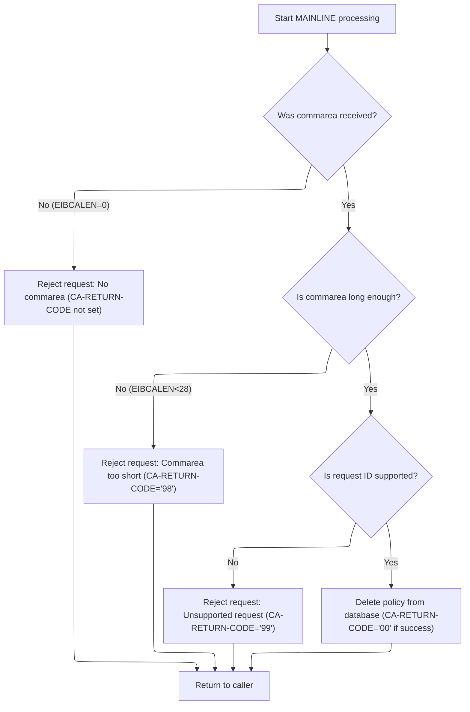
```mermaid
%%{init: {"flowchart": {"defaultRenderer": "elk"}} }%%
flowchart TD
    node1["Start MAINLINE processing"] --> node2{"Was commarea received?"}
    click node1 openCode "base/src/lgdpol01.cbl:78:133"
    node2 -->|"No (EIBCALEN=0)"| node3["Reject request: No commarea (CA-RETURN-CODE not set)"]
    click node2 openCode "base/src/lgdpol01.cbl:95:99"
    click node3 openCode "base/src/lgdpol01.cbl:96:98"
    node2 -->|"Yes"| node4{"Is commarea long enough?"}
    click node4 openCode "base/src/lgdpol01.cbl:107:110"
    node4 -->|"No (EIBCALEN<28)"| node5["Reject request: Commarea too short (CA-RETURN-CODE='98')"]
    click node5 openCode "base/src/lgdpol01.cbl:108:109"
    node4 -->|"Yes"| node6{"Is request ID supported?"}
    click node6 openCode "base/src/lgdpol01.cbl:119:122"
    node6 -->|"No"| node7["Reject request: Unsupported request (CA-RETURN-CODE='99')"]
    click node7 openCode "base/src/lgdpol01.cbl:124:124"
    node6 -->|"Yes"| node8["Delete policy from database (CA-RETURN-CODE='00' if success)"]
    click node8 openCode "base/src/lgdpol01.cbl:126:126"
    node8 --> node9["Return to caller"]
    click node9 openCode "base/src/lgdpol01.cbl:127:133"
    node7 --> node9
    node5 --> node9
    node3 --> node9
classDef HeadingStyle fill:#777777,stroke:#333,stroke-width:2px;

%% Swimm:
%% %%{init: {"flowchart": {"defaultRenderer": "elk"}} }%%
%% flowchart TD
%%     node1["Start MAINLINE processing"] --> node2{"Was commarea received?"}
%%     click node1 openCode "<SwmPath>[base/src/lgdpol01.cbl](base/src/lgdpol01.cbl)</SwmPath>:78:133"
%%     node2 -->|"No (EIBCALEN=0)"| node3["Reject request: No commarea (<SwmToken path="base/src/lgtestp4.cbl" pos="116:3:7" line-data="                 IF CA-RETURN-CODE &gt; 0">`CA-RETURN-CODE`</SwmToken> not set)"]
%%     click node2 openCode "<SwmPath>[base/src/lgdpol01.cbl](base/src/lgdpol01.cbl)</SwmPath>:95:99"
%%     click node3 openCode "<SwmPath>[base/src/lgdpol01.cbl](base/src/lgdpol01.cbl)</SwmPath>:96:98"
%%     node2 -->|"Yes"| node4{"Is commarea long enough?"}
%%     click node4 openCode "<SwmPath>[base/src/lgdpol01.cbl](base/src/lgdpol01.cbl)</SwmPath>:107:110"
%%     node4 -->|"No (EIBCALEN<28)"| node5["Reject request: Commarea too short (<SwmToken path="base/src/lgtestp4.cbl" pos="116:3:7" line-data="                 IF CA-RETURN-CODE &gt; 0">`CA-RETURN-CODE`</SwmToken>='98')"]
%%     click node5 openCode "<SwmPath>[base/src/lgdpol01.cbl](base/src/lgdpol01.cbl)</SwmPath>:108:109"
%%     node4 -->|"Yes"| node6{"Is request ID supported?"}
%%     click node6 openCode "<SwmPath>[base/src/lgdpol01.cbl](base/src/lgdpol01.cbl)</SwmPath>:119:122"
%%     node6 -->|"No"| node7["Reject request: Unsupported request (<SwmToken path="base/src/lgtestp4.cbl" pos="116:3:7" line-data="                 IF CA-RETURN-CODE &gt; 0">`CA-RETURN-CODE`</SwmToken>='99')"]
%%     click node7 openCode "<SwmPath>[base/src/lgdpol01.cbl](base/src/lgdpol01.cbl)</SwmPath>:124:124"
%%     node6 -->|"Yes"| node8["Delete policy from database (<SwmToken path="base/src/lgtestp4.cbl" pos="116:3:7" line-data="                 IF CA-RETURN-CODE &gt; 0">`CA-RETURN-CODE`</SwmToken>='00' if success)"]
%%     click node8 openCode "<SwmPath>[base/src/lgdpol01.cbl](base/src/lgdpol01.cbl)</SwmPath>:126:126"
%%     node8 --> node9["Return to caller"]
%%     click node9 openCode "<SwmPath>[base/src/lgdpol01.cbl](base/src/lgdpol01.cbl)</SwmPath>:127:133"
%%     node7 --> node9
%%     node5 --> node9
%%     node3 --> node9
%% classDef HeadingStyle fill:#777777,stroke:#333,stroke-width:2px;
```

This section governs the validation and processing of requests to delete insurance policies. It ensures only valid, supported requests with sufficient data are processed, and that errors are logged for audit and troubleshooting.

| Category        | Rule Name                  | Description                                                                                                                                                                                                                                                                                                                                                                                                                                                                                                                                                                                                                                                                                                                                              |
| --------------- | -------------------------- | -------------------------------------------------------------------------------------------------------------------------------------------------------------------------------------------------------------------------------------------------------------------------------------------------------------------------------------------------------------------------------------------------------------------------------------------------------------------------------------------------------------------------------------------------------------------------------------------------------------------------------------------------------------------------------------------------------------------------------------------------------- |
| Data validation | Missing commarea rejection | If no commarea is received with the request, the policy deletion request must be rejected and an error must be logged.                                                                                                                                                                                                                                                                                                                                                                                                                                                                                                                                                                                                                                   |
| Data validation | Minimum commarea length    | If the commarea received is shorter than 28 bytes, the policy deletion request must be rejected and an error must be logged with return code '98'.                                                                                                                                                                                                                                                                                                                                                                                                                                                                                                                                                                                                       |
| Data validation | Supported request ID       | Only requests with a supported request ID (<SwmToken path="base/src/lgdpol01.cbl" pos="119:18:18" line-data="           IF ( CA-REQUEST-ID NOT EQUAL TO &#39;01DEND&#39; AND">`01DEND`</SwmToken>, <SwmToken path="base/src/lgdpol01.cbl" pos="120:14:14" line-data="                CA-REQUEST-ID NOT EQUAL TO &#39;01DMOT&#39; AND">`01DMOT`</SwmToken>, <SwmToken path="base/src/lgdpol01.cbl" pos="121:14:14" line-data="                CA-REQUEST-ID NOT EQUAL TO &#39;01DHOU&#39; AND">`01DHOU`</SwmToken>, <SwmToken path="base/src/lgtestp4.cbl" pos="188:4:4" line-data="                 Move &#39;01DCOM&#39;   To CA-REQUEST-ID">`01DCOM`</SwmToken>) are allowed to proceed; all other request IDs must be rejected with return code '99'. |
| Business logic  | Successful deletion code   | If the policy deletion is successful, the return code must be set to '00' to indicate success.                                                                                                                                                                                                                                                                                                                                                                                                                                                                                                                                                                                                                                                           |

<SwmSnippet path="/base/src/lgdpol01.cbl" line="78">

---

MAINLINE in <SwmPath>[base/src/lgdpol01.cbl](base/src/lgdpol01.cbl)</SwmPath> checks for a valid commarea and request ID, then calls the delete logic if everything looks good. If the commarea is missing or too short, it logs an error and exits.

```cobol
       MAINLINE SECTION.

      *----------------------------------------------------------------*
      * Common code                                                    *
      *----------------------------------------------------------------*
      * initialize working storage variables
           INITIALIZE WS-HEADER.
      * set up general variable
           MOVE EIBTRNID TO WS-TRANSID.
           MOVE EIBTRMID TO WS-TERMID.
           MOVE EIBTASKN TO WS-TASKNUM.
      *----------------------------------------------------------------*

      *----------------------------------------------------------------*
      * Check commarea and obtain required details                     *
      *----------------------------------------------------------------*
      * If NO commarea received issue an ABEND
           IF EIBCALEN IS EQUAL TO ZERO
               MOVE ' NO COMMAREA RECEIVED' TO EM-VARIABLE
               PERFORM WRITE-ERROR-MESSAGE
               EXEC CICS ABEND ABCODE('LGCA') NODUMP END-EXEC
           END-IF

      * initialize commarea return code to zero
           MOVE '00' TO CA-RETURN-CODE
           MOVE EIBCALEN TO WS-CALEN.
           SET WS-ADDR-DFHCOMMAREA TO ADDRESS OF DFHCOMMAREA.

      * Check commarea is large enough
           IF EIBCALEN IS LESS THAN WS-CA-HEADER-LEN
             MOVE '98' TO CA-RETURN-CODE
             EXEC CICS RETURN END-EXEC
           END-IF

      *----------------------------------------------------------------*
      * Check request-id in commarea and if recognised ...             *
      * Call routine to delete row from policy table                   *
      *----------------------------------------------------------------*
      * Upper case value passed in Request Id field                    *
           MOVE FUNCTION UPPER-CASE(CA-REQUEST-ID) TO CA-REQUEST-ID

           IF ( CA-REQUEST-ID NOT EQUAL TO '01DEND' AND
                CA-REQUEST-ID NOT EQUAL TO '01DMOT' AND
                CA-REQUEST-ID NOT EQUAL TO '01DHOU' AND
                CA-REQUEST-ID NOT EQUAL TO '01DCOM' )
      *        Request is not recognised or supported
               MOVE '99' TO CA-RETURN-CODE
           ELSE
               PERFORM DELETE-POLICY-DB2-INFO
               If CA-RETURN-CODE > 0
                 EXEC CICS RETURN END-EXEC
               End-if
           END-IF

      * Return to caller
           EXEC CICS RETURN END-EXEC.
```

---

</SwmSnippet>

<SwmSnippet path="/base/src/lgdpol01.cbl" line="154">

---

<SwmToken path="base/src/lgdpol01.cbl" pos="154:1:5" line-data="       WRITE-ERROR-MESSAGE.">`WRITE-ERROR-MESSAGE`</SwmToken> in <SwmPath>[base/src/lgdpol01.cbl](base/src/lgdpol01.cbl)</SwmPath> formats the error info, grabs the timestamp, and calls LGSTSQ to log the error and up to 90 bytes of commarea data. This makes sure errors are recorded for later review.

```cobol
       WRITE-ERROR-MESSAGE.
      * Save SQLCODE in message
      * Obtain and format current time and date
           EXEC CICS ASKTIME ABSTIME(WS-ABSTIME)
           END-EXEC
           EXEC CICS FORMATTIME ABSTIME(Ws-ABSTIME)
                     MMDDYYYY(WS-DATE)
                     TIME(WS-TIME)
           END-EXEC
           MOVE WS-DATE TO EM-DATE
           MOVE WS-TIME TO EM-TIME
      * Write output message to TDQ
           EXEC CICS LINK PROGRAM('LGSTSQ')
                     COMMAREA(ERROR-MSG)
                     LENGTH(LENGTH OF ERROR-MSG)
           END-EXEC.
      * Write 90 bytes or as much as we have of commarea to TDQ
           IF EIBCALEN > 0 THEN
             IF EIBCALEN < 91 THEN
               MOVE DFHCOMMAREA(1:EIBCALEN) TO CA-DATA
               EXEC CICS LINK PROGRAM('LGSTSQ')
                         COMMAREA(CA-ERROR-MSG)
                         LENGTH(LENGTH OF CA-ERROR-MSG)
               END-EXEC
             ELSE
               MOVE DFHCOMMAREA(1:90) TO CA-DATA
               EXEC CICS LINK PROGRAM('LGSTSQ')
                         COMMAREA(CA-ERROR-MSG)
                         LENGTH(LENGTH OF CA-ERROR-MSG)
               END-EXEC
             END-IF
           END-IF.
           EXIT.
```

---

</SwmSnippet>

## Deleting Policy Records from the Database

This section governs the business rules for deleting insurance policy records from the database, ensuring that only valid and authorized deletions are processed and that appropriate feedback is provided to the user.

| Category        | Rule Name                         | Description                                                                                                                                                                                         |
| --------------- | --------------------------------- | --------------------------------------------------------------------------------------------------------------------------------------------------------------------------------------------------- |
| Data validation | Policy existence validation       | A policy record may only be deleted if it exists in the database. If the specified policy does not exist, the deletion request must be rejected and an error message returned.                      |
| Data validation | Referential integrity enforcement | A policy record may not be deleted if it is referenced by other records (such as claims or payments). The deletion request must be rejected and an error message returned if such references exist. |
| Business logic  | Policy status restriction         | A policy record may not be deleted if it is currently marked as active or in-force. Only policies that are expired, cancelled, or otherwise inactive may be deleted.                                |

<SwmSnippet path="/base/src/lgdpol01.cbl" line="139">

---

<SwmToken path="base/src/lgdpol01.cbl" pos="139:1:7" line-data="       DELETE-POLICY-DB2-INFO.">`DELETE-POLICY-DB2-INFO`</SwmToken> in <SwmPath>[base/src/lgdpol01.cbl](base/src/lgdpol01.cbl)</SwmPath> links to <SwmToken path="base/src/lgdpol01.cbl" pos="141:9:9" line-data="           EXEC CICS LINK PROGRAM(LGDPDB01)">`LGDPDB01`</SwmToken>, passing the commarea so the <SwmToken path="base/src/lgdpol01.cbl" pos="139:5:5" line-data="       DELETE-POLICY-DB2-INFO.">`DB2`</SwmToken> delete logic runs in its own program. This keeps the <SwmToken path="base/src/lgdpol01.cbl" pos="139:5:5" line-data="       DELETE-POLICY-DB2-INFO.">`DB2`</SwmToken> work isolated.

```cobol
       DELETE-POLICY-DB2-INFO.

           EXEC CICS LINK PROGRAM(LGDPDB01)
                Commarea(DFHCOMMAREA)
                LENGTH(32500)
           END-EXEC.

           EXIT.
```

---

</SwmSnippet>

## Validating and Executing <SwmToken path="base/src/lgipdb01.cbl" pos="242:5:5" line-data="      * initialize DB2 host variables">`DB2`</SwmToken> Policy Deletes

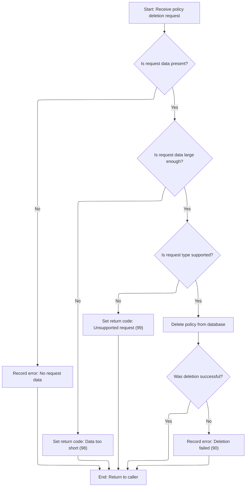
```mermaid
%%{init: {"flowchart": {"defaultRenderer": "elk"}} }%%
flowchart TD
    node1["Start: Receive policy deletion request"] --> node2{"Is request data present?"}
    click node1 openCode "base/src/lgdpdb01.cbl:111:131"
    node2 -->|"No"| node3["Record error: No request data"]
    click node2 openCode "base/src/lgdpdb01.cbl:131:135"
    click node3 openCode "base/src/lgdpdb01.cbl:132:134"
    node3 --> node4["End: Return to caller"]
    click node4 openCode "base/src/lgdpdb01.cbl:175:175"
    node2 -->|"Yes"| node5{"Is request data large enough?"}
    click node5 openCode "base/src/lgdpdb01.cbl:143:146"
    node5 -->|"No"| node6["Set return code: Data too short (98)"]
    click node6 openCode "base/src/lgdpdb01.cbl:144:145"
    node6 --> node4
    node5 -->|"Yes"| node7{"Is request type supported?"}
    click node7 openCode "base/src/lgdpdb01.cbl:160:172"
    node7 -->|"No"| node8["Set return code: Unsupported request (99)"]
    click node8 openCode "base/src/lgdpdb01.cbl:165:165"
    node8 --> node4
    node7 -->|"Yes"| node9["Delete policy from database"]
    click node9 openCode "base/src/lgdpdb01.cbl:167:167"
    node9 --> node10{"Was deletion successful?"}
    click node10 openCode "base/src/lgdpdb01.cbl:198:202"
    node10 -->|"No"| node11["Record error: Deletion failed (90)"]
    click node11 openCode "base/src/lgdpdb01.cbl:199:201"
    node11 --> node4
    node10 -->|"Yes"| node4
classDef HeadingStyle fill:#777777,stroke:#333,stroke-width:2px;

%% Swimm:
%% %%{init: {"flowchart": {"defaultRenderer": "elk"}} }%%
%% flowchart TD
%%     node1["Start: Receive policy deletion request"] --> node2{"Is request data present?"}
%%     click node1 openCode "<SwmPath>[base/src/lgdpdb01.cbl](base/src/lgdpdb01.cbl)</SwmPath>:111:131"
%%     node2 -->|"No"| node3["Record error: No request data"]
%%     click node2 openCode "<SwmPath>[base/src/lgdpdb01.cbl](base/src/lgdpdb01.cbl)</SwmPath>:131:135"
%%     click node3 openCode "<SwmPath>[base/src/lgdpdb01.cbl](base/src/lgdpdb01.cbl)</SwmPath>:132:134"
%%     node3 --> node4["End: Return to caller"]
%%     click node4 openCode "<SwmPath>[base/src/lgdpdb01.cbl](base/src/lgdpdb01.cbl)</SwmPath>:175:175"
%%     node2 -->|"Yes"| node5{"Is request data large enough?"}
%%     click node5 openCode "<SwmPath>[base/src/lgdpdb01.cbl](base/src/lgdpdb01.cbl)</SwmPath>:143:146"
%%     node5 -->|"No"| node6["Set return code: Data too short (98)"]
%%     click node6 openCode "<SwmPath>[base/src/lgdpdb01.cbl](base/src/lgdpdb01.cbl)</SwmPath>:144:145"
%%     node6 --> node4
%%     node5 -->|"Yes"| node7{"Is request type supported?"}
%%     click node7 openCode "<SwmPath>[base/src/lgdpdb01.cbl](base/src/lgdpdb01.cbl)</SwmPath>:160:172"
%%     node7 -->|"No"| node8["Set return code: Unsupported request (99)"]
%%     click node8 openCode "<SwmPath>[base/src/lgdpdb01.cbl](base/src/lgdpdb01.cbl)</SwmPath>:165:165"
%%     node8 --> node4
%%     node7 -->|"Yes"| node9["Delete policy from database"]
%%     click node9 openCode "<SwmPath>[base/src/lgdpdb01.cbl](base/src/lgdpdb01.cbl)</SwmPath>:167:167"
%%     node9 --> node10{"Was deletion successful?"}
%%     click node10 openCode "<SwmPath>[base/src/lgdpdb01.cbl](base/src/lgdpdb01.cbl)</SwmPath>:198:202"
%%     node10 -->|"No"| node11["Record error: Deletion failed (90)"]
%%     click node11 openCode "<SwmPath>[base/src/lgdpdb01.cbl](base/src/lgdpdb01.cbl)</SwmPath>:199:201"
%%     node11 --> node4
%%     node10 -->|"Yes"| node4
%% classDef HeadingStyle fill:#777777,stroke:#333,stroke-width:2px;
```

This section governs the validation and execution of insurance policy deletion requests, ensuring only valid, supported requests result in database changes, and that errors are logged for audit and troubleshooting.

| Category        | Rule Name                   | Description                                                                                                                                                                                                                                                                                                                                                                                                                                                                                                                                                                                                                                                                                                                                                   |
| --------------- | --------------------------- | ------------------------------------------------------------------------------------------------------------------------------------------------------------------------------------------------------------------------------------------------------------------------------------------------------------------------------------------------------------------------------------------------------------------------------------------------------------------------------------------------------------------------------------------------------------------------------------------------------------------------------------------------------------------------------------------------------------------------------------------------------------- |
| Data validation | Missing request data        | If no request data is present in the commarea, the operation must be aborted and an error must be recorded.                                                                                                                                                                                                                                                                                                                                                                                                                                                                                                                                                                                                                                                   |
| Data validation | Minimum request length      | If the request data is shorter than the minimum required length (28 bytes), the operation must be aborted and a specific error code (98) must be returned.                                                                                                                                                                                                                                                                                                                                                                                                                                                                                                                                                                                                    |
| Data validation | Supported request type      | Only requests with a supported request type (one of <SwmToken path="base/src/lgdpol01.cbl" pos="119:18:18" line-data="           IF ( CA-REQUEST-ID NOT EQUAL TO &#39;01DEND&#39; AND">`01DEND`</SwmToken>, <SwmToken path="base/src/lgdpol01.cbl" pos="121:14:14" line-data="                CA-REQUEST-ID NOT EQUAL TO &#39;01DHOU&#39; AND">`01DHOU`</SwmToken>, <SwmToken path="base/src/lgtestp4.cbl" pos="188:4:4" line-data="                 Move &#39;01DCOM&#39;   To CA-REQUEST-ID">`01DCOM`</SwmToken>, <SwmToken path="base/src/lgdpol01.cbl" pos="120:14:14" line-data="                CA-REQUEST-ID NOT EQUAL TO &#39;01DMOT&#39; AND">`01DMOT`</SwmToken>) may proceed; unsupported request types must result in a specific error code (99). |
| Business logic  | Non-existent policy success | If the policy record does not exist (SQLCODE 100), the operation is considered successful and no error is returned.                                                                                                                                                                                                                                                                                                                                                                                                                                                                                                                                                                                                                                           |
| Business logic  | Post-deletion cleanup       | On successful deletion, further cleanup actions must be triggered to ensure related data is handled appropriately.                                                                                                                                                                                                                                                                                                                                                                                                                                                                                                                                                                                                                                            |

<SwmSnippet path="/base/src/lgdpdb01.cbl" line="111">

---

MAINLINE in <SwmPath>[base/src/lgdpdb01.cbl](base/src/lgdpdb01.cbl)</SwmPath> validates the commarea, converts customer and policy numbers, checks the request ID, and only runs the delete if everything checks out. If the delete is successful, it links to <SwmToken path="base/src/lgdpdb01.cbl" pos="168:9:9" line-data="               EXEC CICS LINK PROGRAM(LGDPVS01)">`LGDPVS01`</SwmToken> for further cleanup.

```cobol
       MAINLINE SECTION.

      *----------------------------------------------------------------*
      * Common code                                                    *
      *----------------------------------------------------------------*
      * initialize working storage variables
           INITIALIZE WS-HEADER.
      * set up general variable
           MOVE EIBTRNID TO WS-TRANSID.
           MOVE EIBTRMID TO WS-TERMID.
           MOVE EIBTASKN TO WS-TASKNUM.
      *----------------------------------------------------------------*

      * initialize DB2 host variables
           INITIALIZE DB2-IN-INTEGERS.

      *----------------------------------------------------------------*
      * Check commarea and obtain required details                     *
      *----------------------------------------------------------------*
      * If NO commarea received issue an ABEND
           IF EIBCALEN IS EQUAL TO ZERO
               MOVE ' NO COMMAREA RECEIVED' TO EM-VARIABLE
               PERFORM WRITE-ERROR-MESSAGE
               EXEC CICS ABEND ABCODE('LGCA') NODUMP END-EXEC
           END-IF

      * initialize commarea return code to zero
           MOVE '00' TO CA-RETURN-CODE
           MOVE EIBCALEN TO WS-CALEN.
           SET WS-ADDR-DFHCOMMAREA TO ADDRESS OF DFHCOMMAREA.

      * Check commarea is large enough
           IF EIBCALEN IS LESS THAN WS-CA-HEADER-LEN
             MOVE '98' TO CA-RETURN-CODE
             EXEC CICS RETURN END-EXEC
           END-IF

      * Convert commarea customer & policy nums to DB2 integer format
           MOVE CA-CUSTOMER-NUM TO DB2-CUSTOMERNUM-INT
           MOVE CA-POLICY-NUM   TO DB2-POLICYNUM-INT
      * and save in error msg field incase required
           MOVE CA-CUSTOMER-NUM TO EM-CUSNUM
           MOVE CA-POLICY-NUM   TO EM-POLNUM

      *----------------------------------------------------------------*
      * Check request-id in commarea and if recognised ...             *
      * Call routine to delete row from policy table                   *
      *----------------------------------------------------------------*

           IF ( CA-REQUEST-ID NOT EQUAL TO '01DEND' AND
                CA-REQUEST-ID NOT EQUAL TO '01DHOU' AND
                CA-REQUEST-ID NOT EQUAL TO '01DCOM' AND
                CA-REQUEST-ID NOT EQUAL TO '01DMOT' ) Then
      *        Request is not recognised or supported
               MOVE '99' TO CA-RETURN-CODE
           ELSE
               PERFORM DELETE-POLICY-DB2-INFO
               EXEC CICS LINK PROGRAM(LGDPVS01)
                    Commarea(DFHCOMMAREA)
                    LENGTH(32500)
               END-EXEC
           END-IF.

      * Return to caller
           EXEC CICS RETURN END-EXEC.
```

---

</SwmSnippet>

<SwmSnippet path="/base/src/lgdpdb01.cbl" line="212">

---

<SwmToken path="base/src/lgdpdb01.cbl" pos="212:1:5" line-data="       WRITE-ERROR-MESSAGE.">`WRITE-ERROR-MESSAGE`</SwmToken> in <SwmPath>[base/src/lgdpdb01.cbl](base/src/lgdpdb01.cbl)</SwmPath> formats the error info, grabs the timestamp, and calls LGSTSQ to log the error and up to 90 bytes of commarea data. This makes sure errors are recorded for later review.

```cobol
       WRITE-ERROR-MESSAGE.
      * Save SQLCODE in message
           MOVE SQLCODE TO EM-SQLRC
      * Obtain and format current time and date
           EXEC CICS ASKTIME ABSTIME(WS-ABSTIME)
           END-EXEC
           EXEC CICS FORMATTIME ABSTIME(Ws-ABSTIME)
                     MMDDYYYY(WS-DATE)
                     TIME(WS-TIME)
           END-EXEC
           MOVE WS-DATE TO EM-DATE
           MOVE WS-TIME TO EM-TIME
      * Write output message to TDQ
           EXEC CICS LINK PROGRAM('LGSTSQ')
                     COMMAREA(ERROR-MSG)
                     LENGTH(LENGTH OF ERROR-MSG)
           END-EXEC.
      * Write 90 bytes or as much as we have of commarea to TDQ
           IF EIBCALEN > 0 THEN
             IF EIBCALEN < 91 THEN
               MOVE DFHCOMMAREA(1:EIBCALEN) TO CA-DATA
               EXEC CICS LINK PROGRAM('LGSTSQ')
                         COMMAREA(CA-ERROR-MSG)
                         LENGTH(LENGTH OF CA-ERROR-MSG)
               END-EXEC
             ELSE
               MOVE DFHCOMMAREA(1:90) TO CA-DATA
               EXEC CICS LINK PROGRAM('LGSTSQ')
                         COMMAREA(CA-ERROR-MSG)
                         LENGTH(LENGTH OF CA-ERROR-MSG)
               END-EXEC
             END-IF
           END-IF.
           EXIT.
```

---

</SwmSnippet>

<SwmSnippet path="/base/src/lgdpdb01.cbl" line="186">

---

<SwmToken path="base/src/lgdpdb01.cbl" pos="186:1:7" line-data="       DELETE-POLICY-DB2-INFO.">`DELETE-POLICY-DB2-INFO`</SwmToken> in <SwmPath>[base/src/lgdpdb01.cbl](base/src/lgdpdb01.cbl)</SwmPath> runs the <SwmToken path="base/src/lgdpdb01.cbl" pos="186:5:5" line-data="       DELETE-POLICY-DB2-INFO.">`DB2`</SwmToken> DELETE for the policy. If the SQLCODE isn't 0 or 100, it sets an error code and logs the error before returning.

```cobol
       DELETE-POLICY-DB2-INFO.

           MOVE ' DELETE POLICY  ' TO EM-SQLREQ
           EXEC SQL
             DELETE
               FROM POLICY
               WHERE ( CUSTOMERNUMBER = :DB2-CUSTOMERNUM-INT AND
                       POLICYNUMBER  = :DB2-POLICYNUM-INT      )
           END-EXEC

      *    Treat SQLCODE 0 and SQLCODE 100 (record not found) as
      *    successful - end result is record does not exist
           IF SQLCODE NOT EQUAL 0 Then
               MOVE '90' TO CA-RETURN-CODE
               PERFORM WRITE-ERROR-MESSAGE
               EXEC CICS RETURN END-EXEC
           END-IF.

           EXIT.
```

---

</SwmSnippet>

## Deleting Policy Records from VSAM

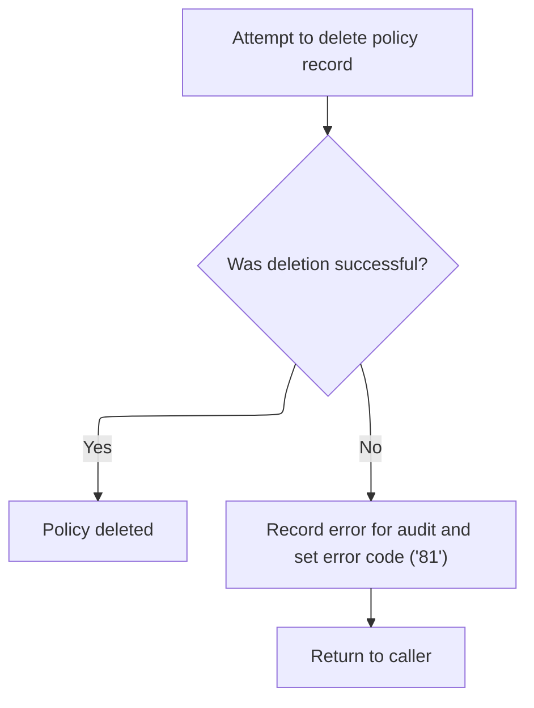
```mermaid
%%{init: {"flowchart": {"defaultRenderer": "elk"}} }%%
flowchart TD
  node1["Attempt to delete policy record"] --> node2{"Was deletion successful?"}
  click node1 openCode "base/src/lgdpvs01.cbl:81:85"
  node2 -->|"Yes"| node3["Policy deleted"]
  click node2 openCode "base/src/lgdpvs01.cbl:86:91"
  node2 -->|"No"| node4["Record error for audit and set error code ('81')"]
  click node4 openCode "base/src/lgdpvs01.cbl:87:90"
  node4 --> node5["Return to caller"]
  click node5 openCode "base/src/lgdpvs01.cbl:90:91"

classDef HeadingStyle fill:#777777,stroke:#333,stroke-width:2px;

%% Swimm:
%% %%{init: {"flowchart": {"defaultRenderer": "elk"}} }%%
%% flowchart TD
%%   node1["Attempt to delete policy record"] --> node2{"Was deletion successful?"}
%%   click node1 openCode "<SwmPath>[base/src/lgdpvs01.cbl](base/src/lgdpvs01.cbl)</SwmPath>:81:85"
%%   node2 -->|"Yes"| node3["Policy deleted"]
%%   click node2 openCode "<SwmPath>[base/src/lgdpvs01.cbl](base/src/lgdpvs01.cbl)</SwmPath>:86:91"
%%   node2 -->|"No"| node4["Record error for audit and set error code ('81')"]
%%   click node4 openCode "<SwmPath>[base/src/lgdpvs01.cbl](base/src/lgdpvs01.cbl)</SwmPath>:87:90"
%%   node4 --> node5["Return to caller"]
%%   click node5 openCode "<SwmPath>[base/src/lgdpvs01.cbl](base/src/lgdpvs01.cbl)</SwmPath>:90:91"
%% 
%% classDef HeadingStyle fill:#777777,stroke:#333,stroke-width:2px;
```

This section governs the business process for deleting insurance policy records from the VSAM file. It ensures that policy deletions are tracked, errors are logged for audit and troubleshooting, and appropriate status codes are returned to the caller.

| Category        | Rule Name                    | Description                                                                                                                                               |
| --------------- | ---------------------------- | --------------------------------------------------------------------------------------------------------------------------------------------------------- |
| Data validation | Unique policy identification | A policy record may only be deleted if the provided policy number and customer number uniquely identify an existing record in the VSAM file.              |
| Data validation | Error message completeness   | All error messages related to failed deletions must include a timestamp, policy number, customer number, and relevant response codes for troubleshooting. |
| Data validation | Confirm policy removal       | If the deletion is successful, the system must confirm that the policy record is no longer present in the VSAM file.                                      |
| Business logic  | Audit failed deletions       | If the deletion of a policy record is unsuccessful, an error must be recorded for audit purposes, including relevant identifiers and response codes.      |
| Business logic  | Policy deletion error code   | When a deletion fails, the return code '81' must be set in the response to indicate a policy deletion error.                                              |

<SwmSnippet path="/base/src/lgdpvs01.cbl" line="72">

---

MAINLINE in <SwmPath>[base/src/lgdpvs01.cbl](base/src/lgdpvs01.cbl)</SwmPath> sets up the VSAM key using part of the request ID, then runs the CICS Delete File for 'KSDSPOLY'. If the delete fails, it sets an error code and logs the error.

```cobol
       MAINLINE SECTION.
      *
      *---------------------------------------------------------------*
           Move EIBCALEN To WS-Commarea-Len.
      *---------------------------------------------------------------*
           Move CA-Request-ID(4:1) To WF-Request-ID
           Move CA-Policy-Num      To WF-Policy-Num
           Move CA-Customer-Num    To WF-Customer-Num
      *---------------------------------------------------------------*
           Exec CICS Delete File('KSDSPOLY')
                     Ridfld(WF-Policy-Key)
                     KeyLength(21)
                     RESP(WS-RESP)
           End-Exec.
           If WS-RESP Not = DFHRESP(NORMAL)
             Move EIBRESP2 To WS-RESP2
             MOVE '81' TO CA-RETURN-CODE
             PERFORM WRITE-ERROR-MESSAGE
             EXEC CICS RETURN END-EXEC
           End-If.
```

---

</SwmSnippet>

<SwmSnippet path="/base/src/lgdpvs01.cbl" line="99">

---

<SwmToken path="base/src/lgdpvs01.cbl" pos="99:1:5" line-data="       WRITE-ERROR-MESSAGE.">`WRITE-ERROR-MESSAGE`</SwmToken> in <SwmPath>[base/src/lgdpvs01.cbl](base/src/lgdpvs01.cbl)</SwmPath> timestamps the error, fills out the message fields, and calls LGSTSQ to log both the error and any relevant commarea data. This helps with troubleshooting.

```cobol
       WRITE-ERROR-MESSAGE.
           EXEC CICS ASKTIME ABSTIME(WS-ABSTIME)
           END-EXEC
           EXEC CICS FORMATTIME ABSTIME(WS-ABSTIME)
                     MMDDYYYY(WS-DATE)
                     TIME(WS-TIME)
           END-EXEC
      *
           MOVE WS-DATE TO EM-DATE
           MOVE WS-TIME TO EM-TIME
           Move CA-Customer-Num To EM-CUSNUM 
           Move CA-POLICY-NUM To EM-POLNUM 
           Move WS-RESP         To EM-RespRC
           Move WS-RESP2        To EM-Resp2RC
           EXEC CICS LINK PROGRAM('LGSTSQ')
                     COMMAREA(ERROR-MSG)
                     LENGTH(LENGTH OF ERROR-MSG)
           END-EXEC.
           IF EIBCALEN > 0 THEN
             IF EIBCALEN < 91 THEN
               MOVE DFHCOMMAREA(1:EIBCALEN) TO CA-DATA
               EXEC CICS LINK PROGRAM('LGSTSQ')
                         COMMAREA(CA-ERROR-MSG)
                         LENGTH(Length Of CA-ERROR-MSG)
               END-EXEC
             ELSE
               MOVE DFHCOMMAREA(1:90) TO CA-DATA
               EXEC CICS LINK PROGRAM('LGSTSQ')
                         COMMAREA(CA-ERROR-MSG)
                         LENGTH(Length Of CA-ERROR-MSG)
               END-EXEC
             END-IF
           END-IF.
           EXIT.
```

---

</SwmSnippet>

## Handling VSAM Policy Deletion Results in <SwmToken path="base/src/lgtestp4.cbl" pos="24:5:7" line-data="              GO TO B-PROC.">`B-PROC`</SwmToken>

<SwmSnippet path="/base/src/lgtestp4.cbl" line="195">

---

After returning from <SwmToken path="base/src/lgtestp4.cbl" pos="191:10:10" line-data="                 EXEC CICS LINK PROGRAM(&#39;LGDPOL01&#39;)">`LGDPOL01`</SwmToken>, <SwmToken path="base/src/lgtestp4.cbl" pos="24:5:7" line-data="              GO TO B-PROC.">`B-PROC`</SwmToken> checks if the delete failed (<SwmToken path="base/src/lgtestp4.cbl" pos="195:3:7" line-data="                 IF CA-RETURN-CODE &gt; 0">`CA-RETURN-CODE`</SwmToken> > 0) and, if so, rolls back and shows an error message.

```cobol
                 IF CA-RETURN-CODE > 0
                   Exec CICS Syncpoint Rollback End-Exec
                   GO TO E-NODEL
                 END-IF
```

---

</SwmSnippet>

<SwmSnippet path="/base/src/lgtestp4.cbl" line="200">

---

After a successful policy delete, <SwmToken path="base/src/lgtestp4.cbl" pos="24:5:7" line-data="              GO TO B-PROC.">`B-PROC`</SwmToken> clears all the map fields, sets a confirmation message, and sends the updated map to the terminal. This gives the user immediate feedback that the commercial policy was deleted.

```cobol
                 Move Spaces             To ENP4EDAI
                 Move Spaces             To ENP4ADDI
                 Move Spaces             To ENP4HPCI
                 Move Spaces             To ENP4LATI
                 Move Spaces             To ENP4LONI
                 Move Spaces             To ENP4CUSI
                 Move Spaces             To ENP4PTYI
                 Move Spaces             To ENP4FPEI
                 Move Spaces             To ENP4FPRI
                 Move Spaces             To ENP4CPEI
                 Move Spaces             To ENP4CPRI
                 Move Spaces             To ENP4XPEI
                 Move Spaces             To ENP4XPRI
                 Move Spaces             To ENP4WPEI
                 Move Spaces             To ENP4WPRI
                 Move Spaces             To ENP4STAI
                 Move Spaces             To ENP4REJI
                 Move ' '             To ENP4OPTI
                 Move 'Commercial Policy Deleted'
                   To  ERP4FLDO
```

---

</SwmSnippet>

<SwmSnippet path="/base/src/lgtestp4.cbl" line="220">

---

After a successful policy delete in <SwmToken path="base/src/lgtestp4.cbl" pos="24:5:7" line-data="              GO TO B-PROC.">`B-PROC`</SwmToken>, this SEND MAP sends the cleared output map to the terminal. It follows the logic that resets fields and sets a confirmation message, so the user sees immediate feedback. The next step is either waiting for new input or returning control to CICS.

```cobol
                 EXEC CICS SEND MAP ('XMAPP4')
                           FROM(XMAPP4O)
                           MAPSET ('XMAP')
                 END-EXEC
```

---

</SwmSnippet>

<SwmSnippet path="/base/src/lgtestp4.cbl" line="226">

---

When the user enters an invalid option, <SwmToken path="base/src/lgtestp4.cbl" pos="24:5:7" line-data="              GO TO B-PROC.">`B-PROC`</SwmToken> sets an error message, positions the cursor for correction, sends the map to the terminal, and then executes a RETURN to CICS. This ends the transaction and waits for the next user action.

```cobol
             WHEN OTHER

                 Move 'Please enter a valid option'
                   To  ERP4FLDO
                 Move -1 To ENP4OPTL

                 EXEC CICS SEND MAP ('XMAPP4')
                           FROM(XMAPP4O)
                           MAPSET ('XMAP')
                           CURSOR
                 END-EXEC
                 GO TO D-EXEC

           END-EVALUATE.


           EXEC CICS RETURN
           END-EXEC.
```

---

</SwmSnippet>

&nbsp;

*This is an auto-generated document by Swimm 🌊 and has not yet been verified by a human*

<SwmMeta version="3.0.0" repo-id="Z2l0aHViJTNBJTNBY2ljcy1nZW5hcHAtZGVtbyUzQSUzQXN3aW1taW8=" repo-name="cics-genapp-demo"><sup>Powered by [Swimm](https://app.swimm.io/)</sup></SwmMeta>
