# Overview

This document explains the flow of motor policy management through a menu-driven interface. Users can inquire about, add, delete, or update motor insurance policies, with the system providing confirmation or error messages for each operation.

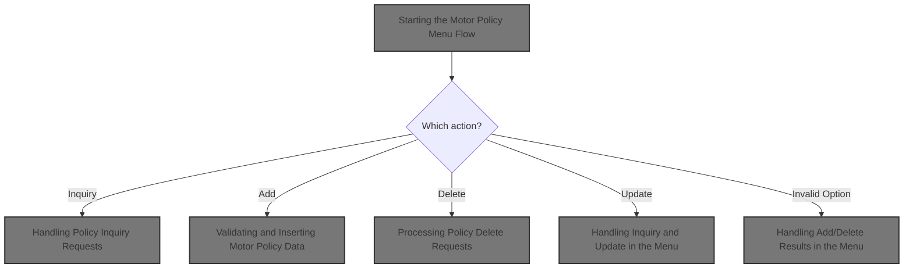
```mermaid
flowchart TD
    node1["Starting the Motor Policy Menu Flow"]:::HeadingStyle
    click node1 goToHeading "Starting the Motor Policy Menu Flow"
    node1 --> node2{"Which action?"}
    node2 -->|"Inquiry"|node3["Handling Policy Inquiry Requests"]:::HeadingStyle
    click node3 goToHeading "Handling Policy Inquiry Requests"
    node2 -->|"Add"|node4["Validating and Inserting Motor Policy Data"]:::HeadingStyle
    click node4 goToHeading "Validating and Inserting Motor Policy Data"
    node2 -->|"Delete"|node5["Processing Policy Delete Requests"]:::HeadingStyle
    click node5 goToHeading "Processing Policy Delete Requests"
    node2 -->|"Update"|node6["Handling Inquiry and Update in the Menu"]:::HeadingStyle
    click node6 goToHeading "Handling Inquiry and Update in the Menu"
    node2 -->|"Invalid Option"|node7["Handling Add/Delete Results in the Menu"]:::HeadingStyle
    click node7 goToHeading "Handling Add/Delete Results in the Menu"
classDef HeadingStyle fill:#777777,stroke:#333,stroke-width:2px;
```

## Dependencies

### Programs

- <SwmToken path="base/src/lgtestp1.cbl" pos="11:6:6" line-data="       PROGRAM-ID. LGTESTP1.">`LGTESTP1`</SwmToken> (<SwmPath>[base/src/lgtestp1.cbl](base/src/lgtestp1.cbl)</SwmPath>)
- <SwmToken path="base/src/lgtestp1.cbl" pos="72:10:10" line-data="                 EXEC CICS LINK PROGRAM(&#39;LGIPOL01&#39;)">`LGIPOL01`</SwmToken> (<SwmPath>[base/src/lgipol01.cbl](base/src/lgipol01.cbl)</SwmPath>)
- <SwmToken path="base/src/lgipol01.cbl" pos="91:9:9" line-data="           EXEC CICS LINK Program(LGIPDB01)">`LGIPDB01`</SwmToken> (<SwmPath>[base/src/lgipdb01.cbl](base/src/lgipdb01.cbl)</SwmPath>)
- LGSTSQ (<SwmPath>[base/src/lgstsq.cbl](base/src/lgstsq.cbl)</SwmPath>)
- <SwmToken path="base/src/lgtestp1.cbl" pos="115:10:10" line-data="                 EXEC CICS LINK PROGRAM(&#39;LGAPOL01&#39;)">`LGAPOL01`</SwmToken> (<SwmPath>[base/src/lgapol01.cbl](base/src/lgapol01.cbl)</SwmPath>)
- <SwmToken path="base/src/lgapol01.cbl" pos="103:9:9" line-data="           EXEC CICS Link Program(LGAPDB01)">`LGAPDB01`</SwmToken> (<SwmPath>[base/src/LGAPDB01.cbl](base/src/LGAPDB01.cbl)</SwmPath>)
- <SwmToken path="base/src/LGAPDB01.cbl" pos="269:4:4" line-data="           CALL &#39;LGAPDB02&#39; USING IN-PROPERTY-TYPE, IN-POSTCODE, ">`LGAPDB02`</SwmToken>
- <SwmToken path="base/src/LGAPDB01.cbl" pos="276:4:4" line-data="           CALL &#39;LGAPDB03&#39; USING WS-BASE-RISK-SCR, IN-FIRE-PERIL, ">`LGAPDB03`</SwmToken> (<SwmPath>[base/src/LGAPDB03.cbl](base/src/LGAPDB03.cbl)</SwmPath>)
- <SwmToken path="base/src/LGAPDB01.cbl" pos="313:4:4" line-data="               CALL &#39;LGAPDB04&#39; USING LK-INPUT-DATA, LK-COVERAGE-DATA, ">`LGAPDB04`</SwmToken> (<SwmPath>[base/src/LGAPDB04.cbl](base/src/LGAPDB04.cbl)</SwmPath>)
- <SwmToken path="base/src/lgtestp1.cbl" pos="139:10:10" line-data="                 EXEC CICS LINK PROGRAM(&#39;LGDPOL01&#39;)">`LGDPOL01`</SwmToken> (<SwmPath>[base/src/lgdpol01.cbl](base/src/lgdpol01.cbl)</SwmPath>)
- <SwmToken path="base/src/lgdpol01.cbl" pos="141:9:9" line-data="           EXEC CICS LINK PROGRAM(LGDPDB01)">`LGDPDB01`</SwmToken> (<SwmPath>[base/src/lgdpdb01.cbl](base/src/lgdpdb01.cbl)</SwmPath>)
- <SwmToken path="base/src/lgdpdb01.cbl" pos="168:9:9" line-data="               EXEC CICS LINK PROGRAM(LGDPVS01)">`LGDPVS01`</SwmToken> (<SwmPath>[base/src/lgdpvs01.cbl](base/src/lgdpvs01.cbl)</SwmPath>)
- <SwmToken path="base/src/lgtestp1.cbl" pos="216:10:10" line-data="                 EXEC CICS LINK PROGRAM(&#39;LGUPOL01&#39;)">`LGUPOL01`</SwmToken> (<SwmPath>[base/src/lgupol01.cbl](base/src/lgupol01.cbl)</SwmPath>)
- <SwmToken path="base/src/lgupol01.cbl" pos="157:9:9" line-data="           EXEC CICS LINK Program(LGUPDB01)">`LGUPDB01`</SwmToken> (<SwmPath>[base/src/lgupdb01.cbl](base/src/lgupdb01.cbl)</SwmPath>)
- <SwmToken path="base/src/lgupdb01.cbl" pos="209:9:9" line-data="           EXEC CICS LINK Program(LGUPVS01)">`LGUPVS01`</SwmToken> (<SwmPath>[base/src/lgupvs01.cbl](base/src/lgupvs01.cbl)</SwmPath>)

### Copybooks

- SQLCA
- LGPOLICY (<SwmPath>[base/src/lgpolicy.cpy](base/src/lgpolicy.cpy)</SwmPath>)
- LGCMAREA (<SwmPath>[base/src/lgcmarea.cpy](base/src/lgcmarea.cpy)</SwmPath>)
- <SwmToken path="base/src/LGAPDB01.cbl" pos="35:3:3" line-data="           COPY INPUTREC2.">`INPUTREC2`</SwmToken> (<SwmPath>[base/src/INPUTREC2.cpy](base/src/INPUTREC2.cpy)</SwmPath>)
- OUTPUTREC (<SwmPath>[base/src/OUTPUTREC.cpy](base/src/OUTPUTREC.cpy)</SwmPath>)
- WORKSTOR (<SwmPath>[base/src/WORKSTOR.cpy](base/src/WORKSTOR.cpy)</SwmPath>)
- LGAPACT (<SwmPath>[base/src/LGAPACT.cpy](base/src/LGAPACT.cpy)</SwmPath>)
- SSMAP

## Detailed View of the Program's Functionality

a. Overview and Entry Point

The main entry point for the motor policy menu is in the MAINLINE section. When the program starts, it checks if there is any incoming data (such as from a previous user action). If there is, it immediately jumps to the main menu processing logic. If not, it initializes all the input/output fields and policy fields to blank or default values, ensuring the user starts with a clean screen. The main menu map is then sent to the user's terminal, erasing any previous content.

b. Main Menu Processing Loop

The core of the menu logic is in the <SwmToken path="base/src/lgtestp1.cbl" pos="33:5:7" line-data="              GO TO A-GAIN.">`A-GAIN`</SwmToken> section. Here, the program sets up handlers for special keys (like CLEAR and <SwmToken path="base/src/lgtestp1.cbl" pos="56:1:1" line-data="                     PF3(ENDIT) END-EXEC.">`PF3`</SwmToken>) and for map input errors. It then receives the user's input from the screen map. The user's menu selection is evaluated, and the corresponding action is taken:

- Option '1': Policy Inquiry
- Option '2': Add Policy
- Option '3': Delete Policy
- Option '4': Update Policy
- Any other input: Show error and prompt again

c. Policy Inquiry Flow (Option '1')

When the user selects inquiry, the program prepares a request for a motor policy inquiry by setting the appropriate request type and copying the customer and policy numbers from the screen fields. It then links to the inquiry business logic program, which in turn calls the <SwmToken path="base/src/lgipdb01.cbl" pos="242:5:5" line-data="      * initialize DB2 host variables">`DB2`</SwmToken> inquiry logic. If the inquiry fails (as indicated by a non-zero return code), the user is shown a "No Data" message. If successful, the policy details (such as issue/expiry dates, vehicle make/model, value, registration, color, engine size, year, premium, and accidents) are copied from the returned data into the screen fields and displayed to the user.

d. Add Policy Flow (Option '2')

For adding a new policy, the program prepares all the necessary fields in the communication area from the user's input, including customer number, vehicle details, and coverage information. It then links to the add policy business logic, which validates the input and attempts to insert the new policy into the database. If the add fails, the transaction is rolled back and an error message is shown. If successful, the new customer and policy numbers are displayed, the menu option is cleared, and a success message is shown.

e. Delete Policy Flow (Option '3')

When deleting a policy, the program prepares a delete request with the relevant customer and policy numbers and links to the delete business logic. If the delete fails, the transaction is rolled back and an error message is shown. If successful, all policy fields on the screen are cleared, and a "Motor Policy Deleted" message is displayed.

f. Update Policy Flow (Option '4')

For updating a policy, the program first performs an inquiry to fetch the current policy details and display them to the user. After the user makes changes and submits the update, the program prepares the updated data and links to the update business logic. If the update fails, an error message is shown. If successful, the updated customer and policy numbers are displayed, the menu option is cleared, and a success message is shown.

g. Error Handling and Messaging

For each operation (add, update, delete, inquiry), if an error occurs, the program sets an appropriate error message and displays it to the user. After displaying an error, the input/output areas and communication area are re-initialized, and the user is returned to the main menu.

h. Special Key Handling

If the user presses the CLEAR key, the input fields are re-initialized and the menu is redisplayed. If the user presses <SwmToken path="base/src/lgtestp1.cbl" pos="56:1:1" line-data="                     PF3(ENDIT) END-EXEC.">`PF3`</SwmToken>, a "Transaction ended" message is shown and the program returns control to CICS.

i. Transaction Continuation

After each operation (except for <SwmToken path="base/src/lgtestp1.cbl" pos="56:1:1" line-data="                     PF3(ENDIT) END-EXEC.">`PF3`</SwmToken>), the program returns control to CICS with the current communication area, allowing the transaction to continue and the user to perform further actions.

j. Summary

The overall flow is a loop: display menu, receive user action, process the action (inquiry, add, delete, update, or error), display results or errors, and return to the menu for further input. All database and business logic is handled by separate linked programs, and all error and audit messages are logged via a dedicated logging program. The design ensures that the user always sees a consistent, up-to-date view of their motor policy data and that all actions are validated and logged.

# Rule Definition

| Paragraph Name                                                                                                                                                                                                                                                                                                                                                                                                                                                                                                                                                                                                                                                                                                                                                                                                                                                                                                                                                                                                                                                                                                                                                                                                                                                                                                               | Rule ID | Category          | Description                                                                                                                                                                                                                                                                                                                   | Conditions                                                                                              | Remarks                                                                                                                                                                                                                                                                                                                                                                                                                                                                                                                                                                                                                                                                                                                                                                                                                                                                                                                                                                                        |
| ---------------------------------------------------------------------------------------------------------------------------------------------------------------------------------------------------------------------------------------------------------------------------------------------------------------------------------------------------------------------------------------------------------------------------------------------------------------------------------------------------------------------------------------------------------------------------------------------------------------------------------------------------------------------------------------------------------------------------------------------------------------------------------------------------------------------------------------------------------------------------------------------------------------------------------------------------------------------------------------------------------------------------------------------------------------------------------------------------------------------------------------------------------------------------------------------------------------------------------------------------------------------------------------------------------------------------- | ------- | ----------------- | ----------------------------------------------------------------------------------------------------------------------------------------------------------------------------------------------------------------------------------------------------------------------------------------------------------------------------- | ------------------------------------------------------------------------------------------------------- | ---------------------------------------------------------------------------------------------------------------------------------------------------------------------------------------------------------------------------------------------------------------------------------------------------------------------------------------------------------------------------------------------------------------------------------------------------------------------------------------------------------------------------------------------------------------------------------------------------------------------------------------------------------------------------------------------------------------------------------------------------------------------------------------------------------------------------------------------------------------------------------------------------------------------------------------------------------------------------------------------- |
| MAINLINE SECTION, EVALUATE <SwmToken path="base/src/lgtestp1.cbl" pos="66:3:3" line-data="           EVALUATE ENP1OPTO">`ENP1OPTO`</SwmToken>, WHEN OTHER                                                                                                                                                                                                                                                                                                                                                                                                                                                                                                                                                                                                                                                                                                                                                                                                                                                                                                                                                                                                                                                                                                                                                                    | RL-001  | Conditional Logic | The system must validate the menu option entered by the user. Only options 1 (Inquiry), 2 (Add), 3 (Delete), and 4 (Update) are valid. Any other value prompts the user to enter a valid option.                                                                                                                              | User enters a menu option value in the menu screen.                                                     | Valid options: 1, 2, 3, 4. Error message: 'Please enter a valid option'. Field <SwmToken path="base/src/lgtestp1.cbl" pos="66:3:3" line-data="           EVALUATE ENP1OPTO">`ENP1OPTO`</SwmToken> is used for input. The error message is displayed in <SwmToken path="base/src/lgtestp1.cbl" pos="128:3:3" line-data="                   To  ERP1FLDO">`ERP1FLDO`</SwmToken>. <SwmToken path="base/src/lgtestp1.cbl" pos="240:8:8" line-data="                 Move -1 To ENP1OPTL">`ENP1OPTL`</SwmToken> is set to -1 to position the cursor for re-entry.                                                                                                                                                                                                                                                                                                                                                                                                                                   |
| MAINLINE SECTION, EVALUATE <SwmToken path="base/src/lgtestp1.cbl" pos="66:3:3" line-data="           EVALUATE ENP1OPTO">`ENP1OPTO`</SwmToken>, WHEN '1'; <SwmToken path="base/src/lgtestp1.cbl" pos="72:10:10" line-data="                 EXEC CICS LINK PROGRAM(&#39;LGIPOL01&#39;)">`LGIPOL01`</SwmToken> MAINLINE SECTION; <SwmToken path="base/src/lgipol01.cbl" pos="91:9:9" line-data="           EXEC CICS LINK Program(LGIPDB01)">`LGIPDB01`</SwmToken> MAINLINE SECTION, <SwmToken path="base/src/lgipdb01.cbl" pos="289:3:9" line-data="               PERFORM GET-MOTOR-DB2-INFO">`GET-MOTOR-DB2-INFO`</SwmToken>                                                                                                                                                                                                                                                                                                                                                                                                                                                                                                                                                                                                                                                                                                | RL-002  | Conditional Logic | When Inquiry is selected, the system retrieves and displays motor policy details for the entered customer and policy number. If no data is found, a message is displayed.                                                                                                                                                     | Menu option is '1'; valid customer and policy number are entered.                                       | <SwmToken path="base/src/lgtestp1.cbl" pos="69:9:13" line-data="                 Move &#39;01IMOT&#39;   To CA-REQUEST-ID">`CA-REQUEST-ID`</SwmToken> set to <SwmToken path="base/src/lgtestp1.cbl" pos="69:4:4" line-data="                 Move &#39;01IMOT&#39;   To CA-REQUEST-ID">`01IMOT`</SwmToken>. <SwmToken path="base/src/lgtestp1.cbl" pos="76:3:7" line-data="                 IF CA-RETURN-CODE &gt; 0">`CA-RETURN-CODE`</SwmToken> values: '00' (Success), '01' (No data found), '90' (<SwmToken path="base/src/lgipdb01.cbl" pos="242:5:5" line-data="      * initialize DB2 host variables">`DB2`</SwmToken> error), '98' (Commarea too short), '99' (Invalid request). Output fields: Make (15 chars), Model (15 chars), Value (integer), Registration Number (7 chars), Colour (10 chars), CC (integer), Year Manufactured (integer), Premium (integer), Accidents (integer), Issue Date (10 chars), Expiry Date (10 chars). Message: 'No data was returned.' if not found. |
| MAINLINE SECTION, EVALUATE <SwmToken path="base/src/lgtestp1.cbl" pos="66:3:3" line-data="           EVALUATE ENP1OPTO">`ENP1OPTO`</SwmToken>, WHEN '2'; <SwmToken path="base/src/lgtestp1.cbl" pos="115:10:10" line-data="                 EXEC CICS LINK PROGRAM(&#39;LGAPOL01&#39;)">`LGAPOL01`</SwmToken> <SwmToken path="base/src/lgapol01.cbl" pos="68:1:3" line-data="       P100-MAIN SECTION.">`P100-MAIN`</SwmToken> SECTION                                                                                                                                                                                                                                                                                                                                                                                                                                                                                                                                                                                                                                                                                                                                                                                                                                                                                       | RL-003  | Conditional Logic | When Add is selected, the system adds a new motor policy using the entered details. On success, a confirmation message is displayed. On failure, an error message is shown based on the return code.                                                                                                                          | Menu option is '2'; all required motor policy fields are entered.                                       | <SwmToken path="base/src/lgtestp1.cbl" pos="69:9:13" line-data="                 Move &#39;01IMOT&#39;   To CA-REQUEST-ID">`CA-REQUEST-ID`</SwmToken> set to <SwmToken path="base/src/lgtestp1.cbl" pos="98:4:4" line-data="                 Move &#39;01AMOT&#39;          To CA-REQUEST-ID">`01AMOT`</SwmToken>. <SwmToken path="base/src/lgtestp1.cbl" pos="76:3:7" line-data="                 IF CA-RETURN-CODE &gt; 0">`CA-RETURN-CODE`</SwmToken> values: '00' (Success), '70' (Customer does not exist), '90' (<SwmToken path="base/src/lgipdb01.cbl" pos="242:5:5" line-data="      * initialize DB2 host variables">`DB2`</SwmToken> error), '98' (Commarea too short), '99' (Invalid request). Success message: 'New Motor Policy Inserted'. Error messages: 'Customer does not exist', 'Error Adding Motor Policy'.                                                                                                                                                                |
| MAINLINE SECTION, EVALUATE <SwmToken path="base/src/lgtestp1.cbl" pos="66:3:3" line-data="           EVALUATE ENP1OPTO">`ENP1OPTO`</SwmToken>, WHEN '3'; <SwmToken path="base/src/lgtestp1.cbl" pos="139:10:10" line-data="                 EXEC CICS LINK PROGRAM(&#39;LGDPOL01&#39;)">`LGDPOL01`</SwmToken> MAINLINE SECTION; <SwmToken path="base/src/lgdpol01.cbl" pos="141:9:9" line-data="           EXEC CICS LINK PROGRAM(LGDPDB01)">`LGDPDB01`</SwmToken> MAINLINE SECTION, <SwmToken path="base/src/lgdpol01.cbl" pos="126:3:9" line-data="               PERFORM DELETE-POLICY-DB2-INFO">`DELETE-POLICY-DB2-INFO`</SwmToken>                                                                                                                                                                                                                                                                                                                                                                                                                                                                                                                                                                                                                                                                                      | RL-004  | Conditional Logic | When Delete is selected, the system deletes the motor policy for the entered customer and policy number. On success, a confirmation message is displayed. On failure, an error message is shown based on the return code.                                                                                                     | Menu option is '3'; valid customer and policy number are entered.                                       | <SwmToken path="base/src/lgtestp1.cbl" pos="69:9:13" line-data="                 Move &#39;01IMOT&#39;   To CA-REQUEST-ID">`CA-REQUEST-ID`</SwmToken> set to <SwmToken path="base/src/lgtestp1.cbl" pos="136:4:4" line-data="                 Move &#39;01DMOT&#39;   To CA-REQUEST-ID">`01DMOT`</SwmToken>. <SwmToken path="base/src/lgtestp1.cbl" pos="76:3:7" line-data="                 IF CA-RETURN-CODE &gt; 0">`CA-RETURN-CODE`</SwmToken> values: '00' (Success), '90' (<SwmToken path="base/src/lgipdb01.cbl" pos="242:5:5" line-data="      * initialize DB2 host variables">`DB2`</SwmToken> error), '98' (Commarea too short), '99' (Invalid request), '81' (VSAM file delete error). Success message: 'Motor Policy Deleted'. Error message: 'Error Deleting Motor Policy'.                                                                                                                                                                                                      |
| MAINLINE SECTION, EVALUATE <SwmToken path="base/src/lgtestp1.cbl" pos="66:3:3" line-data="           EVALUATE ENP1OPTO">`ENP1OPTO`</SwmToken>, WHEN '4'; <SwmToken path="base/src/lgtestp1.cbl" pos="216:10:10" line-data="                 EXEC CICS LINK PROGRAM(&#39;LGUPOL01&#39;)">`LGUPOL01`</SwmToken> MAINLINE SECTION; <SwmToken path="base/src/lgupol01.cbl" pos="157:9:9" line-data="           EXEC CICS LINK Program(LGUPDB01)">`LGUPDB01`</SwmToken> MAINLINE SECTION, <SwmToken path="base/src/lgupdb01.cbl" pos="298:3:9" line-data="                 PERFORM UPDATE-MOTOR-DB2-INFO">`UPDATE-MOTOR-DB2-INFO`</SwmToken>                                                                                                                                                                                                                                                                                                                                                                                                                                                                                                                                                                                                                                                                                      | RL-005  | Conditional Logic | When Update is selected, the system retrieves and displays motor policy details for the entered customer and policy number, allows the user to edit the fields, and then updates the policy in the database. On success, a confirmation message is displayed. On failure, an error message is shown based on the return code. | Menu option is '4'; valid customer and policy number are entered; user edits fields and submits update. | <SwmToken path="base/src/lgtestp1.cbl" pos="69:9:13" line-data="                 Move &#39;01IMOT&#39;   To CA-REQUEST-ID">`CA-REQUEST-ID`</SwmToken> set to <SwmToken path="base/src/lgtestp1.cbl" pos="200:4:4" line-data="                 Move &#39;01UMOT&#39;          To CA-REQUEST-ID">`01UMOT`</SwmToken>. <SwmToken path="base/src/lgtestp1.cbl" pos="76:3:7" line-data="                 IF CA-RETURN-CODE &gt; 0">`CA-RETURN-CODE`</SwmToken> values: '00' (Success), '02' (Update failed due to timestamp mismatch), '90' (<SwmToken path="base/src/lgipdb01.cbl" pos="242:5:5" line-data="      * initialize DB2 host variables">`DB2`</SwmToken> error), '98' (Commarea too short), '99' (Invalid request), '82' (VSAM file rewrite error). Success message: 'Motor Policy Updated'. Error message: 'Error Updating Motor Policy'.                                                                                                                                              |
| All programs using commarea (<SwmToken path="base/src/lgtestp1.cbl" pos="11:6:6" line-data="       PROGRAM-ID. LGTESTP1.">`LGTESTP1`</SwmToken>, <SwmToken path="base/src/lgtestp1.cbl" pos="72:10:10" line-data="                 EXEC CICS LINK PROGRAM(&#39;LGIPOL01&#39;)">`LGIPOL01`</SwmToken>, <SwmToken path="base/src/lgtestp1.cbl" pos="115:10:10" line-data="                 EXEC CICS LINK PROGRAM(&#39;LGAPOL01&#39;)">`LGAPOL01`</SwmToken>, <SwmToken path="base/src/lgtestp1.cbl" pos="139:10:10" line-data="                 EXEC CICS LINK PROGRAM(&#39;LGDPOL01&#39;)">`LGDPOL01`</SwmToken>, <SwmToken path="base/src/lgtestp1.cbl" pos="216:10:10" line-data="                 EXEC CICS LINK PROGRAM(&#39;LGUPOL01&#39;)">`LGUPOL01`</SwmToken>, <SwmToken path="base/src/lgipol01.cbl" pos="91:9:9" line-data="           EXEC CICS LINK Program(LGIPDB01)">`LGIPDB01`</SwmToken>, <SwmToken path="base/src/lgapol01.cbl" pos="103:9:9" line-data="           EXEC CICS Link Program(LGAPDB01)">`LGAPDB01`</SwmToken>, <SwmToken path="base/src/lgdpol01.cbl" pos="141:9:9" line-data="           EXEC CICS LINK PROGRAM(LGDPDB01)">`LGDPDB01`</SwmToken>, <SwmToken path="base/src/lgupol01.cbl" pos="157:9:9" line-data="           EXEC CICS LINK Program(LGUPDB01)">`LGUPDB01`</SwmToken>)       | RL-006  | Data Assignment   | The commarea must contain all relevant fields for motor policy operations, with strict enforcement of field sizes and formats for data exchange between programs.                                                                                                                                                             | Any motor policy operation (Inquiry, Add, Delete, Update) is performed.                                 | Fields: <SwmToken path="base/src/lgtestp1.cbl" pos="69:9:13" line-data="                 Move &#39;01IMOT&#39;   To CA-REQUEST-ID">`CA-REQUEST-ID`</SwmToken> (6 chars), <SwmToken path="base/src/lgtestp1.cbl" pos="70:7:11" line-data="                 Move ENP1CNOO   To CA-CUSTOMER-NUM">`CA-CUSTOMER-NUM`</SwmToken> (10 chars), <SwmToken path="base/src/lgtestp1.cbl" pos="71:7:11" line-data="                 Move ENP1PNOO   To CA-POLICY-NUM">`CA-POLICY-NUM`</SwmToken> (10 chars), Make (15 chars), Model (15 chars), Value (integer), Registration Number (7 chars), Colour (10 chars), CC (integer), Year Manufactured (integer), Premium (integer), Accidents (integer), Issue Date (10 chars), Expiry Date (10 chars), <SwmToken path="base/src/lgtestp1.cbl" pos="76:3:7" line-data="                 IF CA-RETURN-CODE &gt; 0">`CA-RETURN-CODE`</SwmToken> (2 chars). All fields must be present and correctly sized/aligned.                                              |
| All programs after each operation (<SwmToken path="base/src/lgtestp1.cbl" pos="11:6:6" line-data="       PROGRAM-ID. LGTESTP1.">`LGTESTP1`</SwmToken>, <SwmToken path="base/src/lgtestp1.cbl" pos="72:10:10" line-data="                 EXEC CICS LINK PROGRAM(&#39;LGIPOL01&#39;)">`LGIPOL01`</SwmToken>, <SwmToken path="base/src/lgtestp1.cbl" pos="115:10:10" line-data="                 EXEC CICS LINK PROGRAM(&#39;LGAPOL01&#39;)">`LGAPOL01`</SwmToken>, <SwmToken path="base/src/lgtestp1.cbl" pos="139:10:10" line-data="                 EXEC CICS LINK PROGRAM(&#39;LGDPOL01&#39;)">`LGDPOL01`</SwmToken>, <SwmToken path="base/src/lgtestp1.cbl" pos="216:10:10" line-data="                 EXEC CICS LINK PROGRAM(&#39;LGUPOL01&#39;)">`LGUPOL01`</SwmToken>, <SwmToken path="base/src/lgipol01.cbl" pos="91:9:9" line-data="           EXEC CICS LINK Program(LGIPDB01)">`LGIPDB01`</SwmToken>, <SwmToken path="base/src/lgapol01.cbl" pos="103:9:9" line-data="           EXEC CICS Link Program(LGAPDB01)">`LGAPDB01`</SwmToken>, <SwmToken path="base/src/lgdpol01.cbl" pos="141:9:9" line-data="           EXEC CICS LINK PROGRAM(LGDPDB01)">`LGDPDB01`</SwmToken>, <SwmToken path="base/src/lgupol01.cbl" pos="157:9:9" line-data="           EXEC CICS LINK Program(LGUPDB01)">`LGUPDB01`</SwmToken>) | RL-007  | Data Assignment   | After each operation, the <SwmToken path="base/src/lgtestp1.cbl" pos="76:3:7" line-data="                 IF CA-RETURN-CODE &gt; 0">`CA-RETURN-CODE`</SwmToken> field in the commarea must be set to indicate the outcome, with specific codes for success, errors, and special conditions.                                   | Any motor policy operation (Inquiry, Add, Delete, Update) is performed.                                 | <SwmToken path="base/src/lgtestp1.cbl" pos="76:3:7" line-data="                 IF CA-RETURN-CODE &gt; 0">`CA-RETURN-CODE`</SwmToken> values: '00' (Success), '01' (No data found), '02' (Update failed due to timestamp mismatch), '70' (Customer does not exist), '90' (General DB2/database error), '98' (Commarea too short/invalid), '99' (Invalid/unsupported request), '81' (VSAM file delete error), '82' (VSAM file rewrite error).                                                                                                                                                                                                                                                                                                                                                                                                                                                                                                                                                   |
| <SwmToken path="base/src/lgipol01.cbl" pos="91:9:9" line-data="           EXEC CICS LINK Program(LGIPDB01)">`LGIPDB01`</SwmToken> <SwmToken path="base/src/lgipdb01.cbl" pos="289:3:9" line-data="               PERFORM GET-MOTOR-DB2-INFO">`GET-MOTOR-DB2-INFO`</SwmToken>, <SwmToken path="base/src/lgapol01.cbl" pos="103:9:9" line-data="           EXEC CICS Link Program(LGAPDB01)">`LGAPDB01`</SwmToken>, <SwmToken path="base/src/lgdpol01.cbl" pos="141:9:9" line-data="           EXEC CICS LINK PROGRAM(LGDPDB01)">`LGDPDB01`</SwmToken> <SwmToken path="base/src/lgdpol01.cbl" pos="126:3:9" line-data="               PERFORM DELETE-POLICY-DB2-INFO">`DELETE-POLICY-DB2-INFO`</SwmToken>, <SwmToken path="base/src/lgupol01.cbl" pos="157:9:9" line-data="           EXEC CICS LINK Program(LGUPDB01)">`LGUPDB01`</SwmToken> <SwmToken path="base/src/lgupdb01.cbl" pos="298:3:9" line-data="                 PERFORM UPDATE-MOTOR-DB2-INFO">`UPDATE-MOTOR-DB2-INFO`</SwmToken>                                                                                                                                                                                                                                                                                                                               | RL-008  | Computation       | All CRUD operations on motor policies must use the POLICY and MOTOR tables, with correct mapping of fields and enforcement of referential integrity and concurrency control.                                                                                                                                                  | Any motor policy operation (Inquiry, Add, Delete, Update) is performed.                                 | POLICY table columns: POLICYNUMBER (integer), CUSTOMERNUMBER (integer), ISSUEDATE (date), EXPIRYDATE (date), LASTCHANGED (timestamp). MOTOR table columns: POLICYNUMBER (integer), MAKE (varchar(15)), MODEL (varchar(15)), VALUE (integer), REGNUMBER (varchar(7)), COLOUR (varchar(10)), CC (integer), YEAROFMANUFACTURE (integer), PREMIUM (integer), ACCIDENTS (integer). Delete cascades from POLICY to MOTOR. Update uses timestamp for concurrency.                                                                                                                                                                                                                                                                                                                                                                                                                                                                                                                                     |
| MAINLINE SECTION, after each operation; <SwmToken path="base/src/lgtestp1.cbl" pos="290:5:7" line-data="               Go To ERROR-OUT">`ERROR-OUT`</SwmToken>; <SwmToken path="base/src/lgtestp1.cbl" pos="121:5:7" line-data="                   GO TO NO-ADD">`NO-ADD`</SwmToken>; <SwmToken path="base/src/lgtestp1.cbl" pos="221:5:7" line-data="                   GO TO NO-UPD">`NO-UPD`</SwmToken>; <SwmToken path="base/src/lgtestp1.cbl" pos="145:5:7" line-data="                   GO TO NO-DELETE">`NO-DELETE`</SwmToken>; <SwmToken path="base/src/lgtestp1.cbl" pos="77:5:7" line-data="                   GO TO NO-DATA">`NO-DATA`</SwmToken>                                                                                                                                                                                                                                                                                                                                                                                                                                                                                                                                                                                                                                                                | RL-009  | Data Assignment   | After each operation, the screen must be refreshed to show results, error messages, or updated policy data. Error messages must be displayed to the user and logged for audit/troubleshooting.                                                                                                                                | Any motor policy operation (Inquiry, Add, Delete, Update) is performed.                                 | Messages: 'New Motor Policy Inserted', 'Motor Policy Deleted', 'Motor Policy Updated', 'No data was returned.', 'Please enter a valid option', 'Customer does not exist', 'Error Adding Motor Policy', 'Error Updating Motor Policy', 'Error Deleting Motor Policy'. Messages are displayed in <SwmToken path="base/src/lgtestp1.cbl" pos="128:3:3" line-data="                   To  ERP1FLDO">`ERP1FLDO`</SwmToken> and logged via LGSTSQ.                                                                                                                                                                                                                                                                                                                                                                                                                                                                                                                                                   |

# User Stories

## User Story 1: Motor Policy Inquiry

---

### Story Description:

As a motor policy user, I want to retrieve and view motor policy details for a specific customer and policy number so that I can verify the policy information or confirm its existence.

---

### Business Rule Mapping:

| Rule ID | Paragraph Name                                                                                                                                                                                                                                                                                                                                                                                                                                                                                                                                                                                                                                                                                                                                                                                                                                                                                                                                                                                                                                                                                                                                                                                                                                                                                                               | Rule Description                                                                                                                                                                                                                                                                            |
| ------- | ---------------------------------------------------------------------------------------------------------------------------------------------------------------------------------------------------------------------------------------------------------------------------------------------------------------------------------------------------------------------------------------------------------------------------------------------------------------------------------------------------------------------------------------------------------------------------------------------------------------------------------------------------------------------------------------------------------------------------------------------------------------------------------------------------------------------------------------------------------------------------------------------------------------------------------------------------------------------------------------------------------------------------------------------------------------------------------------------------------------------------------------------------------------------------------------------------------------------------------------------------------------------------------------------------------------------------- | ------------------------------------------------------------------------------------------------------------------------------------------------------------------------------------------------------------------------------------------------------------------------------------------- |
| RL-002  | MAINLINE SECTION, EVALUATE <SwmToken path="base/src/lgtestp1.cbl" pos="66:3:3" line-data="           EVALUATE ENP1OPTO">`ENP1OPTO`</SwmToken>, WHEN '1'; <SwmToken path="base/src/lgtestp1.cbl" pos="72:10:10" line-data="                 EXEC CICS LINK PROGRAM(&#39;LGIPOL01&#39;)">`LGIPOL01`</SwmToken> MAINLINE SECTION; <SwmToken path="base/src/lgipol01.cbl" pos="91:9:9" line-data="           EXEC CICS LINK Program(LGIPDB01)">`LGIPDB01`</SwmToken> MAINLINE SECTION, <SwmToken path="base/src/lgipdb01.cbl" pos="289:3:9" line-data="               PERFORM GET-MOTOR-DB2-INFO">`GET-MOTOR-DB2-INFO`</SwmToken>                                                                                                                                                                                                                                                                                                                                                                                                                                                                                                                                                                                                                                                                                                | When Inquiry is selected, the system retrieves and displays motor policy details for the entered customer and policy number. If no data is found, a message is displayed.                                                                                                                   |
| RL-009  | MAINLINE SECTION, after each operation; <SwmToken path="base/src/lgtestp1.cbl" pos="290:5:7" line-data="               Go To ERROR-OUT">`ERROR-OUT`</SwmToken>; <SwmToken path="base/src/lgtestp1.cbl" pos="121:5:7" line-data="                   GO TO NO-ADD">`NO-ADD`</SwmToken>; <SwmToken path="base/src/lgtestp1.cbl" pos="221:5:7" line-data="                   GO TO NO-UPD">`NO-UPD`</SwmToken>; <SwmToken path="base/src/lgtestp1.cbl" pos="145:5:7" line-data="                   GO TO NO-DELETE">`NO-DELETE`</SwmToken>; <SwmToken path="base/src/lgtestp1.cbl" pos="77:5:7" line-data="                   GO TO NO-DATA">`NO-DATA`</SwmToken>                                                                                                                                                                                                                                                                                                                                                                                                                                                                                                                                                                                                                                                                | After each operation, the screen must be refreshed to show results, error messages, or updated policy data. Error messages must be displayed to the user and logged for audit/troubleshooting.                                                                                              |
| RL-006  | All programs using commarea (<SwmToken path="base/src/lgtestp1.cbl" pos="11:6:6" line-data="       PROGRAM-ID. LGTESTP1.">`LGTESTP1`</SwmToken>, <SwmToken path="base/src/lgtestp1.cbl" pos="72:10:10" line-data="                 EXEC CICS LINK PROGRAM(&#39;LGIPOL01&#39;)">`LGIPOL01`</SwmToken>, <SwmToken path="base/src/lgtestp1.cbl" pos="115:10:10" line-data="                 EXEC CICS LINK PROGRAM(&#39;LGAPOL01&#39;)">`LGAPOL01`</SwmToken>, <SwmToken path="base/src/lgtestp1.cbl" pos="139:10:10" line-data="                 EXEC CICS LINK PROGRAM(&#39;LGDPOL01&#39;)">`LGDPOL01`</SwmToken>, <SwmToken path="base/src/lgtestp1.cbl" pos="216:10:10" line-data="                 EXEC CICS LINK PROGRAM(&#39;LGUPOL01&#39;)">`LGUPOL01`</SwmToken>, <SwmToken path="base/src/lgipol01.cbl" pos="91:9:9" line-data="           EXEC CICS LINK Program(LGIPDB01)">`LGIPDB01`</SwmToken>, <SwmToken path="base/src/lgapol01.cbl" pos="103:9:9" line-data="           EXEC CICS Link Program(LGAPDB01)">`LGAPDB01`</SwmToken>, <SwmToken path="base/src/lgdpol01.cbl" pos="141:9:9" line-data="           EXEC CICS LINK PROGRAM(LGDPDB01)">`LGDPDB01`</SwmToken>, <SwmToken path="base/src/lgupol01.cbl" pos="157:9:9" line-data="           EXEC CICS LINK Program(LGUPDB01)">`LGUPDB01`</SwmToken>)       | The commarea must contain all relevant fields for motor policy operations, with strict enforcement of field sizes and formats for data exchange between programs.                                                                                                                           |
| RL-007  | All programs after each operation (<SwmToken path="base/src/lgtestp1.cbl" pos="11:6:6" line-data="       PROGRAM-ID. LGTESTP1.">`LGTESTP1`</SwmToken>, <SwmToken path="base/src/lgtestp1.cbl" pos="72:10:10" line-data="                 EXEC CICS LINK PROGRAM(&#39;LGIPOL01&#39;)">`LGIPOL01`</SwmToken>, <SwmToken path="base/src/lgtestp1.cbl" pos="115:10:10" line-data="                 EXEC CICS LINK PROGRAM(&#39;LGAPOL01&#39;)">`LGAPOL01`</SwmToken>, <SwmToken path="base/src/lgtestp1.cbl" pos="139:10:10" line-data="                 EXEC CICS LINK PROGRAM(&#39;LGDPOL01&#39;)">`LGDPOL01`</SwmToken>, <SwmToken path="base/src/lgtestp1.cbl" pos="216:10:10" line-data="                 EXEC CICS LINK PROGRAM(&#39;LGUPOL01&#39;)">`LGUPOL01`</SwmToken>, <SwmToken path="base/src/lgipol01.cbl" pos="91:9:9" line-data="           EXEC CICS LINK Program(LGIPDB01)">`LGIPDB01`</SwmToken>, <SwmToken path="base/src/lgapol01.cbl" pos="103:9:9" line-data="           EXEC CICS Link Program(LGAPDB01)">`LGAPDB01`</SwmToken>, <SwmToken path="base/src/lgdpol01.cbl" pos="141:9:9" line-data="           EXEC CICS LINK PROGRAM(LGDPDB01)">`LGDPDB01`</SwmToken>, <SwmToken path="base/src/lgupol01.cbl" pos="157:9:9" line-data="           EXEC CICS LINK Program(LGUPDB01)">`LGUPDB01`</SwmToken>) | After each operation, the <SwmToken path="base/src/lgtestp1.cbl" pos="76:3:7" line-data="                 IF CA-RETURN-CODE &gt; 0">`CA-RETURN-CODE`</SwmToken> field in the commarea must be set to indicate the outcome, with specific codes for success, errors, and special conditions. |
| RL-008  | <SwmToken path="base/src/lgipol01.cbl" pos="91:9:9" line-data="           EXEC CICS LINK Program(LGIPDB01)">`LGIPDB01`</SwmToken> <SwmToken path="base/src/lgipdb01.cbl" pos="289:3:9" line-data="               PERFORM GET-MOTOR-DB2-INFO">`GET-MOTOR-DB2-INFO`</SwmToken>, <SwmToken path="base/src/lgapol01.cbl" pos="103:9:9" line-data="           EXEC CICS Link Program(LGAPDB01)">`LGAPDB01`</SwmToken>, <SwmToken path="base/src/lgdpol01.cbl" pos="141:9:9" line-data="           EXEC CICS LINK PROGRAM(LGDPDB01)">`LGDPDB01`</SwmToken> <SwmToken path="base/src/lgdpol01.cbl" pos="126:3:9" line-data="               PERFORM DELETE-POLICY-DB2-INFO">`DELETE-POLICY-DB2-INFO`</SwmToken>, <SwmToken path="base/src/lgupol01.cbl" pos="157:9:9" line-data="           EXEC CICS LINK Program(LGUPDB01)">`LGUPDB01`</SwmToken> <SwmToken path="base/src/lgupdb01.cbl" pos="298:3:9" line-data="                 PERFORM UPDATE-MOTOR-DB2-INFO">`UPDATE-MOTOR-DB2-INFO`</SwmToken>                                                                                                                                                                                                                                                                                                                               | All CRUD operations on motor policies must use the POLICY and MOTOR tables, with correct mapping of fields and enforcement of referential integrity and concurrency control.                                                                                                                |

---

### Relevant Functionality:

- **MAINLINE SECTION**
  1. **RL-002:**
     - Set <SwmToken path="base/src/lgtestp1.cbl" pos="69:9:13" line-data="                 Move &#39;01IMOT&#39;   To CA-REQUEST-ID">`CA-REQUEST-ID`</SwmToken> to <SwmToken path="base/src/lgtestp1.cbl" pos="69:4:4" line-data="                 Move &#39;01IMOT&#39;   To CA-REQUEST-ID">`01IMOT`</SwmToken>
     - Pass customer and policy number to commarea
     - Link to <SwmToken path="base/src/lgtestp1.cbl" pos="72:10:10" line-data="                 EXEC CICS LINK PROGRAM(&#39;LGIPOL01&#39;)">`LGIPOL01`</SwmToken>, which links to <SwmToken path="base/src/lgipol01.cbl" pos="91:9:9" line-data="           EXEC CICS LINK Program(LGIPDB01)">`LGIPDB01`</SwmToken>
     - <SwmToken path="base/src/lgipol01.cbl" pos="91:9:9" line-data="           EXEC CICS LINK Program(LGIPDB01)">`LGIPDB01`</SwmToken> performs SELECT from POLICY and MOTOR tables
     - If SQLCODE = 0, move data to output fields and display
     - If SQLCODE = 100, set <SwmToken path="base/src/lgtestp1.cbl" pos="76:3:7" line-data="                 IF CA-RETURN-CODE &gt; 0">`CA-RETURN-CODE`</SwmToken> to '01', display 'No data was returned.'
     - If other error, set <SwmToken path="base/src/lgtestp1.cbl" pos="76:3:7" line-data="                 IF CA-RETURN-CODE &gt; 0">`CA-RETURN-CODE`</SwmToken> to '90', display error
  2. **RL-009:**
     - After each operation, move result or error message to output field
     - Send map to refresh screen with updated data or message
     - Log error messages via LGSTSQ for audit/troubleshooting
- **All programs using commarea (**<SwmToken path="base/src/lgtestp1.cbl" pos="11:6:6" line-data="       PROGRAM-ID. LGTESTP1.">`LGTESTP1`</SwmToken>
  1. **RL-006:**
     - For each operation, populate commarea with all required fields
     - Validate field sizes and formats before passing to linked programs
     - On return, read <SwmToken path="base/src/lgtestp1.cbl" pos="76:3:7" line-data="                 IF CA-RETURN-CODE &gt; 0">`CA-RETURN-CODE`</SwmToken> and other fields for result processing
- **All programs after each operation (**<SwmToken path="base/src/lgtestp1.cbl" pos="11:6:6" line-data="       PROGRAM-ID. LGTESTP1.">`LGTESTP1`</SwmToken>
  1. **RL-007:**
     - After each operation, set <SwmToken path="base/src/lgtestp1.cbl" pos="76:3:7" line-data="                 IF CA-RETURN-CODE &gt; 0">`CA-RETURN-CODE`</SwmToken> in commarea
     - Check <SwmToken path="base/src/lgtestp1.cbl" pos="76:3:7" line-data="                 IF CA-RETURN-CODE &gt; 0">`CA-RETURN-CODE`</SwmToken> in calling program to determine next action
     - Display appropriate message or perform rollback if needed
- <SwmToken path="base/src/lgipol01.cbl" pos="91:9:9" line-data="           EXEC CICS LINK Program(LGIPDB01)">`LGIPDB01`</SwmToken> <SwmToken path="base/src/lgipdb01.cbl" pos="289:3:9" line-data="               PERFORM GET-MOTOR-DB2-INFO">`GET-MOTOR-DB2-INFO`</SwmToken>
  1. **RL-008:**
     - Inquiry: SELECT from POLICY and MOTOR where customer and policy numbers match
     - Add: INSERT into POLICY and MOTOR
     - Update: SELECT FOR UPDATE, check timestamp, UPDATE POLICY and MOTOR
     - Delete: DELETE from POLICY (cascades to MOTOR)
     - Handle SQLCODEs and set <SwmToken path="base/src/lgtestp1.cbl" pos="76:3:7" line-data="                 IF CA-RETURN-CODE &gt; 0">`CA-RETURN-CODE`</SwmToken> accordingly

## User Story 2: Add Motor Policy

---

### Story Description:

As a motor policy user, I want to add a new motor policy with all required details so that I can register new insurance coverage for a customer and receive confirmation or error feedback.

---

### Business Rule Mapping:

| Rule ID | Paragraph Name                                                                                                                                                                                                                                                                                                                                                                                                                                                                                                                                                                                                                                                                                                                                                                                                                                                                                                                                                                                                                                                                                                                                                                                                                                                                                                               | Rule Description                                                                                                                                                                                                                                                                            |
| ------- | ---------------------------------------------------------------------------------------------------------------------------------------------------------------------------------------------------------------------------------------------------------------------------------------------------------------------------------------------------------------------------------------------------------------------------------------------------------------------------------------------------------------------------------------------------------------------------------------------------------------------------------------------------------------------------------------------------------------------------------------------------------------------------------------------------------------------------------------------------------------------------------------------------------------------------------------------------------------------------------------------------------------------------------------------------------------------------------------------------------------------------------------------------------------------------------------------------------------------------------------------------------------------------------------------------------------------------- | ------------------------------------------------------------------------------------------------------------------------------------------------------------------------------------------------------------------------------------------------------------------------------------------- |
| RL-003  | MAINLINE SECTION, EVALUATE <SwmToken path="base/src/lgtestp1.cbl" pos="66:3:3" line-data="           EVALUATE ENP1OPTO">`ENP1OPTO`</SwmToken>, WHEN '2'; <SwmToken path="base/src/lgtestp1.cbl" pos="115:10:10" line-data="                 EXEC CICS LINK PROGRAM(&#39;LGAPOL01&#39;)">`LGAPOL01`</SwmToken> <SwmToken path="base/src/lgapol01.cbl" pos="68:1:3" line-data="       P100-MAIN SECTION.">`P100-MAIN`</SwmToken> SECTION                                                                                                                                                                                                                                                                                                                                                                                                                                                                                                                                                                                                                                                                                                                                                                                                                                                                                       | When Add is selected, the system adds a new motor policy using the entered details. On success, a confirmation message is displayed. On failure, an error message is shown based on the return code.                                                                                        |
| RL-009  | MAINLINE SECTION, after each operation; <SwmToken path="base/src/lgtestp1.cbl" pos="290:5:7" line-data="               Go To ERROR-OUT">`ERROR-OUT`</SwmToken>; <SwmToken path="base/src/lgtestp1.cbl" pos="121:5:7" line-data="                   GO TO NO-ADD">`NO-ADD`</SwmToken>; <SwmToken path="base/src/lgtestp1.cbl" pos="221:5:7" line-data="                   GO TO NO-UPD">`NO-UPD`</SwmToken>; <SwmToken path="base/src/lgtestp1.cbl" pos="145:5:7" line-data="                   GO TO NO-DELETE">`NO-DELETE`</SwmToken>; <SwmToken path="base/src/lgtestp1.cbl" pos="77:5:7" line-data="                   GO TO NO-DATA">`NO-DATA`</SwmToken>                                                                                                                                                                                                                                                                                                                                                                                                                                                                                                                                                                                                                                                                | After each operation, the screen must be refreshed to show results, error messages, or updated policy data. Error messages must be displayed to the user and logged for audit/troubleshooting.                                                                                              |
| RL-006  | All programs using commarea (<SwmToken path="base/src/lgtestp1.cbl" pos="11:6:6" line-data="       PROGRAM-ID. LGTESTP1.">`LGTESTP1`</SwmToken>, <SwmToken path="base/src/lgtestp1.cbl" pos="72:10:10" line-data="                 EXEC CICS LINK PROGRAM(&#39;LGIPOL01&#39;)">`LGIPOL01`</SwmToken>, <SwmToken path="base/src/lgtestp1.cbl" pos="115:10:10" line-data="                 EXEC CICS LINK PROGRAM(&#39;LGAPOL01&#39;)">`LGAPOL01`</SwmToken>, <SwmToken path="base/src/lgtestp1.cbl" pos="139:10:10" line-data="                 EXEC CICS LINK PROGRAM(&#39;LGDPOL01&#39;)">`LGDPOL01`</SwmToken>, <SwmToken path="base/src/lgtestp1.cbl" pos="216:10:10" line-data="                 EXEC CICS LINK PROGRAM(&#39;LGUPOL01&#39;)">`LGUPOL01`</SwmToken>, <SwmToken path="base/src/lgipol01.cbl" pos="91:9:9" line-data="           EXEC CICS LINK Program(LGIPDB01)">`LGIPDB01`</SwmToken>, <SwmToken path="base/src/lgapol01.cbl" pos="103:9:9" line-data="           EXEC CICS Link Program(LGAPDB01)">`LGAPDB01`</SwmToken>, <SwmToken path="base/src/lgdpol01.cbl" pos="141:9:9" line-data="           EXEC CICS LINK PROGRAM(LGDPDB01)">`LGDPDB01`</SwmToken>, <SwmToken path="base/src/lgupol01.cbl" pos="157:9:9" line-data="           EXEC CICS LINK Program(LGUPDB01)">`LGUPDB01`</SwmToken>)       | The commarea must contain all relevant fields for motor policy operations, with strict enforcement of field sizes and formats for data exchange between programs.                                                                                                                           |
| RL-007  | All programs after each operation (<SwmToken path="base/src/lgtestp1.cbl" pos="11:6:6" line-data="       PROGRAM-ID. LGTESTP1.">`LGTESTP1`</SwmToken>, <SwmToken path="base/src/lgtestp1.cbl" pos="72:10:10" line-data="                 EXEC CICS LINK PROGRAM(&#39;LGIPOL01&#39;)">`LGIPOL01`</SwmToken>, <SwmToken path="base/src/lgtestp1.cbl" pos="115:10:10" line-data="                 EXEC CICS LINK PROGRAM(&#39;LGAPOL01&#39;)">`LGAPOL01`</SwmToken>, <SwmToken path="base/src/lgtestp1.cbl" pos="139:10:10" line-data="                 EXEC CICS LINK PROGRAM(&#39;LGDPOL01&#39;)">`LGDPOL01`</SwmToken>, <SwmToken path="base/src/lgtestp1.cbl" pos="216:10:10" line-data="                 EXEC CICS LINK PROGRAM(&#39;LGUPOL01&#39;)">`LGUPOL01`</SwmToken>, <SwmToken path="base/src/lgipol01.cbl" pos="91:9:9" line-data="           EXEC CICS LINK Program(LGIPDB01)">`LGIPDB01`</SwmToken>, <SwmToken path="base/src/lgapol01.cbl" pos="103:9:9" line-data="           EXEC CICS Link Program(LGAPDB01)">`LGAPDB01`</SwmToken>, <SwmToken path="base/src/lgdpol01.cbl" pos="141:9:9" line-data="           EXEC CICS LINK PROGRAM(LGDPDB01)">`LGDPDB01`</SwmToken>, <SwmToken path="base/src/lgupol01.cbl" pos="157:9:9" line-data="           EXEC CICS LINK Program(LGUPDB01)">`LGUPDB01`</SwmToken>) | After each operation, the <SwmToken path="base/src/lgtestp1.cbl" pos="76:3:7" line-data="                 IF CA-RETURN-CODE &gt; 0">`CA-RETURN-CODE`</SwmToken> field in the commarea must be set to indicate the outcome, with specific codes for success, errors, and special conditions. |
| RL-008  | <SwmToken path="base/src/lgipol01.cbl" pos="91:9:9" line-data="           EXEC CICS LINK Program(LGIPDB01)">`LGIPDB01`</SwmToken> <SwmToken path="base/src/lgipdb01.cbl" pos="289:3:9" line-data="               PERFORM GET-MOTOR-DB2-INFO">`GET-MOTOR-DB2-INFO`</SwmToken>, <SwmToken path="base/src/lgapol01.cbl" pos="103:9:9" line-data="           EXEC CICS Link Program(LGAPDB01)">`LGAPDB01`</SwmToken>, <SwmToken path="base/src/lgdpol01.cbl" pos="141:9:9" line-data="           EXEC CICS LINK PROGRAM(LGDPDB01)">`LGDPDB01`</SwmToken> <SwmToken path="base/src/lgdpol01.cbl" pos="126:3:9" line-data="               PERFORM DELETE-POLICY-DB2-INFO">`DELETE-POLICY-DB2-INFO`</SwmToken>, <SwmToken path="base/src/lgupol01.cbl" pos="157:9:9" line-data="           EXEC CICS LINK Program(LGUPDB01)">`LGUPDB01`</SwmToken> <SwmToken path="base/src/lgupdb01.cbl" pos="298:3:9" line-data="                 PERFORM UPDATE-MOTOR-DB2-INFO">`UPDATE-MOTOR-DB2-INFO`</SwmToken>                                                                                                                                                                                                                                                                                                                               | All CRUD operations on motor policies must use the POLICY and MOTOR tables, with correct mapping of fields and enforcement of referential integrity and concurrency control.                                                                                                                |

---

### Relevant Functionality:

- **MAINLINE SECTION**
  1. **RL-003:**
     - Set <SwmToken path="base/src/lgtestp1.cbl" pos="69:9:13" line-data="                 Move &#39;01IMOT&#39;   To CA-REQUEST-ID">`CA-REQUEST-ID`</SwmToken> to <SwmToken path="base/src/lgtestp1.cbl" pos="98:4:4" line-data="                 Move &#39;01AMOT&#39;          To CA-REQUEST-ID">`01AMOT`</SwmToken>
     - Pass all entered motor policy details to commarea
     - Link to <SwmToken path="base/src/lgtestp1.cbl" pos="115:10:10" line-data="                 EXEC CICS LINK PROGRAM(&#39;LGAPOL01&#39;)">`LGAPOL01`</SwmToken>, which links to <SwmToken path="base/src/lgapol01.cbl" pos="103:9:9" line-data="           EXEC CICS Link Program(LGAPDB01)">`LGAPDB01`</SwmToken>
     - <SwmToken path="base/src/lgapol01.cbl" pos="103:9:9" line-data="           EXEC CICS Link Program(LGAPDB01)">`LGAPDB01`</SwmToken> performs INSERT into POLICY and MOTOR tables
     - On success, set <SwmToken path="base/src/lgtestp1.cbl" pos="76:3:7" line-data="                 IF CA-RETURN-CODE &gt; 0">`CA-RETURN-CODE`</SwmToken> to '00', display success message
     - On error, set <SwmToken path="base/src/lgtestp1.cbl" pos="76:3:7" line-data="                 IF CA-RETURN-CODE &gt; 0">`CA-RETURN-CODE`</SwmToken> to appropriate value, display error message
  2. **RL-009:**
     - After each operation, move result or error message to output field
     - Send map to refresh screen with updated data or message
     - Log error messages via LGSTSQ for audit/troubleshooting
- **All programs using commarea (**<SwmToken path="base/src/lgtestp1.cbl" pos="11:6:6" line-data="       PROGRAM-ID. LGTESTP1.">`LGTESTP1`</SwmToken>
  1. **RL-006:**
     - For each operation, populate commarea with all required fields
     - Validate field sizes and formats before passing to linked programs
     - On return, read <SwmToken path="base/src/lgtestp1.cbl" pos="76:3:7" line-data="                 IF CA-RETURN-CODE &gt; 0">`CA-RETURN-CODE`</SwmToken> and other fields for result processing
- **All programs after each operation (**<SwmToken path="base/src/lgtestp1.cbl" pos="11:6:6" line-data="       PROGRAM-ID. LGTESTP1.">`LGTESTP1`</SwmToken>
  1. **RL-007:**
     - After each operation, set <SwmToken path="base/src/lgtestp1.cbl" pos="76:3:7" line-data="                 IF CA-RETURN-CODE &gt; 0">`CA-RETURN-CODE`</SwmToken> in commarea
     - Check <SwmToken path="base/src/lgtestp1.cbl" pos="76:3:7" line-data="                 IF CA-RETURN-CODE &gt; 0">`CA-RETURN-CODE`</SwmToken> in calling program to determine next action
     - Display appropriate message or perform rollback if needed
- <SwmToken path="base/src/lgipol01.cbl" pos="91:9:9" line-data="           EXEC CICS LINK Program(LGIPDB01)">`LGIPDB01`</SwmToken> <SwmToken path="base/src/lgipdb01.cbl" pos="289:3:9" line-data="               PERFORM GET-MOTOR-DB2-INFO">`GET-MOTOR-DB2-INFO`</SwmToken>
  1. **RL-008:**
     - Inquiry: SELECT from POLICY and MOTOR where customer and policy numbers match
     - Add: INSERT into POLICY and MOTOR
     - Update: SELECT FOR UPDATE, check timestamp, UPDATE POLICY and MOTOR
     - Delete: DELETE from POLICY (cascades to MOTOR)
     - Handle SQLCODEs and set <SwmToken path="base/src/lgtestp1.cbl" pos="76:3:7" line-data="                 IF CA-RETURN-CODE &gt; 0">`CA-RETURN-CODE`</SwmToken> accordingly

## User Story 3: Delete Motor Policy

---

### Story Description:

As a motor policy user, I want to delete an existing motor policy for a customer and policy number so that I can remove insurance coverage and receive confirmation or error feedback.

---

### Business Rule Mapping:

| Rule ID | Paragraph Name                                                                                                                                                                                                                                                                                                                                                                                                                                                                                                                                                                                                                                                                                                                                                                                                                                                                                                                                                                                                                                                                                                                                                                                                                                                                                                               | Rule Description                                                                                                                                                                                                                                                                            |
| ------- | ---------------------------------------------------------------------------------------------------------------------------------------------------------------------------------------------------------------------------------------------------------------------------------------------------------------------------------------------------------------------------------------------------------------------------------------------------------------------------------------------------------------------------------------------------------------------------------------------------------------------------------------------------------------------------------------------------------------------------------------------------------------------------------------------------------------------------------------------------------------------------------------------------------------------------------------------------------------------------------------------------------------------------------------------------------------------------------------------------------------------------------------------------------------------------------------------------------------------------------------------------------------------------------------------------------------------------- | ------------------------------------------------------------------------------------------------------------------------------------------------------------------------------------------------------------------------------------------------------------------------------------------- |
| RL-004  | MAINLINE SECTION, EVALUATE <SwmToken path="base/src/lgtestp1.cbl" pos="66:3:3" line-data="           EVALUATE ENP1OPTO">`ENP1OPTO`</SwmToken>, WHEN '3'; <SwmToken path="base/src/lgtestp1.cbl" pos="139:10:10" line-data="                 EXEC CICS LINK PROGRAM(&#39;LGDPOL01&#39;)">`LGDPOL01`</SwmToken> MAINLINE SECTION; <SwmToken path="base/src/lgdpol01.cbl" pos="141:9:9" line-data="           EXEC CICS LINK PROGRAM(LGDPDB01)">`LGDPDB01`</SwmToken> MAINLINE SECTION, <SwmToken path="base/src/lgdpol01.cbl" pos="126:3:9" line-data="               PERFORM DELETE-POLICY-DB2-INFO">`DELETE-POLICY-DB2-INFO`</SwmToken>                                                                                                                                                                                                                                                                                                                                                                                                                                                                                                                                                                                                                                                                                      | When Delete is selected, the system deletes the motor policy for the entered customer and policy number. On success, a confirmation message is displayed. On failure, an error message is shown based on the return code.                                                                   |
| RL-009  | MAINLINE SECTION, after each operation; <SwmToken path="base/src/lgtestp1.cbl" pos="290:5:7" line-data="               Go To ERROR-OUT">`ERROR-OUT`</SwmToken>; <SwmToken path="base/src/lgtestp1.cbl" pos="121:5:7" line-data="                   GO TO NO-ADD">`NO-ADD`</SwmToken>; <SwmToken path="base/src/lgtestp1.cbl" pos="221:5:7" line-data="                   GO TO NO-UPD">`NO-UPD`</SwmToken>; <SwmToken path="base/src/lgtestp1.cbl" pos="145:5:7" line-data="                   GO TO NO-DELETE">`NO-DELETE`</SwmToken>; <SwmToken path="base/src/lgtestp1.cbl" pos="77:5:7" line-data="                   GO TO NO-DATA">`NO-DATA`</SwmToken>                                                                                                                                                                                                                                                                                                                                                                                                                                                                                                                                                                                                                                                                | After each operation, the screen must be refreshed to show results, error messages, or updated policy data. Error messages must be displayed to the user and logged for audit/troubleshooting.                                                                                              |
| RL-006  | All programs using commarea (<SwmToken path="base/src/lgtestp1.cbl" pos="11:6:6" line-data="       PROGRAM-ID. LGTESTP1.">`LGTESTP1`</SwmToken>, <SwmToken path="base/src/lgtestp1.cbl" pos="72:10:10" line-data="                 EXEC CICS LINK PROGRAM(&#39;LGIPOL01&#39;)">`LGIPOL01`</SwmToken>, <SwmToken path="base/src/lgtestp1.cbl" pos="115:10:10" line-data="                 EXEC CICS LINK PROGRAM(&#39;LGAPOL01&#39;)">`LGAPOL01`</SwmToken>, <SwmToken path="base/src/lgtestp1.cbl" pos="139:10:10" line-data="                 EXEC CICS LINK PROGRAM(&#39;LGDPOL01&#39;)">`LGDPOL01`</SwmToken>, <SwmToken path="base/src/lgtestp1.cbl" pos="216:10:10" line-data="                 EXEC CICS LINK PROGRAM(&#39;LGUPOL01&#39;)">`LGUPOL01`</SwmToken>, <SwmToken path="base/src/lgipol01.cbl" pos="91:9:9" line-data="           EXEC CICS LINK Program(LGIPDB01)">`LGIPDB01`</SwmToken>, <SwmToken path="base/src/lgapol01.cbl" pos="103:9:9" line-data="           EXEC CICS Link Program(LGAPDB01)">`LGAPDB01`</SwmToken>, <SwmToken path="base/src/lgdpol01.cbl" pos="141:9:9" line-data="           EXEC CICS LINK PROGRAM(LGDPDB01)">`LGDPDB01`</SwmToken>, <SwmToken path="base/src/lgupol01.cbl" pos="157:9:9" line-data="           EXEC CICS LINK Program(LGUPDB01)">`LGUPDB01`</SwmToken>)       | The commarea must contain all relevant fields for motor policy operations, with strict enforcement of field sizes and formats for data exchange between programs.                                                                                                                           |
| RL-007  | All programs after each operation (<SwmToken path="base/src/lgtestp1.cbl" pos="11:6:6" line-data="       PROGRAM-ID. LGTESTP1.">`LGTESTP1`</SwmToken>, <SwmToken path="base/src/lgtestp1.cbl" pos="72:10:10" line-data="                 EXEC CICS LINK PROGRAM(&#39;LGIPOL01&#39;)">`LGIPOL01`</SwmToken>, <SwmToken path="base/src/lgtestp1.cbl" pos="115:10:10" line-data="                 EXEC CICS LINK PROGRAM(&#39;LGAPOL01&#39;)">`LGAPOL01`</SwmToken>, <SwmToken path="base/src/lgtestp1.cbl" pos="139:10:10" line-data="                 EXEC CICS LINK PROGRAM(&#39;LGDPOL01&#39;)">`LGDPOL01`</SwmToken>, <SwmToken path="base/src/lgtestp1.cbl" pos="216:10:10" line-data="                 EXEC CICS LINK PROGRAM(&#39;LGUPOL01&#39;)">`LGUPOL01`</SwmToken>, <SwmToken path="base/src/lgipol01.cbl" pos="91:9:9" line-data="           EXEC CICS LINK Program(LGIPDB01)">`LGIPDB01`</SwmToken>, <SwmToken path="base/src/lgapol01.cbl" pos="103:9:9" line-data="           EXEC CICS Link Program(LGAPDB01)">`LGAPDB01`</SwmToken>, <SwmToken path="base/src/lgdpol01.cbl" pos="141:9:9" line-data="           EXEC CICS LINK PROGRAM(LGDPDB01)">`LGDPDB01`</SwmToken>, <SwmToken path="base/src/lgupol01.cbl" pos="157:9:9" line-data="           EXEC CICS LINK Program(LGUPDB01)">`LGUPDB01`</SwmToken>) | After each operation, the <SwmToken path="base/src/lgtestp1.cbl" pos="76:3:7" line-data="                 IF CA-RETURN-CODE &gt; 0">`CA-RETURN-CODE`</SwmToken> field in the commarea must be set to indicate the outcome, with specific codes for success, errors, and special conditions. |
| RL-008  | <SwmToken path="base/src/lgipol01.cbl" pos="91:9:9" line-data="           EXEC CICS LINK Program(LGIPDB01)">`LGIPDB01`</SwmToken> <SwmToken path="base/src/lgipdb01.cbl" pos="289:3:9" line-data="               PERFORM GET-MOTOR-DB2-INFO">`GET-MOTOR-DB2-INFO`</SwmToken>, <SwmToken path="base/src/lgapol01.cbl" pos="103:9:9" line-data="           EXEC CICS Link Program(LGAPDB01)">`LGAPDB01`</SwmToken>, <SwmToken path="base/src/lgdpol01.cbl" pos="141:9:9" line-data="           EXEC CICS LINK PROGRAM(LGDPDB01)">`LGDPDB01`</SwmToken> <SwmToken path="base/src/lgdpol01.cbl" pos="126:3:9" line-data="               PERFORM DELETE-POLICY-DB2-INFO">`DELETE-POLICY-DB2-INFO`</SwmToken>, <SwmToken path="base/src/lgupol01.cbl" pos="157:9:9" line-data="           EXEC CICS LINK Program(LGUPDB01)">`LGUPDB01`</SwmToken> <SwmToken path="base/src/lgupdb01.cbl" pos="298:3:9" line-data="                 PERFORM UPDATE-MOTOR-DB2-INFO">`UPDATE-MOTOR-DB2-INFO`</SwmToken>                                                                                                                                                                                                                                                                                                                               | All CRUD operations on motor policies must use the POLICY and MOTOR tables, with correct mapping of fields and enforcement of referential integrity and concurrency control.                                                                                                                |

---

### Relevant Functionality:

- **MAINLINE SECTION**
  1. **RL-004:**
     - Set <SwmToken path="base/src/lgtestp1.cbl" pos="69:9:13" line-data="                 Move &#39;01IMOT&#39;   To CA-REQUEST-ID">`CA-REQUEST-ID`</SwmToken> to <SwmToken path="base/src/lgtestp1.cbl" pos="136:4:4" line-data="                 Move &#39;01DMOT&#39;   To CA-REQUEST-ID">`01DMOT`</SwmToken>
     - Pass customer and policy number to commarea
     - Link to <SwmToken path="base/src/lgtestp1.cbl" pos="139:10:10" line-data="                 EXEC CICS LINK PROGRAM(&#39;LGDPOL01&#39;)">`LGDPOL01`</SwmToken>, which links to <SwmToken path="base/src/lgdpol01.cbl" pos="141:9:9" line-data="           EXEC CICS LINK PROGRAM(LGDPDB01)">`LGDPDB01`</SwmToken>
     - <SwmToken path="base/src/lgdpol01.cbl" pos="141:9:9" line-data="           EXEC CICS LINK PROGRAM(LGDPDB01)">`LGDPDB01`</SwmToken> performs DELETE from POLICY table (cascades to MOTOR)
     - On success, set <SwmToken path="base/src/lgtestp1.cbl" pos="76:3:7" line-data="                 IF CA-RETURN-CODE &gt; 0">`CA-RETURN-CODE`</SwmToken> to '00', display success message
     - On error, set <SwmToken path="base/src/lgtestp1.cbl" pos="76:3:7" line-data="                 IF CA-RETURN-CODE &gt; 0">`CA-RETURN-CODE`</SwmToken> to appropriate value, display error message
  2. **RL-009:**
     - After each operation, move result or error message to output field
     - Send map to refresh screen with updated data or message
     - Log error messages via LGSTSQ for audit/troubleshooting
- **All programs using commarea (**<SwmToken path="base/src/lgtestp1.cbl" pos="11:6:6" line-data="       PROGRAM-ID. LGTESTP1.">`LGTESTP1`</SwmToken>
  1. **RL-006:**
     - For each operation, populate commarea with all required fields
     - Validate field sizes and formats before passing to linked programs
     - On return, read <SwmToken path="base/src/lgtestp1.cbl" pos="76:3:7" line-data="                 IF CA-RETURN-CODE &gt; 0">`CA-RETURN-CODE`</SwmToken> and other fields for result processing
- **All programs after each operation (**<SwmToken path="base/src/lgtestp1.cbl" pos="11:6:6" line-data="       PROGRAM-ID. LGTESTP1.">`LGTESTP1`</SwmToken>
  1. **RL-007:**
     - After each operation, set <SwmToken path="base/src/lgtestp1.cbl" pos="76:3:7" line-data="                 IF CA-RETURN-CODE &gt; 0">`CA-RETURN-CODE`</SwmToken> in commarea
     - Check <SwmToken path="base/src/lgtestp1.cbl" pos="76:3:7" line-data="                 IF CA-RETURN-CODE &gt; 0">`CA-RETURN-CODE`</SwmToken> in calling program to determine next action
     - Display appropriate message or perform rollback if needed
- <SwmToken path="base/src/lgipol01.cbl" pos="91:9:9" line-data="           EXEC CICS LINK Program(LGIPDB01)">`LGIPDB01`</SwmToken> <SwmToken path="base/src/lgipdb01.cbl" pos="289:3:9" line-data="               PERFORM GET-MOTOR-DB2-INFO">`GET-MOTOR-DB2-INFO`</SwmToken>
  1. **RL-008:**
     - Inquiry: SELECT from POLICY and MOTOR where customer and policy numbers match
     - Add: INSERT into POLICY and MOTOR
     - Update: SELECT FOR UPDATE, check timestamp, UPDATE POLICY and MOTOR
     - Delete: DELETE from POLICY (cascades to MOTOR)
     - Handle SQLCODEs and set <SwmToken path="base/src/lgtestp1.cbl" pos="76:3:7" line-data="                 IF CA-RETURN-CODE &gt; 0">`CA-RETURN-CODE`</SwmToken> accordingly

## User Story 4: Update Motor Policy

---

### Story Description:

As a motor policy user, I want to update the details of an existing motor policy after reviewing and editing the fields so that I can keep policy information accurate and receive confirmation or error feedback.

---

### Business Rule Mapping:

| Rule ID | Paragraph Name                                                                                                                                                                                                                                                                                                                                                                                                                                                                                                                                                                                                                                                                                                                                                                                                                                                                                                                                                                                                                                                                                                                                                                                                                                                                                                               | Rule Description                                                                                                                                                                                                                                                                                                              |
| ------- | ---------------------------------------------------------------------------------------------------------------------------------------------------------------------------------------------------------------------------------------------------------------------------------------------------------------------------------------------------------------------------------------------------------------------------------------------------------------------------------------------------------------------------------------------------------------------------------------------------------------------------------------------------------------------------------------------------------------------------------------------------------------------------------------------------------------------------------------------------------------------------------------------------------------------------------------------------------------------------------------------------------------------------------------------------------------------------------------------------------------------------------------------------------------------------------------------------------------------------------------------------------------------------------------------------------------------------- | ----------------------------------------------------------------------------------------------------------------------------------------------------------------------------------------------------------------------------------------------------------------------------------------------------------------------------- |
| RL-005  | MAINLINE SECTION, EVALUATE <SwmToken path="base/src/lgtestp1.cbl" pos="66:3:3" line-data="           EVALUATE ENP1OPTO">`ENP1OPTO`</SwmToken>, WHEN '4'; <SwmToken path="base/src/lgtestp1.cbl" pos="216:10:10" line-data="                 EXEC CICS LINK PROGRAM(&#39;LGUPOL01&#39;)">`LGUPOL01`</SwmToken> MAINLINE SECTION; <SwmToken path="base/src/lgupol01.cbl" pos="157:9:9" line-data="           EXEC CICS LINK Program(LGUPDB01)">`LGUPDB01`</SwmToken> MAINLINE SECTION, <SwmToken path="base/src/lgupdb01.cbl" pos="298:3:9" line-data="                 PERFORM UPDATE-MOTOR-DB2-INFO">`UPDATE-MOTOR-DB2-INFO`</SwmToken>                                                                                                                                                                                                                                                                                                                                                                                                                                                                                                                                                                                                                                                                                      | When Update is selected, the system retrieves and displays motor policy details for the entered customer and policy number, allows the user to edit the fields, and then updates the policy in the database. On success, a confirmation message is displayed. On failure, an error message is shown based on the return code. |
| RL-009  | MAINLINE SECTION, after each operation; <SwmToken path="base/src/lgtestp1.cbl" pos="290:5:7" line-data="               Go To ERROR-OUT">`ERROR-OUT`</SwmToken>; <SwmToken path="base/src/lgtestp1.cbl" pos="121:5:7" line-data="                   GO TO NO-ADD">`NO-ADD`</SwmToken>; <SwmToken path="base/src/lgtestp1.cbl" pos="221:5:7" line-data="                   GO TO NO-UPD">`NO-UPD`</SwmToken>; <SwmToken path="base/src/lgtestp1.cbl" pos="145:5:7" line-data="                   GO TO NO-DELETE">`NO-DELETE`</SwmToken>; <SwmToken path="base/src/lgtestp1.cbl" pos="77:5:7" line-data="                   GO TO NO-DATA">`NO-DATA`</SwmToken>                                                                                                                                                                                                                                                                                                                                                                                                                                                                                                                                                                                                                                                                | After each operation, the screen must be refreshed to show results, error messages, or updated policy data. Error messages must be displayed to the user and logged for audit/troubleshooting.                                                                                                                                |
| RL-006  | All programs using commarea (<SwmToken path="base/src/lgtestp1.cbl" pos="11:6:6" line-data="       PROGRAM-ID. LGTESTP1.">`LGTESTP1`</SwmToken>, <SwmToken path="base/src/lgtestp1.cbl" pos="72:10:10" line-data="                 EXEC CICS LINK PROGRAM(&#39;LGIPOL01&#39;)">`LGIPOL01`</SwmToken>, <SwmToken path="base/src/lgtestp1.cbl" pos="115:10:10" line-data="                 EXEC CICS LINK PROGRAM(&#39;LGAPOL01&#39;)">`LGAPOL01`</SwmToken>, <SwmToken path="base/src/lgtestp1.cbl" pos="139:10:10" line-data="                 EXEC CICS LINK PROGRAM(&#39;LGDPOL01&#39;)">`LGDPOL01`</SwmToken>, <SwmToken path="base/src/lgtestp1.cbl" pos="216:10:10" line-data="                 EXEC CICS LINK PROGRAM(&#39;LGUPOL01&#39;)">`LGUPOL01`</SwmToken>, <SwmToken path="base/src/lgipol01.cbl" pos="91:9:9" line-data="           EXEC CICS LINK Program(LGIPDB01)">`LGIPDB01`</SwmToken>, <SwmToken path="base/src/lgapol01.cbl" pos="103:9:9" line-data="           EXEC CICS Link Program(LGAPDB01)">`LGAPDB01`</SwmToken>, <SwmToken path="base/src/lgdpol01.cbl" pos="141:9:9" line-data="           EXEC CICS LINK PROGRAM(LGDPDB01)">`LGDPDB01`</SwmToken>, <SwmToken path="base/src/lgupol01.cbl" pos="157:9:9" line-data="           EXEC CICS LINK Program(LGUPDB01)">`LGUPDB01`</SwmToken>)       | The commarea must contain all relevant fields for motor policy operations, with strict enforcement of field sizes and formats for data exchange between programs.                                                                                                                                                             |
| RL-007  | All programs after each operation (<SwmToken path="base/src/lgtestp1.cbl" pos="11:6:6" line-data="       PROGRAM-ID. LGTESTP1.">`LGTESTP1`</SwmToken>, <SwmToken path="base/src/lgtestp1.cbl" pos="72:10:10" line-data="                 EXEC CICS LINK PROGRAM(&#39;LGIPOL01&#39;)">`LGIPOL01`</SwmToken>, <SwmToken path="base/src/lgtestp1.cbl" pos="115:10:10" line-data="                 EXEC CICS LINK PROGRAM(&#39;LGAPOL01&#39;)">`LGAPOL01`</SwmToken>, <SwmToken path="base/src/lgtestp1.cbl" pos="139:10:10" line-data="                 EXEC CICS LINK PROGRAM(&#39;LGDPOL01&#39;)">`LGDPOL01`</SwmToken>, <SwmToken path="base/src/lgtestp1.cbl" pos="216:10:10" line-data="                 EXEC CICS LINK PROGRAM(&#39;LGUPOL01&#39;)">`LGUPOL01`</SwmToken>, <SwmToken path="base/src/lgipol01.cbl" pos="91:9:9" line-data="           EXEC CICS LINK Program(LGIPDB01)">`LGIPDB01`</SwmToken>, <SwmToken path="base/src/lgapol01.cbl" pos="103:9:9" line-data="           EXEC CICS Link Program(LGAPDB01)">`LGAPDB01`</SwmToken>, <SwmToken path="base/src/lgdpol01.cbl" pos="141:9:9" line-data="           EXEC CICS LINK PROGRAM(LGDPDB01)">`LGDPDB01`</SwmToken>, <SwmToken path="base/src/lgupol01.cbl" pos="157:9:9" line-data="           EXEC CICS LINK Program(LGUPDB01)">`LGUPDB01`</SwmToken>) | After each operation, the <SwmToken path="base/src/lgtestp1.cbl" pos="76:3:7" line-data="                 IF CA-RETURN-CODE &gt; 0">`CA-RETURN-CODE`</SwmToken> field in the commarea must be set to indicate the outcome, with specific codes for success, errors, and special conditions.                                   |
| RL-008  | <SwmToken path="base/src/lgipol01.cbl" pos="91:9:9" line-data="           EXEC CICS LINK Program(LGIPDB01)">`LGIPDB01`</SwmToken> <SwmToken path="base/src/lgipdb01.cbl" pos="289:3:9" line-data="               PERFORM GET-MOTOR-DB2-INFO">`GET-MOTOR-DB2-INFO`</SwmToken>, <SwmToken path="base/src/lgapol01.cbl" pos="103:9:9" line-data="           EXEC CICS Link Program(LGAPDB01)">`LGAPDB01`</SwmToken>, <SwmToken path="base/src/lgdpol01.cbl" pos="141:9:9" line-data="           EXEC CICS LINK PROGRAM(LGDPDB01)">`LGDPDB01`</SwmToken> <SwmToken path="base/src/lgdpol01.cbl" pos="126:3:9" line-data="               PERFORM DELETE-POLICY-DB2-INFO">`DELETE-POLICY-DB2-INFO`</SwmToken>, <SwmToken path="base/src/lgupol01.cbl" pos="157:9:9" line-data="           EXEC CICS LINK Program(LGUPDB01)">`LGUPDB01`</SwmToken> <SwmToken path="base/src/lgupdb01.cbl" pos="298:3:9" line-data="                 PERFORM UPDATE-MOTOR-DB2-INFO">`UPDATE-MOTOR-DB2-INFO`</SwmToken>                                                                                                                                                                                                                                                                                                                               | All CRUD operations on motor policies must use the POLICY and MOTOR tables, with correct mapping of fields and enforcement of referential integrity and concurrency control.                                                                                                                                                  |

---

### Relevant Functionality:

- **MAINLINE SECTION**
  1. **RL-005:**
     - Set <SwmToken path="base/src/lgtestp1.cbl" pos="69:9:13" line-data="                 Move &#39;01IMOT&#39;   To CA-REQUEST-ID">`CA-REQUEST-ID`</SwmToken> to <SwmToken path="base/src/lgtestp1.cbl" pos="200:4:4" line-data="                 Move &#39;01UMOT&#39;          To CA-REQUEST-ID">`01UMOT`</SwmToken>
     - Retrieve and display current policy details
     - Allow user to edit fields
     - Pass updated details to commarea
     - Link to <SwmToken path="base/src/lgtestp1.cbl" pos="216:10:10" line-data="                 EXEC CICS LINK PROGRAM(&#39;LGUPOL01&#39;)">`LGUPOL01`</SwmToken>, which links to <SwmToken path="base/src/lgupol01.cbl" pos="157:9:9" line-data="           EXEC CICS LINK Program(LGUPDB01)">`LGUPDB01`</SwmToken>
     - <SwmToken path="base/src/lgupol01.cbl" pos="157:9:9" line-data="           EXEC CICS LINK Program(LGUPDB01)">`LGUPDB01`</SwmToken> performs SELECT FOR UPDATE and checks timestamp
     - If timestamp matches, update MOTOR and POLICY tables
     - On success, set <SwmToken path="base/src/lgtestp1.cbl" pos="76:3:7" line-data="                 IF CA-RETURN-CODE &gt; 0">`CA-RETURN-CODE`</SwmToken> to '00', display success message
     - If timestamp mismatch, set <SwmToken path="base/src/lgtestp1.cbl" pos="76:3:7" line-data="                 IF CA-RETURN-CODE &gt; 0">`CA-RETURN-CODE`</SwmToken> to '02', display error
     - On other error, set <SwmToken path="base/src/lgtestp1.cbl" pos="76:3:7" line-data="                 IF CA-RETURN-CODE &gt; 0">`CA-RETURN-CODE`</SwmToken> to appropriate value, display error message
  2. **RL-009:**
     - After each operation, move result or error message to output field
     - Send map to refresh screen with updated data or message
     - Log error messages via LGSTSQ for audit/troubleshooting
- **All programs using commarea (**<SwmToken path="base/src/lgtestp1.cbl" pos="11:6:6" line-data="       PROGRAM-ID. LGTESTP1.">`LGTESTP1`</SwmToken>
  1. **RL-006:**
     - For each operation, populate commarea with all required fields
     - Validate field sizes and formats before passing to linked programs
     - On return, read <SwmToken path="base/src/lgtestp1.cbl" pos="76:3:7" line-data="                 IF CA-RETURN-CODE &gt; 0">`CA-RETURN-CODE`</SwmToken> and other fields for result processing
- **All programs after each operation (**<SwmToken path="base/src/lgtestp1.cbl" pos="11:6:6" line-data="       PROGRAM-ID. LGTESTP1.">`LGTESTP1`</SwmToken>
  1. **RL-007:**
     - After each operation, set <SwmToken path="base/src/lgtestp1.cbl" pos="76:3:7" line-data="                 IF CA-RETURN-CODE &gt; 0">`CA-RETURN-CODE`</SwmToken> in commarea
     - Check <SwmToken path="base/src/lgtestp1.cbl" pos="76:3:7" line-data="                 IF CA-RETURN-CODE &gt; 0">`CA-RETURN-CODE`</SwmToken> in calling program to determine next action
     - Display appropriate message or perform rollback if needed
- <SwmToken path="base/src/lgipol01.cbl" pos="91:9:9" line-data="           EXEC CICS LINK Program(LGIPDB01)">`LGIPDB01`</SwmToken> <SwmToken path="base/src/lgipdb01.cbl" pos="289:3:9" line-data="               PERFORM GET-MOTOR-DB2-INFO">`GET-MOTOR-DB2-INFO`</SwmToken>
  1. **RL-008:**
     - Inquiry: SELECT from POLICY and MOTOR where customer and policy numbers match
     - Add: INSERT into POLICY and MOTOR
     - Update: SELECT FOR UPDATE, check timestamp, UPDATE POLICY and MOTOR
     - Delete: DELETE from POLICY (cascades to MOTOR)
     - Handle SQLCODEs and set <SwmToken path="base/src/lgtestp1.cbl" pos="76:3:7" line-data="                 IF CA-RETURN-CODE &gt; 0">`CA-RETURN-CODE`</SwmToken> accordingly

## User Story 5: Motor Policy Menu Interaction and Validation

---

### Story Description:

As a motor policy user, I want to access the Motor Policy Menu, enter customer and policy details, and select a valid operation so that I can manage motor policies efficiently and be guided to correct actions if I make an invalid selection.

---

### Business Rule Mapping:

| Rule ID | Paragraph Name                                                                                                                                                                                                                                                                                                                                                                                                                                                                                                                                                                                                                                                | Rule Description                                                                                                                                                                                 |
| ------- | ------------------------------------------------------------------------------------------------------------------------------------------------------------------------------------------------------------------------------------------------------------------------------------------------------------------------------------------------------------------------------------------------------------------------------------------------------------------------------------------------------------------------------------------------------------------------------------------------------------------------------------------------------------- | ------------------------------------------------------------------------------------------------------------------------------------------------------------------------------------------------ |
| RL-001  | MAINLINE SECTION, EVALUATE <SwmToken path="base/src/lgtestp1.cbl" pos="66:3:3" line-data="           EVALUATE ENP1OPTO">`ENP1OPTO`</SwmToken>, WHEN OTHER                                                                                                                                                                                                                                                                                                                                                                                                                                                                                                     | The system must validate the menu option entered by the user. Only options 1 (Inquiry), 2 (Add), 3 (Delete), and 4 (Update) are valid. Any other value prompts the user to enter a valid option. |
| RL-009  | MAINLINE SECTION, after each operation; <SwmToken path="base/src/lgtestp1.cbl" pos="290:5:7" line-data="               Go To ERROR-OUT">`ERROR-OUT`</SwmToken>; <SwmToken path="base/src/lgtestp1.cbl" pos="121:5:7" line-data="                   GO TO NO-ADD">`NO-ADD`</SwmToken>; <SwmToken path="base/src/lgtestp1.cbl" pos="221:5:7" line-data="                   GO TO NO-UPD">`NO-UPD`</SwmToken>; <SwmToken path="base/src/lgtestp1.cbl" pos="145:5:7" line-data="                   GO TO NO-DELETE">`NO-DELETE`</SwmToken>; <SwmToken path="base/src/lgtestp1.cbl" pos="77:5:7" line-data="                   GO TO NO-DATA">`NO-DATA`</SwmToken> | After each operation, the screen must be refreshed to show results, error messages, or updated policy data. Error messages must be displayed to the user and logged for audit/troubleshooting.   |

---

### Relevant Functionality:

- **MAINLINE SECTION**
  1. **RL-001:**
     - If menu option is not 1, 2, 3, or 4:
       - Display 'Please enter a valid option' on the screen
       - Set cursor to menu option field for re-entry
       - Refresh the screen
  2. **RL-009:**
     - After each operation, move result or error message to output field
     - Send map to refresh screen with updated data or message
     - Log error messages via LGSTSQ for audit/troubleshooting

# Workflow

# Starting the Motor Policy Menu Flow

This section governs the initial setup and presentation of the motor policy menu to the user, ensuring that every session starts with a clean and predictable environment for policy management.

| Category       | Rule Name                        | Description                                                                                                                                       |
| -------------- | -------------------------------- | ------------------------------------------------------------------------------------------------------------------------------------------------- |
| Business logic | Immediate user action processing | If there is incoming user data, the motor policy menu flow must immediately begin processing user actions.                                        |
| Business logic | Menu field reset                 | All input, output, and policy fields must be reset to blank or default values before presenting the menu to the user.                             |
| Business logic | Clean menu presentation          | The motor policy menu screen must be presented to the user with all previous content erased, ensuring only current, relevant options are visible. |

<SwmSnippet path="/base/src/lgtestp1.cbl" line="30">

---

In MAINLINE, we kick off the motor policy menu flow by checking if there's incoming data (EIBCALEN > 0). If so, we jump straight to <SwmToken path="base/src/lgtestp1.cbl" pos="33:5:7" line-data="              GO TO A-GAIN.">`A-GAIN`</SwmToken> to process user actions. This is the entry point for all motor policy menu operations.

```cobol
       MAINLINE SECTION.

           IF EIBCALEN > 0
              GO TO A-GAIN.
```

---

</SwmSnippet>

<SwmSnippet path="/base/src/lgtestp1.cbl" line="35">

---

Here we prep the menu by clearing out all the input/output areas and policy fields, so the user starts with blank values. This sets up the environment for the next user interaction.

```cobol
           Initialize SSMAPP1I.
           Initialize SSMAPP1O.
           Initialize COMM-AREA.
           MOVE '0000000000'   To ENP1CNOO.
           MOVE '0000000000'   To ENP1PNOO.
           MOVE '000000'       To ENP1VALO.
           MOVE '00000'        To ENP1CCO.
           MOVE '000000'       To ENP1ACCO.
           MOVE '000000'       To ENP1PREO.
```

---

</SwmSnippet>

<SwmSnippet path="/base/src/lgtestp1.cbl" line="47">

---

Finally, we send the motor policy menu map to the user's screen, wiping any previous content so the menu is clean and ready for input.

```cobol
           EXEC CICS SEND MAP ('SSMAPP1')
                     MAPSET ('SSMAP')
                     ERASE
                     END-EXEC.
```

---

</SwmSnippet>

# Processing Motor Policy Menu Actions


```mermaid
%%{init: {"flowchart": {"defaultRenderer": "elk"}} }%%
flowchart TD
  node1["Receive user request"] --> node2{"Which operation?"}
  click node1 openCode "base/src/lgtestp1.cbl:52:63"
  click node2 openCode "base/src/lgtestp1.cbl:68:68"
  node2 -->|"Inquiry"| node3["Prepare inquiry request"]
  click node3 openCode "base/src/lgtestp1.cbl:68:75"
  node3 --> node4["Handling Policy Inquiry Requests"]
  
  node4 --> node5{"Was data found?"}
  click node5 openCode "base/src/lgtestp1.cbl:76:78"
  node5 -->|"Yes"| node6["Show policy details"]
  click node6 openCode "base/src/lgtestp1.cbl:80:94"
  node5 -->|"No"| node7["Show 'No Data' message"]
  click node7 openCode "base/src/lgtestp1.cbl:76:78"

  node2 -->|"Add"| node8["Prepare add request"]
  click node8 openCode "base/src/lgtestp1.cbl:97:113"
  node8 --> node9["Validating and Inserting Motor Policy Data"]
  
  node9 --> node10{"Was policy added?"}
  click node10 openCode "base/src/lgtestp1.cbl:119:122"
  node10 -->|"Yes"| node11["Show 'Policy Inserted' message"]
  click node11 openCode "base/src/lgtestp1.cbl:124:132"
  node10 -->|"No"| node12["Show 'No Add' message"]
  click node12 openCode "base/src/lgtestp1.cbl:119:122"

  node2 -->|"Delete"| node13["Prepare delete request"]
  click node13 openCode "base/src/lgtestp1.cbl:135:142"
  node13 --> node14["Processing Policy Delete Requests"]
  
  node14 --> node15{"Was policy deleted?"}
  click node15 openCode "base/src/lgtestp1.cbl:143:146"
  node15 -->|"Yes"| node16["Show 'Policy Deleted' message"]
  click node16 openCode "base/src/lgtestp1.cbl:148:166"
  node15 -->|"No"| node17["Show 'No Delete' message"]
  click node17 openCode "base/src/lgtestp1.cbl:143:146"

  node2 -->|"Update"| node18["Prepare update request"]
  click node18 openCode "base/src/lgtestp1.cbl:200:215"
  node18 --> node19["Validating and Routing Policy Update Requests"]
  
  node19 --> node20{"Was policy updated?"}
  click node20 openCode "base/src/lgtestp1.cbl:220:222"
  node20 -->|"Yes"| node21["Show 'Policy Updated' message"]
  click node21 openCode "base/src/lgtestp1.cbl:224:232"
  node20 -->|"No"| node22["Show 'No Update' message"]
  click node22 openCode "base/src/lgtestp1.cbl:220:222"

  node2 -->|"Other"| node23["Prompt for valid option"]
  click node23 openCode "base/src/lgtestp1.cbl:236:247"

classDef HeadingStyle fill:#777777,stroke:#333,stroke-width:2px;
click node4 goToHeading "Handling Policy Inquiry Requests"
node4:::HeadingStyle
click node9 goToHeading "Validating and Inserting Motor Policy Data"
node9:::HeadingStyle
click node14 goToHeading "Processing Policy Delete Requests"
node14:::HeadingStyle
click node19 goToHeading "Validating and Routing Policy Update Requests"
node19:::HeadingStyle

%% Swimm:
%% %%{init: {"flowchart": {"defaultRenderer": "elk"}} }%%
%% flowchart TD
%%   node1["Receive user request"] --> node2{"Which operation?"}
%%   click node1 openCode "<SwmPath>[base/src/lgtestp1.cbl](base/src/lgtestp1.cbl)</SwmPath>:52:63"
%%   click node2 openCode "<SwmPath>[base/src/lgtestp1.cbl](base/src/lgtestp1.cbl)</SwmPath>:68:68"
%%   node2 -->|"Inquiry"| node3["Prepare inquiry request"]
%%   click node3 openCode "<SwmPath>[base/src/lgtestp1.cbl](base/src/lgtestp1.cbl)</SwmPath>:68:75"
%%   node3 --> node4["Handling Policy Inquiry Requests"]
%%   
%%   node4 --> node5{"Was data found?"}
%%   click node5 openCode "<SwmPath>[base/src/lgtestp1.cbl](base/src/lgtestp1.cbl)</SwmPath>:76:78"
%%   node5 -->|"Yes"| node6["Show policy details"]
%%   click node6 openCode "<SwmPath>[base/src/lgtestp1.cbl](base/src/lgtestp1.cbl)</SwmPath>:80:94"
%%   node5 -->|"No"| node7["Show 'No Data' message"]
%%   click node7 openCode "<SwmPath>[base/src/lgtestp1.cbl](base/src/lgtestp1.cbl)</SwmPath>:76:78"
%% 
%%   node2 -->|"Add"| node8["Prepare add request"]
%%   click node8 openCode "<SwmPath>[base/src/lgtestp1.cbl](base/src/lgtestp1.cbl)</SwmPath>:97:113"
%%   node8 --> node9["Validating and Inserting Motor Policy Data"]
%%   
%%   node9 --> node10{"Was policy added?"}
%%   click node10 openCode "<SwmPath>[base/src/lgtestp1.cbl](base/src/lgtestp1.cbl)</SwmPath>:119:122"
%%   node10 -->|"Yes"| node11["Show 'Policy Inserted' message"]
%%   click node11 openCode "<SwmPath>[base/src/lgtestp1.cbl](base/src/lgtestp1.cbl)</SwmPath>:124:132"
%%   node10 -->|"No"| node12["Show 'No Add' message"]
%%   click node12 openCode "<SwmPath>[base/src/lgtestp1.cbl](base/src/lgtestp1.cbl)</SwmPath>:119:122"
%% 
%%   node2 -->|"Delete"| node13["Prepare delete request"]
%%   click node13 openCode "<SwmPath>[base/src/lgtestp1.cbl](base/src/lgtestp1.cbl)</SwmPath>:135:142"
%%   node13 --> node14["Processing Policy Delete Requests"]
%%   
%%   node14 --> node15{"Was policy deleted?"}
%%   click node15 openCode "<SwmPath>[base/src/lgtestp1.cbl](base/src/lgtestp1.cbl)</SwmPath>:143:146"
%%   node15 -->|"Yes"| node16["Show 'Policy Deleted' message"]
%%   click node16 openCode "<SwmPath>[base/src/lgtestp1.cbl](base/src/lgtestp1.cbl)</SwmPath>:148:166"
%%   node15 -->|"No"| node17["Show 'No Delete' message"]
%%   click node17 openCode "<SwmPath>[base/src/lgtestp1.cbl](base/src/lgtestp1.cbl)</SwmPath>:143:146"
%% 
%%   node2 -->|"Update"| node18["Prepare update request"]
%%   click node18 openCode "<SwmPath>[base/src/lgtestp1.cbl](base/src/lgtestp1.cbl)</SwmPath>:200:215"
%%   node18 --> node19["Validating and Routing Policy Update Requests"]
%%   
%%   node19 --> node20{"Was policy updated?"}
%%   click node20 openCode "<SwmPath>[base/src/lgtestp1.cbl](base/src/lgtestp1.cbl)</SwmPath>:220:222"
%%   node20 -->|"Yes"| node21["Show 'Policy Updated' message"]
%%   click node21 openCode "<SwmPath>[base/src/lgtestp1.cbl](base/src/lgtestp1.cbl)</SwmPath>:224:232"
%%   node20 -->|"No"| node22["Show 'No Update' message"]
%%   click node22 openCode "<SwmPath>[base/src/lgtestp1.cbl](base/src/lgtestp1.cbl)</SwmPath>:220:222"
%% 
%%   node2 -->|"Other"| node23["Prompt for valid option"]
%%   click node23 openCode "<SwmPath>[base/src/lgtestp1.cbl](base/src/lgtestp1.cbl)</SwmPath>:236:247"
%% 
%% classDef HeadingStyle fill:#777777,stroke:#333,stroke-width:2px;
%% click node4 goToHeading "Handling Policy Inquiry Requests"
%% node4:::HeadingStyle
%% click node9 goToHeading "Validating and Inserting Motor Policy Data"
%% node9:::HeadingStyle
%% click node14 goToHeading "Processing Policy Delete Requests"
%% node14:::HeadingStyle
%% click node19 goToHeading "Validating and Routing Policy Update Requests"
%% node19:::HeadingStyle
```

This section governs how user requests from the motor policy menu are interpreted and processed, ensuring that each action (inquiry, add, delete, update) is handled according to business rules and that users receive clear feedback based on the outcome.

| Category        | Rule Name                                   | Description                                                                                                                                                                                      |
| --------------- | ------------------------------------------- | ------------------------------------------------------------------------------------------------------------------------------------------------------------------------------------------------ |
| Data validation | Policy Addition Validation and Confirmation | If the user selects 'Add', the system must validate the provided policy data and, if valid and unique, insert the new motor policy for the specified customer, then confirm success to the user. |
| Data validation | Policy Update Validation and Confirmation   | If the user selects 'Update', the system must validate the update data and, if valid, update the specified motor policy for the customer, then confirm the update to the user.                   |
| Data validation | Invalid Option Prompt                       | If the user selects an option that is not recognized (not Inquiry, Add, Delete, or Update), the system must prompt the user to select a valid menu option.                                       |
| Business logic  | Policy Inquiry Display                      | If the user selects 'Inquiry', the system must retrieve and display the full details of the specified motor policy if it exists for the given customer and policy number.                        |
| Business logic  | Policy Deletion Confirmation                | If the user selects 'Delete', the system must remove the specified motor policy for the customer if it exists, and confirm the deletion to the user.                                             |

<SwmSnippet path="/base/src/lgtestp1.cbl" line="52">

---

In <SwmToken path="base/src/lgtestp1.cbl" pos="52:1:3" line-data="       A-GAIN.">`A-GAIN`</SwmToken>, we set up key and error handlers, then receive the user's input from the motor policy menu map. This is where user actions are first captured after the menu is displayed.

```cobol
       A-GAIN.

           EXEC CICS HANDLE AID
                     CLEAR(CLEARIT)
                     PF3(ENDIT) END-EXEC.
           EXEC CICS HANDLE CONDITION
                     MAPFAIL(ENDIT)
                     END-EXEC.

           EXEC CICS RECEIVE MAP('SSMAPP1')
                     INTO(SSMAPP1I)
                     MAPSET('SSMAP') END-EXEC.
```

---

</SwmSnippet>

<SwmSnippet path="/base/src/lgtestp1.cbl" line="68">

---

When the user selects option '1', we call <SwmToken path="base/src/lgtestp1.cbl" pos="72:10:10" line-data="                 EXEC CICS LINK PROGRAM(&#39;LGIPOL01&#39;)">`LGIPOL01`</SwmToken>, passing the request type and policy identifiers. <SwmToken path="base/src/lgtestp1.cbl" pos="72:10:10" line-data="                 EXEC CICS LINK PROGRAM(&#39;LGIPOL01&#39;)">`LGIPOL01`</SwmToken> does the heavy lifting by querying the database for the motor policy details.

```cobol
             WHEN '1'
                 Move '01IMOT'   To CA-REQUEST-ID
                 Move ENP1CNOO   To CA-CUSTOMER-NUM
                 Move ENP1PNOO   To CA-POLICY-NUM
                 EXEC CICS LINK PROGRAM('LGIPOL01')
                           COMMAREA(COMM-AREA)
                           LENGTH(32500)
                 END-EXEC
```

---

</SwmSnippet>

## Handling Policy Inquiry Requests

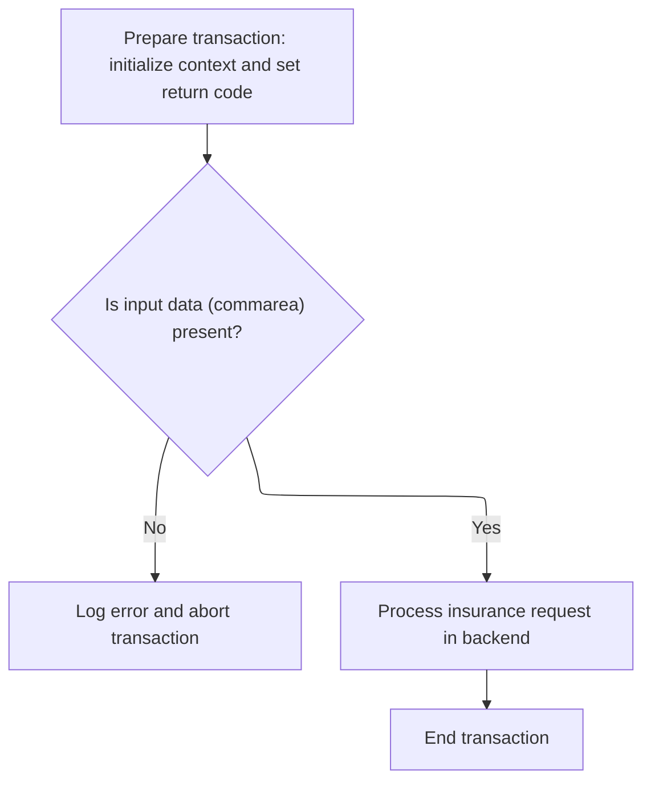
```mermaid
%%{init: {"flowchart": {"defaultRenderer": "elk"}} }%%
flowchart TD
    node1["Prepare transaction: initialize context and set return code"]
    click node1 openCode "base/src/lgipol01.cbl:72:86"
    node1 --> node2{"Is input data (commarea) present?"}
    click node2 openCode "base/src/lgipol01.cbl:79:79"
    node2 -->|"No"| node3["Log error and abort transaction"]
    click node3 openCode "base/src/lgipol01.cbl:80:82"
    node2 -->|"Yes"| node4["Process insurance request in backend"]
    click node4 openCode "base/src/lgipol01.cbl:91:94"
    node4 --> node5["End transaction"]
    click node5 openCode "base/src/lgipol01.cbl:96:96"
classDef HeadingStyle fill:#777777,stroke:#333,stroke-width:2px;

%% Swimm:
%% %%{init: {"flowchart": {"defaultRenderer": "elk"}} }%%
%% flowchart TD
%%     node1["Prepare transaction: initialize context and set return code"]
%%     click node1 openCode "<SwmPath>[base/src/lgipol01.cbl](base/src/lgipol01.cbl)</SwmPath>:72:86"
%%     node1 --> node2{"Is input data (commarea) present?"}
%%     click node2 openCode "<SwmPath>[base/src/lgipol01.cbl](base/src/lgipol01.cbl)</SwmPath>:79:79"
%%     node2 -->|"No"| node3["Log error and abort transaction"]
%%     click node3 openCode "<SwmPath>[base/src/lgipol01.cbl](base/src/lgipol01.cbl)</SwmPath>:80:82"
%%     node2 -->|"Yes"| node4["Process insurance request in backend"]
%%     click node4 openCode "<SwmPath>[base/src/lgipol01.cbl](base/src/lgipol01.cbl)</SwmPath>:91:94"
%%     node4 --> node5["End transaction"]
%%     click node5 openCode "<SwmPath>[base/src/lgipol01.cbl](base/src/lgipol01.cbl)</SwmPath>:96:96"
%% classDef HeadingStyle fill:#777777,stroke:#333,stroke-width:2px;
```

This section governs how policy inquiry requests are validated and processed, ensuring only valid requests are handled and appropriate errors are reported for missing or invalid input.

| Category        | Rule Name                          | Description                                                                                                                                                             |
| --------------- | ---------------------------------- | ----------------------------------------------------------------------------------------------------------------------------------------------------------------------- |
| Data validation | Missing input data abort           | If no input data (commarea) is provided with the policy inquiry request, the transaction must be aborted and an error message must be logged.                           |
| Business logic  | Transaction context initialization | For every valid policy inquiry request, the transaction context must be initialized with the transaction ID, terminal ID, and task number from the request environment. |
| Business logic  | Success return code                | The return code in the commarea must be set to '00' to indicate a successful start of processing for a valid inquiry request.                                           |

<SwmSnippet path="/base/src/lgipol01.cbl" line="70">

---

MAINLINE in <SwmToken path="base/src/lgtestp1.cbl" pos="72:10:10" line-data="                 EXEC CICS LINK PROGRAM(&#39;LGIPOL01&#39;)">`LGIPOL01`</SwmToken> checks for a valid commarea, sets up transaction context, and then calls <SwmToken path="base/src/lgipol01.cbl" pos="91:9:9" line-data="           EXEC CICS LINK Program(LGIPDB01)">`LGIPDB01`</SwmToken> to actually fetch the policy details from <SwmToken path="base/src/lgipdb01.cbl" pos="242:5:5" line-data="      * initialize DB2 host variables">`DB2`</SwmToken>. If the commarea is missing, it logs the error and aborts.

```cobol
       MAINLINE SECTION.
      *
           INITIALIZE WS-HEADER.
      *
           MOVE EIBTRNID TO WS-TRANSID.
           MOVE EIBTRMID TO WS-TERMID.
           MOVE EIBTASKN TO WS-TASKNUM.
      *
      * If NO commarea received issue an ABEND
           IF EIBCALEN IS EQUAL TO ZERO
               MOVE ' NO COMMAREA RECEIVED' TO EM-VARIABLE
               PERFORM WRITE-ERROR-MESSAGE
               EXEC CICS ABEND ABCODE('LGCA') NODUMP END-EXEC
           END-IF

      * initialize commarea return code to zero
           MOVE '00' TO CA-RETURN-CODE
           MOVE EIBCALEN TO WS-CALEN.
           SET WS-ADDR-DFHCOMMAREA TO ADDRESS OF DFHCOMMAREA.
      *

           EXEC CICS LINK Program(LGIPDB01)
               Commarea(DFHCOMMAREA)
               Length(32500)
           END-EXEC.

           EXEC CICS RETURN END-EXEC.
```

---

</SwmSnippet>

## Logging Policy Inquiry Errors

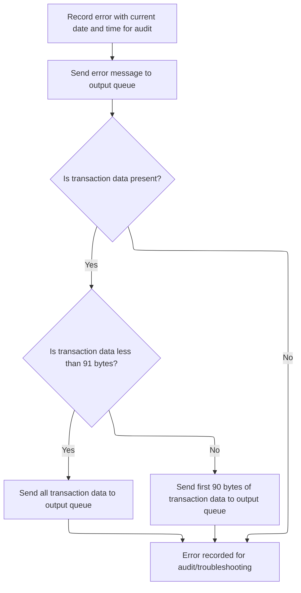
```mermaid
%%{init: {"flowchart": {"defaultRenderer": "elk"}} }%%
flowchart TD
  node1["Record error with current date and time for audit"] --> node2["Send error message to output queue"]
  click node1 openCode "base/src/lgipol01.cbl:110:117"
  click node2 openCode "base/src/lgipol01.cbl:119:122"
  node2 --> node3{"Is transaction data present?"}
  click node3 openCode "base/src/lgipol01.cbl:124:138"
  node3 -->|"Yes"| node4{"Is transaction data less than 91 bytes?"}
  node3 -->|"No"| node7["Error recorded for audit/troubleshooting"]
  click node4 openCode "base/src/lgipol01.cbl:125:131"
  node4 -->|"Yes"| node5["Send all transaction data to output queue"]
  click node5 openCode "base/src/lgipol01.cbl:126:130"
  node4 -->|"No"| node6["Send first 90 bytes of transaction data to output queue"]
  click node6 openCode "base/src/lgipol01.cbl:132:136"
  node5 --> node7["Error recorded for audit/troubleshooting"]
  node6 --> node7["Error recorded for audit/troubleshooting"]
  click node7 openCode "base/src/lgipol01.cbl:139:139"

classDef HeadingStyle fill:#777777,stroke:#333,stroke-width:2px;

%% Swimm:
%% %%{init: {"flowchart": {"defaultRenderer": "elk"}} }%%
%% flowchart TD
%%   node1["Record error with current date and time for audit"] --> node2["Send error message to output queue"]
%%   click node1 openCode "<SwmPath>[base/src/lgipol01.cbl](base/src/lgipol01.cbl)</SwmPath>:110:117"
%%   click node2 openCode "<SwmPath>[base/src/lgipol01.cbl](base/src/lgipol01.cbl)</SwmPath>:119:122"
%%   node2 --> node3{"Is transaction data present?"}
%%   click node3 openCode "<SwmPath>[base/src/lgipol01.cbl](base/src/lgipol01.cbl)</SwmPath>:124:138"
%%   node3 -->|"Yes"| node4{"Is transaction data less than 91 bytes?"}
%%   node3 -->|"No"| node7["Error recorded for audit/troubleshooting"]
%%   click node4 openCode "<SwmPath>[base/src/lgipol01.cbl](base/src/lgipol01.cbl)</SwmPath>:125:131"
%%   node4 -->|"Yes"| node5["Send all transaction data to output queue"]
%%   click node5 openCode "<SwmPath>[base/src/lgipol01.cbl](base/src/lgipol01.cbl)</SwmPath>:126:130"
%%   node4 -->|"No"| node6["Send first 90 bytes of transaction data to output queue"]
%%   click node6 openCode "<SwmPath>[base/src/lgipol01.cbl](base/src/lgipol01.cbl)</SwmPath>:132:136"
%%   node5 --> node7["Error recorded for audit/troubleshooting"]
%%   node6 --> node7["Error recorded for audit/troubleshooting"]
%%   click node7 openCode "<SwmPath>[base/src/lgipol01.cbl](base/src/lgipol01.cbl)</SwmPath>:139:139"
%% 
%% classDef HeadingStyle fill:#777777,stroke:#333,stroke-width:2px;
```

This section ensures that all errors encountered during policy inquiry transactions are logged with sufficient detail for audit and troubleshooting. It governs what information is captured and how much transaction data is included in the error logs.

| Category       | Rule Name                        | Description                                                                                                                                                              |
| -------------- | -------------------------------- | ------------------------------------------------------------------------------------------------------------------------------------------------------------------------ |
| Business logic | Timestamped error logging        | Every error encountered during a policy inquiry must be logged with the current date and time for audit purposes.                                                        |
| Business logic | Transaction data inclusion limit | If transaction data is present, include up to 90 bytes of the transaction data in the error log entry; if less than 91 bytes are available, include all available bytes. |
| Business logic | No transaction data fallback     | If no transaction data is present, log only the error message and timestamp for audit and troubleshooting.                                                               |
| Business logic | Dual queue logging               | All error log entries must be sent to both the output queue and the audit queue to ensure availability for operational monitoring and compliance.                        |
| Business logic | Standardized error log format    | Error logs must be formatted to clearly indicate the source program and include a standard prefix for transaction data ('COMMAREA=').                                    |

<SwmSnippet path="/base/src/lgipol01.cbl" line="107">

---

<SwmToken path="base/src/lgipol01.cbl" pos="107:1:5" line-data="       WRITE-ERROR-MESSAGE.">`WRITE-ERROR-MESSAGE`</SwmToken> grabs the current time, formats the error details, and calls LGSTSQ to log both the error message and up to 90 bytes of the commarea. This keeps logs concise and avoids buffer issues.

```cobol
       WRITE-ERROR-MESSAGE.
      * Save SQLCODE in message
      * Obtain and format current time and date
           EXEC CICS ASKTIME ABSTIME(ABS-TIME)
           END-EXEC
           EXEC CICS FORMATTIME ABSTIME(ABS-TIME)
                     MMDDYYYY(DATE1)
                     TIME(TIME1)
           END-EXEC
           MOVE DATE1 TO EM-DATE
           MOVE TIME1 TO EM-TIME
      * Write output message to TDQ
           EXEC CICS LINK PROGRAM('LGSTSQ')
                     COMMAREA(ERROR-MSG)
                     LENGTH(LENGTH OF ERROR-MSG)
           END-EXEC.
      * Write 90 bytes or as much as we have of commarea to TDQ
           IF EIBCALEN > 0 THEN
             IF EIBCALEN < 91 THEN
               MOVE DFHCOMMAREA(1:EIBCALEN) TO CA-DATA
               EXEC CICS LINK PROGRAM('LGSTSQ')
                         COMMAREA(CA-ERROR-MSG)
                         LENGTH(LENGTH OF CA-ERROR-MSG)
               END-EXEC
             ELSE
               MOVE DFHCOMMAREA(1:90) TO CA-DATA
               EXEC CICS LINK PROGRAM('LGSTSQ')
                         COMMAREA(CA-ERROR-MSG)
                         LENGTH(LENGTH OF CA-ERROR-MSG)
               END-EXEC
             END-IF
           END-IF.
           EXIT.
```

---

</SwmSnippet>

<SwmSnippet path="/base/src/lgstsq.cbl" line="55">

---

MAINLINE in LGSTSQ figures out if the message comes from a program or a receive, handles special 'Q=' prefixes for routing, then writes the message to both TDQ and TSQ. If it's a receive, it sends a text acknowledgment too.

```cobol
       MAINLINE SECTION.

           MOVE SPACES TO WRITE-MSG.
           MOVE SPACES TO WS-RECV.

           EXEC CICS ASSIGN SYSID(WRITE-MSG-SYSID)
                RESP(WS-RESP)
           END-EXEC.

           EXEC CICS ASSIGN INVOKINGPROG(WS-INVOKEPROG)
                RESP(WS-RESP)
           END-EXEC.
           
           IF WS-INVOKEPROG NOT = SPACES
              MOVE 'C' To WS-FLAG
              MOVE COMMA-DATA  TO WRITE-MSG-MSG
              MOVE EIBCALEN    TO WS-RECV-LEN
           ELSE
              EXEC CICS RECEIVE INTO(WS-RECV)
                  LENGTH(WS-RECV-LEN)
                  RESP(WS-RESP)
              END-EXEC
              MOVE 'R' To WS-FLAG
              MOVE WS-RECV-DATA  TO WRITE-MSG-MSG
              SUBTRACT 5 FROM WS-RECV-LEN
           END-IF.

           MOVE 'GENAERRS' TO STSQ-NAME.
           IF WRITE-MSG-MSG(1:2) = 'Q=' THEN
              MOVE WRITE-MSG-MSG(3:4) TO STSQ-EXT
              MOVE WRITE-MSG-REST TO TEMPO
              MOVE TEMPO          TO WRITE-MSG-MSG
              SUBTRACT 7 FROM WS-RECV-LEN
           END-IF.

           ADD 5 TO WS-RECV-LEN.

      * Write output message to TDQ CSMT
      *
           EXEC CICS WRITEQ TD QUEUE(STDQ-NAME)
                     FROM(WRITE-MSG)
                     RESP(WS-RESP)
                     LENGTH(WS-RECV-LEN)

           END-EXEC.

      * Write output message to Genapp TSQ
      * If no space is available then the task will not wait for
      *  storage to become available but will ignore the request...
      *
           EXEC CICS WRITEQ TS QUEUE(STSQ-NAME)
                     FROM(WRITE-MSG)
                     RESP(WS-RESP)
                     NOSUSPEND
                     LENGTH(WS-RECV-LEN)

           END-EXEC.

           If WS-FLAG = 'R' Then
             EXEC CICS SEND TEXT FROM(FILLER-X)
              WAIT
              ERASE
              LENGTH(1)
              FREEKB
             END-EXEC.

           EXEC CICS RETURN
           END-EXEC.
```

---

</SwmSnippet>

## Retrieving Insurance Policy Details from <SwmToken path="base/src/lgipdb01.cbl" pos="242:5:5" line-data="      * initialize DB2 host variables">`DB2`</SwmToken>

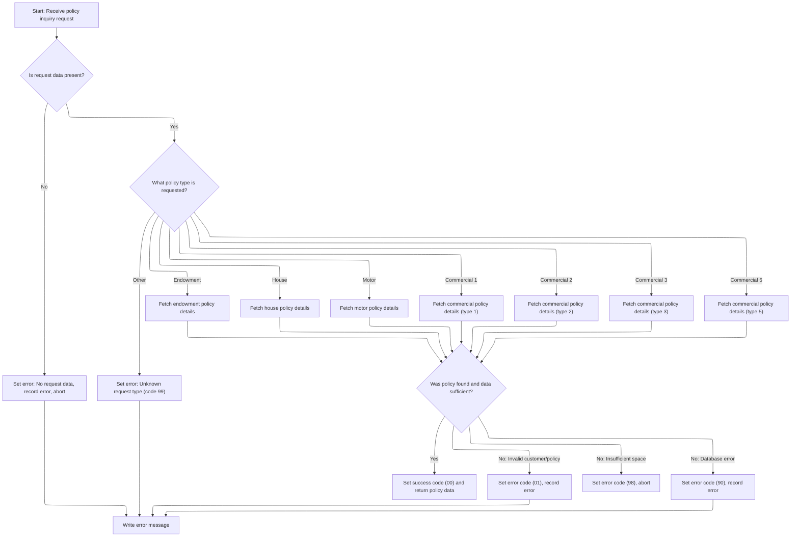
```mermaid
%%{init: {"flowchart": {"defaultRenderer": "elk"}} }%%
flowchart TD
    node1["Start: Receive policy inquiry request"] --> node2{"Is request data present?"}
    click node1 openCode "base/src/lgipdb01.cbl:230:255"
    node2 -->|"No"| node3["Set error: No request data, record error, abort"]
    click node2 openCode "base/src/lgipdb01.cbl:251:255"
    click node3 openCode "base/src/lgipdb01.cbl:252:254"
    node2 -->|"Yes"| node4{"What policy type is requested?"}
    click node4 openCode "base/src/lgipdb01.cbl:277:310"
    node4 -->|"Endowment"| node5["Fetch endowment policy details"]
    node4 -->|"House"| node6["Fetch house policy details"]
    node4 -->|"Motor"| node7["Fetch motor policy details"]
    node4 -->|"Commercial 1"| node8["Fetch commercial policy details (type 1)"]
    node4 -->|"Commercial 2"| node9["Fetch commercial policy details (type 2)"]
    node4 -->|"Commercial 3"| node10["Fetch commercial policy details (type 3)"]
    node4 -->|"Commercial 5"| node11["Fetch commercial policy details (type 5)"]
    node4 -->|"Other"| node12["Set error: Unknown request type (code 99)"]
    click node5 openCode "base/src/lgipdb01.cbl:327:432"
    click node6 openCode "base/src/lgipdb01.cbl:441:523"
    click node7 openCode "base/src/lgipdb01.cbl:529:621"
    click node8 openCode "base/src/lgipdb01.cbl:291:294"
    click node9 openCode "base/src/lgipdb01.cbl:295:298"
    click node10 openCode "base/src/lgipdb01.cbl:299:302"
    click node11 openCode "base/src/lgipdb01.cbl:303:306"
    click node12 openCode "base/src/lgipdb01.cbl:308:309"
    node5 --> node13{"Was policy found and data sufficient?"}
    node6 --> node13
    node7 --> node13
    node8 --> node13
    node9 --> node13
    node10 --> node13
    node11 --> node13
    node13 -->|"Yes"| node14["Set success code (00) and return policy data"]
    node13 -->|"No: Invalid customer/policy"| node15["Set error code (01), record error"]
    node13 -->|"No: Insufficient space"| node16["Set error code (98), abort"]
    node13 -->|"No: Database error"| node17["Set error code (90), record error"]
    click node13 openCode "base/src/lgipdb01.cbl:370:415"
    click node14 openCode "base/src/lgipdb01.cbl:417:432"
    click node15 openCode "base/src/lgipdb01.cbl:421:424"
    click node16 openCode "base/src/lgipdb01.cbl:390:392"
    click node17 openCode "base/src/lgipdb01.cbl:426:429"
    node15 --> node18["Write error message"]
    node17 --> node18
    click node18 openCode "base/src/lgipdb01.cbl:997:1030"
    node3 --> node18
    node12 --> node18
classDef HeadingStyle fill:#777777,stroke:#333,stroke-width:2px;

%% Swimm:
%% %%{init: {"flowchart": {"defaultRenderer": "elk"}} }%%
%% flowchart TD
%%     node1["Start: Receive policy inquiry request"] --> node2{"Is request data present?"}
%%     click node1 openCode "<SwmPath>[base/src/lgipdb01.cbl](base/src/lgipdb01.cbl)</SwmPath>:230:255"
%%     node2 -->|"No"| node3["Set error: No request data, record error, abort"]
%%     click node2 openCode "<SwmPath>[base/src/lgipdb01.cbl](base/src/lgipdb01.cbl)</SwmPath>:251:255"
%%     click node3 openCode "<SwmPath>[base/src/lgipdb01.cbl](base/src/lgipdb01.cbl)</SwmPath>:252:254"
%%     node2 -->|"Yes"| node4{"What policy type is requested?"}
%%     click node4 openCode "<SwmPath>[base/src/lgipdb01.cbl](base/src/lgipdb01.cbl)</SwmPath>:277:310"
%%     node4 -->|"Endowment"| node5["Fetch endowment policy details"]
%%     node4 -->|"House"| node6["Fetch house policy details"]
%%     node4 -->|"Motor"| node7["Fetch motor policy details"]
%%     node4 -->|"Commercial 1"| node8["Fetch commercial policy details (type 1)"]
%%     node4 -->|"Commercial 2"| node9["Fetch commercial policy details (type 2)"]
%%     node4 -->|"Commercial 3"| node10["Fetch commercial policy details (type 3)"]
%%     node4 -->|"Commercial 5"| node11["Fetch commercial policy details (type 5)"]
%%     node4 -->|"Other"| node12["Set error: Unknown request type (code 99)"]
%%     click node5 openCode "<SwmPath>[base/src/lgipdb01.cbl](base/src/lgipdb01.cbl)</SwmPath>:327:432"
%%     click node6 openCode "<SwmPath>[base/src/lgipdb01.cbl](base/src/lgipdb01.cbl)</SwmPath>:441:523"
%%     click node7 openCode "<SwmPath>[base/src/lgipdb01.cbl](base/src/lgipdb01.cbl)</SwmPath>:529:621"
%%     click node8 openCode "<SwmPath>[base/src/lgipdb01.cbl](base/src/lgipdb01.cbl)</SwmPath>:291:294"
%%     click node9 openCode "<SwmPath>[base/src/lgipdb01.cbl](base/src/lgipdb01.cbl)</SwmPath>:295:298"
%%     click node10 openCode "<SwmPath>[base/src/lgipdb01.cbl](base/src/lgipdb01.cbl)</SwmPath>:299:302"
%%     click node11 openCode "<SwmPath>[base/src/lgipdb01.cbl](base/src/lgipdb01.cbl)</SwmPath>:303:306"
%%     click node12 openCode "<SwmPath>[base/src/lgipdb01.cbl](base/src/lgipdb01.cbl)</SwmPath>:308:309"
%%     node5 --> node13{"Was policy found and data sufficient?"}
%%     node6 --> node13
%%     node7 --> node13
%%     node8 --> node13
%%     node9 --> node13
%%     node10 --> node13
%%     node11 --> node13
%%     node13 -->|"Yes"| node14["Set success code (00) and return policy data"]
%%     node13 -->|"No: Invalid customer/policy"| node15["Set error code (01), record error"]
%%     node13 -->|"No: Insufficient space"| node16["Set error code (98), abort"]
%%     node13 -->|"No: Database error"| node17["Set error code (90), record error"]
%%     click node13 openCode "<SwmPath>[base/src/lgipdb01.cbl](base/src/lgipdb01.cbl)</SwmPath>:370:415"
%%     click node14 openCode "<SwmPath>[base/src/lgipdb01.cbl](base/src/lgipdb01.cbl)</SwmPath>:417:432"
%%     click node15 openCode "<SwmPath>[base/src/lgipdb01.cbl](base/src/lgipdb01.cbl)</SwmPath>:421:424"
%%     click node16 openCode "<SwmPath>[base/src/lgipdb01.cbl](base/src/lgipdb01.cbl)</SwmPath>:390:392"
%%     click node17 openCode "<SwmPath>[base/src/lgipdb01.cbl](base/src/lgipdb01.cbl)</SwmPath>:426:429"
%%     node15 --> node18["Write error message"]
%%     node17 --> node18
%%     click node18 openCode "<SwmPath>[base/src/lgipdb01.cbl](base/src/lgipdb01.cbl)</SwmPath>:997:1030"
%%     node3 --> node18
%%     node12 --> node18
%% classDef HeadingStyle fill:#777777,stroke:#333,stroke-width:2px;
```

This section governs the retrieval of insurance policy details from <SwmToken path="base/src/lgipdb01.cbl" pos="242:5:5" line-data="      * initialize DB2 host variables">`DB2`</SwmToken> based on a request, ensuring that only valid requests are processed and that appropriate error handling and logging are performed for all failure scenarios.

| Category        | Rule Name                   | Description                                                                                                                                                                                                                                                                                    |
| --------------- | --------------------------- | ---------------------------------------------------------------------------------------------------------------------------------------------------------------------------------------------------------------------------------------------------------------------------------------------- |
| Data validation | Missing request data        | If no request data is present, the system must abort the operation and record an error message indicating that no commarea was received.                                                                                                                                                       |
| Data validation | Insufficient commarea space | If the commarea provided is not large enough to hold all required policy data, the system must set error code '98' and abort the operation.                                                                                                                                                    |
| Business logic  | Supported policy types      | The system must determine the requested policy type using the request ID and retrieve details only for supported policy types: Endowment, House, Motor, Commercial 1, Commercial 2, Commercial 3, Commercial 5. Any other request type must result in an error code '99' and an error message. |
| Business logic  | Successful policy retrieval | If the requested policy is found and all required data is available, the system must return the policy details and set the success code '00'.                                                                                                                                                  |
| Business logic  | End of data marker          | Returned policy data must be marked with the string 'FINAL' at the end to indicate the end of the data.                                                                                                                                                                                        |

<SwmSnippet path="/base/src/lgipdb01.cbl" line="230">

---

MAINLINE in <SwmToken path="base/src/lgipol01.cbl" pos="91:9:9" line-data="           EXEC CICS LINK Program(LGIPDB01)">`LGIPDB01`</SwmToken> checks the commarea, figures out which policy type is needed based on the request ID, and calls the right <SwmToken path="base/src/lgipdb01.cbl" pos="242:5:5" line-data="      * initialize DB2 host variables">`DB2`</SwmToken> info retrieval routine. It also logs errors and sets up all the <SwmToken path="base/src/lgipdb01.cbl" pos="242:5:5" line-data="      * initialize DB2 host variables">`DB2`</SwmToken> host variables.

```cobol
       MAINLINE SECTION.

      *----------------------------------------------------------------*
      * Common code                                                    *
      *----------------------------------------------------------------*
      * initialize working storage variables
           INITIALIZE WS-HEADER.
      * set up general variable
           MOVE EIBTRNID TO WS-TRANSID.
           MOVE EIBTRMID TO WS-TERMID.
           MOVE EIBTASKN TO WS-TASKNUM.
      *----------------------------------------------------------------*
      * initialize DB2 host variables
           INITIALIZE DB2-IN-INTEGERS.
           INITIALIZE DB2-OUT-INTEGERS.
           INITIALIZE DB2-POLICY.

      *---------------------------------------------------------------*
      * Check commarea and obtain required details                    *
      *---------------------------------------------------------------*
      * If NO commarea received issue an ABEND
           IF EIBCALEN IS EQUAL TO ZERO
             MOVE ' NO COMMAREA RECEIVED' TO EM-VARIABLE
             PERFORM WRITE-ERROR-MESSAGE
             EXEC CICS ABEND ABCODE('LGCA') NODUMP END-EXEC
           END-IF

      * initialize commarea return code to zero
           MOVE '00' TO CA-RETURN-CODE
           MOVE EIBCALEN TO WS-CALEN
           SET WS-ADDR-DFHCOMMAREA TO ADDRESS OF DFHCOMMAREA

      * Convert commarea customer & policy nums to DB2 integer format
           MOVE CA-CUSTOMER-NUM TO DB2-CUSTOMERNUM-INT
           MOVE CA-POLICY-NUM   TO DB2-POLICYNUM-INT
      * and save in error msg field incase required
           MOVE CA-CUSTOMER-NUM TO EM-CUSNUM
           MOVE CA-POLICY-NUM   TO EM-POLNUM

      *----------------------------------------------------------------*
      * Check which policy type is being requested                     *
      * This is not actually required whilst only endowment policy     *
      * inquires are supported, but will make future expansion simpler *
      *----------------------------------------------------------------*
      * Upper case value passed in Request Id field                    *
           MOVE FUNCTION UPPER-CASE(CA-REQUEST-ID) TO WS-REQUEST-ID

           EVALUATE WS-REQUEST-ID

             WHEN '01IEND'
               INITIALIZE DB2-ENDOWMENT
               PERFORM GET-ENDOW-DB2-INFO

             WHEN '01IHOU'
               INITIALIZE DB2-HOUSE
               PERFORM GET-HOUSE-DB2-INFO

             WHEN '01IMOT'
               INITIALIZE DB2-MOTOR
               PERFORM GET-MOTOR-DB2-INFO

             WHEN '01ICOM'
               INITIALIZE DB2-COMMERCIAL
               PERFORM GET-COMMERCIAL-DB2-INFO-1

             WHEN '02ICOM'
               INITIALIZE DB2-COMMERCIAL
               PERFORM GET-COMMERCIAL-DB2-INFO-2

             WHEN '03ICOM'
               INITIALIZE DB2-COMMERCIAL
               PERFORM GET-COMMERCIAL-DB2-INFO-3

             WHEN '05ICOM'
               INITIALIZE DB2-COMMERCIAL
               PERFORM GET-COMMERCIAL-DB2-INFO-5

             WHEN OTHER
               MOVE '99' TO CA-RETURN-CODE

           END-EVALUATE.
```

---

</SwmSnippet>

<SwmSnippet path="/base/src/lgipdb01.cbl" line="997">

---

<SwmToken path="base/src/lgipdb01.cbl" pos="997:1:5" line-data="       WRITE-ERROR-MESSAGE.">`WRITE-ERROR-MESSAGE`</SwmToken> here logs the SQLCODE and request context, then calls LGSTSQ to write both the error message and up to 90 bytes of the commarea for audit purposes.

```cobol
       WRITE-ERROR-MESSAGE.
      * Save SQLCODE in message
           MOVE SQLCODE TO EM-SQLRC
      * Obtain and format current time and date
           EXEC CICS ASKTIME ABSTIME(ABS-TIME)
           END-EXEC
           EXEC CICS FORMATTIME ABSTIME(ABS-TIME)
                     MMDDYYYY(DATE1)
                     TIME(TIME1)
           END-EXEC
           MOVE DATE1 TO EM-DATE
           MOVE TIME1 TO EM-TIME
      * Write output message to TDQ
           EXEC CICS LINK PROGRAM('LGSTSQ')
                     COMMAREA(ERROR-MSG)
                     LENGTH(LENGTH OF ERROR-MSG)
           END-EXEC.
      * Write 90 bytes or as much as we have of commarea to TDQ
           IF EIBCALEN > 0 THEN
             IF EIBCALEN < 91 THEN
               MOVE DFHCOMMAREA(1:EIBCALEN) TO CA-DATA
               EXEC CICS LINK PROGRAM('LGSTSQ')
                         COMMAREA(CA-ERROR-MSG)
                         LENGTH(LENGTH OF CA-ERROR-MSG)
               END-EXEC
             ELSE
               MOVE DFHCOMMAREA(1:90) TO CA-DATA
               EXEC CICS LINK PROGRAM('LGSTSQ')
                         COMMAREA(CA-ERROR-MSG)
                         LENGTH(LENGTH OF CA-ERROR-MSG)
               END-EXEC
             END-IF
           END-IF.
           EXIT.
```

---

</SwmSnippet>

<SwmSnippet path="/base/src/lgipdb01.cbl" line="327">

---

<SwmToken path="base/src/lgipdb01.cbl" pos="327:1:7" line-data="       GET-ENDOW-DB2-INFO.">`GET-ENDOW-DB2-INFO`</SwmToken> fetches endowment policy data, handles variable-length fields, checks commarea size, and marks the end of the returned data with 'FINAL'. It also sets error codes for size issues, missing data, or SQL errors.

```cobol
       GET-ENDOW-DB2-INFO.

           MOVE ' SELECT ENDOW ' TO EM-SQLREQ
           EXEC SQL
             SELECT  ISSUEDATE,
                     EXPIRYDATE,
                     LASTCHANGED,
                     BROKERID,
                     BROKERSREFERENCE,
                     PAYMENT,
                     WITHPROFITS,
                     EQUITIES,
                     MANAGEDFUND,
                     FUNDNAME,
                     TERM,
                     SUMASSURED,
                     LIFEASSURED,
                     PADDINGDATA,
                     LENGTH(PADDINGDATA)
             INTO  :DB2-ISSUEDATE,
                   :DB2-EXPIRYDATE,
                   :DB2-LASTCHANGED,
                   :DB2-BROKERID-INT INDICATOR :IND-BROKERID,
                   :DB2-BROKERSREF INDICATOR :IND-BROKERSREF,
                   :DB2-PAYMENT-INT INDICATOR :IND-PAYMENT,
                   :DB2-E-WITHPROFITS,
                   :DB2-E-EQUITIES,
                   :DB2-E-MANAGEDFUND,
                   :DB2-E-FUNDNAME,
                   :DB2-E-TERM-SINT,
                   :DB2-E-SUMASSURED-INT,
                   :DB2-E-LIFEASSURED,
                   :DB2-E-PADDINGDATA INDICATOR :IND-E-PADDINGDATA,
                   :DB2-E-PADDING-LEN INDICATOR :IND-E-PADDINGDATAL
             FROM  POLICY,ENDOWMENT
             WHERE ( POLICY.POLICYNUMBER =
                        ENDOWMENT.POLICYNUMBER   AND
                     POLICY.CUSTOMERNUMBER =
                        :DB2-CUSTOMERNUM-INT             AND
                     POLICY.POLICYNUMBER =
                        :DB2-POLICYNUM-INT               )
           END-EXEC

           IF SQLCODE = 0
      *      Select was successful

      *      Calculate size of commarea required to return all data
             ADD WS-CA-HEADERTRAILER-LEN TO WS-REQUIRED-CA-LEN
             ADD WS-FULL-ENDOW-LEN       TO WS-REQUIRED-CA-LEN

      *----------------------------------------------------------------*
      *      Specific code to allow for length of VACHAR data
      *      check whether PADDINGDATA field is non-null
      *        and calculate length of endowment policy
      *        and position of free space in commarea after policy data
      *----------------------------------------------------------------*
             IF IND-E-PADDINGDATAL NOT EQUAL MINUS-ONE
               ADD DB2-E-PADDING-LEN TO WS-REQUIRED-CA-LEN
               ADD DB2-E-PADDING-LEN TO END-POLICY-POS
             END-IF

      *      if commarea received is not large enough ...
      *        set error return code and return to caller
             IF EIBCALEN IS LESS THAN WS-REQUIRED-CA-LEN
               MOVE '98' TO CA-RETURN-CODE
               EXEC CICS RETURN END-EXEC
             ELSE
      *        Length is sufficent so move data to commarea
      *        Move Integer fields to required length numerics
      *        Don't move null fields
               IF IND-BROKERID NOT EQUAL MINUS-ONE
                 MOVE DB2-BROKERID-INT    TO DB2-BROKERID
               END-IF
               IF IND-PAYMENT NOT EQUAL MINUS-ONE
                 MOVE DB2-PAYMENT-INT TO DB2-PAYMENT
               END-IF
      *----------------------------------------------------------------*
               MOVE DB2-E-TERM-SINT       TO DB2-E-TERM
               MOVE DB2-E-SUMASSURED-INT  TO DB2-E-SUMASSURED

               MOVE DB2-POLICY-COMMON     TO CA-POLICY-COMMON
               MOVE DB2-ENDOW-FIXED
                   TO CA-ENDOWMENT(1:WS-ENDOW-LEN)
               IF IND-E-PADDINGDATA NOT EQUAL MINUS-ONE
                 MOVE DB2-E-PADDINGDATA TO
                     CA-E-PADDING-DATA(1:DB2-E-PADDING-LEN)
               END-IF
             END-IF

      *      Mark the end of the policy data
             MOVE 'FINAL' TO CA-E-PADDING-DATA(END-POLICY-POS:5)

           ELSE
      *      Non-zero SQLCODE from first SQL FETCH statement
             IF SQLCODE EQUAL 100
      *        No rows found - invalid customer / policy number
               MOVE '01' TO CA-RETURN-CODE
             ELSE
      *        something has gone wrong
               MOVE '90' TO CA-RETURN-CODE
      *        Write error message to TD QUEUE(CSMT)
               PERFORM WRITE-ERROR-MESSAGE
             END-IF

           END-IF.
           EXIT.
```

---

</SwmSnippet>

<SwmSnippet path="/base/src/lgipdb01.cbl" line="441">

---

<SwmToken path="base/src/lgipdb01.cbl" pos="441:1:7" line-data="       GET-HOUSE-DB2-INFO.">`GET-HOUSE-DB2-INFO`</SwmToken> pulls house policy data, checks if the commarea is large enough, handles null <SwmToken path="base/src/lgipdb01.cbl" pos="441:5:5" line-data="       GET-HOUSE-DB2-INFO.">`DB2`</SwmToken> fields, and sets custom error codes for size or data issues. It also marks the end of the data with 'FINAL'.

```cobol
       GET-HOUSE-DB2-INFO.

           MOVE ' SELECT HOUSE ' TO EM-SQLREQ
           EXEC SQL
             SELECT  ISSUEDATE,
                     EXPIRYDATE,
                     LASTCHANGED,
                     BROKERID,
                     BROKERSREFERENCE,
                     PAYMENT,
                     PROPERTYTYPE,
                     BEDROOMS,
                     VALUE,
                     HOUSENAME,
                     HOUSENUMBER,
                     POSTCODE
             INTO  :DB2-ISSUEDATE,
                   :DB2-EXPIRYDATE,
                   :DB2-LASTCHANGED,
                   :DB2-BROKERID-INT INDICATOR :IND-BROKERID,
                   :DB2-BROKERSREF INDICATOR :IND-BROKERSREF,
                   :DB2-PAYMENT-INT INDICATOR :IND-PAYMENT,
                   :DB2-H-PROPERTYTYPE,
                   :DB2-H-BEDROOMS-SINT,
                   :DB2-H-VALUE-INT,
                   :DB2-H-HOUSENAME,
                   :DB2-H-HOUSENUMBER,
                   :DB2-H-POSTCODE
             FROM  POLICY,HOUSE
             WHERE ( POLICY.POLICYNUMBER =
                        HOUSE.POLICYNUMBER   AND
                     POLICY.CUSTOMERNUMBER =
                        :DB2-CUSTOMERNUM-INT             AND
                     POLICY.POLICYNUMBER =
                        :DB2-POLICYNUM-INT               )
           END-EXEC

           IF SQLCODE = 0
      *      Select was successful

      *      Calculate size of commarea required to return all data
             ADD WS-CA-HEADERTRAILER-LEN TO WS-REQUIRED-CA-LEN
             ADD WS-FULL-HOUSE-LEN       TO WS-REQUIRED-CA-LEN

      *      if commarea received is not large enough ...
      *        set error return code and return to caller
             IF EIBCALEN IS LESS THAN WS-REQUIRED-CA-LEN
               MOVE '98' TO CA-RETURN-CODE
               EXEC CICS RETURN END-EXEC
             ELSE
      *        Length is sufficent so move data to commarea
      *        Move Integer fields to required length numerics
      *        Don't move null fields
               IF IND-BROKERID NOT EQUAL MINUS-ONE
                 MOVE DB2-BROKERID-INT  TO DB2-BROKERID
               END-IF
               IF IND-PAYMENT NOT EQUAL MINUS-ONE
                 MOVE DB2-PAYMENT-INT TO DB2-PAYMENT
               END-IF
               MOVE DB2-H-BEDROOMS-SINT TO DB2-H-BEDROOMS
               MOVE DB2-H-VALUE-INT     TO DB2-H-VALUE

               MOVE DB2-POLICY-COMMON   TO CA-POLICY-COMMON
               MOVE DB2-HOUSE           TO CA-HOUSE(1:WS-HOUSE-LEN)
             END-IF

      *      Mark the end of the policy data
             MOVE 'FINAL' TO CA-H-FILLER(1:5)

           ELSE
      *      Non-zero SQLCODE from first SQL FETCH statement
             IF SQLCODE EQUAL 100
      *        No rows found - invalid customer / policy number
               MOVE '01' TO CA-RETURN-CODE
             ELSE
      *        something has gone wrong
               MOVE '90' TO CA-RETURN-CODE
      *        Write error message to TD QUEUE(CSMT)
               PERFORM WRITE-ERROR-MESSAGE
             END-IF

           END-IF.
           EXIT.
```

---

</SwmSnippet>

<SwmSnippet path="/base/src/lgipdb01.cbl" line="529">

---

<SwmToken path="base/src/lgipdb01.cbl" pos="529:1:7" line-data="       GET-MOTOR-DB2-INFO.">`GET-MOTOR-DB2-INFO`</SwmToken> fetches motor policy data, checks commarea size, handles null <SwmToken path="base/src/lgipdb01.cbl" pos="529:5:5" line-data="       GET-MOTOR-DB2-INFO.">`DB2`</SwmToken> fields, maps results to the commarea, and marks the end with 'FINAL'. It uses custom error codes for different failure scenarios.

```cobol
       GET-MOTOR-DB2-INFO.

           MOVE ' SELECT MOTOR ' TO EM-SQLREQ
           EXEC SQL
             SELECT  ISSUEDATE,
                     EXPIRYDATE,
                     LASTCHANGED,
                     BROKERID,
                     BROKERSREFERENCE,
                     PAYMENT,
                     MAKE,
                     MODEL,
                     VALUE,
                     REGNUMBER,
                     COLOUR,
                     CC,
                     YEAROFMANUFACTURE,
                     PREMIUM,
                     ACCIDENTS
             INTO  :DB2-ISSUEDATE,
                   :DB2-EXPIRYDATE,
                   :DB2-LASTCHANGED,
                   :DB2-BROKERID-INT INDICATOR :IND-BROKERID,
                   :DB2-BROKERSREF INDICATOR :IND-BROKERSREF,
                   :DB2-PAYMENT-INT INDICATOR :IND-PAYMENT,
                   :DB2-M-MAKE,
                   :DB2-M-MODEL,
                   :DB2-M-VALUE-INT,
                   :DB2-M-REGNUMBER,
                   :DB2-M-COLOUR,
                   :DB2-M-CC-SINT,
                   :DB2-M-MANUFACTURED,
                   :DB2-M-PREMIUM-INT,
                   :DB2-M-ACCIDENTS-INT
             FROM  POLICY,MOTOR
             WHERE ( POLICY.POLICYNUMBER =
                        MOTOR.POLICYNUMBER   AND
                     POLICY.CUSTOMERNUMBER =
                        :DB2-CUSTOMERNUM-INT             AND
                     POLICY.POLICYNUMBER =
                        :DB2-POLICYNUM-INT               )
           END-EXEC

           IF SQLCODE = 0
      *      Select was successful

      *      Calculate size of commarea required to return all data
             ADD WS-CA-HEADERTRAILER-LEN TO WS-REQUIRED-CA-LEN
             ADD WS-FULL-MOTOR-LEN       TO WS-REQUIRED-CA-LEN

      *      if commarea received is not large enough ...
      *        set error return code and return to caller
             IF EIBCALEN IS LESS THAN WS-REQUIRED-CA-LEN
               MOVE '98' TO CA-RETURN-CODE
               EXEC CICS RETURN END-EXEC
             ELSE
      *        Length is sufficent so move data to commarea
      *        Move Integer fields to required length numerics
      *        Don't move null fields
               IF IND-BROKERID NOT EQUAL MINUS-ONE
                 MOVE DB2-BROKERID-INT TO DB2-BROKERID
               END-IF
               IF IND-PAYMENT NOT EQUAL MINUS-ONE
                 MOVE DB2-PAYMENT-INT    TO DB2-PAYMENT
               END-IF
               MOVE DB2-M-CC-SINT      TO DB2-M-CC
               MOVE DB2-M-VALUE-INT    TO DB2-M-VALUE
               MOVE DB2-M-PREMIUM-INT  TO DB2-M-PREMIUM
               MOVE DB2-M-ACCIDENTS-INT TO DB2-M-ACCIDENTS
               MOVE DB2-M-PREMIUM-INT  TO CA-M-PREMIUM
               MOVE DB2-M-ACCIDENTS-INT TO CA-M-ACCIDENTS

               MOVE DB2-POLICY-COMMON  TO CA-POLICY-COMMON
               MOVE DB2-MOTOR          TO CA-MOTOR(1:WS-MOTOR-LEN)
             END-IF

      *      Mark the end of the policy data
             MOVE 'FINAL' TO CA-M-FILLER(1:5)

           ELSE
      *      Non-zero SQLCODE from first SQL FETCH statement
             IF SQLCODE EQUAL 100
      *        No rows found - invalid customer / policy number
               MOVE '01' TO CA-RETURN-CODE
             ELSE
      *        something has gone wrong
               MOVE '90' TO CA-RETURN-CODE
      *        Write error message to TD QUEUE(CSMT)
               PERFORM WRITE-ERROR-MESSAGE
             END-IF

           END-IF.
           EXIT.
```

---

</SwmSnippet>

## Handling Motor Policy Inquiry Results

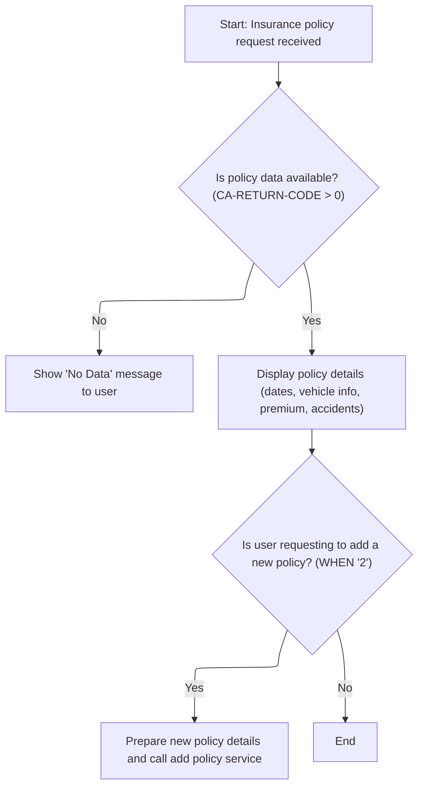
```mermaid
%%{init: {"flowchart": {"defaultRenderer": "elk"}} }%%
flowchart TD
    node1["Start: Insurance policy request received"]
    click node1 openCode "base/src/lgtestp1.cbl:76:78"
    node1 --> node2{"Is policy data available? (CA-RETURN-CODE > 0)"}
    click node2 openCode "base/src/lgtestp1.cbl:76:78"
    node2 -->|"No"| node3["Show 'No Data' message to user"]
    click node3 openCode "base/src/lgtestp1.cbl:77:78"
    node2 -->|"Yes"| node4["Display policy details (dates, vehicle info, premium, accidents)"]
    click node4 openCode "base/src/lgtestp1.cbl:80:90"
    node4 --> node5{"Is user requesting to add a new policy? (WHEN '2')"}
    click node5 openCode "base/src/lgtestp1.cbl:97:113"
    node5 -->|"Yes"| node6["Prepare new policy details and call add policy service"]
    click node6 openCode "base/src/lgtestp1.cbl:98:118"
    node5 -->|"No"| node7["End"]
    click node7 openCode "base/src/lgtestp1.cbl:94:94"

classDef HeadingStyle fill:#777777,stroke:#333,stroke-width:2px;

%% Swimm:
%% %%{init: {"flowchart": {"defaultRenderer": "elk"}} }%%
%% flowchart TD
%%     node1["Start: Insurance policy request received"]
%%     click node1 openCode "<SwmPath>[base/src/lgtestp1.cbl](base/src/lgtestp1.cbl)</SwmPath>:76:78"
%%     node1 --> node2{"Is policy data available? (<SwmToken path="base/src/lgtestp1.cbl" pos="76:3:7" line-data="                 IF CA-RETURN-CODE &gt; 0">`CA-RETURN-CODE`</SwmToken> > 0)"}
%%     click node2 openCode "<SwmPath>[base/src/lgtestp1.cbl](base/src/lgtestp1.cbl)</SwmPath>:76:78"
%%     node2 -->|"No"| node3["Show 'No Data' message to user"]
%%     click node3 openCode "<SwmPath>[base/src/lgtestp1.cbl](base/src/lgtestp1.cbl)</SwmPath>:77:78"
%%     node2 -->|"Yes"| node4["Display policy details (dates, vehicle info, premium, accidents)"]
%%     click node4 openCode "<SwmPath>[base/src/lgtestp1.cbl](base/src/lgtestp1.cbl)</SwmPath>:80:90"
%%     node4 --> node5{"Is user requesting to add a new policy? (WHEN '2')"}
%%     click node5 openCode "<SwmPath>[base/src/lgtestp1.cbl](base/src/lgtestp1.cbl)</SwmPath>:97:113"
%%     node5 -->|"Yes"| node6["Prepare new policy details and call add policy service"]
%%     click node6 openCode "<SwmPath>[base/src/lgtestp1.cbl](base/src/lgtestp1.cbl)</SwmPath>:98:118"
%%     node5 -->|"No"| node7["End"]
%%     click node7 openCode "<SwmPath>[base/src/lgtestp1.cbl](base/src/lgtestp1.cbl)</SwmPath>:94:94"
%% 
%% classDef HeadingStyle fill:#777777,stroke:#333,stroke-width:2px;
```

<SwmSnippet path="/base/src/lgtestp1.cbl" line="76">

---

Back in <SwmToken path="base/src/lgtestp1.cbl" pos="33:5:7" line-data="              GO TO A-GAIN.">`A-GAIN`</SwmToken>, after returning from <SwmToken path="base/src/lgtestp1.cbl" pos="72:10:10" line-data="                 EXEC CICS LINK PROGRAM(&#39;LGIPOL01&#39;)">`LGIPOL01`</SwmToken>, we check <SwmToken path="base/src/lgtestp1.cbl" pos="76:3:7" line-data="                 IF CA-RETURN-CODE &gt; 0">`CA-RETURN-CODE`</SwmToken>. If it's non-zero, we jump to <SwmToken path="base/src/lgtestp1.cbl" pos="77:5:7" line-data="                   GO TO NO-DATA">`NO-DATA`</SwmToken> to show the user that no policy was found.

```cobol
                 IF CA-RETURN-CODE > 0
                   GO TO NO-DATA
                 END-IF
```

---

</SwmSnippet>

<SwmSnippet path="/base/src/lgtestp1.cbl" line="80">

---

Here we copy the motor policy details from the commarea into the screen fields, prepping them for display to the user.

```cobol
                 Move CA-ISSUE-DATE     To  ENP1IDAI
                 Move CA-EXPIRY-DATE    To  ENP1EDAI
                 Move CA-M-MAKE         To  ENP1CMKI
                 Move CA-M-MODEL        To  ENP1CMOI
                 Move CA-M-VALUE        To  ENP1VALI
                 Move CA-M-REGNUMBER    To  ENP1REGI
                 Move CA-M-COLOUR       To  ENP1COLI
                 Move CA-M-CC           To  ENP1CCI
                 Move CA-M-MANUFACTURED To  ENP1MANI
                 Move CA-M-PREMIUM      To  ENP1PREI
                 Move CA-M-ACCIDENTS    To  ENP1ACCI
```

---

</SwmSnippet>

<SwmSnippet path="/base/src/lgtestp1.cbl" line="91">

---

Next we send the updated map to the user, showing the motor policy details we just fetched.

```cobol
                 EXEC CICS SEND MAP ('SSMAPP1')
                           FROM(SSMAPP1O)
                           MAPSET ('SSMAP')
                 END-EXEC
```

---

</SwmSnippet>

<SwmSnippet path="/base/src/lgtestp1.cbl" line="97">

---

Here we prep the commarea with all the motor policy fields before calling the add operation, making sure all required data is set.

```cobol
             WHEN '2'
                 Move '01AMOT'          To CA-REQUEST-ID
                 Move ENP1CNOI          To CA-CUSTOMER-NUM
                 Move 0                 To CA-PAYMENT
                 Move 0                 To CA-BROKERID
                 Move '        '        To CA-BROKERSREF
                 Move ENP1IDAI          To CA-ISSUE-DATE
                 Move ENP1EDAI          To CA-EXPIRY-DATE
                 Move ENP1CMKI          To CA-M-MAKE
                 Move ENP1CMOI          To CA-M-MODEL
                 Move ENP1VALI          To CA-M-VALUE
                 Move ENP1REGI          To CA-M-REGNUMBER
                 Move ENP1COLI          To CA-M-COLOUR
                 Move ENP1CCI           To CA-M-CC
                 Move ENP1MANI          To CA-M-MANUFACTURED
                 Move ENP1PREI          To CA-M-PREMIUM
                 Move ENP1ACCI          To CA-M-ACCIDENTS
```

---

</SwmSnippet>

<SwmSnippet path="/base/src/lgtestp1.cbl" line="115">

---

We call <SwmToken path="base/src/lgtestp1.cbl" pos="115:10:10" line-data="                 EXEC CICS LINK PROGRAM(&#39;LGAPOL01&#39;)">`LGAPOL01`</SwmToken> here to actually add the new motor policy to the database, passing all the prepped data in the commarea.

```cobol
                 EXEC CICS LINK PROGRAM('LGAPOL01')
                           COMMAREA(COMM-AREA)
                           LENGTH(32500)
                 END-EXEC
```

---

</SwmSnippet>

## Validating and Inserting Motor Policy Data

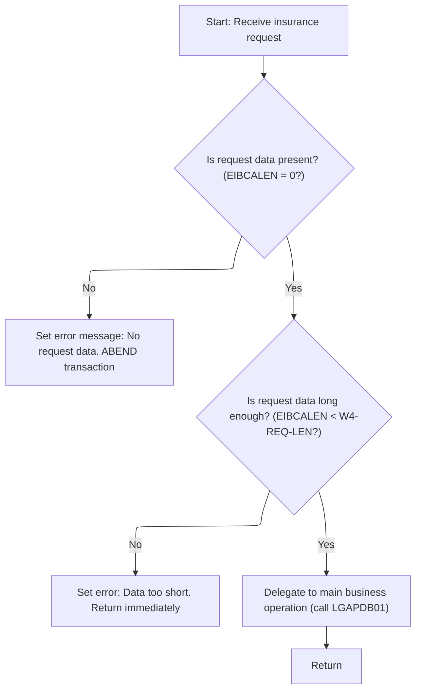
```mermaid
%%{init: {"flowchart": {"defaultRenderer": "elk"}} }%%
flowchart TD
  node1["Start: Receive insurance request"] --> node2{"Is request data present? (EIBCALEN = 0?)"}
  click node1 openCode "base/src/lgapol01.cbl:68:108"
  node2 -->|"No"| node3["Set error message: No request data. ABEND transaction"]
  click node2 openCode "base/src/lgapol01.cbl:83:87"
  click node3 openCode "base/src/lgapol01.cbl:84:86"
  node2 -->|"Yes"| node4{"Is request data long enough? (EIBCALEN < W4-REQ-LEN?)"}
  click node4 openCode "base/src/lgapol01.cbl:95:98"
  node4 -->|"No"| node5["Set error: Data too short. Return immediately"]
  click node5 openCode "base/src/lgapol01.cbl:96:97"
  node4 -->|"Yes"| node6["Delegate to main business operation (call LGAPDB01)"]
  click node6 openCode "base/src/lgapol01.cbl:103:106"
  node6 --> node7["Return"]
  click node7 openCode "base/src/lgapol01.cbl:108:108"
classDef HeadingStyle fill:#777777,stroke:#333,stroke-width:2px;

%% Swimm:
%% %%{init: {"flowchart": {"defaultRenderer": "elk"}} }%%
%% flowchart TD
%%   node1["Start: Receive insurance request"] --> node2{"Is request data present? (EIBCALEN = 0?)"}
%%   click node1 openCode "<SwmPath>[base/src/lgapol01.cbl](base/src/lgapol01.cbl)</SwmPath>:68:108"
%%   node2 -->|"No"| node3["Set error message: No request data. ABEND transaction"]
%%   click node2 openCode "<SwmPath>[base/src/lgapol01.cbl](base/src/lgapol01.cbl)</SwmPath>:83:87"
%%   click node3 openCode "<SwmPath>[base/src/lgapol01.cbl](base/src/lgapol01.cbl)</SwmPath>:84:86"
%%   node2 -->|"Yes"| node4{"Is request data long enough? (EIBCALEN < <SwmToken path="base/src/lgapol01.cbl" pos="92:11:15" line-data="           ADD W4-HDR-LEN TO W4-REQ-LEN">`W4-REQ-LEN`</SwmToken>?)"}
%%   click node4 openCode "<SwmPath>[base/src/lgapol01.cbl](base/src/lgapol01.cbl)</SwmPath>:95:98"
%%   node4 -->|"No"| node5["Set error: Data too short. Return immediately"]
%%   click node5 openCode "<SwmPath>[base/src/lgapol01.cbl](base/src/lgapol01.cbl)</SwmPath>:96:97"
%%   node4 -->|"Yes"| node6["Delegate to main business operation (call <SwmToken path="base/src/lgapol01.cbl" pos="103:9:9" line-data="           EXEC CICS Link Program(LGAPDB01)">`LGAPDB01`</SwmToken>)"]
%%   click node6 openCode "<SwmPath>[base/src/lgapol01.cbl](base/src/lgapol01.cbl)</SwmPath>:103:106"
%%   node6 --> node7["Return"]
%%   click node7 openCode "<SwmPath>[base/src/lgapol01.cbl](base/src/lgapol01.cbl)</SwmPath>:108:108"
%% classDef HeadingStyle fill:#777777,stroke:#333,stroke-width:2px;
```

This section governs the validation and insertion of new motor insurance policy data. It ensures that incoming requests contain all required information and are of sufficient length before delegating the actual database insertion to the main business operation. Errors and incomplete requests are logged for audit and troubleshooting purposes.

| Category        | Rule Name                    | Description                                                                                                                                                                                         |
| --------------- | ---------------------------- | --------------------------------------------------------------------------------------------------------------------------------------------------------------------------------------------------- |
| Data validation | Missing request data         | If no request data is present in the commarea, the transaction must be immediately terminated with an error message indicating that no data was received.                                           |
| Data validation | Minimum request length       | If the request data is shorter than the required minimum length (header length plus required request length), the transaction must return an error code '98' and not proceed with policy insertion. |
| Business logic  | Validated request delegation | Only requests that pass all validation checks are delegated to the main business operation for policy insertion.                                                                                    |

<SwmSnippet path="/base/src/lgapol01.cbl" line="68">

---

<SwmToken path="base/src/lgapol01.cbl" pos="68:1:3" line-data="       P100-MAIN SECTION.">`P100-MAIN`</SwmToken> checks the commarea for validity and size, logs errors if needed, then calls <SwmToken path="base/src/lgapol01.cbl" pos="103:9:9" line-data="           EXEC CICS Link Program(LGAPDB01)">`LGAPDB01`</SwmToken> to do the actual database insert for the new policy.

```cobol
       P100-MAIN SECTION.

      *----------------------------------------------------------------*
      * Common code                                                    *
      *----------------------------------------------------------------*
           INITIALIZE W1-CONTROL.
           MOVE EIBTRNID TO W1-TID.
           MOVE EIBTRMID TO W1-TRM.
           MOVE EIBTASKN TO W1-TSK.
           MOVE EIBCALEN TO W1-LEN.
      *----------------------------------------------------------------*

      *----------------------------------------------------------------*
      * Check commarea and obtain required details                     *
      *----------------------------------------------------------------*
           IF EIBCALEN IS EQUAL TO ZERO
               MOVE ' NO COMMAREA RECEIVED' TO W3-DETAIL
               PERFORM P999-ERROR
               EXEC CICS ABEND ABCODE('LGCA') NODUMP END-EXEC
           END-IF

           MOVE '00' TO CA-RETURN-CODE
           SET W1-PTR TO ADDRESS OF DFHCOMMAREA.

           ADD W4-HDR-LEN TO W4-REQ-LEN


           IF EIBCALEN IS LESS THAN W4-REQ-LEN
             MOVE '98' TO CA-RETURN-CODE
             EXEC CICS RETURN END-EXEC
           END-IF

      *----------------------------------------------------------------*
      *    Perform the data Inserts                                    *
      *----------------------------------------------------------------*
           EXEC CICS Link Program(LGAPDB01)
                Commarea(DFHCOMMAREA)
                LENGTH(32500)
           END-EXEC.

           EXEC CICS RETURN END-EXEC.
```

---

</SwmSnippet>

<SwmSnippet path="/base/src/lgapol01.cbl" line="119">

---

<SwmToken path="base/src/lgapol01.cbl" pos="119:1:3" line-data="       P999-ERROR.">`P999-ERROR`</SwmToken> logs the error details and up to 90 bytes of the commarea by calling LGSTSQ, making sure all relevant info is captured for troubleshooting.

```cobol
       P999-ERROR.
      * Save SQLCODE in message
      * Obtain and format current time and date
           EXEC CICS ASKTIME ABSTIME(W2-TIME)
           END-EXEC
           EXEC CICS FORMATTIME ABSTIME(W2-TIME)
                     MMDDYYYY(W2-DATE1)
                     TIME(W2-DATE2)
           END-EXEC
           MOVE W2-DATE1 TO W3-DATE
           MOVE W2-DATE2 TO W3-TIME
      * Write output message to TDQ
           EXEC CICS LINK PROGRAM('LGSTSQ')
                     COMMAREA(W3-MESSAGE)
                     LENGTH(LENGTH OF W3-MESSAGE)
           END-EXEC.
      * Write 90 bytes or as much as we have of commarea to TDQ
           IF EIBCALEN > 0 THEN
             IF EIBCALEN < 91 THEN
               MOVE DFHCOMMAREA(1:EIBCALEN) TO CA-DATA
               EXEC CICS LINK PROGRAM('LGSTSQ')
                         COMMAREA(CA-ERROR-MSG)
                         LENGTH(LENGTH OF CA-ERROR-MSG)
               END-EXEC
             ELSE
               MOVE DFHCOMMAREA(1:90) TO CA-DATA
               EXEC CICS LINK PROGRAM('LGSTSQ')
                         COMMAREA(CA-ERROR-MSG)
                         LENGTH(LENGTH OF CA-ERROR-MSG)
               END-EXEC
             END-IF
           END-IF.
           EXIT.
```

---

</SwmSnippet>

## Running the Policy Insert and Premium Calculation Workflow

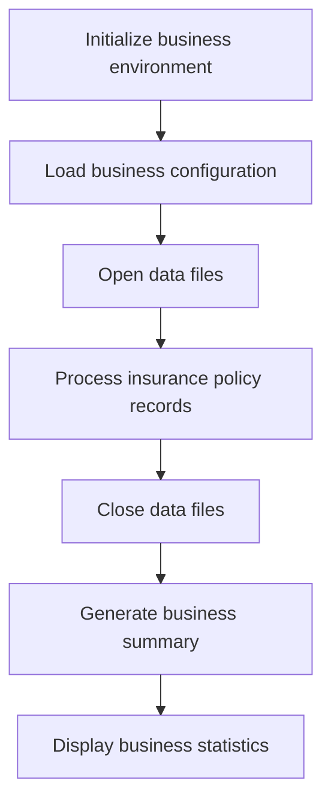
```mermaid
%%{init: {"flowchart": {"defaultRenderer": "elk"}} }%%
flowchart TD
    node1["Initialize business environment"] --> node2["Load business configuration"]
    click node1 openCode "base/src/LGAPDB01.cbl:91:91"
    node2 --> node3["Open data files"]
    click node2 openCode "base/src/LGAPDB01.cbl:92:92"
    node3 --> node4["Process insurance policy records"]
    click node3 openCode "base/src/LGAPDB01.cbl:93:93"
    node4 --> node5["Close data files"]
    click node4 openCode "base/src/LGAPDB01.cbl:94:94"
    node5 --> node6["Generate business summary"]
    click node5 openCode "base/src/LGAPDB01.cbl:95:95"
    node6 --> node7["Display business statistics"]
    click node6 openCode "base/src/LGAPDB01.cbl:96:96"
    click node7 openCode "base/src/LGAPDB01.cbl:97:97"
classDef HeadingStyle fill:#777777,stroke:#333,stroke-width:2px;

%% Swimm:
%% %%{init: {"flowchart": {"defaultRenderer": "elk"}} }%%
%% flowchart TD
%%     node1["Initialize business environment"] --> node2["Load business configuration"]
%%     click node1 openCode "<SwmPath>[base/src/LGAPDB01.cbl](base/src/LGAPDB01.cbl)</SwmPath>:91:91"
%%     node2 --> node3["Open data files"]
%%     click node2 openCode "<SwmPath>[base/src/LGAPDB01.cbl](base/src/LGAPDB01.cbl)</SwmPath>:92:92"
%%     node3 --> node4["Process insurance policy records"]
%%     click node3 openCode "<SwmPath>[base/src/LGAPDB01.cbl](base/src/LGAPDB01.cbl)</SwmPath>:93:93"
%%     node4 --> node5["Close data files"]
%%     click node4 openCode "<SwmPath>[base/src/LGAPDB01.cbl](base/src/LGAPDB01.cbl)</SwmPath>:94:94"
%%     node5 --> node6["Generate business summary"]
%%     click node5 openCode "<SwmPath>[base/src/LGAPDB01.cbl](base/src/LGAPDB01.cbl)</SwmPath>:95:95"
%%     node6 --> node7["Display business statistics"]
%%     click node6 openCode "<SwmPath>[base/src/LGAPDB01.cbl](base/src/LGAPDB01.cbl)</SwmPath>:96:96"
%%     click node7 openCode "<SwmPath>[base/src/LGAPDB01.cbl](base/src/LGAPDB01.cbl)</SwmPath>:97:97"
%% classDef HeadingStyle fill:#777777,stroke:#333,stroke-width:2px;
```

This section orchestrates the end-to-end process for adding new insurance policies and calculating their premiums, ensuring all relevant business data is processed and summarized for operational review.

| Category        | Rule Name                      | Description                                                                                                                                                               |
| --------------- | ------------------------------ | ------------------------------------------------------------------------------------------------------------------------------------------------------------------------- |
| Data validation | Policy completeness validation | Each new insurance policy record must be validated for completeness before it is inserted into the system.                                                                |
| Business logic  | Premium calculation logic      | Premiums for each policy must be calculated according to the business-defined formula, which may include factors such as policy type, coverage amount, and risk category. |
| Business logic  | Business summary reporting     | The business summary must include the total number of policies processed, total premiums calculated, and any errors encountered during processing.                        |
| Business logic  | Statistics display requirement | Business statistics must be displayed at the end of the workflow to provide visibility into the operation's outcomes.                                                     |

<SwmSnippet path="/base/src/LGAPDB01.cbl" line="90">

---

We run all the steps needed for policy insert and premium calculation.

```cobol
       P001.
           PERFORM P002-INITIALIZE
           PERFORM P003-LOAD-CONFIG
           PERFORM P005-OPEN-FILES
           PERFORM P006-PROCESS-RECORDS
           PERFORM P014-CLOSE-FILES
           PERFORM P015-GENERATE-SUMMARY
           PERFORM P016-DISPLAY-STATS
           STOP RUN.
```

---

</SwmSnippet>

## Processing and Validating Policy Records

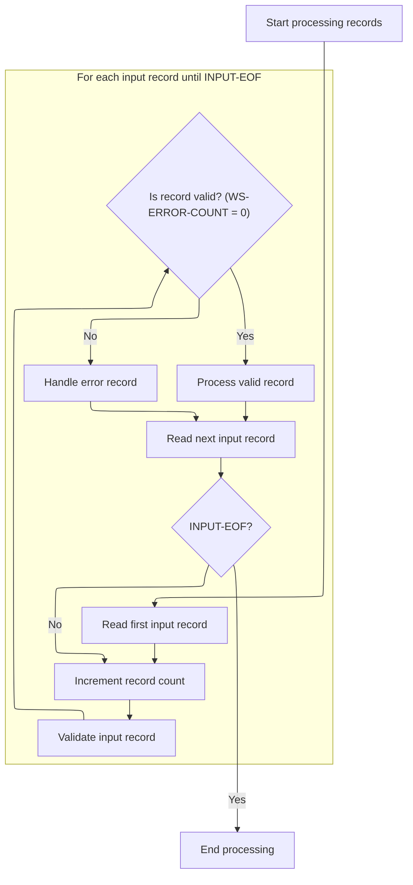
```mermaid
%%{init: {"flowchart": {"defaultRenderer": "elk"}} }%%
flowchart TD
    node1["Start processing records"]
    click node1 openCode "base/src/LGAPDB01.cbl:178:179"
    node1 --> node2["Read first input record"]
    click node2 openCode "base/src/LGAPDB01.cbl:179:179"
    subgraph loop1["For each input record until INPUT-EOF"]
        node2 --> node3["Increment record count"]
        click node3 openCode "base/src/LGAPDB01.cbl:181:181"
        node3 --> node4["Validate input record"]
        click node4 openCode "base/src/LGAPDB01.cbl:182:182"
        node4 --> node5{"Is record valid? (WS-ERROR-COUNT = 0)"}
        click node5 openCode "base/src/LGAPDB01.cbl:183:187"
        node5 -->|"Yes"| node6["Process valid record"]
        click node6 openCode "base/src/LGAPDB01.cbl:184:184"
        node5 -->|"No"| node7["Handle error record"]
        click node7 openCode "base/src/LGAPDB01.cbl:186:186"
        node6 --> node8["Read next input record"]
        click node8 openCode "base/src/LGAPDB01.cbl:188:188"
        node7 --> node8
        node8 --> node9{"INPUT-EOF?"}
        click node9 openCode "base/src/LGAPDB01.cbl:180:189"
        node9 -->|"No"| node3
    end
    node9 -->|"Yes"| node10["End processing"]
    click node10 openCode "base/src/LGAPDB01.cbl:189:189"

classDef HeadingStyle fill:#777777,stroke:#333,stroke-width:2px;

%% Swimm:
%% %%{init: {"flowchart": {"defaultRenderer": "elk"}} }%%
%% flowchart TD
%%     node1["Start processing records"]
%%     click node1 openCode "<SwmPath>[base/src/LGAPDB01.cbl](base/src/LGAPDB01.cbl)</SwmPath>:178:179"
%%     node1 --> node2["Read first input record"]
%%     click node2 openCode "<SwmPath>[base/src/LGAPDB01.cbl](base/src/LGAPDB01.cbl)</SwmPath>:179:179"
%%     subgraph loop1["For each input record until <SwmToken path="base/src/LGAPDB01.cbl" pos="180:5:7" line-data="           PERFORM UNTIL INPUT-EOF">`INPUT-EOF`</SwmToken>"]
%%         node2 --> node3["Increment record count"]
%%         click node3 openCode "<SwmPath>[base/src/LGAPDB01.cbl](base/src/LGAPDB01.cbl)</SwmPath>:181:181"
%%         node3 --> node4["Validate input record"]
%%         click node4 openCode "<SwmPath>[base/src/LGAPDB01.cbl](base/src/LGAPDB01.cbl)</SwmPath>:182:182"
%%         node4 --> node5{"Is record valid? (<SwmToken path="base/src/LGAPDB01.cbl" pos="183:3:7" line-data="               IF WS-ERROR-COUNT = ZERO">`WS-ERROR-COUNT`</SwmToken> = 0)"}
%%         click node5 openCode "<SwmPath>[base/src/LGAPDB01.cbl](base/src/LGAPDB01.cbl)</SwmPath>:183:187"
%%         node5 -->|"Yes"| node6["Process valid record"]
%%         click node6 openCode "<SwmPath>[base/src/LGAPDB01.cbl](base/src/LGAPDB01.cbl)</SwmPath>:184:184"
%%         node5 -->|"No"| node7["Handle error record"]
%%         click node7 openCode "<SwmPath>[base/src/LGAPDB01.cbl](base/src/LGAPDB01.cbl)</SwmPath>:186:186"
%%         node6 --> node8["Read next input record"]
%%         click node8 openCode "<SwmPath>[base/src/LGAPDB01.cbl](base/src/LGAPDB01.cbl)</SwmPath>:188:188"
%%         node7 --> node8
%%         node8 --> node9{"<SwmToken path="base/src/LGAPDB01.cbl" pos="180:5:7" line-data="           PERFORM UNTIL INPUT-EOF">`INPUT-EOF`</SwmToken>?"}
%%         click node9 openCode "<SwmPath>[base/src/LGAPDB01.cbl](base/src/LGAPDB01.cbl)</SwmPath>:180:189"
%%         node9 -->|"No"| node3
%%     end
%%     node9 -->|"Yes"| node10["End processing"]
%%     click node10 openCode "<SwmPath>[base/src/LGAPDB01.cbl](base/src/LGAPDB01.cbl)</SwmPath>:189:189"
%% 
%% classDef HeadingStyle fill:#777777,stroke:#333,stroke-width:2px;
```

This section is responsible for iterating through all incoming policy records, validating each one, and ensuring that only valid records are processed. Invalid records are identified and logged with error details, supporting data quality and audit requirements.

| Category        | Rule Name                      | Description                                                                                                                                           |
| --------------- | ------------------------------ | ----------------------------------------------------------------------------------------------------------------------------------------------------- |
| Data validation | Policy record validation       | Each input policy record must be validated for correctness before it is processed. Only records that pass all validation checks are considered valid. |
| Business logic  | Processed record counting      | The total number of processed records must be incremented for each input record, regardless of whether the record is valid or invalid.                |
| Business logic  | End-of-file processing control | Processing must continue until the end-of-file condition is reached, as indicated by the input status value of '10'.                                  |

<SwmSnippet path="/base/src/LGAPDB01.cbl" line="178">

---

<SwmToken path="base/src/LGAPDB01.cbl" pos="178:1:5" line-data="       P006-PROCESS-RECORDS.">`P006-PROCESS-RECORDS`</SwmToken> loops through each input record, validates it, and then either processes it as valid or logs it as an error, keeping the workflow clean.

```cobol
       P006-PROCESS-RECORDS.
           PERFORM P007-READ-INPUT
           PERFORM UNTIL INPUT-EOF
               ADD 1 TO WS-REC-CNT
               PERFORM P008-VALIDATE-INPUT-RECORD
               IF WS-ERROR-COUNT = ZERO
                   PERFORM P009-PROCESS-VALID-RECORD
               ELSE
                   PERFORM P010-PROCESS-ERROR-RECORD
               END-IF
               PERFORM P007-READ-INPUT
           END-PERFORM.
```

---

</SwmSnippet>

## Handling Valid and Non-Commercial Policy Records

This section governs how valid insurance policy records are classified and processed based on their type. It ensures that only commercial policies are processed as valid, while non-commercial policies are rejected and tracked for error statistics.

| Category       | Rule Name                                  | Description                                                                                                                                                   |
| -------------- | ------------------------------------------ | ------------------------------------------------------------------------------------------------------------------------------------------------------------- |
| Business logic | Commercial policy acceptance               | If a policy record is identified as a commercial policy (policy type 'C'), it must be processed as a valid policy and included in the processed policy count. |
| Business logic | Non-commercial policy rejection            | If a policy record is not a commercial policy (policy type not equal to 'C'), it must be rejected and included in the error count for reporting purposes.     |
| Business logic | Processed policy counter update            | Each time a commercial policy is processed, the processed policy counter must be incremented by one to maintain accurate statistics.                          |
| Business logic | Error counter update for rejected policies | Each time a non-commercial policy is rejected, the error counter must be incremented by one to maintain accurate error statistics.                            |

<SwmSnippet path="/base/src/LGAPDB01.cbl" line="234">

---

<SwmToken path="base/src/LGAPDB01.cbl" pos="234:1:7" line-data="       P009-PROCESS-VALID-RECORD.">`P009-PROCESS-VALID-RECORD`</SwmToken> checks if the policy is commercial, processes it if so, or rejects it if not, updating the right counters for stats.

```cobol
       P009-PROCESS-VALID-RECORD.
           IF COMMERCIAL-POLICY
               PERFORM P011-PROCESS-COMMERCIAL
               ADD 1 TO WS-PROC-CNT
           ELSE
               PERFORM P012-PROCESS-NON-COMMERCIAL
               ADD 1 TO WS-ERR-CNT
           END-IF.
```

---

</SwmSnippet>

## Calculating Premiums and Applying Business Rules

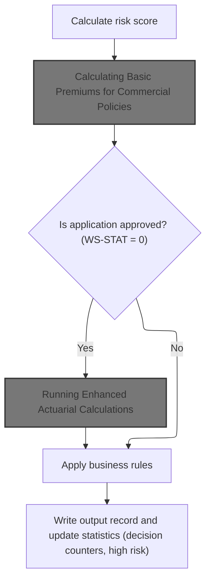
```mermaid
%%{init: {"flowchart": {"defaultRenderer": "elk"}} }%%
flowchart TD
  node1["Calculate risk score"]
  click node1 openCode "base/src/LGAPDB01.cbl:258:266"
  node1 --> node2["Calculating Basic Premiums for Commercial Policies"]
  
  node2 --> node3{"Is application approved? (WS-STAT = 0)"}
  click node3 openCode "base/src/LGAPDB01.cbl:261:263"
  node3 -->|"Yes"| node4["Running Enhanced Actuarial Calculations"]
  
  node3 -->|"No"| node5["Apply business rules"]
  click node5 openCode "base/src/LGAPDB04.cbl:138:200"
  node4 --> node5
  node5 --> node6["Write output record and update statistics (decision counters, high risk)"]
  click node6 openCode "base/src/LGAPDB01.cbl:365:377"
classDef HeadingStyle fill:#777777,stroke:#333,stroke-width:2px;
click node2 goToHeading "Calculating Basic Premiums for Commercial Policies"
node2:::HeadingStyle
click node4 goToHeading "Running Enhanced Actuarial Calculations"
node4:::HeadingStyle

%% Swimm:
%% %%{init: {"flowchart": {"defaultRenderer": "elk"}} }%%
%% flowchart TD
%%   node1["Calculate risk score"]
%%   click node1 openCode "<SwmPath>[base/src/LGAPDB01.cbl](base/src/LGAPDB01.cbl)</SwmPath>:258:266"
%%   node1 --> node2["Calculating Basic Premiums for Commercial Policies"]
%%   
%%   node2 --> node3{"Is application approved? (<SwmToken path="base/src/LGAPDB01.cbl" pos="261:3:5" line-data="           IF WS-STAT = 0">`WS-STAT`</SwmToken> = 0)"}
%%   click node3 openCode "<SwmPath>[base/src/LGAPDB01.cbl](base/src/LGAPDB01.cbl)</SwmPath>:261:263"
%%   node3 -->|"Yes"| node4["Running Enhanced Actuarial Calculations"]
%%   
%%   node3 -->|"No"| node5["Apply business rules"]
%%   click node5 openCode "<SwmPath>[base/src/LGAPDB04.cbl](base/src/LGAPDB04.cbl)</SwmPath>:138:200"
%%   node4 --> node5
%%   node5 --> node6["Write output record and update statistics (decision counters, high risk)"]
%%   click node6 openCode "<SwmPath>[base/src/LGAPDB01.cbl](base/src/LGAPDB01.cbl)</SwmPath>:365:377"
%% classDef HeadingStyle fill:#777777,stroke:#333,stroke-width:2px;
%% click node2 goToHeading "Calculating Basic Premiums for Commercial Policies"
%% node2:::HeadingStyle
%% click node4 goToHeading "Running Enhanced Actuarial Calculations"
%% node4:::HeadingStyle
```

This section governs how commercial insurance policy premiums are calculated, how underwriting decisions affect premium calculations, and how business rules and discounts are applied to determine the final policy outcome.

| Category        | Rule Name                                                | Description                                                                                                                                                                    |
| --------------- | -------------------------------------------------------- | ------------------------------------------------------------------------------------------------------------------------------------------------------------------------------ |
| Data validation | Eligibility-based discount application                   | Discounts may only be applied if the policyholder is eligible for multi-policy, claims-free, or safety program discounts, as indicated by the corresponding eligibility flags. |
| Business logic  | Enhanced actuarial calculation for approved applications | If the underwriting decision is 'approved', enhanced actuarial calculations must be performed to determine the most accurate premium for the policy.                           |
| Business logic  | Business rules for non-approved applications             | If the underwriting decision is not 'approved', business rules must be applied to determine the outcome and any adjustments to the premium or policy status.                   |
| Business logic  | Comprehensive premium calculation                        | The final premium must reflect all calculated risk factors, applied discounts, and any business rule adjustments before being recorded in the policy output.                   |
| Business logic  | Update decision statistics and risk flags                | Statistics such as decision counters and high-risk flags must be updated for each processed policy to support business reporting and risk monitoring.                          |

<SwmSnippet path="/base/src/LGAPDB01.cbl" line="258">

---

In <SwmToken path="base/src/LGAPDB01.cbl" pos="258:1:5" line-data="       P011-PROCESS-COMMERCIAL.">`P011-PROCESS-COMMERCIAL`</SwmToken>, we calculate risk score, basic and enhanced premiums, apply business rules, write the output record, and update stats for the processed policy.

```cobol
       P011-PROCESS-COMMERCIAL.
           PERFORM P011A-CALCULATE-RISK-SCORE
           PERFORM P011B-BASIC-PREMIUM-CALC
           IF WS-STAT = 0
               PERFORM P011C-ENHANCED-ACTUARIAL-CALC
           END-IF
           PERFORM P011D-APPLY-BUSINESS-RULES
           PERFORM P011E-WRITE-OUTPUT-RECORD
           PERFORM P011F-UPDATE-STATISTICS.
```

---

</SwmSnippet>

### Calculating Basic Premiums for Commercial Policies

This section governs the calculation of basic premiums for commercial insurance policies. It determines how the premium amounts for various perils (such as fire, crime, flood, and weather) are calculated and what business factors influence the final premium for a commercial policy.

| Category        | Rule Name                            | Description                                                                                                                                                                                                                                                                                                          |
| --------------- | ------------------------------------ | -------------------------------------------------------------------------------------------------------------------------------------------------------------------------------------------------------------------------------------------------------------------------------------------------------------------- |
| Data validation | Commercial policy eligibility        | Premiums must only be calculated for policies identified as commercial policies. Policies of other types (personal, farm) are not eligible for this calculation.                                                                                                                                                     |
| Data validation | Underwriting approval requirement    | If the underwriting decision is not 'approved', no premium should be finalized or communicated to the customer.                                                                                                                                                                                                      |
| Business logic  | Peril-specific premium calculation   | The basic premium for each peril (fire, crime, flood, weather) must be calculated separately and included in the premium breakdown for the policy.                                                                                                                                                                   |
| Business logic  | Total premium calculation            | The total premium for the policy must be the sum of the individual peril premiums, adjusted by any applicable discount factor.                                                                                                                                                                                       |
| Business logic  | Discount eligibility and application | A discount factor must be applied to the total premium if the policy qualifies for discounts (such as multi-policy or claims-free eligibility). The default discount factor is <SwmToken path="base/src/LGAPDB03.cbl" pos="93:3:5" line-data="           MOVE 1.00 TO LK-DISC-FACT">`1.00`</SwmToken> (no discount). |
| Business logic  | Risk factor consideration            | Premium calculations must consider risk factors such as property type, construction type, flood zone, and claims history as inputs to the risk score and premium determination.                                                                                                                                      |

<SwmSnippet path="/base/src/LGAPDB01.cbl" line="275">

---

We call <SwmToken path="base/src/LGAPDB01.cbl" pos="276:4:4" line-data="           CALL &#39;LGAPDB03&#39; USING WS-BASE-RISK-SCR, IN-FIRE-PERIL, ">`LGAPDB03`</SwmToken> to calculate premiums for the policy.

```cobol
       P011B-BASIC-PREMIUM-CALC.
           CALL 'LGAPDB03' USING WS-BASE-RISK-SCR, IN-FIRE-PERIL, 
                                IN-CRIME-PERIL, IN-FLOOD-PERIL, 
                                IN-WEATHER-PERIL, WS-STAT,
                                WS-STAT-DESC, WS-REJ-RSN, WS-FR-PREM,
                                WS-CR-PREM, WS-FL-PREM, WS-WE-PREM,
                                WS-TOT-PREM, WS-DISC-FACT.
```

---

</SwmSnippet>

### Premium Calculation and Risk Assessment Logic

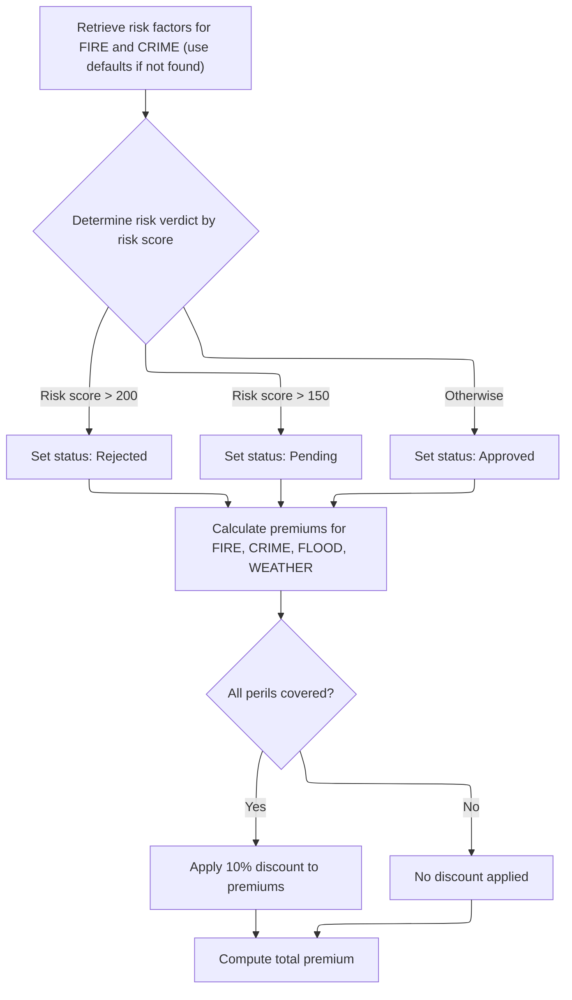
```mermaid
%%{init: {"flowchart": {"defaultRenderer": "elk"}} }%%
flowchart TD
    node1["Retrieve risk factors for FIRE and CRIME (use defaults if not found)"] --> node2{"Determine risk verdict by risk score"}
    click node1 openCode "base/src/LGAPDB03.cbl:48:71"
    node2 -->|"Risk score > 200"| node3["Set status: Rejected"]
    node2 -->|"Risk score > 150"| node4["Set status: Pending"]
    node2 -->|"Otherwise"| node5["Set status: Approved"]
    click node2 openCode "base/src/LGAPDB03.cbl:73:90"
    node3 --> node6["Calculate premiums for FIRE, CRIME, FLOOD, WEATHER"]
    node4 --> node6
    node5 --> node6
    click node3 openCode "base/src/LGAPDB03.cbl:74:79"
    click node4 openCode "base/src/LGAPDB03.cbl:80:85"
    click node5 openCode "base/src/LGAPDB03.cbl:86:89"
    node6 --> node7{"All perils covered?"}
    click node6 openCode "base/src/LGAPDB03.cbl:92:120"
    node7 -->|"Yes"| node8["Apply 10% discount to premiums"]
    node7 -->|"No"| node9["No discount applied"]
    click node7 openCode "base/src/LGAPDB03.cbl:95:100"
    node8 --> node10["Compute total premium"]
    node9 --> node10
    click node8 openCode "base/src/LGAPDB03.cbl:95:100"
    click node9 openCode "base/src/LGAPDB03.cbl:93:94"
    click node10 openCode "base/src/LGAPDB03.cbl:118:120"
classDef HeadingStyle fill:#777777,stroke:#333,stroke-width:2px;

%% Swimm:
%% %%{init: {"flowchart": {"defaultRenderer": "elk"}} }%%
%% flowchart TD
%%     node1["Retrieve risk factors for FIRE and CRIME (use defaults if not found)"] --> node2{"Determine risk verdict by risk score"}
%%     click node1 openCode "<SwmPath>[base/src/LGAPDB03.cbl](base/src/LGAPDB03.cbl)</SwmPath>:48:71"
%%     node2 -->|"Risk score > 200"| node3["Set status: Rejected"]
%%     node2 -->|"Risk score > 150"| node4["Set status: Pending"]
%%     node2 -->|"Otherwise"| node5["Set status: Approved"]
%%     click node2 openCode "<SwmPath>[base/src/LGAPDB03.cbl](base/src/LGAPDB03.cbl)</SwmPath>:73:90"
%%     node3 --> node6["Calculate premiums for FIRE, CRIME, FLOOD, WEATHER"]
%%     node4 --> node6
%%     node5 --> node6
%%     click node3 openCode "<SwmPath>[base/src/LGAPDB03.cbl](base/src/LGAPDB03.cbl)</SwmPath>:74:79"
%%     click node4 openCode "<SwmPath>[base/src/LGAPDB03.cbl](base/src/LGAPDB03.cbl)</SwmPath>:80:85"
%%     click node5 openCode "<SwmPath>[base/src/LGAPDB03.cbl](base/src/LGAPDB03.cbl)</SwmPath>:86:89"
%%     node6 --> node7{"All perils covered?"}
%%     click node6 openCode "<SwmPath>[base/src/LGAPDB03.cbl](base/src/LGAPDB03.cbl)</SwmPath>:92:120"
%%     node7 -->|"Yes"| node8["Apply 10% discount to premiums"]
%%     node7 -->|"No"| node9["No discount applied"]
%%     click node7 openCode "<SwmPath>[base/src/LGAPDB03.cbl](base/src/LGAPDB03.cbl)</SwmPath>:95:100"
%%     node8 --> node10["Compute total premium"]
%%     node9 --> node10
%%     click node8 openCode "<SwmPath>[base/src/LGAPDB03.cbl](base/src/LGAPDB03.cbl)</SwmPath>:95:100"
%%     click node9 openCode "<SwmPath>[base/src/LGAPDB03.cbl](base/src/LGAPDB03.cbl)</SwmPath>:93:94"
%%     click node10 openCode "<SwmPath>[base/src/LGAPDB03.cbl](base/src/LGAPDB03.cbl)</SwmPath>:118:120"
%% classDef HeadingStyle fill:#777777,stroke:#333,stroke-width:2px;
```

This section governs the business logic for calculating insurance premiums and assessing risk for commercial policies. It determines the underwriting verdict based on risk score thresholds, applies discounts for comprehensive coverage, and ensures fallback values for missing risk factors.

| Category       | Rule Name                       | Description                                                                                                                                                                                      |
| -------------- | ------------------------------- | ------------------------------------------------------------------------------------------------------------------------------------------------------------------------------------------------ |
| Business logic | Fire risk default               | If the risk factor for fire is not found, use a default value of <SwmToken path="base/src/LGAPDB03.cbl" pos="58:3:5" line-data="               MOVE 0.80 TO WS-FIRE-FACTOR">`0.80`</SwmToken>.   |
| Business logic | Crime risk default              | If the risk factor for crime is not found, use a default value of <SwmToken path="base/src/LGAPDB03.cbl" pos="70:3:5" line-data="               MOVE 0.60 TO WS-CRIME-FACTOR">`0.60`</SwmToken>. |
| Business logic | High risk rejection             | If the risk score is greater than 200, the policy is rejected and flagged for manual review.                                                                                                     |
| Business logic | Medium risk pending             | If the risk score is greater than 150 but less than or equal to 200, the policy status is set to pending and flagged for further review.                                                         |
| Business logic | Low risk approval               | If the risk score is 150 or less, the policy is approved.                                                                                                                                        |
| Business logic | Peril premium calculation       | Premiums for fire, crime, flood, and weather are calculated by multiplying the risk score, peril factor, peril value, and discount factor for each peril.                                        |
| Business logic | Comprehensive coverage discount | If all four perils (fire, crime, flood, weather) are covered, apply a 10% discount to all premiums.                                                                                              |
| Business logic | Partial coverage no discount    | If not all perils are covered, no discount is applied to premiums.                                                                                                                               |
| Business logic | Total premium calculation       | The total premium is the sum of the premiums for fire, crime, flood, and weather.                                                                                                                |

<SwmSnippet path="/base/src/LGAPDB03.cbl" line="42">

---

<SwmToken path="base/src/LGAPDB03.cbl" pos="42:1:3" line-data="       MAIN-LOGIC.">`MAIN-LOGIC`</SwmToken> in <SwmToken path="base/src/LGAPDB01.cbl" pos="276:4:4" line-data="           CALL &#39;LGAPDB03&#39; USING WS-BASE-RISK-SCR, IN-FIRE-PERIL, ">`LGAPDB03`</SwmToken> runs the full premium calculation: gets risk factors, decides the verdict, and calculates premiums for each peril. This is the core logic for commercial policy pricing.

```cobol
       MAIN-LOGIC.
           PERFORM GET-RISK-FACTORS
           PERFORM CALCULATE-VERDICT
           PERFORM CALCULATE-PREMIUMS
           GOBACK.
```

---

</SwmSnippet>

<SwmSnippet path="/base/src/LGAPDB03.cbl" line="48">

---

<SwmToken path="base/src/LGAPDB03.cbl" pos="48:1:5" line-data="       GET-RISK-FACTORS.">`GET-RISK-FACTORS`</SwmToken> tries to fetch fire and crime risk factors from the DB, but if not found, it falls back to hardcoded defaults so premium calculations don't break.

```cobol
       GET-RISK-FACTORS.
           EXEC SQL
               SELECT FACTOR_VALUE INTO :WS-FIRE-FACTOR
               FROM RISK_FACTORS
               WHERE PERIL_TYPE = 'FIRE'
           END-EXEC.
           
           IF SQLCODE = 0
               CONTINUE
           ELSE
               MOVE 0.80 TO WS-FIRE-FACTOR
           END-IF.
           
           EXEC SQL
               SELECT FACTOR_VALUE INTO :WS-CRIME-FACTOR
               FROM RISK_FACTORS
               WHERE PERIL_TYPE = 'CRIME'
           END-EXEC.
           
           IF SQLCODE = 0
               CONTINUE
           ELSE
               MOVE 0.60 TO WS-CRIME-FACTOR
           END-IF.
```

---

</SwmSnippet>

<SwmSnippet path="/base/src/LGAPDB03.cbl" line="73">

---

<SwmToken path="base/src/LGAPDB03.cbl" pos="73:1:3" line-data="       CALCULATE-VERDICT.">`CALCULATE-VERDICT`</SwmToken> sets the underwriting verdict for a policy by checking <SwmToken path="base/src/LGAPDB03.cbl" pos="74:3:7" line-data="           IF LK-RISK-SCORE &gt; 200">`LK-RISK-SCORE`</SwmToken> against hardcoded thresholds (200 and 150). It assigns status codes and descriptions for 'REJECTED', 'PENDING', or 'APPROVED', and sets a rejection reason if needed. The verdict is used for downstream decision logic and is based on business rules for risk assessment.

```cobol
       CALCULATE-VERDICT.
           IF LK-RISK-SCORE > 200
             MOVE 2 TO LK-STAT
             MOVE 'REJECTED' TO LK-STAT-DESC
             MOVE 'High Risk Score - Manual Review Required' 
               TO LK-REJ-RSN
           ELSE
             IF LK-RISK-SCORE > 150
               MOVE 1 TO LK-STAT
               MOVE 'PENDING' TO LK-STAT-DESC
               MOVE 'Medium Risk - Pending Review'
                 TO LK-REJ-RSN
             ELSE
               MOVE 0 TO LK-STAT
               MOVE 'APPROVED' TO LK-STAT-DESC
               MOVE SPACES TO LK-REJ-RSN
             END-IF
           END-IF.
```

---

</SwmSnippet>

<SwmSnippet path="/base/src/LGAPDB03.cbl" line="92">

---

<SwmToken path="base/src/LGAPDB03.cbl" pos="92:1:3" line-data="       CALCULATE-PREMIUMS.">`CALCULATE-PREMIUMS`</SwmToken> computes individual premiums for fire, crime, flood, and weather by multiplying the risk score, peril factor, peril value, and discount factor. If all perils are covered, it applies a 10% discount. The total premium is just the sum of these four values.

```cobol
       CALCULATE-PREMIUMS.
           MOVE 1.00 TO LK-DISC-FACT
           
           IF LK-FIRE-PERIL > 0 AND
              LK-CRIME-PERIL > 0 AND
              LK-FLOOD-PERIL > 0 AND
              LK-WEATHER-PERIL > 0
             MOVE 0.90 TO LK-DISC-FACT
           END-IF

           COMPUTE LK-FIRE-PREMIUM =
             ((LK-RISK-SCORE * WS-FIRE-FACTOR) * LK-FIRE-PERIL *
               LK-DISC-FACT)
           
           COMPUTE LK-CRIME-PREMIUM =
             ((LK-RISK-SCORE * WS-CRIME-FACTOR) * LK-CRIME-PERIL *
               LK-DISC-FACT)
           
           COMPUTE LK-FLOOD-PREMIUM =
             ((LK-RISK-SCORE * WS-FLOOD-FACTOR) * LK-FLOOD-PERIL *
               LK-DISC-FACT)
           
           COMPUTE LK-WEATHER-PREMIUM =
             ((LK-RISK-SCORE * WS-WEATHER-FACTOR) * LK-WEATHER-PERIL *
               LK-DISC-FACT)

           COMPUTE LK-TOTAL-PREMIUM = 
             LK-FIRE-PREMIUM + LK-CRIME-PREMIUM + 
             LK-FLOOD-PREMIUM + LK-WEATHER-PREMIUM. 
```

---

</SwmSnippet>

### Running Enhanced Actuarial Calculations

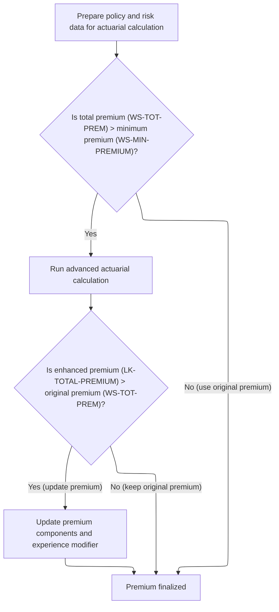
```mermaid
%%{init: {"flowchart": {"defaultRenderer": "elk"}} }%%
flowchart TD
    node1["Prepare policy and risk data for actuarial calculation"]
    click node1 openCode "base/src/LGAPDB01.cbl:283:311"
    node1 --> node2{"Is total premium (WS-TOT-PREM) > minimum premium (WS-MIN-PREMIUM)?"}
    click node2 openCode "base/src/LGAPDB01.cbl:312:313"
    node2 -->|"Yes"| node3["Run advanced actuarial calculation"]
    click node3 openCode "base/src/LGAPDB01.cbl:313:315"
    node2 -->|"No (use original premium)"| node6["Premium finalized"]
    click node6 openCode "base/src/LGAPDB01.cbl:325:325"
    node3 --> node4{"Is enhanced premium (LK-TOTAL-PREMIUM) > original premium (WS-TOT-PREM)?"}
    click node4 openCode "base/src/LGAPDB01.cbl:317:318"
    node4 -->|"Yes (update premium)"| node5["Update premium components and experience modifier"]
    click node5 openCode "base/src/LGAPDB01.cbl:318:324"
    node4 -->|"No (keep original premium)"| node6
    node5 --> node6
classDef HeadingStyle fill:#777777,stroke:#333,stroke-width:2px;

%% Swimm:
%% %%{init: {"flowchart": {"defaultRenderer": "elk"}} }%%
%% flowchart TD
%%     node1["Prepare policy and risk data for actuarial calculation"]
%%     click node1 openCode "<SwmPath>[base/src/LGAPDB01.cbl](base/src/LGAPDB01.cbl)</SwmPath>:283:311"
%%     node1 --> node2{"Is total premium (<SwmToken path="base/src/LGAPDB01.cbl" pos="281:1:5" line-data="                                WS-TOT-PREM, WS-DISC-FACT.">`WS-TOT-PREM`</SwmToken>) > minimum premium (<SwmToken path="base/src/LGAPDB01.cbl" pos="312:11:15" line-data="           IF WS-TOT-PREM &gt; WS-MIN-PREMIUM">`WS-MIN-PREMIUM`</SwmToken>)?"}
%%     click node2 openCode "<SwmPath>[base/src/LGAPDB01.cbl](base/src/LGAPDB01.cbl)</SwmPath>:312:313"
%%     node2 -->|"Yes"| node3["Run advanced actuarial calculation"]
%%     click node3 openCode "<SwmPath>[base/src/LGAPDB01.cbl](base/src/LGAPDB01.cbl)</SwmPath>:313:315"
%%     node2 -->|"No (use original premium)"| node6["Premium finalized"]
%%     click node6 openCode "<SwmPath>[base/src/LGAPDB01.cbl](base/src/LGAPDB01.cbl)</SwmPath>:325:325"
%%     node3 --> node4{"Is enhanced premium (<SwmToken path="base/src/LGAPDB01.cbl" pos="317:3:7" line-data="               IF LK-TOTAL-PREMIUM &gt; WS-TOT-PREM">`LK-TOTAL-PREMIUM`</SwmToken>) > original premium (<SwmToken path="base/src/LGAPDB01.cbl" pos="281:1:5" line-data="                                WS-TOT-PREM, WS-DISC-FACT.">`WS-TOT-PREM`</SwmToken>)?"}
%%     click node4 openCode "<SwmPath>[base/src/LGAPDB01.cbl](base/src/LGAPDB01.cbl)</SwmPath>:317:318"
%%     node4 -->|"Yes (update premium)"| node5["Update premium components and experience modifier"]
%%     click node5 openCode "<SwmPath>[base/src/LGAPDB01.cbl](base/src/LGAPDB01.cbl)</SwmPath>:318:324"
%%     node4 -->|"No (keep original premium)"| node6
%%     node5 --> node6
%% classDef HeadingStyle fill:#777777,stroke:#333,stroke-width:2px;
```

This section governs the process for running enhanced actuarial calculations on insurance policy premiums. It determines when advanced actuarial modeling is applied, under what conditions the premium is updated, and how the finalized premium is selected for a policy.

| Category       | Rule Name                  | Description                                                                                                                                                                                                                                      |
| -------------- | -------------------------- | ------------------------------------------------------------------------------------------------------------------------------------------------------------------------------------------------------------------------------------------------ |
| Business logic | Minimum premium threshold  | If the total calculated premium for a policy is less than or equal to the configured minimum premium (default $500.00), the advanced actuarial calculation is not performed and the original premium is used.                                    |
| Business logic | Enhanced premium adoption  | If the advanced actuarial calculation produces a total premium greater than the original premium, the enhanced premium and its components (fire, crime, flood, weather) and experience modifier are used as the finalized values for the policy. |
| Business logic | Original premium retention | If the advanced actuarial calculation produces a total premium less than or equal to the original premium, the original premium and its components are retained as the finalized values for the policy.                                          |

<SwmSnippet path="/base/src/LGAPDB01.cbl" line="283">

---

<SwmToken path="base/src/LGAPDB01.cbl" pos="283:1:7" line-data="       P011C-ENHANCED-ACTUARIAL-CALC.">`P011C-ENHANCED-ACTUARIAL-CALC`</SwmToken> sets up all the input and coverage fields needed for advanced premium calculations. If the basic premium is above the minimum, it calls <SwmToken path="base/src/LGAPDB01.cbl" pos="313:4:4" line-data="               CALL &#39;LGAPDB04&#39; USING LK-INPUT-DATA, LK-COVERAGE-DATA, ">`LGAPDB04`</SwmToken> to run the full actuarial model. If <SwmToken path="base/src/LGAPDB01.cbl" pos="313:4:4" line-data="               CALL &#39;LGAPDB04&#39; USING LK-INPUT-DATA, LK-COVERAGE-DATA, ">`LGAPDB04`</SwmToken> returns a better premium, it updates the results with those values.

```cobol
       P011C-ENHANCED-ACTUARIAL-CALC.
      *    Prepare input structure for actuarial calculation
           MOVE IN-CUSTOMER-NUM TO LK-CUSTOMER-NUM
           MOVE WS-BASE-RISK-SCR TO LK-RISK-SCORE
           MOVE IN-PROPERTY-TYPE TO LK-PROPERTY-TYPE
           MOVE IN-TERRITORY-CODE TO LK-TERRITORY
           MOVE IN-CONSTRUCTION-TYPE TO LK-CONSTRUCTION-TYPE
           MOVE IN-OCCUPANCY-CODE TO LK-OCCUPANCY-CODE
           MOVE IN-SPRINKLER-IND TO LK-PROTECTION-CLASS
           MOVE IN-YEAR-BUILT TO LK-YEAR-BUILT
           MOVE IN-SQUARE-FOOTAGE TO LK-SQUARE-FOOTAGE
           MOVE IN-YEARS-IN-BUSINESS TO LK-YEARS-IN-BUSINESS
           MOVE IN-CLAIMS-COUNT-3YR TO LK-CLAIMS-COUNT-5YR
           MOVE IN-CLAIMS-AMOUNT-3YR TO LK-CLAIMS-AMOUNT-5YR
           
      *    Set coverage data
           MOVE IN-BUILDING-LIMIT TO LK-BUILDING-LIMIT
           MOVE IN-CONTENTS-LIMIT TO LK-CONTENTS-LIMIT
           MOVE IN-BI-LIMIT TO LK-BI-LIMIT
           MOVE IN-FIRE-DEDUCTIBLE TO LK-FIRE-DEDUCTIBLE
           MOVE IN-WIND-DEDUCTIBLE TO LK-WIND-DEDUCTIBLE
           MOVE IN-FLOOD-DEDUCTIBLE TO LK-FLOOD-DEDUCTIBLE
           MOVE IN-OTHER-DEDUCTIBLE TO LK-OTHER-DEDUCTIBLE
           MOVE IN-FIRE-PERIL TO LK-FIRE-PERIL
           MOVE IN-CRIME-PERIL TO LK-CRIME-PERIL
           MOVE IN-FLOOD-PERIL TO LK-FLOOD-PERIL
           MOVE IN-WEATHER-PERIL TO LK-WEATHER-PERIL
           
      *    Call advanced actuarial calculation program (only for approved cases)
           IF WS-TOT-PREM > WS-MIN-PREMIUM
               CALL 'LGAPDB04' USING LK-INPUT-DATA, LK-COVERAGE-DATA, 
                                    LK-OUTPUT-RESULTS
               
      *        Update with enhanced calculations if successful
               IF LK-TOTAL-PREMIUM > WS-TOT-PREM
                   MOVE LK-FIRE-PREMIUM TO WS-FR-PREM
                   MOVE LK-CRIME-PREMIUM TO WS-CR-PREM
                   MOVE LK-FLOOD-PREMIUM TO WS-FL-PREM
                   MOVE LK-WEATHER-PREMIUM TO WS-WE-PREM
                   MOVE LK-TOTAL-PREMIUM TO WS-TOT-PREM
                   MOVE LK-EXPERIENCE-MOD TO WS-EXPERIENCE-MOD
               END-IF
           END-IF.
```

---

</SwmSnippet>

### Calculating Full Premium Breakdown


```mermaid
%%{init: {"flowchart": {"defaultRenderer": "elk"}} }%%
flowchart TD
    node1["Initialize calculation context"]
    click node1 openCode "base/src/LGAPDB04.cbl:139:139"
    node1 --> node2["Retrieve base rates"]
    click node2 openCode "base/src/LGAPDB04.cbl:140:140"
    node2 --> node3["Assess exposure values"]
    click node3 openCode "base/src/LGAPDB04.cbl:141:141"
    node3 --> node4{"Is business established and claims-free?"}
    click node4 openCode "base/src/LGAPDB04.cbl:235:256"
    node4 -->|"Yes"| node5["Apply favorable experience modifier"]
    click node5 openCode "base/src/LGAPDB04.cbl:239:240"
    node4 -->|"No"| node6["Apply standard or adjusted experience modifier"]
    click node6 openCode "base/src/LGAPDB04.cbl:241:255"
    node5 --> node7["Calculate schedule modifier (building, protection, occupancy, exposure)"]
    click node7 openCode "base/src/LGAPDB04.cbl:261:316"
    node6 --> node7
    node7 --> node8["Calculate base premium for covered perils"]
    click node8 openCode "base/src/LGAPDB04.cbl:319:367"
    node8 --> node9["Add catastrophe load"]
    click node9 openCode "base/src/LGAPDB04.cbl:145:145"
    node9 --> node10["Add expense and profit loads"]
    click node10 openCode "base/src/LGAPDB04.cbl:146:146"
    node10 --> node11{"Eligible for discounts?"}
    click node11 openCode "base/src/LGAPDB04.cbl:411:441"
    node11 -->|"Yes"| node12["Apply multi-peril, claims-free, deductible discounts (capped at 25%)"]
    click node12 openCode "base/src/LGAPDB04.cbl:416:449"
    node11 -->|"No"| node13["No discounts applied"]
    click node13 openCode "base/src/LGAPDB04.cbl:450:450"
    node12 --> node14["Calculate taxes"]
    click node14 openCode "base/src/LGAPDB04.cbl:148:148"
    node13 --> node14
    node14 --> node15{"Is final rate factor > 0.05?"}
    click node15 openCode "base/src/LGAPDB04.cbl:473:477"
    node15 -->|"Yes"| node16["Cap rate factor and recalculate premium"]
    click node16 openCode "base/src/LGAPDB04.cbl:474:476"
    node15 -->|"No"| node17["Finalize premium"]
    click node17 openCode "base/src/LGAPDB04.cbl:465:472"
    node16 --> node17
classDef HeadingStyle fill:#777777,stroke:#333,stroke-width:2px;

%% Swimm:
%% %%{init: {"flowchart": {"defaultRenderer": "elk"}} }%%
%% flowchart TD
%%     node1["Initialize calculation context"]
%%     click node1 openCode "<SwmPath>[base/src/LGAPDB04.cbl](base/src/LGAPDB04.cbl)</SwmPath>:139:139"
%%     node1 --> node2["Retrieve base rates"]
%%     click node2 openCode "<SwmPath>[base/src/LGAPDB04.cbl](base/src/LGAPDB04.cbl)</SwmPath>:140:140"
%%     node2 --> node3["Assess exposure values"]
%%     click node3 openCode "<SwmPath>[base/src/LGAPDB04.cbl](base/src/LGAPDB04.cbl)</SwmPath>:141:141"
%%     node3 --> node4{"Is business established and claims-free?"}
%%     click node4 openCode "<SwmPath>[base/src/LGAPDB04.cbl](base/src/LGAPDB04.cbl)</SwmPath>:235:256"
%%     node4 -->|"Yes"| node5["Apply favorable experience modifier"]
%%     click node5 openCode "<SwmPath>[base/src/LGAPDB04.cbl](base/src/LGAPDB04.cbl)</SwmPath>:239:240"
%%     node4 -->|"No"| node6["Apply standard or adjusted experience modifier"]
%%     click node6 openCode "<SwmPath>[base/src/LGAPDB04.cbl](base/src/LGAPDB04.cbl)</SwmPath>:241:255"
%%     node5 --> node7["Calculate schedule modifier (building, protection, occupancy, exposure)"]
%%     click node7 openCode "<SwmPath>[base/src/LGAPDB04.cbl](base/src/LGAPDB04.cbl)</SwmPath>:261:316"
%%     node6 --> node7
%%     node7 --> node8["Calculate base premium for covered perils"]
%%     click node8 openCode "<SwmPath>[base/src/LGAPDB04.cbl](base/src/LGAPDB04.cbl)</SwmPath>:319:367"
%%     node8 --> node9["Add catastrophe load"]
%%     click node9 openCode "<SwmPath>[base/src/LGAPDB04.cbl](base/src/LGAPDB04.cbl)</SwmPath>:145:145"
%%     node9 --> node10["Add expense and profit loads"]
%%     click node10 openCode "<SwmPath>[base/src/LGAPDB04.cbl](base/src/LGAPDB04.cbl)</SwmPath>:146:146"
%%     node10 --> node11{"Eligible for discounts?"}
%%     click node11 openCode "<SwmPath>[base/src/LGAPDB04.cbl](base/src/LGAPDB04.cbl)</SwmPath>:411:441"
%%     node11 -->|"Yes"| node12["Apply multi-peril, claims-free, deductible discounts (capped at 25%)"]
%%     click node12 openCode "<SwmPath>[base/src/LGAPDB04.cbl](base/src/LGAPDB04.cbl)</SwmPath>:416:449"
%%     node11 -->|"No"| node13["No discounts applied"]
%%     click node13 openCode "<SwmPath>[base/src/LGAPDB04.cbl](base/src/LGAPDB04.cbl)</SwmPath>:450:450"
%%     node12 --> node14["Calculate taxes"]
%%     click node14 openCode "<SwmPath>[base/src/LGAPDB04.cbl](base/src/LGAPDB04.cbl)</SwmPath>:148:148"
%%     node13 --> node14
%%     node14 --> node15{"Is final rate factor > 0.05?"}
%%     click node15 openCode "<SwmPath>[base/src/LGAPDB04.cbl](base/src/LGAPDB04.cbl)</SwmPath>:473:477"
%%     node15 -->|"Yes"| node16["Cap rate factor and recalculate premium"]
%%     click node16 openCode "<SwmPath>[base/src/LGAPDB04.cbl](base/src/LGAPDB04.cbl)</SwmPath>:474:476"
%%     node15 -->|"No"| node17["Finalize premium"]
%%     click node17 openCode "<SwmPath>[base/src/LGAPDB04.cbl](base/src/LGAPDB04.cbl)</SwmPath>:465:472"
%%     node16 --> node17
%% classDef HeadingStyle fill:#777777,stroke:#333,stroke-width:2px;
```

This section governs the calculation of the full insurance premium for a policy, ensuring that all relevant risk factors, discounts, and regulatory caps are applied to produce a fair and accurate premium for the insured.

| Category        | Rule Name                     | Description                                                                                                                                                                                                                                                                                                                                                                                                                                                                              |
| --------------- | ----------------------------- | ---------------------------------------------------------------------------------------------------------------------------------------------------------------------------------------------------------------------------------------------------------------------------------------------------------------------------------------------------------------------------------------------------------------------------------------------------------------------------------------- |
| Data validation | Rate factor cap               | If the final rate factor exceeds 0.05, it is capped at 0.05 and the premium is recalculated to match the cap.                                                                                                                                                                                                                                                                                                                                                                            |
| Data validation | Discount eligibility          | Only policies eligible for discounts (multi-peril coverage, claims-free history, qualifying deductibles) receive the corresponding credits; otherwise, no discounts are applied.                                                                                                                                                                                                                                                                                                         |
| Business logic  | Favorable experience modifier | Businesses with at least 5 years of operation and no claims in the past 5 years receive a favorable experience modifier of 0.85 applied to their premium calculation.                                                                                                                                                                                                                                                                                                                    |
| Business logic  | Claims penalty modifier       | Businesses with claims in the past 5 years have their experience modifier calculated based on claims amount, total insured value, and a credibility factor, with the result clamped between 0.5 and 2.0.                                                                                                                                                                                                                                                                                 |
| Business logic  | New business modifier         | Businesses with less than 5 years of operation receive a standard experience modifier of 1.10.                                                                                                                                                                                                                                                                                                                                                                                           |
| Business logic  | Schedule modifier adjustment  | The schedule modifier is adjusted based on building age, protection class, occupancy code, and exposure density, with the final value clamped between -0.2 and +0.4.                                                                                                                                                                                                                                                                                                                     |
| Business logic  | Peril-specific base premium   | Base premium for each peril is calculated only if the peril is active, using exposure values, peril-specific constants (e.g., <SwmToken path="base/src/LGAPDB04.cbl" pos="352:9:11" line-data="                   WS-TREND-FACTOR * 1.25">`1.25`</SwmToken> for flood, <SwmToken path="base/src/LGAPDB03.cbl" pos="58:3:5" line-data="               MOVE 0.80 TO WS-FIRE-FACTOR">`0.80`</SwmToken> for crime), experience and schedule modifiers, and summed for the total base amount. |
| Business logic  | Discount cap                  | <SwmToken path="base/src/LGAPDB04.cbl" pos="410:3:5" line-data="      * Multi-peril discount">`Multi-peril`</SwmToken>, claims-free, and deductible discounts are stacked, but the total discount is capped at 25% of the premium before tax.                                                                                                                                                                                                                                            |

<SwmSnippet path="/base/src/LGAPDB04.cbl" line="138">

---

<SwmToken path="base/src/LGAPDB04.cbl" pos="138:1:3" line-data="       P100-MAIN.">`P100-MAIN`</SwmToken> runs the full premium calculation workflow: it initializes, loads rates, calculates exposures, applies experience and schedule mods, computes base premium, adds catastrophe and expense loadings, applies discounts and taxes, and finalizes the premium. Each step is a PERFORM of a dedicated subroutine.

```cobol
       P100-MAIN.
           PERFORM P200-INIT
           PERFORM P300-RATES
           PERFORM P350-EXPOSURE
           PERFORM P400-EXP-MOD
           PERFORM P500-SCHED-MOD
           PERFORM P600-BASE-PREM
           PERFORM P700-CAT-LOAD
           PERFORM P800-EXPENSE
           PERFORM P900-DISC
           PERFORM P950-TAXES
           PERFORM P999-FINAL
           GOBACK.
```

---

</SwmSnippet>

<SwmSnippet path="/base/src/LGAPDB04.cbl" line="234">

---

<SwmToken path="base/src/LGAPDB04.cbl" pos="234:1:5" line-data="       P400-EXP-MOD.">`P400-EXP-MOD`</SwmToken> calculates the experience modifier for premium rating. It rewards businesses with 5+ years and no claims, penalizes those with claims, and clamps the modifier between 0.5 and 2.0. The result is used in further premium calculations.

```cobol
       P400-EXP-MOD.
           MOVE 1.0000 TO WS-EXPERIENCE-MOD
           
           IF LK-YEARS-IN-BUSINESS >= 5
               IF LK-CLAIMS-COUNT-5YR = ZERO
                   MOVE 0.8500 TO WS-EXPERIENCE-MOD
               ELSE
                   COMPUTE WS-EXPERIENCE-MOD = 
                       1.0000 + 
                       ((LK-CLAIMS-AMOUNT-5YR / WS-TOTAL-INSURED-VAL) * 
                        WS-CREDIBILITY-FACTOR * 0.50)
                   
                   IF WS-EXPERIENCE-MOD > 2.0000
                       MOVE 2.0000 TO WS-EXPERIENCE-MOD
                   END-IF
                   
                   IF WS-EXPERIENCE-MOD < 0.5000
                       MOVE 0.5000 TO WS-EXPERIENCE-MOD
                   END-IF
               END-IF
           ELSE
               MOVE 1.1000 TO WS-EXPERIENCE-MOD
           END-IF
           
           MOVE WS-EXPERIENCE-MOD TO LK-EXPERIENCE-MOD.
```

---

</SwmSnippet>

<SwmSnippet path="/base/src/LGAPDB04.cbl" line="260">

---

<SwmToken path="base/src/LGAPDB04.cbl" pos="260:1:5" line-data="       P500-SCHED-MOD.">`P500-SCHED-MOD`</SwmToken> tweaks the schedule modifier based on building age, protection class, occupancy code, and exposure density. Each factor nudges the mod up or down, and the final value is clamped to stay within \[-0.2, +0.4\]. This mod feeds into the premium calculation.

```cobol
       P500-SCHED-MOD.
           MOVE +0.000 TO WS-SCHEDULE-MOD
           
      *    Building age factor
           EVALUATE TRUE
               WHEN LK-YEAR-BUILT >= 2010
                   SUBTRACT 0.050 FROM WS-SCHEDULE-MOD
               WHEN LK-YEAR-BUILT >= 1990
                   CONTINUE
               WHEN LK-YEAR-BUILT >= 1970
                   ADD 0.100 TO WS-SCHEDULE-MOD
               WHEN OTHER
                   ADD 0.200 TO WS-SCHEDULE-MOD
           END-EVALUATE
           
      *    Protection class factor
           EVALUATE LK-PROTECTION-CLASS
               WHEN '01' THRU '03'
                   SUBTRACT 0.100 FROM WS-SCHEDULE-MOD
               WHEN '04' THRU '06'
                   SUBTRACT 0.050 FROM WS-SCHEDULE-MOD
               WHEN '07' THRU '09'
                   CONTINUE
               WHEN OTHER
                   ADD 0.150 TO WS-SCHEDULE-MOD
           END-EVALUATE
           
      *    Occupancy hazard factor
           EVALUATE LK-OCCUPANCY-CODE
               WHEN 'OFF01' THRU 'OFF05'
                   SUBTRACT 0.025 FROM WS-SCHEDULE-MOD
               WHEN 'MFG01' THRU 'MFG10'
                   ADD 0.075 TO WS-SCHEDULE-MOD
               WHEN 'WHS01' THRU 'WHS05'
                   ADD 0.125 TO WS-SCHEDULE-MOD
               WHEN OTHER
                   CONTINUE
           END-EVALUATE
           
      *    Exposure density factor
           IF WS-EXPOSURE-DENSITY > 500.00
               ADD 0.100 TO WS-SCHEDULE-MOD
           ELSE
               IF WS-EXPOSURE-DENSITY < 50.00
                   SUBTRACT 0.050 FROM WS-SCHEDULE-MOD
               END-IF
           END-IF
           
           IF WS-SCHEDULE-MOD > +0.400
               MOVE +0.400 TO WS-SCHEDULE-MOD
           END-IF
           
           IF WS-SCHEDULE-MOD < -0.200
               MOVE -0.200 TO WS-SCHEDULE-MOD
           END-IF
           
           MOVE WS-SCHEDULE-MOD TO LK-SCHEDULE-MOD.
```

---

</SwmSnippet>

<SwmSnippet path="/base/src/LGAPDB04.cbl" line="318">

---

<SwmToken path="base/src/LGAPDB04.cbl" pos="318:1:5" line-data="       P600-BASE-PREM.">`P600-BASE-PREM`</SwmToken> calculates the base premium for each peril by looking up rates in a 4D table, applying experience and schedule mods, and multiplying by peril-specific constants (like <SwmToken path="base/src/LGAPDB04.cbl" pos="352:9:11" line-data="                   WS-TREND-FACTOR * 1.25">`1.25`</SwmToken> for flood, <SwmToken path="base/src/LGAPDB04.cbl" pos="336:10:12" line-data="                   (WS-CONTENTS-EXPOSURE * 0.80) *">`0.80`</SwmToken> for crime). Only active perils get a premium, and everything is summed for the base amount.

```cobol
       P600-BASE-PREM.
           MOVE ZERO TO LK-BASE-AMOUNT
           
      * FIRE PREMIUM
           IF LK-FIRE-PERIL > ZERO
               COMPUTE LK-FIRE-PREMIUM = 
                   (WS-BUILDING-EXPOSURE + WS-CONTENTS-EXPOSURE) *
                   WS-BASE-RATE (1, 1, 1, 1) * 
                   WS-EXPERIENCE-MOD *
                   (1 + WS-SCHEDULE-MOD) *
                   WS-TREND-FACTOR
                   
               ADD LK-FIRE-PREMIUM TO LK-BASE-AMOUNT
           END-IF
           
      * CRIME PREMIUM
           IF LK-CRIME-PERIL > ZERO
               COMPUTE LK-CRIME-PREMIUM = 
                   (WS-CONTENTS-EXPOSURE * 0.80) *
                   WS-BASE-RATE (2, 1, 1, 1) * 
                   WS-EXPERIENCE-MOD *
                   (1 + WS-SCHEDULE-MOD) *
                   WS-TREND-FACTOR
                   
               ADD LK-CRIME-PREMIUM TO LK-BASE-AMOUNT
           END-IF
           
      * FLOOD PREMIUM
           IF LK-FLOOD-PERIL > ZERO
               COMPUTE LK-FLOOD-PREMIUM = 
                   WS-BUILDING-EXPOSURE *
                   WS-BASE-RATE (3, 1, 1, 1) * 
                   WS-EXPERIENCE-MOD *
                   (1 + WS-SCHEDULE-MOD) *
                   WS-TREND-FACTOR * 1.25
                   
               ADD LK-FLOOD-PREMIUM TO LK-BASE-AMOUNT
           END-IF
           
      * WEATHER PREMIUM
           IF LK-WEATHER-PERIL > ZERO
               COMPUTE LK-WEATHER-PREMIUM = 
                   (WS-BUILDING-EXPOSURE + WS-CONTENTS-EXPOSURE) *
                   WS-BASE-RATE (4, 1, 1, 1) * 
                   WS-EXPERIENCE-MOD *
                   (1 + WS-SCHEDULE-MOD) *
                   WS-TREND-FACTOR
                   
               ADD LK-WEATHER-PREMIUM TO LK-BASE-AMOUNT
           END-IF.
```

---

</SwmSnippet>

<SwmSnippet path="/base/src/LGAPDB04.cbl" line="407">

---

<SwmToken path="base/src/LGAPDB04.cbl" pos="407:1:3" line-data="       P900-DISC.">`P900-DISC`</SwmToken> calculates the total discount by stacking multi-peril, claims-free, and deductible credits, then caps the sum at 25%. The final discount amount is applied to the premium components before tax.

```cobol
       P900-DISC.
           MOVE ZERO TO WS-TOTAL-DISCOUNT
           
      * Multi-peril discount
           MOVE ZERO TO WS-MULTI-PERIL-DISC
           IF LK-FIRE-PERIL > ZERO AND
              LK-CRIME-PERIL > ZERO AND
              LK-FLOOD-PERIL > ZERO AND
              LK-WEATHER-PERIL > ZERO
               MOVE 0.100 TO WS-MULTI-PERIL-DISC
           ELSE
               IF LK-FIRE-PERIL > ZERO AND
                  LK-WEATHER-PERIL > ZERO AND
                  (LK-CRIME-PERIL > ZERO OR LK-FLOOD-PERIL > ZERO)
                   MOVE 0.050 TO WS-MULTI-PERIL-DISC
               END-IF
           END-IF
           
      * Claims-free discount  
           MOVE ZERO TO WS-CLAIMS-FREE-DISC
           IF LK-CLAIMS-COUNT-5YR = ZERO AND LK-YEARS-IN-BUSINESS >= 5
               MOVE 0.075 TO WS-CLAIMS-FREE-DISC
           END-IF
           
      * Deductible credit
           MOVE ZERO TO WS-DEDUCTIBLE-CREDIT
           IF LK-FIRE-DEDUCTIBLE >= 10000
               ADD 0.025 TO WS-DEDUCTIBLE-CREDIT
           END-IF
           IF LK-WIND-DEDUCTIBLE >= 25000  
               ADD 0.035 TO WS-DEDUCTIBLE-CREDIT
           END-IF
           IF LK-FLOOD-DEDUCTIBLE >= 50000
               ADD 0.045 TO WS-DEDUCTIBLE-CREDIT
           END-IF
           
           COMPUTE WS-TOTAL-DISCOUNT = 
               WS-MULTI-PERIL-DISC + WS-CLAIMS-FREE-DISC + 
               WS-DEDUCTIBLE-CREDIT
               
           IF WS-TOTAL-DISCOUNT > 0.250
               MOVE 0.250 TO WS-TOTAL-DISCOUNT
           END-IF
           
           COMPUTE LK-DISCOUNT-AMT = 
               (LK-BASE-AMOUNT + LK-CAT-LOAD-AMT + 
                LK-EXPENSE-LOAD-AMT + LK-PROFIT-LOAD-AMT) *
               WS-TOTAL-DISCOUNT.
```

---

</SwmSnippet>

<SwmSnippet path="/base/src/LGAPDB04.cbl" line="464">

---

<SwmToken path="base/src/LGAPDB04.cbl" pos="464:1:3" line-data="       P999-FINAL.">`P999-FINAL`</SwmToken> sums up all premium components, subtracts discounts, adds taxes, and calculates the final rate factor. If the rate factor is above 0.05, it gets capped and the premium is recalculated to match the cap.

```cobol
       P999-FINAL.
           COMPUTE LK-TOTAL-PREMIUM = 
               LK-BASE-AMOUNT + LK-CAT-LOAD-AMT + 
               LK-EXPENSE-LOAD-AMT + LK-PROFIT-LOAD-AMT -
               LK-DISCOUNT-AMT + LK-TAX-AMT
               
           COMPUTE LK-FINAL-RATE-FACTOR = 
               LK-TOTAL-PREMIUM / WS-TOTAL-INSURED-VAL
               
           IF LK-FINAL-RATE-FACTOR > 0.050000
               MOVE 0.050000 TO LK-FINAL-RATE-FACTOR
               COMPUTE LK-TOTAL-PREMIUM = 
                   WS-TOTAL-INSURED-VAL * LK-FINAL-RATE-FACTOR
           END-IF.
```

---

</SwmSnippet>

### Finalizing Commercial Policy Processing

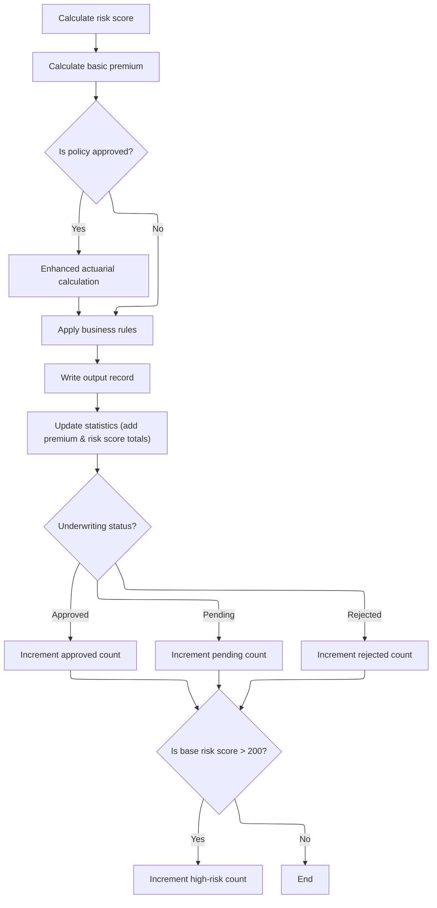
```mermaid
%%{init: {"flowchart": {"defaultRenderer": "elk"}} }%%
flowchart TD
    node1["Calculate risk score"]
    click node1 openCode "base/src/LGAPDB01.cbl:259:259"
    node1 --> node2["Calculate basic premium"]
    click node2 openCode "base/src/LGAPDB01.cbl:260:260"
    node2 --> node3{"Is policy approved?"}
    click node3 openCode "base/src/LGAPDB01.cbl:261:263"
    node3 -->|"Yes"| node4["Enhanced actuarial calculation"]
    click node4 openCode "base/src/LGAPDB01.cbl:262:262"
    node3 -->|"No"| node5["Apply business rules"]
    click node5 openCode "base/src/LGAPDB01.cbl:264:264"
    node4 --> node5
    node5 --> node6["Write output record"]
    click node6 openCode "base/src/LGAPDB01.cbl:265:265"
    node6 --> node7["Update statistics (add premium & risk score totals)"]
    click node7 openCode "base/src/LGAPDB01.cbl:366:368"
    node7 --> node8{"Underwriting status?"}
    click node8 openCode "base/src/LGAPDB01.cbl:369:373"
    node8 -->|"Approved"| node9["Increment approved count"]
    click node9 openCode "base/src/LGAPDB01.cbl:370:370"
    node8 -->|"Pending"| node10["Increment pending count"]
    click node10 openCode "base/src/LGAPDB01.cbl:371:371"
    node8 -->|"Rejected"| node11["Increment rejected count"]
    click node11 openCode "base/src/LGAPDB01.cbl:372:372"
    node9 --> node12{"Is base risk score > 200?"}
    click node12 openCode "base/src/LGAPDB01.cbl:375:375"
    node10 --> node12
    node11 --> node12
    node12 -->|"Yes"| node13["Increment high-risk count"]
    click node13 openCode "base/src/LGAPDB01.cbl:376:376"
    node12 -->|"No"| node14["End"]
    click node14 openCode "base/src/LGAPDB01.cbl:377:377"

classDef HeadingStyle fill:#777777,stroke:#333,stroke-width:2px;

%% Swimm:
%% %%{init: {"flowchart": {"defaultRenderer": "elk"}} }%%
%% flowchart TD
%%     node1["Calculate risk score"]
%%     click node1 openCode "<SwmPath>[base/src/LGAPDB01.cbl](base/src/LGAPDB01.cbl)</SwmPath>:259:259"
%%     node1 --> node2["Calculate basic premium"]
%%     click node2 openCode "<SwmPath>[base/src/LGAPDB01.cbl](base/src/LGAPDB01.cbl)</SwmPath>:260:260"
%%     node2 --> node3{"Is policy approved?"}
%%     click node3 openCode "<SwmPath>[base/src/LGAPDB01.cbl](base/src/LGAPDB01.cbl)</SwmPath>:261:263"
%%     node3 -->|"Yes"| node4["Enhanced actuarial calculation"]
%%     click node4 openCode "<SwmPath>[base/src/LGAPDB01.cbl](base/src/LGAPDB01.cbl)</SwmPath>:262:262"
%%     node3 -->|"No"| node5["Apply business rules"]
%%     click node5 openCode "<SwmPath>[base/src/LGAPDB01.cbl](base/src/LGAPDB01.cbl)</SwmPath>:264:264"
%%     node4 --> node5
%%     node5 --> node6["Write output record"]
%%     click node6 openCode "<SwmPath>[base/src/LGAPDB01.cbl](base/src/LGAPDB01.cbl)</SwmPath>:265:265"
%%     node6 --> node7["Update statistics (add premium & risk score totals)"]
%%     click node7 openCode "<SwmPath>[base/src/LGAPDB01.cbl](base/src/LGAPDB01.cbl)</SwmPath>:366:368"
%%     node7 --> node8{"Underwriting status?"}
%%     click node8 openCode "<SwmPath>[base/src/LGAPDB01.cbl](base/src/LGAPDB01.cbl)</SwmPath>:369:373"
%%     node8 -->|"Approved"| node9["Increment approved count"]
%%     click node9 openCode "<SwmPath>[base/src/LGAPDB01.cbl](base/src/LGAPDB01.cbl)</SwmPath>:370:370"
%%     node8 -->|"Pending"| node10["Increment pending count"]
%%     click node10 openCode "<SwmPath>[base/src/LGAPDB01.cbl](base/src/LGAPDB01.cbl)</SwmPath>:371:371"
%%     node8 -->|"Rejected"| node11["Increment rejected count"]
%%     click node11 openCode "<SwmPath>[base/src/LGAPDB01.cbl](base/src/LGAPDB01.cbl)</SwmPath>:372:372"
%%     node9 --> node12{"Is base risk score > 200?"}
%%     click node12 openCode "<SwmPath>[base/src/LGAPDB01.cbl](base/src/LGAPDB01.cbl)</SwmPath>:375:375"
%%     node10 --> node12
%%     node11 --> node12
%%     node12 -->|"Yes"| node13["Increment high-risk count"]
%%     click node13 openCode "<SwmPath>[base/src/LGAPDB01.cbl](base/src/LGAPDB01.cbl)</SwmPath>:376:376"
%%     node12 -->|"No"| node14["End"]
%%     click node14 openCode "<SwmPath>[base/src/LGAPDB01.cbl](base/src/LGAPDB01.cbl)</SwmPath>:377:377"
%% 
%% classDef HeadingStyle fill:#777777,stroke:#333,stroke-width:2px;
```

<SwmSnippet path="/base/src/LGAPDB01.cbl" line="258">

---

Back in <SwmToken path="base/src/LGAPDB01.cbl" pos="258:1:5" line-data="       P011-PROCESS-COMMERCIAL.">`P011-PROCESS-COMMERCIAL`</SwmToken>, we just returned from <SwmPath>[base/src/LGAPDB01.cbl](base/src/LGAPDB01.cbl)</SwmPath> where the enhanced actuarial calculation ran. Now we apply business rules, write the output record, and update statistics. This wraps up the commercial policy workflow.

```cobol
       P011-PROCESS-COMMERCIAL.
           PERFORM P011A-CALCULATE-RISK-SCORE
           PERFORM P011B-BASIC-PREMIUM-CALC
           IF WS-STAT = 0
               PERFORM P011C-ENHANCED-ACTUARIAL-CALC
           END-IF
           PERFORM P011D-APPLY-BUSINESS-RULES
           PERFORM P011E-WRITE-OUTPUT-RECORD
           PERFORM P011F-UPDATE-STATISTICS.
```

---

</SwmSnippet>

<SwmSnippet path="/base/src/LGAPDB01.cbl" line="365">

---

<SwmToken path="base/src/LGAPDB01.cbl" pos="365:1:5" line-data="       P011F-UPDATE-STATISTICS.">`P011F-UPDATE-STATISTICS`</SwmToken> updates all the counters for approved, pending, rejected, and high-risk policies, and totals up premiums and risk scores. The 200 threshold is used to flag high-risk cases.

```cobol
       P011F-UPDATE-STATISTICS.
           ADD WS-TOT-PREM TO WS-TOTAL-PREMIUM-AMT
           ADD WS-BASE-RISK-SCR TO WS-CONTROL-TOTALS
           
           EVALUATE WS-STAT
               WHEN 0 ADD 1 TO WS-APPROVED-CNT
               WHEN 1 ADD 1 TO WS-PENDING-CNT
               WHEN 2 ADD 1 TO WS-REJECTED-CNT
           END-EVALUATE
           
           IF WS-BASE-RISK-SCR > 200
               ADD 1 TO WS-HIGH-RISK-CNT
           END-IF.
```

---

</SwmSnippet>

## Handling Add/Delete Results in the Menu

<SwmSnippet path="/base/src/lgtestp1.cbl" line="119">

---

Back in <SwmToken path="base/src/lgtestp1.cbl" pos="33:5:7" line-data="              GO TO A-GAIN.">`A-GAIN`</SwmToken>, we just returned from <SwmPath>[base/src/lgapol01.cbl](base/src/lgapol01.cbl)</SwmPath> after trying to add a motor policy. If <SwmToken path="base/src/lgtestp1.cbl" pos="119:3:7" line-data="                 IF CA-RETURN-CODE &gt; 0">`CA-RETURN-CODE`</SwmToken> is set, we roll back the transaction and jump to <SwmToken path="base/src/lgtestp1.cbl" pos="121:5:7" line-data="                   GO TO NO-ADD">`NO-ADD`</SwmToken> to show an error to the user.

```cobol
                 IF CA-RETURN-CODE > 0
                   Exec CICS Syncpoint Rollback End-Exec
                   GO TO NO-ADD
                 END-IF
```

---

</SwmSnippet>

<SwmSnippet path="/base/src/lgtestp1.cbl" line="124">

---

After handling a failed add, if the add succeeded, we move the new customer and policy numbers into the output fields, clear the menu option, set a success message, and send the updated map to the user.

```cobol
                 Move CA-CUSTOMER-NUM To ENP1CNOI
                 Move CA-POLICY-NUM   To ENP1PNOI
                 Move ' '             To ENP1OPTI
                 Move 'New Motor Policy Inserted'
                   To  ERP1FLDO
                 EXEC CICS SEND MAP ('SSMAPP1')
                           FROM(SSMAPP1O)
                           MAPSET ('SSMAP')
                 END-EXEC
```

---

</SwmSnippet>

<SwmSnippet path="/base/src/lgtestp1.cbl" line="135">

---

When the user selects option '3', we prep the commarea with the request and policy IDs, then call <SwmToken path="base/src/lgtestp1.cbl" pos="139:10:10" line-data="                 EXEC CICS LINK PROGRAM(&#39;LGDPOL01&#39;)">`LGDPOL01`</SwmToken> to handle deleting the policy. <SwmToken path="base/src/lgtestp1.cbl" pos="139:10:10" line-data="                 EXEC CICS LINK PROGRAM(&#39;LGDPOL01&#39;)">`LGDPOL01`</SwmToken> takes care of the actual delete logic and error handling.

```cobol
             WHEN '3'
                 Move '01DMOT'   To CA-REQUEST-ID
                 Move ENP1CNOO   To CA-CUSTOMER-NUM
                 Move ENP1PNOO   To CA-POLICY-NUM
                 EXEC CICS LINK PROGRAM('LGDPOL01')
                           COMMAREA(COMM-AREA)
                           LENGTH(32500)
                 END-EXEC
```

---

</SwmSnippet>

## Processing Policy Delete Requests

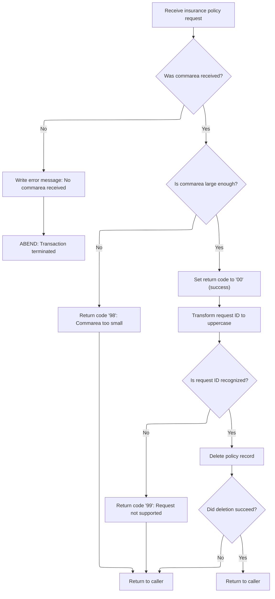
```mermaid
%%{init: {"flowchart": {"defaultRenderer": "elk"}} }%%
flowchart TD
    node1["Receive insurance policy request"] --> node2{"Was commarea received?"}
    click node1 openCode "base/src/lgdpol01.cbl:78:95"
    node2 -->|"No"| node3["Write error message: No commarea received"]
    click node2 openCode "base/src/lgdpol01.cbl:95:99"
    click node3 openCode "base/src/lgdpol01.cbl:96:98"
    node3 --> node4["ABEND: Transaction terminated"]
    click node4 openCode "base/src/lgdpol01.cbl:98:99"
    node2 -->|"Yes"| node5{"Is commarea large enough?"}
    click node5 openCode "base/src/lgdpol01.cbl:107:110"
    node5 -->|"No"| node6["Return code '98': Commarea too small"]
    click node6 openCode "base/src/lgdpol01.cbl:108:109"
    node6 --> node7["Return to caller"]
    click node7 openCode "base/src/lgdpol01.cbl:109:110"
    node5 -->|"Yes"| node8["Set return code to '00' (success)"]
    click node8 openCode "base/src/lgdpol01.cbl:102:104"
    node8 --> node9["Transform request ID to uppercase"]
    click node9 openCode "base/src/lgdpol01.cbl:117:117"
    node9 --> node10{"Is request ID recognized?"}
    click node10 openCode "base/src/lgdpol01.cbl:119:122"
    node10 -->|"No"| node11["Return code '99': Request not supported"]
    click node11 openCode "base/src/lgdpol01.cbl:124:124"
    node11 --> node7
    node10 -->|"Yes"| node12["Delete policy record"]
    click node12 openCode "base/src/lgdpol01.cbl:126:126"
    node12 --> node13{"Did deletion succeed?"}
    click node13 openCode "base/src/lgdpol01.cbl:127:128"
    node13 -->|"No"| node7
    node13 -->|"Yes"| node14["Return to caller"]
    click node14 openCode "base/src/lgdpol01.cbl:133:133"
classDef HeadingStyle fill:#777777,stroke:#333,stroke-width:2px;

%% Swimm:
%% %%{init: {"flowchart": {"defaultRenderer": "elk"}} }%%
%% flowchart TD
%%     node1["Receive insurance policy request"] --> node2{"Was commarea received?"}
%%     click node1 openCode "<SwmPath>[base/src/lgdpol01.cbl](base/src/lgdpol01.cbl)</SwmPath>:78:95"
%%     node2 -->|"No"| node3["Write error message: No commarea received"]
%%     click node2 openCode "<SwmPath>[base/src/lgdpol01.cbl](base/src/lgdpol01.cbl)</SwmPath>:95:99"
%%     click node3 openCode "<SwmPath>[base/src/lgdpol01.cbl](base/src/lgdpol01.cbl)</SwmPath>:96:98"
%%     node3 --> node4["ABEND: Transaction terminated"]
%%     click node4 openCode "<SwmPath>[base/src/lgdpol01.cbl](base/src/lgdpol01.cbl)</SwmPath>:98:99"
%%     node2 -->|"Yes"| node5{"Is commarea large enough?"}
%%     click node5 openCode "<SwmPath>[base/src/lgdpol01.cbl](base/src/lgdpol01.cbl)</SwmPath>:107:110"
%%     node5 -->|"No"| node6["Return code '98': Commarea too small"]
%%     click node6 openCode "<SwmPath>[base/src/lgdpol01.cbl](base/src/lgdpol01.cbl)</SwmPath>:108:109"
%%     node6 --> node7["Return to caller"]
%%     click node7 openCode "<SwmPath>[base/src/lgdpol01.cbl](base/src/lgdpol01.cbl)</SwmPath>:109:110"
%%     node5 -->|"Yes"| node8["Set return code to '00' (success)"]
%%     click node8 openCode "<SwmPath>[base/src/lgdpol01.cbl](base/src/lgdpol01.cbl)</SwmPath>:102:104"
%%     node8 --> node9["Transform request ID to uppercase"]
%%     click node9 openCode "<SwmPath>[base/src/lgdpol01.cbl](base/src/lgdpol01.cbl)</SwmPath>:117:117"
%%     node9 --> node10{"Is request ID recognized?"}
%%     click node10 openCode "<SwmPath>[base/src/lgdpol01.cbl](base/src/lgdpol01.cbl)</SwmPath>:119:122"
%%     node10 -->|"No"| node11["Return code '99': Request not supported"]
%%     click node11 openCode "<SwmPath>[base/src/lgdpol01.cbl](base/src/lgdpol01.cbl)</SwmPath>:124:124"
%%     node11 --> node7
%%     node10 -->|"Yes"| node12["Delete policy record"]
%%     click node12 openCode "<SwmPath>[base/src/lgdpol01.cbl](base/src/lgdpol01.cbl)</SwmPath>:126:126"
%%     node12 --> node13{"Did deletion succeed?"}
%%     click node13 openCode "<SwmPath>[base/src/lgdpol01.cbl](base/src/lgdpol01.cbl)</SwmPath>:127:128"
%%     node13 -->|"No"| node7
%%     node13 -->|"Yes"| node14["Return to caller"]
%%     click node14 openCode "<SwmPath>[base/src/lgdpol01.cbl](base/src/lgdpol01.cbl)</SwmPath>:133:133"
%% classDef HeadingStyle fill:#777777,stroke:#333,stroke-width:2px;
```

This section governs the business rules for processing insurance policy delete requests. It ensures that only valid, recognized, and authorized requests result in the deletion of a policy record, and that all error conditions are handled with appropriate feedback to the caller.

| Category        | Rule Name                   | Description                                                                                                                                                                                                                                                                                                                                                                                                                                                                                                                                                                                                                                                                                                                                                         |
| --------------- | --------------------------- | ------------------------------------------------------------------------------------------------------------------------------------------------------------------------------------------------------------------------------------------------------------------------------------------------------------------------------------------------------------------------------------------------------------------------------------------------------------------------------------------------------------------------------------------------------------------------------------------------------------------------------------------------------------------------------------------------------------------------------------------------------------------- |
| Data validation | Commarea Required           | If no commarea is received with the request, the transaction must be terminated and an error message must be logged for audit and troubleshooting purposes.                                                                                                                                                                                                                                                                                                                                                                                                                                                                                                                                                                                                         |
| Data validation | Minimum Commarea Size       | If the commarea received is smaller than 28 bytes, the request must be rejected with return code '98' indicating the commarea is too small.                                                                                                                                                                                                                                                                                                                                                                                                                                                                                                                                                                                                                         |
| Data validation | Supported Request Types     | Only requests with a recognized request ID (<SwmToken path="base/src/lgdpol01.cbl" pos="119:18:18" line-data="           IF ( CA-REQUEST-ID NOT EQUAL TO &#39;01DEND&#39; AND">`01DEND`</SwmToken>, <SwmToken path="base/src/lgtestp1.cbl" pos="136:4:4" line-data="                 Move &#39;01DMOT&#39;   To CA-REQUEST-ID">`01DMOT`</SwmToken>, <SwmToken path="base/src/lgdpol01.cbl" pos="121:14:14" line-data="                CA-REQUEST-ID NOT EQUAL TO &#39;01DHOU&#39; AND">`01DHOU`</SwmToken>, or <SwmToken path="base/src/lgdpol01.cbl" pos="122:14:14" line-data="                CA-REQUEST-ID NOT EQUAL TO &#39;01DCOM&#39; )">`01DCOM`</SwmToken>) are eligible for policy deletion. Any other request ID must be rejected with return code '99'. |
| Data validation | Case Insensitive Request ID | The request ID must be treated as case-insensitive; all request IDs are converted to uppercase before validation.                                                                                                                                                                                                                                                                                                                                                                                                                                                                                                                                                                                                                                                   |
| Business logic  | Success Confirmation        | A successful policy delete request must return a return code of '00' to the caller, indicating successful completion.                                                                                                                                                                                                                                                                                                                                                                                                                                                                                                                                                                                                                                               |

<SwmSnippet path="/base/src/lgdpol01.cbl" line="78">

---

MAINLINE in <SwmPath>[base/src/lgdpol01.cbl](base/src/lgdpol01.cbl)</SwmPath> checks the commarea, validates the request ID, and only proceeds with delete if the ID matches a supported type. If valid, it calls <SwmToken path="base/src/lgdpol01.cbl" pos="126:3:9" line-data="               PERFORM DELETE-POLICY-DB2-INFO">`DELETE-POLICY-DB2-INFO`</SwmToken> to actually remove the policy. Otherwise, it sets an error code and returns.

```cobol
       MAINLINE SECTION.

      *----------------------------------------------------------------*
      * Common code                                                    *
      *----------------------------------------------------------------*
      * initialize working storage variables
           INITIALIZE WS-HEADER.
      * set up general variable
           MOVE EIBTRNID TO WS-TRANSID.
           MOVE EIBTRMID TO WS-TERMID.
           MOVE EIBTASKN TO WS-TASKNUM.
      *----------------------------------------------------------------*

      *----------------------------------------------------------------*
      * Check commarea and obtain required details                     *
      *----------------------------------------------------------------*
      * If NO commarea received issue an ABEND
           IF EIBCALEN IS EQUAL TO ZERO
               MOVE ' NO COMMAREA RECEIVED' TO EM-VARIABLE
               PERFORM WRITE-ERROR-MESSAGE
               EXEC CICS ABEND ABCODE('LGCA') NODUMP END-EXEC
           END-IF

      * initialize commarea return code to zero
           MOVE '00' TO CA-RETURN-CODE
           MOVE EIBCALEN TO WS-CALEN.
           SET WS-ADDR-DFHCOMMAREA TO ADDRESS OF DFHCOMMAREA.

      * Check commarea is large enough
           IF EIBCALEN IS LESS THAN WS-CA-HEADER-LEN
             MOVE '98' TO CA-RETURN-CODE
             EXEC CICS RETURN END-EXEC
           END-IF

      *----------------------------------------------------------------*
      * Check request-id in commarea and if recognised ...             *
      * Call routine to delete row from policy table                   *
      *----------------------------------------------------------------*
      * Upper case value passed in Request Id field                    *
           MOVE FUNCTION UPPER-CASE(CA-REQUEST-ID) TO CA-REQUEST-ID

           IF ( CA-REQUEST-ID NOT EQUAL TO '01DEND' AND
                CA-REQUEST-ID NOT EQUAL TO '01DMOT' AND
                CA-REQUEST-ID NOT EQUAL TO '01DHOU' AND
                CA-REQUEST-ID NOT EQUAL TO '01DCOM' )
      *        Request is not recognised or supported
               MOVE '99' TO CA-RETURN-CODE
           ELSE
               PERFORM DELETE-POLICY-DB2-INFO
               If CA-RETURN-CODE > 0
                 EXEC CICS RETURN END-EXEC
               End-if
           END-IF

      * Return to caller
           EXEC CICS RETURN END-EXEC.
```

---

</SwmSnippet>

<SwmSnippet path="/base/src/lgdpol01.cbl" line="154">

---

<SwmToken path="base/src/lgdpol01.cbl" pos="154:1:5" line-data="       WRITE-ERROR-MESSAGE.">`WRITE-ERROR-MESSAGE`</SwmToken> in <SwmPath>[base/src/lgdpol01.cbl](base/src/lgdpol01.cbl)</SwmPath> logs error details and up to 90 bytes of the commarea by calling LGSTSQ. It formats the timestamp, writes the error message, and then logs the commarea data for troubleshooting.

```cobol
       WRITE-ERROR-MESSAGE.
      * Save SQLCODE in message
      * Obtain and format current time and date
           EXEC CICS ASKTIME ABSTIME(WS-ABSTIME)
           END-EXEC
           EXEC CICS FORMATTIME ABSTIME(Ws-ABSTIME)
                     MMDDYYYY(WS-DATE)
                     TIME(WS-TIME)
           END-EXEC
           MOVE WS-DATE TO EM-DATE
           MOVE WS-TIME TO EM-TIME
      * Write output message to TDQ
           EXEC CICS LINK PROGRAM('LGSTSQ')
                     COMMAREA(ERROR-MSG)
                     LENGTH(LENGTH OF ERROR-MSG)
           END-EXEC.
      * Write 90 bytes or as much as we have of commarea to TDQ
           IF EIBCALEN > 0 THEN
             IF EIBCALEN < 91 THEN
               MOVE DFHCOMMAREA(1:EIBCALEN) TO CA-DATA
               EXEC CICS LINK PROGRAM('LGSTSQ')
                         COMMAREA(CA-ERROR-MSG)
                         LENGTH(LENGTH OF CA-ERROR-MSG)
               END-EXEC
             ELSE
               MOVE DFHCOMMAREA(1:90) TO CA-DATA
               EXEC CICS LINK PROGRAM('LGSTSQ')
                         COMMAREA(CA-ERROR-MSG)
                         LENGTH(LENGTH OF CA-ERROR-MSG)
               END-EXEC
             END-IF
           END-IF.
           EXIT.
```

---

</SwmSnippet>

## Triggering Policy Deletion in <SwmToken path="base/src/lgipdb01.cbl" pos="242:5:5" line-data="      * initialize DB2 host variables">`DB2`</SwmToken>

This section governs the business rules for deleting an insurance policy from the <SwmToken path="base/src/lgipdb01.cbl" pos="242:5:5" line-data="      * initialize DB2 host variables">`DB2`</SwmToken> database. It ensures that only valid deletion requests are processed and that appropriate actions are taken based on the outcome of the deletion attempt.

| Category        | Rule Name                           | Description                                                                                                                        |
| --------------- | ----------------------------------- | ---------------------------------------------------------------------------------------------------------------------------------- |
| Data validation | Valid policy identifier required    | A policy can only be deleted if a valid policy identifier is provided in the deletion request.                                     |
| Business logic  | Active or claimed policy protection | A policy that is currently active or has outstanding claims cannot be deleted; an error message is returned in such cases.         |
| Business logic  | Deletion confirmation               | Upon successful deletion, a confirmation message is returned to the user indicating the policy has been removed from the database. |

<SwmSnippet path="/base/src/lgdpol01.cbl" line="139">

---

<SwmToken path="base/src/lgdpol01.cbl" pos="139:1:7" line-data="       DELETE-POLICY-DB2-INFO.">`DELETE-POLICY-DB2-INFO`</SwmToken> in <SwmPath>[base/src/lgdpol01.cbl](base/src/lgdpol01.cbl)</SwmPath> just links to <SwmToken path="base/src/lgdpol01.cbl" pos="141:9:9" line-data="           EXEC CICS LINK PROGRAM(LGDPDB01)">`LGDPDB01`</SwmToken>, passing the commarea. <SwmToken path="base/src/lgdpol01.cbl" pos="141:9:9" line-data="           EXEC CICS LINK PROGRAM(LGDPDB01)">`LGDPDB01`</SwmToken> does the actual <SwmToken path="base/src/lgdpol01.cbl" pos="139:5:5" line-data="       DELETE-POLICY-DB2-INFO.">`DB2`</SwmToken> delete and handles any DB2-specific logic or errors.

```cobol
       DELETE-POLICY-DB2-INFO.

           EXEC CICS LINK PROGRAM(LGDPDB01)
                Commarea(DFHCOMMAREA)
                LENGTH(32500)
           END-EXEC.

           EXIT.
```

---

</SwmSnippet>

## <SwmToken path="base/src/lgipdb01.cbl" pos="242:5:5" line-data="      * initialize DB2 host variables">`DB2`</SwmToken> Policy Deletion and Error Logging

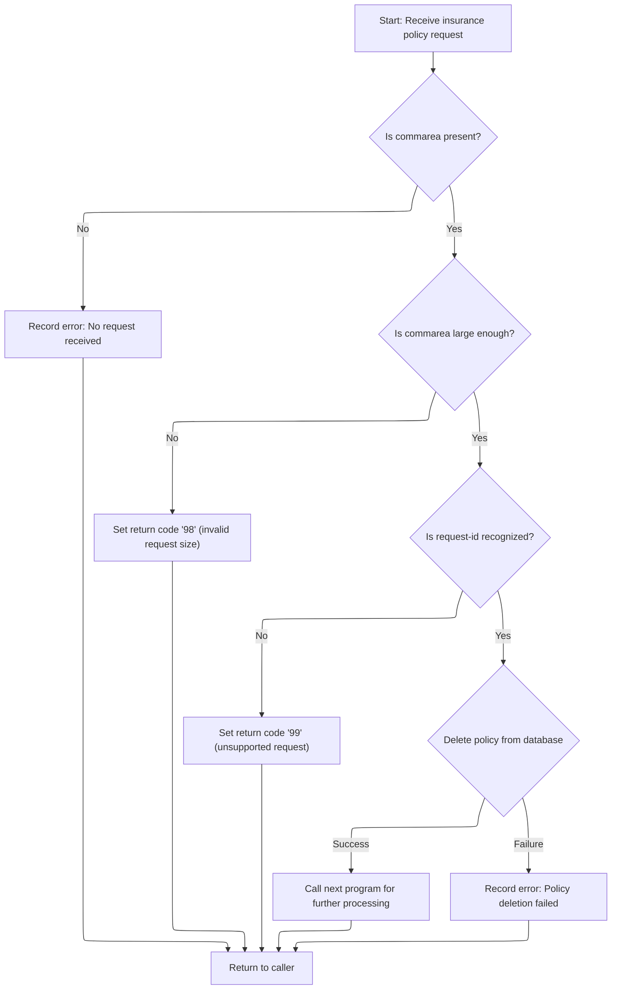
```mermaid
%%{init: {"flowchart": {"defaultRenderer": "elk"}} }%%
flowchart TD
  node1["Start: Receive insurance policy request"] --> node2{"Is commarea present?"}
  click node1 openCode "base/src/lgdpdb01.cbl:111:131"
  node2 -->|"No"| node3["Record error: No request received"]
  click node2 openCode "base/src/lgdpdb01.cbl:131:135"
  click node3 openCode "base/src/lgdpdb01.cbl:132:134"
  node3 --> node4["Return to caller"]
  click node4 openCode "base/src/lgdpdb01.cbl:175:175"
  node2 -->|"Yes"| node5{"Is commarea large enough?"}
  click node5 openCode "base/src/lgdpdb01.cbl:143:146"
  node5 -->|"No"| node6["Set return code '98' (invalid request size)"]
  click node6 openCode "base/src/lgdpdb01.cbl:144:145"
  node6 --> node4
  node5 -->|"Yes"| node7{"Is request-id recognized?"}
  click node7 openCode "base/src/lgdpdb01.cbl:160:172"
  node7 -->|"No"| node8["Set return code '99' (unsupported request)"]
  click node8 openCode "base/src/lgdpdb01.cbl:165:165"
  node8 --> node4
  node7 -->|"Yes"| node9{"Delete policy from database"}
  click node9 openCode "base/src/lgdpdb01.cbl:167:167"
  node9 -->|"Success"| node10["Call next program for further processing"]
  click node10 openCode "base/src/lgdpdb01.cbl:168:171"
  node10 --> node4
  node9 -->|"Failure"| node11["Record error: Policy deletion failed"]
  click node11 openCode "base/src/lgdpdb01.cbl:200:201"
  node11 --> node4
classDef HeadingStyle fill:#777777,stroke:#333,stroke-width:2px;

%% Swimm:
%% %%{init: {"flowchart": {"defaultRenderer": "elk"}} }%%
%% flowchart TD
%%   node1["Start: Receive insurance policy request"] --> node2{"Is commarea present?"}
%%   click node1 openCode "<SwmPath>[base/src/lgdpdb01.cbl](base/src/lgdpdb01.cbl)</SwmPath>:111:131"
%%   node2 -->|"No"| node3["Record error: No request received"]
%%   click node2 openCode "<SwmPath>[base/src/lgdpdb01.cbl](base/src/lgdpdb01.cbl)</SwmPath>:131:135"
%%   click node3 openCode "<SwmPath>[base/src/lgdpdb01.cbl](base/src/lgdpdb01.cbl)</SwmPath>:132:134"
%%   node3 --> node4["Return to caller"]
%%   click node4 openCode "<SwmPath>[base/src/lgdpdb01.cbl](base/src/lgdpdb01.cbl)</SwmPath>:175:175"
%%   node2 -->|"Yes"| node5{"Is commarea large enough?"}
%%   click node5 openCode "<SwmPath>[base/src/lgdpdb01.cbl](base/src/lgdpdb01.cbl)</SwmPath>:143:146"
%%   node5 -->|"No"| node6["Set return code '98' (invalid request size)"]
%%   click node6 openCode "<SwmPath>[base/src/lgdpdb01.cbl](base/src/lgdpdb01.cbl)</SwmPath>:144:145"
%%   node6 --> node4
%%   node5 -->|"Yes"| node7{"Is <SwmToken path="base/src/lgdpol01.cbl" pos="113:5:7" line-data="      * Check request-id in commarea and if recognised ...             *">`request-id`</SwmToken> recognized?"}
%%   click node7 openCode "<SwmPath>[base/src/lgdpdb01.cbl](base/src/lgdpdb01.cbl)</SwmPath>:160:172"
%%   node7 -->|"No"| node8["Set return code '99' (unsupported request)"]
%%   click node8 openCode "<SwmPath>[base/src/lgdpdb01.cbl](base/src/lgdpdb01.cbl)</SwmPath>:165:165"
%%   node8 --> node4
%%   node7 -->|"Yes"| node9{"Delete policy from database"}
%%   click node9 openCode "<SwmPath>[base/src/lgdpdb01.cbl](base/src/lgdpdb01.cbl)</SwmPath>:167:167"
%%   node9 -->|"Success"| node10["Call next program for further processing"]
%%   click node10 openCode "<SwmPath>[base/src/lgdpdb01.cbl](base/src/lgdpdb01.cbl)</SwmPath>:168:171"
%%   node10 --> node4
%%   node9 -->|"Failure"| node11["Record error: Policy deletion failed"]
%%   click node11 openCode "<SwmPath>[base/src/lgdpdb01.cbl](base/src/lgdpdb01.cbl)</SwmPath>:200:201"
%%   node11 --> node4
%% classDef HeadingStyle fill:#777777,stroke:#333,stroke-width:2px;
```

This section governs the business logic for deleting insurance policies from the database, including validation of incoming requests and error logging for failed operations.

| Category        | Rule Name                  | Description                                                                                                                                                                                                                                                                                                                                                                                                                                                                                                                                                                                                                                                                                                                                                                           |
| --------------- | -------------------------- | ------------------------------------------------------------------------------------------------------------------------------------------------------------------------------------------------------------------------------------------------------------------------------------------------------------------------------------------------------------------------------------------------------------------------------------------------------------------------------------------------------------------------------------------------------------------------------------------------------------------------------------------------------------------------------------------------------------------------------------------------------------------------------------- |
| Data validation | Missing request data       | If no commarea is present in the request, the operation must be aborted and an error must be logged indicating that no request was received.                                                                                                                                                                                                                                                                                                                                                                                                                                                                                                                                                                                                                                          |
| Data validation | Minimum request size       | If the commarea is smaller than the minimum required length (+28 bytes), the operation must be aborted and a return code of '98' must be set to indicate invalid request size.                                                                                                                                                                                                                                                                                                                                                                                                                                                                                                                                                                                                        |
| Data validation | Supported request types    | If the request ID is not one of the supported types (<SwmToken path="base/src/lgdpol01.cbl" pos="119:18:18" line-data="           IF ( CA-REQUEST-ID NOT EQUAL TO &#39;01DEND&#39; AND">`01DEND`</SwmToken>, <SwmToken path="base/src/lgdpol01.cbl" pos="121:14:14" line-data="                CA-REQUEST-ID NOT EQUAL TO &#39;01DHOU&#39; AND">`01DHOU`</SwmToken>, <SwmToken path="base/src/lgdpol01.cbl" pos="122:14:14" line-data="                CA-REQUEST-ID NOT EQUAL TO &#39;01DCOM&#39; )">`01DCOM`</SwmToken>, <SwmToken path="base/src/lgtestp1.cbl" pos="136:4:4" line-data="                 Move &#39;01DMOT&#39;   To CA-REQUEST-ID">`01DMOT`</SwmToken>), the operation must be aborted and a return code of '99' must be set to indicate unsupported request type. |
| Business logic  | Successful policy deletion | If the policy deletion is successful (SQLCODE 0 or 100), the operation must proceed to any related VSAM deletes and then return to the caller.                                                                                                                                                                                                                                                                                                                                                                                                                                                                                                                                                                                                                                        |

<SwmSnippet path="/base/src/lgdpdb01.cbl" line="111">

---

MAINLINE in <SwmPath>[base/src/lgdpdb01.cbl](base/src/lgdpdb01.cbl)</SwmPath> checks the commarea, converts customer and policy numbers to <SwmToken path="base/src/lgdpdb01.cbl" pos="124:5:5" line-data="      * initialize DB2 host variables">`DB2`</SwmToken> integer format, and validates the request ID. If it's a supported type, it performs the <SwmToken path="base/src/lgdpdb01.cbl" pos="124:5:5" line-data="      * initialize DB2 host variables">`DB2`</SwmToken> delete and then links to <SwmToken path="base/src/lgdpdb01.cbl" pos="168:9:9" line-data="               EXEC CICS LINK PROGRAM(LGDPVS01)">`LGDPVS01`</SwmToken> to handle any related VSAM deletes. Otherwise, it sets an error code and returns.

```cobol
       MAINLINE SECTION.

      *----------------------------------------------------------------*
      * Common code                                                    *
      *----------------------------------------------------------------*
      * initialize working storage variables
           INITIALIZE WS-HEADER.
      * set up general variable
           MOVE EIBTRNID TO WS-TRANSID.
           MOVE EIBTRMID TO WS-TERMID.
           MOVE EIBTASKN TO WS-TASKNUM.
      *----------------------------------------------------------------*

      * initialize DB2 host variables
           INITIALIZE DB2-IN-INTEGERS.

      *----------------------------------------------------------------*
      * Check commarea and obtain required details                     *
      *----------------------------------------------------------------*
      * If NO commarea received issue an ABEND
           IF EIBCALEN IS EQUAL TO ZERO
               MOVE ' NO COMMAREA RECEIVED' TO EM-VARIABLE
               PERFORM WRITE-ERROR-MESSAGE
               EXEC CICS ABEND ABCODE('LGCA') NODUMP END-EXEC
           END-IF

      * initialize commarea return code to zero
           MOVE '00' TO CA-RETURN-CODE
           MOVE EIBCALEN TO WS-CALEN.
           SET WS-ADDR-DFHCOMMAREA TO ADDRESS OF DFHCOMMAREA.

      * Check commarea is large enough
           IF EIBCALEN IS LESS THAN WS-CA-HEADER-LEN
             MOVE '98' TO CA-RETURN-CODE
             EXEC CICS RETURN END-EXEC
           END-IF

      * Convert commarea customer & policy nums to DB2 integer format
           MOVE CA-CUSTOMER-NUM TO DB2-CUSTOMERNUM-INT
           MOVE CA-POLICY-NUM   TO DB2-POLICYNUM-INT
      * and save in error msg field incase required
           MOVE CA-CUSTOMER-NUM TO EM-CUSNUM
           MOVE CA-POLICY-NUM   TO EM-POLNUM

      *----------------------------------------------------------------*
      * Check request-id in commarea and if recognised ...             *
      * Call routine to delete row from policy table                   *
      *----------------------------------------------------------------*

           IF ( CA-REQUEST-ID NOT EQUAL TO '01DEND' AND
                CA-REQUEST-ID NOT EQUAL TO '01DHOU' AND
                CA-REQUEST-ID NOT EQUAL TO '01DCOM' AND
                CA-REQUEST-ID NOT EQUAL TO '01DMOT' ) Then
      *        Request is not recognised or supported
               MOVE '99' TO CA-RETURN-CODE
           ELSE
               PERFORM DELETE-POLICY-DB2-INFO
               EXEC CICS LINK PROGRAM(LGDPVS01)
                    Commarea(DFHCOMMAREA)
                    LENGTH(32500)
               END-EXEC
           END-IF.

      * Return to caller
           EXEC CICS RETURN END-EXEC.
```

---

</SwmSnippet>

<SwmSnippet path="/base/src/lgdpdb01.cbl" line="212">

---

<SwmToken path="base/src/lgdpdb01.cbl" pos="212:1:5" line-data="       WRITE-ERROR-MESSAGE.">`WRITE-ERROR-MESSAGE`</SwmToken> in <SwmPath>[base/src/lgdpdb01.cbl](base/src/lgdpdb01.cbl)</SwmPath> logs the SQLCODE, formats the timestamp, writes the error message to LGSTSQ, and then logs up to 90 bytes of the commarea for troubleshooting. This keeps error logs concise and relevant.

```cobol
       WRITE-ERROR-MESSAGE.
      * Save SQLCODE in message
           MOVE SQLCODE TO EM-SQLRC
      * Obtain and format current time and date
           EXEC CICS ASKTIME ABSTIME(WS-ABSTIME)
           END-EXEC
           EXEC CICS FORMATTIME ABSTIME(Ws-ABSTIME)
                     MMDDYYYY(WS-DATE)
                     TIME(WS-TIME)
           END-EXEC
           MOVE WS-DATE TO EM-DATE
           MOVE WS-TIME TO EM-TIME
      * Write output message to TDQ
           EXEC CICS LINK PROGRAM('LGSTSQ')
                     COMMAREA(ERROR-MSG)
                     LENGTH(LENGTH OF ERROR-MSG)
           END-EXEC.
      * Write 90 bytes or as much as we have of commarea to TDQ
           IF EIBCALEN > 0 THEN
             IF EIBCALEN < 91 THEN
               MOVE DFHCOMMAREA(1:EIBCALEN) TO CA-DATA
               EXEC CICS LINK PROGRAM('LGSTSQ')
                         COMMAREA(CA-ERROR-MSG)
                         LENGTH(LENGTH OF CA-ERROR-MSG)
               END-EXEC
             ELSE
               MOVE DFHCOMMAREA(1:90) TO CA-DATA
               EXEC CICS LINK PROGRAM('LGSTSQ')
                         COMMAREA(CA-ERROR-MSG)
                         LENGTH(LENGTH OF CA-ERROR-MSG)
               END-EXEC
             END-IF
           END-IF.
           EXIT.
```

---

</SwmSnippet>

<SwmSnippet path="/base/src/lgdpdb01.cbl" line="186">

---

<SwmToken path="base/src/lgdpdb01.cbl" pos="186:1:7" line-data="       DELETE-POLICY-DB2-INFO.">`DELETE-POLICY-DB2-INFO`</SwmToken> in <SwmPath>[base/src/lgdpdb01.cbl](base/src/lgdpdb01.cbl)</SwmPath> runs the SQL DELETE for the policy. If it fails (SQLCODE not 0 or 100), it sets return code '90', logs the error, and returns. Otherwise, it just exits.

```cobol
       DELETE-POLICY-DB2-INFO.

           MOVE ' DELETE POLICY  ' TO EM-SQLREQ
           EXEC SQL
             DELETE
               FROM POLICY
               WHERE ( CUSTOMERNUMBER = :DB2-CUSTOMERNUM-INT AND
                       POLICYNUMBER  = :DB2-POLICYNUM-INT      )
           END-EXEC

      *    Treat SQLCODE 0 and SQLCODE 100 (record not found) as
      *    successful - end result is record does not exist
           IF SQLCODE NOT EQUAL 0 Then
               MOVE '90' TO CA-RETURN-CODE
               PERFORM WRITE-ERROR-MESSAGE
               EXEC CICS RETURN END-EXEC
           END-IF.

           EXIT.
```

---

</SwmSnippet>

## VSAM Policy Deletion and Error Logging

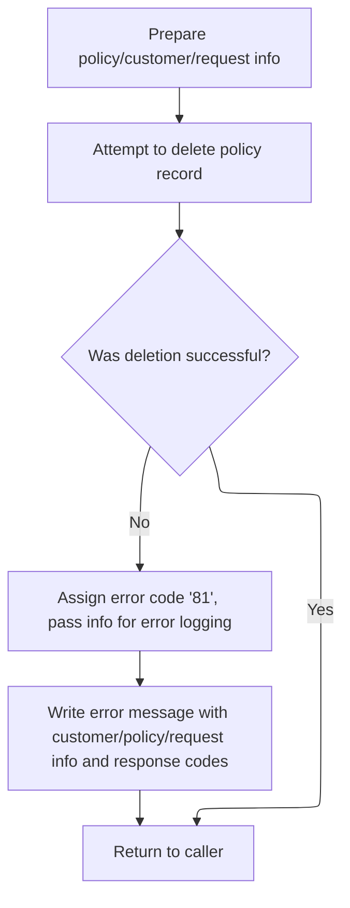
```mermaid
%%{init: {"flowchart": {"defaultRenderer": "elk"}} }%%
flowchart TD
    node1["Prepare policy/customer/request info"] --> node2["Attempt to delete policy record"]
    click node1 openCode "base/src/lgdpvs01.cbl:75:79"
    click node2 openCode "base/src/lgdpvs01.cbl:81:85"
    node2 --> node3{"Was deletion successful?"}
    click node3 openCode "base/src/lgdpvs01.cbl:86:91"
    node3 -->|"Yes"| node4["Return to caller"]
    click node4 openCode "base/src/lgdpvs01.cbl:91:91"
    node3 -->|"No"| node5["Assign error code '81', pass info for error logging"]
    click node5 openCode "base/src/lgdpvs01.cbl:87:90"
    node5 --> node6["Write error message with customer/policy/request info and response codes"]
    click node6 openCode "base/src/lgdpvs01.cbl:99:132"
    node6 --> node4
classDef HeadingStyle fill:#777777,stroke:#333,stroke-width:2px;

%% Swimm:
%% %%{init: {"flowchart": {"defaultRenderer": "elk"}} }%%
%% flowchart TD
%%     node1["Prepare policy/customer/request info"] --> node2["Attempt to delete policy record"]
%%     click node1 openCode "<SwmPath>[base/src/lgdpvs01.cbl](base/src/lgdpvs01.cbl)</SwmPath>:75:79"
%%     click node2 openCode "<SwmPath>[base/src/lgdpvs01.cbl](base/src/lgdpvs01.cbl)</SwmPath>:81:85"
%%     node2 --> node3{"Was deletion successful?"}
%%     click node3 openCode "<SwmPath>[base/src/lgdpvs01.cbl](base/src/lgdpvs01.cbl)</SwmPath>:86:91"
%%     node3 -->|"Yes"| node4["Return to caller"]
%%     click node4 openCode "<SwmPath>[base/src/lgdpvs01.cbl](base/src/lgdpvs01.cbl)</SwmPath>:91:91"
%%     node3 -->|"No"| node5["Assign error code '81', pass info for error logging"]
%%     click node5 openCode "<SwmPath>[base/src/lgdpvs01.cbl](base/src/lgdpvs01.cbl)</SwmPath>:87:90"
%%     node5 --> node6["Write error message with customer/policy/request info and response codes"]
%%     click node6 openCode "<SwmPath>[base/src/lgdpvs01.cbl](base/src/lgdpvs01.cbl)</SwmPath>:99:132"
%%     node6 --> node4
%% classDef HeadingStyle fill:#777777,stroke:#333,stroke-width:2px;
```

This section governs the business logic for deleting insurance policy records from the VSAM file and ensures that any errors encountered during deletion are logged with sufficient detail for troubleshooting and audit purposes.

| Category        | Rule Name                      | Description                                                                                                                                                      |
| --------------- | ------------------------------ | ---------------------------------------------------------------------------------------------------------------------------------------------------------------- |
| Data validation | Policy identity validation     | A policy record must be deleted only if the provided policy and customer identifiers match an existing record in the VSAM file.                                  |
| Business logic  | Comprehensive error logging    | Whenever a deletion error occurs, the system must log an error message containing the timestamp, customer number, policy number, request ID, and response codes. |
| Business logic  | Troubleshooting data inclusion | If the request contains additional commarea data, up to 90 bytes of this data must be included in the error log for troubleshooting.                             |
| Business logic  | Successful deletion exit       | If the deletion is successful, the system must return control to the caller without logging any error.                                                           |

<SwmSnippet path="/base/src/lgdpvs01.cbl" line="72">

---

MAINLINE in <SwmPath>[base/src/lgdpvs01.cbl](base/src/lgdpvs01.cbl)</SwmPath> sets up the VSAM key, runs the CICS Delete File on KSDSPOLY, and checks the response. If it fails, it sets return code '81', logs the error, and returns. Otherwise, it just exits.

```cobol
       MAINLINE SECTION.
      *
      *---------------------------------------------------------------*
           Move EIBCALEN To WS-Commarea-Len.
      *---------------------------------------------------------------*
           Move CA-Request-ID(4:1) To WF-Request-ID
           Move CA-Policy-Num      To WF-Policy-Num
           Move CA-Customer-Num    To WF-Customer-Num
      *---------------------------------------------------------------*
           Exec CICS Delete File('KSDSPOLY')
                     Ridfld(WF-Policy-Key)
                     KeyLength(21)
                     RESP(WS-RESP)
           End-Exec.
           If WS-RESP Not = DFHRESP(NORMAL)
             Move EIBRESP2 To WS-RESP2
             MOVE '81' TO CA-RETURN-CODE
             PERFORM WRITE-ERROR-MESSAGE
             EXEC CICS RETURN END-EXEC
           End-If.
```

---

</SwmSnippet>

<SwmSnippet path="/base/src/lgdpvs01.cbl" line="99">

---

<SwmToken path="base/src/lgdpvs01.cbl" pos="99:1:5" line-data="       WRITE-ERROR-MESSAGE.">`WRITE-ERROR-MESSAGE`</SwmToken> in <SwmPath>[base/src/lgdpvs01.cbl](base/src/lgdpvs01.cbl)</SwmPath> logs the error with timestamp, customer and policy numbers, and response codes by calling LGSTSQ. If there's commarea data, it logs up to 90 bytes of that too for troubleshooting.

```cobol
       WRITE-ERROR-MESSAGE.
           EXEC CICS ASKTIME ABSTIME(WS-ABSTIME)
           END-EXEC
           EXEC CICS FORMATTIME ABSTIME(WS-ABSTIME)
                     MMDDYYYY(WS-DATE)
                     TIME(WS-TIME)
           END-EXEC
      *
           MOVE WS-DATE TO EM-DATE
           MOVE WS-TIME TO EM-TIME
           Move CA-Customer-Num To EM-CUSNUM 
           Move CA-POLICY-NUM To EM-POLNUM 
           Move WS-RESP         To EM-RespRC
           Move WS-RESP2        To EM-Resp2RC
           EXEC CICS LINK PROGRAM('LGSTSQ')
                     COMMAREA(ERROR-MSG)
                     LENGTH(LENGTH OF ERROR-MSG)
           END-EXEC.
           IF EIBCALEN > 0 THEN
             IF EIBCALEN < 91 THEN
               MOVE DFHCOMMAREA(1:EIBCALEN) TO CA-DATA
               EXEC CICS LINK PROGRAM('LGSTSQ')
                         COMMAREA(CA-ERROR-MSG)
                         LENGTH(Length Of CA-ERROR-MSG)
               END-EXEC
             ELSE
               MOVE DFHCOMMAREA(1:90) TO CA-DATA
               EXEC CICS LINK PROGRAM('LGSTSQ')
                         COMMAREA(CA-ERROR-MSG)
                         LENGTH(Length Of CA-ERROR-MSG)
               END-EXEC
             END-IF
           END-IF.
           EXIT.
```

---

</SwmSnippet>

## Handling Inquiry and Update in the Menu

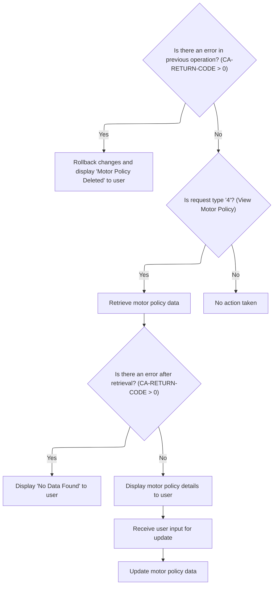
```mermaid
%%{init: {"flowchart": {"defaultRenderer": "elk"}} }%%
flowchart TD
  node1{"Is there an error in previous operation? (CA-RETURN-CODE > 0)"}
  click node1 openCode "base/src/lgtestp1.cbl:143:146"
  node1 -->|"Yes"| node2["Rollback changes and display 'Motor Policy Deleted' to user"]
  click node2 openCode "base/src/lgtestp1.cbl:148:158"
  node1 -->|"No"| node3{"Is request type '4'? (View Motor Policy)"}
  click node3 openCode "base/src/lgtestp1.cbl:169:169"
  node3 -->|"Yes"| node4["Retrieve motor policy data"]
  click node4 openCode "base/src/lgtestp1.cbl:170:176"
  node4 --> node5{"Is there an error after retrieval? (CA-RETURN-CODE > 0)"}
  click node5 openCode "base/src/lgtestp1.cbl:177:179"
  node5 -->|"Yes"| node6["Display 'No Data Found' to user"]
  click node6 openCode "base/src/lgtestp1.cbl:148:158"
  node5 -->|"No"| node7["Display motor policy details to user"]
  click node7 openCode "base/src/lgtestp1.cbl:181:195"
  node7 --> node8["Receive user input for update"]
  click node8 openCode "base/src/lgtestp1.cbl:196:198"
  node8 --> node9["Update motor policy data"]
  click node9 openCode "base/src/lgtestp1.cbl:200:219"
  node3 -->|"No"| node10["No action taken"]
  click node10 openCode "base/src/lgtestp1.cbl:143:219"

classDef HeadingStyle fill:#777777,stroke:#333,stroke-width:2px;

%% Swimm:
%% %%{init: {"flowchart": {"defaultRenderer": "elk"}} }%%
%% flowchart TD
%%   node1{"Is there an error in previous operation? (<SwmToken path="base/src/lgtestp1.cbl" pos="76:3:7" line-data="                 IF CA-RETURN-CODE &gt; 0">`CA-RETURN-CODE`</SwmToken> > 0)"}
%%   click node1 openCode "<SwmPath>[base/src/lgtestp1.cbl](base/src/lgtestp1.cbl)</SwmPath>:143:146"
%%   node1 -->|"Yes"| node2["Rollback changes and display 'Motor Policy Deleted' to user"]
%%   click node2 openCode "<SwmPath>[base/src/lgtestp1.cbl](base/src/lgtestp1.cbl)</SwmPath>:148:158"
%%   node1 -->|"No"| node3{"Is request type '4'? (View Motor Policy)"}
%%   click node3 openCode "<SwmPath>[base/src/lgtestp1.cbl](base/src/lgtestp1.cbl)</SwmPath>:169:169"
%%   node3 -->|"Yes"| node4["Retrieve motor policy data"]
%%   click node4 openCode "<SwmPath>[base/src/lgtestp1.cbl](base/src/lgtestp1.cbl)</SwmPath>:170:176"
%%   node4 --> node5{"Is there an error after retrieval? (<SwmToken path="base/src/lgtestp1.cbl" pos="76:3:7" line-data="                 IF CA-RETURN-CODE &gt; 0">`CA-RETURN-CODE`</SwmToken> > 0)"}
%%   click node5 openCode "<SwmPath>[base/src/lgtestp1.cbl](base/src/lgtestp1.cbl)</SwmPath>:177:179"
%%   node5 -->|"Yes"| node6["Display 'No Data Found' to user"]
%%   click node6 openCode "<SwmPath>[base/src/lgtestp1.cbl](base/src/lgtestp1.cbl)</SwmPath>:148:158"
%%   node5 -->|"No"| node7["Display motor policy details to user"]
%%   click node7 openCode "<SwmPath>[base/src/lgtestp1.cbl](base/src/lgtestp1.cbl)</SwmPath>:181:195"
%%   node7 --> node8["Receive user input for update"]
%%   click node8 openCode "<SwmPath>[base/src/lgtestp1.cbl](base/src/lgtestp1.cbl)</SwmPath>:196:198"
%%   node8 --> node9["Update motor policy data"]
%%   click node9 openCode "<SwmPath>[base/src/lgtestp1.cbl](base/src/lgtestp1.cbl)</SwmPath>:200:219"
%%   node3 -->|"No"| node10["No action taken"]
%%   click node10 openCode "<SwmPath>[base/src/lgtestp1.cbl](base/src/lgtestp1.cbl)</SwmPath>:143:219"
%% 
%% classDef HeadingStyle fill:#777777,stroke:#333,stroke-width:2px;
```

<SwmSnippet path="/base/src/lgtestp1.cbl" line="143">

---

Back in <SwmToken path="base/src/lgtestp1.cbl" pos="33:5:7" line-data="              GO TO A-GAIN.">`A-GAIN`</SwmToken>, we just returned from <SwmPath>[base/src/lgdpol01.cbl](base/src/lgdpol01.cbl)</SwmPath> after trying to delete a motor policy. If <SwmToken path="base/src/lgtestp1.cbl" pos="143:3:7" line-data="                 IF CA-RETURN-CODE &gt; 0">`CA-RETURN-CODE`</SwmToken> is set, we roll back the transaction and jump to <SwmToken path="base/src/lgtestp1.cbl" pos="145:5:7" line-data="                   GO TO NO-DELETE">`NO-DELETE`</SwmToken> to show an error to the user.

```cobol
                 IF CA-RETURN-CODE > 0
                   Exec CICS Syncpoint Rollback End-Exec
                   GO TO NO-DELETE
                 END-IF
```

---

</SwmSnippet>

<SwmSnippet path="/base/src/lgtestp1.cbl" line="148">

---

After handling a failed delete, if the delete succeeded, we clear all the motor policy fields on the screen and set a success message for the user.

```cobol
                 Move Spaces            To  ENP1IDAI
                 Move Spaces            To  ENP1EDAI
                 Move Spaces            To  ENP1CMKI
                 Move Spaces            To  ENP1CMOI
                 Move Spaces            To  ENP1VALI
                 Move Spaces            To  ENP1REGI
                 Move Spaces            To  ENP1COLI
                 Move Spaces            To  ENP1CCI
                 Move Spaces            To  ENP1MANI
                 Move 'Motor Policy Deleted'
                   To  ERP1FLDO
```

---

</SwmSnippet>

<SwmSnippet path="/base/src/lgtestp1.cbl" line="159">

---

This part sends the cleared map to the user to finish the delete flow.

```cobol
                 EXEC CICS SEND MAP ('SSMAPP1')
                           FROM(SSMAPP1O)
                           MAPSET ('SSMAP')
                 END-EXEC
                 EXEC CICS SEND MAP ('SSMAPP1')
                           FROM(SSMAPP1O)
                           MAPSET ('SSMAP')
                 END-EXEC
```

---

</SwmSnippet>

<SwmSnippet path="/base/src/lgtestp1.cbl" line="169">

---

When the user selects option '4', we prep the commarea for a policy inquiry and call <SwmToken path="base/src/lgtestp1.cbl" pos="173:10:10" line-data="                 EXEC CICS LINK PROGRAM(&#39;LGIPOL01&#39;)">`LGIPOL01`</SwmToken> to fetch the policy details. This sets up the next step where we handle the inquiry result.

```cobol
             WHEN '4'
                 Move '01IMOT'   To CA-REQUEST-ID
                 Move ENP1CNOO   To CA-CUSTOMER-NUM
                 Move ENP1PNOO   To CA-POLICY-NUM
                 EXEC CICS LINK PROGRAM('LGIPOL01')
                           COMMAREA(COMM-AREA)
                           LENGTH(32500)
                 END-EXEC
```

---

</SwmSnippet>

<SwmSnippet path="/base/src/lgtestp1.cbl" line="177">

---

After calling <SwmToken path="base/src/lgtestp1.cbl" pos="72:10:10" line-data="                 EXEC CICS LINK PROGRAM(&#39;LGIPOL01&#39;)">`LGIPOL01`</SwmToken> for inquiry, we check <SwmToken path="base/src/lgtestp1.cbl" pos="177:3:7" line-data="                 IF CA-RETURN-CODE &gt; 0">`CA-RETURN-CODE`</SwmToken>. If there's an error, we jump to <SwmToken path="base/src/lgtestp1.cbl" pos="178:5:7" line-data="                   GO TO NO-DATA">`NO-DATA`</SwmToken> to show the user that no policy was found.

```cobol
                 IF CA-RETURN-CODE > 0
                   GO TO NO-DATA
                 END-IF
```

---

</SwmSnippet>

<SwmSnippet path="/base/src/lgtestp1.cbl" line="181">

---

If the inquiry succeeded, we move the policy details from the commarea into the screen fields so they're ready to display to the user.

```cobol
                 Move CA-ISSUE-DATE     To  ENP1IDAI
                 Move CA-EXPIRY-DATE    To  ENP1EDAI
                 Move CA-M-MAKE         To  ENP1CMKI
                 Move CA-M-MODEL        To  ENP1CMOI
                 Move CA-M-VALUE        To  ENP1VALI
                 Move CA-M-REGNUMBER    To  ENP1REGI
                 Move CA-M-COLOUR       To  ENP1COLI
                 Move CA-M-CC           To  ENP1CCI
                 Move CA-M-MANUFACTURED To  ENP1MANI
                 Move CA-M-PREMIUM      To  ENP1PREI
                 Move CA-M-ACCIDENTS    To  ENP1ACCI
```

---

</SwmSnippet>

<SwmSnippet path="/base/src/lgtestp1.cbl" line="192">

---

After copying the policy details, we send the updated map to the user and then immediately receive input again, setting up for the next user action.

```cobol
                 EXEC CICS SEND MAP ('SSMAPP1')
                           FROM(SSMAPP1O)
                           MAPSET ('SSMAP')
                 END-EXEC
                 EXEC CICS RECEIVE MAP('SSMAPP1')
                           INTO(SSMAPP1I)
                           MAPSET('SSMAP') END-EXEC
```

---

</SwmSnippet>

<SwmSnippet path="/base/src/lgtestp1.cbl" line="200">

---

When updating a policy, we prep the commarea with all the updated fields from the screen, making sure everything is set before calling the update logic.

```cobol
                 Move '01UMOT'          To CA-REQUEST-ID
                 Move ENP1CNOI          To CA-CUSTOMER-NUM
                 Move 0                 To CA-PAYMENT
                 Move 0                 To CA-BROKERID
                 Move '        '        To CA-BROKERSREF
                 Move ENP1IDAI          To CA-ISSUE-DATE
                 Move ENP1EDAI          To CA-EXPIRY-DATE
                 Move ENP1CMKI          To CA-M-MAKE
                 Move ENP1CMOI          To CA-M-MODEL
                 Move ENP1VALI          To CA-M-VALUE
                 Move ENP1REGI          To CA-M-REGNUMBER
                 Move ENP1COLI          To CA-M-COLOUR
                 Move ENP1CCI           To CA-M-CC
                 Move ENP1MANI          To CA-M-MANUFACTURED
                 Move ENP1PREI          To CA-M-PREMIUM
                 Move ENP1ACCI          To CA-M-ACCIDENTS
```

---

</SwmSnippet>

<SwmSnippet path="/base/src/lgtestp1.cbl" line="216">

---

After prepping the commarea with updated policy data, we call <SwmToken path="base/src/lgtestp1.cbl" pos="216:10:10" line-data="                 EXEC CICS LINK PROGRAM(&#39;LGUPOL01&#39;)">`LGUPOL01`</SwmToken> to handle the actual update in the database. <SwmToken path="base/src/lgtestp1.cbl" pos="216:10:10" line-data="                 EXEC CICS LINK PROGRAM(&#39;LGUPOL01&#39;)">`LGUPOL01`</SwmToken> takes care of validation, <SwmToken path="base/src/lgipdb01.cbl" pos="242:5:5" line-data="      * initialize DB2 host variables">`DB2`</SwmToken> updates, and error handling for the policy update.

```cobol
                 EXEC CICS LINK PROGRAM('LGUPOL01')
                           COMMAREA(COMM-AREA)
                           LENGTH(32500)
                 END-EXEC
```

---

</SwmSnippet>

## Validating and Routing Policy Update Requests

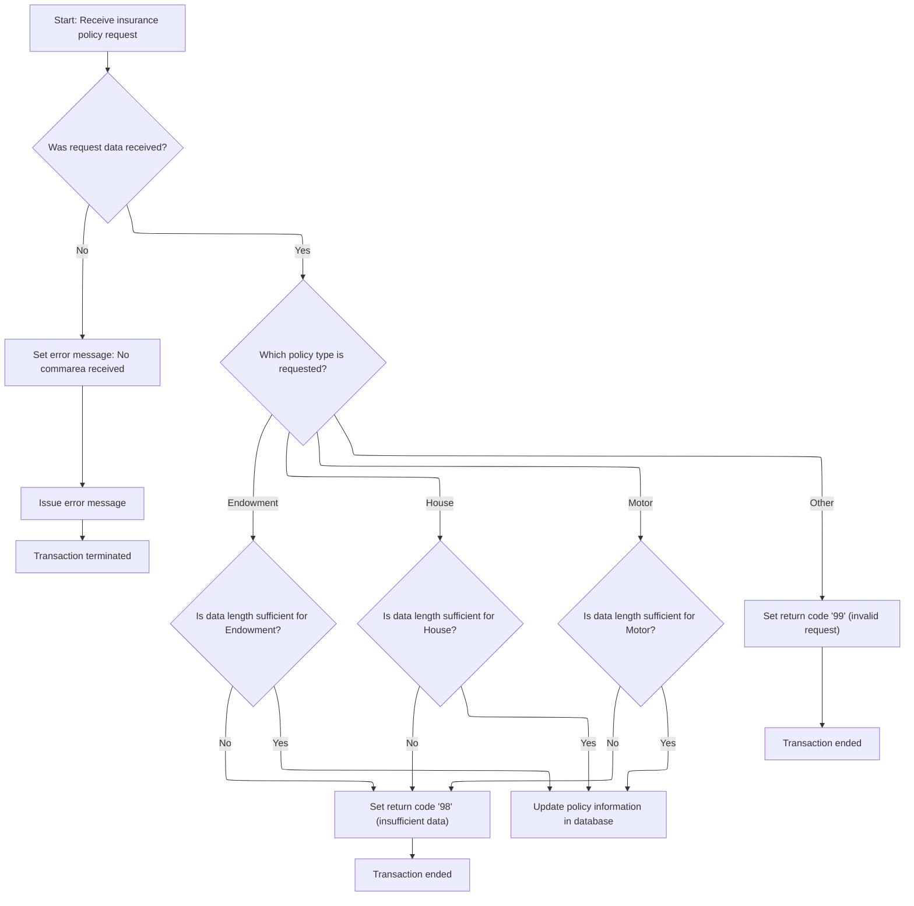
```mermaid
%%{init: {"flowchart": {"defaultRenderer": "elk"}} }%%
flowchart TD
  node1["Start: Receive insurance policy request"]
  click node1 openCode "base/src/lgupol01.cbl:83:98"
  node1 --> node2{"Was request data received?"}
  click node2 openCode "base/src/lgupol01.cbl:99:103"
  node2 -->|"No"| node3["Set error message: No commarea received"]
  click node3 openCode "base/src/lgupol01.cbl:100:101"
  node3 --> node4["Issue error message"]
  click node4 openCode "base/src/lgupol01.cbl:101:102"
  node4 --> node5["Transaction terminated"]
  click node5 openCode "base/src/lgupol01.cbl:102:103"
  node2 -->|"Yes"| node6{"Which policy type is requested?"}
  click node6 openCode "base/src/lgupol01.cbl:113:141"
  node6 -->|"Endowment"| node7{"Is data length sufficient for Endowment?"}
  click node7 openCode "base/src/lgupol01.cbl:115:121"
  node7 -->|"No"| node8["Set return code '98' (insufficient data)"]
  click node8 openCode "base/src/lgupol01.cbl:119:120"
  node8 --> node9["Transaction ended"]
  click node9 openCode "base/src/lgupol01.cbl:120:121"
  node7 -->|"Yes"| node13["Update policy information in database"]
  click node13 openCode "base/src/lgupol01.cbl:143:143"
  node6 -->|"House"| node10{"Is data length sufficient for House?"}
  click node10 openCode "base/src/lgupol01.cbl:123:129"
  node10 -->|"No"| node8
  node10 -->|"Yes"| node13
  node6 -->|"Motor"| node11{"Is data length sufficient for Motor?"}
  click node11 openCode "base/src/lgupol01.cbl:131:137"
  node11 -->|"No"| node8
  node11 -->|"Yes"| node13
  node6 -->|"Other"| node12["Set return code '99' (invalid request)"]
  click node12 openCode "base/src/lgupol01.cbl:139:140"
  node12 --> node14["Transaction ended"]
  click node14 openCode "base/src/lgupol01.cbl:140:141"

classDef HeadingStyle fill:#777777,stroke:#333,stroke-width:2px;

%% Swimm:
%% %%{init: {"flowchart": {"defaultRenderer": "elk"}} }%%
%% flowchart TD
%%   node1["Start: Receive insurance policy request"]
%%   click node1 openCode "<SwmPath>[base/src/lgupol01.cbl](base/src/lgupol01.cbl)</SwmPath>:83:98"
%%   node1 --> node2{"Was request data received?"}
%%   click node2 openCode "<SwmPath>[base/src/lgupol01.cbl](base/src/lgupol01.cbl)</SwmPath>:99:103"
%%   node2 -->|"No"| node3["Set error message: No commarea received"]
%%   click node3 openCode "<SwmPath>[base/src/lgupol01.cbl](base/src/lgupol01.cbl)</SwmPath>:100:101"
%%   node3 --> node4["Issue error message"]
%%   click node4 openCode "<SwmPath>[base/src/lgupol01.cbl](base/src/lgupol01.cbl)</SwmPath>:101:102"
%%   node4 --> node5["Transaction terminated"]
%%   click node5 openCode "<SwmPath>[base/src/lgupol01.cbl](base/src/lgupol01.cbl)</SwmPath>:102:103"
%%   node2 -->|"Yes"| node6{"Which policy type is requested?"}
%%   click node6 openCode "<SwmPath>[base/src/lgupol01.cbl](base/src/lgupol01.cbl)</SwmPath>:113:141"
%%   node6 -->|"Endowment"| node7{"Is data length sufficient for Endowment?"}
%%   click node7 openCode "<SwmPath>[base/src/lgupol01.cbl](base/src/lgupol01.cbl)</SwmPath>:115:121"
%%   node7 -->|"No"| node8["Set return code '98' (insufficient data)"]
%%   click node8 openCode "<SwmPath>[base/src/lgupol01.cbl](base/src/lgupol01.cbl)</SwmPath>:119:120"
%%   node8 --> node9["Transaction ended"]
%%   click node9 openCode "<SwmPath>[base/src/lgupol01.cbl](base/src/lgupol01.cbl)</SwmPath>:120:121"
%%   node7 -->|"Yes"| node13["Update policy information in database"]
%%   click node13 openCode "<SwmPath>[base/src/lgupol01.cbl](base/src/lgupol01.cbl)</SwmPath>:143:143"
%%   node6 -->|"House"| node10{"Is data length sufficient for House?"}
%%   click node10 openCode "<SwmPath>[base/src/lgupol01.cbl](base/src/lgupol01.cbl)</SwmPath>:123:129"
%%   node10 -->|"No"| node8
%%   node10 -->|"Yes"| node13
%%   node6 -->|"Motor"| node11{"Is data length sufficient for Motor?"}
%%   click node11 openCode "<SwmPath>[base/src/lgupol01.cbl](base/src/lgupol01.cbl)</SwmPath>:131:137"
%%   node11 -->|"No"| node8
%%   node11 -->|"Yes"| node13
%%   node6 -->|"Other"| node12["Set return code '99' (invalid request)"]
%%   click node12 openCode "<SwmPath>[base/src/lgupol01.cbl](base/src/lgupol01.cbl)</SwmPath>:139:140"
%%   node12 --> node14["Transaction ended"]
%%   click node14 openCode "<SwmPath>[base/src/lgupol01.cbl](base/src/lgupol01.cbl)</SwmPath>:140:141"
%% 
%% classDef HeadingStyle fill:#777777,stroke:#333,stroke-width:2px;
```

This section governs the validation and routing of incoming insurance policy update requests, ensuring only valid and sufficiently detailed requests are processed, while invalid or incomplete requests are rejected with clear error codes and logging.

| Category        | Rule Name                           | Description                                                                                                                                                                                                                                                                                          |
| --------------- | ----------------------------------- | ---------------------------------------------------------------------------------------------------------------------------------------------------------------------------------------------------------------------------------------------------------------------------------------------------- |
| Data validation | Missing request data                | If no request data (commarea) is received, the request must be rejected, an error message 'NO COMMAREA RECEIVED' must be logged, and the transaction must be terminated with an error code.                                                                                                          |
| Data validation | Supported policy types only         | The policy type in the request must be one of the supported types: Endowment, House, or Motor. Any other policy type must result in an error with return code '99' (invalid request).                                                                                                                |
| Data validation | Minimum data length per policy type | For each supported policy type, the request data length must be at least the sum of the commarea header length (28 bytes) and the full policy data length (Endowment: 124 bytes, House: 130 bytes, Motor: 137 bytes). Requests with insufficient data length must be rejected with return code '98'. |
| Business logic  | Route valid requests only           | Only requests that pass all validation checks (supported policy type and sufficient data length) are routed to the policy update logic for further processing.                                                                                                                                       |

<SwmSnippet path="/base/src/lgupol01.cbl" line="83">

---

MAINLINE checks the commarea, validates its length for the requested policy type, and either logs an error or routes to the update logic. Only valid requests get processed.

```cobol
       MAINLINE SECTION.

      *----------------------------------------------------------------*
      * Common code                                                    *
      *----------------------------------------------------------------*
      * initialize working storage variables
           INITIALIZE WS-HEADER.
      * set up general variable
           MOVE EIBTRNID TO WS-TRANSID.
           MOVE EIBTRMID TO WS-TERMID.
           MOVE EIBTASKN TO WS-TASKNUM.

      *----------------------------------------------------------------*
      * Check commarea and obtain required details                     *
      *----------------------------------------------------------------*
      * If NO commarea received issue an ABEND
           IF EIBCALEN IS EQUAL TO ZERO
               MOVE ' NO COMMAREA RECEIVED' TO EM-VARIABLE
               PERFORM WRITE-ERROR-MESSAGE
               EXEC CICS ABEND ABCODE('LGCA') NODUMP END-EXEC
           END-IF
      * initialize commarea return code to zero
           MOVE '00' TO CA-RETURN-CODE
           MOVE EIBCALEN TO WS-CALEN.
           SET WS-ADDR-DFHCOMMAREA TO ADDRESS OF DFHCOMMAREA.

      *----------------------------------------------------------------*
      * Check which policy type is being requested                     *
      *   and chec commarea length                                     *
      *----------------------------------------------------------------*
           EVALUATE CA-REQUEST-ID

             WHEN '01UEND'
               ADD WS-CA-HEADER-LEN  TO WS-REQUIRED-CA-LEN
               ADD WS-FULL-ENDOW-LEN TO WS-REQUIRED-CA-LEN
               IF EIBCALEN IS LESS THAN WS-REQUIRED-CA-LEN
                 MOVE '98' TO CA-RETURN-CODE
                 EXEC CICS RETURN END-EXEC
               END-IF

             WHEN '01UHOU'
               ADD WS-CA-HEADER-LEN  TO WS-REQUIRED-CA-LEN
               ADD WS-FULL-HOUSE-LEN TO WS-REQUIRED-CA-LEN
               IF EIBCALEN IS LESS THAN WS-REQUIRED-CA-LEN
                 MOVE '98' TO CA-RETURN-CODE
                 EXEC CICS RETURN END-EXEC
               END-IF

             WHEN '01UMOT'
               ADD WS-CA-HEADER-LEN  TO WS-REQUIRED-CA-LEN
               ADD WS-FULL-MOTOR-LEN TO WS-REQUIRED-CA-LEN
               IF EIBCALEN IS LESS THAN WS-REQUIRED-CA-LEN
                 MOVE '98' TO CA-RETURN-CODE
                 EXEC CICS RETURN END-EXEC
               END-IF

             WHEN OTHER
               MOVE '99' TO CA-RETURN-CODE
           END-EVALUATE

           PERFORM UPDATE-POLICY-DB2-INFO.
```

---

</SwmSnippet>

<SwmSnippet path="/base/src/lgupol01.cbl" line="169">

---

<SwmToken path="base/src/lgupol01.cbl" pos="169:1:5" line-data="       WRITE-ERROR-MESSAGE.">`WRITE-ERROR-MESSAGE`</SwmToken> logs the error details and a snapshot of the commarea to LGSTSQ. It formats the current time and date, writes the error message, and then conditionally logs up to 90 bytes of the commarea. This helps with debugging by capturing both the error and the input data.

```cobol
       WRITE-ERROR-MESSAGE.
      * Save SQLCODE in message
      * Obtain and format current time and date
           EXEC CICS ASKTIME ABSTIME(WS-ABSTIME)
           END-EXEC
           EXEC CICS FORMATTIME ABSTIME(WS-ABSTIME)
                     MMDDYYYY(WS-DATE)
                     TIME(WS-TIME)
           END-EXEC
           MOVE WS-DATE TO EM-DATE
           MOVE WS-TIME TO EM-TIME
      * Write output message to TDQ
           EXEC CICS LINK PROGRAM('LGSTSQ')
                     COMMAREA(ERROR-MSG)
                     LENGTH(LENGTH OF ERROR-MSG)
           END-EXEC.
      * Write 90 bytes or as much as we have of commarea to TDQ
           IF EIBCALEN > 0 THEN
             IF EIBCALEN < 91 THEN
               MOVE DFHCOMMAREA(1:EIBCALEN) TO CA-DATA
               EXEC CICS LINK PROGRAM('LGSTSQ')
                         COMMAREA(CA-ERROR-MSG)
                         LENGTH(LENGTH OF CA-ERROR-MSG)
               END-EXEC
             ELSE
               MOVE DFHCOMMAREA(1:90) TO CA-DATA
               EXEC CICS LINK PROGRAM('LGSTSQ')
                         COMMAREA(CA-ERROR-MSG)
                         LENGTH(LENGTH OF CA-ERROR-MSG)
               END-EXEC
             END-IF
           END-IF.
           EXIT.
```

---

</SwmSnippet>

<SwmSnippet path="/base/src/lgupol01.cbl" line="83">

---

We just returned from <SwmPath>[base/src/lgupol01.cbl](base/src/lgupol01.cbl)</SwmPath>, where the commarea was validated and the update logic was run. The function checked the request ID and commarea length, then either updated the policy or set an error code. The next step is to handle the result based on the return code.

```cobol
       MAINLINE SECTION.

      *----------------------------------------------------------------*
      * Common code                                                    *
      *----------------------------------------------------------------*
      * initialize working storage variables
           INITIALIZE WS-HEADER.
      * set up general variable
           MOVE EIBTRNID TO WS-TRANSID.
           MOVE EIBTRMID TO WS-TERMID.
           MOVE EIBTASKN TO WS-TASKNUM.

      *----------------------------------------------------------------*
      * Check commarea and obtain required details                     *
      *----------------------------------------------------------------*
      * If NO commarea received issue an ABEND
           IF EIBCALEN IS EQUAL TO ZERO
               MOVE ' NO COMMAREA RECEIVED' TO EM-VARIABLE
               PERFORM WRITE-ERROR-MESSAGE
               EXEC CICS ABEND ABCODE('LGCA') NODUMP END-EXEC
           END-IF
      * initialize commarea return code to zero
           MOVE '00' TO CA-RETURN-CODE
           MOVE EIBCALEN TO WS-CALEN.
           SET WS-ADDR-DFHCOMMAREA TO ADDRESS OF DFHCOMMAREA.

      *----------------------------------------------------------------*
      * Check which policy type is being requested                     *
      *   and chec commarea length                                     *
      *----------------------------------------------------------------*
           EVALUATE CA-REQUEST-ID

             WHEN '01UEND'
               ADD WS-CA-HEADER-LEN  TO WS-REQUIRED-CA-LEN
               ADD WS-FULL-ENDOW-LEN TO WS-REQUIRED-CA-LEN
               IF EIBCALEN IS LESS THAN WS-REQUIRED-CA-LEN
                 MOVE '98' TO CA-RETURN-CODE
                 EXEC CICS RETURN END-EXEC
               END-IF

             WHEN '01UHOU'
               ADD WS-CA-HEADER-LEN  TO WS-REQUIRED-CA-LEN
               ADD WS-FULL-HOUSE-LEN TO WS-REQUIRED-CA-LEN
               IF EIBCALEN IS LESS THAN WS-REQUIRED-CA-LEN
                 MOVE '98' TO CA-RETURN-CODE
                 EXEC CICS RETURN END-EXEC
               END-IF

             WHEN '01UMOT'
               ADD WS-CA-HEADER-LEN  TO WS-REQUIRED-CA-LEN
               ADD WS-FULL-MOTOR-LEN TO WS-REQUIRED-CA-LEN
               IF EIBCALEN IS LESS THAN WS-REQUIRED-CA-LEN
                 MOVE '98' TO CA-RETURN-CODE
                 EXEC CICS RETURN END-EXEC
               END-IF

             WHEN OTHER
               MOVE '99' TO CA-RETURN-CODE
           END-EVALUATE

           PERFORM UPDATE-POLICY-DB2-INFO.
```

---

</SwmSnippet>

## Triggering the <SwmToken path="base/src/lgipdb01.cbl" pos="242:5:5" line-data="      * initialize DB2 host variables">`DB2`</SwmToken> Policy Update

This section is responsible for initiating the update of an insurance policy record in the <SwmToken path="base/src/lgipdb01.cbl" pos="242:5:5" line-data="      * initialize DB2 host variables">`DB2`</SwmToken> database, ensuring that any changes to policy details are accurately reflected in the system.

| Category        | Rule Name                        | Description                                                                                                                                                                                                                                                |
| --------------- | -------------------------------- | ---------------------------------------------------------------------------------------------------------------------------------------------------------------------------------------------------------------------------------------------------------- |
| Data validation | Valid policy identifier required | A policy update request must include a valid policy identifier to ensure the correct record is updated.                                                                                                                                                    |
| Data validation | Mandatory fields enforcement     | All mandatory policy fields must be present in the update request; missing required fields will result in the update being rejected.                                                                                                                       |
| Business logic  | Active policy update restriction | Policy updates must only be processed for policies that are currently active; updates to expired or cancelled policies are not permitted.                                                                                                                  |
| Business logic  | Immediate update reflection      | Successful policy updates must be immediately reflected in the <SwmToken path="base/src/lgipdb01.cbl" pos="242:5:5" line-data="      * initialize DB2 host variables">`DB2`</SwmToken> database to ensure downstream processes use the latest information. |

<SwmSnippet path="/base/src/lgupol01.cbl" line="155">

---

<SwmToken path="base/src/lgupol01.cbl" pos="155:1:7" line-data="       UPDATE-POLICY-DB2-INFO.">`UPDATE-POLICY-DB2-INFO`</SwmToken> just links to <SwmToken path="base/src/lgupol01.cbl" pos="157:9:9" line-data="           EXEC CICS LINK Program(LGUPDB01)">`LGUPDB01`</SwmToken>, passing the commarea for the actual <SwmToken path="base/src/lgupol01.cbl" pos="155:5:5" line-data="       UPDATE-POLICY-DB2-INFO.">`DB2`</SwmToken> update. <SwmToken path="base/src/lgupol01.cbl" pos="157:9:9" line-data="           EXEC CICS LINK Program(LGUPDB01)">`LGUPDB01`</SwmToken> handles all the database logic for updating the policy record.

```cobol
       UPDATE-POLICY-DB2-INFO.

           EXEC CICS LINK Program(LGUPDB01)
                Commarea(DFHCOMMAREA)
                LENGTH(32500)
           END-EXEC.

           EXIT.
```

---

</SwmSnippet>

## Validating and Executing <SwmToken path="base/src/lgipdb01.cbl" pos="242:5:5" line-data="      * initialize DB2 host variables">`DB2`</SwmToken> Policy Updates

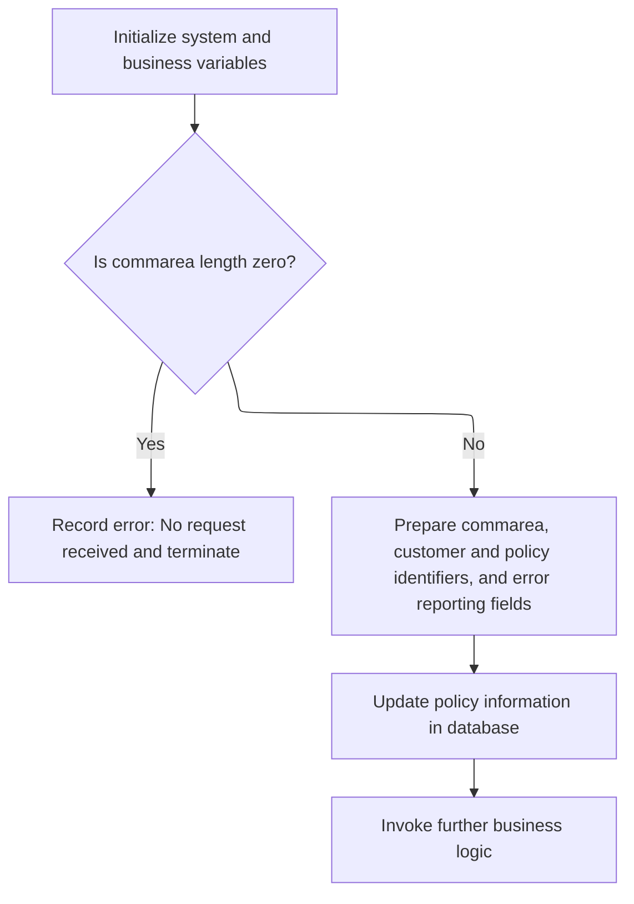
```mermaid
%%{init: {"flowchart": {"defaultRenderer": "elk"}} }%%
flowchart TD
    node1["Initialize system and business variables"] --> node2{"Is commarea length zero?"}
    click node1 openCode "base/src/lgupdb01.cbl:162:178"
    node2 -->|"Yes"| node3["Record error: No request received and terminate"]
    click node2 openCode "base/src/lgupdb01.cbl:183:187"
    click node3 openCode "base/src/lgupdb01.cbl:184:186"
    node2 -->|"No"| node4["Prepare commarea, customer and policy identifiers, and error reporting fields"]
    click node4 openCode "base/src/lgupdb01.cbl:190:200"
    node4 --> node5["Update policy information in database"]
    click node5 openCode "base/src/lgupdb01.cbl:207:207"
    node5 --> node6["Invoke further business logic"]
    click node6 openCode "base/src/lgupdb01.cbl:209:212"
classDef HeadingStyle fill:#777777,stroke:#333,stroke-width:2px;

%% Swimm:
%% %%{init: {"flowchart": {"defaultRenderer": "elk"}} }%%
%% flowchart TD
%%     node1["Initialize system and business variables"] --> node2{"Is commarea length zero?"}
%%     click node1 openCode "<SwmPath>[base/src/lgupdb01.cbl](base/src/lgupdb01.cbl)</SwmPath>:162:178"
%%     node2 -->|"Yes"| node3["Record error: No request received and terminate"]
%%     click node2 openCode "<SwmPath>[base/src/lgupdb01.cbl](base/src/lgupdb01.cbl)</SwmPath>:183:187"
%%     click node3 openCode "<SwmPath>[base/src/lgupdb01.cbl](base/src/lgupdb01.cbl)</SwmPath>:184:186"
%%     node2 -->|"No"| node4["Prepare commarea, customer and policy identifiers, and error reporting fields"]
%%     click node4 openCode "<SwmPath>[base/src/lgupdb01.cbl](base/src/lgupdb01.cbl)</SwmPath>:190:200"
%%     node4 --> node5["Update policy information in database"]
%%     click node5 openCode "<SwmPath>[base/src/lgupdb01.cbl](base/src/lgupdb01.cbl)</SwmPath>:207:207"
%%     node5 --> node6["Invoke further business logic"]
%%     click node6 openCode "<SwmPath>[base/src/lgupdb01.cbl](base/src/lgupdb01.cbl)</SwmPath>:209:212"
%% classDef HeadingStyle fill:#777777,stroke:#333,stroke-width:2px;
```

This section governs the validation and execution of insurance policy updates in the <SwmToken path="base/src/lgipdb01.cbl" pos="242:5:5" line-data="      * initialize DB2 host variables">`DB2`</SwmToken> database. It ensures that incoming requests are valid, processes policy data, and manages error reporting and logging for failed updates.

| Category        | Rule Name                         | Description                                                                                                                                                                                                                                             |
| --------------- | --------------------------------- | ------------------------------------------------------------------------------------------------------------------------------------------------------------------------------------------------------------------------------------------------------- |
| Data validation | Identifier validation and mapping | Customer and policy identifiers from the request must be validated and mapped to <SwmToken path="base/src/lgipdb01.cbl" pos="242:5:5" line-data="      * initialize DB2 host variables">`DB2`</SwmToken> integer types before any update is performed.  |
| Business logic  | Policy update enforcement         | All policy updates must be recorded in the <SwmToken path="base/src/lgipdb01.cbl" pos="242:5:5" line-data="      * initialize DB2 host variables">`DB2`</SwmToken> database using the provided customer and policy identifiers.                         |
| Business logic  | VSAM consistency trigger          | After a successful <SwmToken path="base/src/lgipdb01.cbl" pos="242:5:5" line-data="      * initialize DB2 host variables">`DB2`</SwmToken> update, the system must trigger further updates to the VSAM file to maintain consistency across data stores. |

<SwmSnippet path="/base/src/lgupdb01.cbl" line="162">

---

MAINLINE in <SwmPath>[base/src/lgupdb01.cbl](base/src/lgupdb01.cbl)</SwmPath> validates the commarea, sets up <SwmToken path="base/src/lgupdb01.cbl" pos="175:5:5" line-data="      * initialize DB2 host variables">`DB2`</SwmToken> host variables, and runs the update logic. After updating the <SwmToken path="base/src/lgupdb01.cbl" pos="175:5:5" line-data="      * initialize DB2 host variables">`DB2`</SwmToken> record, it links to <SwmToken path="base/src/lgupdb01.cbl" pos="209:9:9" line-data="           EXEC CICS LINK Program(LGUPVS01)">`LGUPVS01`</SwmToken> to update the VSAM file for the policy.

```cobol
       MAINLINE SECTION.

      *----------------------------------------------------------------*
      * Common code                                                    *
      *----------------------------------------------------------------*
      * initialize working storage variables
           INITIALIZE WS-HEADER.
      * set up general variable
           MOVE EIBTRNID TO WS-TRANSID.
           MOVE EIBTRMID TO WS-TERMID.
           MOVE EIBTASKN TO WS-TASKNUM.
           MOVE SPACES   TO WS-RETRY.
      *----------------------------------------------------------------*
      * initialize DB2 host variables
           INITIALIZE DB2-POLICY.
           INITIALIZE DB2-IN-INTEGERS.

      *----------------------------------------------------------------*
      * Check commarea and obtain required details                     *
      *----------------------------------------------------------------*
      * If NO commarea received issue an ABEND
           IF EIBCALEN IS EQUAL TO ZERO
               MOVE ' NO COMMAREA RECEIVED' TO EM-VARIABLE
               PERFORM WRITE-ERROR-MESSAGE
               EXEC CICS ABEND ABCODE('LGCA') NODUMP END-EXEC
           END-IF

      * initialize commarea return code to zero
           MOVE '00' TO CA-RETURN-CODE
           MOVE EIBCALEN TO WS-CALEN.
           SET WS-ADDR-DFHCOMMAREA TO ADDRESS OF DFHCOMMAREA.

      * Convert commarea customer & policy nums to DB2 integer format
           MOVE CA-CUSTOMER-NUM TO DB2-CUSTOMERNUM-INT
           MOVE CA-POLICY-NUM   TO DB2-POLICYNUM-INT
      * and save in error msg field incase required
           MOVE CA-CUSTOMER-NUM TO EM-CUSNUM
           MOVE CA-POLICY-NUM   TO EM-POLNUM

      *----------------------------------------------------------------*
      * Check which policy type is being requested                     *
      *   and check commarea length                                    *
      *----------------------------------------------------------------*

      *    Call procedure to update required tables
           PERFORM UPDATE-POLICY-DB2-INFO.

           EXEC CICS LINK Program(LGUPVS01)
                Commarea(DFHCOMMAREA)
                LENGTH(225)
           END-EXEC.
```

---

</SwmSnippet>

<SwmSnippet path="/base/src/lgupdb01.cbl" line="502">

---

<SwmToken path="base/src/lgupdb01.cbl" pos="502:1:5" line-data="       WRITE-ERROR-MESSAGE.">`WRITE-ERROR-MESSAGE`</SwmToken> logs the SQL error and a snapshot of the commarea to LGSTSQ. It timestamps the error, writes the message, and then conditionally logs up to 90 bytes of the commarea for debugging.

```cobol
       WRITE-ERROR-MESSAGE.
      * Save SQLCODE in message
           MOVE SQLCODE TO EM-SQLRC
      * Obtain and format current time and date
           EXEC CICS ASKTIME ABSTIME(WS-ABSTIME)
           END-EXEC
           EXEC CICS FORMATTIME ABSTIME(WS-ABSTIME)
                     MMDDYYYY(WS-DATE)
                     TIME(WS-TIME)
           END-EXEC
           MOVE WS-DATE TO EM-DATE
           MOVE WS-TIME TO EM-TIME
      * Write output message to TDQ
           EXEC CICS LINK PROGRAM('LGSTSQ')
                     COMMAREA(ERROR-MSG)
                     LENGTH(LENGTH OF ERROR-MSG)
           END-EXEC.
      * Write 90 bytes or as much as we have of commarea to TDQ
           IF EIBCALEN > 0 THEN
             IF EIBCALEN < 91 THEN
               MOVE DFHCOMMAREA(1:EIBCALEN) TO CA-DATA
               EXEC CICS LINK PROGRAM('LGSTSQ')
                         COMMAREA(CA-ERROR-MSG)
                         LENGTH(LENGTH OF CA-ERROR-MSG)
               END-EXEC
             ELSE
               MOVE DFHCOMMAREA(1:90) TO CA-DATA
               EXEC CICS LINK PROGRAM('LGSTSQ')
                         COMMAREA(CA-ERROR-MSG)
                         LENGTH(LENGTH OF CA-ERROR-MSG)
               END-EXEC
             END-IF
           END-IF.
           EXIT.
```

---

</SwmSnippet>

## Running the <SwmToken path="base/src/lgipdb01.cbl" pos="242:5:5" line-data="      * initialize DB2 host variables">`DB2`</SwmToken> Update Workflow for Policy Types

```mermaid
%%{init: {"flowchart": {"defaultRenderer": "elk"}} }%%
flowchart TD
    node1["Fetch policy row from database"]
    click node1 openCode "base/src/lgupdb01.cbl:273:274"
    node1 --> node2{"Was policy found?"}
    click node2 openCode "base/src/lgupdb01.cbl:275:358"
    node2 -->|"Yes"| node3{"Do timestamps match?"}
    node2 -->|"No"| node10["Return: Policy not found (code '01')"]
    click node10 openCode "base/src/lgupdb01.cbl:351:352"
    node3 -->|"Yes"| node4{"Which policy type?"}
    click node3 openCode "base/src/lgupdb01.cbl:278:347"
    node3 -->|"No"| node11["Return: Policy changed elsewhere (code '02')"]
    click node11 openCode "base/src/lgupdb01.cbl:346:347"
    node4 -->|"Endowment"| node5["Update Endowment policy details"]
    click node5 openCode "base/src/lgupdb01.cbl:288:289"
    node4 -->|"House"| node6["Update House policy details"]
    click node6 openCode "base/src/lgupdb01.cbl:293:294"
    node4 -->|"Motor"| node7["Update Motor policy details"]
    click node7 openCode "base/src/lgupdb01.cbl:298:299"
    node5 --> node8{"Did type-specific update succeed?"}
    node6 --> node8
    node7 --> node8
    click node8 openCode "base/src/lgupdb01.cbl:302:307"
    node8 -->|"Yes (code '00')"| node9["Update main policy table"]
    click node9 openCode "base/src/lgupdb01.cbl:317:326"
    node8 -->|"No"| node13["Return: Update failed (code '90')"]
    click node13 openCode "base/src/lgupdb01.cbl:338:341"
    node9 --> node12{"Did main update succeed?"}
    click node12 openCode "base/src/lgupdb01.cbl:336:342"
    node12 -->|"Yes"| node14["Return: Success (code '00')"]
    click node14 openCode "base/src/lgupdb01.cbl:329:334"
    node12 -->|"No"| node13
    node14 --> node15["Close cursor"]
    click node15 openCode "base/src/lgupdb01.cbl:360:360"
    node13 --> node15
    node10 --> node15
    node11 --> node15
classDef HeadingStyle fill:#777777,stroke:#333,stroke-width:2px;

%% Swimm:
%% %%{init: {"flowchart": {"defaultRenderer": "elk"}} }%%
%% flowchart TD
%%     node1["Fetch policy row from database"]
%%     click node1 openCode "<SwmPath>[base/src/lgupdb01.cbl](base/src/lgupdb01.cbl)</SwmPath>:273:274"
%%     node1 --> node2{"Was policy found?"}
%%     click node2 openCode "<SwmPath>[base/src/lgupdb01.cbl](base/src/lgupdb01.cbl)</SwmPath>:275:358"
%%     node2 -->|"Yes"| node3{"Do timestamps match?"}
%%     node2 -->|"No"| node10["Return: Policy not found (code '01')"]
%%     click node10 openCode "<SwmPath>[base/src/lgupdb01.cbl](base/src/lgupdb01.cbl)</SwmPath>:351:352"
%%     node3 -->|"Yes"| node4{"Which policy type?"}
%%     click node3 openCode "<SwmPath>[base/src/lgupdb01.cbl](base/src/lgupdb01.cbl)</SwmPath>:278:347"
%%     node3 -->|"No"| node11["Return: Policy changed elsewhere (code '02')"]
%%     click node11 openCode "<SwmPath>[base/src/lgupdb01.cbl](base/src/lgupdb01.cbl)</SwmPath>:346:347"
%%     node4 -->|"Endowment"| node5["Update Endowment policy details"]
%%     click node5 openCode "<SwmPath>[base/src/lgupdb01.cbl](base/src/lgupdb01.cbl)</SwmPath>:288:289"
%%     node4 -->|"House"| node6["Update House policy details"]
%%     click node6 openCode "<SwmPath>[base/src/lgupdb01.cbl](base/src/lgupdb01.cbl)</SwmPath>:293:294"
%%     node4 -->|"Motor"| node7["Update Motor policy details"]
%%     click node7 openCode "<SwmPath>[base/src/lgupdb01.cbl](base/src/lgupdb01.cbl)</SwmPath>:298:299"
%%     node5 --> node8{"Did type-specific update succeed?"}
%%     node6 --> node8
%%     node7 --> node8
%%     click node8 openCode "<SwmPath>[base/src/lgupdb01.cbl](base/src/lgupdb01.cbl)</SwmPath>:302:307"
%%     node8 -->|"Yes (code '00')"| node9["Update main policy table"]
%%     click node9 openCode "<SwmPath>[base/src/lgupdb01.cbl](base/src/lgupdb01.cbl)</SwmPath>:317:326"
%%     node8 -->|"No"| node13["Return: Update failed (code '90')"]
%%     click node13 openCode "<SwmPath>[base/src/lgupdb01.cbl](base/src/lgupdb01.cbl)</SwmPath>:338:341"
%%     node9 --> node12{"Did main update succeed?"}
%%     click node12 openCode "<SwmPath>[base/src/lgupdb01.cbl](base/src/lgupdb01.cbl)</SwmPath>:336:342"
%%     node12 -->|"Yes"| node14["Return: Success (code '00')"]
%%     click node14 openCode "<SwmPath>[base/src/lgupdb01.cbl](base/src/lgupdb01.cbl)</SwmPath>:329:334"
%%     node12 -->|"No"| node13
%%     node14 --> node15["Close cursor"]
%%     click node15 openCode "<SwmPath>[base/src/lgupdb01.cbl](base/src/lgupdb01.cbl)</SwmPath>:360:360"
%%     node13 --> node15
%%     node10 --> node15
%%     node11 --> node15
%% classDef HeadingStyle fill:#777777,stroke:#333,stroke-width:2px;
```

This section governs how insurance policy updates are processed for different policy types, ensuring data integrity, concurrency control, and appropriate error handling. It determines the business outcomes and return codes for each possible scenario in the update workflow.

| Category        | Rule Name                      | Description                                                                                                                                                                           |
| --------------- | ------------------------------ | ------------------------------------------------------------------------------------------------------------------------------------------------------------------------------------- |
| Data validation | Policy existence check         | If the requested policy is not found in the database, the update operation must return a 'not found' code ('01') and no changes are made.                                             |
| Data validation | Concurrency control            | If the policy's last changed timestamp in the request does not match the database, the update operation must return a 'policy changed elsewhere' code ('02') and no changes are made. |
| Business logic  | Policy type routing            | The update operation must route to the correct policy type update (Endowment, House, or Motor) based on the policy type specified in the request.                                     |
| Business logic  | Successful update confirmation | If all updates succeed, the operation must return a success code ('00') and provide the updated timestamp in the response.                                                            |

<SwmSnippet path="/base/src/lgupdb01.cbl" line="251">

---

<SwmToken path="base/src/lgupdb01.cbl" pos="251:1:7" line-data="       UPDATE-POLICY-DB2-INFO.">`UPDATE-POLICY-DB2-INFO`</SwmToken> opens a cursor, fetches the policy, checks timestamps for concurrency, and then routes to the right update routine for endowment, house, or motor. If anything fails, it logs the error and rolls back. After updating, it closes the cursor.

```cobol
       UPDATE-POLICY-DB2-INFO.

      *    Open the cursor.
           MOVE ' OPEN   PCURSOR ' TO EM-SQLREQ
           EXEC SQL
             OPEN POLICY_CURSOR
           END-EXEC

           Evaluate SQLCODE
             When 0
               MOVE '00' TO CA-RETURN-CODE
             When -913
               MOVE '90' TO CA-RETURN-CODE
               PERFORM WRITE-ERROR-MESSAGE
               EXEC CICS RETURN END-EXEC
             When Other
               MOVE '90' TO CA-RETURN-CODE
               PERFORM WRITE-ERROR-MESSAGE
               EXEC CICS RETURN END-EXEC
           END-Evaluate.

      *    Fetch the first row (we only expect one matching row)
           PERFORM FETCH-DB2-POLICY-ROW

           IF SQLCODE = 0
      *      Fetch was successful
      *      Compare timestamp in commarea with that in DB2
             IF CA-LASTCHANGED EQUAL TO DB2-LASTCHANGED

      *----------------------------------------------------------------*
      *      Select for Update and Update specific policy type table   *
      *----------------------------------------------------------------*
             EVALUATE CA-REQUEST-ID

      *** Endowment ***
               WHEN '01UEND'
      *          Call routine to update Endowment table
                 PERFORM UPDATE-ENDOW-DB2-INFO

      *** House ***
               WHEN '01UHOU'
      *          Call routine to update Housetable
                 PERFORM UPDATE-HOUSE-DB2-INFO

      *** Motor ***
               WHEN '01UMOT'
      *          Call routine to update Motor table
                 PERFORM UPDATE-MOTOR-DB2-INFO

             END-EVALUATE
      *----------------------------------------------------------------*
              IF CA-RETURN-CODE NOT EQUAL '00'
      *         Update policy type specific table has failed
      *         So close cursor and return
                PERFORM CLOSE-PCURSOR
                EXEC CICS RETURN END-EXEC
              END-IF

      *----------------------------------------------------------------*
      *        Now update Policy table and set new timestamp           *
      *----------------------------------------------------------------*
      *        Move numeric commarea fields to integer format
               MOVE CA-BROKERID      TO DB2-BROKERID-INT
               MOVE CA-PAYMENT       TO DB2-PAYMENT-INT

      *        Update policy table details
               MOVE ' UPDATE POLICY  ' TO EM-SQLREQ
               EXEC SQL
                 UPDATE POLICY
                   SET ISSUEDATE        = :CA-ISSUE-DATE,
                       EXPIRYDATE       = :CA-EXPIRY-DATE,
                       LASTCHANGED      = CURRENT TIMESTAMP ,
                       BROKERID         = :DB2-BROKERID-INT,
                       BROKERSREFERENCE = :CA-BROKERSREF
                   WHERE CURRENT OF POLICY_CURSOR
               END-EXEC

      *        get value of assigned Timestamp for return in commarea
               EXEC SQL
                 SELECT LASTCHANGED
                   INTO :CA-LASTCHANGED
                   FROM POLICY
                   WHERE POLICYNUMBER = :DB2-POLICYNUM-INT
               END-EXEC

               IF SQLCODE NOT EQUAL 0
      *          Non-zero SQLCODE from Update of policy table
                   EXEC CICS SYNCPOINT ROLLBACK END-EXEC
                   MOVE '90' TO CA-RETURN-CODE
      *            Write error message to TD QUEUE(CSMT)
                   PERFORM WRITE-ERROR-MESSAGE
               END-IF

             ELSE
      *        Timestamps do not match (policy table v commarea)
               MOVE '02' TO CA-RETURN-CODE
             END-IF

           ELSE
      *      Non-zero SQLCODE from first SQL FETCH statement
             IF SQLCODE EQUAL 100
               MOVE '01' TO CA-RETURN-CODE
             ELSE
               MOVE '90' TO CA-RETURN-CODE
      *        Write error message to TD QUEUE(CSMT)
               PERFORM WRITE-ERROR-MESSAGE
             END-IF
           END-IF.
      *    Now close the Cursor and we're done!
           PERFORM CLOSE-PCURSOR.
```

---

</SwmSnippet>

<SwmSnippet path="/base/src/lgupdb01.cbl" line="387">

---

<SwmToken path="base/src/lgupdb01.cbl" pos="387:1:7" line-data="       UPDATE-ENDOW-DB2-INFO.">`UPDATE-ENDOW-DB2-INFO`</SwmToken> updates the endowment policy table using mapped integer fields from the commarea. If the update fails, it sets return code '01' for not found or '90' for other errors, and logs the error for troubleshooting.

```cobol
       UPDATE-ENDOW-DB2-INFO.

      *    Move numeric commarea fields to DB2 Integer formats
           MOVE CA-E-TERM        TO DB2-E-TERM-SINT
           MOVE CA-E-SUM-ASSURED TO DB2-E-SUMASSURED-INT

           MOVE ' UPDATE ENDOW ' TO EM-SQLREQ
           EXEC SQL
             UPDATE ENDOWMENT
               SET
                 WITHPROFITS   = :CA-E-WITH-PROFITS,
                   EQUITIES    = :CA-E-EQUITIES,
                   MANAGEDFUND = :CA-E-MANAGED-FUND,
                   FUNDNAME    = :CA-E-FUND-NAME,
                   TERM        = :DB2-E-TERM-SINT,
                   SUMASSURED  = :DB2-E-SUMASSURED-INT,
                   LIFEASSURED = :CA-E-LIFE-ASSURED
               WHERE
                   POLICYNUMBER = :DB2-POLICYNUM-INT
           END-EXEC

           IF SQLCODE NOT EQUAL 0
      *      Non-zero SQLCODE from UPDATE statement
             IF SQLCODE EQUAL 100
               MOVE '01' TO CA-RETURN-CODE
             ELSE
               MOVE '90' TO CA-RETURN-CODE
      *        Write error message to TD QUEUE(CSMT)
               PERFORM WRITE-ERROR-MESSAGE
             END-IF
           END-IF.
           EXIT.
```

---

</SwmSnippet>

<SwmSnippet path="/base/src/lgupdb01.cbl" line="424">

---

<SwmToken path="base/src/lgupdb01.cbl" pos="424:1:7" line-data="       UPDATE-HOUSE-DB2-INFO.">`UPDATE-HOUSE-DB2-INFO`</SwmToken> updates the house policy table using mapped integer fields from the commarea. If the update fails, it sets return code '01' for not found or '90' for SQL errors, and logs the error for diagnostics.

```cobol
       UPDATE-HOUSE-DB2-INFO.

      *    Move numeric commarea fields to DB2 Integer formats
           MOVE CA-H-BEDROOMS    TO DB2-H-BEDROOMS-SINT
           MOVE CA-H-VALUE       TO DB2-H-VALUE-INT

           MOVE ' UPDATE HOUSE ' TO EM-SQLREQ
           EXEC SQL
             UPDATE HOUSE
               SET
                    PROPERTYTYPE = :CA-H-PROPERTY-TYPE,
                    BEDROOMS     = :DB2-H-BEDROOMS-SINT,
                    VALUE        = :DB2-H-VALUE-INT,
                    HOUSENAME    = :CA-H-HOUSE-NAME,
                    HOUSENUMBER  = :CA-H-HOUSE-NUMBER,
                    POSTCODE     = :CA-H-POSTCODE
               WHERE
                    POLICYNUMBER = :DB2-POLICYNUM-INT
           END-EXEC

           IF SQLCODE NOT EQUAL 0
      *      Non-zero SQLCODE from UPDATE statement
             IF SQLCODE = 100
               MOVE '01' TO CA-RETURN-CODE
             ELSE
               MOVE '90' TO CA-RETURN-CODE
      *        Write error message to TD QUEUE(CSMT)
               PERFORM WRITE-ERROR-MESSAGE
             END-IF
           END-IF.
           EXIT.
```

---

</SwmSnippet>

<SwmSnippet path="/base/src/lgupdb01.cbl" line="460">

---

<SwmToken path="base/src/lgupdb01.cbl" pos="460:1:7" line-data="       UPDATE-MOTOR-DB2-INFO.">`UPDATE-MOTOR-DB2-INFO`</SwmToken> updates the motor policy table using mapped integer fields from the commarea. If the update fails, it sets return code '01' for not found or '90' for SQL errors, and logs the error for diagnostics.

```cobol
       UPDATE-MOTOR-DB2-INFO.

      *    Move numeric commarea fields to DB2 Integer formats
           MOVE CA-M-CC          TO DB2-M-CC-SINT
           MOVE CA-M-VALUE       TO DB2-M-VALUE-INT
           MOVE CA-M-PREMIUM     TO DB2-M-PREMIUM-INT
           MOVE CA-M-ACCIDENTS   TO DB2-M-ACCIDENTS-INT

           MOVE ' UPDATE MOTOR ' TO EM-SQLREQ
           EXEC SQL
             UPDATE MOTOR
               SET
                    MAKE              = :CA-M-MAKE,
                    MODEL             = :CA-M-MODEL,
                    VALUE             = :DB2-M-VALUE-INT,
                    REGNUMBER         = :CA-M-REGNUMBER,
                    COLOUR            = :CA-M-COLOUR,
                    CC                = :DB2-M-CC-SINT,
                    YEAROFMANUFACTURE = :CA-M-MANUFACTURED,
                    PREMIUM           = :DB2-M-PREMIUM-INT,
                    ACCIDENTS         = :DB2-M-ACCIDENTS-INT
               WHERE
                    POLICYNUMBER      = :DB2-POLICYNUM-INT
           END-EXEC

           IF SQLCODE NOT EQUAL 0
      *      Non-zero SQLCODE from UPDATE statement
             IF SQLCODE EQUAL 100
               MOVE '01' TO CA-RETURN-CODE
             ELSE
               MOVE '90' TO CA-RETURN-CODE
      *        Write error message to TD QUEUE(CSMT)
               PERFORM WRITE-ERROR-MESSAGE
             END-IF
           END-IF.
           EXIT.
```

---

</SwmSnippet>

<SwmSnippet path="/base/src/lgupdb01.cbl" line="362">

---

<SwmToken path="base/src/lgupdb01.cbl" pos="362:1:3" line-data="       CLOSE-PCURSOR.">`CLOSE-PCURSOR`</SwmToken> closes the <SwmToken path="base/src/lgipdb01.cbl" pos="242:5:5" line-data="      * initialize DB2 host variables">`DB2`</SwmToken> cursor after the update. If closing fails, it logs the error and sets a return code; otherwise, it just exits cleanly.

```cobol
       CLOSE-PCURSOR.
      *    Now close the Cursor and we're done!
           MOVE ' CLOSE  PCURSOR' TO EM-SQLREQ
           EXEC SQL
             CLOSE POLICY_CURSOR
           END-EXEC.

           Evaluate SQLCODE
             When 0
               MOVE '00' TO CA-RETURN-CODE
             When -501
               MOVE '00' TO CA-RETURN-CODE
               MOVE '-501 detected c' TO EM-SQLREQ
               EXEC CICS RETURN END-EXEC
             When Other
               MOVE '90' TO CA-RETURN-CODE
               PERFORM WRITE-ERROR-MESSAGE
               EXEC CICS RETURN END-EXEC
           END-Evaluate.
           EXIT.
```

---

</SwmSnippet>

## Updating Policy Records in VSAM

```mermaid
%%{init: {"flowchart": {"defaultRenderer": "elk"}} }%%
flowchart TD
    node1["Receive insurance policy update request"] --> node2{"Request type?"}
    click node1 openCode "base/src/lgupvs01.cbl:97:106"
    node2 -->|"Customer ('C')"| node3["Update customer data"]
    click node2 openCode "base/src/lgupvs01.cbl:106:112"
    node2 -->|"Endowment ('E')"| node4["Update endowment data"]
    click node4 openCode "base/src/lgupvs01.cbl:113:119"
    node2 -->|"House ('H')"| node5["Update house data"]
    click node5 openCode "base/src/lgupvs01.cbl:120:126"
    node2 -->|"Motor ('M')"| node6["Update motor data"]
    click node6 openCode "base/src/lgupvs01.cbl:127:132"
    node2 -->|"Other"| node7["Clear policy data"]
    click node7 openCode "base/src/lgupvs01.cbl:133:134"
    node3 --> node8["Read and update policy record"]
    node4 --> node8
    node5 --> node8
    node6 --> node8
    node7 --> node8
    click node8 openCode "base/src/lgupvs01.cbl:137:159"
    node8 --> node9{"Was update successful?"}
    click node9 openCode "base/src/lgupvs01.cbl:160:166"
    node9 -->|"No"| node10["Log error, call WRITE-ERROR-MESSAGE, and abort"]
    click node10 openCode "base/src/lgupvs01.cbl:161:166"
    node9 -->|"Yes"| node11["End"]
    click node11 openCode "base/src/lgupvs01.cbl:166:166"
classDef HeadingStyle fill:#777777,stroke:#333,stroke-width:2px;

%% Swimm:
%% %%{init: {"flowchart": {"defaultRenderer": "elk"}} }%%
%% flowchart TD
%%     node1["Receive insurance policy update request"] --> node2{"Request type?"}
%%     click node1 openCode "<SwmPath>[base/src/lgupvs01.cbl](base/src/lgupvs01.cbl)</SwmPath>:97:106"
%%     node2 -->|"Customer ('C')"| node3["Update customer data"]
%%     click node2 openCode "<SwmPath>[base/src/lgupvs01.cbl](base/src/lgupvs01.cbl)</SwmPath>:106:112"
%%     node2 -->|"Endowment ('E')"| node4["Update endowment data"]
%%     click node4 openCode "<SwmPath>[base/src/lgupvs01.cbl](base/src/lgupvs01.cbl)</SwmPath>:113:119"
%%     node2 -->|"House ('H')"| node5["Update house data"]
%%     click node5 openCode "<SwmPath>[base/src/lgupvs01.cbl](base/src/lgupvs01.cbl)</SwmPath>:120:126"
%%     node2 -->|"Motor ('M')"| node6["Update motor data"]
%%     click node6 openCode "<SwmPath>[base/src/lgupvs01.cbl](base/src/lgupvs01.cbl)</SwmPath>:127:132"
%%     node2 -->|"Other"| node7["Clear policy data"]
%%     click node7 openCode "<SwmPath>[base/src/lgupvs01.cbl](base/src/lgupvs01.cbl)</SwmPath>:133:134"
%%     node3 --> node8["Read and update policy record"]
%%     node4 --> node8
%%     node5 --> node8
%%     node6 --> node8
%%     node7 --> node8
%%     click node8 openCode "<SwmPath>[base/src/lgupvs01.cbl](base/src/lgupvs01.cbl)</SwmPath>:137:159"
%%     node8 --> node9{"Was update successful?"}
%%     click node9 openCode "<SwmPath>[base/src/lgupvs01.cbl](base/src/lgupvs01.cbl)</SwmPath>:160:166"
%%     node9 -->|"No"| node10["Log error, call <SwmToken path="base/src/lgipol01.cbl" pos="81:3:7" line-data="               PERFORM WRITE-ERROR-MESSAGE">`WRITE-ERROR-MESSAGE`</SwmToken>, and abort"]
%%     click node10 openCode "<SwmPath>[base/src/lgupvs01.cbl](base/src/lgupvs01.cbl)</SwmPath>:161:166"
%%     node9 -->|"Yes"| node11["End"]
%%     click node11 openCode "<SwmPath>[base/src/lgupvs01.cbl](base/src/lgupvs01.cbl)</SwmPath>:166:166"
%% classDef HeadingStyle fill:#777777,stroke:#333,stroke-width:2px;
```

This section governs the business rules for updating insurance policy records in the VSAM KSDS file, ensuring that only valid updates are applied and errors are handled appropriately.

| Category        | Rule Name                      | Description                                                                                                                                                                            |
| --------------- | ------------------------------ | -------------------------------------------------------------------------------------------------------------------------------------------------------------------------------------- |
| Data validation | Read-before-update requirement | A policy record must be read from the VSAM KSDS file before any update is applied. If the record cannot be read successfully, the update must not proceed and an error must be logged. |
| Business logic  | Policy type-specific update    | When a policy update request is received, the system must identify the type of policy (Customer, Endowment, House, Motor, or Other) and only update the fields relevant to that type.  |
| Business logic  | Unknown policy type handling   | If the request type is not recognized (i.e., not Customer, Endowment, House, or Motor), all policy data must be cleared for that record.                                               |

<SwmSnippet path="/base/src/lgupvs01.cbl" line="97">

---

MAINLINE in <SwmPath>[base/src/lgupvs01.cbl](base/src/lgupvs01.cbl)</SwmPath> updates the VSAM KSDS file for the policy. It reads the record, updates fields based on the request type, and rewrites it. If anything fails, it logs the error and abends.

```cobol
       MAINLINE SECTION.
      *
      *---------------------------------------------------------------*
           Move EIBCALEN To WS-Commarea-Len.
      *---------------------------------------------------------------*
           Move CA-Request-ID(4:1) To WF-Request-ID
           Move CA-Policy-Num      To WF-Policy-Num
           Move CA-Customer-Num    To WF-Customer-Num

           Evaluate WF-Request-ID

             When 'C'
               Move CA-B-Postcode  To WF-B-Postcode
               Move CA-B-Status    To WF-B-Status
               Move CA-B-Customer  To WF-B-Customer

             When 'E'
               Move CA-E-WITH-PROFITS To  WF-E-WITH-PROFITS
               Move CA-E-EQUITIES     To  WF-E-EQUITIES
               Move CA-E-MANAGED-FUND To  WF-E-MANAGED-FUND
               Move CA-E-FUND-NAME    To  WF-E-FUND-NAME
               Move CA-E-LIFE-ASSURED To  WF-E-LIFE-ASSURED

             When 'H'
               Move CA-H-PROPERTY-TYPE To  WF-H-PROPERTY-TYPE
               Move CA-H-BEDROOMS      To  WF-H-BEDROOMS
               Move CA-H-VALUE         To  WF-H-VALUE
               Move CA-H-POSTCODE      To  WF-H-POSTCODE
               Move CA-H-HOUSE-NAME    To  WF-H-HOUSE-NAME

             When 'M'
               Move CA-M-MAKE          To  WF-M-MAKE
               Move CA-M-MODEL         To  WF-M-MODEL
               Move CA-M-VALUE         To  WF-M-VALUE
               Move CA-M-REGNUMBER     To  WF-M-REGNUMBER

             When Other
               Move Spaces To WF-Policy-Data
           End-Evaluate

           Move CA-Policy-Num      To WF-Policy-Num
      *---------------------------------------------------------------*
           Exec CICS Read File('KSDSPOLY')
                     Into(WS-FileIn)
                     Length(WS-Commarea-Len)
                     Ridfld(WF-Policy-Key)
                     KeyLength(21)
                     RESP(WS-RESP)
                     Update
           End-Exec.
           If WS-RESP Not = DFHRESP(NORMAL)
             Move EIBRESP2 To WS-RESP2
             MOVE '81' TO CA-RETURN-CODE
             PERFORM WRITE-ERROR-MESSAGE
             EXEC CICS ABEND ABCODE('LGV3') NODUMP END-EXEC
             EXEC CICS RETURN END-EXEC
           End-If.
      *---------------------------------------------------------------*
           Exec CICS ReWrite File('KSDSPOLY')
                     From(WF-Policy-Info)
                     Length(WS-Commarea-LenF)
                     RESP(WS-RESP)
           End-Exec.
           If WS-RESP Not = DFHRESP(NORMAL)
             Move EIBRESP2 To WS-RESP2
             MOVE '82' TO CA-RETURN-CODE
             PERFORM WRITE-ERROR-MESSAGE
             EXEC CICS ABEND ABCODE('LGV4') NODUMP END-EXEC
             EXEC CICS RETURN END-EXEC
           End-If.
```

---

</SwmSnippet>

<SwmSnippet path="/base/src/lgupvs01.cbl" line="174">

---

<SwmToken path="base/src/lgupvs01.cbl" pos="174:1:5" line-data="       WRITE-ERROR-MESSAGE.">`WRITE-ERROR-MESSAGE`</SwmToken> in <SwmPath>[base/src/lgupvs01.cbl](base/src/lgupvs01.cbl)</SwmPath> logs the error details and a snapshot of the commarea to LGSTSQ. It formats the current time and date, writes the error message, and then conditionally logs up to 90 bytes of the commarea for debugging.

```cobol
       WRITE-ERROR-MESSAGE.
           EXEC CICS ASKTIME ABSTIME(WS-ABSTIME)
           END-EXEC
           EXEC CICS FORMATTIME ABSTIME(WS-ABSTIME)
                     MMDDYYYY(WS-DATE)
                     TIME(WS-TIME)
           END-EXEC
      *
           MOVE WS-DATE TO EM-DATE
           MOVE WS-TIME TO EM-TIME
           Move CA-Customer-Num To EM-Cusnum
           Move WS-RESP         To EM-RespRC
           Move WS-RESP2        To EM-Resp2RC
           EXEC CICS LINK PROGRAM('LGSTSQ')
                     COMMAREA(ERROR-MSG)
                     LENGTH(LENGTH OF ERROR-MSG)
           END-EXEC.
           IF EIBCALEN > 0 THEN
             IF EIBCALEN < 91 THEN
               MOVE DFHCOMMAREA(1:EIBCALEN) TO CA-DATA
               EXEC CICS LINK PROGRAM('LGSTSQ')
                         COMMAREA(CA-ERROR-MSG)
                         LENGTH(Length Of CA-ERROR-MSG)
               END-EXEC
             ELSE
               MOVE DFHCOMMAREA(1:90) TO CA-DATA
               EXEC CICS LINK PROGRAM('LGSTSQ')
                         COMMAREA(CA-ERROR-MSG)
                         LENGTH(Length Of CA-ERROR-MSG)
               END-EXEC
             END-IF
           END-IF.
           EXIT.
```

---

</SwmSnippet>

## Handling Policy Update Results in the Menu

<SwmSnippet path="/base/src/lgtestp1.cbl" line="220">

---

Back in <SwmToken path="base/src/lgtestp1.cbl" pos="33:5:7" line-data="              GO TO A-GAIN.">`A-GAIN`</SwmToken>, we just returned from <SwmPath>[base/src/lgupol01.cbl](base/src/lgupol01.cbl)</SwmPath>. If <SwmToken path="base/src/lgtestp1.cbl" pos="220:3:7" line-data="                 IF CA-RETURN-CODE &gt; 0">`CA-RETURN-CODE`</SwmToken> is set, we jump to <SwmToken path="base/src/lgtestp1.cbl" pos="221:5:7" line-data="                   GO TO NO-UPD">`NO-UPD`</SwmToken> to show an error and send the user back to the menu.

```cobol
                 IF CA-RETURN-CODE > 0
                   GO TO NO-UPD
                 END-IF
```

---

</SwmSnippet>

<SwmSnippet path="/base/src/lgtestp1.cbl" line="224">

---

After a successful update, we copy the new customer and policy numbers to the output fields, clear the menu option, set a success message, and send the updated map to the user. This wraps up the update flow and preps for the next action.

```cobol
                 Move CA-CUSTOMER-NUM To ENP1CNOI
                 Move CA-POLICY-NUM   To ENP1PNOI
                 Move ' '             To ENP1OPTI
                 Move 'Motor Policy Updated'
                   To  ERP1FLDO
                 EXEC CICS SEND MAP ('SSMAPP1')
                           FROM(SSMAPP1O)
                           MAPSET ('SSMAP')
                 END-EXEC
```

---

</SwmSnippet>

<SwmSnippet path="/base/src/lgtestp1.cbl" line="236">

---

If the user enters an invalid option, we set an error message, reset the option field, send the map with the cursor set, and jump back to the menu logic for another input.

```cobol
             WHEN OTHER

                 Move 'Please enter a valid option'
                   To  ERP1FLDO
                 Move -1 To ENP1OPTL

                 EXEC CICS SEND MAP ('SSMAPP1')
                           FROM(SSMAPP1O)
                           MAPSET ('SSMAP')
                           CURSOR
                 END-EXEC
                 GO TO ENDIT-STARTIT

           END-EVALUATE.


      *    Send message to terminal and return

           EXEC CICS RETURN
           END-EXEC.
```

---

</SwmSnippet>

&nbsp;

*This is an auto-generated document by Swimm 🌊 and has not yet been verified by a human*

<SwmMeta version="3.0.0" repo-id="Z2l0aHViJTNBJTNBY2ljcy1nZW5hcHAtZGVtbyUzQSUzQXN3aW1taW8=" repo-name="cics-genapp-demo"><sup>Powered by [Swimm](https://app.swimm.io/)</sup></SwmMeta>
