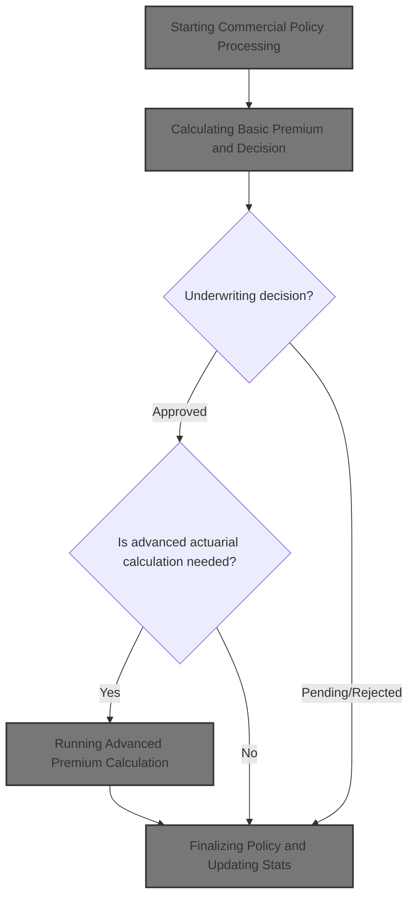
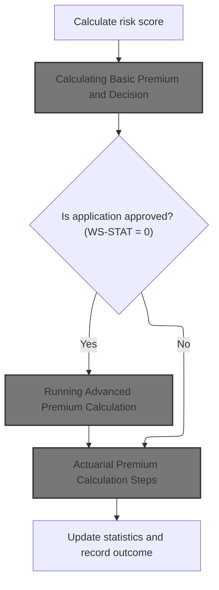
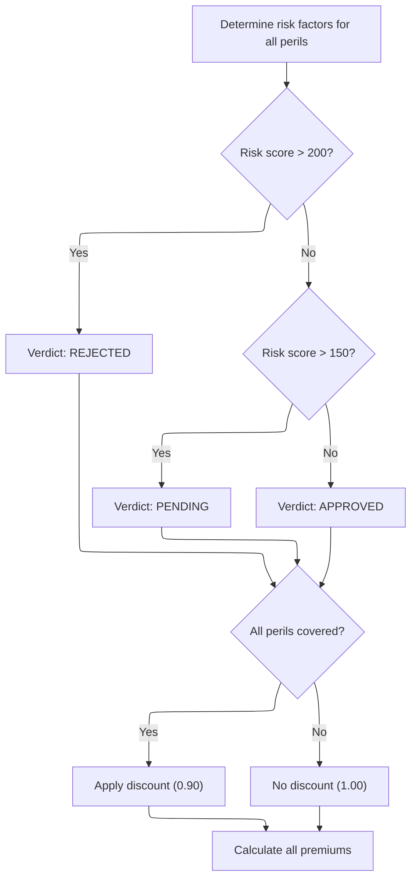
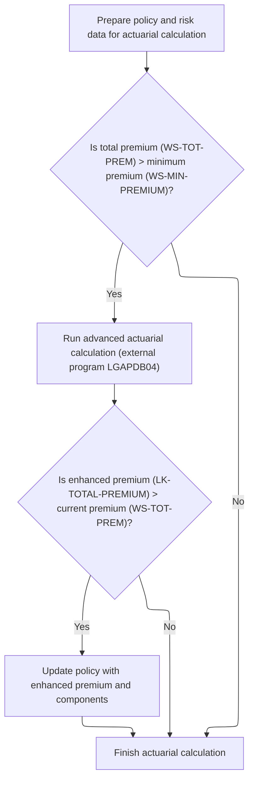
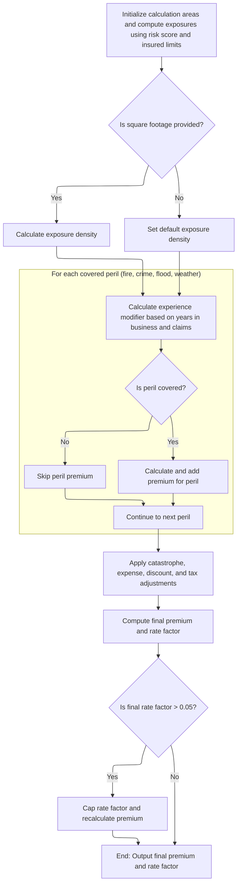
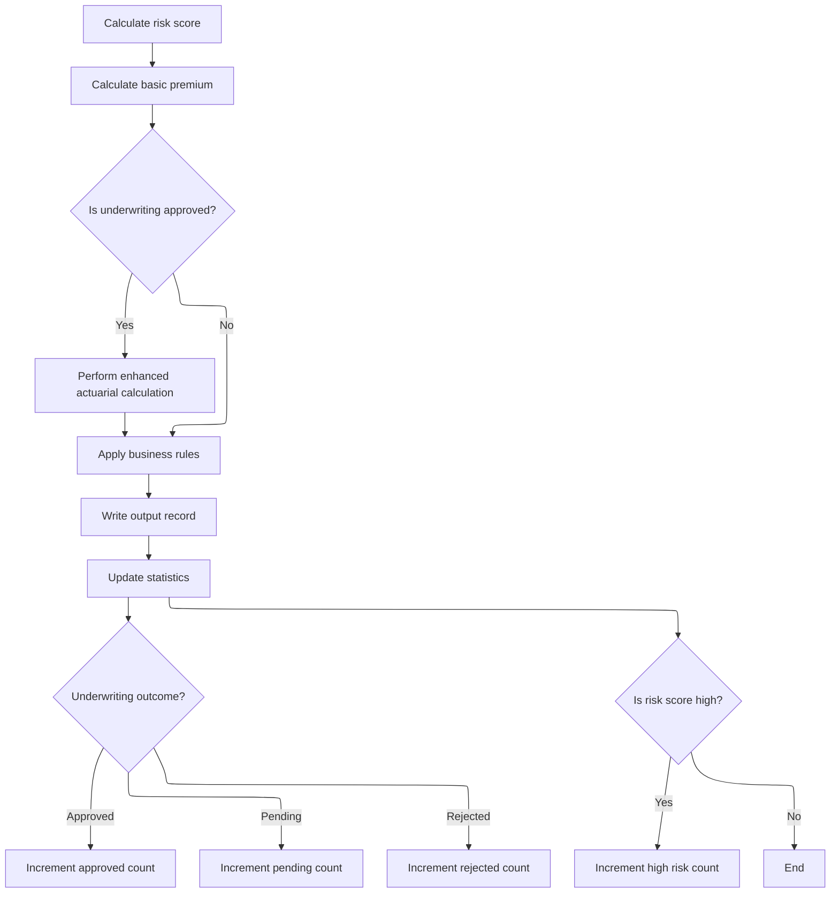

This document describes how commercial insurance policies are processed, from risk assessment and premium calculation to underwriting decision and statistics update. The flow receives policy data, evaluates risk, determines premiums, applies business rules, and updates business analytics.



# Spec

## Detailed View of the Program's Functionality

a. Program Initialization and Configuration

At startup, the main program initializes its counters, work areas, and data structures for risk analysis, actuarial calculations, premium breakdown, and decision data. It sets the processing date and attempts to load configuration values (such as maximum risk score and minimum premium) from a configuration file. If the configuration file is unavailable, it falls back to default values.

b. File Handling

The program opens all necessary files: input, output, summary, configuration, and rate files. It writes headers to the output file to label the columns for customer, property type, postcode, risk score, premium components, status, and rejection reason.

c. Input Record Processing Loop

The program reads each record from the input file in a loop. For each record, it increments the record count and validates the input fields. Validation checks include policy type, customer number, coverage limits, and total insured value. If validation fails, it logs the error and writes an error record to the output file. If validation passes, it processes the record according to its policy type.

d. Commercial Policy Processing

For commercial policies, the program executes a multi-step flow:

1. **Risk Score Calculation**\
   It calls an external module to calculate the risk score using property type, location, coverage limits, flood/weather coverage, and customer history.

2. **Basic Premium and Underwriting Decision**\
   It calls another external module to:

   - Retrieve risk factors for each peril (fire, crime) from the database, using defaults if missing.
   - Decide the underwriting verdict (approved, pending, rejected) based on risk score thresholds.
   - Calculate premiums for each peril and the total, applying a discount if all perils are covered.

3. **Advanced Actuarial Calculation (if approved)**\
   If the underwriting decision is approved and the basic premium exceeds the minimum premium, the program prepares detailed input data (policy, risk, coverage, peril selections, deductibles, claims history) and calls an advanced actuarial calculation module. This module:

   - Initializes exposures and insured values using coverage limits and risk score.
   - Loads base rates for each peril from the database, using defaults if missing.
   - Calculates experience and schedule modifiers based on years in business, claims, building age, protection class, occupancy, and exposure density.
   - Computes premiums for each covered peril using exposures, rates, modifiers, and trend factors.
   - Adds catastrophe, expense, profit, discount, and tax loadings.
   - Sums all components for the final premium and rate factor, capping the rate factor if necessary.
   - If the enhanced premium is greater than the basic premium, updates the policy premium components.

4. **Business Rules Application**\
   The program applies additional business rules to determine the final underwriting decision, considering risk score and premium thresholds.

5. **Output Record Writing**\
   It writes the processed policy data, including customer info, risk score, premium breakdowns, status, and rejection reason, to the output file.

6. **Statistics Update**\
   The program updates counters and totals for reporting:

   - Adds the premium and risk score to running totals.
   - Increments counters for approved, pending, rejected, and high-risk policies based on status and risk score.

e. Non-Commercial Policy Handling

For non-commercial policies, the program writes an output record indicating unsupported status and a rejection reason.

f. File Closure and Summary Generation

After processing all records, the program closes all files. It generates a summary report in the summary file, including processing date, total records processed, counts of approved/pending/rejected policies, total premium amount, and average risk score if applicable.

g. Final Statistics Display

The program displays final statistics to the console, including total records read, processed, approved, pending, rejected, error records, high-risk count, total premium generated, and average risk score if available.

# Rule Definition

| Paragraph Name                                                                    | Rule ID | Category          | Description                                                                                                                                                                                                                                       | Conditions                                                                               | Remarks                                                                                                                                                                                                                                                                                                                                                                                           |
| --------------------------------------------------------------------------------- | ------- | ----------------- | ------------------------------------------------------------------------------------------------------------------------------------------------------------------------------------------------------------------------------------------------- | ---------------------------------------------------------------------------------------- | ------------------------------------------------------------------------------------------------------------------------------------------------------------------------------------------------------------------------------------------------------------------------------------------------------------------------------------------------------------------------------------------------- |
| P008-VALIDATE-INPUT-RECORD                                                        | RL-001  | Conditional Logic | The system must validate that each input record is a commercial policy and contains all required fields, including customer number and at least one coverage limit.                                                                               | Triggered for each input record read from the input file.                                | If the policy type is not commercial, or if the customer number is missing, or if both building and contents coverage limits are zero, the record is flagged as an error. If the sum of coverage limits exceeds the maximum TIV (default 50,000,000.00), a warning is logged. Output for error records sets all numeric outputs to zero, status to 'ERROR', and includes the first error message. |
| P011A-CALCULATE-RISK-SCORE                                                        | RL-002  | Computation       | Calculate a risk score for the policy using all relevant input fields, including property, location, coverage, and claims history.                                                                                                                | For each valid commercial policy input record.                                           | Risk score is calculated by an external program using property type, postcode, latitude, longitude, coverage limits, peril selections, and claims history. Output is a numeric risk score (integer).                                                                                                                                                                                              |
| GET-RISK-FACTORS (LGAPDB03)                                                       | RL-003  | Computation       | Determine risk factors for each peril (fire, crime, flood, weather) using database values or default constants if missing.                                                                                                                        | For each peril present in the policy.                                                    | Default constants: Fire 0.80, Crime 0.60, Flood 1.20, Weather 0.90. If database lookup fails, use these defaults.                                                                                                                                                                                                                                                                                 |
| CALCULATE-PREMIUMS (LGAPDB03)                                                     | RL-004  | Computation       | Calculate a basic premium for each covered peril using the risk score, peril risk factors, peril coverage limits, deductibles, and other relevant input fields.                                                                                   | For each peril with coverage selected in the policy.                                     | Premium for each peril is calculated as: (risk score \* peril risk factor) \* peril coverage amount \* discount factor. Output is a numeric value (up to 8 digits, 2 decimals).                                                                                                                                                                                                                   |
| CALCULATE-VERDICT (LGAPDB03), P011D-APPLY-BUSINESS-RULES                          | RL-005  | Conditional Logic | Determine the underwriting verdict based on the calculated risk score and premium thresholds.                                                                                                                                                     | After risk score and premiums are calculated for a policy.                               | Thresholds: If risk score > 200, status is 'REJECTED' with reason. If risk score > 150 and <= 200, status is 'PENDING' with reason. If risk score <= 150, status is 'APPROVED' and rejection reason is blank. In enhanced logic, also check if total premium < minimum premium (default 500.00), set to 'PENDING'.                                                                                |
| CALCULATE-PREMIUMS (LGAPDB03), P900-DISC (LGAPDB04)                               | RL-006  | Computation       | If all perils (fire, crime, flood, weather) are covered, apply a discount factor of 0.90 to the total premium; otherwise, use a factor of 1.00.                                                                                                   | When all four perils are covered in the policy.                                          | Discount factor: 0.90 if all perils covered, 1.00 otherwise. In advanced calculation, additional discounts may apply (multi-peril, claims-free, deductible credits).                                                                                                                                                                                                                              |
| CALCULATE-PREMIUMS (LGAPDB03), P600-BASE-PREM, P999-FINAL (LGAPDB04)              | RL-007  | Computation       | Sum the premiums for all covered perils and apply the discount factor to calculate the total premium.                                                                                                                                             | After individual peril premiums and discount factor are determined.                      | Total premium is the sum of all peril premiums, multiplied by the discount factor. Output is a numeric value (up to 9 digits, 2 decimals).                                                                                                                                                                                                                                                        |
| P011C-ENHANCED-ACTUARIAL-CALC, P100-MAIN and subparagraphs (LGAPDB04)             | RL-008  | Computation       | If the underwriting verdict is 'APPROVED' and the total premium exceeds the minimum premium threshold, perform an advanced actuarial premium calculation using detailed policy and risk data.                                                     | Underwriting verdict is 'APPROVED' and total premium > minimum premium (default 500.00). | Advanced calculation includes exposures, base rates, experience and schedule modifiers, trend factors, catastrophe, expense, discount, and tax adjustments. Rate factor capped at 0.05. If enhanced premium > current premium, update output with enhanced values.                                                                                                                                |
| P011E-WRITE-OUTPUT-RECORD, P010-PROCESS-ERROR-RECORD, P012-PROCESS-NON-COMMERCIAL | RL-009  | Data Assignment   | Write an output record for each processed policy, containing all output fields as described in the output structure, including calculated risk score, premium breakdowns, total premium, underwriting status, and rejection reason if applicable. | After processing each policy (valid, error, or unsupported).                             | Output fields: customer number (string, left-aligned), property type (string), postcode (string), risk score (number), fire/crime/flood/weather premiums (number, 2 decimals), total premium (number, 2 decimals), status (string), rejection reason (string, blank if approved).                                                                                                                 |
| P011F-UPDATE-STATISTICS                                                           | RL-010  | Computation       | Update internal statistics after each policy is processed, incrementing counters for approved, pending, rejected, and high-risk policies, and adding the premium and risk score to running totals.                                                | After each policy is processed and output is written.                                    | Counters: approved, pending, rejected, high-risk (risk score > 200). Running totals: total premium, risk score. Used for summary and reporting.                                                                                                                                                                                                                                                   |

# User Stories

## User Story 1: Assess risk and determine underwriting verdict

---

### Story Description:

As an insurance system, I want to calculate risk scores, determine peril risk factors, and decide the underwriting verdict for each policy so that risk assessment and policy status are accurate and compliant with business rules.

---

### Business Rule Mapping:

| Rule ID | Paragraph Name                                           | Rule Description                                                                                                                   |
| ------- | -------------------------------------------------------- | ---------------------------------------------------------------------------------------------------------------------------------- |
| RL-002  | P011A-CALCULATE-RISK-SCORE                               | Calculate a risk score for the policy using all relevant input fields, including property, location, coverage, and claims history. |
| RL-003  | GET-RISK-FACTORS (LGAPDB03)                              | Determine risk factors for each peril (fire, crime, flood, weather) using database values or default constants if missing.         |
| RL-005  | CALCULATE-VERDICT (LGAPDB03), P011D-APPLY-BUSINESS-RULES | Determine the underwriting verdict based on the calculated risk score and premium thresholds.                                      |

---

### Relevant Functionality:

- **P011A-CALCULATE-RISK-SCORE**
  1. **RL-002:**
     - Call risk score calculation module with all relevant input fields.
     - Store the resulting risk score for further processing.
- **GET-RISK-FACTORS (LGAPDB03)**
  1. **RL-003:**
     - For each peril:
       - Attempt to retrieve risk factor from database.
       - If not found, use default constant.
- **CALCULATE-VERDICT (LGAPDB03)**
  1. **RL-005:**
     - If risk score > 200, set status to 'REJECTED' and provide reason.
     - Else if risk score > 150, set status to 'PENDING' and provide reason.
     - Else, set status to 'APPROVED' and leave rejection reason blank.
     - If total premium < minimum, set to 'PENDING' with appropriate reason.

## User Story 2: Calculate premiums, apply discounts, and perform advanced actuarial calculations

---

### Story Description:

As an insurance system, I want to calculate basic premiums for covered perils, apply discounts when all perils are covered, sum premiums, and perform advanced actuarial premium calculations for approved policies with high premiums so that total premium reflects coverage, risk, and enhanced pricing adjustments accurately.

---

### Business Rule Mapping:

| Rule ID | Paragraph Name                                                        | Rule Description                                                                                                                                                                              |
| ------- | --------------------------------------------------------------------- | --------------------------------------------------------------------------------------------------------------------------------------------------------------------------------------------- |
| RL-008  | P011C-ENHANCED-ACTUARIAL-CALC, P100-MAIN and subparagraphs (LGAPDB04) | If the underwriting verdict is 'APPROVED' and the total premium exceeds the minimum premium threshold, perform an advanced actuarial premium calculation using detailed policy and risk data. |
| RL-004  | CALCULATE-PREMIUMS (LGAPDB03)                                         | Calculate a basic premium for each covered peril using the risk score, peril risk factors, peril coverage limits, deductibles, and other relevant input fields.                               |
| RL-006  | CALCULATE-PREMIUMS (LGAPDB03), P900-DISC (LGAPDB04)                   | If all perils (fire, crime, flood, weather) are covered, apply a discount factor of 0.90 to the total premium; otherwise, use a factor of 1.00.                                               |
| RL-007  | CALCULATE-PREMIUMS (LGAPDB03), P600-BASE-PREM, P999-FINAL (LGAPDB04)  | Sum the premiums for all covered perils and apply the discount factor to calculate the total premium.                                                                                         |

---

### Relevant Functionality:

- **P011C-ENHANCED-ACTUARIAL-CALC**
  1. **RL-008:**
     - If verdict is 'APPROVED' and total premium > minimum:
       - Compute exposures for building, contents, BI.
       - Set exposure density (default 100.00 if square footage is zero).
       - Calculate experience modifier (bounded 0.5 to 2.0, special values for no claims/new business).
       - Calculate peril premiums using exposures, base rates, modifiers, trend factors.
       - Apply catastrophe, expense, discount, and tax adjustments.
       - Calculate final premium and rate factor (cap at 0.05).
       - If enhanced premium > current, update output.
- **CALCULATE-PREMIUMS (LGAPDB03)**
  1. **RL-004:**
     - For each peril with coverage:
       - Compute premium using risk score, peril risk factor, peril coverage, and discount factor.
  2. **RL-006:**
     - If all perils are covered, set discount factor to 0.90.
     - Otherwise, set discount factor to 1.00.
     - Apply discount factor to total premium.
  3. **RL-007:**
     - Sum all peril premiums.
     - Multiply by discount factor to get total premium.

## User Story 3: Validate, process, and record policy outcomes

---

### Story Description:

As an insurance system, I want to validate each input policy record, handle errors, write output records, and update internal statistics so that only valid commercial policies are processed, errors are flagged and reported, and results are recorded for reporting.

---

### Business Rule Mapping:

| Rule ID | Paragraph Name                                                                    | Rule Description                                                                                                                                                                                                                                  |
| ------- | --------------------------------------------------------------------------------- | ------------------------------------------------------------------------------------------------------------------------------------------------------------------------------------------------------------------------------------------------- |
| RL-010  | P011F-UPDATE-STATISTICS                                                           | Update internal statistics after each policy is processed, incrementing counters for approved, pending, rejected, and high-risk policies, and adding the premium and risk score to running totals.                                                |
| RL-001  | P008-VALIDATE-INPUT-RECORD                                                        | The system must validate that each input record is a commercial policy and contains all required fields, including customer number and at least one coverage limit.                                                                               |
| RL-009  | P011E-WRITE-OUTPUT-RECORD, P010-PROCESS-ERROR-RECORD, P012-PROCESS-NON-COMMERCIAL | Write an output record for each processed policy, containing all output fields as described in the output structure, including calculated risk score, premium breakdowns, total premium, underwriting status, and rejection reason if applicable. |

---

### Relevant Functionality:

- **P011F-UPDATE-STATISTICS**
  1. **RL-010:**
     - Add total premium to running total.
     - Add risk score to running total.
     - Increment appropriate status counter (approved, pending, rejected).
     - If risk score > 200, increment high-risk counter.
- **P008-VALIDATE-INPUT-RECORD**
  1. **RL-001:**
     - For each input record:
       - If policy type is not commercial, log error.
       - If customer number is blank, log error.
       - If both building and contents limits are zero, log error.
       - If total coverage exceeds max TIV, log warning.
       - If errors exist, output error record with status 'ERROR'.
- **P011E-WRITE-OUTPUT-RECORD**
  1. **RL-009:**
     - For each processed policy:
       - Assign all output fields from calculated or input values.
       - Write output record to output file.

# Code Walkthrough

## Starting Commercial Policy Processing



<SwmSnippet path="/base/src/LGAPDB01.cbl" line="258">

---

In `P011-PROCESS-COMMERCIAL`, we kick off the flow by calculating the risk score and then immediately call P011B-BASIC-PREMIUM-CALC to use that score for basic premium and underwriting decision. This sets up whether we need to run the enhanced actuarial calculation or just proceed with business rules and output.

```cobol
       P011-PROCESS-COMMERCIAL.
           PERFORM P011A-CALCULATE-RISK-SCORE
           PERFORM P011B-BASIC-PREMIUM-CALC
           IF WS-STAT = 0
               PERFORM P011C-ENHANCED-ACTUARIAL-CALC
           END-IF
           PERFORM P011D-APPLY-BUSINESS-RULES
           PERFORM P011E-WRITE-OUTPUT-RECORD
           PERFORM P011F-UPDATE-STATISTICS.
```

---

</SwmSnippet>

### Calculating Basic Premium and Decision

<SwmSnippet path="/base/src/LGAPDB01.cbl" line="275">

---

`P011B-BASIC-PREMIUM-CALC` calls LGAPDB03 to handle risk factor lookup, verdict, and premium calculations in one go. This call returns all the premium breakdowns and underwriting decision needed for the rest of the flow.

```cobol
       P011B-BASIC-PREMIUM-CALC.
           CALL 'LGAPDB03' USING WS-BASE-RISK-SCR, IN-FIRE-PERIL, 
                                IN-CRIME-PERIL, IN-FLOOD-PERIL, 
                                IN-WEATHER-PERIL, WS-STAT,
                                WS-STAT-DESC, WS-REJ-RSN, WS-FR-PREM,
                                WS-CR-PREM, WS-FL-PREM, WS-WE-PREM,
                                WS-TOT-PREM, WS-DISC-FACT.
```

---

</SwmSnippet>

### Risk, Verdict, and Premium Calculation



<SwmSnippet path="/base/src/LGAPDB03.cbl" line="42">

---

`MAIN-LOGIC` runs the risk factor retrieval, then uses those factors to decide the verdict, and finally calculates premiums. Each step depends on the previous, so the order matters.

```cobol
       MAIN-LOGIC.
           PERFORM GET-RISK-FACTORS
           PERFORM CALCULATE-VERDICT
           PERFORM CALCULATE-PREMIUMS
           GOBACK.
```

---

</SwmSnippet>

<SwmSnippet path="/base/src/LGAPDB03.cbl" line="48">

---

`GET-RISK-FACTORS` grabs risk factor values for 'FIRE' and 'CRIME' from the database, but if they're missing, it uses hardcoded defaults (0.80 and 0.60) so the rest of the premium logic doesn't break.

```cobol
       GET-RISK-FACTORS.
           EXEC SQL
               SELECT FACTOR_VALUE INTO :WS-FIRE-FACTOR
               FROM RISK_FACTORS
               WHERE PERIL_TYPE = 'FIRE'
           END-EXEC.
           
           IF SQLCODE = 0
               CONTINUE
           ELSE
               MOVE 0.80 TO WS-FIRE-FACTOR
           END-IF.
           
           EXEC SQL
               SELECT FACTOR_VALUE INTO :WS-CRIME-FACTOR
               FROM RISK_FACTORS
               WHERE PERIL_TYPE = 'CRIME'
           END-EXEC.
           
           IF SQLCODE = 0
               CONTINUE
           ELSE
               MOVE 0.60 TO WS-CRIME-FACTOR
           END-IF.
```

---

</SwmSnippet>

<SwmSnippet path="/base/src/LGAPDB03.cbl" line="73">

---

`CALCULATE-VERDICT` uses fixed thresholds (200, 150) to set the policy status and rejection reason. This splits policies into rejected, pending, or approved, which drives the rest of the flow.

```cobol
       CALCULATE-VERDICT.
           IF LK-RISK-SCORE > 200
             MOVE 2 TO LK-STAT
             MOVE 'REJECTED' TO LK-STAT-DESC
             MOVE 'High Risk Score - Manual Review Required' 
               TO LK-REJ-RSN
           ELSE
             IF LK-RISK-SCORE > 150
               MOVE 1 TO LK-STAT
               MOVE 'PENDING' TO LK-STAT-DESC
               MOVE 'Medium Risk - Pending Review'
                 TO LK-REJ-RSN
             ELSE
               MOVE 0 TO LK-STAT
               MOVE 'APPROVED' TO LK-STAT-DESC
               MOVE SPACES TO LK-REJ-RSN
             END-IF
           END-IF.
```

---

</SwmSnippet>

<SwmSnippet path="/base/src/LGAPDB03.cbl" line="92">

---

`CALCULATE-PREMIUMS` sets a discount factor, applies it if all perils are covered, then calculates each peril's premium and sums them up. The discount only kicks in for full coverage.

```cobol
       CALCULATE-PREMIUMS.
           MOVE 1.00 TO LK-DISC-FACT
           
           IF LK-FIRE-PERIL > 0 AND
              LK-CRIME-PERIL > 0 AND
              LK-FLOOD-PERIL > 0 AND
              LK-WEATHER-PERIL > 0
             MOVE 0.90 TO LK-DISC-FACT
           END-IF

           COMPUTE LK-FIRE-PREMIUM =
             ((LK-RISK-SCORE * WS-FIRE-FACTOR) * LK-FIRE-PERIL *
               LK-DISC-FACT)
           
           COMPUTE LK-CRIME-PREMIUM =
             ((LK-RISK-SCORE * WS-CRIME-FACTOR) * LK-CRIME-PERIL *
               LK-DISC-FACT)
           
           COMPUTE LK-FLOOD-PREMIUM =
             ((LK-RISK-SCORE * WS-FLOOD-FACTOR) * LK-FLOOD-PERIL *
               LK-DISC-FACT)
           
           COMPUTE LK-WEATHER-PREMIUM =
             ((LK-RISK-SCORE * WS-WEATHER-FACTOR) * LK-WEATHER-PERIL *
               LK-DISC-FACT)

           COMPUTE LK-TOTAL-PREMIUM = 
             LK-FIRE-PREMIUM + LK-CRIME-PREMIUM + 
             LK-FLOOD-PREMIUM + LK-WEATHER-PREMIUM. 
```

---

</SwmSnippet>

### Running Advanced Premium Calculation



<SwmSnippet path="/base/src/LGAPDB01.cbl" line="283">

---

`P011C-ENHANCED-ACTUARIAL-CALC` sets up all the detailed input data, then calls LGAPDB04 for advanced actuarial premium calculation if the basic premium is above a minimum. If the new premium is better, we update the policy data.

```cobol
       P011C-ENHANCED-ACTUARIAL-CALC.
      *    Prepare input structure for actuarial calculation
           MOVE IN-CUSTOMER-NUM TO LK-CUSTOMER-NUM
           MOVE WS-BASE-RISK-SCR TO LK-RISK-SCORE
           MOVE IN-PROPERTY-TYPE TO LK-PROPERTY-TYPE
           MOVE IN-TERRITORY-CODE TO LK-TERRITORY
           MOVE IN-CONSTRUCTION-TYPE TO LK-CONSTRUCTION-TYPE
           MOVE IN-OCCUPANCY-CODE TO LK-OCCUPANCY-CODE
           MOVE IN-SPRINKLER-IND TO LK-PROTECTION-CLASS
           MOVE IN-YEAR-BUILT TO LK-YEAR-BUILT
           MOVE IN-SQUARE-FOOTAGE TO LK-SQUARE-FOOTAGE
           MOVE IN-YEARS-IN-BUSINESS TO LK-YEARS-IN-BUSINESS
           MOVE IN-CLAIMS-COUNT-3YR TO LK-CLAIMS-COUNT-5YR
           MOVE IN-CLAIMS-AMOUNT-3YR TO LK-CLAIMS-AMOUNT-5YR
           
      *    Set coverage data
           MOVE IN-BUILDING-LIMIT TO LK-BUILDING-LIMIT
           MOVE IN-CONTENTS-LIMIT TO LK-CONTENTS-LIMIT
           MOVE IN-BI-LIMIT TO LK-BI-LIMIT
           MOVE IN-FIRE-DEDUCTIBLE TO LK-FIRE-DEDUCTIBLE
           MOVE IN-WIND-DEDUCTIBLE TO LK-WIND-DEDUCTIBLE
           MOVE IN-FLOOD-DEDUCTIBLE TO LK-FLOOD-DEDUCTIBLE
           MOVE IN-OTHER-DEDUCTIBLE TO LK-OTHER-DEDUCTIBLE
           MOVE IN-FIRE-PERIL TO LK-FIRE-PERIL
           MOVE IN-CRIME-PERIL TO LK-CRIME-PERIL
           MOVE IN-FLOOD-PERIL TO LK-FLOOD-PERIL
           MOVE IN-WEATHER-PERIL TO LK-WEATHER-PERIL
           
      *    Call advanced actuarial calculation program (only for approved cases)
           IF WS-TOT-PREM > WS-MIN-PREMIUM
               CALL 'LGAPDB04' USING LK-INPUT-DATA, LK-COVERAGE-DATA, 
                                    LK-OUTPUT-RESULTS
               
      *        Update with enhanced calculations if successful
               IF LK-TOTAL-PREMIUM > WS-TOT-PREM
                   MOVE LK-FIRE-PREMIUM TO WS-FR-PREM
                   MOVE LK-CRIME-PREMIUM TO WS-CR-PREM
                   MOVE LK-FLOOD-PREMIUM TO WS-FL-PREM
                   MOVE LK-WEATHER-PREMIUM TO WS-WE-PREM
                   MOVE LK-TOTAL-PREMIUM TO WS-TOT-PREM
                   MOVE LK-EXPERIENCE-MOD TO WS-EXPERIENCE-MOD
               END-IF
           END-IF.
```

---

</SwmSnippet>

### Actuarial Premium Calculation Steps



<SwmSnippet path="/base/src/LGAPDB04.cbl" line="138">

---

`P100-MAIN` runs through all the actuarial steps: initializing, rating, exposure, experience and schedule mods, base premium, catastrophe load, expense, discounts, taxes, and finally the total premium and rate factor. Each step builds on the previous.

```cobol
       P100-MAIN.
           PERFORM P200-INIT
           PERFORM P300-RATES
           PERFORM P350-EXPOSURE
           PERFORM P400-EXP-MOD
           PERFORM P500-SCHED-MOD
           PERFORM P600-BASE-PREM
           PERFORM P700-CAT-LOAD
           PERFORM P800-EXPENSE
           PERFORM P900-DISC
           PERFORM P950-TAXES
           PERFORM P999-FINAL
           GOBACK.
```

---

</SwmSnippet>

<SwmSnippet path="/base/src/LGAPDB04.cbl" line="152">

---

`P200-INIT` calculates exposures for building, contents, and BI using coverage limits and risk score, sums them for total insured value, and sets exposure density—using 100.00 as a fallback if square footage is zero.

```cobol
       P200-INIT.
           INITIALIZE WS-CALCULATION-AREAS
           INITIALIZE WS-BASE-RATE-TABLE
           
           COMPUTE WS-BUILDING-EXPOSURE = 
               LK-BUILDING-LIMIT * (1 + (LK-RISK-SCORE - 100) / 1000)
               
           COMPUTE WS-CONTENTS-EXPOSURE = 
               LK-CONTENTS-LIMIT * (1 + (LK-RISK-SCORE - 100) / 1000)
               
           COMPUTE WS-BI-EXPOSURE = 
               LK-BI-LIMIT * (1 + (LK-RISK-SCORE - 100) / 1000)
               
           COMPUTE WS-TOTAL-INSURED-VAL = 
               WS-BUILDING-EXPOSURE + WS-CONTENTS-EXPOSURE + 
               WS-BI-EXPOSURE
               
           IF LK-SQUARE-FOOTAGE > ZERO
               COMPUTE WS-EXPOSURE-DENSITY = 
                   WS-TOTAL-INSURED-VAL / LK-SQUARE-FOOTAGE
           ELSE
               MOVE 100.00 TO WS-EXPOSURE-DENSITY
           END-IF.
```

---

</SwmSnippet>

<SwmSnippet path="/base/src/LGAPDB04.cbl" line="234">

---

`P400-EXP-MOD` sets the experience modifier based on years in business and claims history, using constants for no claims, new businesses, and bounding the result. This directly impacts the premium calculation.

```cobol
       P400-EXP-MOD.
           MOVE 1.0000 TO WS-EXPERIENCE-MOD
           
           IF LK-YEARS-IN-BUSINESS >= 5
               IF LK-CLAIMS-COUNT-5YR = ZERO
                   MOVE 0.8500 TO WS-EXPERIENCE-MOD
               ELSE
                   COMPUTE WS-EXPERIENCE-MOD = 
                       1.0000 + 
                       ((LK-CLAIMS-AMOUNT-5YR / WS-TOTAL-INSURED-VAL) * 
                        WS-CREDIBILITY-FACTOR * 0.50)
                   
                   IF WS-EXPERIENCE-MOD > 2.0000
                       MOVE 2.0000 TO WS-EXPERIENCE-MOD
                   END-IF
                   
                   IF WS-EXPERIENCE-MOD < 0.5000
                       MOVE 0.5000 TO WS-EXPERIENCE-MOD
                   END-IF
               END-IF
           ELSE
               MOVE 1.1000 TO WS-EXPERIENCE-MOD
           END-IF
           
           MOVE WS-EXPERIENCE-MOD TO LK-EXPERIENCE-MOD.
```

---

</SwmSnippet>

<SwmSnippet path="/base/src/LGAPDB04.cbl" line="318">

---

`P600-BASE-PREM` calculates premiums for fire, crime, flood, and weather using exposures, base rates, experience and schedule modifiers, and trend factors. Each peril uses its own constants and only adds to the base amount if covered.

```cobol
       P600-BASE-PREM.
           MOVE ZERO TO LK-BASE-AMOUNT
           
      * FIRE PREMIUM
           IF LK-FIRE-PERIL > ZERO
               COMPUTE LK-FIRE-PREMIUM = 
                   (WS-BUILDING-EXPOSURE + WS-CONTENTS-EXPOSURE) *
                   WS-BASE-RATE (1, 1, 1, 1) * 
                   WS-EXPERIENCE-MOD *
                   (1 + WS-SCHEDULE-MOD) *
                   WS-TREND-FACTOR
                   
               ADD LK-FIRE-PREMIUM TO LK-BASE-AMOUNT
           END-IF
           
      * CRIME PREMIUM
           IF LK-CRIME-PERIL > ZERO
               COMPUTE LK-CRIME-PREMIUM = 
                   (WS-CONTENTS-EXPOSURE * 0.80) *
                   WS-BASE-RATE (2, 1, 1, 1) * 
                   WS-EXPERIENCE-MOD *
                   (1 + WS-SCHEDULE-MOD) *
                   WS-TREND-FACTOR
                   
               ADD LK-CRIME-PREMIUM TO LK-BASE-AMOUNT
           END-IF
           
      * FLOOD PREMIUM
           IF LK-FLOOD-PERIL > ZERO
               COMPUTE LK-FLOOD-PREMIUM = 
                   WS-BUILDING-EXPOSURE *
                   WS-BASE-RATE (3, 1, 1, 1) * 
                   WS-EXPERIENCE-MOD *
                   (1 + WS-SCHEDULE-MOD) *
                   WS-TREND-FACTOR * 1.25
                   
               ADD LK-FLOOD-PREMIUM TO LK-BASE-AMOUNT
           END-IF
           
      * WEATHER PREMIUM
           IF LK-WEATHER-PERIL > ZERO
               COMPUTE LK-WEATHER-PREMIUM = 
                   (WS-BUILDING-EXPOSURE + WS-CONTENTS-EXPOSURE) *
                   WS-BASE-RATE (4, 1, 1, 1) * 
                   WS-EXPERIENCE-MOD *
                   (1 + WS-SCHEDULE-MOD) *
                   WS-TREND-FACTOR
                   
               ADD LK-WEATHER-PREMIUM TO LK-BASE-AMOUNT
           END-IF.
```

---

</SwmSnippet>

<SwmSnippet path="/base/src/LGAPDB04.cbl" line="464">

---

`P999-FINAL` sums up all premium components, calculates the rate factor, and caps it at 0.05 if needed, then recalculates the total premium. This keeps the premium rate within set limits.

```cobol
       P999-FINAL.
           COMPUTE LK-TOTAL-PREMIUM = 
               LK-BASE-AMOUNT + LK-CAT-LOAD-AMT + 
               LK-EXPENSE-LOAD-AMT + LK-PROFIT-LOAD-AMT -
               LK-DISCOUNT-AMT + LK-TAX-AMT
               
           COMPUTE LK-FINAL-RATE-FACTOR = 
               LK-TOTAL-PREMIUM / WS-TOTAL-INSURED-VAL
               
           IF LK-FINAL-RATE-FACTOR > 0.050000
               MOVE 0.050000 TO LK-FINAL-RATE-FACTOR
               COMPUTE LK-TOTAL-PREMIUM = 
                   WS-TOTAL-INSURED-VAL * LK-FINAL-RATE-FACTOR
           END-IF.
```

---

</SwmSnippet>

### Finalizing Policy and Updating Stats



<SwmSnippet path="/base/src/LGAPDB01.cbl" line="258">

---

Back in P011-PROCESS-COMMERCIAL, after returning from P011C-ENHANCED-ACTUARIAL-CALC and writing the output record, we call P011F-UPDATE-STATISTICS to update counters and totals for reporting and analytics.

```cobol
       P011-PROCESS-COMMERCIAL.
           PERFORM P011A-CALCULATE-RISK-SCORE
           PERFORM P011B-BASIC-PREMIUM-CALC
           IF WS-STAT = 0
               PERFORM P011C-ENHANCED-ACTUARIAL-CALC
           END-IF
           PERFORM P011D-APPLY-BUSINESS-RULES
           PERFORM P011E-WRITE-OUTPUT-RECORD
           PERFORM P011F-UPDATE-STATISTICS.
```

---

</SwmSnippet>

<SwmSnippet path="/base/src/LGAPDB01.cbl" line="365">

---

`P011F-UPDATE-STATISTICS` adds the current premium and risk score to totals, increments counters for approved, pending, rejected, and high-risk policies based on status and risk score thresholds.

```cobol
       P011F-UPDATE-STATISTICS.
           ADD WS-TOT-PREM TO WS-TOTAL-PREMIUM-AMT
           ADD WS-BASE-RISK-SCR TO WS-CONTROL-TOTALS
           
           EVALUATE WS-STAT
               WHEN 0 ADD 1 TO WS-APPROVED-CNT
               WHEN 1 ADD 1 TO WS-PENDING-CNT
               WHEN 2 ADD 1 TO WS-REJECTED-CNT
           END-EVALUATE
           
           IF WS-BASE-RISK-SCR > 200
               ADD 1 TO WS-HIGH-RISK-CNT
           END-IF.
```

---

</SwmSnippet>

&nbsp;

*This is an auto-generated document by Swimm 🌊 and has not yet been verified by a human*

<SwmMeta version="3.0.0" repo-id="Z2l0aHViJTNBJTNBY2ljcy1nZW5hcHAtZGVtbyUzQSUzQXN3aW1taW8=" repo-name="cics-genapp-demo"><sup>Powered by [Swimm](https://app.swimm.io/)</sup></SwmMeta>
