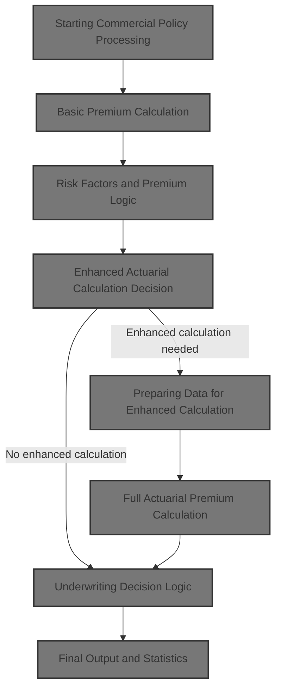
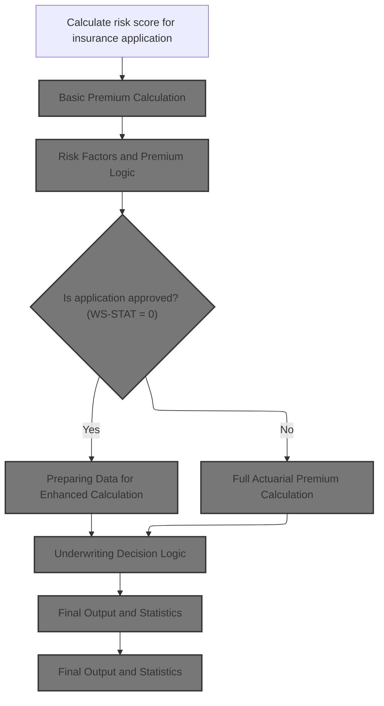
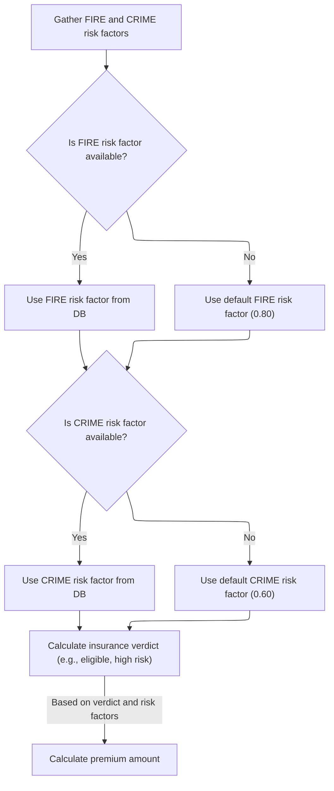
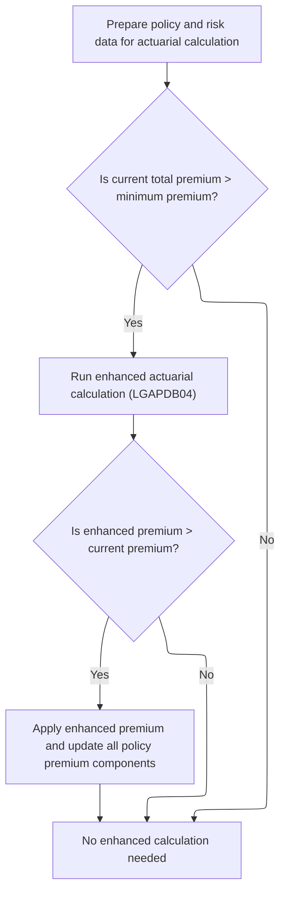
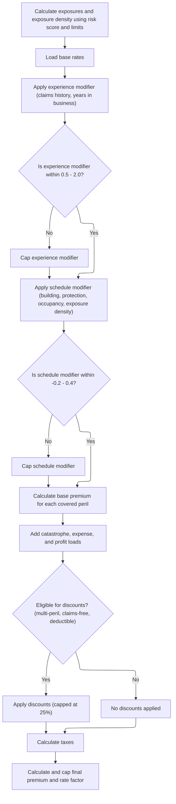
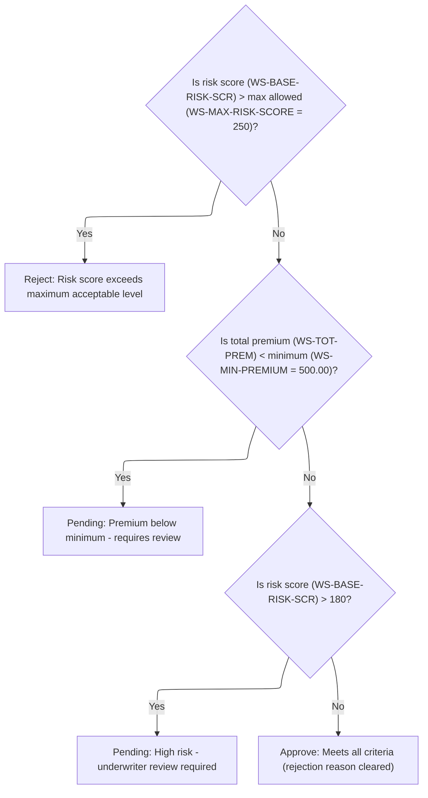
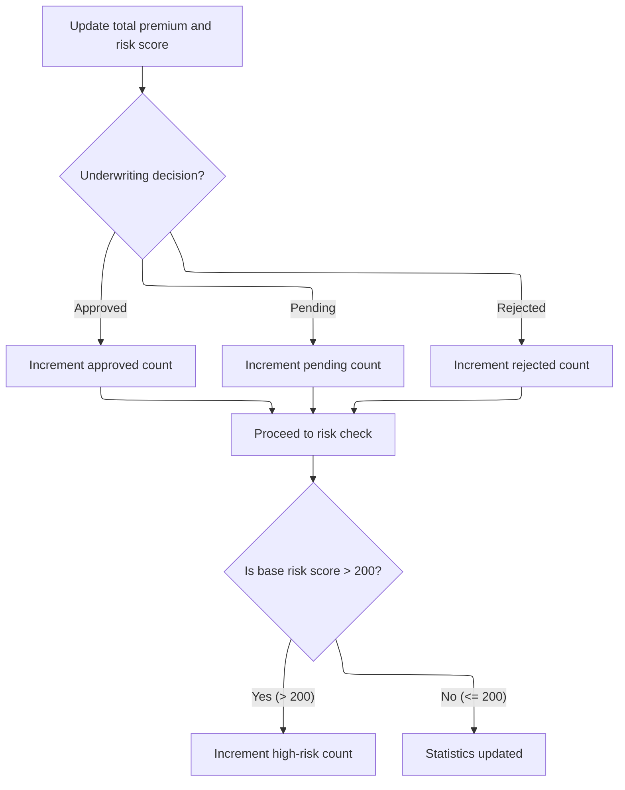

This document describes how a commercial insurance policy application is processed. The flow includes risk assessment, premium calculation, decision-making for enhanced actuarial analysis, application of business rules, and updating policy statistics.



# Spec

## Detailed View of the Program's Functionality

# Starting Commercial Policy Processing

The main commercial policy processing begins by calculating a risk score for the insurance application. This score is determined by calling a dedicated risk analysis routine, which uses property type, location, coverage limits, and customer history as inputs. Immediately after, the basic premium calculation is performed using this risk score.

# Basic Premium Calculation

The basic premium calculation step delegates the actual premium and underwriting logic to a separate module. This module receives the risk score and peril selections (fire, crime, flood, weather), and returns the calculated premiums for each peril, the total premium, and an initial underwriting verdict (approved, pending, or rejected) with a status description and rejection reason if applicable.

# Risk Factors and Premium Logic

Within the premium calculation module, the following actions occur:

- The system attempts to retrieve risk factors for fire and crime perils from a database. If the database fetch fails, default values are used (0.80 for fire, 0.60 for crime).
- Using these risk factors, the system determines the underwriting verdict:
  - If the risk score is very high, the application is rejected.
  - If the risk score is moderately high, the application is marked as pending.
  - Otherwise, the application is approved.
- Premiums for each peril are calculated by multiplying the risk score, the relevant risk factor, the peril selection, and a discount factor (which is reduced if all perils are selected).
- The total premium is the sum of all individual peril premiums.

# Enhanced Actuarial Calculation Decision

After the basic premium calculation, the system checks if the policy is approved. Only approved policies proceed to the enhanced actuarial calculation step.

# Preparing Data for Enhanced Calculation

If the policy is approved and the total premium exceeds a minimum threshold, the system prepares all relevant policy and risk data for the enhanced actuarial calculation. This involves copying customer, property, coverage, and claims data into a structured format for the next calculation module.

The enhanced calculation is only performed if the current premium is above the minimum. After running the advanced calculation:

- If the enhanced premium is greater than the current premium, all premium components are updated to reflect the enhanced results.
- Otherwise, the original premium is retained.

# Full Actuarial Premium Calculation

The advanced actuarial calculation module performs the following sequence:

1. **Exposure Calculations**: Exposures for building, contents, and business interruption are scaled based on the risk score. Exposure density is calculated as total insured value divided by square footage, with a fallback value if square footage is missing.
2. **Base Rate Loading**: Base rates for each peril are loaded from a database. If unavailable, default rates are used.
3. **Experience Modifier**: The experience modifier is set based on years in business and claims history. If claims are low and business tenure is long, a discount is applied. Otherwise, the modifier is calculated and capped within a specified range.
4. **Schedule Modifier**: The schedule modifier is adjusted using rules for building age, protection class, occupancy type, and exposure density. The modifier is capped within a defined range.
5. **Premium Calculation**: Premiums for each peril are calculated using exposures, base rates, experience and schedule modifiers, and trend factors. Crime and flood perils have additional hardcoded factors.
6. **Catastrophe, Expense, and Profit Loads**: Catastrophe loads are added based on peril selection. Expense and profit loads are calculated as percentages of the premium.
7. **Discounts**: Discounts are applied for multi-peril selection, claims-free history, and high deductibles. The total discount is capped.
8. **Taxes**: Taxes are calculated on the premium after discounts.
9. **Final Premium and Rate Factor**: The final premium is calculated and the rate factor is capped if it exceeds a maximum threshold.

# Business Rules and Output

After the enhanced calculation, business rules are applied to determine the final underwriting decision:

- If the risk score exceeds the maximum allowed, the policy is rejected.
- If the premium is below the minimum, the policy is marked as pending for manual review.
- If the risk score is high but not above the maximum, the policy is marked as pending for underwriter review.
- Otherwise, the policy is approved and any rejection reason is cleared.

The output record is then written, including customer, property, risk score, premium breakdown, total premium, status, and rejection reason.

# Underwriting Decision Logic

The underwriting decision logic checks:

- If the risk score is above the maximum, the policy is rejected.
- If the total premium is below the minimum, the policy is pending for review.
- If the risk score is above a high-risk threshold, the policy is pending for underwriter review.
- Otherwise, the policy is approved.

# Final Output and Statistics

After writing the output, the system updates statistics for reporting and monitoring:

- The total premium and risk score are added to running totals.
- Counters for approved, pending, and rejected policies are incremented based on the underwriting decision.
- If the risk score is above a high-risk threshold, the high-risk counter is incremented.

# Updating Policy Statistics

Statistics are updated as follows:

- The total premium and risk score are added to aggregate totals.
- The appropriate counter (approved, pending, rejected) is incremented based on the underwriting decision.
- If the risk score is above a specified threshold, the high-risk counter is incremented.

At the end of processing, a summary report is generated and displayed, showing totals for records processed, approved, pending, rejected, errors, high-risk count, total premium generated, and average risk score.

# Rule Definition

| Paragraph Name                                          | Rule ID | Category          | Description                                                                                                                                                                                                                                                                                                                                                                                                                         | Conditions                                                                                                                                                           | Remarks                                                                                                                                                                                                                                                                                                                                                                                                                                                                                     |
| ------------------------------------------------------- | ------- | ----------------- | ----------------------------------------------------------------------------------------------------------------------------------------------------------------------------------------------------------------------------------------------------------------------------------------------------------------------------------------------------------------------------------------------------------------------------------- | -------------------------------------------------------------------------------------------------------------------------------------------------------------------- | ------------------------------------------------------------------------------------------------------------------------------------------------------------------------------------------------------------------------------------------------------------------------------------------------------------------------------------------------------------------------------------------------------------------------------------------------------------------------------------------- |
| P008-VALIDATE-INPUT-RECORD                              | RL-001  | Conditional Logic | The system must accept only commercial insurance policy input records that contain all required customer, property, coverage, peril selection, and claims history fields. Records missing required fields or with invalid policy type or coverage limits are flagged as errors.                                                                                                                                                     | Input record must be a commercial policy; customer number must be present; at least one coverage limit must be non-zero; total coverage must not exceed maximum TIV. | Maximum TIV is 50,000,000.00. Output error status is 'ERROR' with rejection reason in a string field up to 50 characters.                                                                                                                                                                                                                                                                                                                                                                   |
| P011A-CALCULATE-RISK-SCORE                              | RL-002  | Computation       | Calculate a numeric risk score for the policy using property type, postcode, location, coverage limits, peril selections, and customer history. The risk score must be capped at a maximum value.                                                                                                                                                                                                                                   | Valid commercial policy input record; required fields present.                                                                                                       | Risk score is a number between 0 and 250, capped at 250. Output field is numeric, 3 digits.                                                                                                                                                                                                                                                                                                                                                                                                 |
| P011B-BASIC-PREMIUM-CALC, CALCULATE-PREMIUMS (LGAPDB03) | RL-003  | Computation       | For each peril (FIRE, CRIME, FLOOD, WEATHER), calculate the basic premium using the formula: Premium = (Risk Score \* Risk Factor) \* Peril Amount \* Discount Factor. Risk Factors for FIRE and CRIME are fetched from the RISK_FACTORS table, defaulting to 0.80 (FIRE) and 0.60 (CRIME) if not found. FLOOD and WEATHER use 1.20 and 0.90 respectively. Discount Factor is 0.90 if all four perils are selected, otherwise 1.00. | Valid risk score; peril amount > 0.                                                                                                                                  | Risk Factors: FIRE 0.80 (default), CRIME 0.60 (default), FLOOD 1.20, WEATHER 0.90. Discount Factor: 0.90 if all perils selected, else 1.00. Premium fields are numeric, 8 digits plus 2 decimals.                                                                                                                                                                                                                                                                                           |
| CALCULATE-PREMIUMS (LGAPDB03)                           | RL-004  | Computation       | Sum the calculated premiums for all selected perils to produce the total premium for the policy.                                                                                                                                                                                                                                                                                                                                    | Peril premiums calculated.                                                                                                                                           | Total premium is numeric, up to 9 digits plus 2 decimals.                                                                                                                                                                                                                                                                                                                                                                                                                                   |
| P011D-APPLY-BUSINESS-RULES                              | RL-005  | Conditional Logic | Set underwriting status and rejection reason based on risk score and total premium. If risk score > max, status is REJECTED. If total premium < minimum, status is PENDING. If risk score > 180, status is PENDING. Otherwise, status is APPROVED.                                                                                                                                                                                  | Risk score and total premium calculated.                                                                                                                             | Max risk score: 250. Minimum premium: 500.00. Status values: 'REJECTED', 'PENDING', 'APPROVED'. Rejection reason is a string up to 50 characters.                                                                                                                                                                                                                                                                                                                                           |
| P011C-ENHANCED-ACTUARIAL-CALC, LGAPDB04                 | RL-006  | Computation       | If policy is approved and total premium > minimum, perform enhanced actuarial calculations: exposures, experience modifier, schedule modifier, base premiums, catastrophe loads, expense and profit loads, discounts, tax, final premium, and cap final rate factor. If enhanced premium > current premium, update premium components.                                                                                              | Policy status is APPROVED; total premium > minimum premium.                                                                                                          | Experience modifier capped between 0.50 and 2.00. Schedule modifier capped between -0.20 and +0.40. Base rates: FIRE 0.0085, CRIME 0.0062, FLOOD 0.0128, WEATHER 0.0096. Catastrophe loads: hurricane 0.0125, earthquake 0.0080, tornado 0.0045, flood 0.0090. Expense load: 35%. Profit load: 15%. Discounts: multi-peril (0.10/0.05), claims-free (0.075), deductible credits (0.025/0.035/0.045), capped at 0.25. Tax: 6.75%. Final rate factor capped at 0.05. Premium fields as above. |
| P011E-WRITE-OUTPUT-RECORD                               | RL-007  | Data Assignment   | Output a record containing all customer and property info, calculated risk score, peril premiums, total premium, underwriting status, and rejection reason if applicable.                                                                                                                                                                                                                                                           | All calculations and decisions complete.                                                                                                                             | Output fields: customer number (string, 10), property type (string, 15), postcode (string, 8), risk score (number, 3), peril premiums (number, 8+2 decimals), total premium (number, 9+2 decimals), status (string, 20), rejection reason (string, 50).                                                                                                                                                                                                                                     |
| P011F-UPDATE-STATISTICS                                 | RL-008  | Computation       | Increment approved, pending, rejected, and high-risk counts as appropriate based on underwriting decision and risk score.                                                                                                                                                                                                                                                                                                           | Underwriting decision made.                                                                                                                                          | Counters: approved, pending, rejected, high-risk. High-risk if risk score > 200.                                                                                                                                                                                                                                                                                                                                                                                                            |

# User Stories

## User Story 1: Process and validate commercial insurance policy input, calculate risk score and basic premiums

---

### Story Description:

As an insurance system, I want to validate commercial insurance policy input records, calculate a risk score, and compute basic premiums for each selected peril so that only valid records are processed and the policy's risk and premium are accurately determined.

---

### Business Rule Mapping:

| Rule ID | Paragraph Name                                          | Rule Description                                                                                                                                                                                                                                                                                                                                                                                                                    |
| ------- | ------------------------------------------------------- | ----------------------------------------------------------------------------------------------------------------------------------------------------------------------------------------------------------------------------------------------------------------------------------------------------------------------------------------------------------------------------------------------------------------------------------- |
| RL-003  | P011B-BASIC-PREMIUM-CALC, CALCULATE-PREMIUMS (LGAPDB03) | For each peril (FIRE, CRIME, FLOOD, WEATHER), calculate the basic premium using the formula: Premium = (Risk Score \* Risk Factor) \* Peril Amount \* Discount Factor. Risk Factors for FIRE and CRIME are fetched from the RISK_FACTORS table, defaulting to 0.80 (FIRE) and 0.60 (CRIME) if not found. FLOOD and WEATHER use 1.20 and 0.90 respectively. Discount Factor is 0.90 if all four perils are selected, otherwise 1.00. |
| RL-001  | P008-VALIDATE-INPUT-RECORD                              | The system must accept only commercial insurance policy input records that contain all required customer, property, coverage, peril selection, and claims history fields. Records missing required fields or with invalid policy type or coverage limits are flagged as errors.                                                                                                                                                     |
| RL-002  | P011A-CALCULATE-RISK-SCORE                              | Calculate a numeric risk score for the policy using property type, postcode, location, coverage limits, peril selections, and customer history. The risk score must be capped at a maximum value.                                                                                                                                                                                                                                   |
| RL-004  | CALCULATE-PREMIUMS (LGAPDB03)                           | Sum the calculated premiums for all selected perils to produce the total premium for the policy.                                                                                                                                                                                                                                                                                                                                    |

---

### Relevant Functionality:

- **P011B-BASIC-PREMIUM-CALC**
  1. **RL-003:**
     - Fetch risk factors for FIRE and CRIME from DB, use defaults if not found
     - Use constants for FLOOD and WEATHER
     - If all perils selected, set discount factor to 0.90, else 1.00
     - For each peril, compute premium using formula
     - Sum all peril premiums for total premium
- **P008-VALIDATE-INPUT-RECORD**
  1. **RL-001:**
     - Check if policy type is commercial
     - Check if customer number is present
     - Check if at least one coverage limit (building, contents, BI) is non-zero
     - Check if total coverage does not exceed maximum TIV
     - If any check fails, log error and set output status to 'ERROR' with appropriate rejection reason
- **P011A-CALCULATE-RISK-SCORE**
  1. **RL-002:**
     - Call risk scoring logic/program with relevant input fields
     - Calculate risk score based on property, location, coverage, perils, and history
     - If risk score > 250, set risk score to 250
- **CALCULATE-PREMIUMS (LGAPDB03)**
  1. **RL-004:**
     - Add FIRE, CRIME, FLOOD, WEATHER premiums
     - Store result as total premium

## User Story 2: Finalize policy decision, perform enhanced actuarial calculations, generate output, and update statistics

---

### Story Description:

As an insurance system, I want to apply underwriting decision logic, perform enhanced actuarial calculations for approved policies, generate a comprehensive output record, and update policy statistics so that each policy is fully processed, reported, and tracked according to business rules.

---

### Business Rule Mapping:

| Rule ID | Paragraph Name                          | Rule Description                                                                                                                                                                                                                                                                                                                       |
| ------- | --------------------------------------- | -------------------------------------------------------------------------------------------------------------------------------------------------------------------------------------------------------------------------------------------------------------------------------------------------------------------------------------- |
| RL-006  | P011C-ENHANCED-ACTUARIAL-CALC, LGAPDB04 | If policy is approved and total premium > minimum, perform enhanced actuarial calculations: exposures, experience modifier, schedule modifier, base premiums, catastrophe loads, expense and profit loads, discounts, tax, final premium, and cap final rate factor. If enhanced premium > current premium, update premium components. |
| RL-005  | P011D-APPLY-BUSINESS-RULES              | Set underwriting status and rejection reason based on risk score and total premium. If risk score > max, status is REJECTED. If total premium < minimum, status is PENDING. If risk score > 180, status is PENDING. Otherwise, status is APPROVED.                                                                                     |
| RL-008  | P011F-UPDATE-STATISTICS                 | Increment approved, pending, rejected, and high-risk counts as appropriate based on underwriting decision and risk score.                                                                                                                                                                                                              |
| RL-007  | P011E-WRITE-OUTPUT-RECORD               | Output a record containing all customer and property info, calculated risk score, peril premiums, total premium, underwriting status, and rejection reason if applicable.                                                                                                                                                              |

---

### Relevant Functionality:

- **P011C-ENHANCED-ACTUARIAL-CALC**
  1. **RL-006:**
     - Calculate exposures for building, contents, BI
     - Calculate experience modifier (years in business, claims count/amount, credibility factor)
     - Cap experience modifier between 0.50 and 2.00
     - Calculate schedule modifier (building age, protection class, occupancy code, exposure density)
     - Cap schedule modifier between -0.20 and +0.40
     - Calculate base premiums for each peril using base rates, experience mod, schedule mod, trend factor
     - Add catastrophe loads for each peril
     - Add expense load (35%) and profit load (15%)
     - Apply discounts, capped at 0.25
     - Apply tax at 6.75%
     - Calculate final premium, cap final rate factor at 0.05
     - If enhanced premium > current premium, update premium components
- **P011D-APPLY-BUSINESS-RULES**
  1. **RL-005:**
     - If risk score > max, set status to REJECTED, set rejection reason
     - Else if total premium < minimum, set status to PENDING, set reason
     - Else if risk score > 180, set status to PENDING, set reason
     - Else, set status to APPROVED, clear rejection reason
- **P011F-UPDATE-STATISTICS**
  1. **RL-008:**
     - Add total premium to running total
     - Add risk score to control totals
     - Increment appropriate counter based on status (approved, pending, rejected)
     - If risk score > 200, increment high-risk counter
- **P011E-WRITE-OUTPUT-RECORD**
  1. **RL-007:**
     - Assign input and calculated values to output fields
     - Write output record

# Code Walkthrough

## Starting Commercial Policy Processing



<SwmSnippet path="/base/src/LGAPDB01.cbl" line="258">

---

In `P011-PROCESS-COMMERCIAL`, we start by getting the risk score, then use it right away to calculate the basic premium.

```cobol
       P011-PROCESS-COMMERCIAL.
           PERFORM P011A-CALCULATE-RISK-SCORE
           PERFORM P011B-BASIC-PREMIUM-CALC
```

---

</SwmSnippet>

### Basic Premium Calculation

<SwmSnippet path="/base/src/LGAPDB01.cbl" line="275">

---

`P011B-BASIC-PREMIUM-CALC` just calls LGAPDB03 to do the actual premium and underwriting logic.

```cobol
       P011B-BASIC-PREMIUM-CALC.
           CALL 'LGAPDB03' USING WS-BASE-RISK-SCR, IN-FIRE-PERIL, 
                                IN-CRIME-PERIL, IN-FLOOD-PERIL, 
                                IN-WEATHER-PERIL, WS-STAT,
                                WS-STAT-DESC, WS-REJ-RSN, WS-FR-PREM,
                                WS-CR-PREM, WS-FL-PREM, WS-WE-PREM,
                                WS-TOT-PREM, WS-DISC-FACT.
```

---

</SwmSnippet>

### Risk Factors and Premium Logic



<SwmSnippet path="/base/src/LGAPDB03.cbl" line="42">

---

`MAIN-LOGIC` fetches risk factors (with DB fallback), then moves on to verdict and premium calculations.

```cobol
       MAIN-LOGIC.
           PERFORM GET-RISK-FACTORS
           PERFORM CALCULATE-VERDICT
           PERFORM CALCULATE-PREMIUMS
           GOBACK.
```

---

</SwmSnippet>

<SwmSnippet path="/base/src/LGAPDB03.cbl" line="48">

---

`GET-RISK-FACTORS` fetches fire and crime factors from the DB, but uses 0.80/0.60 if the fetch fails.

```cobol
       GET-RISK-FACTORS.
           EXEC SQL
               SELECT FACTOR_VALUE INTO :WS-FIRE-FACTOR
               FROM RISK_FACTORS
               WHERE PERIL_TYPE = 'FIRE'
           END-EXEC.
           
           IF SQLCODE = 0
               CONTINUE
           ELSE
               MOVE 0.80 TO WS-FIRE-FACTOR
           END-IF.
           
           EXEC SQL
               SELECT FACTOR_VALUE INTO :WS-CRIME-FACTOR
               FROM RISK_FACTORS
               WHERE PERIL_TYPE = 'CRIME'
           END-EXEC.
           
           IF SQLCODE = 0
               CONTINUE
           ELSE
               MOVE 0.60 TO WS-CRIME-FACTOR
           END-IF.
```

---

</SwmSnippet>

### Enhanced Actuarial Calculation Decision

<SwmSnippet path="/base/src/LGAPDB01.cbl" line="261">

---

In `P011-PROCESS-COMMERCIAL`, after the basic premium, we only run the enhanced actuarial calc if the policy is approved.

```cobol
           IF WS-STAT = 0
               PERFORM P011C-ENHANCED-ACTUARIAL-CALC
           END-IF
```

---

</SwmSnippet>

### Preparing Data for Enhanced Calculation



<SwmSnippet path="/base/src/LGAPDB01.cbl" line="283">

---

In `P011C-ENHANCED-ACTUARIAL-CALC`, we copy all the input and coverage data into the linkage fields for the next step.

```cobol
       P011C-ENHANCED-ACTUARIAL-CALC.
      *    Prepare input structure for actuarial calculation
           MOVE IN-CUSTOMER-NUM TO LK-CUSTOMER-NUM
           MOVE WS-BASE-RISK-SCR TO LK-RISK-SCORE
           MOVE IN-PROPERTY-TYPE TO LK-PROPERTY-TYPE
           MOVE IN-TERRITORY-CODE TO LK-TERRITORY
           MOVE IN-CONSTRUCTION-TYPE TO LK-CONSTRUCTION-TYPE
           MOVE IN-OCCUPANCY-CODE TO LK-OCCUPANCY-CODE
           MOVE IN-SPRINKLER-IND TO LK-PROTECTION-CLASS
           MOVE IN-YEAR-BUILT TO LK-YEAR-BUILT
           MOVE IN-SQUARE-FOOTAGE TO LK-SQUARE-FOOTAGE
           MOVE IN-YEARS-IN-BUSINESS TO LK-YEARS-IN-BUSINESS
           MOVE IN-CLAIMS-COUNT-3YR TO LK-CLAIMS-COUNT-5YR
           MOVE IN-CLAIMS-AMOUNT-3YR TO LK-CLAIMS-AMOUNT-5YR
           
      *    Set coverage data
           MOVE IN-BUILDING-LIMIT TO LK-BUILDING-LIMIT
           MOVE IN-CONTENTS-LIMIT TO LK-CONTENTS-LIMIT
           MOVE IN-BI-LIMIT TO LK-BI-LIMIT
           MOVE IN-FIRE-DEDUCTIBLE TO LK-FIRE-DEDUCTIBLE
           MOVE IN-WIND-DEDUCTIBLE TO LK-WIND-DEDUCTIBLE
           MOVE IN-FLOOD-DEDUCTIBLE TO LK-FLOOD-DEDUCTIBLE
           MOVE IN-OTHER-DEDUCTIBLE TO LK-OTHER-DEDUCTIBLE
           MOVE IN-FIRE-PERIL TO LK-FIRE-PERIL
           MOVE IN-CRIME-PERIL TO LK-CRIME-PERIL
           MOVE IN-FLOOD-PERIL TO LK-FLOOD-PERIL
           MOVE IN-WEATHER-PERIL TO LK-WEATHER-PERIL
```

---

</SwmSnippet>

<SwmSnippet path="/base/src/LGAPDB01.cbl" line="312">

---

We only call LGAPDB04 for enhanced calculation if the premium is high enough, and update the policy if the new premium is better.

```cobol
           IF WS-TOT-PREM > WS-MIN-PREMIUM
               CALL 'LGAPDB04' USING LK-INPUT-DATA, LK-COVERAGE-DATA, 
                                    LK-OUTPUT-RESULTS
               
      *        Update with enhanced calculations if successful
               IF LK-TOTAL-PREMIUM > WS-TOT-PREM
                   MOVE LK-FIRE-PREMIUM TO WS-FR-PREM
                   MOVE LK-CRIME-PREMIUM TO WS-CR-PREM
                   MOVE LK-FLOOD-PREMIUM TO WS-FL-PREM
                   MOVE LK-WEATHER-PREMIUM TO WS-WE-PREM
                   MOVE LK-TOTAL-PREMIUM TO WS-TOT-PREM
                   MOVE LK-EXPERIENCE-MOD TO WS-EXPERIENCE-MOD
               END-IF
           END-IF.
```

---

</SwmSnippet>

### Full Actuarial Premium Calculation



<SwmSnippet path="/base/src/LGAPDB04.cbl" line="138">

---

`P100-MAIN` sequences all the actuarial steps to build up the final premium.

```cobol
       P100-MAIN.
           PERFORM P200-INIT
           PERFORM P300-RATES
           PERFORM P350-EXPOSURE
           PERFORM P400-EXP-MOD
           PERFORM P500-SCHED-MOD
           PERFORM P600-BASE-PREM
           PERFORM P700-CAT-LOAD
           PERFORM P800-EXPENSE
           PERFORM P900-DISC
           PERFORM P950-TAXES
           PERFORM P999-FINAL
           GOBACK.
```

---

</SwmSnippet>

<SwmSnippet path="/base/src/LGAPDB04.cbl" line="152">

---

`P200-INIT` scales exposures by risk score (baseline 100), and uses 100.00 as fallback density if square footage is missing.

```cobol
       P200-INIT.
           INITIALIZE WS-CALCULATION-AREAS
           INITIALIZE WS-BASE-RATE-TABLE
           
           COMPUTE WS-BUILDING-EXPOSURE = 
               LK-BUILDING-LIMIT * (1 + (LK-RISK-SCORE - 100) / 1000)
               
           COMPUTE WS-CONTENTS-EXPOSURE = 
               LK-CONTENTS-LIMIT * (1 + (LK-RISK-SCORE - 100) / 1000)
               
           COMPUTE WS-BI-EXPOSURE = 
               LK-BI-LIMIT * (1 + (LK-RISK-SCORE - 100) / 1000)
               
           COMPUTE WS-TOTAL-INSURED-VAL = 
               WS-BUILDING-EXPOSURE + WS-CONTENTS-EXPOSURE + 
               WS-BI-EXPOSURE
               
           IF LK-SQUARE-FOOTAGE > ZERO
               COMPUTE WS-EXPOSURE-DENSITY = 
                   WS-TOTAL-INSURED-VAL / LK-SQUARE-FOOTAGE
           ELSE
               MOVE 100.00 TO WS-EXPOSURE-DENSITY
           END-IF.
```

---

</SwmSnippet>

<SwmSnippet path="/base/src/LGAPDB04.cbl" line="234">

---

`P400-EXP-MOD` uses years in business and claims to set the experience mod, with hardcoded constants for discounts and caps.

```cobol
       P400-EXP-MOD.
           MOVE 1.0000 TO WS-EXPERIENCE-MOD
           
           IF LK-YEARS-IN-BUSINESS >= 5
               IF LK-CLAIMS-COUNT-5YR = ZERO
                   MOVE 0.8500 TO WS-EXPERIENCE-MOD
               ELSE
                   COMPUTE WS-EXPERIENCE-MOD = 
                       1.0000 + 
                       ((LK-CLAIMS-AMOUNT-5YR / WS-TOTAL-INSURED-VAL) * 
                        WS-CREDIBILITY-FACTOR * 0.50)
                   
                   IF WS-EXPERIENCE-MOD > 2.0000
                       MOVE 2.0000 TO WS-EXPERIENCE-MOD
                   END-IF
                   
                   IF WS-EXPERIENCE-MOD < 0.5000
                       MOVE 0.5000 TO WS-EXPERIENCE-MOD
                   END-IF
               END-IF
           ELSE
               MOVE 1.1000 TO WS-EXPERIENCE-MOD
           END-IF
           
           MOVE WS-EXPERIENCE-MOD TO LK-EXPERIENCE-MOD.
```

---

</SwmSnippet>

<SwmSnippet path="/base/src/LGAPDB04.cbl" line="260">

---

`P500-SCHED-MOD` adjusts the schedule mod using hardcoded rules for age, protection, occupancy, and density.

```cobol
       P500-SCHED-MOD.
           MOVE +0.000 TO WS-SCHEDULE-MOD
           
      *    Building age factor
           EVALUATE TRUE
               WHEN LK-YEAR-BUILT >= 2010
                   SUBTRACT 0.050 FROM WS-SCHEDULE-MOD
               WHEN LK-YEAR-BUILT >= 1990
                   CONTINUE
               WHEN LK-YEAR-BUILT >= 1970
                   ADD 0.100 TO WS-SCHEDULE-MOD
               WHEN OTHER
                   ADD 0.200 TO WS-SCHEDULE-MOD
           END-EVALUATE
           
      *    Protection class factor
           EVALUATE LK-PROTECTION-CLASS
               WHEN '01' THRU '03'
                   SUBTRACT 0.100 FROM WS-SCHEDULE-MOD
               WHEN '04' THRU '06'
                   SUBTRACT 0.050 FROM WS-SCHEDULE-MOD
               WHEN '07' THRU '09'
                   CONTINUE
               WHEN OTHER
                   ADD 0.150 TO WS-SCHEDULE-MOD
           END-EVALUATE
           
      *    Occupancy hazard factor
           EVALUATE LK-OCCUPANCY-CODE
               WHEN 'OFF01' THRU 'OFF05'
                   SUBTRACT 0.025 FROM WS-SCHEDULE-MOD
               WHEN 'MFG01' THRU 'MFG10'
                   ADD 0.075 TO WS-SCHEDULE-MOD
               WHEN 'WHS01' THRU 'WHS05'
                   ADD 0.125 TO WS-SCHEDULE-MOD
               WHEN OTHER
                   CONTINUE
           END-EVALUATE
           
      *    Exposure density factor
           IF WS-EXPOSURE-DENSITY > 500.00
               ADD 0.100 TO WS-SCHEDULE-MOD
           ELSE
               IF WS-EXPOSURE-DENSITY < 50.00
                   SUBTRACT 0.050 FROM WS-SCHEDULE-MOD
               END-IF
           END-IF
           
           IF WS-SCHEDULE-MOD > +0.400
               MOVE +0.400 TO WS-SCHEDULE-MOD
           END-IF
           
           IF WS-SCHEDULE-MOD < -0.200
               MOVE -0.200 TO WS-SCHEDULE-MOD
           END-IF
           
           MOVE WS-SCHEDULE-MOD TO LK-SCHEDULE-MOD.
```

---

</SwmSnippet>

<SwmSnippet path="/base/src/LGAPDB04.cbl" line="318">

---

`P600-BASE-PREM` calculates each peril's premium using exposures, base rates, and modifiers, with some hardcoded constants for crime and flood.

```cobol
       P600-BASE-PREM.
           MOVE ZERO TO LK-BASE-AMOUNT
           
      * FIRE PREMIUM
           IF LK-FIRE-PERIL > ZERO
               COMPUTE LK-FIRE-PREMIUM = 
                   (WS-BUILDING-EXPOSURE + WS-CONTENTS-EXPOSURE) *
                   WS-BASE-RATE (1, 1, 1, 1) * 
                   WS-EXPERIENCE-MOD *
                   (1 + WS-SCHEDULE-MOD) *
                   WS-TREND-FACTOR
                   
               ADD LK-FIRE-PREMIUM TO LK-BASE-AMOUNT
           END-IF
           
      * CRIME PREMIUM
           IF LK-CRIME-PERIL > ZERO
               COMPUTE LK-CRIME-PREMIUM = 
                   (WS-CONTENTS-EXPOSURE * 0.80) *
                   WS-BASE-RATE (2, 1, 1, 1) * 
                   WS-EXPERIENCE-MOD *
                   (1 + WS-SCHEDULE-MOD) *
                   WS-TREND-FACTOR
                   
               ADD LK-CRIME-PREMIUM TO LK-BASE-AMOUNT
           END-IF
           
      * FLOOD PREMIUM
           IF LK-FLOOD-PERIL > ZERO
               COMPUTE LK-FLOOD-PREMIUM = 
                   WS-BUILDING-EXPOSURE *
                   WS-BASE-RATE (3, 1, 1, 1) * 
                   WS-EXPERIENCE-MOD *
                   (1 + WS-SCHEDULE-MOD) *
                   WS-TREND-FACTOR * 1.25
                   
               ADD LK-FLOOD-PREMIUM TO LK-BASE-AMOUNT
           END-IF
           
      * WEATHER PREMIUM
           IF LK-WEATHER-PERIL > ZERO
               COMPUTE LK-WEATHER-PREMIUM = 
                   (WS-BUILDING-EXPOSURE + WS-CONTENTS-EXPOSURE) *
                   WS-BASE-RATE (4, 1, 1, 1) * 
                   WS-EXPERIENCE-MOD *
                   (1 + WS-SCHEDULE-MOD) *
                   WS-TREND-FACTOR
                   
               ADD LK-WEATHER-PREMIUM TO LK-BASE-AMOUNT
           END-IF.
```

---

</SwmSnippet>

<SwmSnippet path="/base/src/LGAPDB04.cbl" line="407">

---

`P900-DISC` applies tiered and capped discounts based on peril selection, claims, and deductibles.

```cobol
       P900-DISC.
           MOVE ZERO TO WS-TOTAL-DISCOUNT
           
      * Multi-peril discount
           MOVE ZERO TO WS-MULTI-PERIL-DISC
           IF LK-FIRE-PERIL > ZERO AND
              LK-CRIME-PERIL > ZERO AND
              LK-FLOOD-PERIL > ZERO AND
              LK-WEATHER-PERIL > ZERO
               MOVE 0.100 TO WS-MULTI-PERIL-DISC
           ELSE
               IF LK-FIRE-PERIL > ZERO AND
                  LK-WEATHER-PERIL > ZERO AND
                  (LK-CRIME-PERIL > ZERO OR LK-FLOOD-PERIL > ZERO)
                   MOVE 0.050 TO WS-MULTI-PERIL-DISC
               END-IF
           END-IF
           
      * Claims-free discount  
           MOVE ZERO TO WS-CLAIMS-FREE-DISC
           IF LK-CLAIMS-COUNT-5YR = ZERO AND LK-YEARS-IN-BUSINESS >= 5
               MOVE 0.075 TO WS-CLAIMS-FREE-DISC
           END-IF
           
      * Deductible credit
           MOVE ZERO TO WS-DEDUCTIBLE-CREDIT
           IF LK-FIRE-DEDUCTIBLE >= 10000
               ADD 0.025 TO WS-DEDUCTIBLE-CREDIT
           END-IF
           IF LK-WIND-DEDUCTIBLE >= 25000  
               ADD 0.035 TO WS-DEDUCTIBLE-CREDIT
           END-IF
           IF LK-FLOOD-DEDUCTIBLE >= 50000
               ADD 0.045 TO WS-DEDUCTIBLE-CREDIT
           END-IF
           
           COMPUTE WS-TOTAL-DISCOUNT = 
               WS-MULTI-PERIL-DISC + WS-CLAIMS-FREE-DISC + 
               WS-DEDUCTIBLE-CREDIT
               
           IF WS-TOTAL-DISCOUNT > 0.250
               MOVE 0.250 TO WS-TOTAL-DISCOUNT
           END-IF
           
           COMPUTE LK-DISCOUNT-AMT = 
               (LK-BASE-AMOUNT + LK-CAT-LOAD-AMT + 
                LK-EXPENSE-LOAD-AMT + LK-PROFIT-LOAD-AMT) *
               WS-TOTAL-DISCOUNT.
```

---

</SwmSnippet>

<SwmSnippet path="/base/src/LGAPDB04.cbl" line="464">

---

`P999-FINAL` totals up the premium, applies a rate cap, and recalculates if needed.

```cobol
       P999-FINAL.
           COMPUTE LK-TOTAL-PREMIUM = 
               LK-BASE-AMOUNT + LK-CAT-LOAD-AMT + 
               LK-EXPENSE-LOAD-AMT + LK-PROFIT-LOAD-AMT -
               LK-DISCOUNT-AMT + LK-TAX-AMT
               
           COMPUTE LK-FINAL-RATE-FACTOR = 
               LK-TOTAL-PREMIUM / WS-TOTAL-INSURED-VAL
               
           IF LK-FINAL-RATE-FACTOR > 0.050000
               MOVE 0.050000 TO LK-FINAL-RATE-FACTOR
               COMPUTE LK-TOTAL-PREMIUM = 
                   WS-TOTAL-INSURED-VAL * LK-FINAL-RATE-FACTOR
           END-IF.
```

---

</SwmSnippet>

### Business Rules and Output

<SwmSnippet path="/base/src/LGAPDB01.cbl" line="264">

---

In `P011-PROCESS-COMMERCIAL`, after the enhanced calc, we apply business rules, write output, and update stats.

```cobol
           PERFORM P011D-APPLY-BUSINESS-RULES
           PERFORM P011E-WRITE-OUTPUT-RECORD
           PERFORM P011F-UPDATE-STATISTICS.
```

---

</SwmSnippet>

### Underwriting Decision Logic



<SwmSnippet path="/base/src/LGAPDB01.cbl" line="327">

---

`P011D-APPLY-BUSINESS-RULES` starts by checking if the risk score is too high, and sets status to REJECTED if so.

```cobol
       P011D-APPLY-BUSINESS-RULES.
      *    Determine underwriting decision based on enhanced criteria
           EVALUATE TRUE
               WHEN WS-BASE-RISK-SCR > WS-MAX-RISK-SCORE
                   MOVE 2 TO WS-STAT
                   MOVE 'REJECTED' TO WS-STAT-DESC
                   MOVE 'Risk score exceeds maximum acceptable level' 
                        TO WS-REJ-RSN
```

---

</SwmSnippet>

<SwmSnippet path="/base/src/LGAPDB01.cbl" line="335">

---

If the premium is too low, we pend the policy for manual review.

```cobol
               WHEN WS-TOT-PREM < WS-MIN-PREMIUM
                   MOVE 1 TO WS-STAT
                   MOVE 'PENDING' TO WS-STAT-DESC
                   MOVE 'Premium below minimum - requires review'
                        TO WS-REJ-RSN
```

---

</SwmSnippet>

<SwmSnippet path="/base/src/LGAPDB01.cbl" line="340">

---

If the risk score is high (over 180), we pend for underwriter review.

```cobol
               WHEN WS-BASE-RISK-SCR > 180
                   MOVE 1 TO WS-STAT
                   MOVE 'PENDING' TO WS-STAT-DESC
                   MOVE 'High risk - underwriter review required'
                        TO WS-REJ-RSN
```

---

</SwmSnippet>

<SwmSnippet path="/base/src/LGAPDB01.cbl" line="345">

---

If nothing else triggers, the policy is approved (status 0) and we clear the rejection reason.

```cobol
               WHEN OTHER
                   MOVE 0 TO WS-STAT
                   MOVE 'APPROVED' TO WS-STAT-DESC
                   MOVE SPACES TO WS-REJ-RSN
           END-EVALUATE.
```

---

</SwmSnippet>

### Final Output and Statistics

<SwmSnippet path="/base/src/LGAPDB01.cbl" line="264">

---

After output, we update stats for reporting and monitoring.

```cobol
           PERFORM P011D-APPLY-BUSINESS-RULES
           PERFORM P011E-WRITE-OUTPUT-RECORD
           PERFORM P011F-UPDATE-STATISTICS.
```

---

</SwmSnippet>

## Updating Policy Statistics



<SwmSnippet path="/base/src/LGAPDB01.cbl" line="365">

---

`P011F-UPDATE-STATISTICS` updates totals and counters for reporting, including high-risk policies.

```cobol
       P011F-UPDATE-STATISTICS.
           ADD WS-TOT-PREM TO WS-TOTAL-PREMIUM-AMT
           ADD WS-BASE-RISK-SCR TO WS-CONTROL-TOTALS
           
           EVALUATE WS-STAT
               WHEN 0 ADD 1 TO WS-APPROVED-CNT
               WHEN 1 ADD 1 TO WS-PENDING-CNT
               WHEN 2 ADD 1 TO WS-REJECTED-CNT
           END-EVALUATE
```

---

</SwmSnippet>

<SwmSnippet path="/base/src/LGAPDB01.cbl" line="375">

---

If the risk score is above 200, we bump the high-risk count for reporting.

```cobol
           IF WS-BASE-RISK-SCR > 200
               ADD 1 TO WS-HIGH-RISK-CNT
           END-IF.
```

---

</SwmSnippet>

&nbsp;

*This is an auto-generated document by Swimm 🌊 and has not yet been verified by a human*

<SwmMeta version="3.0.0" repo-id="Z2l0aHViJTNBJTNBY2ljcy1nZW5hcHAtZGVtbyUzQSUzQXN3aW1taW8=" repo-name="cics-genapp-demo"><sup>Powered by [Swimm](https://app.swimm.io/)</sup></SwmMeta>
