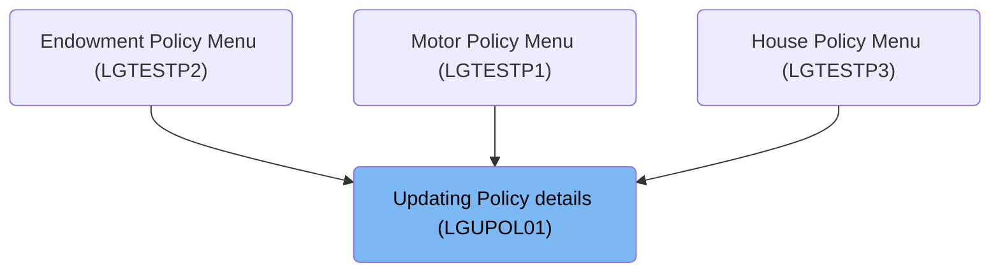
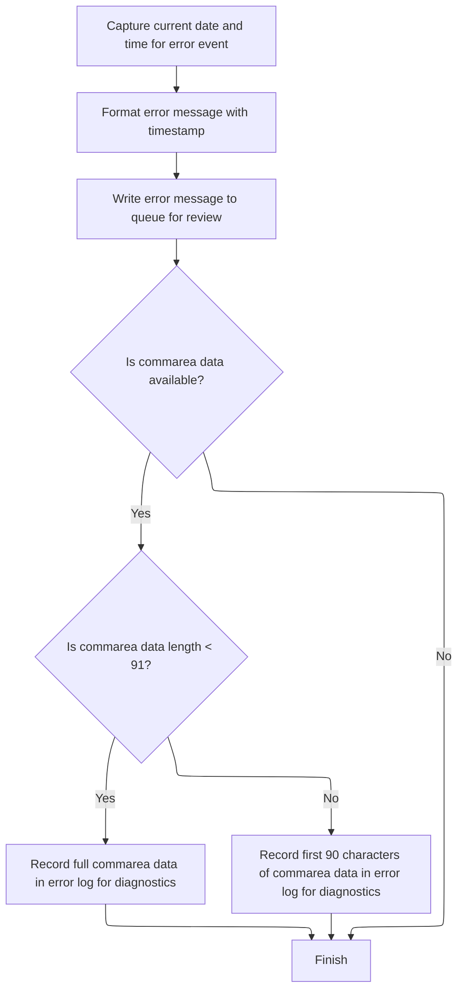
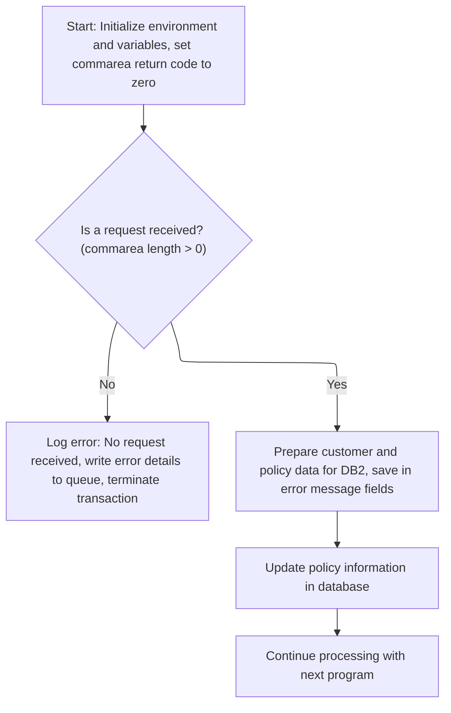
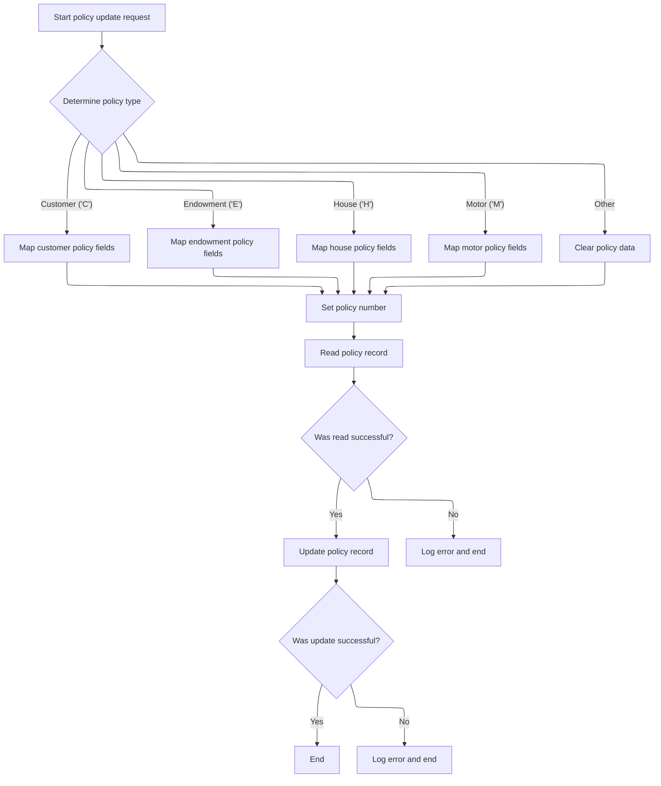

# Overview

This document explains the flow for updating insurance policy details. The process validates incoming requests, enforces business rules for each policy type, updates policy records in the database and VSAM file, and logs errors with context for traceability.

```mermaid
flowchart TD
    node1["Starting the Policy Update Flow
(Starting the Policy Update Flow)"]:::HeadingStyle --> node2{"Is input data valid?
(Starting the Policy Update Flow)"}:::HeadingStyle
    node2 -->|"No"| node3["DB2 Policy Update Logic
(Log error and audit)
(DB2 Policy Update Logic)"]:::HeadingStyle
    node2 -->|"Yes"| node4["Preparing for Policy Request Validation
(Preparing for Policy Request Validation)"]:::HeadingStyle
    node4 --> node5{"Is request valid for policy type?
(Preparing for Policy Request Validation)"}:::HeadingStyle
    node5 -->|"No"| node3
    node5 -->|"Yes"| node6["DB2 Policy Update Logic
(Update policy, audit logging)
(DB2 Policy Update Logic)"]:::HeadingStyle
    node6 --> node7{"Is VSAM update required for policy type?
(DB2 Policy Update Logic)"}:::HeadingStyle
    node7 -->|"Yes"| node8["Updating Policy in VSAM File"]:::HeadingStyle
    node7 -->|"No"| node6
    node8 --> node6

    click node1 goToHeading "Starting the Policy Update Flow"
    click node2 goToHeading "Starting the Policy Update Flow"
    click node3 goToHeading "base/src/lgupol01.cbl:143 Policy Update Logic"
    click node4 goToHeading "Preparing for Policy Request Validation"
    click node5 goToHeading "Preparing for Policy Request Validation"
    click node6 goToHeading "base/src/lgupol01.cbl:143 Policy Update Logic"
    click node7 goToHeading "base/src/lgupol01.cbl:143 Policy Update Logic"
    click node8 goToHeading "Updating Policy in VSAM File"
classDef HeadingStyle fill:#777777,stroke:#333,stroke-width:2px;

%% Swimm:
%% flowchart TD
%%     node1["Starting the Policy Update Flow
%% (Starting the Policy Update Flow)"]:::HeadingStyle --> node2{"Is input data valid?
%% (Starting the Policy Update Flow)"}:::HeadingStyle
%%     node2 -->|"No"| node3["<SwmToken path="base/src/lgupol01.cbl" pos="143:7:7" line-data="           PERFORM UPDATE-POLICY-DB2-INFO.">`DB2`</SwmToken> Policy Update Logic
%% (Log error and audit)
%% (<SwmToken path="base/src/lgupol01.cbl" pos="143:7:7" line-data="           PERFORM UPDATE-POLICY-DB2-INFO.">`DB2`</SwmToken> Policy Update Logic)"]:::HeadingStyle
%%     node2 -->|"Yes"| node4["Preparing for Policy Request Validation
%% (Preparing for Policy Request Validation)"]:::HeadingStyle
%%     node4 --> node5{"Is request valid for policy type?
%% (Preparing for Policy Request Validation)"}:::HeadingStyle
%%     node5 -->|"No"| node3
%%     node5 -->|"Yes"| node6["<SwmToken path="base/src/lgupol01.cbl" pos="143:7:7" line-data="           PERFORM UPDATE-POLICY-DB2-INFO.">`DB2`</SwmToken> Policy Update Logic
%% (Update policy, audit logging)
%% (<SwmToken path="base/src/lgupol01.cbl" pos="143:7:7" line-data="           PERFORM UPDATE-POLICY-DB2-INFO.">`DB2`</SwmToken> Policy Update Logic)"]:::HeadingStyle
%%     node6 --> node7{"Is VSAM update required for policy type?
%% (<SwmToken path="base/src/lgupol01.cbl" pos="143:7:7" line-data="           PERFORM UPDATE-POLICY-DB2-INFO.">`DB2`</SwmToken> Policy Update Logic)"}:::HeadingStyle
%%     node7 -->|"Yes"| node8["Updating Policy in VSAM File"]:::HeadingStyle
%%     node7 -->|"No"| node6
%%     node8 --> node6
%% 
%%     click node1 goToHeading "Starting the Policy Update Flow"
%%     click node2 goToHeading "Starting the Policy Update Flow"
%%     click node3 goToHeading "<SwmToken path="base/src/lgupol01.cbl" pos="143:7:7" line-data="           PERFORM UPDATE-POLICY-DB2-INFO.">`DB2`</SwmToken> Policy Update Logic"
%%     click node4 goToHeading "Preparing for Policy Request Validation"
%%     click node5 goToHeading "Preparing for Policy Request Validation"
%%     click node6 goToHeading "<SwmToken path="base/src/lgupol01.cbl" pos="143:7:7" line-data="           PERFORM UPDATE-POLICY-DB2-INFO.">`DB2`</SwmToken> Policy Update Logic"
%%     click node7 goToHeading "<SwmToken path="base/src/lgupol01.cbl" pos="143:7:7" line-data="           PERFORM UPDATE-POLICY-DB2-INFO.">`DB2`</SwmToken> Policy Update Logic"
%%     click node8 goToHeading "Updating Policy in VSAM File"
%% classDef HeadingStyle fill:#777777,stroke:#333,stroke-width:2px;
```



## Dependencies

### Programs

- <SwmToken path="base/src/lgupol01.cbl" pos="11:6:6" line-data="       PROGRAM-ID. LGUPOL01.">`LGUPOL01`</SwmToken> (<SwmPath>[base/src/lgupol01.cbl](base/src/lgupol01.cbl)</SwmPath>)
- <SwmToken path="base/src/lgupol01.cbl" pos="157:9:9" line-data="           EXEC CICS LINK Program(LGUPDB01)">`LGUPDB01`</SwmToken> (<SwmPath>[base/src/lgupdb01.cbl](base/src/lgupdb01.cbl)</SwmPath>)
- <SwmToken path="base/src/lgupdb01.cbl" pos="209:9:9" line-data="           EXEC CICS LINK Program(LGUPVS01)">`LGUPVS01`</SwmToken> (<SwmPath>[base/src/lgupvs01.cbl](base/src/lgupvs01.cbl)</SwmPath>)
- LGSTSQ (<SwmPath>[base/src/lgstsq.cbl](base/src/lgstsq.cbl)</SwmPath>)

### Copybooks

- LGCMAREA (<SwmPath>[base/src/lgcmarea.cpy](base/src/lgcmarea.cpy)</SwmPath>)
- LGPOLICY (<SwmPath>[base/src/lgpolicy.cpy](base/src/lgpolicy.cpy)</SwmPath>)
- SQLCA

# Where is this program used?

This program is used multiple times in the codebase as represented in the following diagram:



## Detailed View of the Program's Functionality

## Starting the Policy Update Flow

### Initialization and Commarea Validation

- When the policy update flow begins, the main program initializes its working storage, setting up fields to hold transaction, terminal, and task identifiers from the CICS environment.
- The program checks if the input area (commarea) is present by verifying its length. If the length is zero, this means no input was provided.
- If no commarea is received, an error message is prepared and logged, and the transaction is forcibly terminated (abended) to ensure the issue is recorded for later troubleshooting.

### Error Logging with Context

- When an error is detected (such as missing commarea), the program captures the current date and time using CICS system calls.
- The error message is formatted to include the timestamp, program name, and relevant context.
- The error message is then sent to a system queue for review, ensuring all errors are centrally logged.
- If commarea data is available, up to 90 bytes of it are also logged for diagnostic purposes. If the commarea is shorter than 91 bytes, the entire commarea is logged; otherwise, only the first 90 bytes are included.

### Preparing for Policy Request Validation

- After error handling, the program sets up for normal processing by initializing the commarea return code to indicate success and storing the commarea length and address.
- The program then checks the type of policy update request (endowment, house, motor, or other) and verifies that the commarea is long enough to contain all required data for the requested policy type.
- If the commarea is too short for the requested policy type, an error code is set and the program returns immediately.
- If the request type is unknown, a different error code is set and the update is skipped.
- If all checks pass, the program proceeds to update the policy data in the database.

## Updating Policy Data in <SwmToken path="base/src/lgupol01.cbl" pos="143:7:7" line-data="           PERFORM UPDATE-POLICY-DB2-INFO.">`DB2`</SwmToken>

### Delegation to <SwmToken path="base/src/lgupol01.cbl" pos="143:7:7" line-data="           PERFORM UPDATE-POLICY-DB2-INFO.">`DB2`</SwmToken> Update Logic

- The main program delegates the actual database update to a separate module, passing the commarea and specifying a maximum length.
- This separation keeps the database logic modular and reusable.

## <SwmToken path="base/src/lgupol01.cbl" pos="143:7:7" line-data="           PERFORM UPDATE-POLICY-DB2-INFO.">`DB2`</SwmToken> Update and Error Handling

### Initialization and Validation

- The <SwmToken path="base/src/lgupol01.cbl" pos="143:7:7" line-data="           PERFORM UPDATE-POLICY-DB2-INFO.">`DB2`</SwmToken> update module initializes its environment and working storage, setting up transaction context and preparing <SwmToken path="base/src/lgupol01.cbl" pos="143:7:7" line-data="           PERFORM UPDATE-POLICY-DB2-INFO.">`DB2`</SwmToken> host variables.
- It checks for a valid commarea and, if missing, logs an error and abends the transaction.
- The commarea return code is initialized to indicate success, and customer/policy numbers are converted to <SwmToken path="base/src/lgupol01.cbl" pos="143:7:7" line-data="           PERFORM UPDATE-POLICY-DB2-INFO.">`DB2`</SwmToken> integer formats for use in SQL statements. These values are also saved in the error message structure for logging.

### Policy Update Flow

- The module opens a <SwmToken path="base/src/lgupol01.cbl" pos="143:7:7" line-data="           PERFORM UPDATE-POLICY-DB2-INFO.">`DB2`</SwmToken> cursor to select the policy record for update, using the customer and policy numbers as keys.
- The result of the cursor open is checked:
  - If successful, processing continues.
  - If a deadlock or other error occurs, an error code is set, the error is logged, and the transaction returns.
- The module fetches the policy row. Only the first matching row is used, so the database schema must guarantee uniqueness.
- If the fetch is successful, the program compares the timestamp in the commarea with the timestamp in the <SwmToken path="base/src/lgupol01.cbl" pos="143:7:7" line-data="           PERFORM UPDATE-POLICY-DB2-INFO.">`DB2`</SwmToken> row to ensure the record has not changed since the request was made.
  - If the timestamps match, the program branches to the appropriate update routine for the policy type (endowment, house, motor).
  - If the timestamps do not match, an error code is set to indicate a concurrency error and the update is rejected.
- Each policy type update routine converts commarea fields to <SwmToken path="base/src/lgupol01.cbl" pos="143:7:7" line-data="           PERFORM UPDATE-POLICY-DB2-INFO.">`DB2`</SwmToken> integer formats and executes an SQL UPDATE statement for the corresponding table.
  - If the update fails, an error code is set and the error is logged.
- After updating the policy-specific table, the main policy record is updated with new details and a new timestamp.
  - The new timestamp is retrieved and returned in the commarea.
  - If the update fails, a rollback is performed, an error code is set, and the error is logged.
- If the fetch did not find a matching record, an error code is set to indicate "not found" or a general error, and the error is logged.

### Closing the Cursor

- The cursor is closed, and the return code is set based on the result.
- If an error occurs during cursor close, it is logged and the transaction returns immediately.

### Error Logging in <SwmToken path="base/src/lgupol01.cbl" pos="143:7:7" line-data="           PERFORM UPDATE-POLICY-DB2-INFO.">`DB2`</SwmToken> Module

- When an error occurs, the SQLCODE is saved in the error message.
- The current date and time are captured and formatted.
- The error message is sent to the system queue for review.
- If commarea data is available, up to 90 bytes are also logged for diagnostic purposes.

## Updating Policy in VSAM File

### Policy Type Mapping and Record Update

- The VSAM update module begins by determining the policy type from the request.
- Depending on the type (customer, endowment, house, motor), the relevant fields are mapped from the commarea to the VSAM record structure.
- If the policy type is unknown, the policy data area is cleared.
- The policy number is set in the VSAM record key.
- The module attempts to read the policy record from the VSAM file using the key.
  - If the read fails, an error code is set, the error is logged, and the transaction is abended and returned.
- If the read is successful, the module rewrites the policy record with the updated data.
  - If the rewrite fails, an error code is set, the error is logged, and the transaction is abended and returned.

### Error Logging in VSAM Module

- When an error occurs, the current date and time are captured and formatted.
- The error message is prepared with context, including customer number, response codes, and other relevant details.
- The error message is sent to the system queue for review.
- If commarea data is available, up to 90 bytes are also logged for diagnostic purposes.

## System Queue Logging (LGSTSQ)

### Message Preparation and Routing

- The system queue logging module prepares the message for logging, clearing previous data and setting up the message structure.
- It determines whether the message came from a program or a CICS RECEIVE operation.
  - If from a program, the commarea data is used directly.
  - If from a RECEIVE, the data is extracted from the received buffer and adjusted for length.
- The default queue name is set, but if the message starts with a special prefix, the queue name is adjusted accordingly.
- The message length is adjusted to account for protocol requirements.

### Writing to Queues

- The message is written to a transient data queue for system monitoring.
- The message is also written to a temporary storage queue for application-specific error tracking.
- If the message was received interactively, a minimal response is sent back to the terminal.

### Completion

- The module returns control to the caller, completing the error logging process.

---

This detailed flow covers initialization, validation, error handling, policy update logic for both <SwmToken path="base/src/lgupol01.cbl" pos="143:7:7" line-data="           PERFORM UPDATE-POLICY-DB2-INFO.">`DB2`</SwmToken> and VSAM, and centralized error logging, ensuring robust processing and traceability for all policy update operations in the application.

# Rule Definition

| Paragraph Name                                                                                                                                                                                                                                                                                                                                                                                                                                                                                                                                                       | Rule ID | Category          | Description                                                                                                                                                                                                                                                                                                                             | Conditions                                                                                                                                                                                                                                                                                                                                                                                                                       | Remarks                                                                                                                                                                                                                                                                                                                                                                                                                                                                                               |
| -------------------------------------------------------------------------------------------------------------------------------------------------------------------------------------------------------------------------------------------------------------------------------------------------------------------------------------------------------------------------------------------------------------------------------------------------------------------------------------------------------------------------------------------------------------------- | ------- | ----------------- | --------------------------------------------------------------------------------------------------------------------------------------------------------------------------------------------------------------------------------------------------------------------------------------------------------------------------------------- | -------------------------------------------------------------------------------------------------------------------------------------------------------------------------------------------------------------------------------------------------------------------------------------------------------------------------------------------------------------------------------------------------------------------------------- | ----------------------------------------------------------------------------------------------------------------------------------------------------------------------------------------------------------------------------------------------------------------------------------------------------------------------------------------------------------------------------------------------------------------------------------------------------------------------------------------------------- |
| MAINLINE SECTION (<SwmToken path="base/src/lgupol01.cbl" pos="11:6:6" line-data="       PROGRAM-ID. LGUPOL01.">`LGUPOL01`</SwmToken>, <SwmToken path="base/src/lgupol01.cbl" pos="157:9:9" line-data="           EXEC CICS LINK Program(LGUPDB01)">`LGUPDB01`</SwmToken>), MAINLINE SECTION (<SwmToken path="base/src/lgupdb01.cbl" pos="209:9:9" line-data="           EXEC CICS LINK Program(LGUPVS01)">`LGUPVS01`</SwmToken>)                                                                                                                                     | RL-001  | Conditional Logic | Before any policy update request is processed, the system must check that the input commarea is present (non-zero length). If not, processing is halted and an error is logged.                                                                                                                                                         | EIBCALEN (commarea length) is zero.                                                                                                                                                                                                                                                                                                                                                                                              | Outcome code for missing commarea: ABEND with code 'LGCA'. Error message includes date (MMDDYYYY, 8 bytes), time (HHMMSS, 6 bytes), program name (9 bytes), and context. Error message written to queues.                                                                                                                                                                                                                                                                                             |
| <SwmToken path="base/src/lgupol01.cbl" pos="101:3:7" line-data="               PERFORM WRITE-ERROR-MESSAGE">`WRITE-ERROR-MESSAGE`</SwmToken> (<SwmToken path="base/src/lgupol01.cbl" pos="11:6:6" line-data="       PROGRAM-ID. LGUPOL01.">`LGUPOL01`</SwmToken>, <SwmToken path="base/src/lgupol01.cbl" pos="157:9:9" line-data="           EXEC CICS LINK Program(LGUPDB01)">`LGUPDB01`</SwmToken>, <SwmToken path="base/src/lgupdb01.cbl" pos="209:9:9" line-data="           EXEC CICS LINK Program(LGUPVS01)">`LGUPVS01`</SwmToken>)                            | RL-002  | Data Assignment   | For every error event, the system captures the current date and time, formats them, and includes them in the error message structure. Up to 90 bytes of commarea data are included for diagnostics.                                                                                                                                     | Any error event; commarea length > 0.                                                                                                                                                                                                                                                                                                                                                                                            | Error message format: date (8 bytes), time (6 bytes), program name (9 bytes), variable/context (21 bytes or more), customer/policy numbers (10 bytes each), SQLCODE/RESP/RESP2 (5 bytes each). If commarea < 91 bytes, log entire commarea; else, log first 90 bytes.                                                                                                                                                                                                                                 |
| MAINLINE SECTION (<SwmToken path="base/src/lgupol01.cbl" pos="11:6:6" line-data="       PROGRAM-ID. LGUPOL01.">`LGUPOL01`</SwmToken>), MAINLINE SECTION (<SwmToken path="base/src/lgupol01.cbl" pos="157:9:9" line-data="           EXEC CICS LINK Program(LGUPDB01)">`LGUPDB01`</SwmToken>)                                                                                                                                                                                                                                                                         | RL-003  | Conditional Logic | The system checks that the commarea length meets the minimum required for the requested policy type before processing.                                                                                                                                                                                                                  | Request ID is <SwmToken path="base/src/lgupol01.cbl" pos="115:4:4" line-data="             WHEN &#39;01UEND&#39;">`01UEND`</SwmToken>, <SwmToken path="base/src/lgupol01.cbl" pos="123:4:4" line-data="             WHEN &#39;01UHOU&#39;">`01UHOU`</SwmToken>, or <SwmToken path="base/src/lgupol01.cbl" pos="131:4:4" line-data="             WHEN &#39;01UMOT&#39;">`01UMOT`</SwmToken>; commarea length < required for type. | Minimum lengths: Endowment (<SwmToken path="base/src/lgupol01.cbl" pos="115:4:4" line-data="             WHEN &#39;01UEND&#39;">`01UEND`</SwmToken>) = 152 bytes, House (<SwmToken path="base/src/lgupol01.cbl" pos="123:4:4" line-data="             WHEN &#39;01UHOU&#39;">`01UHOU`</SwmToken>) = 158 bytes, Motor (<SwmToken path="base/src/lgupol01.cbl" pos="131:4:4" line-data="             WHEN &#39;01UMOT&#39;">`01UMOT`</SwmToken>) = 165 bytes. Outcome code for insufficient data: '98'. |
| MAINLINE SECTION (<SwmToken path="base/src/lgupol01.cbl" pos="11:6:6" line-data="       PROGRAM-ID. LGUPOL01.">`LGUPOL01`</SwmToken>), MAINLINE SECTION (<SwmToken path="base/src/lgupol01.cbl" pos="157:9:9" line-data="           EXEC CICS LINK Program(LGUPDB01)">`LGUPDB01`</SwmToken>)                                                                                                                                                                                                                                                                         | RL-004  | Conditional Logic | If the request ID is not recognized, the system sets the outcome code to '99' and returns without updating the policy.                                                                                                                                                                                                                  | Request ID is not <SwmToken path="base/src/lgupol01.cbl" pos="115:4:4" line-data="             WHEN &#39;01UEND&#39;">`01UEND`</SwmToken>, <SwmToken path="base/src/lgupol01.cbl" pos="123:4:4" line-data="             WHEN &#39;01UHOU&#39;">`01UHOU`</SwmToken>, or <SwmToken path="base/src/lgupol01.cbl" pos="131:4:4" line-data="             WHEN &#39;01UMOT&#39;">`01UMOT`</SwmToken>.                                  | Outcome code for invalid request: '99'.                                                                                                                                                                                                                                                                                                                                                                                                                                                               |
| <SwmToken path="base/src/lgupol01.cbl" pos="143:3:9" line-data="           PERFORM UPDATE-POLICY-DB2-INFO.">`UPDATE-POLICY-DB2-INFO`</SwmToken> (<SwmToken path="base/src/lgupol01.cbl" pos="157:9:9" line-data="           EXEC CICS LINK Program(LGUPDB01)">`LGUPDB01`</SwmToken>)                                                                                                                                                                                                                                                                                 | RL-005  | Computation       | For <SwmToken path="base/src/lgupol01.cbl" pos="143:7:7" line-data="           PERFORM UPDATE-POLICY-DB2-INFO.">`DB2`</SwmToken> updates, the system retrieves the policy record using customer and policy numbers. If found, it checks that the timestamp in the commarea matches the database record. If not, the update is rejected. | Request is valid; policy found in <SwmToken path="base/src/lgupol01.cbl" pos="143:7:7" line-data="           PERFORM UPDATE-POLICY-DB2-INFO.">`DB2`</SwmToken>; timestamp matches.                                                                                                                                                                                                                                               | Outcome code for policy not found: '01'. Outcome code for timestamp mismatch: '02'. Outcome code for <SwmToken path="base/src/lgupol01.cbl" pos="143:7:7" line-data="           PERFORM UPDATE-POLICY-DB2-INFO.">`DB2`</SwmToken> error: '90'.                                                                                                                                                                                                                                                        |
| MAINLINE SECTION (<SwmToken path="base/src/lgupdb01.cbl" pos="209:9:9" line-data="           EXEC CICS LINK Program(LGUPVS01)">`LGUPVS01`</SwmToken>)                                                                                                                                                                                                                                                                                                                                                                                                                | RL-006  | Computation       | For VSAM updates, the system extracts the policy type from the request ID, maps relevant fields from the commarea, reads the policy record from the VSAM file, and updates it. Errors are logged with context and commarea data.                                                                                                        | Request is valid; VSAM record found.                                                                                                                                                                                                                                                                                                                                                                                             | Outcome code for VSAM read error: '81'. Outcome code for VSAM update error: '82'. Error logs include RESP/RESP2 codes.                                                                                                                                                                                                                                                                                                                                                                                |
| <SwmToken path="base/src/lgupol01.cbl" pos="101:3:7" line-data="               PERFORM WRITE-ERROR-MESSAGE">`WRITE-ERROR-MESSAGE`</SwmToken> (<SwmToken path="base/src/lgupol01.cbl" pos="11:6:6" line-data="       PROGRAM-ID. LGUPOL01.">`LGUPOL01`</SwmToken>, <SwmToken path="base/src/lgupol01.cbl" pos="157:9:9" line-data="           EXEC CICS LINK Program(LGUPDB01)">`LGUPDB01`</SwmToken>, <SwmToken path="base/src/lgupdb01.cbl" pos="209:9:9" line-data="           EXEC CICS LINK Program(LGUPVS01)">`LGUPVS01`</SwmToken>), MAINLINE SECTION (LGSTSQ) | RL-007  | Data Assignment   | All error logs must be written to a central error queue ('GENAERRS') and to a temporary queue for immediate access.                                                                                                                                                                                                                     | Any error event.                                                                                                                                                                                                                                                                                                                                                                                                                 | Central queue name: 'GENAERRS'. Temporary queue name: varies (default 'CSMT', or <SwmToken path="base/src/lgstsq.cbl" pos="6:19:19" line-data="      *  parm Q=nnnn is passed then Queue name GENAnnnn is used        *">`GENAnnnn`</SwmToken> if Q=nnnn is specified).                                                                                                                                                                                                                               |
| <SwmToken path="base/src/lgupol01.cbl" pos="101:3:7" line-data="               PERFORM WRITE-ERROR-MESSAGE">`WRITE-ERROR-MESSAGE`</SwmToken> (<SwmToken path="base/src/lgupol01.cbl" pos="157:9:9" line-data="           EXEC CICS LINK Program(LGUPDB01)">`LGUPDB01`</SwmToken>, <SwmToken path="base/src/lgupdb01.cbl" pos="209:9:9" line-data="           EXEC CICS LINK Program(LGUPVS01)">`LGUPVS01`</SwmToken>), MAINLINE SECTION (LGSTSQ)                                                                                                                     | RL-008  | Data Assignment   | Error logs must include program name, customer and policy numbers, operation description, and system response codes (SQLCODE for <SwmToken path="base/src/lgupol01.cbl" pos="143:7:7" line-data="           PERFORM UPDATE-POLICY-DB2-INFO.">`DB2`</SwmToken>, RESP/RESP2 for VSAM/CICS).                                               | Any error event.                                                                                                                                                                                                                                                                                                                                                                                                                 | Error message fields: program name (9 bytes), customer number (10 bytes), policy number (10 bytes), operation description (variable), SQLCODE/RESP/RESP2 (5 bytes each).                                                                                                                                                                                                                                                                                                                              |

# User Stories

## User Story 1: Validate input commarea and request type before processing

---

### Story Description:

As a policyholder submitting an update request, I want the system to validate that my input data is present, of sufficient length for my policy type, and that my request type is recognized so that my request is processed only if it meets all requirements, and I receive clear feedback if it does not.

---

### Business Rule Mapping:

| Rule ID | Paragraph Name                                                                                                                                                                                                                                                                                                                                                                                                                   | Rule Description                                                                                                                                                                |
| ------- | -------------------------------------------------------------------------------------------------------------------------------------------------------------------------------------------------------------------------------------------------------------------------------------------------------------------------------------------------------------------------------------------------------------------------------- | ------------------------------------------------------------------------------------------------------------------------------------------------------------------------------- |
| RL-001  | MAINLINE SECTION (<SwmToken path="base/src/lgupol01.cbl" pos="11:6:6" line-data="       PROGRAM-ID. LGUPOL01.">`LGUPOL01`</SwmToken>, <SwmToken path="base/src/lgupol01.cbl" pos="157:9:9" line-data="           EXEC CICS LINK Program(LGUPDB01)">`LGUPDB01`</SwmToken>), MAINLINE SECTION (<SwmToken path="base/src/lgupdb01.cbl" pos="209:9:9" line-data="           EXEC CICS LINK Program(LGUPVS01)">`LGUPVS01`</SwmToken>) | Before any policy update request is processed, the system must check that the input commarea is present (non-zero length). If not, processing is halted and an error is logged. |
| RL-003  | MAINLINE SECTION (<SwmToken path="base/src/lgupol01.cbl" pos="11:6:6" line-data="       PROGRAM-ID. LGUPOL01.">`LGUPOL01`</SwmToken>), MAINLINE SECTION (<SwmToken path="base/src/lgupol01.cbl" pos="157:9:9" line-data="           EXEC CICS LINK Program(LGUPDB01)">`LGUPDB01`</SwmToken>)                                                                                                                                     | The system checks that the commarea length meets the minimum required for the requested policy type before processing.                                                          |
| RL-004  | MAINLINE SECTION (<SwmToken path="base/src/lgupol01.cbl" pos="11:6:6" line-data="       PROGRAM-ID. LGUPOL01.">`LGUPOL01`</SwmToken>), MAINLINE SECTION (<SwmToken path="base/src/lgupol01.cbl" pos="157:9:9" line-data="           EXEC CICS LINK Program(LGUPDB01)">`LGUPDB01`</SwmToken>)                                                                                                                                     | If the request ID is not recognized, the system sets the outcome code to '99' and returns without updating the policy.                                                          |

---

### Relevant Functionality:

- **MAINLINE SECTION (**<SwmToken path="base/src/lgupol01.cbl" pos="11:6:6" line-data="       PROGRAM-ID. LGUPOL01.">`LGUPOL01`</SwmToken>
  1. **RL-001:**
     - If commarea length is zero:
       - Set error message context (program name, date, time)
       - Log error via <SwmToken path="base/src/lgupol01.cbl" pos="101:3:7" line-data="               PERFORM WRITE-ERROR-MESSAGE">`WRITE-ERROR-MESSAGE`</SwmToken>
       - Terminate transaction with ABEND 'LGCA'
- **MAINLINE SECTION (**<SwmToken path="base/src/lgupol01.cbl" pos="11:6:6" line-data="       PROGRAM-ID. LGUPOL01.">`LGUPOL01`</SwmToken>**)**
  1. **RL-003:**
     - Evaluate request ID:
       - For <SwmToken path="base/src/lgupol01.cbl" pos="115:4:4" line-data="             WHEN &#39;01UEND&#39;">`01UEND`</SwmToken>: required length = 152 bytes
       - For <SwmToken path="base/src/lgupol01.cbl" pos="123:4:4" line-data="             WHEN &#39;01UHOU&#39;">`01UHOU`</SwmToken>: required length = 158 bytes
       - For <SwmToken path="base/src/lgupol01.cbl" pos="131:4:4" line-data="             WHEN &#39;01UMOT&#39;">`01UMOT`</SwmToken>: required length = 165 bytes
       - If commarea length < required:
         - Set outcome code to '98'
         - Return without updating policy
  2. **RL-004:**
     - If request ID is not recognized:
       - Set outcome code to '99'
       - Return without updating policy

## User Story 2: Update policy records in <SwmToken path="base/src/lgupol01.cbl" pos="143:7:7" line-data="           PERFORM UPDATE-POLICY-DB2-INFO.">`DB2`</SwmToken> with concurrency control and comprehensive error handling

---

### Story Description:

As a policyholder whose data is stored in <SwmToken path="base/src/lgupol01.cbl" pos="143:7:7" line-data="           PERFORM UPDATE-POLICY-DB2-INFO.">`DB2`</SwmToken>, I want my policy update request to be processed only if my policy exists and my data is current, with clear outcome codes and detailed error logging (including date, time, program name, customer and policy numbers, operation description, and SQLCODE) written to both central and temporary queues, so that my data remains consistent and any issues are traceable and auditable.

---

### Business Rule Mapping:

| Rule ID | Paragraph Name                                                                                                                                                                                                                                                                                                                                                                                                                                                                                                                                                       | Rule Description                                                                                                                                                                                                                                                                                                                        |
| ------- | -------------------------------------------------------------------------------------------------------------------------------------------------------------------------------------------------------------------------------------------------------------------------------------------------------------------------------------------------------------------------------------------------------------------------------------------------------------------------------------------------------------------------------------------------------------------- | --------------------------------------------------------------------------------------------------------------------------------------------------------------------------------------------------------------------------------------------------------------------------------------------------------------------------------------- |
| RL-002  | <SwmToken path="base/src/lgupol01.cbl" pos="101:3:7" line-data="               PERFORM WRITE-ERROR-MESSAGE">`WRITE-ERROR-MESSAGE`</SwmToken> (<SwmToken path="base/src/lgupol01.cbl" pos="11:6:6" line-data="       PROGRAM-ID. LGUPOL01.">`LGUPOL01`</SwmToken>, <SwmToken path="base/src/lgupol01.cbl" pos="157:9:9" line-data="           EXEC CICS LINK Program(LGUPDB01)">`LGUPDB01`</SwmToken>, <SwmToken path="base/src/lgupdb01.cbl" pos="209:9:9" line-data="           EXEC CICS LINK Program(LGUPVS01)">`LGUPVS01`</SwmToken>)                            | For every error event, the system captures the current date and time, formats them, and includes them in the error message structure. Up to 90 bytes of commarea data are included for diagnostics.                                                                                                                                     |
| RL-007  | <SwmToken path="base/src/lgupol01.cbl" pos="101:3:7" line-data="               PERFORM WRITE-ERROR-MESSAGE">`WRITE-ERROR-MESSAGE`</SwmToken> (<SwmToken path="base/src/lgupol01.cbl" pos="11:6:6" line-data="       PROGRAM-ID. LGUPOL01.">`LGUPOL01`</SwmToken>, <SwmToken path="base/src/lgupol01.cbl" pos="157:9:9" line-data="           EXEC CICS LINK Program(LGUPDB01)">`LGUPDB01`</SwmToken>, <SwmToken path="base/src/lgupdb01.cbl" pos="209:9:9" line-data="           EXEC CICS LINK Program(LGUPVS01)">`LGUPVS01`</SwmToken>), MAINLINE SECTION (LGSTSQ) | All error logs must be written to a central error queue ('GENAERRS') and to a temporary queue for immediate access.                                                                                                                                                                                                                     |
| RL-005  | <SwmToken path="base/src/lgupol01.cbl" pos="143:3:9" line-data="           PERFORM UPDATE-POLICY-DB2-INFO.">`UPDATE-POLICY-DB2-INFO`</SwmToken> (<SwmToken path="base/src/lgupol01.cbl" pos="157:9:9" line-data="           EXEC CICS LINK Program(LGUPDB01)">`LGUPDB01`</SwmToken>)                                                                                                                                                                                                                                                                                 | For <SwmToken path="base/src/lgupol01.cbl" pos="143:7:7" line-data="           PERFORM UPDATE-POLICY-DB2-INFO.">`DB2`</SwmToken> updates, the system retrieves the policy record using customer and policy numbers. If found, it checks that the timestamp in the commarea matches the database record. If not, the update is rejected. |
| RL-008  | <SwmToken path="base/src/lgupol01.cbl" pos="101:3:7" line-data="               PERFORM WRITE-ERROR-MESSAGE">`WRITE-ERROR-MESSAGE`</SwmToken> (<SwmToken path="base/src/lgupol01.cbl" pos="157:9:9" line-data="           EXEC CICS LINK Program(LGUPDB01)">`LGUPDB01`</SwmToken>, <SwmToken path="base/src/lgupdb01.cbl" pos="209:9:9" line-data="           EXEC CICS LINK Program(LGUPVS01)">`LGUPVS01`</SwmToken>), MAINLINE SECTION (LGSTSQ)                                                                                                                     | Error logs must include program name, customer and policy numbers, operation description, and system response codes (SQLCODE for <SwmToken path="base/src/lgupol01.cbl" pos="143:7:7" line-data="           PERFORM UPDATE-POLICY-DB2-INFO.">`DB2`</SwmToken>, RESP/RESP2 for VSAM/CICS).                                               |

---

### Relevant Functionality:

- <SwmToken path="base/src/lgupol01.cbl" pos="101:3:7" line-data="               PERFORM WRITE-ERROR-MESSAGE">`WRITE-ERROR-MESSAGE`</SwmToken> **(**<SwmToken path="base/src/lgupol01.cbl" pos="11:6:6" line-data="       PROGRAM-ID. LGUPOL01.">`LGUPOL01`</SwmToken>
  1. **RL-002:**
     - On error:
       - Get current date/time
       - Format date/time fields
       - Populate error message structure with context
       - If commarea length > 0:
         - If < 91 bytes, include all commarea data
         - Else, include first 90 bytes
       - Write error message to central queue ('GENAERRS') and temporary queue
  2. **RL-007:**
     - On error:
       - Write error message to central queue ('GENAERRS')
       - Write error message to temporary queue (default 'CSMT', or <SwmToken path="base/src/lgstsq.cbl" pos="6:19:19" line-data="      *  parm Q=nnnn is passed then Queue name GENAnnnn is used        *">`GENAnnnn`</SwmToken> if Q=nnnn specified)
- <SwmToken path="base/src/lgupol01.cbl" pos="143:3:9" line-data="           PERFORM UPDATE-POLICY-DB2-INFO.">`UPDATE-POLICY-DB2-INFO`</SwmToken> **(**<SwmToken path="base/src/lgupol01.cbl" pos="157:9:9" line-data="           EXEC CICS LINK Program(LGUPDB01)">`LGUPDB01`</SwmToken>**)**
  1. **RL-005:**
     - Open cursor for policy record
     - Fetch policy row
     - If found:
       - Compare commarea timestamp to <SwmToken path="base/src/lgupol01.cbl" pos="143:7:7" line-data="           PERFORM UPDATE-POLICY-DB2-INFO.">`DB2`</SwmToken> timestamp
       - If match:
         - Update policy-specific table (Endowment, House, Motor)
         - Update main POLICY table and retrieve new timestamp
       - Else:
         - Set outcome code to '02' (policy changed)
     - If not found:
       - Set outcome code to '01' (policy not found)
     - On <SwmToken path="base/src/lgupol01.cbl" pos="143:7:7" line-data="           PERFORM UPDATE-POLICY-DB2-INFO.">`DB2`</SwmToken> error:
       - Set outcome code to '90'
       - Log error with SQLCODE
- <SwmToken path="base/src/lgupol01.cbl" pos="101:3:7" line-data="               PERFORM WRITE-ERROR-MESSAGE">`WRITE-ERROR-MESSAGE`</SwmToken> **(**<SwmToken path="base/src/lgupol01.cbl" pos="157:9:9" line-data="           EXEC CICS LINK Program(LGUPDB01)">`LGUPDB01`</SwmToken>
  1. **RL-008:**
     - Populate error message with:
       - Program name
       - Customer number
       - Policy number
       - Operation description
       - SQLCODE (<SwmToken path="base/src/lgupol01.cbl" pos="143:7:7" line-data="           PERFORM UPDATE-POLICY-DB2-INFO.">`DB2`</SwmToken>) or RESP/RESP2 (VSAM/CICS)
       - Write to error queues

## User Story 3: Update policy records in VSAM with comprehensive error handling

---

### Story Description:

As a policyholder whose data is stored in VSAM, I want my policy update request to be processed with proper mapping and error handling, including outcome codes and detailed error logs (including date, time, program name, customer and policy numbers, operation description, and RESP/RESP2) written to both central and temporary queues if the record cannot be read or updated, so that my request is handled reliably and issues are traceable and auditable.

---

### Business Rule Mapping:

| Rule ID | Paragraph Name                                                                                                                                                                                                                                                                                                                                                                                                                                                                                                                                                       | Rule Description                                                                                                                                                                                                                                                                          |
| ------- | -------------------------------------------------------------------------------------------------------------------------------------------------------------------------------------------------------------------------------------------------------------------------------------------------------------------------------------------------------------------------------------------------------------------------------------------------------------------------------------------------------------------------------------------------------------------- | ----------------------------------------------------------------------------------------------------------------------------------------------------------------------------------------------------------------------------------------------------------------------------------------- |
| RL-002  | <SwmToken path="base/src/lgupol01.cbl" pos="101:3:7" line-data="               PERFORM WRITE-ERROR-MESSAGE">`WRITE-ERROR-MESSAGE`</SwmToken> (<SwmToken path="base/src/lgupol01.cbl" pos="11:6:6" line-data="       PROGRAM-ID. LGUPOL01.">`LGUPOL01`</SwmToken>, <SwmToken path="base/src/lgupol01.cbl" pos="157:9:9" line-data="           EXEC CICS LINK Program(LGUPDB01)">`LGUPDB01`</SwmToken>, <SwmToken path="base/src/lgupdb01.cbl" pos="209:9:9" line-data="           EXEC CICS LINK Program(LGUPVS01)">`LGUPVS01`</SwmToken>)                            | For every error event, the system captures the current date and time, formats them, and includes them in the error message structure. Up to 90 bytes of commarea data are included for diagnostics.                                                                                       |
| RL-007  | <SwmToken path="base/src/lgupol01.cbl" pos="101:3:7" line-data="               PERFORM WRITE-ERROR-MESSAGE">`WRITE-ERROR-MESSAGE`</SwmToken> (<SwmToken path="base/src/lgupol01.cbl" pos="11:6:6" line-data="       PROGRAM-ID. LGUPOL01.">`LGUPOL01`</SwmToken>, <SwmToken path="base/src/lgupol01.cbl" pos="157:9:9" line-data="           EXEC CICS LINK Program(LGUPDB01)">`LGUPDB01`</SwmToken>, <SwmToken path="base/src/lgupdb01.cbl" pos="209:9:9" line-data="           EXEC CICS LINK Program(LGUPVS01)">`LGUPVS01`</SwmToken>), MAINLINE SECTION (LGSTSQ) | All error logs must be written to a central error queue ('GENAERRS') and to a temporary queue for immediate access.                                                                                                                                                                       |
| RL-006  | MAINLINE SECTION (<SwmToken path="base/src/lgupdb01.cbl" pos="209:9:9" line-data="           EXEC CICS LINK Program(LGUPVS01)">`LGUPVS01`</SwmToken>)                                                                                                                                                                                                                                                                                                                                                                                                                | For VSAM updates, the system extracts the policy type from the request ID, maps relevant fields from the commarea, reads the policy record from the VSAM file, and updates it. Errors are logged with context and commarea data.                                                          |
| RL-008  | <SwmToken path="base/src/lgupol01.cbl" pos="101:3:7" line-data="               PERFORM WRITE-ERROR-MESSAGE">`WRITE-ERROR-MESSAGE`</SwmToken> (<SwmToken path="base/src/lgupol01.cbl" pos="157:9:9" line-data="           EXEC CICS LINK Program(LGUPDB01)">`LGUPDB01`</SwmToken>, <SwmToken path="base/src/lgupdb01.cbl" pos="209:9:9" line-data="           EXEC CICS LINK Program(LGUPVS01)">`LGUPVS01`</SwmToken>), MAINLINE SECTION (LGSTSQ)                                                                                                                     | Error logs must include program name, customer and policy numbers, operation description, and system response codes (SQLCODE for <SwmToken path="base/src/lgupol01.cbl" pos="143:7:7" line-data="           PERFORM UPDATE-POLICY-DB2-INFO.">`DB2`</SwmToken>, RESP/RESP2 for VSAM/CICS). |

---

### Relevant Functionality:

- <SwmToken path="base/src/lgupol01.cbl" pos="101:3:7" line-data="               PERFORM WRITE-ERROR-MESSAGE">`WRITE-ERROR-MESSAGE`</SwmToken> **(**<SwmToken path="base/src/lgupol01.cbl" pos="11:6:6" line-data="       PROGRAM-ID. LGUPOL01.">`LGUPOL01`</SwmToken>
  1. **RL-002:**
     - On error:
       - Get current date/time
       - Format date/time fields
       - Populate error message structure with context
       - If commarea length > 0:
         - If < 91 bytes, include all commarea data
         - Else, include first 90 bytes
       - Write error message to central queue ('GENAERRS') and temporary queue
  2. **RL-007:**
     - On error:
       - Write error message to central queue ('GENAERRS')
       - Write error message to temporary queue (default 'CSMT', or <SwmToken path="base/src/lgstsq.cbl" pos="6:19:19" line-data="      *  parm Q=nnnn is passed then Queue name GENAnnnn is used        *">`GENAnnnn`</SwmToken> if Q=nnnn specified)
- **MAINLINE SECTION (**<SwmToken path="base/src/lgupdb01.cbl" pos="209:9:9" line-data="           EXEC CICS LINK Program(LGUPVS01)">`LGUPVS01`</SwmToken>**)**
  1. **RL-006:**
     - Extract policy type from request ID
     - Map commarea fields to VSAM record structure
     - Read VSAM record using key
     - If found:
       - Update VSAM record with new data
     - If read/update fails:
       - Set outcome code ('81' for read, '82' for update)
       - Log error with RESP/RESP2 and up to 90 bytes of commarea
- <SwmToken path="base/src/lgupol01.cbl" pos="101:3:7" line-data="               PERFORM WRITE-ERROR-MESSAGE">`WRITE-ERROR-MESSAGE`</SwmToken> **(**<SwmToken path="base/src/lgupol01.cbl" pos="157:9:9" line-data="           EXEC CICS LINK Program(LGUPDB01)">`LGUPDB01`</SwmToken>
  1. **RL-008:**
     - Populate error message with:
       - Program name
       - Customer number
       - Policy number
       - Operation description
       - SQLCODE (<SwmToken path="base/src/lgupol01.cbl" pos="143:7:7" line-data="           PERFORM UPDATE-POLICY-DB2-INFO.">`DB2`</SwmToken>) or RESP/RESP2 (VSAM/CICS)
       - Write to error queues

# Workflow

# Starting the Policy Update Flow

This section governs the start of the insurance policy update process, ensuring that all required input data is present before proceeding, and that any missing data is properly logged and handled to maintain data integrity and support troubleshooting.

<SwmSnippet path="/base/src/lgupol01.cbl" line="83">

---

We start MAINLINE by copying CICS system variables into working storage and prepping for commarea validation. Only EIBCALEN is checked for zero to catch missing input; everything else is assumed valid.

```cobol
       MAINLINE SECTION.

      *----------------------------------------------------------------*
      * Common code                                                    *
      *----------------------------------------------------------------*
      * initialize working storage variables
           INITIALIZE WS-HEADER.
      * set up general variable
           MOVE EIBTRNID TO WS-TRANSID.
           MOVE EIBTRMID TO WS-TERMID.
           MOVE EIBTASKN TO WS-TASKNUM.
```

---

</SwmSnippet>

<SwmSnippet path="/base/src/lgupol01.cbl" line="99">

---

If EIBCALEN is zero, we log an error message using <SwmToken path="base/src/lgupol01.cbl" pos="101:3:7" line-data="               PERFORM WRITE-ERROR-MESSAGE">`WRITE-ERROR-MESSAGE`</SwmToken> before forcing an abend. This makes sure the missing commarea problem is recorded for later troubleshooting, right before the transaction is killed.

```cobol
           IF EIBCALEN IS EQUAL TO ZERO
               MOVE ' NO COMMAREA RECEIVED' TO EM-VARIABLE
               PERFORM WRITE-ERROR-MESSAGE
               EXEC CICS ABEND ABCODE('LGCA') NODUMP END-EXEC
           END-IF
```

---

</SwmSnippet>

## Logging Errors with Context



This section ensures that every error event is logged with a clear timestamp and relevant program context, and, when available, includes up to 90 bytes of commarea data to aid in diagnostics. This improves traceability and supports efficient error resolution.

| Category       | Rule Name                     | Description                                                                                                                                     |
| -------------- | ----------------------------- | ----------------------------------------------------------------------------------------------------------------------------------------------- |
| Business logic | Timestamped error logging     | Every error log entry must include the current date and time to provide a clear timestamp for the error event.                                  |
| Business logic | Program context in error logs | Error logs must include the identifier of the program where the error occurred to support targeted diagnostics.                                 |
| Business logic | Commarea data inclusion       | If commarea data is available, up to 90 bytes of it must be included in the error log entry for additional diagnostic context.                  |
| Business logic | Commarea data truncation      | If the commarea data length exceeds 90 bytes, only the first 90 bytes are logged to prevent oversized error messages.                           |
| Business logic | Dual queue error logging      | All error messages must be written to both a transient queue and a temporary queue to ensure they are available for review and troubleshooting. |

<SwmSnippet path="/base/src/lgupol01.cbl" line="169">

---

In <SwmToken path="base/src/lgupol01.cbl" pos="169:1:5" line-data="       WRITE-ERROR-MESSAGE.">`WRITE-ERROR-MESSAGE`</SwmToken>, we grab the current time using CICS ASKTIME, format it into readable date and time fields, and stash those into the error message structure. This way, every error log has a clear timestamp for tracking.

```cobol
       WRITE-ERROR-MESSAGE.
      * Save SQLCODE in message
      * Obtain and format current time and date
           EXEC CICS ASKTIME ABSTIME(WS-ABSTIME)
           END-EXEC
           EXEC CICS FORMATTIME ABSTIME(WS-ABSTIME)
                     MMDDYYYY(WS-DATE)
                     TIME(WS-TIME)
           END-EXEC
```

---

</SwmSnippet>

<SwmSnippet path="/base/src/lgupol01.cbl" line="178">

---

After prepping the error message, we call LGSTSQ to actually write it to the system queues. This keeps all error logs in one place for easier monitoring and troubleshooting.

```cobol
           MOVE WS-DATE TO EM-DATE
           MOVE WS-TIME TO EM-TIME
      * Write output message to TDQ
           EXEC CICS LINK PROGRAM('LGSTSQ')
                     COMMAREA(ERROR-MSG)
                     LENGTH(LENGTH OF ERROR-MSG)
           END-EXEC.
```

---

</SwmSnippet>

<SwmSnippet path="/base/src/lgstsq.cbl" line="55">

---

In MAINLINE of LGSTSQ, we prep the message, figure out if it came from a program or a CICS RECEIVE, and then write it to both a temp queue and the 'GENAERRS' transient queue. If the message starts with 'Q=', we extract the extension and adjust the message body and length. This setup lets us route and log messages according to internal protocols.

```cobol
       MAINLINE SECTION.

           MOVE SPACES TO WRITE-MSG.
           MOVE SPACES TO WS-RECV.

           EXEC CICS ASSIGN SYSID(WRITE-MSG-SYSID)
                RESP(WS-RESP)
           END-EXEC.

           EXEC CICS ASSIGN INVOKINGPROG(WS-INVOKEPROG)
                RESP(WS-RESP)
           END-EXEC.
           
           IF WS-INVOKEPROG NOT = SPACES
              MOVE 'C' To WS-FLAG
              MOVE COMMA-DATA  TO WRITE-MSG-MSG
              MOVE EIBCALEN    TO WS-RECV-LEN
           ELSE
              EXEC CICS RECEIVE INTO(WS-RECV)
                  LENGTH(WS-RECV-LEN)
                  RESP(WS-RESP)
              END-EXEC
              MOVE 'R' To WS-FLAG
              MOVE WS-RECV-DATA  TO WRITE-MSG-MSG
              SUBTRACT 5 FROM WS-RECV-LEN
           END-IF.

           MOVE 'GENAERRS' TO STSQ-NAME.
           IF WRITE-MSG-MSG(1:2) = 'Q=' THEN
              MOVE WRITE-MSG-MSG(3:4) TO STSQ-EXT
              MOVE WRITE-MSG-REST TO TEMPO
              MOVE TEMPO          TO WRITE-MSG-MSG
              SUBTRACT 7 FROM WS-RECV-LEN
           END-IF.

           ADD 5 TO WS-RECV-LEN.

      * Write output message to TDQ CSMT
      *
           EXEC CICS WRITEQ TD QUEUE(STDQ-NAME)
                     FROM(WRITE-MSG)
                     RESP(WS-RESP)
                     LENGTH(WS-RECV-LEN)

           END-EXEC.

      * Write output message to Genapp TSQ
      * If no space is available then the task will not wait for
      *  storage to become available but will ignore the request...
      *
           EXEC CICS WRITEQ TS QUEUE(STSQ-NAME)
                     FROM(WRITE-MSG)
                     RESP(WS-RESP)
                     NOSUSPEND
                     LENGTH(WS-RECV-LEN)

           END-EXEC.

           If WS-FLAG = 'R' Then
             EXEC CICS SEND TEXT FROM(FILLER-X)
              WAIT
              ERASE
              LENGTH(1)
              FREEKB
             END-EXEC.

           EXEC CICS RETURN
           END-EXEC.
```

---

</SwmSnippet>

<SwmSnippet path="/base/src/lgupol01.cbl" line="186">

---

Back in <SwmToken path="base/src/lgupol01.cbl" pos="101:3:7" line-data="               PERFORM WRITE-ERROR-MESSAGE">`WRITE-ERROR-MESSAGE`</SwmToken>, after logging the main error, we check if there's commarea data to log. If so, we send up to 90 bytes of it to LGSTSQ for additional context. This keeps the log size manageable and avoids overflows.

```cobol
           IF EIBCALEN > 0 THEN
             IF EIBCALEN < 91 THEN
               MOVE DFHCOMMAREA(1:EIBCALEN) TO CA-DATA
               EXEC CICS LINK PROGRAM('LGSTSQ')
                         COMMAREA(CA-ERROR-MSG)
                         LENGTH(LENGTH OF CA-ERROR-MSG)
               END-EXEC
             ELSE
               MOVE DFHCOMMAREA(1:90) TO CA-DATA
               EXEC CICS LINK PROGRAM('LGSTSQ')
                         COMMAREA(CA-ERROR-MSG)
                         LENGTH(LENGTH OF CA-ERROR-MSG)
               END-EXEC
             END-IF
           END-IF.
           EXIT.
```

---

</SwmSnippet>

## Preparing for Policy Request Validation

```mermaid
%%{init: {"flowchart": {"defaultRenderer": "elk"}} }%%
flowchart TD
    node1["Start: Set outcome '00' (Success)"] --> node2{"Request type?"}
    click node1 openCode "base/src/lgupol01.cbl:105:107"
    node2 -->|"Endowment (01UEND)"| node3{"Is data sufficient?"}
    click node2 openCode "base/src/lgupol01.cbl:113:115"
    node2 -->|"House (01UHOU)"| node4{"Is data sufficient?"}
    click node2 openCode "base/src/lgupol01.cbl:123:124"
    node2 -->|"Motor (01UMOT)"| node5{"Is data sufficient?"}
    click node2 openCode "base/src/lgupol01.cbl:131:132"
    node2 -->|"Other"| node6["Set outcome: '99' (Invalid request) and return"]
    click node6 openCode "base/src/lgupol01.cbl:139:141"
    node3 -->|"Yes"| node7["Update policy in database and return success"]
    click node3 openCode "base/src/lgupol01.cbl:116:117"
    node3 -->|"No"| node8["Set outcome: '98' (Insufficient data) and return"]
    click node8 openCode "base/src/lgupol01.cbl:118:121"
    node4 -->|"Yes"| node7
    node4 -->|"No"| node8
    node5 -->|"Yes"| node7
    node5 -->|"No"| node8
    click node7 openCode "base/src/lgupol01.cbl:143:143"
classDef HeadingStyle fill:#777777,stroke:#333,stroke-width:2px;

%% Swimm:
%% %%{init: {"flowchart": {"defaultRenderer": "elk"}} }%%
%% flowchart TD
%%     node1["Start: Set outcome '00' (Success)"] --> node2{"Request type?"}
%%     click node1 openCode "<SwmPath>[base/src/lgupol01.cbl](base/src/lgupol01.cbl)</SwmPath>:105:107"
%%     node2 -->|"Endowment (<SwmToken path="base/src/lgupol01.cbl" pos="115:4:4" line-data="             WHEN &#39;01UEND&#39;">`01UEND`</SwmToken>)"| node3{"Is data sufficient?"}
%%     click node2 openCode "<SwmPath>[base/src/lgupol01.cbl](base/src/lgupol01.cbl)</SwmPath>:113:115"
%%     node2 -->|"House (<SwmToken path="base/src/lgupol01.cbl" pos="123:4:4" line-data="             WHEN &#39;01UHOU&#39;">`01UHOU`</SwmToken>)"| node4{"Is data sufficient?"}
%%     click node2 openCode "<SwmPath>[base/src/lgupol01.cbl](base/src/lgupol01.cbl)</SwmPath>:123:124"
%%     node2 -->|"Motor (<SwmToken path="base/src/lgupol01.cbl" pos="131:4:4" line-data="             WHEN &#39;01UMOT&#39;">`01UMOT`</SwmToken>)"| node5{"Is data sufficient?"}
%%     click node2 openCode "<SwmPath>[base/src/lgupol01.cbl](base/src/lgupol01.cbl)</SwmPath>:131:132"
%%     node2 -->|"Other"| node6["Set outcome: '99' (Invalid request) and return"]
%%     click node6 openCode "<SwmPath>[base/src/lgupol01.cbl](base/src/lgupol01.cbl)</SwmPath>:139:141"
%%     node3 -->|"Yes"| node7["Update policy in database and return success"]
%%     click node3 openCode "<SwmPath>[base/src/lgupol01.cbl](base/src/lgupol01.cbl)</SwmPath>:116:117"
%%     node3 -->|"No"| node8["Set outcome: '98' (Insufficient data) and return"]
%%     click node8 openCode "<SwmPath>[base/src/lgupol01.cbl](base/src/lgupol01.cbl)</SwmPath>:118:121"
%%     node4 -->|"Yes"| node7
%%     node4 -->|"No"| node8
%%     node5 -->|"Yes"| node7
%%     node5 -->|"No"| node8
%%     click node7 openCode "<SwmPath>[base/src/lgupol01.cbl](base/src/lgupol01.cbl)</SwmPath>:143:143"
%% classDef HeadingStyle fill:#777777,stroke:#333,stroke-width:2px;
```



<SwmSnippet path="/base/src/lgupol01.cbl" line="105">

---

After error handling, MAINLINE sets up for normal processing by prepping the commarea and return code.

```cobol
           MOVE '00' TO CA-RETURN-CODE
           MOVE EIBCALEN TO WS-CALEN.
           SET WS-ADDR-DFHCOMMAREA TO ADDRESS OF DFHCOMMAREA.
```

---

</SwmSnippet>

<SwmSnippet path="/base/src/lgupol01.cbl" line="113">

---

We check if the commarea is long enough for the requested policy type, and bail out if it's not.

```cobol
           EVALUATE CA-REQUEST-ID

             WHEN '01UEND'
               ADD WS-CA-HEADER-LEN  TO WS-REQUIRED-CA-LEN
               ADD WS-FULL-ENDOW-LEN TO WS-REQUIRED-CA-LEN
               IF EIBCALEN IS LESS THAN WS-REQUIRED-CA-LEN
                 MOVE '98' TO CA-RETURN-CODE
                 EXEC CICS RETURN END-EXEC
               END-IF
```

---

</SwmSnippet>

<SwmSnippet path="/base/src/lgupol01.cbl" line="123">

---

We do the same length check for each policy type, using the right size for each.

```cobol
             WHEN '01UHOU'
               ADD WS-CA-HEADER-LEN  TO WS-REQUIRED-CA-LEN
               ADD WS-FULL-HOUSE-LEN TO WS-REQUIRED-CA-LEN
               IF EIBCALEN IS LESS THAN WS-REQUIRED-CA-LEN
                 MOVE '98' TO CA-RETURN-CODE
                 EXEC CICS RETURN END-EXEC
               END-IF
```

---

</SwmSnippet>

<SwmSnippet path="/base/src/lgupol01.cbl" line="131">

---

Same deal here—MAINLINE checks the commarea length for motor policies, using the motor-specific size. If it's too short, we set an error and return.

```cobol
             WHEN '01UMOT'
               ADD WS-CA-HEADER-LEN  TO WS-REQUIRED-CA-LEN
               ADD WS-FULL-MOTOR-LEN TO WS-REQUIRED-CA-LEN
               IF EIBCALEN IS LESS THAN WS-REQUIRED-CA-LEN
                 MOVE '98' TO CA-RETURN-CODE
                 EXEC CICS RETURN END-EXEC
               END-IF
```

---

</SwmSnippet>

<SwmSnippet path="/base/src/lgupol01.cbl" line="139">

---

After all the checks, if the request ID is valid and the commarea is long enough, MAINLINE calls <SwmToken path="base/src/lgupol01.cbl" pos="143:3:9" line-data="           PERFORM UPDATE-POLICY-DB2-INFO.">`UPDATE-POLICY-DB2-INFO`</SwmToken> to actually update the policy in the database. If the request ID is unknown, it just sets an error code and skips the update.

```cobol
             WHEN OTHER
               MOVE '99' TO CA-RETURN-CODE
           END-EVALUATE

           PERFORM UPDATE-POLICY-DB2-INFO.
```

---

</SwmSnippet>

# Updating Policy Data in <SwmToken path="base/src/lgupol01.cbl" pos="143:7:7" line-data="           PERFORM UPDATE-POLICY-DB2-INFO.">`DB2`</SwmToken>

This section governs the business rules for updating insurance policy data in the <SwmToken path="base/src/lgupol01.cbl" pos="143:7:7" line-data="           PERFORM UPDATE-POLICY-DB2-INFO.">`DB2`</SwmToken> database. It ensures that only valid and authorized changes are made to policy records, maintaining data integrity and compliance with business requirements.

| Category        | Rule Name                              | Description                                                                                                                                                                |
| --------------- | -------------------------------------- | -------------------------------------------------------------------------------------------------------------------------------------------------------------------------- |
| Data validation | Valid policy number required           | Only policies with a valid policy number may be updated. If the policy number is missing or invalid, the update must not proceed.                                          |
| Data validation | Premium range enforcement              | If the update request contains changes to premium amount, the new premium must be within the allowed range for the policy type (e.g., $100-$10,000 for standard policies). |
| Business logic  | Effective date precedence              | Policy updates must not overwrite existing data unless the new data is more recent, as determined by the policy's effective date.                                          |
| Business logic  | Audit logging for policyholder changes | Any update to policyholder information must be logged for audit purposes, including the date, time, and user making the change.                                            |

<SwmSnippet path="/base/src/lgupol01.cbl" line="155">

---

In <SwmToken path="base/src/lgupol01.cbl" pos="155:1:7" line-data="       UPDATE-POLICY-DB2-INFO.">`UPDATE-POLICY-DB2-INFO`</SwmToken>, we just link out to <SwmToken path="base/src/lgupol01.cbl" pos="157:9:9" line-data="           EXEC CICS LINK Program(LGUPDB01)">`LGUPDB01`</SwmToken>, passing the commarea for the actual <SwmToken path="base/src/lgupol01.cbl" pos="155:5:5" line-data="       UPDATE-POLICY-DB2-INFO.">`DB2`</SwmToken> update. This keeps the DB logic separate and reusable.

```cobol
       UPDATE-POLICY-DB2-INFO.

           EXEC CICS LINK Program(LGUPDB01)
                Commarea(DFHCOMMAREA)
                LENGTH(32500)
           END-EXEC.

           EXIT.
```

---

</SwmSnippet>

# <SwmToken path="base/src/lgupol01.cbl" pos="143:7:7" line-data="           PERFORM UPDATE-POLICY-DB2-INFO.">`DB2`</SwmToken> Update and Error Handling



This section governs the update of insurance policy data in the <SwmToken path="base/src/lgupol01.cbl" pos="143:7:7" line-data="           PERFORM UPDATE-POLICY-DB2-INFO.">`DB2`</SwmToken> database and ensures robust error handling and audit logging for failed requests or database errors.

| Category       | Rule Name                        | Description                                                                                                                                                                                                                                                                                                  |
| -------------- | -------------------------------- | ------------------------------------------------------------------------------------------------------------------------------------------------------------------------------------------------------------------------------------------------------------------------------------------------------------ |
| Business logic | Customer and policy traceability | For every update attempt, the customer number and policy number from the request must be converted and stored in both <SwmToken path="base/src/lgupol01.cbl" pos="143:7:7" line-data="           PERFORM UPDATE-POLICY-DB2-INFO.">`DB2`</SwmToken> integer format and error message fields for traceability. |
| Business logic | Error audit logging              | All error messages must include the SQLCODE, date, and time of the error, and be written to the system queue for audit trail purposes.                                                                                                                                                                       |
| Business logic | Policy update enforcement        | When a valid request is received, the policy information for the specified customer and policy number must be updated in the <SwmToken path="base/src/lgupol01.cbl" pos="143:7:7" line-data="           PERFORM UPDATE-POLICY-DB2-INFO.">`DB2`</SwmToken> database.                                          |
| Business logic | Workflow continuation            | After processing the <SwmToken path="base/src/lgupol01.cbl" pos="143:7:7" line-data="           PERFORM UPDATE-POLICY-DB2-INFO.">`DB2`</SwmToken> update, control must be passed to the next program in the workflow, using the same commarea for continuity.                                                |

<SwmSnippet path="/base/src/lgupdb01.cbl" line="162">

---

In MAINLINE of <SwmToken path="base/src/lgupol01.cbl" pos="157:9:9" line-data="           EXEC CICS LINK Program(LGUPDB01)">`LGUPDB01`</SwmToken>, we set up all the working storage and <SwmToken path="base/src/lgupdb01.cbl" pos="175:5:5" line-data="      * initialize DB2 host variables">`DB2`</SwmToken> variables, check for a valid commarea, and prep the customer/policy numbers for both <SwmToken path="base/src/lgupdb01.cbl" pos="175:5:5" line-data="      * initialize DB2 host variables">`DB2`</SwmToken> and error logging. This is the entry point for the <SwmToken path="base/src/lgupdb01.cbl" pos="175:5:5" line-data="      * initialize DB2 host variables">`DB2`</SwmToken> update logic.

```cobol
       MAINLINE SECTION.

      *----------------------------------------------------------------*
      * Common code                                                    *
      *----------------------------------------------------------------*
      * initialize working storage variables
           INITIALIZE WS-HEADER.
      * set up general variable
           MOVE EIBTRNID TO WS-TRANSID.
           MOVE EIBTRMID TO WS-TERMID.
           MOVE EIBTASKN TO WS-TASKNUM.
           MOVE SPACES   TO WS-RETRY.
      *----------------------------------------------------------------*
      * initialize DB2 host variables
           INITIALIZE DB2-POLICY.
           INITIALIZE DB2-IN-INTEGERS.

      *----------------------------------------------------------------*
      * Check commarea and obtain required details                     *
      *----------------------------------------------------------------*
      * If NO commarea received issue an ABEND
           IF EIBCALEN IS EQUAL TO ZERO
               MOVE ' NO COMMAREA RECEIVED' TO EM-VARIABLE
               PERFORM WRITE-ERROR-MESSAGE
               EXEC CICS ABEND ABCODE('LGCA') NODUMP END-EXEC
           END-IF

      * initialize commarea return code to zero
           MOVE '00' TO CA-RETURN-CODE
           MOVE EIBCALEN TO WS-CALEN.
           SET WS-ADDR-DFHCOMMAREA TO ADDRESS OF DFHCOMMAREA.

      * Convert commarea customer & policy nums to DB2 integer format
           MOVE CA-CUSTOMER-NUM TO DB2-CUSTOMERNUM-INT
           MOVE CA-POLICY-NUM   TO DB2-POLICYNUM-INT
      * and save in error msg field incase required
           MOVE CA-CUSTOMER-NUM TO EM-CUSNUM
           MOVE CA-POLICY-NUM   TO EM-POLNUM

      *----------------------------------------------------------------*
      * Check which policy type is being requested                     *
      *   and check commarea length                                    *
      *----------------------------------------------------------------*

      *    Call procedure to update required tables
           PERFORM UPDATE-POLICY-DB2-INFO.

           EXEC CICS LINK Program(LGUPVS01)
                Commarea(DFHCOMMAREA)
                LENGTH(225)
           END-EXEC.
```

---

</SwmSnippet>

<SwmSnippet path="/base/src/lgupdb01.cbl" line="502">

---

In <SwmToken path="base/src/lgupdb01.cbl" pos="502:1:5" line-data="       WRITE-ERROR-MESSAGE.">`WRITE-ERROR-MESSAGE`</SwmToken> of <SwmToken path="base/src/lgupol01.cbl" pos="157:9:9" line-data="           EXEC CICS LINK Program(LGUPDB01)">`LGUPDB01`</SwmToken>, we log the SQLCODE and timestamp, then call LGSTSQ to write the error message to the system queue. This gives us a full audit trail for <SwmToken path="base/src/lgupol01.cbl" pos="143:7:7" line-data="           PERFORM UPDATE-POLICY-DB2-INFO.">`DB2`</SwmToken> errors.

```cobol
       WRITE-ERROR-MESSAGE.
      * Save SQLCODE in message
           MOVE SQLCODE TO EM-SQLRC
      * Obtain and format current time and date
           EXEC CICS ASKTIME ABSTIME(WS-ABSTIME)
           END-EXEC
           EXEC CICS FORMATTIME ABSTIME(WS-ABSTIME)
                     MMDDYYYY(WS-DATE)
                     TIME(WS-TIME)
           END-EXEC
           MOVE WS-DATE TO EM-DATE
           MOVE WS-TIME TO EM-TIME
      * Write output message to TDQ
           EXEC CICS LINK PROGRAM('LGSTSQ')
                     COMMAREA(ERROR-MSG)
                     LENGTH(LENGTH OF ERROR-MSG)
           END-EXEC.
      * Write 90 bytes or as much as we have of commarea to TDQ
           IF EIBCALEN > 0 THEN
             IF EIBCALEN < 91 THEN
               MOVE DFHCOMMAREA(1:EIBCALEN) TO CA-DATA
               EXEC CICS LINK PROGRAM('LGSTSQ')
                         COMMAREA(CA-ERROR-MSG)
                         LENGTH(LENGTH OF CA-ERROR-MSG)
               END-EXEC
             ELSE
               MOVE DFHCOMMAREA(1:90) TO CA-DATA
               EXEC CICS LINK PROGRAM('LGSTSQ')
                         COMMAREA(CA-ERROR-MSG)
                         LENGTH(LENGTH OF CA-ERROR-MSG)
               END-EXEC
             END-IF
           END-IF.
           EXIT.
```

---

</SwmSnippet>

# <SwmToken path="base/src/lgupol01.cbl" pos="143:7:7" line-data="           PERFORM UPDATE-POLICY-DB2-INFO.">`DB2`</SwmToken> Policy Update Logic



This section governs the business logic for updating an insurance policy record in the <SwmToken path="base/src/lgupol01.cbl" pos="143:7:7" line-data="           PERFORM UPDATE-POLICY-DB2-INFO.">`DB2`</SwmToken> database. It ensures that policy updates are only performed when the policy exists, the record is current, and the update is appropriate for the policy type. The section also manages error handling and concurrency control to maintain data integrity.

```mermaid
%%{init: {"flowchart": {"defaultRenderer": "elk"}} }%%
flowchart TD
    node1["Start: Request to update policy"] --> node2["Retrieve policy record"]
    click node1 openCode "base/src/lgupdb01.cbl:251:253"
    click node2 openCode "base/src/lgupdb01.cbl:254:273"
    node2 --> node3{"Was policy found?"}
    click node3 openCode "base/src/lgupdb01.cbl:275:276"
    node3 -->|"Yes"| node4{"Is record current? (timestamps match)"}
    click node4 openCode "base/src/lgupdb01.cbl:278:278"
    node3 -->|"No"| node5{"Was record not found?"}
    click node5 openCode "base/src/lgupdb01.cbl:351:352"
    node5 -->|"Yes"| node6["Return: Policy not found"]
    click node6 openCode "base/src/lgupdb01.cbl:352:353"
    node5 -->|"No"| node7["Return: Error updating policy"]
    click node7 openCode "base/src/lgupdb01.cbl:354:357"
    node4 -->|"Yes"| node8{"Which policy type?"}
    click node8 openCode "base/src/lgupdb01.cbl:283:300"
    node4 -->|"No"| node9["Return: Policy has changed, update rejected"]
    click node9 openCode "base/src/lgupdb01.cbl:346:347"
    node8 -->|"Endowment"| node10["Update Endowment policy details"]
    click node10 openCode "base/src/lgupdb01.cbl:288:289"
    node8 -->|"House"| node11["Update House policy details"]
    click node11 openCode "base/src/lgupdb01.cbl:293:294"
    node8 -->|"Motor"| node12["Update Motor policy details"]
    click node12 openCode "base/src/lgupdb01.cbl:298:299"
    node10 --> node13{"Did update succeed? (CA-RETURN-CODE = #quot;00#quot;)"}
    click node13 openCode "base/src/lgupdb01.cbl:302:307"
    node11 --> node13
    node12 --> node13
    node13 -->|"Yes"| node14["Update main policy record"]
    click node14 openCode "base/src/lgupdb01.cbl:313:326"
    node13 -->|"No"| node7
    node14 --> node15{"Did main policy update succeed? (SQLCODE = 0)"}
    click node15 openCode "base/src/lgupdb01.cbl:336:342"
    node15 -->|"Yes"| node16["Retrieve new timestamp and return success"]
    click node16 openCode "base/src/lgupdb01.cbl:329:334"
    node15 -->|"No"| node7
    node16 --> node17["Close cursor"]
    click node17 openCode "base/src/lgupdb01.cbl:360:360"
    node6 --> node17
    node7 --> node17
    node9 --> node17

classDef HeadingStyle fill:#777777,stroke:#333,stroke-width:2px;

%% Swimm:
%% %%{init: {"flowchart": {"defaultRenderer": "elk"}} }%%
%% flowchart TD
%%     node1["Start: Request to update policy"] --> node2["Retrieve policy record"]
%%     click node1 openCode "<SwmPath>[base/src/lgupdb01.cbl](base/src/lgupdb01.cbl)</SwmPath>:251:253"
%%     click node2 openCode "<SwmPath>[base/src/lgupdb01.cbl](base/src/lgupdb01.cbl)</SwmPath>:254:273"
%%     node2 --> node3{"Was policy found?"}
%%     click node3 openCode "<SwmPath>[base/src/lgupdb01.cbl](base/src/lgupdb01.cbl)</SwmPath>:275:276"
%%     node3 -->|"Yes"| node4{"Is record current? (timestamps match)"}
%%     click node4 openCode "<SwmPath>[base/src/lgupdb01.cbl](base/src/lgupdb01.cbl)</SwmPath>:278:278"
%%     node3 -->|"No"| node5{"Was record not found?"}
%%     click node5 openCode "<SwmPath>[base/src/lgupdb01.cbl](base/src/lgupdb01.cbl)</SwmPath>:351:352"
%%     node5 -->|"Yes"| node6["Return: Policy not found"]
%%     click node6 openCode "<SwmPath>[base/src/lgupdb01.cbl](base/src/lgupdb01.cbl)</SwmPath>:352:353"
%%     node5 -->|"No"| node7["Return: Error updating policy"]
%%     click node7 openCode "<SwmPath>[base/src/lgupdb01.cbl](base/src/lgupdb01.cbl)</SwmPath>:354:357"
%%     node4 -->|"Yes"| node8{"Which policy type?"}
%%     click node8 openCode "<SwmPath>[base/src/lgupdb01.cbl](base/src/lgupdb01.cbl)</SwmPath>:283:300"
%%     node4 -->|"No"| node9["Return: Policy has changed, update rejected"]
%%     click node9 openCode "<SwmPath>[base/src/lgupdb01.cbl](base/src/lgupdb01.cbl)</SwmPath>:346:347"
%%     node8 -->|"Endowment"| node10["Update Endowment policy details"]
%%     click node10 openCode "<SwmPath>[base/src/lgupdb01.cbl](base/src/lgupdb01.cbl)</SwmPath>:288:289"
%%     node8 -->|"House"| node11["Update House policy details"]
%%     click node11 openCode "<SwmPath>[base/src/lgupdb01.cbl](base/src/lgupdb01.cbl)</SwmPath>:293:294"
%%     node8 -->|"Motor"| node12["Update Motor policy details"]
%%     click node12 openCode "<SwmPath>[base/src/lgupdb01.cbl](base/src/lgupdb01.cbl)</SwmPath>:298:299"
%%     node10 --> node13{"Did update succeed? (<SwmToken path="base/src/lgupol01.cbl" pos="105:9:13" line-data="           MOVE &#39;00&#39; TO CA-RETURN-CODE">`CA-RETURN-CODE`</SwmToken> = #quot;00#quot;)"}
%%     click node13 openCode "<SwmPath>[base/src/lgupdb01.cbl](base/src/lgupdb01.cbl)</SwmPath>:302:307"
%%     node11 --> node13
%%     node12 --> node13
%%     node13 -->|"Yes"| node14["Update main policy record"]
%%     click node14 openCode "<SwmPath>[base/src/lgupdb01.cbl](base/src/lgupdb01.cbl)</SwmPath>:313:326"
%%     node13 -->|"No"| node7
%%     node14 --> node15{"Did main policy update succeed? (SQLCODE = 0)"}
%%     click node15 openCode "<SwmPath>[base/src/lgupdb01.cbl](base/src/lgupdb01.cbl)</SwmPath>:336:342"
%%     node15 -->|"Yes"| node16["Retrieve new timestamp and return success"]
%%     click node16 openCode "<SwmPath>[base/src/lgupdb01.cbl](base/src/lgupdb01.cbl)</SwmPath>:329:334"
%%     node15 -->|"No"| node7
%%     node16 --> node17["Close cursor"]
%%     click node17 openCode "<SwmPath>[base/src/lgupdb01.cbl](base/src/lgupdb01.cbl)</SwmPath>:360:360"
%%     node6 --> node17
%%     node7 --> node17
%%     node9 --> node17
%% 
%% classDef HeadingStyle fill:#777777,stroke:#333,stroke-width:2px;
```

| Category        | Rule Name                   | Description                                                                                                                                                                                                                                                                       |
| --------------- | --------------------------- | --------------------------------------------------------------------------------------------------------------------------------------------------------------------------------------------------------------------------------------------------------------------------------- |
| Data validation | Policy existence check      | A policy update request must specify a valid policy number. If the policy number does not exist in the database, the update is rejected and a 'Policy not found' response is returned with return code '01'.                                                                      |
| Data validation | Concurrency control         | A policy update is only allowed if the timestamp provided in the update request matches the current timestamp in the database for that policy. If the timestamps do not match, the update is rejected with a 'Policy has changed, update rejected' response and return code '02'. |
| Business logic  | Policy type-specific update | The update logic must branch to the appropriate update routine based on the policy type (Endowment, House, or Motor). Each policy type has its own set of fields and update requirements.                                                                                         |
| Business logic  | Return updated timestamp    | Upon successful update of both the policy type-specific and main policy tables, the new timestamp assigned by the database must be retrieved and returned in the response to the user.                                                                                            |

<SwmSnippet path="/base/src/lgupdb01.cbl" line="251">

---

In <SwmToken path="base/src/lgupdb01.cbl" pos="251:1:7" line-data="       UPDATE-POLICY-DB2-INFO.">`UPDATE-POLICY-DB2-INFO`</SwmToken>, we open a cursor, fetch the policy row, and check if the commarea timestamp matches the <SwmToken path="base/src/lgupdb01.cbl" pos="251:5:5" line-data="       UPDATE-POLICY-DB2-INFO.">`DB2`</SwmToken> row. If it does, we branch to the right update routine for the policy type. If not, we bail with a concurrency error. Only the first row is used, so the DB schema must guarantee uniqueness.

```cobol
       UPDATE-POLICY-DB2-INFO.

      *    Open the cursor.
           MOVE ' OPEN   PCURSOR ' TO EM-SQLREQ
           EXEC SQL
             OPEN POLICY_CURSOR
           END-EXEC

           Evaluate SQLCODE
             When 0
               MOVE '00' TO CA-RETURN-CODE
             When -913
               MOVE '90' TO CA-RETURN-CODE
               PERFORM WRITE-ERROR-MESSAGE
               EXEC CICS RETURN END-EXEC
             When Other
               MOVE '90' TO CA-RETURN-CODE
               PERFORM WRITE-ERROR-MESSAGE
               EXEC CICS RETURN END-EXEC
           END-Evaluate.

      *    Fetch the first row (we only expect one matching row)
           PERFORM FETCH-DB2-POLICY-ROW

           IF SQLCODE = 0
      *      Fetch was successful
      *      Compare timestamp in commarea with that in DB2
             IF CA-LASTCHANGED EQUAL TO DB2-LASTCHANGED

      *----------------------------------------------------------------*
      *      Select for Update and Update specific policy type table   *
      *----------------------------------------------------------------*
             EVALUATE CA-REQUEST-ID

      *** Endowment ***
               WHEN '01UEND'
      *          Call routine to update Endowment table
                 PERFORM UPDATE-ENDOW-DB2-INFO

      *** House ***
               WHEN '01UHOU'
      *          Call routine to update Housetable
                 PERFORM UPDATE-HOUSE-DB2-INFO

      *** Motor ***
               WHEN '01UMOT'
      *          Call routine to update Motor table
                 PERFORM UPDATE-MOTOR-DB2-INFO

             END-EVALUATE
      *----------------------------------------------------------------*
              IF CA-RETURN-CODE NOT EQUAL '00'
      *         Update policy type specific table has failed
      *         So close cursor and return
                PERFORM CLOSE-PCURSOR
                EXEC CICS RETURN END-EXEC
              END-IF

      *----------------------------------------------------------------*
      *        Now update Policy table and set new timestamp           *
      *----------------------------------------------------------------*
      *        Move numeric commarea fields to integer format
               MOVE CA-BROKERID      TO DB2-BROKERID-INT
               MOVE CA-PAYMENT       TO DB2-PAYMENT-INT

      *        Update policy table details
               MOVE ' UPDATE POLICY  ' TO EM-SQLREQ
               EXEC SQL
                 UPDATE POLICY
                   SET ISSUEDATE        = :CA-ISSUE-DATE,
                       EXPIRYDATE       = :CA-EXPIRY-DATE,
                       LASTCHANGED      = CURRENT TIMESTAMP ,
                       BROKERID         = :DB2-BROKERID-INT,
                       BROKERSREFERENCE = :CA-BROKERSREF
                   WHERE CURRENT OF POLICY_CURSOR
               END-EXEC

      *        get value of assigned Timestamp for return in commarea
               EXEC SQL
                 SELECT LASTCHANGED
                   INTO :CA-LASTCHANGED
                   FROM POLICY
                   WHERE POLICYNUMBER = :DB2-POLICYNUM-INT
               END-EXEC

               IF SQLCODE NOT EQUAL 0
      *          Non-zero SQLCODE from Update of policy table
                   EXEC CICS SYNCPOINT ROLLBACK END-EXEC
                   MOVE '90' TO CA-RETURN-CODE
      *            Write error message to TD QUEUE(CSMT)
                   PERFORM WRITE-ERROR-MESSAGE
               END-IF

             ELSE
      *        Timestamps do not match (policy table v commarea)
               MOVE '02' TO CA-RETURN-CODE
             END-IF

           ELSE
      *      Non-zero SQLCODE from first SQL FETCH statement
             IF SQLCODE EQUAL 100
               MOVE '01' TO CA-RETURN-CODE
             ELSE
               MOVE '90' TO CA-RETURN-CODE
      *        Write error message to TD QUEUE(CSMT)
               PERFORM WRITE-ERROR-MESSAGE
             END-IF
           END-IF.
      *    Now close the Cursor and we're done!
           PERFORM CLOSE-PCURSOR.
```

---

</SwmSnippet>

<SwmSnippet path="/base/src/lgupdb01.cbl" line="387">

---

In <SwmToken path="base/src/lgupdb01.cbl" pos="387:1:7" line-data="       UPDATE-ENDOW-DB2-INFO.">`UPDATE-ENDOW-DB2-INFO`</SwmToken>, we convert commarea fields to <SwmToken path="base/src/lgupdb01.cbl" pos="387:5:5" line-data="       UPDATE-ENDOW-DB2-INFO.">`DB2`</SwmToken> integer formats, then run the SQL UPDATE for the endowment table. If the update fails, we set the return code and log the error before exiting.

```cobol
       UPDATE-ENDOW-DB2-INFO.

      *    Move numeric commarea fields to DB2 Integer formats
           MOVE CA-E-TERM        TO DB2-E-TERM-SINT
           MOVE CA-E-SUM-ASSURED TO DB2-E-SUMASSURED-INT

           MOVE ' UPDATE ENDOW ' TO EM-SQLREQ
           EXEC SQL
             UPDATE ENDOWMENT
               SET
                 WITHPROFITS   = :CA-E-WITH-PROFITS,
                   EQUITIES    = :CA-E-EQUITIES,
                   MANAGEDFUND = :CA-E-MANAGED-FUND,
                   FUNDNAME    = :CA-E-FUND-NAME,
                   TERM        = :DB2-E-TERM-SINT,
                   SUMASSURED  = :DB2-E-SUMASSURED-INT,
                   LIFEASSURED = :CA-E-LIFE-ASSURED
               WHERE
                   POLICYNUMBER = :DB2-POLICYNUM-INT
           END-EXEC

           IF SQLCODE NOT EQUAL 0
      *      Non-zero SQLCODE from UPDATE statement
             IF SQLCODE EQUAL 100
               MOVE '01' TO CA-RETURN-CODE
             ELSE
               MOVE '90' TO CA-RETURN-CODE
      *        Write error message to TD QUEUE(CSMT)
               PERFORM WRITE-ERROR-MESSAGE
             END-IF
           END-IF.
           EXIT.
```

---

</SwmSnippet>

<SwmSnippet path="/base/src/lgupdb01.cbl" line="424">

---

In <SwmToken path="base/src/lgupdb01.cbl" pos="424:1:7" line-data="       UPDATE-HOUSE-DB2-INFO.">`UPDATE-HOUSE-DB2-INFO`</SwmToken>, we do the same as before: prep the data, update the house table, and set the return code to '01' for no update or '90' for other errors, logging as needed.

```cobol
       UPDATE-HOUSE-DB2-INFO.

      *    Move numeric commarea fields to DB2 Integer formats
           MOVE CA-H-BEDROOMS    TO DB2-H-BEDROOMS-SINT
           MOVE CA-H-VALUE       TO DB2-H-VALUE-INT

           MOVE ' UPDATE HOUSE ' TO EM-SQLREQ
           EXEC SQL
             UPDATE HOUSE
               SET
                    PROPERTYTYPE = :CA-H-PROPERTY-TYPE,
                    BEDROOMS     = :DB2-H-BEDROOMS-SINT,
                    VALUE        = :DB2-H-VALUE-INT,
                    HOUSENAME    = :CA-H-HOUSE-NAME,
                    HOUSENUMBER  = :CA-H-HOUSE-NUMBER,
                    POSTCODE     = :CA-H-POSTCODE
               WHERE
                    POLICYNUMBER = :DB2-POLICYNUM-INT
           END-EXEC

           IF SQLCODE NOT EQUAL 0
      *      Non-zero SQLCODE from UPDATE statement
             IF SQLCODE = 100
               MOVE '01' TO CA-RETURN-CODE
             ELSE
               MOVE '90' TO CA-RETURN-CODE
      *        Write error message to TD QUEUE(CSMT)
               PERFORM WRITE-ERROR-MESSAGE
             END-IF
           END-IF.
           EXIT.
```

---

</SwmSnippet>

<SwmSnippet path="/base/src/lgupdb01.cbl" line="460">

---

In <SwmToken path="base/src/lgupdb01.cbl" pos="460:1:7" line-data="       UPDATE-MOTOR-DB2-INFO.">`UPDATE-MOTOR-DB2-INFO`</SwmToken>, we convert the commarea's numeric fields to <SwmToken path="base/src/lgupdb01.cbl" pos="460:5:5" line-data="       UPDATE-MOTOR-DB2-INFO.">`DB2`</SwmToken> integer types, update the motor table, and handle errors with the same '01' and '90' codes, logging as needed.

```cobol
       UPDATE-MOTOR-DB2-INFO.

      *    Move numeric commarea fields to DB2 Integer formats
           MOVE CA-M-CC          TO DB2-M-CC-SINT
           MOVE CA-M-VALUE       TO DB2-M-VALUE-INT
           MOVE CA-M-PREMIUM     TO DB2-M-PREMIUM-INT
           MOVE CA-M-ACCIDENTS   TO DB2-M-ACCIDENTS-INT

           MOVE ' UPDATE MOTOR ' TO EM-SQLREQ
           EXEC SQL
             UPDATE MOTOR
               SET
                    MAKE              = :CA-M-MAKE,
                    MODEL             = :CA-M-MODEL,
                    VALUE             = :DB2-M-VALUE-INT,
                    REGNUMBER         = :CA-M-REGNUMBER,
                    COLOUR            = :CA-M-COLOUR,
                    CC                = :DB2-M-CC-SINT,
                    YEAROFMANUFACTURE = :CA-M-MANUFACTURED,
                    PREMIUM           = :DB2-M-PREMIUM-INT,
                    ACCIDENTS         = :DB2-M-ACCIDENTS-INT
               WHERE
                    POLICYNUMBER      = :DB2-POLICYNUM-INT
           END-EXEC

           IF SQLCODE NOT EQUAL 0
      *      Non-zero SQLCODE from UPDATE statement
             IF SQLCODE EQUAL 100
               MOVE '01' TO CA-RETURN-CODE
             ELSE
               MOVE '90' TO CA-RETURN-CODE
      *        Write error message to TD QUEUE(CSMT)
               PERFORM WRITE-ERROR-MESSAGE
             END-IF
           END-IF.
           EXIT.
```

---

</SwmSnippet>

<SwmSnippet path="/base/src/lgupdb01.cbl" line="362">

---

In <SwmToken path="base/src/lgupdb01.cbl" pos="362:1:3" line-data="       CLOSE-PCURSOR.">`CLOSE-PCURSOR`</SwmToken>, we close the <SwmToken path="base/src/lgupol01.cbl" pos="143:7:7" line-data="           PERFORM UPDATE-POLICY-DB2-INFO.">`DB2`</SwmToken> cursor and set the return code based on the result. If there's an error, we log it and return immediately. This keeps <SwmToken path="base/src/lgupol01.cbl" pos="143:7:7" line-data="           PERFORM UPDATE-POLICY-DB2-INFO.">`DB2`</SwmToken> resources clean.

```cobol
       CLOSE-PCURSOR.
      *    Now close the Cursor and we're done!
           MOVE ' CLOSE  PCURSOR' TO EM-SQLREQ
           EXEC SQL
             CLOSE POLICY_CURSOR
           END-EXEC.

           Evaluate SQLCODE
             When 0
               MOVE '00' TO CA-RETURN-CODE
             When -501
               MOVE '00' TO CA-RETURN-CODE
               MOVE '-501 detected c' TO EM-SQLREQ
               EXEC CICS RETURN END-EXEC
             When Other
               MOVE '90' TO CA-RETURN-CODE
               PERFORM WRITE-ERROR-MESSAGE
               EXEC CICS RETURN END-EXEC
           END-Evaluate.
           EXIT.
```

---

</SwmSnippet>

# Updating Policy in VSAM File



This section governs the business rules for updating an insurance policy record in the VSAM file. It ensures that only valid policy types are processed, the correct fields are mapped for each type, and errors are logged with sufficient context if the update fails.

| Category        | Rule Name             | Description                                                                                                                                                                                                                                                                     |
| --------------- | --------------------- | ------------------------------------------------------------------------------------------------------------------------------------------------------------------------------------------------------------------------------------------------------------------------------- |
| Data validation | Eligible policy types | Only policy types 'C' (Customer), 'E' (Endowment), 'H' (House), and 'M' (Motor) are eligible for update. Any other policy type results in clearing the policy data and no update is performed.                                                                                  |
| Business logic  | Policy field mapping  | For each eligible policy type, only the relevant fields for that type are updated in the policy record. For example, Customer policies update postcode, status, and customer name; Endowment policies update with-profits, equities, managed fund, fund name, and life assured. |
| Business logic  | Error log context     | Error logs must include the date, time, customer number, response codes, and up to 90 bytes of commarea data if available, to provide sufficient context for troubleshooting.                                                                                                   |

<SwmSnippet path="/base/src/lgupvs01.cbl" line="97">

---

In MAINLINE of <SwmToken path="base/src/lgupdb01.cbl" pos="209:9:9" line-data="           EXEC CICS LINK Program(LGUPVS01)">`LGUPVS01`</SwmToken>, we extract the policy type from the 4th character of <SwmToken path="base/src/lgupvs01.cbl" pos="102:3:7" line-data="           Move CA-Request-ID(4:1) To WF-Request-ID">`CA-Request-ID`</SwmToken>, move the relevant fields, read the policy from the VSAM file, and rewrite it with updates. If anything fails, we log and abend.

```cobol
       MAINLINE SECTION.
      *
      *---------------------------------------------------------------*
           Move EIBCALEN To WS-Commarea-Len.
      *---------------------------------------------------------------*
           Move CA-Request-ID(4:1) To WF-Request-ID
           Move CA-Policy-Num      To WF-Policy-Num
           Move CA-Customer-Num    To WF-Customer-Num

           Evaluate WF-Request-ID

             When 'C'
               Move CA-B-Postcode  To WF-B-Postcode
               Move CA-B-Status    To WF-B-Status
               Move CA-B-Customer  To WF-B-Customer

             When 'E'
               Move CA-E-WITH-PROFITS To  WF-E-WITH-PROFITS
               Move CA-E-EQUITIES     To  WF-E-EQUITIES
               Move CA-E-MANAGED-FUND To  WF-E-MANAGED-FUND
               Move CA-E-FUND-NAME    To  WF-E-FUND-NAME
               Move CA-E-LIFE-ASSURED To  WF-E-LIFE-ASSURED

             When 'H'
               Move CA-H-PROPERTY-TYPE To  WF-H-PROPERTY-TYPE
               Move CA-H-BEDROOMS      To  WF-H-BEDROOMS
               Move CA-H-VALUE         To  WF-H-VALUE
               Move CA-H-POSTCODE      To  WF-H-POSTCODE
               Move CA-H-HOUSE-NAME    To  WF-H-HOUSE-NAME

             When 'M'
               Move CA-M-MAKE          To  WF-M-MAKE
               Move CA-M-MODEL         To  WF-M-MODEL
               Move CA-M-VALUE         To  WF-M-VALUE
               Move CA-M-REGNUMBER     To  WF-M-REGNUMBER

             When Other
               Move Spaces To WF-Policy-Data
           End-Evaluate

           Move CA-Policy-Num      To WF-Policy-Num
      *---------------------------------------------------------------*
           Exec CICS Read File('KSDSPOLY')
                     Into(WS-FileIn)
                     Length(WS-Commarea-Len)
                     Ridfld(WF-Policy-Key)
                     KeyLength(21)
                     RESP(WS-RESP)
                     Update
           End-Exec.
           If WS-RESP Not = DFHRESP(NORMAL)
             Move EIBRESP2 To WS-RESP2
             MOVE '81' TO CA-RETURN-CODE
             PERFORM WRITE-ERROR-MESSAGE
             EXEC CICS ABEND ABCODE('LGV3') NODUMP END-EXEC
             EXEC CICS RETURN END-EXEC
           End-If.
      *---------------------------------------------------------------*
           Exec CICS ReWrite File('KSDSPOLY')
                     From(WF-Policy-Info)
                     Length(WS-Commarea-LenF)
                     RESP(WS-RESP)
           End-Exec.
           If WS-RESP Not = DFHRESP(NORMAL)
             Move EIBRESP2 To WS-RESP2
             MOVE '82' TO CA-RETURN-CODE
             PERFORM WRITE-ERROR-MESSAGE
             EXEC CICS ABEND ABCODE('LGV4') NODUMP END-EXEC
             EXEC CICS RETURN END-EXEC
           End-If.
```

---

</SwmSnippet>

<SwmSnippet path="/base/src/lgupvs01.cbl" line="174">

---

In <SwmToken path="base/src/lgupvs01.cbl" pos="174:1:5" line-data="       WRITE-ERROR-MESSAGE.">`WRITE-ERROR-MESSAGE`</SwmToken> of <SwmToken path="base/src/lgupdb01.cbl" pos="209:9:9" line-data="           EXEC CICS LINK Program(LGUPVS01)">`LGUPVS01`</SwmToken>, we log the error with timestamp and context, then call LGSTSQ to write it to the system queue. If there's commarea data, we log up to 90 bytes of it as well for extra context.

```cobol
       WRITE-ERROR-MESSAGE.
           EXEC CICS ASKTIME ABSTIME(WS-ABSTIME)
           END-EXEC
           EXEC CICS FORMATTIME ABSTIME(WS-ABSTIME)
                     MMDDYYYY(WS-DATE)
                     TIME(WS-TIME)
           END-EXEC
      *
           MOVE WS-DATE TO EM-DATE
           MOVE WS-TIME TO EM-TIME
           Move CA-Customer-Num To EM-Cusnum
           Move WS-RESP         To EM-RespRC
           Move WS-RESP2        To EM-Resp2RC
           EXEC CICS LINK PROGRAM('LGSTSQ')
                     COMMAREA(ERROR-MSG)
                     LENGTH(LENGTH OF ERROR-MSG)
           END-EXEC.
           IF EIBCALEN > 0 THEN
             IF EIBCALEN < 91 THEN
               MOVE DFHCOMMAREA(1:EIBCALEN) TO CA-DATA
               EXEC CICS LINK PROGRAM('LGSTSQ')
                         COMMAREA(CA-ERROR-MSG)
                         LENGTH(Length Of CA-ERROR-MSG)
               END-EXEC
             ELSE
               MOVE DFHCOMMAREA(1:90) TO CA-DATA
               EXEC CICS LINK PROGRAM('LGSTSQ')
                         COMMAREA(CA-ERROR-MSG)
                         LENGTH(Length Of CA-ERROR-MSG)
               END-EXEC
             END-IF
           END-IF.
           EXIT.
```

---

</SwmSnippet>

&nbsp;

*This is an auto-generated document by Swimm 🌊 and has not yet been verified by a human*

<SwmMeta version="3.0.0" repo-id="Z2l0aHViJTNBJTNBY2ljcy1nZW5hcHAtZGVtbyUzQSUzQXN3aW1taW8=" repo-name="cics-genapp-demo"><sup>Powered by [Swimm](https://app.swimm.io/)</sup></SwmMeta>
