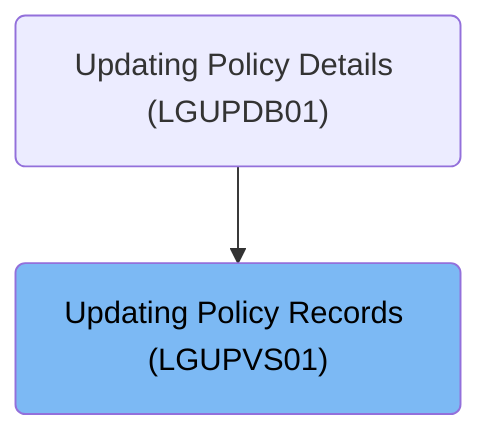
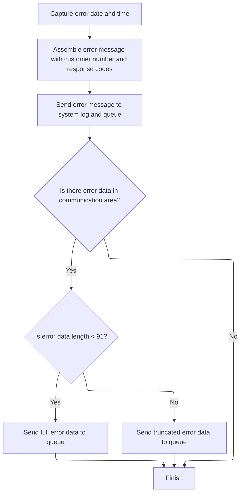
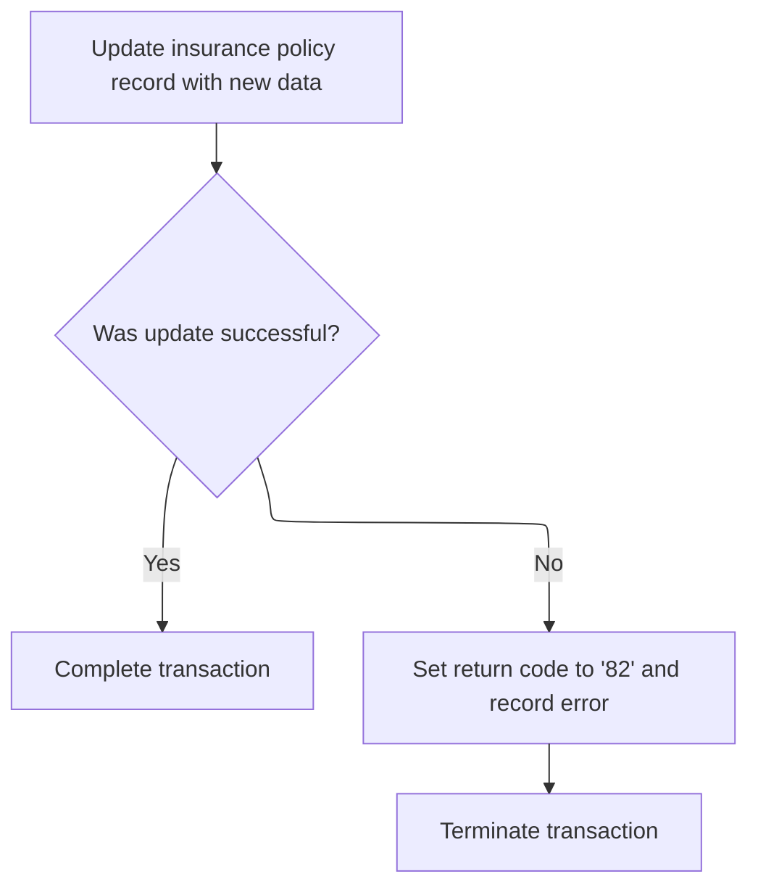

# Overview

This document describes the flow for updating insurance policy records. The system processes incoming requests, prepares and updates policy data, and ensures errors are logged and communicated for further action.

## Dependencies

### Programs

- <SwmToken path="base/src/lgupvs01.cbl" pos="11:6:6" line-data="       PROGRAM-ID. LGUPVS01.">`LGUPVS01`</SwmToken> (<SwmPath>[base/src/lgupvs01.cbl](base/src/lgupvs01.cbl)</SwmPath>)
- LGSTSQ (<SwmPath>[base/src/lgstsq.cbl](base/src/lgstsq.cbl)</SwmPath>)

### Copybook

- LGCMAREA (<SwmPath>[base/src/lgcmarea.cpy](base/src/lgcmarea.cpy)</SwmPath>)

# Where is this program used?

This program is used once, as represented in the following diagram:



## Detailed View of the Program's Functionality

# Preparing Policy Update and Type Selection

**Determining Policy Type and Setting Up Working Fields**

- The program begins by determining the type of insurance policy update requested. It does this by examining a specific character in the request identifier received from the caller.
- It then copies key pieces of information (request type, policy number, customer number) from the incoming communication area into a set of working fields designed to hold policy data for processing.

**Populating Policy Data Based on Type**

- The program uses a conditional structure to select the correct policy data structure based on the request type:
  - If the request is for a business policy, it extracts business-specific fields (postcode, status, customer name) and places them in the working area.
  - If the request is for an endowment policy, it extracts fields such as profit status, equities, managed fund, fund name, and life assured, and sets them up for processing.
  - If the request is for a home policy, it extracts property type, number of bedrooms, property value, postcode, and house name.
  - If the request is for a motor policy, it extracts vehicle make, model, value, and registration number.
  - If the request type is not recognized, it clears the policy data area to prevent processing of unknown or invalid data.

**Reading the Existing Policy Record**

- After preparing the working fields, the program attempts to read the existing policy record from a VSAM KSDS file using a composite key (customer number and policy number).
- The read operation is performed with update intent, meaning the record is locked for subsequent modification.

**Handling Read Errors**

- If the read operation fails (for example, if the record does not exist or there is a file error), the program:
  - Sets a specific return code to indicate a read failure.
  - Captures additional error information.
  - Calls a dedicated error logging routine to record the details.
  - Abends (terminates abnormally) the transaction with a specific code to signal the nature of the failure.

# Logging Errors and Queue Messaging

**Capturing Error Details and Formatting the Message**

- When an error occurs, the error logging routine is invoked.
- The routine first obtains the current system date and time, ensuring that every error message is timestamped.
- It then assembles an error message containing:
  - The date and time of the error.
  - The customer number involved in the transaction.
  - The response codes from the failed operation.

**Sending Error Messages to System Log and Queue**

- The error message is sent to a queue-handling program, which writes the message to both:
  - The system log (TDQ, typically for operator review).
  - A transient data queue (TSQ) for application-level error tracking.
- If there is additional data in the communication area (DFHCOMMAREA), the routine sends this context as a separate message, ensuring that up to 90 bytes of extra information are logged for diagnostic purposes.

**Queue Handling Logic**

- The queue-handling program determines whether it was called directly or via a CICS RECEIVE operation.
- It prepares the message, checks for a special prefix that may indicate a different queue routing, and adjusts the queue name accordingly.
- The message is then written to both the system log and the application queue.
- If the program was invoked via RECEIVE, it sends a short response back and frees up resources before returning.

# Rewriting Policy Record and Error Handling

**Updating the Policy Record**

- After successfully reading and preparing the policy data, the program attempts to rewrite the updated policy record back to the VSAM KSDS file.
- The rewrite operation uses the working fields populated earlier to update the record.

**Handling Rewrite Errors**

- If the rewrite operation fails (for example, due to a file error or record lock), the program:
  - Sets a specific return code to indicate a write failure.
  - Captures additional error information.
  - Calls the error logging routine to record the details.
  - Abends the transaction with a different code than for read failures, allowing for easier diagnosis of where the process failed.

**Transaction Completion**

- If both the read and rewrite operations succeed, the transaction completes normally, and control is returned to the caller or the next step in the application flow.

---

This detailed flow ensures that policy updates are handled according to type, errors are logged with full context, and all operations are tracked for audit and troubleshooting purposes. The separation of concerns between policy processing and error handling makes the code maintainable and extensible for future enhancements.

# Rule Definition

| Paragraph Name                                                                                                                                                                                                                                                                             | Rule ID | Category          | Description                                                                                                                                                                                                                                                                                                                                                                                            | Conditions                                                                                                                                                                                                                                                                                                                                                                                                                                                                         | Remarks                                                                                                                                                                                                                                                                                                                                                                                                                                                                                                                                                                                                                                                                                                                                                                                                                                                                        |
| ------------------------------------------------------------------------------------------------------------------------------------------------------------------------------------------------------------------------------------------------------------------------------------------ | ------- | ----------------- | ------------------------------------------------------------------------------------------------------------------------------------------------------------------------------------------------------------------------------------------------------------------------------------------------------------------------------------------------------------------------------------------------------ | ---------------------------------------------------------------------------------------------------------------------------------------------------------------------------------------------------------------------------------------------------------------------------------------------------------------------------------------------------------------------------------------------------------------------------------------------------------------------------------- | ------------------------------------------------------------------------------------------------------------------------------------------------------------------------------------------------------------------------------------------------------------------------------------------------------------------------------------------------------------------------------------------------------------------------------------------------------------------------------------------------------------------------------------------------------------------------------------------------------------------------------------------------------------------------------------------------------------------------------------------------------------------------------------------------------------------------------------------------------------------------------ |
| MAINLINE SECTION                                                                                                                                                                                                                                                                           | RL-001  | Conditional Logic | The system determines the policy type by inspecting the 4th character of the <SwmToken path="base/src/lgupvs01.cbl" pos="102:3:7" line-data="           Move CA-Request-ID(4:1) To WF-Request-ID">`CA-Request-ID`</SwmToken> field from the commarea.                                                                                                                                                  | <SwmToken path="base/src/lgupvs01.cbl" pos="102:3:7" line-data="           Move CA-Request-ID(4:1) To WF-Request-ID">`CA-Request-ID`</SwmToken> must be present and at least 4 characters long.                                                                                                                                                                                                                                                                                    | <SwmToken path="base/src/lgupvs01.cbl" pos="102:3:7" line-data="           Move CA-Request-ID(4:1) To WF-Request-ID">`CA-Request-ID`</SwmToken> is an alphanumeric string. The 4th character is used to select the policy type: 'C', 'E', 'H', 'M', or other.                                                                                                                                                                                                                                                                                                                                                                                                                                                                                                                                                                                                                  |
| MAINLINE SECTION                                                                                                                                                                                                                                                                           | RL-002  | Data Assignment   | The system populates the working policy data area with fields from the commarea, depending on the determined policy type.                                                                                                                                                                                                                                                                              | Policy type must be determined from <SwmToken path="base/src/lgupvs01.cbl" pos="102:3:7" line-data="           Move CA-Request-ID(4:1) To WF-Request-ID">`CA-Request-ID`</SwmToken>.                                                                                                                                                                                                                                                                                               | For 'C': postcode (8 bytes), status (4 digits), customer (31 bytes).                                                                                                                                                                                                                                                                                                                                                                                                                                                                                                                                                                                                                                                                                                                                                                                                           |
| For 'E': with-profits (1 byte), equities (1 byte), managed-fund (1 byte), fund-name (10 bytes), life-assured (30 bytes).                                                                                                                                                                   |         |                   |                                                                                                                                                                                                                                                                                                                                                                                                        |                                                                                                                                                                                                                                                                                                                                                                                                                                                                                    |                                                                                                                                                                                                                                                                                                                                                                                                                                                                                                                                                                                                                                                                                                                                                                                                                                                                                |
| For 'H': property-type (15 bytes), bedrooms (3 digits), value (8 digits), postcode (8 bytes), house-name (9 bytes).                                                                                                                                                                        |         |                   |                                                                                                                                                                                                                                                                                                                                                                                                        |                                                                                                                                                                                                                                                                                                                                                                                                                                                                                    |                                                                                                                                                                                                                                                                                                                                                                                                                                                                                                                                                                                                                                                                                                                                                                                                                                                                                |
| For 'M': make (15 bytes), model (15 bytes), value (6 digits), regnumber (7 bytes).                                                                                                                                                                                                         |         |                   |                                                                                                                                                                                                                                                                                                                                                                                                        |                                                                                                                                                                                                                                                                                                                                                                                                                                                                                    |                                                                                                                                                                                                                                                                                                                                                                                                                                                                                                                                                                                                                                                                                                                                                                                                                                                                                |
| For other: all fields set to spaces.                                                                                                                                                                                                                                                       |         |                   |                                                                                                                                                                                                                                                                                                                                                                                                        |                                                                                                                                                                                                                                                                                                                                                                                                                                                                                    |                                                                                                                                                                                                                                                                                                                                                                                                                                                                                                                                                                                                                                                                                                                                                                                                                                                                                |
| MAINLINE SECTION                                                                                                                                                                                                                                                                           | RL-003  | Computation       | The system constructs a 21-byte key for KSDS file operations using request ID, customer number, and policy number.                                                                                                                                                                                                                                                                                     | <SwmToken path="base/src/lgupvs01.cbl" pos="102:16:20" line-data="           Move CA-Request-ID(4:1) To WF-Request-ID">`WF-Request-ID`</SwmToken>, <SwmToken path="base/src/lgupvs01.cbl" pos="104:11:15" line-data="           Move CA-Customer-Num    To WF-Customer-Num">`WF-Customer-Num`</SwmToken>, and <SwmToken path="base/src/lgupvs01.cbl" pos="103:11:15" line-data="           Move CA-Policy-Num      To WF-Policy-Num">`WF-Policy-Num`</SwmToken> must be populated. | Key format: request ID (1 byte, alphanumeric), customer number (10 bytes, alphanumeric), policy number (10 bytes, alphanumeric). Total: 21 bytes, left-aligned, space-padded if necessary.                                                                                                                                                                                                                                                                                                                                                                                                                                                                                                                                                                                                                                                                                     |
| MAINLINE SECTION, <SwmToken path="base/src/lgupvs01.cbl" pos="150:3:7" line-data="             PERFORM WRITE-ERROR-MESSAGE">`WRITE-ERROR-MESSAGE`</SwmToken>                                                                                                                               | RL-004  | Conditional Logic | The system attempts to read the policy record from the KSDS file using the constructed key. If the read fails, it sets error codes, logs the error, and abends.                                                                                                                                                                                                                                        | KSDS key must be constructed. File read operation must be attempted.                                                                                                                                                                                                                                                                                                                                                                                                               | <SwmToken path="base/src/lgupvs01.cbl" pos="149:9:13" line-data="             MOVE &#39;81&#39; TO CA-RETURN-CODE">`CA-RETURN-CODE`</SwmToken> set to '81' on read failure. Abend code <SwmToken path="base/src/lgupvs01.cbl" pos="151:10:10" line-data="             EXEC CICS ABEND ABCODE(&#39;LGV3&#39;) NODUMP END-EXEC">`LGV3`</SwmToken>. Error message includes date (8 bytes), time (6 bytes), program name (<SwmToken path="base/src/lgupvs01.cbl" pos="11:6:6" line-data="       PROGRAM-ID. LGUPVS01.">`LGUPVS01`</SwmToken>, 9 bytes), policy number (10 bytes), customer number (10 bytes), operation ('<SwmToken path="base/src/lgupvs01.cbl" pos="72:5:7" line-data="                                        Value &#39; Re-write  KSDSPOLY &#39;.">`Re-write`</SwmToken>  KSDSPOLY', 20 bytes), response code (5 digits), secondary response code (5 digits). |
| MAINLINE SECTION, <SwmToken path="base/src/lgupvs01.cbl" pos="150:3:7" line-data="             PERFORM WRITE-ERROR-MESSAGE">`WRITE-ERROR-MESSAGE`</SwmToken>                                                                                                                               | RL-005  | Conditional Logic | After updating the policy record, the system attempts to rewrite it to the KSDS file. If the rewrite fails, it sets error codes, logs the error, and abends.                                                                                                                                                                                                                                           | Policy record must be updated. Rewrite operation must be attempted.                                                                                                                                                                                                                                                                                                                                                                                                                | <SwmToken path="base/src/lgupvs01.cbl" pos="149:9:13" line-data="             MOVE &#39;81&#39; TO CA-RETURN-CODE">`CA-RETURN-CODE`</SwmToken> set to '82' on rewrite failure. Abend code <SwmToken path="base/src/lgupvs01.cbl" pos="164:10:10" line-data="             EXEC CICS ABEND ABCODE(&#39;LGV4&#39;) NODUMP END-EXEC">`LGV4`</SwmToken>. Error message format same as for read failure.                                                                                                                                                                                                                                                                                                                                                                                                                                                                             |
| <SwmToken path="base/src/lgupvs01.cbl" pos="150:3:7" line-data="             PERFORM WRITE-ERROR-MESSAGE">`WRITE-ERROR-MESSAGE`</SwmToken> (<SwmToken path="base/src/lgupvs01.cbl" pos="11:6:6" line-data="       PROGRAM-ID. LGUPVS01.">`LGUPVS01`</SwmToken>), MAINLINE SECTION (LGSTSQ) | RL-006  | Data Assignment   | Error messages are formatted with date, time, program name, policy number, customer number, operation, response codes, and routed to both system log and error queue. If commarea has extra data, up to 90 bytes are sent to the error queue prefixed with 'COMMAREA='.                                                                                                                                | Error condition must be detected (read or rewrite failure).                                                                                                                                                                                                                                                                                                                                                                                                                        | Error message: date (8 bytes), time (6 bytes), program name (9 bytes), policy number (10 bytes), customer number (10 bytes), operation (20 bytes), response code (5 digits), secondary response code (5 digits). Commarea data: up to 90 bytes, prefixed with 'COMMAREA=' (9 bytes).                                                                                                                                                                                                                                                                                                                                                                                                                                                                                                                                                                                           |
| <SwmToken path="base/src/lgupvs01.cbl" pos="150:3:7" line-data="             PERFORM WRITE-ERROR-MESSAGE">`WRITE-ERROR-MESSAGE`</SwmToken> (<SwmToken path="base/src/lgupvs01.cbl" pos="11:6:6" line-data="       PROGRAM-ID. LGUPVS01.">`LGUPVS01`</SwmToken>), MAINLINE SECTION (LGSTSQ) | RL-007  | Conditional Logic | The system interfaces with LGSTSQ via CICS LINK, passing error or commarea data as a commarea. LGSTSQ writes the message to both the system log and the appropriate TSQ, using 'GENAERRS' by default or <SwmToken path="base/src/lgstsq.cbl" pos="6:19:19" line-data="      *  parm Q=nnnn is passed then Queue name GENAnnnn is used        *">`GENAnnnn`</SwmToken> if a 'Q=nnnn' prefix is present. | Error or commarea data must be available for routing.                                                                                                                                                                                                                                                                                                                                                                                                                              | Default TSQ name is 'GENAERRS'. If message starts with 'Q=', use <SwmToken path="base/src/lgstsq.cbl" pos="6:19:19" line-data="      *  parm Q=nnnn is passed then Queue name GENAnnnn is used        *">`GENAnnnn`</SwmToken> where nnnn is extracted from the message. System log queue is always 'CSMT'.                                                                                                                                                                                                                                                                                                                                                                                                                                                                                                                                                                    |
| MAINLINE SECTION (LGSTSQ)                                                                                                                                                                                                                                                                  | RL-008  | Conditional Logic | If LGSTSQ is invoked via CICS RECEIVE, it sends a short response and releases the keyboard.                                                                                                                                                                                                                                                                                                            | LGSTSQ must be invoked via CICS RECEIVE (no invoking program detected).                                                                                                                                                                                                                                                                                                                                                                                                            | Short response is 1 byte, sent with ERASE and FREEKB options.                                                                                                                                                                                                                                                                                                                                                                                                                                                                                                                                                                                                                                                                                                                                                                                                                  |

# User Stories

## User Story 1: Policy Data Preparation

---

### Story Description:

As an insurance system, I want to determine the policy type from the request and populate the working policy data area accordingly so that policy-specific information is correctly processed for subsequent operations.

---

### Business Rule Mapping:

| Rule ID | Paragraph Name   | Rule Description                                                                                                                                                                                                                                      |
| ------- | ---------------- | ----------------------------------------------------------------------------------------------------------------------------------------------------------------------------------------------------------------------------------------------------- |
| RL-001  | MAINLINE SECTION | The system determines the policy type by inspecting the 4th character of the <SwmToken path="base/src/lgupvs01.cbl" pos="102:3:7" line-data="           Move CA-Request-ID(4:1) To WF-Request-ID">`CA-Request-ID`</SwmToken> field from the commarea. |
| RL-002  | MAINLINE SECTION | The system populates the working policy data area with fields from the commarea, depending on the determined policy type.                                                                                                                             |

---

### Relevant Functionality:

- **MAINLINE SECTION**
  1. **RL-001:**
     - Extract the 4th character from the input request ID.
     - Use this character to select the policy type for subsequent processing.
  2. **RL-002:**
     - Based on policy type:
       - For 'C', move relevant commarea fields to commercial policy fields.
       - For 'E', move relevant commarea fields to endowment policy fields.
       - For 'H', move relevant commarea fields to home policy fields.
       - For 'M', move relevant commarea fields to motor policy fields.
       - For other, clear all policy data fields by setting to spaces.

## User Story 2: Policy Record Management and Error Handling

---

### Story Description:

As an insurance system, I want to construct a KSDS file key, read and update policy records, and handle errors by setting codes and logging failures so that policy data is reliably managed and failures are traceable.

---

### Business Rule Mapping:

| Rule ID | Paragraph Name                                                                                                                                               | Rule Description                                                                                                                                                |
| ------- | ------------------------------------------------------------------------------------------------------------------------------------------------------------ | --------------------------------------------------------------------------------------------------------------------------------------------------------------- |
| RL-003  | MAINLINE SECTION                                                                                                                                             | The system constructs a 21-byte key for KSDS file operations using request ID, customer number, and policy number.                                              |
| RL-004  | MAINLINE SECTION, <SwmToken path="base/src/lgupvs01.cbl" pos="150:3:7" line-data="             PERFORM WRITE-ERROR-MESSAGE">`WRITE-ERROR-MESSAGE`</SwmToken> | The system attempts to read the policy record from the KSDS file using the constructed key. If the read fails, it sets error codes, logs the error, and abends. |
| RL-005  | MAINLINE SECTION, <SwmToken path="base/src/lgupvs01.cbl" pos="150:3:7" line-data="             PERFORM WRITE-ERROR-MESSAGE">`WRITE-ERROR-MESSAGE`</SwmToken> | After updating the policy record, the system attempts to rewrite it to the KSDS file. If the rewrite fails, it sets error codes, logs the error, and abends.    |

---

### Relevant Functionality:

- **MAINLINE SECTION**
  1. **RL-003:**
     - Concatenate request ID, customer number, and policy number into a single 21-byte string.
     - Use this key for subsequent file read and rewrite operations.
  2. **RL-004:**
     - Attempt to read KSDS file with constructed key.
     - If read fails:
       - Set return code to '81'.
       - Set abend code to <SwmToken path="base/src/lgupvs01.cbl" pos="151:10:10" line-data="             EXEC CICS ABEND ABCODE(&#39;LGV3&#39;) NODUMP END-EXEC">`LGV3`</SwmToken>.
       - Capture system date and time.
       - Assemble error message with required fields.
       - Send error message to system log and error queue.
       - If commarea has extra data, send up to 90 bytes prefixed with 'COMMAREA=' to error queue.
       - Abend and return.
  3. **RL-005:**
     - Attempt to rewrite updated policy record to KSDS file.
     - If rewrite fails:
       - Set return code to '82'.
       - Set abend code to <SwmToken path="base/src/lgupvs01.cbl" pos="164:10:10" line-data="             EXEC CICS ABEND ABCODE(&#39;LGV4&#39;) NODUMP END-EXEC">`LGV4`</SwmToken>.
       - Log error as described for read failures.
       - Abend and return.

## User Story 3: Error Reporting and System Integration

---

### Story Description:

As an insurance system, I want to format error messages, route them to the system log and error queues, interface with LGSTSQ for logging and queueing, and provide appropriate responses when invoked via CICS RECEIVE so that errors and extra data are properly reported, integrated with system monitoring, and user sessions are efficiently managed.

---

### Business Rule Mapping:

| Rule ID | Paragraph Name                                                                                                                                                                                                                                                                             | Rule Description                                                                                                                                                                                                                                                                                                                                                                                       |
| ------- | ------------------------------------------------------------------------------------------------------------------------------------------------------------------------------------------------------------------------------------------------------------------------------------------ | ------------------------------------------------------------------------------------------------------------------------------------------------------------------------------------------------------------------------------------------------------------------------------------------------------------------------------------------------------------------------------------------------------ |
| RL-006  | <SwmToken path="base/src/lgupvs01.cbl" pos="150:3:7" line-data="             PERFORM WRITE-ERROR-MESSAGE">`WRITE-ERROR-MESSAGE`</SwmToken> (<SwmToken path="base/src/lgupvs01.cbl" pos="11:6:6" line-data="       PROGRAM-ID. LGUPVS01.">`LGUPVS01`</SwmToken>), MAINLINE SECTION (LGSTSQ) | Error messages are formatted with date, time, program name, policy number, customer number, operation, response codes, and routed to both system log and error queue. If commarea has extra data, up to 90 bytes are sent to the error queue prefixed with 'COMMAREA='.                                                                                                                                |
| RL-007  | <SwmToken path="base/src/lgupvs01.cbl" pos="150:3:7" line-data="             PERFORM WRITE-ERROR-MESSAGE">`WRITE-ERROR-MESSAGE`</SwmToken> (<SwmToken path="base/src/lgupvs01.cbl" pos="11:6:6" line-data="       PROGRAM-ID. LGUPVS01.">`LGUPVS01`</SwmToken>), MAINLINE SECTION (LGSTSQ) | The system interfaces with LGSTSQ via CICS LINK, passing error or commarea data as a commarea. LGSTSQ writes the message to both the system log and the appropriate TSQ, using 'GENAERRS' by default or <SwmToken path="base/src/lgstsq.cbl" pos="6:19:19" line-data="      *  parm Q=nnnn is passed then Queue name GENAnnnn is used        *">`GENAnnnn`</SwmToken> if a 'Q=nnnn' prefix is present. |
| RL-008  | MAINLINE SECTION (LGSTSQ)                                                                                                                                                                                                                                                                  | If LGSTSQ is invoked via CICS RECEIVE, it sends a short response and releases the keyboard.                                                                                                                                                                                                                                                                                                            |

---

### Relevant Functionality:

- <SwmToken path="base/src/lgupvs01.cbl" pos="150:3:7" line-data="             PERFORM WRITE-ERROR-MESSAGE">`WRITE-ERROR-MESSAGE`</SwmToken> **(**<SwmToken path="base/src/lgupvs01.cbl" pos="11:6:6" line-data="       PROGRAM-ID. LGUPVS01.">`LGUPVS01`</SwmToken>**)**
  1. **RL-006:**
     - On error, format error message with required fields.
     - Send error message to system log (TDQ 'CSMT') and error queue (TSQ 'GENAERRS').
     - If commarea has extra data, send up to 90 bytes prefixed with 'COMMAREA=' to error queue.
  2. **RL-007:**
     - Pass error or commarea message to LGSTSQ via CICS LINK.
     - LGSTSQ checks for 'Q=' prefix in message.
       - If present, extracts queue extension and uses <SwmToken path="base/src/lgstsq.cbl" pos="6:19:19" line-data="      *  parm Q=nnnn is passed then Queue name GENAnnnn is used        *">`GENAnnnn`</SwmToken>.
       - Otherwise, uses 'GENAERRS'.
     - Write message to system log (TDQ 'CSMT') and selected TSQ.
- **MAINLINE SECTION (LGSTSQ)**
  1. **RL-008:**
     - If no invoking program detected:
       - Receive data into buffer.
       - Write message to queues as usual.
       - Send 1-byte response with ERASE and FREEKB to release keyboard.

# Workflow

# Preparing Policy Update and Type Selection

This section determines the insurance policy type based on the request, sets up the working fields for that policy, and ensures the correct data is prepared for subsequent update operations. It also handles error conditions if the policy record cannot be read.

| Category        | Rule Name                    | Description                                                                                                                                                                                   |
| --------------- | ---------------------------- | --------------------------------------------------------------------------------------------------------------------------------------------------------------------------------------------- |
| Data validation | Policy type validation       | The policy type must be determined by the fourth character of the request ID. Only requests with types 'C', 'E', 'H', or 'M' are considered valid for policy updates.                         |
| Business logic  | Business policy preparation  | For a business policy update ('C'), the business policy fields (postcode, status, customer) must be extracted from the request and prepared for update.                                       |
| Business logic  | Endowment policy preparation | For an endowment policy update ('E'), the endowment policy fields (with-profits, equities, managed fund, fund name, life assured) must be extracted from the request and prepared for update. |
| Business logic  | Home policy preparation      | For a home policy update ('H'), the home policy fields (property type, bedrooms, value, postcode, house name) must be extracted from the request and prepared for update.                     |
| Business logic  | Motor policy preparation     | For a motor policy update ('M'), the motor policy fields (make, model, value, registration number) must be extracted from the request and prepared for update.                                |

<SwmSnippet path="/base/src/lgupvs01.cbl" line="97">

---

We start MAINLINE by figuring out the policy type using the 4th character of <SwmToken path="base/src/lgupvs01.cbl" pos="102:3:7" line-data="           Move CA-Request-ID(4:1) To WF-Request-ID">`CA-Request-ID`</SwmToken>, then set up the working fields in <SwmToken path="base/src/lgupvs01.cbl" pos="156:3:7" line-data="                     From(WF-Policy-Info)">`WF-Policy-Info`</SwmToken> for the right policy structure.

```cobol
       MAINLINE SECTION.
      *
      *---------------------------------------------------------------*
           Move EIBCALEN To WS-Commarea-Len.
      *---------------------------------------------------------------*
           Move CA-Request-ID(4:1) To WF-Request-ID
           Move CA-Policy-Num      To WF-Policy-Num
           Move CA-Customer-Num    To WF-Customer-Num
```

---

</SwmSnippet>

<SwmSnippet path="/base/src/lgupvs01.cbl" line="106">

---

If the request type is 'C', we grab the business policy data and prep it for the next steps.

```cobol
           Evaluate WF-Request-ID

             When 'C'
               Move CA-B-Postcode  To WF-B-Postcode
               Move CA-B-Status    To WF-B-Status
               Move CA-B-Customer  To WF-B-Customer
```

---

</SwmSnippet>

<SwmSnippet path="/base/src/lgupvs01.cbl" line="113">

---

For 'E' requests, we set up the endowment policy data for the next operations.

```cobol
             When 'E'
               Move CA-E-WITH-PROFITS To  WF-E-WITH-PROFITS
               Move CA-E-EQUITIES     To  WF-E-EQUITIES
               Move CA-E-MANAGED-FUND To  WF-E-MANAGED-FUND
               Move CA-E-FUND-NAME    To  WF-E-FUND-NAME
               Move CA-E-LIFE-ASSURED To  WF-E-LIFE-ASSURED
```

---

</SwmSnippet>

<SwmSnippet path="/base/src/lgupvs01.cbl" line="120">

---

For 'H' requests, we grab the home policy fields from the commarea and set them up in the working fields, keeping the flow focused on home policy data.

```cobol
             When 'H'
               Move CA-H-PROPERTY-TYPE To  WF-H-PROPERTY-TYPE
               Move CA-H-BEDROOMS      To  WF-H-BEDROOMS
               Move CA-H-VALUE         To  WF-H-VALUE
               Move CA-H-POSTCODE      To  WF-H-POSTCODE
               Move CA-H-HOUSE-NAME    To  WF-H-HOUSE-NAME
```

---

</SwmSnippet>

<SwmSnippet path="/base/src/lgupvs01.cbl" line="127">

---

For 'M' requests, we move the motor policy fields from the commarea into the working fields, prepping the motor policy data for the update.

```cobol
             When 'M'
               Move CA-M-MAKE          To  WF-M-MAKE
               Move CA-M-MODEL         To  WF-M-MODEL
               Move CA-M-VALUE         To  WF-M-VALUE
               Move CA-M-REGNUMBER     To  WF-M-REGNUMBER
```

---

</SwmSnippet>

<SwmSnippet path="/base/src/lgupvs01.cbl" line="133">

---

If the request type doesn't match any known policy type, we clear out the working policy data area by moving spaces, so nothing gets processed for unknown types.

```cobol
             When Other
               Move Spaces To WF-Policy-Data
           End-Evaluate
```

---

</SwmSnippet>

<SwmSnippet path="/base/src/lgupvs01.cbl" line="137">

---

After prepping the working fields, we read the policy record from the KSDS file using a 21-byte key. If the read works, we move on to updating; if not, we handle errors next.

```cobol
           Move CA-Policy-Num      To WF-Policy-Num
      *---------------------------------------------------------------*
           Exec CICS Read File('KSDSPOLY')
                     Into(WS-FileIn)
                     Length(WS-Commarea-Len)
                     Ridfld(WF-Policy-Key)
                     KeyLength(21)
                     RESP(WS-RESP)
                     Update
           End-Exec.
```

---

</SwmSnippet>

<SwmSnippet path="/base/src/lgupvs01.cbl" line="147">

---

If the read fails, we set a specific return code and abend code, then call <SwmToken path="base/src/lgupvs01.cbl" pos="150:3:7" line-data="             PERFORM WRITE-ERROR-MESSAGE">`WRITE-ERROR-MESSAGE`</SwmToken> to log the error before ending the transaction. This makes sure errors are tracked.

```cobol
           If WS-RESP Not = DFHRESP(NORMAL)
             Move EIBRESP2 To WS-RESP2
             MOVE '81' TO CA-RETURN-CODE
             PERFORM WRITE-ERROR-MESSAGE
             EXEC CICS ABEND ABCODE('LGV3') NODUMP END-EXEC
             EXEC CICS RETURN END-EXEC
           End-If.
```

---

</SwmSnippet>

## Logging Errors and Queue Messaging



This section ensures that all errors are logged with sufficient context for troubleshooting and auditing, and that relevant error data is reliably sent to both system logs and queues for downstream processing.

| Category        | Rule Name                       | Description                                                                                                                                                                                                                 |
| --------------- | ------------------------------- | --------------------------------------------------------------------------------------------------------------------------------------------------------------------------------------------------------------------------- |
| Data validation | Limit on additional error data  | If additional error data is present in the communication area, it must be included in the error message sent to the queue, up to a maximum of 90 bytes. If the data exceeds 90 bytes, only the first 90 bytes are included. |
| Business logic  | Comprehensive error context     | Every error message must include the current date and time, customer number, policy number, and response codes to ensure traceability and context for each error event.                                                     |
| Business logic  | Dual destination logging        | All error messages must be sent to both the system log and a designated queue to ensure redundancy and availability for downstream processes or audits.                                                                     |
| Business logic  | Queue routing by prefix         | If the error message contains a routing prefix (e.g., 'Q='), the message must be routed to the appropriate queue as indicated by the prefix.                                                                                |
| Business logic  | Standard error message fallback | If no additional error data is present in the communication area, only the standard error message is logged and sent to the queue.                                                                                          |

<SwmSnippet path="/base/src/lgupvs01.cbl" line="174">

---

In <SwmToken path="base/src/lgupvs01.cbl" pos="174:1:5" line-data="       WRITE-ERROR-MESSAGE.">`WRITE-ERROR-MESSAGE`</SwmToken>, we grab the current system time and format it for the error message, so every log entry has a timestamp.

```cobol
       WRITE-ERROR-MESSAGE.
           EXEC CICS ASKTIME ABSTIME(WS-ABSTIME)
           END-EXEC
           EXEC CICS FORMATTIME ABSTIME(WS-ABSTIME)
                     MMDDYYYY(WS-DATE)
                     TIME(WS-TIME)
           END-EXEC
```

---

</SwmSnippet>

<SwmSnippet path="/base/src/lgupvs01.cbl" line="182">

---

We fill out the error message fields and link to LGSTSQ to write the error to the queue. If there's extra data in DFHCOMMAREA, we link again with that data for more context.

```cobol
           MOVE WS-DATE TO EM-DATE
           MOVE WS-TIME TO EM-TIME
           Move CA-Customer-Num To EM-Cusnum
           Move WS-RESP         To EM-RespRC
           Move WS-RESP2        To EM-Resp2RC
           EXEC CICS LINK PROGRAM('LGSTSQ')
                     COMMAREA(ERROR-MSG)
                     LENGTH(LENGTH OF ERROR-MSG)
           END-EXEC.
```

---

</SwmSnippet>

<SwmSnippet path="/base/src/lgstsq.cbl" line="55">

---

LGSTSQ sets up the message, figures out if it's from a calling program or CICS receive, adjusts the message and length, checks for a 'Q=' prefix to handle routing, and writes to both TD and TS queues. If it's a receive, it sends a short response and frees up storage.

```cobol
       MAINLINE SECTION.

           MOVE SPACES TO WRITE-MSG.
           MOVE SPACES TO WS-RECV.

           EXEC CICS ASSIGN SYSID(WRITE-MSG-SYSID)
                RESP(WS-RESP)
           END-EXEC.

           EXEC CICS ASSIGN INVOKINGPROG(WS-INVOKEPROG)
                RESP(WS-RESP)
           END-EXEC.
           
           IF WS-INVOKEPROG NOT = SPACES
              MOVE 'C' To WS-FLAG
              MOVE COMMA-DATA  TO WRITE-MSG-MSG
              MOVE EIBCALEN    TO WS-RECV-LEN
           ELSE
              EXEC CICS RECEIVE INTO(WS-RECV)
                  LENGTH(WS-RECV-LEN)
                  RESP(WS-RESP)
              END-EXEC
              MOVE 'R' To WS-FLAG
              MOVE WS-RECV-DATA  TO WRITE-MSG-MSG
              SUBTRACT 5 FROM WS-RECV-LEN
           END-IF.

           MOVE 'GENAERRS' TO STSQ-NAME.
           IF WRITE-MSG-MSG(1:2) = 'Q=' THEN
              MOVE WRITE-MSG-MSG(3:4) TO STSQ-EXT
              MOVE WRITE-MSG-REST TO TEMPO
              MOVE TEMPO          TO WRITE-MSG-MSG
              SUBTRACT 7 FROM WS-RECV-LEN
           END-IF.

           ADD 5 TO WS-RECV-LEN.

      * Write output message to TDQ CSMT
      *
           EXEC CICS WRITEQ TD QUEUE(STDQ-NAME)
                     FROM(WRITE-MSG)
                     RESP(WS-RESP)
                     LENGTH(WS-RECV-LEN)

           END-EXEC.

      * Write output message to Genapp TSQ
      * If no space is available then the task will not wait for
      *  storage to become available but will ignore the request...
      *
           EXEC CICS WRITEQ TS QUEUE(STSQ-NAME)
                     FROM(WRITE-MSG)
                     RESP(WS-RESP)
                     NOSUSPEND
                     LENGTH(WS-RECV-LEN)

           END-EXEC.

           If WS-FLAG = 'R' Then
             EXEC CICS SEND TEXT FROM(FILLER-X)
              WAIT
              ERASE
              LENGTH(1)
              FREEKB
             END-EXEC.

           EXEC CICS RETURN
           END-EXEC.
```

---

</SwmSnippet>

<SwmSnippet path="/base/src/lgupvs01.cbl" line="191">

---

After returning from LGSTSQ, <SwmToken path="base/src/lgupvs01.cbl" pos="150:3:7" line-data="             PERFORM WRITE-ERROR-MESSAGE">`WRITE-ERROR-MESSAGE`</SwmToken> checks if there's extra data in DFHCOMMAREA and links to LGSTSQ again, but only up to 90 bytes to avoid overflow. This makes sure all relevant context is logged without breaking things.

```cobol
           IF EIBCALEN > 0 THEN
             IF EIBCALEN < 91 THEN
               MOVE DFHCOMMAREA(1:EIBCALEN) TO CA-DATA
               EXEC CICS LINK PROGRAM('LGSTSQ')
                         COMMAREA(CA-ERROR-MSG)
                         LENGTH(Length Of CA-ERROR-MSG)
               END-EXEC
             ELSE
               MOVE DFHCOMMAREA(1:90) TO CA-DATA
               EXEC CICS LINK PROGRAM('LGSTSQ')
                         COMMAREA(CA-ERROR-MSG)
                         LENGTH(Length Of CA-ERROR-MSG)
               END-EXEC
             END-IF
           END-IF.
           EXIT.
```

---

</SwmSnippet>

## Rewriting Policy Record and Error Handling



<SwmSnippet path="/base/src/lgupvs01.cbl" line="155">

---

Back in MAINLINE after error logging, we try to rewrite the updated policy record to the KSDS file. If this fails, we handle it just like the read error—log it and abend.

```cobol
           Exec CICS ReWrite File('KSDSPOLY')
                     From(WF-Policy-Info)
                     Length(WS-Commarea-LenF)
                     RESP(WS-RESP)
           End-Exec.
```

---

</SwmSnippet>

<SwmSnippet path="/base/src/lgupvs01.cbl" line="160">

---

If the rewrite fails, MAINLINE sets a specific error code, logs the error, and abends with a different code than for read failures, so you can tell where things broke.

```cobol
           If WS-RESP Not = DFHRESP(NORMAL)
             Move EIBRESP2 To WS-RESP2
             MOVE '82' TO CA-RETURN-CODE
             PERFORM WRITE-ERROR-MESSAGE
             EXEC CICS ABEND ABCODE('LGV4') NODUMP END-EXEC
             EXEC CICS RETURN END-EXEC
           End-If.
```

---

</SwmSnippet>

&nbsp;

*This is an auto-generated document by Swimm 🌊 and has not yet been verified by a human*

<SwmMeta version="3.0.0" repo-id="Z2l0aHViJTNBJTNBY2ljcy1nZW5hcHAtZGVtbyUzQSUzQXN3aW1taW8=" repo-name="cics-genapp-demo"><sup>Powered by [Swimm](https://app.swimm.io/)</sup></SwmMeta>
