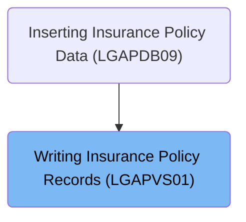
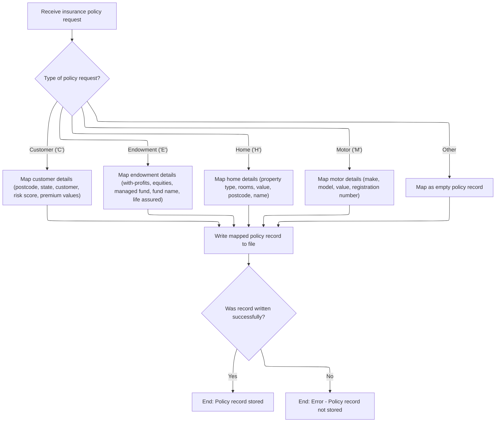
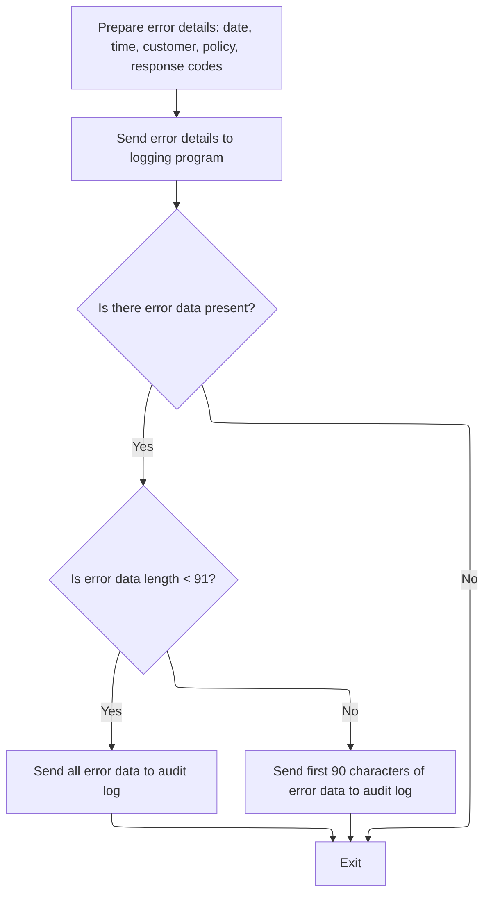

# Overview

This document describes the flow for packaging and storing insurance policy requests. The process identifies the policy type, maps incoming data, and ensures reliable storage. In case of errors, detailed information is logged and routed for audit and troubleshooting.

## Dependencies

### Programs

- <SwmToken path="base/src/lgapvs01.cbl" pos="2:6:6" line-data="       PROGRAM-ID. LGAPVS01.">`LGAPVS01`</SwmToken> (<SwmPath>[base/src/lgapvs01.cbl](base/src/lgapvs01.cbl)</SwmPath>)
- LGSTSQ (<SwmPath>[base/src/lgstsq.cbl](base/src/lgstsq.cbl)</SwmPath>)

### Copybook

- LGCMAREA (<SwmPath>[base/src/lgcmarea.cpy](base/src/lgcmarea.cpy)</SwmPath>)

# Where is this program used?

This program is used once, as represented in the following diagram:



## Detailed View of the Program's Functionality

# Packaging and Routing Incoming Policy Data

## Entry and Initial Extraction

When the program begins processing a new insurance policy request, it first determines the length of the incoming transaction data. It then extracts the type of policy request by reading a specific character from the request identifier. Additionally, it retrieves the policy number and customer number from the incoming data. This setup is crucial for routing the request to the appropriate handling logic based on the type of policy.

## Policy Type Evaluation and Data Mapping

The program evaluates the type of policy request and, depending on the type, maps the relevant incoming fields into a structured record for storage:

- **Customer Policy ('C')**: The program collects customer-specific details such as postcode, state, customer name, risk score, and several premium values. These are packed into the record in fixed positions.
- **Endowment Policy ('E')**: For endowment requests, it gathers fields related to investment options (with-profits, equities, managed fund), the fund name, and the name of the life assured.
- **Home Policy ('H')**: Home policy requests result in mapping property type, number of rooms, property value, postcode, and the property owner's name.
- **Motor Policy ('M')**: Motor policy requests are mapped to include vehicle make, model, value, and registration number.
- **Other/Unknown Policy Types**: If the request type does not match any of the above, the data section of the record is cleared, ensuring no residual or invalid data is stored.

## Writing the Policy Record

Once the record is populated according to the policy type, the program attempts to write this record to a designated file (VSAM file named 'KSDSPOLY'). The write operation uses fixed lengths for both the record and the key, and the outcome of the write is captured for error handling.

## Error Handling on Write Failure

If the write operation fails (i.e., the response code indicates an error), the program captures additional error information, sets a return code to indicate failure, and invokes a dedicated error handling routine. This routine logs the error details and ensures that the error is communicated to a central service before terminating the transaction.

# Logging and Routing Error Details

## Preparing Error Details

When an error occurs, the program first obtains the current system date and time, formatting these values for inclusion in the error log. It then prepares a structured error message containing the date, time, customer number, policy number, and the response codes from the failed operation.

## Sending Error Details to Logging Program

The error message is sent to a logging program via a program link. This logging program is responsible for routing the error details to appropriate queues for audit and monitoring.

## Handling Additional Error Data

After the initial error message is sent, the program checks if there is extra data present in the communication area (commarea). If such data exists, it is also sent to the logging program. If the extra data is less than a certain length, the entire data is sent; otherwise, only the first portion is sent to avoid exceeding message size limits.

# Logging Program (LGSTSQ) Flow

## Message Preparation

The logging program begins by clearing its working storage for the message and any received data. It determines the system identifier and the name of the invoking program. If the program was invoked directly, it sets a flag and copies the incoming error message into the message buffer, adjusting the message length accordingly. If the program was invoked via a receive command, it receives the data, sets a different flag, and adjusts the message length to exclude the transaction identifier.

## Queue Name Handling

By default, the logging program uses a standard queue name for error messages. However, if the message starts with a specific prefix (indicating a custom queue), it extracts the custom queue name and adjusts the message and its length to remove the prefix.

## Writing to Queues

The prepared message is then written to two different queues:

- **Transient Data Queue (TDQ)**: The message is written to a queue used for system monitoring and audit (named 'CSMT').
- **Temporary Storage Queue (TSQ)**: The message is also written to a queue for application-level error tracking. If there is no space available, the program does not wait and simply ignores the request.

## Sending Control Message on Receive

If the logging program was invoked via a receive command, it sends a minimal control message back to the terminal, ensuring the user interface is updated and the keyboard is freed.

## Program Termination

After all logging actions are complete, the logging program returns control to the caller, ending its execution.

# Summary

- The main program receives and routes incoming policy data based on type, maps relevant fields, and writes the record to a file.
- If the write fails, it prepares a detailed error message and sends it to a logging program.
- The logging program routes error messages to system and application queues, handling custom queue names if specified, and ensures all error data is logged for audit and monitoring purposes.

# Rule Definition

| Paragraph Name                                                                                                                                                                                                                                       | Rule ID | Category          | Description                                                                                                                                                                                                                            | Conditions                                                                             | Remarks                                                                                                                                                                                                                                                                                |
| ---------------------------------------------------------------------------------------------------------------------------------------------------------------------------------------------------------------------------------------------------- | ------- | ----------------- | -------------------------------------------------------------------------------------------------------------------------------------------------------------------------------------------------------------------------------------- | -------------------------------------------------------------------------------------- | -------------------------------------------------------------------------------------------------------------------------------------------------------------------------------------------------------------------------------------------------------------------------------------- |
| <SwmToken path="base/src/lgapvs01.cbl" pos="90:1:3" line-data="       P100-ENTRY SECTION.">`P100-ENTRY`</SwmToken> SECTION                                                                                                                           | RL-001  | Conditional Logic | The system must extract the policy type from the 4th character of the incoming request ID and route the request for further processing based on this type.                                                                             | A request is received in the commarea; the 4th character of the request ID is present. | Policy type is a single alphanumeric character. Valid types are 'C', 'E', 'H', 'M'.                                                                                                                                                                                                    |
| <SwmToken path="base/src/lgapvs01.cbl" pos="90:1:3" line-data="       P100-ENTRY SECTION.">`P100-ENTRY`</SwmToken> SECTION                                                                                                                           | RL-002  | Data Assignment   | For policy type 'C', map postcode, state, customer name, risk score, and four premium values into the output record's data section.                                                                                                    | Policy type is 'C'.                                                                    | Output record data section for 'C': postcode (8 bytes, alphanumeric), state (4 bytes, numeric), customer name (31 bytes, alphanumeric), risk score (3 bytes, numeric), premium values (4 fields, each 8 bytes, numeric).                                                               |
| <SwmToken path="base/src/lgapvs01.cbl" pos="90:1:3" line-data="       P100-ENTRY SECTION.">`P100-ENTRY`</SwmToken> SECTION                                                                                                                           | RL-003  | Data Assignment   | For policy type 'E', map with-profits option, equities option, managed fund option, fund name, and life assured into the output record's data section.                                                                                 | Policy type is 'E'.                                                                    | Output record data section for 'E': with-profits option (1 byte, alphanumeric), equities option (1 byte, alphanumeric), managed fund option (1 byte, alphanumeric), fund name (10 bytes, alphanumeric), life assured (30 bytes, alphanumeric).                                         |
| <SwmToken path="base/src/lgapvs01.cbl" pos="90:1:3" line-data="       P100-ENTRY SECTION.">`P100-ENTRY`</SwmToken> SECTION                                                                                                                           | RL-004  | Data Assignment   | For policy type 'H', map property type, number of rooms, property value, postcode, and name into the output record's data section.                                                                                                     | Policy type is 'H'.                                                                    | Output record data section for 'H': property type (15 bytes, alphanumeric), number of rooms (3 bytes, numeric), property value (8 bytes, numeric), postcode (8 bytes, alphanumeric), name (9 bytes, alphanumeric).                                                                     |
| <SwmToken path="base/src/lgapvs01.cbl" pos="90:1:3" line-data="       P100-ENTRY SECTION.">`P100-ENTRY`</SwmToken> SECTION                                                                                                                           | RL-005  | Data Assignment   | For policy type 'M', map make, model, value, and registration number into the output record's data section.                                                                                                                            | Policy type is 'M'.                                                                    | Output record data section for 'M': make (15 bytes, alphanumeric), model (15 bytes, alphanumeric), value (6 bytes, numeric), registration number (7 bytes, alphanumeric).                                                                                                              |
| <SwmToken path="base/src/lgapvs01.cbl" pos="90:1:3" line-data="       P100-ENTRY SECTION.">`P100-ENTRY`</SwmToken> SECTION                                                                                                                           | RL-006  | Data Assignment   | For any policy type other than 'C', 'E', 'H', or 'M', create an output record with the data section filled with spaces.                                                                                                                | Policy type is not 'C', 'E', 'H', or 'M'.                                              | Output record data section: 83 bytes, all spaces.                                                                                                                                                                                                                                      |
| <SwmToken path="base/src/lgapvs01.cbl" pos="90:1:3" line-data="       P100-ENTRY SECTION.">`P100-ENTRY`</SwmToken> SECTION                                                                                                                           | RL-007  | Data Assignment   | Construct an output record of 104 bytes, with the first 21 bytes as the key (1 byte policy type, 10 bytes customer number, 10 bytes policy number) and the remaining 83 bytes as the data section mapped according to the policy type. | Any policy type.                                                                       | Output record: 104 bytes total. Key: 1 byte policy type, 10 bytes customer number, 10 bytes policy number. Data section: 83 bytes, format depends on policy type.                                                                                                                      |
| <SwmToken path="base/src/lgapvs01.cbl" pos="90:1:3" line-data="       P100-ENTRY SECTION.">`P100-ENTRY`</SwmToken> SECTION                                                                                                                           | RL-008  | Computation       | Write the constructed output record to the KSDSPOLY VSAM file using the key and record format specified.                                                                                                                               | Output record is constructed.                                                          | File name: KSDSPOLY. Record length: 104 bytes. Key length: 21 bytes.                                                                                                                                                                                                                   |
| <SwmToken path="base/src/lgapvs01.cbl" pos="90:1:3" line-data="       P100-ENTRY SECTION.">`P100-ENTRY`</SwmToken> SECTION                                                                                                                           | RL-009  | Conditional Logic | If the file write is successful, indicate successful storage of the policy record.                                                                                                                                                     | File write response code indicates success.                                            | Success is determined by response code DFHRESP(NORMAL).                                                                                                                                                                                                                                |
| <SwmToken path="base/src/lgapvs01.cbl" pos="90:1:3" line-data="       P100-ENTRY SECTION.">`P100-ENTRY`</SwmToken> SECTION, <SwmToken path="base/src/lgapvs01.cbl" pos="146:3:5" line-data="             PERFORM P999-ERROR">`P999-ERROR`</SwmToken> | RL-010  | Conditional Logic | If the file write fails, set the return code to '80' and prepare an error message containing the date, time, program name, policy number, customer number, file name, and response codes.                                              | File write response code indicates failure.                                            | Return code: '80'. Error message format: date (8 bytes), time (6 bytes), program name (9 bytes), policy number (10 bytes), customer number (10 bytes), file name (20 bytes), response codes (5 bytes each).                                                                            |
| <SwmToken path="base/src/lgapvs01.cbl" pos="146:3:5" line-data="             PERFORM P999-ERROR">`P999-ERROR`</SwmToken>                                                                                                                             | RL-011  | Computation       | Send the prepared error message to the logging/audit system, which writes the message to both a transient data queue and a temporary storage queue.                                                                                    | Error message is prepared.                                                             | Error message is sent via commarea to LGSTSQ, which writes to TDQ 'CSMT' and TSQ 'GENAERRS' (or <SwmToken path="base/src/lgstsq.cbl" pos="6:19:19" line-data="      *  parm Q=nnnn is passed then Queue name GENAnnnn is used        *">`GENAnnnn`</SwmToken> if Q=nnnn is specified). |
| <SwmToken path="base/src/lgapvs01.cbl" pos="146:3:5" line-data="             PERFORM P999-ERROR">`P999-ERROR`</SwmToken>                                                                                                                             | RL-012  | Conditional Logic | If additional error data is present in the commarea, send up to 90 bytes of this data to the logging/audit system.                                                                                                                     | EIBCALEN > 0                                                                           | Additional error data: up to 90 bytes. If length < 91, send all data; if length >= 91, send first 90 bytes.                                                                                                                                                                            |
| MAINLINE SECTION                                                                                                                                                                                                                                     | RL-013  | Computation       | The logging/audit system must write the error message to both a transient data queue and a temporary storage queue.                                                                                                                    | Error message received in commarea.                                                    | TDQ name: 'CSMT'. TSQ name: 'GENAERRS' (default) or <SwmToken path="base/src/lgstsq.cbl" pos="6:19:19" line-data="      *  parm Q=nnnn is passed then Queue name GENAnnnn is used        *">`GENAnnnn`</SwmToken> if Q=nnnn is specified. Message length determined by received data.  |
| MAINLINE SECTION                                                                                                                                                                                                                                     | RL-014  | Conditional Logic | If the error message begins with 'Q=', the logging system uses the specified queue name extension for the TSQ instead of the default.                                                                                                  | Error message starts with 'Q='.                                                        | TSQ name: 'GENA' + extension from message.                                                                                                                                                                                                                                             |
| MAINLINE SECTION                                                                                                                                                                                                                                     | RL-015  | Conditional Logic | If error data length is less than 91, send all data; otherwise, send only the first 90 bytes.                                                                                                                                          | Error data present in commarea.                                                        | Error data: up to 90 bytes sent.                                                                                                                                                                                                                                                       |

# User Stories

## User Story 1: Process and route insurance policy requests

---

### Story Description:

As an insurance system, I want to receive and route insurance policy requests based on the policy type so that each request is processed and mapped correctly according to its type.

---

### Business Rule Mapping:

| Rule ID | Paragraph Name                                                                                                             | Rule Description                                                                                                                                                                                                                       |
| ------- | -------------------------------------------------------------------------------------------------------------------------- | -------------------------------------------------------------------------------------------------------------------------------------------------------------------------------------------------------------------------------------- |
| RL-001  | <SwmToken path="base/src/lgapvs01.cbl" pos="90:1:3" line-data="       P100-ENTRY SECTION.">`P100-ENTRY`</SwmToken> SECTION | The system must extract the policy type from the 4th character of the incoming request ID and route the request for further processing based on this type.                                                                             |
| RL-002  | <SwmToken path="base/src/lgapvs01.cbl" pos="90:1:3" line-data="       P100-ENTRY SECTION.">`P100-ENTRY`</SwmToken> SECTION | For policy type 'C', map postcode, state, customer name, risk score, and four premium values into the output record's data section.                                                                                                    |
| RL-003  | <SwmToken path="base/src/lgapvs01.cbl" pos="90:1:3" line-data="       P100-ENTRY SECTION.">`P100-ENTRY`</SwmToken> SECTION | For policy type 'E', map with-profits option, equities option, managed fund option, fund name, and life assured into the output record's data section.                                                                                 |
| RL-004  | <SwmToken path="base/src/lgapvs01.cbl" pos="90:1:3" line-data="       P100-ENTRY SECTION.">`P100-ENTRY`</SwmToken> SECTION | For policy type 'H', map property type, number of rooms, property value, postcode, and name into the output record's data section.                                                                                                     |
| RL-005  | <SwmToken path="base/src/lgapvs01.cbl" pos="90:1:3" line-data="       P100-ENTRY SECTION.">`P100-ENTRY`</SwmToken> SECTION | For policy type 'M', map make, model, value, and registration number into the output record's data section.                                                                                                                            |
| RL-006  | <SwmToken path="base/src/lgapvs01.cbl" pos="90:1:3" line-data="       P100-ENTRY SECTION.">`P100-ENTRY`</SwmToken> SECTION | For any policy type other than 'C', 'E', 'H', or 'M', create an output record with the data section filled with spaces.                                                                                                                |
| RL-007  | <SwmToken path="base/src/lgapvs01.cbl" pos="90:1:3" line-data="       P100-ENTRY SECTION.">`P100-ENTRY`</SwmToken> SECTION | Construct an output record of 104 bytes, with the first 21 bytes as the key (1 byte policy type, 10 bytes customer number, 10 bytes policy number) and the remaining 83 bytes as the data section mapped according to the policy type. |

---

### Relevant Functionality:

- <SwmToken path="base/src/lgapvs01.cbl" pos="90:1:3" line-data="       P100-ENTRY SECTION.">`P100-ENTRY`</SwmToken> **SECTION**
  1. **RL-001:**
     - Extract the 4th character from the request ID.
     - Use a conditional statement to determine the policy type.
     - Route processing logic according to the extracted type.
  2. **RL-002:**
     - If policy type is 'C':
       - Assign postcode to output record (8 bytes).
       - Assign state to output record (4 bytes).
       - Assign customer name to output record (31 bytes).
       - Assign risk score to output record (3 bytes).
       - Assign each premium value to output record (4 fields, 8 bytes each).
  3. **RL-003:**
     - If policy type is 'E':
       - Assign with-profits option to output record (1 byte).
       - Assign equities option to output record (1 byte).
       - Assign managed fund option to output record (1 byte).
       - Assign fund name to output record (10 bytes).
       - Assign life assured to output record (30 bytes).
  4. **RL-004:**
     - If policy type is 'H':
       - Assign property type to output record (15 bytes).
       - Assign number of rooms to output record (3 bytes).
       - Assign property value to output record (8 bytes).
       - Assign postcode to output record (8 bytes).
       - Assign name to output record (9 bytes).
  5. **RL-005:**
     - If policy type is 'M':
       - Assign make to output record (15 bytes).
       - Assign model to output record (15 bytes).
       - Assign value to output record (6 bytes).
       - Assign registration number to output record (7 bytes).
  6. **RL-006:**
     - If policy type is not recognized:
       - Fill the output record's data section (83 bytes) with spaces.
  7. **RL-007:**
     - Build output record:
       - Set first byte to policy type.
       - Set next 10 bytes to customer number.
       - Set next 10 bytes to policy number.
       - Set remaining 83 bytes according to policy type mapping.

## User Story 2: Store policy records in VSAM file

---

### Story Description:

As an insurance system, I want to store constructed policy records in the KSDSPOLY VSAM file and indicate successful storage so that policy data is reliably persisted.

---

### Business Rule Mapping:

| Rule ID | Paragraph Name                                                                                                             | Rule Description                                                                                         |
| ------- | -------------------------------------------------------------------------------------------------------------------------- | -------------------------------------------------------------------------------------------------------- |
| RL-008  | <SwmToken path="base/src/lgapvs01.cbl" pos="90:1:3" line-data="       P100-ENTRY SECTION.">`P100-ENTRY`</SwmToken> SECTION | Write the constructed output record to the KSDSPOLY VSAM file using the key and record format specified. |
| RL-009  | <SwmToken path="base/src/lgapvs01.cbl" pos="90:1:3" line-data="       P100-ENTRY SECTION.">`P100-ENTRY`</SwmToken> SECTION | If the file write is successful, indicate successful storage of the policy record.                       |

---

### Relevant Functionality:

- <SwmToken path="base/src/lgapvs01.cbl" pos="90:1:3" line-data="       P100-ENTRY SECTION.">`P100-ENTRY`</SwmToken> **SECTION**
  1. **RL-008:**
     - Write output record to VSAM file:
       - Use key (21 bytes) and record (104 bytes).
       - Check response code for success or failure.
  2. **RL-009:**
     - If file write response code is normal:
       - Indicate success (no error handling required).

## User Story 3: Handle errors and log audit messages

---

### Story Description:

As an insurance system, I want to handle file write errors by preparing detailed error messages and sending them to the logging/audit system, including any additional error data, so that failures are tracked and auditable.

---

### Business Rule Mapping:

| Rule ID | Paragraph Name                                                                                                                                                                                                                                       | Rule Description                                                                                                                                                                          |
| ------- | ---------------------------------------------------------------------------------------------------------------------------------------------------------------------------------------------------------------------------------------------------- | ----------------------------------------------------------------------------------------------------------------------------------------------------------------------------------------- |
| RL-011  | <SwmToken path="base/src/lgapvs01.cbl" pos="146:3:5" line-data="             PERFORM P999-ERROR">`P999-ERROR`</SwmToken>                                                                                                                             | Send the prepared error message to the logging/audit system, which writes the message to both a transient data queue and a temporary storage queue.                                       |
| RL-012  | <SwmToken path="base/src/lgapvs01.cbl" pos="146:3:5" line-data="             PERFORM P999-ERROR">`P999-ERROR`</SwmToken>                                                                                                                             | If additional error data is present in the commarea, send up to 90 bytes of this data to the logging/audit system.                                                                        |
| RL-010  | <SwmToken path="base/src/lgapvs01.cbl" pos="90:1:3" line-data="       P100-ENTRY SECTION.">`P100-ENTRY`</SwmToken> SECTION, <SwmToken path="base/src/lgapvs01.cbl" pos="146:3:5" line-data="             PERFORM P999-ERROR">`P999-ERROR`</SwmToken> | If the file write fails, set the return code to '80' and prepare an error message containing the date, time, program name, policy number, customer number, file name, and response codes. |
| RL-013  | MAINLINE SECTION                                                                                                                                                                                                                                     | The logging/audit system must write the error message to both a transient data queue and a temporary storage queue.                                                                       |
| RL-014  | MAINLINE SECTION                                                                                                                                                                                                                                     | If the error message begins with 'Q=', the logging system uses the specified queue name extension for the TSQ instead of the default.                                                     |
| RL-015  | MAINLINE SECTION                                                                                                                                                                                                                                     | If error data length is less than 91, send all data; otherwise, send only the first 90 bytes.                                                                                             |

---

### Relevant Functionality:

- <SwmToken path="base/src/lgapvs01.cbl" pos="146:3:5" line-data="             PERFORM P999-ERROR">`P999-ERROR`</SwmToken>
  1. **RL-011:**
     - Link to LGSTSQ with error message in commarea.
     - LGSTSQ writes message to TDQ and TSQ.
  2. **RL-012:**
     - If additional error data is present:
       - If length < 91, send all data.
       - Else, send first 90 bytes.
       - Link to LGSTSQ with error data in commarea.
- <SwmToken path="base/src/lgapvs01.cbl" pos="90:1:3" line-data="       P100-ENTRY SECTION.">`P100-ENTRY`</SwmToken> **SECTION**
  1. **RL-010:**
     - If file write response code is not normal:
       - Set return code to '80'.
       - Prepare error message with required fields.
       - Pass error message to error logging system.
- **MAINLINE SECTION**
  1. **RL-013:**
     - Write error message to TDQ 'CSMT'.
     - Write error message to TSQ 'GENAERRS' or <SwmToken path="base/src/lgstsq.cbl" pos="6:19:19" line-data="      *  parm Q=nnnn is passed then Queue name GENAnnnn is used        *">`GENAnnnn`</SwmToken>.
  2. **RL-014:**
     - If message starts with 'Q=':
       - Extract extension.
       - Use 'GENA' + extension as TSQ name.
  3. **RL-015:**
     - If error data length < 91:
       - Send all data.
     - Else:
       - Send first 90 bytes.

# Workflow

# Packaging and Routing Incoming Policy Data



This section is responsible for packaging incoming insurance policy data based on the type of policy request and routing the mapped data to the appropriate storage. It ensures that each policy type is handled according to its business requirements and that errors in storing the data are properly managed.

| Category        | Rule Name                  | Description                                                                                                                                                                                                                                                                                              |
| --------------- | -------------------------- | -------------------------------------------------------------------------------------------------------------------------------------------------------------------------------------------------------------------------------------------------------------------------------------------------------- |
| Data validation | Policy type identification | The type of policy request must be determined using the 4th character of the <SwmToken path="base/src/lgapvs01.cbl" pos="95:3:7" line-data="           Move CA-Request-ID(4:1) To V2-REQ">`CA-Request-ID`</SwmToken> field. Only the values 'C', 'E', 'H', and 'M' are recognized as valid policy types. |
| Business logic  | Customer policy mapping    | For Customer ('C') policy requests, the policy record must include postcode, state, customer name, risk score, and four premium values as defined by the business data model.                                                                                                                            |
| Business logic  | Endowment policy mapping   | For Endowment ('E') policy requests, the policy record must include with-profits indicator, equities indicator, managed fund indicator, fund name, and life assured name.                                                                                                                                |
| Business logic  | Home policy mapping        | For Home ('H') policy requests, the policy record must include property type, number of rooms, property value, postcode, and property name.                                                                                                                                                              |
| Business logic  | Motor policy mapping       | For Motor ('M') policy requests, the policy record must include vehicle make, model, value, and registration number.                                                                                                                                                                                     |

<SwmSnippet path="/base/src/lgapvs01.cbl" line="90">

---

In <SwmToken path="base/src/lgapvs01.cbl" pos="90:1:3" line-data="       P100-ENTRY SECTION.">`P100-ENTRY`</SwmToken>, we start by grabbing the transaction length and extracting the request type from the 4th character of <SwmToken path="base/src/lgapvs01.cbl" pos="95:3:7" line-data="           Move CA-Request-ID(4:1) To V2-REQ">`CA-Request-ID`</SwmToken>. This sets up the routing logic for the rest of the flow, but it relies on a fixed input format that isn't enforced here.

```cobol
       P100-ENTRY SECTION.
      *
      *---------------------------------------------------------------*
           Move EIBCALEN To V1-COMM.
      *---------------------------------------------------------------*
           Move CA-Request-ID(4:1) To V2-REQ
           Move CA-Policy-Num      To V2-POL
           Move CA-Customer-Num    To V2-CUST
```

---

</SwmSnippet>

<SwmSnippet path="/base/src/lgapvs01.cbl" line="99">

---

Here the code branches on the request type ('C') and packs customer and risk data into the record. This is the first case in the packaging logic, and the mapping is fixed to the request type.

```cobol
           Evaluate V2-REQ

             When 'C'
               Move CA-B-PST     To V2-C-PCD
               Move CA-B-ST       To V2-C-Z9
               Move CA-B-Customer     To V2-C-CUST
               Move WS-RISK-SCORE     To V2-C-VAL
               Move CA-B-CA-B-FPR  To V2-C-P1VAL
               Move CA-B-CPR To V2-C-P2VAL
               Move CA-B-FLPR To V2-C-P3VAL
               Move CA-B-WPR To V2-C-P4VAL
```

---

</SwmSnippet>

<SwmSnippet path="/base/src/lgapvs01.cbl" line="111">

---

Next up, for 'E' requests, the code packs endowment-related fields into the record. This continues the branching logic for different request types.

```cobol
             When 'E'
               Move CA-E-W-PRO        To  V2-E-OPT1
               Move CA-E-EQU          To  V2-E-OPT2
               Move CA-E-M-FUN        To  V2-E-OPT3
               Move CA-E-FUND-NAME    To  V2-E-NAME
               Move CA-E-LIFE-ASSURED To  V2-E-LIFE
```

---

</SwmSnippet>

<SwmSnippet path="/base/src/lgapvs01.cbl" line="118">

---

For 'H' requests, home policy fields are packed into the record. This keeps the branching logic consistent for each request type.

```cobol
             When 'H'
               Move CA-H-P-TYP         To  V2-H-TYPE
               Move CA-H-BED           To  V2-H-ROOMS
               Move CA-H-VAL           To  V2-H-COST
               Move CA-H-PCD           To  V2-H-PCD
               Move CA-H-H-NAM         To  V2-H-NAME
```

---

</SwmSnippet>

<SwmSnippet path="/base/src/lgapvs01.cbl" line="125">

---

For 'M' requests, motor policy fields are packed into the record. This is the last case in the request type branching before the default.

```cobol
             When 'M'
               Move CA-M-MAKE          To  V2-M-MAKE
               Move CA-M-MODEL         To  V2-M-MODEL
               Move CA-M-VALUE         To  V2-M-COST
               Move CA-M-REGNUMBER     To  V2-M-NUM
```

---

</SwmSnippet>

<SwmSnippet path="/base/src/lgapvs01.cbl" line="131">

---

If the request type doesn't match any known case, the code clears the data section. This acts as a fallback for unexpected input.

```cobol
             When Other
               Move Spaces To V2-DATA
           End-Evaluate
```

---

</SwmSnippet>

<SwmSnippet path="/base/src/lgapvs01.cbl" line="136">

---

Here the packed record is written to the VSAM file 'KSDSPOLY' using fixed lengths. This is where the data actually gets stored, and any write errors trigger error handling next.

```cobol
           Exec CICS Write File('KSDSPOLY')
                     From(V2-RECORD)
                     Length(104)
                     Ridfld(V2-KEY)
                     KeyLength(21)
                     RESP(V1-RCD1)
           End-Exec.
```

---

</SwmSnippet>

<SwmSnippet path="/base/src/lgapvs01.cbl" line="143">

---

If the file write fails, we set the return code and call <SwmToken path="base/src/lgapvs01.cbl" pos="146:3:5" line-data="             PERFORM P999-ERROR">`P999-ERROR`</SwmToken> to log the error details and send them to the central service before returning.

```cobol
           If V1-RCD1 Not = DFHRESP(NORMAL)
             Move EIBRESP2 To V1-RCD2
             MOVE '80' TO CA-RETURN-CODE
             PERFORM P999-ERROR
             EXEC CICS RETURN END-EXEC
           End-If.
```

---

</SwmSnippet>

# Logging and Routing Error Details



This section ensures that all relevant error details are captured and logged for audit and troubleshooting purposes, and that error messages are routed to the appropriate destinations for further processing or review.

| Category        | Rule Name                          | Description                                                                                                                    |
| --------------- | ---------------------------------- | ------------------------------------------------------------------------------------------------------------------------------ |
| Data validation | Limit logged error data length     | If the additional error data exceeds 90 characters, only the first 90 characters are included in the log.                      |
| Data validation | No extra data exit                 | If no additional error data is present, the process completes without logging extra data.                                      |
| Business logic  | Comprehensive error detail logging | All error logs must include the date, time, customer number, policy number, and both primary and secondary response codes.     |
| Business logic  | Log additional error data          | If additional error data is present, it must be logged as part of the error record.                                            |
| Business logic  | Dual error message routing         | All error messages must be routed to both the audit log (TDQ) and the transaction queue (TSQ) for redundancy and traceability. |

<SwmSnippet path="/base/src/lgapvs01.cbl" line="156">

---

In <SwmToken path="base/src/lgapvs01.cbl" pos="156:1:3" line-data="       P999-ERROR.">`P999-ERROR`</SwmToken>, we grab the current system time and format it for logging. This sets up the timestamp for the error message.

```cobol
       P999-ERROR.
           EXEC CICS ASKTIME ABSTIME(V3-TIME)
           END-EXEC
           EXEC CICS FORMATTIME ABSTIME(V3-TIME)
                     MMDDYYYY(V3-DATE1)
                     TIME(V3-DATE2)
           END-EXEC
```

---

</SwmSnippet>

<SwmSnippet path="/base/src/lgapvs01.cbl" line="164">

---

After prepping the error message with all the relevant fields, we call LGSTSQ to route and log the error details to the appropriate queues.

```cobol
           MOVE V3-DATE1 TO EM-DATE
           MOVE V3-DATE2 TO EM-TIME
           Move CA-Customer-Num To EM-Cusnum
           Move CA-Policy-Num   To EM-POLNUM 
           Move V1-RCD1         To EM-RespRC
           Move V1-RCD2         To EM-Resp2RC
           EXEC CICS LINK PROGRAM('LGSTSQ')
                     COMMAREA(ERROR-MSG)
                     LENGTH(LENGTH OF ERROR-MSG)
           END-EXEC.
```

---

</SwmSnippet>

<SwmSnippet path="/base/src/lgstsq.cbl" line="55">

---

<SwmToken path="base/src/lgstsq.cbl" pos="55:1:1" line-data="       MAINLINE SECTION.">`MAINLINE`</SwmToken> in LGSTSQ checks if the message comes from an invoking program or a receive command, adjusts the message and length based on content (including handling 'Q=' prefixes), then writes the message to both TDQ and TSQ queues. If the message was received, it sends a control message back. This covers both logging and routing for error and transaction data.

```cobol
       MAINLINE SECTION.

           MOVE SPACES TO WRITE-MSG.
           MOVE SPACES TO WS-RECV.

           EXEC CICS ASSIGN SYSID(WRITE-MSG-SYSID)
                RESP(WS-RESP)
           END-EXEC.

           EXEC CICS ASSIGN INVOKINGPROG(WS-INVOKEPROG)
                RESP(WS-RESP)
           END-EXEC.
           
           IF WS-INVOKEPROG NOT = SPACES
              MOVE 'C' To WS-FLAG
              MOVE COMMA-DATA  TO WRITE-MSG-MSG
              MOVE EIBCALEN    TO WS-RECV-LEN
           ELSE
              EXEC CICS RECEIVE INTO(WS-RECV)
                  LENGTH(WS-RECV-LEN)
                  RESP(WS-RESP)
              END-EXEC
              MOVE 'R' To WS-FLAG
              MOVE WS-RECV-DATA  TO WRITE-MSG-MSG
              SUBTRACT 5 FROM WS-RECV-LEN
           END-IF.

           MOVE 'GENAERRS' TO STSQ-NAME.
           IF WRITE-MSG-MSG(1:2) = 'Q=' THEN
              MOVE WRITE-MSG-MSG(3:4) TO STSQ-EXT
              MOVE WRITE-MSG-REST TO TEMPO
              MOVE TEMPO          TO WRITE-MSG-MSG
              SUBTRACT 7 FROM WS-RECV-LEN
           END-IF.

           ADD 5 TO WS-RECV-LEN.

      * Write output message to TDQ CSMT
      *
           EXEC CICS WRITEQ TD QUEUE(STDQ-NAME)
                     FROM(WRITE-MSG)
                     RESP(WS-RESP)
                     LENGTH(WS-RECV-LEN)

           END-EXEC.

      * Write output message to Genapp TSQ
      * If no space is available then the task will not wait for
      *  storage to become available but will ignore the request...
      *
           EXEC CICS WRITEQ TS QUEUE(STSQ-NAME)
                     FROM(WRITE-MSG)
                     RESP(WS-RESP)
                     NOSUSPEND
                     LENGTH(WS-RECV-LEN)

           END-EXEC.

           If WS-FLAG = 'R' Then
             EXEC CICS SEND TEXT FROM(FILLER-X)
              WAIT
              ERASE
              LENGTH(1)
              FREEKB
             END-EXEC.

           EXEC CICS RETURN
           END-EXEC.
```

---

</SwmSnippet>

<SwmSnippet path="/base/src/lgapvs01.cbl" line="174">

---

After returning from LGSTSQ, <SwmToken path="base/src/lgapvs01.cbl" pos="146:3:5" line-data="             PERFORM P999-ERROR">`P999-ERROR`</SwmToken> checks for extra data in the commarea and logs it by linking to LGSTSQ again, making sure all error info gets routed.

```cobol
           IF EIBCALEN > 0 THEN
             IF EIBCALEN < 91 THEN
               MOVE DFHCOMMAREA(1:EIBCALEN) TO CA-DATA
               EXEC CICS LINK PROGRAM('LGSTSQ')
                         COMMAREA(CA-ERROR-MSG)
                         LENGTH(Length Of CA-ERROR-MSG)
               END-EXEC
             ELSE
               MOVE DFHCOMMAREA(1:90) TO CA-DATA
               EXEC CICS LINK PROGRAM('LGSTSQ')
                         COMMAREA(CA-ERROR-MSG)
                         LENGTH(Length Of CA-ERROR-MSG)
               END-EXEC
             END-IF
           END-IF.
           EXIT.
```

---

</SwmSnippet>

&nbsp;

*This is an auto-generated document by Swimm 🌊 and has not yet been verified by a human*

<SwmMeta version="3.0.0" repo-id="Z2l0aHViJTNBJTNBY2ljcy1nZW5hcHAtZGVtbyUzQSUzQXN3aW1taW8=" repo-name="cics-genapp-demo"><sup>Powered by [Swimm](https://app.swimm.io/)</sup></SwmMeta>
